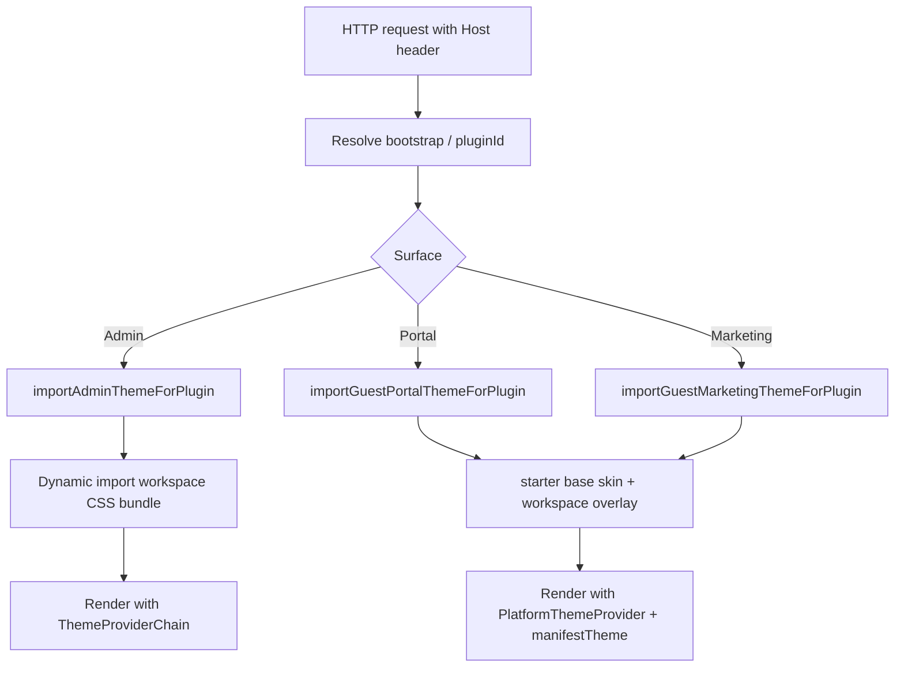

# Architecture Feasibility Report: Unified DTCG Pipeline from `workspace.manifest.json`

**Date:** 2026-07-07  
**Author:** Senior Platform Architect (audit)  
**Scope:** Evaluate whether theme tokens from a single `workspace.manifest.json` can control appearance across Admin, User Portal, and Public Marketing surfaces.

---

## Executive Summary

| Question | Verdict |
| -------- | ------- |
| Can `themeJson` from manifest inject at **build-time** (CSS variables) for all three apps? | **Partially** — DTCG already generates CSS at `@app-tour/design-tokens` build time, but that pipeline reads `packages/design-tokens/dtcg/workspaces/*.tokens.json`, **not** `workspace.manifest.json`. |
| Can `themeJson` inject at **runtime** (JSON → inline CSS vars) for all three apps? | **Partially** — Portal and Marketing wire `resolveWorkspaceManifestThemeForPlugin` → `PlatformThemeProvider`. Admin (`apps/web`) does **not** wire manifest theme at all. |
| Do all three apps share the same `workspace-sdk` version? | **Yes** — all declare `"@app-tour/workspace-sdk": "workspace:*"` (monorepo `0.1.0`). No semver drift. |
| Can a **single** manifest control all three surfaces today? | **No** — three parallel theme authorities, per-surface skin CSS, and Admin-specific tenant API overrides block unification. |

**Bottom line:** A unified DTCG pipeline is **architecturally feasible** but **not implemented**. The repo already has most primitives (manifest schema, runtime registry, DTCG generators, generated theme loaders, `PlatformThemeProvider`). The gap is **authority consolidation**: manifest `theme`, DTCG JSON slices, and per-surface CSS skins are three separate inputs that can drift.

---

## 1. App Surface Mapping

The evaluation request names `apps/web`, `apps/public`, and `apps/admin`. The monorepo uses different canonical names:

| Requested name | Canonical app | Package | Port | `data-app-surface` |
| -------------- | ------------- | ------- | ---- | ------------------ |
| **Admin** | `apps/web` | `@apps/web` | 3000 | `admin` |
| **User Portal** | `apps/portal` | `@apps/portal` | 3003 | `portal` |
| **Public** | `apps/marketing` | `@apps/marketing` | 3002 | `marketing` |

`apps/public` and `apps/admin` **do not exist** as directories. All findings below reference the canonical paths.

---

## 2. Current Build Pipeline Audit

### 2.1 Shared trunk

All three apps are **Next.js 15** shells with identical high-level build shape:

```text
predev/prebuild guards → next dev/build → transpilePackages (design-tokens, theme-react, workspace-sdk, workspace-*)
```

| Step | Admin (`apps/web`) | Portal (`apps/portal`) | Marketing (`apps/marketing`) |
| ---- | ------------------ | ---------------------- | ---------------------------- |
| **Prebuild** | `run-prebuild-guards.mjs` (draft-engine build + import-boundary + UI boundary + wizard-input guard) | `guard:import-boundary` + portal profile boundary + architecture-truth | `guard:import-boundary` only |
| **Next config** | Webpack `IgnorePlugin` for workspace plugins on client; `allowedDevOrigins` for `admin.localhost` | `allowedDevOrigins` for portal hosts | `images.remotePatterns` for catalog |
| **transpilePackages** | design-tokens, theme-react, workspace-sdk, platform-core, draft-engine, workspace-starter/denali/urban | design-tokens, theme-react, workspace-sdk, workspace-plugin-host, catalog-* , all workspaces | design-tokens, theme-react, workspace-sdk, all workspaces |
| **Root `pnpm build`** | **Not included** in root build script | Included | Included |
| **Instrumentation** | None | `ensureWorkspaceRegistryLoaded()` | `ensureWorkspaceRegistryLoaded()` |

**Implication:** Admin has the heaviest prebuild chain but is excluded from the monorepo root `build` script. Portal/Marketing preload the workspace registry at process start; Admin does not.

### 2.2 CSS bootstrap chain (build-time, static)

Each app's `globals.css` imports a surface-specific bootstrap from `@app-tour/design-tokens`:

| App | Bootstrap import |
| --- | ---------------- |
| Admin | `admin-bootstrap.css` |
| Portal | `portal-bootstrap.css` |
| Marketing | `marketing-bootstrap.css` |

These bootstraps compose L0 platform tokens (`primitives.css`, `semantics.css`, `themes/light.css`, `themes/dark.css`), L1b `shell-bridge.css` (`@theme inline`), and L2 structural shell CSS. They are **built** when `pnpm --filter @app-tour/design-tokens build` runs — not when individual apps build.

DTCG source files live under `packages/design-tokens/dtcg/`:

```text
dtcg/platform.*.tokens.json          → platform CSS (primitives, semantics, light/dark)
dtcg/workspaces/<id>.*.tokens.json   → workspace theme/tokens.css, *-semantic-tokens.css
```

**Critical:** App `next build` does **not** re-run DTCG generation. Apps consume pre-built `design-tokens/dist/*.css`. Stale token output is caught by `guard-dtcg-css-sync`, not by app prebuild.

### 2.3 Workspace skin ingress (request-time, dynamic)

Codegen from `workspace.manifest.json` emits per-app theme loaders:

| Manifest key | Generated consumer | App |
| ------------ | ------------------ | --- |
| `themeStylesheets` | `workspace-theme-stylesheets.generated.ts` → `importAdminThemeForPlugin` | `apps/web` |
| `guestThemeStylesheets.portal` | `workspace-guest-theme-stylesheets.generated.ts` → `importGuestPortalThemeForPlugin` | `apps/portal` |
| `guestThemeStylesheets.marketing` | `workspace-guest-theme-stylesheets.generated.ts` → `importGuestMarketingThemeForPlugin` | `apps/marketing` |

Regenerate: `pnpm run generate:workspace-registry`

**Per-request flow (all apps, `force-dynamic` layouts):**



**Import budget (Phase I1):**

| Surface | Max dynamic CSS imports/request |
| ------- | ------------------------------- |
| Admin | 1 |
| Portal | 2 (starter base + workspace overlay) |
| Marketing | 2 (starter base + workspace overlay) |

---

## 3. Theme Token Injection: Build-Time vs Runtime

### 3.1 Three parallel authorities (today)

| Authority | Location | Consumption | Surfaces |
| --------- | -------- | ----------- | -------- |
| **A. DTCG JSON** | `packages/design-tokens/dtcg/workspaces/<id>.*.tokens.json` | Build → `@generated` CSS files | All (via bootstrap + skin `@import` chains) |
| **B. Manifest `theme` block** | `workspace.manifest.json` → `"theme": { "--ws-color-primary": "#…" }` | Runtime → `PlatformThemeProvider` inline `style` | Portal, Marketing only (Admin: **unwired**) |
| **C. Manifest stylesheet paths** | `themeStylesheets`, `guestThemeStylesheets` | Runtime → dynamic `import()` of workspace CSS | All three |

Only **Denali** currently declares a manifest `theme` block. Urban, starter, and guest-club rely on authorities A and C only.

### 3.2 Build-time injection (CSS variables)

**Feasible mechanism:** DTCG → generated CSS with `--color-*`, `--ws-*`, shadcn flat aliases.

**Current state:**

- Platform and workspace color **values** are authored in DTCG JSON, not in manifest.
- Per-surface semantics are split across multiple DTCG slices per workspace:
  - `<id>.tokens.json` → `theme/tokens.css`
  - `<id>.admin.tokens.json` → `theme/admin-semantic-tokens.css`
  - `<id>.portal.tokens.json` → `theme/portal-semantic-tokens.css`
  - `<id>.marketing.tokens.json` → `theme/marketing/semantic-tokens.css`
- Hand-authored skin files (`denali-admin.css`, `urban-portal.css`, etc.) are **layout hooks** that `@import` generated semantic CSS.

**Build-time from manifest alone:** Not implemented. No script reads `workspace.manifest.json` → `theme` and emits DTCG or CSS.

### 3.3 Runtime injection (JSON config)

**Feasible mechanism:** `resolveWorkspaceManifestThemeForPlugin(pluginId)` → `readWorkspaceManifestTheme(manifest)` → `mapThemeToCssVariables` → React inline `style` on `PlatformThemeProvider` root.

| App | Registry loaded? | `manifestTheme` passed? | Additional runtime theme |
| --- | ---------------- | ----------------------- | ------------------------ |
| **Portal** | Yes (`ensureWorkspaceRegistryLoaded` in layout + instrumentation) | Yes → `PortalProviders` | None (guest surfaces skip tenant theme) |
| **Marketing** | Yes | Yes → `MarketingProviders` | Public branding from API (`fetchPublicTenantBrandingForHost`) — display name only, not CSS tokens |
| **Admin** | **No** | **No** | `fetchTenantThemeForContext` → API `/api/v2/tenant-config` → `TenantThemeProvider`; `WorkspaceThemeProvider` from plugin contract |

Admin `AppProviders` uses `ThemeProviderChain` without `manifestTheme`:

```tsx
// apps/web/src/providers/app-providers.tsx — manifest theme not wired
<ThemeProviderChain
  mode="light"
  tenantTheme={bootstrap.tenantTheme ?? {}}
  plugin={resolved.plugin}
  workspaceTheme={resolved.plugin.theme}
  ...
/>
```

Portal/Marketing use the documented pattern from `docs/dev/workspace-registry-runtime.mdoc`:

```tsx
const manifestTheme = resolveWorkspaceManifestThemeForPlugin(bootstrap.pluginId);
<PlatformThemeProvider mode="light" manifestTheme={manifestTheme} />
```

### 3.4 Denali duplication example

Denali declares the same brand colors in **two places**:

1. **Manifest `theme` block** (`packages/workspaces/denali/workspace.manifest.json`) — 17 `--ws-*` / sidebar / radius keys for runtime inline injection.
2. **DTCG admin slice** (`packages/design-tokens/dtcg/workspaces/denali.admin.tokens.json`) — full semantic palette with references, dark blocks, sidebar tokens.

These can drift. The manifest block is a **subset** of what DTCG generates; layout-only tokens (gradients, grid rules, animations) exist only in hook CSS (`admin-skin.css`, etc.) and cannot be expressed in a flat `theme` map (see `MIGRATION_RISK_ASSESSMENT.md`).

---

## 4. Dependency Analysis: `workspace-sdk` and Theme Stack

### 4.1 `workspace-sdk` version alignment

| Package | `@app-tour/workspace-sdk` | `@app-tour/theme-react` | `@app-tour/design-tokens` |
| ------- | ------------------------- | ----------------------- | ------------------------- |
| `@apps/web` | `workspace:*` | `workspace:*` | `workspace:*` |
| `@apps/portal` | `workspace:*` | `workspace:*` | `workspace:*` |
| `@apps/marketing` | `workspace:*` | `workspace:*` | `workspace:*` |

All resolve to monorepo version `0.1.0`. **No semver conflict.** Synchronization is guaranteed by pnpm workspace protocol as long as packages are built from the same commit.

### 4.2 Dependency shape differences (integration risk)

| Dependency | Admin | Portal | Marketing |
| ---------- | ----- | ------ | --------- |
| `@app-tour/platform-core` | Yes | No | No |
| `@app-tour/workspace-plugin-host` | No | Yes | No |
| `@app-tour/guest-surface-host` | Yes | Yes | Yes |
| `@app-tour/workspace-denali` | devDep | dep | dep |
| `@app-tour/workspace-urban` | devDep | dep | dep |
| `@app-tour/workspace-guest-club` | devDep | dep | dep |
| `@app-tour/workspace-starter` | dep (runtime) | dep | dep |

**Risk:** Admin keeps workspace packages in **devDependencies** and uses webpack `IgnorePlugin` to strip them from the client bundle unless `ALLOW_DENALI_WEB_PLUGIN=true`. Portal/Marketing bundle all workspace skins for dynamic import. Theme CSS paths must stay consistent across these linking strategies — today they do via shared generated loaders, but Admin's registry gap means manifest `theme` resolution is inconsistent.

### 4.3 How to synchronize theme tokens across apps

| Strategy | When to use | Status |
| -------- | ----------- | ------ |
| **Monorepo `workspace:*`** | SDK/API contract sync | ✅ Active |
| **`pnpm run generate:workspace-registry`** | Stylesheet paths, bindings | ✅ Active |
| **`pnpm --filter @app-tour/design-tokens build`** | DTCG → CSS | ✅ Active; not wired to app prebuild |
| **Single manifest `theme` → all surfaces** | Unified appearance | ❌ Not built |
| **Manifest → DTCG codegen** | Eliminate dual authority | ❌ Proposed only |

Recommended sync path for a unified pipeline:

1. Author token values once in manifest (or a manifest-merged DTCG fragment).
2. Codegen emits both DTCG slices and `theme` block validation.
3. All three layouts call `ensureWorkspaceRegistryLoaded()` + pass `manifestTheme`.
4. Admin adopts `manifestTheme` in `ThemeProviderChain` below tenant override layer.

---

## 5. Architectural Bottlenecks

### B1 — Dual (triple) authority: manifest vs DTCG vs CSS skins

`platform-architecture-v2.md` states the **target**: one configuration authority (`workspace.manifest.json`), one visual value authority (DTCG). Today:

- Configuration paths (`themeStylesheets`, `guestThemeStylesheets`) are manifest-driven ✅
- Color values are DTCG-driven ✅
- Runtime `theme` block is manifest-driven but **disconnected from DTCG** ❌

A single manifest cannot control colors until manifest `theme` either **generates** DTCG slices or **replaces** them with a codegen step.

### B2 — Per-surface skin fragmentation

Each workspace maintains up to **three** skin entry files:

| Workspace | Admin | Portal | Marketing |
| --------- | ----- | ------ | --------- |
| Denali | `denali-admin.css` | `denali-portal.css` | `denali-marketing.css` |
| Urban | `tokens.css` | `urban-portal.css` | `urban-marketing.css` |
| Guest-club | `tokens.css` | `guest-club-portal.css` | `marketing/marketing.css` |

Manifest keys differ by surface (`themeStylesheets` vs `guestThemeStylesheets.{portal,marketing}`). A flat `themeJson` in manifest does not encode surface-specific cascade without either:

- separate keys per surface (`theme.admin`, `theme.portal`, `theme.marketing`), or
- DTCG slice generation per surface (current implicit model).

### B3 — Admin manifest theme gap

`apps/web` never calls `resolveWorkspaceManifestThemeForPlugin`. Denali's manifest `theme` block has **no effect** on Admin despite being the most complete manifest theme declaration in the repo. Admin appearance flows through:

1. Static bootstrap CSS (build-time)
2. Dynamic `importAdminThemeForPlugin` (request-time CSS)
3. `TenantThemeProvider` (API runtime override)
4. `WorkspaceThemeProvider` (plugin contract)

This is the largest cross-surface inconsistency.

### B4 — Layout hooks are not tokenizable

`MIGRATION_RISK_ASSESSMENT.md` documents Denali admin dependencies on:

- Linear gradients and `color-mix()` in `admin-skin.css`
- `[data-denali-dashboard-*]` layout grids
- Animations in `animations.css`

Manifest `theme` supports max **64** string key/value CSS custom properties. It cannot represent selectors, media queries, or keyframes. A unified pipeline must treat **values** (manifest/DTCG) and **structure** (skin hooks) as separate layers — not collapse them into one JSON blob.

### B5 — Registry bootstrap asymmetry

| App | `ensureWorkspaceRegistryLoaded` | Discoverer |
| --- | ------------------------------- | ---------- |
| Portal | Layout + instrumentation | Node FS (`node-manifest-discoverer`) |
| Marketing | Instrumentation only | Node FS |
| Admin | **Never** | N/A |

Without registry load, Admin cannot resolve manifest `theme` at runtime even if wired.

### B6 — Tenant override layer (Admin only)

P6 architecture locks **tenant runtime rebranding** to Admin via `TenantThemeProvider` (API `/api/v2/tenant-config`). Guest surfaces intentionally skip L2 tenant theme. A unified manifest pipeline must define precedence:

```text
Platform L0 → Workspace L3 skin CSS → Manifest theme (inline) → Tenant override (admin only)
```

`ThemeProviderChain` already merges `manifestTheme`, `themeJson`, `themeJsonOverride` in `PlatformThemeProvider`, but Admin does not pass manifest layer today.

### B7 — Build pipeline ordering

App builds do not depend on `design-tokens build` or `generate:workspace-registry` in prebuild (except Admin's draft-engine build). Fresh checkouts can serve stale CSS or stale generated loaders until root build scripts run. This is operational debt, not a hard blocker, but it affects "single manifest → three apps" DX.

### B8 — `theme` schema limits

`ManifestThemeBlockSchema` (`packages/workspace-sdk/src/manifest.schema.ts`):

- Max 64 variables
- String values only (no DTCG references like `{color.primary}`)
- Keys normalized via `normalizeThemeCssKey` to `--*` form

Full DTCG semantics (references, multi-block scopes, dark variants) exceed this schema. Unified pipeline needs either expanded manifest schema or manifest-as-pointer to DTCG files.

---

## 6. Feasibility Matrix

| Capability | Admin | Portal | Marketing | Blocker |
| ---------- | ----- | ------ | --------- | ------- |
| DTCG build-time CSS vars | ✅ | ✅ | ✅ | None — operational ordering only |
| Manifest `theme` runtime inline vars | ❌ | ✅ | ✅ | Admin wiring + registry load |
| Manifest-driven dynamic skin CSS | ✅ | ✅ | ✅ | Per-surface paths, not one blob |
| Single manifest color authority | ❌ | ❌ | ❌ | DTCG vs manifest split |
| Tenant API theme override | ✅ | N/A (by design) | N/A | Guest/admin asymmetry is intentional |
| Dark mode guest | ❌ | ❌ | ❌ | Deferred per P6 |
| Zero platform code for new workspace | Partial | Partial | Partial | Codegen handles loaders; DTCG slices still hand-authored |

**Overall feasibility:** **Medium-High** for a **unified value pipeline** (manifest → DTCG codegen → CSS + optional runtime overlay). **Low** for "manifest `theme` JSON alone replaces all skin CSS" without accepting layout hooks as a permanent layer.

---

## 7. Recommended Unified Pipeline (Target Architecture)

```text
workspace.manifest.json
  │
  ├─ theme (values) ──────────► codegen ──► dtcg/workspaces/<id>.*.tokens.json
  │                                      └──► guard-dtcg-css-sync
  │                                      └──► theme/*.css (@generated)
  │
  ├─ themeStylesheets ────────► workspace-theme-stylesheets.generated.ts (admin)
  ├─ guestThemeStylesheets ───► workspace-guest-theme-stylesheets.generated.ts (portal/marketing)
  │
  └─ runtime: resolveWorkspaceManifestThemeForPlugin (optional fast-path overrides, ≤64 vars)
        │
        ▼
  PlatformThemeProvider (all 3 apps)
        │
        ▼ (+ Admin only: TenantThemeProvider → WorkspaceThemeProvider)
```

### Phase 0 — Close surface gaps (low risk)

1. Admin: add `ensureWorkspaceRegistryLoaded()` in instrumentation.
2. Admin: resolve and pass `manifestTheme` into `ThemeProviderChain`.
3. Document precedence table in `ThemeProviderChain` props (manifest < tenant override).

### Phase 1 — Authority consolidation (medium risk)

1. Add codegen: manifest `theme` → workspace DTCG slices (or ban hand-edited DTCG when manifest `theme` present).
2. Extend manifest schema with `themeSurfaces` or document that `theme` is admin-only and DTCG slices are canonical for guest.
3. Wire `design-tokens build` into all three app prebuild scripts.

### Phase 2 — Eliminate duplication (higher risk)

1. Remove Denali manifest `theme` block once DTCG is single source (or generate block from DTCG for runtime-only overrides).
2. Evaluate merging per-surface DTCG slices from one manifest `theme` object with surface namespaces.
3. Admin tenant API may ingest manifest defaults server-side for consistency.

---

## 8. Conclusion

The monorepo **already implements** the mechanical pieces of a unified theming pipeline: manifest discovery, generated theme loaders, DTCG CSS generation, and `PlatformThemeProvider` JSON→CSS-variable injection. What prevents a **single manifest from controlling all three apps** is not dependency version conflict — it is **architectural fragmentation**:

1. **Color values** live in DTCG JSON, not manifest.
2. **Manifest `theme`** is wired only on guest surfaces.
3. **Admin** uses a deeper provider chain with API tenant overrides and no manifest theme.
4. **Per-surface CSS skins** remain mandatory for layout and component hooks.

**Synchronization strategy:** Keep `workspace:*` protocol; add manifest→DTCG codegen; wire Admin into the same `manifestTheme` path; treat skin CSS as layout-only hooks that consume generated variables.

**Verdict:** Proceed with unified pipeline design. Do **not** assume manifest `themeJson` alone can replace DTCG or skin CSS without a codegen bridge and Admin integration work.

---

## References

| Document | Relevance |
| -------- | --------- |
| [docs/dev/dtcg-pipeline-spec.mdoc](docs/dev/dtcg-pipeline-spec.mdoc) | DTCG authority flow, guards |
| [docs/architecture/platform-architecture-v2.md](docs/architecture/platform-architecture-v2.md) | L0–L6 layer model, appearance ownership |
| [docs/phase-19/p6-enterprise-theming-architecture.mdoc](docs/phase-19/p6-enterprise-theming-architecture.mdoc) | Per-surface provider rules |
| [docs/dev/workspace-registry-runtime.mdoc](docs/dev/workspace-registry-runtime.mdoc) | Runtime manifest theme API |
| [MIGRATION_RISK_ASSESSMENT.md](MIGRATION_RISK_ASSESSMENT.md) | Denali themeJson schema gaps |
| [docs/dev/workspace-scale-hardening.mdoc](docs/dev/workspace-scale-hardening.mdoc) | Theme import budget (I1) |

---

*Architect, documentation status: Not Needed. This report is a standalone audit artifact; no protected package code was modified.*
