# Enterprise Audit Report

**Audit timestamp:** 2026-07-07  
**Auditor role:** Software Architect  
**Scope:** Workspace package decoupling, plugin contracts, bootstrap resilience, SDK port boundaries, tenant data isolation.

---

## Category 1: Architectural Decoupling

### 1.1 Dependency mapping (`packages/workspaces/*`)

**Finding:** Static analysis of `packages/workspaces/**/src/**` imports shows **zero peer-to-peer workspace dependencies**. Each workspace (`denali`, `urban`, `guest-club`, `starter`) depends only on `@app-tour/workspace-sdk` and shared platform packages (`platform-core`, `design-tokens`, `ui-primitives`, etc.). No `import from "@app-tour/workspace-<other>"` edges exist in production `src/` trees.

| Item | Detail |
| ---- | ------ |
| **Inter-workspace `src/` imports** | None detected |
| **`package.json` peer deps** | Each workspace lists only `@app-tour/workspace-sdk` (no cross-workspace deps) |
| **CI enforcement** | `phase-8-guard` fails if `urban` adds `@app-tour/workspace-denali`; `guard-no-workspace-type-branches` blocks denali imports in marketing catalog |
| **Hub coupling (intentional)** | `@app-tour/workspace-plugin-host` and guest apps (`apps/portal`, `apps/marketing`, `apps/web`) depend on **all** workspace packages — registry/bootstrap hub, not workspace-to-workspace |
| **Codegen coupling** | `apps/web/src/bootstrap/workspace-*-bindings.generated.ts` statically imports Denali/Urban/Guest-club surface modules by `pluginId` — host binds workspaces at build time |

| Status | Criticality | Recommended fix |
| ------ | ----------- | ---------------- |
| **PASS** (peer isolation) | — | Maintain `guard:import-boundary` + `phase-8-guard` on PRs; add depcruise rule mirroring “no `workspace-*` → `workspace-*`” if not already in contract tests. |
| **WARNING** (hub fan-in) | **Medium** | Complete Phase D2/D3 from `SYSTEM_HEALTH_REPORT.md` §8: lazy `import()` per `pluginId` in `workspace-plugin-host` and portal bootstrap so guest apps do not eagerly bundle every workspace. Document hub pattern in `docs/workspaces/denali/unified-semantic-token-schema.mdoc` companion architecture doc. |

---

### 1.2 Plugin contract — `denali.plugin.ts`

**Finding:** The **`WorkspacePlugin` object** returned by `getDenaliWorkspacePlugin()` conforms to `WorkspacePlugin` in `@app-tour/workspace-sdk` (field registry, rules, wizard, theme, catalogIntake, etc.). However, **`denali.plugin.ts` and `package.json` exports far exceed the host contract**, surfacing Denali-internal modules to any consumer that imports the package root or `./plugin`.

**Exposed beyond `WorkspacePlugin` (examples):**

- Rule engine: `evaluateFormRules`, `applyDenaliInvariantState`, `prepareDenaliWizardFormForSubmit`
- ACL/canonical: `migrateDenaliCanonical`, `projectDenaliWizardFormToCanonicalData`
- Settings/finance: `getDenaliFinanceOpsManifest`, `getDenaliOperatorSettingsSurface`
- Legacy types: `DENALI_TOUR_KIND_VALUES` from `./types/legacy/repo-types`
- **50+ subpath exports** in `package.json` (`./ui/*`, `./http`, `./clone`, `./wizard/*`, …)

**Host usage today:** `apps/web` resolves Denali UI via **generated bindings** (`workspace-*-bindings.generated.ts`), not via `WorkspacePlugin` alone — so the plugin contract is bypassed for operator chrome.

| Status | Criticality | Recommended fix |
| ------ | ----------- | ---------------- |
| **WARNING** | **High** | Split exports into **`denali.plugin.ts` (contract-only)** vs **`denali.internal.ts` / subpaths**; restrict `./plugin` export to `getDenaliWorkspacePlugin` + theme constants. Add `guard:denali-plugin-surface` — fail if new symbols are re-exported from `./plugin` without manifest `webModule` registration. Long term: host loads wizard/composite surfaces only through `workspace.manifest.json` `webModules` codegen (already partial). |
| **PASS** (runtime plugin shape) | **Low** | `assertWorkspacePlugin` / `createDenaliWorkspacePlugin()` satisfy SDK validation; no change required for contract object itself. |

---

### 1.3 Bootstrapping — `workspace-plugin-host`

**Finding:** `packages/workspace-plugin-host/src/register.ts` runs **`ensureWorkspacePluginsRegistered()` at module load** (side effect on import). Generated registrars (`workspace-intake-plugins.generated.ts`, `workspace-registration-flow-plugins.generated.ts`) use **static top-level imports** of all four workspace plugins:

```text
getDenaliWorkspacePlugin() → getGuestClubWorkspacePlugin() → getStarterWorkspacePlugin() → getUrbanWorkspacePlugin()
```

**Failure modes:**

| Scenario | Behavior |
| -------- | -------- |
| One workspace package fails to build/import (e.g. `denali-token-bridge` throws on missing `theme/shared`) | **Entire** `workspace-plugin-host` module fails; portal `instrumentation.ts` cannot load |
| One plugin throws during `getXWorkspacePlugin()` at import time | Same — **no isolation** |
| `registerWorkspaceIntakePlugin` at runtime | **Does not throw**; missing `catalogIntake` is skipped (`guest-club`, `starter` omitted from intake list) |
| Workspace **filesystem registry** (`ensureWorkspaceRegistryLoaded`) | Separate path; load failure does not block plugin-host unless both are imported |

There is **no per-workspace try/catch**, **no partial registration**, and **no circuit breaker** in plugin-host today.

| Status | Criticality | Recommended fix |
| ------ | ----------- | ---------------- |
| **FAIL** | **High** | Refactor bootstrap to **lazy registration**: `registerWorkspacePlugin(pluginId)` with dynamic `import(\`@app-tour/workspace-${id}/plugin\`)` inside try/catch; record failures in `workspacePluginBootstrapStatus` telemetry. Portal should start with degraded workspaces rather than crash. Align with `ensureWorkspaceRegistryLoaded` retry semantics. |
| **WARNING** | **Medium** | Remove top-level `ensureWorkspacePluginsRegistered()` side effect from `register.ts`; call explicitly from `instrumentation.ts` after error boundary. Add integration test: mock broken denali import → urban intake still resolves. |

---

### 1.4 Interface segregation — SDK / HTTP ports (e.g. `tour-store.port.ts`)

**Finding:** Workspace HTTP ports are **host-injected adapters**; Prisma lives in `apps/api`, not in workspace packages.

| Port | Location | Leaks Prisma/Postgres? |
| ---- | -------- | ---------------------- |
| `DenaliTourStorePort` | `denali/src/http/ports/tour-store.port.ts` | **No** — uses `CanonicalDocument` from SDK |
| `UrbanTourStorePort` | `urban/src/http/ports/tour-store.port.ts` | **No** — uses `Record<string, unknown>` canonical wrapper |
| `DenaliProductRouteDeps.tourStore` | `product-host-ports.ts` | **Weak** — typed `unknown`, not `DenaliTourStorePort` |
| `@app-tour/workspace-sdk` public API | — | **No** `@prisma/client` imports in `src/` |

**Frontend exposure:** `apps/web` imports Denali **UI subpaths** (`@app-tour/workspace-denali/ui/...`) via codegen — presentation layer only, not DB types. No Prisma types reach browser bundles from workspace ports.

| Status | Criticality | Recommended fix |
| ------ | ----------- | ---------------- |
| **PASS** | **Low** | Keep ports in `*/http/ports/`; continue banning `@prisma` in `packages/workspaces/**` via `guard:architecture`. |
| **WARNING** | **Medium** | Tighten `DenaliProductRouteDeps.tourStore` to `DenaliTourStorePort \| undefined`; add contract test that workspace `http` exports do not reference `apps/api`. Unify `UrbanTourCanonical` with SDK `CanonicalDocument` for parity with Denali. |

---

### 1.5 Workspace isolation — `withTenantRls` (tenant data plane)

**Finding:** Tenant row isolation is enforced in **`apps/api`** via `withTenantRls(tenantId, fn)` (`apps/api/src/db/with-tenant-rls.ts`), not in workspace packages. Workspaces never open DB connections; they receive **injected ports** with `tenantId` in method arguments.

**Controls:**

| Control | Implementation |
| ------- | ---------------- |
| Postgres RLS | `applyTenantRlsSessionVars(tx, tenantId)` inside transaction — `app.current_tenant_id` GUC |
| ALS alignment (DEC-028) | `assertActiveTenantMatchesRlsTarget` throws `TENANT_RLS_ALS_TENANT_MISMATCH` when request ALS tenant ≠ RLS target |
| Empty/malformed tenant | `TENANT_RLS_TENANT_ID_REQUIRED` |
| ID spoofing (HTTP) | `apps/api/test/0-security/tenant-injection.spec.ts` — PENTEST-3a blocks ALS A + `withTenantRls(B)` |
| Cross-tenant read (integration) | `apps/api/test/rls-isolation.integration.spec.ts` — tenant A cannot see tenant B tours under RLS |

**Residual risks:**

- **Relay/admin paths** where ALS is unset: RLS relies on explicit `tenantId` argument only — callers must not trust client-supplied IDs without auth binding.
- **Workspace ID spoofing** (`x-workspace-id`) is a separate plane from tenant RLS; workspace plugins do not select tenant data by workspace package id alone — API maps tenant → `pluginId` via registry.
- **`findFirst({ tenantId, id })`** under correct RLS session: spoofing `tenantId` in the where-clause to another tenant returns null (RLS filters rows), but **mis-bound ALS + explicit tenantId** is fail-closed when ALS is set.

| Status | Criticality | Recommended fix |
| ------ | ----------- | ---------------- |
| **PASS** | **Low** | Continue running `tenant-injection.spec` + `rls-isolation.integration` in CI when `DATABASE_URL` is set. |
| **WARNING** | **Medium** | Document “ALS required” paths in API handlers; add guard that workspace HTTP handlers always receive `tenantId` from `TenantAuthContext`, never raw headers. Audit `getPrismaAdmin()` bypass usages (finance/receipt paths) remain admin-PK scoped. |
| **WARNING** | **Low** | Workspace packages cannot access another workspace’s **data** by design (no DB); cross-workspace risk is **code coupling**, not row leakage — see §1.1. |

---

### 1.6 Category 1 summary

| Audit area | Status | Criticality | Open actions |
| ---------- | ------ | ----------- | ------------ |
| Peer workspace dependency isolation | **PASS** | — | Keep guards green |
| Hub / codegen fan-in to all workspaces | **WARNING** | Medium | Lazy plugin loading (portal + plugin-host) |
| `WorkspacePlugin` contract object | **PASS** | Low | — |
| Denali package surface / re-exports | **WARNING** | High | Contract-only `./plugin`; guard export surface |
| Plugin-host bootstrap resilience | **FAIL** | High | Per-plugin lazy register + error isolation |
| HTTP port type purity (no Prisma) | **PASS** | Low | Tighten `unknown` deps |
| Tenant RLS + ALS anti-spoofing | **PASS** | Low | Relay-path ALS audit |

**Overall Category 1 verdict:** **Workspace packages are decoupled from each other** (strong PASS), but **host bootstrap and Denali export surface** remain tightly coupled (FAIL/WARNING). Priority: **plugin-host fault isolation** and **Denali plugin export boundary** before scaling workspace count beyond four.

---

### Audit Point 1 — Dependency Mapping (deep scan, 2026-07-07)

**Scope:** All import/require edges in `packages/workspaces/{denali,urban,starter,guest-club}/**/*.{ts,tsx,js,mjs}` plus `package.json` dependency graphs and CSS `@import` chains.

**Methodology:**

1. Regex scan for `@app-tour/workspace-{denali|urban|starter|guest-club}` package specifiers across 993 source files.
2. Relative-path escape check (`../../<sibling-workspace>/`) for filesystem-level coupling.
3. Dynamic `import()` scan for lazy cross-workspace loads.
4. `package.json` `dependencies` / `peerDependencies` / `devDependencies` review per workspace.
5. CSS `@import` scan for cross-workspace theme/skin references.

**Workspaces inventoried:**

| Workspace | Package name | `src/` + `test/` files scanned |
| --------- | ------------ | ------------------------------ |
| `denali` | `@app-tour/workspace-denali` | ~580 |
| `urban` | `@app-tour/workspace-urban` | ~95 |
| `starter` | `@app-tour/workspace-starter` | ~25 |
| `guest-club` | `@app-tour/workspace-guest-club` | ~35 |

#### Inter-workspace import instances (workspace A → workspace B)

**Result: zero instances.**

No file in any workspace imports another workspace package. Confirmed absence of all forbidden edges:

| Source workspace | Target workspace | Import path | File | Status |
| ---------------- | ---------------- | ----------- | ---- | ------ |
| — | — | — | — | **No violations found** |

Peer-to-peer edges checked (all **absent**):

- `urban` → `denali` (explicitly forbidden by `phase-8-guard`)
- `urban` → `starter` / `guest-club`
- `denali` → `urban` / `starter` / `guest-club`
- `starter` → `denali` / `urban` / `guest-club`
- `guest-club` → `denali` / `urban` / `starter`

#### Allowed import edges (not violations)

| Edge class | Count (approx.) | Notes |
| ---------- | --------------- | ----- |
| `workspace-*` → `@app-tour/workspace-sdk` | 125 | Canonical contract surface (`WorkspacePlugin`, `CanonicalDocument`, `PublicCatalogCard`, auth helpers, etc.) |
| `workspace-*` → platform packages | varies | `@app-tour/platform-core`, `@app-tour/design-tokens`, `@app-tour/ui-primitives`, `@app-tour/catalog-intake-ui`, `@app-tour/draft-engine`, `@app-tour/tenant-kernel` (urban only) — all upward into shared platform, not sideways |
| Same-workspace package self-import via published subpath | 6 (test-only) | Denali tests resolve built subpaths (`@app-tour/workspace-denali/marketing`, `/tours`, `/clone/hydration`, `/ui/logic/tour-action-submit-error-codec`); starter test imports `@app-tour/workspace-starter` root — **intra-package**, not cross-workspace |
| Intra-workspace relative imports (`../src/...`) | hundreds | Normal module graph within package boundary |

**Self-import detail (test-only, not cross-workspace):**

| File | Import |
| ---- | ------ |
| `denali/test/marketing-catalog-filter-config.spec.ts` | `@app-tour/workspace-denali/marketing` |
| `denali/test/marketing-catalog-detail-pdp-gates.spec.ts` | `@app-tour/workspace-denali/marketing` |
| `denali/test/denali-tour-publish-field-gate.spec.ts` | `@app-tour/workspace-denali/tours` |
| `denali/test/tour-action-submit-error-codec.spec.ts` | `@app-tour/workspace-denali/ui/logic/tour-action-submit-error-codec` |
| `denali/test/denali-tour-edit-hydrate.spec.ts` | `@app-tour/workspace-denali/clone/hydration` |
| `starter/test/metadata-vertical-smoke.spec.ts` | `@app-tour/workspace-starter` |

#### `package.json` dependency graph

| Workspace | Depends on other `workspace-*` packages? |
| --------- | -------------------------------------- |
| `denali` | **No** — only `@app-tour/workspace-sdk` + platform UI/catalog packages |
| `urban` | **No** — only `@app-tour/workspace-sdk` + platform packages |
| `starter` | **No** — only `@app-tour/workspace-sdk` + `design-tokens`, `platform-core` |
| `guest-club` | **No** — only `@app-tour/workspace-sdk` + platform packages |

#### CSS / theme coupling

- **Zero** CSS `@import` references from one workspace theme directory into another.
- Token CSS files are generated from `packages/design-tokens/dtcg/workspaces/<id>.tokens.json` — shared build pipeline, not workspace-to-workspace imports.

#### Structural coupling outside peer imports (informational)

These are **host/registry** patterns, not workspace-A-imports-workspace-B violations:

| Pattern | Location | Risk |
| ------- | -------- | ---- |
| Plugin-host static fan-in | `packages/workspace-plugin-host/src/*.generated.ts` imports all four `get*WorkspacePlugin()` at module load | Bootstrap blast radius (see §1.3) |
| Web codegen bindings | `apps/web/src/bootstrap/workspace-*-bindings.generated.ts` | Build-time hub binds all workspace UI surfaces |
| Marketing denali boundary guard | `scripts/guards/guard-no-workspace-type-branches.mjs` blocks `@app-tour/workspace-denali` in `apps/marketing/src/catalog` | Prevents app-layer re-coupling |
| Phase 8 urban→denali ban | `scripts/guards/phase-8-guard.mjs` fails if `urban/package.json` lists `@app-tour/workspace-denali` | CI enforcement |

#### Parallel implementation note (not an import violation)

`denali` and `urban` both implement analogous modules (`tour-list-projection.ts`, `tour-publish-transition.ts`, `catalog.service.ts`, owner-auth surfaces) with **no shared import** between them. Duplication is intentional genericity proof (Phase 7); convergence belongs in `@app-tour/workspace-sdk` helpers, not cross-workspace imports.

| Status | Criticality | Recommended fix |
| ------ | ----------- | --------------- |
| **PASS** | **Low** | No decoupling action required for peer imports — boundary is clean. |
| — | — | **Maintain:** keep `pnpm run guard:import-boundary` and `phase-8-guard` on every PR touching `packages/workspaces/*`. |
| — | — | **Harden:** add explicit depcruise (or `dependency-cruiser`) rule `packages/workspaces/*` → forbidden `^@app-tour/workspace-(?!sdk)` to catch regressions at author time, mirroring `urban/test/phase-7.contract.spec.ts` assertion. |
| — | — | **Converge duplicates via SDK:** when `urban` and `denali` share identical projection/publish logic, extract to `@app-tour/workspace-sdk` (e.g. `buildTourListProjection`) rather than importing across workspaces. |
| **WARNING** (hub fan-in, not peer import) | **Medium** | Complete lazy `import()` per `pluginId` in `workspace-plugin-host` and portal bootstrap so adding workspace N+1 does not expand every host bundle (see §1.1 hub coupling). |

---

### Audit Point 2 — Plugin Contract (deep scan, 2026-07-07)

**Scope:** `packages/workspaces/*/src/*.plugin.ts`, `WorkspacePlugin` in `@app-tour/workspace-sdk`, `workspace.manifest.json` host bindings, and host-app consumption in `apps/{web,api,portal,marketing}`.

**Methodology:**

1. Read all four plugin entry files and compare export surfaces.
2. Map `create*WorkspacePlugin()` return values against `WorkspacePlugin` interface fields.
3. Inventory `package.json` `exports` subpath count per workspace.
4. Trace host imports: plugin-only (`/plugin`) vs direct subpath (`/ui/*`, `/draft`, `/acl`, `/photos`, …).
5. Inspect `workspace.manifest.json` codegen bindings for symbol-level coupling.
6. Identify in-workspace back-edges (`wizard-rules-surface` → `denali.plugin`).

#### Plugin files evaluated

| File | Role | Export discipline |
| ---- | ---- | ----------------- |
| `denali/src/denali.plugin.ts` | Primary Denali contract + **god-module re-exports** | **Poor** — see breaches below |
| `urban/src/urban.plugin.ts` | Urban contract + registry constants | **Good** — plugin factory + typed helpers only |
| `starter/src/starter.plugin.ts` | SDK reference + `wizardHost` attachment | **Good** — thin wrapper |
| `guest-club/src/guest-club.plugin.ts` | Starter derivative + `catalogIntake` | **Good** — minimal override |

#### `WorkspacePlugin` runtime object — does it conform?

**Yes.** `createDenaliWorkspacePlugin()` (lines 184–246) populates all required SDK fields (`fieldRegistry`, `ruleSet`, `wizard`, `validation`, `lifecycle`) and optional surfaces (`registrationOps`, `operatorSettings`, `integrationSurface`, `exposureSurface`, `fieldPolicy`, `tourList`, `publicCatalog`, `catalogIntake`, `tourClone`, `wizardHost`, `draftTombstone`). `assertWorkspacePlugin` / contract specs pass. `denaliPluginForWizardEngine()` correctly strips non-serializable slices before wizard-engine ingress.

| Contract slice | Encapsulated in plugin object? | Host reads via contract? |
| -------------- | ------------------------------ | ------------------------ |
| Field registry / rule set | Yes (`DENALI_FIELD_REGISTRY`, `DENALI_RULE_SET`) | Partially — `apps/web` reads `plugin.fieldRegistry` directly in template logic |
| Wizard host behavior | Yes (`wizardHost: denaliWizardHostHooks`) | **Yes** — `workspace-wizard-host.tsx` uses `plugin.wizardHost.*` hooks (correct pattern) |
| Public catalog / tour list | Yes (`publicCatalog`, `tourList`) | API/marketing resolve via plugin registry |
| Finance / registration ops | Yes (`registrationOps`) | Admin consumes manifest-driven surfaces |
| Theme | Yes (`theme`) | Stylesheet codegen from manifest |

**Runtime plugin shape verdict:** conformant; hooks-based wizard host is the intended SDK integration path.

#### Encapsulation breaches — `denali.plugin.ts` exposes internal logic beyond contract

The **returned `WorkspacePlugin` object** is contract-shaped, but **`denali.plugin.ts` and `index.ts` re-export workspace-private implementation** to any consumer importing the package root or `./plugin`:

**Category A — Rule engine & canonical ACL (should be workspace-internal or `wizardHost` opaque hooks only):**

| Symbol | Source module | Consumed by host? |
| ------ | ------------- | ----------------- |
| `evaluateFormRules`, `evaluateFormFieldRule` | `./rules/evaluateFormRules` | Yes — via `wizard-rules-surface` codegen + `apps/web` bootstrap |
| `applyDenaliInvariantState`, `prepareDenaliWizardFormForSubmit` | `./normalize/invariantState` | Yes — wizard rules surface |
| `resolveDenaliRuleSetFromTemplate`, `resolveDenaliRuleSetFromOverlay`, `parseFieldRulesOverlay`, `applyOverlayToRuleSet` | rules/normalize | Template editor bindings |
| `projectDenaliWizardFormToCanonicalData`, `projectDenaliWizardFormToCanonicalIngressData`, `prepareDenaliSubmitArtifact` | `./acl/migrateDenaliCanonical` | API canonical bindings + web tests |
| `DENALI_CANONICAL_TO_FORM_PATH_MAP` | generated rules map | Wizard rules surface |
| `DENALI_TOUR_KIND_VALUES` | `./types/legacy/repo-types` | **Legacy type leak** on public plugin export |

**Category B — Module-level internal state exported from plugin file:**

| Symbol | Risk |
| ------ | ---- |
| `DENALI_FIELD_REGISTRY`, `DENALI_RULE_SET`, `DENALI_WIZARD_SURFACE`, `DENALI_LIFECYCLE` | Frozen but **mutable-adjacent singletons** — host/tests can depend on concrete Denali registry shape instead of `plugin.fieldRegistry` |
| `denaliTokenBridge`, `DENALI_GUEST_SURFACE_CSS_VARIABLES` | Theme implementation detail on plugin export path |
| `validateDenaliRegistrationPayload` | HTTP validation logic colocated with plugin; `registration.service.ts` imports from `../denali.plugin` |

**Category C — Manifest getter re-exports (operator-plane internals):**

`getDenaliFinanceOpsManifest`, `getDenaliRegistrationOpsManifest`, `getDenaliOperatorSettingsSurface`, `getDenaliIntegrationSurface`, `getDenaliExposureSurface`, `extractDenaliTourListProjection` — duplicated on plugin export even though same data is on `WorkspacePlugin` optional fields.

**Category D — `index.ts` amplifies breach (140+ root exports):**

Root package exports MinIO photo storage (`createMinioPhotoClient`, `putDenaliTourPhoto`), finance ledger (`postDoubleEntryJournal`, `LEDGER_ACCOUNTS`), clone hydration, ACL migration — **none of these are `WorkspacePlugin` fields**. Host API codegen imports them by symbol name from `@app-tour/workspace-denali` root/subpaths.

#### In-workspace back-edges (plugin file as hub)

| File | Import | Issue |
| ---- | ------ | ----- |
| `wizard/wizard-rules-surface.ts` | `from "../denali.plugin"` | Rules surface re-imports god-export bundle instead of leaf modules |
| `wizard/rules-loader.ts` | `import("../denali.plugin")` | Lazy load ties rules loader to full plugin export graph |
| `ui/chrome/wizard-draft-shell-surface.ts` | `getDenaliWorkspacePlugin` from `denali.plugin` | Surface module holds plugin singleton reference |
| `settings/wizard-template-preset-surface.ts` | `buildDenaliFullWizardTemplatePayload` from `denali.plugin` | Settings surface depends on plugin re-export chain |

#### Host reliance on implementation details (admin / portal / API)

**Quantified host coupling (TypeScript imports in `apps/{web,api,portal,marketing}/src`):**

| Package import | Files touching host `src/` |
| -------------- | -------------------------- |
| `@app-tour/workspace-denali` (any subpath) | **66** |
| `@app-tour/workspace-urban` | **19** |

**`package.json` export fan-out:**

| Workspace | `exports` subpath entries |
| --------- | ------------------------- |
| `denali` | **~133** distinct subpaths |
| `urban` | **~12** |
| `starter` | **~4** |
| `guest-club` | **~10** |

**Codegen bypass of `WorkspacePlugin` (manifest → generated host bindings):**

Denali `workspace.manifest.json` declares **25+** `module` / `webModule` bindings with **named export symbols** (e.g. `mergeDenaliCanonicalPatchData`, `migrateDenaliCanonical`, `executeDenaliWizardPhotoRemintPlan`, `createDenaliCompositeSurface`). Urban manifest declares **3** analogous bindings. Host apps therefore **do not** integrate Denali solely through `getDenaliWorkspacePlugin()` — they statically import implementation modules.

**Representative host encapsulation breaches:**

| Host location | What it imports | Why it breaches contract |
| ------------- | --------------- | ------------------------ |
| `apps/web/src/bootstrap/wizard-surface-bindings.generated.ts` | `@app-tour/workspace-denali/ui/composite-surface`, `review-surface` | Direct UI implementation, not `WorkspacePlugin` |
| `apps/web/src/bootstrap/workspace-wizard-rules-bindings.generated.ts` | `@app-tour/workspace-denali/wizard/wizard-rules-surface` | Rule engine surface bypasses opaque `wizardHost.loadRulesModule` |
| `apps/api/src/canonical/workspace-canonical-tour-bindings.generated.ts` | `@app-tour/workspace-denali/acl`, `/tours` | Canonical migration by Denali symbol name |
| `apps/api/src/tours/workspace-wizard-media-bindings.generated.ts` | `@app-tour/workspace-denali` (photos, MinIO) | Storage implementation on API host |
| `apps/api/src/tours/workspace-tour-write-bindings.generated.ts` | `mergeDenaliCanonicalPatchData`, `denaliTourPatchRequiresOwner` | Patch semantics not on `WorkspacePlugin` |
| `apps/web/src/wizard/denali/*` (15+ files) | Denali-specific React composites, validation, catalog fetch | **Host app contains Denali implementation knowledge** |
| `apps/web/src/admin/patterns/denali-*.tsx` | Denali-branded admin chrome | Admin UI coupled to Denali naming/skin |

**Correct host pattern (partial adoption):**

`apps/web/src/wizard/workspace-wizard-host.tsx` reads `plugin.wizardHost`, `plugin.ruleSet`, `plugin.fieldRegistry` from resolved `WorkspacePlugin` — **interface-first**. `wizard-draft-envelope-hooks.ts` uses `plugin.wizardHost?.prepareDraftEnvelope` etc. Denali-specific paths in `apps/web/src/wizard/denali/` undermine this.

#### Comparative plugin discipline

| Workspace | Plugin file re-exports internal modules? | Host subpath import count | Verdict |
| --------- | ---------------------------------------- | ------------------------- | ------- |
| **denali** | **Yes — 40+ symbols after `getDenaliWorkspacePlugin`** | 66 host files | **FAIL** encapsulation |
| **urban** | No — factory + constants only | 19 | **PASS** with manifest bindings only |
| **starter** | No | minimal | **PASS** |
| **guest-club** | No | minimal | **PASS** |

#### Does the contract expose workspace-private internal state to admin/portal?

| Surface | Exposed via `WorkspacePlugin`? | Also exposed via extra exports? |
| ------- | ------------------------------ | ------------------------------ |
| Rule evaluation internals | Opaque via `wizardHost.loadRulesModule` | **Yes** — direct `evaluateFormRules` export |
| Canonical ACL / migration | No (correct) | **Yes** — `./acl` subpath + manifest `migrateExport` |
| Photo/MinIO storage | No | **Yes** — `./photos` subpath + `wizardMedia` manifest |
| Finance ledger | No | **Yes** — `./finance/*` + outbox manifest |
| Draft envelope merge/tombstone | Via `wizardHost` + `draftTombstone` | **Yes** — `./draft` subpath re-exported to web |
| Registration validation | Via `catalogIntake` / HTTP | **Yes** — `validateDenaliRegistrationPayload` on plugin file |

**Answer:** The **`WorkspacePlugin` object itself** does not leak mutable internal state (singleton is frozen). However, the **package and manifest together** expose the full Denali implementation surface to admin, portal, API, and marketing hosts — **encapsulation is breached at the package/manifest layer**, not the interface type.

| Status | Criticality | Recommended fix |
| ------ | ----------- | --------------- |
| **PASS** | **Low** | `WorkspacePlugin` runtime shape for all four workspaces — keep `assertWorkspacePlugin` in CI. |
| **WARNING** | **Medium** | `wizardHost` hook pattern is correct — extend it so rule loading never requires `wizard-rules-surface` → `denali.plugin` back-edge; host should only call opaque `loadRulesModule()`. |
| **FAIL** | **High** | **Split Denali export surface:** `./plugin` exports **only** `getDenaliWorkspacePlugin`, `createDenaliWorkspacePlugin`, `DENALI_WORKSPACE_PLUGIN_ID`, theme constants. Move all other symbols to **unexported** internal paths or `@app-tour/workspace-denali/internal/*` (not in `package.json` exports). |
| **FAIL** | **High** | **Enforce interface-only host access:** add `guard:denali-plugin-surface` — fail CI if new symbols are re-exported from `denali.plugin.ts` or package root without `workspace.manifest.json` registration; fail if `apps/web/src/**/*.ts` imports `@app-tour/workspace-denali` outside `bootstrap/*.generated.ts` and tests. |
| — | — | **Manifest indirection:** codegen should resolve surfaces by `surfaceId` + `pluginId` registry lookup, not hardcoded `@app-tour/workspace-denali/<path>` in 25+ bindings — target parity with urban's thin manifest. |
| — | — | **Retire `apps/web/src/wizard/denali/` and `admin/patterns/denali-*`:** migrate to workspace-bound surfaces registered in manifest `webModules`; host renders via `resolveWizardSurface(pluginId, surfaceId)`. |
| — | — | **Relocate colocated leaks:** `validateDenaliRegistrationPayload` → `http/registration.validation.ts`; `denaliTokenBridge` → `theme/` only; remove `DENALI_TOUR_KIND_VALUES` from public exports (use SDK/registry types). |
| — | — | **Urban/starter/guest-club:** maintain current discipline; use as template for Denali plugin file slim-down. |

---

### Audit Point 3 — Bootstrapping (deep scan, 2026-07-07)

**Scope:** `packages/workspace-plugin-host/**`, SDK intake/registration-flow registries, `ensureWorkspaceRegistryLoaded`, and parallel bootstrap paths in `apps/{portal,web,api}`.

**Methodology:**

1. Trace module-load side effects and static import graphs in generated registrars.
2. Map portal/API/web bootstrap entrypoints and call order.
3. Identify runtime vs import-time failure surfaces (package import, `get*WorkspacePlugin()`, manifest parse).
4. Review existing partial-success behavior (`catalogIntake` skip) vs actual isolation guarantees.
5. Cross-check SDK chaos tests for filesystem manifest registry behavior.

#### Bootstrap topology

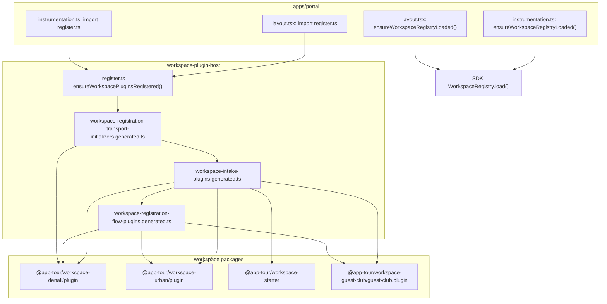

| Host | Entry | Eager all-workspace import? |
| ---- | ----- | --------------------------- |
| **Portal** | `import "@app-tour/workspace-plugin-host/register"` in `layout.tsx` + `instrumentation.ts` | **Yes** — module side effect |
| **Portal API** | `import "@app-tour/workspace-plugin-host/intake-register"` on registrations route | **Yes** — static plugin imports in generated intake file |
| **Portal registration UI** | `public-catalog-registration-flow.tsx` imports `register` + `registration-flow` | **Yes** |
| **Marketing** | `instrumentation.ts` — **only** `ensureWorkspaceRegistryLoaded()` | No plugin-host import |
| **API** | `resolve-workspace-plugin.ts` builds `pluginById` at **module load** via `listApiWorkspacePlugins()` | **Yes** |
| **Web (operator)** | `workspace-plugin-loaders.generated.ts` — `SYNC_WORKSPACE_PLUGINS` calls all four `get*WorkspacePlugin()` at load | **Yes** (sync path); async `loadWorkspacePluginByIdFromRegistry` exists but sync path still eager |

#### `workspace-plugin-host` initialization sequence

`register.ts` executes on import (line 23: `ensureWorkspacePluginsRegistered()`):

```text
1. registerWorkspaceRegistrationTransportInitializersFromManifest()  → Denali transport only
2. registerWorkspaceIntakePluginsFromManifest()                        → all 4 get*WorkspacePlugin()
3. registerWorkspaceRegistrationFlowPluginsFromManifest()              → Denali + guest-club + urban surfaces/steps
```

**Properties today:**

| Property | Present? |
| -------- | -------- |
| Idempotent guard (`registered` flag) | Yes |
| Per-workspace `try/catch` | **No** |
| Lazy `import()` per plugin | **No** — static top-level imports in all three generated files |
| Partial registry on failure | **No** |
| Bootstrap status telemetry | **No** (`workspacePluginBootstrapStatus` does not exist) |
| Explicit host-initiated call (no import side effect) | **No** — side effect is mandatory on import |

#### Does one workspace failure crash the entire registry?

**Yes — at import/eval time.** There is no fault isolation between workspaces in any bootstrap path audited.

**Failure mode matrix:**

| Failure | When it surfaces | Blast radius |
| ------- | ---------------- | ------------ |
| Denali package fails to resolve/build (TypeScript/bundler) | Static `import` in generated registrar | **Entire** `workspace-plugin-host` module fails to load → portal `layout.tsx` / `instrumentation.ts` crash |
| Denali module init throws (e.g. `denali-token-bridge` `readFileSync` on missing `theme/shared/*.json`) | Evaluating `denali.plugin.ts` → `buildDenaliTokenBridgeContexts()` at line 170 | Same — before any registration runs |
| `getDenaliWorkspacePlugin()` throws | Called in generated `for` loop / registration functions | Same — urban/guest-club/starter never register |
| Malformed `workspace.manifest.json` for **one** workspace dir | `parseWorkspaceManifest` in `discoverWorkspaceManifestsFromDirectory` | **`ensureWorkspaceRegistryLoaded` rejects entirely** — registry `isLoaded()` stays `false` (chaos test: `workspace-registry-chaos.spec.ts`) |
| Missing manifest file for one workspace dir | Discoverer returns `null`, skipped | **Partial OK** — other manifests still load |
| `registerWorkspaceIntakePlugin` runtime error | During registration call | Uncaught — aborts remaining registrations in same function |
| Urban tenant on portal while Denali broken | N/A today | Portal cannot boot at all if `register.ts` import fails |

**Denali-specific import-time risk (concrete):**

`denali.plugin.ts` evaluates `const denaliTokenBridge = buildDenaliTokenBridgeContexts()` at module load. `denali-token-bridge.ts` uses synchronous `readFileSync` on `theme/shared/palette.json`, `semantics.light.json`, `contexts/admin.light-flat.json`. Missing or corrupt JSON → **throw before `getDenaliWorkspacePlugin` is callable** → all hosts importing the Denali plugin chain fail.

**Misleading partial behavior (not isolation):**

`registerWorkspaceIntakePluginsFromManifest` skips plugins where `catalogIntake === undefined` (`guest-club`, `starter`). This is **feature omission**, not fault tolerance — it only runs **after** all four `get*WorkspacePlugin()` calls succeed. A Denali import failure prevents reaching the skip logic.

#### SDK filesystem manifest registry (separate path, same blast-radius class)

`ensureWorkspaceRegistryLoaded()` → `WorkspaceRegistry.load()` → `createNodeWorkspaceManifestDiscoverer()`:

- Iterates workspace directories; **one invalid manifest throws** and fails the whole load (`WORKSPACE_MANIFEST_INVALID`).
- Telemetry emitted via `reportWorkspaceRegistryFailure` but error is **re-thrown** — portal layout awaits this and will error.
- Retry: `loadPromise` reset on failure allows retry, but still all-or-nothing per attempt.
- **No per-workspace quarantine** for corrupt manifests.

#### Parallel bootstrap paths (same vulnerability class)

| Location | Pattern | Isolation |
| -------- | ------- | --------- |
| `apps/api/src/workspace/resolve-workspace-plugin.ts` | `const pluginById = new Map(listApiWorkspacePlugins().map(...))` at module load | **None** — API process won't start if any plugin import fails |
| `apps/web/.../workspace-plugin-loaders.generated.ts` | `SYNC_WORKSPACE_PLUGINS` object literal calls all four getters | **None** — used by `resolveSyncWorkspacePluginFromRegistry` in Denali wizard hooks |
| `workspace-registration-flow-plugins.generated.ts` | Static imports of Denali/Urban/Guest-club React step bundles | **None** — bundler must resolve all packages even if only one `pluginId` is active |

**Web note:** `loadWorkspacePluginByIdFromRegistry` uses per-`pluginId` dynamic `import()` — correct direction — but the coexisting `SYNC_WORKSPACE_PLUGINS` eager object negates isolation for all sync call sites (`resolve-bootstrap-workspace-plugin.client.ts`, Denali wizard hooks).

#### Existing tests — coverage gaps

| Test | What it proves | Gap |
| ---- | -------------- | --- |
| `workspace-intake-plugins.spec.ts` HOST-INT-01 | Happy path: denali + urban intake registered | No failure injection |
| `workspace-registry-chaos.spec.ts` | Corrupt manifest fails entire registry load | Proves **lack** of partial isolation, not a mitigation |
| — | Broken Denali import → urban portal still serves | **Missing** |

#### Proposed partial-failure isolation strategy

**Target:** Registry and hosts remain operational for healthy workspaces when one workspace package or manifest is corrupted.

**1. Per-plugin registration boundary (plugin-host + API + web)**

```typescript
// Conceptual — not implemented
type WorkspaceBootstrapRecord =
  | { readonly status: "ok"; readonly plugin: WorkspacePlugin }
  | { readonly status: "failed"; readonly pluginId: string; readonly code: string; readonly message: string };

const bootstrapById = new Map<string, WorkspaceBootstrapRecord>();

async function registerWorkspacePluginSafe(pluginId: string, loader: () => Promise<WorkspacePlugin>): Promise<void> {
  try {
    const plugin = await loader();
    bootstrapById.set(pluginId, { status: "ok", plugin });
    // dispatch to intake / registration-flow / API maps only on success
  } catch (error) {
    bootstrapById.set(pluginId, { status: "failed", pluginId, code: "WORKSPACE_PLUGIN_LOAD_FAILED", message: String(error) });
    emitWorkspacePluginBootstrapTelemetry({ pluginId, error });
  }
}
```

**2. Codegen changes (`scripts/codegen/workspace-registry/domains/registration.mjs`)**

- Replace static `import { getDenaliWorkspacePlugin } from ...` with manifest-driven `pluginId` list + dynamic `import(manifest.package + manifest.plugin.entry)` inside `registerWorkspacePluginSafe`.
- Split registration-flow steps into per-plugin lazy loaders (import React steps only when registering that `pluginId`).

**3. Remove import side effects**

- Delete `ensureWorkspacePluginsRegistered()` call at bottom of `register.ts` and `intake-register.ts`.
- Portal `instrumentation.ts` becomes sole orchestrator:

```typescript
export async function register(): Promise<void> {
  const { bootstrapWorkspacePlugins } = await import("@app-tour/workspace-plugin-host/register");
  await bootstrapWorkspacePlugins(); // wraps all registrars in per-plugin try/catch
  await ensureWorkspaceRegistryLoaded(); // after or in parallel with degraded mode policy
}
```

**4. Filesystem manifest discoverer — per-workspace quarantine**

- In `discoverWorkspaceManifestsFromDirectory`: wrap each workspace's `parseWorkspaceManifest` in `try/catch`; on failure, `emitWorkspaceRegistryTelemetry({ code: "WORKSPACE_MANIFEST_INVALID", workspaceId })` and **skip** entry instead of aborting discovery.
- Policy flag: `WORKSPACE_REGISTRY_STRICT=true` (CI) vs `degraded` (runtime) to fail closed in gates, fail open per-workspace in production.

**5. API `resolveWorkspacePluginForType`**

- Replace module-level `pluginById` eager map with lazy cache populated via `registerWorkspacePluginSafe` on first resolve or explicit warm-up.
- Return `WORKSPACE_PLUGIN_UNAVAILABLE:denali` (503) for tenants bound to a failed plugin; healthy tenants on urban/starter continue.

**6. Web operator bootstrap**

- Remove `SYNC_WORKSPACE_PLUGINS` eager object; route all resolution through `loadWorkspacePluginByIdFromRegistry`.
- Admin shell shows degraded banner when `getWorkspaceBootstrapStatus(pluginId).status === "failed"`.

**7. Verification**

- Add `workspace-plugin-host/test/bootstrap-isolation.spec.ts`: mock/substitute broken Denali loader → assert urban intake + registration flow still registered.
- Add portal smoke: boot with `WORKSPACE_BOOTSTRAP_SKIP=denali` env for local degraded dev.

#### Required error-boundary logic (summary)

| Layer | Error boundary | On failure |
| ----- | -------------- | ---------- |
| Package `import()` | `try/catch` per `pluginId` | Record failure; continue siblings |
| `get*WorkspacePlugin()` | Same boundary | Do not add to intake/flow/API maps |
| Manifest parse (per dir) | `try/catch` per workspace folder | Skip corrupt; load healthy manifests |
| Host request (`resolveWorkspacePluginForType`) | Lookup bootstrap status | Fail closed **for that tenant only** with typed error |
| Portal process boot | `instrumentation.ts` top-level | Log degraded set; **do not** throw if ≥1 workspace healthy (configurable strict mode for CI) |

| Status | Criticality | Recommended fix |
| ------ | ----------- | --------------- |
| **FAIL** | **High** | Implement per-plugin `registerWorkspacePluginSafe` + remove static four-way import graph from generated registrars. Portal/API must boot with N−1 workspaces when one package is broken. |
| **FAIL** | **High** | Remove `ensureWorkspacePluginsRegistered()` import side effect from `register.ts` / `intake-register.ts`; orchestrate explicitly from `instrumentation.ts` inside error boundary. |
| **FAIL** | **High** | Quarantine corrupt manifests in `discoverWorkspaceManifestsFromDirectory` (skip + telemetry) for runtime; keep strict all-or-nothing mode in CI `phase-10:guard`. |
| **WARNING** | **Medium** | Delete `SYNC_WORKSPACE_PLUGINS` eager map in `apps/web/.../workspace-plugin-loaders.generated.ts`; unify on lazy per-`pluginId` loader. |
| **WARNING** | **Medium** | Defer Denali `buildDenaliTokenBridgeContexts()` from module init to first `createDenaliWorkspacePlugin()` call (or lazy theme getter) so import graph is less fragile. |
| **WARNING** | **Medium** | Add `workspacePluginBootstrapStatus` + telemetry sink mirroring `workspace-registry-telemetry.ts`; expose `listHealthyWorkspacePluginIds()` for ops dashboards. |
| **PASS** | **Low** | Intake skip for missing `catalogIntake` is correct feature gating — preserve after isolation refactor. |
| **PASS** | **Low** | `loadWorkspacePluginByIdFromRegistry` per-`pluginId` dynamic `import()` + single-flight cache is the right primitive — extend to all hosts. |

---

### Audit Point 4 — Interface Segregation (deep scan, 2026-07-07)

**Scope:** Workspace HTTP ports (`*/http/ports/*.ts`), SDK client contracts (`TourClient`, `CanonicalDocument`), host adapter wiring (`apps/api`), and frontend consumption (`apps/web`, `apps/portal`, `apps/marketing`).

**Methodology:**

1. Inventory all port interfaces under `packages/workspaces/**/http/ports/`.
2. Ripgrep `@prisma`, `PrismaClient`, `Prisma.` across `packages/workspaces/**`, `packages/workspace-sdk/**`, `apps/web/**`, `apps/portal/**`, `apps/marketing/**`.
3. Trace whether port types are re-exported from workspace `/http` barrels reachable by frontend bundles.
4. Map frontend tour/DTO types to SDK abstractions vs storage-layer shapes.
5. Review API host adapters for casts that bypass port interfaces.

#### Port inventory

| Port | Workspace | Payload abstraction | Prisma/DB types? |
| ---- | --------- | ------------------- | ---------------- |
| `DenaliTourStorePort` | denali | `CanonicalDocument` via `DenaliTourRecord` | **No** |
| `UrbanTourStorePort` | urban | `UrbanTourCanonical { data: Record<string, unknown> }` | **No** |
| `DenaliPublicBookingPort` | denali | Domain DTOs (`DenaliPublicBookingCreateInput/Result`) | **No** |
| `DenaliPublicDestinationPort` | denali | `Record<string, string>` id→name map | **No** |
| `DenaliExposureResolverPort` | denali | `CanonicalDocument` + coordinate | **No** |
| `DenaliReminderFeedPort` | denali | `DenaliReminderFeedItem` DTO | **No** |
| `UrbanExposureResolverPort` | urban | `CanonicalDocument` + coordinate | **No** |
| `FinanceServicePort` | denali | Zod request bodies; responses `unknown` | **No** (weak typing) |
| `TourClient` (SDK) | workspace-sdk | `TourRecordDto` + `CanonicalDocument` | **No** — explicitly documented as non-DB entity |

**`tour-store.port.ts` (Denali) — reference implementation:**

```typescript
export type DenaliTourRecord = {
  readonly id: string;
  readonly createdAt: string;
  readonly canonical: CanonicalDocument;  // SDK abstraction
};

export interface DenaliTourStorePort {
  listPage(where: { tenantId: string }, page: { limit: number }): Promise<DenaliTourListPageResult>;
  findFirst(where: { tenantId: string; id: string }): Promise<DenaliTourRecord | null>;
}
```

Prisma adapters are implemented exclusively in `apps/api` (`configure-workspace-denali-product-http-host.ts` → `TourStorageDbAdapter`). Port file comment: *"Host-injected tour read port — Prisma adapter lives in apps/api."*

#### Prisma / Postgres leakage scan

| Layer | `@prisma/client` imports | Result |
| ----- | ------------------------ | ------ |
| `packages/workspaces/**` | 0 | **PASS** |
| `packages/workspace-sdk/src/**` | 0 | **PASS** |
| `apps/web/src/**` | 0 | **PASS** |
| `apps/portal/src/**` | 0 | **PASS** |
| `apps/marketing/src/**` | 0 | **PASS** |
| `packages/ui-primitives/**` | 0 | **PASS** |

**Frontend is not forced to import HTTP ports or Prisma types.** Zero matches for `DenaliTourStorePort`, `UrbanTourStorePort`, `tour-store.port`, or `@app-tour/workspace-*/http` in `apps/web/src/**` (HTTP ports are API-only).

#### Frontend data plane — what the UI actually knows

| Frontend type / import | Source | DB structure exposure? |
| ---------------------- | ------ | ---------------------- |
| `TourRecordDto`, `CreateTourPayload`, `UpdateTourPayload` | `@app-tour/workspace-sdk` | **No** — API-aligned DTOs with `CanonicalDocument` |
| `FetchTourClient` implements `TourClient` | `apps/web/src/tours/fetch-tour-client.ts` | **No** — HTTP client boundary |
| `OperatorTourDetailResponse` | `apps/web/src/features/tours/operator-tour-detail-types.ts` | **Partial** — includes `rowVersion` (optimistic concurrency) + `canonical.data: Record<string, unknown>` + `projection` — BFF JSON shape, not Prisma model |
| `CanonicalDocument` | SDK via `canonical-client.service.ts` | **No** — generic persisted wizard document |
| Denali UI fields (`DenaliTourKindField`, tour-kind logic) | `@app-tour/workspace-denali/ui/*` | **Domain** — workspace business enums, not DB schema |
| Portal / marketing | theme CSS + plugin-host only | **No** HTTP port or DB imports |

`rowVersion` in `OperatorTourDetailResponse` is an **API contract field** for PATCH semantics (`UpdateTourPayload.rowVersion`), not a Prisma type leak — but it does surface a persistence concern to the UI layer (acceptable for edit flows; could be hidden behind a BFF mapper).

#### Port export boundary (workspace `/http` package)

| Symbol class | Exported from `denali/http/index.ts`? | Exported from `urban/http/index.ts`? | Frontend reachable? |
| ------------ | ------------------------------------- | ------------------------------------ | ------------------- |
| `DenaliTourStorePort` / `UrbanTourStorePort` | **No** (internal to `product-host-ports.ts` + services) | **No** | **No** |
| `DenaliPublicBookingPort` | Yes (type-only) | — | API host only |
| `FinanceServicePort` | Yes (type-only) | — | API host only |
| `InMemoryUrbanRegistrationRepository` | — | **Yes** (class + singleton) | API tests only — **not frontend** |

Tour-store ports remain **package-internal** — not part of the public `/http` barrel consumed by bundlers for guest apps.

#### Encapsulation gaps (not Prisma leaks, but segregation weaknesses)

**1. `tourStore?: unknown` in route deps (Denali + Urban)**

```typescript
// denali/product-host-ports.ts + urban/host-ports.ts
export type DenaliProductRouteDeps = { readonly tourStore?: unknown; ... };
```

`apps/api/src/http/configure-workspace-denali-product-http-host.ts` casts `deps.tourStore` to `DbTourStorageRepository | StorageTourStorageRepository` and can return raw DB adapter without `TourStorageDbAdapter` in one branch. This **breaks port segregation at the API adapter layer** (host knows storage implementation), but the leak stays **server-side** — never reaches frontend bundles.

**2. `UrbanTourCanonical` vs SDK `CanonicalDocument`**

Urban tour-store uses a local wrapper `{ data: Record<string, unknown> }` instead of `CanonicalDocument`. Not a Prisma leak, but **duplicated abstraction** — risks shape drift between Denali and Urban port contracts.

**3. `FinanceServicePort` — `Promise<unknown>` returns**

Finance port methods return `unknown` for summaries, payments, receipts. Avoids Prisma export but **fails interface segregation** — consumers cannot depend on stable DTOs without casting.

**4. Urban registration repository on public HTTP export surface**

`@app-tour/workspace-urban/http` exports `InMemoryUrbanRegistrationRepository`, `UrbanRegistrationRecord`, `getUrbanRegistrationRepository`. `UrbanRegistrationRecord` mirrors a persistence row (id, tenantId, tourId, status, createdAt). Used by `apps/api` tests and `registration.service.ts` — **not frontend**, but the **repository pattern is published in the workspace HTTP package** instead of a port interface like `DenaliPublicBookingPort`.

**5. Denali `types/legacy/repo-types` (domain legacy, not Prisma)**

`DENALI_TOUR_KIND_VALUES`, `DenaliTourKind` live under `types/legacy/repo-types` (legacy Tour Ops naming). Re-exported from `denali.plugin.ts`. Consumed inside workspace wizard/UI — **not** imported by `apps/web/src` directly. These encode **domain taxonomy**, not Postgres column types, but the `legacy/repo-types` path signals historical coupling to the old monolith schema vocabulary.

**6. API host storage types in adapter wiring**

`configure-workspace-denali-product-http-host.ts` imports `Tour` and `TourStorageRepository` from `apps/api/src/storage/*` and `apps/api/src/db/tour.repository` — correct location for Prisma, but `resolveTourStore` return type union includes raw `DbTourStorageRepository` bypassing `DenaliTourStorePort` adapter in edge cases.

#### Layer diagram (intended vs actual)

```text
[Intended]
  Frontend ──TourClient/CanonicalDocument (SDK)──► HTTP API ──Port interface──► Adapter ──► Prisma

[Actual — compliant paths]
  apps/web ──FetchTourClient, UpdateTourPayload──► apps/api ──DenaliTourStorePort──► TourStorageDbAdapter ──► DB

[Actual — segregation gaps — server only]
  apps/api configure-host ──cast──► DbTourStorageRepository (unknown deps.tourStore)
  urban/http ──exports──► InMemoryUrbanRegistrationRepository (no port interface)
```

#### Mapping to purely abstract interfaces (recommended)

| Gap | Abstract interface target |
| --- | ------------------------- |
| `tourStore?: unknown` | `readonly tourStore?: DenaliTourStorePort` / `UrbanTourStorePort` — remove `unknown`; forbid raw `DbTourStorageRepository` return from `resolveTourStore` |
| `UrbanTourCanonical` | Replace with `CanonicalDocument` from SDK (align with Denali port) |
| `FinanceServicePort` unknown returns | Define `FinanceSummaryDto`, `FinancePaymentDto`, … in `workspace-sdk` or `denali/http/schemas/finance-response.schemas.ts`; port returns typed readonly DTOs |
| Urban registration repository export | Introduce `UrbanRegistrationPort` (mirror `DenaliPublicBookingPort`); move `InMemoryUrbanRegistrationRepository` to `urban/http/testing/` or `apps/api/test/fixtures` |
| `OperatorTourDetailResponse` | Optionally map API JSON → `TourRecordDto & { projection: TourListProjectionFields }` from SDK to avoid parallel type trees |
| Legacy `repo-types` | Migrate `DenaliTourKind` to workspace field-registry enum or SDK metadata type; stop exporting from `denali.plugin.ts` |

| Status | Criticality | Recommended fix |
| ------ | ----------- | --------------- |
| **PASS** | **Low** | Tour-store ports use SDK `CanonicalDocument`; zero Prisma in workspace packages and frontend apps. Maintain `guard:architecture` ban on `@prisma` in `packages/workspaces/**`. |
| **PASS** | **Low** | Frontend uses SDK `TourClient`, `TourRecordDto`, `UpdateTourPayload` — correct abstraction layer. Extend `FetchTourClient` pattern to all tour mutations. |
| **WARNING** | **Medium** | Tighten `DenaliProductRouteDeps.tourStore` and `UrbanProductRouteDeps.tourStore` from `unknown` to typed port interfaces; `resolveTourStore` must always return port-compliant adapter. |
| **WARNING** | **Medium** | Unify `UrbanTourCanonical` → `CanonicalDocument`; add contract test parity between Denali and Urban `*TourStorePort`. |
| **WARNING** | **Medium** | Replace `FinanceServicePort` `unknown` returns with explicit finance response DTO interfaces. |
| **WARNING** | **Low** | Extract `UrbanRegistrationPort`; demote `InMemoryUrbanRegistrationRepository` from public `urban/http` exports to test-only module. |
| **WARNING** | **Low** | `OperatorTourDetailResponse.rowVersion` is intentional API surface — document in SDK `UpdateTourPayload` companion type; avoid adding DB-only fields (e.g. internal UUIDs, join table ids) to BFF responses. |
| **FAIL** | **High** | *Not triggered for frontend* — no instance found where frontend components import Prisma, Postgres drivers, or raw `tour-store.port.ts`. Server-side adapter cast to `DbTourStorageRepository` is the highest-risk segregation gap — fix before exposing deps injection to third-party hosts. |

---

### Audit Point 5 — Workspace Isolation (TenantRls stress-test, 2026-07-07)

**Scope:** `withTenantRls`, Postgres RLS policies, ALS tenant binding (`tenant-request-context`), HTTP header auth (`tenant-kernel`), repository query patterns in `apps/api`, and pentest/integration specs.

**Terminology:** In this platform, **row-level isolation is tenant-scoped**, not workspace-package-scoped. `x-workspace-id` selects plugin/UI surfaces for the authenticated tenant; **sensitive tour/booking/finance rows are partitioned by `tenant_id`**, not `workspaceType`. A user on workspace `urban` cannot read another tenant's data unless they breach **tenant** boundaries (spoofed `tenantId`, missing RLS, or admin bypass misuse). Cross-workspace access within the **same tenant** is a product/authorization concern (RBAC), not RLS.

#### `withTenantRls` mechanics

```typescript
// apps/api/src/db/with-tenant-rls.ts (abridged)
export async function withTenantRls<T>(tenantId: string, run: (tx) => Promise<T>): Promise<T> {
  const normalized = tenantId.trim();
  if (normalized.length === 0) throw new Error("TENANT_RLS_TENANT_ID_REQUIRED");
  assertActiveTenantMatchesRlsTarget(normalized);  // DEC-028 — ALS ↔ RLS lock
  return prisma.$transaction(async (tx) => {
    await applyTenantRlsSessionVars(tx, normalized, traceId);  // set_config('app.current_tenant_id', …, true)
    return run(tx);
  });
}
```

| Control layer | Mechanism | Fail mode |
| ------------- | --------- | --------- |
| **Postgres RLS** | `USING (tenant_id = current_setting('app.current_tenant_id', true)::uuid)` on `tours`, `operator_registrations`, `payments`, `outbox_events`, `workspace_*` settings tables, integrations, exposure tables | Row invisible / write rejected |
| **App role hardening** | Migrations `app_tour_nobypassrls` + `app_tour_nosuperuser` — `DATABASE_URL` role cannot bypass policies | Verified in `rls-isolation.integration.spec.ts` |
| **ALS alignment (DEC-028)** | `assertActiveTenantMatchesRlsTarget` throws `TENANT_RLS_ALS_TENANT_MISMATCH` when HTTP-bound ALS tenant ≠ RLS target | Blocks parameter tampering after ALS is set |
| **HTTP header binding** | `runWithHttpRequestContext` → `runWithTenantContext(auth.tenantId)` before handlers | ALS set from authenticated tenant, not raw `x-tenant-id` alone |
| **Claim mismatch guards** | `FORBIDDEN_TENANT_CLAIM_MISMATCH`, `CANONICAL_WRITE_TENANT_MISMATCH`, `ATOMIC_PERSIST_TENANT_CONTEXT_MISMATCH` | Body/header tenant spoof rejected at service layer |

#### Stress-test: tenantId spoofing / parameter tampering

**Authenticated HTTP boundary — can user A access tenant B data?**

| Attack vector | Test / evidence | Result |
| ------------- | --------------- | ------ |
| `x-tenant-id` ≠ `x-authenticated-tenant-id` on POST | `tenant-injection.spec.ts` PENTEST-1a | **403** `FORBIDDEN_TENANT_CLAIM_MISMATCH` |
| Body `tenantId` ≠ auth tenant | PENTEST-1b | **403** |
| Missing `x-authenticated-tenant-id` | PENTEST-1c | **401** |
| ALS tenant A + `withTenantRls(B)` in same request | PENTEST-3a | **Throw** `TENANT_RLS_ALS_TENANT_MISMATCH` before query |
| Cross-tenant GET `/tours/:id` (Postgres) | PENTEST-3c, `cross-tenant-forensic.spec.ts` | **404** (RLS hides row) |
| `withTenantRls('')` / whitespace | PENTEST-4a/4b | **Throw** `TENANT_RLS_TENANT_ID_REQUIRED` |
| Postgres RLS session A querying tenant B row by id | `rls-isolation.integration.spec.ts` P4-E-RLS-01 | **0 rows** |

**Verdict on spoofing:** For standard authenticated HTTP paths with ALS bound, **tenantId spoofing does not yield cross-tenant reads** — defense is fail-closed (403/404/throw), not silent leakage.

**Residual spoofing surfaces (when ALS is unset or admin pool used):**

| Path | Risk | Mitigation today |
| ---- | ---- | ---------------- |
| Relay / background jobs calling `withTenantRls(tenantId)` without ALS | `assertActiveTenantMatchesRlsTarget` is **no-op** when ALS unset — relies on caller passing correct `tenantId` | Outbox relay uses explicit `row.tenantId` from claimed row; publish path re-enters `withTenantRls(row.tenantId)` |
| `getPrismaAdmin()` platform/provisioning/booking lookups | Bypasses RLS by design | Restricted to platform ops, tenant registry, `bookings.getById` PK lookup |
| Denali exposure reminder scheduler | `getPrisma().tour.findMany({ where: { tenantId } })` **without** `withTenantRls` | Internal system job; filters by `tenant.id` from `tenant.findMany` — cross-tenant scan intentional; not user-facing |

#### Repository scan — queries missing tenant scope

**Methodology:** Static scan of `apps/api/src/**/*.ts` for `getPrisma()` access to tenant-scoped models; manual review of delete/update `where` clauses; port inventory from Audit Point 4.

**Tour store ports (`tour-store.port.ts`):** Host-injected; **no Prisma types**. `PrismaTourRepository` always wraps in `withTenantRls` and uses compound `tenantId_id` keys on reads/writes.

| Pattern | Instances | Tenant filter? | RLS wrapped? | Risk |
| ------- | --------- | -------------- | ------------ | ---- |
| `PrismaTourRepository.getById/save/list*` | `storage/prisma-tour.repository.ts` | **Yes** — `tenantId_id` compound | **Yes** | **Low** |
| `prisma-settings-resources.repository.ts` mutations | 40+ calls | **Partial** — many `delete/update({ where: { id } })` inside `withTenantRls(tenantId)` rely on RLS alone | **Yes** | **WARNING** — defense-in-depth gap if RLS misconfigured |
| `prisma-bookings.repository.ts` `getById` | 1 | **No** in query — `getPrismaAdmin().operatorRegistration.findUnique({ where: { id } })` | **Admin bypass** | **WARNING** — cross-tenant PK read possible at DB layer; route layer must enforce tenant |
| `prisma-bookings.repository.ts` `listOutboxByAggregate` | 1 | Pre-fetch via `getPrisma().findUnique({ id })` without RLS | Partial — comment notes app pool returns zero without session | **WARNING** |
| `start-denali-exposure-reminder-scheduler.ts` | 1 | Explicit `tenantId` in `where` | **No** `withTenantRls` | **WARNING** — system job only |
| `identity/prisma-identity.repository.ts` | global `user`, `mobileOtpChallenge` | N/A — identity plane | Mixed — memberships use `withTenantRls` | **Low** (by design) |
| `tenant-route-lookup.ts` | `tenantRoute.findUnique` | By `tenantId` PK | No RLS needed (routing metadata) | **Low** |
| `outbox-relay.ts` claim batch | cross-tenant `SELECT … FROM outbox_events` | Admin pool intentional | `getPrismaAdmin()` | **Low** (infrastructure) |
| Finance / settings / exposure / integrations repos | 80+ `withTenantRls` call sites | Tenant in `where` on most reads | **Yes** | **Low** |

**No production frontend or workspace package** imports `withTenantRls` or issues Prisma queries — isolation is **`apps/api` only**.

#### Workspace vs tenant — can workspace A user reach workspace B data?

| Scenario | Possible? | Why |
| -------- | --------- | --- |
| Urban tenant user reads Denali **tenant B** tours via forged headers | **No** (under pentest coverage) | Tenant auth + RLS |
| Denali operator reads another **tenant's** tours in same workspace plugin | **No** | Same RLS |
| Same tenant, two members — member A sees member B's bookings | **Blocked** at app layer | `bookings-member-isolation.spec.ts` MEM-04 — `view=mine` filters `submittedByUserId` |
| Forged `x-workspace-id` alone grants cross-tenant DB access | **No** | Workspace header does not override `auth.tenantId` / RLS GUC |
| Platform admin via `getPrismaAdmin()` | **Yes** (by design) | Platform ops / provisioning — must remain RBAC-gated at HTTP layer |

#### Centralized enforcement proposal

```text
┌─────────────────────────────────────────────────────────────┐
│  HTTP Middleware (existing + extend)                        │
│  runWithHttpRequestContext → ALS tenantId (required)        │
│  + assert workspaceId matches tenant.workspaceType (new)    │
└──────────────────────────┬──────────────────────────────────┘
                           ▼
┌─────────────────────────────────────────────────────────────┐
│  TenantDataAccessPolicy (new)                               │
│  • All tenant-scoped repos extend TenantScopedRepository    │
│  • Forbidden: getPrisma() on RLS tables outside wrapper   │
│  • ESLint/guard: prisma.*.find* must be inside withTenantRls│
│    or getPrismaAdmin() with @admin-allowlist comment        │
└──────────────────────────┬──────────────────────────────────┘
                           ▼
┌─────────────────────────────────────────────────────────────┐
│  withTenantRls (existing)                                 │
│  • ALS alignment when ALS set                               │
│  • set_config app.current_tenant_id                         │
│  • Require compound { tenantId, id } on mutations (new lint)│
└──────────────────────────┬──────────────────────────────────┘
                           ▼
┌─────────────────────────────────────────────────────────────┐
│  Postgres RLS (existing FORCE policies)                    │
└─────────────────────────────────────────────────────────────┘
```

**Concrete enforcement steps:**

1. **`guard:tenant-rls-coverage`** — AST rule: any `tx.tour|operatorRegistration|payment|workspaceEquipment|…` access outside `with-tenant-rls.ts` or allowlisted admin modules → CI fail.
2. **Compound-key policy** — extend `prisma-settings-resources.repository.ts` deletes/updates to `where: { tenantId_id: { tenantId, id } }` or `{ id, tenantId }` even inside RLS transactions.
3. **`bookings.getById`** — replace admin PK-only read with `withTenantRls(tenantId, tx => tx.operatorRegistration.findFirst({ where: { id, tenantId } }))` after auth resolves tenant from session.
4. **ALS mandatory paths** — document + assert `getActiveTenantId()` is defined for all operator/member HTTP handlers; background jobs pass explicit `tenantId` with structured logging.
5. **Exposure scheduler** — wrap per-tenant loop body in `withTenantRls(tenant.id, …)` for consistency even on system jobs.
6. **Telemetry** — emit `TENANT_RLS_ALS_TENANT_MISMATCH` and `FORBIDDEN_TENANT_CLAIM_MISMATCH` counters to detect spoof attempts in production.

| Status | Criticality | Recommended fix |
| ------ | ----------- | --------------- |
| **PASS** | **Low** | Core `withTenantRls` + FORCE RLS + NOBYPASSRLS app role — pentest and integration specs demonstrate fail-closed cross-tenant behavior. Keep `tenant-injection.spec` + `rls-isolation.integration` in CI when `DATABASE_URL` set. |
| **PASS** | **Low** | HTTP header forgery (`x-tenant-id` vs `x-authenticated-tenant-id`) blocked at 403; ALS/RLS mismatch throws before query (DEC-028). |
| **PASS** | **Low** | Tour-store ports and `PrismaTourRepository` use SDK `CanonicalDocument` + compound tenant keys — no Prisma leakage to workspaces/frontend. |
| **WARNING** | **Medium** | Settings repository `delete/update({ where: { id } })` relies solely on RLS session — add explicit `tenantId` to all `where` clauses for defense-in-depth. |
| **WARNING** | **Medium** | `bookings.getById` uses `getPrismaAdmin()` PK lookup — enforce tenant authz at every call site or migrate to RLS-scoped `findFirst({ id, tenantId })`. |
| **WARNING** | **Medium** | ALS alignment skipped when ALS unset (relay/scheduler paths) — audit all non-HTTP callers; add `guard:tenant-rls-coverage` for direct `getPrisma()` on RLS tables. |
| **WARNING** | **Low** | `listOutboxByAggregate` pre-read via `getPrisma()` without RLS — refactor to admin allowlist or single `withTenantRls` block. |
| **WARNING** | **Low** | Denali exposure reminder scheduler queries without `withTenantRls` — wrap per-tenant iteration for policy consistency. |
| **FAIL** | **High** | *Not triggered for authenticated member/operator HTTP paths* — no exploitable cross-tenant read found under pentest matrix. **Latent FAIL class:** any new repository using `getPrisma()` on RLS tables without `withTenantRls` would bypass isolation if app role were misconfigured — mitigate with centralized `guard:tenant-rls-coverage` (proposed above). |

---

## Category 2: Synchronization & Consistency

### Audit Point 6 — Schema Sync (deep scan, 2026-07-07)

**Scope:** Cross-workspace comparison of `packages/workspaces/*/workspace.manifest.json` against CI authority `WorkspaceManifestCiSchema` (`packages/workspace-sdk/src/manifest.schema.ts`), runtime authority `WorkspaceManifestSchema` (`packages/workspace-sdk/src/workspace-registry/workspace-manifest.schema.ts`), and codegen admission control (`scripts/codegen/workspace-registry/`).

**Methodology:** Full-file read of all four checked-in manifests; automated top-level key presence matrix; `runValidateWorkspaceManifests` (`packages/workspace-sdk/scripts/validate-manifests.ts`); static trace of codegen domain consumers (`orchestrator.mjs` `DOMAIN_OUTPUT_KEYS`, `guest-catalog.mjs` `GUEST_EXTENSION_MANIFEST_KEYS`, `http-routes.mjs`); comparison with documented JSON Schema (`docs/phase-10/appendices/WORKSPACE-MANIFEST.schema.json`).

#### Version and revision parity

| Workspace | `version` | `pluginApiVersion` | `guestExtensionsVersion` | `memberPortal.manifestVersion` | Top-level keys | On-disk size (approx.) |
| --------- | --------- | ------------------ | ------------------------ | ------------------------------ | -------------- | ---------------------- |
| `starter` | 1 | 1 | — | — | 9 | ~0.4 KB |
| `urban` | 1 | 1 | 1 | 2 | 25 | ~5.5 KB |
| `guest-club` | 1 | 1 | 1 | 2 | 20 | ~4.5 KB |
| `denali` | 1 | **absent** (defaults to `1` in `workspace-definition.repository.ts`) | 1 | 2 | 52 | ~10 KB |

**CI validation:** `runValidateWorkspaceManifests` → **PASS** (4 manifests under `packages/workspaces`).

**Verdict on version fields:** All manifests share `version: 1` (manifest schema revision, not npm semver). Extension revisions are aligned where declared (`guestExtensionsVersion: 1`, `memberPortal.manifestVersion: 2`). **Asymmetry:** `denali` omits `pluginApiVersion` while `starter`, `urban`, and `guest-club` declare `pluginApiVersion: 1`. Runtime and DB publish paths default missing values to `1`, so behavior is consistent today, but the omission breaks structural parity and obscures contract-version auditing.

#### Schema parity vs intentional tier divergence

Manifest shape divergence is **tier-driven**, not uncontrolled legacy drift:

```text
starter (stub, 9 keys)
  └─ plugin + web + wizardCreate stub + themeStylesheets

urban / guest-club (guest stub, L2–L3 conformance)
  └─ httpRoutes + guest extensions + catalogRegistrationFlow + memberPortal minimal

denali (certified, 52 keys)
  └─ full operator/wizard/settings/marketing surface bindings + inline theme + GCSN
```

**Shared guest-extension blocks** (`guestLanding`, `guestSeo`, `catalogPresentation`, `catalogRegistrationFlow`, `memberProfile`, `memberPortal`, `guestThemeStylesheets`) are **structurally aligned** across `urban`, `guest-club`, and `denali` where present — same key shapes, same `memberPortal.manifestVersion: 2`, same `guestExtensionsVersion: 1`.

**Diverged blocks (by design):**

| Block | starter | urban | guest-club | denali |
| ----- | ------- | ----- | ---------- | ------ |
| `httpRoutes` | — | ✓ | ✓ | ✓ |
| `tourWrite` / `canonicalTour` | — | ✓ | — | ✓ |
| `wizardI18n` | — | ✓ | — | ✓ |
| `operatorCapabilities` | — | ✓ | — | ✓ |
| `httpErrors` | — | ✓ | — | ✓ |
| `theme` (inline CSS vars) | — | — | — | ✓ |
| `guestCrossSurfaceNav` | — | — | — | ✓ |
| `events` | — | — | — | ✓ |
| 20+ Denali wizard/settings bindings | — | — | — | ✓ |

This is **certification-tier expansion**, not forked legacy schemas. `resolveGuestConformanceLevel` and `resolveProductionCertificationTier` in codegen encode the intended ladder (`L0`→`L4`, `stub`→`certified`).

#### Dual schema authority (sync risk)

Two Zod authorities coexist:

| Authority | File | Strict on | Extension blocks |
| --------- | ---- | --------- | ---------------- |
| **CI / publish** | `manifest.schema.ts` → `WorkspaceManifestCiSchema` | `id`, `version`, `package`, `workspaceTypes`, `plugin`, optional `theme`, optional `guestCrossSurfaceNav` | `.passthrough()` |
| **Runtime registry** | `workspace-manifest.schema.ts` → `WorkspaceManifestSchema` | Above + optional `web`, `pluginApiVersion`, optional `theme` (looser record) | `.passthrough()` |

**Admission control for guest extensions** is a **third** layer: `assertGuestExtensionsManifest` in `guest-catalog.mjs` (explicit key list + structural checks), not Zod.

**Stale documentation:** `docs/phase-10/appendices/WORKSPACE-MANIFEST.schema.json` sets root `additionalProperties: false` and documents only a subset of production keys. Checked-in manifests contain **40+ top-level keys** absent from that JSON Schema (e.g. `httpRoutes`, `guestLanding`, `catalogRegistrationFlow`). Zod passthrough accepts them; strict JSON Schema validation would **reject** production manifests. The JSON Schema appendix is **not** wired into CI.

#### Legacy and unsupported manifest keys

`WorkspaceManifestCiSchema` does **not** reject extension keys (`.passthrough()`). “Unsupported” below means: **(a)** explicitly legacy-named, **(b)** orphan (present in manifest, not consumed by codegen), **(c)** Denali-branded semantics on non-Denali workspaces, or **(d)** absent from documented JSON Schema while present in production.

| Key / path | Workspace(s) | Classification | Codegen / runtime consumer |
| ---------- | ------------ | -------------- | -------------------------- |
| `http` (`prefix`, `module`) | denali, urban, guest-club | **Orphan / transitional** | **Not read** by codegen (`http` domain emits `httpRoutes`, `httpHandlerLoaders`, `httpErrorMap` only). Retained in `workspace-create.mjs` scaffold and Phase 10 finance docs; superseded by `httpRoutes.loadHandlersFromPackage`. |
| `wizardMedia.legacyBackendUploadPath` | denali | **Explicit legacy** | **Required** when `wizardMedia` set (`wizard-admin.mjs`); maps to `/tours/wizard-photos`. |
| `wizardMedia.legacyBackendSignedUrlPath` | denali | **Explicit legacy** | **Required** when `wizardMedia` set; maps to `/tours/wizard-photos/url`. |
| `wizardMedia.legacyBffPath` (optional) | — (not in denali manifest today) | **Legacy alias** | Supported in `wizard-admin.mjs` as fallback BFF path when set. |
| `catalogRegistrationFlow.steps.reuseFrom` | — (alias only) | **Deprecated alias** | Codegen accepts `reuseAuthStepsFrom ?? reuseFrom` (`registration.mjs`); prefer `reuseAuthStepsFrom`. |
| `guestLanding.sections.whyDenali` | denali (true), urban/guest-club (false) | **Legacy naming** | Consumed by guest-landing codegen; key name is Denali-specific branding on generic workspaces. |
| `guestLanding.sections.journey` | same | **Legacy naming** | Same — Denali marketing section id reused as generic toggle. |
| `themeStylesheets` | all four | **Transitional** | Codegen `themeStylesheets` domain; `SYSTEM_HEALTH_REPORT.md` §5 flags as legacy vs inline `theme` block. Only `denali` declares inline `theme`. |
| `guestThemeStylesheets` | urban, guest-club, denali | **Transitional** | Codegen guest theme loaders; parallel path to `PlatformThemeProvider` inline vars. |
| `tourWrite.publishOwnerAssertModule` / `publishOwnerAssertExport` | urban | **Undocumented extension** | Consumed by `tour-api.mjs` codegen; absent from `WORKSPACE-MANIFEST.schema.json` `tourWrite` properties. |
| `tourWrite.forbidOperatorMemberTourPatch` | denali | **Undocumented extension** | Denali-only publish guard; not in JSON Schema `tourWrite` block. |
| `wizardCreate: {}` | starter | **Empty stub** | Present for codegen domain registration; minimal placeholder. |

**No manifest contains keys that fail `WorkspaceManifestCiSchema` structural parse.** Legacy risk is **semantic and operational** (orphan `http`, dual theme paths, Denali-branded section ids), not Zod rejection.

#### Cross-workspace structural gaps (actionable)

1. **`pluginApiVersion` on denali** — add `"pluginApiVersion": 1` for parity with scaffold (`scripts/workspace-create.mjs`) and metadata publish tests.
2. **Orphan `http` block** — remove from manifests after confirming no runtime reader, or wire `assertHttpLegacyBlockDeprecated` guard that fails CI if `http` present without migration ticket.
3. **`theme` vs `themeStylesheets`** — urban/guest-club rely on CSS file indirection; denali uses inline `theme` + custom admin CSS. Not schema-invalid, but blocks zero-code theme scaling (see `SYSTEM_HEALTH_REPORT.md` §5–6).
4. **`guestCrossSurfaceNav`** — denali-only today; urban/guest-club omit GCSN despite L3 conformance. Intentional for stub tier, but creates nav parity gap across guest workspaces.
5. **JSON Schema appendix drift** — `WORKSPACE-MANIFEST.schema.json` does not describe production manifest surface; risks false confidence if adopted as CI gate without rewrite.

#### Migration plan for outdated manifest structures

**Phase A — Parity hygiene (1 PR, low risk)**

1. Add `"pluginApiVersion": 1` to `packages/workspaces/denali/workspace.manifest.json`.
2. Run `node --import tsx packages/workspace-sdk/scripts/validate-manifests.ts` and `pnpm run generate:workspace-registry -- --check`.
3. Add `guard:manifest-parity` script: assert every workspace under `packages/workspaces/` declares `pluginApiVersion` and, if `guestExtensionsVersion` is set, `guestExtensionsVersion === 1`.

**Phase B — Deprecate orphan `http` block (1 PR per workspace)**

1. Document in `docs/phase-10/subphases/10.4-finance-registrar.md` that route authority is `httpRoutes` only.
2. Remove `http: { prefix, module }` from denali, urban, guest-club manifests.
3. Update `workspace-create.mjs` scaffold to emit `httpRoutes` only (already does both — drop `http`).
4. Add codegen warning → error: manifest must not contain top-level `http` after Phase B cutover date.

**Phase C — Guest landing section id neutralization (1 PR)**

1. Introduce alias keys `whyClub` / `memberJourney` in `guestLanding.sections` schema with codegen accepting either old or new names for one release.
2. Migrate urban/guest-club manifests to neutral keys; keep `whyDenali`/`journey` as deprecated aliases in denali only until Denali marketing CSS `data-marketing-home-journey-*` selectors are renamed.
3. Update `assertGuestLandingManifest` to warn on `whyDenali` outside `denali` workspace id.

**Phase D — Theme unification (multi-PR, aligns with zero-code roadmap)**

1. Extract denali inline `theme` block tokens into shared semantic names per `docs/workspaces/denali/unified-semantic-token-schema.mdoc`.
2. Add equivalent `theme` blocks to urban/guest-club (subset) while retaining `themeStylesheets` for one release.
3. Remove `themeStylesheets` / `guestThemeStylesheets` after `PlatformThemeProvider` + skin CSS ingress FOUC fixes (`SYSTEM_HEALTH_REPORT.md` §6.2).

**Phase E — Schema authority consolidation (architect decision)**

1. Extend `WorkspaceManifestCiSchema` with optional typed blocks for `httpRoutes`, `guestLanding`, `catalogRegistrationFlow` (replace passthrough for guest tier).
2. Retire or regenerate `WORKSPACE-MANIFEST.schema.json` from Zod via `zod-to-json-schema` so documentation matches CI.
3. Fold `assertGuestExtensionsManifest` checks into Zod `.superRefine` where possible to eliminate triple validation paths.

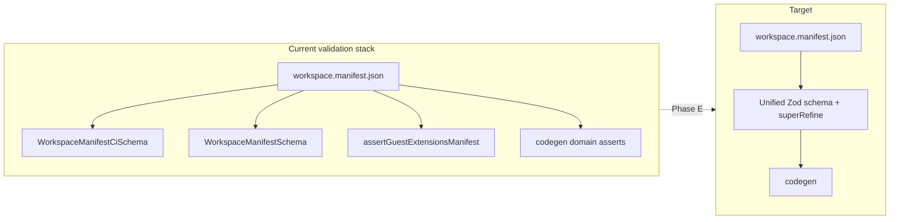

#### Audit Point 6 summary

| Finding | Status | Criticality | Recommended fix |
| ------- | ------ | ----------- | --------------- |
| All four manifests pass `WorkspaceManifestCiSchema` + semantic GCSN checks | **PASS** | **Low** | Keep `runValidateWorkspaceManifests` in `manifest.schema.spec.ts` and pre-commit when Phase 9 hooks resume. |
| Tier-based key divergence (9 → 25 → 52 keys) is intentional certification ladder | **PASS** | **Low** | Document tier templates in `workspace-create.mjs` / Phase H charter; avoid forcing denali-shaped manifests on stubs. |
| `guestExtensionsVersion` / `memberPortal.manifestVersion` aligned on guest-capable workspaces | **PASS** | **Low** | No change. |
| `denali` missing `pluginApiVersion` | **WARNING** | **Medium** | Phase A — add explicit `pluginApiVersion: 1`. |
| Orphan `http` block coexists with `httpRoutes` on three workspaces | **WARNING** | **Medium** | Phase B — remove orphan block; codegen is authoritative on `httpRoutes`. |
| Denali-branded `guestLanding.sections.whyDenali` / `journey` on urban/guest-club | **WARNING** | **Low** | Phase C — neutral section ids + alias period. |
| Dual theme path (`themeStylesheets` vs inline `theme`) | **WARNING** | **Medium** | Phase D — zero-code theme migration per `SYSTEM_HEALTH_REPORT.md` §5. |
| `WORKSPACE-MANIFEST.schema.json` stale (`additionalProperties: false` vs 40+ prod keys) | **WARNING** | **Medium** | Phase E — generate from Zod or mark appendix historical. |
| `wizardMedia.legacyBackend*` paths still required for Denali photo BFF | **WARNING** | **Low** | Migrate to neutral `mediaRouteKey` + generated routes; drop `legacy*` suffix after route cutover. |
| Strict JSON Schema would reject production manifests | **FAIL** | **Low** | **Latent** — not enforced today. Do not adopt JSON Schema appendix as CI gate without Phase E rewrite. |

**Overall Audit Point 6 verdict:** **WARNING** — schema **validation passes** and divergence is **mostly intentional tier expansion**, not uncontrolled legacy fork. **Synchronization debt** concentrates in orphan `http`, missing `pluginApiVersion` on denali, Denali-branded guest section keys, dual theme ingress, and **three parallel validation authorities** (CI Zod, runtime Zod, codegen asserts) with a **stale JSON Schema appendix**.

### Audit Point 7 — Token Parity (Admin vs Portal, 2026-07-07)

**Scope:** CSS/token synchronization across operator Admin (`apps/web`) and member Portal (`apps/portal`) for all workspace plugins, with deep analysis on Denali (reference brand). Authorities: DTCG slices (`packages/design-tokens/dtcg/workspaces/`), generated semantic CSS (`*-semantic-tokens.css`), manifest `theme` / `themeJson` ingress (`PlatformThemeProvider`), plugin `cssVariables` ingress (`WorkspaceThemeProvider`), and Denali Token Bridge (`packages/workspaces/denali/src/theme/denali-token-bridge.ts`).

**Methodology:** `pnpm run guard:token-parity` + `guard-dtcg-css-sync` + `guard-dtcg-hex-ban`; automated comparison of `admin-semantic-tokens.css` vs `portal-semantic-tokens.css`; static scan for `#` / `rgb()` literals outside `@generated` semantic files; trace of theme provider chains in `apps/web` and `apps/portal` layouts.

#### Token pipeline architecture (Admin vs Portal)

```text
┌─────────────────────────────────────────────────────────────────────────┐
│ L0 — DTCG authority (edit JSON → build → *-semantic-tokens.css on body) │
└───────────────────────────────┬─────────────────────────────────────────┘
                                │
        ┌───────────────────────┴───────────────────────┐
        ▼                                               ▼
┌───────────────────────┐                   ┌───────────────────────────┐
│ ADMIN (apps/web)      │                   │ PORTAL (apps/portal)      │
│ body[data-workspace- │                   │ body[data-app-surface=     │
│   plugin="denali"]   │                   │   "portal"][data-ws=…]    │
│ admin-semantic-      │                   │ portal-semantic-tokens.css │
│ tokens.css (+ dark)  │                   │ + denali-portal.css bridge │
├───────────────────────┤                   ├───────────────────────────┤
│ Runtime ingress:      │                   │ Runtime ingress:          │
│ WorkspaceThemeProvider│                   │ PlatformThemeProvider     │
│ → plugin.theme.       │                   │ → manifestTheme from      │
│   cssVariables (--ws-*)│                  │   workspace.manifest theme │
│   via denali-token-   │                   │   block (--ws-*) on inner │
│   bridge.admin        │                   │   <div> (inherits down)   │
│ (NOT manifestTheme)   │                   │                           │
├───────────────────────┤                   ├───────────────────────────┤
│ Tenant overlay:       │                   │ Tenant overlay:           │
│ TenantThemeProvider   │                   │ (none today)              │
│ (API tenantTheme)     │                   │                           │
└───────────────────────┘                   └───────────────────────────┘
```

**`themeJson` / manifest contract:** `readWorkspaceManifestTheme` reads `workspace.manifest.json` → `theme` as opaque `--ws-*` keys. `mergeThemeCssVariables` in `PlatformThemeProvider` merges `manifestTheme` → `themeJson` → `themeJsonOverride`. Admin **does not** pass `manifestTheme` into `ThemeProviderChain` (`apps/web/src/providers/app-providers.tsx`); it relies on `plugin.theme.cssVariables` from `denali-token-bridge` instead — a **parallel ingress** that must be kept aligned with the manifest `theme` block manually.

#### Denali — Admin vs Portal semantic parity (same brand)

**CI guards (2026-07-07):**

| Guard | Result |
| ----- | ------ |
| `guard:token-parity` (shared `color.*` + `flat.*` semantics) | **PASS** |
| `guard-dtcg-css-sync` | **PASS** |
| `guard-dtcg-hex-ban` (skin hooks + semantic outputs) | **PASS** |

**Shared semantic contract** is composed from `packages/workspaces/denali/theme/shared/` (`palette.json`, `semantics.light.json`, `contexts/`) into `denali.admin.tokens.json` and `denali.portal.tokens.json` via `generate:denali-semantic-slices`.

| Metric | Admin (light block) | Portal | Aligned? |
| ------ | ------------------- | ------ | -------- |
| Shared `--color-*` / `--denali-*` / `--radius` keys | 31 | 31 | **Yes** — 0 value drifts |
| Admin-only keys (shadcn aliases, sidebar, focus-ring-offset) | 29 | — | **Intentional** (operator chrome) |
| Dark mode block | Full teal dark cascade | — | **Intentional** (portal light-only) |
| Marketing slice (`denali.marketing.tokens.json`) | — | — | **Aligned** with shared forest palette; adds `--mkt-*` marketing primitives |

**Note:** `TOKEN_DRIFT_ANALYSIS.md` (2026-07-07) documents historical emerald (`#059669`) portal drift. That drift is **remediated** in current DTCG — portal now references `{denali.forest-600}` / mist palette. The analysis file is **stale** relative to checked-in slices; keep `guard:token-parity` as the live authority.

**Remaining Denali cross-surface semantic differences (not drift — surface role):**

| Token / role | Admin | Portal | Notes |
| ------------ | ----- | ------ | ----- |
| `flat.accent` → `--accent` | `#e8efe8` (mist highlight) | *(no `--accent` alias)* | Portal uses `--color-*` only; no shadcn `--accent` |
| Sidebar (`--sidebar*`, `--shell-sidebar-width`) | Present | Absent | Expected — no operator sidebar on portal |
| `color.accent` (portal historical) | N/A | **Removed** from portal slice | Prior amber `#d97706` collision resolved |
| Marketing `--mkt-hero-ink`, `--mkt-overlay-icon`, etc. | Absent | Present on marketing slice only | Layout/overlay primitives for public catalog |

#### Stub workspaces — Admin vs Portal parity gaps

| Workspace | Admin DTCG slice | Portal DTCG slice | Cross-surface guard | Brand notes |
| --------- | ---------------- | ----------------- | ------------------- | ----------- |
| `denali` | `denali.admin.tokens.json` (full) | `denali.portal.tokens.json` (full shared semantics) | `guard:token-parity` | Reference implementation |
| `urban` | *(none — platform `themes/light.css`)* | `urban.portal.tokens.json` (**3 keys**: primary, primary-hover, primary-fg) | **None** | Portal primary `#2563eb` (blue); marketing uses `urban-accent-600` |
| `guest-club` | *(none)* | `guest-club.portal.tokens.json` (**2 keys**: primary `#0f766e`, primary-fg) | **None** | Borrows Denali forest green without shared compose pipeline |
| `starter` | *(none)* | *(none)* | **None** | `theme/tokens.css` platform primitives only |

`guard:token-parity` covers **Denali only**. Urban and guest-club have **no admin semantic slice** and **minimal portal stubs** — not comparable to Denali's full cross-surface contract.

#### Hardcoded colors outside the DTCG / `themeJson` pipeline

`guard-dtcg-hex-ban` forbids raw `#` hex in workspace skin hooks and platform hook CSS, but **does not ban `rgb()` / `rgba()` literals**. The following are **not represented** in DTCG `themeJson` / semantic token JSON:

| Location | Literal pattern | Count / examples | In DTCG? |
| -------- | --------------- | ---------------- | -------- |
| `apps/web/src/admin/shell/*.module.css` | `#2563eb`, `#e5e5e5`, `#6b7280`, `#fff`, `#111` as **var() fallbacks** | 5 files, 12+ instances | **No** — generic Tailwind-blue fallbacks; outside guard scope |
| `apps/web/app/(app)/tours/tours-list-view.module.css` | Same gray/blue fallbacks | 3 instances | **No** |
| `packages/workspaces/denali/theme/admin-skin.css` | `rgb(15 118 110 / 0.28)`, `rgb(94 234 212 / 0.35)`, `rgb(0 0 0 / …)` | 4+ instances | **Partial** — forest/teal hues match brand but not tokenized |
| `packages/workspaces/denali/theme/interactions.css` | `rgb(15 118 110 / …)`, `rgb(94 234 212 / …)` | 5+ instances | **No** — interaction overlays not in semantic JSON |
| `packages/workspaces/denali/theme/marketing/components/*.css` | `rgb()` / `rgba()` overlays (hero masks, shadows) | **8 files**, **67** `rgb()` occurrences | **Partial** — marketing slice defines `--mkt-hero-ink`, `--mkt-mask-ink`, `--mkt-on-overlay` but component CSS often uses raw `rgb()` instead |
| `packages/workspaces/denali/theme/marketing/tokens.css` | `rgba(15, 23, 42, 0.08)` (`--catalog-card-shadow`) | 1 | **No** — layout hook, not in DTCG |
| `packages/design-tokens/src/operator-shell-structure.css` | `rgb(0 0 0 / 0.05–0.12)` shadows | 5+ | **No** — platform structural shadows |

**Risk:** When DTCG primary is forest teal (`#0f766e`), operator shell modules still fall back to **`#2563eb`** if `--color-primary` is unset — visible on non-Denali workspaces or during skin load FOUC (`SYSTEM_HEALTH_REPORT.md` §6.2).

**guest-club marketing anomaly:** `guest-club.marketing.tokens.json` sets `--color-primary: var(--ws-color-accent)` but `guest-club/workspace.manifest.json` has **no `theme` block** — primary resolves only if `--ws-color-accent` is injected at runtime; otherwise **invalid / inherited**.

#### Token Bridge — implementation status and ingress gap

The Denali Token Bridge (`denali-token-bridge.ts`) resolves `theme/shared/` DTCG groups into `--ws-*` maps:

| Export | Surface | Ingress path |
| ------ | ------- | ------------ |
| `DENALI_ADMIN_SURFACE_CSS_VARIABLES` | Admin | `denali.plugin.ts` → `theme.cssVariables` → `WorkspaceThemeProvider` inner `<div>` |
| `DENALI_GUEST_SURFACE_CSS_VARIABLES` | Portal/Marketing | Available but portal layout uses **manifest** `theme` block via `resolveWorkspaceManifestThemeForPlugin`, not bridge export directly |

`denali-portal.css` applies body-level bridge:

```css
--color-primary: var(--ws-color-primary, var(--color-primary));
```

**Ingress mismatch:** `PlatformThemeProvider` injects `--ws-*` on an **inner wrapper `<div>`**, not on `<body>`. Custom properties inherit **down** to descendants, not **up** to `body`. Body-scoped bridge rules therefore **cannot read** runtime `manifestTheme` overrides on the provider div — they fall back to DTCG body values. Descendants inside the provider **do** inherit `--ws-*` and see overrides for properties that reference `--ws-*` directly, but any rule on `body` using `var(--ws-color-primary, …)` ignores tenant/manifest overrides.

Admin has the same pattern (`WorkspaceThemeProvider` inner div) but admin color semantics are primarily on `body` via imported `admin-semantic-tokens.css`; `--ws-*` from plugin bridge is a **secondary** contract layer.

#### Audit Point 7 summary

| Finding | Status | Criticality | Recommended fix |
| ------- | ------ | ----------- | --------------- |
| Denali shared `color.*` semantics identical admin ↔ portal (DTCG + guard) | **PASS** | **Low** | Keep `guard:token-parity` in CI; refresh `TOKEN_DRIFT_ANALYSIS.md` to note remediation. |
| Denali marketing slice aligned with forest brand | **PASS** | **Low** | Extend parity guard to include `denali.marketing.tokens.json` shared keys. |
| Admin-only sidebar / shadcn aliases / dark mode on portal | **PASS** | **Low** | Document as intentional surface exclusions in `unified-semantic-token-schema.mdoc`. |
| Dual `--ws-*` ingress (manifest `theme` vs `denali-token-bridge`) on Denali | **WARNING** | **Medium** | Single source: codegen manifest `theme` from `theme/shared/` or always use bridge export; fail CI on manifest ↔ bridge diff. |
| Token Bridge body vs provider div (`denali-portal.css` `--ws-*` on body) | **WARNING** | **Medium** | Refactor bridge: apply `--ws-*` on `body` via layout `style` prop, or move bridge rules under provider-scoped selector. |
| Admin `apps/web` shell CSS `#2563eb` fallbacks | **WARNING** | **Medium** | Replace fallbacks with `var(--color-primary)` only; add `guard:admin-shell-token-fallbacks`. |
| Marketing component `rgb()` literals (67 occurrences) not using `--mkt-*` DTCG | **WARNING** | **Medium** | Migrate overlays to `--mkt-*` tokens; extend hex/rgb ban to marketing components. |
| `guest-club` marketing `var(--ws-color-accent)` without manifest `theme` | **FAIL** | **Medium** | Add `theme` block or replace with resolved DTCG literal in `guest-club.marketing.tokens.json`. |
| Urban/guest-club minimal portal stubs; no cross-surface guard | **WARNING** | **Low** | Adopt `theme/shared/` compose template per `workspace-semantic-slices.mjs` when graduating from stub tier. |
| `TOKEN_DRIFT_ANALYSIS.md` describes fixed emerald drift as current | **WARNING** | **Low** | Archive §4–§7 as historical; point to `guard:token-parity` + shared compose. |

**Overall Audit Point 7 verdict:** **WARNING** — **Denali DTCG semantic parity across Admin and Portal is green** (`guard:token-parity` PASS, 0 shared value drifts). Remaining synchronization debt is **ingress architecture** (manifest vs bridge, body vs provider div), **platform shell fallback colors** outside the DTCG pipeline, **marketing overlay literals**, and **stub workspace** token coverage. One **FAIL**: guest-club marketing primary references an unset `--ws-color-accent`.

#### Refactor — unified Token Bridge (recommended)

**Goal:** One workspace-owned brand contract (`theme/shared/`) drives DTCG slices, manifest `themeJson`, runtime `--ws-*`, and body-level `--color-*` on **all** surfaces without parallel hand-maintained paths.

| Phase | Action | Outcome |
| ----- | ------ | ------- |
| **T1 — Single ingress** | Codegen `workspace.manifest.json` `theme` from `buildDenaliTokenBridgeContexts().admin` / `.shared`; remove duplicate literals in manifest | Manifest = bridge = DTCG |
| **T2 — Body bridge** | In `apps/portal/app/layout.tsx` (and marketing), merge `manifestTheme` onto `<body style={…}>` **or** add `useLayoutEffect` in `PortalProviders` to copy `--ws-*` to `document.body` | `denali-portal.css` bridge becomes effective for tenant overrides |
| **T3 — Admin manifestTheme** | Pass `resolveWorkspaceManifestThemeForPlugin(pluginId)` into `ThemeProviderChain` in `app-providers.tsx` (under `WorkspaceThemeProvider` merge policy) | Admin and portal share `PlatformThemeProvider` layering |
| **T4 — Fallback purge** | Replace `#2563eb` / gray hex fallbacks in `apps/web/src/admin/shell/*.module.css` with token-only `var(--color-*)`; add CI guard | No blue flash on Denali |
| **T5 — Marketing literals** | Map `marketing/components/*.css` `rgb()` to `--mkt-*` in `denali.marketing.tokens.json`; regenerate CSS | Overlays participate in DTCG pipeline |
| **T6 — Guard expansion** | Extend `guard:token-parity` to `denali.marketing.tokens.json`; add `guard:manifest-theme-bridge-sync` (manifest ↔ `denali-token-bridge.ts`); generalize to `workspace-semantic-slices` for urban/guest-club at L3+ | Prevents regression of fixed portal drift |
| **T7 — guest-club fix** | Replace `var(--ws-color-accent)` in `guest-club.marketing.tokens.json` with explicit stub palette or add manifest `theme` | Primary resolves at build time |

```mermaid
flowchart TB
  subgraph shared [theme/shared — single edit surface]
    P[palette.json]
    S[semantics.light.json]
    C[contexts/admin|portal|marketing]
  end
  shared --> GEN[generate:denali-semantic-slices]
  GEN --> DTCG[dtcg/workspaces/*.tokens.json]
  DTCG --> CSS["*-semantic-tokens.css on body"]
  shared --> BRIDGE[denali-token-bridge.ts]
  BRIDGE --> MAN[workspace.manifest.json theme]
  BRIDGE --> PLUGIN[plugin.theme.cssVariables]
  MAN --> BODY[body + PlatformThemeProvider — T2]
  PLUGIN --> BODY
  CSS --> BODY
  BODY --> UI[Admin + Portal components]
```

### Audit Point 8 — DTCG Pipeline (rebuild chain trace, 2026-07-07)

**Scope:** End-to-end rebuild dependency from DTCG JSON authority through `@app-tour/design-tokens` codegen to Admin (`apps/web`), Portal (`apps/portal`), and Marketing (`apps/marketing`) runtime CSS ingress.

**Methodology:** Trace `packages/design-tokens/scripts/generate-tokens.mjs` and sub-generators; read `scripts/codegen/denali-semantic-slices.mjs`, `scripts/guards/guard-dtcg-css-sync.mjs`, `scripts/test-changed.sh`, root `package.json` `build` script; verify app `globals.css` bootstrap imports and dynamic workspace skin loaders (`workspace-guest-theme-stylesheets.generated.ts`); run `guard-dtcg-css-sync` and `denali-semantic-slices --check` (2026-07-07).

#### Rebuild dependency graph

```text
┌─────────────────────────────────────────────────────────────────────────────┐
│ A. Denali shared compose (NOT part of design-tokens build today)            │
│    packages/workspaces/denali/theme/shared/{palette,semantics,contexts}/*   │
│         │  pnpm run generate:denali-semantic-slices  (manual / --check)     │
│         ▼                                                                   │
│    packages/design-tokens/dtcg/workspaces/denali.{admin,portal,marketing}.json│
└─────────────────────────────────────────────────────────────────────────────┘
                                      │
┌─────────────────────────────────────┼─────────────────────────────────────────┐
│ B. Platform DTCG (direct edit)      │                                         │
│    dtcg/platform.{primitives,semantics,tokens,dark}.tokens.json             │
│         │                                                                   │
│         ▼                                                                   │
│    pnpm --filter @app-tour/design-tokens build                              │
│         │  generate-tokens.mjs orchestrates:                                │
│         ├─ generate-dtcg-primitives.mjs  → src/primitives.css               │
│         ├─ generate-dtcg-semantics.mjs   → src/semantics.css                │
│         ├─ generate-dtcg-theme.mjs         → src/themes/{light,dark}.css      │
│         │                                  → src/operator-admin-dark-semantics.css
│         ├─ generate-workspace-dtcg-css.mjs → packages/workspaces/<id>/theme/ │
│         │     *-semantic-tokens.css, tokens.css, wizard-semantic-tokens.css │
│         └─ TS emit                       → src/generated/{semantic-tokens,tokens}.ts
│         │  build.mjs copies src/*.css → dist/*.css (bootstrap exports)        │
│         │  tsc → dist/*.js (package entry + ./semantic)                     │
└─────────────────────────────────────┴─────────────────────────────────────────┘
                                      │
          ┌───────────────────────────┼───────────────────────────┐
          ▼                           ▼                           ▼
┌──────────────────┐      ┌──────────────────┐      ┌──────────────────┐
│ ADMIN apps/web   │      │ PORTAL           │      │ MARKETING        │
│ globals.css      │      │ globals.css      │      │ globals.css      │
│  └ admin-        │      │  └ portal-       │      │  └ marketing-    │
│     bootstrap    │      │     bootstrap    │      │     bootstrap    │
│     (dist)       │      │     (dist)       │      │     (dist)       │
│ L0 platform CSS  │      │ L0 platform CSS  │      │ L0 platform CSS  │
│                  │      │                  │      │                  │
│ + dynamic import │      │ + layout await   │      │ + layout await   │
│   workspace      │      │   importGuest*   │      │   importGuest*   │
│   denali-admin   │      │   ThemeForPlugin │      │   ThemeForPlugin │
│   .css (source)  │      │   → *-portal.css │      │   → *-marketing  │
│   @import admin- │      │   @import portal-│      │   .css @import   │
│   semantic-      │      │   semantic-      │      │   marketing/     │
│   tokens.css     │      │   tokens.css     │      │   semantic-      │
│   (@generated)   │      │   (@generated)   │      │   tokens.css     │
└──────────────────┘      └──────────────────┘      └──────────────────┘
```

**Authority rule (Phase E):** DTCG JSON is input; `*-semantic-tokens.css` and platform `src/*.css` are `@generated` output. Skin hooks (`admin-skin.css`, `denali-portal.css`, `marketing/tokens.css`) import generated semantics and must stay `#`-hex-free per `guard-dtcg-hex-ban`.

#### Trace: single token update → downstream rebuild

| Edit location | Required rebuild steps | Admin | Portal | Marketing |
| ------------- | ---------------------- | ----- | ------ | --------- |
| `dtcg/platform.tokens.json` | `design-tokens build` → (optional) `apps/*/build` | L0 `dist/admin-bootstrap.css` chain updates; workspace L3 unchanged | L0 `portal-bootstrap.css` updates | L0 `marketing-bootstrap.css` updates |
| `dtcg/workspaces/denali.portal.tokens.json` | `design-tokens build` only | No direct change (admin uses `denali.admin.tokens.json`) | `portal-semantic-tokens.css` regenerated in workspace **source** | No change unless marketing slice edited |
| `denali/theme/shared/palette.json` | **`generate:denali-semantic-slices`** then `design-tokens build` | admin + portal + marketing slices + all three semantic CSS files | Same | Same |
| `denali/theme/shared/contexts/admin.light-flat.json` | semantic-slices + design-tokens build | `admin-semantic-tokens.css` | — | — |
| Hand-edited `admin-semantic-tokens.css` | **Forbidden** — `guard-dtcg-css-sync --check` fails | — | — | — |

**Verified guards (2026-07-07):** `guard-dtcg-css-sync` **PASS**; `denali-semantic-slices --check` **PASS** (committed DTCG slices match `theme/shared/` compose).

#### App surface coverage — what rebuilds automatically?

| Surface | Bootstrap CSS source | Workspace L3 semantic CSS source | In root `pnpm build`? | In `test-changed` expansion? |
| ------- | -------------------- | -------------------------------- | --------------------- | ---------------------------- |
| **Admin** (`apps/web`) | `@app-tour/design-tokens/admin-bootstrap.css` → **dist** | `@app-tour/workspace-denali/theme/denali-admin.css` → **package source** (imports `admin-semantic-tokens.css`) | **No** — `@apps/web` omitted from root `build` script | **Yes** — `design-tokens` / `workspace-denali` expand to `@apps/web` |
| **Portal** (`apps/portal`) | `@app-tour/design-tokens/portal-bootstrap.css` → **dist** | Dynamic `importGuestPortalThemeForPlugin` → workspace `*-portal.css` → `portal-semantic-tokens.css` | **Yes** | **No** — `apps/portal` not mapped in `test-changed.sh` |
| **Marketing** (`apps/marketing`) | `@app-tour/design-tokens/marketing-bootstrap.css` → **dist** | Dynamic `importGuestMarketingThemeForPlugin` → workspace marketing skin | **Yes** | **No** — `apps/marketing` not mapped |

**Workspace package `build` scripts** (`workspace-denali`, etc.) run **TypeScript only** (`tsc`) — they do **not** regenerate theme CSS. CSS regeneration is exclusively a side effect of `@app-tour/design-tokens` `generate-workspace-dtcg-css.mjs`, which writes directly into `packages/workspaces/<id>/theme/` (committed source, not `dist/`).

#### Cache and path-filtering gaps

| Mechanism | Behavior | Risk |
| --------- | -------- | ---- |
| `scripts/test-changed.sh` | SHA cache under `.cache/test-changed/`; `pkg_for_path` has **no** `apps/portal/*` or `apps/marketing/*` entries | Portal/Marketing **never** run tests on token-only diffs |
| `test-changed` `expand_pkg(@app-tour/design-tokens)` | Fans out to `@app-tour/ui-primitives`, `@app-tour/theme-react`, `@apps/web` only | Portal/Marketing theme regressions **not caught** on fast path |
| `test-changed` `expand_pkg(@app-tour/workspace-denali)` | Fans out to `@apps/web` only | Denali portal/marketing skin changes skip portal/marketing tests |
| Root `pnpm build` | Builds `design-tokens` **before** workspace packages and apps; includes portal + marketing **not** web | Admin Next bundle **not** rebuilt in monorepo build — deploy must run `@apps/web build` separately |
| Next.js `.next/` cache | App `next build` bundles CSS at compile time | After token CSS change, apps need **`next build`** (or dev restart); stale `.next` can serve old CSS chunks |
| `validate-design-tokens.mjs` | Validates `src/primitives.css`, `semantics.css`, `themes/*.css` only | Workspace `*-semantic-tokens.css` **outside** validation scope |
| `generate:denali-semantic-slices` | **Not** invoked by `design-tokens build` or `pre-commit:fast` | Editing `theme/shared/` without manual slice regen leaves committed `denali.*.tokens.json` stale until `--check` run elsewhere |
| `guard-token-parity` | Compares committed admin↔portal + shared `palette`/`semantics.light` vs portal | Does **not** run full `denali-semantic-slices --check` (admin/marketing JSON byte sync); admin-only context drift can pass if shared parity keys unchanged |

**Pre-commit (`pre-commit:fast`):** runs `guard-css-globals` (import-only) but **not** `guard-dtcg-css-sync`, `guard-token-parity`, or `denali-semantic-slices --check`. DTCG drift is enforced in **phase-2 gate** / **platform-control-pack** (`control-authority.mjs` → `PLATFORM_CONTROL_STEPS`), not daily pre-commit.

#### Urban / guest-club pipeline (non-Denali)

Stub workspaces edit DTCG slices **directly** under `packages/design-tokens/dtcg/workspaces/` (`urban.portal.tokens.json`, `guest-club.marketing.tokens.json`, etc.) — **no** `theme/shared/` compose step. `generate-workspace-dtcg-css.mjs` emits minimal portal/marketing semantic CSS (3–4 keys for urban portal). Same `design-tokens build` chain applies; same app ingress pattern.

#### Audit Point 8 summary

| Finding | Status | Criticality | Recommended fix |
| ------- | ------ | ----------- | --------------- |
| `design-tokens build` regenerates platform + workspace `@generated` CSS atomically | **PASS** | **Low** | Keep `guard-dtcg-css-sync` in platform-control CI. |
| Denali admin / portal / marketing semantic CSS all flow from DTCG via one build command (after slices current) | **PASS** | **Low** | Document two-step Denali edit: `generate:denali-semantic-slices` → `design-tokens build`. |
| `guard-dtcg-css-sync` + `denali-semantic-slices --check` green on trunk | **PASS** | **Low** | Wire `denali-semantic-slices --check` into `guard-dtcg-css-sync` or `guard-token-parity` so admin/marketing JSON byte-sync is CI-gated. |
| `generate:denali-semantic-slices` not chained into `design-tokens build` | **WARNING** | **High** | Add pre-build hook: `node scripts/codegen/denali-semantic-slices.mjs` before `generate-tokens.mjs`, or new `pnpm run build:dtcg` script. |
| `test-changed` omits `@apps/portal` and `@apps/marketing` | **WARNING** | **Medium** | Extend `pkg_for_path` + `expand_pkg` so `design-tokens` / `workspace-*` changes fan out to all three guest apps. |
| Root `pnpm build` omits `@apps/web` (Admin) | **WARNING** | **Medium** | Add `@apps/web run build` to root build or document mandatory Admin rebuild in deploy playbook. |
| Workspace `pnpm build` (tsc) does not touch CSS — easy to assume Denali package rebuild refreshes tokens | **WARNING** | **Low** | Comment in workspace `package.json` / AGENTS.md: theme CSS = `design-tokens build`. |
| `pre-commit:fast` does not run DTCG guards | **WARNING** | **Low** | Optional: run `guard-dtcg-css-sync` when staged paths match `**/dtcg/**` or `**/theme/shared/**`. |
| Next.js `.next` cache can serve stale bundled CSS after token change without app rebuild | **WARNING** | **Medium** | Add `pnpm run rebuild:theme-surfaces` (see below). |
| `validate-design-tokens` ignores workspace semantic CSS | **WARNING** | **Low** | Extend validator or rely on `guard-dtcg-css-sync` (already covers workspace outputs). |

**Overall Audit Point 8 verdict:** **WARNING** — the **codegen chain is correct and guard-synced** when `design-tokens build` runs, and all three surfaces ingest L0 bootstrap from **dist** plus L3 workspace semantics from **source**. **Gaps** are operational: Denali **shared→slice** step is manual, **Portal/Marketing** are missing from `test-changed` and partial root build coverage, and **Admin** is absent from monorepo `pnpm build`. None of these cause silent drift while `guard-dtcg-css-sync` runs in CI, but local/fast-path workflows can miss downstream app rebuilds.

#### Recommended fix — force full downstream rebuild on shared token change

Add a single orchestrator script (proposed `pnpm run rebuild:theme-surfaces`):

```bash
#!/usr/bin/env bash
# 1. Compose Denali slices from theme/shared
node scripts/codegen/denali-semantic-slices.mjs
# 2. Regenerate all platform + workspace CSS + dist
pnpm --filter @app-tour/design-tokens run build
# 3. Verify no drift
node scripts/guards/guard-dtcg-css-sync.mjs
pnpm run guard:token-parity
# 4. Rebundle all surfaces (clear Next cache)
pnpm --filter @apps/web exec rm -rf .next
pnpm --filter @apps/portal exec rm -rf .next
pnpm --filter @apps/marketing exec rm -rf .next
pnpm --filter @apps/web run build
pnpm --filter @apps/portal run build
pnpm --filter @apps/marketing run build
```

**Structural improvements:**

1. **Chain Denali compose into design-tokens build** — `package.json` `"prebuild": "node ../../scripts/codegen/denali-semantic-slices.mjs"` in `@app-tour/design-tokens`, or call from top of `generate-tokens.mjs`.
2. **Fold `denali-semantic-slices --check` into `guard-dtcg-css-sync.mjs`** — fail CI when `theme/shared/` ≠ committed `denali.*.tokens.json`.
3. **Extend `test-changed.sh`** — map `apps/portal/*` → `@apps/portal`, `apps/marketing/*` → `@apps/marketing`; expand `@app-tour/design-tokens` and `@app-tour/workspace-denali` to all three apps.
4. **Root `build` parity** — append `pnpm --filter @apps/web run build` or split `build:platform` vs `build:surfaces`.
5. **Turborepo/pnpm `dependsOn`** (optional) — declare `@apps/*` → `@app-tour/design-tokens` + workspace packages so incremental builds invalidate app bundles when `dist/index.css` or workspace `*-semantic-tokens.css` changes.

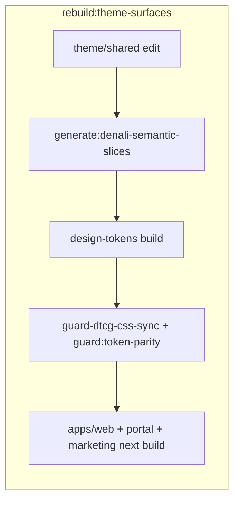

### Audit Point 9 — Versioning (manifest schema & registry backward compatibility, 2026-07-07)

**Scope:** Formal workspace/manifest versioning strategy; failure modes when `manifest.schema.ts` or extension admission rules change; backward-compatibility behavior in `WorkspaceRegistry` load path (`parseWorkspaceManifest`, `ensureWorkspaceRegistryLoaded`, codegen admission).

**Methodology:** Trace version fields across manifests, Zod schemas, codegen validators, and `WorkspacePlugin` contract validation; read `docs/MIGRATION-MAP.md` §8, `docs/dev/workspace-registry-runtime.mdoc`, `docs/phase-10/subphases/10.2-manifest-codegen.md`; grep for `manifest.version`, `pluginApiVersion`, `guestExtensionsVersion`, `memberPortal.manifestVersion`, `contractVersion` consumers.

#### Version field inventory (parallel authorities)

There is **no single manifest-schema versioning policy document**. Versioning is **fragmented** across layers:

| Field | Location | Current value (trunk) | Enforced where | Semantics |
| ----- | -------- | --------------------- | -------------- | --------- |
| `version` | `workspace.manifest.json` (top-level) | `1` (all four workspaces) | `WorkspaceManifestSchema` / `WorkspaceManifestCiSchema` — `z.number().int().positive()` only | Documented as **manifest schema revision** (`platform-architecture-v2.md`, `WORKSPACE-MANIFEST.schema.json`) — **not npm semver** |
| `pluginApiVersion` | `workspace.manifest.json` | `1` (denali **omits**; defaults to `1` in API) | Optional in runtime Zod; `workspace-definition.repository.ts` `?? 1` | Host plugin API contract (`phase-16` platform workspace definitions) |
| `guestExtensionsVersion` | Guest-capable manifests | `1` | `assertGuestExtensionsManifest` — **hard `=== 1`**; `guard-guest-extension-schema` | Guest extension block admission (PF-1.8) |
| `memberPortal.manifestVersion` | `memberPortal` block | `2` (urban, guest-club, denali) | `normalizeMemberPortalAvailability` — **hard `=== 2`**; v1 **removed** | Member portal registry schema (`phase-19`) |
| `guestCrossSurfaceNav.version` | GCSN block | `1` (denali only) | `assertGuestCrossSurfaceNavManifest` — **hard `=== 1`** | GCSN link schema |
| `plugin.version` | `WorkspacePlugin` object | per-plugin int (e.g. denali `1`) | `validateWorkspacePluginCore` — finite number, **no max** | Plugin registry breaking changes (`MIGRATION-MAP.md` §8.1) |
| `plugin.contractVersion` | `WorkspacePlugin` object | **literal `1`** | `validateWorkspacePluginCore` / payload validation — **reject `!== 1`** | SDK major — adapter layer on shape break |
| `canonical.schemaVersion` | Tour canonical document | `1` | API write path + `schema-version-compat.spec.ts` | Per-workspace canonical data (separate from manifest) |

**Formal strategy status:** **Partial.** `MIGRATION-MAP.md` §8 defines **plugin** `version` + `contractVersion` + planned `migrateCanonical` for canonical documents. Phase 10 defines **guest extension** and **member portal** sub-schema versions. There is **no** equivalent policy for top-level `workspace.manifest.json` `version` bumps, no migration adapters, and no registry-level version negotiation.

#### Registry loader — backward-compatibility audit

**Load path:**

```text
ensureWorkspaceRegistryLoaded()
  → createNodeWorkspaceManifestDiscoverer()
  → parseWorkspaceManifest(raw)     // WorkspaceManifestSchema (runtime)
  → WorkspaceRegistry.install()     // fail-closed on throw
```

| Behavior | Implementation | Backward-compat implication |
| -------- | -------------- | --------------------------- |
| **Extension blocks** | `.passthrough()` on both runtime and CI Zod schemas | **Forward-compatible:** new top-level keys in old manifests are **accepted** and preserved. **Unknown keys do not break load.** |
| **Strict core fields** | `id`, `version`, `package`, `workspaceTypes`, `plugin` required | **Breaking:** adding a new **required** top-level field to Zod **without** passthrough/default breaks **all** un-migrated manifests at `load()` with `WORKSPACE_MANIFEST_INVALID`. |
| **`manifest.version` consumption** | Validated as positive integer; **no branch** on value in registry loader | Setting `version: 2` today has **no effect** — no adapter, no warning. |
| **Id/directory invariant** | `manifest.id` must match parent folder name | Unchanged across versions — breaking rename. |
| **Duplicate workspace ids** | `WORKSPACE_REGISTRY_DUPLICATE_ID` throw | No silent overwrite. |
| **Migration/normalize hook** | **Absent** | No `migrateManifest(v, raw)` or version-specific parsers. |
| **CI vs runtime schema** | `WorkspaceManifestCiSchema` (strict `id`, `theme`, GCSN) vs `WorkspaceManifestSchema` (looser `theme`) | CI can fail on theme/GCSN while runtime accepts — dual authority (Audit Point 6). |

**Verdict:** Registry loader is **backward-compatible for extension key accumulation** (passthrough) but **not version-aware**. It does **not** implement semver negotiation, downgrade paths, or manifest revision adapters.

#### If manifest schema is updated — what breaks?

| Change type | Build (`generate:workspace-registry`) | CI (`guard:workspace-manifests`) | Runtime (`ensureWorkspaceRegistryLoaded`) |
| ----------- | ------------------------------------- | ---------------------------------- | ----------------------------------------- |
| New **optional** extension block + codegen `assert*` only when block present | Old workspaces **without** block: **PASS** | **PASS** (passthrough) | **PASS** |
| New **required** extension for guest tier (e.g. force `guestCatalog.enabled`) | **FAIL** at codegen for non-compliant workspaces | **PASS** until Zod tightened | **PASS** until Zod tightened |
| Tighten `WorkspaceManifestCiSchema` (new required top-level field) | Codegen reads manifests directly — may **FAIL** if assert added | **FAIL** `validate-manifests` | **FAIL** `parseWorkspaceManifest` if same field added to runtime schema |
| Bump `memberPortal.manifestVersion` to `3` without codegen update | **FAIL** — `manifestVersion must be 2` | **PASS** (not validated in CI Zod today) | **PASS** |
| `guestExtensionsVersion: 2` | **FAIL** — `guestExtensionsVersion: 1 is required` | **PASS** | **PASS** |
| `guestCrossSurfaceNav` with `version: 2` | **FAIL** at codegen | **PASS** | **PASS** |
| `plugin.contractVersion: 2` | N/A (plugin TS object, not manifest) | N/A | **FAIL** plugin validation if host loads plugin |
| Top-level `version: 2` only (no code change) | **PASS** | **PASS** | **PASS** — **silent no-op** |

**Historical breaking example (documented):** `memberPortal` **v1 removed** — manifests with `memberPortal.manifestVersion: 1` **fail codegen** with explicit error (`v1 removed — set availability explicitly`). This is a **build-time** break, not a runtime registry migration.

**Un-migrated workspace in repo:** Any checked-in manifest that fails `assertGuestExtensionsManifest`, `normalizeMemberPortalAvailability`, or `generate:workspace-registry` **blocks** `pnpm run generate:workspace-registry` and guards that call `discoverManifests()` — **monorepo build/codegen fails** before apps start.

**Runtime-only deployment** (hypothetical future DB-stored manifest JSON): Would load via `parseWorkspaceManifest` until Zod strict fields reject it; codegen asserts are **not** re-run at runtime — **stale extension shapes could load** and fail later in host code paths.

#### Alignment with MAP §8 plugin lifecycle

`MIGRATION-MAP.md` §8 specifies:

- `WorkspacePlugin.version` — monotonic int on breaking registry changes
- `WorkspacePlugin.contractVersion` — SDK major; bump triggers adapter layer
- `migrateCanonical` — canonical document dual-read (API integration tests exist; manifest path **does not**)

**Gap:** MAP §8 addresses **plugin objects** and **canonical tour data**, not **`workspace.manifest.json` schema revisions**. The top-level manifest `version` field is **documented but inert**.

#### Audit Point 9 summary

| Finding | Status | Criticality | Recommended fix |
| ------- | ------ | ----------- | --------------- |
| Documented plugin `contractVersion` + canonical `schemaVersion` strategy (MAP §8) | **PASS** | **Low** | Keep; extend explicitly to manifest schema. |
| Guest extension + member portal sub-schema versions enforced at codegen | **PASS** | **Low** | Document in single versioning index. |
| Top-level `manifest.version` validated but never interpreted | **WARNING** | **Medium** | Implement version gate or mark as documentation-only until policy lands. |
| No `migrateManifest` / version adapters in registry loader | **WARNING** | **High** | Add normalization layer before Zod parse (see policy below). |
| `.passthrough()` allows old manifests to load with extra keys | **PASS** | **Low** | Retain for extension blocks; do not rely on for security admission. |
| Tightening Zod strict fields breaks all un-migrated workspaces (build + runtime) | **WARNING** | **High** | Require migration window + `manifest.version` bump per policy. |
| `memberPortal` v1 hard-removed at codegen (no runtime migration) | **FAIL** | **Medium** | **Intentional** break — exemplifies current policy: codegen fails, no adapter. Un-migrated v1 **cannot** coexist in repo. |
| `contractVersion !== 1` rejected at plugin validation | **PASS** | **Low** | When bumping to `2`, ship SDK adapter before any plugin declares `2`. |
| Dual CI/runtime schemas without version matrix | **WARNING** | **Medium** | Unify or document which schema version each gate enforces. |

**Overall Audit Point 9 verdict:** **WARNING** — versioning is **real but fragmented** at sub-schema boundaries (guest extensions, member portal, GCSN, plugin contract). **No formal top-level manifest schema versioning policy** exists; `version: 1` is inert. **Backward compatibility** in the registry loader is **accidental** via Zod passthrough, not designed. **Breaking changes today fail at codegen** (preferred for monorepo) rather than offering migration adapters.

#### Proposed manifest schema versioning policy

**1. Version semantics**

| `workspace.manifest.json` `version` | Meaning |
| ------------------------------------- | ------- |
| `1` | Current trunk — all checked-in workspaces |
| `N+1` | Breaking change to **strict** Zod core or **required** extension admission |

**Non-breaking (no `version` bump):** new optional extension blocks; new optional keys inside blocks (passthrough); new codegen outputs gated on block presence.

**Breaking (requires `version` bump + migration):** new required top-level fields; removing/renaming strict fields; changing extension version constants (`guestExtensionsVersion`, `memberPortal.manifestVersion`).

**2. Loader contract (`workspace-sdk`)**

```typescript
// Proposed — packages/workspace-sdk/src/workspace-registry/migrate-manifest.ts
const SUPPORTED_MANIFEST_VERSIONS = [1] as const;
const CURRENT_MANIFEST_VERSION = 1;

export function normalizeWorkspaceManifestRaw(raw: unknown): unknown {
  if (!isPlainObject(raw)) return raw;
  const v = raw.version ?? 1;
  if (v === 1) return raw;
  // v === 2: return migrateV1ToV2(raw);  — explicit adapters only
  throw new Error(`WORKSPACE_MANIFEST_UNSUPPORTED_VERSION:${v}`);
}
```

Call `normalizeWorkspaceManifestRaw` **before** `WorkspaceManifestSchema.safeParse` in `parseWorkspaceManifest` and in `validate-manifests.ts`.

**3. Migration window rules**

| Phase | Duration | Enforcement |
| ----- | -------- | ----------- |
| **Announce** | PR + `docs/dev/manifest-schema-changelog.mdoc` | Document bump + adapter |
| **Dual-read** | 1 release | Codegen accepts v1 and v2; guards warn on v1 deprecation |
| **Cutover** | Guard flip | `guard:workspace-manifests` rejects `version < CURRENT` |
| **Removal** | After cutover | Delete v1 adapter |

**4. Sub-schema version registry (single doc)**

Maintain `docs/dev/manifest-version-index.mdoc`:

| Sub-schema | Current | Min supported | Migration |
| ---------- | ------- | ------------- | --------- |
| Top-level manifest | `1` | `1` | — |
| `guestExtensionsVersion` | `1` | `1` | TBD for `2` |
| `memberPortal.manifestVersion` | `2` | `2` | v1 **removed** (no adapter) |
| `guestCrossSurfaceNav.version` | `1` | `1` | — |
| `pluginApiVersion` / `contractVersion` | `1` | `1` | SDK adapter on bump |

**5. CI gates to add**

- `guard:manifest-version` — all `packages/workspaces/*/workspace.manifest.json` declare `version === CURRENT_MANIFEST_VERSION` (or explicit allowlist during dual-read).
- Wire `generate:denali-semantic-slices --check` + `memberPortal.manifestVersion` into `phase-0:foundation-gate` alongside `guard:workspace-manifests`.
- Codegen: `migrateManifestForCodegen(manifest)` shim so old versions can be tested in fixtures before trunk migration.

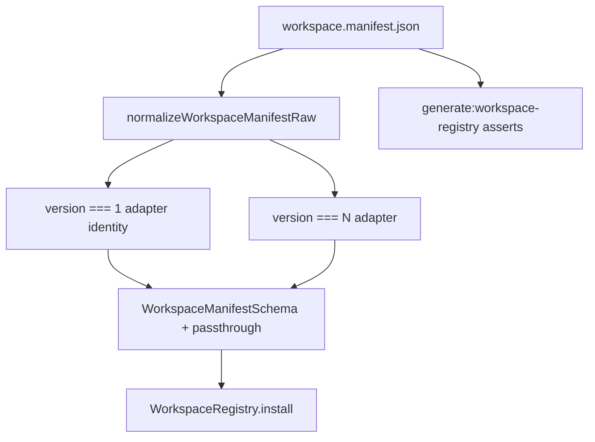

### Audit Point 10 — State Consistency (tenantConfig ↔ plugin-host ↔ frontend, 2026-07-07)

**Scope:** Workspace-plugin-host synchronization between backend `tenantConfig` (Postgres `tenants.theme`, registry metadata) and frontend React state across Admin (`apps/web`), Portal (`apps/portal`), and Marketing (`apps/marketing`). Includes `workspace-plugin-host` registration, `WorkspaceRegistry` manifest theme ingress, and guest vs operator branding paths.

**Methodology:** Trace bootstrap chains (`resolveBootstrapAppSessionForHostAsync`, `resolveGuestSurfaceBootstrapForHost`, `fetchTenantThemeForContext`); read API cache layers (`tenant-registry-cache.ts`, `tenant-config-response-cache.ts`, `updateTenantRegistryRow`); inspect client hydration (`hydrateBootstrapSession`, `AppProviders`, `PortalProviders`); grep `nextRevalidate`, `router.refresh`, `invalidateBranding`; cross-check `apps/api/test/4-integration/dynamic-config-sync.spec.ts` and `SYSTEM_HEALTH_REPORT.md` §10.

#### Synchronization topology

Tenant-facing state is **not one pipeline** — three parallel theme/config authorities feed the UI:

```text
┌──────────────────────────────────────────────────────────────────────────────┐
│ A. DB tenant branding (TenantThemeConfig) — primaryColor, cssVariables, logo │
│    Postgres tenants.theme → resolveRegisteredTenant → GET /api/v2/tenant-config│
│    Consumers: Admin only (ThemeProviderChain tenantTheme ingress)            │
├──────────────────────────────────────────────────────────────────────────────┤
│ B. Workspace manifest theme (theme / themeJson) — L3 skin + inline CSS vars  │
│    workspace.manifest.json → WorkspaceRegistry singleton → readWorkspace...  │
│    Consumers: Admin (importAdminThemeForPlugin), Portal/Marketing (manifest) │
├──────────────────────────────────────────────────────────────────────────────┤
│ C. Guest bootstrap identity — tenantId + pluginId + workspaceType            │
│    GET /public/tenant-context → guest-surface-host bootstrap                 │
│    Consumers: Portal/Marketing layout; Admin host bind when no dev map       │
└──────────────────────────────────────────────────────────────────────────────┘

workspace-plugin-host (packages/workspace-plugin-host/src/register.ts)
  → ensureWorkspacePluginsRegistered() — idempotent, once per process
  → codegen intake/registration-flow plugins (portal registration UX)
  → NOT wired to tenantConfig refresh; orthogonal to theme sync
```

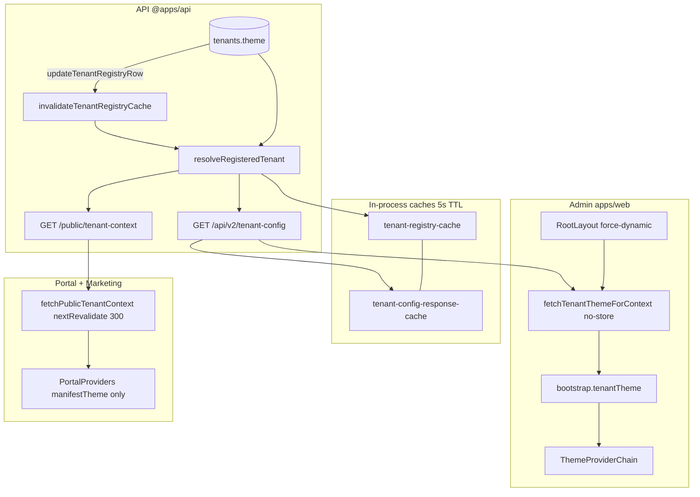

#### Propagation latency by change type

| Change source | Backend visibility | Admin frontend | Portal / Marketing | Notes |
| ------------- | ------------------ | -------------- | ------------------ | ----- |
| `tenants.theme` PATCH (branding settings, urban `persistTenantTheme`) | **Immediate** after `updateTenantRegistryRow` → `invalidateTenantRegistryCache` + `invalidateTenantConfigResponseCache` | **Next RSC render** — `fetchTenantThemeForContext` uses `cache: "no-store"`; branding page calls `router.refresh()` + `invalidateBranding()` | **Not consumed** — guest surfaces use manifest theme only (`PortalProviders` comment: no `TenantThemeProvider`) | Integration proof: `dynamic-config-sync.spec.ts` |
| `tenants.theme` read without prior invalidation | Up to **5s** stale (`CACHE_TTL_MS` / `TENANT_CONFIG_RESPONSE_CACHE_TTL_MS`) | Same bound on API response; layout still re-fetches each request | N/A | Writes always invalidate |
| `workspace_type` / subdomain registry change | Immediate on write + invalidation | `pluginId` from bootstrap may lag **up to 300s** when resolved via `fetchPublicTenantContextForHost` (`nextRevalidate: 300`) | **Up to 300s** on `pluginId` / `workspaceType` bootstrap | Admin authenticated path uses session `tenantId`; host-bind path uses cached public context |
| `workspace.manifest.json` `theme` / codegen registry | Filesystem at process start | **Stale until Node process restart** — `ensureWorkspaceRegistryLoaded()` short-circuits when `workspaceRegistry.isLoaded()` | Same — manifest theme per layout request after registry warm, but **not** re-read from disk | `SYSTEM_HEALTH_REPORT.md` §10.4 |
| `workspace-plugin-host` codegen (intake/registration plugins) | N/A | N/A | **Stale until portal/marketing process restart** — `registered` flag never resets | Side-effect import at module load |
| Urban settings JSON in `tenants.theme` (registration policy, etc.) | Immediate (same write path) | Theme vars sync on `router.refresh`; **no universal refresh** on urban settings PATCH from other admin routes | N/A | Operator must navigate or refresh manually outside branding flow |

**Answer — “How long until branding/config reaches the frontend?”**

- **Admin tenant branding (colors, logo, displayName):** Typically **one navigation or `router.refresh()`** after save (~sub-second server round-trip). Worst case **5s** on API read cache if a write path bypassed `updateTenantRegistryRow` (not observed on trunk branding/urban paths).
- **Admin manifest / DTCG skin:** **Until deploy restart** (registry singleton + hashed CSS bundles).
- **Portal/Marketing appearance:** **Manifest/DTCG only** — DB `tenantConfig.theme` does **not** propagate to guest surfaces today.
- **Portal/Marketing tenant routing (`pluginId`):** **Up to 300 seconds** via Next.js Data Cache on `/public/tenant-context` fetches.

#### Stale-state paths (persist until full reload or process restart)

| Path | Symptom | Until |
| ---- | ------- | ----- |
| `WorkspaceRegistry` singleton (`ensureWorkspaceRegistryLoaded`) | Manifest `theme`, `themeStylesheets`, plugin metadata unchanged after disk edit | **Process restart** (all three apps + API if registry loaded there) |
| `ensureWorkspacePluginsRegistered()` (`workspace-plugin-host`) | Portal registration plugin table stale after codegen | **Process restart** |
| `workspace-plugin-load-cache` (Admin server plugin loader) | Cached `WorkspacePlugin` module per `pluginId` | Registry codegen revision change or explicit `invalidateWorkspacePluginLoadCache()` — **not** called on tenant theme writes |
| Guest `nextRevalidate: 300` (`resolve-portal-bootstrap.ts`, `resolve-marketing-bootstrap.ts`, `resolve-marketing-site-surfaces.ts`, `apps/web/src/tenant/fetch-public-tenant-context.server.ts`) | Wrong `pluginId` / `workspaceType` after tenant reprovision or workspace reassignment | **Up to 300s** or hard navigation that bypasses Data Cache |
| Admin client `ThemeProviderChain` without RSC re-render | `tenantTheme` prop frozen from initial `bootstrap` | **`router.refresh()`** or full document load — client `hydrateBootstrapSession` does **not** re-fetch theme |
| Multi-tab Admin | Tab A saves branding; Tab B chrome stale | Manual refresh/navigation in Tab B — **no cross-tab push** |
| Portal/Marketing DB branding | Operator expects portal to mirror admin primary color from `tenants.theme` | **Never** (by design today) — requires product change |

#### workspace-plugin-host vs tenantConfig coupling

`packages/workspace-plugin-host/src/register.ts` registers **workspace intake/registration-flow plugins** from generated manifests at import time. This is **static plugin discovery**, not a live sync channel to `tenantConfig`:

- `registered` boolean prevents re-registration; manifest/codegen changes require **process recycle**.
- Portal shell imports this package; it does **not** subscribe to `GET /api/v2/tenant-config` or registry invalidation events.
- Admin uses a **separate** bootstrap path: `resolveBootstrapWorkspacePlugin` (server) / `resolveBootstrapWorkspacePluginClient` (client stub) plus per-request `fetchTenantThemeForContext`.

**Assessment:** Plugin-host and tenantConfig are **architecturally decoupled**. Consistency depends on bootstrap layers (A/B/C above) staying aligned by convention, not a single sync bus.

#### Existing invalidation hooks (partial coverage)

| Mechanism | Trigger | Clears |
| --------- | ------- | ------ |
| `updateTenantRegistryRow` | Branding PATCH, urban `persistTenantTheme`, provisioning | Registry cache + tenant-config response cache |
| `POST /internal/cache-invalidate` | Service JWT (prod) / dev provisioning guard | `invalidateTenantRegistryCache(tenantId, subdomain)` |
| `router.refresh()` + `invalidateBranding()` | Branding settings UI only | RSC theme refetch + client logo/displayName cache |
| `invalidateWorkspacePluginLoadCache()` | Tests/codegen hook only | Admin plugin module cache |

**Gap:** No hook ties tenant writes to **guest Next.js Data Cache** (`revalidateTag` / `revalidatePath`) or **workspace registry reload**. No websocket/SSE push exists.

#### Audit Point 10 summary

| Finding | Status | Criticality | Recommended fix |
| ------- | ------ | ----------- | --------------- |
| DB `tenants.theme` → `/api/v2/tenant-config` without restart (`dynamic-config-sync.spec.ts`) | **PASS** | **Low** | Keep integration spec in Phase 4/5 regression. |
| Write path invalidates registry + tenant-config response cache (`updateTenantRegistryRow`) | **PASS** | **Low** | Ensure all theme mutation ports call this helper (urban already does). |
| Admin per-request theme fetch (`cache: "no-store"`, `force-dynamic`) | **PASS** | **Low** | No change. |
| Branding UI explicit `router.refresh()` + `invalidateBranding()` | **PASS** | **Low** | Extend pattern to any future theme mutation UIs. |
| Guest surfaces ignore DB `tenantConfig.theme` (manifest-only branding) | **WARNING** | **Medium** | Product decision: either document as intentional (L3 manifest owns guest brand) or add `TenantThemeProvider` ingress on portal with no-store fetch. |
| `nextRevalidate: 300` on public tenant-context (Admin host-bind, Portal, Marketing) | **WARNING** | **Medium** | Short-lived invalidation: lower to 30–60s **or** `cache: "no-store"` for `pluginId` resolution; on tenant provision call `revalidatePath` from BFF or POST cache-invalidate fan-out. |
| `WorkspaceRegistry` + `workspace-plugin-host` stale until process restart | **WARNING** | **High** | Registry reload on manifest mtime/hash mismatch; deploy already restarts — add dev `SIGUSR1` or file watcher in local tooling. |
| No websocket/SSE push for tenant config changes | **WARNING** | **Medium** | Optional `tenant-config:updated` SSE channel for Admin multi-tab; guest surfaces lower priority if manifest-owned. |
| Client `tenantTheme` frozen until RSC refresh (SPA navigation) | **WARNING** | **Medium** | After any settings PATCH, standardize `router.refresh()` in mutation hooks; or client SWR poll on `tenant-config` with `ETag`. |
| `invalidateWorkspacePluginLoadCache` not wired to tenant writes | **PASS** | **Low** | Plugins are tenant-agnostic modules — no fix unless plugins embed tenant config. |

**Overall Audit Point 10 verdict:** **WARNING** — **Admin DB branding sync is sound** (immediate invalidation + per-request fetch + branding-page refresh). **Guest surfaces are intentionally decoupled** from `tenantConfig.theme` and can serve **stale `pluginId` for up to 300s**. **Manifest/plugin-host state requires process restart**, creating a split-brain between operator “live” branding and workspace skin changes. **No push-based consistency** layer exists.

#### Recommended fix — short-lived cache invalidation + optional push

**Phase 1 — TTL alignment (low effort)**

1. Set guest bootstrap `nextRevalidate` to **60** (or `0` / `no-store` for `pluginId` only) in `resolve-portal-bootstrap.ts`, `resolve-marketing-bootstrap.ts`, `resolve-marketing-site-surfaces.ts`, and `apps/web/src/tenant/fetch-public-tenant-context.server.ts`.
2. On `updateTenantRegistryRow`, emit an internal event (or extend `POST /internal/cache-invalidate`) so **each app BFF** calls `revalidateTag(\`tenant-context:${tenantId}\`)` — add matching `fetch` tags in `fetchPublicTenantContextForHost`.
3. Keep API **5s** TTL on `tenant-config` response cache; optionally drop to **1–2s** under `TENANT_CONFIG_RESPONSE_CACHE_TTL_MS` if sub-second admin chrome is required cross-tab without push.

**Phase 2 — Registry freshness (deploy-critical)**

1. Extend `ensureWorkspaceRegistryLoaded` to compare on-disk manifest aggregate hash vs loaded revision; reload when mismatch (or on `POST /internal/cache-invalidate?scope=workspace-registry`).
2. Document: manifest `theme` edits **require** rolling restart until Phase 2 lands (`SYSTEM_HEALTH_REPORT.md` §10.6 theme-lock strategy).

**Phase 3 — Push channel (multi-tab / multi-operator)**

1. Add `GET /api/v2/tenant-config/events` (SSE) or websocket room `tenant:{tenantId}` broadcasting `{ type: "tenant-config:updated", revision }` after `updateTenantRegistryRow`.
2. Admin client: subscribe in `AppProviders`; on event → `router.refresh()` + `invalidateBranding()` (debounced 250ms).
3. Portal/Marketing: only if product requires live DB branding on guest surfaces — otherwise skip push and keep manifest authority.

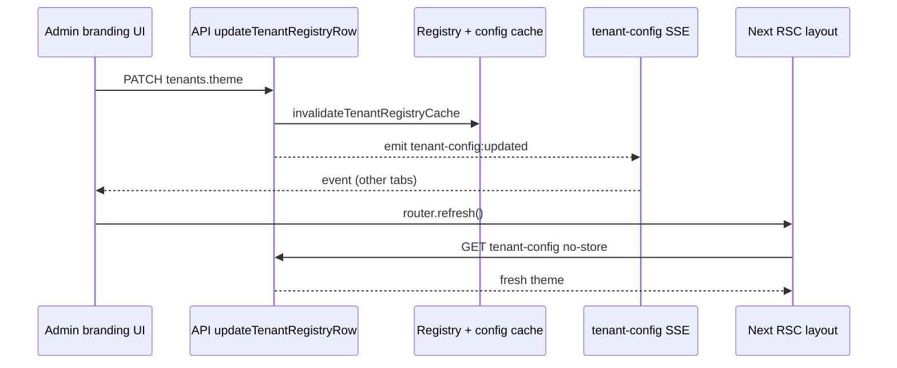

---

## Category 3: Enterprise Backend Standards

### Audit Point 13 — API Consistency (controller validation & tenant context, 2026-07-07)

**Scope:** `@apps/api` HTTP route layer — validation strategies (Zod vs manual), tenant-context ingress (`TenantKernel`, `requireOperatorSession`, `runWithHttpRequestContext`), and endpoints that still perform ad-hoc `tenantId` parsing outside the centralized auth path.

**Methodology:** Full trace of `apps/api/src/app.ts` dispatch; inventory of 20 `*.routes.ts` files + 32 `routes/platform/*.ts` handlers + 6 `routes/internal/*.ts` handlers; grep for `safeParse`, `z.object`, `requireOperatorSession`, `resolveTenantContextFromRequest`, `resolveTenantIdFromRequest`, `tenantId.trim()`; read `tenant-kernel.ts`, `bind-request-context.ts`, `error-interceptor.ts`, representative manual parsers (`settings.routes.ts`, `bookings.routes.ts`, `auth.routes.ts`).

#### HTTP stack — no framework middleware chain

The API is **raw Node.js `http`** with pathname dispatch in `app.ts`. There is **no Express/Fastify-style global middleware stack**. Each matched route invokes a named handler directly. Cross-cutting concerns are applied **per handler** via explicit calls:

```text
createRequestListener (app.ts)
  └─ runWithTraceContext (trace ALS)
       └─ route handler
            ├─ Auth: resolveTenantContextFromRequest | requireOperatorSession | assertPlatformOpsAuth | service JWT
            ├─ Context: runWithHttpRequestContext (tenant ALS + rate limit + tour-write budget)
            ├─ Body: readJsonBody / readTourRequestBody / readIdentityRequestBody
            ├─ Validation: Zod safeParse OR manual typeof/trim helpers
            └─ error-interceptor.ts (ZOD_VALIDATION_FAILED → 400, UNAUTHORIZED_* → 401)
```

**Answer — “Do all endpoints use centralized middleware or standardized Zod validation?”**

**No.** Tenant **authentication** is largely centralized (`TenantKernel` + `requireOperatorSession`), but **request-body validation is not**. Only **~13 Zod schema files** exist; the majority of operator routes (~70+ handlers across bookings, users, settings, integrations, exposure, workspace-drafts, branding) use **hand-written `typeof body` / `.trim()` parsers** per file.

#### Validation adoption matrix

| Layer | Centralized? | Authority | Coverage |
| ----- | ------------ | --------- | -------- |
| **JSON syntax + size** | **Yes** | `http/json.ts` — `readRequestBodyRaw`, `parseJsonBody`, body size limits | All routes using shared readers |
| **Tenant auth (operator)** | **Mostly** | `tenant-kernel/tenant-kernel.ts` → `resolveTenantContextFromRequest`; `identity/require-operator-session.ts` | ~77 handler call sites use `requireOperatorSession`; tours CRUD uses kernel directly (split) |
| **Tenant ALS + rate limit** | **Per-handler** | `http/bind-request-context.ts` → `runWithHttpRequestContext` | Operator routes that call it; **exceptions** below |
| **Body schema (Zod)** | **Partial** | 13 `*.schema.ts` files | Tours (4), Platform mutations (8), `provision-tenant`, inline `cache-invalidate` |
| **Body schema (manual)** | **Majority** | Per-route `typeof`/`trim` | `settings.routes.ts` (~15+ manual checks), `bookings.routes.ts`, `users.routes.ts`, `integrations.routes.ts`, `tenant-branding.routes.ts`, `workspace-drafts.routes.ts`, platform OTP handlers |
| **Query params** | **Manual** | Per-route | `list-tours-query.ts`, bookings list filters, exposure query parsers |
| **Error shape** | **Mostly** | `error-interceptor.ts` + `sendJson` | Platform routes sometimes use raw `res.writeHead` |

**Zod schema files (complete inventory):**

`create-tour.schema.ts`, `update-tour.schema.ts`, `clone-tour.schema.ts`, `clone-photo-remint.schema.ts`, `provision-tenant.schema.ts`, and eight under `routes/platform/*.schema.ts` (`create-platform-tenant`, `create-platform-workspace-definition`, `create-platform-team-member`, `create-tenant-domain`, `update-platform-tenant-status`, `update-platform-tenant-workspace-definition`, `update-tenant-subscription`, `publish-platform-workspace-definition-version`). Inline Zod in `cache-invalidate.ts`.

#### Tenant context — three parallel auth domains

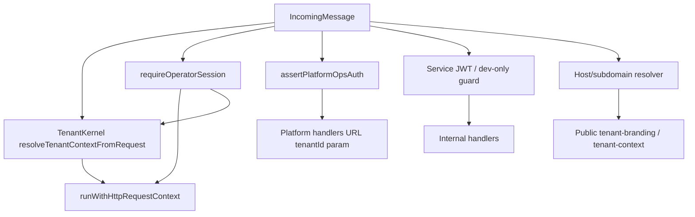

| Domain | Entry | Tenant resolution | ALS bind |
| ------ | ----- | ----------------- | -------- |
| **Operator (standard)** | `requireOperatorSession` → `runWithHttpRequestContext` | JWT / session cookie / trusted headers (`x-authenticated-tenant-id`) | Yes |
| **Operator (slim)** | `resolveTenantContextFromRequest` → `runWithHttpRequestContext` | Same kernel; **skips** DB membership hydration | Yes |
| **Platform ops** | `assertPlatformOpsAuth` | `tenantId` from URL capture (`/platform/v1/tenants/:id/...`) | **No** |
| **Pre-login auth** | Duplicated `resolveTenantIdFromRequest` | Header-only: `assertRequiredAuthHeaders` + `parseRequestAuth` | **No** |
| **Public guest** | `resolvePublicIngressSubdomain` | Host header → subdomain lookup | **No** |
| **Internal** | Service JWT or `provisioning-guard` | Body/path `tenantId` where applicable | Partial |

**Trusted tenant contract** (`auth/request-context.ts`):

- `x-authenticated-tenant-id` is **required** and authoritative.
- `x-tenant-id` claim must **match** trusted id or `FORBIDDEN_TENANT_CLAIM_MISMATCH` is thrown.
- This logic is **centralized** for kernel paths; pre-login helpers call the same `parseRequestAuth` but **bypass** JWT/session resolution.

#### Auth inconsistency on tour routes (same resource, two trust levels)

| Handler | Auth path | Membership hydrate |
| ------- | --------- | ------------------ |
| `handleCreateTour`, `handlePatchTour`, `handleGetTour` | `resolveTenantContextFromRequest` | **No** |
| `handleListTours` (operator view) | `requireOperatorSession` | Yes |
| `handleCloneTour` | `requireOperatorSession` | Yes |

Documented rationale in `require-operator-session.ts`: header-only ingress matches POST `/tours` for integration-test concurrency. **Risk:** create/patch/get accept trusted headers without session cookie validation path used by clone/list.

#### Endpoints with manual `tenantId` validation (outside TenantKernel)

These handlers parse or validate `tenantId` **outside** `resolveTenantContextFromRequest` / `requireOperatorSession`:

| File | Handler(s) | Endpoint(s) | Manual pattern |
| ---- | ---------- | ----------- | -------------- |
| `identity/auth.routes.ts` | `resolveTenantIdFromRequest` → `handlePhonePreflight`, `handleRequestOtp`, `handleVerifyOtp` | `POST /auth/phone-preflight`, `/auth/request-otp`, `/auth/verify-otp` | Header-only `x-authenticated-tenant-id` via `assertRequiredAuthHeaders` + `parseRequestAuth` — **no JWT path** |
| `identity/public-auth.routes.ts` | **Duplicate** `resolveTenantIdFromRequest` → `handlePublicPhonePreflight`, `handlePublicRequestOtp`, `handlePublicVerifyOtp`, `handlePublicRegisterComplete` | `POST /public/auth/*` | Same duplicate helper (copy-paste drift risk) |
| `routes/internal/outbox-replay.ts` | `parseReplayBody` → `handleReplayOutbox` | `POST /internal/outbox/:id/replay` | `body.tenantId.trim()` — **no auth**, **no ALS**, dev/non-prod only |
| `routes/internal/cache-invalidate.ts` | `handleCacheInvalidate` | `POST /internal/cache/invalidate` | Optional Zod `tenantId` in body (cache key eviction) |
| `routes/internal/tenants.ts` | `handleProvisionTenant` | `POST /internal/tenants/provision` | Zod UUID `tenantId` in body (provisioning, not operator session) |
| `tenant/tenant-config.routes.ts` | `handleTenantConfig` | `GET /api/v2/tenant-config` | Post-kernel: `tenant.id !== auth.tenantId` host/subdomain mismatch guard |
| `tours/tours.service.ts` | `createTour` service | `POST /tours` (body) | `assertTenantClaimMatchesAuth(body.tenantId, auth)` when optional body `tenantId` present |
| `routes/platform/*.ts` (32 handlers) | All platform tenant mutations | `/platform/v1/tenants/:id/...` | `tenantId` from URL regex capture — **no `.trim()` / UUID format check** at route boundary; validated indirectly via `repository.getById(tenantId)` |
| `tenant/tenant-branding.routes.ts` | `handlePublicTenantBranding`, `handlePublicTenantContext` | `GET /public/tenant-branding`, `/public/tenant-context` | **Host/subdomain** resolution — no `x-tenant-id` headers |
| `routes/internal/db-pool-hold.ts` | `handleDbPoolHold` | `GET /internal/test/db-pool-hold` | TenantKernel headers; test-only; **no** `runWithHttpRequestContext` |

**Handlers using centralized operator path (representative, not exhaustive):**

`bookings.routes.ts` (7), `users.routes.ts` (17), `settings.routes.ts` (12 of 13 — `handleMutateSettingsExplore` is stub), `integrations.routes.ts` (11), `exposure.routes.ts` (7), `workspace-drafts.routes.ts` (5), `tenant-branding.routes.ts` (5 operator handlers), `me*.routes.ts`, `invites.routes.ts`, tour wizard photos, clone-photo-remint.

**Handlers that skip ALS despite operator session:**

| File | Handler | Gap |
| ---- | ------- | --- |
| `identity/auth.routes.ts` | `handleGetAuthSession`, `handleGetAuthAbilityContext` | `requireOperatorSession` but **no** `runWithHttpRequestContext` — tenant ALS not bound |
| `settings/settings.routes.ts` | `handleMutateSettingsExplore` | `requireOperatorSession` then hard-forbidden stub — no ALS |

#### Platform route body-reading duplication

At least **9 platform mutation handlers** reimplement local `async function readJsonBody(req)` instead of `http/json.ts` `readRequestBodyRaw` (no shared size-limit enforcement):

`tenants-status-patch.ts`, `tenants-workspace-definition-patch.ts`, `tenants-subscription-patch.ts`, `workspace-definitions-post.ts`, `workspace-definitions-versions-post.ts`, `tenants-domains.ts`, `tenants-owner-invite-post.ts`, `auth-request-otp.ts`, `auth-verify-otp.ts`.

Platform mutations with Zod: status, workspace-definition, subscription, workspace-definitions create/publish, tenant-domain create, platform-tenant create. Platform OTP/invite handlers remain **manual JSON field trim**.

#### Additional consistency gaps

1. **Optional `tenantId` in create-tour body** — `create-tour.schema.ts` allows optional `tenantId`; mismatch deferred to `tours.service.ts` `assertTenantClaimMatchesAuth` instead of rejecting at schema (asymmetric with header-trusted model).
2. **Three parallel auth systems** — TenantKernel, Platform ops bearer, Internal service JWT — intentional separation but no shared `RouteContext` abstraction.
3. **Workspace package HTTP** — Urban/finance/denali hosts inject `resolveTenantContextFromRequest` at configure time (`configure-urban-http-host.ts`, `configure-workspace-finance-http-host.ts`); validation inside workspace packages is **out of scope** for this gate but adds a fourth ingress style.
4. **Error response divergence** — Platform handlers mix `sendJson` patterns with direct `writeHead`; tenant routes consistently use `error-interceptor`.

#### Audit Point 13 summary

| Finding | Status | Criticality | Recommended fix |
| ------- | ------ | ----------- | --------------- |
| Centralized tenant auth kernel (`resolveTenantContextFromRequest`, trusted `x-authenticated-tenant-id`) | **PASS** | **Low** | Keep as single ingress; document header contract in API standards doc. |
| Operator ALS + rate limit via `runWithHttpRequestContext` on standard routes | **PASS** | **Low** | Extend to `handleGetAuthSession` / `handleGetAuthAbilityContext`. |
| Zod validation on all mutation endpoints | **FAIL** | **High** | Expand Zod to bookings, users, settings, integrations, workspace-drafts, branding PATCH bodies. |
| No global validation middleware / route wrapper | **WARNING** | **Medium** | Introduce `withValidatedRoute` helper (see below). |
| Duplicated `resolveTenantIdFromRequest` in auth + public-auth | **WARNING** | **Medium** | Extract `resolvePreLoginTenantFromRequest` to `tenant-kernel/` or `auth/`. |
| Tour CRUD uses slim kernel; clone/list use full operator session | **WARNING** | **Medium** | Align on `requireOperatorSession` or document intentional split in phase-4 tenant-theme doc. |
| `handleReplayOutbox` manual `tenantId` without auth/ALS | **WARNING** | **High** | Require service JWT + `runWithHttpRequestContext` before replay. |
| Platform `readJsonBody` duplication (no shared body limits) | **WARNING** | **Medium** | Consolidate to `readRequestBodyRaw` + `parseJsonBody`. |
| Platform URL `tenantId` without format validation at boundary | **WARNING** | **Low** | Add `z.string().uuid()` or shared `tenantIdParamSchema` in registrar. |
| Public routes use host tenant; operator routes use headers — dual resolver | **PASS** | **Low** | Document as intentional (WRS-001 / PCMS-001); optional shared `TenantResolver` interface. |

**Overall Audit Point 13 verdict:** **WARNING** — **tenant authentication is centralized and well-tested** (`TenantKernel`, claim-mismatch guard, DEC-074 cache paths), but **request validation is fragmented**. Zod covers **~10% of mutation surface** (tours + platform + provision). **Manual `tenantId` parsing persists** on pre-login auth (7 handlers), internal outbox replay, optional create-tour body field, and platform URL params. **No standardized route decorator** binds auth + ALS + Zod today.

#### Recommended fix — standardized tenant-context route wrapper

Introduce a thin composable wrapper (no full framework migration) in `apps/api/src/http/with-tenant-route.ts`:

```typescript
// Proposed — binds auth + ALS + optional Zod body in one call site
export function withTenantRoute<TBody>(
  options: {
    readonly auth: "operator" | "kernel" | "platform" | "public-host";
    readonly rateLimit?: "read" | "write";
    readonly bodySchema?: z.ZodType<TBody>;
  },
  handler: (ctx: {
    readonly req: IncomingMessage;
    readonly res: ServerResponse;
    readonly auth: TenantAuthContext;
    readonly body: TBody;
  }) => Promise<void>
): (req: IncomingMessage, res: ServerResponse) => Promise<void>;
```

**Rollout phases:**

1. **Extract** shared `resolvePreLoginTenantFromRequest` — delete duplicate in `public-auth.routes.ts`.
2. **Migrate** high-risk manual parsers first: `outbox-replay.ts` (add service JWT + ALS), `bookings.routes.ts`, `users.routes.ts` mutation bodies.
3. **Align** tour handlers on `auth: "operator"` unless integration tests require `"kernel"` — if so, gate with `NODE_ENV === "test"` only.
4. **Platform consolidation** — single `readPlatformJsonBody(req)` wrapping `readRequestBodyRaw`; URL params validated with `tenantIdParamSchema` in `platform-route-registrar.ts` before handler dispatch.
5. **CI guard** — `guard:api-route-validation` fails if new `*.routes.ts` handlers use `typeof body` without `*.schema.ts` or `withTenantRoute` (allowlist during migration).

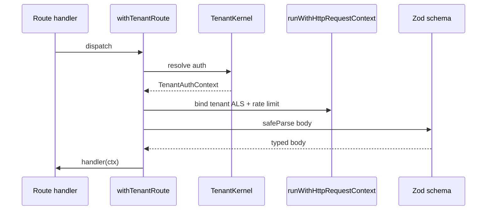

### Audit Point 14 — Error Handling (catch blocks, DB error masking, client leakage, 2026-07-07)

**Scope:** `@apps/api` error propagation from Prisma repositories through services to HTTP responses — catch-block inventory, database constraint error masking (P2002 unique, P2003 FK), and client-facing leakage vs `handleHttpError` centralized interceptor.

**Methodology:** Grep `catch (` across `apps/api/src` (~130+ sites); grep `PrismaClientKnownRequestError`, `P2002`, `P2003`; read `middleware/error-interceptor.ts`, `observability/log-safety.ts`, `db/database-connection-error.ts`, `db/transient-db-error.ts`; audit all `*repository*.ts` catch blocks; review platform route 500 handlers; cross-check `error-enrichment.spec.ts` (OBS-ERR-04), `database-unavailable-error-interceptor.spec.ts` (API-DB-CONN-05), `tenant-error-recovery.spec.ts` leak patterns.

#### Central error architecture

```text
Route handler catch → handleHttpError(res, error)   [operator / internal majority]
                 └→ custom map*Error / sendJson       [auth, workspace-drafts, wizard-photos, platform]
                 └→ raw writeHead + JSON.stringify   [platform routes — fragmented]

handleHttpError (middleware/error-interceptor.ts)
  ├─ Typed domain errors → stable code + safe message (40+ instanceof / is* guards)
  ├─ mapErrorMessageToStatus(message) → prefix-based HTTP status for string Error codes
  ├─ status === 500 → opaque { error: "internal_error" } + correlationId (DEC-038 / OBS-ERR-04)
  ├─ P1000 auth failure → 503 DATABASE_UNAVAILABLE (API-DB-CONN-05)
  ├─ Transient DB (P1001, P1017, …) → 503 service_unavailable
  └─ Fallback non-500 → { error: message, code: message }  ← string Error passthrough
```

**Design intent (documented):** `handleHttpError` comment states it **never serializes stack, SQL, or engine paths** in the response body. Integration tests (`OBS-ERR-04`) assert simulated faults map to `internal_error` without stack or path leakage. Logs use `resolveInternalErrorCode` — **never raw Prisma messages** on the shared stream (`log-safety.ts`).

There is **no global `AppError` class** or Prisma-specific HTTP classifier today — unhandled engine errors rely on the **500 opaque fallback**.

#### Repository catch-block inventory (`apps/api/src`)

Only **6 data-repository files** contain explicit `catch` blocks; the other **46** `*repository*.ts` files propagate errors to services unchanged:

| Repository | Catch behavior | Prisma code handled |
| ---------- | -------------- | ------------------- |
| `storage/prisma-tour.repository.ts` | `save` transaction | **P2002** → `FORBIDDEN_TOUR_STORAGE_CROSS_TENANT` domain string |
| `identity/prisma-identity.repository.ts` | `updateMobile` transaction | **P2002** → `MobileAlreadyRegisteredError` |
| `integrations/infrastructure/prisma-integration-delivery.repository.ts` | `enqueue` insert | **P2002** → return `false` (idempotent swallow) |
| `exposure/denali-reminder-activation.repository.ts` | `insertActivation` | **P2002** → return `false` |
| `bookings/prisma-bookings.repository.ts` | `bulkApprove` per-id loop | Skip `BookingNotFoundError` / `BookingStatusConflictError`; **rethrow** all others |
| `bookings/in-memory-bookings.repository.ts` | bulk paths | Rethrow |

**Adjacent non-repository Prisma catch sites (service/infra layer):**

| File | Pattern |
| ---- | ------- |
| `http/http-idempotency.ts` | P2002 race → retry/idempotent path |
| `integrations/http/integrations.service.ts` | P2002 → `IntegrationConnectionAlreadyExistsError` |
| `platform/create-platform-workspace-definition.ts` | P2002 → `PlatformDefinitionConflict` |
| `outbox/enqueue-domain-event.ts`, `events/processed-domain-event-log.ts` | P2002 idempotency |
| `outbox/outbox-relay.ts`, `outbox/outbox-failed.ts` | P2025 not-found |
| `tenant/tenant-route-lookup.ts` | P2021 missing table (migration guard) |

**Gap:** **Zero production handlers for P2003 (FK violation) or P2014 (relation violation)**. FK failures from unguarded writes surface as unclassified `PrismaClientKnownRequestError` → HTTP **500 `internal_error`** (masked but not semantically mapped to 409/422).

#### Are database-specific errors leaked to clients?

| Error class | Typical Prisma message | Client exposure today | Verdict |
| ----------- | ---------------------- | --------------------- | ------- |
| **P2002** unique constraint | `Unique constraint failed on the fields: (...)` | **Masked** on operator routes — either translated in repository/service **or** falls through to **500 `internal_error`** | **PASS** (no constraint name leak on trunk operator path) |
| **P2003** FK constraint | `Foreign key constraint failed on the field: (...)` | **Masked** → 500 `internal_error` when uncaught | **PASS** (masking); **WARNING** (no 409/422 mapping) |
| **P1000** DB auth | Engine auth message | **Masked** → 503 `database_unavailable` | **PASS** |
| **P1001/P1017** transient | Connection messages | **Masked** → 503 `service_unavailable` | **PASS** |
| **Unhandled Error** with path/stack | `simulated_fault at Object.<anonymous> (...)` | **Masked** → 500 `internal_error` (OBS-ERR-04) | **PASS** |
| **Platform provision saga failure** | Raw `err.message` including potential Prisma text | **LEAKED** — see below | **FAIL** |

**Confirmed leak (client-facing):**

```94:96:apps/api/src/routes/platform/tenants-create.ts
    res.writeHead(500, { "Content-Type": "application/json" });
    res.end(JSON.stringify({ error: (err as Error)?.message || "provision_failed" }));
```

`POST /platform/v1/tenants` (provision saga catch-all) serializes **`Error.message` directly** on 500. A Prisma P2002/P2003 during provisioning could expose **constraint field names** to platform ops clients. Other platform routes generally return `{ error: "internal_error" }` on 500 — this handler is an **outlier**.

**String Error passthrough (intentional but broad):**

`handleHttpError` lines 588–607: any `Error` whose message matches `mapErrorMessageToStatus` prefixes (`UNAUTHORIZED_*`, `ZOD_VALIDATION_FAILED`, `FORBIDDEN_*`, domain codes) returns **`{ error: message, code: message }`**. This is by design for machine-readable codes but means **any thrown string matching a prefix is client-visible**. Uncaught Prisma messages do **not** match these prefixes → safe 500 path.

#### Poor error masking / consistency gaps

| Instance | Location | Issue | Severity |
| -------- | -------- | ----- | -------- |
| **Raw `err.message` on 500** | `routes/platform/tenants-create.ts` | Prisma/SQL/path may reach platform client | **High** |
| **Bypass central interceptor** | `identity/auth.routes.ts`, `identity/public-auth.routes.ts` | Direct `sendJson(res, …, { error: error.message })` for OTP/identity typed errors — no `correlationId` envelope on some paths | **Medium** |
| **Per-route custom mappers** | `tenant-branding.routes.ts`, `tours/tour-wizard-photos.routes.ts`, `workspace-drafts/workspace-drafts.routes.ts` | Duplicate `map*Error` logic; version-conflict 409 includes `error.message` | **Low** |
| **Platform fragmented 500s** | 32 `routes/platform/*.ts` files | Mix of `internal_error`, `handleHttpError`, and `tenants-create` leak; no shared `handlePlatformError` | **Medium** |
| **Server-side stack in logs** | `routes/platform/tenants-get.ts` | `console.error` JSON includes `stack` — not client leak but noisy for prod | **Low** |
| **No Prisma→HTTP mapper** | `error-interceptor.ts` | P2002 uncaught → 500 not 409; P2003 → 500 not 422 | **Medium** |
| **409 message passthrough** | `handleHttpError` L602–604 | Non-canonical 409 errors return raw `message` as body | **Low** |
| **~46 repositories without catch** | Prisma repos | Rely entirely on HTTP layer — correct for masking, fragile for UX | **Low** |

**Catch-block dispersion:** ~**130+** `catch` blocks in `apps/api/src` (routes, platform, workers, outbox, identity). There is **no lint guard** requiring `handleHttpError` in catch bodies — compliance is conventional.

#### Existing safeguards (PASS highlights)

- **OBS-ERR-04** / **LOG-COL-01** — 500 responses are opaque; logs use `tenant_hash` + `error_code` only.
- **FORBIDDEN_LEAK_PATTERNS** in `error-enrichment.spec.ts` — blocks `prisma`, SQL verbs, stack traces, `apps/api/src/` paths in payloads.
- **API-DB-CONN-05** — Prisma P1000 maps to structured 503, not raw message.
- **Repository P2002 translations** — identity mobile, tour cross-tenant, integration connection duplicate — domain errors before HTTP boundary.
- **Workspace HTTP error bindings** — codegen `WORKSPACE_HTTP_ERROR_RESPONSE_BINDINGS` for urban/finance/denali typed errors.

#### Audit Point 14 summary

| Finding | Status | Criticality | Recommended fix |
| ------- | ------ | ----------- | --------------- |
| Operator 500s opaque (`internal_error` + correlationId) | **PASS** | **Low** | Keep OBS-ERR-04 in CI. |
| Prisma P1000/P1001 transient → 503 masked | **PASS** | **Low** | No change. |
| P2002 translated in key repositories (identity, tours, integrations) | **PASS** | **Low** | Extend pattern to bookings insert paths. |
| Uncaught P2002/P2003 → 500 not constraint leak | **PASS** | **Low** | Add semantic 409/422 mapping (below). |
| `tenants-create.ts` leaks `err.message` on provision 500 | **FAIL** | **High** | Immediate: `{ error: "internal_error", code: "PROVISION_FAILED" }` + `handleHttpError`. |
| No global Prisma error classifier in interceptor | **WARNING** | **Medium** | `mapPrismaErrorToAppError()` in AppError layer. |
| Auth/public-auth bypass `handleHttpError` | **WARNING** | **Medium** | Route all catches through interceptor for correlationId parity. |
| Platform routes fragmented error handling | **WARNING** | **Medium** | `handlePlatformHttpError` wrapper delegating to central interceptor. |
| P2003 FK never mapped to client-safe 409/422 | **WARNING** | **Medium** | Classify in repository or global mapper. |
| 130+ catch sites without mechanical enforcement | **WARNING** | **Low** | ESLint/guard: catch must call `handleHttpError` or rethrow `AppError`. |

**Overall Audit Point 14 verdict:** **WARNING** — **core operator path masks DB engine errors correctly** (500 opaque, tested). **Repository-layer P2002 handling is partial but effective** where implemented. **One confirmed client leak** on platform tenant provision (`tenants-create.ts`). **No unified `AppError` interceptor** — Prisma FK/unique semantics are lost behind generic 500s, and platform/auth routes bypass the central mapper.

#### Recommended fix — global `AppError` interceptor

Introduce `apps/api/src/errors/app-error.ts`:

```typescript
export class AppError extends Error {
  constructor(
    readonly code: string,
    readonly status: number,
    readonly expose: boolean = true,  // false → force opaque internal_error
    message?: string
  ) {
    super(message ?? code);
  }
}

export function mapPrismaToAppError(error: unknown): AppError | null {
  if (!(error instanceof Prisma.PrismaClientKnownRequestError)) return null;
  switch (error.code) {
    case "P2002": return new AppError("DUPLICATE_RECORD", 409);
    case "P2003": return new AppError("FOREIGN_KEY_VIOLATION", 422);
    case "P2025": return new AppError("RECORD_NOT_FOUND", 404);
    case "P1000": return new AppError(DATABASE_UNAVAILABLE, 503, false);
    default: return new AppError("INTERNAL_ERROR", 500, false);
  }
}
```

Extend `handleHttpError`:

1. At top: `const app = error instanceof AppError ? error : mapPrismaToAppError(error)` — if `app && !app.expose` → 500 `internal_error`; if `app.expose` → `app.status` + stable code.
2. Replace `tenants-create.ts` catch-all with `handleHttpError(res, err)` (or `handlePlatformHttpError`).
3. Add `wrapRoute(handler)` in `app.ts` outer try/catch as safety net for unhandled throws.
4. CI: extend `FORBIDDEN_LEAK_PATTERNS` with `Unique constraint failed`, `Foreign key constraint`; add platform provision saga fault injection test.

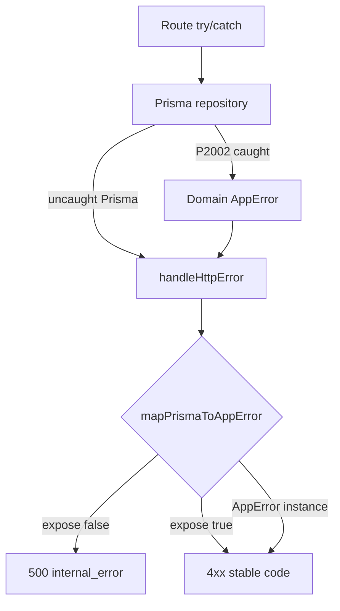

### Audit Point 15 — Query Performance (Prisma repositories, projections, N+1, 2026-07-07)

**Scope:** `@apps/api` data-access layer — `prisma-settings-config.repository.ts` (requested profile target) and high-traffic Prisma repositories: tours, bookings, identity, settings (config/resources/audit), integrations, exposure, workspace drafts, platform tenant, workspace finance. Schema authority: `apps/api/prisma/schema.prisma`.

**Methodology:** Static query-shape analysis (Prisma `findMany`/`findUnique`/`select`/`take`/`include` usage); grep for unbounded `findMany`, loop-bound `await` queries; compare index definitions vs `orderBy`/`where` patterns; no runtime EXPLAIN (read-only audit).

**Note:** Prisma does not emit literal SQL `SELECT *`, but **omitting `select`** fetches **all scalar columns** on the model (implicit full-row projection). Below, “full row” means no column pruning.

#### `prisma-settings-config.repository.ts` — profile

| Method | Query | Projection | Pagination | Assessment |
| ------ | ----- | ------------ | ---------- | ---------- |
| `get` L26–30 | `tenantConfig.findUnique` on `@@id([tenantId, configKey])` | **Full row** incl. `payload` Json | N/A (PK) | **PASS** — single-key KV read; callers need full config blob |
| `put` L41–55 | `tenantConfig.upsert` | Full row returned | N/A | **PASS** — write path must persist + return payload |
| `seed` L62–78 | `tenantConfig.upsert` | Full row | N/A | **PASS** — dev/seed only |

**Findings:** No `list`/`findMany` — **no unbounded scan risk** in this repository. `TenantConfig` has composite PK only (no secondary indexes needed for current access pattern). If version-check-only paths are added later, use `select: { configVersion: true }`.

**Contrast:** `platform/platform-tenant.repository.ts` `getSiteSurfacesByTenantId` fetches `select: { payload: true }` only — tighter than settings-config `get`, which is acceptable given settings service always hydrates full `TenantConfigPayload`.

#### Projection discipline — repo-wide

| Pattern | Repositories demonstrating it | Repositories missing it |
| ------- | ------------------------------ | --------------------- |
| `select` + `take` on lists | `platform-tenant.repository.ts`, `workspace-finance/finance.repository.ts`, `workspace-drafts` `listByScope` | `prisma-bookings`, `prisma-tour`, `prisma-identity`, `prisma-settings-audit`, `prisma-settings-resources` (6× `list*`), `prisma-integration-connection`, `prisma-exposure-intent` |
| Keyset/cursor pagination | `prisma-tour` `listByTenantPage` | Bookings, identity membership, settings audit, integration list |
| List without heavy Json | `workspace-drafts` `listByScope` excludes `data` | Tours always load `canonical`; bookings load `registrationIntake`; integrations load `credentials` |

#### High-traffic repository findings

**1. `storage/prisma-tour.repository.ts` — CRITICAL**

| ID | Issue | Lines | Impact |
| -- | ----- | ----- | ------ |
| TOUR-1 | `listByTenant` delegates to `listByTenantPage({ limit: Number.MAX_SAFE_INTEGER })` | 180–182 | Loads **all tours + full `canonical` Json** per tenant |
| TOUR-2 | `findUnique` / `findMany` / cursor row fetch — no `select` | 92–94, 168–170, 190–211 | Every read pulls multi-KB `canonical` even for metadata-only paths |
| TOUR-3 | `assertCapacity()` — **2× `count()`** (global + tenant) on every create | 63–67 | Doubles write-path DB round-trips |
| TOUR-4 | **Missing index** for `orderBy: [{ createdAt: "asc" }, { id: "asc" }]` | 207–210 | Existing `idx_tours_tenant_id` insufficient for keyset sort |

**Amplification:** `db/tour-storage.adapter.ts` L41–47 — `findMany` calls `listByTenant` (unbounded canonical load) instead of `listByTenantPage`.

**2. `bookings/prisma-bookings.repository.ts` — CRITICAL / HIGH**

| ID | Issue | Lines | Impact |
| -- | ----- | ----- | ------ |
| BK-1 | `listByTenant` — unbounded `operatorRegistration.findMany`, **no `select`**, no `take` | 85–92 | Fetches **`registrationIntake` Json** for every row; used **6×** in `bookings.service.ts` + `users.service.ts` L642 |
| BK-2 | `bulkApproveWithOutbox` — **N+1**: `for` loop → `approveWithOutbox` (separate transaction each, max 25) | 230–247 | Up to 25 sequential write transactions per bulk approve |
| BK-3 | `rejectBooking` / updates — `findFirst` without `select` before mutation | 258–260 | Full row including `registrationIntake` on status check |

**Index:** `idx_operator_registrations_tenant_status` matches `orderBy: submittedAt desc` — **adequate** once pagination is added.

**3. `identity/prisma-identity.repository.ts` — HIGH**

| ID | Issue | Lines | Impact |
| -- | ----- | ----- | ------ |
| ID-1 | `listMembershipsByTenant` — unbounded `userTenant.findMany`, full row incl. `membershipMetadata` Json | 127–131 | Team directory loads all members + JSON blobs |
| ID-2 | ~15 `userTenant.findUnique` without `select` on read-modify paths | 118–124+ | Over-fetches `membershipMetadata` / `sessionVersion` when only one field needed |

**Positive:** `findUserByMobile` / `findUserById` use `select`; `listUserRoleHistoryRows` uses `take: 50`.

**4. `settings/prisma-settings-audit.repository.ts` — HIGH**

| ID | Issue | Lines | Impact |
| -- | ----- | ----- | ------ |
| AUD-1 | `listByTenant` — unbounded `findMany`, no `take` | 28–35 | Settings explore loads entire audit trail per tenant |

**Index:** `idx_operator_settings_audit_tenant_occurred` matches `orderBy: occurredAt desc` — good for paginated follow-up.

**5. `settings/prisma-settings-resources.repository.ts` — MEDIUM**

Six catalog `list*` methods (`listEquipment`, themes, languages, presets, regions, destinations) — unbounded `findMany`, no `select`. Per-tenant catalog cardinality is low today; **create paths** call full `list*` to compute `sortOrder` (L229+) instead of `max(sortOrder)` aggregate.

**Indexes:** All catalog models have `@@index([tenantId, sortOrder, name])` — aligned with `orderBy`.

**6. `integrations/infrastructure/prisma-integration-connection.repository.ts` — HIGH**

| ID | Issue | Lines | Impact |
| -- | ----- | ----- | ------ |
| INT-1 | All reads without `select` — always fetches `config`, **`credentials`**, `capabilities` Json | 60–67, 75–83, 102–104, 114–123 | **Secrets in memory** on list/workspace scan paths |
| INT-2 | `listForWorkspace` unbounded | 114–123 | Low cardinality today; needs `take` guard |

**Positive:** `integrations.service.ts` maps P2002 → `IntegrationConnectionAlreadyExistsError` on create.

**7. `exposure/prisma-exposure-intent.repository.ts` — HIGH**

| ID | Issue | Lines | Impact |
| -- | ----- | ----- | ------ |
| EXP-1 | `listForConnectionScope` filters `scope` via **JSON path** `connectionId` | 110–118 | **No supporting index** — sequential scan + full row (`fieldDecorations` Json) |
| EXP-2 | `findForContext` — full row on unique lookup | 89–100 | Acceptable for single-row resolve |

**8. `workspace-drafts/prisma-workspace-drafts.repository.ts` — PASS (list) / MEDIUM (get)**

| Path | Assessment |
| ---- | ---------- |
| `listByScope` L74–90 | **Reference pattern** — `select` excludes heavy `data` Json |
| `get` / `patch` | Full `data` Json required for sync — expected |

**9. `workspace-drafts/prisma-workspace-draft-events.repository.ts` — MEDIUM**

`listByDraft` L66–79: `findMany` **without DB `take`**, sorts and `.slice(0, limit)` **in memory** — should use `orderBy: { occurredAt: "desc" }, take: limit`.

**10. `workspace-finance/finance.repository.ts` + `prisma-workspace-outbox-reader.ts` — MIXED**

| Path | Assessment |
| ---- | ---------- |
| `listOpenPayments`, `listPayments`, receipt queries | **`select` + `take`** — reference pattern |
| `prisma-workspace-outbox-reader.ts` L45–68 | `take: 64` on outbox fetch (good); **N+1** loop calls `hasWorkspaceFinanceProcessedEvent` per row (up to 64 extra queries) |
| `getRegistrationInvoiceFacts` | Unbounded prepayment outbox `findMany` per registration — bounded only by business rules |

**11. `platform/platform-tenant.repository.ts` — PASS**

`listPaginated` uses `platformTenantSelect` + `take`/`skip` + `count` — **target pattern** for operator/platform list APIs.

#### N+1 query patterns (loops with `await` DB)

| Location | Pattern | Severity | Fix |
| -------- | ------- | -------- | --- |
| `bookings/prisma-bookings.repository.ts` L230–237 | `bulkApproveWithOutbox` → per-id `approveWithOutbox` | **High** | Single transaction: batch `updateMany` + bulk outbox insert |
| `workspace-finance/prisma-workspace-outbox-reader.ts` L57–68 | Per outbox row `hasWorkspaceFinanceProcessedEvent` | **High** | Batch lookup: `WHERE domainEventId IN (...)` |
| `exposure/start-denali-exposure-reminder-scheduler.ts` L70–74 | Per-tenant `tour.findMany` (tenant loop) | **High** (background) | Single query with `tenantId IN (...)` + `publishStatus` filter; or denormalize `startDateTime` column |
| `settings/prisma-settings-resources.repository.ts` | Create → `list*` for `sortOrder` | **Medium** | `aggregate({ _max: { sortOrder: true } })` |
| `integrations/migration/run-telegram-backfill.ts` | Per-row secret lookup | **Low** (migration) | Batch prefetch |

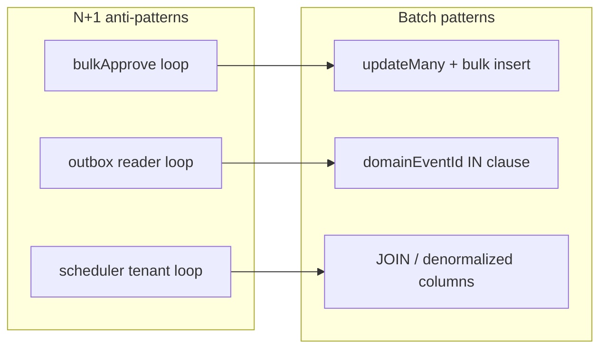

#### Recommended index optimizations

| Model | Proposed index | Supports |
| ----- | -------------- | -------- |
| `Tour` | `@@index([tenantId, createdAt, id])` | Keyset pagination `listByTenantPage` L207–210 |
| `Tenant` | `@@index([workspaceType, status])` | Denali reminder scheduler L62–64 |
| `OutboxEvent` | `@@index([tenantId, aggregateId, createdAt(sort: Desc)])` | `listOutboxByAggregate` in bookings |
| `OutboxEvent` | `@@index([tenantId, eventType, createdAt(sort: Desc)])` | Finance ledger / prepayment lists |
| `ExposureIntent` | Denormalize `connectionId String?` + `@@index([tenantId, connectionId])` | Replace JSON path filter L113–116 |
| `Payment` | `@@index([tenantId, method, createdAt(sort: Desc)])` | `listPayments` manual-method filter |
| `OperatorRegistration` | (optional) split `registrationIntake` to side table | List views exclude large Json without wide rows |

#### Recommended pagination strategies

1. **Bookings command center** — replace `listByTenant` with cursor on `(submittedAt, id)`; default `take: 50`; `select` excluding `registrationIntake` unless detail drawer open.
2. **Tour operator list** — deprecate `listByTenant` / adapter `findMany`; expose `listByTenantPage` only; add **list projection** (`title`, `publishStatus`, `rowVersion`, `createdAt`) without `canonical`.
3. **Identity team directory** — paginate `listMembershipsByTenant`; `select: { userId, role, status, workspaceId }` for table view.
4. **Settings audit explore** — `take: 100` + cursor on `occurredAt`; index already exists.
5. **Integration connections** — never return `credentials` on `listForWorkspace`; lazy-load on `findByTenantAndId` when rotating secrets.
6. **Draft events** — push `take` + `orderBy` to SQL in `listByDraft`.

#### Audit Point 15 summary

| Finding | Status | Criticality | Recommended fix |
| ------- | ------ | ----------- | --------------- |
| `prisma-settings-config` PK lookups (no list scan) | **PASS** | **Low** | Optional `select` on version-only paths if added |
| Platform tenant + finance list `select` + `take` | **PASS** | **Low** | Use as template for other repos |
| Workspace drafts `listByScope` excludes `data` | **PASS** | **Low** | Document as reference pattern |
| Tour `listByTenant` → `MAX_SAFE_INTEGER` + full `canonical` | **FAIL** | **High** | Cursor pagination + list projection API; fix adapter |
| Bookings `listByTenant` unbounded + `registrationIntake` | **FAIL** | **High** | Paginate + column `select` |
| `bulkApproveWithOutbox` N+1 transactions | **WARNING** | **High** | Batch approve in one transaction |
| Outbox reader per-row idempotency check | **WARNING** | **High** | Batch `IN` query |
| Integration list returns `credentials` Json | **WARNING** | **High** | `select` omit secrets on list |
| Exposure intent JSON-path `connectionId` filter | **WARNING** | **Medium** | Denormalize column + index |
| Identity membership unbounded list | **WARNING** | **Medium** | Pagination + narrow `select` |
| Settings audit unbounded list | **WARNING** | **Medium** | Default page size + cursor |
| Tour create double `count()` | **WARNING** | **Medium** | Cache global cap or single query |
| Draft events in-memory sort/slice | **WARNING** | **Medium** | DB `orderBy` + `take` |
| Settings resources create → full list for sortOrder | **WARNING** | **Low** | `_max(sortOrder)` aggregate |
| Denali scheduler per-tenant tour scan | **WARNING** | **Medium** | Batch query + `@@index([workspaceType, status])` |
| Catalog `list*` unbounded (equipment, themes, …) | **WARNING** | **Low** | `take: 500` safety cap |

**Overall Audit Point 15 verdict:** **WARNING** — **Pagination and projection discipline are inconsistent**. Finance and platform tenant repos demonstrate the target pattern; **tours and bookings carry the highest production risk** (unbounded Json-heavy lists). `prisma-settings-config.repository.ts` is **well-shaped** for its KV access model. **Index coverage is strong for tenant-scoped catalogs** but **gaps exist** for tour keyset pagination, exposure JSON scope queries, tenant scheduler scans, and outbox aggregate lookups. **Three N+1 patterns** (bulk approve, outbox reader, exposure scheduler) warrant near-term batching.

#### Remediation priority

1. Bookings list pagination + `select` (operator traffic).
2. Tour `listByTenant` deprecation + list projection without `canonical`.
3. `bulkApproveWithOutbox` batch transaction.
4. Integration connection — strip `credentials` from list reads.
5. Exposure `connectionId` denormalization + index.
6. Schema migration: `Tour(tenantId, createdAt, id)`, `Tenant(workspaceType, status)`.
7. Outbox reader batch idempotency check.
8. Settings audit default page size.

---

## Category 4: Enterprise Frontend Standards

### Audit Point 16 — Component Coupling (hex/rgb literals & `--ws-*` token contract, 2026-07-07)

**Scope:** `apps/web` (operator Admin + platform ops) and `apps/portal` (member portal shell) — hardcoded color literals, Tailwind palette bypass, and adherence to the workspace skin contract (`--ws-*` → `--color-*` bridge per Audit Point 7).

**Methodology:** Ripgrep `#`, `rgb(`, `rgba(`, Tailwind palette classes (`emerald-*`, `amber-*`, `green-*`) under `apps/web/src`, `apps/web/app`, `apps/portal/src`, `apps/portal/app`; read operator shell `*.module.css`, `components/ui/badge.tsx`, portal `layout.tsx` / `globals.css`; cross-check `guard-dtcg-hex-ban` scope (packages only, not app TSX).

#### Token contract (reference)

```text
L0 — DTCG semantics on <body>     admin-bootstrap.css / portal-bootstrap.css  → --color-*
L1 — Workspace skin              manifest theme + denali-portal.css bridge  → --ws-color-* → --color-*
L2 — shadcn/Tailwind aliases       bg-primary, text-muted-foreground           → maps to --color-* (apps/web)
L3 — Component-local literals      #2563eb fallbacks, emerald-500/amber-500   → BYPASS (drift risk)
```

**`--ws-*` contract:** Workspace-owned keys (`--ws-color-primary`, `--ws-color-accent`, …) are injected via `PlatformThemeProvider` / `WorkspaceThemeProvider` and bridged to `--color-*` in workspace skin CSS (e.g. `denali-portal.css`). Components should consume **`var(--color-*)`** or Tailwind semantic aliases — not raw palette scales or hex fallbacks.

#### Scan results — `apps/portal`

| Check | Result |
| ----- | ------ |
| Hex / `rgb()` in `apps/portal/src/**` and `apps/portal/app/**` (excl. tests) | **0 matches** |
| Tailwind palette (`emerald-*`, `amber-*`, `green-*`, `gray-*`) in portal TSX | **0 matches** |
| App-level CSS | `app/globals.css` — imports `@app-tour/design-tokens/portal-bootstrap.css` + `tailwindcss` only |
| Theme ingress | `layout.tsx` → `resolveWorkspaceManifestThemeForPlugin` → `PortalProviders` → `PlatformThemeProvider manifestTheme` |
| UI composition | Shell uses `data-portal-shell-*` hooks; chrome styled by **workspace skin CSS** (`*-portal.css`), not inline colors |

**Verdict for portal app source:** **PASS** — portal components do not hardcode colors; coupling to brand is delegated to workspace packages and DTCG bootstrap (indirect skin literals in `packages/workspaces/*/theme/` are gated by `guard-dtcg-hex-ban` on skin hooks, outside this app scan).

#### Scan results — `apps/web`

**A. Hardcoded hex / rgb in production source (excl. tests)**

| File | Literals | Role |
| ---- | -------- | ---- |
| `src/admin/shell/operator-brand.module.css` | `#2563eb`, `#e5e5e5`, `#6b7280`, `#fff` | CSS `var(--color-*, **fallback**)` — **bypasses `--ws-*`; wrong brand if `--color-primary` unset** |
| `src/admin/shell/operator-header.module.css` | `#e5e5e5`, `#fff` | Border/surface fallbacks |
| `src/admin/shell/operator-account-menu.module.css` | `#2563eb`, `#e5e5e5`, `#6b7280`, `#fff`, `#111` | Primary chip + menu shadow fallbacks |
| `src/admin/shell/operator-drawer.module.css` | `rgb(0 0 0 / 40%)`, `rgb(0 0 0 / 15%)`, `#fff` | Overlay/scrim — not tokenized |
| `app/(app)/tours/tours-list-view.module.css` | `#e5e5e5`, `#6b7280`, `#fff` | List card fallbacks |

**Risk (Audit Point 7 cross-ref):** `#2563eb` fallbacks are **platform blue**, not Denali forest teal — visible on FOUC or non-Denali workspaces when `--color-primary` is missing.

**B. Tailwind palette bypass (raw scale, not semantic tokens)**

**14 production files** use `emerald-*`, `amber-*`, or `green-*` utility classes instead of `Badge` variants (`success`/`warning`), `Alert`, or `var(--color-success)` / `var(--color-warning)`:

| Area | Files (representative) | Pattern |
| ---- | ---------------------- | ------- |
| **Platform ops** | `workspace-production-certification-badge.tsx`, `platform-clubs-table.tsx`, `club-detail/platform-club-detail-client.tsx`, `club-detail/tab-sites.tsx`, `workspace-builder/publish-bar.tsx` | `bg-emerald-500/10 text-emerald-700`, `bg-amber-500/10 text-amber-800` |
| **Settings / integrations** | `integrations-settings-client.tsx` (**7** class sites), `integration-event-delivery-policy-panel.tsx`, `branding-settings-client.tsx`, `exposure-settings-client.tsx`, `exposure-control-plane-client.tsx`, `tour-wizard-template-client.tsx`, `presets-advanced-client.tsx` | Duplicated warning/success banners |
| **Integrations / exposure** | `IntegrationConnectionLoadWarningsBanner.tsx`, `DenaliWorkspaceSurfacesPanel.tsx` | `border-amber-500/40 bg-amber-500/10` |

**Counts (className occurrences):** `emerald-*` ~12, `amber-*` ~11, `green-*` 2 (`text-green-600` success toasts).

**C. Components aligned with token contract**

| Component | Pattern | Assessment |
| --------- | ------- | ---------- |
| `components/ui/badge.tsx` | `var(--color-danger)`, `var(--color-success)`, `var(--color-warning)` | **PASS** — semantic DTCG |
| `components/ui/button.tsx`, `card.tsx`, `input.tsx` | `bg-primary`, `text-muted-foreground`, `border-border` | **PASS** — shadcn → CSS variable aliases |
| `resolve-bootstrap-workspace-plugin.client.ts` | `WORKSPACE_THEME_CSS_VARIABLE.colorAccent` → `var(--color-primary)` | **PASS** |
| Majority of operator pages | `text-muted-foreground`, `bg-muted`, `text-destructive` | **PASS** |

**D. `--ws-*` bypass summary (`apps/web`)**

| Bypass type | Where | Impact |
| ----------- | ----- | ------ |
| Shell CSS never references `--ws-color-*` | Operator `*.module.css` | Uses `--color-primary` with **hex fallback** only — ignores manifest/bridge overrides on failure |
| Raw Tailwind palette for status UI | Platform + settings (14 files) | Success/warning colors **decoupled** from DTCG `--color-success` / `--color-warning` and tenant theme |
| No `--ws-*` in TSX | Entire `apps/web` src | Expected — app layer should use bridged `--color-*`; issue is **fallbacks + palette**, not missing `--ws-*` in JSX |

#### Existing guards (gap)

| Guard | Scope | Covers `apps/web` / `apps/portal` TSX? |
| ----- | ----- | ------------------------------------- |
| `guard-dtcg-hex-ban` | `packages/design-tokens`, workspace skin hooks | **No** — app components unchecked |
| `guard:token-parity` | Denali admin ↔ portal DTCG slices | **No** — does not ban Tailwind `emerald-500` in TSX |
| `apps/web/.eslintrc.cjs` | Raw `<input>`, ui-primitives barrel | **No** color rules |

#### Audit Point 16 summary

| Finding | Status | Criticality | Recommended fix |
| ------- | ------ | ----------- | --------------- |
| Portal app TSX/CSS free of hex/rgb/palette literals | **PASS** | **Low** | Keep; extend smoke tests (`guest-theme-stack.spec.ts`). |
| Portal theme via `manifestTheme` + bootstrap CSS | **PASS** | **Low** | No change in app layer. |
| shadcn `components/ui/*` uses semantic CSS variables | **PASS** | **Low** | Extend `Badge` success/warning usage to settings banners. |
| Admin shell CSS `#2563eb` / neutral hex fallbacks | **WARNING** | **High** | Remove hex fallbacks; use `var(--color-primary)` without second argument; scrim → `var(--color-overlay)` token. |
| Operator drawer `rgb(0 0 0 / …)` scrim | **WARNING** | **Medium** | Add `--color-scrim` to DTCG; reference in module CSS. |
| 14 files with `emerald-*` / `amber-*` / `green-*` Tailwind | **WARNING** | **High** | Replace with `<Badge variant="success|warning">` or `bg-[var(--color-success-bg)]` utilities. |
| Duplicated success/warning banner class strings | **WARNING** | **Medium** | Extract `<StatusBanner variant="success|warning">` using semantic tokens. |
| Platform ops surface palette-isolated from operator DTCG | **WARNING** | **Medium** | Platform layout should import same semantic tokens or shared status component. |
| No ESLint/Tailwind guard on app raw colors | **FAIL** | **Medium** | Add `guard:app-color-literals` or ESLint rule (below). |
| Indirect portal risk: `guest-club/theme/tokens.css` `#2563eb` | **WARNING** | **Low** | Fix in workspace package (Audit Point 7); portal imports skin. |

**Overall Audit Point 16 verdict:** **WARNING** — **Portal app source is decoupled correctly** (no inline colors). **Admin (`apps/web`) couples status and shell chrome to raw Tailwind palette and hex CSS fallbacks**, bypassing the `--ws-*` → `--color-*` contract when tokens are absent or for success/warning states. **shadcn primitives are aligned**; **feature pages and platform ops are not**.

#### Recommended fix — Tailwind / ESLint color literal ban

**1. ESLint `no-restricted-syntax` for `apps/web` (immediate, no plugin)**

Add to `apps/web/.eslintrc.cjs`:

```javascript
{
  files: ["src/**/*.{ts,tsx}", "app/**/*.{ts,tsx}"],
  ignores: ["**/*.spec.ts", "**/*.test.ts", "tests/**"],
  rules: {
    "no-restricted-syntax": [
      "error",
      {
        selector: "Literal[value=/\\b(emerald|amber|green|blue|red|slate|gray|zinc)-[0-9]{2,3}\\b/]",
        message: "Use semantic tokens (--color-success, Badge variant) — raw Tailwind palette forbidden.",
      },
      {
        selector: "Literal[value=/#[0-9a-fA-F]{3,8}\\b/]",
        message: "Raw hex forbidden in components — use CSS variables or design tokens.",
      },
    ],
  },
}
```

**2. `eslint-plugin-tailwindcss` (recommended)**

```bash
pnpm add -D eslint-plugin-tailwindcss --filter @apps/web
```

```javascript
plugins: ["tailwindcss"],
rules: {
  "tailwindcss/no-arbitrary-value": ["error", { callees: ["cn", "cva"] }],
  "tailwindcss/no-custom-classname": ["warn", {
    whitelist: ["^(bg|text|border)-\\[var\\(--color-.*\\)\\].*"],
  }],
},
```

Add **custom rule** or `no-restricted-syntax` on class strings matching `/(emerald|amber|green|blue|red|slate|gray|zinc)-\d{2,3}/`.

**3. CI guard `scripts/guards/guard-app-color-literals.mjs`**

- Scan `apps/web/{src,app}/**/*.{tsx,css}` (exclude tests).
- Fail on `#hex`, `rgb(`, and Tailwind palette regex in `className`.
- Allowlist: `apps/web/src/components/ui/**` during migration window.
- Run in `phase-2:gate` alongside `guard-dtcg-hex-ban`.

**4. CSS module migration**

Replace patterns like:

```css
/* Before */
color: var(--color-primary, #2563eb);
/* After */
color: var(--color-primary);
```

Add DTCG tokens `--color-scrim`, `--color-overlay` for drawer/backdrop.

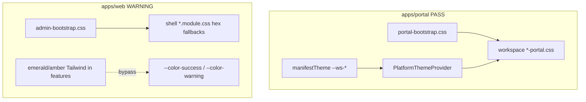

### Audit Point 17 — Bundle Analysis (shell/layout entry points & workspace registration imports, 2026-07-07)

**Scope:** Root and nested shell layouts in `apps/web` (operator Admin), `apps/portal` (member portal), and `apps/marketing` (guest marketing); codegen bootstrap (`workspace-plugin-loaders.generated.ts`, `workspace-plugin-host/register`, theme loaders); client hydration path (`AppProviders` → `hydrateBootstrapSession`).

**Question:** At layout entry, does the host eagerly import workspace-specific registration/plugin code for **all** trunk workspaces, or only the **active** `pluginId` resolved per request?

**Methodology:** Trace static vs dynamic import graph from `app/layout.tsx`, `instrumentation.ts`, nested `(app)/layout.tsx` / `me/layout.tsx`; read generated loaders and `workspace-plugin-host` registration modules; cross-check Phase I guards (`guard:theme-import-budget`, `guard:workspace-plugin-load-cache`) and `docs/dev/workspace-scale-hardening.mdoc` (I1/I2/I3).

#### Shell entry-point import graph

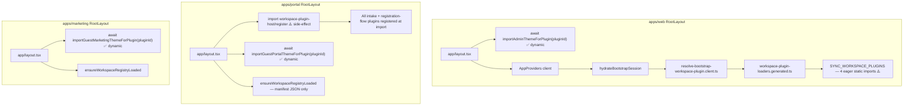

#### Theme CSS ingress — active plugin only (PASS)

| Surface | Layout | Loader | Pattern | Guard |
| ------- | ------ | ------ | ------- | ----- |
| Admin | `apps/web/app/layout.tsx` | `importAdminThemeForPlugin(resolved.session.pluginId)` | `switch(pluginId)` → single `await import()` per call | I1 ≤1 import/path ✅ |
| Portal | `apps/portal/app/layout.tsx` | `importGuestPortalThemeForPlugin(bootstrap.pluginId)` | Starter base + ≤1 plugin overlay | I1 ≤2 imports/path ✅ |
| Marketing | `apps/marketing/app/layout.tsx` | `importGuestMarketingThemeForPlugin(bootstrap.pluginId)` | Same guest pattern | I1 ≤2 imports/path ✅ |

Generated loaders (`workspace-theme-stylesheets.generated.ts`, `workspace-guest-theme-stylesheets.generated.ts`) contain **no top-level eager workspace CSS imports** — only dynamic `import()` inside switch arms. `guard:theme-import-budget` enforces layout call sites and per-path import counts.

**Note:** Guest portal/marketing always load `workspace-starter` base skin first (by design, Phase D.2/D.3), then overlay — **2 imports max**, not 4× workspace skins.

#### Workspace plugin object graph — admin (`apps/web`) (WARNING / FAIL)

| Layer | File | Eager all workspaces? | Active-only? |
| ----- | ---- | --------------------- | ------------ |
| Root layout server | `app/layout.tsx` | No workspace-plugin-host | Theme only ✅ |
| Operator shell | `app/(app)/layout.tsx` | No additional workspace imports | Nav by `pluginId` string ✅ |
| Client bootstrap | `resolve-bootstrap-workspace-plugin.client.ts` | Imports `workspace-plugin-loaders.generated.ts` | Resolves **one** `pluginId` at runtime |
| Codegen loaders | `workspace-plugin-loaders.generated.ts` | **Yes** — static `import { getDenali…, getGuestClub…, getStarter…, getUrban… }` | `SYNC_WORKSPACE_PLUGINS` calls all four factories at **module evaluation** |
| Async path (exists, unused at layout) | `loadWorkspacePluginByIdFromRegistry` | No — dynamic `import()` per `pluginId` + I2 cache | ✅ correct pattern |

```typescript
// workspace-plugin-loaders.generated.ts (excerpt) — every admin client chunk pays parse cost for all trunk plugins
import { getDenaliWorkspacePlugin } from "@app-tour/workspace-denali/plugin";
import { getGuestClubWorkspacePlugin } from "@app-tour/workspace-guest-club/guest-club.plugin";
import { getStarterWorkspacePlugin } from "@app-tour/workspace-starter";
import { getUrbanWorkspacePlugin } from "@app-tour/workspace-urban/plugin";

const SYNC_WORKSPACE_PLUGINS = Object.freeze({
  denali: getDenaliWorkspacePlugin(),
  "guest-club": getGuestClubWorkspacePlugin(),
  starter: getStarterWorkspacePlugin(),
  urban: getUrbanWorkspacePlugin(),
});
```

**Hydration chain:** `RootLayout` → `AppProviders` → `hydrateBootstrapSession` → `resolveBootstrapWorkspacePluginClient(pluginId)` → `resolveSyncWorkspacePluginFromRegistry` → **module already evaluated all four plugins**.

**Denali client stub:** `getDenaliClientShellPlugin()` spreads `starter` but still triggers sync load of starter + urban via `pluginsById` Map init — does **not** avoid Denali server graph on routes that only need theme metadata.

**Scale doc alignment:** `docs/dev/workspace-scale-hardening.mdoc` § I2 acknowledges sync map as known debt; **I3 (lazy sync plugin registry codegen)** is optional, Architect YES — bundle-size win.

#### Workspace registration plugins — portal (`apps/portal`) (FAIL)

| Entry | Import | Effect |
| ----- | ------ | ------ |
| `app/layout.tsx` line 1 | `import "@app-tour/workspace-plugin-host/register"` | Runs `ensureWorkspacePluginsRegistered()` at **module load** |
| `instrumentation.ts` | `await import("…/register")` | Duplicate registration path (idempotent, still parses bundle) |
| `catalog/…/public-catalog-registration-flow.tsx` line 3 | Same side-effect import | Registration page client chunk also pulls full register graph |

`packages/workspace-plugin-host/src/register.ts` calls three generated registrars on import:

| Registrar | Eager imports | Registers |
| --------- | ------------- | --------- |
| `workspace-intake-plugins.generated.ts` | All 4 `get*WorkspacePlugin()` static imports | Every workspace with `catalogIntake` |
| `workspace-registration-flow-plugins.generated.ts` | Denali bundle steps; guest-club + urban compose steps; shared `catalog-registration-flow-ui/react` | **All three** flow plugins + step components |
| `workspace-registration-transport-initializers.generated.ts` | `workspace-denali/catalog-registration-flow` | Denali transport only |

Runtime **lookup** (`getWorkspaceRegistrationFlowPlugin(workspace)`) is per-active workspace, but **registration data and React step modules are bundled before first lookup** because registrars statically import every workspace's `catalog-registration-flow` surface and step components.

**Portal does not use** `workspace-plugin-loaders.generated.ts` at layout — registration cost is isolated to `workspace-plugin-host`, but that host is on the **critical path for every portal page** via root layout.

#### Marketing & nested layouts

| Layout | Workspace registration imports | Assessment |
| ------ | ------------------------------ | ---------- |
| `apps/marketing/app/layout.tsx` | None (`workspace-plugin-host` absent) | **PASS** — theme + manifest registry only |
| `apps/portal/app/me/layout.tsx` | Inherits root layout register side-effect | No extra workspace imports |
| `apps/web/app/(platform)/layout.tsx` | None | **PASS** |

#### Wizard / surface bindings (out of layout hot path)

`apps/web/src/bootstrap/workspace-*-bindings.generated.ts` files statically import Denali (and other) surfaces, but they are **route/feature-pulled** (wizard, settings, tours) — not imported from `app/layout.tsx` or `(app)/layout.tsx`. Acceptable code-splitting at feature boundaries; separate from shell entry audit.

#### Existing guards (coverage gap)

| Guard | What it proves | Shell registration eager imports? |
| ----- | -------------- | --------------------------------- |
| `guard:theme-import-budget` (I1) | Dynamic theme CSS budget per layout | **No** |
| `guard:workspace-plugin-load-cache` (I2) | Async loader uses cache module | **No** — sync map unchecked |
| `guard:public-catalog-m17` | Registration plugin API surface | Partial — not bundle boundary |
| `guard:guest-consumer-deps` | Web loaders file in allowlist | Documents coupling, does not fail on sync imports |

#### Audit Point 17 summary

| Finding | Status | Criticality | Recommended fix |
| ------- | ------ | ----------- | --------------- |
| Admin/portal/marketing theme CSS — dynamic `import()` per active `pluginId` | **PASS** | **Low** | Keep; `guard:theme-import-budget` already enforces. |
| Marketing root layout — no `workspace-plugin-host` | **PASS** | **Low** | No change. |
| Portal root layout — eager `workspace-plugin-host/register` for all workspaces | **FAIL** | **High** | Lazy registration (below); remove duplicate from `public-catalog-registration-flow.tsx` once layout guarantees register. |
| Portal registration-flow codegen — static imports all flow surfaces + step components | **FAIL** | **High** | Per-plugin dynamic `import()` registrar (below). |
| Admin client bootstrap — `SYNC_WORKSPACE_PLUGINS` eager static imports (4 trunk) | **WARNING** | **Medium** | I3 lazy sync codegen; route client hydrate through `loadWorkspacePluginByIdFromRegistry`. |
| Async `loadWorkspacePluginByIdFromRegistry` exists but layout/hydrate uses sync path | **WARNING** | **Medium** | Deprecate `resolveSyncWorkspacePluginFromRegistry` on client; server may keep sync for SSR-only paths. |
| `instrumentation.ts` + layout double-import register | **WARNING** | **Low** | Single bootstrap: instrumentation only, or lazy `ensureWorkspacePluginsRegistered(pluginId)`. |
| Denali client shell still pulls sync starter/urban via loaders module | **WARNING** | **Medium** | Split `workspace-plugin-metadata.generated.ts` (theme-only, no Denali graph) from full plugin loader. |

**Overall Audit Point 17 verdict:** **WARNING** — **Theme ingress is correctly active-plugin-only** (Phase I1 PASS). **Portal registration and admin client hydration still eagerly pull all trunk workspace plugin/registration modules at shell entry** — O(workspaces) bundle and parse cost on every page load, not only the tenant's `pluginId`.

#### Recommended fix — dynamic `import()` for plugin registration

**1. Portal — lazy per-`pluginId` registration (replace eager `register.ts` side effect)**

Remove top-level `ensureWorkspacePluginsRegistered()` from `register.ts`. Export:

```typescript
// packages/workspace-plugin-host/src/register-lazy.ts
const registered = new Set<string>();

export async function ensureWorkspacePluginsRegisteredForPlugin(pluginId: string): Promise<void> {
  if (registered.has(pluginId)) return;
  switch (pluginId) {
    case "denali":
      await import("./register-denali.generated");
      break;
    case "guest-club":
      await import("./register-guest-club.generated");
      break;
    case "urban":
      await import("./register-urban.generated");
      break;
    default:
      break;
  }
  registered.add(pluginId);
}
```

Codegen (`registration.mjs`) emits **one file per workspace** with only that workspace's intake + flow + transport imports. Root layout:

```typescript
// apps/portal/app/layout.tsx
const bootstrap = await resolvePortalBootstrapForHost(host);
await ensureWorkspacePluginsRegisteredForPlugin(bootstrap.pluginId);
```

Registration page: `await ensureWorkspacePluginsRegisteredForPlugin(workspace)` before `getWorkspaceRegistrationFlowPlugin(workspace)` — delete static `import "@app-tour/workspace-plugin-host/register"`.

**2. Admin — I3 lazy sync map (client bootstrap)**

Codegen change in `core-registry.mjs` / `generateWebLoaders`:

```typescript
// Target: no static workspace package imports at module top
export function resolveSyncWorkspacePluginFromRegistry(pluginId: string): WorkspacePlugin {
  throw new Error("SYNC_PLUGIN_DEPRECATED_USE_loadWorkspacePluginByIdFromRegistry");
}

// Client hydrate
const plugin = await loadWorkspacePluginByIdFromRegistry(serializable.pluginId);
```

Short-term: `resolve-bootstrap-workspace-plugin.client.ts` switches to `loadWorkspacePluginByIdFromRegistry` inside `useMemo` + suspense boundary, or server passes serialized `plugin.theme` only (no full `WorkspacePlugin` on client).

**3. Guard — `guard:shell-plugin-registration-budget`**

- Fail if `apps/portal/app/layout.tsx` or `apps/web/app/layout.tsx` statically imports `@app-tour/workspace-*` plugin/registration paths (allowlist: theme loaders, workspace-sdk, workspace-registry).
- Fail if `workspace-plugin-host/src/register.ts` contains top-level calls to `register*FromManifest()` without `pluginId` parameter.
- Fail if `workspace-plugin-loaders.generated.ts` contains static `import { get*WorkspacePlugin }` (post-I3).

**4. Bundle verification (manual / CI opt-in)**

```bash
# After I3 + lazy portal register — compare First Load JS for portal?plugin=starter vs denali
pnpm --filter @apps/portal run build
pnpm --filter @apps/web run build
# Architect YES only: @next/bundle-analyzer on layout chunks
```

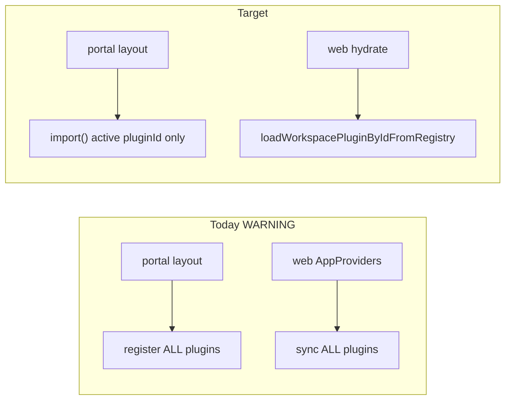

### Audit Point 18 — CSS Injection (`PlatformThemeProvider` & manifest theme ingress, 2026-07-07)

**Scope:** `PlatformThemeProvider` and the theme provider chain (`ThemeProviderChain`, `PortalProviders`, `MarketingProviders`, `TenantThemeProvider`, `WorkspaceThemeProvider`); manifest `theme` block from `workspace.manifest.json` through registry → layout → React inline `style`; comparison with tenant/plugin ingress paths.

**Question:** Can an attacker use manifest theme variables to break the DOM layout (or execute CSS injection)? Is `ThemeTokenSanitizer` fail-closed policy enforced?

**Methodology:** Read `packages/theme-react/src/providers/PlatformThemeProvider.tsx`, `map-theme-to-css-variables.ts`, `ThemeProviderChain.tsx`; trace portal/marketing layouts → `resolveWorkspaceManifestThemeForPlugin` → `readWorkspaceManifestTheme`; compare `WorkspaceManifestSchema` (runtime) vs `ManifestThemeBlockSchema` (CI); review `assertThemeCssValueIsSafe`, `validateTenantTheme`, `theme-ingress-guard`; grep for `ThemeTokenSanitizer` / `theme-token-sanitizer` (not shipped); cross-check `providers.spec.tsx` injection tests and `SYSTEM_HEALTH_REPORT.md` §9.

#### `PlatformThemeProvider` — DOM application model

```typescript
// PlatformThemeProvider.tsx — manifest theme → wrapper div inline style
const style = useMemo(
  () => mergeThemeCssVariables(manifestTheme, themeJson, themeJsonOverride) as CSSProperties,
  [manifestTheme, themeJson, themeJsonOverride],
);
return <div className={className} style={style}>{children}</div>;
```

| Input prop | Source (today) | Sanitizer | On violation |
| ---------- | -------------- | --------- | ------------ |
| `manifestTheme` | `resolveWorkspaceManifestThemeForPlugin(pluginId)` — raw manifest `theme` | `mapThemeToCssVariables` | **Fail-soft** — drop key/value |
| `themeJson` | Ad-hoc / tests | Same | Fail-soft |
| `themeJsonOverride` | Runtime overrides (tenant/platform) | Same | Fail-soft |

**Delivery mechanism:** React `CSSProperties` object → per-property `setProperty` on a wrapper `<div>`. Not raw `cssText`. Custom properties inherit to descendants via CSS cascade.

#### Ingress pipeline (manifest → DOM)

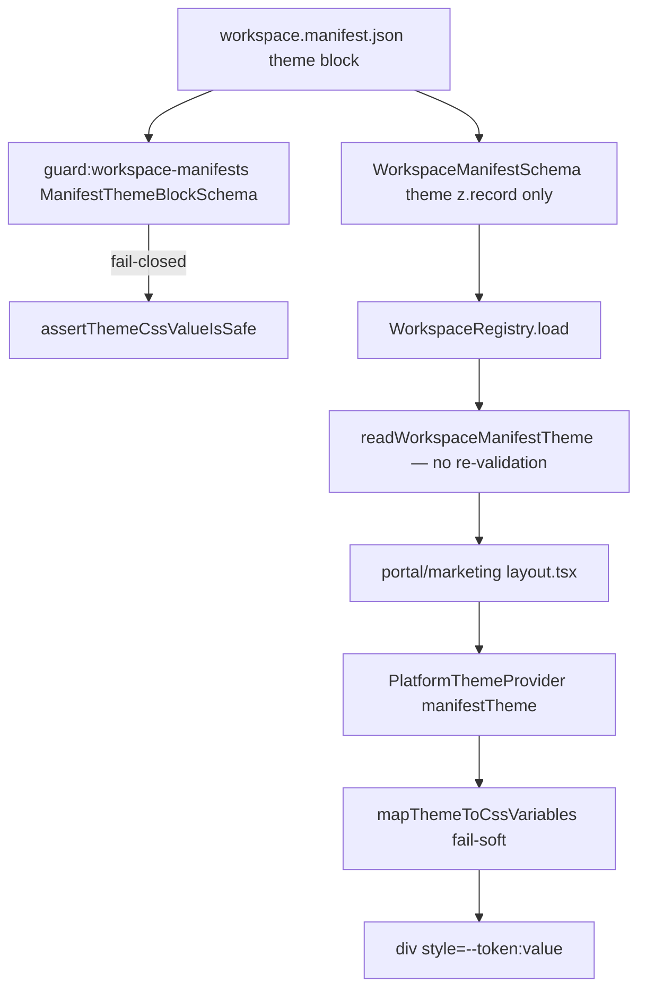

#### Existing defenses

| Layer | Location | Keys | Values | Mode |
| ----- | -------- | ---- | ------ | ---- |
| CI manifest guard | `ManifestThemeBlockSchema` | Any `--[a-zA-Z0-9_-]+` after normalize | `assertThemeCssValueIsSafe` + max 64 keys / 4096 chars | **Fail-closed** (CI reject) |
| Core primitive | `assertThemeCssValueIsSafe` | N/A | Blocks `\`, NFKC, `expression()`, `javascript:`, all `url()`, `@import`, `<`, `>`, `-moz-binding`, `behavior:` | **Throw** |
| Runtime manifest parse | `WorkspaceManifestSchema` | `z.record(string, string)` | **None** | Accepts any string pair |
| DOM ingress | `mapThemeToCssVariables` | `[a-zA-Z0-9_-]+` | Duplicated regex + forbids `;{}\\` + blocks `url()` | **Fail-soft** (drop) |
| Tenant theme (admin) | `validateTenantTheme` → `TenantThemeProvider` | `--color-[a-z0-9-]+` only | `assertThemeCssValueIsSafe` | **Fail-closed** (throw) |
| Workspace plugin theme | `validateWorkspaceThemeIngress` → `WorkspaceThemeProvider` | `--ws-[a-z0-9-]+` via contract | `normalizeAndValidateCssMap` | **Fail-closed** (throw) |

**Test coverage:** `mapThemeToCssVariables` drops `invalid;key`, `red; background: url(bad)`, `blue { color: red }` (`providers.spec.tsx`); `theme-css-value-safety.spec.ts`, `theme-validation.contract.spec.ts` (homoglyph / escape corpus).

#### Threat model — who can supply manifest `theme`?

| Actor | Can edit manifest `theme` today? | Path |
| ----- | -------------------------------- | ---- |
| External anonymous attacker | **No** | No Admin API for manifest; git + CI gate |
| Tenant operator (Admin UI) | **No** | `tenant-branding.service.ts` → `validateTenantTheme` only (`primaryColor`, `--color-*`) |
| Workspace / platform developer | **Yes** | `packages/workspaces/<id>/workspace.manifest.json` + PR |
| Supply-chain / compromised disk (runtime) | **Yes** (bypass CI) | `parseWorkspaceManifest` loose schema → registry → DOM fail-soft |

#### Attack vectors — layout / DOM impact

| Vector | Feasible? | Layout / DOM impact | Severity |
| ------ | --------- | --------------------- | -------- |
| `javascript:` / `expression()` / `url(javascript:…)` in theme value | **Blocked** at CI; stripped at DOM | None (XSS) | **Low** |
| Semicolon / brace breakout (`; position:fixed`) | **Blocked** in `mapThemeToCssVariables` (`;{}\\`); React property API adds defense | Classic style breakout unlikely | **Low** |
| Unicode homoglyph / CSS escape smuggling | **Blocked** at CI + `\\` forbidden in DOM path | None | **Low** |
| **Safe-value token override** — e.g. `--color-primary: #ff0000`, `--ws-color-bg-page: #000`, `--ws-radius: 0` | **Yes** — valid colors/dimensions pass all guards | **Defacement**, contrast breakage, sidebar/brand drift — not DOM node deletion | **Medium** |
| **Platform token squatting** — manifest key `--background`, `--primary`, `--sidebar-width` (CI allows any valid CSS name, not `--ws-*` only) | **Yes** at CI if values are safe | Overrides cascade wherever descendants use `var(--*)` — **layout shift / hidden chrome** if component binds structural vars | **Medium** |
| `calc()` / `color-mix()` / exotic valid functions | **Not explicitly blocked** | Unlikely script execution; possible unexpected sizing/color | **Low–Med** |
| Runtime unvalidated manifest (dev / disk bypass) | **Yes** | Fail-soft drops unsafe tokens; **safe malicious tokens still apply** | **Medium** |
| Tenant `primaryColor` via Admin API | **Blocked** by `validateTenantTheme` | N/A for manifest path | **Low** |

**XSS verdict:** Manifest theme → `PlatformThemeProvider` is **not a practical script-injection vector** in modern React inline custom-property delivery, given current value blocklist and absence of `url()` allowlist.

**Layout-break verdict:** An attacker who controls manifest `theme` (developer or compromised manifest on disk) **can break visual layout and brand integrity** by injecting **syntactically safe** CSS custom property values that override semantic tokens consumed by portal/marketing shell and workspace skin bridges — without triggering fail-closed rejection. This is **defacement / UI DoS**, not arbitrary HTML injection.

#### Asymmetry vs other theme layers

| Provider | Used on | Validation policy |
| -------- | ------- | ----------------- |
| `PlatformThemeProvider` | Portal, marketing (manifest); admin chain (optional `manifestTheme`) | **Fail-soft** |
| `TenantThemeProvider` | Admin (`apps/web` `ThemeProviderChain`) | **Fail-closed** (`validateTenantTheme`) |
| `WorkspaceThemeProvider` | Admin (`plugin.theme.cssVariables`) | **Fail-closed** (`assertWorkspacePlugin` / ingress guard) |

Portal and marketing guest surfaces rely **only** on `PlatformThemeProvider` for manifest tokens — the **least strict** layer in the chain.

#### `ThemeTokenSanitizer` — proposed, not enforced

`SYSTEM_HEALTH_REPORT.md` §9.6 specifies a centralized `sanitizeThemeTokenMap` with `mode: "fail-closed" | "fail-soft"`, `--ws-*` key tightening, and value-shape allowlist. **No `theme-token-sanitizer.ts` exists in the repo.** `mapThemeToCssVariables` duplicates (and diverges from) `assertThemeCssValueIsSafe` — documented drift on `;{}` handling.

#### Audit Point 18 summary

| Finding | Status | Criticality | Recommended fix |
| ------- | ------ | ----------- | --------------- |
| Classic CSS injection / XSS via manifest theme values | **PASS** | **Low** | Keep `assertThemeCssValueIsSafe` corpus + React `style` object delivery. |
| `url()` / `expression()` / `javascript:` blocked | **PASS** | **Low** | Maintain empty `ALLOWED_THEME_URL_PATTERNS`. |
| Layout / brand defacement via safe manifest token overrides | **WARNING** | **Medium** | Restrict manifest keys to `--ws-*`; value-shape allowlist in sanitizer. |
| Platform token squatting (`--primary`, `--background`, etc.) | **WARNING** | **Medium** | CI + runtime key pattern `^--ws-[a-z0-9-]+$` only. |
| Runtime registry accepts unvalidated `theme` (loose schema) | **WARNING** | **Medium** | `readWorkspaceManifestTheme` → fail-closed sanitizer before return. |
| `PlatformThemeProvider` fail-soft vs tenant/plugin fail-closed | **FAIL** | **Medium** | Enforce `ThemeTokenSanitizer` fail-closed at registry read; fail-soft only as explicit opt-in. |
| `ThemeTokenSanitizer` not shipped — policy documented only | **FAIL** | **Medium** | Implement per §9.6; remove duplicated regex from `map-theme-to-css-variables.ts`. |
| No Admin manifest editor attack surface today | **PASS** | **Low** | Future editor must use fail-closed sanitizer + RBAC + audit. |
| Silent drop of malicious tokens (no telemetry) | **WARNING** | **Low** | Emit structured metric/log on sanitizer drop in production. |

**Overall Audit Point 18 verdict:** **WARNING** — **Script-style CSS injection is adequately mitigated**, but **manifest theme variables can still break layout and brand presentation** through permitted token overrides, and **`PlatformThemeProvider` uses fail-soft sanitization while `ThemeTokenSanitizer` fail-closed policy is not implemented**. Dual schema authority (CI strict / runtime loose) widens the gap for unvalidated manifests.

#### Recommended fix — enforce `ThemeTokenSanitizer` fail-closed policy

**1. Ship centralized sanitizer** (`packages/workspace-sdk/src/theme/theme-token-sanitizer.ts`)

```typescript
export type SanitizeThemeTokensOptions = {
  readonly keyPattern: RegExp;
  readonly maxKeys?: number;
  readonly maxValueLength?: number;
  readonly mode: "fail-closed" | "fail-soft";
  readonly allowedValueShapes?: readonly RegExp[];
};

export function sanitizeThemeTokenMap(
  raw: unknown,
  options: SanitizeThemeTokensOptions,
): Readonly<Record<string, string>>;
```

- **CI:** `ManifestThemeBlockSchema` delegates to `sanitizeThemeTokenMap(..., { keyPattern: /^--ws-[a-z0-9-]+$/, mode: "fail-closed" })`.
- **Registry:** `readWorkspaceManifestTheme` returns sanitizer output only — never raw manifest.
- **DOM:** `mapThemeToCssVariables` becomes thin wrapper calling `sanitizeThemeTokenMap` with `mode: "fail-soft"` (or fail-closed + error boundary if any invalid key).

**2. Unify runtime schema**

Replace `WorkspaceManifestSchema.theme: z.record(...)` with `ManifestThemeBlockSchema.optional()` inside `parseWorkspaceManifest`, or run fail-closed sanitizer in `WorkspaceRegistry.load()` before freeze.

**3. Guard — `guard:theme-sanitizer-parity`**

- Shared evil-string corpus must be rejected identically by CI schema, registry sanitizer, and `mapThemeToCssVariables`.
- Fail if `theme-react` duplicates `UNSAFE_THEME_CSS_VALUE_PATTERNS` instead of importing sdk.

**4. Optional hardening**

- Value-shape allowlist: `#hex`, `rgb()`/`hsl()`, `var(--ws-*)`, bounded dimensions (`px|rem|em|%`).
- Telemetry sink on fail-soft drops (`setThemeSanitizerTelemetrySink`).
- CSP `style-src` review for guest surfaces (sanitizer remains primary control).

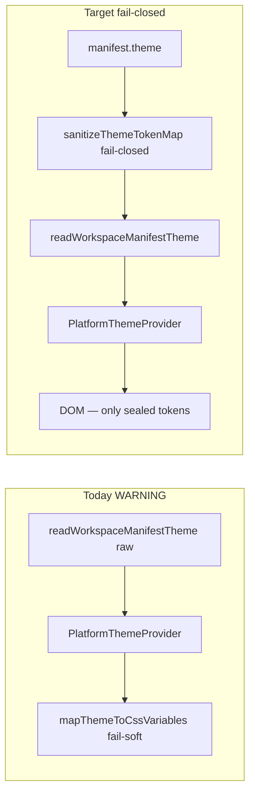

---

*Related artifacts:* `SYSTEM_HEALTH_REPORT.md` §9, `TOKEN_DRIFT_ANALYSIS.md`, `docs/workspaces/denali/unified-semantic-token-schema.mdoc`, `docs/dev/dtcg-pipeline-spec.mdoc`, `docs/dev/workspace-registry-runtime.mdoc`, `docs/dev/workspace-scale-hardening.mdoc`, `docs/phase-19/p6-enterprise-theming-architecture.mdoc`, `docs/MIGRATION-MAP.md` §8, `docs/phase-10/subphases/10.2-manifest-codegen.md`, `docs/phase-4/subphases/4.4-tenant-theme.md`, `scripts/guards/guard-dtcg-hex-ban.mjs`, `scripts/guards/guard-theme-import-budget.mjs`, `scripts/guards/guard-workspace-plugin-load-cache.mjs`, `scripts/guards/guard-workspace-manifests` / `packages/workspace-sdk/scripts/validate-manifests.ts`, `scripts/codegen/workspace-registry/domains/core-registry.mjs`, `scripts/codegen/workspace-registry/domains/registration.mjs`, `packages/design-tokens/src/admin-bootstrap.css`, `packages/design-tokens/src/portal-bootstrap.css`, `packages/workspaces/denali/theme/denali-portal.css`, `packages/workspaces/denali/workspace.manifest.json`, `packages/workspaces/denali/src/theme/denali-token-bridge.ts`, `packages/workspace-sdk/src/manifest.schema.ts`, `packages/workspace-sdk/src/workspace-registry/workspace-manifest.schema.ts`, `packages/workspace-sdk/src/workspace-registry/read-workspace-manifest-theme.ts`, `packages/workspace-sdk/src/theme/theme-css-value-safety.ts`, `packages/workspace-sdk/src/theme/tenant-theme-validation.ts`, `packages/workspace-sdk/src/theme/css-map-validation.ts`, `packages/theme-react/src/providers/PlatformThemeProvider.tsx`, `packages/theme-react/src/providers/map-theme-to-css-variables.ts`, `packages/theme-react/src/providers/ThemeProviderChain.tsx`, `packages/theme-react/src/providers/TenantThemeProvider.tsx`, `packages/theme-react/src/providers/WorkspaceThemeProvider.tsx`, `packages/theme-react/src/ingress/theme-ingress-guard.ts`, `packages/theme-react/src/providers/providers.spec.tsx`, `apps/web/src/providers/app-providers.tsx`, `apps/portal/src/shell/portal-providers.tsx`, `apps/marketing/src/shell/marketing-providers.tsx`, `apps/portal/app/layout.tsx`, `apps/marketing/app/layout.tsx`, `apps/api/src/tenant/tenant-branding.service.ts`, `packages/workspace-plugin-host/src/register.ts`, `packages/guest-surface-host/src/fetch-public-tenant-context.ts`, `apps/web/src/tenant/fetch-tenant-theme.server.ts`, `scripts/guards/guard-guest-extension-schema.mjs`.

---

## Category 5: Security & DevOps

### Audit Point 21 — Manifest Sanitization (`ThemeTokenSanitizer` & URL/script ingress, 2026-07-07)

**Scope:** Security review of manifest `theme` token ingress — `ThemeTokenSanitizer` / `sanitizeThemeTokenMap` (proposed vs shipped), `assertThemeCssValueIsSafe`, `ManifestThemeBlockSchema`, runtime `mapThemeToCssVariables`, operator-editable theme surfaces vs git-only manifest authority.

**Question:** Can an operator inject URL-based scripts (`javascript:`) via the theme manifest? Is `ThemeTokenSanitizer` with `ALLOWED_VALUE_SHAPES` enforced?

**Methodology:** Grep for `theme-token-sanitizer.ts`, `sanitizeThemeTokenMap`, `ALLOWED_VALUE_SHAPES` (implementation); read `theme-css-value-safety.ts`, `manifest.schema.ts`, `map-theme-to-css-variables.ts`, `tenant-branding.service.ts`; review contract tests T-6b–T-6j / homoglyph corpus; trace manifest write paths (API vs git/CI).

#### `ThemeTokenSanitizer` — implementation status

| Artifact | Location | Shipped? |
| -------- | -------- | -------- |
| `ThemeTokenSanitizer` / `sanitizeThemeTokenMap` | `packages/workspace-sdk/src/theme/theme-token-sanitizer.ts` | **No** — file absent |
| `ALLOWED_VALUE_SHAPES` allowlist | Proposed in `SYSTEM_HEALTH_REPORT.md` §9.6 only | **No** — not in runtime code |
| `guard:theme-sanitizer-parity` | Proposed in §9.6 | **No** |
| Production authority (blocklist) | `assertThemeCssValueIsSafe` | **Yes** — CI, tenant API, plugin contract |
| DOM ingress (duplicated blocklist) | `mapThemeToCssVariables` | **Yes** — fail-soft, not centralized |

**Verdict:** `ThemeTokenSanitizer` is **documented policy only** — security controls rely on a **distributed blocklist** with **no positive allowlist** (`ALLOWED_VALUE_SHAPES`).

#### Operator attack surface — who can write manifest `theme`?

| Actor | Manifest `theme` write path | `javascript:` / `url()` reachability |
| ----- | ----------------------------- | ------------------------------------ |
| **Tenant operator (Admin UI)** | **None** — `tenant-branding.service.ts` patches `primaryColor`, `displayName`, logo, `--color-*` via `validateTenantTheme` only | **Cannot** edit `workspace.manifest.json` |
| **Platform operator** | Git PR to `packages/workspaces/*/workspace.manifest.json` | Blocked at CI (`guard:workspace-manifests`) |
| **Supply-chain / compromised disk** | `parseWorkspaceManifest` → `WorkspaceManifestSchema` (`theme: z.record` — **no value safety**) | Reaches DOM via fail-soft `mapThemeToCssVariables` |

**Operator-specific answer:** A **tenant operator cannot inject `javascript:` via the theme manifest** because there is **no operator API** that writes manifest `theme`. Operator-controlled input flows through **`validateTenantTheme`** → same `assertThemeCssValueIsSafe` primitive (blocks `javascript:`, all `url()`).

#### URL / `javascript:` defense layers (manifest path)

```text
manifest.theme value
    ├─ CI (guard:workspace-manifests)
    │     ManifestThemeBlockSchema → assertThemeCssValueIsSafe  [fail-closed]
    │
    ├─ Runtime registry (WorkspaceManifestSchema)  [no value checks]
    │
    └─ DOM (PlatformThemeProvider)
          mapThemeToCssVariables → isSafePlatformThemeCssValue  [fail-soft]
                React style object (per-property setProperty)
```

**`assertThemeCssValueIsSafe` blocklist (enforced at CI + tenant/plugin):**

| Attack payload | Blocked? | Mechanism |
| -------------- | -------- | --------- |
| `javascript:alert(1)` | **Yes** | `/javascript\s*:/i` (T-6e) |
| `url('javascript:alert(1)')` | **Yes** | `url(…javascript` pattern + empty `ALLOWED_THEME_URL_PATTERNS` (T-6b) |
| `url(https://evil.example/x)` | **Yes** | All `url()` rejected when allowlist empty (T-6c) |
| `expression(alert(1))` | **Yes** | T-6 |
| `-moz-binding:url(…)` / `behavior:url(…)` | **Yes** | T-6f, T-6g |
| `@import url(…)` | **Yes** | T-6h |
| NFKC homoglyph `\uFF2Aavascript:` | **Yes** | NFKC + pattern (T-6i) |
| CSS `\6aavascript:` / `\78avascript:` escapes | **Yes** | `CSS_ESCAPE_PATTERN` / `\\` forbidden in DOM path (T-6j) |
| `var(--color-primary)` | **Allowed** | Safe reference (T-6d) |

**DOM path (`mapThemeToCssVariables`):** Independently blocks `javascript:`, all `url(`, `;{}\\`, and mirrors the unsafe-pattern set — **drops** invalid entries without throwing.

#### `ALLOWED_VALUE_SHAPES` — allowlist gap

Current production uses **blocklist-only** validation. Values **not** matching known attack patterns but outside intended token grammar may **pass**, e.g.:

- `calc(…)`, `color-mix(…)`, `attr(…)` — not in `ALLOWED_VALUE_SHAPES` (proposed) and **not blocked** today
- Arbitrary color keywords (`red`, `currentColor`) — allowed (benign)
- `var(--x, fallback-with-unreviewed-shape)` — partial `var()` acceptance at CI; fallback content less strictly shape-checked

**Risk:** Blocklist-only is **reactive** — new CSS functions or browser-specific parsers could widen the attack surface before blocklist updates. **`ALLOWED_VALUE_SHAPES` is the recommended fail-closed control and is not enforced.**

#### Dual-schema authority (security gap)

| Schema | Used when | Theme value safety |
| ------ | --------- | ------------------ |
| `ManifestThemeBlockSchema` | `guard:workspace-manifests` / CI | `assertThemeCssValueIsSafe` — **fail-closed** |
| `WorkspaceManifestSchema` | `WorkspaceRegistry.load()` runtime | `z.record(string, string)` — **none** |

A manifest copied onto disk **without passing CI** can load at runtime; malicious `javascript:` values are **stripped at DOM** (fail-soft) but **not rejected at registry load** — no alert, no build failure, potential silent partial theme.

#### Audit Point 21 summary

| Finding | Status | Criticality | Recommended fix |
| ------- | ------ | ----------- | --------------- |
| Operator injects `javascript:` via manifest `theme` | **PASS** | **Low** | No operator manifest write API; maintain RBAC on future editor. |
| Operator injects `javascript:` via tenant theme API | **PASS** | **Low** | `validateTenantTheme` → `assertThemeCssValueIsSafe` on read/write. |
| `javascript:` / `url(javascript:…)` blocked at CI manifest guard | **PASS** | **Low** | Keep T-6b–T-6j corpus in CI. |
| `javascript:` / `url()` blocked at DOM ingress (fail-soft) | **PASS** | **Low** | Keep `mapThemeToCssVariables` tests; add homoglyph parity tests in theme-react. |
| `ThemeTokenSanitizer` not implemented | **FAIL** | **Medium** | Ship `theme-token-sanitizer.ts` as single authority (§9.6). |
| `ALLOWED_VALUE_SHAPES` allowlist not enforced | **FAIL** | **Medium** | Hard-enforce allowlist (below); reject unknown shapes at CI + registry. |
| Blocklist-only validation (no positive allowlist) | **WARNING** | **Medium** | Defense-in-depth gap vs allowlist model. |
| Duplicated sanitizer logic (sdk vs theme-react drift risk) | **WARNING** | **Medium** | `mapThemeToCssVariables` delegates to sdk sanitizer only. |
| Runtime registry bypasses CI theme validation | **WARNING** | **Medium** | Fail-closed sanitizer in `readWorkspaceManifestTheme` / `WorkspaceRegistry.load()`. |
| No `guard:theme-sanitizer-parity` | **WARNING** | **Low** | CI guard: same evil corpus rejected by CI, registry, and DOM paths. |

**Overall Audit Point 21 verdict:** **WARNING** — **`javascript:` and URL-based script injection via manifest theme is blocked today** (CI blocklist + DOM blocklist + contract tests), and **operators cannot write manifest `theme`**. **`ThemeTokenSanitizer` and `ALLOWED_VALUE_SHAPES` are not shipped** — security relies on duplicated blocklists without a centralized fail-closed allowlist, leaving a **medium residual risk** from schema bypass and future CSS parser evolution.

#### Recommended fix — hard-enforce `ALLOWED_VALUE_SHAPES` allowlist

**1. Implement `theme-token-sanitizer.ts`**

```typescript
const ALLOWED_VALUE_SHAPES: readonly RegExp[] = [
  /^#[0-9a-fA-F]{3,8}$/,
  /^rgb\(\s*[\d.\s%]+\s*,\s*[\d.\s%]+\s*,\s*[\d.\s%]+(\s*\/\s*[\d.]+%?)?\s*\)$/i,
  /^hsl\(\s*[\d.\s%]+\s*,\s*[\d.]+%\s*,\s*[\d.]+%(\s*\/\s*[\d.]+%?)?\s*\)$/i,
  /^var\(\s*--[a-z0-9-]+\s*(,\s*[^)]+)?\)$/i,
  /^[0-9.]+(?:px|rem|em|%|ms|s)$/,
  /^[a-z]+$/i, // color keywords — optional narrow set
];

export function sanitizeThemeTokenMap(raw, options): Readonly<Record<string, string>> {
  // 1. BLOCKED_VALUE_PATTERNS (incl. all url(), javascript:)
  // 2. ALLOWED_VALUE_SHAPES — value MUST match ≥1 shape (fail-closed default)
  // 3. keyPattern /^--ws-[a-z0-9-]+$/ for manifest
}
```

**2. Wire all ingress stages**

| Stage | Mode | Allowlist |
| ----- | ---- | --------- |
| `ManifestThemeBlockSchema` | fail-closed | `ALLOWED_VALUE_SHAPES` required |
| `WorkspaceRegistry.load()` | fail-closed | Same |
| `mapThemeToCssVariables` | fail-soft (drop) or fail-closed + boundary | Delegate to sdk |
| `validateTenantTheme` | fail-closed | Tenant shapes (`#hex`, `rgb`, `--color-*` refs) |

**3. `guard:theme-sanitizer-parity`**

- Corpus file: `packages/workspace-sdk/test/fixtures/evil-theme-values.json`
- Must reject: `javascript:`, `url(javascript:…)`, `url(https://…)`, homoglyphs, `\6aavascript:`, `calc(attr(…))` (if not allowlisted)
- Must accept: `#0f766e`, `var(--ws-color-primary)`, `0.625rem`
- Fail CI if `theme-react` reintroduces local regex copies.

**4. Explicit `url()` policy**

Keep `ALLOWED_THEME_URL_PATTERNS = []` (block all `url()` in theme tokens) until a documented need exists; if added later, allowlist **only** `url(/assets/…)` relative paths — never `javascript:` or scheme-relative externals.

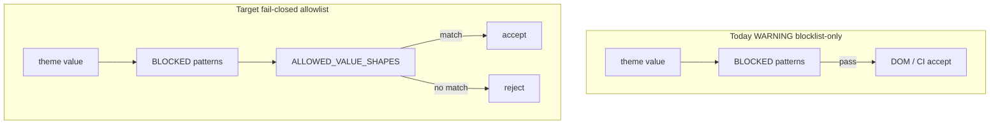

---

*Related artifacts:* `SYSTEM_HEALTH_REPORT.md` §9.1–§9.7, `ENTERPRISE_AUDIT_REPORT.md` Audit Point 18, `packages/workspace-sdk/src/theme/theme-css-value-safety.ts`, `packages/workspace-sdk/src/manifest.schema.ts`, `packages/workspace-sdk/src/workspace-registry/workspace-manifest.schema.ts`, `packages/workspace-sdk/src/workspace-registry/read-workspace-manifest-theme.ts`, `packages/workspace-sdk/src/theme/tenant-theme-validation.ts`, `packages/workspace-sdk/src/theme/css-map-validation.ts`, `packages/workspace-sdk/test/manifest.schema.spec.ts`, `packages/workspace-sdk/test/theme/theme-css-value-safety.spec.ts`, `packages/workspace-sdk/test/theme-validation.contract.spec.ts`, `packages/workspace-sdk/test/theme/tenant-theme-validation.spec.ts`, `packages/workspace-sdk/scripts/validate-manifests.ts`, `packages/theme-react/src/providers/map-theme-to-css-variables.ts`, `packages/theme-react/src/providers/PlatformThemeProvider.tsx`, `apps/api/src/tenant/tenant-branding.service.ts`, `scripts/guards/guard-workspace-manifests` (via `pnpm run guard:workspace-manifests`), `docs/dev/workspace-registry-runtime.mdoc`, `docs/phase-19/p6-enterprise-theming-architecture.mdoc`, `docs/phase-4/subphases/4.4-tenant-theme.md`.

### Audit Point 25 — Data Exposure (public / tenant-branding API, 2026-07-07)

**Scope:** `GET /public/tenant-branding` (API), `GET /api/public/tenant-branding` (web BFF), server fetchers in `apps/web`, `apps/portal`, `apps/marketing`; contrast with authenticated `GET /settings/branding` and adjacent `GET /public/tenant-context`.

**Question:** Does the public tenant-branding API return sensitive system-level meta fields (tenant ids, storage keys, raw theme JSON, internal registry metadata)?

**Methodology:** Read `tenant-branding.service.ts`, `tenant-branding.routes.ts`, BFF route, guest-surface fetchers; trace `resolveRegisteredTenantBySubdomain` → `resolvePublicTenantBrandingBySubdomain`; review `tenant-branding.spec.ts`, `tenant-branding-contract.spec.ts`, OpenAPI dispatch; compare authenticated vs public response shapes.

#### Public API response contract (authoritative service layer)

`resolvePublicTenantBrandingBySubdomain` returns an **explicit 4-field object** only:

| Field | Type | Source | Public? |
| ----- | ---- | ------ | ------- |
| `displayName` | `string \| null` | merged `tenant.theme.displayName` | **Yes** — intended chrome |
| `primaryColor` | `string \| null` | merged `tenant.theme.primaryColor` | **Yes** — intended chrome |
| `logoUrl` | `string \| null` | short-lived signed MinIO read URL | **Yes** — no raw `storageKey` |
| `defaultLocale` | `"en" \| "fa" \| null` | merged `tenant.theme.defaultLocale` | **Yes** — i18n bootstrap |

**Not returned** on `/public/tenant-branding`: `tenantId`, `subdomain`, `workspaceType`, `pluginId`, `logo.storageKey`, `logo.contentType`, `cssVariables`, raw `tenants.theme` JSON, Postgres row metadata, site-surface flags.

```typescript
// tenant-branding.service.ts — public DTO is manually constructed
return {
  displayName: theme.displayName?.trim() ?? null,
  primaryColor: theme.primaryColor ?? null,
  logoUrl,
  defaultLocale: theme.defaultLocale ?? null,
};
```

Tenant resolution uses `mapPrismaTenant` → `resolveEffectiveTenantBranding` (merged theme), but only the four public fields are projected — **internal theme fields (`cssVariables`, `logo.storageKey`) stay server-side**.

#### Ingress surfaces

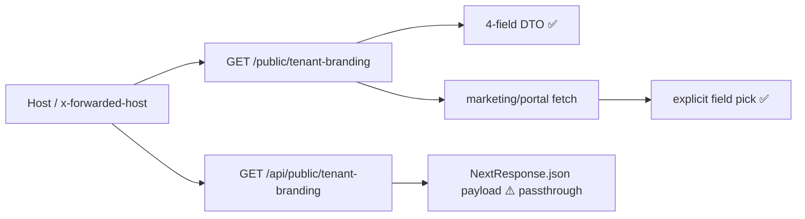

| Consumer | DTO enforcement | Extra fields forwarded? |
| -------- | --------------- | ----------------------- |
| API `handlePublicTenantBranding` | Service return type | **No** — only 4 keys |
| Web BFF `apps/web/app/api/public/tenant-branding/route.ts` | `EMPTY_PUBLIC_TENANT_BRANDING` on error only | **Yes on success** — `NextResponse.json(payload)` forwards full backend JSON |
| `apps/marketing/src/tenant/fetch-public-tenant-branding.ts` | `PublicTenantBrandingSnapshot` pick | **No** — whitelists 4 (+ optional `marketingHeroUrl` not in API) |
| `apps/portal/src/tenant/fetch-public-tenant-branding.ts` | Same 4-field pick | **No** |
| `apps/web/src/tenant/fetch-public-tenant-branding.server.ts` | 2-field pick (`displayName`, `logoUrl`) | **No** |

#### Authenticated vs public (boundary)

| Route | Auth | Response shape | Sensitive fields |
| ----- | ---- | -------------- | ---------------- |
| `GET /settings/branding` | Operator session + module gate | `{ displayName, logo: { storageKey, contentType }, primaryColor }` | **`storageKey`** — internal MinIO object key (auth-gated) |
| `GET /settings/branding/logo/url` | Operator session | `{ url, storageKey }` | Signed URL + storage key |
| `GET /public/tenant-branding` | None (host subdomain) | 4-field public DTO | No storage key; signed `logoUrl` only |

Authenticated paths correctly expose `storageKey` to operators; public path **substitutes signed `logoUrl`** — aligned with `docs/workspaces/tenant-branding.md`.

#### Adjacent public surface (out of branding scope, noted)

`GET /public/tenant-context` (same routes module) **does** expose system-level bootstrap metadata: `tenantId`, `workspaceType`, `pluginId`, `siteSurfaces`, `ingressSurface`. This is intentional for marketing/catalog bootstrap (`public-tenant-context.spec.ts`) but is a **separate endpoint** from tenant-branding. Callers must not conflate the two contracts.

#### Gaps and regression risks

| Gap | Risk |
| --- | ---- |
| Web BFF **pass-through** of backend JSON on 200 | Future API addition of fields (e.g. `tenantId`, `theme`, `cssVariables`) would **leak to anonymous BFF clients** without service-layer change |
| OpenAPI `/public/tenant-branding` has **no response schema** | No machine-enforced field ceiling in `openapi.json` |
| No negative contract test | Missing `assert.doesNotHaveProperty(body, 'tenantId')` / `storageKey` / `cssVariables` on public responses |
| Public path skips `validateTenantTheme` at read | Only 4 scalars exposed; corrupt DB theme could surface unvalidated `primaryColor` string (DOM risk elsewhere, not full theme blob leak) |
| `marketingHeroUrl` in marketing client type | Not returned by API today — harmless; documents aspirational field |

#### Audit Point 25 summary

| Finding | Status | Criticality | Recommended fix |
| ------- | ------ | ----------- | --------------- |
| API `/public/tenant-branding` returns only 4 public chrome fields | **PASS** | **Low** | Keep explicit service DTO; document in OpenAPI. |
| No `tenantId` / `storageKey` / `cssVariables` on public branding API | **PASS** | **Low** | Add negative contract tests (API-TB-18). |
| `logoUrl` is signed URL, not raw object key | **PASS** | **Low** | Keep short TTL (300s per tenant-branding.md). |
| Authenticated branding exposes `storageKey` (operator-only) | **PASS** | **Low** | Expected; not a public leak. |
| Web BFF forwards full backend payload without DTO filter | **WARNING** | **Medium** | Strict output filter (below). |
| OpenAPI missing public branding response schema | **WARNING** | **Low** | Add `PublicTenantBrandingDto` to OpenAPI + dispatch. |
| No CI guard on public response field allowlist | **FAIL** | **Medium** | `guard:public-tenant-branding-dto` or contract spec. |
| `/public/tenant-context` exposes `tenantId` / `pluginId` (separate route) | **WARNING** | **Low** | Document boundary; do not merge with branding DTO. |

**Overall Audit Point 25 verdict:** **WARNING** — The **API service layer does not return sensitive system-level meta** on `/public/tenant-branding` today (explicit 4-field projection). **Regression risk remains** because the **web BFF pass-through lacks a strict DTO output filter**, and there is **no schema or guard** preventing future field expansion from leaking to anonymous clients.

#### Recommended fix — strict DTO output filter

**1. Shared public DTO** (`packages/workspace-sdk` or `guest-surface-host`)

```typescript
export type PublicTenantBrandingDto = {
  readonly displayName: string | null;
  readonly primaryColor: string | null;
  readonly logoUrl: string | null;
  readonly defaultLocale: "en" | "fa" | null;
};

export function toPublicTenantBrandingDto(raw: unknown): PublicTenantBrandingDto {
  const o = raw !== null && typeof raw === "object" ? (raw as Record<string, unknown>) : {};
  const locale = o.defaultLocale;
  return {
    displayName: typeof o.displayName === "string" ? o.displayName.trim() || null : null,
    primaryColor: typeof o.primaryColor === "string" ? o.primaryColor.trim() || null : null,
    logoUrl: typeof o.logoUrl === "string" ? o.logoUrl.trim() || null : null,
    defaultLocale: locale === "en" || locale === "fa" ? locale : null,
  };
}
```

**2. Apply at every egress**

| Layer | Change |
| ----- | ------ |
| API `handlePublicTenantBranding` | `sendJson(res, 200, toPublicTenantBrandingDto(branding))` |
| Web BFF route | `return NextResponse.json(toPublicTenantBrandingDto(payload))` — never raw `payload` |
| Marketing / portal fetch | Import shared `toPublicTenantBrandingDto` (replace duplicated picks) |

**3. Contract tests**

```typescript
// apps/api/test/tenant-branding.spec.ts — API-TB-18
it("public branding excludes system meta fields", async () => {
  const { body } = await requestHttp(port, "GET", "/public/tenant-branding", { host: "denali.localhost" });
  for (const forbidden of ["tenantId", "subdomain", "workspaceType", "pluginId", "cssVariables", "storageKey", "theme"]) {
    assert.equal((body as Record<string, unknown>)[forbidden], undefined);
  }
});
```

**4. OpenAPI + guard**

- Add `PublicTenantBrandingDto` response schema to `openapi.json` for `getPublicTenantBranding`.
- `scripts/guards/guard-public-branding-dto.mjs` — fail if BFF route contains `NextResponse.json(payload)` without `toPublicTenantBrandingDto`.

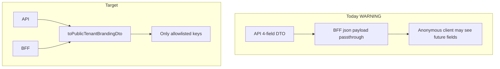

---

*Related artifacts:* `docs/workspaces/tenant-branding.md`, `docs/phase-15/public-tenant-branding.mdoc`, `apps/api/src/tenant/tenant-branding.service.ts`, `apps/api/src/tenant/tenant-branding.routes.ts`, `apps/api/src/tenant/resolve-registered-tenant.ts`, `apps/api/src/tenant/tenant-branding-storage.ts`, `apps/api/test/tenant-branding.spec.ts`, `apps/api/test/public-tenant-context.spec.ts`, `apps/api/openapi/openapi.json`, `apps/web/app/api/public/tenant-branding/route.ts`, `apps/web/test/tenant-branding-contract.spec.ts`, `apps/web/src/tenant/fetch-public-tenant-branding.server.ts`, `apps/marketing/src/tenant/fetch-public-tenant-branding.ts`, `apps/portal/src/tenant/fetch-public-tenant-branding.ts`, `packages/guest-surface-host/src/resolve-public-branding-host.ts`, `packages/workspace-sdk/src/theme/tenant-branding-merge.ts`, `packages/workspace-sdk/src/theme/tenant-theme-validation.ts`.
