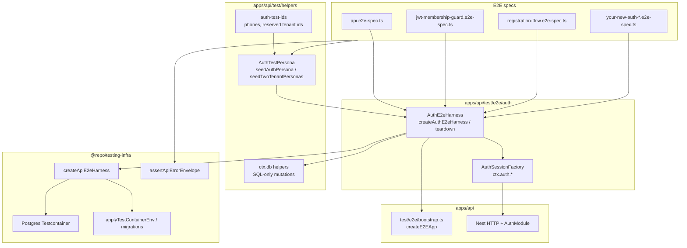
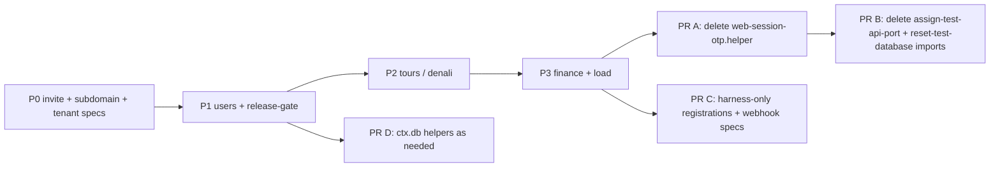

# MAP — API E2E test architecture notes

## §35 — `registration-flow.e2e-spec.ts` (web onboarding integration)

**Date:** 2026-05-29  
**Spec:** `apps/api/test/e2e/auth/registration-flow.e2e-spec.ts`  
**Harness:** `createAuthE2eHarness` / `teardownAuthE2eHarness`

### Scope

| Test | Flow | Assertions |
|------|------|------------|
| Happy path | `POST /web/otp/request` → `loginOtpOrRegistration` (`kind: registration`) → `completeRegistration` | JWT 3-part; `tenant_id` in token = `TENANT_A`; `hasActiveMembership` in DB |
| Negative | Onboarding on tenant A Host; complete on tenant B Host | `403` + `TENANT_HOST_MISMATCH` envelope |

**Seed:** `seedTwoTenantPersonas` with two empty workspaces plus one **Owner** each (DB invariant: workspace must have ≥1 active owner before a new **Member** registers).

**Product fix (enables negative test):** `AuthService.completeRegistration` now compares HTTP Host tenant (`resolveEffectiveTenantId`) to onboarding JWT `tenant_id` and throws `ForbiddenException` / `TENANT_HOST_MISMATCH` when they differ (parity with `createWorkspaceSession`).

**Factory addition:** `postCompleteRegistrationRaw` on `auth-session.factory.ts` for raw status/body assertions.

### Refactored `registration-flow.e2e-spec.ts` (full)

```typescript
import "reflect-metadata";
import assert from "node:assert/strict";
import { after, before, test } from "node:test";
import request from "supertest";
import { assertApiErrorEnvelope } from "@repo/testing-infra";

import {
  allocateAuthTestPhone,
  authTestEmailForPhone,
} from "../../helpers/auth-test-ids";
import { seedTwoTenantPersonas } from "../../helpers/auth-test-personas";
import { UserRole } from "../../../src/common/auth/user-role.enum";
import {
  createAuthE2eHarness,
  teardownAuthE2eHarness,
  type AuthE2eHarnessContext,
} from "./auth-e2e-harness";
import { E2E_DEV_OTP } from "./auth-session.factory";
import {
  E2E_JWT_PRIVATE_KEY_PKCS8,
  E2E_JWT_PUBLIC_KEY_SPKI,
} from "../jwt-test-keys";
import { tenantTestHost } from "../tenant-test-host";

const TENANT_A = "c3c3c3c3-c3c3-43c3-83c3-c3c3c3c3c3c3";
const TENANT_B = "d4d4d4d4-d4d4-44d4-84d4-d4d4d4d4d4d4";
const SUBDOMAIN_A = "reg-flow-a";
const SUBDOMAIN_B = "reg-flow-b";
const INTERNAL_API_KEY = "test-internal-key-registration-flow";
const TENANT_A_OWNER_PHONE = "+15559100001";
const TENANT_B_OWNER_PHONE = "+15559100002";

let ctx: AuthE2eHarnessContext;

function skip(): boolean {
  return Boolean(ctx.unavailableReason) || !ctx.app || !ctx.auth || !ctx.db;
}

function errorCode(body: Record<string, unknown>): string | undefined {
  const error = body.error;
  if (error && typeof error === "object" && "code" in error) {
    return String((error as { code: unknown }).code);
  }
  return undefined;
}

before(async () => {
  ctx = await createAuthE2eHarness({
    jwtKeys: {
      privatePem: E2E_JWT_PRIVATE_KEY_PKCS8,
      publicPem: E2E_JWT_PUBLIC_KEY_SPKI,
    },
    internalApiKey: INTERNAL_API_KEY,
    seed: async (ds) => {
      await seedTwoTenantPersonas(ds, {
        tenantA: {
          id: TENANT_A,
          subdomain: SUBDOMAIN_A,
          name: "Registration flow tenant A",
          description: "registration-flow.e2e-spec.ts",
        },
        tenantB: {
          id: TENANT_B,
          subdomain: SUBDOMAIN_B,
          name: "Registration flow tenant B",
          description: "registration-flow.e2e-spec.ts",
        },
        userInAOnly: {
          phone: TENANT_A_OWNER_PHONE,
          email: "reg-flow-owner-a@auth-e2e.test",
          role: UserRole.Owner,
          fullName: "Reg flow tenant A owner",
        },
        userInBOnly: {
          phone: TENANT_B_OWNER_PHONE,
          email: "reg-flow-owner-b@auth-e2e.test",
          role: UserRole.Owner,
          fullName: "Reg flow tenant B owner",
        },
      });
    },
  });
});

after(async () => {
  await teardownAuthE2eHarness(ctx);
});

test("web registration flow: OTP request → registration onboarding → complete → session + membership", async () => {
  if (skip()) {
    return;
  }

  const phone = allocateAuthTestPhone();
  const email = authTestEmailForPhone(phone);
  const fullName = "Registration Flow E2E";

  const otpRequest = await request(ctx.app!.getHttpServer())
    .post("/api/v2/auth/web/otp/request")
    .set("Host", tenantTestHost(SUBDOMAIN_A))
    .send({ phone });
  assert.equal(otpRequest.status, 200);
  assert.equal(otpRequest.body.otp_requested, true);

  const onboarding = await ctx.auth!.loginOtpOrRegistration({
    phone,
    tenantSubdomain: SUBDOMAIN_A,
    otp: E2E_DEV_OTP,
  });
  assert.equal(onboarding.kind, "registration");
  assert.equal(onboarding.phone, phone);
  assert.equal(onboarding.tenantId, TENANT_A.toLowerCase());

  const completed = await ctx.auth!.completeRegistration({
    onboardingToken: onboarding.onboardingToken,
    fullName,
    email,
    tenantSubdomain: SUBDOMAIN_A,
  });

  assert.equal(completed.tenantId, TENANT_A.toLowerCase());
  assert.equal(completed.token.split(".").length, 3);
  assert.equal(ctx.auth!.decodeSessionTenantId(completed.token), TENANT_A.toLowerCase());

  const claims = ctx.auth!.decodeJwtPayload(completed.token);
  assert.equal(claims.sub, completed.userId);
  assert.equal(typeof claims.role, "string");

  assert.equal(
    await ctx.db!.hasActiveMembership({ userId: completed.userId, tenantId: TENANT_A }),
    true,
  );
});

test("complete registration rejects Host tenant mismatching onboarding token tenant (403 TENANT_HOST_MISMATCH)", async () => {
  if (skip()) {
    return;
  }

  const phone = allocateAuthTestPhone();

  const onboarding = await ctx.auth!.loginOtpOrRegistration({
    phone,
    tenantSubdomain: SUBDOMAIN_A,
    otp: E2E_DEV_OTP,
  });
  assert.equal(onboarding.kind, "registration");

  const response = await ctx.auth!.postCompleteRegistrationRaw({
    onboardingToken: onboarding.onboardingToken,
    fullName: "Host Mismatch User",
    tenantSubdomain: SUBDOMAIN_B,
  });

  assert.equal(response.status, 403);
  assert.equal(errorCode(response.body), "TENANT_HOST_MISMATCH");
  assertApiErrorEnvelope(response.body);
});
```

### Verification

**Command** (from `apps/api`):

```bash
node --import tsx --test --test-concurrency=1 test/e2e/auth/registration-flow.e2e-spec.ts
```

**Result (2026-05-29):** exit code **0** — **2/2 passed**, ~8.5s.

```
ok 1 - web registration flow: OTP request → registration onboarding → complete → session + membership
ok 2 - complete registration rejects Host tenant mismatching onboarding token tenant (403 TENANT_HOST_MISMATCH)
# tests 2
# pass 2
# fail 0
# duration_ms 8523.979274
```

### Related files

- `apps/api/src/modules/auth/auth.service.ts` — `completeRegistration` Host vs onboarding tenant guard
- `apps/api/test/e2e/auth/auth-session.factory.ts` — `postCompleteRegistrationRaw`
- `apps/api/test/helpers/auth-test-personas.ts` — `seedTwoTenantPersonas`

---

## §36 — Auth E2E README (`apps/api/test/e2e/auth/README.md`)

**Date:** 2026-05-29  
**Canonical doc:** `apps/api/test/e2e/auth/README.md`

Wizard-Standard auth integration testing: **AuthE2eHarness** (infra) + **AuthSessionFactory** (`ctx.auth`) + **AuthTestPersona** (seed + `ctx.db`).

### Dependency map (Mermaid)



### Golden Rules (summary)

1. No inline TypeORM in `*.e2e-spec.ts` — seed in harness `options.seed`; DB checks/mutations via `ctx.db` only.
2. Auth HTTP via `ctx.auth` (factory), not ad-hoc supertest to auth routes.
3. No scattered hardcoded UUIDs — file-level `TENANT_*` / `SUBDOMAIN_*` or `auth-test-ids` / seed return values.
4. Always `createAuthE2eHarness` + `teardownAuthE2eHarness` — no duplicated Testcontainers bootstrap in specs.
5. Match `Host` subdomain to workspace under test (`tenantSubdomain` / `hostSubdomain`).
6. `skip()` when `ctx.unavailableReason` is set.
7. Use `*Raw` factory methods for expected 4xx; asserting helpers for 200 paths.
8. Extend `helpers/` + harness for new seed/SQL helpers — do not copy-paste.

### Quick Start (cheat sheet)

```bash
cd apps/api
node --import tsx --test --test-concurrency=1 test/e2e/auth/<your-spec>.e2e-spec.ts
```

```typescript
// harness
ctx = await createAuthE2eHarness({ jwtKeys, internalApiKey, seed: async (ds) => { ... } });

// persona
await seedAuthPersona(ds, { phone, email, subdomain, tenantId, role: UserRole.Owner });

// login
const token = await ctx.auth!.loginOtp({ phone, tenantSubdomain: SUBDOMAIN });

// registration
const step = await ctx.auth!.loginOtpOrRegistration({ phone: allocateAuthTestPhone(), tenantSubdomain });
await ctx.auth!.completeRegistration({ onboardingToken: step.onboardingToken, fullName, tenantSubdomain });

// assert
assertApiErrorEnvelope((await ctx.auth!.postWebSessionOtpRaw({ ... })).body);
assert.equal(await ctx.db!.hasActiveMembership({ userId, tenantId }), true);
```

### Full README (appended)

# Auth E2E — Wizard-Standard testing pattern

API auth integration tests follow the **Wizard-Standard** pattern: three composable layers that mirror how the web tour wizard separates **shell**, **steps**, and **fixtures**—here we separate **infrastructure**, **HTTP/session verbs**, and **seeded actors**.

| Layer | Module | Responsibility |
|-------|--------|----------------|
| **Harness** | `auth-e2e-harness.ts` | Testcontainers Postgres, env, migrations, Nest app, teardown |
| **Factory** | `auth-session.factory.ts` | Login, registration, workspace switch, raw OTP/complete helpers |
| **Persona** | `helpers/auth-test-personas.ts` + `auth-test-ids.ts` | Tenants, users, memberships, phones, invites |

Specs stay thin: they describe **behavior**, not **wiring**.

---

## Wizard-Standard in one picture


**Dependency rule:** specs → `AuthE2eHarness` → `@repo/testing-infra`. Specs must **not** import TypeORM entities, Testcontainers, or `createE2EApp` directly.

---

## AuthE2eHarness

`createAuthE2eHarness(options)` returns `AuthE2eHarnessContext`:

| Field | Type | When set |
|-------|------|----------|
| `app` | `INestApplication` | Container + app boot succeeded |
| `auth` | `AuthSessionFactory` | Same |
| `db` | `AuthE2eDbHelpers` | Same |
| `unavailableReason` | `string` | Docker/Testcontainers unavailable — tests should `skip()` |

Lifecycle:

1. `createApiE2eHarness` — start Postgres, expose `applyEnv` / `resetDatabase` / `teardown`
2. `resetDatabase()` — run TypeORM migrations on empty DB
3. `createE2EApp()` — Nest test module
4. `options.seed(ds)` — optional personas (runs **after** migrate, **before** tests)
5. `createAuthSessionFactory(app)` — bind `ctx.auth`

Always pair with `teardownAuthE2eHarness(ctx)` in `after()`.

```typescript
import {
  createAuthE2eHarness,
  teardownAuthE2eHarness,
  type AuthE2eHarnessContext,
} from "./auth/auth-e2e-harness";
import { E2E_JWT_PRIVATE_KEY_PKCS8, E2E_JWT_PUBLIC_KEY_SPKI } from "./jwt-test-keys";

let ctx: AuthE2eHarnessContext;

function skip(): boolean {
  return Boolean(ctx.unavailableReason) || !ctx.app || !ctx.auth || !ctx.db;
}

before(async () => {
  ctx = await createAuthE2eHarness({
    jwtKeys: { privatePem: E2E_JWT_PRIVATE_KEY_PKCS8, publicPem: E2E_JWT_PUBLIC_KEY_SPKI },
    internalApiKey: "test-internal-key-my-spec",
    seed: async (ds) => {
      /* seedAuthPersona / seedTwoTenantPersonas */
    },
  });
});

after(async () => {
  await teardownAuthE2eHarness(ctx);
});
```

---

## AuthSessionFactory (`ctx.auth`)

All auth HTTP goes through the factory so **Host headers**, paths, and dev OTP stay consistent.

| Method | Use when |
|--------|----------|
| `loginOtp({ phone, tenantSubdomain, otp? })` | Known user with membership → JWT string |
| `loginOtpOrRegistration(...)` | Unknown phone or no membership → `kind: "session"` or `kind: "registration"` |
| `completeRegistration({ onboardingToken, fullName, email?, tenantSubdomain? })` | Finish web onboarding → session JWT |
| `switchWorkspace({ bearer, targetTenantId, tenantSubdomain })` | Exchange JWT for another workspace (200) |
| `postWebSessionOtpRaw({ tenantSubdomain?, host?, body? })` | Assert 4xx envelopes (validation, wrong OTP, host errors) |
| `postCompleteRegistrationRaw(...)` | Assert registration complete status/body without throwing |
| `postWorkspaceSessionRaw({ bearer, targetTenantId, hostSubdomain? })` | Workspace session negative paths |
| `getToursRaw({ bearer, tenantSubdomain })` | Authenticated tours list smoke |
| `decodeSessionTenantId(token)` / `decodeJwtPayload(token)` | Assert claims without round-tripping API |

Dev OTP defaults to `E2E_DEV_OTP` (`"1234"`) when `AUTH_ALLOW_DEV_STATIC_OTP=true` (set by harness env).

**Host rule:** Strict auth routes resolve tenant from `Host: {subdomain}.localhost` (`tenantTestHost(subdomain)`). Workspace session and registration complete need the **target** workspace subdomain on the wire.

---

## AuthTestPersona

An **AuthTestPersona** is the return shape of `seedAuthPersona`:

```typescript
{
  userId, tenantId, phone, email, role, subdomain, membershipStatus
}
```

### Seeding helpers (in `seed` callback only)

| Helper | Purpose |
|--------|---------|
| `seedAuthPersona(ds, input)` | One tenant (created if missing) + user + membership |
| `seedTwoTenantPersonas(ds, options)` | Two tenants; optional `userInAOnly`, `userInBOnly`, `dualMember` |

Phone/email utilities (`auth-test-ids.ts`):

- `allocateAuthTestPhone()` — unique E.164 per test run (registration / greenfield users)
- `authTestEmailForPhone(phone)` — deterministic test inbox
- `AUTH_TEST_TENANT_A_ID` / `AUTH_TEST_TENANT_B_ID` — shared reserved UUIDs when specs do not need custom ids

**DB invariant:** Each workspace must keep at least one active **Owner** before registering a new **Member** via `completeRegistration` (see `registration-flow.e2e-spec.ts`).

### `ctx.db` helpers (specs)

Use these instead of TypeORM in test files:

| Helper | Purpose |
|--------|---------|
| `findUserIdByEmail(email)` | Resolve user id for assertions |
| `hasActiveMembership({ userId, tenantId })` | Post-condition after invite/register |
| `insertPendingWorkspaceInvite({ tenantId, email, role, inviteToken, invitedByUserId })` | Invite accept flows |
| `countWorkspaceInvitesByToken(token)` | Invite consumed |
| `updateMembershipRoleByEmail({ email, tenantId, role })` | RBAC / stale-token scenarios |
| `bumpMembershipSessionVersionByEmail({ email, tenantId })` | `AUTH_TOKEN_STALE` scenarios |

Need a new DB mutation? Add it to `auth-test-personas.ts` and wire it through `auth-e2e-harness.ts`—not in the spec.

---

## Quick Start — new auth E2E spec

### 1. Create the file

Place specs under `apps/api/test/e2e/auth/` (auth-focused) or `apps/api/test/e2e/` (broader API) and import the harness from `./auth/auth-e2e-harness` or `./auth/auth-e2e-harness` respectively.

### 2. Declare stable tenant constants (top of file)

Use **named** UUID constants per spec file (not inline in assertions). Reuse `AUTH_TEST_TENANT_*` when two generic workspaces are enough.

```typescript
const TENANT_ID = "a1b2c3d4-a1b2-41b2-81b2-a1b2c3d4e5f6";
const SUBDOMAIN = "my-spec-tenant";
```

### 3. Seed personas in `before`

```typescript
import { UserRole } from "../../src/common/auth/user-role.enum";
import { seedAuthPersona } from "../helpers/auth-test-personas";

await seedAuthPersona(ds, {
  phone: "+15557300999",
  email: "owner@my-spec.test",
  subdomain: SUBDOMAIN,
  tenantId: TENANT_ID,
  role: UserRole.Owner,
  fullName: "Spec Owner",
});
```

### 4. Log in

```typescript
const token = await ctx.auth!.loginOtp({
  phone: "+15557300999",
  tenantSubdomain: SUBDOMAIN,
});

assert.equal(ctx.auth!.decodeSessionTenantId(token), TENANT_ID.toLowerCase());
```

Registration path:

```typescript
const step = await ctx.auth!.loginOtpOrRegistration({
  phone: allocateAuthTestPhone(),
  tenantSubdomain: SUBDOMAIN,
});
assert.equal(step.kind, "registration");

const session = await ctx.auth!.completeRegistration({
  onboardingToken: step.onboardingToken,
  fullName: "New Member",
  tenantSubdomain: SUBDOMAIN,
});
```

### 5. Assert HTTP errors

```typescript
import { assertApiErrorEnvelope } from "@repo/testing-infra";

const res = await ctx.auth!.postWebSessionOtpRaw({
  tenantSubdomain: SUBDOMAIN,
  body: { phone: "+15557300999", otp: "0000" },
});
assert.equal(res.status, 401);
assert.equal((res.body.error as { code?: string })?.code, "AUTH_OTP_INVALID");
assertApiErrorEnvelope(res.body);
```

### 6. Assert database state

```typescript
assert.equal(
  await ctx.db!.hasActiveMembership({ userId: session.userId, tenantId: TENANT_ID }),
  true,
);
```

### 7. Run

```bash
cd apps/api
node --import tsx --test --test-concurrency=1 test/e2e/auth/registration-flow.e2e-spec.ts
```

Use `--test-concurrency=1` for any spec that starts Testcontainers.

---

## Golden Rules

1. **No inline TypeORM in specs** — no `DataSource`, `getRepository`, or entity imports in `*.e2e-spec.ts`. Seed in `options.seed`; mutate via `ctx.db` helpers only.

2. **Use `ctx.auth` for auth HTTP** — no raw `supertest` to `/api/v2/auth/web/session/otp` except for non-auth routes (health, invites) or deliberate one-off probes documented in the spec.

3. **No scattered hardcoded UUIDs** — define `const TENANT_*` / `const SUBDOMAIN_*` at file scope, or use `auth-test-ids` / values returned from `seedTwoTenantPersonas`. Never paste ad-hoc UUIDs inside test bodies.

4. **Always use the harness** — `createAuthE2eHarness` + `teardownAuthE2eHarness`; never duplicate `PostgreSqlContainer`, `applyEnvForContainer`, or `resetTestDatabaseWithMigrations` in auth specs.

5. **Respect Host tenant alignment** — pass `tenantSubdomain` (or `hostSubdomain` on workspace session) matching the workspace under test; expect `TENANT_HOST_MISMATCH` / `TENANT_SCOPE_FORBIDDEN` when testing cross-tenant denial.

6. **Skip gracefully** — if `ctx.unavailableReason` is set (no Docker), return early from tests; do not fail the suite on missing infrastructure.

7. **Prefer factory `*Raw` helpers for negatives** — keep happy paths on asserting helpers (`loginOtp`, `completeRegistration`); use `postWebSessionOtpRaw` / `postCompleteRegistrationRaw` when status !== 200 is the expectation.

8. **Extend the platform, not the spec** — new personas, phones, or SQL helpers belong in `helpers/`, not copy-pasted across files.

---

## Reference specs

| Spec | Demonstrates |
|------|----------------|
| `test/e2e/auth/registration-flow.e2e-spec.ts` | OTP request → registration → complete; `TENANT_HOST_MISMATCH` |
| `test/e2e/jwt-membership-guard.e2e-spec.ts` | Two tenants, workspace switch, host mismatch, stale token |
| `test/api.e2e-spec.ts` | Broad API surface with harness + personas (health, tours, invites) |

---

## File map

```
apps/api/test/
├── e2e/
│   ├── auth/
│   │   ├── README.md                 ← this document
│   │   ├── auth-e2e-harness.ts       ← AuthE2eHarness
│   │   ├── auth-session.factory.ts   ← AuthSessionFactory
│   │   └── registration-flow.e2e-spec.ts
│   ├── bootstrap.ts                  ← createE2EApp (API-owned)
│   ├── jwt-test-keys.ts
│   └── tenant-test-host.ts
└── helpers/
    ├── auth-test-ids.ts
    └── auth-test-personas.ts         ← AuthTestPersona seeders + ctx.db SQL

packages/testing-infra/               ← shared Testcontainers + createApiE2eHarness
```

---

## Related packages

- **`@repo/testing-infra`** — `createApiE2eHarness`, `assertApiErrorEnvelope`, Postgres container, migration reset
- **`apps/web/.../wizard/testing/`** — structural guards only (no DB/containers); API auth e2e infra lives here under `apps/api/test/e2e/auth`

---

## §37 — E2E cleanup audit & backlog (`apps/api/test/e2e`)

**Date:** 2026-05-29  
**Audited:** 29 `*.e2e-spec.ts` files under `apps/api/test/e2e/` (+ `apps/api/test/api.e2e-spec.ts` outside `e2e/`)

### Wizard-Standard status (summary)

| Status | Count | Specs |
|--------|------:|-------|
| **Migrated** | 3 | `jwt-membership-guard.e2e-spec.ts`, `auth/registration-flow.e2e-spec.ts`, `../api.e2e-spec.ts` |
| **Legacy (full stack)** | 27 | All other `e2e/**/*.e2e-spec.ts` listed in backlog below |
| **Auth infra (not specs)** | 4 | `auth-e2e-harness.ts`, `auth-session.factory.ts`, `bootstrap.ts`, `web-session-otp.helper.ts` |

**Legacy stack pattern (repeated ~27×):**

- `PostgreSqlContainer` + local `applyEnvForContainer`
- `createE2EApp` + `resetTestDatabaseWithMigrations` from `bootstrap.ts` / `reset-test-database.ts`
- Inline `DataSource.getRepository(...)` seeds (and often mid-test mutations)
- `webSessionOtpToken(...)` or raw `supertest` → `POST /api/v2/auth/web/session/otp`

**`web-session-otp.helper.ts` consumers (23 specs + 2 specs import `E2E_DEV_OTP` only):** thin alias to `loginOtp` in `auth-session.factory.ts`; safe to delete after import rewires.

**Raw OTP in spec (not factory):**

| File | Issue |
|------|--------|
| `subdomain-multi-tenant.e2e-spec.ts` | 3× raw `POST …/web/session/otp` + `webSessionOtpToken` |
| `subdomain-comprehensive.e2e-spec.ts` | 8× raw `POST …/web/session/otp` + inline `loginToken()` helper |
| `release-gate-journeys.e2e-spec.ts` | Inline `loginToken()` with raw OTP POST |

---

### Cleanup Backlog (migrate next)

Priority reflects auth/tenant coupling and migration ease (personas map cleanly to `seedAuthPersona` / `seedTwoTenantPersonas`).

#### P0 — Auth, tenant, invites (migrate first)

| # | File | Login debt | Seed debt | Notes |
|---|------|------------|-----------|-------|
| 1 | `invite-accept-function.e2e-spec.ts` | `webSessionOtpToken` ×2 | TypeORM repos | Overlaps `api.e2e-spec` invite flow — use `ctx.db.insertPendingWorkspaceInvite` |
| 2 | `invite-accept-parallel.e2e-spec.ts` | `webSessionOtpToken` ×1 | TypeORM repos | Parallel accept race |
| 3 | `invite-role-hierarchy.e2e-spec.ts` | `webSessionOtpToken` ×3 | TypeORM repos | RBAC on invite create |
| 4 | `subdomain-multi-tenant.e2e-spec.ts` | Raw OTP + helper | TypeORM multi-tenant seed | **Replace raw OTP with `ctx.auth.postWebSessionOtpRaw` / `loginOtp`** |
| 5 | `subdomain-comprehensive.e2e-spec.ts` | 8× raw OTP | TypeORM seed | Largest OTP surface — split negative cases to factory `*Raw` |
| 6 | `tenant-isolation.e2e-spec.ts` | `webSessionOtpToken` | TypeORM two-tenant | Natural fit for `seedTwoTenantPersonas` |
| 7 | `tenant-context-leak.e2e-spec.ts` | `webSessionOtpToken` ×2 | TypeORM tours/regs | Cross-tenant data leak checks |
| 8 | `me-profile.e2e-spec.ts` | `webSessionOtpToken` | TypeORM single tenant | Small spec — good template migration |
| 9 | `users-role-rbac.e2e-spec.ts` | `webSessionOtpToken` helper | TypeORM + inline repo in tests | Add `ctx.db` helpers for role-audit mutations |
| 10 | `ownership-transfer.e2e-spec.ts` | `webSessionOtpToken` | TypeORM + mid-test `getRepository` | Owner transfer invariant |

#### P1 — Workspace users & session guards

| # | File | Login debt | Seed debt | Notes |
|---|------|------------|-----------|-------|
| 11 | `workspace-users-mutations.e2e-spec.ts` | `webSessionOtpToken` helper | Heavy TypeORM (23 repo uses) | Extend `ctx.db` before migrating |
| 12 | `users-cursor-bulk.e2e-spec.ts` | `webSessionOtpToken` ×3 | TypeORM + test-body repos | Bulk/cursor + audit tables |
| 13 | `jwt-membership-guard.e2e-spec.ts` | — | — | **Done** |
| 14 | `release-gate-journeys.e2e-spec.ts` | Inline raw OTP login | TypeORM journey seed | Gate spec; migrate login helper only first |

#### P2 — Tours / Denali / presets

| # | File | Login debt | Seed debt | Notes |
|---|------|------------|-----------|-------|
| 15 | `tours-create.e2e-spec.ts` | `webSessionOtpToken` | TypeORM tours | |
| 16 | `tours-create-profile-authority.e2e-spec.ts` | `webSessionOtpToken` | TypeORM + wizard template entity | |
| 17 | `tours-rbac-parity.e2e-spec.ts` | `webSessionOtpToken` ×2 | TypeORM | |
| 18 | `tours-leader-integrity.e2e-spec.ts` | `webSessionOtpToken` | TypeORM | |
| 19 | `tour-presets-tenant-isolation.e2e-spec.ts` | `webSessionOtpToken` ×2 | TypeORM | |
| 20 | `tour-wizard-template-isolation.e2e-spec.ts` | `webSessionOtpToken` | TypeORM | |
| 21 | `denali-negative-invariants.e2e-spec.ts` | `webSessionOtpToken` | TypeORM | |

#### P3 — Finance, payments, registrations, load

| # | File | Login debt | Seed debt | Notes |
|---|------|------------|-----------|-------|
| 22 | `finance-cutover-integrity.e2e-spec.ts` | `webSessionOtpToken` ×3 | TypeORM + audit repo reads | Multi-tenant finance |
| 23 | `payments-coexistence.e2e-spec.ts` | `webSessionOtpToken` | TypeORM tours/payments | |
| 24 | `manual-receipt-flow.e2e-spec.ts` | `webSessionOtpToken` ×2 | Large TypeORM fixture | |
| 25 | `receipt-upload-ownership.e2e-spec.ts` | `webSessionOtpToken` ×2 | Large TypeORM fixture | |
| 26 | `load-concurrency-registration.e2e-spec.ts` | `webSessionOtpToken` | TypeORM + truncate helper | Keep domain seed; swap harness + login |
| 27 | `registrations.e2e-spec.ts` | None (internal/webhook) | TypeORM only | **Harness-only migration** — no `AuthSessionFactory` unless adding authenticated paths |
| 28 | `payments-webhook-wrong-tenant.e2e-spec.ts` | None | TypeORM only | **Harness-only** — webhook + tenant seed |

#### Done / reference

| File | Status |
|------|--------|
| `auth/registration-flow.e2e-spec.ts` | Migrated |
| `../api.e2e-spec.ts` | Migrated (auth + tours + invites) |

---

### Per-spec legacy signals (quick scan)

| Signal | Files affected |
|--------|----------------|
| `applyEnvForContainer` (local duplicate) | 27 legacy specs |
| `PostgreSqlContainer` in spec | 27 legacy specs |
| `webSessionOtpToken` | 23 specs |
| `getRepository` in spec body (not only `seed`) | `users-cursor-bulk`, `workspace-users-mutations`, `finance-cutover-integrity`, `ownership-transfer`, `payments-coexistence`, `load-concurrency-registration`, `payments-webhook-wrong-tenant`, `tours-create-profile-authority`, others in `before` only |
| Raw `POST …/auth/web/session/otp` | `subdomain-multi-tenant`, `subdomain-comprehensive`, `release-gate-journeys` |

---

### Final cleanup PR plan

Execute after backlog items are migrated (or in parallel where noted). Goal: one import path for auth e2e, no duplicated container bootstrap in specs.

#### PR A — `web-session-otp.helper.ts` removal (small, after P0 login rewires)

1. Replace `import { webSessionOtpToken, E2E_DEV_OTP } from "./web-session-otp.helper"` with:
   - `E2E_DEV_OTP` from `./auth/auth-session.factory`
   - `ctx.auth.loginOtp(...)` (or keep calling `loginOtp(app, …)` only inside harness-owned code)
2. Delete `apps/api/test/e2e/web-session-otp.helper.ts`
3. Grep gate: `web-session-otp` must have zero hits under `apps/api/test`

#### PR B — Thin wrapper consolidation (after all specs use `createAuthE2eHarness`)

| File | Action |
|------|--------|
| `assign-test-api-port.ts` | Remove when no spec imports it (already re-exports `@repo/testing-infra`) |
| `reset-test-database.ts` | Remove when no spec imports it; harness calls `resetTestDatabaseWithMigrations` via `@repo/testing-infra` |
| Per-spec `applyEnvForContainer` | Delete with each migration (logic lives in `applyTestContainerEnv`) |
| Per-spec `truncateAllTables` | Replace with harness `resetDatabase()` or document why full truncate is required |

**Keep `bootstrap.ts`** — not a remnant. `createE2EApp` is required by `AuthE2eHarness` to boot Nest with production middleware parity. Do **not** delete unless `createE2EApp` moves into `@repo/testing-infra` or `auth-e2e-harness.ts` as a shared export (optional future refactor).

#### PR C — Optional `createApiE2eHarness`-only specs

For `registrations.e2e-spec.ts` and `payments-webhook-wrong-tenant.e2e-spec.ts`:

- Introduce `createAuthE2eHarness({ seed })` **without** using `ctx.auth` (or a slimmer `createApiE2eHarness` export documented in README)
- Removes duplicated container boilerplate while acknowledging no login surface

#### PR D — `ctx.db` expansion (unblock P1/P3)

Add helpers as migrations expose gaps:

- `findUserIdByPhone`, `countAuditEventsForTenant`, tour/registration fixture builders (or domain-specific seed modules under `test/helpers/`)

#### Suggested merge order



**Verification gate (each PR):**

```bash
cd apps/api
node --import tsx --test --test-concurrency=1 test/e2e/**/*.e2e-spec.ts test/api.e2e-spec.ts
```

---

### Audit metrics

| Metric | Value |
|--------|------:|
| Total e2e spec files (`e2e/`) | 29 |
| Wizard-Standard migrated | 2 in `e2e/` + 1 in `test/api.e2e-spec.ts` |
| Remaining legacy specs | 27 |
| `web-session-otp.helper.ts` importers | 23 specs + 2 specs import `E2E_DEV_OTP` only |
| Specs with raw OTP POST | 3 |
| Safe to delete after migration | `web-session-otp.helper.ts`, per-spec `applyEnvForContainer`, thin `assign-test-api-port` / `reset-test-database` re-export usage |
| Must retain | `bootstrap.ts` (`createE2EApp`), `tenant-test-host.ts`, `jwt-test-keys.ts`, `sign-payments-webhook.ts` |

