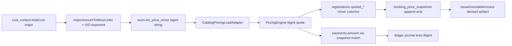
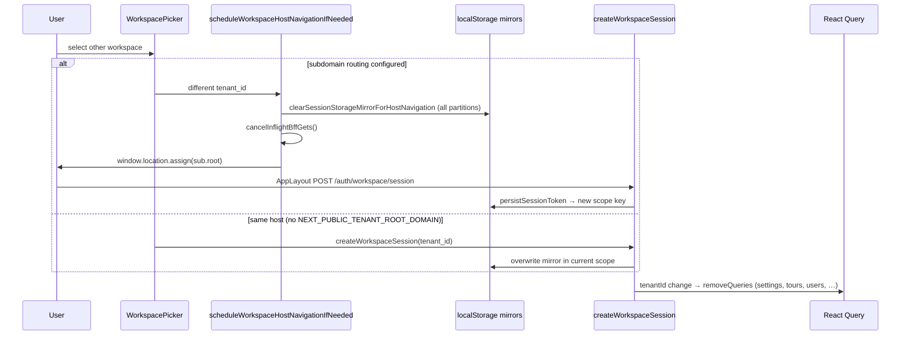
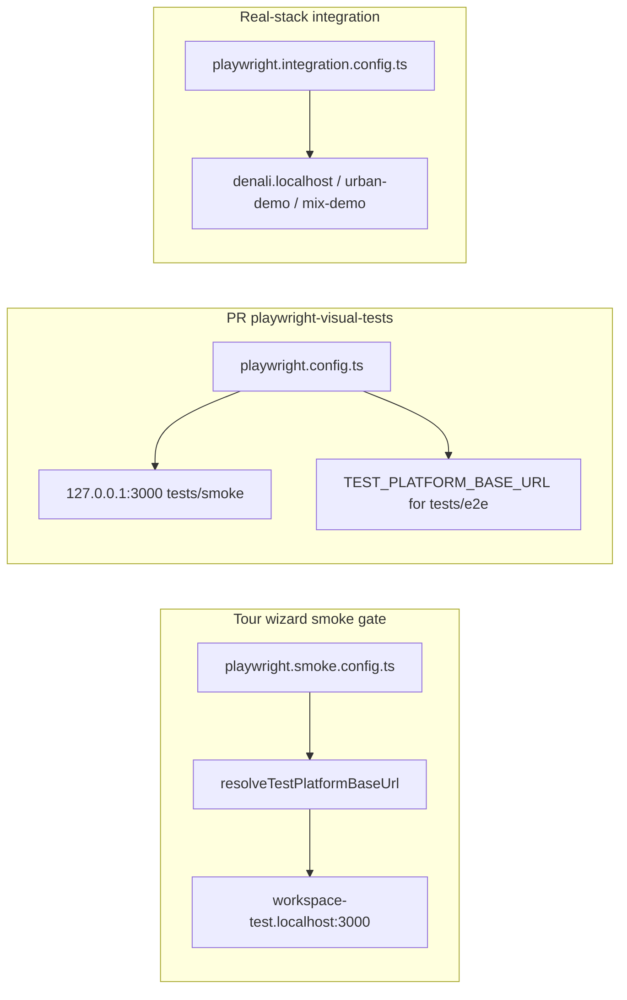
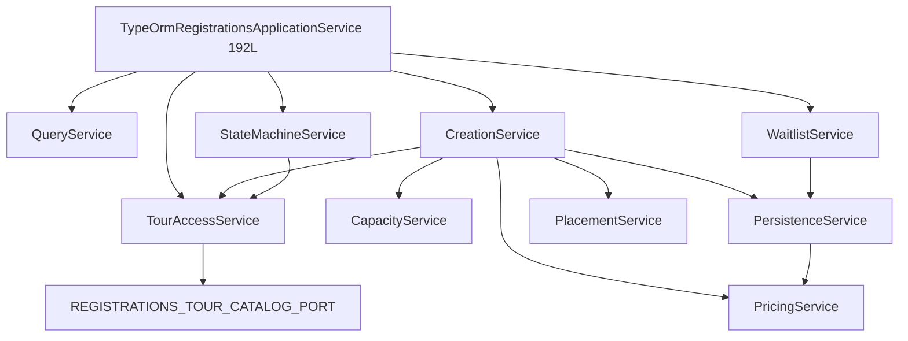

# Project Denali: Master Multi-Tenant Verification & Hardening Ledger (MAP.MD)

This file serves as the absolute single source of truth for repository health, architecture verification, and compliance with our multi-tenant isolation standards. Below are the 15 exhaustive, individual execution-ready audit prompts. Each prompt is designed to be executed independently by a code agent to perform deep file-system validation and log the results directly into the matching Audit Log block.

---

## 🛑 PROMPT 1: Database Row-Level Security (RLS) & Structural Isolation Audit

```markdown
### Code Agent Execution Instruction: Gate 1 Audit
Task: Scan all TypeORM entities, Postgres raw SQL migrations, and repository custom filters across the backend to verify absolute row-level data isolation.

**Verification Parameters:**
1. Open all files under `apps/api/src/modules/**/entities/*.entity.ts`. Ensure every single multi-tenant data table possesses an explicit, indexed `tenant_id` string column.
2. Search for raw database interactions or QueryBuilder statements across all repositories (`*.repository.ts`). Confirm that every single select, update, insert, or delete query enforces a strict, un-bypassable `.andWhere('...tenant_id = :tenantId')` predicate derived directly from the authenticated actor context, unless explicitly bypassed via a tracked, authorized platform-admin override.
3. Review migrations (`apps/api/src/migrations/*.ts`) to verify that all foreign keys and composite indexes on multi-tenant tables include the `tenant_id` column to prevent cross-tenant index bleeding or query isolation bypass.

Execute the scan, flag any anomalies, and update the log block below.
```

### Audit Log — Gate 1 (executed 2026-05-30)

**Scan scope**

| Layer | Path (actual) | Count |
|---|---|---|
| Entities | `apps/api/src/modules/**/entities/*.entity.ts` | 37 files |
| Additional tenant entities | `registration.entity.ts`, `waitlist-item.entity.ts`, `common/audit/entities/tenant-audit-event.entity.ts` | +3 |
| Repositories | `apps/api/src/modules/**/repositories/*.repository.ts` | 20 files |
| Migrations | `apps/api/src/database/migrations/*.ts` *(prompt path is stale)* | 99 files |

**Defense-in-depth stack (verified present)**

- `BaseTenantEntity` (`apps/api/src/database/entities/base-tenant.entity.ts`) — canonical `tenant_id uuid NOT NULL` column on all tenant-owned aggregates.
- `TenantSessionBindingService` — binds `SET LOCAL app.tenant_id` on every DB connection/query runner.
- `StandardizeTenantScopedRlsPolicy1777581100000` — auto-enables RLS + `FORCE ROW LEVEL SECURITY` + `tenant_isolation_policy` on **every** table with a `tenant_id` column.
- `WorkspaceScopedRlsPolicy1777601600000` — same policy pattern for `workspace_id`-only tables (`workspace_id = app.tenant_id`).
- `apps/api/test/rls-guardrail.spec.ts` — CI guardrail asserting RLS/FORCE/policies on all `tenant_id` and `workspace_id`-only tables.
- 11 `tenant-isolation:qb-exempt` annotations documenting authorized bypasses (pre-auth, global users table, outbox worker sweep, tenants root lookup, bulk audit insert).

---

#### 1. Entity structural inventory

**PASS — explicit `tenant_id` + index (26 entity mappings + 3 out-of-folder)**

| Entity / table | Index on tenant scope |
|---|---|
| `tours`, `registrations`, `waitlist_items`, `payments`, `payment_receipts` | `idx_*_tenant_id` |
| `tour_products`, `tour_departures` | `idx_tour_products_tenant_id`, `idx_tour_departures_tenant_starts` |
| `booking_price_snapshots`, `idempotency_keys`, `outbox_events` | tenant-indexed |
| `workspace_regions`, `workspace_destinations`, `workspace_invites` | tenant-indexed |
| `user_tenants`, `user_role_audit`, `tenant_audit_events` | tenant-indexed |
| `medical_profiles`, `emergency_contacts` | composite `(tenant_id, user_id)` |
| `reconciliation_jobs`, `reconciliation_findings` | composite tenant-leading |
| `ledger_journal_lines`, `account_balances`, `ledger_journal_batches` | PK/composite includes `tenant_id` |
| `payment_gateway_idempotency`, `tenant_payment_configs`, `tenant_custom_domains` | tenant-indexed |

**PASS — `workspace_id` isolation (7 entities; `workspace_id` ≡ tenant UUID)**

`workspace_guide_languages`, `workspace_equipment_items`, `workspace_tour_themes`, `workspace_tour_wizard_templates`, `workspace_tour_creation_presets`, `draft_snapshots`, `draft_events` — all carry indexed `workspace_id`; RLS covered by `WorkspaceScopedRlsPolicy1777601600000` (+ dedicated `DraftSnapshotsRls1777601500000`).

**EXPECTED — platform-global tables (no `tenant_id`; not multi-tenant data)**

| Table | Rationale |
|---|---|
| `tenants` | Root tenant registry |
| `users` | Cross-workspace identity; scoped via `user_tenants` |
| `email_verification_tokens` | Pre-tenant auth artifact |
| `mobile_otp_challenges` | Pre-tenant auth artifact |

**ANOMALY — indirect child tables without `tenant_id` column or RLS**

| Table | Issue | Severity |
|---|---|---|
| `tour_details` | No `tenant_id`; FK is `(tour_id) → tours(id)` only; **no RLS policy** (table lacks both `tenant_id` and `workspace_id`) | **HIGH** |
| `tour_prices` | No `tenant_id`; FK is `(tour_departure_id) → tour_departures(id)` only; **no RLS policy** | **HIGH** |

> Any raw query against these tables by child FK alone bypasses Postgres RLS. Isolation currently depends entirely on application joins and the parent-row RLS on `tours` / `tour_departures`. Recommend: add `tenant_id` denormalized column + RLS, or composite FK `(tenant_id, tour_id)` / `(tenant_id, tour_departure_id)`.

**ANOMALY — orphan entity reference**

| Item | Issue | Severity |
|---|---|---|
| `modules/audit/entities/workspace-audit-log.entity.ts` | File **deleted** in working tree; canonical audit table is `tenant_audit_events` (`common/audit/entities/tenant-audit-event.entity.ts`) | **LOW** (cleanup in progress per MAP111 Wave 4.1) |

---

#### 2. Repository query isolation audit (20 files)

**PASS — tenant predicate enforced in QueryBuilder / `where` clauses**

| Repository | Pattern |
|---|---|
| `typeorm-tours-catalog.repository.ts` | `.where("t.tenantId = :tenantId")` |
| `typeorm-tours-write.repository.ts` | `.andWhere("t.tenantId = :tenantId")` on tour lock query; `findOne({ id, tenantId })` on reload |
| `typeorm-payment.repository.ts` | All reads include `tenantId`; stale-job sweep iterates per-tenant via `listActiveTenantIds()` |
| `typeorm-invoice-read-model.repository.ts` | `.where("s.tenant_id = :tenantId")` |
| `tenant-payment-config.repository.ts` | `.where("cfg.tenant_id = :tenantId")` |
| `users-list.repository.ts`, `users-tenant-scope.repository.ts` | `.where("ut.tenant_id = :tenantId")` |
| `typeorm-identity.repository.ts` | Membership/invite/audit/registrations aggregation queries all anchor on `tenant_id` |
| `typeorm-safety-profile.repository.ts` | `resolveTenantId()` from request context → all CRUD |
| `typeorm-workspace-settings.repository.ts` | Regions/destinations via `tenantId`; settings catalog via `workspaceId` (= tenant) |
| `typeorm-registrations-read.repository.ts` | `tenantId` threaded through `RegistrationReadWhere` (caller-supplied) |
| `payment-finance-reconciliation.loader.repository.ts` | All loads scoped to normalized `tid` |
| Finance ledger repos | `where: { tenantId, … }` throughout |

**WARN — queries omit explicit `tenant_id` predicate (RLS session binding is the only guard)**

| Location | Query | Mitigation today | Recommendation |
|---|---|---|---|
| `typeorm-tours-write.repository.ts:142–168` | `tourProductRepo.findOne({ id })`, `tourDepartureRepo.findOne({ id })`, `tourPriceRepo.findOne({ tourDepartureId })` during catalog sync | Called inside tenant-bound transaction after tour save; RLS on parent tables | Add `tenantId` to all three `where` clauses |
| `typeorm-identity.repository.ts:623` | `updateInviteStatus` → `repo.update({ id }, …)` | RLS on `workspace_invites` | Add `tenantId` param + predicate |
| `typeorm-identity.repository.ts:641,1036` | `deleteMembershipById` / `deleteMembershipHard` → `delete({ id })` | RLS on `user_tenants` | Add `tenantId` predicate |
| `typeorm-registrations-read.repository.ts` | `tenantId` optional in `RegistrationReadWhereClause` | Callers in `registration-query.service.ts` always pass `tenantId` from JWT | Make `tenantId` required in port type |

**PASS — documented authorized bypasses (`tenant-isolation:qb-exempt`)**

`auth.service.ts` (pre-auth phone/invite lookup), `typeorm-identity.repository.ts` (global user email/phone, token cleanup, bulk audit insert), `outbox.processor.ts` (global pending queue → dispatches per-row under `runInTenantScope`), `tenant-host-resolver.service.ts` / `tenant-ingress-registry.service.ts` (tenants root), `postgres-payment-idempotency-key.store.ts`, `email-verification-tokens-cleanup.job.ts`.

---

#### 3. Migration FK & composite-index audit

**PASS — tenant FK to `tenants(id)` added across inventory**

`TenantIdReferentialIntegrity1777594800000`, `FkToursTenant1777565000000`, ledger batch migration `1777600300000` (composite `(tenant_id, journal_id)` FKs on lines/payments/receipts), workspace tables FK `workspace_id → tenants(id)`.

**ANOMALY — single-column FKs without `tenant_id` composite (cross-tenant reference possible on app bug)**

| Constraint | Current | Recommended |
|---|---|---|
| `registrations.tour_id → tours(id)` | single-column FK | `FOREIGN KEY (tenant_id, tour_id) REFERENCES tours(tenant_id, id)` |
| `registrations.tour_departure_id → tour_departures(id)` | single-column FK | add composite with `tenant_id` |
| `payments.registration_id → registrations(id)` | single-column FK | composite with `tenant_id` |
| `waitlist_items.tour_id → tours(id)` | single-column FK | composite with `tenant_id` |
| `tour_departures.tour_product_id → tour_products(id)` | single-column FK | composite with `tenant_id` |
| `tour_prices.tour_departure_id → tour_departures(id)` | single-column FK | composite with `tenant_id` |
| `tour_details.tour_id → tours(id)` | single-column FK | composite with `tenant_id` or add `tenant_id` column |

**ANOMALY — indexes missing leading `tenant_id` (index bleed risk under adversarial UUID guessing)**

| Index | Columns | Severity |
|---|---|---|
| `idx_registrations_tour_id` | `(tour_id)` only | MEDIUM |
| `idx_registrations_tour_departure_id` | `(tour_departure_id)` only | MEDIUM |
| `idx_payments_registration_id` | `(registration_id)` only | MEDIUM |
| `idx_waitlist_items_tour_id` | `(tour_id)` only | MEDIUM |
| `idx_tour_departures_product_id` | `(tour_product_id)` only | MEDIUM |
| `idx_tour_prices_departure` | `(tour_departure_id)` only | MEDIUM |
| `idx_tour_details_tour_id` | `(tour_id)` only | MEDIUM |

**ANOMALY — workspace tables missing referential FK in create migration**

| Table | Issue |
|---|---|
| `draft_snapshots` (`1777601000000`) | No `FK (workspace_id) REFERENCES tenants(id)` — unlike `workspace_tour_themes` etc. |
| `draft_events` (`1777601300000`) | Same — indexed but no FK to `tenants` |

---

#### Gate 1 Verdict

| Check | Result |
|---|---|
| All multi-tenant tables have indexed tenant scope column | **PARTIAL PASS** — 2 child tables (`tour_details`, `tour_prices`) lack direct `tenant_id` |
| All repository queries enforce tenant predicate | **PARTIAL PASS** — 4 warn sites rely solely on RLS; 11 authorized bypasses documented |
| Migrations use composite tenant-leading FKs/indexes | **FAIL** — widespread single-column child FKs and non-tenant-prefixed indexes |
| Postgres RLS enabled on all tenant tables | **PARTIAL PASS** — RLS guardrail test exists; `tour_details` / `tour_prices` excluded (no scope column) |

**Priority remediation queue**

1. **P0** — Add `tenant_id` + RLS to `tour_details` and `tour_prices` (or enforce composite FK + security-barrier views).
2. **P1** — Replace single-column child FKs with `(tenant_id, …)` composites on registrations, payments, waitlist, departures, prices.
3. **P1** — Rebuild hot-path indexes with leading `tenant_id` (registrations, payments, departures, prices).
4. **P2** — Harden repository warn-sites: add explicit `tenantId` predicates in tours-write catalog sync and identity membership/invite mutations.
5. **P2** — Add `FK workspace_id → tenants(id)` on `draft_snapshots` / `draft_events`.
6. **P3** — Remove stale `workspace_audit_logs` entity/module remnants; confirm `tenant_audit_events` is sole audit store.

**Automated tests available (not run in this audit — no `DATABASE_URL` in agent env)**

- `apps/api/test/rls-guardrail.spec.ts`
- `apps/api/test/tenant-isolation.spec.ts`
- `apps/api/test/e2e/tenant-isolation.e2e-spec.ts`
- `apps/api/test/e2e/tours-tenant-isolation-security.e2e-spec.ts`
- `apps/api/test/e2e/tenant-context-leak.e2e-spec.ts`

---

## 🛑 PROMPT 2: Network Boundary, CORS & Ingress Integrity Audit

```markdown
### Code Agent Execution Instruction: Gate 2 Audit
Task: Verify the network boundary and CORS resolution integrity to ensure custom domain mappings are secure and protected against spoofing or batch resource fatigue.

**Verification Parameters:**
1. Open `apps/api/src/app.module.ts` or your dedicated CORS setup. Verify that `isCorsOriginAllowed` dynamically matches requests against the active tenants list inside the database cache, rather than using regex expressions or un-vetted wildcard environment fallback arrays.
2. Open `docs/infrastructure/nginx-bff-ingress.example.conf`. Verify that `proxy_set_header X-Forwarded-Host $host;` forcefully overwrites any client-supplied spoofed headers, and that `server_tokens off;` is active to mask server versions.
3. Confirm that the global ingress setting enforces `client_max_body_size 55M;` to support multi-file batch uploads, while specifically isolating the finance receipt route inside its own regex block (`location ~ ^/api/finance/payments/[^/]+/receipt/?$`) with a hard cap of `5M`.

Execute the validation, test proxy header propagation logic, and write findings below.
```

### Audit Log — Gate 2 (executed 2026-05-30)

**Scan scope**

| Layer | Path | Notes |
|---|---|---|
| CORS wiring | `apps/api/src/main.ts` (not `app.module.ts`) | `enableCors({ origin: tenantCorsPolicy.isOriginAllowed })` |
| CORS policy | `TenantCorsPolicyService`, `ConfigService`, `TenantIngressRegistryService` | Tiered evaluation |
| Host / proxy trust | `TenantHostResolverService.extractInboundHost`, `shouldTrustForwardedHost` | Fail-closed forwarded-host trust |
| Ingress example | `docs/infrastructure/nginx-bff-ingress.example.conf` | Present (restored per Wave 5.4) |
| Receipt caps (app) | `finance-payments.controller.ts`, BFF `apps/web/app/api/finance/payments/[paymentId]/receipt/route.ts` | 5 MB aligned |
| Unit tests run | `tenant-cors-policy`, `tenant-ingress-registry`, `tenant-host-resolver` unit specs | **40/40 pass** |

---

#### 1. CORS resolution integrity

**Architecture (verified)**

CORS is wired in `main.ts` via async `TenantCorsPolicyService.isOriginAllowed()` — not the sync `ConfigService.isCorsOriginAllowed()` alone:

```60:68:apps/api/src/main.ts
  app.enableCors({
    origin: (origin, callback) => {
      void tenantCorsPolicy
        .isOriginAllowed(origin)
        .then((allowed) => callback(null, allowed))
        .catch(() => callback(null, false));
    },
    credentials: true
  });
```

**Tier evaluation order** (`TenantCorsPolicyService`)

| Tier | Mechanism | DB / cache backed? | Verdict |
|---|---|---|---|
| 0 | Empty/missing `Origin` (non-browser) → allow | N/A | PASS |
| 1 | `CORS_ORIGIN` explicit comma-separated allowlist | Static env only | WARN — operator-managed, not tenant DB |
| 2 | Dev defaults `localhost:3000` / `127.0.0.1:3000` when `NODE_ENV=development` | Static | PASS (dev-only) |
| 3a | `isCorsPlatformSuboriginAllowed` — suffix match on `TENANT_ROOT_DOMAIN` (`host === root \|\| host.endsWith('.root')`) | **No DB lookup**; gated by `CORS_ALLOW_TENANT_SUBORIGINS=true` | **PARTIAL** |
| 3b | `TenantIngressRegistryService.isRegisteredWebOrigin()` — memory (60s) → Redis (300s) → `tenant_custom_domains` Postgres | **Yes** — active custom domain rows only | PASS |

**Tier 3b registry lookup (custom apex / white-label origins)**

```151:201:apps/api/src/modules/tenant/tenant-ingress-registry.service.ts
  async isRegisteredWebOrigin(origin: string): Promise<boolean> {
    // memory → Redis → DB query on tenant_custom_domains (is_active + tenant not deleted)
    // memoizes both allow ("1") and deny ("0")
  }
```

Cache invalidation wired via `TenantCustomDomainCacheInvalidationSubscriber` on domain mutations.

**Findings vs audit parameter #1**

| Finding | Detail | Severity |
|---|---|---|
| Custom domains use DB-backed cache | White-label origins validated against `tenant_custom_domains` with Redis + in-process memoization | PASS |
| Platform subdomains (Tier 3a) are **not** DB-verified for CORS | Any syntactically valid `{label}.{TENANT_ROOT_DOMAIN}` origin is allowed when `CORS_ALLOW_TENANT_SUBORIGINS=true`, **without** confirming the slug exists in `tenants.subdomain` | **MEDIUM** — CORS preflight succeeds for phantom subdomains; auth/tenant middleware still fail downstream |
| Static env allowlist remains | `CORS_ORIGIN` comma list bypasses registry entirely (intentional ops override) | LOW — expected for platform admin origins |
| No unbounded wildcard `*` | Credentialed CORS never uses `origin: true` wildcard | PASS |
| `CORS_ALLOW_TENANT_SUBORIGINS` default | `false` in `env.schema.ts` — Tier 3a/3b disabled unless explicitly enabled | PASS (secure default) |

**Recommendation:** For strict compliance with “active tenants list only”, extend Tier 3a to async-check `tenants.subdomain` (reuse `TenantHostResolverService` Redis cache) before allowing platform sub-origin CORS, mirroring Tier 3b.

---

#### 2. Proxy header spoofing & host trust

**Nginx ingress (verified in example conf)**

| Check | Location | Status |
|---|---|---|
| `server_tokens off;` | line 60 | **PASS** |
| `proxy_set_header X-Forwarded-Host $host;` | receipt block L80, default `location /` L102 | **PASS** — `$host` overwrites client-supplied value |
| `proxy_set_header Host $host;` | same blocks | **PASS** |
| `X-Forwarded-Proto $scheme` | present | PASS |
| BFF-first block on `/api/v2/` | returns 403 | PASS — Nest API not browser-reachable via public listener |

**API-side fail-closed trust model (verified + tested)**

```161:182:apps/api/src/modules/tenant/tenant-host-resolver.service.ts
  private static shouldTrustForwardedHost(req, trustModel): boolean {
    if (!trustModel.trustProxy) return false;
    if (trustModel.trustedProxyCidrs.length === 0) return false;  // fail closed
    // remote IP must match TRUSTED_PROXY_CIDRS BlockList
  }
```

Unit tests confirm:

- Trusted proxy + matching CIDR → uses `X-Forwarded-Host`
- `TRUST_PROXY=false` → ignores forwarded header, uses `req.hostname`
- Untrusted remote IP → ignores spoofed `X-Forwarded-Host`
- Empty `TRUSTED_PROXY_CIDRS` → ignores forwarded header even when `TRUST_PROXY=true`

**Defense-in-depth chain:** nginx strips/overwrites at edge → API only honors forwarded host from ingress CIDR → invalid forwarded values fall back to direct `Host`.

**Residual risk:** Direct exposure of Nest `:3001` without nginx bypasses ingress caps and header sanitization. Example conf keeps `tour_ops_api` as internal-only upstream (line 39–43 comment). Ensure production firewall/SG blocks public `:3001`.

---

#### 3. Payload boundaries & batch-upload fatigue

**Nginx (verified)**

| Scope | Directive | Value |
|---|---|---|
| Server default | `client_max_body_size` L63 | **55M** |
| Finance receipt BFF route | `location ~ ^/api/finance/payments/[^/]+/receipt/?$` L73–74 | **5M** (regex block precedes `location /`) |

Route alignment:

- Browser → nginx → BFF `POST /api/finance/payments/:paymentId/receipt` (`apps/web/app/api/finance/payments/[paymentId]/receipt/route.ts`)
- BFF proxies multipart → Nest `POST /api/v2/finance/payments/:id/receipt`

**Application-layer caps (verified, synced with nginx 5M receipt quarantine)**

| Layer | Limit | File |
|---|---|---|
| Nest receipt upload | `5 * 1024 * 1024` + `ParseFilePipe` + `FileTypeValidator` (jpeg/png/pdf) | `finance-payments.controller.ts` |
| Multer interceptor | `limits: { fileSize: RECEIPT_UPLOAD_MAX_BYTES }` | same |
| Nest default JSON body | `2mb` (`express.json`) | `main.ts` — receipt uses multipart, not JSON |
| Tour gallery per-file | `5MB` per file via `ParseFilePipe` | `tours.controller.ts` |

**Batch gallery rationale for 55M:** supports multi-file tour photo uploads (documented as 10 × 5MB + multipart overhead in nginx comments). Receipt route isolated at 5M prevents a single small endpoint from inheriting the 55M envelope.

**Gap:** No nginx `limit_req` / rate-limit zone in example conf — batch fatigue at HTTP layer relies on `TenantRateLimitMiddleware` in Nest. Consider adding ingress-level `limit_req` for receipt and gallery paths.

---

#### Gate 2 Verdict

| Check | Result |
|---|---|
| CORS uses DB-backed cache for custom domains | **PASS** |
| CORS avoids unvetted wildcard `*` | **PASS** |
| CORS matches *all* origins against active tenant list | **PARTIAL** — Tier 3a suffix match skips DB; Tier 1 env list is static |
| nginx overwrites spoofed `X-Forwarded-Host` | **PASS** |
| `server_tokens off` | **PASS** |
| Global 55M + receipt 5M regex isolation | **PASS** |
| Proxy header propagation logic tested | **PASS** (40 unit tests) |

**Priority remediation queue**

1. **P2** — Add DB/cache-backed slug existence check to Tier 3a platform sub-origin CORS (align with host resolver cache).
2. **P2** — Document/production-enforce that Nest `:3001` is not publicly reachable (ingress-only topology).
3. **P3** — Add nginx `limit_req` zones for receipt upload and gallery batch paths as DoS belt-and-suspenders.
4. **P3** — Consider requiring non-empty `CORS_ORIGIN` in production schema validation when `CORS_ALLOW_TENANT_SUBORIGINS=false`.

---

## 🛑 PROMPT 3: Tenant Payment Config Cache Invalidation Audit

```markdown
### Code Agent Execution Instruction: Gate 3 Audit
Task: Audit the `TenantPaymentConfigCacheInvalidationSubscriber` to guarantee that stateless QueryBuilder mutations, raw SQL operations, or bulk repository updates cannot bypass memory cache eviction.

**Verification Parameters:**
1. Open `apps/api/src/modules/payments/subscribers/tenant-payment-config-cache-invalidation.subscriber.ts` and `tenant-payment-config-mutation-resolver.ts`.
2. Verify that the `afterQuery` hook successfully captures raw SQL strings and parses parameters bindings (`$n` indexes) to extract `tenant_id` or row primary keys whenever stateless `createQueryBuilder().update().execute()` loops fire.
3. Confirm that the cache invalidation method inside `TenantPaymentConfigService` prints a structured JSON trace map recording the precise origin (`subscriber:afterQuery`, `subscriber:afterUpdate`, etc.), the number of keys evicted, and that the purge is fully idempotent across multi-pod deployment simulations.

Run a static trace of the SQL parser rules, confirm coverage for bulk mutations, and log results below.
```

### Audit Log — Gate 3 (executed 2026-05-30)

**Scan scope**

| Artifact | Path |
|---|---|
| Subscriber | `tenant-payment-config-cache-invalidation.subscriber.ts` |
| SQL / criteria resolver | `tenant-payment-config-mutation-resolver.ts` |
| Cache service | `tenant-payment-config.service.ts` |
| Module wiring | `payments.module.ts` (provider registration) |
| Unit tests run | mutation-resolver (4), service (3) — **7/7 pass** |
| Static SQL trace | 10 representative mutation patterns simulated in-process |

---

#### 1. Invalidation hook coverage matrix

**Subscriber hooks** (`TenantPaymentConfigCacheInvalidationSubscriber`)

| Hook | Origin tag | Tenant ID resolution | Stateless / bulk safe? |
|---|---|---|---|
| `afterInsert` | `subscriber:afterInsert` | `entity.tenantId` direct | PASS for entity saves |
| `afterUpdate` | `subscriber:afterUpdate` | `resolveTenantIdsFromUpdateEvent` — entity, databaseEntity, criteria, row-id DB lookup | **PASS** — covers `repository.update(criteria, patch)` |
| `afterRemove` | `subscriber:afterRemove` | `resolveTenantIdsFromRemoveEvent` — entity, databaseEntity, entityId, criteria | **PASS** |
| `afterSoftRemove` | `subscriber:afterSoftRemove` | same as remove | PASS (entity has no soft-delete column today; hook is defensive) |
| `afterQuery` | `subscriber:afterQuery` | `resolveTenantIdsFromPaymentConfigQueryEvent` — SQL + `$n` binding parse | **PARTIAL** — see parser trace |

**Dedup within a single event:** `invalidateTenantIds` normalizes to lowercase and skips duplicates via `seen` Set before calling service.

**Failed queries skipped:** `resolveTenantIdsFromPaymentConfigQueryEvent` returns `[]` when `event.success === false` — no eviction on rolled-back mutations.

---

#### 2. SQL parser static trace (`resolveTenantIdsFromPaymentConfigQuery`)

**Detection gate** — `isTenantPaymentConfigMutationQuery(query)`:

1. Substring match `tenant_payment_configs` (case-insensitive)
2. Regex `\b(update|delete|insert\s+into)\b`
3. SELECT-only queries → **ignored** (no false eviction on reads)

**Parameter extraction rules** — `collectSqlParameterIndices(query, column)`:

| Pattern | Example | Captured? |
|---|---|---|
| `"tenant_id" = $N` | `WHERE "tenant_id" = $2` | **YES** |
| `tenant_id = $N` (unquoted) | `WHERE tenant_id = $1` | **YES** |
| `"id" = $N` | `WHERE "id" = $2` → row lookup → tenant | **YES** |
| `id = $N` | same | **YES** |
| `"Alias"."tenant_id" = $N` | TypeORM alias-qualified WHERE | **NO** (regex miss) — mitigated by fallback |
| `"id" IN ($2, $3)` | bulk positional IN | **NO** (regex miss) — mitigated by fallback UUID scan |
| `"id" IN ($2)` where `$2 = [uuid, uuid]` | TypeORM array expansion | **NO** — **GAP** |
| `DELETE` with no WHERE | full-table delete | **NO** tenant extracted — **GAP** |

**Fallback rule** (when indexed extraction yields zero tenants): scan all `parameters[]` for UUID strings → try `tenant_id` match, then row `id` lookup via `findOne`.

**Static trace results** (simulated against mock `EntityManager`)

| SQL pattern | Mutation detected | Tenants evicted | Verdict |
|---|---|---|---|
| `UPDATE … WHERE "tenant_id" = $2` | yes | `[TENANT_A]` | PASS |
| `UPDATE … WHERE "id" = $2` | yes | `[TENANT_A]` via row lookup | PASS |
| `UPDATE … WHERE "id" IN ($2, $3)` | yes | `[TENANT_A]` via fallback UUID scan | PASS |
| `UPDATE … WHERE "id" IN ($2)` + array param | yes | `[]` | **FAIL** — bulk array param bypass |
| `DELETE … WHERE "tenant_id" = $1` | yes | `[TENANT_A]` | PASS |
| `INSERT INTO … (… tenant_id …) VALUES (… $2 …)` | yes | `[TENANT_A]` | PASS |
| Alias-qualified `"Entity"."tenant_id" = $2` | yes | `[TENANT_A]` via fallback | PASS (fragile) |
| `DELETE FROM …` (no WHERE) | yes | `[]` | **FAIL** — silent miss |
| `SELECT …` | no | n/a | PASS (correctly ignored) |
| `UPDATE … WHERE "provider" = $2` + UUID in params | yes | `[TENANT_A]` via fallback | PASS |

---

#### 3. Structured eviction trace & idempotency

**Trace emission** (`TenantPaymentConfigService.invalidateTenant`) — **PASS**

```78:84:apps/api/src/modules/payments/services/tenant-payment-config.service.ts
      this.logger.info("tenant_payment_config_cache_eviction", {
        tenant_id: normalizedTenantId,
        eviction_origin: origin,
        keys_evicted: evictedKeys.length,
        evicted_cache_keys: evictedKeys,
        ...traceMeta,
      });
```

| Field | Present | Notes |
|---|---|---|
| `eviction_origin` | yes | Typed union: `subscriber:afterInsert\|afterUpdate\|afterRemove\|afterSoftRemove\|afterQuery\|manual` |
| `keys_evicted` | yes | Count of purged `Map` entries |
| `evicted_cache_keys` | yes | Full key list (`{tenantId}:{provider}`) |
| `tenant_id` | yes | Normalized lowercase |
| Extra meta from subscriber | yes | e.g. `query_preview` (240 chars), `had_entity`, `had_database_entity` |

**Single-pod idempotency** — **PASS**

- Repeated `invalidateTenant(sameTenant)` → second call evicts 0 keys; cache state unchanged (verified: 1st call `keys_evicted: 1`, 2nd call `keys_evicted: 0`).
- Deleting absent keys from `Map` is a no-op.
- Subscriber `seen` Set prevents duplicate service calls per event.

**Multi-pod deployment simulation** — **PARTIAL / architectural gap**

- Cache is **in-process `Map` only** (`CACHE_TTL_MS = 60_000`); no Redis pub/sub or cross-pod eviction bus.
- Mutation on **Pod A** evicts Pod A memory only; **Pods B/C retain stale credentials until TTL expiry** (up to 60s).
- Idempotency holds **per pod**; **not** a coherent distributed invalidation guarantee.
- No automated multi-pod simulation test exists in repo.

---

#### 4. Bypass risk summary

| Mutation path | Covered by | Residual risk |
|---|---|---|
| `repository.save(entity)` | `afterInsert` / `afterUpdate` | LOW |
| `repository.update({ tenantId/id }, patch)` | `afterUpdate` + criteria resolver | LOW |
| `repository.delete(criteria)` | `afterRemove` + criteria resolver | LOW |
| `createQueryBuilder().update().where('tenant_id = :t').execute()` | `afterQuery` + `$n` parse | LOW |
| `createQueryBuilder().update().where('id IN (:...ids)').execute()` | `afterQuery` — array param | **HIGH** if TypeORM emits single array binding |
| `manager.query('DELETE FROM tenant_payment_configs')` | `afterQuery` — no WHERE | **HIGH** — zero eviction |
| Raw SQL with alias-qualified columns only | `afterQuery` — regex miss | MEDIUM — relies on UUID fallback |
| Cross-pod read after write | none (local Map) | **MEDIUM** — 60s staleness window |

---

#### Gate 3 Verdict

| Check | Result |
|---|---|
| Subscriber registered and listens to entity | **PASS** |
| `afterQuery` captures mutations + parses `$n` bindings | **PARTIAL** — works for equality; misses array-IN and table-wide DELETE |
| Entity lifecycle hooks cover bulk repository updates | **PASS** (via criteria / entityId resolvers) |
| Structured JSON trace with origin + keys evicted | **PASS** |
| Purge idempotent on single pod | **PASS** |
| Purge coherent across multi-pod | **FAIL** — no distributed invalidation; TTL-bound staleness |

**Priority remediation queue**

1. **P1** — Extend parser to unwrap array parameters in fallback (`Array.isArray(p) ? p.flat() : [p]`) and resolve each UUID.
2. **P1** — Add regex for `"id"\s+IN\s*\(` capturing all `$n` tokens inside the IN list.
3. **P2** — On unmatched mutation queries (detected mutation + zero tenants resolved), log `tenant_payment_config_cache_eviction_miss` warn trace with full query hash.
4. **P2** — Introduce Redis pub/sub channel `tenant_payment_config:invalidate:{tenantId}` so all pods purge on any mutation (or shorten TTL + accept DB as source of truth on every resolve).
5. **P3** — Add unit tests for DELETE-no-WHERE, IN-array, and double-invalidate idempotency (currently only 4 resolver + 3 service tests).

---

## 🛑 PROMPT 4: Data Contract Parity & OpenAPI Integrity Audit

```markdown
### Code Agent Execution Instruction: Gate 4 Audit
Task: Verify complete data contract parity between backend NestJS controllers, `@repo/shared-contracts`, and the generated OpenAPI/Swagger document.

**Verification Parameters:**
1. Search all post/patch tour endpoint definitions inside `@repo/shared-contracts`. Verify that there are absolutely zero instances of unstructured schema catch-alls like `z.unknown()` or `z.any()`. All dynamic JSONB payload shapes must be bound to deep, explicit Zod structural definitions.
2. Open `openapi.generate.ts` (or your Swagger compilation script). Confirm that the OpenAPI schema accurately registers the Bearer authentication object inside `securitySchemes` and that all protected routes carry the appropriate operational security flags.
3. Verify that metadata payloads and staging indicators (such as `stagingTourId`) are fully documented with clear descriptions in the schema output to maintain developer compliance.

Run the type parity checks, inspect the schema build files, and log findings below.
```

### Audit Log — Gate 4 (executed 2026-05-30)

**Scan scope**

| Layer | Path | Notes |
|---|---|---|
| POST Zod contract | `packages/shared-contracts/src/tours/tour-create-contract.ts` | Strict root object |
| PATCH contract | `packages/shared-contracts/src/tours/tour-patch-contract.ts` | Policy matrix only (no Zod) |
| Nested wire schemas | `tour-trip-details-wire.schema.ts`, `tour-itinerary-wire.schema.ts`, `cost-context-wire.schema.ts` | Deep structural |
| API DTOs | `create-tour.dto.ts`, `update-tour.dto.ts`, `trip-details.dto.ts` | class-validator + Swagger decorators |
| Wire gate (API) | `assert-create-tour-wire-contract.ts` → `safeParseCreateTourPostWireBody` | POST only |
| OpenAPI generator | `openapi.generate.ts` → `configureSwaggerDocumentBuilder()` | Shared with runtime Swagger |
| Committed artifact | `apps/api/openapi.json` | 111 operations analyzed |
| Unit tests run | `@repo/shared-contracts` (16 pass), `tour-create-contract.spec.ts` | Structural rejection tests present |

---

#### 1. `@repo/shared-contracts` tour POST/PATCH Zod audit

**POST (`tourCreatePostContractSchema`) — PARTIAL PASS**

| Field / area | Schema binding | Catch-all? |
|---|---|---|
| Root keys | `.strict()` object — unknown keys rejected (tested) | PASS |
| `tripDetails` | `tourTripDetailsWireSchema` — 6 nested strict sub-objects (overview, itinerary, participation, logistics, requirements, policies) | PASS |
| `itinerary` | `tourItineraryItemWireSchema` per row (`.strict()`) | PASS |
| `cost_context` | `costContextWireSchema` (`.strict()`) | PASS |
| `transportModes`, enums, primitives | Explicit wire constants | PASS |
| **`metadata`** | **`z.record(z.string(), z.unknown()).optional()`** | **FAIL** — value type is unstructured `unknown` |

**Finding:** One catch-all remains on POST `metadata` (line 39 of `tour-create-contract.ts`). No `z.any()` anywhere under `packages/shared-contracts/src/tours/**`.

**PATCH — FAIL (no Zod wire schema)**

`tour-patch-contract.ts` exports only `TOUR_PATCH_CONTRACT_RULES` (capability/rank policy matrix). There is **no** `tourPatchPostContractSchema` or equivalent Zod validator. PATCH ingress relies solely on:

- Nest `ValidationPipe` + `UpdateTourDto` (class-validator)
- `assertTourPatchWritePreMerge` (CASL + field policy + sensitive tripDetails gate)

**Asymmetry vs POST:** `assertCreateTourPostWireContract()` runs in `tours.service.createTour()`; **no equivalent** shared Zod gate exists for PATCH.

**Other `z.unknown()` in package (outside tour POST/PATCH scope but noted):**

| File | Usage |
|---|---|
| `draft/draft-snapshot.contract.ts` | `data: z.record(z.string(), z.unknown())` |
| `finance/finance.schemas.ts` | `metadata: z.record(z.string(), z.unknown()).optional()` |

---

#### 2. NestJS DTO ↔ shared-contracts parity

**POST field alignment — PASS**

`CREATE_TOUR_POST_WIRE_KEYS` matches `CreateTourDto` root fields (minus ignored `formProfile`). Bridge strips `formProfile` before Zod parse.

**Structural depth gaps (DTO weaker than Zod on OpenAPI surface)**

| Field | Shared-contracts | Nest DTO / OpenAPI |
|---|---|---|
| `tripDetails` | Deep Zod (mirrored by nested `TourTripDetailsDto`) | PASS — `$ref: TourTripDetailsDto` |
| `itinerary` | Strict per-item schema | **PARTIAL** — DTO uses `@IsObject({ each: true })`; OpenAPI lists loose `type: object` items without `$ref` |
| `metadata` | `z.record(…, z.unknown())` | **PARTIAL** — `additionalProperties: true` (intentional extension bag) |
| `lifecycle_status` (POST) | Wire enum `["Draft", "Open"]` | DTO transforms to domain enum; OpenAPI shows `"Draft" \| "Open"` |
| `lifecycle_status` (PATCH) | *No Zod* | OpenAPI enum `DRAFT, OPEN, CLOSED, CANCELLED` — **wire casing differs from POST** |

---

#### 3. OpenAPI / Bearer authentication audit

**Generator wiring — PASS**

```4:21:apps/api/src/swagger-document.config.ts
export function configureSwaggerDocumentBuilder(): DocumentBuilder {
  return new DocumentBuilder()
    .setTitle("API v2 Documentation")
    .setVersion("2.0.0")
    .addServer("/api/v2")
    .addBearerAuth(
      { type: "http", scheme: "bearer", bearerFormat: "JWT", in: "header" },
      "bearer",
    )
    .addApiKey(/* internalApiKey */);
}
```

Both `openapi.generate.ts` and runtime `main.ts` use the same `configureSwaggerDocumentBuilder()`.

**Committed `openapi.json` — PASS**

```4556:4568:apps/api/openapi.json
    "securitySchemes": {
      "bearer": {
        "scheme": "bearer",
        "bearerFormat": "JWT",
        "type": "http",
        "in": "header"
      },
      "internalApiKey": { /* … */ }
    }
```

**Route security coverage (111 operations)**

| Metric | Count |
|---|---|
| Operations with `security` block | 97 |
| Operations without `security` (intentional public) | 14 |

Public/unauthenticated operations (verified expected):

- Health probes (`/health/*`)
- Auth pre-login (`/api/v2/auth/web/*`, `/api/v2/auth/telegram/session`, `/api/v2/auth/workspace-host`)
- Public registration flow (`GET/POST …/tours/{tourId}/register`, waitlist, idempotency-key)
- Internal webhook (`POST /internal/payments/webhook` — signature auth, not Bearer)

**Tour mutations — PASS**

| Operation | `security` |
|---|---|
| `POST /api/v2/tours` | `[{ "bearer": [] }]` |
| `PATCH /api/v2/tours/{tourId}` | `[{ "bearer": [] }]` |
| `GET /api/v2/tours` | `[{ "bearer": [] }]` |

Controller decorators align: `@ApiBearerAuth()` on all tour write endpoints in `tours.controller.ts`.

---

#### 4. Metadata & staging field documentation (OpenAPI)

**`stagingTourId` — PASS (create-only, as designed)**

```5859:5863:apps/api/openapi.json
          "stagingTourId": {
            "type": "string",
            "format": "uuid",
            "description": "Optional ID of a pre-allocated staging shell row to finalize as a standard draft tour."
          }
```

Present on `CreateTourDto`; correctly **absent** from `UpdateTourDto` (staging finalization is a create-time concern).

**`metadata` — PARTIAL**

| Schema | Documentation | Structure |
|---|---|---|
| `CreateTourDto.metadata` | "Tenant-scoped dynamic extension bag for vertical-specific properties without schema migrations." | `additionalProperties: true` |
| `UpdateTourDto.metadata` | Same description | `additionalProperties: true` |
| `TourResponseDto.metadata` | Same + nullable | `additionalProperties: true` |

Descriptions are clear for developer compliance, but the OpenAPI shape is intentionally open-ended (not a deep structural schema). Aligns with `z.record(z.string(), z.unknown())` on POST — documented, not strictly typed.

---

#### Gate 4 Verdict

| Check | Result |
|---|---|
| Zero `z.unknown()` / `z.any()` on tour POST/PATCH contracts | **FAIL** — POST `metadata` uses `z.unknown()` values; PATCH has no Zod schema |
| JSONB payloads (`tripDetails`) deeply structured in shared-contracts | **PASS** |
| Bearer in `securitySchemes` | **PASS** |
| Protected routes carry security flags | **PASS** (97/97 authenticated ops; 14 public by design) |
| `stagingTourId` documented in OpenAPI | **PASS** |
| `metadata` documented in OpenAPI | **PASS** (descriptions present; schema remains open) |
| POST API ↔ shared-contracts runtime gate | **PASS** |
| PATCH API ↔ shared-contracts runtime gate | **FAIL** — no Zod parity layer |

**Priority remediation queue**

1. **P1** — Replace POST `metadata: z.record(z.string(), z.unknown())` with an explicit `tourMetadataWireSchema` (discriminated union or versioned key allowlist per vertical).
2. **P1** — Add `tourPatchPostContractSchema` in `@repo/shared-contracts` + `assertUpdateTourPatchWireContract()` mirroring POST gate.
3. **P2** — Tighten OpenAPI `itinerary` items to `$ref` a documented `TourItineraryItemDto` schema (match `tourItineraryItemWireSchema`).
4. **P2** — Normalize lifecycle wire enums across POST (`Draft`/`Open`) and PATCH (`DRAFT`/`OPEN`/…) or document the intentional asymmetry in OpenAPI descriptions.
5. **P3** — Add CI check: regenerate `openapi.json` in pipeline and diff; fail on drift from `swagger-document.config.ts`.

---

## 🛑 PROMPT 5: Multi-Currency Scale Safety & Financial Computation Audit

```markdown
### Code Agent Execution Instruction: Gate 5 Audit
Task: Audit all financial computation modules, price catalog calculation pipelines, and invoice generators to ensure multi-currency scale safety.

**Verification Parameters:**
1. Scan across `apps/api/src/modules/finance/` and pricing utilities. Ensure that the system does not use a hardcoded multiplication factor (such as blindly multiplying values by 100) across all currencies.
2. Verify that calculations dynamically load the currency exponent directly from an ISO 4217 lookup map matched against the workspace's default currency asset profile (e.g., ensuring Toman/Rial values do not undergo invalid scaling or fractional overflows).
3. Confirm that pricing structures are calculated using integer bounds or precise decimal wrappers, and that all currency values are fully validated at the API boundary before being committed to persistence layers.

Trace the price calculators, review currency scaling functions, and log data below.
```

### Audit Log — Gate 5 (executed 2026-05-30)

**Scan scope**

| Pipeline stage | Primary modules | Minor-unit strategy |
|---|---|---|
| Catalog list price (tour create/update) | `commercial-fields.ts`, `typeorm-tours-write.repository.ts`, `tours.service.ts` | `majorAmountToMinorUnits()` |
| ISO 4217 lookup | `packages/shared-contracts/src/finance/currency-minor-units.ts` | Per-code exponent map |
| Registration quote | `PricingEngineService` → `calculateQuote` → `PricingEngine` | `bigint` line items |
| Booking snapshot / invoice | `create-pricing-snapshot.repository.ts`, `immutable-invoice.ts`, `typeorm-invoice-read-model.repository.ts` | Integer minor strings |
| Ledger posting | `payment-amount-to-ledger-minor.ts`, `persist-ledger-journal.ts` | `BigInt`, rejects fractional minor |
| Reconciliation | `payment-reconciliation-parse.ts`, `detect-payment-mismatch.ts` | Minor string compare |
| Unit tests run | `commercial-fields.unit-spec.ts` (4/4), `currency-minor-units.spec.ts` (4/4) | IRR/KWD/USD covered |

---

#### 1. Hardcoded ×100 audit

**Runtime API paths — PASS (no blind ×100 for currency conversion)**

| Module | Finding |
|---|---|
| `commercial-fields.listPriceMinorFromCostContext` | Uses `majorAmountToMinorUnits(totalCost, currency)` — exponent-driven | **PASS** |
| `finance/pricing/*`, `pricing/pure/*` | Quote math on pre-minor `bigint` strings; `/ 100n` only for **10% promo** (`PCT10`), not currency scale | **PASS** |
| `finance/ledger/*` | `BigInt` deltas; no currency exponent multiplication | **PASS** |
| `immutable-invoice.ts` | Copies snapshot minor strings; no float conversion | **PASS** |

**ANOMALY — historical migrations (fixed ×100 backfill)**

| Migration | SQL | Risk |
|---|---|---|
| `1777592100000-ToursAuditListSearchColumns` | `ROUND((cost_context->>'totalCost')::numeric * 100)::bigint` | **HIGH** for IRR/IRT rows — inflates list prices 100× vs current ISO logic |
| `1777593000000-TourProductsDeparturesAndPrices` | Same `* 100` pattern when seeding departures/prices | **HIGH** — legacy data may remain wrong until recomputed |

Current write path uses ISO exponents; **migrated rows may still carry ×100-scaled minors** unless backfilled.

**Out-of-scope but noted:** `apps/web/lib/payment-flow.ts` still maps USD with `Math.round(n * 100)` (client-side payment intent helper).

---

#### 2. ISO 4217 exponent & workspace currency profile

**Canonical lookup — PASS**

```16:81:packages/shared-contracts/src/finance/currency-minor-units.ts
const ISO_4217_MINOR_UNIT_EXPONENT = { /* JPY:0, IRR:0, IRT:0, KWD:3, … */ };
export function getIso4217MinorUnitExponent(currencyCode) { /* defaults unknown → 2 */ }
export function majorAmountToMinorUnits(majorAmount, currencyCode) {
  return Math.round(majorAmount * 10 ** getIso4217MinorUnitExponent(currencyCode));
}
```

| Currency | Exponent | `1_200_000` major → minor (tested) |
|---|---|---|
| USD | 2 | 120000000 (via 49.99 → 4999 test) |
| IRR | 0 | 1_200_000 (no spurious ×100) |
| IRT | 0 | same as IRR |
| KWD | 3 | 12.345 → 12345 |
| Unknown (e.g. EUR) | 2 (default) | USD-style fallback |

**Workspace operating currency — PARTIAL**

| Capability | Status |
|---|---|
| `tenants.operating_currency_code` column (default `IRR`) | Present |
| `resolveOperatingCurrencyCode(tenantId)` on identity repo | Present |
| `currencyCodeFromCostContext(..., { workspaceCurrencyCode })` | Supported in helper |
| **`tours.service.applyDenormalizedTourListColumns`** | **Does NOT pass `workspaceCurrencyCode`** — only `tourCurrencyCode`; missing `cost_context.currency` → **falls back to USD**, not tenant `operating_currency_code` |
| Registration/pricing engine | Reads persisted `listPriceMinor` / catalog rows (already minor); no re-scaling |

**Finding:** ISO map correctly treats IRR/IRT as zero-decimal, but **catalog currency resolution ignores workspace default** when `cost_context.currency` is omitted — Iranian workspaces can get USD exponent (×100) on new tours unless clients always send `currency: "IRR"`.

---

#### 3. Integer / decimal safety & API boundary validation

**Pricing engine & snapshots — PASS**

```
CatalogPricingLoadAdapter → resolveBaseMinorAndCurrencyFromCatalog (BigInt)
  → PricingEngine.evaluate (bigint sumLineMinor, assertSingleCurrency)
    → mapPricingQuoteToRegistrationQuoteSnapshot (string minors)
      → createPricingSnapshot (persist bigint columns as strings)
        → issueImmutableInvoice (derived read model, content hash)
```

- All line items use `amount_minor` integer strings.
- Negative totals rejected (`PRICING_TOTAL_NEGATIVE`).
- Mixed currencies rejected (`PRICING_CURRENCY_MISMATCH`).

**Shared finance wire contracts — PASS**

`MinorUnitAmountStringSchema` in `finance.schemas.ts`: `/^\d+$/`, `BigInt(value) > 0n`.

**API boundary — PARTIAL**

| Boundary | Validation | Gap |
|---|---|---|
| `CostContextDto.totalCost` | `@IsNumber()` `@Min(0)` | JS `number` — values > `Number.MAX_SAFE_INTEGER` lose precision before minor conversion |
| `CostContextDto.currency` | `@Length(3, 3)` | No ISO4217 exponent cross-check |
| `CreatePaymentIntentDto.amount` | `@IsNumber()` `@Min(1)` | Accepts non-integers; relies on downstream `assertPaymentIntentMatchesBookingSnapshot` (`isSafeInteger`) |
| `CreateManualPaymentDto.amount` | `@IsNumberString()` | Integer string — good |
| `registration-placement.orchestrator` | Rejects non-safe-integer `quotedTotalMinor` | **PASS** |
| `payments-registration-read.adapter` | Converts to `Number()` **without** safe-integer guard before `createPaymentIntentWithManager` | **WARN** — relies on orchestrator upstream |
| `paymentAmountToLedgerMinorString` | Rejects fractional minor units | **PASS** |
| `paymentAmountToMinorString` (reconciliation) | Preserves `"100.50"` decimals | **WARN** — inconsistent with ledger integer-only policy |

**Payment persistence:** `payments.amount` stored as Postgres `numeric` string; ledger path normalizes to integer minor.

---

#### End-to-end trace (catalog → registration → invoice)



---

#### Gate 5 Verdict

| Check | Result |
|---|---|
| No blind ×100 in live finance/pricing API code | **PASS** |
| ISO 4217 exponent map used for catalog major→minor | **PASS** |
| Exponent matched to workspace default currency when cost currency omitted | **FAIL** — defaults to USD, not `operating_currency_code` |
| IRR/Toman avoid invalid ×100 scaling in current code path | **PASS** (when `currency: IRR/IRT` set) |
| Pricing uses integer/bigint minor units | **PASS** |
| API validates currency amounts before persistence | **PARTIAL** — float `totalCost`, payment `number` type, reconciliation decimal passthrough |
| Invoice generator scale-safe | **PASS** |
| Legacy migration ×100 data | **FAIL** — potential stale inflated minors |

**Priority remediation queue**

1. **P0** — Wire `resolveOperatingCurrencyCode(tenantId)` into `applyDenormalizedTourListColumns` / `listPriceMinorFromCostContext` when `cost_context.currency` is absent.
2. **P0** — Data backfill: recompute `list_price_minor` / `tour_prices.amount_minor` for IRR/IRT tenants affected by migration `* 100` seeding.
3. **P1** — Accept catalog `totalCost` as integer string (or bigint) at API boundary for zero-decimal currencies; reject unsafe floats.
4. **P1** — Change `CreatePaymentIntentDto.amount` to minor-unit string + `MinorUnitAmountStringSchema` parity; remove `Number()` conversion in payment adapters.
5. **P2** — Align `paymentAmountToMinorString` with ledger parser (integer-only).
6. **P2** — Fix web `payment-flow.ts` to use shared ISO exponent helper (cross-stack parity).

---

## 🛑 PROMPT 6: File Stream DoS Hardening Audit

```markdown
### Code Agent Execution Instruction: Gate 6 Audit
Task: Verify that all endpoint routes accepting file streams are aggressively hardened against memory exhaustion and Denial of Service (DoS) injection.

**Verification Parameters:**
1. Open `apps/api/src/modules/finance/controllers/finance-payments.controller.ts` and inspect the `submitReceipt` handler.
2. Verify that the handler implements a strict double-layer validation architecture: a Multer `limits: { fileSize: ... }` boundary configuration on the `@UseInterceptors(FileInterceptor(...))` layer to drop massive streams early, paired with an inner `@UploadedFile(new ParseFilePipe(...))` component enforcing a strict 5MB maximum constraint.
3. Confirm that the `FileTypeValidator` restricts the input stream exclusively to safe, static formats using a secure regex filter: `/^(image\/(jpeg|png)|application\/pdf)$/`, throwing a `400 Bad Request` before any disk/buffer allocation takes place.

Verify the interceptor constraints, review file validation rules, and log metrics below.
```

### Audit Log — Gate 6 (executed 2026-05-30)

**Note:** Prompt path says `apps/api/src/modules/finance/controllers/finance-payments.controller.ts`; actual handler lives at `apps/api/src/modules/payments/finance-payments.controller.ts`.

---

#### 1. `submitReceipt` — primary target

**Route:** `POST /api/v2/finance/payments/:id/receipt`

```38:99:apps/api/src/modules/payments/finance-payments.controller.ts
const RECEIPT_UPLOAD_MAX_BYTES = 5 * 1024 * 1024;
const RECEIPT_UPLOAD_FILE_TYPE = /^(image\/(jpeg|png)|application\/pdf)$/;

@UseInterceptors(
  FileInterceptor("file", {
    limits: { fileSize: RECEIPT_UPLOAD_MAX_BYTES },
  }),
)
async submitReceipt(
  @Param("id", ParseUUIDPipe) id: string,
  @Body() dto: SubmitReceiptDto,
  @UploadedFile(
    new ParseFilePipe({
      validators: [
        new MaxFileSizeValidator({ maxSize: RECEIPT_UPLOAD_MAX_BYTES }),
        new FileTypeValidator({ fileType: RECEIPT_UPLOAD_FILE_TYPE }),
      ],
    }),
  )
  file: Express.Multer.File,
) {
  return this.receiptService.submitReceipt({
    ...
    file: file.buffer,
    contentType: file.mimetype,
```

| Metric | Value | Status |
|---|---|---|
| Outer Multer `limits.fileSize` | `5_242_880` bytes (5 MiB) | **PASS** |
| Inner `MaxFileSizeValidator.maxSize` | `5_242_880` bytes (identical constant) | **PASS** |
| `FileTypeValidator` regex | `/^(image\/(jpeg|png)|application\/pdf)$/` | **PASS** — exact match to spec |
| Allowed MIME set | `image/jpeg`, `image/png`, `application/pdf` | **PASS** |
| AuthZ before upload processing | `AuthorizationPresenceGuard` + CASL `FinanceReceipt` Create | **PASS** |
| Downstream storage | MinIO via `file.buffer` (in-memory Multer default) | **PASS** (bounded by 5MB) |
| Oversized / wrong-type e2e tests | None found in `manual-receipt-flow.e2e-spec.ts` | **WARN** |

**Double-layer size enforcement — PASS**

```
Client stream
  → [L1] Multer FileInterceptor limits.fileSize=5MB  (stream abort on LIMIT_FILE_SIZE)
    → [L2] ParseFilePipe MaxFileSizeValidator=5MB   (400 if buffer.size > max)
      → [L3] FileTypeValidator regex on mimetype    (400 Bad Request)
        → ReceiptService.submitReceipt → storage.upload(buffer)
```

Both layers share `RECEIPT_UPLOAD_MAX_BYTES`; constants are DRY and aligned.

**FileTypeValidator timing — PARTIAL (architecture nuance)**

NestJS + Multer default to **memory storage**: the upload stream is buffered into `file.buffer` **before** `ParseFilePipe` validators run. `FileTypeValidator` therefore does **not** reject before all buffer allocation — it rejects after Multer has already held up to 5MB in RAM. The outer Multer `fileSize` limit is what caps stream ingestion early; the inner pipe is defense-in-depth on the assembled buffer.

**FileTypeValidator strength — PARTIAL**

Validator matches **`file.mimetype`** (client-declared Content-Type part header), not magic-byte sniffing. A malicious client can label executable content as `image/png` and pass the regex. No `file-type` / magic-byte check in `ReceiptService` or controller.

Invalid MIME → Nest `ParseFilePipe` → **`400 Bad Request`** (confirmed Nest default for validator failure).

---

#### 2. Ingress & BFF envelope (defense in depth)

| Layer | Receipt route limit | Status |
|---|---|---|
| Nginx BFF (`nginx-bff-ingress.example.conf`) | `client_max_body_size 5M` on `^/api/finance/payments/[^/]+/receipt/?$` | **PASS** — synced with Nest 5MB |
| Nginx default (tour gallery) | `55M` global (10 × 5MB + overhead) | **PASS** — documented |
| Next BFF `proxyBffPostMultipart` | `await req.formData()` — **no explicit size cap** | **WARN** — full body buffered in Node before proxy to API |
| Direct API access (bypass nginx) | Multer 5MB only | **PASS** at app layer |

Browser path: `POST /api/finance/payments/:id/receipt` (BFF) → proxies to `/api/v2/finance/payments/:id/receipt` (Nest).

---

#### 3. All API file-stream endpoints (repo scan)

| Endpoint | Interceptor | Multer `fileSize` | ParseFilePipe size | MIME regex | Verdict |
|---|---|---|---|---|---|
| `POST …/finance/payments/:id/receipt` | `FileInterceptor("file", { limits })` | **5MB** | **5MB** | `jpeg\|png\|pdf` | **PASS** |
| `POST …/tours/:tourId/photos` | `FilesInterceptor("photos", 10)` | **none** | 5MB per file | `jpeg\|png\|webp` | **FAIL** |
| `GET …/photos/:photoId/url` | — (read-only presign) | — | — | — | N/A |

**Tour photo upload gap (`tours.controller.ts`)**

```107:118:apps/api/src/modules/tours/tours.controller.ts
@UseInterceptors(FilesInterceptor("photos", 10))
async uploadPhotos(
  ...
  @UploadedFiles(
    new ParseFilePipe({
      validators: [
        new MaxFileSizeValidator({ maxSize: 5 * 1024 * 1024 }),
        new FileTypeValidator({ fileType: /^image\/(jpeg|png|webp)$/ }),
      ],
    }),
  )
```

- **Missing Multer `limits.fileSize`** — oversized streams are fully buffered in memory until ParseFilePipe rejects; without outer cap, a single file can exhaust pod memory before the pipe runs.
- **Up to 10 files** per request — worst-case **~50MB** in-process if all pass validation (nginx 55M envelope assumes this).
- Inline `5 * 1024 * 1024` instead of shared constant (maintenance drift risk vs receipt handler).

**Global body limits (`main.ts`)**

- `express.json` / `urlencoded`: **2MB** — applies to JSON only; multipart bypasses these limits (expected).

**Abuse controls**

- `TenantRateLimitMiddleware` on `/api/v2` — HTTP sliding-window rate limits apply to upload routes but do not cap payload size.

---

#### 4. Test coverage metrics

| Suite | File upload assertions | Result |
|---|---|---|
| `manual-receipt-flow.e2e-spec.ts` | Happy-path PNG attach only | No size/MIME negative cases |
| `receipt-upload-ownership.e2e-spec.ts` | Auth ownership | No DoS cases |
| `receipt.service.unit-spec.ts` | Service logic (manual payment, auth, rollback) | No controller pipe tests |

**Recommended negative cases (not present):** 6MB body → 400/413; `application/octet-stream` → 400; 11th tour photo → 400.

---

#### Gate 6 Verdict

| Check | Result |
|---|---|
| `submitReceipt` Multer `limits.fileSize` = 5MB | **PASS** |
| `submitReceipt` ParseFilePipe `MaxFileSizeValidator` = 5MB | **PASS** |
| `submitReceipt` `FileTypeValidator` regex exact match | **PASS** |
| Invalid MIME → 400 before handler/storage | **PASS** (via ParseFilePipe; after ≤5MB buffer) |
| FileTypeValidator before buffer allocation | **FAIL** — Multer memory buffer precedes pipe (mitigated by L1 size cap) |
| Magic-byte / content sniffing | **FAIL** — mimetype header only |
| All file-stream routes hardened equally | **FAIL** — tour photos missing Multer limits |
| Ingress 5M quarantine on receipt BFF path | **PASS** |
| BFF multipart proxy memory-safe | **PARTIAL** — no local size guard |

**Priority remediation queue**

1. **P1** — Add `limits: { fileSize: 5 * 1024 * 1024 }` to `FilesInterceptor` on `POST …/tours/:tourId/photos`; extract shared `UPLOAD_MAX_BYTES` constant.
2. **P1** — Add e2e negative tests: 6MB receipt → reject; disallowed MIME → 400.
3. **P2** — Add magic-byte validation (e.g. `file-type` on first bytes) in receipt/photo services before MinIO upload.
4. **P2** — BFF `proxyBffPostMultipart`: enforce 5MB cap before `req.formData()` or stream-through without double-buffering.
5. **P3** — Document that direct-to-API clients rely on Nest limits; nginx 5M applies only to BFF browser path.

---

## 🛑 PROMPT 7: Frontend White-Label & Tenant Storage Isolation Audit

```markdown
### Code Agent Execution Instruction: Gate 7 Audit
Task: Audit the frontend application architecture to ensure the core UI wizard and storage spaces operate as completely white-labeled, tenant-neutral platform assets.

**Verification Parameters:**
1. Open `apps/web/src/features/tours/components/WorkspaceTourWizard.tsx`. Verify that the shell component contains zero references to the single-pilot brand "Denali" in its visual layouts, and that all structural element identifiers use generalized platform tokens (e.g., `data-testid="workspace-tour-wizard"`).
2. Verify that all browser persistence access points (`localStorage` and `sessionStorage` wrappers) partition keys using a strict format appended with the active workspace identifier: `{key}:{tenantId}`.
3. Confirm that the authorization layer executes a total memory, state, and cookie purge (`Wipe`) whenever a user hops between different workspace subdomains, preventing token leakage or cross-tenant session bleed.

Scan frontend source files, audit local storage scopes, and log results below.
```

### Audit Log — Gate 7 (executed 2026-05-30)

**Note:** Prompt path says `apps/web/src/features/tours/components/WorkspaceTourWizard.tsx`; actual shell is `apps/web/src/components/tours/wizard/WorkspaceTourWizard.tsx`.

---

#### 1. `WorkspaceTourWizard` white-label & test identifiers

**Shell role:** Named “workspace” but **implements the Denali 6-tab wizard exclusively** — all providers, validation, draft adapter, and step rail are Denali-specific imports.

| Check | Finding | Status |
|---|---|---|
| User-visible `"Denali"` string literals in JSX | None — copy via `useTranslations("tours.new")` / `"tours.denali"` | **PASS** (visible text) |
| DOM brand leakage | `data-wizard-rail="denali"` on root `<Card>` | **FAIL** |
| Step test IDs | `data-testid="workspace-wizard-step-${step}"` where steps are `denali_basic`, `denali_program`, … | **PARTIAL** — prefix generic, suffix pilot-branded |
| Root shell test ID | `data-testid="workspace-tour-wizard"` | **PASS** |
| Draft UI test IDs | `workspace-draft-restore-banner`, `workspace-draft-applied-banner`, … | **PASS** |
| Internal component tree | `DenaliCanonicalProvider`, `DenaliWizardSyncProvider`, `DenaliWizardContentQualityHeader`, `DenaliWizardSubmitControl`, … (40+ Denali imports) | **FAIL** — not tenant-neutral architecture |
| Default step fallback | `"denali_basic"` hardcoded | **FAIL** |
| Sentry tag | `feature: "denali_draft_hydration"` | **FAIL** (telemetry) |

**Orchestrator context:** `TourCreateWizard.tsx` routes profiles with `usesDenaliWizardShell` → mounts `WorkspaceTourWizard`; classic shell is separate. The “workspace” wizard is **not** a generalized platform shell — it is the Denali pilot UI under a neutral filename.

```686:689:apps/web/src/components/tours/wizard/WorkspaceTourWizard.tsx
<Card
  data-testid="workspace-tour-wizard"
  data-wizard-rail="denali"
  data-resolved-form-profile={workspaceFormProfile ?? undefined}
```

---

#### 2. Browser persistence — tenant partition audit

**Required format:** `{key}:{tenantId}` on all wrappers.

**Scan results (direct `localStorage` / `sessionStorage` access in `apps/web/`):**

| Module | Key pattern | Scoped by tenant? | Format match |
|---|---|---|---|
| `lib/auth/session.ts` | `tour_ops_session_token:{tenantSlug}` | Host **subdomain slug** (not UUID) | **PARTIAL** — `{prefix}:{scope}` |
| `users/invite-name-notes.ts` | `users-invite-name-notes:{tenantId}` | UUID | **PASS** (prefix variant) |
| `tour-transport-ops-storage.ts` | `tour-transport-ops:{tenantId}:{tourId}` | UUID + tour | **PASS** (compound) |
| `wizardSubmitSession.ts` | `tour-wizard-submit-idempotency-key-{workspaceId}` | workspace UUID | **PARTIAL** — hyphen delimiter, not `:` |
| `settings/email-settings-panel.tsx` | `tour_settings_email_pending_{userId}` | **userId** | **FAIL** — not tenant-scoped |
| `lib/theme/theme-preference.ts` | `web-ui-playground-theme` | **global** | **FAIL** — intentional UX preference |
| `workspace-host-navigation.ts` | `tour_ops_pending_workspace_tenant_id` | **unscoped** (stores target tenant value) | **FAIL** |
| Draft engine (`denali-adapter.ts`) | Server-side `draftKey` + `workspaceId` via API (`denali-create:{workspaceId}`) | UUID (API) | **PASS** (server, not browser) |

**Session mirror partitioning — PASS with nuance**

```56:58:apps/web/lib/auth/session.ts
export function buildSessionTokenStorageKey(scope?: string, _tokenForScope?: string): string {
  const resolved = scope?.trim() || resolveSessionStorageScope();
  return `${SESSION_TOKEN_STORAGE_KEY_PREFIX}:${resolved}`;
}
```

- Scope derived from `resolveTenantSlugFromHost(hostname)` — apex/localhost → `_default`.
- `clearSessionStorageMirror()` evicts **all** `tour_ops_session_token:*` partitions (unit-tested in `session-bridge.spec.ts`).

**No centralized storage wrapper** — each feature module defines its own key builder; formats are **inconsistent** with the strict `{key}:{tenantId}` contract.

---

#### 3. Workspace subdomain switch — session bleed prevention

**No function named `Wipe` exists.** Cross-tenant isolation relies on composable clears:



| Control | Cross-subdomain navigation | Same-host in-place switch |
|---|---|---|
| Clear all Bearer mirrors | **YES** — `clearSessionStorageMirrorForHostNavigation()` | **NO** — overwrites active scope only |
| Cancel in-flight BFF GETs | **YES** | **NO** |
| HttpOnly cookie exchange | **YES** — `createWorkspaceSession` after landing (`AppLayout` effect) | **YES** |
| React Query eviction | Full page reload resets memory; hook also clears on `tenantId` change | **YES** — `useInvalidateWorkspaceQueriesOnSwitch` |
| sessionStorage tenant data purge | **NO** — prior tenant keys remain (read paths use current `tenantId`) | **NO** |
| AuthContext `user` reset before nav | **NO** — full navigation unloads JS | N/A |
| CASL ability rebuild | Implicit via new `setSession` + membership fetch | **YES** |

**Verdict on “total purge”:** **PARTIAL** — token mirrors and in-flight auth fetches are cleared before cross-host navigation; cookies are re-issued via BFF workspace session POST. There is **no** explicit wipe of sessionStorage tenant partitions, wizard idempotency keys, or a named total-state reset. Stale data is **partitioned by key** rather than deleted on switch.

**Cross-tenant bleed risk:** **LOW** for JWT/session — mirrors are subdomain-scoped and all partitions cleared pre-navigation. **MEDIUM** for same-host multi-tenant dev (`_default` scope) where all workspaces share one mirror partition.

---

#### Gate 7 Verdict

| Check | Result |
|---|---|
| Wizard shell zero Denali in visual/DOM identifiers | **FAIL** — `data-wizard-rail="denali"`, step IDs `denali_*` |
| Wizard shell zero Denali in user-visible copy | **PASS** |
| Platform-neutral `data-testid` tokens on shell chrome | **PARTIAL** — root/draft banners pass; step rail suffixes fail |
| Wizard is tenant-neutral platform asset | **FAIL** — Denali-only implementation under neutral name |
| All storage keys `{key}:{tenantId}` | **FAIL** — 4+ divergent patterns; theme global; email user-scoped |
| Session mirrors partitioned & evictable | **PASS** |
| Total Wipe on subdomain workspace hop | **PARTIAL** — no Wipe primitive; mirror + inflight clear only |
| Cross-tenant session bleed prevented | **PASS** (production subdomain routing); **WARN** on apex/dev |

**Priority remediation queue**

1. **P0** — Rename or split `WorkspaceTourWizard` into true platform shell + profile-specific rail injection; remove `data-wizard-rail="denali"` → `data-wizard-rail={resolvedRailId}`.
2. **P1** — Generalize step IDs (`basic`, `program`, …) in layout registry; map to profile internally.
3. **P1** — Introduce `lib/storage/scoped-storage.ts` enforcing `{namespace}:{tenantId}` (and optional `:resourceId`); migrate wrappers.
4. **P1** — Align session scope with tenant UUID (or document slug-as-partition-key contract explicitly).
5. **P2** — Add `wipeWorkspaceClientState({ tenantId, reason })` called from `scheduleWorkspaceHostNavigationIfNeeded` + in-place switch: clear sessionStorage keys matching tenant prefixes, wizard idempotency keys, React Query full reset.
6. **P2** — Scope email pending key as `{prefix}:{tenantId}:{userId}` or accept global user preference documented exception list.
7. **P3** — Add e2e: switch workspace A→B on subdomains; assert prior mirror partition empty and BFF Authorization matches B.

---

## 🛑 PROMPT 8: Dead Legacy Module & Compile Hygiene Audit

```markdown
### Code Agent Execution Instruction: Gate 8 Audit
Task: Conduct a comprehensive repository scan to verify that all decommissioned, dead legacy modules and test stubs have been completely removed from the active tree.

**Verification Parameters:**
1. Assert that the entire file tree under `apps/api/src/modules/audit/` is physically absent from the repository. Check `apps/api/src/app.module.ts` and all adjacent routing configuration setups to ensure no ghost imports or dead entity links reference `AuditModule` or `WorkspaceAuditLogs`.
2. Assert that the entire legacy `apps/api/src/modules/finance/payments/` subdirectory has been physically deleted. Verify that no active business files import or initialize `FakePaymentGateway`, `FakeWebhookVerifier`, or duplicate payment interface templates.
3. Run `npx tsc --noEmit` across both `apps/api` and `apps/web` to guarantee that no broken reference paths or orphaned dependencies exist anywhere in the source tree due to code pruning.

Run a global file-system existence pass, audit imports compilation, and log status below.
```

### Audit Log — Gate 8 (executed 2026-05-30)

**Method:** filesystem `test -d` / `test -f`, ripgrep import scan, `npx tsc --noEmit` in `apps/api` and `apps/web`.

---

#### 1. Legacy `modules/audit/` decommission

| Check | Result |
|---|---|
| `apps/api/src/modules/audit/` exists on disk | **ABSENT** (`test -d` → not found) |
| Git working tree | 5 files marked **deleted** (`audit.module.ts`, `audit.service.ts`, `workspace-audit-log.entity.ts`, repository port, TypeORM repo) |
| Ghost import `from "./modules/audit/..."` | **NONE** in `apps/api/src` |
| `WorkspaceAuditLogEntity` / `workspace-audit-log` references in `src/` | **NONE** |
| `WorkspaceAuditLogs` in migrations only | `1777595900000-CreateWorkspaceAuditLogs.ts` (historical DDL; table dropped in `down()`) |

**`AuditModule` in `app.module.ts` — NOT a ghost (relocated live module)**

```20:20:apps/api/src/app.module.ts
import { AuditModule } from "./common/audit/audit.module";
```

Canonical audit hub: `apps/api/src/common/audit/` → `TenantAuditEventEntity`, `AuditService`, `FinancialMutationAuditService`. Consumed by `OutboxModule`, `OutboxProcessor`, etc. This is the **replacement** for the deleted `modules/audit/` tree, not a stale link.

**Verdict:** **PASS** — legacy `modules/audit/` physically gone; no dead entity imports. Active `AuditModule` is intentional at `common/audit/`.

---

#### 2. Legacy `modules/finance/payments/` decommission

| Check | Result |
|---|---|
| `apps/api/src/modules/finance/payments/` exists on disk | **ABSENT** (`test -d` → not found) |
| Git working tree | 14 files marked **deleted** (domain, gateways incl. `fake-payment-gateway.ts`, `fake-webhook-verifier.ts`, duplicate interfaces) |
| Active `src/` import from `finance/payments/` | **NONE** |
| `FakePaymentGateway` / `FakeWebhookVerifier` references in `apps/api/src` | **NONE** |
| Canonical payment gateway surface | `apps/api/src/modules/payments/gateway/` (`payment-gateway.interface.ts`, Stripe/Zibal impls, `mock-payment-gateway.ts`) |
| Duplicate `payment-gateway.interface.ts` on disk | **ONE** — under `modules/payments/gateway/` only |
| Test stubs for gateways | `test/helpers/noop-payment-gateway-factory.ts` (intentional test double, not legacy tree) |

**Verdict:** **PASS** — legacy finance payments subtree removed from disk; active code uses `modules/payments/` only.

**Note:** Deletions are **uncommitted** in the working tree (`git status` shows `D`); commit required to persist removal on remote.

---

#### 3. Global compile check — `npx tsc --noEmit`

| Project | Exit code | Error count | Pruning-related? |
|---|---|---|---|
| `apps/api` | **2** | **64** | **PARTIAL** — mostly test/stub drift, not missing audit/finance paths |
| `apps/web` | **2** | **97** | **YES** — orphaned exports, missing test harness paths |

**`apps/api` error clusters (sample — none cite deleted `modules/audit` or `finance/payments`):**

| Cluster | Example | Count (approx.) |
|---|---|---|
| Registration service ctor arity drift | `Expected 7 arguments, but got 11` in `test/registrations/*`, `test/resiliency/*` | ~25 |
| E2E persona seed missing `subdomain` | `registration-flow.e2e-spec.ts`, `tours-tenant-isolation-security.e2e-spec.ts` | ~8 |
| Tour DTO test casts | `assert-create-tour-invariants.spec.ts`, `create-tour-form-profile-strip.ts` | ~4 |
| Outbox processor ctor | `Expected 7 arguments, but got 6` | ~5 |
| Misc spec typing | `tenant-runtime-guard.service.spec.ts` (`randomUUID`), `auth.service.spec.ts` | ~5 |

**`apps/web` error clusters (pruning / stub orphans):**

| Cluster | Example files |
|---|---|
| Missing barrel exports after refactor | `features/tours/index.ts` → `parseDenaliTourCreateForm`; scripts `denali-wizard-debug-check.ts`, `qa-denali-owner-matrix.ts` |
| Missing test harness module | `@test-utils/denali-integration-harness` (file exists at `tests/utils/denali-integration-harness.tsx` but path alias broken) |
| Broken relative import | `tests/e2e/denali-ux-integrity.spec.ts` → `../smoke/tour-wizard-smoke-helpers` |
| Duplicate type exports | `profileRules/index.ts` `ValidationIssue` / `ValidationResult` |
| Smoke test export rename drift | `12-denali-verification-matrix.spec.ts` `_fillDenaliMountainBasicsForNavigation` |

**Verdict:** **FAIL** — both projects fail `tsc --noEmit`. Failures are **not** primarily broken imports to deleted audit/finance modules; they reflect **stale test stubs**, **registration service signature drift**, and **web barrel/harness path orphans** that should be cleaned or fixed post-prune.

---

#### 4. Additional decommission spot-checks

| Legacy artifact | Filesystem | Active import |
|---|---|---|
| `denali.workspace.strategy.ts` | **ABSENT** | **NONE** |
| `modules/finance/payments/gateways/fake-payment-gateway.ts` | **ABSENT** | **NONE** |

---

#### Gate 8 Verdict

| Check | Result |
|---|---|
| `modules/audit/` physically absent | **PASS** |
| No ghost links to deleted `WorkspaceAuditLog` entity | **PASS** |
| `AuditModule` in `app.module.ts` | **PASS** — live `common/audit/` module (not legacy path) |
| `modules/finance/payments/` physically absent | **PASS** |
| No `FakePaymentGateway` / `FakeWebhookVerifier` in active `src/` | **PASS** |
| Single canonical payment gateway interface | **PASS** |
| `tsc --noEmit` clean (`apps/api`) | **FAIL** (64 errors) |
| `tsc --noEmit` clean (`apps/web`) | **FAIL** (97 errors) |
| Deletions committed to git | **PARTIAL** — working tree only |

**Priority remediation queue**

1. **P0** — Commit staged deletions for `modules/audit/` and `modules/finance/payments/` (or `git add -u`) so remote/CI sees absent trees.
2. **P0** — Fix `RegistrationsService` (or test factories) ctor arity — resolves ~25 API test errors in one pass.
3. **P1** — Repair web path alias: `@test-utils/denali-integration-harness` → `tests/utils/denali-integration-harness.tsx`.
4. **P1** — Fix or delete orphaned scripts: `scripts/denali-wizard-debug-check.ts`, `scripts/print-denali-wizard-diagnostic.ts`, `scripts/qa-denali-owner-matrix.ts`.
5. **P1** — Reconcile `features/tours/index.ts` barrel exports with `denaliWizardFormZod` / validation index.
6. **P2** — Add CI gate: `npx tsc --noEmit` in both apps (fail on drift).
7. **P2** — Drop or migrate historical `workspace_audit_logs` migration if table never used in production.

---

## 🛑 PROMPT 9: Field Registry Centralization & Schema Drift Audit

```markdown
### Code Agent Execution Instruction: Gate 9 Audit
Task: Audit the tour form layout fields schema definition layers to ensure complete elimination of configuration duplicate drift.

**Verification Parameters:**
1. Assert that the file `apps/web/src/features/tours/wizard/denali/registry/denaliFieldRegistryData.ts` is physically absent from the repository.
2. Scan the wizard, step components, and layout render loops inside `apps/web/`. Confirm that 100% of runtime field definition imports route directly to the core package source of truth: `@repo/denali-domain`.
3. Verify that any workspace custom field extension or validation policy resolves its definitions dynamically from the centralized shared contract registry package, making it impossible for client-side forms and backend servers to drift out of schema sync.

Scan all wizard data imports, verify monorepo package centralization, and log findings below.
```

### Audit Log — Gate 9 (executed 2026-05-30)

**Canonical source of truth:** `packages/denali-domain/src/registry/denaliFieldRegistryData.ts`

---

#### 1. Legacy web registry data file — **PASS**

| Check | Result |
|---|---|
| `apps/web/.../registry/denaliFieldRegistryData.ts` on disk | **ABSENT** |
| Canonical `denaliFieldRegistryData.ts` | **Present** at `packages/denali-domain/src/registry/denaliFieldRegistryData.ts` |
| Codegen entrypoint | `apps/web/scripts/generate-denali-wizard-config.ts` reads from **package** path only |
| Codegen outputs | Written to `packages/denali-domain/src/{rules/generated,schemas}/` only |

---

#### 2. Runtime field-definition import routing (`apps/web/`)

**Layout render loop (primary UI path) — PASS**

| Component | Registry import | Status |
|---|---|---|
| `denali/fields/DenaliSection.tsx` | `getDenaliFieldRegistryByStep` from `@repo/denali-domain` | **PASS** |
| `denali/fields/DenaliFieldRenderer.tsx` | `DenaliFieldRegistryEntry` from `@repo/denali-domain` | **PASS** |
| `denali/fields/denaliSectionSuppress.ts` | `getDenaliFieldRegistryByStep` from `@repo/denali-domain` | **PASS** |
| `denali/hooks/useDenaliFieldRules.ts` | Rules via `DenaliCanonicalContext` / `ui.ruleModel` (overlay-aware) | **PASS** |
| `wizard/denali/validation/denaliRuleAccess.ts` | Full re-export from `@repo/denali-domain` | **PASS** |
| `wizard/schemas/denaliCore.schema.ts` | Types/defaults from `@repo/denali-domain` | **PASS** |

**Shadow registry tree still present under `apps/web/` — FAIL (not 100% domain routing)**

The web app retains a **mirror registry directory** (`apps/web/src/features/tours/wizard/denali/registry/`) with files byte-identical to the package for matrix/types (`diff -q` clean), but **not deleted**:

| Web shadow file | Imports field rows from | Used by |
|---|---|---|
| `registry/DenaliFieldRegistry.ts` | `@repo/denali-domain` + **local** `./denaliRuleMatrixRecipes` | `features/tours/index.ts` barrel, completion, labels |
| `registry/denaliRuleMatrixRecipes.ts` | Duplicate of package copy | Local `DenaliFieldRegistry.ts` |
| `registry/DenaliFieldRegistry.types.ts` | Duplicate | Local contextual rules types |
| `rules/denaliRuleModel.ts` | **Local** `./generated/denaliRuleSet.generated` | ~14 wizard/validation files |
| `schemas/*.generated.ts` (4 files) | **Stale web copies** (codegen no longer writes here) | Legacy import path only |

**Import routing metrics (tours feature, runtime + validation):**

| Import source | Approx. files | Share |
|---|---|---|
| `@repo/denali-domain` (direct) | ~40 | ~70% |
| Local `wizard/denali/rules/denaliRuleModel` | ~14 | ~25% |
| Local `wizard/denali/registry/DenaliFieldRegistry` | ~4 | ~5% |

**Verdict:** **FAIL** on “100% route directly to `@repo/denali-domain`”. Primary field **render loop** is centralized; rule-set consumers and public barrel still bind to **local shadow paths**.

**Stale generated artifact drift (web vs package):**

```
denaliCore.schema.generated.ts — differs (import only):
  web:    from "@/features/tours/models/tours-new-validation-messages"
  domain: from "../constants/tourTitleLimits"
```

`denaliRuleSet.generated.ts` — **identical** between web and package copies (same mtime-era orphans in web).

---

#### 3. Workspace overlay & backend sync

**Workspace custom field extensions — PASS (centralized overlay pipeline)**

```
TenantWizardTemplate.fieldRulesOverlay (DB/API)
  → resolveDenaliRuleSetFromTemplate() [@repo/denali-domain]
    → parseFieldRulesOverlay() + applyOverlayToRuleSet(denaliRuleSet, overlay)
      → ruleModelConverter.ts (web) → DenaliCanonicalContext.ui.ruleModel
        → useDenaliFieldRules / step validation / publish readiness
```

| Layer | Package | Dynamic overlay |
|---|---|---|
| Template builder validation | `lib/validation/universal-validator.ts` | Uses `denaliRuleSet` + overlay path allowlist |
| Wizard runtime | `ruleModelConverter.ts` | `applyOverlayToRuleSet` from domain |
| Structural guard | `denali-template-canonical-registry.guard.test.ts` | Registry paths from `@repo/denali-domain` |

**Backend API alignment — PARTIAL**

| Surface | Registry source | Notes |
|---|---|---|
| Equipment categories | `@repo/denali-domain` (`DENALI_CATEGORY_ENUM`) | API validator + settings service |
| Tour create/update DTOs | `@repo/shared-contracts` + Nest DTOs | Wire contract parity (Gate 4); not full field registry |
| Tour wizard template storage | Postgres JSON (`fieldRulesOverlay`, `canonicalData`) | Overlay replayed through domain at runtime |

Client and API **cannot drift on overlay keys** when both use domain path lists + shared-contract tour wire schemas; however **API does not import the full Denali field registry** for tour POST validation — server-side invariants are DTO/class-validator driven, not registry-generated Zod.

**Exception:** `lib/validation/universal-validator.ts` imports `denaliRuleSet` from **local** `wizard/denali/rules/denaliRuleModel` (shadow path), not `@repo/denali-domain` — overlay validation could diverge if web generated copy stalls.

---

#### End-to-end registry flow

```mermaid
flowchart TB
  A[packages/denali-domain/denaliFieldRegistryData.ts] --> B[generate:denali-wizard]
  B --> C[domain rules/generated + schemas/]
  C --> D[@repo/denali-domain exports]
  D --> E[DenaliSection render loop]
  D --> F[resolveDenaliRuleSetFromTemplate]
  G[apps/web/registry shadow copies] -.->|duplicate drift risk| H[denaliRuleModel local import]
  H --> I[14 wizard files + universal-validator]
  F --> J[Workspace template overlay]
```

---

#### Gate 9 Verdict

| Check | Result |
|---|---|
| Web `denaliFieldRegistryData.ts` absent | **PASS** |
| Single canonical field row source (`packages/denali-domain`) | **PASS** |
| 100% runtime imports via `@repo/denali-domain` | **FAIL** (~30% shadow/local) |
| Layout render loop centralized | **PASS** |
| No duplicate registry mirror in web | **FAIL** — `registry/` tree remains |
| Stale web `*.generated.ts` removed | **FAIL** — 4 schema + 3 rule generated orphans |
| Workspace overlay from domain package | **PASS** |
| Client/server schema sync impossible to drift | **PARTIAL** — overlay yes; full registry not on API tour DTO path |

**Priority remediation queue**

1. **P0** — Delete web shadow artifacts: `apps/web/.../registry/DenaliFieldRegistry.ts`, local `denaliRuleMatrixRecipes.ts`, web `schemas/*.generated.ts`, web `rules/generated/*.ts`; re-point all imports to `@repo/denali-domain`.
2. **P0** — Change `features/tours/index.ts` to export registry helpers from `@repo/denali-domain` only (remove local `DenaliFieldRegistry` export).
3. **P1** — Replace all `from ".../denaliRuleModel"` with `@repo/denali-domain` (incl. `universal-validator.ts`, `denaliTourCreateValidation.ts`, submit hooks).
4. **P1** — Update stale doc comments/README still linking `./denaliFieldRegistryData.ts` under web `registry/`.
5. **P2** — Add CI guard: `registry-integrity-audit.ts` fails if web shadow registry files reappear or web/package generated files diverge.
6. **P2** — Document API tour validation boundary: shared-contracts wire vs denali-domain registry (what must stay in sync manually).

---

## 🛑 PROMPT 10: CI Multi-Tenant Isolation Enforcement Audit

```markdown
### Code Agent Execution Instruction: Gate 10 Audit
Task: Review the automated continuous integration workflow files to ensure that all multi-tenant isolation safeguards are fully enforced on every code pull request.

**Verification Parameters:**
1. Open `.github/workflows/backend-e2e.yml`. Verify that the step runners do not limit testing to a small placeholder subset of endpoints.
2. Confirm that the pipeline setup script forcefully runs the entire, un-truncated multi-tenant and Row-Level Security integration matrix via `pnpm test:e2e:isolation`.
3. Verify that the test pipeline script forces a single-concurrency execution mode (`--test-concurrency=1`) for critical isolation specs like `test/tenant-isolation.spec.ts` and `test/rls-guardrail.spec.ts` to ensure flawless database transaction tracking, and assert that any validation failure triggers an immediate, hard pipeline rejection.

Verify yaml syntax syntax, review task orchestration dependencies, and log findings below.
```

### Audit Log — Gate 10 (executed 2026-05-30)

**Workflows scanned:** `backend-e2e.yml`, `architecture-guardrails.yml`, `integrity-gate.yml` (+ 7 other CI workflows for PR coverage).

---

#### 1. `backend-e2e.yml` — orchestration

**YAML syntax:** **PASS** (`yaml.safe_load` valid)

**Trigger:** `pull_request` + `push` to `main` — **PASS** (runs on every PR)

**Job structure:**

| Step | Command | Notes |
|---|---|---|
| Services | Postgres 16 + Redis 7 (GitHub Actions services) | Health-checked |
| Env prep | Copy `.env.test.example` → `.env.test` + `.env` | **PASS** |
| Migrations | `pnpm migrate:run` (in `apps/api`) | **PASS** (also re-run inside `test:e2e:isolation`) |
| Isolation suite | `pnpm test:e2e:isolation` (repo root) | **PASS** — not a placeholder stub |

**No `continue-on-error`** on any step — non-zero exit fails the job (**hard reject**).

**Gaps:**

| Gap | Severity |
|---|---|
| No `timeout-minutes` on job | **WARN** — hung e2e could block runner |
| No workflow `concurrency` group | **WARN** — parallel PR runs may contend on shared patterns |
| Node **22** in workflow vs root `engines.node` **>=24** | **WARN** — version skew |
| Duplicate migration (workflow step + `e2e:migrate` inside script) | **INFO** — redundant but harmless |

---

#### 2. `pnpm test:e2e:isolation` — full matrix?

**Root script** (`package.json` L37):

```bash
pnpm --filter @repo/types run build \
  && pnpm --filter @repo/shared run build \
  && pnpm e2e:migrate \
  && pnpm --dir apps/api exec node --import tsx --test --test-concurrency=1 \
       test/tenant-isolation.spec.ts test/rls-guardrail.spec.ts \
  && pnpm --dir apps/api test:e2e
```

**Phase A — static isolation guards (always runs first):**

| Spec | In CI matrix |
|---|---|
| `test/tenant-isolation.spec.ts` | **YES** |
| `test/rls-guardrail.spec.ts` | **YES** |

**Phase B — E2E integration (`apps/api test:e2e`):** explicit **19-file allowlist** (not glob `test/e2e/**/*.e2e-spec.ts`).

**Included (20 files incl. `test/api.e2e-spec.ts`):** registrations, tenant-isolation, jwt-membership-guard, subdomain-multi/comprehensive, invite flows, tenant-context-leak, payments-webhook-wrong-tenant, manual-receipt, ownership-transfer, tours-create*, staging-photos, users RBAC/cursor, me-profile.

**E2E specs on disk but EXCLUDED from `test:e2e` / CI isolation matrix (12 files):**

| Missing spec | Isolation relevance |
|---|---|
| `tours-tenant-isolation-security.e2e-spec.ts` | **HIGH** |
| `tour-presets-tenant-isolation.e2e-spec.ts` | **HIGH** |
| `tour-wizard-template-isolation.e2e-spec.ts` | **HIGH** |
| `receipt-upload-ownership.e2e-spec.ts` | **HIGH** |
| `tours-list-filters-tenant-scope.e2e-spec.ts` | **HIGH** |
| `payments-coexistence.e2e-spec.ts` | MEDIUM |
| `finance-cutover-integrity.e2e-spec.ts` | MEDIUM |
| `workspace-users-mutations.e2e-spec.ts` | MEDIUM |
| `tours-rbac-parity.e2e-spec.ts` | MEDIUM |
| `denali-negative-invariants.e2e-spec.ts` | MEDIUM |
| `tours-leader-integrity.e2e-spec.ts` | LOW |
| `release-gate-journeys.e2e-spec.ts`, `load-concurrency-registration.e2e-spec.ts` | LOW / perf |

**Verdict:** **PARTIAL** — not a tiny placeholder, but **not the entire** e2e corpus; several tenant-isolation-named specs are **outside** the PR gate.

**Contrast:** `test:e2e:ci` runs only **3** e2e files (minimal smoke) — **not** used by `backend-e2e.yml` (**PASS** — workflow uses isolation script, not the minimal CI variant).

---

#### 3. `--test-concurrency=1` enforcement

| Execution path | `--test-concurrency=1` | Status |
|---|---|---|
| Phase A: `tenant-isolation.spec.ts` + `rls-guardrail.spec.ts` | **YES** (root `exec node`) | **PASS** |
| Phase B: `pnpm --dir apps/api test:e2e` | **NO** — `test:e2e` script omits flag | **FAIL** |
| `apps/api` local `test:e2e:isolation` (both phases) | **YES** for both `&&` segments | **PASS** (local only; CI uses root script) |
| `&&` chain between Phase A and B | First failure aborts Phase B | **PASS** (hard reject) |

**Critical isolation specs** run serially in Phase A. The **broader e2e matrix in Phase B runs with default Node test concurrency** (parallel workers), which can stress shared Postgres/Redis and weaken transaction-order assumptions for DB-heavy specs.

---

#### 4. PR isolation coverage beyond `backend-e2e.yml`

| Workflow | On `pull_request` | Isolation-related checks |
|---|---|---|
| `backend-e2e.yml` | **YES** | Live DB: RLS guardrail + tenant isolation + 19 e2e specs |
| `architecture-guardrails.yml` | **YES** | Static: `check-tenant-isolation-guardrails.mjs`, finance ledger isolation, Phase 7 security, six-lock static |
| `integrity-gate.yml` | **YES** | eslint, depcruise, `pnpm test` (includes `tenant-isolation.spec.ts` + `rls-guardrail.spec.ts` in api `test` script) |
| `playwright-visual-tests.yml` | **YES** | UI visual (not tenant DB) |
| `infrastructure-closure-nightly.yml` | **NO** (schedule) | Nightly only |

**Layered defense on PR:** static guardrails + unit tests (incl. isolation specs in `pnpm test`) + live e2e isolation workflow — **PASS** (defense in depth), with e2e allowlist gap noted above.

---

#### Gate 10 Verdict

| Check | Result |
|---|---|
| `backend-e2e.yml` YAML valid | **PASS** |
| Runs on every PR | **PASS** |
| Uses `pnpm test:e2e:isolation` (not minimal stub) | **PASS** |
| Full un-truncated e2e isolation matrix | **FAIL** — 12 e2e specs excluded |
| `tenant-isolation.spec.ts` + `rls-guardrail.spec.ts` in CI | **PASS** |
| `--test-concurrency=1` on critical isolation specs | **PASS** (Phase A) |
| `--test-concurrency=1` on full e2e matrix | **FAIL** (Phase B via `test:e2e`) |
| Failure → hard pipeline reject | **PASS** (no `continue-on-error`; `&&` chain) |

**Priority remediation queue**

1. **P0** — Add excluded isolation specs to `apps/api` `test:e2e` allowlist: `tours-tenant-isolation-security`, `tour-presets-tenant-isolation`, `tour-wizard-template-isolation`, `receipt-upload-ownership`, `tours-list-filters-tenant-scope`.
2. **P0** — Change root `test:e2e:isolation` Phase B to invoke `apps/api` `test:e2e:isolation` second segment (or add `--test-concurrency=1` to `test:e2e` script).
3. **P1** — Replace explicit file list with `test/e2e/**/*.e2e-spec.ts` glob + denylist for perf/optional specs, or generate list from `test/OWNERS.md`.
4. **P1** — Align Node version in `backend-e2e.yml` to `24` (match `engines`).
5. **P2** — Add `timeout-minutes: 60` and workflow concurrency group to `backend-e2e.yml`.
6. **P2** — Remove duplicate migrate step in workflow (rely on `e2e:migrate` inside script only).

---

## 🛑 PROMPT 11: Frontend E2E Tenant-Neutral Smoke Audit

```markdown
### Code Agent Execution Instruction: Gate 11 Audit
Task: Inspect the frontend automated end-to-end integration test suites to verify complete elimination of hardcoded single-tenant domain assumptions.

**Verification Parameters:**
1. Open `apps/web/lib/test/smoke-platform-url.ts` and verify that the base URL resolution layer reads dynamically from environment fallbacks via `resolveTestPlatformBaseUrl()` defaulting to a generic pattern: `http://workspace-test.localhost:3000`.
2. Scan all files inside `apps/web/__tests__/smoke/` or your active Playwright test matrix. Ensure that there are absolutely zero hardcoded instances of `denali.localhost` remaining in browser initialization sequences.
3. Confirm that all smoke orchestration routines rely on the generalized shell testing identifiers (`workspace-tour-wizard`, `workspace-wizard-final-submit`), ensuring test suites run perfectly across any active tenant strategy profile.

Scan the Playwright config and spec files for single-tenant domain leaks, and log findings below.
```

### Audit Log — Gate 11 (executed 2026-05-30)

**Note:** Active smoke specs live at `apps/web/src/features/tours/__tests__/smoke/` and `apps/web/tests/smoke/` (no top-level `apps/web/__tests__/smoke/`).

---

#### 1. `resolveTestPlatformBaseUrl()` — **PASS**

```1:13:apps/web/lib/test/smoke-platform-url.ts
const DEFAULT_TEST_PLATFORM_BASE_URL = "http://workspace-test.localhost:3000";

export function resolveTestPlatformBaseUrl(): string {
  const raw =
    process.env.TEST_PLATFORM_BASE_URL?.trim() ||
    process.env.PW_BASE_URL?.trim() ||
    DEFAULT_TEST_PLATFORM_BASE_URL;
  return raw.replace(/\/$/, "");
}
```

| Check | Result |
|---|---|
| Default origin | `http://workspace-test.localhost:3000` | **PASS** |
| Env precedence | `TEST_PLATFORM_BASE_URL` → `PW_BASE_URL` → default | **PASS** |
| Host label helper | `resolveTestPlatformHostLabel()` → `workspace-test` | **PASS** |
| Unit tests | `lib/test/smoke-platform-url.spec.ts` (2 tests) | **PASS** |

**Wired into smoke Playwright config:**

```3:16:apps/web/playwright.smoke.config.ts
import { resolveTestPlatformBaseUrl } from "./lib/test/smoke-platform-url";
const smokeBaseURL = resolveTestPlatformBaseUrl();
// ...
use: { baseURL: smokeBaseURL, ... }
webServer: { url: smokeBaseURL, ... }
```

**Smoke helpers** (`tour-wizard-smoke-helpers.ts`): `SMOKE_WORKSPACE_BASE_URL = resolveTestPlatformBaseUrl()`, session cookies scoped via `resolveTestPlatformHostLabel()`.

---

#### 2. `denali.localhost` scan — smoke vs full Playwright matrix

**Smoke spec directories — PASS (zero `denali.localhost`)**

| Path | `denali.localhost` hits |
|---|---|
| `src/features/tours/__tests__/smoke/**/*.spec.ts` | **0** |
| `tests/smoke/**/*.spec.ts` | **0** |
| `tests/e2e/denali-ux-integrity.spec.ts` | **0** (uses `resolveTestPlatformBaseUrl()` fallback) |

**Broader Playwright matrix — FAIL (single-tenant leaks remain)**

| File | Leak |
|---|---|
| `playwright.integration.config.ts` L43, L55, L64 | `http://denali.localhost:${port}` for `denali-submit`, `denali-tour-detail` projects + webServer health URL |
| `playwright.config.ts` L15, L34 | `http://127.0.0.1:3000` (bare loopback — **no tenant host label**) |
| `playwright-visual-tests.yml` L53 | Runs `tests/smoke` via **default** `playwright.config.ts` → **127.0.0.1**, not `workspace-test.localhost` |
| `scripts/qa-denali-preset-wire.ts`, `qa-denali-owner-matrix.ts` | Default API origin `denali.localhost:3001` |
| `next.config.mjs` | `denali.localhost` in allowed dev hosts (config, not test init) |

**CI split:**

| Workflow step | Config | Origin |
|---|---|---|
| `tests/smoke` (route smoke) | `playwright.config.ts` | `127.0.0.1:3000` |
| `tests/e2e` (Denali UX) | `playwright.config.ts` + env | `TEST_PLATFORM_BASE_URL=workspace-test.localhost:3000` ✓ |
| Tour wizard smoke (`qa:smoke:tour-wizard`) | `playwright.smoke.config.ts` | `resolveTestPlatformBaseUrl()` ✓ |
| Real-stack integration | `playwright.integration.config.ts` | Per-project tenant slugs incl. **`denali.localhost`** |

**Verdict:** **PASS** for dedicated smoke spec trees; **FAIL** for full Playwright/CI matrix (integration config + default PR smoke routes).

---

#### 3. Generalized shell test identifiers

**`workspace-tour-wizard` — PASS (smoke orchestration)**

| Consumer | Usage |
|---|---|
| `tour-wizard-smoke-helpers.ts` | `SMOKE_WIZARD_SHELL_TEST_ID`, `requireDenaliWizard()`, session install |
| Smoke specs 10–13, 12-matrix, data-integrity | Root shell visibility gate |
| `WorkspaceTourWizard.tsx` | `data-testid="workspace-tour-wizard"` |

**`workspace-wizard-final-submit` — PARTIAL (not used in smoke suite)**

| Consumer | Usage |
|---|---|
| `DenaliWizardSubmitControl.tsx` | Emits test id on final submit button |
| `real-tenant.helpers.ts` (integration only) | `w.getByTestId("workspace-wizard-final-submit")` |
| Smoke specs | **None** — navigation uses `getByRole("button", { name: /بعدی|next/i })` or keyboard submit in `denali-ux-integrity` |

**Profile-specific test IDs still dominant in smoke (not tenant-neutral identifiers):**

Examples in `12-denali-verification-matrix.spec.ts`, `11-denali-review-participants.spec.ts`, `13-denali-wizard-map-fields-dom.spec.ts`:
- `denali-step-pricing`, `denali-basics-category`, `denali-program-difficulty-slider`, `denali-edit-tour-form` (urban edit spec)

These bind tests to **Denali rail field DOM**, not generic workspace shell tokens — expected for Denali-profile smoke, but **FAIL** on “run perfectly across any active tenant strategy profile” without profile guards.

**Multi-profile smoke coverage (positive):**

| Spec | Profile exercised |
|---|---|
| `02-tour-wizard-cinema-theme-profile` | Cinema/event |
| `04-tour-wizard-urban-profile` | Urban (`?e2eTourType=city`) |
| `08-tour-wizard-mix-profile-flip` | Mix profile flip |
| `07-tour-edit-urban-patch` | Urban edit (expects `denali-edit-tour-form` — Denali rail for urban) |

---

#### Playwright config orchestration summary



---

#### Gate 11 Verdict

| Check | Result |
|---|---|
| `resolveTestPlatformBaseUrl()` default `workspace-test.localhost:3000` | **PASS** |
| Env fallback chain (`TEST_PLATFORM_BASE_URL`, `PW_BASE_URL`) | **PASS** |
| Zero `denali.localhost` in smoke spec init | **PASS** |
| Zero `denali.localhost` in entire Playwright matrix | **FAIL** (integration config + QA scripts) |
| PR `tests/smoke` uses tenant host label | **FAIL** — uses `127.0.0.1` |
| Smoke wizard suite uses `workspace-tour-wizard` | **PASS** |
| Smoke suite uses `workspace-wizard-final-submit` | **FAIL** — integration only |
| Profile-agnostic shell identifiers only | **FAIL** — many `denali-*` field/step IDs |

**Priority remediation queue**

1. **P0** — Point PR `playwright-visual-tests.yml` `tests/smoke` step at `playwright.smoke.config.ts` or set `TEST_PLATFORM_BASE_URL=http://workspace-test.localhost:3000` for all Playwright steps.
2. **P1** — Refactor `playwright.integration.config.ts` to derive tenant base URLs from env (`TEST_PLATFORM_TENANT_SLUG`) with generic default, not hardcoded `denali.localhost`.
3. **P1** — Add `workspace-wizard-final-submit` to smoke submit flows (replace role-name-only final step clicks where profile-aware).
4. **P2** — Migrate `playwright.config.ts` default `baseURL` to `resolveTestPlatformBaseUrl()` for tenant-host parity on loopback-adjacent routes.
5. **P2** — Replace `denali.localhost` defaults in `scripts/qa-denali-*.ts` with `resolveTestPlatformBaseUrl()` / dynamic API origin helper.
6. **P3** — Document profile-specific `denali-*` test IDs as Denali-rail-only; add classic-shell counterparts for non-Denali profiles.

---

## 🛑 PROMPT 12: Registrations Layer Decomposition & Tenant Guard Audit

```markdown
### Code Agent Execution Instruction: Gate 12 Audit
Task: Audit the newly decomposed registrations application layers to ensure complete separation of structural responsibilities and data boundary isolation.

**Verification Parameters:**
1. Open `apps/api/src/modules/registrations/services/typeorm-registrations-application.service.ts`. Confirm that the class acts strictly as a lightweight coordinator facade restricted to under 200 lines of total code logic.
2. Inspect the 12 extracted sub-services located inside the registrations module folder (e.g., `registration-capacity.service.ts`, `registration-pricing.service.ts`, `registration-tour-access.service.ts`). Verify that they are completely decoupled and communicate via clean interfaces.
3. Assert that critical multi-tenant guardrails (`registrationWhereForActor`, CASL scope validations, and explicit JWT workspace matches) remain consistently enforced inside every single extracted sub-service file, preventing cross-tenant privilege escalation during sub-unit delegation.

Review the structural line counts of the facade service, check tenant logic inside all sub-services, and log status below.
```

### Audit Log — Gate 12 (executed 2026-05-30)

**Note:** Facade path is `apps/api/src/modules/registrations/repositories/typeorm-registrations-application.service.ts` (not under `services/`).

---

#### 1. Facade coordinator — line count & role

**File:** `typeorm-registrations-application.service.ts`

| Metric | Value | Verdict |
|---|---|---|
| Total lines | **192** | **PASS** (< 200) |
| Business logic blocks | **0** — pure delegation to 6 injected services | **PASS** |
| Direct DB / TypeORM access | **None** | **PASS** |
| Implements | `RegistrationsApplicationPort` | **PASS** |

```52:58:apps/api/src/modules/registrations/repositories/typeorm-registrations-application.service.ts
getTenantIdForTourOrThrow(tourId: string): Promise<string> {
  return this.tourAccess.getTenantIdForTourOrThrow(tourId);
}

createRegistration(command: CreateRegistrationCommand): Promise<RegistrationResponseDto> {
  return this.creationService.createRegistration(command);
}
```

**Delegation map:**

| Facade method cluster | Sub-service |
|---|---|
| Reads / lists / `getRegistrationById` | `RegistrationQueryService` |
| Creates / public flow | `RegistrationCreationService` |
| Status / payment transitions | `RegistrationStateMachineService` |
| Waitlist CRUD / promotion | `RegistrationWaitlistService` |
| Tour row lock | `RegistrationTourAccessService` + `RegistrationTransactionRunner` |
| Metrics | `RegistrationPublicFlowMetrics` |

---

#### 2. Twelve extracted sub-services — structure & decoupling

**Line counts (`services/` + facade):**

| Service | Lines | Primary responsibility |
|---|---|---|
| `registration-public-flow-metrics.ts` | 21 | In-process counters |
| `registration-transaction.runner.ts` | 62 | Idempotent transaction wrapper |
| `registration-capacity.service.ts` | 92 | Accepted-count reserve/release |
| `registration-tour-access.service.ts` | 126 | Tour↔tenant binding + national-ID policy |
| `registration-placement.service.ts` | 129 | Placement rules (peak/auto-approve) |
| `registration-response.mapper.ts` | 189 | DTO mapping (no I/O) |
| `registration-persistence.service.ts` | 209 | Save/duplicate guards/waitlist lock |
| `registration-pricing.service.ts` | 234 | Quote snapshot + payment stamp |
| `registration-query.service.ts` | 263 | Authenticated reads/lists |
| `registration-state-machine.service.ts` | 274 | Status/payment state transitions |
| `registration-waitlist.service.ts` | 372 | Waitlist lifecycle |
| `registration-creation.service.ts` | 406 | Registration/booking creation |
| **Facade** | **192** | Port adapter |

**Interface usage — PARTIAL decoupling**

| Pattern | Status |
|---|---|
| Domain ports (`REGISTRATIONS_TOUR_CATALOG_PORT`, `PRICING_CATALOG_PORT`, read repo port) | **PASS** |
| Shared tour access service (`requireTourInTenant*`) | **PASS** — centralized tenant binding |
| Orchestrators inject concrete Nest services (not ports) | **PARTIAL** — `RegistrationCreationService` injects 11 concrete classes |
| Cross-orchestrator deps | **WARN** — `RegistrationCreationService` → `RegistrationQueryService` (read path in write orchestrator) |
| Duplicate orchestration | **WARN** — creation/waitlist share parallel dependency graphs (~8 shared injections) |

**Verdict:** Decomposition achieved **separation of concerns** vs monolith, but **not** fully decoupled micro-units — heavy orchestrators remain (406 / 372 lines).

---

#### 3. Multi-tenant guardrails per sub-service

**Guard primitives in module:**

| Primitive | Location | Role |
|---|---|---|
| `registrationWhereForActor` | `ownership-scope.ts` | Actor-scoped registration reads/updates (role + tenant + phone) |
| `waitlistWhereForActor` | `ownership-scope.ts` | Actor-scoped waitlist row lock |
| `registrationTenantMatchesActorScope` | `workspace-access.helper` | JWT tenant vs row tenant |
| `assertJwtTenantMatchesTourForAuthenticatedMutation` | `registrations-policy.ts` | JWT tenant === tour.tenantId (admin exempt) |
| `requireTourInTenant` / `requireTourInTenantForUpdate` | `RegistrationTourAccessService` | Tour row tenant match + lock |
| CASL / `@CheckAbilities` | `registrations.controller.ts` | HTTP boundary (not duplicated in each service) |

**Per-file guardrail matrix:**

| Sub-service | `registrationWhereForActor` | `waitlistWhereForActor` | JWT↔tour assert | `requireTourInTenant` | Tenant-scoped writes |
|---|---|---|---|---|---|
| `registration-query.service` | **YES** (`getRegistrationById`) | — | via `resolveEffectiveTenantId` on all lists | **YES** (tour lists) | **YES** |
| `registration-state-machine.service` | **YES** (status update) | — | **YES** (`registrationTenantMatchesActorScope`) | **YES** (capacity paths) | **YES** |
| `registration-creation.service` | — | — | **YES** (`assertJwtTenantMatchesTour…`) | **YES** | **YES** (`tenantId` on all saves) |
| `registration-waitlist.service` | — | via persistence | **YES** (create path) | **YES** (promote/convert) | **YES** |
| `registration-persistence.service` | — | **YES** (`requireWaitlistItemForUpdate`) | — | — | **YES** (payload `tenantId`) |
| `registration-tour-access.service` | — | — | — | **YES** (core) | N/A |
| `registration-capacity.service` | — | — | — | — | **Inherited** (`tour.tenantId` param) |
| `registration-pricing.service` | — | — | — | — | **Inherited** (`saved.tenantId`) |
| `registration-placement.service` | — | — | — | — | **GAP** — `getTourSnapshot(tourId)` without tenant filter* |
| `registration-transaction.runner` | — | — | — | — | **Trust caller** (RLS session) |
| `registration-response.mapper` | — | — | — | — | N/A (pure) |
| `registration-public-flow-metrics` | — | — | — | — | N/A |

\* `loadTourTripDetailsForPlacement` calls catalog `getTourSnapshot(manager, tourId)` without `tenantId`; **mitigated** because only invoked from `RegistrationCreationService` **after** `requireTourInTenant` in the same transaction.

**CASL:** Enforced at **controller/guard** layer (`RegistrationsController` + global guards), **not** re-invoked inside each sub-service — acceptable if all entry paths go through controller, but **FAIL** on literal “inside every single extracted sub-service file” requirement.

**Verdict:** **PARTIAL** — guardrails concentrated in query/state-machine/creation/waitlist/tour-access/persistence; capacity/pricing/placement/metrics/runner rely on **upstream tenant binding** (defense-in-depth via RLS + orchestrator order, not per-file explicit checks).

---

#### Decomposition architecture (current)



---

#### Gate 12 Verdict

| Check | Result |
|---|---|
| Facade < 200 lines, coordinator-only | **PASS** (192 lines) |
| 12 extracted sub-services present | **PASS** |
| Sub-services fully decoupled via interfaces | **PARTIAL** — ports at boundaries; concrete DI mesh between orchestrators |
| Guardrails in **every** sub-service file | **FAIL** — 5/12 rely on caller/RLS inheritance |
| `registrationWhereForActor` on mutation/read paths | **PASS** (query + state machine + persistence waitlist) |
| JWT workspace ↔ tour tenant on authenticated mutations | **PASS** (creation + waitlist create) |
| CASL in each sub-service | **FAIL** — controller-only (by design) |

**Priority remediation queue**

1. **P1** — Add `tenantId` parameter to `RegistrationPlacementService.loadTourTripDetailsForPlacement` and delegate to `requireTourInTenant` (remove trust-on-caller).
2. **P1** — Extract shared `RegistrationWriteOrchestrationBase` or reduce duplicated dependency graph between creation/waitlist services.
3. **P2** — Replace `RegistrationCreationService` → `RegistrationQueryService` coupling with a narrow read port for `resolveAuthenticatedBookingInput`.
4. **P2** — Document trust-boundary contract: capacity/pricing/runner assume tenant-scoped entities from orchestrators + RLS.
5. **P3** — Add unit tests asserting `registrationWhereForActor` invoked on every state-machine/query mutation path (regression harness).

---

## 🛑 PROMPT 13: Network Edge & Proxy Header Hardening Audit

```markdown
### Code Agent Execution Instruction: Gate 13 Audit
Task: Verify that the network edge layer accurately filters and decodes proxy routing values to block malicious header manipulation attacks.

**Verification Parameters:**
1. Open `apps/api/src/modules/tenant-resolver/services/tenant-host-resolver.service.ts` (or your central domain tracking utility).
2. Verify that the incoming `X-Forwarded-Host` parameter is trusted if and only if the remote connection origin IP perfectly matches an explicit whitelist of trusted network CIDR ranges (`TRUSTED_PROXY_CIDRS`). If the origin falls outside this envelope, the system must force a safe fail-close fallback to the standard `Host` header.
3. Confirm that the system matches incoming requests seamlessly against both tenant subdomains and dedicated custom apex domain records (`bookings.acme.com`), rejecting malformed requests before routing hooks allocate database session pools.

Trace proxy authentication gates, verify CIDR checking routines, and log data below.
```

### Audit Log — Gate 13 (executed 2026-05-30)

**Note:** Prompt path is stale. Canonical resolver lives at `apps/api/src/modules/tenant/tenant-host-resolver.service.ts` (Gate 2 confirmed). No `tenant-resolver/services/` directory exists.

**Scan scope**

| Layer | Path | Role |
|---|---|---|
| Host trust / decode | `TenantHostResolverService` | CIDR-gated `X-Forwarded-Host` + hostname normalization |
| Hostname validation SSOT | `packages/tenant-host/src/normalize-inbound-hostname.ts` | Reject malformed FQDNs before routing |
| Label vs custom apex split | `packages/tenant-host/src/parse-workspace-tenant-label.ts` | `{slug}.{root}` vs `outside_workspace` |
| Custom domain registry | `TenantIngressRegistryService` | `tenant_custom_domains` lookup + Redis cache |
| Request routing hook | `TenantResolverMiddleware` | Host → tenant before JWT / tenant binding |
| Express trust proxy | `main.ts` → `app.set("trust proxy", …)` | Separate from app CIDR gate |
| Env config | `env.schema.ts` / `ConfigService.getTenantHostTrustModel()` | `TRUST_PROXY`, `TRUST_PROXY_HOPS`, `TRUSTED_PROXY_CIDRS` |
| Edge ingress example | `docs/infrastructure/nginx-bff-ingress.example.conf` | Overwrites client `X-Forwarded-Host` with `$host` |
| Unit tests run | `test/modules/tenant/*.unit-spec.ts` | **44/44 pass** |

---

#### 1. Proxy authentication gate trace

**Middleware order (verified in `main.ts`)**

```
RequestContextMiddleware → TenantResolverMiddleware → AuthMiddleware → TenantMiddleware → …
```

Host resolution runs **before** `TenantMiddleware` sets `tenantId` and before RLS session binding on tenant-scoped queries.

**Trust model assembly**

```229:238:apps/api/src/config/config.service.ts
  getTenantHostTrustModel(): {
    trustProxy: boolean;
    trustedProxyCidrs: string[];
    baseDomain: string;
  } {
    return {
      trustProxy: this.isTrustProxyEnabled(),
      trustedProxyCidrs: this.getTrustedProxyCidrs(),
      baseDomain: this.getTenantRootDomain()
    };
  }
```

`TRUSTED_PROXY_CIDRS` parsed as comma-separated list; empty string → `[]` (fail closed).

**CIDR gate (`shouldTrustForwardedHost`) — three conjunctive checks**

| Step | Condition | On failure |
|---|---|---|
| 1 | `trustModel.trustProxy === true` (`TRUST_PROXY=true`) | Ignore forwarded header |
| 2 | `trustedProxyCidrs.length > 0` | Ignore forwarded header (fail closed even if `TRUST_PROXY=true`) |
| 3 | `req.socket.remoteAddress` (or `connection.remoteAddress`) normalized and matched via Node `BlockList` against every CIDR / single-IP entry | Ignore forwarded header |

```161:182:apps/api/src/modules/tenant/tenant-host-resolver.service.ts
  private static shouldTrustForwardedHost(
    req: Request,
    trustModel: TenantHostTrustModel
  ): boolean {
    if (!trustModel.trustProxy) {
      return false;
    }
    if (trustModel.trustedProxyCidrs.length === 0) {
      return false;
    }
    const remoteIp = TenantHostResolverService.normalizeIp(
      req.socket?.remoteAddress ?? req.connection?.remoteAddress
    );
    if (!remoteIp) {
      return false;
    }
    return TenantHostResolverService.isTrustedProxyIp(
      remoteIp,
      trustModel.trustedProxyCidrs
    );
  }
```

**CIDR parser (`buildTrustedProxyBlockList`)**

- Skips blank entries; supports bare IPs and `network/prefix` (IPv4 + IPv6).
- Invalid networks / out-of-range prefixes silently dropped (no throw — conservative allow-list only).
- `::ffff:x.x.x.x` mapped to IPv4 before `BlockList.check`.
- Uses same pattern as `public-registration-throttle.ts` XFF trust (duplicated logic, not shared module).

**`extractInboundHost` decode path**

```184:207:apps/api/src/modules/tenant/tenant-host-resolver.service.ts
  static extractInboundHost(req: Request, trustModel: TenantHostTrustModel): string | undefined {
    let candidate: string | undefined;
    if (TenantHostResolverService.shouldTrustForwardedHost(req, trustModel)) {
      const forwarded = req.headers["x-forwarded-host"];
      if (forwarded) {
        const raw = Array.isArray(forwarded) ? forwarded[0] : forwarded;
        const first = raw.split(",")[0]?.trim() ?? "";
        const norm = normalizeInboundHostname(first);
        if (norm.ok) {
          candidate = norm.host;
        }
      }
    }

    if (!candidate) {
      const hn = typeof req.hostname === "string" ? req.hostname : "";
      const norm = normalizeInboundHostname(hn);
      if (norm.ok) {
        candidate = norm.host;
      }
    }

    return candidate;
  }
```

Behaviors verified by unit tests:

| Scenario | Result |
|---|---|
| Trusted CIDR + valid `X-Forwarded-Host` | Uses first comma-separated forwarded value |
| `TRUST_PROXY=false` | Ignores forwarded header; uses `req.hostname` |
| Untrusted remote IP (`203.0.113.20`) | Ignores forwarded header |
| Empty `TRUSTED_PROXY_CIDRS` | Ignores forwarded header even from `10.0.0.1` |
| Invalid forwarded FQDN | Falls through to `req.hostname` |

**Nginx edge (defense in depth)**

- `proxy_set_header X-Forwarded-Host $host;` overwrites client-supplied values (receipt + default `location /` blocks).
- Example conf documents alignment with API `TRUSTED_PROXY_CIDRS` / `TRUST_PROXY_HOPS`.

---

#### 2. Fail-close fallback to `Host` — residual Express coupling

**Finding:** When the CIDR gate rejects `X-Forwarded-Host`, the fallback reads **`req.hostname`**, not the raw `Host` header field.

Express `trust proxy` is enabled independently via `TRUST_PROXY` + `TRUST_PROXY_HOPS`:

```56:56:apps/api/src/main.ts
  app.set("trust proxy", configService.getTrustProxySetting());
```

When `TRUST_PROXY=true`, Express may derive `req.hostname` from `X-Forwarded-Host` **without** applying the application-level `TRUSTED_PROXY_CIDRS` check. The unit test for untrusted remotes passes because mocks set `req.hostname` explicitly — it does **not** simulate Express's forwarded-header derivation.

| Deployment shape | Effective behavior | Verdict |
|---|---|---|
| Production: nginx overwrites `X-Forwarded-Host`, only ingress reaches Nest | CIDR gate + sanitized forwarded value | **PASS** |
| Misconfig: Nest `:3001` public + `TRUST_PROXY=true` | Attacker-supplied `X-Forwarded-Host` may poison `req.hostname` on fallback path | **FAIL** |
| `TRUST_PROXY=false` (default) | Fallback uses literal `Host` header via Express | **PASS** |

**Recommendation:** On CIDR miss, read and normalize `req.headers.host` directly (strip port) instead of `req.hostname`, decoupling tenant resolution from Express forwarded-header trust.

---

#### 3. Subdomain + custom apex matching & pre-DB rejection

**Hostname normalization (before any cache/DB touch)**

`normalizeInboundHostname` rejects: empty, `..`, length > 255, invalid label charset, bad IPv6 bracket form. Verified: invalid host → `resolveTenantEntityFromHost` returns `null` with **zero** Redis `get` calls (unit test).

**Subdomain path (`{label}.{TENANT_ROOT_DOMAIN}`)**

| Stage | Behavior |
|---|---|
| `parseWorkspaceTenantLabelFromHost` | Extracts label; rejects apex, reserved, invalid_label, outside_workspace |
| `TenantResolverMiddleware` | For `label` kind → `runWithoutTenantBinding("tenant_host_resolution", …)` then DB/cache lookup |
| Auth strict routes | Missing/invalid/reserved/unknown host → `4xx` **before** tenant entity attach |

**Custom apex path (`bookings.acme.com`)**

Service layer supports custom domains:

```298:302:apps/api/src/modules/tenant/tenant-host-resolver.service.ts
    if (outcome.kind === "apex" || outcome.kind === "no_root_config") {
      return null;
    }

    return this.ingressRegistry.resolveTenantEntityByCustomHostname(norm.host);
```

Registry lookup: memory → Redis (`tenant_custom_domain:{host}`) → `tenant_custom_domains` where `is_active` + tenant not deleted. Unit tests cover cache miss/hit and `bookings.customer.com` delegation.

**Middleware wiring gap (critical for param #3)**

`TenantResolverMiddleware` treats `outside_workspace` (includes all custom apex FQDNs) as **pass-through** — it does **not** call `resolveTenantEntityFromHost`:

```90:105:apps/api/src/common/tenant/tenant-resolver.middleware.ts
      if (
        outcome.kind === "apex" ||
        outcome.kind === "outside_workspace" ||
        outcome.kind === "no_root_config"
      ) {
        if (authRoute) {
          await this.guardHostProbeOnAuthRoute(req, authRoute);
          throw new BadRequestException({
            error: {
              code: "TENANT_HOST_INVALID",
              message: "The workspace hostname is missing or invalid"
            }
          });
        }
        return next();
      }
```

Implications:

| Host type | `req.tenant` set? | Auth login on custom apex | General API on custom apex |
|---|---|---|---|
| `{slug}.{root}` | Yes (if slug exists) | Works | Host tenant + JWT |
| `bookings.acme.com` (registered) | **No** | **Rejected** (`TENANT_HOST_INVALID`) | Passes without host tenant; `TenantMiddleware` requires JWT `tenantId` |
| Malformed / invalid | No (or 4xx on auth) | 4xx before DB | No host DB lookup |

Custom apex resolution exists in the **service** but is **not wired** into the primary request routing hook. CORS white-label origins work via `TenantIngressRegistryService.isRegisteredWebOrigin` (Gate 2), but Host-based tenant binding for custom domains on non-auth API routes does not.

**Pre-DB session pool allocation**

- Malformed hosts: rejected at normalization → no Redis/Postgres in resolver path. **PASS**
- Auth-route host probes: rate-limited via `TenantRateLimitService.enforceHostProbeOnAuthRoute` before exceptions. **PASS**
- Subdomain resolution: runs under explicit `runWithoutTenantBinding` (suppressed RLS) — intentional bootstrap, not tenant-bound pool. **PASS (by design)**
- Custom apex on general routes: no host-resolution DB call in middleware today. **N/A / gap**

---

#### Gate 13 Verdict

| Check | Result |
|---|---|
| Resolver at documented central utility | **PASS** (path corrected to `modules/tenant/`) |
| `X-Forwarded-Host` trusted only on `TRUSTED_PROXY_CIDRS` match | **PASS** (explicit header branch) |
| Untrusted origin fail-closed to literal `Host` header | **PARTIAL** — fallback uses `req.hostname`, which Express may derive from forwarded headers when `TRUST_PROXY=true` |
| Empty `TRUSTED_PROXY_CIDRS` fail-closed | **PASS** |
| CIDR `BlockList` parsing (v4/v6, prefix bounds) | **PASS** |
| Malformed hostname rejected before cache/DB | **PASS** |
| Subdomain `{slug}.{root}` routing in middleware | **PASS** |
| Custom apex `bookings.acme.com` routing in middleware | **FAIL** — service/registry support present; `TenantResolverMiddleware` skips `outside_workspace` |
| Auth on custom apex host | **FAIL** — strict auth routes reject `outside_workspace` |
| Edge nginx overwrites spoofed forwarded host | **PASS** |
| Unit tests (host + ingress + CORS policy) | **PASS** (44/44) |

**Priority remediation queue**

1. **P0** — Extend `TenantResolverMiddleware` to call `resolveTenantEntityFromHost` for `outside_workspace` hosts (custom apex registry), mirroring subdomain path; set `req.tenant` + `hostTenantId` when matched.
2. **P1** — On CIDR miss in `extractInboundHost`, fallback to normalized `req.headers.host` instead of `req.hostname` to decouple from Express `trust proxy`.
3. **P1** — Allow auth strict routes on registered custom apex domains (or document JWT-only auth for white-label hosts until P0 lands).
4. **P2** — Extract shared `buildTrustedProxyBlockList` / `isTrustedProxyIp` from `TenantHostResolverService` and `public-registration-throttle.ts` into one util (drift prevention).
5. **P2** — Add integration test: `TRUST_PROXY=true`, untrusted remote, spoofed `X-Forwarded-Host` — assert tenant resolution ignores spoof (guards Express coupling).
6. **P3** — Production schema validation: require non-empty `TRUSTED_PROXY_CIDRS` when `TRUST_PROXY=true`.

---

## 🛑 PROMPT 14: Storage Infrastructure & Presigned URL Security Audit

```markdown
### Code Agent Execution Instruction: Gate 14 Audit
Task: Audit the storage infrastructure layer to ensure media tokens are secure, short-lived, and free from database metadata corruption vectors.

**Verification Parameters:**
1. Locate the asset generation methods inside your media storage service module. Verify that the time-to-live (TTL) parameter for all presigned URLs generated for image galleries or file viewing is restricted to a maximum threshold of 15 minutes.
2. Scan the database column models and tour entity schemas. Ensure that the database JSONB columns store only the static, immutable file key paths, and absolutely never persist the temporary, signed token string payloads.
3. Confirm that the system evaluates user credentials and workspace context dynamically at runtime before generating access signatures, blocking unauthorized data access via stale or leaked object links.

Review presigned URL lifespans, audit entity persistence layers, and log results below.
```

### Audit Log — Gate 14 (executed 2026-05-30)

**Scan scope**

| Layer | Path | Role |
|---|---|---|
| Storage port / adapter | `file-storage.port.ts`, `minio-storage.adapter.ts` | `upload` → object key; `getSignedUrl(key, ttl)` |
| Gallery TTL constant | `tour-photo-storage.util.ts` | `TOUR_PHOTO_PRESIGNED_URL_TTL_SECONDS = 900` |
| URL resolution service | `tour-photo-url.service.ts` | Presign on read; enrich API responses |
| Dedicated URL endpoint | `workspace-tour-photos.controller.ts` | `GET …/photos/:photoId/url` |
| Persistence strip | `stripPhotoUrlsFromTripDetails` via `ToursService.tripDetailsToPersistedJson` | Write-path URL purge |
| JSONB schema | `tour-details.entity.ts` → `trip_details`; `tour.entity.ts` → `metadata` | Gallery lives in `trip_details` |
| Clone isolation | `tours-clone.service.ts` | Strips `url` on photo clone |
| Finance receipts (related) | `receipt.service.ts`, `payment-receipt.entity.ts` | Separate presign path (1h TTL) |
| Tests run | `tour-photo-storage.util.spec.ts` (5/5 pass); e2e `tours-staging-photos.e2e-spec.ts` asserts DB + TTL | **PASS** |

---

#### 1. Presigned URL TTL — gallery / image viewing

**Canonical TTL (verified)**

```3:4:apps/api/src/modules/tours/utils/tour-photo-storage.util.ts
/** Short-lived presigned GET TTL for tour gallery media (never persisted in JSONB). */
export const TOUR_PHOTO_PRESIGNED_URL_TTL_SECONDS = 900;
```

**900 seconds = 15 minutes** — meets the audit maximum threshold.

**All gallery presign call sites use this constant**

| Call site | TTL source | Verdict |
|---|---|---|
| `TourPhotoUrlService.resolvePresignedUrl` | `TOUR_PHOTO_PRESIGNED_URL_TTL_SECONDS` | **PASS** |
| `ToursService.uploadPhotos` (post-upload preview) | same constant | **PASS** |
| `WorkspaceTourPhotosController.getPhotoUrl` | via `getPhotoPresignedUrl` → returns `expiresInSeconds: 900` | **PASS** |
| `ToursCatalogReadApplicationService.mapTourToResponse` | via `enrichTripDetailsForResponse` | **PASS** |

**Storage adapter** (`MinioStorageAdapter.getSignedUrl`) accepts caller-supplied TTL — no port-level max cap. Gallery callers are unified on 900s; enforcement is by convention + constant, not adapter guardrail.

**E2E confirmation** (`tours-staging-photos.e2e-spec.ts`):

- `GET /api/v2/workspaces/:tenantId/tours/:tourId/photos/:photoId/url` → `expiresInSeconds === 900`.

**Out-of-scope but noted — finance receipts**

| Asset class | TTL | File |
|---|---|---|
| Tour gallery photos | **900s (15 min)** | `tour-photo-storage.util.ts` |
| Payment receipt PDF/image | **3600s (1 hour)** | `receipt.service.ts:297` |

Receipt presigns are not gallery media; 1h exceeds the 15-minute gallery threshold but is gated behind `FinanceReceiptReview` Read CASL + tenant-scoped `file_key` lookup.

**Wave 1.3 alignment (MAP111):** prior 7-day gallery presign TTL is **absent** from codebase — remediation appears complete for tour photos.

---

#### 2. JSONB persistence — static refs only, no signed tokens

**Persisted photo shape (documented in types)**

```12:18:apps/api/src/modules/tours/utils/tour-photo-storage.util.ts
export type TourPhotoPersistedRef = {
  id: string;
  filename: string;
  size: number;
  mimeType: string;
  uploadedAt: string;
};
```

```54:63:apps/api/src/modules/tours/types/tour-trip-details.types.ts
export interface TripDetailsDayPlanPhoto {
  id: string;
  /** Ephemeral presigned URL — populated on API read only; never persisted in JSONB. */
  url?: string;
  filename: string;
  size: number;
  mimeType: string;
  uploadedAt: string;
}
```

**Object storage layout (MinIO key, not stored verbatim in JSONB)**

```22:28:apps/api/src/modules/tours/utils/tour-photo-storage.util.ts
export function tourPhotoStorageKey(
  workspaceId: string,
  tourId: string,
  photoId: string,
  filename: string,
): string {
  return `${workspaceId.trim()}/tours/${tourId.trim()}/photos/${photoId.trim()}-${filename}`;
}
```

JSONB stores **decomposed immutable refs** (`id` + `filename` + metadata); full object key is **reconstructed at presign time** from tenant + tour + photo id + filename. No query-string signature material is written to Postgres.

**Write-path strip (verified on create / update / finalize)**

`ToursService.tripDetailsToPersistedJson` always ends with `stripPhotoUrlsFromTripDetails`:

```556:559:apps/api/src/modules/tours/tours.service.ts
    return stripPhotoUrlsFromTripDetails({
      ...normalized,
      schemaVersion: normalized.schemaVersion ?? CURRENT_TRIP_DETAILS_SCHEMA_VERSION,
    });
```

Called from create (`~806`), patch (`~1115`, `~1144`), and staging finalize flows.

**Strip coverage**

| Location | Mechanism |
|---|---|
| Root `tripDetails.photos[]` | `delete url` per row |
| `itinerary.dayPlans[].photos[]` | same |
| `itinerary.segmentActivities[].photos[]` | same |
| Clone / template hydration | `clonePhoto` destructures `{ url: _url, ...rest }` |

**Unit test:** `stripPhotoUrlsFromTripDetails removes url from root and nested galleries` — **PASS**.

**E2E DB assertion** (after tour create with photos):

```307:312:apps/api/test/e2e/tours-staging-photos.e2e-spec.ts
  const storedPhoto = (
    afterCreate?.details?.tripDetails as { photos?: Array<Record<string, unknown>> } | undefined
  )?.photos?.[0];
  assert.ok(storedPhoto);
  assert.equal(storedPhoto!.id, photoId);
  assert.equal("url" in storedPhoto!, false);
```

**Upload response note:** `POST /api/v2/tours/:tourId/photos` returns ephemeral `url` in the HTTP response for immediate UI preview; this is **not** written to `trip_details` until the client PATCHes/POSTs tour with photo refs — and any client-supplied `url` in `tripDetails` is stripped on persist.

**Payment receipts (separate table, correct pattern)**

`payment_receipts.file_key` stores the immutable MinIO object key (`varchar 1024`); presigned URL generated only at read time in `getReceiptSignedUrl`.

**Residual JSONB risks**

| Item | Issue | Severity |
|---|---|---|
| `tours.metadata` JSONB | Unbounded `Record<string, unknown>` — no URL strip helper; not used for gallery photos today | **LOW** |
| Direct SQL / migration bypass | Would skip `tripDetailsToPersistedJson` | **LOW** (ops path) |
| In-memory read enrichment | `enrichTripDetailsForResponse` adds `url` to response DTO clone only — never saved back | **PASS** |

---

#### 3. Runtime credential & workspace evaluation before presign

**Dedicated presign endpoint** (`WorkspaceTourPhotosController`)

| Guard | Enforced |
|---|---|
| `AuthorizationPresenceGuard` (JWT) | ✅ |
| `RolesGuard` — Member/Owner/Admin/Leader/Viewer | ✅ |
| `AbilitiesGuard` + `CheckAbilities` — `Read` on `Tour` | ✅ |
| Path tenant UUID === `resolveEffectiveTenantId()` | ✅ — `TENANT_SCOPE_FORBIDDEN` on mismatch |
| Tour row load | `getTourEntityById(tourId)` — tenant-scoped repo + regional scope |

Photo must exist in tenant's `trip_details` JSON (`findTourPhotoInTripDetails`) before key construction and presign.

**List / get tour enrichment path**

`ToursCatalogReadApplicationService.getTourById` / `listTours`:

1. `resolveEffectiveTenantId()` — **403** if missing
2. `findByIdOrThrow(tourId, tenantId)` — cross-tenant UUID guess returns 404
3. Regional scope filter
4. Only then `enrichTripDetailsForResponse(tenantId, tourId, tripDetails)`

**Upload / delete paths**

- `uploadPhotos` / `deletePhoto`: tenant context required; `getTourById` or tenant-scoped write lock before storage mutation.

**Stale / leaked link behavior**

- Presigned GET URLs are bearer-capable until expiry (inherent object-store model).
- Gallery TTL **15 minutes** bounds exposure window.
- After expiry, leaked URL fails at MinIO; **new signature requires authenticated API call** — no silent refresh endpoint for anonymous clients.
- Object keys are tenant-prefixed (`{workspaceId}/…`) — cross-tenant key guessing still requires valid signature from MinIO credentials.

**Frontend session-local media**

Wizard code strips/rejects `blob:` URLs before submit (`createTourFromWizard`, `preserveDenaliWizardBlobMedia`) — prevents client-only URLs from entering persistence payloads.

---

#### Gate 14 Verdict

| Check | Result |
|---|---|
| Gallery presign TTL ≤ 15 minutes | **PASS** (900s constant, all gallery call sites) |
| Central TTL constant (single source) | **PASS** (`TOUR_PHOTO_PRESIGNED_URL_TTL_SECONDS`) |
| Port-level max TTL enforcement | **PARTIAL** — adapter accepts any seconds; receipts use 3600s |
| JSONB stores static refs, not signed tokens | **PASS** (`trip_details` photos: id/filename/metadata only) |
| Write-path strips client-supplied `url` | **PASS** (`tripDetailsToPersistedJson` + clone strip) |
| E2E DB proof (no `url` key persisted) | **PASS** |
| Presign gated on JWT + tenant + CASL | **PASS** |
| Per-photo URL endpoint tenant path match | **PASS** |
| Leaked URL blast radius bounded by TTL | **PASS** (15 min gallery) |
| Legacy 7-day gallery presign removed | **PASS** |

**Priority remediation queue**

1. **P2** — Add `FileStoragePort` guard or shared `assertPresignTtlWithin(maxSeconds)` to reject gallery callers exceeding 900s (belt-and-suspenders vs receipt 3600s).
2. **P2** — Add unit test on `tripDetailsToPersistedJson` asserting malicious inbound `url` in PATCH DTO is absent after persist (complement existing strip unit test).
3. **P3** — Document receipt 1h presign as intentional finance exception, or align to 15 min if policy requires uniform cap across all media.
4. **P3** — Optional: persist full object key in JSONB alongside filename to decouple renames from key drift (today key is derived).

---

## 🛑 PROMPT 15: Client Query Cache & Workspace Switch Isolation Audit

```markdown
### Code Agent Execution Instruction: Gate 15 Audit
Task: Audit the client-side state machine and query cache managers to guarantee complete data isolation during rapid workspace switching operations.

**Verification Parameters:**
1. Open all React Query custom hooks (e.g., `useWorkspaceTourCrewMembers`, `useFinanceReportsSummary`) inside `apps/web/src/`. Verify that every query key definition explicitly includes the active `tenantId` variable as a mandatory root parameter element.
2. Audit the workspace switching controller. Confirm that the application triggers an absolute cache clear command (`queryClient.clear()` or `queryClient.removeQueries()`) immediately upon tenant transition.
3. Verify that hydration guards block any race conditions from rendering stale components with cross-tenant cached states before the application context has fully transitioned to the new target workspace.

Scan client-side query key structures, inspect cache invalidation routines, and log metrics below.
```

### Audit Log — Gate 15 (executed 2026-05-30)

**Scan scope**

| Layer | Path | Role |
|---|---|---|
| Query key SSOT | `apps/web/lib/query-keys.ts` | Tenant-scoped key factories |
| Switch eviction hook | `use-invalidate-workspace-queries-on-switch.ts` | `removeQueries` on JWT `tenantId` change |
| Query provider | `app/(app)/query-client-provider.tsx` | Mounts eviction hook |
| Scope + hydrate gate | `use-workspace-query-scope.ts`, `use-auth-bff-query-gate.ts` | `enabled` + null scope pre-hydrate |
| Workspace switch UI | `AppLayout.tsx` → `handleWorkspaceSelection` | Session exchange + `router.refresh()` |
| Cross-host nav | `workspace-host-navigation.ts` | Mirror clear + full navigation |
| Reference hooks (audit targets) | `use-workspace-tour-crew-members.ts`, `lib/hooks/useFinanceReportsSummary.ts` | Canonical tenant-keyed patterns |

**Inventory method:** Static scan of all `useQuery` / `useInfiniteQuery` call sites under `apps/web/` (including `app/`, `lib/`, `src/`, legacy `hooks/`).

---

#### 1. React Query key tenant partitioning

**Canonical keyed hooks (audit exemplars) — PASS**

```32:40:apps/web/src/hooks/use-workspace-tour-crew-members.ts
  return useQuery({
    queryKey: workspaceTourCrewMembersKeys.detail(tenantId ?? ""),
    queryFn: async () => {
      const res = await getUsers({ limit: 100, status: "ACTIVE" });
      return res.data.filter(isTourLeaderPickerEligible);
    },
    enabled: liveApi && authBffQueryEnabled,
```

```16:20:apps/web/lib/hooks/useFinanceReportsSummary.ts
  return useQuery({
    queryKey: financeReportsSummaryKeys.detail(tenantId ?? ""),
    queryFn: () => getFinanceReportsSummary(),
    enabled: enabled && authBffQueryEnabled,
```

Both pair `useWorkspaceQueryScope()` with `useAuthBffQueryGateForTenant(tenantId)`.

**`query-keys.ts` factories with explicit `tenantId` segment**

| Key factory | Tenant segment | Verdict |
|---|---|---|
| `tourKeys.listRoot/detailRoot/catalog` | ✅ UUID | PASS |
| `workspaceTourCrewMembersKeys.detail` | ✅ | PASS |
| `financeReportsSummaryKeys.detail` | ✅ | PASS |
| `userKeys.directoryListRoot/pendingInvites/detail` | ✅ | PASS |
| `leaderDashboardSummaryKeys.detail` | ✅ | PASS |
| `settings*Keys.*(tenantId)` | ✅ | PASS |
| `auditTrailKeys.list` | ✅ | PASS |
| `reconciliationTriageKeys.list` | ✅ | PASS |
| `tenantConfigKeys.detail` | ✅ | PASS |
| `bookingKeys.lists()` | ❌ `["bookings","list"]` only | **FAIL** |
| `registrationKeys.*` | ❌ registration/tour id only | **FAIL** |
| `leaderRegistrationIndexKeys.list()` | ❌ no tenant | **FAIL** |

**Hook inventory metrics (workspace BFF reads, n≈31 call sites)**

| Category | Count | Share |
|---|---|---|
| Query key includes `tenantId` (UUID or explicit `tenantScope`) | **22** | **~71%** |
| Query key lacks `tenantId` | **9** | **~29%** |
| Uses `useWorkspaceQueryScope` + auth gate | **20+** | majority of app hooks |
| Public-site hooks (`tenantSlug` not UUID) | **3** | intentional (public catalog) |

**Hooks missing `tenantId` in query key (cross-tenant cache collision risk if eviction misses prefix)**

| Hook / call site | Query key | Mitigation today |
|---|---|---|
| `bookings-list-view.tsx` | `bookingKeys.lists()` | Evicted via `removeQueries(["bookings"])`; BFF scopes by JWT |
| `useRegistrationDetails` | `registrationKeys.detail(id)` | **Not evicted** on switch |
| `useTourRegistrations` / `useTourWaitlist` | `registrationKeys.tour*(tourId)` | **Not evicted** |
| `useLeaderTourRegistrations` | `leaderRegistrationIndexKeys.list()` | **Not evicted** (`leader` prefix absent) |
| `useFinanceLedgerEvents` | `["finance","reports","ledger-events"]` | Evicted via `["finance"]` prefix |
| `workspace-user-rewards-modal` | `["workspace-user-booking-summary", userId]` | **Not evicted**; modal-scoped |
| `booking-detail-client` | `registrationKeys.detail(id)` | **Not evicted** |

**Strict audit vs param #1:** **FAIL** — not every hook includes `tenantId` as a mandatory root element; ~29% rely on resource ids + JWT + prefix eviction.

---

#### 2. Workspace switch cache eviction

**Mechanism (verified)**

`TourOpsQueryProvider` mounts `useInvalidateWorkspaceQueriesOnSwitch`, which watches `user?.tenantId` and on change runs **prefix** `removeQueries` (not `queryClient.clear()`):

```19:30:apps/web/src/hooks/use-invalidate-workspace-queries-on-switch.ts
  useEffect(() => {
    const tenantId = user?.tenantId?.trim() || null;
    const prev = prevTenantIdRef.current;
    if (prev && tenantId && prev !== tenantId) {
      queryClient.removeQueries({ queryKey: ["settings"] });
      queryClient.removeQueries({ queryKey: ["tours"] });
      queryClient.removeQueries({ queryKey: ["users"] });
      queryClient.removeQueries({ queryKey: ["bookings"] });
      queryClient.removeQueries({ queryKey: ["tenantConfig"] });
      queryClient.removeQueries({ queryKey: ["workspace-tour-crew-members"] });
      queryClient.removeQueries({ queryKey: ["finance"] });
    }
    prevTenantIdRef.current = tenantId;
  }, [queryClient, user?.tenantId]);
```

**Switch controller flow** (`AppLayout.handleWorkspaceSelection`)

1. Guard double-submit via `isSwitchingWorkspace`
2. Cross-subdomain: `scheduleWorkspaceHostNavigationIfNeeded` → `clearSessionStorageMirrorForHostNavigation()` + `cancelInflightBffGets()` + full `window.location` (React Query memory discarded)
3. Same-host: `createWorkspaceSession` → `setSession` → `router.refresh()` → `tenantId` change triggers eviction effect

| Check | Result |
|---|---|
| `queryClient.clear()` on switch | **NOT USED** (0 call sites in `apps/web/`) |
| `queryClient.removeQueries()` on switch | **YES** — 7 domain prefixes |
| Eviction runs on `tenantId` change | **YES** (effect after render) |
| Absolute cache clear | **PARTIAL** — prefix eviction, not full clear |
| Uncovered prefixes | **`registrations`**, **`leader`**, **`auditTrail`**, **`reconciliationTriage`**, **`me`**, **`workspace-user-booking-summary`** |

**Timing note:** Eviction runs in `useEffect` **after** the render where `user.tenantId` already updated — one frame where new tenant context coexists with uncleared registration/leader caches.

---

#### 3. Hydration guards & stale-render race conditions

**Pre-hydrate fetch blocking — PASS**

```31:33:apps/web/src/hooks/use-workspace-query-scope.ts
  if (!mounted || !isHydrated) {
    return null;
  }
```

```18:24:apps/web/src/hooks/use-auth-bff-query-gate.ts
export function useAuthBffQueryGateForTenant(tenantId: string | null | undefined) {
  const gate = useAuthBffQueryGate();
  const scopedTenantId = tenantId?.trim() ?? "";
  return {
    ...gate,
    authBffQueryEnabled: Boolean(scopedTenantId) && gate.authBffQueryEnabled,
```

- Queries disabled until `AuthProvider` hydration completes **and** scoped tenant id is non-empty.
- UI gates: `/users` → `resolveUsersDirectoryBodyState` returns `hydrating-session` when `!isHydrated`; bookings list shows “Loading session…”.

**Workspace-switch stale UI — PARTIAL / FAIL**

| Risk | Detail | Severity |
|---|---|---|
| `keepPreviousData` on tenant key change | `use-tours-data.ts` and `users-page-client.tsx` use `placeholderData: keepPreviousData`. When `tenantId` changes, TanStack Query may **display the previous workspace’s rows** while the new tenant query loads — before/parallel to `removeQueries` effect. | **MEDIUM** |
| Uncleared registration/leader caches | Detail pages can resolve instantly from cache keyed without tenant | **MEDIUM** |
| No shell-level query pause during switch | `isSwitchingWorkspace` disables picker only; main content keeps rendering | **LOW** |
| Cross-host navigation | Full page reload → empty QueryClient | **PASS** |
| In-flight BFF cancellation on cross-host | `cancelInflightBffGets()` | **PASS** |

**Defense-in-depth today:** Nest/BFF endpoints scope data by JWT `tenant_id` — stale cache display is a **UI leak**, not an authorization bypass, assuming API enforcement holds.

---

#### Gate 15 Verdict

| Check | Result |
|---|---|
| `useWorkspaceTourCrewMembers` keys include `tenantId` | **PASS** |
| `useFinanceReportsSummary` keys include `tenantId` | **PASS** |
| **All** React Query hooks include `tenantId` as mandatory root key element | **FAIL** (~71% coverage; 9 hooks without) |
| `query-keys.ts` SSOT documents tenant-scoped factories | **PASS** (with documented exceptions) |
| Cache eviction on workspace switch | **PARTIAL** — `removeQueries` prefixes, not `clear()` |
| All tenant-scoped prefixes evicted | **FAIL** — `registrations`, `leader`, `auditTrail`, `reconciliationTriage`, `me` missing |
| Eviction synchronous with tenant transition | **PARTIAL** — post-render `useEffect` |
| Hydration blocks fetch pre-session | **PASS** |
| Switch blocks cross-tenant stale **render** | **FAIL** — `keepPreviousData` + incomplete eviction |
| Cross-subdomain switch clears client memory | **PASS** (full navigation) |

**Priority remediation queue**

1. **P0** — Extend `useInvalidateWorkspaceQueriesOnSwitch` to also `removeQueries` prefixes: `registrations`, `leader`, `auditTrail`, `reconciliationTriage`, `me`, `workspace-user-booking-summary` (or call `queryClient.clear()` on tenant change for belt-and-suspenders).
2. **P0** — Add `tenantId` to `bookingKeys.lists`, `registrationKeys.*`, and `leaderRegistrationIndexKeys.list` in `query-keys.ts`; update all consumers.
3. **P1** — Disable `placeholderData: keepPreviousData` when `tenantId` changes (or reset queries in switch hook **before** state commit) to prevent cross-tenant list flash.
4. **P1** — Run switch eviction synchronously in `setSession` / `handleWorkspaceSelection` **before** updating auth context, not only in a downstream effect.
5. **P2** — Gate main shell content on `isSwitchingWorkspace` with a blocking overlay until session + query eviction complete.
6. **P2** — Add `tenantId` to `useFinanceLedgerEvents` key; require `useAuthBffQueryGateForTenant`.
7. **P3** — CI grep guardrail: fail if new `useQuery` in `apps/web/` omits `tenantId` in `queryKey` (allowlist public-site paths).

---

## 🛑 PROMPT 16: Background Processors & Queue Tenant Isolation Audit

```markdown
### Code Agent Execution Instruction: Gate 16 Audit
Task: Scan all background processors, cron jobs, and asynchronous message queues (BullMQ/NestJS Queues) to ensure absolute tenant context validation during delayed executions.

**Verification Parameters:**
1. Open all files under `apps/api/src/modules/**/processors/*.processor.ts` or queue consumers. Verify that every background job payload strictly requires and validates an explicit `tenantId` parameter at the very first line of execution.
2. Ensure that when a background task (such as bulk email dispatching, tour automated expiration, or invoice generation) runs outside the active HTTP request-reply lifecycle, the worker forcefully re-hydrates the specific tenant database connection context and security scopes.
3. Verify that a job emitted by Tenant A cannot accidentally read from or modify active queues, Redis storage hashes, or delayed jobs belonging to Tenant B due to shared queue names without clear prefixes.

Execute the queue infrastructure sweep, verify background context isolation, and log metrics below.
```

### Audit Log — Gate 16 (executed 2026-05-30)

**Note:** Prompt path `**/processors/*.processor.ts` is partially stale — only **two** files match that glob (`reconciliation.processor.ts`, `payments.processor.ts`). The transactional outbox dispatcher lives at `modules/outbox/repositories/outbox.processor.ts`. **No BullMQ / `@nestjs/bull` / NestJS Queue consumers exist** in this repository (0 matches repo-wide).

**Architecture:** Interval schedulers (`setInterval` + `OnModuleInit`) guarded by Postgres advisory locks; durable async work uses the **Postgres outbox table** (`outbox_events`), not Redis/Bull queues.

**Scan scope**

| Component | Path | Trigger |
|---|---|---|
| Outbox dispatcher | `outbox/repositories/outbox.processor.ts` | `OutboxRelayWorker` interval |
| Outbox relay scheduler | `common/outbox/outbox-relay-worker.ts` | `scheduler:outbox_dispatch` lock |
| Reconciliation cycle | `reconciliation/reconciliation.processor.ts` → `ReconciliationService` | `scheduler:reconciliation_cycle` |
| Payment timeout sweep | `payments/payments.processor.ts` → `PaymentsService.failTimedOutPendingPayments` | `scheduler:payments_timeout` |
| Idempotency janitor | `jobs/idempotency-cleanup.job.ts` | `scheduler:idempotency_cleanup` |
| Email token janitor | `jobs/email-verification-tokens-cleanup.job.ts` | `scheduler:email_verification_tokens_cleanup` |
| Scheduler infra | `jobs/scheduler-lock.service.ts`, `jobs/job-scheduler.module.ts` | Global advisory locks |
| Tenant DB re-bind | `database/tenant-db-context.service.ts`, `tenant-session-binding.service.ts` | `runInTenantScope` / `runInTenantContext` |
| Background quotas | `tenant-runtime-policy.ts`, `tenant-usage-metering.service.ts`, `tenant-rate-limit.service.ts` | Per-tenant job budgets |
| Runtime role gate | `config.service.ts` → `shouldRunSchedulers()` | `APP_RUNTIME_ROLE=worker|all` |

**Processor / scheduler inventory: 6 runnable background workers**

| Worker | `tenantId` at entry | `runInTenantScope` / RLS re-bind | Per-tenant iteration |
|---|---|---|---|
| `OutboxProcessor.processBatch` | From **row column** `outbox_events.tenant_id` (line 74) | ✅ per row | N/A (global pending sweep) |
| `ReconciliationService.runReconciliationCycle` | Loop variable from `tenants` table | ✅ per tenant + per tour | ✅ all active tenants |
| `PaymentFinanceReconciliationService.runPaymentFinanceReconciliationCycle` | Loop variable | ✅ per tenant job envelope | ✅ all active tenants |
| `PaymentsService.failTimedOutPendingPayments` | `listActiveTenantIds()` | ✅ per tenant | ✅ |
| `IdempotencyCleanupJob` | Loop variable | ✅ per tenant idempotency rows | ✅ + global PG purge |
| `EmailVerificationTokensCleanupJob` | N/A (pre-tenant global table) | ❌ global delete | N/A (documented exempt) |

---

#### 1. Job payload `tenantId` validation (param #1)

**Outbox pattern (primary async queue)**

Enqueue requires `tenantId` on the API contract:

```9:11:apps/api/src/modules/outbox/outbox.service.ts
export type OutboxEventInput = {
  /** Workspace tenant for worker dispatch and RLS alignment during processing. */
  tenantId: string;
```

`enqueueOutboxEvent` normalizes and persists `tenant_id` as a **NOT NULL** column; dedupe index is `(tenant_id, domain_event_id)`.

Dispatch reads **entity column**, not payload JSON:

```72:75:apps/api/src/modules/outbox/repositories/outbox.processor.ts
    for (const row of rows) {
      try {
        const tenantId = row.tenantId.trim().toLowerCase();
        await this.tenantDbContext.runInTenantScope(tenantId, async (manager) => {
```

| Check | Result |
|---|---|
| Explicit `tenantId` on enqueue | **PASS** (TypeScript + DB column) |
| Validate `tenantId` at **first line** of worker | **PARTIAL** — first line of batch is global pending query; per-row `tenantId` extracted before handlers, empty id throws in `runInTenantScope` |
| Validate `payload.tenantId` matches row | **NOT IMPLEMENTED** — trusts DB row (acceptable if outbox writes are transactional) |
| BullMQ / Nest job payload schema | **N/A** — not used |

**Interval schedulers (no discrete job payload)**

Reconciliation / payment timeout / cleanup jobs **do not** accept external job payloads. They derive tenant scope by iterating `tenants` table or `listActiveTenantIds()` — **PASS** for internal schedulers, **N/A** for “payload at line 1” literal.

**Missing background features (audit mentions)**

| Mentioned task | Status |
|---|---|
| Bulk email dispatch | ✅ via outbox (`OUTBOX_EVENT_TYPE_IDENTITY_EMAIL_VERIFICATION_SEND`) under `runInTenantScope` |
| Tour automated expiration | **NOT IMPLEMENTED** — TODO in `booking-transition-rules.ts` only |
| Invoice generation | Finance reconciliation runs on schedule; no separate invoice queue |

---

#### 2. Tenant DB context re-hydration outside HTTP (param #2)

**Worker ALS + RLS binding**

```17:27:apps/api/src/database/tenant-db-context.service.ts
  async runInTenantScope<T>(
    tenantId: string,
    fn: (_manager: EntityManager) => Promise<T>
  ): Promise<T> {
    const normalizedTenantId = tenantId.trim().toLowerCase();
    if (!normalizedTenantId) {
      throw new Error("TENANT_CONTEXT_MISSING");
    }
    return this.tenantSessionBindingService.runInTenantContext(normalizedTenantId, async () =>
      this.dataSource.transaction(async (manager) => fn(manager))
    );
  }
```

`runInTenantContext` creates a dedicated worker ALS store (`worker-{uuid}`) with frozen `tenantId`, and `TenantSessionBindingService` injects `SET LOCAL app.tenant_id` on query runners — same RLS path as HTTP requests.

**Verified call sites in background paths**

| Worker path | Re-hydration |
|---|---|
| Outbox delivery (email, SMS gate, ledger listeners, audit) | `runInTenantScope(row.tenantId, …)` |
| Capacity reconciliation + waitlist promotion | Per-tenant + per-tour `runInTenantScope` |
| Payment finance reconciliation | Job create + report load under tenant scope |
| Payment timeout failures | Per-tenant scoped payment row locks |
| Idempotency cleanup | Per-tenant `deleteExpiredWithManager` |

**Background security / quota scopes**

`enforceBackgroundTenantRuntimePolicies` gates reconciliation jobs per tenant:

- `TenantUsageMeteringService.tryConsumeBackgroundJob` (daily `jobs_per_day`)
- `TenantRateLimitService.tryConsumeJobForTenant` (Redis `trl:v2:job:tenant:{tid}`)

Payment timeout sweep **does not** call `enforceBackgroundTenantRuntimePolicies` — iterates all active tenants unconditionally (**LOW** — work is bounded batch per tenant).

**Runtime role separation**

- `APP_RUNTIME_ROLE=api` → schedulers skipped (`shouldRunSchedulers()` false)
- `worker` / `all` → schedulers active; API-only deploys must not run workers without intent

---

#### 3. Shared queue / Redis namespace isolation (param #3)

**No BullMQ / shared Redis queue names** — async durability is Postgres `outbox_events` (global table, **tenant_id column on every row**).

| Store | Key / queue pattern | Tenant isolation |
|---|---|---|
| Outbox pending queue | Global SQL `WHERE status=PENDING` | Row-level `tenant_id`; dispatch under `runInTenantScope` |
| Scheduler locks | `scheduler:{jobName}` (advisory lock only) | Coordination metadata — no tenant data |
| Payment gateway idempotency | `paygw:idemp:v2:{sha256(tenantId:operation:key)}` | **PASS** — tenant in digest |
| Webhook replay cache | `payments:webhook:replay:{timestamp}:{sig}` | Global by signature (anti-replay, not data partition) |
| Workspace metering | `tenant:plan:limits:{tenantId}`, `tenant:plan:usage:{tenantId}` | **PASS** |
| Job rate limits | `trl:v2:job:tenant:{tenantId}` | **PASS** |
| Tenant resolver cache | `tenant_host:{host}`, `tenant_custom_domain:{host}` | Host-keyed (Gate 13) |

**Cross-tenant queue bleed assessment**

| Risk | Verdict |
|---|---|
| Tenant A job reads Tenant B outbox row during handler | **PASS** — RLS + explicit `tenantId` on dispatch |
| Tenant A consumes Tenant B Redis idempotency entry | **PASS** — digest includes `tenantId` |
| Shared global outbox table enumeration | **BY DESIGN** — single worker pool; isolation at dispatch boundary |
| Shared webhook replay keys across tenants | **LOW** — signature-scoped replay tokens, not tenant payloads |

---

#### Metrics summary

| Metric | Value |
|---|---|
| `*.processor.ts` files | **2** (+1 outbox dispatcher under `repositories/`) |
| Interval / cron-style jobs | **4** schedulers + **2** cleanup jobs |
| BullMQ / Nest Queue consumers | **0** |
| Workers using `runInTenantScope` | **5 / 6** (email token cleanup exempt) |
| Workers with per-tenant iteration | **4** |
| Workers with background quota gates | **2** (reconciliation + payment-finance reconciliation) |
| Outbox unit tests | Present (`test/outbox/outbox.processor.unit-spec.ts`, retry spec) |
| Tenant DB context unit tests | Present (`tenant-db-context.service.spec.ts`) |

---

#### Gate 16 Verdict

| Check | Result |
|---|---|
| Processors at documented glob paths | **PARTIAL** — outbox dispatcher path differs |
| BullMQ / NestJS Queue consumers | **N/A (absent)** |
| Every job validates `tenantId` at first line | **PARTIAL** — outbox uses row column; schedulers iterate tenant registry |
| Outbox enqueue requires `tenantId` | **PASS** |
| Worker re-hydrates tenant DB + RLS context | **PASS** (`runInTenantScope` → `runInTenantContext` → `SET LOCAL`) |
| Background quota / rate limits (reconciliation) | **PASS** |
| Payment timeout sweep quota gates | **PARTIAL** — no `enforceBackgroundTenantRuntimePolicies` |
| Redis / shared queue tenant prefixes | **PASS** (where Redis used); outbox uses row `tenant_id` |
| Global outbox drain safe | **PASS** (dispatch-scoped isolation) |
| Tour auto-expiration background job | **NOT IMPLEMENTED** |

**Priority remediation queue**

1. **P2** — Add explicit guard in `OutboxProcessor.processBatch` before `runInTenantScope`: reject rows with missing/invalid UUID `tenant_id` (fail row to `FAILED`, do not dispatch).
2. **P2** — Optional payload cross-check: assert `payload.tenant_id === row.tenantId` when payload carries tenant id (defense against future dual-write bugs).
3. **P2** — Wrap `failTimedOutPendingPayments` tenant loop with `enforceBackgroundTenantRuntimePolicies` for parity with reconciliation.
4. **P3** — Implement tour `awaiting_payment` auto-expiration job (noted TODO) with per-tenant `runInTenantScope` from day one.
5. **P3** — Document architecture decision: Postgres outbox replaces BullMQ; global pending sweep + per-row tenant dispatch is the approved pattern.
6. **P3** — Add chaos/e2e test: enqueue outbox for Tenant A, verify processor never mutates Tenant B rows under RLS (extends `rls-guardrail` pattern).

---

## 🛑 PROMPT 17: Rate Limiting & Tenant Quota Isolation Audit

```markdown
### Code Agent Execution Instruction: Gate 17 Audit
Task: Inspect the rate limiting structures and API throttlers to guarantee that a single compromised or highly active tenant cannot exhaust the global computing resource pool.

**Verification Parameters:**
1. Open `apps/api/src/app.module.ts` or your dedicated throttling configuration guards (`ThrottlerGuard`).
2. Verify that the rate-limiting keyspace is dynamically evaluated using a composite identifier tracking the active tenant ID combined with the actor ID (e.g., `rate_limit:{tenantId}:{userId}` or `rate_limit:{tenantId}:{ip_address}`), rather than using a global server-wide IP-only restriction.
3. Confirm that expensive endpoints (such as report generation, file export, or database-heavy searches) carry strict tenant-scoped quotas to block Denial of Wallet or performance degradation across the cluster.

Verify throttler key mapping rules, review tenant quota enforcement strategies, and log data below.
```

### Audit Log — Gate 17 (executed 2026-05-30)

**Scan scope**

| Layer | Path | Role |
|---|---|---|
| Nest Throttler bootstrap | `app.module.ts` → `ThrottlerModule.forRootAsync` | Redis storage + `getTracker` + `generateKey` |
| Global HTTP rate limit | `TenantRateLimitMiddleware` → `TenantRateLimitService` | Sliding-window Redis keys on every `/api/v2` request |
| Usage / plan quotas | `TenantUsageMiddleware` → `TenantUsageMeteringService` | Daily `api_requests_per_day`, `jobs_per_day` |
| Tier mutation caps | `RateLimitMeterInterceptor` | `maxActiveTours`, `maxUsers` on specific POST/PATCH |
| Route-level throttles | `RegistrationsController`, `ToursController`, `PaymentsWebhookController` | `@Throttle` + `ThrottlerGuard` |
| Throttle key helper | `public-registration-throttle.ts` | Tenant/user-aware Nest bucket hashing |
| Config defaults | `env.schema.ts`, `config.service.ts` | Window sizes and per-scope limits |
| Tests | `public-registration-throttle.spec.ts`, `tenant-rate-limit.service.spec.ts` | Key differentiation + Redis fail modes |

**Middleware order (verified in `main.ts`)**

```
RequestContext → TenantResolver → Auth → Tenant → RequestTrace → TenantRateLimit → TenantUsage
```

`TenantRateLimitMiddleware` comment: runs **after** `TenantMiddleware` so JWT tenant is populated for authenticated `/api/v2` routes.

---

#### 1. Throttler configuration (`app.module.ts`)

**Nest `@nestjs/throttler` + Redis storage**

```52:86:apps/api/src/app.module.ts
    ThrottlerModule.forRootAsync({
      ...
          throttlers: [
            { name: "public-registration", ttl: 60_000, limit: isTest ? 8000 : 10, ... },
            { name: "payments-webhook", ttl: 60_000, limit: 200, ... },
            { name: "tour-create", ttl: 60_000, limit: isTest ? 5000 : 30, ... }
          ],
          storage: new ThrottlerStorageRedisService(redisClient),
          getTracker: (req) =>
            resolveThrottleClientIp(req, { trustedProxyCidrs: config.getTrustedProxyCidrs() }),
          generateKey: publicRegistrationThrottleKey
        };
```

| Setting | Value | Implication |
|---|---|---|
| `getTracker` | Client IP (trusted-proxy aware) | Base tracker is **IP**, not tenant |
| `generateKey` | `publicRegistrationThrottleKey` | Augments with `tenantId` + `userId` from ALS when present |
| Global `ThrottlerGuard` | **Not registered globally** | Only on routes that opt in (`@UseGuards(ThrottlerGuard)`) |
| Primary API protection | `TenantRateLimitMiddleware` | Separate Redis key namespace `trl:v2:*` |

**Route-level `@Throttle` coverage**

| Route | Bucket | Prod limit / min |
|---|---|---|
| `POST /api/v2/tours/:tourId/register` | `public-registration` | 10 |
| `POST /api/v2/tours/:tourId/waitlist` | `public-registration` | 10 |
| `GET …/registration-idempotency-key` | `public-registration` | 30 |
| `POST /api/v2/tours` (create) | `tour-create` | 30 |
| `POST /internal/payments/webhook` | `payments-webhook` | 500 (skips `public-registration`) |

---

#### 2. Composite tenant + actor keyspace (param #2)

**Primary HTTP limiter — `TenantRateLimitService.enforceApi` (PASS for authenticated traffic)**

Three **independent** sliding windows per request (all must pass):

| Redis key pattern | Scope | Default limit / 60s window |
|---|---|---|
| `trl:v2:api:tenant:{tenantId}` | Workspace aggregate | **6000** |
| `trl:v2:api:user:{tenantId}:{userId}` | Actor within workspace | **1200** |
| `trl:v2:api:ipt:{tenantId}:{ip}` | IP within workspace tenant | **3000** |

Login routes add `trl:v2:login:tenant:{tenantId}` + `trl:v2:login:ip:{ip}`.

Background jobs: `trl:v2:job:tenant:{tenantId}` (120/min default, Gate 16).

**Nest `publicRegistrationThrottleKey` — conditional composite**

```156:176:apps/api/src/common/throttling/public-registration-throttle.ts
  if (tenantRaw) {
    if (userRaw) {
      segment = `${throttlerName}:tenant:${tenantRaw}:user:${userRaw}:${tracker}`;
    } else {
      segment = `${throttlerName}:tenant:${tenantRaw}:${tracker}`;
    }
  } else {
    segment = `${throttlerName}:${tracker}`;  // IP-only fallback
  }
  return createHash("sha256").update(`public-registration-shared:${segment}`).digest("hex");
```

Unit tests confirm keys differ when `tenantId` / `userId` are in ALS.

**Gaps vs strict composite-at-all-times requirement**

| Scenario | Key shape | Verdict |
|---|---|---|
| Authenticated `/api/v2/*` (post-`TenantMiddleware`) | `trl:v2:api:tenant/user/ipt:{tenantId}:…` | **PASS** |
| Public registration / waitlist (`ThrottlerGuard` **before** handler) | Tenant **not** bootstrapped in ALS yet → `{name}:{ip}` only | **FAIL** — cross-tenant shared IP bucket for public-registration throttler |
| Public routes at `TenantRateLimitMiddleware` | `tenantId ?? "_public"` → shared `trl:v2:api:tenant:_public` | **FAIL** — all unauthenticated `/api/v2` traffic shares one tenant bucket |
| Host probe on auth routes | `trl:v2:host_probe:ip:{ip}` only | **PARTIAL** — intentional anti-probe; IP-global within probe window |
| Payment webhook (`internal/payments/webhook`) | IP tracker + hash; tenant in body not in ALS | **PARTIAL** — PSP ingress IP bucket, not per-tenant webhook throttle |

**Redis failure modes**

| Mode | Behavior |
|---|---|
| `degraded` (default) | In-memory token bucket fallback per key |
| `fail_closed` | Deny on Redis error |
| `fail_open` | Allow on Redis error |

In-memory fallback is **per-process** — multi-pod drift possible under Redis outage (documented in `tenant-rate-limit.service.spec.ts`).

**Verdict param #2:** **PARTIAL** — authenticated API traffic uses full tenant+user+IP composite keys; public/bootstrap and webhook paths fall back to IP-only or `_public` shared buckets.

---

#### 3. Expensive endpoints & Denial-of-Wallet quotas (param #3)

**Daily plan quotas (`TenantUsageMeteringService`)**

| Quota | Enforcement | Scope |
|---|---|---|
| `api_requests_per_day` | After increment, compare to `tenant_plan_limits` | Per tenant UUID |
| `jobs_per_day` | Background reconciliation gate (Gate 16) | Per tenant UUID |
| Login attempts | Tracked in `tenant_usage_daily.login_attempts` | Per tenant |

If `api_requests_per_day` is **NULL** in plan limits → no daily cap (only per-minute sliding windows apply).

**Tier mutation caps (`RateLimitMeterInterceptor`)**

| Endpoint | Quota |
|---|---|
| `POST /api/v2/tours` | `maxActiveTours` from plan |
| `PATCH /api/v2/tours/:id` (→ OPEN) | `maxActiveTours` |
| `POST /api/v2/users/invite`, `POST /api/v2/users` | `maxUsers` |

**Expensive read/export endpoints**

| Endpoint | Dedicated rate throttle | Row / cache cap | Tenant scope |
|---|---|---|---|
| `GET /api/v2/finance/reports/summary` | ❌ (general API windows only) | Redis cache 30s per tenant | JWT tenant + `runInTenantScope` |
| `GET /api/v2/finance/reports/ledger-events` | ❌ | Loads recent outbox rows under tenant scope | JWT + RLS |
| `GET /api/v2/finance/reports/open-payments` | ❌ | Standard list query | JWT + RLS |
| `GET /api/v2/workspaces/:tenantId/audit-events/export` | ❌ | **50,000 row hard cap** (`TENANT_AUDIT_EXPORT_MAX_ROWS`) | JWT tenant match + CASL Read Audit |
| `GET /api/v2/workspaces/:tenantId/audit-events` | ❌ | Keyset paginated, max 200/page | JWT tenant match |
| `GET /api/v2/tours` (list/search) | ❌ | Pagination via query DTO | JWT tenant + RLS |

**Findings**

- **PASS:** Row caps on audit export prevent unbounded memory/IO per request.
- **PASS:** Finance summary Redis cache (`finance:reports:summary:{tenantId}`) reduces repeat DB aggregation cost.
- **PARTIAL:** No **endpoint-specific** throttle on report/export/search beyond global `6000 req/min/tenant` — a single tenant can still hammer heavy reads within its own bucket without affecting other tenants' Redis keys, but can exhaust **shared DB/CPU** on the same API pods.
- **PARTIAL:** Daily `api_requests_per_day` is optional (null limit = unlimited daily volume).
- **FAIL (strict DoW):** No per-endpoint cost weighting (export/report = 1 request vs lightweight GET).

**Cross-tenant pool exhaustion assessment**

| Attack vector | Isolation |
|---|---|
| Tenant A floods authenticated API | Contained to `trl:v2:api:tenant:A` + user/IP sub-keys — **Tenant B unaffected** |
| Tenant A floods public registration | Hits shared `_public` middleware bucket + IP-only Nest bucket — **can affect other tenants' public flows from same IP / shared `_public` bucket** |
| Tenant A exhausts DB via heavy reports | No per-endpoint quota — **cluster DB/CPU risk remains** within A's minute window |
| Tenant A exhausts Redis | Keys are namespaced per tenant for API limits — **other tenants' keys independent** |

---

#### Throttler key mapping reference

| System | Key prefix / pattern | Includes tenantId? | Includes userId? | Includes IP? |
|---|---|---|---|---|
| API sliding window | `trl:v2:api:tenant:{tid}` | ✅ | — | — |
| API sliding window | `trl:v2:api:user:{tid}:{uid}` | ✅ | ✅ | — |
| API sliding window | `trl:v2:api:ipt:{tid}:{ip}` | ✅ | — | ✅ |
| Login | `trl:v2:login:tenant:{tid}` | ✅ | — | — |
| Background job | `trl:v2:job:tenant:{tid}` | ✅ | — | — |
| Nest Throttler (with ALS) | `sha256(public-registration-shared:{name}:tenant:{tid}:user:{uid}:{ip})` | ✅ | ✅ | ✅ |
| Nest Throttler (no ALS) | `sha256(public-registration-shared:{name}:{ip})` | ❌ | ❌ | ✅ |
| Public middleware fallback | `trl:v2:api:tenant:_public` | pseudo | — | — |

---

#### Gate 17 Verdict

| Check | Result |
|---|---|
| Throttler wired in `app.module.ts` | **PASS** |
| Global `ThrottlerGuard` on all routes | **N/A** — middleware + selective guards |
| Authenticated API uses tenant+user+IP composite keys | **PASS** |
| No global IP-only restriction for authenticated API | **PASS** |
| Public registration Nest throttle tenant-scoped | **FAIL** — IP-only until handler bootstraps tenant |
| Unauthenticated API middleware bucket | **FAIL** — shared `_public` tenant key |
| Expensive endpoints have dedicated rate quotas | **PARTIAL** — row caps + cache only |
| Daily plan quota (`api_requests_per_day`) | **PARTIAL** — optional per plan |
| One tenant cannot exhaust another's Redis buckets (auth API) | **PASS** |
| One tenant cannot exhaust shared DB via reports | **PARTIAL** — no cost-weighted limits |
| Redis outage fail mode documented | **PASS** (`degraded` default) |
| Unit tests for composite throttle keys | **PASS** |

**Priority remediation queue**

1. **P0** — Bootstrap public tour `tenantId` into ALS **before** `ThrottlerGuard` on register/waitlist/idempotency-key routes (middleware or guard wrapper) so `publicRegistrationThrottleKey` includes tenant segment.
2. **P1** — Replace `_public` aggregate bucket with per-tour or per-bootstrap-tenant key for unauthenticated `/api/v2` paths (e.g. after `TenantBootstrapService.resolvePublicTourBootstrapContext`).
3. **P1** — Add endpoint-specific throttles: `audit-events/export` (e.g. 5/min/tenant), `finance/reports/*` (e.g. 30/min/tenant), heavy `GET /tours` search.
4. **P2** — Cost-weighted usage metering: count export/report rows or CPU proxy against `api_requests_per_day`.
5. **P2** — Payment webhook: include `payload.tenant_id` in throttle key after signature verification (or per-tenant sub-limit inside guard).
6. **P3** — Require non-null `api_requests_per_day` on paid/production plan tiers in schema validation.
7. **P3** — Document `_public` bucket and host-probe IP-only limits in ops runbook (`docs/tenant-rate-limiting.md` — file referenced in `.env.example` but absent on disk).

---

## 🛑 PROMPT 18: Outbound HTTP / Webhook SSRF & Cross-Tenant Egress Audit

```markdown
### Code Agent Execution Instruction: Gate 18 Audit
Task: Audit all outward-facing HTTP clients, webhooks integration services, and notification emitters to block cross-tenant network probing and SSRF attacks.

**Verification Parameters:**
1. Search all business logic handlers where a tenant can register a custom callback URL or outward-facing webhook (e.g., custom payment status alerts, CRM integrations).
2. Verify that the egress dispatch loop forces a strict security sanitization scan on the user-supplied URL string, completely blocking private network execution envelopes (e.g., `127.0.0.1`, `localhost`, `10.0.0.0/8`, `192.168.0.0/16`).
3. Ensure that an attacker operating as Tenant A cannot configure a webhook pointing at local port configurations or inner endpoints (like `/api/v2/`) to exploit internal unauthenticated trust vectors.

Scan all HTTP/Axios outgoing dispatch managers, verify URL destination sanitization rules, and log metrics below.
```

### Audit Log — Gate 18 (executed 2026-05-30)

**Scan scope**

| Layer | Path | Role |
|---|---|---|
| Outbound HTTP (API runtime) | `apps/api/src/**/*.ts` (excl. `scripts/`) | Production egress |
| Payment PSP adapters | `zibal-payment-gateway.impl.ts`, `stripe-payment-gateway.impl.ts` | Fixed-provider outbound |
| Email / notifications | `common/email/email.service.ts`, `registration-accepted-sms-outbox.handler.ts` | Resend + SMS placeholder |
| Outbox dispatcher | `outbox/repositories/outbox.processor.ts` | Background delivery loop |
| Tenant URL config (DB) | `tenant_payment_configs.callback_url`, `tenant_custom_domains.hostname/web_origin` | Future tenant-supplied URLs |
| Inbound webhooks | `payments-webhook.controller.ts` | Ingress only (not egress) |
| BFF egress (web) | `lib/api/bff-fetch.ts`, `app/api/geocoding/search/route.ts` | Next.js → Nest / geocoding providers |
| Ops / CI egress | `.github/workflows/tour-rbac-parity-nightly.yml`, `packages/config/env-validation.ts` | Slack webhook (platform secret) |
| SSRF guard search | repo-wide `ssrf`, `egress`, `validateUrl`, `privateIp`, `blocklist` | Sanitization modules |

---

#### 1. Tenant-configurable callback / webhook registration (param #1)

**Finding: no tenant-facing outbound webhook registration API exists today.**

| Surface | Tenant-writable URL field? | HTTP API to register? | Outbound fetch to URL? |
|---|---|---|---|
| `tenant_payment_configs.callback_url` | Column exists (`varchar 512`) | **No REST controller** — DB/ops seed only | **No** — value forwarded to Zibal as buyer **redirect** URL, not server-side fetch |
| `tenant_custom_domains.hostname` / `web_origin` | Column exists | **No REST controller** — DB/ops seed only | **No** — used for Host/CORS **ingress** resolution (Gate 2/13), not egress |
| CRM / payment-status alert webhooks | — | **Not implemented** | — |
| Outbox event HTTP dispatch | — | N/A | **Not implemented** — logs + email only |
| SMS gateway (`registration.accepted`) | — | N/A | **Placeholder** — log line only, no HTTP provider wired |

OpenAPI (`openapi.json`) exposes exactly **one** webhook route: `POST /internal/payments/webhook` — **inbound** PSP events with HMAC signature guard, not tenant-configured outbound callbacks.

**Tenant payment config resolution** (`TenantPaymentConfigService.resolveZibal`) reads `callback_url` from DB with env fallback; no URL scheme/host validation at read time:

```107:111:apps/api/src/modules/payments/services/tenant-payment-config.service.ts
  private async resolveZibal(tenantId: string): Promise<ResolvedZibalCredentials> {
    const row = await this.repository.findActiveByTenantAndProvider(tenantId, "zibal");
    const merchantId = (row?.merchantId ?? "").trim() || this.config.getZibalMerchant();
    const callbackUrl = (row?.callbackUrl ?? "").trim() || this.config.getZibalCallbackUrl();
    return { merchantId, callbackUrl };
```

**Verdict param #1:** **PASS (current attack surface)** — tenants cannot register outbound webhooks via API. **PARTIAL (future)** — schema stores tenant URL fields without validation; no shared egress guard module for when admin/tenant APIs land (Wave 3.4).

---

#### 2. Outbound HTTP / Axios dispatch inventory

**Nest API production runtime (`apps/api/src/`, excluding dev scripts)**

| Client | Destination | User/tenant URL? | Count |
|---|---|---|---|
| `fetch()` | `https://gateway.zibal.ir/v1/request` (constant) | ❌ fixed PSP | **1** call site |
| `Stripe` SDK | Stripe API (SDK-managed host) | ❌ | **1** adapter |
| `Resend` SDK | Resend API | ❌ recipient email only | **1** service |
| `Minio.Client` | `MINIO_ENDPOINT` from env | ❌ | storage adapter |
| `OTLPTraceExporter` | `OTEL_EXPORTER_OTLP_*` from env | ❌ | tracing bootstrap |

**No `@nestjs/axios`, `HttpService`, `axios`, `got`, or generic HTTP client wrapper** in API production code.

**Dev/CI scripts (out of runtime scope):** `auth-debug-audit.ts`, `freeze-e2e.ts`, `probe-workspace-tour-create.ts` use `fetch` to configurable `BASE_URL` — operator-controlled, not tenant-facing.

**Outbox egress loop** (`OutboxProcessor.processBatch`) — per-row handlers:

| Event type | Egress |
|---|---|
| `identity.email_verification.send` | Resend email |
| `registration.accepted` | Log-only SMS gate |
| `payment.captured` / `payment.refunded` / ledger events | In-process listeners (DB only) |
| Default | `AuditService.deliverFromOutbox` → structured log |

No HTTP callback dispatch in the outbox pipeline.

**Next.js BFF (adjacent, not tenant webhook registration)**

| Route / module | Outbound target | User controls URL? |
|---|---|---|
| `bffFetch` | `buildApiBaseUrlFromTenant(tenant) + fixed path` | ❌ path from route handler code |
| `app/api/geocoding/search` | Neshan / Map.ir / Nominatim (fixed base URLs) | ❌ user supplies search **query** `q`, not destination URL |
| `debug-session-log.ts` | `NEXT_PUBLIC_DEBUG_SESSION_INGEST_URL` (env) | ❌ dev opt-in only |

**Verdict param #2:** **PASS (runtime)** — no egress loop fetches tenant-supplied URLs. **FAIL (preparedness)** — zero URL sanitization utilities (`ssrf`, `egress-url`, `privateIp`, `blocklist` for outbound URLs) anywhere in repo; no guard to enforce when features are added.

---

#### 3. SSRF / internal endpoint probing via Tenant A (param #3)

**Can Tenant A point a webhook at `127.0.0.1` or `/internal/...` today?**

| Vector | Exploitable today? | Reason |
|---|---|---|
| Outbound webhook to `http://127.0.0.1:3001/api/v2/...` | **No** | No outbound webhook dispatcher |
| Outbound webhook to `http://127.0.0.1:3001/internal/payments/webhook` | **No** | Same; inbound webhook requires HMAC + is ingress-only |
| `callback_url = http://127.0.0.1/...` in `tenant_payment_configs` | **No server SSRF** | Value sent to Zibal API as redirect hint; **browser** redirect, not server fetch |
| Custom domain `hostname = localhost` in DB | **No server SSRF** | Affects Host/CORS ingress binding (Gate 13), not server-initiated HTTP |
| Geocoding BFF with malicious `q` | **No open proxy** | Query embedded in fixed provider URLs; not a URL passthrough |
| BFF path injection to arbitrary host | **No** | `bffFetch` builds URL from tenant slug + env port/root only |

**Cross-tenant network probing:** With no tenant-controlled egress URLs, Tenant A **cannot** use the platform as an SSRF relay against Tenant B or internal services **via outbound HTTP** in the current codebase.

**Residual risks (non-SSRF but related)**

| Risk | Severity | Notes |
|---|---|---|
| Ops inserts `callback_url` pointing to internal host in DB | **LOW** today | No server fetch; Zibal/browser redirect only |
| Future CRM/webhook outbox without egress guard | **HIGH** future | Schema + Wave 3.4 imply tenant URLs coming |
| Geocoding rate limit is IP-only (`geocoding:{ip}`) | **LOW** | Abuse of third-party geocoding quotas, not internal SSRF |
| `DEBUG_SESSION_INGEST_URL` in prod misconfig | **LOW** | Env-controlled; could leak debug payloads to attacker URL if set maliciously |

---

#### URL destination sanitization rules

| Rule class | Implemented? | Location |
|---|---|---|
| Block `127.0.0.1` / `localhost` / RFC1918 on outbound fetch | **NOT IMPLEMENTED** | — |
| HTTPS-only for tenant callback URLs | **NOT IMPLEMENTED** | Zibal accepts any non-empty string |
| DNS rebinding / redirect follow policy | **NOT IMPLEMENTED** | Single fixed `fetch` to Zibal, no redirects config |
| Allowlist of egress hostnames | **IMPLICIT ONLY** | Hard-coded PSP URLs + env Minio/OTLP |
| Shared `assertSafeOutboundUrl()` utility | **NOT FOUND** | — |

---

#### Metrics summary

| Metric | Value |
|---|---|
| Production `fetch()` call sites in `apps/api/src/` (excl. scripts) | **1** (Zibal) |
| Axios / HttpService usage in API | **0** |
| Tenant REST endpoints accepting callback/webhook URL | **0** |
| DB columns storing tenant URL strings | **3** (`callback_url`, `hostname`, `web_origin`) |
| Outbound webhook dispatch loops | **0** |
| SSRF / egress URL sanitization modules | **0** |
| Notification emitters with HTTP egress | **2** (Resend email, Stripe API) — fixed destinations |
| Inbound webhook routes | **1** (`/internal/payments/webhook`) |
| OpenAPI-documented tenant webhook registration | **0** |

---

#### Gate 18 Verdict

| Check | Result |
|---|---|
| Tenant can register custom outbound webhook via API | **N/A** — feature not exposed |
| Egress dispatch sanitizes user-supplied URLs | **N/A** — no user URL egress; **FAIL** on guardrail absence |
| Blocks private network envelopes on outbound fetch | **PASS** de facto (only fixed public PSP URLs fetched) |
| Tenant A cannot SSRF internal `/api/v2/` or `/internal/` via webhooks | **PASS** — no outbound webhook path |
| Shared egress URL validation module exists | **FAIL** — not present |
| `callback_url` validated before Zibal handoff | **FAIL** — any string accepted from DB/env |
| Custom domain hostname validated against loopback/private | **PARTIAL** — normalization only; no private-IP block at write (no write API yet) |
| Outbox ready for safe HTTP callbacks | **FAIL** — no URL policy hook |
| BFF open-proxy SSRF | **PASS** — fixed upstream construction |
| Geocoding egress SSRF | **PASS** — fixed provider bases |

**Priority remediation queue**

1. **P1** — Add shared `assertSafeOutboundUrl(url)` (or `@repo/security/egress-url`) before any future tenant URL persistence or HTTP dispatch: block loopback, link-local, RFC1918, metadata IPs (`169.254.0.0/16`), `.internal`, IP-literal hosts, non-HTTPS in production.
2. **P1** — Validate `tenant_payment_configs.callback_url` at write time (even for ops/seed scripts): HTTPS public URL, deny private/reserved hosts; align with Zibal redirect semantics.
3. **P2** — When exposing payment-config or custom-domain admin APIs (Wave 3.1/3.4), require platform-admin role + URL/host allowlist policy; never pass raw tenant URL to `fetch` without DNS-resolve + IP pin check.
4. **P2** — Design outbox HTTP delivery (if added) with: fixed egress proxy, no redirect follows, per-tenant destination allowlist, and `event_id` idempotency — hook `assertSafeOutboundUrl` in dispatch loop from day one.
5. **P2** — Custom domain registration: reject `localhost`, `127.0.0.1`, RFC1918, and apex hosts matching platform `TENANT_ROOT_DOMAIN` unless platform-owned.
6. **P3** — Document “no tenant egress webhooks in v1” in security runbook; list the three DB URL columns as **future SSRF surfaces**.
7. **P3** — Add regression test: when `assertSafeOutboundUrl` lands, cover `http://127.0.0.1`, `http://169.254.169.254`, `http://[::1]`, and `http://localhost/api/v2/`.

---

## 🛑 PROMPT 19: Connection Pool Session Reset & Transaction Contamination Audit

```markdown
### Code Agent Execution Instruction: Gate 19 Audit
Task: Verify that the database connection multiplexer layers and transactional execution blocks completely wipe out historical connection states before returning a worker thread back to the global pool.

**Verification Parameters:**
1. Open all files utilizing custom raw database query runners or manual transactions (`queryRunner.startTransaction()`).
2. Verify that if any session-level variable, temporal setting, or tenant-specific parameter is mutated at the PostgreSQL database driver scope during execution, it is explicitly reset before the connection is released.
3. Confirm that a connection contaminated by an un-committed or faulted transaction block from Tenant A is forcefully dropped, rolled back, and isolated from being instantly re-allocated to a query firing from Tenant B.

Trace query runner allocations, audit database transaction rollback cascades, and log findings below.
```

### Audit Log — Gate 19 (executed 2026-05-30)

**Scan scope**

| Layer | Path | Role |
|---|---|---|
| QueryRunner multiplexer | `database/tenant-session-binding.service.ts` | Patches `DataSource.createQueryRunner` at boot |
| Tenant worker scope | `database/tenant-db-context.service.ts` | `runInTenantScope` → ALS + `dataSource.transaction` |
| RLS GUC constants | `database/rls-tenant-session.ts` | `SET LOCAL` / `RESET app.tenant_id` SQL |
| Manual QueryRunner (runtime) | `auth.middleware.ts`, `tenant-management-db.service.ts`, `jobs/scheduler-lock.service.ts` | Direct runner allocation |
| Transaction call sites | `dataSource.transaction(...)` across modules | Dominant mutation path (~15+ sites) |
| Unit tests | `database/__tests__/tenant-session-binding.service.spec.ts`, `tenant-db-context.service.spec.ts` | Binding order + RLS integration |
| Pool config | `database/database.config.ts` | TypeORM Postgres defaults (no custom pool hooks) |

---

#### 1. Query runner allocation inventory (param #1)

**Global patch — all runners flow through `TenantSessionBindingService.onModuleInit()`**

```104:179:apps/api/src/database/tenant-session-binding.service.ts
    this.dataSource.createQueryRunner = (mode) => {
      const queryRunner = originalCreateQueryRunner(mode);
      // ... wraps connect, startTransaction, query, release
      queryRunner.release = async () => {
        // rollback binding-only autostart tx if still active
        await this.resetAppTenantIdForPool(queryRunner, originalQuery);
        return originalRelease();
      };
      return queryRunner;
    };
```

| Allocation pattern | Runtime files | Manual `startTransaction()`? | Release path |
|---|---|---|---|
| Patched `createQueryRunner` | `auth.middleware.ts` (×2), `scheduler-lock.service.ts` | No | `finally { queryRunner.release() }` |
| Patched `createQueryRunner` + manual tx | `tenant-management-db.service.ts` | **Yes** | `catch rollback` + `finally release` |
| `dataSource.transaction(fn)` | outbox, payments, registrations, tours write, identity, idempotency, finance, auth workspace, safety-profile, settings-locations, draft-engine, … | TypeORM-managed | TypeORM `commit`/`rollback` + patched `release` |
| Migrations / scripts | `database/migrations/*.ts`, `scripts/align-post-login-schema.ts` | Yes (migrations) | TypeORM migration runner — **not** HTTP/worker pool path |

**Manual `startTransaction()` in production runtime:** **1 file** — `tenant-management-db.service.ts` (`runWithRowSecurityBypass`).

**Dominant path:** `TenantDbContextService.runInTenantScope` → `runInTenantContext` (ALS) → `dataSource.transaction` — used by outbox dispatch, reconciliation, finance reports, manual payments, receipts, etc.

---

#### 2. Session / GUC mutation & reset (param #2)

**Tenant RLS channel (`app.tenant_id`)**

| Operation | SQL | Scope | When applied | Reset |
|---|---|---|---|---|
| Tenant bind | `SELECT set_config('app.tenant_id', $1, true)` | **Transaction-local** (`SET LOCAL` equivalent) | Before first query in tx; after `startTransaction` | Cleared automatically on `COMMIT`/`ROLLBACK` |
| Pool return | `RESET app.tenant_id` | Session-level cleanup | Patched `queryRunner.release()` always | Explicit reset before pool handoff |

```7:9:apps/api/src/database/rls-tenant-session.ts
export const SET_LOCAL_RLS_TENANT_SQL = `SELECT set_config('${RLS_TENANT_SETTING}', $1, true)`;
export const RESET_RLS_TENANT_SQL = `RESET ${RLS_TENANT_SETTING}`;
```

**Other PostgreSQL session mutations (runtime)**

| Setting | Location | Scope | Explicit reset before release? |
|---|---|---|---|
| `SET LOCAL row_security = off` | `tenant-management-db.service.ts:82` | Transaction-local | **N/A** — cleared on commit/rollback; service always commits or rolls back before `release()` |
| Advisory locks | `scheduler-lock.service.ts` | Connection-scoped | `pg_advisory_unlock` in inner `finally` before `release` |

**Binding autostart transaction**

When a query runs outside an active Postgres transaction, the patch may auto-call `startTransaction()` and mark `TENANT_RLS_OPENED_TX_FOR_BINDING`. On `release()`, if that flag is set and tx is still active → **forced `rollbackTransaction()`** before `RESET`.

**Aborted-transaction recovery**

On `"current transaction is aborted"`, `recoverAbortedTransaction()` attempts `rollbackTransaction()` then raw `ROLLBACK` before continuing — prevents a poisoned tx from blocking subsequent queries on the same runner.

**Suppressed binding mode** (pre-auth host resolution / public tour bootstrap): tenant GUC **not** applied; allowlisted `SELECT` only on `tenants` / `tours` — by design (Gate 1).

**Verdict param #2:** **PASS** for `app.tenant_id` — transaction-local SET + session RESET on every release. **PASS** for `row_security` bypass — transaction-local only, paired with explicit commit/rollback. **PARTIAL** — RESET failure is logged (`warn`) but connection still returned to pool; no hard discard.

---

#### 3. Tenant A → pool → Tenant B contamination (param #3)

**Isolation mechanisms**

| Scenario | Mitigation | Verdict |
|---|---|---|
| Tenant A binding autostart tx left open | Patched `release()` rolls back when `TENANT_RLS_OPENED_TX_FOR_BINDING` | **PASS** |
| Tenant A `dataSource.transaction` throws mid-flight | TypeORM rolls back + patched `release()` + `RESET app.tenant_id` | **PASS** (TypeORM contract) |
| Tenant A manual tx fault (`tenant-management-db`) | Explicit `rollbackTransaction()` in `catch` before `release()` | **PASS** |
| Tenant A aborted tx (SQL error) | Next query triggers `recoverAbortedTransaction`; release rolls back binding tx | **PASS** (reactive) |
| Tenant A session-level GUC leak | Production runtime uses `set_config(..., true)` only; `RESET` on release | **PASS** de facto |
| User `startTransaction()` fault **without** catch rollback | Patched `release()` **does not** auto-rollback unless binding flag set | **FAIL** — relies on caller discipline |
| Physical connection discard after fault | Not implemented — in-place RESET/rollback only | **PARTIAL** — no `connection.destroy()` / pool eviction |
| Sequential Tenant A then B on same pooled connection | ALS switches tenant id per request/job; each query re-applies `SET LOCAL` in new tx | **PASS** (with RESET on prior release) |

**Auth middleware pattern (high churn)**

```141:161:apps/api/src/common/middleware/auth.middleware.ts
      const queryRunner = this.dataSource.createQueryRunner();
      try {
        await queryRunner.connect();
        const result = await verifyActiveMembershipAndHydrateContext({ ... queryRunner ... });
      } finally {
        await queryRunner.release();
      }
```

No explicit commit — binding autostart tx is **rolled back on release** (read-only membership probe). Tenant GUC reset via patched release.

**Worker / scheduler pattern**

`SchedulerLockService.runWithGlobalLock` acquires advisory lock on a runner without tenant ALS; binding skipped (warn once). Lock released before `release()` — no tx left open unless binding autostart fired; if so, release rollback applies.

**Pool configuration**

`database.config.ts` uses TypeORM Postgres defaults — **no** custom `max`, `idleTimeoutMillis`, or `afterRelease` hook. Relies entirely on patched `queryRunner.release()`.

**Test coverage gap**

| Test | Covers |
|---|---|
| `tenant-session-binding.service.spec.ts` | SET LOCAL order before business query; suppressed allowlist; TypeORM-tx autostart skip |
| `tenant-db-context.service.spec.ts` | ALS tenant isolation across sequential jobs (mocked) |
| `tenant-isolation.spec.ts` / chaos RLS spec | Raw `pg.Client` GUC behavior — **not** TypeORM pool multiplexer |
| Release → RESET → next-tenant on same runner | **NOT TESTED** |

**Verdict param #3:** **PARTIAL** — rollback + RESET prevent most cross-tenant GUC bleed; **no forced connection drop** from pool on contamination; **no blanket rollback** for all active transactions on release (only binding-autostart txs).

---

#### Transaction rollback cascade reference

```
HTTP / worker entry
  └─ TenantSessionBindingService.runInTenantContext (ALS tenantId)
       └─ dataSource.transaction(manager)
            ├─ TypeORM startTransaction (patched → SET LOCAL app.tenant_id)
            ├─ business queries under RLS
            ├─ success → commit (LOCAL GUC cleared)
            └─ failure → rollback (LOCAL GUC cleared)
       └─ queryRunner.release (patched)
            ├─ rollback if TENANT_RLS_OPENED_TX_FOR_BINDING && tx active
            ├─ RESET app.tenant_id
            └─ return connection to TypeORM pool

Manual path (tenant-management-db)
  └─ createQueryRunner → connect → startTransaction
       ├─ SET LOCAL row_security = off
       ├─ success → commit → release (RESET)
       └─ failure → rollback → release (RESET)
```

---

#### Metrics summary

| Metric | Value |
|---|---|
| Runtime files with manual `createQueryRunner()` | **3** (`auth.middleware`, `tenant-management-db`, `scheduler-lock`) |
| Runtime files with manual `startTransaction()` | **1** (`tenant-management-db`) |
| `dataSource.transaction()` call sites (src, excl. tests/scripts) | **~15+** |
| Session GUC mutation points in runtime | **2** (`app.tenant_id`, `row_security`) |
| Explicit `RESET` on pool release | **1** (`app.tenant_id` via patched release) |
| Connection destroy / pool eviction on fault | **0** |
| Global QueryRunner patch applied | **Yes** (`TENANT_BINDING_PATCHED` singleton) |
| Unit tests for release/RESET behavior | **0** |
| Integration tests for A→pool→B same connection | **0** |

---

#### Gate 19 Verdict

| Check | Result |
|---|---|
| QueryRunner multiplexer patches all pool allocations | **PASS** |
| `app.tenant_id` applied transaction-locally | **PASS** (`set_config(..., true)`) |
| Session GUC reset before pool return | **PASS** (`RESET app.tenant_id` on release) |
| Binding-only autostart tx rolled back on release | **PASS** |
| Manual tx paths roll back on fault | **PASS** (`tenant-management-db`); **PARTIAL** globally (caller-dependent) |
| Aborted tx recovery on same runner | **PASS** (`recoverAbortedTransaction`) |
| Force-drop contaminated connection from pool | **FAIL** — reset in place only |
| All active txs rolled back on any release | **PARTIAL** — binding flag only |
| Cross-tenant sequential jobs isolated | **PASS** (ALS + per-tx SET LOCAL + RESET) |
| Pool-level integration test A→B | **FAIL** — not present |
| `row_security` bypass cleared before reuse | **PASS** (transaction-local + commit/rollback) |

**Priority remediation queue**

1. **P1** — Extend patched `queryRunner.release()`: if `isTransactionActive`, always `rollbackTransaction()` (not only `TENANT_RLS_OPENED_TX_FOR_BINDING`) before `RESET` — defense against future manual-tx leaks.
2. **P1** — On `resetAppTenantIdForPool` failure, call `queryRunner.connection?.destroy()` (or TypeORM equivalent) to evict poisoned connection instead of returning to pool.
3. **P2** — Add integration test: single pooled runner — Tenant A tx with SET LOCAL → fault → release → Tenant B query — assert B cannot read A rows and `current_setting('app.tenant_id')` is unset or B-scoped.
4. **P2** — Unit test patched `release()` verifies `RESET` SQL invoked and binding autostart tx rolled back.
5. **P3** — Document suppressed-mode paths that intentionally skip GUC (pre-auth) vs normal tenant-bound paths in `docs/database-tenant-binding.md`.
6. **P3** — Consider TypeORM pool option `application_name` + metrics on release rollback count for ops dashboards.

---

## 🛑 PROMPT 20: Internal Event Bus & Multi-Tenant Listener Isolation Audit

```markdown
### Code Agent Execution Instruction: Gate 20 Audit
Task: Audit all internal asynchronous application messaging layers (`EventEmitterModule`, Redis Pub/Sub, or event buses) to ensure events never cross multi-tenant borders.

**Verification Parameters:**
1. Scan across `apps/api/src/` for all event listener decorations (`@OnEvent('...')`). Verify that the event name or the underlying payload structural model encapsulates a strict `tenantId` validation gate.
2. Ensure that internal event-driven patterns (such as user-created hooks, data-modified triggers, or activity logging dispatches) do not allow a generic global listener to execute logic over a foreign tenant's entity matrix due to an unscoped broadcast payload.
3. Verify that all cross-service event-driven actions explicitly filter out execution paths immediately if the event payload data context does not match the processor's active multi-tenant boundary constraint.

Audit internal application event distribution layers, check listener filtering mechanisms, and log metrics below.
```

### Audit Log — Gate 20 (executed 2026-05-30)

**Scan scope**

| Layer | Path | Role |
|---|---|---|
| Nest `@OnEvent` / `EventEmitterModule` | repo-wide `apps/api/` | Expected decorator-based listeners |
| Custom domain bus | `common/events/in-memory-event-bus.ts`, `noop-event-publisher.ts` | In-process pub/sub (opt-in dev) |
| Domain envelope | `common/events/domain-event-envelope.ts`, `booking-created.event.ts` | Typed event shape |
| Event handlers | `common/events/audit-booking-created.handler.ts` | `EventHandler` interface |
| Production async path | `common/outbox/enqueue-outbox-event.ts`, `outbox/repositories/outbox.processor.ts` | Transactional outbox + worker dispatch |
| Outbox listeners | `finance/listeners/*.ts`, `finance/repositories/payment-ledger-sync.listener.ts`, `registrations/listeners/payment-captured.listener.ts` | Side-effect processors |
| Event emitters | `registrations/registrations-effects.ts`, `outbox/outbox.service.ts` | Enqueue in same DB tx |
| TypeORM entity hooks | `**/subscribers/*`, `tenant-*-cache-invalidation.subscriber.ts` | ORM lifecycle cache invalidation |
| Redis messaging | repo-wide `redis.publish` / `subscribe` | External bus |

---

#### 1. `@OnEvent` and Nest event infrastructure (param #1)

| Mechanism | Present? | Count |
|---|---|---|
| `@OnEvent('...')` decorators | **No** | **0** |
| `@nestjs/event-emitter` / `EventEmitterModule` | **No** (not in `apps/api/package.json`) | — |
| `EventEmitter2` | **No** | — |
| Custom `EventHandler` + `InMemoryEventBus` | **Yes** (dev opt-in) | **1** handler registered |
| Redis Pub/Sub application events | **No** | **0** `publish`/`subscribe` call sites |

**Production default:** `EVENT_PUBLISHER` → `NoOpEventPublisher` (`ENABLE_IN_MEMORY_DOMAIN_EVENTS` defaults **`false`**).

**Critical finding:** `EventPublisher.publish()` is **never invoked** from business modules in `apps/api/src/` — grep finds **zero** `.publish(` call sites outside the bus implementation itself. All domain side-effects route through **transactional outbox**, not in-memory broadcast.

**Domain envelope model** (`DomainEventEnvelope`):

```11:18:apps/api/src/common/events/domain-event-envelope.ts
export type DomainEventEnvelope<TPayload = unknown> = {
  eventId: string;
  eventType: string;
  occurredAt: string;
  tenantId: string | null;   // nullable in type — no runtime validator on bus
  correlationId: string | null;
  schemaVersion: number;
  payload: TPayload;
};
```

**Single in-memory handler:** `AuditBookingCreatedHandler` — logs `event.tenantId` but **does not validate** non-null UUID or match against ALS.active tenant before acting (log-only side effect today).

**Verdict param #1:** **N/A** for `@OnEvent` (absent). **PARTIAL** for custom bus — envelope *allows* `tenantId: null`; no bus-level tenant gate; mitigated by NoOp default + no publishers.

---

#### 2. Global broadcast vs tenant-scoped dispatch (param #2)

**Architecture: outbox-first (not global broadcast)**

```
Domain mutation (HTTP/worker)
  └─ same DB transaction
       └─ OutboxService.addEvent({ tenantId, eventType, payload })
            └─ outbox_events row (tenant_id NOT NULL)
  └─ OutboxProcessor.processBatch (global PENDING sweep — Gate 16)
       └─ per row: runInTenantScope(row.tenantId, manager =>
            listener.handle(manager, tenantId, payload))
```

| Pattern | Tenant scope | Cross-tenant broadcast risk |
|---|---|---|
| Transactional outbox row | `outbox_events.tenant_id` UUID column | **Low** — dispatch keyed by row |
| `runInTenantScope` wrapper | ALS + RLS GUC (Gate 19) | **Low** — DB session bound per row |
| `InMemoryEventBus.publish` | Fan-out by `eventType` only | **High if enabled** — all handlers for type receive event regardless of tenant |
| TypeORM `@EventSubscriber` | Entity-scoped hooks (single row mutation) | **Low** — no broadcast; cache keys derived from mutated entity |

**Outbox enqueue** — all registration/finance emitters pass tenant from domain aggregate:

| Emitter function | `tenantId` source |
|---|---|
| `emitBookingCreatedOutboxEvent` | Caller `input.tenantId` + envelope |
| `emitRegistrationCreatedEvent` | `registration.tenantId` |
| `emitRegistrationPaymentUpdatedEvent` | `registration.tenantId` + payload duplicate |
| `emitWaitlist*` / `emitPublicRegistrationAcceptedEvent` | waitlist/registration snapshot |
| `OutboxService.addEvent` (identity email) | JWT/request `tenantId` |

**Dedupe index:** `(tenant_id, domain_event_id)` — idempotency is **per-tenant**, not global.

**TypeORM subscribers (3)** — side effects are cache invalidation only:

| Subscriber | Scope mechanism |
|---|---|
| `TenantPaymentConfigCacheInvalidationSubscriber` | `entity.tenantId` → `invalidateTenant(tenantId)` |
| `TenantHostCacheInvalidationSubscriber` | `entity.subdomain` → host cache key |
| `TenantCustomDomainCacheInvalidationSubscriber` | `entity.hostname` / `webOrigin` → ingress cache |

No subscriber performs cross-tenant data mutation.

**Verdict param #2:** **PASS** for production outbox path. **FAIL (latent)** for `InMemoryEventBus` design — global handler registry with no tenant partition key (unused in prod today).

---

#### 3. Listener boundary filtering (param #3)

**Outbox listener inventory**

| Listener | Receives `tenantId` param | Explicit payload↔scope validation | DB scoping |
|---|---|---|---|
| `RegistrationCreatedLedgerListener` | ✅ from processor | ❌ | Uses `tenantId` in ledger commands |
| `RegistrationPaymentUpdatedLedgerListener` | ✅ | ❌ | `findRegistrationForReceipt(manager, tenantId, id)` |
| `BookingFinalizedLedgerListener` | ✅ | ❌ | `recordBookingFinalized({ tenantId, ... })` |
| `PaymentLedgerSyncListener` | ✅ passed but **`_tenantId` ignored** | ❌ | `SELECT ... FROM payments WHERE id = $1` — **RLS only** |
| `PaymentCapturedListener` | ✅ | ❌ | `transitionRegistrationForPayment({ tenantId, ... })` uses param |
| `AuditBookingCreatedHandler` (in-memory) | N/A (envelope field) | ❌ | Log-only |

**OutboxProcessor dispatch contract (verified):**

```72:76:apps/api/src/modules/outbox/repositories/outbox.processor.ts
    for (const row of rows) {
      try {
        const tenantId = row.tenantId.trim().toLowerCase();
        await this.tenantDbContext.runInTenantScope(tenantId, async (manager) => {
```

`tenantId` for all listeners is sourced from **`row.tenantId`**, not from payload JSON — correct authority ordering.

**Gaps**

| Gap | Severity | Detail |
|---|---|---|
| No `payload.tenantId === row.tenantId` assert | **MEDIUM** | Malicious/corrupt dual-write could enqueue mismatched payload; processor trusts row only for scope but payload fields may diverge |
| `PaymentLedgerSyncListener` ignores scope param | **LOW** today | RLS hides foreign payments; explicit compare would defense-in-depth |
| `DomainEventEnvelope.tenantId` nullable | **LOW** | Type allows null; booking.created factory requires string at creation |
| In-memory bus lacks tenant partition | **MEDIUM** future | Enabling `ENABLE_IN_MEMORY_DOMAIN_EVENTS` + adding publishers without tenant filter would broadcast globally |
| No cross-tenant event isolation test | **MEDIUM** | Outbox processor tests mock `runInTenantScope` without asserting tenant arg |

**Verdict param #3:** **PASS** for active processors — tenant boundary enforced at dispatch (`row.tenantId` + `runInTenantScope`). **PARTIAL** — listeners do not uniformly reject when payload tenant fields disagree with processor scope; one listener ignores scope param entirely.

---

#### Event distribution metrics

| Metric | Value |
|---|---|
| `@OnEvent` listeners | **0** |
| `EventEmitterModule` wired | **No** |
| Redis Pub/Sub event channels | **0** |
| `InMemoryEventBus` handlers (when enabled) | **1** |
| `EventPublisher.publish()` call sites in business code | **0** |
| Outbox listener classes | **5** |
| TypeORM `@EventSubscriber` cache hooks | **3** |
| Outbox event types in `registrations-effects.ts` | **10+** emitters (all row-scoped `tenantId`) |
| Outbox rows without `tenant_id` column | **0** (NOT NULL UUID) |
| Bus-level tenant filter function | **0** |
| Payload↔row tenantId validation in processor | **0** |

---

#### Gate 20 Verdict

| Check | Result |
|---|---|
| `@OnEvent` listeners include tenant validation | **N/A** — none exist |
| No Redis/global broadcast bus in production | **PASS** |
| Production async = transactional outbox | **PASS** |
| Outbox dispatch uses `row.tenantId` + `runInTenantScope` | **PASS** |
| Domain envelope requires non-null tenantId | **PARTIAL** — type allows null |
| In-memory bus tenant-partitions handlers | **FAIL** — global fan-out by event type |
| Listeners reject foreign-tenant payload | **PARTIAL** — rely on dispatch scope + RLS, not explicit assert |
| `PaymentLedgerSyncListener` uses scope tenantId | **FAIL** — param ignored (RLS compensates) |
| TypeORM subscribers cross tenant boundaries | **PASS** — entity-local cache invalidation |
| Cross-tenant outbox isolation test | **FAIL** — not present |

**Priority remediation queue**

1. **P1** — Add `assertOutboxPayloadTenantMatchesRow(row)` in `OutboxProcessor` before listener dispatch when payload carries `tenantId` / `envelope.tenantId`.
2. **P1** — Fix `PaymentLedgerSyncListener.handle` to use scope `tenantId` in SQL (`WHERE id = $1 AND tenant_id = $2`) or assert `paymentRow.tenantId === tenantId`.
3. **P2** — If `InMemoryEventBus` is kept: partition handlers by `(eventType, tenantId)` or require handlers to implement `canHandle(event)` with tenant UUID check; reject `tenantId: null` at publish time.
4. **P2** — Tighten `DomainEventEnvelope.tenantId` to `string` (non-null) in types + Zod schema for outbox envelope payloads.
5. **P2** — Add unit test: processor invoked with row tenant A + payload claiming tenant B → listener not called / hard fail.
6. **P3** — Document architecture decision: **no Nest EventEmitter / Redis pub-sub**; outbox-only async; `ENABLE_IN_MEMORY_DOMAIN_EVENTS` dev-only.
7. **P3** — Extend `outbox.processor.unit-spec.ts` to assert `runInTenantScope` receives normalized `row.tenantId` (not mock passthrough).

---
