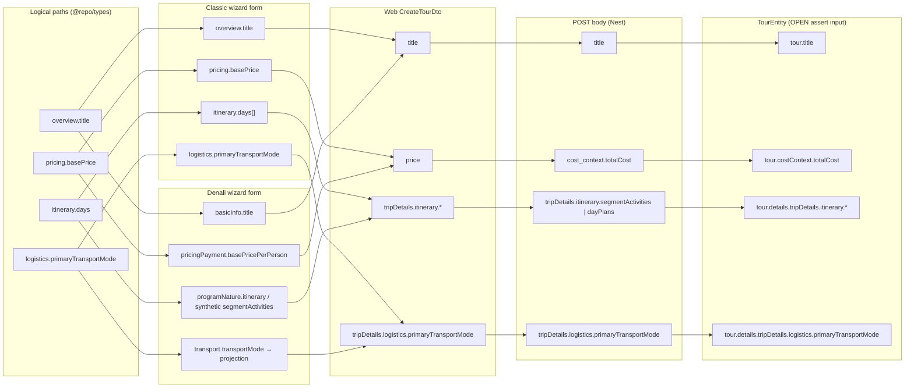
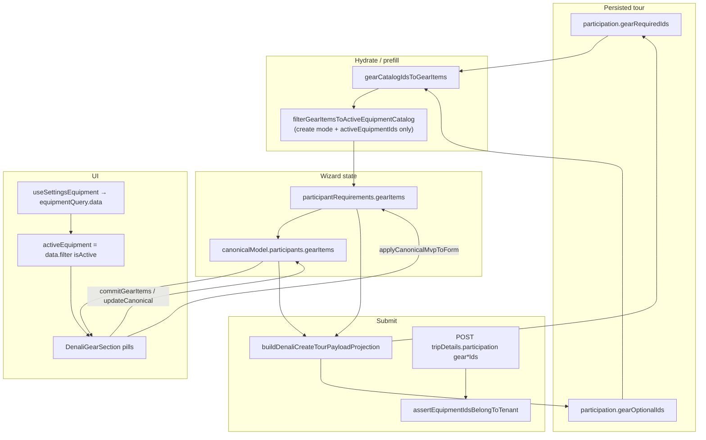
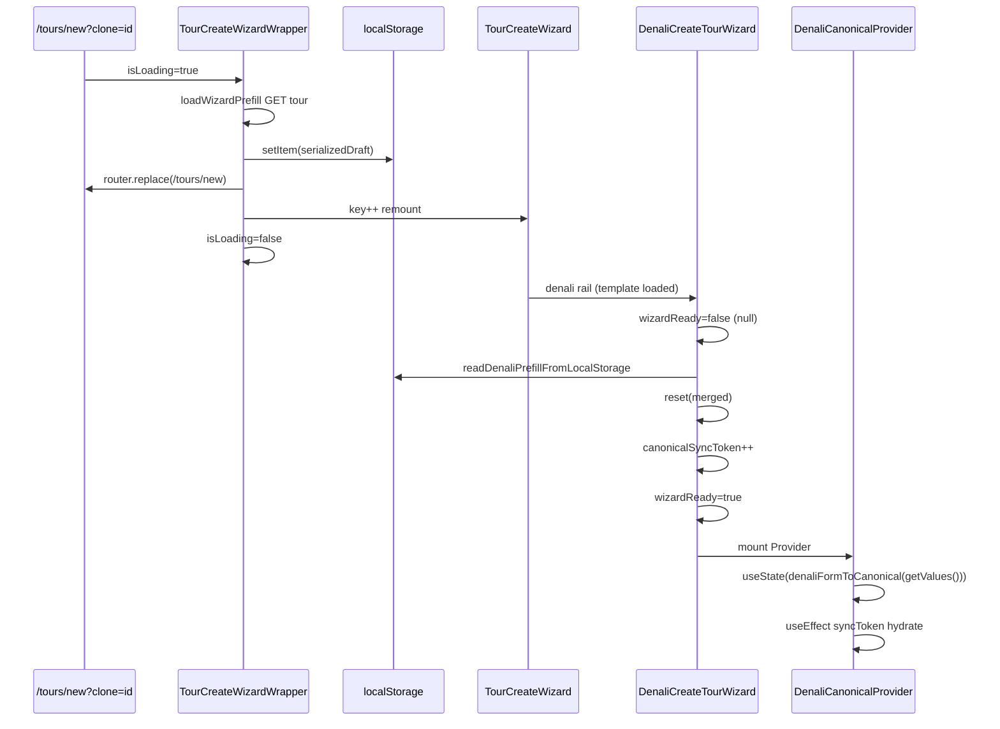
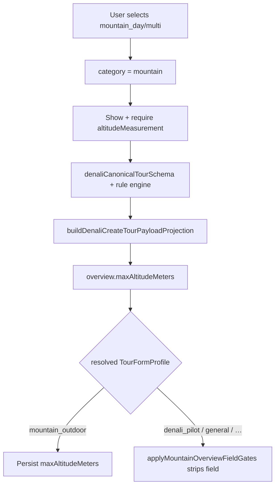
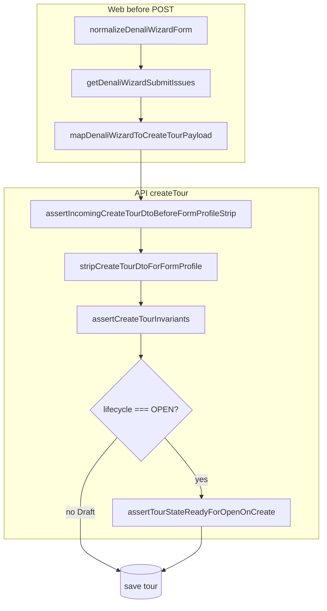
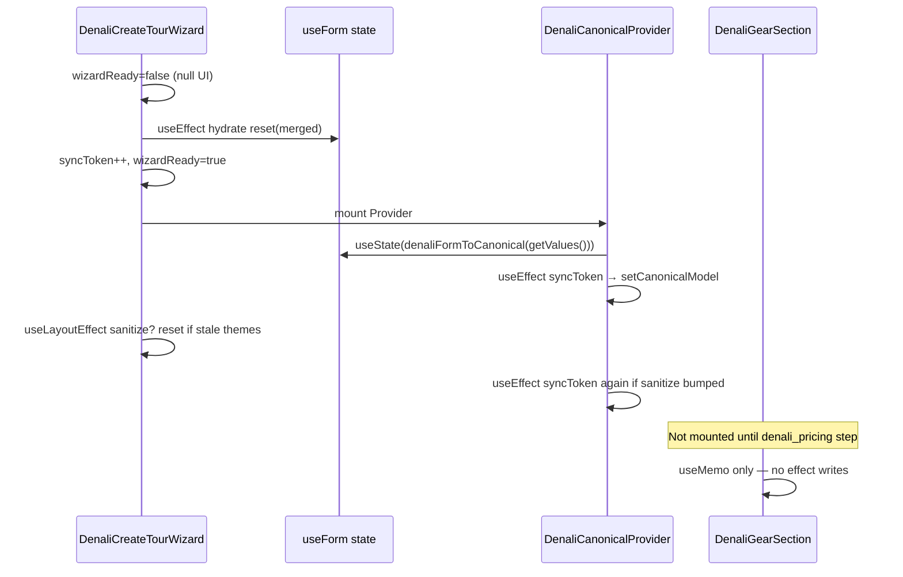
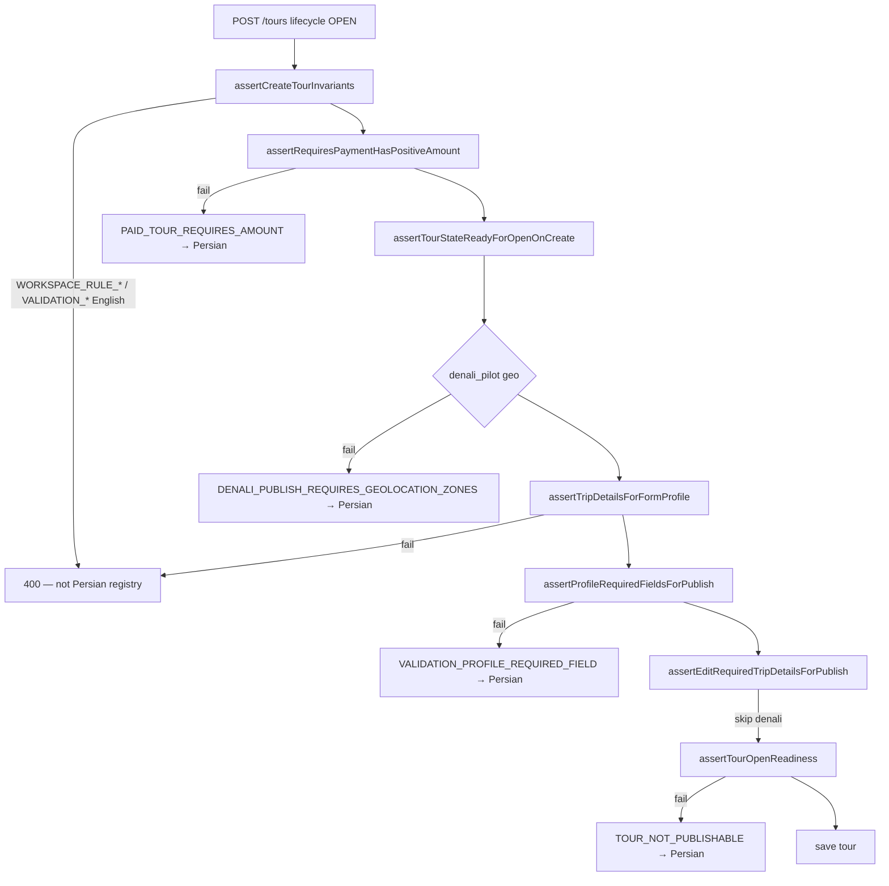
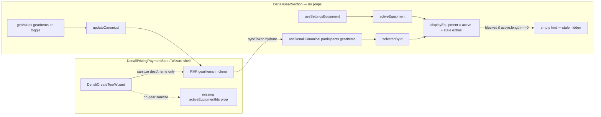
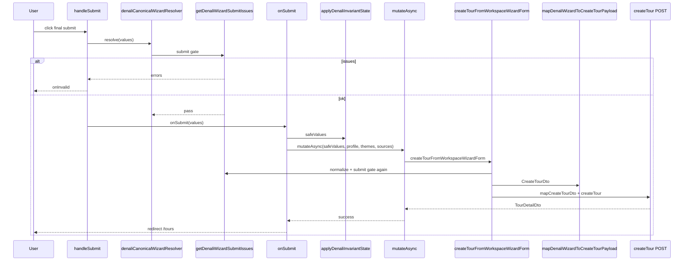

# Project Diagnostic Report

**Last updated:** 2026-05-23  
**Scope:** Denali tour create wizard — hydration, validation, projection, gear/catalog, canonical sync, stale UI state.

## Document index

| # | Section |
|---|---------|
| 1 | [Denali Wizard Architecture — RHF ↔ CanonicalModel ↔ API DTO](#denali-wizard-architecture--rhf--canonicalmodel--api-dto) |
| 2 | [Denali Clone Flow — `tripDetails` API → Wizard State](#denali-clone-flow--tripdetails-api--wizard-state) |
| 3 | [Denali Validation Gate — Zod Schemas vs `getDenaliWizardSubmitIssues`](#denali-validation-gate--zod-schemas-vs-getdenaliwizardsubmitissues) |
| 4 | [Backend Assertions — `assert-profile-required-fields-for-submit.ts`](#backend-assertions--assert-profile-required-fields-for-submitts-open--publish) |
| 5 | [Itinerary Mapping — `buildDenaliSubmitItinerarySlice`](#itinerary-mapping--builddenalisubmititineraryslice--denalidayplanstosegmentactivities) |
| 6 | [Architecture Sync — RHF, CanonicalModel, API DTO](#architecture-sync--rhf-canonicalmodel-api-dto-relationship--triggers) |
| 7 | [Hydration Path — `GET /tours/:id` → `DenaliCreateTourWizard`](#hydration-path--get-toursid--denalicreatetourwizard) |
| 8 | [Schema Validation — Zod vs API Payload](#schema-validation--zod-vs-api-payload-denali-create-flow) |
| 9 | [API Assertions — Logical wizard paths ↔ persisted DTO paths](#api-assertions--logical-wizard-paths--persisted-dto-paths-mapping-extract) |
| 10 | [Payload Projection — `buildDenaliCreateTourPayloadProjection.ts`](#payload-projection--builddenalicreatetourpayloadprojectionts) |
| 11 | [Gear Logic — lifecycle, `gearRequiredIds`, `activeEquipment`](#gear-logic--lifecycle-gearrequiredids-and-activeequipment-ui-gaps) |
| 12 | [Canonical Hydration — `DenaliCanonicalContext`](#canonical-hydration--denalicanonicalcontext-on-cloned-tour-load) |
| 13 | [Equipment Catalog — `useSettingsEquipment` & `DenaliGearSection`](#equipment-catalog--usesettingsequipment-and-denaligearsection-filtering) |
| 14 | [Stale Data — orphaned gear IDs in UI state](#stale-data--orphaned-gear-ids-in-ui-state) |
| 15 | [State Race Conditions — `useEffect` / init vs overwrite](#state-race-conditions--useeffect--init-vs-overwrite) |
| 16 | [Multi-day Complexity — `dayPlans` ↔ `segmentActivities`](#multi-day-complexity--dayplans--segmentactivities-and-api-field-gaps) |
| 17 | [Altitude / Theme Rules — Mountain category](#altitude--theme-rules--mountain-category-hardcoded-restrictions) |
| 18 | [Lifecycle Status — `denaliWizardLifecycleStatus` (Draft vs Open)](#lifecycle-status--denaliwizardlifecyclestatus-draft-vs-open) |
| 19 | [Validation Registry — Persian `error-registry.ts` ↔ API triggers](#validation-registry--persian-error-registryts--api-triggers) |
| 20 | [Sanitize Function — `denaliFormSanitize.ts`](#sanitize-function--denaliformsanitizets) |
| 21 | [Test Fixtures — `buildDenaliTourCreateTestValues`](#test-fixtures--builddenalitourcreatetestvalues) |
| 22 | [Missing Props — `DenaliGearSection` parent inputs](#missing-props--denaligearsection-parent-inputs) |
| 23 | [Submit Handler Trace — `handleSubmit` → `mutateAsync`](#submit-handler-trace--handlesubmit--mutateasync) |
| 24 | [Network / Idempotency — headers, Content-Type, wire body](#network--idempotency--headers-content-type-wire-body) |
| 25 | [Final Audit — Top 5 architectural contradictions (silent failures)](#final-audit--top-5-architectural-contradictions-silent-failures) |
| — | [Appendix — key source files](#appendix--key-source-files-denali-wizard-diagnostic) |

---

## Denali Wizard Architecture — RHF ↔ CanonicalModel ↔ API DTO

**Analysis date:** 2026-05-23  
**Scope:** Denali 6-step create wizard (`data-wizard-rail="denali"`)

---

### 1. Three-layer model (what each layer is)

| Layer | Type / symbol | Location | Role |
|-------|---------------|----------|------|
| **RHF form** | `DenaliCreateTourWizardForm` | `apps/web/src/features/tours/wizard/schemas/denaliTourCreateBaseSchema.ts` (+ `denaliTourCreateFormModel.ts` re-exports) | React Hook Form state: nested roots `basicInfo`, `programNature`, `transport`, `pricingPayment`, `participantRequirements`, `policies`, `photosData`, `tripDetails`. Legacy shape; includes `basicInfo.tourType` as `DenaliTourKind` slug (e.g. `mountain_multi`). |
| **Canonical model** | `DenaliCanonicalTourModel` | `packages/types/src/denali/denaliCanonicalTourModel.ts` | Product MVP model: flat slices (`category`, `duration`, `program`, `transport`, …). **Not** API persistence; **not** identical to RHF. Uses `category` + `duration` (`single`/`multi`) instead of 8 `denaliTourKind` slugs. |
| **API DTO** | `CreateTourDto` | `apps/web/lib/services/tours.service.ts` (consumer) | POST body: `title`, `tourType`, `tripDetails` JSONB, `transportModes`, `capacity`, `price`, etc. Built only at submit via projection layer. |

**Contract roots (wizard envelope):** `packages/shared-contracts/src/tours/denali-wizard.contract.ts` — `DENALI_ROOTS` lists the eight RHF top-level keys for clone/draft round-trip.

**Docs cross-refs:** `docs/architecture/denali-wizard-form-behavior.md`, `docs/20-architecture/denali-wizard-field-mapping.md`, `docs/architecture/denali-wizard-validation.md`.

---

### 2. Data-flow diagram (runtime)

```
┌─────────────────────────────────────────────────────────────────────────┐
│ DenaliCreateTourWizard (FormProvider + useForm)                         │
│   resolver: denaliCanonicalWizardResolver → getDenaliWizardSubmitIssues │
│   mode: onBlur                                                          │
└───────────────────────────────┬─────────────────────────────────────────┘
                                │
        ┌───────────────────────┴───────────────────────┐
        ▼                                               ▼
┌───────────────────┐                         ┌──────────────────────────┐
│ RHF state         │  denaliFormToCanonical    │ DenaliCanonicalProvider  │
│ (source of truth  │◄─────────────────────────►│ useState(canonicalModel) │
│  for submit/API)  │  denaliCanonicalToForm    │ updateCanonical(*)       │
│                   │  applyCanonicalMvpToForm  │ updateCanonicalBasics    │
└─────────┬─────────┘                         └──────────┬───────────────┘
          │                                                │
          │ normalize + validate                           │ ui, basicsSelection
          ▼                                                ▼
┌─────────────────────────────────────────────────────────────────────────┐
│ Submit: createTourFromWorkspaceWizardForm                               │
│   normalizeDenaliWizardForm(values)                                     │
│   getDenaliWizardSubmitIssues(normalized)                               │
│   mapDenaliWizardToCreateTourPayload(normalized)                        │
│     → buildDenaliCreateTourPayloadProjection(form)                      │
│         (internally denaliFormToCanonical + business rules)             │
│     → mapDenaliCreateTourPayloadProjectionToDto (1:1 copy)              │
│   stripCreateTourDtoForFormProfile → mapCreateTourDto → createTour()    │
└─────────────────────────────────────────────────────────────────────────┘
```

---

### 3. Mapping functions (adapters)

| Function | File | Direction |
|----------|------|-----------|
| `denaliCanonicalFromForm` | `packages/types/src/denali/denaliCanonicalFromForm.ts` | RHF-like → canonical (shared types; single forward mapping SSOT) |
| `denaliFormToCanonical` | `apps/web/.../denaliCanonicalFormAdapter.ts` | Wraps `denaliCanonicalFromForm` + web-only field overrides (locations, gear, leaders, social link fallbacks) |
| `denaliCanonicalToForm` | same | Canonical → RHF merge onto `existingForm` (preserves non-MVP / legacy slices) |
| `mergeDenaliCanonicalPartial` | same | Deep-merge canonical patches before commit |
| `applyCanonicalMvpToForm` | same | `setValue` per root slice with `{ shouldDirty: true, shouldValidate: true }` |
| `applyDenaliInvariantState` | `denali/validation/denaliInvariantEngine.ts` | Clears ghost fields after category/duration/transport changes |
| `buildDenaliCreateTourPayloadProjection` | `domain/buildDenaliCreateTourPayloadProjection.ts` | RHF → resolved `CreateTourDto`-shaped projection (business rules) |
| `mapDenaliWizardToCreateTourPayload` | `domain/mapDenaliWizardToCreateTourPayload.ts` | Thin: projection + 1:1 DTO copy |

**Basics bridge:** UI shows `category` + `duration` (+ optional `eventVariant`). RHF still stores `basicInfo.tourType` as `DenaliTourKind` via `denaliTourKindFromCanonical` / `denaliCanonicalBasicsFromTourKind` (`@repo/types`).

**API tour type:** `denaliApiTourTypeFromCategory` maps canonical category → API `tourType` (`event` → `cultural`). Slug `denaliTourKind` lands in `tripDetails.overview` per field-mapping doc.

---

### 4. How form state stays in sync with canonical model

#### 4.1 Ownership model (important)

- **Submit and API mapping read RHF**, not React canonical state directly (`createTourFromWorkspaceWizardForm` takes `DenaliCreateTourWizardForm`).
- **Canonical state is a UI/control layer** for MVP fields; it must be pushed back into RHF via `applyCanonicalMvpToForm` on every `updateCanonical` / `updateCanonicalBasics`.
- **There is no automatic RHF → canonical watcher** on every field change. Canonical updates when:
  1. `updateCanonical` / `updateCanonicalBasics` runs (`commitCanonical` path), or
  2. `syncToken` changes → `useEffect` re-hydrates from `getValues()` via `denaliFormToCanonical`.

#### 4.2 `commitCanonical` pipeline (`DenaliCanonicalContext.tsx`)

```
patch → mergeDenaliCanonicalPartial(canonicalModel, patch)
     → denaliCanonicalToForm(next, currentForm, { basics })
     → applyDenaliInvariantState(nextFormRaw)
     → applyCanonicalMvpToForm(next, currentForm, { basics, setValue })  // writes RHF
     → setCanonicalModel(denaliFormToCanonical(safeForm))               // re-read from normalized form
```

`basicsSelection` is derived from `useWatch("basicInfo.tourType")` + `readDenaliCanonicalBasics`, not stored separately in canonical.

`ui` (`getDenaliUIFromForm`) recomputes from RHF when `tourType`, `transport.transportMode`, `pricingPayment.requiresPayment`, or `syncToken` change.

#### 4.3 Re-hydration triggers (`canonicalSyncToken`)

Incremented in `DenaliCreateTourWizard.tsx` when:

- Clone/preset prefill `reset(merged)`
- Fresh wizard `reset(defaultValues)`
- Catalog sanitize `reset(next)` (invalid destination/theme ids cleared)

Effect in provider:

```ts
useEffect(() => {
  const form = getValues();
  const next = denaliFormToCanonical(form);
  setCanonicalModel({ ...next, title: form.basicInfo.title?.trim() ?? "" });
}, [syncToken, getValues]);
```

Does **not** run on ordinary typing unless that field goes through `updateCanonical`.

#### 4.4 UI input patterns

**Canonical-driven (controlled from `canonicalModel`, writes via `updateCanonical`):**

- `DenaliBasicInfoStep` — title, category/duration/event variant, destination, capacity, meeting point, leaders, etc.
- `DenaliDatetimeField` — start/end ISO → `updateCanonical({ startDateTime | endDateTime })`
- `DenaliLocationZoneField` — geo zones → `updateCanonical({ [zoneKey]: next })`
- `DenaliLogisticsStep`, `DenaliDailyItinerarySection`, `DenaliPeakExperienceField`, transport sections (grep: `updateCanonical` prevalent)
- `DenaliPricingPaymentStep` embeds **`DenaliGearSection`** (`denali_pricing` step) — gear pills + `commitGearItems` / `updateCanonical`

**Mixed RHF + canonical:**

- `DenaliGatheringPointsWidget` — `useFieldArray` + `Controller` on RHF **and** `updateCanonical({ gatheringPoints })` on mutations
- Some steps still call `setValue` directly in edge handlers (pricing checkbox clearing price, program theme default `useEffect`)

**Drift risk:** Any control that mutates RHF only (register/setValue without `updateCanonical`) leaves `canonicalModel` stale until next `syncToken` hydrate or an `updateCanonical` on another field. MVP fields are intended to use canonical path; legacy-only fields live only in RHF.

#### 4.5 Invariant engine (keeps RHF consistent, not canonical)

Called on:

- `commitCanonical` (via `applyDenaliInvariantState` in adapter)
- Step **Next** (`handleNext`): `applyDenaliInvariantState` → `preserveDenaliWizardBlobMedia` → `reset(..., { keepDirty: true })`
- **Submit** handler: `applyDenaliInvariantState(values)` before mutation

Examples: clear altitude when not mountain; force sports insurance for mountain; clear transport cost for `none`/`shared_cars`; sync itinerary row count for multi-day.

#### 4.6 Validation sync with canonical rules

- RHF `resolver`: `createDenaliCanonicalWizardResolver` → `getDenaliWizardSubmitIssues` (same as submit).
- Pipeline (`denaliWizardFormZod.ts`): structural Zod on legacy form + rule-required issues + `safeParseDenaliCanonicalFromWizardForm` (canonical Zod, paths mapped back to RHF).
- Step **Next**: `applyDenaliWizardStepValidation` (scoped validation, not full resolver).
- Rule visibility: `denaliUIAdapter` / `mapFormPathToCanonical` — validation uses canonical paths for requiredness while errors attach to RHF paths.

---

### 5. RHF configuration (shell)

| Setting | Value |
|---------|--------|
| Entry | `apps/web/src/components/tours/wizard/DenaliCreateTourWizard.tsx` |
| Provider order | `FormProvider` → `DenaliCanonicalProvider` → `DenaliWizardSyncProvider` |
| Resolver | `denaliCanonicalWizardResolver` from `schemas/denaliWizardCanonicalResolver.ts` |
| Validation mode | `onBlur` / `reValidateMode: onBlur` |
| Steps | `denaliWizardSteps` in `denaliStepConfig.ts` — 6 steps ending in `review` |
| `DenaliWizardSyncContext` | Only `isSyncing` flag for draft PATCH rail (currently `false` in create wizard) |

---

### 6. Submit path (RHF → API, canonical optional)

```
handleSubmit(onSubmit)
  → applyDenaliInvariantState(values)
  → useDenaliTourWizardCreate.mutateAsync({ values: safeValues, ... })
      → createTourFromWorkspaceWizardForm
          → normalizeDenaliWizardForm
          → getDenaliWizardSubmitIssues (throws ZodError if any)
          → mapDenaliWizardToCreateTourPayload
          → stripCreateTourDtoForFormProfile
          → mapCreateTourDto (+ themeCatalog, sourcePreset/TourId)
          → createTour(…, { idempotencyKey })
```

**Server:** API runs `assertCreateTourInvariants` on parsed DTO after create (separate from wizard canonical Zod).

---

### 7. CI / governance gates (canonical alignment)

Under `packages/ci-templates/denali-wizard/`:

| Gate | Purpose |
|------|---------|
| `check-canonical-gate.ts` | `DenaliCanonicalTourModel` fields present in `denaliCanonicalFromForm.ts` |
| `check-ui-sync-gate.ts` | UI field paths vs canonical |
| `check-normalization-gate.ts` | Normalization parity |
| `check-projection-gate.ts` | Projection vs canonical |
| `check-rules-gate.ts` | Rule model alignment |

---

### 8. Key file index (bookmark)

| Concern | Path |
|---------|------|
| Wizard shell | `apps/web/src/components/tours/wizard/DenaliCreateTourWizard.tsx` |
| Canonical React context | `apps/web/src/features/tours/wizard/denali/DenaliCanonicalContext.tsx` |
| Form ↔ canonical adapter | `apps/web/src/features/tours/wizard/denali/denaliCanonicalFormAdapter.ts` |
| Types canonical model | `packages/types/src/denali/denaliCanonicalTourModel.ts` |
| Types form → canonical | `packages/types/src/denali/denaliCanonicalFromForm.ts` |
| RHF resolver | `apps/web/src/features/tours/wizard/schemas/denaliWizardCanonicalResolver.ts` |
| Submit validation | `apps/web/src/features/tours/wizard/denali/validation/denaliWizardFormZod.ts` |
| Invariant engine | `apps/web/src/features/tours/wizard/denali/validation/denaliInvariantEngine.ts` |
| API projection | `apps/web/src/features/tours/wizard/domain/buildDenaliCreateTourPayloadProjection.ts` |
| Create mutation | `apps/web/src/features/tours/wizard/hooks/useDenaliTourWizardCreate.ts` |
| Derived read helpers (no stored booleans) | `apps/web/src/features/tours/wizard/denali/denaliWizardDerived.ts` |
| UI visibility rules | `apps/web/src/features/tours/wizard/denali/rules/denaliUIAdapter.ts` |

---

### 9. Raw findings / invariants

1. **Dual state:** RHF is authoritative for persistence; `canonicalModel` is a derived control plane for MVP UX that must be written back via `setValue` on each canonical edit.

2. **No bidirectional auto-sync:** Canonical does not subscribe to all RHF changes—only `syncToken` full rehydrate and explicit `updateCanonical*`.

3. **Forward mapping SSOT:** `denaliCanonicalFromForm` in `@repo/types`; web adapter adds overrides for fields not yet fully in types mapper.

4. **Backward mapping preserves legacy:** `denaliCanonicalToForm` spreads `existingForm` so non-MVP fields (deprecated theme ids, smart pricing ghosts, etc.) survive canonical edits.

5. **Basics encoded twice:** UI `basicsSelection` (category/duration/event) ↔ RHF `tourType` slug ↔ canonical `category`/`duration`—all kept aligned in `commitCanonical` / `updateCanonicalBasics`.

6. **Validation triple:** legacy structural Zod + declarative rule model (`denaliRuleModel`) + canonical Zod (`denaliCanonicalTourSchema` via submit validation).

7. **Classic vs Denali:** General 9-step wizard uses `TourCreateFormValues` + `wizardFormToCreateTourApiPayload`; Denali uses separate form type and `mapDenaliWizardToCreateTourPayload` only.

8. **Phase comment drift:** `denaliCanonicalTourModel.ts` header still says "not wired yet" but provider + steps are wired; treat code paths as source of truth.

9. **Debug noise:** `DenaliCanonicalContext` logs on `syncToken > 0` hydrate (gear items)—likely temporary diagnostic.

10. **Removed anti-pattern:** `useDenaliWizardSideEffects` deleted; multi-day/difficulty derived at read/validate time per `denali-wizard-form-behavior.md`.

---

### 10. Relationship summary (one paragraph)

The Denali wizard stores user input primarily in **React Hook Form** using a **legacy nested schema** tuned for drafts and backward compatibility. A parallel **`DenaliCanonicalTourModel`** in shared types expresses the **product MVP** shape (category/duration, flat slices) and drives **controlled inputs** and **rule-based visibility** through `DenaliCanonicalProvider`. User edits on MVP fields flow **canonical → invariant normalization → RHF `setValue` → canonical re-derived from form**; bulk loads use **`syncToken`** to rebuild canonical from RHF after `reset`. **Validation and submit** always consume **normalized RHF values**, projecting to **`CreateTourDto`** through `buildDenaliCreateTourPayloadProjection` (business rules + `denaliFormToCanonical`), then the existing **`mapCreateTourDto`** and API invariant checks—canonical React state is never sent directly to the API.

---

## Denali Clone Flow — `tripDetails` API → Wizard State

**Analysis date:** 2026-05-23  
**Scope:** Duplicate tour (`?clone=<tourId>`) hydration into `DenaliCreateTourWizard` (RHF + canonical re-hydrate)

---

### 1. End-to-end sequence

```
User: tours list "Duplicate"
  → router.push(`/tours/new?clone=${tourId}`)
  → TourCreateWizardWrapper mounts
  → parseWizardPrefillQuery → { kind: "clone", cloneTourId }
  → loadWizardPrefill (parallel fetches)
       GET /api/tours/:id  →  BFF proxy  →  GET /api/v2/tours/:id  →  TourResponseDto JSON
       GET /api/settings/tour-wizard-template  →  resolve Denali vs classic rail
  → mapWizardPrefillToFormPatch → mapToDenaliWizardPatch → transformTourToDenaliWizardValues
  → mergeDenaliWizardDefaults(defaults, patch)
  → serializeDenaliWizardDraft → localStorage.setItem(storageKey, …)
  → router.replace("/tours/new")   // strips ?clone= from URL
  → TourCreateWizard → DenaliCreateTourWizard (wizardMode === "denali")
  → readDenaliPrefillFromLocalStorage → mergeDenaliWizardDefaults → reset(merged)
  → setCanonicalSyncToken(+1) → DenaliCanonicalProvider denaliFormToCanonical(getValues())
  → (async) sanitizeDenaliWizardCatalogRefs → reset → canonicalSyncToken again
```

**Important:** Clone prefill is staged in **browser `localStorage`**, not loaded again from the API on the second navigation. The tour is fetched **once** in `TourCreateWizardWrapper` before URL cleanup.

---

### 2. Entry points (UI → query)

| Step | Location | Behavior |
|------|----------|----------|
| Duplicate action | `apps/web/app/(app)/tours/tours-list-view.tsx` | `router.push(\`/tours/new?clone=${encodeURIComponent(tour.id)}\`)` |
| Legacy redirect | `apps/web/app/(app)/tours/create/page.tsx` | `?clone=` → redirect to `/tours/new?clone=` |
| Page shell | `apps/web/app/(app)/tours/new/page.tsx` | Renders `TourCreateWizardWrapper` inside Suspense |
| Query parse | `apps/web/src/features/tours/wizard/sources/parseWizardPrefillQuery.ts` | `clone` param wins over `presetId` over `blank` |
| Bootstrap gate | `wizardPrefillNeedsBootstrap` | `true` for clone → wrapper shows loading until LS write completes |
| Rail selection | `apps/web/src/components/tours/wizard/TourCreateWizard.tsx` | `getTourWorkspaceDefinition(profile).ui.wizardMode === "denali"` → `DenaliCreateTourWizard` |

---

### 3. Network / services (ordered)

| # | Service / call | File | Role |
|---|----------------|------|------|
| 1 | **Browser navigation** | `tours-list-view.tsx` | Starts flow with `cloneTourId` in query |
| 2 | **`loadWizardPrefill`** | `sources/loadWizardPrefill.ts` | Orchestrates clone bootstrap |
| 3 | **`defaultFetchTour`** | `loadWizardPrefill.ts` | `fetch('/api/tours/:id', { credentials: 'include' })` |
| 4 | **Next.js BFF GET** | `apps/web/app/api/tours/[tourId]/route.ts` | `proxyBffGet` → backend |
| 5 | **API GET tour** | `apps/api` → `GET /api/v2/tours/:id` | Returns `TourResponseDto` (via `mapTourEntityToResponseDto`) |
| 6 | **`defaultFetchWizardTemplate`** | `loadWizardPrefill.ts` | `fetchWorkspaceTourWizardTemplate()` |
| 7 | **Settings BFF** | `apps/web/lib/settings-tour-wizard-template.client.ts` | `GET /api/settings/tour-wizard-template` |
| 8 | **`parseTenantWizardTemplateEnvelope`** | `template/parse-tenant-wizard-template.ts` | Parses template envelope |
| 9 | **`resolveWorkspaceTourFormProfileFromTemplate`** | `resolveWorkspaceTourFormProfile.ts` | `baseProfile` → `TourFormProfile` |
| 10 | **`resolveUseDenaliRail`** | `loadWizardPrefill.ts` | `getTourWorkspaceDefinition(profile).ui.wizardMode === "denali"` |
| 11 | **`localStorage.setItem`** | `tour-create-wizard-wrapper.tsx` | Persists `serializedDraft` at scoped storage key |
| 12 | **`readDenaliPrefillFromLocalStorage`** | `denali/bootstrapDenaliPrefillDraft.ts` | Reads + `parseDenaliWizardDraftRecord` on wizard mount |
| 13 | **`useTourDestinations` / `useSettingsTourThemes`** | hooks (Denali wizard) | Catalog IDs for post-hydrate sanitize only |

**Not used on current clone UI path:** `bootstrapDenaliPrefillDraft` (writes server OCC draft via `patchTourWizardDraft`) — imported in `DenaliCreateTourWizard.tsx` but **no call sites**; clone uses localStorage-only handoff.

**Not used for Denali clone:** `applyTourWizardPatch`, `transformTourToWizardValues` (classic 9-step path only).

---

### 4. Transformation pipeline (API JSON → `DenaliCreateTourWizardForm`)

| Order | Function | File | Input → output |
|-------|----------|------|----------------|
| 1 | **`mapWizardPrefillToFormPatch`** | `profiles/mapWizardPrefillToFormPatch.ts` | If Denali rail: delegates to `mapToDenaliWizardPatch({ kind: "clone", tour })` |
| 2 | **`isDenaliPilotFormProfile`** | `isDenaliWizardContext.ts` | Same rail check as workspace definition |
| 3 | **`mapToDenaliWizardPatch`** | `profiles/denali/mapToDenaliWizardPatch.ts` | `transformTourToDenaliWizardValues(tour, { mode: "clone" })` |
| 4 | **`transformTourToDenaliWizardValues`** | `clone/transformTourToDenaliWizardValues.ts` | **Main mapper:** `TourCloneSourceDto` → `Partial<DenaliCreateTourWizardForm>` |
| 5 | **`normalizeDenaliWizardForm`** | `denali/validation/denaliRuleAccess.ts` | Clears rule-hidden leaves via `clearDenaliNonVisibleFormValues` |
| 6 | **`mergeDenaliWizardDefaults`** | `denaliWizardDraftEnvelope.ts` | Deep-merge patch onto `buildDenaliTourCreateDefaultValues()` |
| 7 | **`sanitizeDenaliFormPatch`** | `denali/denaliFormSanitize.ts` | Strips deprecated keys from patch (in merge + serialize) |
| 8 | **`normalizeDenaliTransportForm`** | `@repo/types` | Transport slice normalization (inside merge) |
| 9 | **`serializeDenaliWizardDraft`** | `denaliWizardDraftEnvelope.ts` | JSON string + `_wizardRail: "denali"` + `_wizardMeta` |
| 10 | **`parseDenaliWizardDraftRecord`** | `denaliWizardDraftEnvelope.ts` | Inverse on wizard mount |
| 11 | **`mergeDenaliWizardDefaults`** (again) | `DenaliCreateTourWizard.tsx` | Merge LS patch into fresh defaults before `reset` |
| 12 | **`applyDenaliInvariantState`** | `denali/validation/denaliInvariantEngine.ts` | Post-catalog-sanitize only (not on initial clone reset) |
| 13 | **`denaliFormToCanonical`** | `denali/denaliCanonicalFormAdapter.ts` | `syncToken` effect → React `canonicalModel` |

**Explicitly skipped on clone:** `applyDenaliCreateWizardHydrationGuards` (only when `mode === "create"`).

---

### 5. `tripDetails` JSON consumption map

API shape: `response.details.tripDetails` (`TourTripDetails` JSONB), typed loosely as `TourCloneSourceDto.details.tripDetails: Record<string, unknown>`.

Inside `transformTourToDenaliWizardValues`, slices are read as:

| `tripDetails` path | Wizard target(s) | Helper |
|--------------------|------------------|--------|
| `overview.denaliTourKind` | `basicInfo.tourType` | `inferDenaliTourKind` (preferred if valid slug) |
| `overview.tourThemeIds` | `programNature.themeIds` | `readThemeIds` |
| `overview.shortIntro` | `programNature.shortDescription` | |
| `overview.difficultyLevel` | `programNature.difficultyLevel` | `ratingToDenaliDifficulty` (1–10) |
| `overview.altitudeMeasurement` / `maxAltitudeMeters` | `programNature.altitudeMeasurement` | |
| `overview.settingsMainDestinationId` | `basicInfo.destinationId` (fallback) | with root `destinationId` |
| `overview.gatheringPoint`, `startPoint`, `summitPoint`, `campPoint`, `endPoint` | `basicInfo.*` location zones | `denaliLocationFromApi`, `resolveCloneLocationZones` |
| `overview.leaderUserIds` | `basicInfo.leaderUserIds` | `leaderUserIdsFromOverview` |
| `overview.localGuideName` | `requiresLocalGuide`, `localGuideName` | |
| `itinerary.dayPlans` / `days` / `segmentActivities` | `programNature.itinerary` | `readDenaliItineraryDayPlans`, `mapApiDayPlanToDenaliRow`, `denaliLocationFromApi` |
| `itinerary.programNotes` | `hikingHoursApprox`, `hikingGoHours`, `hikingReturnHours` | regex parsers |
| `tripDetails.photos` | `photosData.photos` | `mapDayPlanPhotos` (remints photo ids) |
| `logistics.departureDate` + `departureMeetingTime` | `basicInfo.startDateTime` | `datetimeFromLogistics` → `combineYmdAndTimeToIso` |
| `logistics.returnDate` + `returnMeetingTime` | `basicInfo.endDateTime` (multi-day only) | `denaliTourKindToIsMultiDay` |
| `logistics.returnMeetingTime` (HH:mm only) | `basicInfo.approximateReturnTime` | |
| `logistics.groupSizeMin` / `groupSizeMax` | `capacityMin` / `capacityMax` | |
| `logistics.meetingPoint`, `startPointVillage`, `returnPoint` | meeting text / legacy location fallbacks | `resolveCloneLocationZones` |
| `logistics.gatheringPoints` | `tripDetails.logistics.gatheringPoints` | `normalizeGatheringPickupStations`, legacy `gatheringPoint` fallback |
| `logistics.primaryTransportMode`, `privateCarMode`, `fuelShareToman`, `transportationNotes` | `transport.*` | `inferDenaliTransportModeFromApiLogistics` (`@repo/types`) |
| `logistics.leaderProvidesInsurance` | `pricingPayment.includesTourInsurance` | |
| `participation.*` | `participantRequirements.*` | fitness map, ages, gear ids, insurance flags |
| `participation.gearRequiredIds` / `gearOptionalIds` | `participantRequirements.gearItems` | `gearCatalogIdsToGearItems` |
| `policies.cancellationPolicy` | `policies.policiesText` | |
| `requirements.minRequiredPeaks` | `participantRequirements.minRequiredPeaks` | `readTourMinRequiredPeaks` |

**Root tour fields (outside `tripDetails`):**

| API field | Wizard field |
|-----------|--------------|
| `title` | `basicInfo.title` |
| `description` | `programNature.longDescription` |
| `tourType` | Used in `inferDenaliTourKind` when `denaliTourKind` absent |
| `destinationId` | `basicInfo.destinationId` |
| `costContext` | `pricingPayment.requiresPayment`, `basePricePerPerson` |
| `chatLink` / `chat_link` | `basicInfo.socialMediaLink` |
| `autoAcceptRegistrations` | `basicInfo.requiresManualAdminApproval` (inverted) |
| `lifecycleStatus` | `basicInfo.publishStatus` (`OPEN` → `active`) |
| `transportModes` | Passed into transport inference |

---

### 6. Nested helpers inside `transformTourToDenaliWizardValues` (full list)

**Local (same file):** `strOrEmpty`, `numberOrUndefined`, `stringArray`, `asObject`, `readThemeIds`, `ratingToDenaliDifficulty`, `parseHikingHoursFromProgramNotes`, `parseHikingGoReturnFromProgramNotes`, `remintClonePhotoId`, `mapDayPlanPhotos`, `mapApiDayPlanToDenaliRow`, `readDenaliItineraryDayPlans`, `isMultiDayFromLogistics`, `inferDenaliTourKind`, `datetimeFromLogistics`, `readRequiresPayment`, `priceFromCostContext`, `leaderUserIdsFromOverview`, `localGuideNameFromOverview`, `resolveCloneLocationZones`.

**Imported transforms:**

| Function | Package / path |
|----------|----------------|
| `denaliCanonicalBasicsFromTourKind` | `@repo/types` |
| `denaliTourKindToIsMultiDay` | `@repo/types` |
| `isDenaliTourKind` | `@repo/types` |
| `inferDenaliTransportModeFromApiLogistics` | `@repo/types` (`denali-transport-mode.ts`) |
| `denaliLocationFromApi`, `denaliLocationFromText` | `@repo/types/denali` (`locationData.ts`) |
| `normalizeGatheringPickupStations`, `gatheringPickupStationFromLegacyLocation` | `@repo/types` (`gatheringPickupStation.ts`) |
| `combineYmdAndTimeToIso` | `denali/denaliDatetime.ts` |
| `gearCatalogIdsToGearItems`, `normalizeGearItems` | `denali/denaliGearSelection.ts` |
| `readTourMinRequiredPeaks` | `domain/peak-experience.ts` |
| `normalizeDenaliWizardForm` | `denali/validation/denaliRuleAccess.ts` |
| `applyDenaliCreateWizardHydrationGuards` | same file (**create mode only**) |

---

### 7. Draft envelope (localStorage contract)

| Function | Role |
|----------|------|
| `serializeDenaliWizardDraft` | Writes 8 `DENALI_ROOTS` slices + `_wizardMeta` + `_wizardRail` |
| `stripBlobUrlsFromDenaliDraftPatch` | Called inside serialize (blob URL safety) |
| `parseDenaliWizardDraftEnvelope` | Validates rail / shape; extracts `formPatch` + `wizardMeta` |
| `parseTourWizardDraftMeta` | Parses `_wizardMeta` (`sourceTourId`, `resolvedFormProfile`, …) |
| `resolveWizardDraftStorageKeyForBrowserHost` | Tenant/host-scoped LS key |

**Clone meta written in `loadClonePrefill`:** `sourceTourId`, `resolvedFormProfile`, `formProfileVersion`, `savedAt`, optional `themeIds.main` from first `programNature.themeIds` entry.

---

### 8. Wizard mount hydration (`DenaliCreateTourWizard.tsx`)

| Step | Function / hook | Notes |
|------|-----------------|-------|
| Defaults | `buildDenaliTourCreateDefaultValues` | `denaliTourCreateBaseSchema` |
| RHF init | `useForm({ resolver: denaliCanonicalWizardResolver, defaultValues })` | Empty until hydrate |
| Prefill read | `readDenaliPrefillFromLocalStorage(storageKey)` | After template query ready |
| Auth gate | `isAuthenticatedCloneOrPresetPrefill` | Requires `sourceTourId` or `sourcePresetId` in meta |
| Merge + reset | `mergeDenaliWizardDefaults(defaultValues, formPatch)` → `reset(merged)` | Purges LS keys first |
| Canonical | `setCanonicalSyncToken(n+1)` | Provider `useEffect` → `denaliFormToCanonical` |
| Catalog fix | `sanitizeDenaliWizardCatalogRefs` + `applyDenaliInvariantState` + `reset` | Drops stale destination/theme UUIDs |
| Submit lineage | `draftWizardMetaRef.sourceTourId` | Passed to `createTourFromWorkspaceWizardForm` → `mapCreateTourDto` |

**`isDenaliCloneOrPresetPrefill`:** used to distinguish clone/preset from ordinary server-draft restore.

---

### 9. API response origin (server)

| Layer | Symbol / file |
|-------|----------------|
| Entity | `TourEntity` + `tour.details.tripDetails` JSONB |
| Mapper | `mapTourEntityToResponseDto` — `apps/api/src/modules/tours/dto/tour-response.dto.ts` |
| Normalization | `normalizeLegacyOverviewTripStyleToTripStyles` on cloned tripDetails |
| DTO contract | `TourResponseDto.details.tripDetails` : `TourTripDetails` |
| BFF | Transparent JSON proxy — **no reshape** on web (`TourCloneSourceDto` comment) |

Reverse write path (out of scope for clone read, but symmetry): `buildDenaliCreateTourPayloadProjection` rebuilds `tripDetails` from wizard form on POST.

---

### 10. Raw findings

1. **Single API read:** Tour JSON is fetched once in `TourCreateWizardWrapper`; after `router.replace("/tours/new")` the wizard reads **only localStorage**, not `GET /api/tours/:id` again.

2. **Clone mode preserves legacy data:** `transformTourToDenaliWizardValues(..., { mode: "clone" })` skips `applyDenaliCreateWizardHydrationGuards` (no mountain altitude fallback, no gear catalog filter).

3. **`inferDenaliTourKind` fallback:** If `overview.denaliTourKind` missing, derives from `tourType` + logistics dates; `cultural` without slug maps to **mountain** slugs (documented quirk in mapper).

4. **Photo ids reminted:** Clone assigns new UUIDs to gallery/day photos (`remintClonePhotoId`) to avoid collisions.

5. **Gathering points:** Prefer `logistics.gatheringPoints` array; else synthesize one row from legacy `overview.gatheringPoint` / `meetingPoint`.

6. **Normalization runs twice:** Once at end of `transformTourToDenaliWizardValues`, again inside `mergeDenaliWizardDefaults` after sanitize merge.

7. **`bootstrapDenaliPrefillDraft` dead import:** Server-draft bootstrap path exists but is not wired in current `DenaliCreateTourWizard` hydrate effect.

8. **Canonical lags until token:** After `reset(merged)`, `canonicalSyncToken` forces `denaliFormToCanonical(getValues())`; no continuous sync from RHF during clone load.

9. **Theme/destination sanitize is async:** Second `reset` may run after destinations/themes queries resolve; can clear invalid UUIDs from cloned tour.

10. **Type boundary:** `TourCloneSourceDto` is intentionally loose (`tripDetails?: Record<string, unknown>`) — mapper defensively uses `asObject` everywhere.

11. **E2E contract:** `apps/web/tests/smoke/06-tour-wizard-clone-query.spec.ts` and `wizard-real-stack.submit-denali-from-clone.spec.ts` assert `?clone=` → LS → denali wizard DOM.

12. **Symmetry doc:** `transformTourToWizardValues.ts` header documents classic wizard read contract; Denali parallel is `transformTourToDenaliWizardValues.ts`.

---

## Denali Validation Gate — Zod Schemas vs `getDenaliWizardSubmitIssues`

**Analysis date:** 2026-05-23  
**Submit authority:** `getDenaliWizardSubmitIssues` in `apps/web/src/features/tours/wizard/denali/validation/denaliWizardFormZod.ts`  
**Wired from:** RHF `denaliCanonicalWizardResolver`, `createTourFromWorkspaceWizardForm`, step **Next** via `getDenaliWizardStepIssues`

---

### 1. `getDenaliWizardSubmitIssues` pipeline

```
getDenaliWizardSubmitIssues(form, uiOptions?)
  → normalizeDenaliWizardForm(form, uiOptions)     // clear hidden leaves per rule model
  → resolveDenaliRuleModelFromForm(normalized)     // null if basicInfo.tourType invalid / unmapped
  → if model == null: return [{ path: basicInfo.tourType, message: "نوع تور را انتخاب کنید." }]
  → mergeValidationIssues(normalized, model, { scope: { mode: "submit" }, uiOptions })
       ① denaliTourCreateBaseSchema.safeParse(normalized)     → structuralIssues
       ② collectDenaliRuleRequiredIssues(...)                 → ruleIssues (empty-field gate)
       ③ safeParseDenaliCanonicalFromWizardForm(normalized)   → canonicalIssues (submit only)
            → denaliFormToCanonical → denaliCanonicalTourSchema.safeParse
            → canonicalZodPathToFormFieldPath on each issue
  → dedupeIssuesByPath([①, ②, ③])   // same RHF path: last writer wins → canonical over rule over structural
```

**Step navigation** uses the same merge with `scope: { mode: "step", stepId }` and filters issues to the active rail step (`getDenaliWizardStepIssues`).

**Not in submit pipeline:** `denaliTourCreateSchema` / `parseDenaliTourCreateForm` (dev-guarded legacy parse); API `assertCreateTourInvariants` runs server-side after POST.

---

### 2. Schema inventory (Denali flow)

| Schema | File | Role in submit |
|--------|------|----------------|
| **`denaliTourCreateBaseSchema`** | `schemas/denaliTourCreateBaseSchema.ts` | ① Structural: types, enums, ISO format, zero-amount rejects |
| **`denaliCanonicalTourSchema`** | `schemas/denaliCanonicalTourSchema.ts` | ③ Canonical MVP + `superRefine` conditionals (after `denaliFormToCanonical`) |
| `denaliLocationDataSchema` | `schemas/denaliLocationDataSchema.ts` | Nested in form + canonical location / gathering rows |
| `denaliItineraryDayRowSchema` | `schemas/denaliItineraryDaySchema.ts` | Form itinerary rows (no `activities` min length) |
| `denaliCanonicalItineraryDayRowSchema` | same | Canonical itinerary (same shape, `.strict()`) |
| `denaliGatheringPickupStationFormSchema` | `schemas/denaliGatheringPickupStation.schema.ts` | `tripDetails.logistics.gatheringPoints[]` |
| `denaliGearItemSchema` | `schemas/denaliGearItemSchema.ts` | `participantRequirements.gearItems[]`; canonical extends `id` with UUID regex |
| `denaliPhotosSchema` | `denaliTourCreateBaseSchema.ts` (export) | Gallery rows when present |
| **`denaliRuleModel` / `collectDenaliRuleRequiredIssues`** | `denali/rules/denaliRuleModel.ts`, `denaliRuleRequired.ts` | ② Product requiredness + visibility (not Zod) |

Header on `denaliTourCreateBaseSchema` states it is **deprecated for submit authority**; runtime still runs it as layer ①.

---

### 3. `denaliTourCreateBaseSchema` — required keys & value gates

**Zod object keys (must exist on parent):** `basicInfo`, `programNature`, `transport`, `pricingPayment`, `participantRequirements`, `policies`, `photosData`, `tripDetails` (with defaults on roots).

#### 3.1 `basicInfo` (`denaliBasicInfoSchema`)

| Field (RHF path) | Zod shape | Blocks submit when |
|------------------|-----------|-------------------|
| `basicInfo.title` | `string` + refine: empty **or** ≥ `TOUR_TITLE_MIN_LENGTH` (10) | **No** if empty (passes structural); **yes** via rule + canonical min length |
| `basicInfo.tourType` | `z.enum(DENALI_TOUR_KIND_VALUES)` — **required key** | Invalid / missing enum; `model == null` → dedicated tourType issue |
| `basicInfo.destinationId` | `string().trim().optional()` | **No** structural; **yes** rule + canonical UUID |
| `basicInfo.startDateTime` | `string` + ISO refine | Empty or non-ISO fails structural |
| `basicInfo.endDateTime` | optional string + ISO refine | Bad ISO if set; multi-day required via rule + canonical |
| `basicInfo.capacityMax` | `z.number().int().optional()` | `superRefine`: value `=== 0` custom issue |
| `basicInfo.capacityMin` | optional int ≥ 0 | Only if invalid number |
| `basicInfo.leaderUserIds` | `array(string).default([])` | — |
| Other basic fields | optional | — |

#### 3.2 `programNature`

| Field | Zod | Structural submit |
|-------|-----|-------------------|
| `themeIds` | `array(string).default([])` | — |
| `shortDescription` | optional string | **No** min length |
| `longDescription` | optional | — |
| `difficultyLevel` | optional 1–10 | — |
| `hikingHoursApprox` / `hikingGoHours` / `hikingReturnHours` | optional positive int | — |
| `altitudeMeasurement` | optional int ≥ 0 | — |
| `itinerary[]` | optional `denaliItineraryDayRowSchema` | Row `day` required; `activities` string **may be empty** |

#### 3.3 `transport`

| Field | Zod | Structural submit |
|-------|-----|-------------------|
| `transport.transportMode` | **required enum** | Missing/invalid mode |
| `transportCost`, `dongAmount` | optional int | `superRefine`: reject `=== 0` |
| `allowPersonalCar`, `transportNotes` | optional | — |

#### 3.4 `pricingPayment`

| Field | Zod | Structural submit |
|-------|-----|-------------------|
| `requiresPayment` | optional boolean | — |
| `basePricePerPerson` | optional int | If `requiresPayment === true` and value `=== 0` → `superRefine` |
| `paymentMode` | `literal("offline_receipt").optional()` | **No** structural require |

#### 3.5 `participantRequirements`, `policies`, `photosData`, `tripDetails`

| Area | Notes |
|------|--------|
| Participant | All optional except gear row shape when present |
| Policies | All optional |
| `photosData.photos[]` | If present: each item requires `id`, `url`, `filename`, `size`, `mimeType`, `uploadedAt` (no URL/mime validation in base schema) |
| `tripDetails.logistics.gatheringPoints[]` | Each row: **`location` required** (`denaliLocationDataSchema`); lat/lng pairing rules in location schema |

#### 3.6 `denaliTourCreateBaseSchema.superRefine` (conditional structural)

| Condition | RHF path | Message (FA) |
|-----------|----------|----------------|
| `capacityMax === 0` | `basicInfo.capacityMax` | حداکثر ظرفیت باید حداقل ۱ باشد |
| `transportCost === 0` | `transport.transportCost` | هزینه حمل‌ونقل باید بیشتر از صفر باشد |
| `dongAmount === 0` | `transport.dongAmount` | مبلغ دنگ باید بیشتر از صفر باشد |
| `requiresPayment && basePricePerPerson === 0` | `pricingPayment.basePricePerPerson` | قیمت باید بیشتر از صفر باشد |

---

### 4. `denaliCanonicalTourSchema` — required & conditional (submit layer ③)

Parsed on **`denaliFormToCanonical(normalized)`** then `denaliCanonicalTourSchema.safeParse`.

#### 4.1 Always required fields (schema-level)

| Canonical path | Maps to RHF (via `canonicalZodPathToFormFieldPath`) | Constraint |
|----------------|-----------------------------------------------------|------------|
| `category` | `basicInfo.tourType` (indirect) | enum |
| `duration` | `basicInfo.tourType` (indirect) | enum |
| `title` | `basicInfo.title` | trim, min 10, max 120 |
| `destinationId` | `basicInfo.destinationId` | UUID v4 regex |
| `startDateTime` | `basicInfo.startDateTime` | parsable ISO |
| `program.shortDescription` | `programNature.shortDescription` | `min(1)` |
| `program.difficultyLevel` | `programNature.difficultyLevel` | default `5` if object parses |
| `transport.mode` | `transport.transportMode` | enum |
| `pricing.paymentMode` | `pricingPayment.paymentMode` | `"offline_receipt"` |

#### 4.2 `superRefine` conditionals (canonical only)

| Condition | Canonical path | RHF path | In rule engine too? |
|-----------|----------------|----------|---------------------|
| `duration === "multi"` | `endDateTime` | `basicInfo.endDateTime` | Yes (`endDateTime` multi + itinerary) |
| `end <= start` | `endDateTime` | `basicInfo.endDateTime` | Canonical only |
| `capacityMax` missing or ≤ 0 | `capacityMax` | `basicInfo.capacityMax` | Yes (`capacityMax` required) |
| `capacityMin > capacityMax` | `capacityMin` | `basicInfo.capacityMin` | Canonical only |
| Dong required (`isDenaliTransportDongAmountRequired`) | `transport.dongAmount` | `transport.dongAmount` | Yes (conditional) |
| `pricing.requiresPayment` | `pricing.basePricePerPerson` | `pricingPayment.basePricePerPerson` | Yes (conditional) |
| `category === "mountain"` | `program.altitudeMeasurement` | `programNature.altitudeMeasurement` | Yes (mountain model + `CONDITIONALLY_REQUIRED_PATHS`) |
| `category === "mountain"` | `participants.sportsInsuranceRequired` | `participantRequirements.sportsInsuranceRequired` | Yes (mountain; rule uses `isEmptyRequiredValue` → must be `true`) |
| `duration === "multi"` | `program.itinerary` empty | `programNature.itinerary` | Yes (`collectDenaliItineraryRequiredIssues`) |
| Multi-day per row | `program.itinerary[i].activities` empty | `programNature.itinerary[i].activities` | Yes (same helper) |
| min/max age invert | `participants.maximumAge` | `participantRequirements.maximumAge` | Canonical only |

#### 4.3 Canonical optional with strict shape when present

- `photos[]`: max 10; each photo UUID `id`, `url()`, mime regex, size ≤ 5MB, etc.
- `gearItems[].id`: UUID v4 (stricter than form `denaliGearItemSchema`)
- `leaderUserIds[]`: UUID per id
- `transport.transportCost` / `dongAmount`: if present, int ≥ 1 (schema `.min(1)`)

---

### 5. Rule engine — `required: true` by profile (`denaliRuleSet`)

Static flags from `denaliRuleModel.ts`. Conditional paths use `isDenaliFieldRequired` even when `required: false` on the row.

#### 5.1 All categories × durations (except `event:multi_day` = null model)

| Canonical path | RHF path | `required: true` in model |
|----------------|----------|---------------------------|
| `title` | `basicInfo.title` | Always |
| `publishStatus` | `basicInfo.publishStatus` | Always |
| `category` | `basicInfo.tourType` | Always |
| `startDateTime` | `basicInfo.startDateTime` | Always |
| `capacityMax` | `basicInfo.capacityMax` | Always |
| `destinationId` | `basicInfo.destinationId` | Always (when model exists) |
| `program.shortDescription` | `programNature.shortDescription` | Always |
| `transport.mode` | `transport.transportMode` | Always |
| `pricing.paymentMode` | `pricingPayment.paymentMode` | Always |

#### 5.2 Outdoor only (`mountain`, `nature`, `desert` — not `event`)

| Canonical path | RHF path |
|----------------|----------|
| `program.difficultyLevel` | `programNature.difficultyLevel` |
| `program.hikingHoursApprox` | `programNature.hikingHoursApprox` |

#### 5.3 `multi_day` only (all categories with a model)

| Canonical path | RHF path |
|----------------|----------|
| `endDateTime` | `basicInfo.endDateTime` |
| `program.itinerary` | `programNature.itinerary` (+ per-day `activities` via `collectDenaliItineraryRequiredIssues`) |

#### 5.4 `mountain` only (single + multi)

| Canonical path | RHF path |
|----------------|----------|
| `program.altitudeMeasurement` | `programNature.altitudeMeasurement` |
| `participants.minimumAge` | `participantRequirements.minimumAge` |
| `participants.fitnessLevel` | `participantRequirements.fitnessLevel` |
| `participants.sportsInsuranceRequired` | `participantRequirements.sportsInsuranceRequired` |

#### 5.5 Conditional (rule `required: false` on row; `isDenaliFieldRequired` = true)

| Path | When required | Also in `CONDITIONALLY_REQUIRED_PATHS` (submit scan) |
|------|---------------|------------------------------------------------------|
| `transport.dongAmount` | `isDenaliTransportDongAmountRequired({ mode, allowPersonalCar })` | Yes |
| `pricing.basePricePerPerson` | `pricingPayment.requiresPayment === true` | Yes |
| `endDateTime` | `denaliTourKindToIsMultiDay(tourType)` | Yes |
| `program.altitudeMeasurement` | Visible + mountain (`ALTITUDE_MOUNTAIN`) | Yes |

Empty rule-required fields message: **`"این فیلد الزامی است."`** (generic). Canonical/rule itinerary messages are specific FA strings.

---

### 6. Cross-reference matrix (submit-blocking product fields)

Legend: **S** = `denaliTourCreateBaseSchema`, **R** = rule engine, **C** = `denaliCanonicalTourSchema`, **—** = not enforced in that layer.

| RHF path | S | R | C | Notes |
|----------|---|---|---|--------|
| `basicInfo.tourType` | enum | category | category/duration | `model == null` → early `TOUR_TYPE_REQUIRED_ISSUE` |
| `basicInfo.title` | empty OK | required | min 10 | Title min length **not** in base schema |
| `basicInfo.destinationId` | optional | required | UUID | |
| `basicInfo.startDateTime` | ISO required | required | ISO | Empty fails S + R + C |
| `basicInfo.endDateTime` | optional ISO | multi only | multi + ordering | |
| `basicInfo.capacityMax` | rejects 0 | required | required + int ≥ 1 | Undefined fails R + C, not S superRefine |
| `basicInfo.publishStatus` | optional | required | optional | Rule treats empty as required; boolean empty check uses `!== true` |
| `programNature.shortDescription` | optional | required | min(1) | |
| `programNature.difficultyLevel` | optional | outdoor | default 5 in C | |
| `programNature.hikingHoursApprox` | optional | outdoor | optional | |
| `programNature.altitudeMeasurement` | optional | mountain | mountain superRefine | Nature/desert: hidden in model |
| `programNature.itinerary` | optional | multi | multi + row activities | Empty `activities` fails R + C, not S row schema |
| `transport.transportMode` | required enum | required | mode enum | |
| `transport.transportCost` | rejects 0 | optional | optional min 1 if set | |
| `transport.dongAmount` | rejects 0 | conditional | conditional | |
| `pricingPayment.requiresPayment` | optional | optional | optional | |
| `pricingPayment.basePricePerPerson` | 0 if paid | conditional | conditional | |
| `pricingPayment.paymentMode` | optional | required | required literal | Form default often `undefined` → **R blocks** until set |
| `participantRequirements.minimumAge` | optional | mountain | optional | |
| `participantRequirements.fitnessLevel` | optional | mountain | optional | |
| `participantRequirements.sportsInsuranceRequired` | optional | mountain (must true) | mountain must true | |
| `participantRequirements.maximumAge` | optional | optional | min/max order | |
| `tripDetails.logistics.gatheringPoints` | row `location` shape | not in rule set | optional nested | Invalid lat/lng fails S only |

---

### 7. Deduping & precedence

`dedupeIssuesByPath` keeps **one issue per RHF path string**. Merge order:

1. Structural (base)  
2. Rule required  
3. Canonical  

→ For the same path (e.g. `basicInfo.capacityMax`), **canonical message wins** over rule `"این فیلد الزامی است."` and over structural zero-reject.

---

### 8. Related schemas **not** called by `getDenaliWizardSubmitIssues`

| Artifact | Notes |
|----------|--------|
| `denaliTourCreateSchema` | Alias of base; same as ① |
| `parseDenaliTourCreateForm` | Throws; `assertDenaliLegacySchemaAllowed` in prod |
| `denaliTourCreateSchemaRuleAware` | Deprecated test alias |
| Step-only duplicates | `applyDenaliWizardStepValidation` → `getDenaliWizardStepIssues` (subset + step filter) |

---

### 9. Raw findings

1. **Triple gate:** Submit is not “canonical only” — all three layers run; tests in `denaliWizardEdgeCases.spec.ts` document mountain participant, capacity, and dong behavior across layers.

2. **Base schema is permissive on product requiredness:** Comment in file: “structural types + ISO only (no product requiredness)”. Empty `title` and missing `shortDescription` pass ①.

3. **`paymentMode` mismatch:** Rule marks `pricing.paymentMode` required; base schema keeps it optional; canonical requires `offline_receipt` on mapped object — adapter sets `paymentMode: "offline_receipt"` in `denaliFormToCanonical` when pricing slice maps.

4. **`publishStatus` rule-required:** Defaults to `"draft"` in `buildDenaliTourCreateDefaultValues`, so usually passes; rule flag is still `required: true`.

5. **`sportsInsuranceRequired` boolean gate:** `isEmptyRequiredValue` treats non-`true` boolean as empty → rule fails `false` and `undefined` for mountain.

6. **`program.altitudeMeasurement` double enforcement:** Rule (mountain) + canonical `superRefine` + listed in `CONDITIONALLY_REQUIRED_PATHS` (submit-only second pass).

7. **Itinerary activities:** Form Zod allows empty strings; rule + canonical enforce non-empty for multi-day.

8. **`event` + `multi_day`:** `denaliRuleSet.event.multi_day` is `null` → same as missing `tourType` → only `TOUR_TYPE_REQUIRED_ISSUE` (no full merge).

9. **Canonical `category`/`duration`:** Not directly on RHF; failures surface on `basicInfo.tourType` via path mapper for `category`/`duration` issues.

10. **Gathering `location`:** Required object in nested Zod; not in `DENALI_WIZARD_CANONICAL_FIELD_PATHS` / rule model — structural-only unless lat/lng pairing fails.

11. **Header drift:** `denaliTourCreateBaseSchema` marked deprecated but remains first line of defense in `mergeValidationIssues`.

12. **Resolver parity:** `denaliCanonicalWizardResolver` calls `getDenaliWizardSubmitIssues` — same issues as `createTourFromWorkspaceWizardForm` pre-throw check.

---

## Backend Assertions — `assert-profile-required-fields-for-submit.ts` (OPEN / publish)

**Analysis date:** 2026-05-23  
**Primary file:** `apps/api/src/modules/tours/utils/assert-profile-required-fields-for-submit.ts`  
**Path catalog SSOT:** `packages/types/src/tour-profile-submit-required.ts`  
**OPEN entry:** `assertProfileRequiredFieldsForPublish` → `assertProfileRequiredFieldsForSubmit` via `assertPublishProfileAndEditFields` in `policies/assert-tour-publish-transition.ts` (`assertTourStateReadyForOpenOnCreate` / `assertTourStateReadyForOpenAfterPatch`)

---

### 1. What this module does (and does not)

| Does | Does not |
|------|----------|
| Enforce **wizard dotted paths** from `getRequiredSubmitFieldPathsForProfile(profile)` | Validate Denali canonical / RHF fields |
| Read only **`ProfileRequiredSubmitShape`** (title, cost_context, tripDetails) | Read `total_capacity`, `lifecycle_status`, root `transportModes` directly |
| Throw `BadRequestException` code **`VALIDATION_PROFILE_REQUIRED_FIELD`** with sorted `fields[]` | Replace `assertTourOpenReadiness`, `assertEditRequiredTripDetailsForPublish`, or `assertTripDetailsForFormProfile` |

**OPEN publish stack order** (`assertPublishProfileAndEditFields`):

1. `denali_pilot` only: `checkDenaliPilotPublishGeolocationZones(tripDetails)`  
2. `assertTripDetailsForFormProfile(profile, tripDetails, transportModes)` — structural invariants  
3. **`assertProfileRequiredFieldsForPublish(profile, tourEntityToProfileRequiredSubmitShape(tour))`** ← this file  
4. `assertEditRequiredTripDetailsForPublish(profile, tripDetails)` — Edit-matrix paths (`mountain_outdoor` only today)  
5. `assertTourOpenReadiness({ title, totalCapacity, details.durationDays })` — title non-empty, capacity > 0, optional durationDays range  

Sections below focus on **(3)**; section 7 lists **all** OPEN-related required paths across the stack.

---

### 2. Input shape & entity projection

#### `ProfileRequiredSubmitShape`

```ts
{
  title: string;
  cost_context?: { totalCost?: number | null } | null;
  tripDetails?: CreateTourDto["tripDetails"] | null;
}
```

`CreateTourDto` satisfies this type on POST create; persisted tours use the projector below.

#### `tourEntityToProfileRequiredSubmitShape(tour: TourEntity)`

| Output field | Source on `TourEntity` |
|--------------|-------------------------|
| `title` | `tour.title` |
| `cost_context.totalCost` | `tour.costContext.totalCost` if numeric and not NaN; else `cost_context` omitted |
| `tripDetails` | `tour.details?.tripDetails` (cast to DTO tripDetails type) |

**Not projected:** `total_capacity`, `transportModes`, `description`, `destinationId`, etc. — those are checked by other OPEN gates.

---

### 3. Empty-value rule (`isEmptyRequiredValue`)

Parity comment: web `profileRules/validation.ts:isEmptyValue`.

| Value | Treated empty |
|-------|----------------|
| `undefined`, `null` | yes |
| `string` | `trim() === ""` |
| `array` | `length === 0` |
| `number` | `Number.isNaN(value)` only (**note:** `0` is **not** empty) |
| `boolean` | never empty (not used by the four paths) |

---

### 4. Path → DTO mapping (`readDtoValueForWizardPath`)

Exhaustive `switch` — only four wizard paths exist in `WIZARD_SUBMIT_REQUIRED_FIELD_PATHS`.

| Wizard path | `readDtoValueForWizardPath` logic | Effective DTO read |
|-------------|-----------------------------------|---------------------|
| **`overview.title`** | `return dto.title` | Root **`title`** (not `tripDetails.overview.title`) |
| **`pricing.basePrice`** | `return dto.cost_context?.totalCost` | **`cost_context.totalCost`** (snake_case wire on create DTO / entity `costContext`) |
| **`itinerary.days`** | See below | Non-empty **`tripDetails.itinerary.segmentActivities`** OR **`tripDetails.itinerary.dayPlans`**; else `[]` |
| **`logistics.primaryTransportMode`** | `dto.tripDetails?.logistics?.primaryTransportMode` | **`tripDetails.logistics.primaryTransportMode`** |

#### `itinerary.days` resolution (exact)

```ts
const itinerary = dto.tripDetails?.itinerary;
if (itinerary == null) return [];
if (segmentActivities is non-empty array) return segmentActivities;
if (dayPlans is non-empty array) return dayPlans;
return [];
```

- Missing `tripDetails` → empty → **fails** when path required.  
- `itinerary.highlights` only (cinema test fixture) → both arrays absent/empty → **fails**.  
- Legacy `itinerary.days` key is **not** read; name is wizard-parity only.

---

### 5. Assert algorithm

```ts
assertProfileRequiredFieldsForSubmit(profile, dto):
  requiredPaths = getRequiredSubmitFieldPathsForProfile(profile)  // @repo/types
  for path in requiredPaths:
    if isEmptyRequiredValue(readDtoValueForWizardPath(dto, path)):
      missing.push(path)
  if missing.length > 0:
    throw BadRequestException { code: VALIDATION_PROFILE_REQUIRED_FIELD, fields: sorted(missing) }
```

`assertProfileRequiredFieldsForPublish(profile, shape)` is a **direct alias** — same required set for OPEN as for “submit” naming in comments.

---

### 6. Which paths are required per profile (`getRequiredSubmitFieldPathsForProfile`)

Canonical paths (fixed set of four):

```ts
["overview.title", "pricing.basePrice", "itinerary.days", "logistics.primaryTransportMode"]
```

Filtering (`packages/types/src/tour-profile-submit-required.ts`):

- Each path has metadata: `belongsToStep`, `belongsToGroup` (`basic_info`, `pricing_capacity`, `itinerary`, `logistics`).
- Path is enforced iff:
  - its `belongsToGroup` is **not** in `descriptor.inactiveFieldGroups`, and
  - its step is not hidden (`isStepHiddenForProfile`: inactive primary group **or** `capacity` step when `wizardCapacityStepRedundant`).

| Profile | Required wizard paths at OPEN (this assert) | Why |
|---------|-----------------------------------------------|-----|
| **`general`** | all 4 | No inactive groups |
| **`mountain_outdoor`** | all 4 | Same |
| **`nature_trip`** | all 4 | Same |
| **`cultural_tour`** | all 4 | Same |
| **`denali_pilot`** | all 4 | `inactiveFieldGroups: []`, capacity not redundant |
| **`urban_event`** | **`overview.title` only** | Inactive: `itinerary`, `participation`, `logistics`; capacity step redundant → drops `pricing.basePrice` |
| **`cinema_event`** | **`overview.title`**, **`logistics.primaryTransportMode`** | Inactive: `itinerary`, `participation`; capacity redundant → drops `pricing.basePrice`; logistics group **active** |

**Urban OPEN example (passes with title only):** entity has `title` + `totalCapacity > 0`; no `cost_context`, no itinerary segments, no `primaryTransportMode` — allowed.

**General OPEN example (minimum tripDetails):** needs `cost_context.totalCost`, non-empty `segmentActivities` or `dayPlans`, and `logistics.primaryTransportMode` (see API spec tests).

---

### 7. OPEN lifecycle — all API “required” paths (broader than this file)

#### 7.1 This file (`VALIDATION_PROFILE_REQUIRED_FIELD`)

| Profile group | Wizard paths |
|---------------|--------------|
| Full (6 profiles) | `overview.title`, `pricing.basePrice`, `itinerary.days`, `logistics.primaryTransportMode` |
| `urban_event` | `overview.title` |
| `cinema_event` | `overview.title`, `logistics.primaryTransportMode` |

#### 7.2 `assertTourOpenReadiness` (`TOUR_NOT_PUBLISHABLE`) — always on OPEN

| Field / path | Rule |
|--------------|------|
| `title` | Non-empty trim (duplicate check vs `overview.title` for profiles that require it) |
| `totalCapacity` | Finite number `> 0` |
| `details.durationDays` | If set: integer in `[TOUR_DURATION_DAYS_MIN, TOUR_DURATION_DAYS_MAX]` |

#### 7.3 `assertEditRequiredTripDetailsForPublish` (`VALIDATION_PROFILE_EDIT_REQUIRED_FIELD`) — **`mountain_outdoor` only**

Dot paths under **`tripDetails`** (via `readTripDetailsByEditPath`):

| Edit path |
|-----------|
| `logistics.departureDate` |
| `logistics.meetingPoint` |
| `overview.difficultyLevel` |
| `participation.gearRequiredIds` |
| `participation.minimumAge` |

#### 7.4 `assertTripDetailsForFormProfile` — profile structural rules (not a flat “required list”)

Examples: `urban_event` requires empty root `transportModes`; strips phantom `participation` / itinerary keys for event profiles; mountain-only overview keys gated. Failures use invariant/trip-details error codes, not `VALIDATION_PROFILE_REQUIRED_FIELD`.

#### 7.5 `denali_pilot` geolocation (`assertTourStateReadyForOpenAfterPatch`)

Separate publish gate on `tripDetails` zone keys (shared-contracts `checkDenaliPilotPublishGeolocationZones`) — not wired through `readDtoValueForWizardPath`.

---

### 8. Call sites

| Function | When |
|----------|------|
| `assertProfileRequiredFieldsForSubmit` | Unit tests; direct DTO checks |
| `assertProfileRequiredFieldsForPublish` | OPEN on create (`tours.service` → `assertTourStateReadyForOpenOnCreate`) and PATCH → OPEN (`assertTourStateReadyForOpenAfterPatch`) |
| `tourEntityToProfileRequiredSubmitShape` | Before publish assert on **merged** `TourEntity` row |

**Not called** on DRAFT-only create when lifecycle stays DRAFT (publish bundle runs only when transitioning to OPEN).

---

### 9. Error contract

```json
{
  "error": {
    "code": "VALIDATION_PROFILE_REQUIRED_FIELD",
    "message": "Missing required fields for profile <profile>: <sorted paths>",
    "fields": ["itinerary.days", "logistics.primaryTransportMode", ...]
  }
}
```

Paths in `fields` are **wizard paths** (`overview.title`, …), not raw DTO JSON paths.

---

### 10. Raw findings

1. **Wizard path ≠ DTO path:** `overview.title` reads **`dto.title`**; there is no `tripDetails.overview.title` lookup in this assert.

2. **Price is `cost_context.totalCost` only:** `pricing.basePrice` does not read `price`, `listPriceMinor`, or nested `tripDetails` cost blocks.

3. **`itinerary.days` is synthetic:** Accepts **`segmentActivities`** or **`dayPlans`** only; empty arrays fail; `highlights`-only itinerary fails for profiles that require `itinerary.days`.

4. **Urban/cinema skip price at publish:** Driven by `wizardCapacityStepRedundant: true` + inactive groups, not a hard-coded profile list in the API file.

5. **Cinema still requires transport:** `logistics` group is active for `cinema_event` → `logistics.primaryTransportMode` enforced even though itinerary/participation groups are inactive.

6. **`denali_pilot` uses classic four-path set:** Descriptor has no inactive groups; Denali wizard submit validation is separate — OPEN still demands classic wire shape for these four unless workspace profile is `urban_event` / `cinema_event`.

7. **Zero cost is not “empty”:** `totalCost: 0` passes `isEmptyRequiredValue`; may still fail other business rules elsewhere.

8. **Publish ≡ submit for this module:** `assertProfileRequiredFieldsForPublish` adds no OPEN-specific paths.

9. **Entity projection drops invalid cost:** Non-numeric `costContext` → no `cost_context` key → `pricing.basePrice` fails as empty when required.

10. **Tests as contract:** `assert-profile-required-fields-for-submit.spec.ts` and `tours-lifecycle-transitions.spec.ts` lock profile × missing-field matrices for OPEN and create paths.

---

## Itinerary Mapping — `buildDenaliSubmitItinerarySlice` / `denaliDayPlansToSegmentActivities`

**Analysis date:** 2026-05-23  
**File:** `apps/web/src/features/tours/wizard/domain/buildDenaliCreateTourPayloadProjection.ts`  
**Tests:** `mapDenaliWizardToCreateTourPayload.spec.ts` (`buildDenaliSubmitItinerarySlice`, `denaliDayPlansToSegmentActivities`, multi-day itinerary)

---

### 1. Where this runs in the pipeline

```
DenaliCreateTourWizardForm
  → denaliFormToCanonical(form)
  → buildProjectionFromCanonical(canonical)
       → itineraryDayPlans[]   // only when canonical.duration === "multi"
       → buildDenaliSubmitItinerarySlice({ dayPlans, programNotes, fallbackSegmentTitle: canonical.title })
       → tripDetails.itinerary on CreateTourDto projection
```

Single-day Denali (`canonical.duration === "single"`): **`itineraryDayPlans` is always `[]`** before the slice builder — multi-day UI rows are not projected.

---

### 2. Upstream: wizard rows → `dayPlans` (`itineraryDayPlans`)

Only when `canonical.duration === "multi"` and `canonical.program.itinerary != null`:

| Wizard row (`programNature.itinerary[]`) | `dayPlans` entry |
|------------------------------------------|------------------|
| `row.activities` (trimmed) | Part of `description` |
| `row.locationText` or `row.location.addressText` | `title` (if any label); prefixed into `description` when both label + activities exist |
| `row.location` | `location` DTO (`addressText`, lat/lng) on **dayPlans only** |
| `row.photos` (id + url) | `photos[]` on **dayPlans only** |
| `row.day` | `day` |

**Description assembly:**

```ts
description =
  locationLabel && activities
    ? `${locationLabel}\n${activities}`
    : locationLabel || activities;
```

**Filter (critical):** `.filter((row) => row.description !== "")` — rows with only whitespace activities and no location are **dropped** before `buildDenaliSubmitItinerarySlice`.

---

### 3. `buildDenaliSubmitItinerarySlice` (exact behavior)

**Input:**

```ts
{
  dayPlans: DenaliItineraryDayPlanProjection[];  // { day, description, title? }
  programNotes?: string;
  fallbackSegmentTitle: string;                   // canonical.title
}
```

**Algorithm:**

```
base = {}
if programNotes → base.programNotes = programNotes

if dayPlans.length > 0:
  base.dayPlans = dayPlans
  base.segmentActivities = denaliDayPlansToSegmentActivities(dayPlans)
  return base

// Fallback (single-day / empty dayPlans)
segmentTitle = fallbackSegmentTitle.trim() || "برنامه روز"
base.segmentActivities = [{
  dayNumber: 1,
  title: segmentTitle,
  description: segmentTitle,
  segments: [{ title: segmentTitle, description: segmentTitle }],
}]
return base   // no dayPlans key
```

**Outcomes:**

| Branch | `dayPlans` | `segmentActivities` |
|--------|------------|---------------------|
| `dayPlans.length > 0` | Copy of input array | Mapped 1:1 via `denaliDayPlansToSegmentActivities` |
| `dayPlans.length === 0` | **Omitted** | **One synthetic day** (dayNumber 1) from tour title |

`programNotes` (outdoor hiking hours text) can be set in **either** branch.

---

### 4. `denaliDayPlansToSegmentActivities` — dayPlans → segmentActivities

**Per `dayPlans` row** (`plan`):

```ts
description = plan.description.trim()
segmentTitle = plan.title?.trim() || `روز ${plan.day}`
segmentDescription = description.length > 0 ? description : segmentTitle

return {
  dayNumber: plan.day,
  title: segmentTitle,
  description: segmentDescription,
  segments: [
    { title: segmentTitle, description: segmentDescription },
  ],
};
```

**Parity intent:** Classic 9-step wizard writes `segmentActivities` with at least one segment per day; Denali mirrors that with **exactly one segment per day** (not a multi-segment day plan).

**Not copied into `segmentActivities`:** `location`, `photos`, `distanceKm`, etc. on dayPlans — those stay on `itinerary.dayPlans[]` only.

**Title rules (examples from tests):**

| dayPlans input | `segments[0].title` | `segments[0].description` |
|----------------|----------------------|---------------------------|
| `{ day: 1, title: "Camp", description: "Ascent" }` | `Camp` | `Ascent` |
| `{ day: 2, description: "Summit only" }` | `روز 2` | `Summit only` |
| `{ day: 1, description: "روز اول" }` (no title) | `روز 1` | `روز اول` |
| `{ day: 2, title: "Camp 2", description: "Camp 2\n..." }` | `Camp 2` | combined text |

Day-level `title` / `description` on `TripDetailsSegmentActivityDayDto` are also set (same strings as the single segment).

---

### 5. Data-flow diagram

```
canonical.program.itinerary[]  (multi-day only)
        │
        ▼ map + filter (non-empty description)
   itineraryDayPlans[]  ──►  dayPlans on wire
        │
        ├──────────────────────────────────┐
        ▼                                  │
 denaliDayPlansToSegmentActivities()       │  photos, location
        ▼                                  │  remain here only
 segmentActivities[]  ◄────────────────────┘
        │
        ▼
 tripDetails.itinerary { programNotes?, dayPlans?, segmentActivities }
```

**Single-day:** skip left branch → fallback `segmentActivities` only (satisfies API `itinerary.days` / `readDtoValueForWizardPath("itinerary.days")`).

---

### 6. Empty or invalid API payload scenarios

#### 6.1 `segmentActivities` is never omitted by this mapper

`buildDenaliSubmitItinerarySlice` **always** sets a non-empty `segmentActivities` array (either N = `dayPlans.length` or 1 fallback row). Each day has `segments.length === 1` with non-empty `title` and `description` (Persian fallback `روز N` or `برنامه روز`).

So **“empty `segmentActivities`”** does not come from this function.

#### 6.2 Semantically wrong but structurally “valid”

| Scenario | What gets sent | Risk |
|----------|----------------|------|
| **Multi-day tour, all itinerary rows filtered out** (whitespace activities, no location) | Fallback **1-day** `segmentActivities` from `canonical.title`; **no `dayPlans`** | Passes classic `itinerary.days` length check with 1 day; **contradicts** multi-day UX; should be blocked earlier by Denali canonical/rule validation (`program.itinerary` required) |
| **Multi-day with fewer non-empty rows than calendar days** | Only mapped days in both arrays; gaps in `dayNumber` | API may accept; `validateTripDetailsCanonical` only checks **max** day ≤ `dur`, not completeness |
| **Duplicate `day` numbers in form** | Duplicate `dayNumber` entries in both arrays | No dedupe in mapper |

#### 6.3 API rejection after projection (downstream)

| Scenario | Gate | Typical error |
|----------|------|----------------|
| **`dayNumber` / `day` > schedule duration** | `validateTripDetailsCanonical` in `assert-create-tour-invariants.ts` | `Itinerary has days beyond the scheduled date range (maxDay > dur day(s))` — uses `logistics.departureDate` / `returnDate`, not `durationDays` on DTO |
| **`dayPlans` day > duration** | Same helper, separate check on `dayPlans[].day` | `Day plans exceed the scheduled date range` |
| **`dur` undefined** (missing/invalid return date) | max-day checks **skipped** | Segment/day count vs calendar not enforced at this layer |
| **`cinema_event` / `urban_event` with non-empty `segmentActivities`** | `assertIncomingTripDetailsBeforeFormProfileStrip` / post-strip phantom itinerary | `VALIDATION_PROFILE_INCOMING_PHANTOM_ITINERARY` / `VALIDATION_PROFILE_PHANTOM_ITINERARY` — inactive itinerary group must be empty for slim profiles |
| **Create with `segments: []`** (manual DTO) | Not produced by Denali; API test uses empty segments with **day 5** to trigger duration mismatch | Denali always emits one segment per day |

#### 6.4 Client / profile strip (not mapper bug)

`stripCreateTourDtoForFormProfile` may remove `itinerary.dayPlans` / `segmentActivities` for `urban_event` / `cinema_event` **after** the web builds a full Denali payload — publish/create on wrong workspace profile can fail even though projection was populated.

#### 6.5 Lossy mapping (valid wire, incomplete round-trip)

| Data | On `dayPlans` | On `segmentActivities` |
|------|---------------|-------------------------|
| Per-day photos | Yes | **No** |
| Per-day geo `location` | Yes | **No** (only text folded into `description` / `title`) |

Clone read path (`transformTourToDenaliWizardValues`) prefers `segmentActivities`, then `dayPlans` — photos survive via `dayPlans` when present on API row.

#### 6.6 Mismatch with `durationDays` on projection

`buildProjectionFromCanonical` sets root `durationDays` via `computeDurationFromIso(start, end)` (same inclusive YMD math as API). Row `day` indices come from the wizard form (`syncDenaliItineraryRows` in UI), not recomputed in the projection — **desync** if user edits dates without resyncing itinerary row count.

---

### 7. Interaction with submit-required / OPEN asserts

`assert-profile-required-fields-for-submit` **`itinerary.days`** reads:

1. `tripDetails.itinerary.segmentActivities` if non-empty array, else  
2. `tripDetails.itinerary.dayPlans`, else  
3. `[]` → fail when path required.

Denali projection always supplies non-empty `segmentActivities`, so **general / denali_pilot OPEN** passes this gate once other fields are present. **Urban** profiles do not require `itinerary.days` at all.

---

### 8. Raw findings

1. **`dayPlans` and `segmentActivities` are dual-written** for multi-day; they are not alternatives on the wire — both are set when `dayPlans.length > 0`.

2. **Single-day never sends `dayPlans`** — only fallback `segmentActivities` (documented in comment: classic `itinerary.days` submit-required).

3. **Filter before slice** can zero out multi-day plans while canonical validation still expects itinerary — fallback collapses multi-day to **one** synthetic day; primary guard is wizard submit validation, not projection.

4. **`denaliDayPlansToSegmentActivities` never emits `segments: []`** — avoids cinema/phantom-itinerary tests that use empty `segments` on manual DTOs.

5. **Default Persian titles** `روز ${day}` when `title` omitted — ensures non-empty segment labels for API/display.

6. **Description fallback to title** when `description` trim is empty is unreachable for multi-day **after upstream filter** (`description !== ""`); still matters if `buildDenaliSubmitItinerarySlice` is called directly with empty-description dayPlans in tests/tools.

7. **API DTO allows optional segment fields** — Denali always fills them; validation failures are usually **cross-field** (day vs duration), not missing segment title.

8. **Photos on itinerary days** persist on `dayPlans[0].photos` only; segment tree does not reference them.

9. **Event category** skips `programNotes` in projection (`isEvent`) but still gets fallback/mapped `segmentActivities` for single-day events.

10. **Tests lock behavior:** multi-day 3-row form → `dayPlans.length === 3` and `segmentActivities.length === 3` with aligned `dayNumber` and segment text; empty `dayPlans` input → single fallback segment titled from trimmed `fallbackSegmentTitle`.

---

## Architecture Sync — RHF, CanonicalModel, API DTO (relationship & triggers)

**Analysis date:** 2026-05-23  
**Scope:** Denali 6-tab create wizard  
**Related:** [Denali Wizard Architecture](#denali-wizard-architecture--rhf--canonicalmodel--api-dto) (first pass, same session)

---

### 1. Layer relationship (one view)

```
                    ┌─────────────────────────────────────┐
                    │     DenaliCanonicalTourModel        │
                    │  (React state in Context — UI)      │
                    │  category, duration, program.*, …    │
                    └──────────────┬──────────────────────┘
                                   │
           updateCanonical(*)       │ denaliFormToCanonical (read)
           commitCanonical          │ denaliCanonicalToForm (write)
           applyCanonicalMvpToForm  ▼
                    ┌─────────────────────────────────────┐
                    │   DenaliCreateTourWizardForm (RHF)   │
                    │   SOURCE OF TRUTH for submit/API     │
                    │   basicInfo.tourType = denaliTourKind│
                    └──────────────┬──────────────────────┘
                                   │
           getValues() on submit    │ denaliFormToCanonical (projection)
           normalizeDenaliWizardForm│ buildDenaliCreateTourPayloadProjection
           getDenaliWizardSubmitIssues
                                   ▼
                    ┌─────────────────────────────────────┐
                    │         CreateTourDto (wire)         │
                    │  title, tripDetails JSONB, price, …  │
                    └─────────────────────────────────────┘
```

| Concern | Authoritative layer | Why |
|---------|---------------------|-----|
| Persisted POST body | **RHF → DTO** | `createTourFromWorkspaceWizardForm({ values })` never reads `canonicalModel` from context |
| Controlled MVP inputs | **Canonical** (display) → **RHF** (persist) | Steps bind `value={canonicalModel.*}` and call `updateCanonical` |
| Validation on blur/submit | **RHF values** | Resolver + submit pipeline parse `getValues()` / submitted `values` |
| Visibility / required rules | **Derived from RHF** | `getDenaliUIFromForm(getValues())`, `resolveDenaliRuleModelFromForm(form)` |
| Product category UX | **Canonical basics** + **RHF `tourType`** | UI shows category/duration; wire stores `denaliTourKind` slug |

**API DTO is not a third runtime state** — it is computed once per submit from normalized RHF (with an internal canonical pass inside the projection builder).

---

### 2. Field-level mapping (RHF ↔ canonical ↔ API)

| Canonical path | RHF path | API (representative) |
|----------------|----------|----------------------|
| `title` | `basicInfo.title` | `title` |
| `category` + `duration` (+ `eventVariant`) | `basicInfo.tourType` (`DenaliTourKind`) | `tourType` + `tripDetails.overview.denaliTourKind` |
| `destinationId` | `basicInfo.destinationId` | `destinationId` |
| `startDateTime` / `endDateTime` | `basicInfo.startDateTime` / `endDateTime` | `tripDetails.logistics.departureDate` + times |
| `capacityMax` / `capacityMin` | `basicInfo.capacityMax` / `capacityMin` | `capacity`, `logistics.groupSizeMax/Min` |
| `program.*` | `programNature.*` | `tripDetails.overview`, `itinerary`, `description` |
| `transport.*` | `transport.*` | `logistics.primaryTransportMode`, `transportModes`, `tripDetails.transport` |
| `pricing.*` | `pricingPayment.*` | `price`, `cost_context`, `requiresPayment` |
| `participants.*` | `participantRequirements.*` | `tripDetails.participation` |
| `policies.*` | `policies.*` | `tripDetails.policies` |
| `photos` | `photosData.photos` | `tripDetails.photos` |
| `gatheringPoints` | `tripDetails.logistics.gatheringPoints` | `logistics.gatheringPoints` |
| Geo zones | `basicInfo.startPoint`, … | `overview.startPoint`, … |
| `publishStatus` | `basicInfo.publishStatus` | `lifecycle_status` (`Draft` / `Open`) |

Adapters: `denaliCanonicalFromForm` / `denaliFormToCanonical` / `denaliCanonicalToForm` (`denaliCanonicalFormAdapter.ts`).

---

### 3. Synchronization triggers (catalog)

Direction legend: **C→R** = canonical commits into RHF; **R→C** = RHF re-projected into canonical React state; **R only** = RHF mutated without mandatory canonical update.

#### 3.1 Canonical → RHF (`commitCanonical`)

| Trigger | Entry point | Pipeline | Canonical updated after? |
|---------|-------------|----------|---------------------------|
| User edits MVP field (title, destination, transport, pricing, …) | `updateCanonical(partial)` | `mergeDenaliCanonicalPartial` → `denaliCanonicalToForm` → `applyDenaliInvariantState` → `applyCanonicalMvpToForm` (`setValue` per root) → `setCanonicalModel(denaliFormToCanonical(safeForm))` | Yes — re-read from normalized RHF |
| User changes category / duration / event variant | `updateCanonicalBasics(partial)` | Merges basics into canonical → same `commitCanonical` with `denaliTourKindFromCanonical` → writes `basicInfo.tourType` | Yes |
| Any step using `DenaliDatetimeField`, `DenaliLocationZoneField`, logistics/pricing/program sections | `updateCanonical` | Same as row 1 | Yes |

**`applyCanonicalMvpToForm` writes these RHF roots:** `basicInfo`, `programNature` (partial merge), `transport`, `pricingPayment`, `participantRequirements`, `policies`, `photosData`, `tripDetails` — with `{ shouldDirty: true, shouldValidate: true }`.

#### 3.2 RHF → Canonical (`syncToken` hydrate)

| Trigger | Where | Mechanism | `canonicalSyncToken` bumped? |
|---------|-------|-----------|------------------------------|
| Clone/preset localStorage hydrate | `DenaliCreateTourWizard` `useEffect` | `reset(merged)` then `setCanonicalSyncToken(n => n+1)` | **Yes** |
| Blank wizard after template load | same | `reset(defaultValues)` + token++ | **Yes** |
| Invalid destination/theme catalog cleanup | `useLayoutEffect` | `sanitizeDenaliWizardCatalogRefs` → `applyDenaliInvariantState` → `reset(next)` + token++ | **Yes** |

**Provider effect** (`DenaliCanonicalContext`, deps `[syncToken, getValues]`):

```ts
setCanonicalModel({ ...denaliFormToCanonical(getValues()), title: trimmed });
```

- Does **not** run on per-keystroke RHF changes.
- Does **not** run after step **Next** (see gap below).

#### 3.3 RHF-only mutations (canonical may lag)

| Trigger | Where | What changes RHF | Canonical sync? |
|---------|-------|------------------|-----------------|
| Step **Next** | `handleNext` | `applyDenaliInvariantState` → `preserveDenaliWizardBlobMedia` → `reset(..., { keepDirty: true })` | **No `syncToken` bump** — canonical stale until `updateCanonical` or watched field changes |
| Review publish toggle | `DenaliReviewStep` | `setValue("basicInfo.publishStatus", …)` only | **No** `updateCanonical` — canonical `publishStatus` may differ until next hydrate |
| Gathering row title from geocoder | `DenaliGatheringPointsWidget` | `setValue(\`${name}.${index}.title\`, …)` in one path | Partial — `updateCanonical({ gatheringPoints })` on add/remove/sync helpers; not every `setValue` |
| `useFieldArray` append/remove gathering | `DenaliGatheringPointsWidget` | `append` / `remove` + `syncToCanonical(...)` | **Yes** (explicit `updateCanonical`) |
| Controller-driven fields wired only to RHF | Rare legacy paths | `register` / `Controller` without `updateCanonical` | **Drift** until `syncToken` |

#### 3.4 RHF watches → derived context (not full canonical resync)

| `useWatch` path | Recomputes | Does not replace `canonicalModel` |
|-----------------|------------|-----------------------------------|
| `basicInfo.tourType` | `basicsSelection` | — |
| `transport.transportMode` | `ui` (`getDenaliUIFromForm`) | — |
| `pricingPayment.requiresPayment` | `ui` | — |
| `basicInfo.publishStatus` | Review UI display only | — |

Changing `tourType` via **RHF only** (without `updateCanonicalBasics`) would refresh `basicsSelection` from watch but leave `canonicalModel.category/duration` stale until `syncToken` or `updateCanonical`.

#### 3.5 Submit / validation (RHF authoritative; canonical consulted)

| Trigger | Function | Canonical role |
|---------|----------|----------------|
| Blur validation | `denaliCanonicalWizardResolver` | `getDenaliWizardSubmitIssues` → includes `safeParseDenaliCanonicalFromWizardForm` (form → canonical → `denaliCanonicalTourSchema`) |
| Step Next | `applyDenaliWizardStepValidation` | Rule model + structural checks on `getValues()` |
| Final submit | `onSubmit` → `applyDenaliInvariantState(values)` → mutation | `mapDenaliWizardToCreateTourPayload` → `denaliFormToCanonical` inside projection |

Submit **does not** push results back into `canonicalModel`.

#### 3.6 RHF → API DTO (no canonical context)

| Trigger | Chain |
|---------|--------|
| `createMutation.mutateAsync({ values })` | `normalizeDenaliWizardForm` → `getDenaliWizardSubmitIssues` → `mapDenaliWizardToCreateTourPayload` → `buildDenaliCreateTourPayloadProjection` (`denaliFormToCanonical` + itinerary slice) → `mapCreateTourDto` → POST |

---

### 4. Sync flow diagram (triggers only)

```
┌──────────────────────────────────────────────────────────────────────────┐
│ TRIGGERS: RHF → Canonical (React)                                        │
├──────────────────────────────────────────────────────────────────────────┤
│  • canonicalSyncToken++ after reset (clone, blank, catalog sanitize)      │
│  • useEffect: denaliFormToCanonical(getValues())                         │
└──────────────────────────────────────────────────────────────────────────┘

┌──────────────────────────────────────────────────────────────────────────┐
│ TRIGGERS: Canonical → RHF                                                │
├──────────────────────────────────────────────────────────────────────────┤
│  • updateCanonical / updateCanonicalBasics → commitCanonical → setValue*   │
│  • Gathering widget: append/remove → updateCanonical({ gatheringPoints })│
└──────────────────────────────────────────────────────────────────────────┘

┌──────────────────────────────────────────────────────────────────────────┐
│ TRIGGERS: RHF-only (invariants / edge setValue) — canonical may lag       │
├──────────────────────────────────────────────────────────────────────────┤
│  • handleNext: reset after applyDenaliInvariantState (no token++)        │
│  • DenaliReviewStep: publishStatus setValue only                         │
└──────────────────────────────────────────────────────────────────────────┘

┌──────────────────────────────────────────────────────────────────────────┐
│ TRIGGERS: RHF → API (submit only)                                        │
├──────────────────────────────────────────────────────────────────────────┤
│  • handleSubmit → mapDenaliWizardToCreateTourPayload(normalized RHF)     │
└──────────────────────────────────────────────────────────────────────────┘
```

---

### 5. Invariants vs sync

`applyDenaliInvariantState` normalizes **RHF** (clears hidden leaves, syncs itinerary row count). It runs inside:

- `commitCanonical` (before `setValue`)
- `handleNext` (before `reset`)
- `onSubmit`

It does **not** automatically refresh `canonicalModel` unless followed by `commitCanonical` or `syncToken` hydrate.

---

### 6. Mental model for developers

1. **Treat RHF as the database** for submit, clone envelope, and API projection.  
2. **Treat canonical React state as the control plane** for MVP fields rendered from `canonicalModel` / `updateCanonical`.  
3. **After any bulk `reset()`**, bump `canonicalSyncToken` (already done for hydrate/sanitize; **not** done for `handleNext`).  
4. **After RHF-only `setValue`**, either call `updateCanonical` with the matching patch or accept canonical drift until the next token hydrate.  
5. **API DTO** exists only at the end of the submit pipeline — never bind the form directly to `CreateTourDto`.

---

### 7. Raw findings (sync-specific)

1. **Asymmetric sync:** Canonical→RHF is explicit on every MVP edit; RHF→Canonical is **batch-only** via `syncToken`, not continuous.

2. **`handleNext` gap:** Invariants may clear `programNature.itinerary` or transport fields in RHF without updating `canonicalModel` until the user touches a canonical-controlled field or a full hydrate runs.

3. **`publishStatus` split:** Review step writes RHF only; lifecycle on submit comes from `form.basicInfo.publishStatus` in projection — canonical `publishStatus` field can be out of date in context without breaking submit.

4. **`commitCanonical` always re-derives canonical from RHF** after `setValue`, so the context’s `canonicalModel` matches post-invariant RHF, not the pre-invariant merge intent.

5. **`basicsSelection` tracks `tourType` watch**, not `canonicalModel.category` — intentional for category/duration dropdowns when `tourType` slug updates via `updateCanonicalBasics`.

6. **`ui` context** reads live RHF for rule visibility; can disagree with stale `canonicalModel` on fields still shown from canonical (e.g. title) until next commit.

7. **Gathering points dual-write:** Field array lives on `tripDetails.logistics.gatheringPoints` (RHF) and `canonical.gatheringPoints`; widget calls `updateCanonical` on structural changes.

8. **Validation uses both shapes:** Submit merges structural Zod on RHF + canonical Zod after `denaliFormToCanonical` — dual gate, single deduped error list on RHF paths.

9. **Clone flow:** RHF populated from localStorage → `syncToken++` once — canonical hydrated from merged RHF; no ongoing API→canonical path in the wizard shell.

10. **No server-draft sync in create shell:** `DenaliWizardSyncContext.isSyncing` is `false`; draft PATCH does not drive canonical in `DenaliCreateTourWizard` today.

---

## Hydration Path — `GET /tours/:id` → `DenaliCreateTourWizard`

**Analysis date:** 2026-05-23  
**Entry URL:** `/tours/new?clone=<tourId>` (or `/tours/create?clone=` redirect)  
**Related:** [Denali Clone Flow](#denali-clone-flow--tripdetails-api--wizard-state) (tripDetails field map), [Architecture Sync](#architecture-sync--rhf-canonicalmodel-api-dto-relationship--triggers) (post-hydrate canonical)

---

### 1. Two-phase hydration (no second GET on mount)

| Phase | When | What happens |
|-------|------|----------------|
| **A — Bootstrap** | `TourCreateWizardWrapper` while `?clone=` is in URL | `GET /api/tours/:id` → map to form patch → `localStorage` → `router.replace("/tours/new")` |
| **B — Wizard mount** | `DenaliCreateTourWizard` after template + workspace ready | Read `localStorage` → `mergeDenaliWizardDefaults` → `reset(RHF)` → `canonicalSyncToken++` → optional catalog sanitize |

The tour JSON is fetched **once** in phase A. Phase B does **not** call `GET /tours/:id` again.

---

### 2. End-to-end flow (ASCII)

```
[tours-list-view] Duplicate
       │
       ▼
/tours/new?clone={tourId}
       │
       ▼
┌─────────────────────────────────────────────────────────────────┐
│ PHASE A — TourCreateWizardWrapper                                │
├─────────────────────────────────────────────────────────────────┤
│ parseWizardPrefillQuery → { kind: "clone", cloneTourId }         │
│ loadWizardPrefill → loadClonePrefill                             │
│   ├─ fetch GET /api/tours/:id  ──► BFF ──► API getTourById       │
│   │         └─ mapTourEntityToResponseDto (Nest)                 │
│   └─ fetchWorkspaceTourWizardTemplate                            │
│ mapWizardPrefillToFormPatch → mapToDenaliWizardPatch             │
│   └─ transformTourToDenaliWizardValues (mode: "clone")           │
│ mergeDenaliWizardDefaults(buildDenaliTourCreateDefaultValues())  │
│ serializeDenaliWizardDraft → localStorage.setItem                │
│ router.replace("/tours/new")  // drops ?clone=                    │
└─────────────────────────────────────────────────────────────────┘
       │
       ▼
TourCreateWizard (key++) → DenaliCreateTourWizard (denali rail)
       │
       ▼
┌─────────────────────────────────────────────────────────────────┐
│ PHASE B — DenaliCreateTourWizard                                 │
├─────────────────────────────────────────────────────────────────┤
│ buildDenaliTourCreateDefaultValues + useForm(defaultValues)      │
│ readDenaliPrefillFromLocalStorage → parseDenaliWizardDraftRecord │
│ isAuthenticatedCloneOrPresetPrefill (sourceTourId in meta)       │
│ mergeDenaliWizardDefaults → reset(merged)                        │
│ setCanonicalSyncToken++ → denaliFormToCanonical(getValues())     │
│ [optional] sanitizeDenaliWizardCatalogRefs → reset → token++     │
└─────────────────────────────────────────────────────────────────┘
```

---

### 3. HTTP / BFF / API (response construction)

| Step | Function / handler | File |
|------|-------------------|------|
| Browser | `defaultFetchTour(cloneTourId)` | `wizard/sources/loadWizardPrefill.ts` |
| Next route | `GET` → `proxyBffGet(req, '/api/v2/tours/:id')` | `apps/web/app/api/tours/[tourId]/route.ts` |
| Nest | `ToursController` → `toursService.getTourById` | `tours.controller.ts` / `tours.service.ts` |
| DB → DTO | **`mapTourEntityToResponseDto(tour)`** | `dto/tour-response.dto.ts` |
| JSONB normalize | **`normalizeLegacyOverviewTripStyleToTripStyles(cloned tripDetails)`** | inside `mapTourEntityToResponseDto` |

**Wire shape consumed by web:** `TourCloneSourceDto` (`clone/transformTourToWizardValues.ts`) — `details.tripDetails` is `Record<string, unknown>` at the clone boundary; BFF is a transparent proxy.

---

### 4. Phase A — adapter/mapper chain (clone bootstrap)

Ordered list of **named** adapter/mapper functions from GET response to `localStorage` string.

| # | Function | Module path |
|---|----------|-------------|
| 1 | `loadWizardPrefill` | `wizard/sources/loadWizardPrefill.ts` |
| 2 | `loadClonePrefill` | same |
| 3 | `defaultFetchTour` | same (`fetch('/api/tours/:id')`) |
| 4 | `defaultFetchWizardTemplate` | same → `fetchWorkspaceTourWizardTemplate` |
| 5 | `fetchWorkspaceTourWizardTemplate` | `lib/settings-tour-wizard-template.client.ts` |
| 6 | **`parseTenantWizardTemplateEnvelope`** | `wizard/template/parse-tenant-wizard-template.ts` |
| 7 | **`resolveWorkspaceTourFormProfileFromTemplate`** | `wizard/resolveWorkspaceTourFormProfile.ts` |
| 8 | **`resolveUseDenaliRail`** / `getTourWorkspaceDefinition` | `loadWizardPrefill.ts` / `@repo/shared-contracts` |
| 9 | **`mapWizardPrefillToFormPatch`** | `wizard/profiles/mapWizardPrefillToFormPatch.ts` |
| 10 | **`isDenaliPilotFormProfile`** | `wizard/isDenaliWizardContext.ts` |
| 11 | **`mapToDenaliWizardPatch`** | `wizard/profiles/denali/mapToDenaliWizardPatch.ts` |
| 12 | **`transformTourToDenaliWizardValues`** | `clone/transformTourToDenaliWizardValues.ts` |
| 13 | **`buildDenaliTourCreateDefaultValues`** | `schemas/denaliTourCreateBaseSchema.ts` |
| 14 | **`mergeDenaliWizardDefaults`** | `wizard/denaliWizardDraftEnvelope.ts` |
| 15 | **`normalizeTourFormProfileInput`** | `@repo/types` (wizard meta) |
| 16 | **`serializeDenaliWizardDraft`** | `denaliWizardDraftEnvelope.ts` |
| 17 | **`sanitizeDenaliFormPatch`** | `denali/denaliFormSanitize.ts` (inside serialize + merge) |
| 18 | **`stripBlobUrlsFromDenaliDraftPatch`** | `denali/preserveDenaliWizardBlobMedia.ts` (inside serialize) |
| 19 | **`normalizeDenaliTransportForm`** | `@repo/types` (inside `mergeDenaliWizardDefaults`) |
| 20 | **`normalizeDenaliWizardForm`** | `denali/validation/denaliRuleAccess.ts` (end of `transformTourToDenaliWizardValues`) |
| 21 | `resolveWizardDraftStorageKeyForBrowserHost` | `wizard/tourWizardDraftEnvelope.ts` |
| 22 | `useTourWizardDraftStorageKey` → `wizardDraftStorageKey` | `useTourWizardDraftStorageKey.ts` / `tourWizardDraftEnvelope.ts` |

**Not invoked on Denali clone path:** `transformTourToWizardValues`, `applyTourWizardPatch`, `mapPresetToFormPatch`, `applyDenaliCreateWizardHydrationGuards` (`mode: "create"` only).

---

### 5. Inside `transformTourToDenaliWizardValues` (helpers)

These run inside step **#12** above (`mode: "clone"` unless noted).

| Category | Functions |
|----------|-----------|
| **Primitives** | `strOrEmpty`, `numberOrUndefined`, `stringArray`, `asObject` |
| **Themes / kind** | `readThemeIds`, `inferDenaliTourKind`, `denaliTourKindToIsMultiDay` |
| **Schedule** | `isMultiDayFromLogistics`, `datetimeFromLogistics`, **`combineYmdAndTimeToIso`** (`denali/denaliDatetime.ts`) |
| **Pricing** | `readRequiresPayment`, `priceFromCostContext` |
| **Leaders / guide** | `leaderUserIdsFromOverview`, `localGuideNameFromOverview` |
| **Locations** | **`denaliLocationFromApi`**, **`denaliLocationFromText`** (`@repo/types/denali`), **`resolveCloneLocationZones`** |
| **Itinerary** | `mapDayPlanPhotos`, `mapApiDayPlanToDenaliRow`, **`readDenaliItineraryDayPlans`**, `remintClonePhotoId` |
| **Program notes** | `parseHikingHoursFromProgramNotes`, `parseHikingGoReturnFromProgramNotes`, `ratingToDenaliDifficulty` |
| **Transport** | **`inferDenaliTransportModeFromApiLogistics`** (`@repo/types`) |
| **Gathering** | **`normalizeGatheringPickupStations`**, **`gatheringPickupStationFromLegacyLocation`** (`@repo/types`) |
| **Gear** | **`gearCatalogIdsToGearItems`**, **`normalizeGearItems`** (`denali/denaliGearSelection.ts`) |
| **Peak experience** | **`readTourMinRequiredPeaks`** (`domain/peak-experience.ts`) |
| **Fitness map** | `LEGACY_FITNESS_TO_DENALI` (inline) |
| **Post-map** | **`normalizeDenaliWizardForm`** |
| **Create-only (skipped on clone)** | **`applyDenaliCreateWizardHydrationGuards`**, **`filterGearItemsToActiveEquipmentCatalog`** |

---

### 6. Phase B — adapter/mapper chain (Denali wizard mount)

| # | Function | Module path |
|---|----------|-------------|
| 1 | `resolveWorkspaceTourFormProfileFromTemplate` | `resolveWorkspaceTourFormProfile.ts` (tenant template query) |
| 2 | **`buildDenaliTourCreateDefaultValues`** | `denaliTourCreateBaseSchema.ts` |
| 3 | `resolveWizardDraftStorageKeyForBrowserHost` | `tourWizardDraftEnvelope.ts` |
| 4 | **`readDenaliPrefillFromLocalStorage`** | `denali/bootstrapDenaliPrefillDraft.ts` |
| 5 | **`parseDenaliWizardDraftRecord`** | `denaliWizardDraftEnvelope.ts` |
| 6 | **`parseDenaliWizardDraftEnvelope`** | same |
| 7 | **`parseTourWizardDraftMeta`** | `wizard/tourWizardProfileResolve.ts` |
| 8 | **`sanitizeDenaliFormPatch`** | `denali/denaliFormSanitize.ts` |
| 9 | `isDenaliCloneOrPresetPrefill` | `bootstrapDenaliPrefillDraft.ts` |
| 10 | `isAuthenticatedCloneOrPresetPrefill` | `DenaliCreateTourWizard.tsx` |
| 11 | `purgeAllWizardDraftLocalStorageKeys` | `tourWizardDraftEnvelope.ts` |
| 12 | **`mergeDenaliWizardDefaults`** | `denaliWizardDraftEnvelope.ts` |
| 13 | `reset(merged)` | RHF (`DenaliCreateTourWizard.tsx`) |
| 14 | **`denaliFormToCanonical`** | `denali/denaliCanonicalFormAdapter.ts` (+ **`denaliCanonicalFromForm`** in `@repo/types`) |
| 15 | **`sanitizeDenaliWizardCatalogRefs`** | `denali/sanitizeDenaliWizardCatalogRefs.ts` (if stale UUIDs) |
| 16 | **`applyDenaliInvariantState`** | `denali/validation/denaliInvariantEngine.ts` (catalog pass only) |

**Imported but unused on clone hydrate:** `bootstrapDenaliPrefillDraft` (server draft PATCH path).

---

### 7. UI routing to `DenaliCreateTourWizard`

| # | Function / check | Location |
|---|------------------|----------|
| 1 | `TourCreateWizard` | `components/tours/wizard/TourCreateWizard.tsx` |
| 2 | `getTourWorkspaceDefinition(workspaceFormProfile)` | `@repo/shared-contracts` |
| 3 | `workspace.ui.wizardMode === "denali"` | renders **`DenaliCreateTourWizard`** |

`workspaceFormProfile` on mount comes from **live** template query, not only `_wizardMeta.resolvedFormProfile` from clone envelope (meta is updated on `draftWizardMetaRef` for submit lineage `sourceTourId`).

---

### 8. Clone envelope (`_wizardMeta`)

Written in `loadClonePrefill` via `serializeDenaliWizardDraft`:

| Meta field | Source |
|------------|--------|
| `sourceTourId` | `cloneTourId` from query |
| `resolvedFormProfile` | template `baseProfile` |
| `formProfileVersion` | `TOUR_FORM_PROFILE_VERSION` |
| `savedAt` | ISO timestamp |
| `themeIds.main` | first `programNature.themeIds[0]` when present |

Read back in phase B for `draftWizardMetaRef` (passed on submit as `sourceTourId` to `createTourFromWorkspaceWizardForm` → `mapCreateTourDto`).

---

### 9. Failure / edge paths

| Condition | Behavior |
|-----------|----------|
| `loadWizardPrefill` throws / timeout | Wrapper error UI; wizard never mounts with clone data |
| `loaded == null` | No `localStorage` write; user lands on blank `/tours/new` |
| `!isDenaliPilotFormProfile` | Classic rail: **`transformTourToWizardValues`** + **`applyTourWizardPatch`** instead (different mapper set) |
| `parseDenaliWizardDraftRecord` fails | `mayApplyCloneOrPreset` false → blank `reset(defaultValues)` |
| Invalid destination/theme UUIDs | Phase B catalog sanitize clears refs + second `reset` + `canonicalSyncToken++` |
| `!isWorkspaceUuid(workspaceId)` | Wizard shows without clone hydrate (early `setWizardReady`) |

---

### 10. Raw findings (hydration)

1. **Single GET:** Clone hydration is entirely driven by one `GET /api/tours/:id` in `TourCreateWizardWrapper`; `DenaliCreateTourWizard` only reads `localStorage`.

2. **Handoff format:** Serialized Denali draft = eight `DENALI_ROOTS` slices + `_wizardRail: "denali"` + `_wizardMeta` — not raw `TourResponseDto`.

3. **Main mapper:** `transformTourToDenaliWizardValues` is the only tour-JSON → `DenaliCreateTourWizardForm` transform for Denali clone; ~30 internal helpers, no separate `denaliCanonicalFromForm` until phase B canonical hydrate.

4. **Clone vs create mode:** `mapToDenaliWizardPatch` passes `{ mode: "clone" }` so gear catalog filtering and mountain altitude defaults are **not** applied at hydrate time.

5. **Photo/itinerary ids:** `remintClonePhotoId` / new gathering row ids avoid collisions with source tour media ids in the new draft.

6. **Template parallel fetch:** Rail selection uses workspace template at bootstrap time; Denali mount re-resolves profile from `useTenantWizardTemplate()` for `data-resolved-form-profile` and meta ref.

7. **Purge LS before apply:** Clone path calls `purgeAllWizardDraftLocalStorageKeys` then writes one fresh envelope — avoids merging with stale drafts.

8. **Server draft:** `deleteTourWizardDraft` runs on blank path and in `purgeDenaliWizardDraftStorage`, not on successful clone apply (clone keeps LS, skips server draft bootstrap).

9. **Diagnostic script:** `apps/web/scripts/print-denali-wizard-diagnostic.ts` replays `transformTourToDenaliWizardValues` + `mergeDenaliWizardDefaults` without UI (same mapper chain as phase A).

10. **Symmetry:** Reverse direction on submit is `buildDenaliCreateTourPayloadProjection` (`denaliFormToCanonical` + itinerary slice) — not used during hydration.

---

## Schema Validation — Zod vs API Payload (Denali Create Flow)

**Analysis date:** 2026-05-23  
**Scope:** Denali rail create wizard submit path only (not classic `tourCreateSchema` / `wizardFormToCreateTourApiPayload`).  
**Related:** [Architecture Sync](#architecture-sync--rhf-canonicalmodel-api-dto-relationship--triggers), `apps/web/src/features/tours/wizard/denali/validation/denaliApiParity.spec.ts`

---

### 1. Validation pipeline (three layers + projection)

Submit and the RHF resolver share one gate: **`getDenaliWizardSubmitIssues`** (`denaliWizardFormZod.ts`).

```
normalizeDenaliWizardForm(form)
       │
       ├─► Layer 1: denaliTourCreateFormSchema (= denaliTourCreateBaseSchema)
       │         structural types, ISO/HH:mm, zero-amount rejects
       │
       ├─► Layer 2: collectDenaliRuleRequiredIssues (NOT Zod)
       │         visibility + product required flags from denaliRuleSet
       │
       └─► Layer 3 (submit only): denaliFormToCanonical → denaliCanonicalTourSchema
                 strict canonical shape + mountain/multi-day superRefines
       │
       ▼ (if issues.length === 0)
buildDenaliCreateTourPayloadProjection(form)
  → denaliFormToCanonical → buildProjectionFromCanonical
  → mapDenaliCreateTourPayloadProjectionToDto → CreateTourDto
       │
       ▼
stripCreateTourDtoForFormProfile("denali_pilot", dto)  [client]
       │
       ▼
POST → assertCreateTourInvariants(dto, profile)  [API]
```

**Note:** `denaliTourCreateSchema.ts` comments mark `denaliTourCreateBaseSchema` as “tests only,” but **Layer 1 still runs on every submit** via `denaliTourCreateFormSchema` in `denaliWizardFormZod.ts`.

---

### 2. Inventory — all Zod schemas in the Denali flow

| Schema | File | Role |
|--------|------|------|
| **`denaliTourCreateBaseSchema`** | `schemas/denaliTourCreateBaseSchema.ts` | RHF form root; Layer 1 structural + zero-amount `superRefine` |
| **`denaliTourCreateFormSchema`** | `denali/validation/denaliWizardFormZod.ts` | Alias of base (Layer 1) |
| **`denaliBasicInfoSchema`** | (nested in base) | Title length when non-empty; `tourType` enum; optional `destinationId` string |
| **`denaliProgramNatureSchema`** | (nested in base) | Themes as plain strings; optional itinerary rows |
| **`denaliTransportSchema`** | (nested in base) | `transportMode` wizard enum (`minibus`, etc.) |
| **`denaliPricingPaymentSchema`** | (nested in base) | `paymentMode` optional literal |
| **`denaliParticipantRequirementsSchema`** | (nested in base) | `fitnessLevel` enum; `minRequiredPeaks` 1–4 |
| **`denaliPoliciesSchema`** | (nested in base) | Optional cancellation fields (no max % on base) |
| **`denaliPhotosSchema`** | (nested in base) | Loose photo objects (no `.url()` / mime regex) |
| **`denaliGatheringPickupStationFormSchema`** | `schemas/denaliGatheringPickupStation.schema.ts` | Station row under `tripDetails.logistics` |
| **`denaliLocationDataSchema`** | `schemas/denaliLocationDataSchema.ts` | Lat/lng pairing + range checks |
| **`denaliItineraryDayRowSchema`** | `schemas/denaliItineraryDaySchema.ts` | Form itinerary row |
| **`denaliCanonicalItineraryDayRowSchema`** | same | `.strict()` canonical row |
| **`denaliItineraryDayPhotoSchema`** | same | Loose per-day photos |
| **`optionalApproximateReturnTimeSchema`** | same | `HH:mm` on form + canonical |
| **`denaliGearItemSchema`** | `schemas/denaliGearItemSchema.ts` | `{ id, isRequired }` — id min length only on form |
| **`denaliCanonicalTourSchema`** | `schemas/denaliCanonicalTourSchema.ts` | Layer 3 authority on **canonical** (post-adapter) |
| Nested under canonical | same | `denaliCanonicalProgramSchema`, transport/pricing/participants/policies/photo (all `.strict()`) |

**Not Zod (but part of submit gate):** `collectDenaliRuleRequiredIssues` (`denaliRuleRequired.ts`), `normalizeDenaliWizardForm` / hidden-field stripping (`denaliRuleAccess.ts`), `applyDenaliInvariantState` (catalog sanitize on hydrate/edit, not submit gate).

**Classic Denali rail does not use:** `buildTourCreateSchemaForFormProfile` / `parseTourWizardFormStrict` — those apply to non-Denali workspace wizards only.

---

### 3. Form path → canonical → API wire (mapping seam)

Adapter chain at submit:

1. **`normalizeDenaliWizardForm`**
2. **`denaliFormToCanonical`** → **`denaliCanonicalFromForm`** (`@repo/types/denali`) + web overrides (`denaliCanonicalFormAdapter.ts`)
3. **`denaliCanonicalTourSchema.safeParse(canonical)`**
4. **`buildDenaliCreateTourPayloadProjection`** (business projection)
5. **`mapDenaliCreateTourPayloadProjectionToDto`** (1:1 field copy)

| Form (RHF) | Canonical (Zod target) | API (`CreateTourDto` / `tripDetails`) |
|------------|------------------------|--------------------------------------|
| `basicInfo.title` | `title` | `title` |
| `basicInfo.tourType` | `category` + `duration` | `tripDetails.overview.denaliTourKind`, `tourType` (API category slug) |
| `basicInfo.destinationId` | `destinationId` (UUID) | `destinationId` |
| `basicInfo.startDateTime` / `endDateTime` | same | `logistics.departureDate/returnDate`, `departureMeetingTime`, `durationDays` (computed) |
| `basicInfo.capacityMax` | `capacityMax` | `capacity`, `logistics.groupSizeMax` |
| `basicInfo.capacityMin` | `capacityMin` | `logistics.groupSizeMin` |
| `basicInfo.publishStatus` | `publishStatus` (wizard-only in canonical) | `lifecycle_status` (`Draft` / `Open`) — **not** a separate API field |
| `basicInfo.leaderUserIds` | `leaderUserIds` | `overview.leaderUserIds` |
| `basicInfo.*Point` / `startPointLocationText` | location fields | `overview.*Point`, `logistics.startPointVillage`, `returnPoint` |
| `basicInfo.approximateReturnTime` | same | `logistics.returnMeetingTime` (fallback to end time) |
| `basicInfo.socialMediaLink` | same | `communicationLink` (`chat_link`) |
| `basicInfo.requiresManualAdminApproval` | same | `autoAcceptRegistrations` (**inverted**) |
| `programNature.*` | `program.*` | `overview`, `itinerary` (`dayPlans`, `segmentActivities`, `programNotes`) |
| `transport.transportMode` | `transport.mode` | `transportModes`, `primaryTransportMode`, `fuelShareToman`, `tripDetails.transport` JSON |
| `transport.dongAmount` | `transport.dongAmount` | `fuelShareToman` (when visible) |
| `pricingPayment.*` | `pricing.*` | `price`, `requiresPayment`, `paymentMode` |
| `participantRequirements.*` | `participants.*` | `participation.*`, `requirements.minRequiredPeaks`, gear id arrays |
| `policies.*` | `policies.*` | `policies.cancellationPolicy` (composed text) |
| `photosData.photos` | `photos` | `tripDetails.photos` |
| `tripDetails.logistics.gatheringPoints` | `gatheringPoints` | `logistics.gatheringPoints` (persisted shape) |

---

### 4. Discrepancies — validated vs sent

#### 4.1 Stricter in canonical Zod than form base schema

| Field | Form base | Canonical | Effect |
|-------|-----------|-----------|--------|
| `destinationId` | optional `string` | required UUID v4 | Empty/non-UUID fails Layer 3, not Layer 1 |
| `program.themeIds` | any trimmed strings | UUID v4 each | Invalid theme ids fail canonical only |
| `program.shortDescription` | optional | **min(1) required** | Empty short desc fails canonical |
| `leaderUserIds` | string min(1) | UUID v4 each | Non-UUID leader ids fail canonical |
| `gearItems[].id` | min length 1 | UUID v4 | Catalog string ids fail canonical |
| `photos[]` | loose strings | `.url()`, mime regex, max 10, 5MB | Blob/local URLs fail submit |
| `pricing.paymentMode` | optional on form | always `"offline_receipt"` on map | Canonical always includes literal; form `paymentMode` often `undefined` |
| `cancellationPenaltyPercentage` | optional int | max **100** in canonical | >100 fails Layer 3 only |
| `title` | allows **empty** string (length 0) | min title length | Empty title fails canonical + rules, not base empty check |

#### 4.2 Required by rules / canonical / API but weak or absent in base Zod

| Concern | Enforced by | Not enforced by base schema alone |
|---------|-------------|-----------------------------------|
| Product required fields (per kind/step) | Rule engine Layer 2 | — |
| `fitnessLevel` (mountain) | Rules + API `WORKSPACE_RULE_DENALI_PARTICIPATION_FITNESS_LEVEL_REQUIRED` | Optional on form |
| `minimumAge` (mountain) | Rules + API | Optional on form |
| `sportsInsuranceRequired` (mountain) | Canonical `superRefine` + API | Optional boolean on form |
| `altitudeMeasurement` (mountain) | Canonical `superRefine` + rules | Optional on form |
| Multi-day `endDateTime` | Canonical + rules | Optional string on form |
| Multi-day itinerary rows | Canonical + rules | Optional array on form |
| `capacityMax` required | Canonical `superRefine` | `capacityMax` optional number on form |
| `denaliTourKind` on wire | API invariants only | **No Zod** on `CreateTourDto` — derived at projection |

#### 4.3 Validated (or present on form) but not sent / transformed on API

| Form / canonical | API behavior |
|------------------|--------------|
| `basicInfo.publishStatus` | Only `lifecycle_status`; canonical `publishStatus` is wizard metadata |
| `basicInfo.tourType` (slug) | Not sent as slug; replaced by `overview.denaliTourKind` + `tourType` |
| `program.difficultyLevel` (1–10) | Mountain/event: mapped to `overview.difficultyLevel` **rating** (number); events omit |
| `program.hikingGoHours` / `hikingReturnHours` | Merged into `itinerary.programNotes` text, not separate JSON keys |
| `transport.transportCost` | Only inside `tripDetails.transport` when positive; not top-level DTO |
| `policies.cancellationDeadlineHours` / `cancellationPenaltyPercentage` | Composed into single `policies.cancellationPolicy` string |
| `pricing.includesTourInsurance` | `logistics.leaderProvidesInsurance` flag |
| `participantRequirements.gearItems[]` | Split to `gearRequiredIds` / `gearOptionalIds` (ids only) |
| `category` / `duration` (canonical) | Encoded in `denaliTourKind` only |

#### 4.4 Sent to API with little or no client Zod coverage

| API field | Source | Client Zod |
|-----------|--------|------------|
| `durationDays` | `computeDurationFromIso(start, end)` | No dedicated schema; inferred from dates |
| `transportModes` / `primaryTransportMode` | `mapCanonicalTransport` (enum remap e.g. `minibus` → `midibus`) | Not validated as API tuple on DTO |
| `tripDetails.itinerary.segmentActivities` | `buildDenaliSubmitItinerarySlice` | Structure not Zod-validated on outgoing DTO |
| `description` | `longDescription` ?? derived short intro | No min-length on `description` separate from `program.shortDescription` |
| `price: 0` when unpaid | Projection default | Canonical omits price when unpaid; API still receives `0` |
| `sourceTourId` / `sourcePresetId` | Submit meta (clone/preset) | Outside wizard form schemas |

#### 4.5 Value transforms (pass Zod but wire shape differs)

| Form value | API value |
|------------|-----------|
| `fitnessLevel`: `low` \| `medium` \| `high` | `easy` \| `moderate` \| `hard` |
| `transportMode`: `minibus` | `midibus` in `primaryTransportMode` |
| `transportMode`: `organizer_vehicle` | `bus` primary |
| `transportMode`: `shared_cars` | `bus` + `private_car`, `car_share_fixed_dong` |
| ISO `startDateTime` / `endDateTime` | Split `departureDate`, `returnDate`, meeting times |
| Itinerary row `activities` + `locationText` | Single `dayPlans[].description` (and segment titles) |

#### 4.6 Layer mismatch documented in tests (`denaliApiParity.spec.ts`)

| Scenario | Web submit | Projection / mapper | API workspace rules |
|----------|------------|----------------------|---------------------|
| `capacityMax_zero` | blocked | **throws** | throws |
| `missing_dongAmount` (shared_cars) | blocked | **pass** (no `fuelShareToman`) | blocked `WORKSPACE_RULE_DENALI_DONG_AMOUNT_REQUIRED` |
| `missing_fitnessLevel` | blocked | pass | blocked |
| `sportsInsurance_false` | blocked | pass | blocked |
| `missing_minimumAge` | blocked | pass | blocked |

**Implication:** Layers 2–3 + API must stay aligned; **projection does not re-validate** and can emit DTOs the web gate would reject. API is the backstop for several mountain participation rules.

#### 4.7 Canonical vs adapter drift (validation uses merged canonical)

`denaliFormToCanonical` overrides `denaliCanonicalFromForm` for several fields (e.g. raw `themeIds`, `difficultyLevel` as number, `leaderUserIds` without UUID filter, `photos` from `photosData`). **Layer 3 validates the adapter output**, not the pure `@repo/types` mapping alone — discrepancies between the two mappers affect which issues surface.

`themeIdsFromProgramNature` in `@repo/types` **filters non-UUID** themes; `denaliFormToCanonical` can pass through raw `form.programNature.themeIds` and fail canonical UUID regex instead.

---

### 5. Fields in `CreateTourDto` vs any Denali Zod

**Top-level DTO** (`mapDenaliCreateTourPayloadProjectionToDto`):

`title`, `description`, `tourType`, `destinationId`, `capacity`, `price`, `requiresPayment`, `paymentMode`, `autoAcceptRegistrations`, `lifecycle_status`, `meetingPoint`, `communicationLink`, `transportModes`, `durationDays`, `tripDetails`

**Covered by canonical + projection:** all except audit/meta fields.

**Not in wizard Zod at all:** `formProfile` (memory-only), `sourceTourId`, `sourcePresetId`, `location` (unused in Denali projection).

**`tripDetails` JSON:** Partially implied by canonical (locations, itinerary, participation). **No** outgoing `TourTripDetails` Zod schema on the client — shape enforced by API `assertCreateTourInvariants` + workspace `checkTripDetails`.

---

### 6. Non-Zod submit gate (Layer 2) — canonical paths without form Zod leaf

Rule engine uses **canonical paths** (`DENALI_WIZARD_CANONICAL_FIELD_PATHS`) mapped to RHF via `CANONICAL_TO_FORM_PATH_MAP`. Examples validated as “required” when visible but only loosely typed in base Zod:

- `gatheringPoints` → `tripDetails.logistics.gatheringPoints`
- `transport.transportCost`, `transport.allowPersonalCar`
- `policies.policiesText`
- `socialMediaLink`, `requiresManualAdminApproval`
- `participants.fitnessPrerequisiteText`, `participants.gearItems`

Conditional required (not in static `field.required`): `endDateTime`, `transport.dongAmount`, `pricing.basePricePerPerson`, `program.altitudeMeasurement` — duplicated in canonical `superRefine` where applicable.

---

### 7. Raw findings (schema validation)

1. **Three Zod surfaces, one submit:** base form tree, canonical strict tree, plus non-Zod rules — deduped by RHF path in `getDenaliWizardSubmitIssues`.

2. **Authoritative product schema:** `denaliCanonicalTourSchema` on `denaliFormToCanonical(form)`; base schema is intentionally permissive on requiredness.

3. **Deprecated comment is stale:** `denaliTourCreateBaseSchema` is still Layer 1 on production submit/resolver.

4. **Biggest form↔canonical gaps:** `destinationId`, `themeIds`, `photos`, `shortDescription`, `leaderUserIds` / gear UUIDs — pass base, fail canonical.

5. **Biggest canonical↔API gaps:** transport mode slugs, fitness slug, `denaliTourKind`, `segmentActivities` — handled only in projection + API asserts, not outbound DTO Zod.

6. **`publishStatus`:** validated only as wizard enum; API sees `lifecycle_status` only.

7. **Paid pricing:** form `paymentMode` optional; mapper always sets canonical `paymentMode: "offline_receipt"` and API `paymentMode` when `requiresPayment`.

8. **National ID default:** `denaliCanonicalFromForm` sets `nationalIdRequired !== false` (undefined → true); adapter passes form boolean — affects `participation.registrationNationalIdRequired` on wire.

9. **Single-day itinerary:** No form rows required; projection synthesizes `segmentActivities` from title — canonical multi-day rules do not apply.

10. **Parity tests:** `denaliApiParity.spec.ts` is the regression harness for web vs projection vs API workspace rules; projection “pass” with API “blocked” is intentional for several mountain fields.

11. **Classic contract unused:** `wizardFormToCreateTourApiPayload` / `parseTourWizardFormStrict` do not run on Denali create — do not assume shared `tourCreateSchema` covers Denali.

12. **Post-map strip:** `stripCreateTourDtoForFormProfile` may delete roots for non-Denali profiles; for `denali_pilot` strip is typically a no-op — validation must happen **before** strip on the client.

---

## API Assertions — Logical wizard paths ↔ persisted DTO paths (mapping extract)

**Analysis date:** 2026-05-23  
**Implementation:** `apps/api/src/modules/tours/utils/assert-profile-required-fields-for-submit.ts`  
**Path catalog + profile filter:** `packages/types/src/tour-profile-submit-required.ts`  
**Broader OPEN stack:** [Backend Assertions — assert-profile-required-fields-for-submit.ts](#backend-assertions--assert-profile-required-fields-for-submitts-open--publish)

This section is the **mapping contract** only: how each **logical** wizard path (`overview.title`, …) is resolved on the wire and in the database. Profile filtering and call-site order are summarized in the linked section above.

---

### 1. Fixed logical path set (SSOT)

Only four paths exist in `WIZARD_SUBMIT_REQUIRED_FIELD_PATHS` (`@repo/types`):

```ts
["overview.title", "pricing.basePrice", "itinerary.days", "logistics.primaryTransportMode"]
```

Each has wizard UX metadata (`belongsToStep`, `belongsToGroup`) used only for **which profiles enforce** the path — not for DTO lookup:

| Logical path | Wizard step | Field group | Classic RHF read (`readPath`) | API assert read (`readDtoValueForWizardPath`) |
|--------------|-------------|-------------|--------------------------------|-----------------------------------------------|
| `overview.title` | `basic` | `basic_info` | `form.overview.title` | **`dto.title`** (root) |
| `pricing.basePrice` | `capacity` | `pricing_capacity` | `form.pricing.basePrice` | **`dto.cost_context.totalCost`** |
| `itinerary.days` | `itinerary` | `itinerary` | `form.itinerary.days` (array) | **`tripDetails.itinerary.segmentActivities`** OR **`dayPlans`** (see §3) |
| `logistics.primaryTransportMode` | `logistics` | `logistics` | `form.logistics.primaryTransportMode` | **`tripDetails.logistics.primaryTransportMode`** |

**Naming rule:** Logical paths use **wizard vocabulary** (`overview.*`, `pricing.*`). Persisted JSON uses **tripDetails roots** + **root title** + **cost_context**. The assert module is the only place that performs the **non-literal** lookups (`overview.title` → `title`, `pricing.basePrice` → `cost_context`).

---

### 2. End-to-end mapping diagram (create → OPEN)



---

### 3. Per-path mapping tables

#### 3.1 `overview.title`

| Layer | Location | Notes |
|-------|----------|--------|
| Logical / error `fields[]` | `overview.title` | Stable in `VALIDATION_PROFILE_REQUIRED_FIELD` responses |
| Classic web validation | `TourCreateFormValues.overview.title` | `profileRules/validation.ts` → `readPath(data, "overview.title")` |
| Denali web validation | `basicInfo.title` | **Not** this assert; Denali uses `denaliCanonicalTourSchema` `title` |
| Client `CreateTourDto` | `title` | `mapFormValuesToBackendPayload` / Denali projection set root `title` |
| Wire POST | `title` | `buildCreateTourPostBody` |
| Persisted | `tours.title` | `tourEntityToProfileRequiredSubmitShape` → `shape.title` |
| **Assert read** | `dto.title` | **Does not** read `tripDetails.overview.title` |

There is no `tripDetails.overview.title` in the submit-required assert even though marketing copy may live under `tripDetails.overview.shortIntro` on the wire.

#### 3.2 `pricing.basePrice`

| Layer | Location | Notes |
|-------|----------|--------|
| Logical / errors | `pricing.basePrice` | |
| Classic web | `form.pricing.basePrice` | Zod + rules |
| Denali web | `pricingPayment.basePricePerPerson` | Canonical `pricing.basePricePerPerson` when paid |
| Client `CreateTourDto` | `price` | Not named `basePrice` on client type |
| Wire POST | `cost_context.totalCost` | `buildCostContextForCreate`: `totalCost = dto.price` when finite |
| Persisted | `tour.costContext.totalCost` | Projector copies numeric `totalCost` only |
| **Assert read** | `dto.cost_context?.totalCost` | **Ignores** root `price`, `listPriceMinor`, `tripDetails` pricing |

**Empty rule:** `isEmptyRequiredValue` treats `0` as **non-empty** (same as web `isEmptyValue`). `totalCost: 0` satisfies `pricing.basePrice` when that path is required.

**Unpaid Denali:** projection may send `price: 0` with no `requiresPayment`; if `buildCostContextForCreate` still emits `totalCost: 0`, publish assert passes price path even when product intent is “free tour”.

#### 3.3 `itinerary.days` (logical name only)

| Layer | Location | Notes |
|-------|----------|--------|
| Logical / errors | `itinerary.days` | Name reflects classic wizard; **not** a JSON key on POST |
| Classic web | `form.itinerary.days` | Array of day rows + segments; Zod `.min(1)` when profile requires |
| Denali web | `programNature.itinerary` | Multi-day; single-day uses **`buildDenaliSubmitItinerarySlice`** fallback `segmentActivities` |
| Client mapper | `tripDetails.itinerary.segmentActivities` (+ optional `dayPlans`) | Classic: `mapItineraryDays`; Denali: `denaliDayPlansToSegmentActivities` |
| **Assert read** | See algorithm below | **Never** reads `itinerary.days`, `highlights`, or `programNotes` |

**`readDtoValueForWizardPath` algorithm** (exact):

```ts
const itinerary = dto.tripDetails?.itinerary;
if (itinerary == null) return [];                    // → empty → fail if required
if (segmentActivities?.length > 0) return segmentActivities;
if (dayPlans?.length > 0) return dayPlans;
return [];                                           // → fail if required
```

| Itinerary shape on wire | Assert result when path required |
|-------------------------|----------------------------------|
| Missing `tripDetails` | Fail |
| `itinerary: { highlights: [...] }` only (cinema fixture) | Fail (no segments/dayPlans) |
| Non-empty `segmentActivities` | Pass |
| Non-empty `dayPlans` only | Pass |
| Empty `segmentActivities: []` and no `dayPlans` | Fail |

#### 3.4 `logistics.primaryTransportMode`

| Layer | Location | Notes |
|-------|----------|--------|
| Logical / errors | `logistics.primaryTransportMode` | |
| Classic web | `form.logistics.primaryTransportMode` | Enum includes `midibus` |
| Denali web | `transport.transportMode` | Projection: `denaliModeToApiPrimary` → e.g. `minibus` → **`midibus`** on wire primary |
| Client `CreateTourDto` | `tripDetails.logistics.primaryTransportMode` | Set in both mappers |
| Root `transportModes` | Optional array | **Not** used by this assert (checked elsewhere in `assertTripDetailsForFormProfile`) |
| Persisted | `tour.details.tripDetails.logistics.primaryTransportMode` | |
| **Assert read** | `dto.tripDetails?.logistics?.primaryTransportMode` | Literal nested path |

---

### 4. `readDtoValueForWizardPath` — full extract

```62:101:apps/api/src/modules/tours/utils/assert-profile-required-fields-for-submit.ts
function readDtoValueForWizardPath(
  dto: ProfileRequiredSubmitShape,
  path: WizardSubmitRequiredFieldPath,
): unknown {
  switch (path) {
    case "overview.title":
      return dto.title;
    case "pricing.basePrice":
      return dto.cost_context?.totalCost;
    case "itinerary.days": {
      const itinerary = dto.tripDetails?.itinerary as
        | {
            segmentActivities?: unknown[];
            dayPlans?: unknown[];
          }
        | undefined;
      if (itinerary == null) {
        return [];
      }
      const segmentActivities = itinerary.segmentActivities;
      if (Array.isArray(segmentActivities) && segmentActivities.length > 0) {
        return segmentActivities;
      }
      const dayPlans = itinerary.dayPlans;
      if (Array.isArray(dayPlans) && dayPlans.length > 0) {
        return dayPlans;
      }
      return [];
    }
    case "logistics.primaryTransportMode": {
      const logistics = dto.tripDetails?.logistics as
        | { primaryTransportMode?: string | null }
        | undefined;
      return logistics?.primaryTransportMode;
    }
    default: {
      const _exhaustive: never = path;
      return _exhaustive;
    }
  }
}
```

**Input shape** (`ProfileRequiredSubmitShape`): only `{ title, cost_context?, tripDetails? }` — no `total_capacity`, `transportModes`, or `description`.

**Entity projector** (`tourEntityToProfileRequiredSubmitShape`):

| Shape field | Entity source |
|-------------|---------------|
| `title` | `tour.title` |
| `cost_context.totalCost` | `tour.costContext.totalCost` if finite number; else field omitted |
| `tripDetails` | `tour.details.tripDetails` (full JSONB) |

---

### 5. Profile → which logical paths are checked

Filtering is **not** in the API file; it calls `getRequiredSubmitFieldPathsForProfile(profile)`:

```106:111:packages/types/src/tour-profile-submit-required.ts
export function getRequiredSubmitFieldPathsForProfile(
  profile: TourFormProfile,
): readonly WizardSubmitRequiredFieldPath[] {
  return WIZARD_SUBMIT_REQUIRED_FIELD_PATHS.filter((path) =>
    isWizardSubmitFieldRequiredForProfile(profile, path),
  );
}
```

| Profile | Enforced logical paths | Filter mechanism |
|---------|------------------------|------------------|
| `general`, `mountain_outdoor`, `nature_trip`, `cultural_tour`, `denali_pilot` | All 4 | No inactive groups; capacity step not redundant |
| `urban_event` | `overview.title` only | Inactive groups: `itinerary`, `participation`, `logistics`; `wizardCapacityStepRedundant: true` drops `pricing.basePrice` |
| `cinema_event` | `overview.title`, `logistics.primaryTransportMode` | Inactive: `itinerary`, `participation`; capacity redundant → no `pricing.basePrice`; logistics group **active** |

Parity: web `requiredFieldsForProfile` / `getRequiredSubmitFieldPathsForProfile` / API assert share the same list (`submit-required-parity.spec.ts`).

---

### 6. Web vs API read path asymmetry (parity traps)

| Logical path | Web `validateForSubmit` reads | API assert reads | Risk if mapper wrong |
|--------------|------------------------------|------------------|----------------------|
| `overview.title` | Nested `overview.title` | Root `title` | Title only in `tripDetails.overview` → web fails, API passes |
| `pricing.basePrice` | `pricing.basePrice` | `cost_context.totalCost` | `price` on DTO but missing `cost_context` after save → web passes client check, **OPEN fails** |
| `itinerary.days` | `itinerary.days` array | `segmentActivities` / `dayPlans` | Days in form but mapper omits both → web fails, or both fail OPEN |
| `logistics.primaryTransportMode` | Same nested path | Same nested path | Denali `transportMode` not projected to `primaryTransportMode` → OPEN fails |

**Client bridge for price:** `apps/web/lib/services/tours.service.ts` `buildCostContextForCreate` maps `dto.price` → `cost_context.totalCost` on POST so persisted `tour.costContext` satisfies the assert after create.

**Denali bridge for itinerary:** `buildDenaliSubmitItinerarySlice` always emits non-empty `segmentActivities` for submit (single-day synthetic day included) so `itinerary.days` passes when profile requires it.

---

### 7. What this assert does not map

These are **out of scope** for `readDtoValueForWizardPath` (other gates handle them):

| Concern | Typical gate |
|---------|----------------|
| `totalCapacity` / capacity | `assertTourOpenReadiness` |
| `details.durationDays` range | `assertTourOpenReadiness` |
| `mountain_outdoor` edit paths (`logistics.departureDate`, `participation.gearRequiredIds`, …) | `assertEditRequiredTripDetailsForPublish` |
| Denali geo zones | `checkDenaliPilotPublishGeolocationZones` |
| `denaliTourKind`, fitness slug, dong | `assertCreateTourInvariants` / workspace `checkTripDetails` |
| Denali RHF/canonical submit | `getDenaliWizardSubmitIssues` (separate from this four-path assert) |

---

### 8. Error surface

- **Code:** `VALIDATION_PROFILE_REQUIRED_FIELD`
- **`fields`:** logical paths only (e.g. `itinerary.days`), never `tripDetails.itinerary.segmentActivities` or `cost_context.totalCost`
- **When:** `assertProfileRequiredFieldsForPublish` on create→OPEN and PATCH→OPEN (merged entity via `tourEntityToProfileRequiredSubmitShape`); not run for DRAFT-only saves

---

### 9. Raw findings (mapping extract)

1. **Two different “overview.title” locations:** UI/rules use nested overview; API assert and persisted row use **root `title`**.

2. **`pricing.basePrice` is an alias for `cost_context.totalCost`** on the assert shape; client field name is **`price`** until POST body build.

3. **`itinerary.days` is a logical key only;** persistence uses **segmentActivities or dayPlans** under `tripDetails.itinerary`.

4. **Precedence:** `segmentActivities` wins over `dayPlans` when both are non-empty arrays.

5. **Classic vs Denali** share the same four logical paths at OPEN for `denali_pilot`, but Denali **pre-submit** validation is the canonical/rule pipeline, not `readDtoValueForWizardPath`.

6. **Urban OPEN** can pass with title + capacity only — no price, itinerary, or transport on the wire when those paths are filtered out.

7. **Cinema OPEN** still requires **`logistics.primaryTransportMode`** even when itinerary group is inactive.

8. **Projector drops invalid cost:** non-numeric `costContext` → no `cost_context` on shape → `pricing.basePrice` reads empty when required.

9. **Tests document mapping:** `assert-profile-required-fields-for-submit.spec.ts` uses explicit `cost_context.totalCost` and `tripDetails.itinerary.segmentActivities` on DTOs; `tourEntityToProfileRequiredSubmitShape` test locks entity → shape projection.

10. **Exhaustive switch:** adding a fifth logical path requires updating `WIZARD_SUBMIT_REQUIRED_FIELD_PATHS`, `readDtoValueForWizardPath`, web `BASE_FIELD_RULES`, and parity specs together.

---

## Payload Projection — `buildDenaliCreateTourPayloadProjection.ts`

**Analysis date:** 2026-05-23  
**File:** `apps/web/src/features/tours/wizard/domain/buildDenaliCreateTourPayloadProjection.ts`  
**Consumers:** `mapDenaliWizardToCreateTourPayload` (1:1 copy), `denaliApiParity.spec.ts`, submit wire via `buildCreateTourPostBody`  
**Related:** [Itinerary Mapping](#itinerary-mapping--builddenalisubmititineraryslice--denalidayplanstosegmentactivities), [Schema Validation](#schema-validation--zod-vs-api-payload-denali-create-flow)

---

### 1. Pipeline overview

```
DenaliCreateTourWizardForm
       │
       ▼
denaliFormToCanonical(form)                    [@repo/types + denaliCanonicalFormAdapter]
       │
       ▼
buildProjectionFromCanonical(canonical, { eventVariant })
       │  • mapCanonicalTransport
       │  • buildDenaliSubmitItinerarySlice / denaliDayPlansToSegmentActivities
       │  • buildDenaliProgramNotes / buildDenaliCancellationPolicyText
       │  • splitIsoDateTime / computeDurationFromIso
       ▼
DenaliCreateTourPayloadProjection (= CreateTourDto)
       │
       ▼
buildDenaliCreateTourPayloadProjection(form)
       │  overrides lifecycle_status from basicInfo.publishStatus
       ▼
mapDenaliCreateTourPayloadProjectionToDto (no extra logic)
```

Business rules live **only** in this file (comment at top). The downstream mapper is a field copy.

---

### 2. What counts as “synthetically created”

For this report, a field is **synthetic** when the API value is:

- a **hardcoded literal** not stored in the wizard,
- a **fallback** when wizard data is empty,
- **computed/merged** from multiple canonical fields,
- a **renamed/re-slugged** value (wizard enum ≠ wire enum),
- or an **entire subtree** invented for classic-wizard / OPEN parity (e.g. single-day `segmentActivities`).

Direct copies (trim only) are listed in §5 for contrast.

---

### 3. Synthetic / defaulted fields — inventory by output

#### 3.1 Root `CreateTourDto`

| API field | Synthetic behavior | Source / default |
|-----------|-------------------|------------------|
| `lifecycle_status` | Default **`"Draft"`** in `buildProjectionFromCanonical`; outer wrapper sets **`"Open"`** when `publishStatus === "active"` | `denaliWizardLifecycleStatus(form)` |
| `price` | **`0`** when unpaid or missing positive `basePricePerPerson` | Not omitted — always numeric |
| `requiresPayment` | **`true` only when paid** — key omitted when free | `canonical.pricing.requiresPayment === true` |
| `paymentMode` | **`"offline_receipt"`** literal when paid | Hardcoded; not read from form `paymentMode` |
| `autoAcceptRegistrations` | **`true` unless** `requiresManualAdminApproval === true` | Inverted flag |
| `description` | `longDescription` ?? **`shortIntro`**; `shortIntro` may be **`""`** | `deriveShortDescription(...) ?? ""` on overview |
| `tourType` | Category → API type; **`event` → `"cultural"`** | `denaliApiTourTypeFromCategory` |
| `durationDays` | **Calendar math** from ISO start/end, clamped **1–60** | `computeDurationFromIso` + `clampDurationToApiRange` |
| `capacity` | **`capacityMax` only** (not min) | Root capacity = max |
| `transportModes` | **Full array built** by transport mode rules (see §3.4) | `mapCanonicalTransport` — may be **`[]`** for `none` |

#### 3.2 `tripDetails.overview`

| API field | Synthetic behavior |
|-----------|-------------------|
| `denaliTourKind` | **Derived slug** `mountain_day`, `event_cinema`, etc. from `category` + `duration` + `eventVariant` (`eventVariant` defaults to **`"reading"`** when omitted) |
| `settingsMainDestinationId` | Same UUID as `destinationId` under **settings key name** |
| `tourThemeIds` | **Filtered/reordered** UUID list via `overviewTourThemeIdsFromWizard(undefined, themeIds)` |
| `shortIntro` | **Derived** from short/long description; defaults to **`""`** when both empty |
| `leaderUserIds` | **`[]`** when canonical has `undefined` |
| `difficultyLevel` | Numeric rating; string enums mapped **`easy→3`, `medium→5.5`, `hard→8`** (`denaliFormDifficultyToRating`) |
| `maxAltitudeMeters` | Only for **mountain** category + positive int |

#### 3.3 `tripDetails.itinerary`

| API field | Synthetic behavior |
|-----------|-------------------|
| `programNotes` | **Persian template lines** from hiking hour fields (not separate wizard JSON keys on wire) |
| `dayPlans[].description` (multi-day) | **`locationLabel + "\n" + activities`** or one side only |
| `dayPlans` + `segmentActivities` (multi-day) | `segmentActivities` **generated** from day plans via `denaliDayPlansToSegmentActivities` |
| `segmentActivities[].title` | Fallback **`روز ${day}`** when day plan has no title |
| `segmentActivities[].segments[]` | **Always exactly one segment** per day; duplicates day title/description |
| **Single-day entire slice** | If `dayPlans.length === 0`: synthetic **1-day** `segmentActivities` with `dayNumber: 1`, title/desc = **`canonical.title`** or literal **`"برنامه روز"`** |
| `itinerary` (multi-day empty rows) | Rows with empty merged `description` **filtered out** before build |

#### 3.4 Transport — `tripDetails.logistics` + root `transportModes`

| API field | Synthetic behavior |
|-----------|-------------------|
| `primaryTransportMode` | **Remapped** from Denali mode (see table below) |
| `transportModes` (root) | Built array; **`["bus","private_car"]`** for shared cars; **`[]`** for `none` |
| `privateCarMode` | Literal **`"car_share_fixed_dong"`** when shared cars or personal car allowed |
| `fuelShareToman` | Copy of `dongAmount` only when visibility rules say so |
| `departureDate` / `returnDate` / `departureMeetingTime` | **Split from ISO** datetimes (local calendar parts via `Date`) |
| `returnMeetingTime` | **`approximateReturnTime`** ?? **end datetime’s time part** |
| `meetingPoint` | **Priority chain:** first gathering `title` → gathering address → legacy gathering point → `meetingPoint` |
| `shared_cars` JSON | `buildDenaliTransportJson` called with **`allowPersonalCar: true` forced** |

**`mapCanonicalTransport` mode → wire (synthetic where ≠ wizard `transportMode`):**

| Canonical `transport.mode` | `primaryTransportMode` | Root `transportModes` | Other literals |
|----------------------------|------------------------|----------------------|----------------|
| `none` | `"none"` | `[]` | `supplementalPrivateCar: false` |
| `shared_cars` | **`"bus"`** (not “shared”) | `["bus","private_car"]` | `privateCarMode: "car_share_fixed_dong"`, `allowPersonalCar: true` in JSON |
| `bus` / `minibus` / `train` (+ optional personal car) | `bus` / **`midibus`** / `train` | primary ± `private_car` | `privateCarMode` when personal car |
| `organizer_vehicle` | **`"bus"`** | `["bus"]` | |
| **fallthrough** (defensive) | **`"bus"`** | `["bus"]` | |

`denaliModeToApiPrimary`: `minibus` → **`midibus`**; `organizer_vehicle` → **`bus`**; default → **`bus`**.

#### 3.5 `tripDetails.participation`

| API field | Synthetic behavior |
|-----------|-------------------|
| `fitnessLevel` | Wizard **`low|medium|high` → `easy|moderate|hard`** (mountain only) |
| `gearRequiredIds` / `gearOptionalIds` | **Split arrays** from `gearItems[].isRequired` |
| `registrationNationalIdRequired` | **`true` only** when flag explicitly `true` (not when false) |
| `sportsInsuranceRequired` | Only when mountain + `true` |

#### 3.6 `tripDetails.policies`

| API field | Synthetic behavior |
|-----------|-------------------|
| `cancellationPolicy` | Free text + optional **English sentence** `Cancellation: ${hours} hours before departure — ${pct}% penalty` |

#### 3.7 `tripDetails.transport` (Denali JSON slice)

| Content | Synthetic behavior |
|---------|-------------------|
| Whole object | Omitted unless at least one of `transportCost`, `allowPersonalCar`, `dongAmount` passes positive/visibility rules |
| `allowPersonalCar` | For **`shared_cars`**, forced **`true`** in `buildDenaliTransportJson` spread |

#### 3.8 Location DTO helper

| Behavior | Detail |
|----------|--------|
| `locationToTripDetailsDto` | `latitude` / `longitude` default to **`null`** when unset |

---

### 4. Key functions (logic summary)

| Function | Role |
|----------|------|
| **`buildDenaliCreateTourPayloadProjection`** | `denaliFormToCanonical` → `buildProjectionFromCanonical` → override `lifecycle_status` |
| **`buildProjectionFromCanonical`** | Assembles full `tripDetails` + root DTO; throws if `capacityMax` not positive |
| **`mapCanonicalTransport`** | Denali transport → API primary mode + root `transportModes` + dong/fuel |
| **`buildDenaliSubmitItinerarySlice`** | Multi-day: both `dayPlans` and `segmentActivities`; single-day: **synthetic** `segmentActivities` only |
| **`denaliDayPlansToSegmentActivities`** | Classic parity: 1 segment per day, title fallback **`روز N`** |
| **`buildDenaliProgramNotes`** | Concatenates Persian hiking duration strings |
| **`buildDenaliCancellationPolicyText`** | Merges policies text + structured English cancellation line |
| **`splitIsoDateTime`** | ISO → `{ date: Y-M-D, time: HH:mm }` in **local** `Date` interpretation |
| **`computeDurationFromIso`** | Inclusive day count between start/end dates |
| **`denaliWizardFitnessToApi`** | Fitness slug remap |
| **`denaliFormDifficultyToRating`** | Legacy string difficulty → numeric rating |

---

### 5. Fields that are **not** synthetic (direct canonical → API)

These are copied or trimmed with at most optional omission when empty:

- `title`, `destinationId`, `communicationLink` / `meetingPoint` (when set)
- `tripDetails.overview` location points (`startPoint`, `summitPoint`, …) when `locationToTripDetailsDto` succeeds
- `tripDetails.logistics.gatheringPoints` via `gatheringPickupStationToPersisted` (shape normalize only)
- `groupSizeMin` / `groupSizeMax` ← `capacityMin` / `capacityMax`
- `transportationNotes` ← `transportNotes`
- `leaderProvidesInsurance` when `includesTourInsurance === true`
- `requirements.minRequiredPeaks` when in 1–4
- `tripDetails.photos` / itinerary row photos (filter `id` + `url` only)
- Multi-day itinerary **activities** text (after merge), subject to empty-row filter

---

### 6. Single-day itinerary synthetic block (detail)

When `canonical.duration !== "multi"` or itinerary rows empty, **`itineraryDayPlans`** is `[]`. Then:

```ts
buildDenaliSubmitItinerarySlice({
  dayPlans: [],
  programNotes,           // may still be set for outdoor categories
  fallbackSegmentTitle: canonical.title,
});
```

Emits **only** (no `dayPlans`):

```json
{
  "segmentActivities": [{
    "dayNumber": 1,
    "title": "<title or 'برنامه روز'>",
    "description": "<same as title>",
    "segments": [{ "title": "...", "description": "..." }]
  }]
}
```

**Purpose:** Satisfy API **`itinerary.days`** submit-required / OPEN assert (`segmentActivities` non-empty) without a multi-day UI.

---

### 7. Program notes templates (synthetic prose)

| Canonical input | Wire `itinerary.programNotes` fragment |
|-----------------|----------------------------------------|
| `hikingHoursApprox > 0` | `مدت تقریبی پیاده‌روی: ${n} ساعت` |
| `hikingGoHours > 0` | `رفت: ${n} ساعت` |
| `hikingReturnHours > 0` | `برگشت: ${n} ساعت` |

**Skipped entirely** when `category === "event"` (`isEvent`).

---

### 8. Paid vs free pricing synthesis

| Condition | `price` | `requiresPayment` | `paymentMode` |
|-----------|---------|-------------------|---------------|
| `requiresPayment === true` + positive `basePricePerPerson` | that amount | `true` | `"offline_receipt"` |
| Otherwise | **`0`** | omitted | omitted |

Wizard `paymentMode` field is **ignored** at projection (canonical adapter always sets `"offline_receipt"` on canonical model for paid path).

---

### 9. Raw findings (payload projection)

1. **Largest synthetic surface:** transport remapping + single-day **`segmentActivities`** + **`programNotes`** / **`cancellationPolicy`** text generation.

2. **`denaliTourKind` is mandatory for API invariants** but does not exist on the wizard form — always computed at projection.

3. **`shortIntro` empty string** is written even when descriptions are blank (cards/teaser field).

4. **`description` root** prefers long description, else derived short intro (may be empty string from `?? ""` chain on shortIntro).

5. **`event` tours** map to **`tourType: "cultural"`** and skip outdoor `programNotes` / difficulty.

6. **`shared_cars`** always advertises **`bus` + `private_car`** on the wire, not a distinct “shared” mode.

7. **`organizer_vehicle`** maps to **`bus`** primary (organizer shuttle semantics).

8. **Default transport fallthrough** to `bus` / `["bus"]` guards unknown modes.

9. **`lifecycle_status`** is double-staged: inner `"Draft"`, outer publish toggle — create OPEN uses form `publishStatus`.

10. **`price: 0`** on free tours still flows to `cost_context.totalCost: 0` on POST — relevant for profile price asserts (non-empty zero).

11. **Projection throws** on non-positive `capacityMax` — not a silent default.

12. **Tests as contract:** `mapDenaliWizardToCreateTourPayload.spec.ts`, `denaliNumericSafety.spec.ts`, `buildDenaliSubmitItinerarySlice` / `denaliDayPlansToSegmentActivities` unit tests document synthetic itinerary and transport behavior.

---

## Gear Logic — lifecycle, `gearRequiredIds`, and `activeEquipment` UI gaps

**Analysis date:** 2026-05-23  
**Related:** [Payload Projection](#payload-projection--builddenalicreatetourpayloadprojectionts), [Hydration Path](#hydration-path--get-toursid--denalicreatetourwizard), [Schema Validation](#schema-validation--zod-vs-api-payload-denali-create-flow), [Equipment Catalog](#equipment-catalog--usesettingsequipment-and-denaligearsection-filtering), [Stale Data — orphaned gear IDs](#stale-data--orphaned-gear-ids-in-ui-state)

---

### 1. Data shapes (three representations)

| Layer | Shape | Location |
|-------|--------|----------|
| **Persisted API** | `tripDetails.participation.gearRequiredIds[]`, `gearOptionalIds[]` | Tour JSONB |
| **Wizard / canonical** | `participantRequirements.gearItems[]` → `{ id: string, isRequired: boolean }` | RHF + `DenaliCanonicalTourModel.participants.gearItems` |
| **Settings catalog** | `SettingsEquipmentDto[]` from `GET /api/settings/equipment` | `useSettingsEquipment()` — each row has `id`, `name`, **`isActive`** |

Conversion helpers live in `denaliGearSelection.ts`:

- **`gearCatalogIdsToGearItems(required, optional)`** — API/participation → wizard rows (required wins on duplicate ids).
- **`splitGearByRequired(items)`** — wizard → `{ required, optional }` (used in review labels).
- Submit projection splits again in `buildDenaliCreateTourPayloadProjection` (loops `gearItems`, pushes to `gearRequiredIds` / `gearOptionalIds`).

---

### 2. Lifecycle (end-to-end)



---

### 3. How `gearRequiredIds` are retrieved (read paths)

#### 3.1 From persisted tour (clone / GET)

**File:** `transformTourToDenaliWizardValues.ts`

```ts
const participation = asObject(tripDetails.participation);
const gearItems =
  gearCatalogIdsToGearItems(
    stringArray(participation.gearRequiredIds),
    stringArray(participation.gearOptionalIds),
  ) ?? [];
```

- Reads **`tripDetails.participation.gearRequiredIds`** and **`gearOptionalIds`** (string arrays).
- Does **not** read legacy `requiredGearIds` / `optionalGearIds` at this layer (preset path can).
- **`mode: "clone"` (default):** keeps **all** ids from the tour — no active-catalog filter.
- **`mode: "create"`** + `activeEquipmentIds`: runs **`filterGearItemsToActiveEquipmentCatalog`** — drops ids not in the allow-list; if `activeEquipmentIds` is empty/undefined, gear becomes **`undefined`** (cleared).

**Clone prefill** (`loadWizardPrefill` → `mapToDenaliWizardPatch` with `kind: "clone"`) does **not** pass `activeEquipmentIds` — stale/inactive equipment ids survive hydrate.

#### 3.2 From workspace preset

**File:** `presetDefaultsToDenaliFormPatch.ts` → `denaliGearItemsFromSection`

- Accepts `gearItems`, or `gearRequiredIds`/`gearOptionalIds`, or `requiredGearIds`/`optionalGearIds` on preset participation JSON.
- No active-catalog filter at preset apply time.

#### 3.3 From wizard submit (write path)

**File:** `buildDenaliCreateTourPayloadProjection.ts`

```ts
for (const item of canonical.participants.gearItems ?? []) {
  if (!item.id?.trim()) continue;
  if (item.isRequired) gearRequiredIds.push(item.id);
  else gearOptionalIds.push(item.id);
}
// tripDetails.participation.{ gearRequiredIds, gearOptionalIds } if non-empty
```

Source is **`denaliFormToCanonical(form).participants.gearItems`**, not participation arrays on the form.

#### 3.4 API validation on create

**File:** `tours.service.ts` → `collectWorkspaceCatalogIds` → `assertEquipmentIdsBelongToTenant`

- Collects **union** of `gearRequiredIds` + `gearOptionalIds` from tripDetails.
- Asserts ids **exist in workspace** — does **not** require `isActive` on equipment rows.

---

### 4. UI: catalog load and selection (`DenaliGearSection`)

**Catalog:** `useSettingsEquipment()` → `GET /api/settings/equipment` → **all** workspace equipment rows (active + inactive).

```42:45:apps/web/src/features/tours/wizard/denali/steps/DenaliGearSection.tsx
  const activeEquipment = useMemo(
    () => (equipmentQuery.data ?? []).filter((row) => row.isActive),
    [equipmentQuery.data],
  );
```

**Selection state for pills:** `selectedById` is built from **`canonicalModel.participants.gearItems`**, not RHF directly.

**Mutations:** `handleIncludeChange` / `handleRequiredChange` read **`getValues().participantRequirements.gearItems`**, then `commitGearItems` → `updateCanonical({ participants: { …, gearItems } })` → `applyCanonicalMvpToForm` writes **`participantRequirements.gearItems`** back to RHF.

**Display list:** `displayEquipment` = `activeEquipment` + **extras** for selected ids not in active list (inactive or unknown id gets stub `{ name: id, isActive: false }`).

---

### 5. Where the UI fails to match `gearItems` ids with `activeEquipment`

| # | Location | Failure mode |
|---|----------|----------------|
| **F1** | `DenaliGearSection.tsx` **L139–144** | If **`activeEquipment.length === 0`**, component returns **empty-state hint** and **never renders** `displayEquipment`. Selected `gearItems` in canonical/RHF are **invisible** — no pills, no way to clear stale ids. Extras logic (L57–79) is **unreachable**. |
| **F2** | Same file **L47–55 vs L100–117** | **Split brain:** highlight state from **canonical** (`selectedById`), mutation base list from **RHF** (`getValues().participantRequirements.gearItems`). After clone hydrate, `syncToken` aligns them once; if RHF drifts (partial `reset`, sanitize, manual edit) toggles can **drop or duplicate** rows relative to what pills show. |
| **F3** | `sanitizeDenaliWizardCatalogRefs.ts` | Sanitizes **destination + theme** UUIDs against active catalogs — **no gear pass**. Stale gear ids persist in form/canonical while themes/destinations are stripped. |
| **F4** | `loadClonePrefill` / `mapToDenaliWizardPatch` `kind: "clone"` | Never supplies **`activeEquipmentIds`** → clone keeps **inactive/deleted** equipment ids from source tour (by design per spec `clone mode keeps stale gear ids`). UI may hide them (F1) but submit can still send them (F5). |
| **F5** | Submit vs UI | **`buildDenaliCreateTourPayloadProjection`** emits all canonical `gearItems` ids; **no** active-catalog filter at submit. User can submit **unmatched** ids while gear step showed empty (F1). API may still accept if row exists but **`isActive: false`**. |
| **F6** | `DenaliReviewStep.tsx` **L208–210** | `nameForId` uses **`equipmentQuery.data`** (full list), **not** `activeEquipment`. Inactive rows still resolve **names** on review; mismatch vs gear step which only lists **active** pills when F1 does not trigger. |
| **F7** | `filterGearItemsToActiveEquipmentCatalog` **L327–328** | When `activeEquipmentIds` is **empty**, returns **`undefined`** (wipes gear) — only used in **`mode: "create"`** hydrate; clone path never calls it. |
| **F8** | `upsertGearItem` **L9** | Id match is **`row.id === id`** (no **trim**). UI passes **trimmed** `equipmentId`; rare whitespace mismatch could fail upsert/remove. |
| **F9** | `DenaliCreateTourWizard` diagnostic **L327** | `onInvalid` logs diagnostic with **`activeEquipment: undefined`** — gear mismatch section always reports zero active equipment on failed submit. |

**Primary user-visible bug:** **F1** — workspace has zero **active** equipment rows (or catalog still loading resolved to empty active set), but cloned tour has `gearRequiredIds`; gear step shows “no equipment” instead of stale selections or catalog pills.

**Intended partial mitigation (never reached when F1):** `displayEquipment` extras (L61–78) would show stale selected ids with **raw id as name** when not in `catalogById`.

---

### 6. Canonical sync (gear-specific)

| Event | Gear behavior |
|-------|----------------|
| `DenaliCanonicalProvider` `syncToken` effect | `setCanonicalModel(denaliFormToCanonical(form))` — gear copied from RHF `participantRequirements.gearItems` |
| `updateCanonical` / `commitGearItems` | Merges patch → `applyCanonicalMvpToForm` sets **`gearItems: next.participantRequirements.gearItems`** (L322) |
| `denaliFormToCanonical` | Passes **`form.participantRequirements.gearItems`** through to canonical (L136) |
| `denaliCanonicalFromForm` | Maps gear from form; no catalog filter |

---

### 7. Diagnostics and tests

| Artifact | Purpose |
|----------|---------|
| `denaliWizardDiagnostic.ts` | `gearMismatch.unmatchedGearIds` = gear item ids **not** in `activeEquipment` (`isActive` filter) |
| `transformTourToDenaliWizardValues.spec.ts` | Clone keeps stale ids; create+`activeEquipmentIds` filters |
| `mapDenaliWizardToCreateTourPayload.spec.ts` | Split into `gearRequiredIds` / `gearOptionalIds` on DTO |
| `denaliGearSelection.spec.ts` | upsert/remove/split unit tests |

---

### 8. Comparison: what “match” means where

| Layer | “Valid” means |
|-------|----------------|
| **DenaliGearSection UI** | Id appears in **`activeEquipment`** (`isActive === true`) to show as normal pill; extras only if F1 bypassed |
| **Zod canonical** | Gear id is **UUID v4** (`denaliCanonicalGearItemSchema`) |
| **API create** | Id exists on **`workspace_equipment`** for tenant (active or not) |
| **Diagnostic** | Id in **`activeEquipmentIds(activeEquipment)`** |

There is **no** single pipeline step that enforces “selected gear ⊆ active equipment” on submit except optional **create-mode** hydrate filter (unused on clone).

---

### 9. Raw findings (gear)

1. **`gearRequiredIds` on wire** are always produced from **`gearItems`** at submit, originally from participation arrays on clone/API read.

2. **`activeEquipment`** is UI-only filtering of settings catalog — not stored on tour JSON.

3. **Clone intentionally preserves stale gear ids**; UI can hide them when no active catalog rows (F1).

4. **`sanitizeDenaliWizardCatalogRefs` does not sanitize gear** — asymmetry vs themes/destination.

5. **Review resolves names from full catalog**; gear step lists only active rows (when rendered).

6. **Mountain OPEN** may still require `participation.gearRequiredIds` via **`assertEditRequiredTripDetailsForPublish`** — separate from Denali gear UI.

7. **Debug `console.log`** left in `DenaliGearSection` (L29) and `DenaliCanonicalContext` (L90–94) — noise when tracing gear state.

8. **Recommended fix direction (documentation only):** either render `displayEquipment` (including extras) when `selectedById.size > 0` even if `activeEquipment.length === 0`, and/or run gear catalog sanitize on hydrate like themes, and/or filter projection to active ids before POST.

---

## Canonical Hydration — `DenaliCanonicalContext` on cloned-tour load

**Analysis date:** 2026-05-23  
**Files:** `DenaliCanonicalContext.tsx`, `DenaliCreateTourWizard.tsx`, `tour-create-wizard-wrapper.tsx`  
**Related:** [Hydration Path](#hydration-path--get-toursid--denalicreatetourwizard), [Gear Logic](#gear-logic--lifecycle-gearrequiredids-and-activeequipment-ui-gaps)

---

### 1. How canonical state is supposed to hydrate

`DenaliCanonicalProvider` holds **`canonicalModel`** (UI control plane). RHF holds the submit source of truth. Sync paths:

| Path | When | What |
|------|------|------|
| **`useState` initializer** | Provider **first mount** | `denaliFormToCanonical(getValues())` |
| **`useEffect` on `syncToken`** | After each `setCanonicalSyncToken(n => n+1)` | Re-reads `getValues()` → `setCanonicalModel` |
| **`updateCanonical` / `commitCanonical`** | User edits in canonical-driven controls | Merge patch → `applyCanonicalMvpToForm` → `setCanonicalModel(denaliFormToCanonical(safeForm))` |

Clone prefill in `DenaliCreateTourWizard` (hydrate `useEffect`):

```ts
reset(merged);                      // RHF ← localStorage clone patch
setCanonicalSyncToken((t) => t + 1);
setWizardReady(true);
```

**Critical gate:** `if (!wizardReady) return null` — **`DenaliCanonicalProvider` does not mount until** hydrate finishes. So the `useState` initializer should see **post-`reset`** form values, not factory defaults.

---

### 2. Clone load timeline (two-stage bootstrap)



**Stale LS risk:** If user hits `/tours/new` **without** wrapper bootstrap (no `?clone=` on URL) but LS still holds an **old** draft, hydrate may apply wrong patch or fall through to blank — see §4.

---

### 3. Why canonical can look empty or stale on first paint

#### 3.1 `basicsSelection` lags `useWatch` (category/duration UI)

```102:105:apps/web/src/features/tours/wizard/denali/DenaliCanonicalContext.tsx
  const basicsSelection = useMemo(
    () => basicsSelectionFromTourType(tourTypeWatch ?? getValues().basicInfo.tourType),
    [tourTypeWatch, syncToken],
  );
```

- **`canonicalModel`** is built from full form via `denaliFormToCanonical` (includes `category` / `duration` from `basicInfo.tourType`).
- **`basicsSelection`** depends on **`tourTypeWatch`** (`useWatch`).
- On the **first Provider frame**, `useWatch` may still be **undefined** even after `reset(merged)`.
- `basicsSelectionFromTourType` then returns **`{ category: "", duration: "" }`**.
- **`DenaliBasicInfoStep`** binds category/duration `<Select>` to **`basicsSelection`**, not `canonicalModel`:

```75:76:apps/web/src/features/tours/wizard/denali/steps/DenaliBasicInfoStep.tsx
          value={basicsSelection?.category ?? ""}
          onChange={(e) => updateCanonicalBasics({ category: e.target.value as DenaliTourCategory })}
```

**Symptom:** Title/destination from `canonicalModel` look cloned; **category/duration selects show blank** until the next watch update — feels like “empty canonical” on basic step.

#### 3.2 `useEffect` only keys off `syncToken` (+ `getValues`)

```86:100:apps/web/src/features/tours/wizard/denali/DenaliCanonicalContext.tsx
  useEffect(() => {
    const form = getValues();
    const next = denaliFormToCanonical(form);
    ...
    setCanonicalModel({
      ...next,
      title: form.basicInfo.title?.trim() ?? "",
    });
  }, [syncToken, getValues]);
```

- Re-hydrate from RHF happens when **`canonicalSyncToken` bumps** or when **`getValues` reference changes** (RHF usually stabilizes `getValues`).
- **Does not** subscribe to arbitrary RHF field changes.
- **`handleNext`** calls `reset(withBlobs)` **without** `setCanonicalSyncToken` — if invariants change form shape, **canonical can drift** from RHF (step navigation, not initial clone).

#### 3.3 Post-hydrate catalog sanitize (second `reset`)

```244:269:apps/web/src/components/tours/wizard/DenaliCreateTourWizard.tsx
  useLayoutEffect(() => {
    if (!wizardReady || catalogSanitizedRef.current) return;
    ...
    const { form: sanitized, clearedDestination, clearedThemeIds } = sanitizeDenaliWizardCatalogRefs(...);
    if (!clearedDestination && clearedThemeIds === 0) {
      catalogSanitizedRef.current = true;
      return;
    }
    reset(sanitized, { keepDefaultValues: true });
    setCanonicalSyncToken((token) => token + 1);
  }, [...]);
```

- Strips **invalid destination/theme UUIDs** from clone data.
- Bumps **`syncToken`** so canonical re-syncs.
- Can make clone look “partially empty” (themes/destination cleared) while **`canonicalModel` still holds other fields** — intentional, not a Provider bug.

#### 3.4 `hydrateStartedRef` — hydrate runs once

```186:194:apps/web/src/components/tours/wizard/DenaliCreateTourWizard.tsx
    if (hydrateStartedRef.current) {
      return;
    }
    ...
    hydrateStartedRef.current = true;
```

- Effect **does not re-read LS** if `workspaceFormProfile`, `draftStorageKey`, or template changes later.
- Unlikely on clone if template was required before hydrate; matters if LS is written **after** first hydrate attempt (race with wrapper).

#### 3.5 Clone prefill guard — falls back to **blank** form

Hydrate applies clone only when:

```ts
mayApplyCloneOrPreset && localPrefill?.formPatch
// isAuthenticatedCloneOrPresetPrefill → sourceTourId | sourcePresetId in _wizardMeta
```

Otherwise:

```ts
reset(defaultValues);
setCanonicalSyncToken((token) => token + 1);
```

**Symptom:** Provider mounts with **empty** canonical — user expected clone. Causes: missing/invalid `_wizardMeta`, corrupt LS envelope, or `parseDenaliWizardDraftRecord` failure.

#### 3.6 `DenaliDailyItinerarySection` may rewrite itinerary on mount

Uses **`canonicalModel.program.itinerary`** but **`dayCount`** from **`form.basicInfo.tourType`** + canonical dates.

```82:86:apps/web/src/features/tours/wizard/denali/steps/DenaliDailyItinerarySection.tsx
  useLayoutEffect(() => {
    if ((canonicalModel.program.itinerary?.length ?? 0) !== rows.length) {
      updateCanonical({ program: { ...canonicalModel.program, itinerary: rows } });
    }
  }, [rows.length, canonicalModel.program.itinerary?.length]);
```

If **`dayCount` is wrong on first layout** (tour type watch lag, date parse edge), `syncDenaliItineraryRows` can **pad/truncate** rows → canonical itinerary **changes** immediately after clone open (feels stale vs source tour).

#### 3.7 Gear: canonical vs RHF split (`DenaliGearSection`)

- Pills read **`canonicalModel.participants.gearItems`**.
- Toggles read **`getValues().participantRequirements.gearItems`** then `updateCanonical`.
- After `syncToken` hydrate both should match; if user never opens gear step, still consistent until gear UI empty-state (see [Gear Logic](#gear-logic--lifecycle-gearrequiredids-and-activeequipment-ui-gaps) F1).

#### 3.8 React Strict Mode / remount interactions

- **`TourCreateWizardWrapper`** `key={wizardBootstrapKey}` **remounts** entire tree after clone fetch — good (fresh `hydrateStartedRef`).
- **Strict Mode** can **double-run** hydrate effect; ref resets on remount → second hydrate usually re-applies same LS.
- **`DenaliCanonicalProvider` unmounts** whenever `wizardReady` is false — state discarded; remount always fresh `useState` init.

---

### 4. `DenaliCanonicalProvider` mount order vs `FormProvider`

```352:355:apps/web/src/components/tours/wizard/DenaliCreateTourWizard.tsx
    <FormProvider {...formMethods}>
      <DenaliCanonicalProvider formMethods={formMethods} syncToken={canonicalSyncToken}>
```

- Single `useForm` instance in `DenaliCreateTourWizard`; passed into Provider.
- `reset(merged)` runs in parent **before** `wizardReady` flips true → child initializer sees merged values **in the intended design**.

---

### 5. What is *not* causing empty canonical on clone

| Not the cause | Why |
|---------------|-----|
| Provider mounted before `reset` | Blocked by `wizardReady` gate |
| `bootstrapDenaliPrefillDraft` | Imported in `DenaliCreateTourWizard` but **unused** on clone path (LS read only) |
| `syncToken` starting at 0 on clone | Bumped to ≥1 before Provider mount |
| `denaliFormToCanonical` dropping clone tourType | Reads `basicInfo.tourType`; maps to category/duration |

---

### 6. Diagnostic signals (existing logging)

- **`DenaliCanonicalContext` L89–94:** logs `formGearItems` vs `canonicalGearItems` when `syncToken > 0`.
- **`DenaliGearSection` L29:** logs `canonicalModel.participants.gearItems` every render.
- **`logDenaliWizardDiagnosticReport`** on review mount (with equipment catalog) and on submit-invalid (**`activeEquipment: undefined`** on invalid — misleading for gear).

---

### 7. Raw findings (canonical hydration)

1. **Designed hydrate trigger:** `reset(merged)` + `canonicalSyncToken++` + delayed Provider mount — correct for clone LS path.

2. **Most common “empty” UI on clone:** **`basicsSelection` empty** while `canonicalModel` is populated — **`useWatch` lag** vs `getValues()` on first frame.

3. **Second reset:** theme/destination catalog sanitize can clear fields and bump `syncToken` — canonical updates but clone data partially stripped.

4. **`hydrateStartedRef`:** one-shot hydrate; wrapper LS write after first hydrate would be missed (timing must be: wrapper finishes before `/tours/new` Denali mount).

5. **No canonical resync** on RHF-only `reset` without `syncToken` bump (`handleNext`).

6. **Itinerary section** can mutate canonical program rows on first layout if computed `dayCount` ≠ cloned row count.

7. **`getValues` in effect deps** may re-run canonical hydrate on RHF internal updates — usually re-aligns canonical to form, but can **overwrite** in-flight `updateCanonical` patches if form was stale (race on fast navigation).

8. **Fix directions (doc only):** seed `basicsSelection` from `getValues().basicInfo.tourType` on init; bump `syncToken` after `handleNext` reset; run `denaliFormToCanonical(getValues())` in `useLayoutEffect` when `wizardReady` flips; defer itinerary `useLayoutEffect` until `tourTypeWatch` settled; remove debug `console.log` noise.

---

## Equipment Catalog — `useSettingsEquipment` and `DenaliGearSection` filtering

**Analysis date:** 2026-05-23  
**Related:** [Gear Logic](#gear-logic--lifecycle-gearrequiredids-and-activeequipment-ui-gaps), [Stale Data — orphaned gear IDs](#stale-data--orphaned-gear-ids-in-ui-state)

---

### 1. Short answer

| Layer | Active-only? |
|-------|----------------|
| **API** `GET /api/v2/settings/equipment` | **No** — all rows for workspace (`where: { workspaceId }`) |
| **BFF** `GET /api/settings/equipment` | **No** — transparent proxy |
| **`useSettingsEquipment()`** | **No** — returns full list (sorted); **no `isActive` filter in hook** |
| **`DenaliGearSection`** | **Partial** — pills built from **`activeEquipment`** (`isActive === true`) plus optional **extras** for already-selected inactive/unknown ids |

---

### 2. `useSettingsEquipment` audit

**File:** `apps/web/src/hooks/use-settings-equipment.ts`

```ts
export function useSettingsEquipment() {
  const tenantId = useWorkspaceQueryScope();
  return useQuery({
    queryKey: settingsEquipmentKeys.list(tenantId ?? ""),
    queryFn: getEquipment,
    select: sortEquipmentBySortOrder,   // sort only — no filter
    enabled: Boolean(tenantId),
  });
}
```

| Behavior | Detail |
|----------|--------|
| **Query function** | `getEquipment()` → `fetch("/api/settings/equipment", { cache: "no-store" })` |
| **`select`** | Sorts by `sortOrder`, then `name` — **every row kept** |
| **Tenant scope** | Query disabled until `useWorkspaceQueryScope()` returns a tenant id |
| **Caching** | React Query per `settingsEquipmentKeys.list(tenantId)`; mutations invalidate list |

**DTO shape** (`SettingsEquipmentDto`): includes **`isActive: boolean`** on each row — flag travels end-to-end but hook does not interpret it.

---

### 3. API and BFF (source of truth)

**Nest:** `EquipmentSettingsService.findAllByWorkspace()`:

```65:71:apps/api/src/modules/settings-locations/equipment-settings.service.ts
  async findAllByWorkspace(): Promise<WorkspaceEquipmentItemResponseDto[]> {
    const workspaceId = this.resolveWorkspaceOrThrow();
    const rows = await this.equipmentRepository.find({
      where: { workspaceId },
      order: { sortOrder: "ASC", name: "ASC" }
    });
    return rows.map((r) => this.toResponse(r));
  }
```

- **No** `isActive: true` predicate.
- Inactive items remain in DB and are listed for **settings admin UI** (toggle, badge “inactive”).

**BFF:** `apps/web/app/api/settings/equipment/route.ts` → `proxyBffGet(req, "/api/v2/settings/equipment")` — no query params for active-only.

---

### 4. How `DenaliGearSection` filters

**File:** `apps/web/src/features/tours/wizard/denali/steps/DenaliGearSection.tsx`

#### Step A — Load full catalog into maps

```ts
const equipmentQuery = useSettingsEquipment();

const catalogById = useMemo(() => {
  const map = new Map<string, SettingsEquipmentDto>();
  for (const row of equipmentQuery.data ?? []) {
    const id = row.id.trim();
    if (id) map.set(id, row);
  }
  return map;
}, [equipmentQuery.data]);
```

- **`catalogById`** indexes **all** rows (active + inactive) for name lookup.

#### Step B — `activeEquipment` (wizard pill source list)

```ts
const activeEquipment = useMemo(
  () => (equipmentQuery.data ?? []).filter((row) => row.isActive),
  [equipmentQuery.data],
);
```

- Only rows with **`row.isActive === true`** (strict boolean).
- **`isActive: false`** or missing treated as non-active (falsy).

#### Step C — Selected gear from canonical (not catalog)

```ts
const selectedById = useMemo(() => {
  const map = new Map<string, DenaliGearItem>();
  for (const row of canonicalModel.participants.gearItems ?? []) {
    const id = row.id.trim();
    if (!id) continue;
    map.set(id, { id, isRequired: row.isRequired === true });
  }
  return map;
}, [canonicalModel.participants.gearItems]);
```

#### Step D — `displayEquipment` (what gets rendered)

```ts
const displayEquipment = useMemo(() => {
  const activeIds = new Set(activeEquipment.map((row) => row.id.trim()));
  const extras: SettingsEquipmentDto[] = [];
  for (const id of selectedById.keys()) {
    if (activeIds.has(id)) continue;
    const catalogRow = catalogById.get(id);
    extras.push(
      catalogRow ?? {
        id,
        name: id,           // fallback label = raw UUID
        slug: id,
        isActive: false,
        ...
      },
    );
  }
  return [...activeEquipment, ...extras];
}, [activeEquipment, catalogById, selectedById]);
```

| Set | Contents |
|-----|----------|
| **`activeEquipment`** | All catalog rows with `isActive === true` |
| **`extras`** | Selected `gearItems` ids **not** in active set — inactive catalog row **or** unknown id |
| **`displayEquipment`** | `activeEquipment` then `extras` (inactive/stale still shown **if** render path reached) |

#### Step E — Early exit (hides everything)

```ts
if (activeEquipment.length === 0) {
  return <p>{tNew("trip_gearEquipmentEmptyHint")}</p>;
}
```

- When **zero active** catalog rows, UI shows **empty hint** and **does not render** `displayEquipment`.
- **Extras are never shown** in that case — selected clone gear with only inactive ids disappears (see Gear Logic F1).

#### Selection wiring

| Action | Reads | Writes |
|--------|-------|--------|
| Include / required toggle | `getValues().participantRequirements.gearItems` | `commitGearItems` → `updateCanonical` → RHF `gearItems` |
| Pill highlighted state | `selectedById` from **canonical** | — |

---

### 5. Comparison — other consumers of `useSettingsEquipment`

| Consumer | Filters `isActive`? |
|----------|---------------------|
| **`DenaliGearSection`** | **Yes** for primary list (`activeEquipment`); extras for stale selections |
| **`ParticipationStep`** (classic wizard) | **Yes** — `.filter((row) => row.isActive)` |
| **`tour-preset-simple-form.tsx`** | **Yes** — active only for preset gear pickers |
| **`DenaliReviewStep`** | **No** for labels — `equipmentQuery.data?.find(eq => eq.id === id)` on **full** list |
| **`tour-create-trip-details-fields.tsx`** | **No** — maps **all** `equipmentQuery.data` to id/name |
| **`denaliWizardDiagnostic.ts`** | **Yes** for mismatch — `activeEquipmentIds()` filters `isActive` |
| **`transformTourToDenaliWizardValues` create mode** | **Yes** — `filterGearItemsToActiveEquipmentCatalog(activeEquipmentIds)` |

**Pattern:** Denali **gear picker** and **diagnostics** treat active catalog as authoritative; **review/label** paths use full catalog so inactive names still resolve.

---

### 6. Settings admin UI (same hook, no filter)

`equipment-settings-panel.tsx` / `equipment-list.tsx` use the same **`useSettingsEquipment()`** data and show **inactive** rows with badge + toggle — consistent with API returning all items.

---

### 7. Implications for clone / submit

1. **Hook always returns inactive rows** — workspace can have 5 inactive + 10 active; hook returns 15.
2. **Denali gear step only offers active rows** for new selections.
3. **Cloned `gearRequiredIds` pointing at inactive equipment** still sit in `canonicalModel.participants.gearItems` but may be **invisible** when `activeEquipment.length === 0`.
4. **Submit projection** does not re-filter by `isActive` — inactive ids can still post to API if present in `gearItems`.
5. **API `assertEquipmentIdsBelongToTenant`** checks id exists in workspace, **not** `isActive`.

---

### 8. Raw findings (equipment catalog)

1. **`useSettingsEquipment` does not return “active only”** — it returns **all** workspace equipment, sorted.

2. **`DenaliGearSection` filters client-side** with `.filter((row) => row.isActive)` into `activeEquipment`.

3. **`catalogById` uses the full list** so inactive items can still contribute **names** when included as extras.

4. **`displayEquipment` merges active + selected-but-not-active**, but **empty-state guard** on `activeEquipment.length === 0` blocks the merge from rendering.

5. **Classic `ParticipationStep` aligns** with Denali active-only picking; trip-details edit UI does not.

6. **No server-side `?active=true`** query — adding one would require API + hook + Denali changes; today everything is client-filtered.

7. **React Query `select`** is the only hook-level transform (sort); filter belongs in components or a dedicated `useActiveSettingsEquipment` helper (does not exist today).

---

## Stale Data — orphaned gear IDs in UI state

**Analysis date:** 2026-05-23  
**Related:** [Gear Logic](#gear-logic--lifecycle-gearrequiredids-and-activeequipment-ui-gaps), [Equipment Catalog](#equipment-catalog--usesettingsequipment-and-denaligearsection-filtering)

### 1. Definitions

| Term | Meaning in this codebase |
|------|---------------------------|
| **True orphan** | `gearItems[].id` (or `gearRequiredIds` / `gearOptionalIds` on API) is **not present** in `useSettingsEquipment()` data (`catalogById` miss) — typically **deleted** workspace equipment or wrong-tenant id. |
| **Inactive / semi-stale** | Row **exists** in catalog (`catalogById` hit) but `isActive === false` — not offered as a new pill, but may remain in state from clone/preset/API. |
| **UI state** | `participantRequirements.gearItems` (RHF) and `canonicalModel.participants.gearItems` (React context), kept in sync via `DenaliGearSection` → `updateCanonical` / `denaliCanonicalToForm`. |

There is **no** `sanitizeDenaliWizardCatalogRefs` equivalent for equipment (that helper only strips stale **destination** and **theme** UUIDs).

---

### 2. Persistence model (where orphans can live)

```
API tour.participation.gearRequiredIds / gearOptionalIds
        │ clone / preset map (verbatim UUIDs)
        ▼
participantRequirements.gearItems[]  ← RHF
        │ denaliFormToCanonical (passthrough)
        ▼
canonicalModel.participants.gearItems  ← DenaliCanonicalContext
        │ buildDenaliCreateTourPayloadProjection
        ▼
POST tripDetails.participation.gearRequiredIds / gearOptionalIds
```

Any break in the chain that **writes** ids without re-validating against the live catalog can leave orphans in UI until the user clears them or submit fails.

---

### 3. Code paths that **introduce or retain** orphaned / stale gear IDs

#### 3.1 Tour clone (primary Denali path)

| Step | File | Behavior |
|------|------|----------|
| Wrapper fetch | `tour-create-wizard-wrapper.tsx` → `loadWizardPrefill` | `GET /api/tours/:id` |
| Map | `loadWizardPrefill.ts` → `mapWizardPrefillToFormPatch` → `mapToDenaliWizardPatch` | `kind: "clone"` → `transformTourToDenaliWizardValues(tour, { mode: "clone" })` |
| Gear map | `transformTourToDenaliWizardValues.ts` | `gearCatalogIdsToGearItems(gearRequiredIds, gearOptionalIds)` — **no catalog membership check** |
| LS + mount | `serializeDenaliWizardDraft` → `readDenaliPrefillFromLocalStorage` → `mergeDenaliWizardDefaults` → `reset` | Full patch merged; gear untouched |

**Test contract:** `transformTourToDenaliWizardValues.spec.ts` — `"clone mode keeps stale gear ids"` asserts unknown UUIDs are **preserved** intentionally.

**Not used on clone:** `applyDenaliCreateWizardHydrationGuards` / `filterGearItemsToActiveEquipmentCatalog` (only when `mode === "create"` and `activeEquipmentIds` is passed).

#### 3.2 Preset bootstrap (`?presetId=`)

| Step | File | Behavior |
|------|------|----------|
| Preset JSON | `presetDefaultsToDenaliFormPatch.ts` → `denaliGearItemsFromSection` | Reads `gearRequiredIds` / `gearOptionalIds` / legacy `requiredGearIds` / `gearItems[]` → `gearCatalogIdsToGearItems` |
| Apply | `applyDenaliWizardPreset` → `mergeDenaliWizardDefaults` | **No** `applyTourWizardPatch`; **no** equipment catalog filter |

Stale ids in workspace tour-creation presets survive into wizard state.

#### 3.3 Local draft / server draft envelope

| Step | File | Behavior |
|------|------|----------|
| Serialize | `denaliWizardDraftEnvelope.ts` → `serializeDenaliWizardDraft` | Writes `participantRequirements` as-is after `sanitizeDenaliFormPatch` (strips legacy keys only, **not** `gearItems`) |
| Parse / merge | `parseDenaliWizardDraftEnvelope`, `mergeDenaliWizardDefaults` | Restores saved `gearItems` without catalog validation |
| Server sync | `useTourWizardServerSync.ts` | Debounced PATCH of full form snapshot — orphans in form are **re-persisted** |

#### 3.4 Post-hydrate catalog sanitize (themes/destinations only)

| Step | File | Behavior |
|------|------|----------|
| `useLayoutEffect` | `DenaliCreateTourWizard.tsx` | `sanitizeDenaliWizardCatalogRefs(current, { destinationIds, themeIds })` then `reset` + `setCanonicalSyncToken` |
| Gear | — | **Not sanitized** — orphaned gear from clone/preset/draft remains |

#### 3.5 Canonical ↔ form adapters (passthrough)

| Function | File | Catalog check? |
|----------|------|----------------|
| `denaliFormToCanonical` | `denaliCanonicalFormAdapter.ts` / `denaliCanonicalFromForm.ts` | Copies `gearItems` if non-empty |
| `denaliCanonicalToForm` | `denaliCanonicalFormAdapter.ts` | Writes `participantRequirements.gearItems` from canonical |
| `mergeDenaliCanonicalPartial` | adapter | Merges participant patches without catalog filter |
| `syncToken` hydrate | `DenaliCanonicalContext.tsx` `useEffect` | `setCanonicalModel(denaliFormToCanonical(getValues()))` — re-imports orphans from RHF |

#### 3.6 Gear UI (`DenaliGearSection`) — retains, does not purge

**Mount:** `apps/web/src/features/tours/wizard/denali/steps/DenaliPricingPaymentStep.tsx` (wizard step `denali_pricing`), not logistics.

| Mechanism | Effect on orphans |
|-----------|-------------------|
| `selectedById` from `canonicalModel.participants.gearItems` | Orphans stay **selected** in state |
| `displayEquipment` **extras** | For each selected id not in `activeEquipment`, append catalog row or **synthetic stub** (`name: id`) — **displays** orphan but does **not remove** it |
| `activeEquipment.length === 0` early return | Orphans **hidden** in UI but still in RHF/canonical (user cannot toggle off without another path) |
| `handleIncludeChange(false)` | Only user path that **removes** an id (`removeGearItem`) — requires pill visible |

Users **cannot** type arbitrary gear UUIDs in Denali UI; orphans enter via **data**, not free text.

#### 3.7 Review step (display only)

`DenaliReviewStep.tsx`: `nameForId` uses full `equipmentQuery.data`; missing row → **shows raw id** — does not clear state.

#### 3.8 Submit projection (re-emits orphans)

`buildDenaliCreateTourPayloadProjection.ts`: loops `canonical.participants.gearItems`, pushes every non-empty `id` to `gearRequiredIds` / `gearOptionalIds` — **no** `isActive` or catalog filter.

**API gate:** `assertEquipmentIdsBelongToTenant` (`assert-workspace-catalog-ids.ts`) — row must exist in workspace equipment table; **inactive allowed**; **deleted** → `INVALID_EQUIPMENT_IDS_FOR_TENANT` on create/update (UI may still have shown the id on review).

#### 3.9 `mode: "create"` hydration guard (only filtered path)

`transformTourToDenaliWizardValues` when `mode === "create"`:

```ts
filterGearItemsToActiveEquipmentCatalog(gearItems, options?.activeEquipmentIds)
```

- Drops ids not in `activeEquipmentIds` set.
- If `activeEquipmentIds` is **undefined** or **empty**, returns **`undefined`** for gear (clears gear) — not used by `loadWizardPrefill` clone/preset flows today.

`mapToDenaliWizardPatch` exposes `kind: "create"` but clone/preset call sites use `clone` or preset mapper only.

#### 3.10 Validation layers (UUID shape, not catalog)

| Layer | File | Orphan handling |
|-------|------|-----------------|
| `denaliGearItemSchema` | `denaliGearItemSchema.ts` | `id` min length 1 only |
| `denaliCanonicalGearItemSchema` | `denaliCanonicalTourSchema.ts` | UUID v4 regex on submit/blur — **does not** check catalog |
| Classic `normalizeTripDetailsFormDefault` | `tourTripDetails.schema.ts` | `filterUuidV4Strings` on `gearRequiredIds` — shape only, **not** Denali `gearItems` |

Orphan with valid UUID v4 passes canonical Zod; orphan with invalid UUID may block submit with Persian UUID error — still may sit in UI until validation runs.

#### 3.11 Classic / trip-details rail (contrast)

`tour-create-trip-details-fields.tsx` (`TourThemeIdsCheckboxField` pattern): explicitly renders **`orphanIds`** with orphan label and keeps them in field value on toggle order — **designed persistence** for themes.

`EquipmentIdsCheckboxField` in same file: options from equipment list — user only toggles known ids (similar to `ParticipationStep`), but **edit** forms loaded from API can still hold ids not in checkbox list until normalized on save path.

`ParticipationStep.tsx`: checkbox list = **active equipment only** — cannot newly select orphan; pre-filled values from clone patch may still exist in form state if patch carried them.

#### 3.12 Preset admin / seed data

`tour-preset-simple-form.tsx`: toggles only **active** catalog rows — writing preset JSON still stores whatever ids were selected historically.

`tour-preset-defaults-map.ts`: passes through `gearRequiredIds` / `gearOptionalIds` strings without catalog validation.

#### 3.13 Operational: equipment deleted after tour saved

1. Tour JSON still lists old UUIDs in `participation.gear*Ids`.
2. Clone → Denali wizard state contains orphans.
3. `useSettingsEquipment` no longer returns row → `DenaliGearSection` synthetic extra (`name: id`) if `activeEquipment.length > 0`.
4. Submit → API assert fails unless user removes gear.

#### 3.14 Operational: equipment deactivated (`isActive: false`)

- Still in `catalogById` — **not** a true orphan.
- Excluded from `activeEquipment` pills; may appear in **extras** when selected and at least one active catalog row exists.
- Submit: API accepts (id exists); product may intend to strip inactive on write — **not implemented** in projection.

---

### 4. Code paths that **do not** introduce orphans (reference)

| Path | Why |
|------|-----|
| New selection in `DenaliGearSection` | Toggle only ids from `displayEquipment` (active + existing extras) |
| `ParticipationStep` / preset simple form gear checkboxes | Only active catalog ids offered |
| `gearCatalogIdsToGearItems` alone | Maps ids given — does not invent ids |
| Theme/destination sanitize | Unrelated; does not touch gear |

---

### 5. Orphan persistence matrix

| Source | Filter at ingest? | Survives LS/draft? | Survives theme/dest sanitize? | Visible in gear UI? | Survives submit projection? | API on submit |
|--------|-------------------|--------------------|---------------------------------|---------------------|----------------------------|---------------|
| Clone tour API | No (`mode: clone`) | Yes | Yes | Extra pill or hidden if no active catalog | Yes | Exists: OK; deleted: **400** |
| Preset defaults | No | Yes | Yes | Same | Yes | Same |
| Local/server draft | No | Yes | Yes | Same | Yes | Same |
| Inactive catalog id | No | Yes | Yes | Extra if active catalog non-empty | Yes | OK (exists) |
| `mode: create` + `activeEquipmentIds` | **Yes** | N/A if used | — | — | Filtered at map | — |
| User unchecks pill | Removes | — | — | — | No | — |

---

### 6. Dual-state risk (RHF vs canonical)

`DenaliGearSection` reads selection from **canonical** but writes via `getValues().participantRequirements.gearItems` then `updateCanonical`.

| Scenario | Risk |
|----------|------|
| `reset` without `syncToken++` | Canonical stale vs form (orphans only in one layer) |
| `syncToken` effect | Overwrites canonical from form — orphans in form win |
| `updateCanonical` without form sync | `commitCanonical` runs `denaliCanonicalToForm` — should align both |
| Hidden orphans (`activeEquipment.length === 0`) | User cannot clear via gear step; orphans remain in both layers until review/submit failure or manual JSON/draft edit |

---

### 7. Gaps vs themes/destinations (product inconsistency)

| Concern | Themes / destinations | Gear |
|---------|----------------------|------|
| Post-hydrate sanitize | `sanitizeDenaliWizardCatalogRefs` | **None** |
| Clone policy | Strip unknown UUIDs (dest/themes) | **Keep all** (`mode: clone` test) |
| UI orphan affordance | Orphan label in trip-details | Synthetic pill (`name: id`) or hidden |
| Submit assert | Theme ids tenant catalog | Equipment ids tenant catalog (not `isActive`) |

---

### 8. Raw findings (stale / orphaned gear)

1. **`gearCatalogIdsToGearItems` and clone transform are the main ingress** for API-stored ids regardless of current catalog.

2. **`sanitizeDenaliWizardCatalogRefs` does not include equipment** — unlike themes/destinations, orphans are never auto-stripped on wizard mount.

3. **`filterGearItemsToActiveEquipmentCatalog` exists but clone/preset/draft paths do not call it**; only `transformTourToDenaliWizardValues(..., { mode: "create", activeEquipmentIds })`.

4. **`DenaliGearSection` extras intentionally surface inactive/unknown ids** when the active catalog is non-empty; they **do not remove** them from state.

5. **Zero active equipment** hides all pills while **state can still hold orphan/inactive ids** — worst case for “stuck” stale data.

6. **Draft serialize/merge and server sync** replicate whatever is in `gearItems` with no catalog pass.

7. **Submit projection and API assert** are the only hard gates for **deleted** ids; **inactive** ids can round-trip.

8. **Canonical Zod requires UUID v4** on submit — malformed strings may error at submit but can persist in UI until then.

9. **Classic trip-details theme UI** documents orphan persistence explicitly; Denali gear has parallel **display** behavior (extras/stub) without **purge** behavior.

10. **Recommended doc-only fixes (not implemented):** extend `sanitizeDenaliWizardCatalogRefs` (or sibling) with `equipmentIds: ReadonlySet<string>`; run after equipment query loads; on clone optionally strip ids not in catalog; align `activeEquipment.length === 0` branch to still render extras for deselection; bump `syncToken` after gear sanitize `reset`.

---

## Multi-day Complexity — `dayPlans` ↔ `segmentActivities` and API field gaps

**Analysis date:** 2026-05-23  
**Primary files:** `buildDenaliCreateTourPayloadProjection.ts`, `denaliDayPlansToSegmentActivities`, `assert-profile-required-fields-for-submit.ts`, `assert-create-tour-invariants.ts`  
**Related:** [Itinerary Mapping](#itinerary-mapping--builddenalisubmititineraryslice--denalidayplanstosegmentactivities), [API Assertions](#api-assertions--logical-wizard-paths--persisted-dto-paths-mapping-extract), [Payload Projection](#payload-projection--builddenalicreatetourpayloadprojectionts), [State Race Conditions](#state-race-conditions--useeffect--init-vs-overwrite) (itinerary `useLayoutEffect`)

---

### 1. Short answer

| Question | Answer |
|----------|--------|
| Does the API **require** a multi-day-only field the Denali wizard never sends? | **No required field** is multi-day-exclusive beyond **`tripDetails.itinerary`** having **either** non-empty `segmentActivities` **or** `dayPlans` (logical `itinerary.days`). Denali **always emits `segmentActivities`** (mapped or 1-day fallback). |
| Does the API expect **richer** `segmentActivities` than Denali provides? | **Optional** segment/day fields (`activityType`, times, `distanceKm`, `elevationGainMeters`, `locationName`, …) are **omitted** — allowed by DTO. |
| Is **`dayPlans` alone** enough on the wire? | **Yes** for OPEN/submit-required (`itinerary.days` falls back to `dayPlans`). Denali **dual-writes both** when multi-day rows survive the projection filter. |
| Can omission **cause** failures? | **Indirectly:** missing/invalid **`logistics.returnDate`**, **day index > schedule duration**, **empty post-filter itinerary** (fallback 1-day), or **profile strip** (urban/cinema) — not “missing `segmentActivities[0].activityType`”. |

---

### 2. Two persistence rails (API model)

`TripDetailsItinerary` (`tour-trip-details.types.ts`) carries **parallel** structures:

| Rail | Type | Typical consumer |
|------|------|------------------|
| **`dayPlans`** | `TripDetailsDayPlan[]` — `day`, `title?`, `description?`, `distanceKm?`, `elevationGainM?`, `location?`, `photos?` | Seeds, classic trip-details editor, Denali projection (richer) |
| **`segmentActivities`** | Per-day `dayNumber`, day `title?`/`description?`, `segments[]` with optional segment metadata | OPEN assert **first choice**, `tour-trip-details-panel` **prefers this rail** for display |

OpenAPI describes `segmentActivities` as structured wizard output **distinct from** legacy `dayPlans` — both are valid; neither replaces the other in storage.

---

### 3. Mapping logic (multi-day path)

**Gate:** `canonical.duration === "multi"` **and** `canonical.program.itinerary != null` → build `itineraryDayPlans[]`; else `[]` (single-day uses fallback only).

**Per wizard row → `dayPlans` entry:**

| Wizard (`programNature.itinerary[]`) | Wire `dayPlans` | Wire `segmentActivities` (via mapper) |
|--------------------------------------|-----------------|----------------------------------------|
| `activities` (trimmed) | `description` (with optional `locationLabel\n` prefix) | `segments[0].description` (same text) |
| `locationText` / `location.addressText` | `title` if label present | `segments[0].title` = label or `روز ${day}` |
| `location` (structured) | `location` DTO | **Not copied** — geo only on `dayPlans` |
| `photos[]` | `photos[]` | **Not copied** |
| `day` | `day` | `dayNumber` |

**Filter:** `.filter((row) => row.description !== "")` — rows with only location/photos and blank activities never reach either rail.

**`denaliDayPlansToSegmentActivities`:** exactly **one** segment per day; segment fields = `title` + `description` only (no `activityType`, times, distances).

```195:213:apps/web/src/features/tours/wizard/domain/buildDenaliCreateTourPayloadProjection.ts
export function denaliDayPlansToSegmentActivities(
  dayPlans: readonly DenaliItineraryDayPlanProjection[],
): DenaliSegmentActivitiesPayload {
  return dayPlans.map((plan) => {
    const description = plan.description.trim();
    const segmentTitle = plan.title?.trim() || `روز ${plan.day}`;
    const segmentDescription = description.length > 0 ? description : segmentTitle;
    return {
      dayNumber: plan.day,
      title: segmentTitle,
      description: segmentDescription,
      segments: [{ title: segmentTitle, description: segmentDescription }],
    };
  });
}
```

**`buildDenaliSubmitItinerarySlice`:** if `dayPlans.length > 0` → set **both** `dayPlans` and `segmentActivities`; else synthetic **single** `segmentActivities` from `canonical.title` (no `dayPlans` key).

---

### 4. What the API actually enforces (multi-day)

#### 4.1 Logical submit-required: `itinerary.days`

```71:87:apps/api/src/modules/tours/utils/assert-profile-required-fields-for-submit.ts
    case "itinerary.days": {
      // ...
      const segmentActivities = itinerary.segmentActivities;
      if (Array.isArray(segmentActivities) && segmentActivities.length > 0) {
        return segmentActivities;
      }
      const dayPlans = itinerary.dayPlans;
      if (Array.isArray(dayPlans) && dayPlans.length > 0) {
        return dayPlans;
      }
      return [];
    }
```

- **Precedence:** non-empty **`segmentActivities`** wins; else **`dayPlans`**; else fail when path required.
- Denali projection satisfies this via **`segmentActivities`** (always non-empty from slice builder).
- **Seeded** multi-day tours in `seed-denali-tours.ts` often ship **`dayPlans` + `highlights` only** (no `segmentActivities`) — still valid for assert via **second branch**.

#### 4.2 Cross-field: day index vs schedule

`validateTripDetailsCanonical` (`assert-create-tour-invariants.ts`):

- `dur = computeTourDurationDays(logistics.departureDate, logistics.returnDate)` (inclusive, UTC midnight math).
- If `segmentActivities` present: `max(dayNumber) <= dur`.
- If `dayPlans` present: `max(day) <= dur`.
- If `dur` is **undefined** (missing/invalid return date), **max-day checks are skipped**.

Denali sets `logistics.departureDate` / `returnDate` from `startDateTime` / `endDateTime` in the same projection — multi-day **requires** `endDateTime` in rules (`denaliRuleRequired` when `denaliTourKindToIsMultiDay`).

#### 4.3 Nest DTO validation

`TripDetailsItineraryDto` / segment DTOs: optional nested fields — **no** class-validator rule that multi-day tours must include `highlights`, `outline`, `distanceKm`, or per-segment `activityType`.

#### 4.4 Profile strip (not Denali mountain/nature)

`urban_event` / `cinema_event` must **omit** phantom `dayPlans` / `segmentActivities` after strip — unrelated to Denali multi-day mountain/nature create.

---

### 5. Fields the wizard omits (and whether the API cares)

#### 5.1 Itinerary subtree — optional on API, absent from Denali projection

| Field | In API DTO | Denali wizard / projection | Required for OPEN (`denali_pilot`)? |
|-------|------------|----------------------------|-------------------------------------|
| `highlights` | Optional | **Omitted** | No |
| `includedVisits` / `excludedVisits` | Optional | **Omitted** | No |
| `optionalActivities` | Optional | **Omitted** | No |
| `outline` | Optional | **Omitted** | No |
| `specialExperiences` | Optional | **Omitted** | No |
| `programNotes` | Optional | **Set** for non-event (hiking hours text) | No |

Legacy seeds use `highlights`; Denali does not — **not** a submit blocker.

#### 5.2 `dayPlans`-only enrichments (classic editor / seeds)

| Field | Classic `mapWizardFormToCreateTourPayload` | Denali multi-day projection |
|-------|---------------------------------------------|-----------------------------|
| `distanceKm` | From segment | **Omitted** (wizard row has no field) |
| `elevationGainM` | From segment | **Omitted** |
| `title` on day row | Segment title | From **location label** only (not a separate title input) |

Re-submitting a cloned tour **drops** `distanceKm` / `elevationGainM` unless added elsewhere — **data loss**, not API rejection.

#### 5.3 `segmentActivities` segment metadata (classic 9-step wizard)

Classic `mapSegmentActivity` can emit: `activityType`, `startTime`, `endTime`, `estimatedDurationHours`, `distanceKm`, `elevationGainMeters`, `maxAltitudeMeters`, `locationName`.

Denali mapper emits **only** `title` + `description` on each segment — **sufficient** for asserts and panel display; optional API fields stay undefined.

#### 5.4 Photos and geo

| Data | `dayPlans` | `segmentActivities` | Risk |
|------|------------|---------------------|------|
| Per-day photos | Yes (if user attached) | **No** | UI that reads **only** `segmentActivities` (e.g. `tour-trip-details-panel`) **ignores photos** even when persisted |
| Structured `location` | Yes | Text folded into description/title only | Map/geo consumers must read `dayPlans[].location` |

---

### 6. Multi-day-specific wizard vs API alignment gaps

| Gap | Mechanism | Symptom |
|-----|-----------|---------|
| **Row count vs calendar** | UI `syncDenaliItineraryRows` uses **local** YMD day count; API `computeTourDurationDays` uses **UTC** `T00:00:00Z` on logistics dates; row `day` is form index, not recomputed in projection | Edge timezones: **N itinerary rows** vs **dur** mismatch → `Day plans exceed the scheduled date range` |
| **Filtered empty rows** | All activities blank → `itineraryDayPlans = []` → **1-day fallback** `segmentActivities` while `canonical.duration === "multi"` | Submit may pass `itinerary.days` with **1** day; product wrong; canonical Zod should block empty per-day activities first |
| **Partial days filled** | 3-day tour, only 2 rows with text → wire arrays length **2**, `max(day)=2` | Valid if `dur >= 2`; **incomplete** program vs UX day tabs |
| **Duplicate `day` keys** | No dedupe in mapper | Duplicate `dayNumber` entries in both rails |
| **Display precedence** | Panel prefers `segmentActivities` over `dayPlans` | Denali sends both with aligned text — OK; **dayPlans-only** API docs (old seeds) still render via fallback branch |
| **Itinerary `useLayoutEffect`** | `DenaliDailyItinerarySection` may `updateCanonical` to resize rows when `rows.length !== canonical.program.itinerary.length` | Can mutate program slice early session; does not remove gear; may add empty rows before user fills activities |

---

### 7. Single-day vs multi-day (projection)

| | Single-day (`duration === "single"`) | Multi-day (`duration === "multi"`) |
|---|-----------------------------------|-------------------------------------|
| `itineraryDayPlans` source | Forced `[]` | Mapped from `program.itinerary` |
| `dayPlans` on wire | **Omitted** | Present when filtered rows > 0 |
| `segmentActivities` | **Always** 1 synthetic day from title | N days from mapper, or fallback 1 if filter emptied |
| `programNotes` | Outdoor hiking hours | Same |
| OPEN `itinerary.days` | Satisfied by synthetic segment | Satisfied by mapped segments (or fallback) |

---

### 8. Clone / round-trip

**Read** (`readDenaliItineraryDayPlans`): `dayPlans` → legacy `days` → `segmentActivities` (uses `segments[0].locationName` / geo).

**Write:** dual rail again; photos survive on **`dayPlans`**; segment rail is **lossy** for photos/geo.

**API → wizard → API:** tours stored with only `dayPlans` (no `segmentActivities`) hydrate correctly; re-post adds **`segmentActivities`** on next Denali create.

---

### 9. Decision matrix: “Is the wizard omitting a required multi-day field?”

| Symptom | Likely cause | Missing API field? |
|---------|--------------|-------------------|
| OPEN fails `itinerary.days` | Empty both rails after projection / strip | **Yes** — no structured days |
| 400 day > schedule | `day` / `dayNumber` > `computeTourDurationDays(dep, ret)` | No — indices wrong vs dates |
| 400 invalid return | Missing `endDateTime` / `returnDate` | **logistics.returnDate**, not itinerary |
| Panel shows days but no photos | Panel reads `segmentActivities` only | **Not omitted on wire** — on `dayPlans` |
| Lost distance on edit | Denali row schema has no distance | **Optional** field omitted by product choice |
| Cinema/urban phantom itinerary | Profile strip | Wrong profile, not multi-day Denali |

---

### 10. Raw findings (multi-day complexity)

1. **API does not mandate a third multi-day-only key** beyond populated `segmentActivities` and/or `dayPlans`; Denali supplies **`segmentActivities` always** and **`dayPlans` when multi-day rows survive filtering**.

2. **`denaliDayPlansToSegmentActivities` is intentionally minimal** — title/description parity for submit/display, not full classic segment model.

3. **`segmentActivities` is preferred** by `readDtoValueForWizardPath("itinerary.days")` — Denali’s dual-write aligns with assert precedence.

4. **Optional itinerary marketing fields** (`highlights`, visits, outline) are **wizard-omitted** and **API-optional** — seeds may have them; Denali create does not.

5. **`distanceKm` / `elevationGainM` on `dayPlans`** are **API-optional** but **Denali-omitted** — gap vs classic editor and seeded tours.

6. **Photos persist on `dayPlans` only** — not an API requirement issue; **display/integration** issue if consumers ignore `dayPlans`.

7. **Post-filter empty multi-day** collapses to **single-day fallback** `segmentActivities` — primary guard is canonical validation (`program.itinerary` per-day activities), not API.

8. **Duration enforcement** ties itinerary day indices to **`logistics.departureDate`/`returnDate`**, not root `durationDays` alone — wizard must project valid end date for multi-day.

9. **UTC vs local day-count** between UI sync and API validation can produce **off-by-one** max-day failures near timezone boundaries.

10. **Existing section** [Itinerary Mapping](#itinerary-mapping--builddenalisubmititineraryslice--denalidayplanstosegmentactivities) documents algorithms and tests; this section answers **API expectation vs omission** for multi-day specifically.

---

## Altitude / Theme Rules — Mountain category hardcoded restrictions

**Analysis date:** 2026-05-23  
**Scope:** Hardcoded wizard + API rules that tie **`category === "mountain"`** (or `mountain_day` / `mountain_multi` slugs) to **`program.altitudeMeasurement`** / **`program.themeIds`**, and profile-level persistence gates  
**Related:** [Schema Validation](#schema-validation--zod-vs-api-payload-denali-create-flow), [Payload Projection](#payload-projection--builddenalicreatetourpayloadprojectionts), [Equipment Catalog](#equipment-catalog--usesettingsequipment-and-denaligearsection-filtering) (catalog sanitize for themes only)

---

### 1. Executive summary

| Field | Required for Mountain (Denali wizard)? | Driven by `themeIds`? | API requires for `mountain_*` kinds? |
|-------|----------------------------------------|----------------------|--------------------------------------|
| **`program.altitudeMeasurement`** | **Yes** (positive integer) | **No** — category-only visibility | **No** direct API field; wire alias is `overview.maxAltitudeMeters` (see §4) |
| **`program.themeIds`** | **No** (optional, may be `[]`) | N/A | **No** — membership assert only if ids present |

**Theme profile does not gate altitude** in current code: `isDenaliAltitudeVisibleForCategory` ignores `TourFormProfile` / selected theme (`denaliAltitudeVisibility.ts`; tests in `denaliAltitudeVisibility.spec.ts`).

**`filterDenaliThemesByCategory`** defines which **workspace theme rows** are compatible with mountain (`mountain_outdoor`, `denali_pilot`, `general`) but is **not imported** by `DenaliProgramNatureStep.tsx` — the program step lists **all active themes** today.

---

### 2. Classification keys (how “Mountain” is detected)

| Layer | Key | Values |
|-------|-----|--------|
| Wizard RHF | `basicInfo.tourType` | `mountain_day`, `mountain_multi` |
| Canonical | `category` | `"mountain"` via `denaliCanonicalBasicsFromTourKind` / `readDenaliCanonicalBasics` |
| API tripDetails | `overview.denaliTourKind` | `mountain_day`, `mountain_multi` (projected from canonical) |
| API invariants | `DENALI_MOUNTAIN_TOUR_KINDS` | `Set(["mountain_day", "mountain_multi"])` in `denali-invariants.ts` |

---

### 3. Wizard — `altitudeMeasurement` rules (Mountain)

#### 3.1 Visibility (hardcoded category === `"mountain"`)

| Location | Rule |
|----------|------|
| `denaliAltitudeVisibility.ts` | `isDenaliAltitudeVisibleForCategory` → `category === "mountain"` |
| `denaliUIAdapter.ts` `isDenaliFieldContextuallyVisible` | `program.altitudeMeasurement` visible only when basics category is mountain |
| `denaliRuleModel.ts` | `ALTITUDE_MOUNTAIN` on `mountain.single_day` + `mountain.multi_day` (`required: true`, `hidden: false`); `ALTITUDE_HIDDEN` on nature/desert/event |

Non-mountain categories **hide** altitude and **`normalizeDenaliWizardForm`** clears the leaf (`denaliInvariantEngine.ts` → `programNature.altitudeMeasurement = undefined` when category not mountain-visible).

#### 3.2 Requiredness (submit / step validation)

| Location | Rule |
|----------|------|
| `denaliRuleModel.ts` | `ALTITUDE_MOUNTAIN`: `required: true` for both mountain durations |
| `denaliRuleRequired.ts` `isEmptyRequiredValue` | When required, `programNature.altitudeMeasurement` must be **finite number > 0** |
| `denaliCanonicalTourSchema.ts` `superRefine` | `if (data.category === "mountain")` → `isPositiveInt(data.program.altitudeMeasurement)` else issue: «حداکثر ارتفاع برای تور کوهنوردی الزامی است.» |
| `denaliCanonicalTourSchema.ts` object schema | `altitudeMeasurement: z.number().int().min(0).optional()` — non-negative when present; mountain block adds **required + positive** |

#### 3.3 Structural / base Zod (all categories)

| Location | Rule |
|----------|------|
| `denaliTourCreateBaseSchema.ts` | `altitudeMeasurement: optionalInt("ارتفاع نمی‌تواند منفی باشد.")` — permissive until canonical submit |

#### 3.4 Hydration / create-mode defaults (Mountain only)

| Location | Rule |
|----------|------|
| `transformTourToDenaliWizardValues.ts` | `applyDenaliCreateWizardHydrationGuards`: when `isDenaliMountainCategory` and altitude missing → `CREATE_MOUNTAIN_ALTITUDE_FALLBACK_M = 1` |
| `transformTourToDenaliWizardValues.spec.ts` | `"create mode applies mountain defaults when altitude missing"` |

**Clone mode** does not inject the fallback — API values preserved.

#### 3.5 Projection to API shape (Mountain only)

| Location | Rule |
|----------|------|
| `buildDenaliCreateTourPayloadProjection.ts` | `isDenaliMountainCategory(category) && isPositiveInt(altitudeMeasurement)` → `tripDetails.overview.maxAltitudeMeters` |
| Non-mountain | Altitude **not** written to `maxAltitudeMeters` even if ghost value in form |

#### 3.6 Related Mountain-only wizard gates (not `themeIds`, same category switch)

| Path | Mountain rule |
|------|----------------|
| `denaliRuleModel` `MOUNTAIN_PARTICIPANT_SUBMIT_FIELDS` | `minimumAge`, `fitnessLevel`, `sportsInsuranceRequired` required on `denali_pricing` |
| `denaliCanonicalTourSchema` | Mountain → `sportsInsuranceRequired === true` |
| `denaliInvariantEngine` | Mountain → force `sportsInsuranceRequired = true` |
| `transformTourToDenaliWizardValues` create guards | Mountain → fitness `medium`, insurance true, `minimumAge` 18 if missing |

---

### 4. Wizard — `themeIds` rules (Mountain and global)

#### 4.1 Denali rule table (not Mountain-specific)

| Location | Rule |
|----------|------|
| `denaliRuleModel.ts` `THEME_IDS_FIELD` | `program.themeIds`: **`required: false`**, visible on `denali_program`, in `CORE_WIZARD_FIELDS` for **all** categories |
| `denaliCanonicalTourModel.ts` comment | `themeIds` — «marketing tags only (not form invariants)» |
| `denaliCanonicalTourSchema.ts` | `themeIds: z.array(UUID v4).default([])` — **no** `category === "mountain"` minimum count |

#### 4.2 UI (program step)

| Location | Behavior |
|----------|----------|
| `DenaliProgramNatureStep.tsx` | Checkbox list over **`activeThemes`** from `useSettingsTourThemes()` — **no** `filterDenaliThemesByCategory` call |
| `sanitizeDenaliWizardCatalogRefs.ts` | On hydrate: drop theme UUIDs **not** in active workspace theme catalog (applies to all categories) |

#### 4.3 Defined but unwired theme↔category filter

`denaliThemeFilter.ts` hardcodes:

```ts
mountain: ["mountain_outdoor", "denali_pilot", "general"],
```

Purpose: hide incompatible theme **catalog rows** (e.g. `cinema_event`) when user selected mountain category. **Only used in unit tests** (`denaliThemeFilter.spec.ts`) as of this audit — not enforcement on saved `themeIds`.

#### 4.4 Legacy theme shape (sanitize / merge only)

| Location | Rule |
|----------|------|
| `sanitizeDenaliWizardCatalogRefs.ts` | Merges legacy `mainTourThemeId` + `secondaryTourThemeIds` into `themeIds` before UUID filter |
| `denaliFormSanitize.ts` | Strips deprecated `mainTourThemeId` / `secondaryTourThemeIds` from patches |

---

### 5. API — `altitudeMeasurement` / `maxAltitudeMeters` (Mountain-related)

#### 5.1 Denali pilot workspace invariants (`denali-invariants.ts`)

For `overview.denaliTourKind ∈ { mountain_day, mountain_multi }`:

| Code | Requirement |
|------|-------------|
| `WORKSPACE_RULE_DENALI_PARTICIPATION_MINIMUM_AGE_REQUIRED` | `participation.minimumAge` present |
| `WORKSPACE_RULE_DENALI_PARTICIPATION_FITNESS_LEVEL_REQUIRED` | `participation.fitnessLevel` ∈ `{ easy, moderate, hard, technical }` |
| `WORKSPACE_RULE_DENALI_PARTICIPATION_SPORTS_INSURANCE_REQUIRED` | `participation.sportsInsuranceRequired === true` |

**No** `WORKSPACE_RULE_*` for `maxAltitudeMeters` or altitude.

#### 5.2 Event kinds (contrast — not Mountain)

When `isDenaliEventTourKind(kind)`:

- Forbid `overview.difficultyLevel` (numeric)
- Forbid `overview.elevationGainMeters`

Does **not** reference `maxAltitudeMeters` or wizard `altitudeMeasurement`.

#### 5.3 Profile persistence gate — `maxAltitudeMeters` (critical cross-layer rule)

`applyMountainOverviewFieldGatesForFormProfile` (`tour-type-gates.ts`):

- Reads `getTourFormProfileDescriptor(profile).invariants.mountainOverviewKeysToStripFromOverview`
- Default strip list: **`["maxAltitudeMeters"]`** (`MOUNTAIN_ONLY_TRIP_DETAILS_OVERVIEW_KEYS`)
- **`mountain_outdoor`**: strip list **empty** → `maxAltitudeMeters` **kept**
- **`denali_pilot`**, **`general`**, **`nature_trip`**, **`urban_event`**, **`cinema_event`**, etc.: strip list includes `maxAltitudeMeters` → field **removed on persist** even for `mountain_day` tours

Called from `tours.service.ts` on create/update (comment: strip when resolved profile is not mountain_outdoor, **regardless of tourType**).

**Implication:** Denali wizard **requires** altitude for mountain category, projects to `maxAltitudeMeters`, but **typical Denali tenant profile `denali_pilot` may delete it server-side** unless resolved profile is `mountain_outdoor` (e.g. theme-driven resolution).

#### 5.4 Catalog membership (not Mountain-specific)

| Location | Rule |
|----------|------|
| `assertTourThemeIdsBelongToTenant` | Theme UUIDs must exist in workspace — any tour with `overview.tourThemeIds` |
| `tours.service.ts` create | Collects theme ids from tripDetails → assert |

No rule: “mountain tours must have ≥1 theme id”.

---

### 6. API — `themeIds` / `tourThemeIds` (Mountain-related)

| Location | Rule |
|----------|------|
| `assert-profile-required-fields-for-submit` | **No** logical path for `themeIds` / `mainTourThemeId` on OPEN |
| `denali-invariants.ts` | **No** theme count check for mountain kinds |
| Profile descriptors | **No** `themeIds` in `MOUNTAIN_OUTDOOR_EDIT_PRESETS` requiredness list |

Classic 9-step wizard (`profileRules/rules.ts`): `overview.mainTourThemeId` exists as optional field rule — separate rail.

---

### 7. Matrix — “restrict Mountain tours” by field

#### 7.1 `altitudeMeasurement`

| Rule type | Restricts Mountain? | Effect |
|-----------|---------------------|--------|
| Must be set (wizard) | **Yes** | Cannot submit Denali mountain without positive altitude |
| Shown only for Mountain | **Yes** | Nature/desert/event cannot enter altitude in Denali UI |
| Cleared on category switch | **Yes** | `normalizeDenaliWizardForm` removes altitude when hidden |
| Mapped to `maxAltitudeMeters` | **Yes** | Only when `isDenaliMountainCategory` |
| API requires altitude | **No** | Participation rules only |
| API strips `maxAltitudeMeters` | **Profile-dependent** | Often **stripped** for `denali_pilot` despite mountain tour |

#### 7.2 `themeIds`

| Rule type | Restricts Mountain? | Effect |
|-----------|---------------------|--------|
| Minimum themes for Mountain | **No** | Empty array allowed |
| Theme profile gates altitude | **No** | Explicitly category-only |
| `filterDenaliThemesByCategory` | **Intended** UI filter | **Not wired** in program step |
| Strip unknown theme UUIDs | All categories | Invalid ids removed on hydrate |
| API theme membership | All categories | Invalid tenant ids → 400 |

---

### 8. Flow diagram (altitude)



---

### 9. Raw findings

1. **Mountain altitude is enforced in the Denali wizard stack** (rule model + canonical Zod + UI visibility + positive integer check) — **not** by theme profile.

2. **`themeIds` are optional for all categories** including mountain; canonical type documents them as marketing-only.

3. **`filterDenaliThemesByCategory` is hardcoded but unused in production UI** — mountain wizard can still select themes tagged `cinema_event` if they remain active in settings.

4. **API `checkDenaliPilotTripDetails` binds mountain *kinds* to participation fields**, not altitude or themes.

5. **`maxAltitudeMeters` persistence is gated by `TourFormProfile`**, not by `denaliTourKind` — `denali_pilot` strips the field the wizard just required.

6. **Only `mountain_outdoor` descriptor** sets `mountainOverviewKeysToStripFromOverview: []` and `allowsMountainOnlyOverviewKeys: true`.

7. **Create-mode hydration** can set altitude to **`1` m** fallback to pass gates — product smell, not API rule.

8. **Event Denali kinds** forbid difficulty/elevation gain on overview — orthogonal to mountain altitude field.

9. **Classic wizard** may still use `overview.mainTourThemeId` under profile rules; Denali uses `programNature.themeIds` array — different paths.

10. **Sanitize on mount** removes stale theme/destination UUIDs; does not enforce “mountain must pick mountain theme”.

---

## Lifecycle Status — `denaliWizardLifecycleStatus` (Draft vs Open)

**Analysis date:** 2026-05-23  
**Primary files:** `buildDenaliCreateTourPayloadProjection.ts`, `createTourFromWizard.ts`, `tours.service.ts`, `assert-tour-publish-transition.ts`  
**Related:** [Payload Projection](#payload-projection--builddenalicreatetourpayloadprojectionts), [API Assertions](#api-assertions--logical-wizard-paths--persisted-dto-paths-mapping-extract), [Architecture Sync](#architecture-sync--rhf-canonicalmodel-api-dto-relationship--triggers)

---

### 1. How Draft vs Open is determined (wizard → wire)

#### 1.1 Wizard field

| UI | RHF | Canonical (metadata) |
|----|-----|----------------------|
| Review step `TourPublishStatusField` | `basicInfo.publishStatus`: `"draft"` \| `"active"` | `publishStatus` mirrored in canonical (`"draft"` default in adapter) |

- **Default:** `buildDenaliTourCreateDefaultValues()` → `publishStatus: "draft"` (`denaliTourCreateBaseSchema.ts`).
- **Review control:** `DenaliReviewStep.tsx` — `setValue("basicInfo.publishStatus", …)` only (**no** `updateCanonical` on toggle); submit reads **RHF** `form.basicInfo.publishStatus`, not canonical context.
- **Clone hydrate:** API `lifecycleStatus === "OPEN"` \| `"open"` → `publishStatus: "active"`; otherwise `"draft"` (`transformTourToDenaliWizardValues.ts`).

#### 1.2 `denaliWizardLifecycleStatus` (sole mapper)

```564:568:apps/web/src/features/tours/wizard/domain/buildDenaliCreateTourPayloadProjection.ts
function denaliWizardLifecycleStatus(
  publishStatus: DenaliCreateTourWizardForm["basicInfo"]["publishStatus"],
): "Draft" | "Open" {
  return publishStatus === "active" ? "Open" : "Draft";
}
```

| `basicInfo.publishStatus` | `lifecycle_status` on projection / POST body |
|---------------------------|-----------------------------------------------|
| `"active"` | **`"Open"`** |
| `"draft"`, `undefined`, or any other value | **`"Draft"`** |

Applied in **`buildDenaliCreateTourPayloadProjection`** (outer wrapper overrides inner default):

```582:585:apps/web/src/features/tours/wizard/domain/buildDenaliCreateTourPayloadProjection.ts
  return {
    ...projection,
    lifecycle_status: denaliWizardLifecycleStatus(form.basicInfo.publishStatus),
  };
```

**Note:** `buildProjectionFromCanonical` still sets `lifecycle_status: "Draft"` on the inner object (line ~560) — always replaced by the wrapper above on submit.

#### 1.3 Client POST pipeline

```
normalizeDenaliWizardForm(values)
  → getDenaliWizardSubmitIssues(normalized)   // always runs — see §3
  → mapDenaliWizardToCreateTourPayload
       → buildDenaliCreateTourPayloadProjection (lifecycle from publishStatus)
  → stripCreateTourDtoForFormProfile(workspaceFormProfile, dto)
  → mapCreateTourDto → buildCreateTourPostBody
  → POST /api/v2/tours  { lifecycle_status: "Draft" | "Open", ... }
```

#### 1.4 API normalization

`tours.service.ts` `normalizeLifecycleStatusInput`:

- Accepts enum `DRAFT` \| `OPEN` or strings; maps **`"Draft"` → `DRAFT`**, **`"Open"` → `OPEN`** (case-insensitive via `.toUpperCase()`).

Form helper `formLifecycleToApi` (`tour-lifecycle.ts`): `active` → `OPEN`, default → `DRAFT` — used on **edit/PATCH**, not Denali create projection (which uses `denaliWizardLifecycleStatus` strings directly).

---

### 2. Validation layers — what runs for Draft vs Open



#### 2.1 Web — **same strict gate for Draft and Open**

`createTourFromWorkspaceWizardForm` (`createTourFromWizard.ts`):

```60:64:apps/web/src/features/tours/wizard/domain/createTourFromWizard.ts
  const normalized = normalizeDenaliWizardForm(input.values);
  const submitIssues = getDenaliWizardSubmitIssues(normalized);
  if (submitIssues.length > 0) {
    throw new z.ZodError(submitIssues);
```

- **`getDenaliWizardSubmitIssues` does not branch on `publishStatus` or lifecycle.**
- Denali **“save as draft”** in the UI still requires passing **full** structural + rule + canonical validation (mountain altitude, itinerary, transport dong, etc.) before POST.
- **Implication:** Client is often **stricter than API Draft create** — not looser.

#### 2.2 API — **all creates** (Draft and Open)

After DTO parse, `createTour` always runs (comment at line 806):

> Draft CREATE: relaxed validation — strict profile gates apply on OPEN/PUBLISH (updateTour).

| Step | Draft create | Open create |
|------|--------------|-------------|
| `assertIncomingCreateTourDtoBeforeFormProfileStrip` | Yes | Yes |
| `stripCreateTourDtoForFormProfile` | Yes | Yes |
| `assertCreateTourInvariants` | Yes | Yes |
| `assertTripDetailsCatalogRefsForTenant` (if tripDetails) | Yes | Yes |
| **`assertTourStateReadyForOpenOnCreate`** | **No** | **Yes** |

**`assertCreateTourInvariants`** includes:

- `assertWorkspaceCapacity`
- `assertTripDetailsForFormProfile` → `validateTripDetailsCanonical` + workspace `checkTripDetails` (e.g. Denali `denaliTourKind`, mountain participation minimumAge/fitness/insurance)
- Profile phantom-field checks for slim profiles

It does **not** call `assertProfileRequiredFieldsForPublish`.

#### 2.3 API — **Open-only** bundle (`assertTourStateReadyForOpenOnCreate`)

Only when `normalizeLifecycleStatusInput(dto.lifecycle_status) === TourLifecycleStatus.OPEN` **before** `save`:

```898:905:apps/api/src/modules/tours/tours.service.ts
      const nextLifecycle = this.normalizeLifecycleStatusInput(dto.lifecycle_status);
      if (nextLifecycle === TourLifecycleStatus.OPEN) {
        assertRequiresPaymentHasPositiveAmount({ ... });
        assertTourStateReadyForOpenOnCreate(resolvedFormProfile, tour);
      }
```

`assertTourStateReadyForOpenOnCreate` → `assertPublishProfileAndEditFields`:

| Check | Purpose |
|-------|---------|
| `checkDenaliPilotPublishGeolocationZones` | Denali pilot: gathering points + startPoint geo (OPEN only) |
| `assertTripDetailsForFormProfile` | Same tripDetails gates as draft path |
| **`assertProfileRequiredFieldsForPublish`** | Logical `overview.title`, `pricing.basePrice`, `itinerary.days`, `logistics.primaryTransportMode`, … |
| `assertEditRequiredTripDetailsForPublish` | Edit-preset requiredness on tripDetails JSON |
| `assertTourOpenReadiness` | Non-empty title, capacity > 0, durationDays bounds |

**`assertProfileRequiredFieldsForPublish` is not run on DRAFT create** when lifecycle stays Draft.

---

### 3. Can the API validate Open rules on a payload meant to be Draft?

**Yes — in these realistic cases:**

| # | Scenario | Mechanism |
|---|----------|-----------|
| 1 | User chose **“active”** on review | `publishStatus === "active"` → `lifecycle_status: "Open"` → **`assertTourStateReadyForOpenOnCreate`** runs (profile required fields + Denali publish geo). |
| 2 | User thought “draft” but toggle stayed / was set to **active** | Same as (1); default is draft but review step can flip to active. |
| 3 | **`publishStatus` missing** on form | `denaliWizardLifecycleStatus` treats non-`active` as **Draft** — would **not** trigger Open bundle (opposite failure: Open intended but field lost → saved as Draft). |
| 4 | **Misattributed error** | Failure is **`getDenaliWizardSubmitIssues`** (client, lifecycle-agnostic) or **`assertCreateTourInvariants`** (API, both Draft and Open) — not `assertProfileRequiredFieldsForPublish`. |
| 5 | **Clone → edit → publish** | Clone may set `publishStatus: "active"` when source tour was OPEN; user saves without visiting review → still **Open** on create if that value remains. |

**Unlikely / non-scenarios:**

| Claim | Actual behavior |
|-------|-----------------|
| “API always runs `assertProfileRequiredFieldsForPublish` on create” | **False** — only when `lifecycle_status` resolves to **OPEN**. |
| “Draft create skips all strict checks” | **False** — `assertCreateTourInvariants` + catalog asserts still run; only the **publish profile bundle** is skipped. |
| “Draft create skips web validation” | **False** — web runs full `getDenaliWizardSubmitIssues` regardless of draft/active. |

---

### 4. Draft vs Open — requirement matrix (Denali-relevant)

| Requirement | Web submit (`getDenaliWizardSubmitIssues`) | API Draft create | API Open create |
|-------------|------------------------------------------|------------------|-----------------|
| Canonical Zod (altitude, itinerary, …) | Yes | Indirectly via tripDetails shape / invariants | Yes + publish shape |
| Rule engine (`denaliRuleModel`) | Yes | No (not on server) | No |
| `assertProfileRequiredFieldsForPublish` | No | **No** | **Yes** |
| Denali publish geolocation zones | No | **No** | **Yes** (`denali_pilot`) |
| `assertEditRequiredTripDetailsForPublish` | No | **No** | **Yes** |
| `assertTourOpenReadiness` | No | **No** | **Yes** |
| Mountain participation (`checkDenaliPilotTripDetails`) | N/A (in tripDetails payload) | **Yes** if `mountain_*` kind | **Yes** |

---

### 5. RHF / canonical drift (publish toggle)

| Path | Updates `basicInfo.publishStatus`? | Used at submit for `lifecycle_status`? |
|------|--------------------------------------|----------------------------------------|
| `DenaliReviewStep` `setValue` | **Yes** (RHF) | **Yes** — `denaliWizardLifecycleStatus(form.basicInfo.publishStatus)` |
| `updateCanonical` on publish toggle | **No** | No |
| `denaliCanonicalFormAdapter` | Defaults `publishStatus` on read | Not used for lifecycle mapping |

Submit lifecycle is driven by **RHF**, so canonical `publishStatus` lag is usually harmless for POST. Diagnostics/logging that read only canonical may show stale `publishStatus`.

---

### 6. Rule model note

`denaliRuleModel.ts` — `PUBLISH_STATUS_FIELD`: `required: true`, step `denali_basic` (review also displays toggle). Ensures field exists in model; value may still be `"draft"`. Not the same as API OPEN gates.

---

### 7. Raw findings (lifecycle)

1. **`denaliWizardLifecycleStatus` is a single strict equality:** only `"active"` → `"Open"`; everything else → `"Draft"`.

2. **Inner projection default `lifecycle_status: "Draft"` is always overridden** by the outer `buildDenaliCreateTourPayloadProjection` wrapper.

3. **Web does not implement “draft-soft” submit** — `getDenaliWizardSubmitIssues` runs for both draft and active; users cannot POST an incomplete Denali form from the official client path.

4. **API Draft create is “relaxed” only vs OPEN publish bundle** — `assertProfileRequiredFieldsForPublish` + Denali publish geo + edit-publish presets + `assertTourOpenReadiness` are **Open-only** on create.

5. **`assertCreateTourInvariants` runs for Draft and Open** — includes workspace Denali rules (e.g. mountain participation) when tripDetails present.

6. **Selecting “active” on the review step is the primary way** to trigger Open validation on create without a later PATCH.

7. **Intended Draft with API 400 on `itinerary.days` / `pricing.basePrice`** on create usually means either lifecycle was **Open**, or the error came from **`assertCreateTourInvariants` / catalog / Denali tripDetails**, not from the publish-only assert — verify `lifecycle_status` on the POST body and error `code`.

8. **Mismatch “I wanted Draft but tour is OPEN”** — check `basicInfo.publishStatus` at submit and clone source `lifecycleStatus`; review toggle defaults to draft but is user-changeable.

9. **PATCH publish** uses `assertTourPublishableBeforePatch` + `assertTourStateReadyForOpenAfterPatch` — separate from create; same publish field bundle when transitioning DRAFT → OPEN on update.

10. **Tests:** `tours-lifecycle-transitions.spec.ts` — `assertTourStateReadyForOpenOnCreate` does not require DRAFT lifecycle on entity; create→OPEN path documented in API tests.

---

## Appendix — key source files (Denali wizard diagnostic)

| Area | Path |
|------|------|
| Wizard shell | `apps/web/src/components/tours/wizard/DenaliCreateTourWizard.tsx` |
| Clone bootstrap wrapper | `apps/web/app/(app)/tours/new/tour-create-wizard-wrapper.tsx` |
| Prefill load | `apps/web/src/features/tours/wizard/sources/loadWizardPrefill.ts` |
| Clone → form | `apps/web/src/features/tours/clone/transformTourToDenaliWizardValues.ts` |
| Denali patch facade | `apps/web/src/features/tours/wizard/profiles/denali/mapToDenaliWizardPatch.ts` |
| Preset → form | `apps/web/src/features/tours/wizard/presetDefaultsToDenaliFormPatch.ts` |
| Draft envelope | `apps/web/src/features/tours/wizard/denaliWizardDraftEnvelope.ts` |
| Catalog sanitize (dest/theme) | `apps/web/src/features/tours/wizard/denali/sanitizeDenaliWizardCatalogRefs.ts` |
| Canonical context | `apps/web/src/features/tours/wizard/denali/DenaliCanonicalContext.tsx` |
| Form ↔ canonical adapter | `apps/web/src/features/tours/wizard/denali/denaliCanonicalFormAdapter.ts` |
| Shared canonical map | `packages/types/src/denali/denaliCanonicalFromForm.ts` |
| Gear helpers | `apps/web/src/features/tours/wizard/denali/denaliGearSelection.ts` |
| Gear UI | `apps/web/src/features/tours/wizard/denali/steps/DenaliGearSection.tsx` |
| Gear step host | `apps/web/src/features/tours/wizard/denali/steps/DenaliPricingPaymentStep.tsx` |
| Submit projection | `apps/web/src/features/tours/wizard/domain/buildDenaliCreateTourPayloadProjection.ts` |
| Submit issues | `apps/web/src/features/tours/wizard/denali/validation/denaliWizardFormZod.ts` |
| Canonical Zod | `apps/web/src/features/tours/wizard/schemas/denaliCanonicalTourSchema.ts` |
| Equipment hook | `apps/web/src/hooks/use-settings-equipment.ts` |
| Equipment API | `apps/api/src/modules/settings-locations/equipment-settings.service.ts` |
| Catalog assert | `apps/api/src/modules/tours/utils/assert-workspace-catalog-ids.ts` |
| Profile submit assert | `apps/api/src/modules/tours/utils/assert-profile-required-fields-for-submit.ts` |
| Submit path catalog | `packages/types/src/tour-profile-submit-required.ts` |
| Diagnostics script | `apps/web/scripts/denali-wizard-debug-check.ts` |
| Altitude visibility | `apps/web/src/features/tours/wizard/denali/denaliAltitudeVisibility.ts` |
| Theme category filter (unwired UI) | `apps/web/src/features/tours/wizard/denali/denaliThemeFilter.ts` |
| Denali rule set | `apps/web/src/features/tours/wizard/denali/rules/denaliRuleModel.ts` |
| Canonical submit Zod | `apps/web/src/features/tours/wizard/schemas/denaliCanonicalTourSchema.ts` |
| API Denali invariants | `packages/shared-contracts/src/tours/workspaces/denali-invariants.ts` |
| Mountain overview strip | `apps/api/src/modules/tours/utils/tour-type-gates.ts` |
| Profile descriptors | `packages/types/src/tour-form-profile-descriptors.ts` |
| Lifecycle mapping | `apps/web/src/features/tours/wizard/domain/buildDenaliCreateTourPayloadProjection.ts` (`denaliWizardLifecycleStatus`) |
| Create submit orchestration | `apps/web/src/features/tours/wizard/domain/createTourFromWizard.ts` |
| API create + lifecycle normalize | `apps/api/src/modules/tours/tours.service.ts` |
| Open publish asserts | `apps/api/src/modules/tours/policies/assert-tour-publish-transition.ts` |
| Form lifecycle helpers | `apps/web/src/components/tours/tour-lifecycle.ts` |
| Persian error registry | `apps/web/lib/errors/error-registry.ts` |
| Canonical API codes list | `apps/web/lib/errors/canonical-api-error-codes.ts` |
| Wizard API error mapper | `apps/web/src/features/tours/wizard/format-wizard-api-error.ts` |
| Paid-tour amount assert | `apps/api/src/modules/tours/policies/assert-requires-payment-cost.ts` |
| Lifecycle / publishable | `apps/api/src/modules/tours/policies/tour-lifecycle.policy.ts` |
| Legacy patch sanitize | `apps/web/src/features/tours/wizard/denali/denaliFormSanitize.ts` |
| Test fixture builder | `apps/web/src/features/tours/wizard/schemas/denaliTourCreateBaseSchema.ts` |
| Clone → wizard mapper | `apps/web/src/features/tours/clone/transformTourToDenaliWizardValues.ts` |
| Clone mapper tests | `apps/web/src/features/tours/clone/transformTourToDenaliWizardValues.spec.ts` |
| Gear UI (no props) | `apps/web/src/features/tours/wizard/denali/steps/DenaliGearSection.tsx` |
| Gear step host | `apps/web/src/features/tours/wizard/denali/steps/DenaliPricingPaymentStep.tsx` |
| Submit orchestration | `apps/web/src/features/tours/wizard/domain/createTourFromWizard.ts` |
| RHF submit resolver | `apps/web/src/features/tours/wizard/schemas/denaliWizardCanonicalResolver.ts` |
| POST body builder | `apps/web/lib/services/tours.service.ts` (`buildCreateTourPostBody`, `createTour`) |
| Wizard idempotency session | `apps/web/src/features/tours/wizard/wizardSubmitSession.ts` |
| BFF browser fetch | `apps/web/lib/api/bff-browser-client.ts` |
| BFF POST proxy | `apps/web/lib/api/bff-proxy.ts` (`mutationHeadersFromRequest`) |
| Nest idempotency | `apps/api/src/modules/idempotency/idempotency.interceptor.ts` |
| POST wire keys | `packages/shared-contracts/src/tours/create-tour-wire-keys.ts` |

---

## State Race Conditions — `useEffect` / init vs overwrite

**Analysis date:** 2026-05-23  
**Scope:** `DenaliGearSection.tsx`, `DenaliCreateTourWizard.tsx`, and init-adjacent effects that touch RHF or canonical gear state  
**Related:** [Canonical Hydration](#canonical-hydration--denalicanonicalcontext-on-cloned-tour-load), [Gear Logic](#gear-logic--lifecycle-gearrequiredids-and-activeequipment-ui-gaps), [Stale Data](#stale-data--orphaned-gear-ids-in-ui-state)

---

### 1. Direct answer

| Component | `useEffect` / `useLayoutEffect`? | Can effects overwrite RHF **before init finishes**? |
|-----------|----------------------------------|-----------------------------------------------------|
| **`DenaliGearSection`** | **None** — only `useCallback`, `useMemo`, `useFormContext`, `useSettingsEquipment` | **No** — gear UI never auto-writes form on mount |
| **`DenaliCreateTourWizard`** | **Yes** — one `useEffect` (hydrate), one `useLayoutEffect` (dest/theme catalog sanitize) | **Hydrate can replace entire form** while `wizardReady === false` (UI hidden); **sanitize can `reset` again** after `wizardReady` when theme/destination catalogs load — **does not strip `gearItems`** |

Gear-specific “lost on load” symptoms are more often **canonical/RHF drift**, **hidden pills** (`activeEquipment.length === 0`), or **sanitize/itinerary `updateCanonical`** on other slices — not `DenaliGearSection` effects.

---

### 2. `DenaliGearSection` — no effects

**File:** `apps/web/src/features/tours/wizard/denali/steps/DenaliGearSection.tsx`

```ts
import { useCallback, useMemo } from "react";
// no useEffect / useLayoutEffect
```

| Mechanism | Runs when | Writes form? |
|-----------|-----------|--------------|
| `useSettingsEquipment()` | Query fetch / cache update | No — read-only catalog |
| `useMemo` (`catalogById`, `activeEquipment`, `selectedById`, `displayEquipment`) | `equipmentQuery.data` or canonical gear changes | No |
| `handleIncludeChange` / `handleRequiredChange` | User click | Yes — via `commitGearItems` → `updateCanonical` → `applyCanonicalMvpToForm` (`setValue` on `participantRequirements.gearItems`) |

**Mount host:** `DenaliPricingPaymentStep.tsx` (step `denali_pricing`). Step body mounts only when user reaches that index **after** `wizardReady` — gear section is not mounted during hidden hydrate.

**Note:** debug `console.log` on every render (not an effect) — remove for production noise.

---

### 3. `DenaliCreateTourWizard` — effects and init gate

#### 3.1 Init gate (why children do not race hydrate)

```348:354:apps/web/src/components/tours/wizard/DenaliCreateTourWizard.tsx
  if (!wizardReady) {
    return null;
  }

  return (
    <FormProvider {...formMethods}>
      <DenaliCanonicalProvider formMethods={formMethods} syncToken={canonicalSyncToken}>
```

- `useForm` lives on the parent **always**, but **no** `FormProvider` / **`DenaliCanonicalProvider`** / step bodies until `wizardReady`.
- Hydrate `reset(merged)` runs while the tree returns `null` — user cannot interact; gear is not mounted.

#### 3.2 Hydrate `useEffect` (primary form overwrite)

```186:232:apps/web/src/components/tours/wizard/DenaliCreateTourWizard.tsx
  useEffect(() => {
    if (hydrateStartedRef.current) return;
    const template = wizardTemplateQuery.data;
    if (!template) return;
    hydrateStartedRef.current = true;
    // ...
    void (async () => {
      // clone/preset: reset(merged); setCanonicalSyncToken++; setWizardReady(true)
      // blank: reset(defaultValues); setCanonicalSyncToken++; setWizardReady(true)
    })();
  }, [defaultValues, draftStorageKey, reset, searchParams, wizardTemplateQuery.data, workspaceFormProfile, workspaceId]);
```

| Property | Implication |
|----------|-------------|
| **Single shot** | `hydrateStartedRef` prevents re-hydrate if deps change later |
| **Waits template** | No hydrate until `useTenantWizardTemplate()` has `data` |
| **Async IIFE** | `reset` and `setWizardReady` occur in same async completion — next paint should see merged RHF state before provider mount |
| **Gear** | `mergeDenaliWizardDefaults` shallow-merges `participantRequirements` including `gearItems` from LS clone patch — **not cleared** by this effect |

**Overwrite risk:** Intentional full-form replace from LS or defaults. Not a “partial clobber” unless LS patch is wrong/stale ([Stale Data](#stale-data--orphaned-gear-ids-in-ui-state)).

**Non-UUID workspace:** `setWizardReady(true)` without `reset(merged)` — form stays factory defaults; clone gear never applied (config issue, not effect race).

#### 3.3 Catalog `useLayoutEffect` (second `reset` after init)

```244:270:apps/web/src/components/tours/wizard/DenaliCreateTourWizard.tsx
  useLayoutEffect(() => {
    if (!wizardReady || catalogSanitizedRef.current) return;
    if (!destinationsQuery.groupedRegions || !themesQuery.data) return;
    const current = getValues();
    const { form: sanitized, clearedDestination, clearedThemeIds } =
      sanitizeDenaliWizardCatalogRefs(current, { destinationIds, themeIds });
    if (!clearedDestination && clearedThemeIds === 0) {
      catalogSanitizedRef.current = true;
      return;
    }
    catalogSanitizedRef.current = true;
    const next = applyDenaliInvariantState(sanitized);
    reset(next, { keepDefaultValues: true });
    setCanonicalSyncToken((token) => token + 1);
  }, [destinationsQuery.groupedRegions, getValues, reset, themesQuery.data, wizardReady]);
```

| Question | Answer |
|----------|--------|
| Before init finishes? | Runs only when **`wizardReady`** and catalog queries have data — **after** hydrate `reset` |
| Overwrites form? | **Yes**, if stale destination/theme UUIDs removed |
| Touches gear? | **No** — `sanitizeDenaliWizardCatalogRefs` only mutates `basicInfo.destinationId` and `programNature.themeIds` |
| Side effect on gear path | `applyDenaliInvariantState` may reshape **itinerary** rows for multi-day — **does not** read/write `participantRequirements.gearItems` |
| Canonical | `setCanonicalSyncToken++` → provider `useEffect` re-hydrates canonical from **post-sanitize** `getValues()` — gear in RHF should still match clone |

**Timing race:** If `themesQuery.data` / `destinationsQuery.groupedRegions` arrive **seconds after** first paint, user may briefly see clone themes/destination, then sanitize `reset` clears them — **gear unchanged**, UI may “jump” on program/basic steps.

---

### 4. `DenaliCanonicalContext` — `useEffect` on `syncToken` (not in scope file, but init-critical)

```86:100:apps/web/src/features/tours/wizard/denali/DenaliCanonicalContext.tsx
  useEffect(() => {
    const form = getValues();
    const next = denaliFormToCanonical(form);
    setCanonicalModel({ ...next, title: form.basicInfo.title?.trim() ?? "" });
  }, [syncToken, getValues]);
```

| Behavior | Gear impact |
|----------|-------------|
| Runs after each hydrate/sanitize **`syncToken` bump** | Rebuilds **`canonicalModel.participants.gearItems`** from RHF — does **not** `setValue` |
| Does **not** run on every RHF keystroke | Only `syncToken` + stable `getValues` dep |
| Overwrite risk | If RHF already lost `gearItems`, canonical mirrors empty — **symptom** not cause |

`DenaliGearSection` reads selection from **canonical** but writes via **`getValues()` + `updateCanonical`** — if an effect elsewhere cleared RHF gear without bumping canonical, pills look wrong until next `syncToken` or user toggle.

---

### 5. Related effects (not in the two files, same init window)

| Location | Effect | Can overwrite form before/during init? | Gear? |
|----------|--------|--------------------------------------|-------|
| **`DenaliDailyItinerarySection`** | `useLayoutEffect` when `rows.length !== canonical itinerary length` | After user opens program step; calls `updateCanonical({ program: { itinerary } })` | **No** direct — `mergeDenaliCanonicalPartial` keeps `participants`; `commitCanonical` re-writes `gearItems` from merged canonical |
| **`DenaliReviewStep`** | `useEffect` logs diagnostic when equipment loads | Read-only `logDenaliWizardDiagnosticReport` | No |
| **`handleNext`** | `reset(withBlobs, { keepDirty: true })` | Step navigation, not mount | Preserves dirty fields including gear unless invariants strip unrelated fields |

---

### 6. Init timeline (clone + gear)



---

### 7. Race scenarios involving gear (practical)

| # | Scenario | Mechanism | Gear in RHF after? |
|---|----------|-----------|-------------------|
| A | Clone LS has `gearItems`; hydrate completes | Hydrate `reset(merged)` | **Present** |
| B | Sanitize runs; only themes cleared | Second `reset`; gear not in sanitize | **Present** |
| C | User on pricing; catalog still loading | `activeEquipment=[]` → empty hint; **no effect** | **Present** (may be hidden) |
| D | Program step; itinerary `useLayoutEffect` | `updateCanonical` program only | **Present** if canonical had gear |
| E | `updateCanonical` with partial `participants` missing `gearItems` | Would require buggy patch — current gear commits pass full participant slice from `getValues()` | **Present** if `getValues()` still had gear |
| F | `commitCanonical` after canonical lost gear | `setValue` writes `gearItems: undefined` from canonical | **Cleared** — user-driven or bad canonical merge, not gear `useEffect` |
| G | `handleNext` + invariants | `applyDenaliInvariantState` | **Present** — invariants do not touch gear |

---

### 8. `getValues` in effect dependency arrays

Both **`DenaliCanonicalContext`** (`[syncToken, getValues]`) and catalog **`useLayoutEffect`** (`[..., getValues, ...]`) list `getValues`.

- React Hook Form’s `getValues` is **stable** in normal versions — effect should **not** re-fire every render.
- If it were unstable, canonical re-hydrate could run repeatedly and **fight** in-flight `updateCanonical` from gear toggles (theoretical; not observed in source).

---

### 9. Raw findings

1. **`DenaliGearSection` has zero `useEffect` hooks** — it cannot overwrite form state before or after initialization.

2. **`DenaliCreateTourWizard` hydrate `useEffect` is the only pre-UI full-form write** — guarded by `wizardReady` so children do not mount mid-`reset`.

3. **Post-init `useLayoutEffect` catalog sanitize can `reset` the form again** — overwrites destination/themes, **not gear**; bumps `syncToken` so canonical re-syncs.

4. **`applyDenaliInvariantState` on sanitize path does not clear `gearItems`.**

5. **Gear UI mount is lazy (pricing step)** — equipment query loading does not trigger effects that mutate form.

6. **Canonical `syncToken` effect updates canonical from RHF, not the reverse** — will not strip gear unless RHF already lost it.

7. **Itinerary `useLayoutEffect` in program step** is the main non-wizard-shell effect that calls `updateCanonical` early in the session — indirect gear risk only if `commitCanonical` mapping regressed (current code preserves `gearItems`).

8. **Perceived “gear reset on load”** — check order: LS patch → hydrate `reset` → sanitize `reset` (themes only) → `activeEquipment` empty UI vs actual `getValues().participantRequirements.gearItems` in diagnostics.

9. **Doc-only mitigations:** remove gear `console.log`; defer catalog sanitize until after first `syncToken` settle; render gear extras when `selectedById.size > 0`; avoid `getValues` in effect deps if upgrading RHF patterns.

---

## Validation Registry — Persian `error-registry.ts` ↔ API triggers

**Analysis date:** 2026-05-23  
**Sources:** `apps/web/lib/errors/error-registry.ts`, `apps/web/lib/errors/canonical-api-error-codes.ts`, `apps/web/src/features/tours/wizard/format-wizard-api-error.ts`, `apps/web/lib/errors/mapToUserMessage.ts`, API publish/create gates.

---

### 1. How the user sees Persian (vs what the API sends)

| Layer | Behavior |
|-------|----------|
| **API** | `BadRequestException({ error: { code, message, … } })` — tour publish gates use **English** `message` strings (field lists, invariant text). |
| **`formatWizardApiErrorMessage`** | For `ApiError` with a known `code` (not `REQUEST_FAILED` / `NETWORK_ERROR`), returns **`getUIError(code).message`** from the registry — **ignores** API `message` for those codes. |
| **`mapToUserMessage`** | If API `message` differs from registry text, **prefers API `message`** when `code` is canonical — used outside the Denali wizard path. |
| **Denali wizard** | `DenaliCreateTourWizard` / `TourCreateWizard` use **`formatWizardApiErrorMessage`** on create mutation errors → user sees **Persian registry copy**, not English API text. |

**Registry coverage:** `CORE_REGISTRY` in `error-registry.ts` defines explicit UI copy for taxonomy + domain codes. Codes in `DOMAIN_API_ERROR_CODES` but not in `CORE_REGISTRY` get English `domainDefaultUi(code)` (title from code, generic English message). **Only seven codes** use Persian `title` + `message` in `CORE_REGISTRY` today (listed below).

**Tests:** `apps/web/src/features/tours/wizard/format-wizard-api-error.spec.ts` asserts wizard mapping for `TOUR_NOT_PUBLISHABLE`, `VALIDATION_PROFILE_EDIT_REQUIRED_FIELD`, and `VALIDATION_PROFILE_REQUIRED_FIELD`.

---

### 2. Complete list — Persian entries in `error-registry.ts`

| Code | Persian title | Persian message (registry) | Denali wizard relevance |
|------|---------------|---------------------------|-------------------------|
| `REGISTRATION_ROW_VERSION_CONFLICT` | به‌روزرسانی همزمان | این ثبت‌نام در جای دیگری ویرایش شده است. صفحه را تازه‌سازی کنید و دوباره تلاش کنید. | **No** — registration PATCH, not tour create. |
| `TOUR_NOT_PUBLISHABLE` | اطلاعات تور ناقص | اطلاعات تور ناقص است. لطفاً پیش از انتشار، تمامی فیلدهای اجباری را تکمیل کنید. | **Yes** — OPEN create / publish readiness. |
| `VALIDATION_PROFILE_EDIT_REQUIRED_FIELD` | برنامه روزانه ناقص | لطفاً فعالیت‌ها و برنامه‌ریزی روزهای تور را به طور کامل پر کنید. | **No for `denali_pilot`** — Edit-matrix presets empty; **`mountain_outdoor`** PATCH→OPEN. |
| `VALIDATION_PROFILE_REQUIRED_FIELD` | اطلاعات تور ناقص | اطلاعات ساختاری تور (مانند عنوان، قیمت پایه یا روزهای سفر) ناقص است. لطفاً ابتدا فرم پیش‌نویس را کامل کنید. | **Yes** — `denali_pilot` uses same four submit paths as `general`. |
| `INVALID_LIFECYCLE_TRANSITION` | تغییر وضعیت مجاز نیست | تغییر وضعیت درخواستی برای این تور مجاز نمی‌باشد. | **Rare on create** — mainly PATCH lifecycle; invalid `lifecycle_status` transition. |
| `DENALI_PUBLISH_REQUIRES_GEOLOCATION_ZONES` | نقاط جغرافیایی ناقص | انتشار تورهای دنالی نیازمند حداقل یک ایستگاه تجمع (عنوان، آدرس و مختصات) و نقطه آغاز سفر روی نقشه است. | **Yes** — OPEN only, `denali_pilot` geo gate. |
| `PAID_TOUR_REQUIRES_AMOUNT` | مبلغ تور الزامی است | برای تورهای پولی، وارد کردن مبلغ کل هزینه الزامی است. | **Yes** — `cost_context.requiresPayment === true` and no positive `totalCost` / list price on OPEN. |

---

### 3. API trigger paths (ordered publish gate)

OPEN create and PATCH→OPEN both run **`assertPublishProfileAndEditFields`** (`apps/api/src/modules/tours/policies/assert-tour-publish-transition.ts`) via:

- **Create:** `assertTourStateReadyForOpenOnCreate(profile, tour)` — `tours.service.ts` when `lifecycle_status === OPEN` (after entity built, before save).
- **PATCH:** `assertTourStateReadyForOpenAfterPatch(profile, tour)` — when `dto.lifecycle_status === OPEN`.

**Call order inside `assertPublishProfileAndEditFields`:**

```
1. denali_pilot only → checkDenaliPilotPublishGeolocationZones(tripDetails)
2. assertTripDetailsForFormProfile(profile, tripDetails, transportModes)
3. assertProfileRequiredFieldsForPublish(profile, shape)
4. assertEditRequiredTripDetailsForPublish(profile, tripDetails)
5. assertTourOpenReadiness({ title, totalCapacity, details })
```

**Before that on create (all lifecycles):** `assertCreateTourInvariants(dto, profile)` — Denali workspace rules (`WORKSPACE_RULE_DENALI_*`), canonical tripDetails checks; **not** mapped to Persian registry entries.

**Paid amount (OPEN only, before step 1–5 bundle on create):** `assertRequiresPaymentHasPositiveAmount` — separate throw, runs immediately before `assertTourStateReadyForOpenOnCreate`.

**PATCH lifecycle (before merge publish gate):** `assertTourPublishableBeforePatch` → `assertTourIsPublishable` (DRAFT + `assertTourOpenReadiness`); then `assertValidLifecycleTransition(current, next)`.

---

### 4. Per-code API detail ↔ wizard / DTO paths

#### 4.1 `VALIDATION_PROFILE_REQUIRED_FIELD`

| Item | Detail |
|------|--------|
| **Throw** | `assertProfileRequiredFieldsForSubmit` / `assertProfileRequiredFieldsForPublish` — `apps/api/src/modules/tours/utils/assert-profile-required-fields-for-submit.ts` |
| **API message (English)** | `Missing required fields for profile ${profile}: ${fields.join(", ")}` |
| **Response body** | `{ error: { code, message, fields: string[] } }` — sorted logical paths |
| **`denali_pilot` required paths** | All four canonical submit paths (descriptor `inactiveFieldGroups: []`): `overview.title`, `pricing.basePrice`, `itinerary.days`, `logistics.primaryTransportMode` |
| **DTO read mapping** | `overview.title` → `dto.title`; `pricing.basePrice` → `dto.cost_context.totalCost`; `itinerary.days` → non-empty `tripDetails.itinerary.segmentActivities` **or** `dayPlans`; `logistics.primaryTransportMode` → `tripDetails.logistics.primaryTransportMode` |
| **When** | OPEN create / PATCH→OPEN only — **skipped** on Draft create (`assertProfileRequiredFieldsForPublish` not called) |
| **Wizard parity** | `getDenaliWizardSubmitIssues` + `getRequiredSubmitFieldPathsForProfile("denali_pilot")` — client should block before API; mismatch → Persian registry message on submit |

#### 4.2 `VALIDATION_PROFILE_EDIT_REQUIRED_FIELD`

| Item | Detail |
|------|--------|
| **Throw** | `assertEditRequiredTripDetailsForPublish` — `apps/api/src/modules/tours/utils/assert-edit-required-trip-details-for-publish.ts` |
| **API message** | `Missing Edit-required tripDetails fields for profile ${profile}: …` |
| **`denali_pilot`** | `getEditRequiredTripDetailsPathsForProfile("denali_pilot")` → **`[]`** — this code **cannot** fire for Denali wizard profile |
| **`mountain_outdoor` examples** | `logistics.departureDate`, `logistics.meetingPoint`, `participation.minimumAge`, `overview.difficultyLevel`, `participation.gearRequiredIds`, … (from `tripDetailsPresetOverrides` with `requiredness: "required"`) |
| **Registry Persian** | Generic “day activities / itinerary” copy — **misleading label** for Denali; accurate for classic mountain publish |

#### 4.3 `TOUR_NOT_PUBLISHABLE`

| Item | Detail |
|------|--------|
| **Throw** | `assertTourOpenReadiness` / `assertTourIsPublishable` — `apps/api/src/modules/tours/policies/tour-lifecycle.policy.ts` |
| **Triggers (English API messages)** | Empty/whitespace `title`; `totalCapacity` not finite or `<= 0`; `details.durationDays` not integer in `[TOUR_DURATION_DAYS_MIN, TOUR_DURATION_DAYS_MAX]` when set; **`assertTourIsPublishable` only:** lifecycle not `DRAFT` (“Only draft tours can be published”) |
| **Denali wizard mapping** | Title → `basicInfo` / projection `title`; capacity → `pricingPayment` / `total_capacity`; duration often derived from logistics dates into `details.durationDays` on persist |
| **User-facing Persian** | Single generic “complete mandatory fields before publish” — **does not distinguish** title vs capacity vs duration |

#### 4.4 `DENALI_PUBLISH_REQUIRES_GEOLOCATION_ZONES`

| Item | Detail |
|------|--------|
| **Check** | `checkDenaliPilotPublishGeolocationZones` — `packages/shared-contracts/src/tours/workspaces/denali-invariants.ts` |
| **Wrapped** | `assert-tour-publish-transition.ts` throws `BadRequestException({ error: { code, message } })` with **English** invariant `message` |
| **Three API sub-messages (same code)** | (1) No `logistics.gatheringPoints` stations; (2) station missing title / `addressText` / finite lat/lng; (3) `overview.startPoint` not concrete |
| **Wizard fields** | Gathering stations + start pin on map (transport / program steps); web `tour-schema.ts` tracks `DENALI_PUBLISH_GEO_ZONE_KEYS` including `startPoint` |
| **When** | **OPEN only** — Draft create skips geo publish gate |
| **User-facing Persian** | Registry aggregates all three failures into one Persian sentence |

#### 4.5 `PAID_TOUR_REQUIRES_AMOUNT`

| Item | Detail |
|------|--------|
| **Throw** | `assertRequiresPaymentHasPositiveAmount` — `apps/api/src/modules/tours/policies/assert-requires-payment-cost.ts` |
| **Condition** | `costContext.requiresPayment === true` and neither `totalCost > 0` nor positive `listPriceMinor` |
| **API message** | `Tours with requiresPayment must have totalCost (or list price) greater than zero before Open.` |
| **Wizard** | Pricing step / `pricingPayment` → projected `cost_context` |
| **When** | OPEN create; PATCH when **effective** lifecycle is OPEN (`assertRequiresPaymentHasPositiveAmount` before publish field bundle on PATCH) |

#### 4.6 `INVALID_LIFECYCLE_TRANSITION`

| Item | Detail |
|------|--------|
| **Throw** | `assertValidLifecycleTransition` — `tour-lifecycle.policy.ts` |
| **API message** | `Invalid lifecycle transition from ${current} to ${next}` |
| **Denali workspace allowed** | `DENALI_WORKSPACE.lifecycle.allowedTransitions` — DRAFT→OPEN, DRAFT→CANCELLED, OPEN→CLOSED, OPEN→CANCELLED, CLOSED→CANCELLED |
| **Typical wizard failure** | e.g. PATCH OPEN→DRAFT, CLOSED→OPEN, duplicate OPEN |

#### 4.7 `REGISTRATION_ROW_VERSION_CONFLICT`

| Item | Detail |
|------|--------|
| **Throw** | `registrations.service.ts` — `ConflictException` when `expected_row_version` ≠ persisted `rowVersion` |
| **HTTP** | 409 (not 400) — still mapped by `getUIError` if client surfaces `code` |
| **Tour wizard** | Out of scope for Denali create |

---

### 5. Denali OPEN create — decision flow (which Persian code wins)



First failing assert in the chain determines the `error.code` (and thus Persian copy in the wizard).

---

### 6. Related errors users may see — **not** Persian registry entries

These are common on Denali create but use **English** `domainDefaultUi` or raw API `message` (or API-emitted Persian outside the registry):

| Code family | Example API origin | UI copy today |
|-------------|-------------------|---------------|
| `WORKSPACE_RULE_DENALI_*` | `assertWorkspaceTripDetails` / `checkDenaliPilotTripDetails` | English fallback from `getUIError` / `domainDefaultUi` |
| `VALIDATION_FIELD_FORMAT_INVALID` | DTO / capacity / class-validator | English taxonomy or API message |
| `VALIDATION_PROFILE_PHANTOM_*` / `INCOMING_*` | Profile strip on create | English fallback |
| Leader refs | `assert-leader-user-ids-belong-to-tenant.ts` — **Persian in API `message`** | `mapToUserMessage` may show **API Persian** (not registry); wizard path uses `formatWizardApiError` only for known tour codes |
| `AUTH_*` / `RBAC_*` | Guards | Mostly English registry |

**Implication:** If the user reports Persian text **not** matching the seven registry strings above, check whether the response `message` is **API-authored Persian** (leaders) or a **non-wizard** screen using `mapToUserMessage`.

---

### 7. `GlobalExceptionFilter` note

`apps/api/src/common/errors/global-exception.filter.ts` lists many canonical codes in `CANONICAL_ERROR_CODES` but **does not include** `VALIDATION_PROFILE_REQUIRED_FIELD`, `VALIDATION_PROFILE_EDIT_REQUIRED_FIELD`, or `DENALI_PUBLISH_REQUIRES_GEOLOCATION_ZONES`. Nest still returns the thrown `error.code` in the JSON body when the exception payload matches the `{ error: { code, message } }` shape; observability normalization may differ from taxonomy enums.

---

### 8. Cross-links

| Topic | Report section |
|-------|----------------|
| Submit-required field paths | §4 Backend Assertions, §9 API path mapping |
| OPEN vs Draft gates | §18 Lifecycle Status |
| Geo publish | §17 (altitude/theme), denali-invariants |
| Client submit gate | §3 Validation Gate |
| `formatWizardApiErrorMessage` | §1 Architecture (submit path) |

---

### 9. Raw findings

1. **Seven** explicit Persian UI entries in `error-registry.ts`; all other known API codes default to English in the registry.

2. **Denali wizard create errors** for publish/profile/geo/payment use **`formatWizardApiErrorMessage`** → Persian registry text **replaces** English API `message` for those seven codes.

3. **`VALIDATION_PROFILE_EDIT_REQUIRED_FIELD` Persian copy is misleading for `denali_pilot`** — API never emits this code for Denali profile (empty Edit-required list).

4. **`denali_pilot` OPEN publish** can emit: `PAID_TOUR_REQUIRES_AMOUNT`, `DENALI_PUBLISH_REQUIRES_GEOLOCATION_ZONES`, `VALIDATION_PROFILE_REQUIRED_FIELD`, `TOUR_NOT_PUBLISHABLE`, plus English `WORKSPACE_RULE_DENALI_*` from invariants (Draft create too for invariants, not profile-required).

5. **`TOUR_NOT_PUBLISHABLE` registry message** is broader than API sub-messages (title vs capacity vs duration).

6. **`REGISTRATION_ROW_VERSION_CONFLICT`** is Persian in registry but unrelated to tour wizard.

7. **Leader validation** can return Persian **from API** without going through registry — different code path from wizard publish errors.

---

## Sanitize Function — `denaliFormSanitize.ts`

**Analysis date:** 2026-05-23  
**Source:** `apps/web/src/features/tours/wizard/denali/denaliFormSanitize.ts` (+ `denaliFormSanitize.spec.ts`)  
**Call sites:** `denaliWizardDraftEnvelope.ts` (serialize/merge), `presetDefaultsToDenaliFormPatch.ts` — runs on **partial patches** before merge into defaults, **not** on the live RHF submit path.

---

### 1. Purpose

`sanitizeDenaliFormPatch(patch)` removes **legacy / derived** keys from preset, draft, or clone **patches** so they do not pollute `DenaliCreateTourWizardForm` after merge. It does **not** validate and does **not** run at submit (submit uses `normalizeDenaliWizardForm` + `getDenaliWizardSubmitIssues`).

---

### 2. Every field explicitly removed (by section)

| Section | Keys deleted (`omitKeys`) | Notes |
|---------|---------------------------|--------|
| **`basicInfo`** | `isMultiDay` | Legacy flag; multi-day is derived from `basicInfo.tourType` (`*_multi` slugs) + `endDateTime`. |
| **`programNature`** | `difficultyType`, `mainTourThemeId`, `secondaryTourThemeIds`, `altitudeGainApprox`, `itineraryOutline` | Pre–`themeIds[]` theme model; old altitude/itinerary shapes. Current form uses `themeIds`, `altitudeMeasurement`, `itinerary[]`. |
| **`pricingPayment`** | `includesTransportInPrice` | Legacy; transport inclusion is modeled on transport/pricing rules separately. |
| **`participantRequirements`** | `maximumAge`, `experienceLevel`, `requiredGearIds`, `optionalGearIds`, `medicalNotes`, `technicalSkillNotes` | Legacy participation keys. Current gear: `gearItems[]`; age: `minimumAge` / `maximumAge` on schema (see below). |
| **`policies`** | `cancellationPolicy`, `refundPolicy`, `attendanceRules`, `safetyPolicy`, `weatherPolicy` | Legacy multi-field policies; wizard uses `policiesText` (+ structured cancellation fields on schema). |

**Sections not touched:** `transport`, `photosData`, `tripDetails` — no strip sets defined.

**Total:** 17 legacy key names across 5 roots.

---

### 3. Is any submit-**required** field stripped?

**No** — none of the 17 keys are current **production submit-required** leaves on `DenaliCreateTourWizardForm` for `mountain_day` / `denali_pilot`.

| Stripped key | Current required? | Replacement / authority |
|--------------|-------------------|-------------------------|
| `isMultiDay` | No (derived) | `tourType` + `endDateTime` |
| `mainTourThemeId` / `secondaryTourThemeIds` | No (legacy) | `programNature.themeIds` (rule + API `tourThemeIds`) |
| `altitudeGainApprox` | No | `programNature.altitudeMeasurement` (mountain rule) |
| `itineraryOutline` | No | `programNature.itinerary` rows |
| `requiredGearIds` / `optionalGearIds` | No | `participantRequirements.gearItems` |
| `experienceLevel` | No | `participantRequirements.fitnessLevel` |
| `maximumAge` | **Optional** on schema | Still a valid optional field on the **live** form; only stripped when present on a **patch** object passed through sanitize (old drafts). Not in mountain **submit-required** set. |
| Policy `cancellationPolicy` etc. | No | `policies.policiesText` |

**Caveat:** If a **legacy draft patch** still stores e.g. `requiredGearIds` and sanitize runs before merge, those IDs are **dropped** instead of migrated to `gearItems` — gear must come from clone mapper or user re-selection (see §14 Stale Data).

**Distinct helper:** `sanitizeDenaliWizardCatalogRefs` (destination/theme UUIDs) is **not** `denaliFormSanitize` — see §13–§14.

---

### 4. Raw findings

1. Sanitize is **patch-only** and **legacy-key-only** — safe for current required field names.

2. **`maximumAge` on patch** is stripped even though the live schema still supports `maximumAge` — only affects old patch shapes, not submit gate paths.

3. **Transport / gathering / geo** are never sanitized here — OPEN publish geo gaps are unrelated to this file.

4. Spec (`denaliFormSanitize.spec.ts`) asserts legacy keys are removed from a synthetic patch; it does not cover submit requiredness.

---

## Test Fixtures — `buildDenaliTourCreateTestValues`

**Analysis date:** 2026-05-23  
**Source:** `apps/web/src/features/tours/wizard/schemas/denaliTourCreateBaseSchema.ts` (`buildDenaliTourCreateTestValues`, `DENALI_WIZARD_TEST_*` UUIDs)  
**Reference clone path:** `transformTourToDenaliWizardValues(apiTour, { mode: "clone" })` — `apps/web/src/features/tours/clone/transformTourToDenaliWizardValues.ts`  
**Reference API mountain row:** `makeApiTour()` in `transformTourToDenaliWizardValues.spec.ts` (`mountain_day`, bus + private car, participation, logistics dates).

---

### 1. Verdict

**`buildDenaliTourCreateTestValues()` does *not* accurately represent a real cloned mountain tour.**

It is a **partial catalog UUID fixture** (title, destination, theme, pricing, mountain participation, altitude) meant for **structural / rule / projection tests**, with **implicit canonical defaults** when `tourType` is missing. It is **not** equivalent to `transformTourToDenaliWizardValues(makeApiTour(), { mode: "clone" })`.

`apps/web/scripts/denali-wizard-debug-check.ts` already logs it as incomplete: *"missing tourType + startDateTime"*.

---

### 2. Runtime submit gate (verified)

| Fixture | `getDenaliWizardSubmitIssues` (production submit gate) |
|---------|----------------------------------------------------------|
| `buildDenaliTourCreateTestValues()` | **Fails** — `basicInfo.tourType`: «نوع تور را انتخاب کنید.» (`resolveDenaliRuleModelFromForm` → `null` when `tourType` is `undefined`) |
| `parseDenaliCanonicalFromWizardForm` (same raw fixture) | **Passes** — `denaliCanonicalFromForm` **defaults** missing slug to `mountain` / `single_day` (canonical layer only) |
| `transformTourToDenaliWizardValues(makeApiTour(), { mode: "clone" })` | **Fails** unless API includes `overview.altitudeMeasurement` / `maxAltitudeMeters` — else mountain rules require `programNature.altitudeMeasurement`; may also fail `gearItems[].id` UUID validation |
| Clone + full geo + `altitudeMeasurement: 5610` on API overview | **Typically passes** submit except invalid **gear** catalog UUIDs on `gearRequiredIds` |

**Implication:** Tests that call `assertSubmitValidDenaliWizardForm(buildDenaliTourCreateTestValues())` or `denaliApiParity` `valid_mountain_payload` without setting `tourType` + `startDateTime` are **out of sync** with the production submit gate (as of this analysis).

---

### 3. What the test fixture *does* set

| Area | Values in `buildDenaliTourCreateTestValues` |
|------|---------------------------------------------|
| `basicInfo` | Persian title; `destinationId` = `DENALI_WIZARD_TEST_DESTINATION_ID`; `capacityMax` = 15; `publishStatus` = `"draft"`; **`tourType` unset**; **`startDateTime` = `""`** |
| `programNature` | `themeIds` = `[DENALI_WIZARD_TEST_THEME_ID]`; `shortDescription`, `difficultyLevel` 5, `hikingHoursApprox` 8, `altitudeMeasurement` 5610; **no `itinerary`** |
| `transport` | Defaults: `transportMode` = `"none"`, no dong / personal car |
| `pricingPayment` | `requiresPayment` true, `offline_receipt`, `basePricePerPerson` 500_000 |
| `participantRequirements` | `minimumAge` 18, `fitnessLevel` `"medium"`, `sportsInsuranceRequired` true; **`gearItems` = `[]`** |
| `policies` / `photosData` / `tripDetails` | Defaults (empty policies text, no photos, **empty `gatheringPoints`**) |

---

### 4. Missing vs real **cloned mountain_day** (`makeApiTour` → `mode: "clone"`)

Fields populated by **`transformTourToDenaliWizardValues`** for a typical mountain API row but **absent or wrong** in `buildDenaliTourCreateTestValues`:

| Missing / wrong on test fixture | Clone / API source |
|--------------------------------|--------------------|
| **`basicInfo.tourType`** | `overview.denaliTourKind` or inferred `mountain_day` / `mountain_multi` |
| **`basicInfo.startDateTime`** (valid ISO) | `logistics.departureDate` + `departureMeetingTime` |
| **`basicInfo.endDateTime`** | `logistics.returnDate` + `returnMeetingTime` when multi-day |
| **`transport.transportMode`**, **`allowPersonalCar`**, **`dongAmount`** | `inferDenaliTransportModeFromApiLogistics` (e.g. bus + fixed dong 120_000) |
| **`tripDetails.logistics.gatheringPoints`** | `logistics.gatheringPoints` or legacy `meetingPoint` → station |
| **`basicInfo.startPoint`** (+ `startPointLocationText`) | `overview.startPoint` / `logistics.startPointVillage` |
| **`basicInfo` geo zones** (`summitPoint`, `campPoint`, `endPoint`, `gatheringPoint`) | `overview.*` / logistics when present on API |
| **`basicInfo.leaderUserIds`**, **`requiresLocalGuide`**, **`localGuideName`** | `overview.leaderUserIds`, `localGuideName` |
| **`basicInfo.approximateReturnTime`** | `logistics.returnMeetingTime` (HH:mm) |
| **`basicInfo.requiresManualAdminApproval`** | `autoAcceptRegistrations === false` |
| **`basicInfo.socialMediaLink`** | `chatLink` / `chat_link` on tour |
| **`programNature.longDescription`** | `apiTour.description` |
| **`programNature.hikingGoHours` / `hikingReturnHours`** | Parsed from `itinerary.programNotes` |
| **`programNature.itinerary[]`** | `dayPlans` / `days` / `segmentActivities` (multi-day clone) |
| **`photosData.photos`** | `tripDetails.photos` (reminted ids on clone) |
| **`participantRequirements.gearItems`** | `participation.gearRequiredIds` / `gearOptionalIds` |
| **`participantRequirements.minRequiredPeaks`** | Peak experience on `tripDetails` |
| **`participantRequirements.nationalIdRequired`** | `participation.registrationNationalIdRequired` (default true on clone) |
| **`policies.policiesText`** | `policies.cancellationPolicy` |
| **`pricingPayment.includesTourInsurance`** | `logistics.leaderProvidesInsurance` |

**Fixture-only (not clone-realistic):**

| Fixture extra | Issue |
|---------------|--------|
| `hikingHoursApprox: 8` without `programNotes` on API | Clone would parse hours from notes (e.g. 4), not arbitrary 8 |
| `transportMode: "none"` | Real `makeApiTour` clone uses **`bus`** + personal car dong |
| Empty `startDateTime` | Clone always sets ISO from departure date |

---

### 5. Misleading test assumptions

| Test / helper | Assumption | Actual behavior |
|---------------|------------|-------------------|
| `denaliRuleValidation.spec.ts` — *"resolveDenaliRuleModelFromForm returns mountain single_day for defaults"* | Model resolved without `tourType` | **`model === null`** when `tourType` is `undefined` |
| `denaliSubmitTestHelpers.submitValidDenaliWizardDefaults()` | `buildDenaliTourCreateTestValues()` passes submit | **Fails** until `tourType` + `startDateTime` (+ transport/geo as rules require) |
| `denaliApiParity` `mountainForm()` | Base form is submit-valid | Same failure without patches |
| `parseDenaliCanonicalFromWizardForm accepts default mountain_day form` | Name says mountain_day | Canonical **defaults** slug; form field still **unset** |

Tests that **do** patch the fixture correctly: `denaliTourCreateSchema.spec.ts` (sets `tourType` per kind + dates/itinerary), `denaliStepNavigation.spec.ts` (sets `mountain_day`), `mapDenaliWizardToCreateTourPayload.spec.ts` via `assertSubmitValidDenaliWizardForm` (needs patches in each test).

---

### 6. Recommended “cloned mountain” fixture pattern (for new tests)

```ts
// Representative clone hydration — not buildDenaliTourCreateTestValues()
const form = transformTourToDenaliWizardValues(makeApiTour({
  details: { tripDetails: { overview: { altitudeMeasurement: 5610, /* geo pins */ }, /* … */ } },
}), { mode: "clone" });

// Minimum patches if using test UUID fixture instead:
form.basicInfo.tourType = "mountain_day";
form.basicInfo.startDateTime = "2026-08-10T05:00:00.000Z"; // match departure + TZ
form.transport.transportMode = "bus"; // if asserting transport parity
```

For **submit-valid** mountain tests without full API DTO: extend `buildDenaliTourCreateTestValues()` (or add `buildDenaliClonedMountainTestValues()`) with at least **`tourType`**, **`startDateTime`**, and transport/geo fields aligned with `makeApiTour`.

---

### 7. Raw findings

1. Test fixture ≠ clone mapper output — different purpose (minimal UUIDs vs API hydration).

2. **Submit gate requires `tourType`**; canonical parser does not — dual-layer mismatch confuses tests.

3. **`assertSubmitValidDenaliWizardForm(buildDenaliTourCreateTestValues())` fails** in isolation.

4. Realistic clone parity tests should use **`transformTourToDenaliWizardValues` + `makeApiTour()`** (see `transformTourToDenaliWizardValues.spec.ts`).

5. Fixture UUIDs are **documented as non-catalog** (`DENALI_WIZARD_TEST_*`) — fine for projection tests, not for catalog/ref validation.

6. Clone retains **stale gear IDs**; fixture uses empty `gearItems` — opposite stale-data scenarios (§14).

---

## Missing Props — `DenaliGearSection` parent inputs

**Analysis date:** 2026-05-23  
**Sources:** `DenaliGearSection.tsx`, `DenaliPricingPaymentStep.tsx`, `DenaliCanonicalContext.tsx`, `DenaliCreateTourWizard.tsx`, `sanitizeDenaliWizardCatalogRefs.ts`, `transformTourToDenaliWizardValues.ts` (`activeEquipmentIds` on create hydration).

---

### 1. Props surface today

`DenaliGearSection` declares **no props** (`export function DenaliGearSection()`). Parent usage:

```tsx
// DenaliPricingPaymentStep.tsx
<DenaliGearSection />
```

Sibling **`DenaliPricingParticipantSection`** receives **`form={getValues()}`** for `ui.isVisible(..., form)`; gear does not.

| Input | How `DenaliGearSection` gets it | Parent could pass? |
|-------|----------------------------------|--------------------|
| Catalog rows | `useSettingsEquipment()` (internal query) | Yes — not passed |
| Selected gear | `canonicalModel.participants.gearItems` via `useDenaliCanonical()` | Yes — not passed |
| Mutations / submit source | `getValues().participantRequirements.gearItems` in handlers | Yes — not passed |
| Visibility / step rules | None (always rendered inside pricing step) | N/A |
| Post-clone catalog sanitize | None | **Missing** (themes/destinations sanitized at shell; gear is not) |

---

### 2. How “stale” gear is supposed to appear (in-component, not props)

Selection state is built from **canonical**, not from props:

```47:80:apps/web/src/features/tours/wizard/denali/steps/DenaliGearSection.tsx
  const selectedById = useMemo(() => {
    const map = new Map<string, DenaliGearItem>();
    for (const row of canonicalModel.participants.gearItems ?? []) {
      // ...
    }
    return map;
  }, [canonicalModel.participants.gearItems]);

  const displayEquipment = useMemo(() => {
    const activeIds = new Set(activeEquipment.map((row) => row.id.trim()));
    const extras: SettingsEquipmentDto[] = [];
    for (const id of selectedById.keys()) {
      if (activeIds.has(id)) continue;
      const catalogRow = catalogById.get(id);
      extras.push(catalogRow ?? { id, name: id, /* synthetic inactive row */ });
    }
    return [...activeEquipment, ...extras];
  }, [activeEquipment, catalogById, selectedById]);
```

**Intent:** pills for **active** catalog rows plus **extras** for selected IDs that are inactive or absent from the active list (stale UUID shows as `name: id`, `isActive: false`).

**No parent prop is required** for that branch to run — stale IDs only need `canonicalModel.participants.gearItems` (or RHF if canonical was hydrated from clone) to contain the UUID.

---

### 3. What blocks showing stale gear (not missing props — internal gates)

| Gate | Condition | Effect on stale gear |
|------|-----------|----------------------|
| **Early empty-catalog return** | `activeEquipment.length === 0` | Renders **only** `trip_gearEquipmentEmptyHint` — **`displayEquipment` is never rendered**, so **stale extras are hidden** even when `selectedById` is non-empty (§11, §14). |
| **Loading / error** | `equipmentQuery.isLoading` / `isError` | No pills at all. |
| **Canonical empty, RHF has IDs** | User never toggled gear; `syncToken` hydrate lag | Pills look **unselected** while submit payload may still carry `gearItems` in RHF. |
| **RHF empty, canonical has IDs** | After bad `updateCanonical` partial | Pills show selected from canonical; RHF out of sync until next toggle. |

The main “can’t see stale gear” bug is **`activeEquipment.length === 0`**, not absent props.

---

### 4. Missing parent inputs that *would* help stale-gear behavior

These are **not implemented**; listing them as the prop-shaped fixes the shell could add (parity with themes / clone create hydration).

| Suggested prop / input | Provider | Why it matters for stale gear |
|------------------------|----------|-------------------------------|
| **`gearItems` or `form`** | `DenaliPricingPaymentStep` / wizard | Single source for **pill selection** = `participantRequirements.gearItems` on RHF (submit truth), same as `DenaliPricingParticipantSection`. Today pills read **canonical** only. |
| **`activeEquipmentIds: ReadonlySet<string>`** | `DenaliCreateTourWizard` after equipment query | Same pattern as `transformTourToDenaliWizardValues(..., { activeEquipmentIds })` for **create** hydration — filter clone gear to catalog. Clone path uses `mode: "clone"` and **keeps stale IDs** (§2, §14). |
| **`equipmentCatalog` / `equipmentQuery` result** | Parent (one query for shell + gear) | Avoid duplicate fetch; parent could run **gear sanitize** once and pass trimmed catalog + `clearedGearCount`. |
| **`catalogSanitized` / `wizardReady`** | `DenaliCreateTourWizard` | Defer gear UI until post–theme/destination sanitize `reset` + `syncToken` bump so canonical and RHF agree after hydrate. |
| **`allowedGearIds`** | From `sanitizeDenaliWizardGearRefs` (does not exist yet) | Mirror `sanitizeDenaliWizardCatalogRefs` — parent strips invalid UUIDs and passes **allowed set** for pills. |
| **`showOrphanGear`** or fix **`emptyCatalogUsesDisplayEquipment`** | Product flag or internal fix | When `selectedById.size > 0`, render `displayEquipment` even if `activeEquipment.length === 0` (or show orphan-only strip). |

**Wizard shell today:** `sanitizeDenaliWizardCatalogRefs` runs in `DenaliCreateTourWizard` `useLayoutEffect` for **destination + theme only** — **no gear IDs**, **no props** into pricing step. `logDenaliWizardDiagnosticReport` passes `activeEquipment: undefined` on submit-invalid (diagnostics only).

---

### 5. Parent vs sibling comparison

```
DenaliPricingPaymentStep
├── Checkbox / price (canonical + ui)
├── DenaliGearSection          ← zero props; own equipment query; canonical selection
└── DenaliPricingParticipantSection({ form })  ← form prop for visibility
```

**Asymmetry:** participant fields use **`form` + `ui.isVisible`**, gear uses **canonical + implicit mount** on pricing step only (lazy step — §15).

---

### 6. Data-flow diagram (gear + stale)



---

### 7. Answers to the audit question

**Are there missing props from the parent that would allow showing stale gear?**

1. **Strictly: no** — the component is designed to show stale IDs via **`displayEquipment` extras** without any props; clone/hydrate puts IDs in **`participantRequirements.gearItems`** → canonical on `syncToken`.

2. **Practically: yes (gaps, not a Props interface):**
   - Parent does **not** pass **`form` / `gearItems`**, so UI can disagree with RHF after hydrate.
   - Parent does **not** pass **`activeEquipmentIds`** or run gear catalog sanitize, so clone **keeps** stale UUIDs (expected for clone mode) but nothing surfaces them when the **active catalog is empty**.
   - Parent does **not** pass a signal to use **`displayEquipment`** for the empty-catalog branch — **stale pills are suppressed** by an internal early return.

3. **Missing props would not be the only fix:** changing line 139 from `activeEquipment.length === 0` to `(displayEquipment.length === 0 && selectedById.size === 0)` (or always render extras when `selectedById.size > 0`) achieves stale visibility **without** new props.

---

### 8. Cross-links

| Topic | Section |
|-------|---------|
| Gear lifecycle / empty catalog | §11 |
| Orphan IDs, no equipment sanitize | §14 |
| Equipment hook | §13 |
| Clone keeps stale gear | §2, §21 |
| `activeEquipment: undefined` in diagnostics | `DenaliCreateTourWizard` `onInvalid` |

---

### 9. Raw findings

1. **`DenaliGearSection` has zero props** — all behavior from context + internal query.

2. **Stale gear display is implemented** (`displayEquipment` extras) but **often not reachable** when workspace has zero active equipment rows.

3. **Parent passes less than sibling** `DenaliPricingParticipantSection` (`form` prop missing for gear).

4. **No parent equivalent** of `sanitizeDenaliWizardCatalogRefs` for `gearItems`.

5. **`transformTourToDenaliWizardValues` `activeEquipmentIds`** exists for create-mode filtering but **wizard never wires it** into the gear step.

6. **Dual read path:** pills from **canonical**, toggles from **RHF** → stale or invisible gear depending on sync, not missing prop types.

7. **Debug `console.log`** in `DenaliGearSection` (canonical gear) should be removed for production (§15 doc-only note).

---

## Submit Handler Trace — `handleSubmit` → `mutateAsync`

**Analysis date:** 2026-05-23  
**Entry:** Final-step button `onClick={() => void handleSubmit(onSubmit, onInvalid)()}` — `DenaliCreateTourWizard.tsx` (native `<form onSubmit={preventDefault}>`; submit is **not** a form POST).

---

### 1. End-to-end sequence (numbered)

| Step | Layer | Function / action | Input → output |
|------|--------|-------------------|----------------|
| **0** | UI | User clicks `data-testid="denali-wizard-final-submit"` on review (last step) | — |
| **1** | RHF | `handleSubmit(onSubmit, onInvalid)()` | Reads current `DenaliCreateTourWizardForm` from form state |
| **2** | RHF resolver | `denaliCanonicalWizardResolver` | See §2 — if errors → **`onInvalid`**, pipeline **stops** |
| **3** | Wizard | `onSubmit(values)` | `values` = resolver-passed form (unchanged reference; not re-normalized in resolver) |
| **4** | Wizard | `applyDenaliInvariantState(values)` → `safeValues` | Structural + visibility normalize (§4) |
| **5** | Wizard | `themeCatalog` from `themesQuery.data` (active themes only) | `{ id, name }[]` — not sent as form mutation input shape |
| **6** | React Query | `createMutation.mutateAsync({ values: safeValues, workspaceFormProfile, themeCatalog, sourcePresetId?, sourceTourId? })` | — |
| **7** | Hook | `useDenaliTourWizardCreate` `mutationFn` → `createTourFromWorkspaceWizardForm(...)` | Same fields |
| **8** | Domain | `normalizeDenaliWizardForm(input.values)` | **Second** visibility normalize (§4) |
| **9** | Domain | `getDenaliWizardSubmitIssues(normalized)` | **Second** full submit gate; `throw new z.ZodError` if any issue |
| **10** | Domain | `mapDenaliWizardToCreateTourPayload(normalized)` | Form → `CreateTourDto` via projection (§5) |
| **11** | Domain | `stripCreateTourDtoForFormProfile(workspaceFormProfile, dto)` | Client profile strip; **`denali_pilot` no-op** (empty strip descriptor) |
| **12** | Domain | `mapCreateTourDto({ ...dto, sourcePresetId, sourceTourId }, { themeCatalog })` | Trim, theme enrichment, `compactTripDetailsForApi`, derive `durationDays` (§6) |
| **13** | Service | `createTour(preparedDto, { idempotencyKey: getWizardSubmitIdempotencyKey() })` | — |
| **14** | Service | `buildCreateTourPostBody(dto)` | Nest wire shape: `total_capacity`, `cost_context`, `chat_link`, `tripDetails`, … (§7) |
| **15** | HTTP | `bffBrowserClient.post(BFF.tours, body, { idempotencyKey, skip403Redirect: true })` | `POST` create tour |
| **16** | Service | `mapTourResponseToDto(raw)` | Response DTO for UI |

**After success (wizard, not mutation):** `clearWizardSubmitIdempotencyKey()`, purge draft LS/API, `router.push("/tours")`, `router.refresh()`.  
**Hook `onSuccess`:** `deleteTourWizardDraft`, `invalidateQueries(tourKeys.lists())`.

---

### 2. Step 1–2 — React Hook Form `handleSubmit` + resolver

```418:421:apps/web/src/components/tours/wizard/DenaliCreateTourWizard.tsx
                    <Button
                      type="button"
                      variant="primary"
                      onClick={() => void handleSubmit(onSubmit, onInvalid)()}
```

**Resolver** (`denaliWizardCanonicalResolver` = `createDenaliCanonicalWizardResolver()` with **no** theme `resolveUiOptions` on the wizard shell):

```41:49:apps/web/src/features/tours/wizard/schemas/denaliWizardCanonicalResolver.ts
  return async (values, _context, _options) => {
    const issues = getDenaliWizardSubmitIssues(values, resolveUiOptions?.());
    if (issues.length === 0) {
      return { values: values as any, errors: {} };
    }
    return {
      values: values as any,
      errors: issuesToFieldErrors(issues),
    };
  };
```

**Inside `getDenaliWizardSubmitIssues`** (first gate):

1. `normalizeDenaliWizardForm(form)` — `clearDenaliNonVisibleFormValues` per rule model (hidden leaves cleared).
2. `resolveDenaliRuleModelFromForm` — if `tourType` missing → single issue «نوع تور را انتخاب کنید» → **`onInvalid`**.
3. `denaliTourCreateFormSchema.safeParse(normalized)` — structural Zod (ISO dates, enums, title length).
4. `collectDenaliRuleRequiredIssues(..., { mode: "submit" })` — product requiredness (mountain age/fitness/insurance, dong, paid price, …).
5. `safeParseDenaliCanonicalFromWizardForm(normalized)` — canonical MVP Zod; issues mapped back to form paths.

**Failure path:** `onInvalid(fieldErrors)` → `logDenaliWizardDiagnosticReport`, scroll to first error — **never reaches `mutateAsync`**.

---

### 3. Step 3–6 — `onSubmit` in `DenaliCreateTourWizard`

```295:308:apps/web/src/components/tours/wizard/DenaliCreateTourWizard.tsx
  const onSubmit = useCallback(
    async (values: DenaliCreateTourWizardForm) => {
      const safeValues = applyDenaliInvariantState(values);
      const themeCatalog = (themesQuery.data ?? [])
        .filter((row) => row.isActive)
        .map((row) => ({ id: row.id, name: row.name }));
      try {
        await createMutation.mutateAsync({
          values: safeValues,
          workspaceFormProfile,
          themeCatalog,
          sourcePresetId: draftWizardMetaRef.current?.sourcePresetId,
          sourceTourId: draftWizardMetaRef.current?.sourceTourId,
        });
```

| Transform | Function | What it does |
|-----------|----------|--------------|
| Invariant pass | `applyDenaliInvariantState` | `applyDenaliStructuralInvariants` then `normalizeDenaliWizardForm` (§4) |
| Theme list | inline filter/map | Active workspace themes for **overview enrichment** only |
| Clone metadata | `draftWizardMetaRef` | `sourceTourId` / `sourcePresetId` on wire body (audit: create vs clone) |

**Not run on submit** (contrast `handleNext`): `preserveDenaliWizardBlobMedia`, `sanitizeDenaliWizardCatalogRefs`, `reset(...)`.

---

### 4. `applyDenaliInvariantState` / `normalizeDenaliWizardForm` (steps 4 & 8)

`applyDenaliInvariantState` → `getDenaliSafeFormState(applyDenaliStructuralInvariants(...))`:

| Structural rule | Effect |
|-----------------|--------|
| Non-mountain category | Clears `programNature.altitudeMeasurement` |
| Mountain | Forces `participantRequirements.sportsInsuranceRequired = true` |
| Transport not dong-eligible | Clears `transport.transportCost`, `dongAmount` |
| Single-day | Clears `programNature.itinerary` |
| Multi-day | `syncDenaliItineraryRows` to day count from dates/kind |

Then **`normalizeDenaliWizardForm`** clears rule-hidden leaves (dong when invisible, event outdoor fields, etc.).

This runs **twice** on a successful submit: once in `onSubmit`, again in `createTourFromWorkspaceWizardForm` (defense in depth).

---

### 5. Step 10 — `mapDenaliWizardToCreateTourPayload` (projection pipeline)

```46:48:apps/web/src/features/tours/wizard/domain/mapDenaliWizardToCreateTourPayload.ts
export function mapDenaliWizardToCreateTourPayload(form: DenaliCreateTourWizardForm): CreateTourDto {
  return mapDenaliCreateTourPayloadProjectionToDto(buildDenaliCreateTourPayloadProjection(form));
}
```

**`buildDenaliCreateTourPayloadProjection(form)`:**

| Sub-step | Function | Output slice |
|----------|----------|--------------|
| A | `denaliFormToCanonical(form)` | `DenaliCanonicalTourModel` (8 roots → flat MVP) |
| B | `readDenaliCanonicalBasics(tourType)` | category / duration / eventVariant |
| C | `buildProjectionFromCanonical(canonical, { eventVariant })` | Title, dates → logistics, transport modes, itinerary `dayPlans` / `segmentActivities`, participation, policies, photos, `denaliTourKind` on overview, cost/price flags, … |
| D | `denaliWizardLifecycleStatus(publishStatus)` | `"Draft"` unless `basicInfo.publishStatus === "active"` → `"Open"` |

**`mapDenaliCreateTourPayloadProjectionToDto`:** 1:1 field copy to `CreateTourDto` (no extra business rules).

---

### 6. Step 11–12 — Profile strip + `mapCreateTourDto`

**`stripCreateTourDtoForFormProfile("denali_pilot", dto)`** — descriptor has empty strip lists → **returns `dto` unchanged**.

**`mapCreateTourDto`** (shared with classic wizard):

- `title.trim()`, optional `description` / `location` / `communicationLink`
- `injectLocationSectionIntoTripDetails` + **`applyTourThemeOverviewEnrichment(tripDetails, themeCatalog)`**
- **`compactTripDetailsForApi`** — JSON-safe tripDetails, drop `undefined` keys
- **`computeTourDurationDays`** from logistics dates (may set top-level `durationDays`)
- Attach `sourcePresetId` / `sourceTourId`, `lifecycle_status`, `transportModes`, payment flags

---

### 7. Step 13–15 — `createTour` → HTTP body

**`buildCreateTourPostBody(dto)`** maps to Nest wire:

- `title`, `total_capacity`, `lifecycle_status`, `autoAcceptRegistrations`
- `description`, `cost_context` (`totalCost` ← `dto.price`, `requiresPayment`, `paymentMode`), `chat_link` ← `communicationLink`
- `tourType`, `transportModes`, `durationDays`, `meetingPoint`, `tripDetails`, `destinationId`
- `sourcePresetId`, `sourceTourId`
- **Deletes** `formProfile` if present — server resolves profile from template

Dev-only: `tourCreateContractSchema.safeParse(body)` warn on drift.

---

### 8. Flow diagram



---

### 9. Duplication and gaps

| Topic | Detail |
|-------|--------|
| **Double validation** | Resolver + `createTourFromWorkspaceWizardForm` both call `getDenaliWizardSubmitIssues` (same pipeline; mutation throws if race changed form). |
| **Double normalize** | `applyDenaliInvariantState` in `onSubmit` + `normalizeDenaliWizardForm` in domain. |
| **Resolver vs mutation values** | Resolver returns **raw** `values`; `onSubmit` uses **`safeValues`** for API — small drift possible if invariant pass mutates fields resolver did not see (resolver already ran on pre-invariant `values`). |
| **Theme-aware altitude** | Resolver has **no** `resolveUiOptions` → theme-based altitude rules may differ between RHF gate and program step UI (§17). |
| **No last-chance catalog sanitize** | Destination/theme sanitize only in `useLayoutEffect` after hydrate — not repeated at submit (§22). |
| **Canonical context** | `updateCanonical` during editing does not run on submit; submit reads **RHF** `values` passed into `onSubmit`, not `canonicalModel` directly. |

---

### 10. Cross-links

| Topic | Section |
|-------|---------|
| Submit validation rules | §3 |
| Projection / lifecycle | §10, §18 |
| `createTourFromWizard` | §1 |
| API OPEN gates | §4, §19 |
| `handleNext` (step, not submit) | §15 |

---

### 11. Raw findings

1. Submit is triggered by **`handleSubmit(...)()` on a button**, not native form submit.

2. **`onInvalid`** runs resolver failures; **`mutateAsync`** only after resolver success.

3. **Seven transformation stages** before HTTP: invariant → (RQ) → normalize → submit issues → projection → strip (no-op Denali) → `mapCreateTourDto` → `buildCreateTourPostBody`.

4. **`workspaceFormProfile`** is used for client DTO strip only; **not** sent on POST (`formProfile` deleted).

5. **`lifecycle_status` Draft vs Open** is decided in projection from `basicInfo.publishStatus` (§18).

6. **Idempotency** via `getWizardSubmitIdempotencyKey()` on POST.

7. **Blob preservation** and **gear catalog sanitize** are outside the submit trace.

---

## Network / Idempotency — headers, Content-Type, wire body

**Analysis date:** 2026-05-23  
**Scope:** Browser DevTools-style `curl` replays vs production paths for **tour create** (`POST /api/tours` → Nest `POST /api/v2/tours`) and contrast with **draft autosave** (`PATCH .../tours/drafts`).  
**Sources:** `bff-browser-client.ts`, `bff-proxy.ts`, `tours.service.ts`, `wizardSubmitSession.ts`, `tours.controller.ts`, `idempotency.interceptor.ts`, `qa-denali-owner-matrix.ts`.

---

### 1. Three HTTP surfaces (do not mix them)

| Surface | Typical curl / browser URL | Auth | Body shape | `Idempotency-Key` |
|---------|---------------------------|------|------------|-------------------|
| **A — Wizard create (product)** | `POST http://denali.localhost:3000/api/tours` | `session` cookie → BFF adds `Authorization: Bearer …` | **`buildCreateTourPostBody`** wire JSON (§3) | **Required** on Nest; set by browser client (§4) |
| **B — Draft autosave** | `PATCH http://denali.localhost:3000/api/workspaces/{tenantId}/tours/drafts` | Same cookie/BFF | Draft envelope (`payload`, `version`, `currentStepIndex`, …) — **not** create wire | **Not forwarded** by BFF (`proxyBffPatch` only forwards `If-Match` + idempotency if present; drafts use **version OCC**, not idempotency store) |
| **C — Direct Nest (scripts / curl to API)** | `POST http://localhost:3001/api/v2/tours` | `Authorization: Bearer` JWT | Same wire as A | **Required** (`@Idempotent({ required: true })`) |

**Common mistake:** Replaying a **draft PATCH** curl (JSON + `Content-Type: application/json` but **no** idempotency) against **`POST /api/v2/tours`** — wrong method, wrong path, wrong body, and missing required idempotency header.

---

### 2. Product path — headers the browser actually sends

`createTour` → `bffBrowserClient.post(BFF.tours, buildCreateTourPostBody(dto), { idempotencyKey: getWizardSubmitIdempotencyKey(), skip403Redirect: true })`.

| Header | Set by | Value / rule |
|--------|--------|----------------|
| **`Content-Type`** | `bffBrowserClient.buildHeaders` | Always **`application/json`** if not already set |
| **`Idempotency-Key`** | Same, when `options.idempotencyKey` is a **string** | Stable key from `sessionStorage` key `tour-wizard-submit-idempotency-key` until successful create; minted once per wizard submit attempt (`crypto.randomUUID()` or fallback) |
| **Cookie** | `fetch(..., { credentials: "include" })` | `session=<JWT>` (HttpOnly in browser; pasted into curl `-b`) |
| **`Authorization`** | **Not** set by browser BFF client | Added server-side in `bffFetchAuth` from session cookie |

BFF route `apps/web/app/api/tours/route.ts` → `proxyBffPost(req, "/api/v2/tours")`:

```168:193:apps/web/lib/api/bff-proxy.ts
function mutationHeadersFromRequest(req: Request): Headers {
  const headers = new Headers({ "Content-Type": "application/json" });
  const ifMatch = req.headers.get("if-match");
  const idempotencyKey = req.headers.get("idempotency-key");
  // ...
  if (idempotencyKey?.trim()) {
    headers.set("Idempotency-Key", idempotencyKey.trim());
  }
  return headers;
}
```

- Forwards **`idempotency-key`** from incoming request (HTTP headers are case-insensitive; Express/Nest read lowercase).
- **Re-parses** JSON body (`await req.json()`) and **`JSON.stringify(body)`** again to Nest — payload must be valid JSON; invalid body → BFF **400** `INVALID_INPUT` before Nest.
- Always sets **`Content-Type: application/json`** on upstream even if browser omitted it (as long as JSON parse succeeded).

---

### 3. Wire body shape vs wizard form shape (Content-Type is not enough)

`Content-Type: application/json` only means the body parses as JSON. Nest expects **create wire keys**, not RHF roots.

| Shape | Example roots | Valid for `POST /api/v2/tours`? |
|-------|----------------|----------------------------------|
| **Wizard RHF / draft payload** | `basicInfo`, `programNature`, `transport`, `pricingPayment`, `participantRequirements`, … | **No** — class-validator / tripDetails asserts fail |
| **`buildCreateTourPostBody` output** | `title`, `total_capacity`, `lifecycle_status`, `cost_context`, `tripDetails`, `tourType`, `transportModes`, `sourceTourId`, … | **Yes** (after server profile resolution) |

**Pipeline that produces wire JSON** (see §23):  
`DenaliCreateTourWizardForm` → `mapDenaliWizardToCreateTourPayload` → `buildCreateTourPostBody` → `JSON.stringify` in `bffBrowserClient.post`.

**Explicit removals on wire:**

- **`formProfile`** — present on in-memory `CreateTourDto` type but **`delete body.formProfile`** in `buildCreateTourPostBody` (server uses workspace template `denali_pilot`).
- Top-level **`price` / `requiresPayment` / `paymentMode`** from mapper — folded into **`cost_context`** (`totalCost`, `requiresPayment`, `paymentMode`) on the wire, not sent as separate top-level keys in `CREATE_TOUR_POST_WIRE_KEYS`.

**Dev contract check:** `tourCreateContractSchema.safeParse(body)` warns in non-production if wire keys drift.

Canonical allowed top-level POST keys: `packages/shared-contracts/src/tours/create-tour-wire-keys.ts` → `CREATE_TOUR_POST_WIRE_KEYS`.

---

### 4. Idempotency-Key logic (client + API)

#### 4.1 Client (`wizardSubmitSession.ts`)

| Behavior | Detail |
|----------|--------|
| Storage | `sessionStorage` key `tour-wizard-submit-idempotency-key` (+ in-memory fallback) |
| Mint | On first `getWizardSubmitIdempotencyKey()` in a tab session |
| Reuse | Same key for every **retry** of the same create attempt (double-click, network retry) |
| Clear | `clearWizardSubmitIdempotencyKey()` only after **successful** `mutateAsync` in `DenaliCreateTourWizard` |

**Not the same as** `idempotencyKey: true` on some other services (fresh UUID **per** request) — tour create uses a **stable** string.

#### 4.2 API (`IdempotencyInterceptor` + `POST /api/v2/tours`)

| Rule | Detail |
|------|--------|
| Required | `@Idempotent({ required: true, endpoint: "/api/v2/tours", tenantSource: "context" })` |
| Missing header | **400** `VALIDATION_REQUIRED_FIELD_MISSING` — `"Idempotency-Key header is required"` |
| Format | `^[\w.~\-]{1,256}$` — UUID v4 from `crypto.randomUUID()` **valid** |
| Scope hash | `createRequestHash({ method, path, body })` — same key + **different body** → **`IDEMPOTENCY_KEY_REPLAY_MISMATCH`** |
| Same key + same body | Replays stored **201** response (safe retry) |

**Tenant:** `tenantSource: "context"` — key is scoped to trusted ALS tenant, **not** `tenantId` in JSON body (body must not carry tenant for auth).

#### 4.3 `axiosApi` path (not used for Denali wizard create)

`apps/web/lib/api-client.ts` can POST directly to Nest with `attachIdempotency: true` → auto-UUID if header missing. **`createTour` uses `bffBrowserClient` only**, not `axiosApi`.

---

### 5. Curl replay checklist — mismatches to watch

| # | Symptom | Likely mismatch |
|---|---------|-----------------|
| 1 | **400** Idempotency required | `POST /api/v2/tours` (or `/api/tours`) **without** `Idempotency-Key` |
| 2 | **400** Idempotency format | Key with spaces, quotes, or `>`256 chars |
| 3 | **409** / idempotency replay error | Same `Idempotency-Key` as earlier attempt but **edited JSON body** in curl |
| 4 | **400** validation / phantom itinerary | Body is **wizard form JSON** (8 roots) instead of **wire** body |
| 5 | **401** on BFF | Missing `session` cookie or expired JWT |
| 6 | **401/403** on direct API | Cookie-only curl to `:3001` without `Authorization: Bearer` |
| 7 | **400** invalid JSON | Empty body, or `Content-Type: application/json` with non-JSON payload |
| 8 | **502** BFF | Nest down; unrelated to content-type |
| 9 | Draft **409** `TOUR_WIZARD_DRAFT_STALE` | PATCH draft with stale `version` — **not** idempotency; unrelated to tour create POST |

**Browser curl often includes** `Accept: */*`, `Sec-Fetch-*`, `Referer` — **ignored** by BFF/Nest for create; harmless.

**Missing `Content-Type` on curl:** If using `curl --data-raw '{...}'` without `-H 'Content-Type: application/json'`, some stacks still parse JSON; BFF **always** sets `Content-Type: application/json` on upstream after successful `req.json()`.

---

### 6. Reference curls (aligned with code)

**Wizard-equivalent create (via BFF — match browser):**

```bash
curl -sS 'http://denali.localhost:3000/api/tours' \
  -X POST \
  -H 'Content-Type: application/json' \
  -H 'Idempotency-Key: '"$(uuidgen)" \
  -b 'session=YOUR_JWT' \
  --data-raw '@wire-create-tour-body.json'
```

`wire-create-tour-body.json` must be output of **`buildCreateTourPostBody(mapCreateTourDto(...))`**, not raw wizard state.

**Direct API (QA script pattern — `qa-denali-owner-matrix.ts`):**

```bash
curl -sS 'http://localhost:3001/api/v2/tours' \
  -X POST \
  -H 'Content-Type: application/json' \
  -H 'Authorization: Bearer YOUR_JWT' \
  -H 'Idempotency-Key: '"$(uuidgen)" \
  --data-raw '@wire-create-tour-body.json'
```

**Draft autosave (different contract — no create idempotency):**

```bash
curl -sS 'http://denali.localhost:3000/api/workspaces/TENANT_UUID/tours/drafts' \
  -X PATCH \
  -H 'Content-Type: application/json' \
  -b 'session=YOUR_JWT' \
  --data-raw '{"version":N,"currentStepIndex":0,"payload":{...}}'
```

---

### 7. Alignment with §23 submit trace

| Submit step | Reflected on wire? |
|-------------|-------------------|
| `applyDenaliInvariantState` | Yes — shapes fields before map |
| `mapDenaliWizardToCreateTourPayload` | Yes — `tripDetails`, `tourType`, `lifecycle_status`, … |
| `stripCreateTourDtoForFormProfile` | Yes — client-side only before POST; `denali_pilot` usually unchanged |
| `mapCreateTourDto` | Yes — trim, theme enrichment, compact `tripDetails` |
| `buildCreateTourPostBody` | **Final** JSON keys sent |
| `getWizardSubmitIdempotencyKey` | **`Idempotency-Key` header** |

---

### 8. Raw findings

1. **`Content-Type: application/json` matches** the product client and BFF upstream — no `multipart` on create.

2. **Idempotency is mandatory on Nest create** but **absent on draft PATCH** — conflating the two curls causes false “idempotency bugs”.

3. **Stable session idempotency key** until success — replaying an old key from DevTools after editing the body in curl triggers **`IDEMPOTENCY_KEY_REPLAY_MISMATCH`**.

4. **BFF adds Bearer auth** — curl must include **`session` cookie** for `/api/tours`, not only browser security headers.

5. **Wire body ≠ wizard form** — correct Content-Type does not fix wrong JSON shape.

6. **`formProfile` in curl body** is stripped before Nest; server profile is template-driven.

7. **Payment fields** on wire live under **`cost_context`**, not as top-level `price` in POST contract keys.

---

## Final Audit — Top 5 architectural contradictions (silent failures)

**Analysis date:** 2026-05-23  
**Synthesis scope:** Sections **1–19** of this report (architecture through validation registry).  
**Definition — *silent failure*:** The user sees success or plausible UI (saved draft, selected pills, “complete” steps) while **persisted or submitted state diverges** from what they believe they configured; errors appear only on a **later** action (publish, clone round-trip, list/detail view), via **wrong data** in DB, or through **non-obvious** API/curl paths—not immediate inline validation on the offending edit.

---

### Executive synthesis (sections 1–19)

| Theme | Sections | Core tension |
|-------|----------|--------------|
| Three layers (RHF, canonical, wire DTO) | §1, §6 | Two writers, one submit reader; canonical not subscribed to all RHF changes |
| Clone / hydrate | §2, §7, §12 | Clone keeps legacy IDs; create-mode guards skipped; LS vs server draft |
| Validation depth | §3, §8, §18 | Same web gate for Draft/Open; API OPEN bundle strictly richer; no outbound `tripDetails` Zod |
| API logical paths | §4, §9 | Four submit paths on wire; `itinerary.days` ≠ wizard `programNature.itinerary` rows |
| Projection / itinerary | §5, §10, §16 | Dual-write `dayPlans` + `segmentActivities`; field loss and calendar gaps |
| Gear / catalog | §11–§14 | Active vs full catalog; sanitize asymmetry; UI can hide orphans |
| Rules / altitude / theme | §17 | Category-hardcoded altitude; theme filter unwired; resolver without theme context |
| User-visible errors | §19 | Persian registry masks English API sub-messages |

Sections **20–24** (sanitize, fixtures, gear props, submit trace, network) **reinforce** the same fractures; they are not repeated below except where they sharpen silent-failure mechanics.

---

### Contradiction 1 — Draft persistence vs OPEN publish contract (API defers gates the wizard never mirrors)

**Layers involved:** §18 (lifecycle), §4 (profile required), §19 (geo code), §3 (submit gate).

**Contradiction:**

| Check | Web `getDenaliWizardSubmitIssues` | API **Draft** create | API **Open** create |
|-------|-----------------------------------|----------------------|---------------------|
| `assertProfileRequiredFieldsForPublish` (title, price, itinerary, primary transport) | **Not this module** (rule engine may overlap) | **Skipped** | **Runs** |
| `checkDenaliPilotPublishGeolocationZones` | **Not run** | **Skipped** | **Runs** |
| `assertEditRequiredTripDetailsForPublish` | **Not run** | **Skipped** | **Runs** (N/A for `denali_pilot`) |

The product presents **“پیش‌نویس” (draft)** on review, but **neither** the web submit pipeline nor the API Draft create path applies the **OPEN publish bundle** from `assert-tour-publish-transition.ts`. A tour can be **201 Created as `DRAFT`** with trip JSON that would **fail** the same user flow if `lifecycle_status` were **Open** (missing concrete gathering/start geo, or profile submit paths only enforced server-side on OPEN).

**Why it fails silently:**

- User completes the wizard and saves draft → **success toast / redirect**; list shows a tour.
- Missing map pins or thin itinerary vs OPEN rules are **not** reported at draft save (§18 matrix: geolocation **No** on web and API Draft).
- Failure surfaces only when they choose **active**, PATCH to OPEN, or clone and republish—often as a **generic** Persian registry message (§19) that does not say “you saved as draft without publish zones.”

**Amplifier:** Clone sets `publishStatus: "active"` when source tour was OPEN (§18 §5)—that case is **loud**; the silent case is **draft** save with incomplete OPEN prerequisites.

---

### Contradiction 2 — RHF is submit authority; canonical drives much of the UI (gear and step navigation)

**Layers involved:** §1, §6, §11–§12, §15, §22.

**Contradiction:**

- **POST** uses `DenaliCreateTourWizardForm` from RHF after `applyDenaliInvariantState` (§23).
- **DenaliGearSection** builds selection from **`canonicalModel.participants.gearItems`**, writes via **`getValues()` → `updateCanonical`** (§22).
- **`handleNext`** runs `reset(withBlobs)` after invariants **without** `canonicalSyncToken++` (§6, §15)—canonical can lag RHF.
- **`activeEquipment.length === 0`** returns empty hint and **never renders** `displayEquipment` extras, while RHF/canonical may still hold **orphan** `gearItems` (§11 F1, §14).

**Why it fails silently:**

- User sees **no gear pills** (or wrong selected state from stale canonical) but submit still posts **`participantRequirements.gearItems`** from RHF.
- API **`assertTripDetailsCatalogRefsForTenant`** may reject on OPEN—or IDs sit in JSON **until** a later edit; draft create may **accept** invalid UUIDs (§14).
- Diagnostics that log only canonical (gear `console.log`, `onInvalid` with `activeEquipment: undefined`) **hide** the payload that actually ships (§11 F9).

This is the clearest **wizard-internal vs API** split: the UI layer and the wire layer are not the same source of truth.

---

### Contradiction 3 — Catalog hygiene: themes/destinations sanitized; gear and clone path exempt

**Layers involved:** §2, §7, §14, §11, §13.

**Contradiction:**

| Data | Hydrate / pre-submit sanitize | Clone `mode: "clone"` | On wire / API |
|------|------------------------------|------------------------|---------------|
| Theme / destination UUIDs | `sanitizeDenaliWizardCatalogRefs` (§7) | N/A | Stripped if inactive |
| Gear UUIDs | **No** equivalent (§14) | **Keeps** `gearRequiredIds` verbatim (§2) | Posted as `gearItems` / participation |
| Mountain participation defaults | `applyDenaliCreateWizardHydrationGuards` only for `mode: "create"` (§2) | **Skipped** on clone | API `checkTripDetails` on create |

**Why it fails silently:**

- After theme sanitize, user trusts the wizard as “clean.”
- **Stale or invented gear IDs** remain in form state; UI may not list them (§14 §3.6).
- **Draft POST succeeds**; problem appears as wrong equipment on tour detail, failed gear validation on a **later** OPEN attempt, or empty equipment section with nonzero IDs in API JSON.

Asymmetry with destination/theme teaches users that **hydrate fixes catalog**; gear breaks that mental model without an error at hydrate time.

---

### Contradiction 4 — Itinerary: wizard richness vs API/storage thinness (multi-day dual-write)

**Layers involved:** §5, §10, §16, §9 (`itinerary.days` assert).

**Contradiction:**

- Wizard edits **`programNature.itinerary`** rows (activities, locations, photos per day) (§16).
- Projection **dual-writes** `tripDetails.itinerary.dayPlans` and `segmentActivities` but **collapses** content (description merge, synthetic single-day fallback from title) (§5, §10).
- API OPEN assert **`itinerary.days`** only checks **non-empty** `segmentActivities` **or** `dayPlans`—not row completeness or calendar coverage (§4, §16).
- **Re-clone** reads `dayPlans` / `segmentActivities` back into form; segment-only location fallbacks and **lost photos** on segments (§5 finding 8, §16).

**Why it fails silently:**

- User fills multi-day program steps; submit succeeds.
- Stored trip JSON has **fewer** fields than the form had; list/detail or second edit shows **flattened** text or wrong day count.
- No validation error at save unless canonical itinerary rules fail—**API does not** assert “one segment per calendar day” or rich field parity.

---

### Contradiction 5 — Three validation surfaces with different “empty” semantics and no shared OPEN profile

**Layers involved:** §3, §8, §8 §4.6 (`denaliApiParity`), §17, §19.

**Contradiction:**

1. **Layer 1** (`denaliTourCreateBaseSchema`) — permissive requiredness (§8).  
2. **Layer 2** — rule engine on canonical paths; **no** `publishStatus` branch (§3, §18).  
3. **Layer 3** — `denaliCanonicalTourSchema` on **`denaliFormToCanonical`** adapter, not raw `denaliCanonicalFromForm` (§8 §4.7).  
4. **API** — `assertCreateTourInvariants` on **all** creates; **OPEN-only** publish stack separate (§18).  
5. **Projection** — **does not re-run** submit issues; `denaliApiParity` documents web **blocked** while projection+API **pass** for missing `fitnessLevel`, dong, etc. (§8 §4.6).

Additional fractures:

- **`parseDenaliCanonicalFromWizardForm`** defaults missing `tourType` to mountain/single; **`getDenaliWizardSubmitIssues`** requires `tourType` (§21)—silent confusion in **tests/diagnostics only**, but shows the stacks are not equivalent.
- **Resolver** omits theme `uiOptions`; **altitude** rules differ from program step with loaded themes (§17).
- **Persian `error-registry`** collapses distinct API OPEN failures (`TOUR_NOT_PUBLISHABLE`, profile required, geo) into **broad** copy (§19)—masks which layer failed.

**Why it fails silently (production path):**

- Internal tools or future callers invoking **`mapDenaliWizardToCreateTourPayload`** without `getDenaliWizardSubmitIssues` can emit DTOs the UI would reject—**curl** with wire JSON and Draft lifecycle bypasses web entirely (§24).
- User receives **one** vague message when OPEN fails, not “draft was saved without geo” vs “mountain participation missing.”

---

### Priority matrix (actionability)

| Rank | Contradiction | Silent? | First fix direction (doc-only) |
|------|---------------|---------|--------------------------------|
| 1 | Draft vs OPEN API bundle | **High** | Align UX copy; run geo/profile preview on draft save or block “publish-ready” claim |
| 2 | RHF vs canonical gear | **High** | Single read source for pills + submit; show orphans when `selectedById.size > 0` |
| 3 | Gear sanitize / clone | **High** | Extend catalog sanitize; optional `activeEquipmentIds` on hydrate |
| 4 | Itinerary projection loss | **Medium** | Assert day coverage server-side; preserve photos/location on segments |
| 5 | Validation stack / messaging | **Medium** | Branch rules on `publishStatus`; map API `fields[]` into wizard errors |

---

### Cross-reference index (sections 1–19)

| Contradiction | Primary sections |
|---------------|------------------|
| 1 Draft vs OPEN | §18, §4, §19, §3 |
| 2 RHF vs canonical | §1, §6, §11–§12, §15, §22 |
| 3 Gear sanitize | §2, §7, §11–§14 |
| 4 Itinerary | §5, §9, §10, §16 |
| 5 Validation surfaces | §3, §8, §17, §19 |

---

### Closing finding

The dominant pattern across reports **1–19** is **not** one bug but **split contracts**: the wizard optimizes for **draft UX and dual state**, while the API optimizes for **OPEN publish and wire invariants**. Success responses on the **Draft** path are honest HTTP outcomes that **over-promise completeness** relative to what **Open** and **clone round-trip** require—that gap is the main source of **silent** failure in production.
