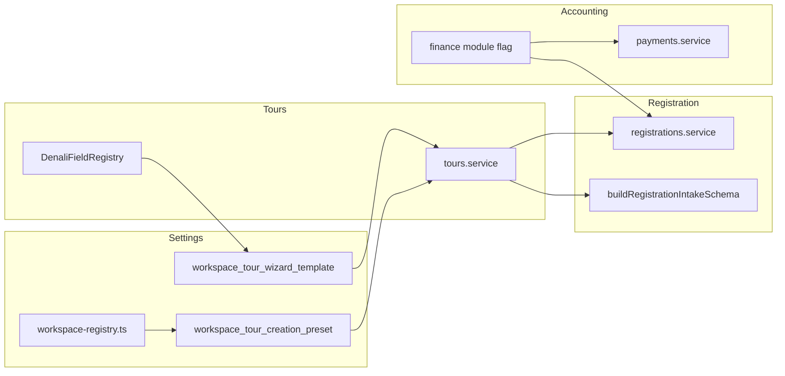
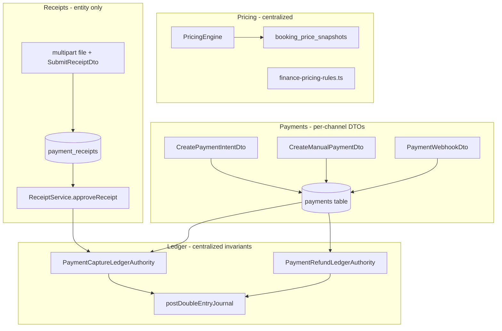
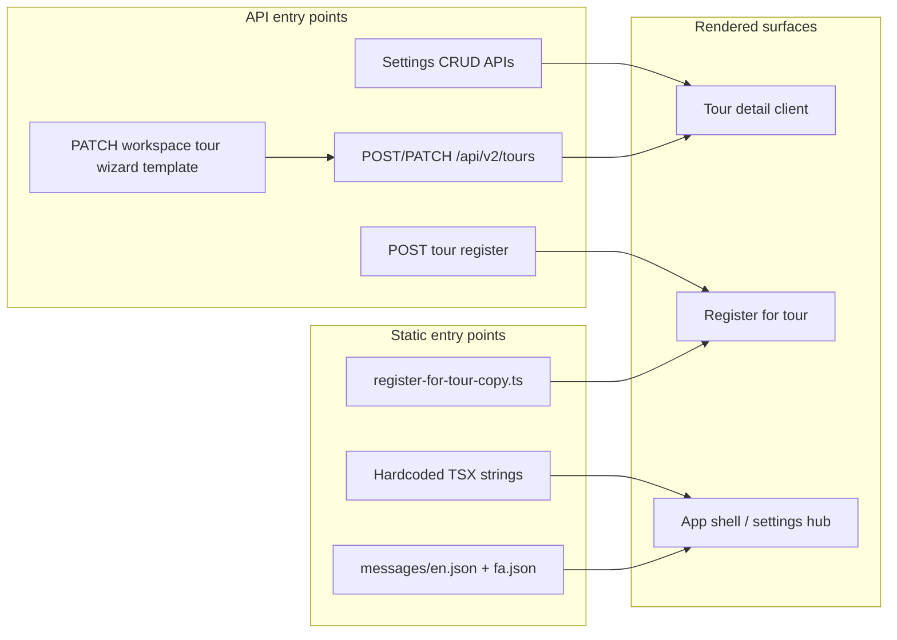

# System Architectural Audit

Audit date: 2026-05-26. Scope: **Settings**, **Accounting** (Finance/Payments), and **Registration** modules — where fields are defined and where workspace/profile branching couples domains.

---

## Current Health Report (2026-05-26)

| Area | Status | Notes |
|------|--------|-------|
| Workspace strategy migration | **Mostly green** | `WorkspaceStrategyRegistry` owns tour create/publish/strip paths; profile literals remain only inside strategy implementations and registry helpers (`usesDenaliCanonicalTemplate`, `isDenaliStrategyProfile`). |
| Finance contract gates | **Green** | `enforcePaymentIntentFinanceContract` on payment create/update/manual; `enforceLedgerJournalContract` on all `persistLedgerJournal` / `postAndPersistDoubleEntryJournal` paths. |
| Golden path (purchase) | **Green (post-fix)** | `RegistrationPlacementOrchestrator` passes `createPaymentIntent` into `createPublicRegistrationOrWaitlist` within one transaction; orchestrator now rejects `requiresPayment && paymentIntent == null` (`BOOKING_PAYMENT_INTENT_MISSING`). Pricing finalization uses immutable booking snapshot, not live `cost_context`. |
| RBAC centralization | **Green** | Service-layer checks route through `workspace-access.helper.ts`; `registrations-policy.ts` uses `canActAsPlatformAdminWithoutTenant`. Controller `@Roles` decorators are transport-layer only. |
| TypeScript `pnpm lint` | **Yellow** | Pre-existing errors in `auth.service.phone-otp.spec.ts`, `assert-profile-required-fields-for-submit.spec.ts`, `test-floating-capacity-engine.spec.ts` (unrelated to architecture pass). |
| Golden path e2e readiness | **Ready with caveats** | Run `pnpm --filter @apps/api run test:e2e` / registration payment e2e against a DB with finance module + `requiresPayment` tours; fix lint blockers if CI gates on full `tsc --noEmit`. |

**Contract gaps still open:** payment transition rules duplicated in `registrations-policy.ts` vs finance FSM; `cost_context.requiresPayment` still gates booking (by design — flag only, not pricing); web settings forms may still hardcode `TOUR_FORM_PROFILE_VALUES` (see §1.2).

---

## 1. Settings

### 1.1 Module locations

| Layer | Path |
|-------|------|
| API (Nest) | `apps/api/src/modules/settings-locations/` — module entry `settings-locations.module.ts` |
| Web UI | `apps/web/app/(app)/settings/` — sub-routes: `locations`, `equipment`, `guide-languages`, `tour-themes`, `tour-presets`, `tour-form-defaults`, `tour-wizard-template`, `reconciliation-triage`, `audit-trail` |
| Web clients | `apps/web/lib/settings-*.client.ts` (`settings-equipment`, `settings-guide-languages`, `settings-tour-presets`, `settings-tour-themes`, `settings-tour-wizard-template`) |
| Web hooks | `apps/web/src/hooks/use-settings-*.ts`, `use-tenant-wizard-template.ts` |

### 1.2 Field / data structure definitions

| Concern | Definition style | Primary paths |
|---------|------------------|---------------|
| Workspace catalog rows (destinations, regions, equipment, guide languages, tour themes) | **TypeORM entities** + **class-validator DTOs** | `entities/workspace-*.entity.ts`, `dto/create-*.dto.ts`, `dto/update-*.dto.ts`, `dto/workspace-*-response.dto.ts` |
| Tour creation presets | **Entity** `formProfile` + **JSONB `defaults`** validated per profile | `entities/workspace-tour-creation-preset.entity.ts`, `tour-preset-defaults.schema.ts`, `dto/create-workspace-tour-creation-preset.dto.ts` |
| Tour wizard template (Denali) | **Entity JSONB** + **Zod/registry validation** | `entities/workspace-tour-wizard-template.entity.ts` (`canonicalData`, `fieldRulesOverlay`, `baseProfile`), `denali-canonical-template-data.schema.ts`, `validate-workspace-wizard-template.ts` |
| Preset defaults shape per workspace profile | **Registry-driven Zod** (not hardcoded single schema) | `tour-preset-defaults.schema.ts` → `getTourWorkspaceDefinition()` from `packages/shared-contracts/src/tours/workspace-registry.ts` |
| Denali canonical template top-level keys | **Shared Zod** (`@repo/types/denali`) | `packages/types/src/denali/` (e.g. `validateDenaliCanonicalTemplateData`) |
| Denali wizard field paths (settings template builder UI) | **Generated rule registry** (codegen), not DB | `apps/web/src/features/tours/wizard/denali/registry/DenaliFieldRegistry.ts`, `denaliFieldRegistryData.ts`, `rules/generated/denaliRuleSet.generated.ts`; builder uses `listDenaliRuleFieldPaths()` in `apps/web/app/(app)/settings/tour-wizard-template/tour-wizard-template-builder-form.tsx` |
| Tour form profile enum / descriptors | **Shared types + descriptor table** | `packages/types/src/tour-form-profile.ts`, `packages/types/src/tour-form-profile-descriptors.ts` |
| Workspace → tour profile resolution | **Service function** (DB lookup chain) | `apps/api/src/modules/settings-locations/resolve-workspace-tour-form-profile.ts` |
| Settings UI form profiles | **Hardcoded Zod enums** in panels | `apps/web/app/(app)/settings/tour-themes/tour-theme-form.tsx`, `tour-presets/tour-preset-form.tsx`, `tour-form-defaults/tour-preset-simple-form.tsx` — `z.enum(TOUR_FORM_PROFILE_VALUES)` |
| i18n labels for profiles | **Message keys per profile** | `apps/web/messages/en.json`, `fa.json` — `tourThemesFormProfileOption_*` |

**Registry summary (Settings):** Catalog entities are **interfaces/DTOs + DB**. Denali template overlay paths come from the **Denali field registry (generated)**. Preset `defaults` roots are **registry-backed** via `TOUR_WORKSPACE_DEFINITIONS`. Classic/general presets use a **hardcoded** `classicPresetDefaultsSchema` fallback in `tour-preset-defaults.schema.ts`.

### 1.3 Workspace branching & coupling

| Pattern | Path | Notes |
|---------|------|-------|
| `getTourWorkspaceDefinition(profile)` → different preset root keys | `apps/api/src/modules/settings-locations/tour-preset-defaults.schema.ts` (`parsePresetDefaultsOrThrow`) | Branches workspace vs classic schema |
| `isDenaliFormProfile(formProfile)` ternary / early return | `apps/api/src/modules/settings-locations/tour-creation-presets-settings.service.ts` | Denali presets skip classic defaults validation path |
| Preset vs theme `formProfile` drift checks | `tour-preset-defaults-drift.ts`, `tour-creation-presets-settings.service.ts` | Couples preset row to theme catalog profiles |
| `resolveWorkspaceTourFormProfile` — template `baseProfile` vs preset `formProfile` | `resolve-workspace-tour-form-profile.ts` | Drives tour create/edit across app |
| Web: Denali-only preset UI | `apps/web/app/(app)/settings/tour-presets/tour-preset-list.tsx` — `item.formProfile === "denali_pilot"` | UI branch for active Denali preset |
| Web: template builder tied to Denali rule paths only | `tour-wizard-template-builder-form.ts` + `universal-validator.ts` | Overlay keys must exist in `listDenaliRuleFieldPaths()` |
| API: overlay validation hardcoded enums | `validate-workspace-wizard-template.ts` — `VISIBILITY` / `REQUIREDNESS` sets | Not workspace-specific; coupled to Denali overlay contract |
| Capability gate `module.form_builder` | `settings-regions.controller.ts` (and sibling settings controllers) | Tenant module coupling for settings CRUD |
| Map to tours module | Tours read template via `resolveWorkspaceTourFormProfile` in `tours.service.ts` | Settings data defines tour wizard behavior |

**Coupling risk:** Settings, tour wizard, and publish validation share **`TourFormProfile`** and **Denali registry**; changing a profile requires coordinated edits across `workspace-registry.ts`, preset schema, API services, and web settings panels.

---

## 2. Accounting (Finance & Payments)

There is no top-level `accounting` module; capability is split across **`apps/api/src/modules/finance/`** (ledger, pricing, receipts, reports, reconciliation) and **`apps/api/src/modules/payments/`** (PSP intents, webhooks, manual payments). Web surface: **`apps/web/app/(app)/finance/`** and **`apps/web/lib/finance/`**.

### 2.1 Field / data structure definitions

| Concern | Definition style | Primary paths |
|---------|------------------|---------------|
| Payment row | **TypeORM entity** + enums | `apps/api/src/modules/payments/entities/payment.entity.ts`, `payment-receipt.entity.ts` |
| Payment DTOs / wire | **class-validator DTOs** | `apps/api/src/modules/payments/dto/*.dto.ts` |
| Payment lifecycle / transitions | **Domain TS** (switch on status) | `payments/domain/payment-intent-lifecycle.ts`, `payment-status-transition.ts`; mirror under `finance/payments/domain/` |
| Ledger accounts (synthetic GL ids) | **Hardcoded constants** | `apps/api/src/modules/finance/ledger/ledger-accounts.ts` |
| Ledger journal lines / batches | **Entities + mappers** | `finance/ledger/entities/`, `ledger-journal-line.ts`, `post-double-entry-journal.ts` |
| Pricing engine rules | **Hardcoded rule classes** | `apps/api/src/modules/finance/pricing/finance-pricing-rules.ts`, `pricing-engine.ts`, `pricing-rule.ts` |
| Catalog pricing snapshot | **DTO contract** | `finance/pricing/contracts/catalog-pricing-snapshot.dto.ts` |
| Registration locked pricing | **JSON on registration** + shared type | `packages/types/src/registration.ts` (`LockedBookingPricingDto`); API `registration.entity.ts` pricing columns |
| Finance wire contracts | **Phase 1 shell** (`z` + registry); schemas TBD | `packages/shared-contracts/src/finance/finance.schemas.ts`, `index.ts` |
| Web finance access | **Capability helper** (tenant modules) | `apps/web/lib/finance/finance-module-access.ts` |
| Web error mapping | **switch on error.code** | `apps/web/lib/finance/map-finance-to-user-message.ts` |
| Tour cost / requires payment | **DTO** on tour create/patch | `apps/api/src/modules/tours/dto/cost-context.dto.ts` |

**Registry summary (Accounting):** Mostly **hardcoded** domain enums, ledger account strings, and pricing rule classes — not driven by workspace field registry. Tenant enablement uses **`tenantModules` / `module.finance`** capability flags.

### 2.2 Workspace branching & coupling

| Pattern | Path | Notes |
|---------|------|-------|
| `@RequireCapability("module.finance")` on controllers | `finance/reports/finance-reports.controller.ts`, `payments/payments.controller.ts`, `payments/finance-payments.controller.ts`, `registrations/registrations.controller.ts` (finance endpoints) | Entire finance API gated by tenant module |
| Finance module check before online payment intent | `payments/application/payment-intent-registration-resolver.application.service.ts` — `capabilitiesForTenantModules(tenantModules)` | Registration payment path coupled to tenant modules |
| `userHasFinanceModuleCapability` / `tenantModulesIncludeFinance` | `apps/web/lib/finance/finance-module-access.ts` | Web UI hides finance when module off |
| Pricing role/discount switches | `finance/pricing/finance-pricing-rules.ts` — `switch (role)`, `switch (code)` | Workspace staff adjustments (`workspace_role_adjustment`) |
| Tours service finance module probe | `apps/api/src/modules/tours/tours.service.ts` (~line 409) | Create/patch tour payment behavior vs `finance` module |
| Ledger tenant scope | `finance/ledger/ledger-tenant-scope.ts` | Enforces workspace_id on journal lines |
| Settings UI: reconciliation under `/settings` | `apps/web/app/(app)/settings/reconciliation-triage/page.tsx` | UX couples finance ops into Settings nav |
| Registration ↔ payments bridge | `registrations/ports/registration-payment.port.ts`, payment capture ledger services | Booking financial mutations locked via `lock-registration-for-financial-mutation.ts` |

**Coupling risk:** Finance is **module-flag gated**, not **form-profile gated**. Registration and tour `cost_context` assume finance module presence for paid flows; no Denali-style registry for monetary fields.

---

## 3. Registration

### 3.1 Module locations

| Layer | Path |
|-------|------|
| API | `apps/api/src/modules/registrations/` — `registrations.service.ts`, `registrations.controller.ts`, `registrations.module.ts` |
| API domain | `registrations/domain/` — booking transitions, finalization pipeline, booking-status |
| API application | `registrations/application/` — placement orchestrator, quote service |
| Web features | `apps/web/src/features/registrations/` — hooks, booking-target intake |
| Web API routes (BFF) | `apps/web/app/api/registrations/`, `apps/web/app/api/tours/[tourId]/registrations/` |
| Shared types | `packages/types/src/registration.ts` (mirrors OpenAPI) |
| Shared booking status (domain) | `packages/shared-contracts/src/booking/booking-status.schema.ts` (Zod; parallel to API registration status enums) |

### 3.2 Field / data structure definitions

| Concern | Definition style | Primary paths |
|---------|------------------|---------------|
| Persisted registration columns | **TypeORM entity** | `registration.entity.ts`, `waitlist-item.entity.ts` |
| API request/response shapes | **class-validator DTOs** | `dto/create-registration.dto.ts`, `dto/get-registration.dto.ts`, `dto/public-registration-response.dto.ts`, `dto/participant-metadata.dto.ts` |
| Status / payment enums (API) | **Hardcoded enums** in entity + DTO | `RegistrationStatus`, `RegistrationPaymentStatus` in `registration.entity.ts`; DTO enums in `create-registration.dto.ts` |
| Client/shared mirror types | **TypeScript interfaces** | `packages/types/src/registration.ts` |
| Intake form (web) | **Zod schema built from policy object** | `apps/web/src/features/registrations/booking-target/buildRegistrationIntakeSchema.ts` |
| Intake policy shape | **Interface** (tour-derived flags) | `apps/web/src/features/registrations/booking-target/types.ts` — `RegistrationFieldPolicy` |
| Tour registration policy on read model | **Mapper + resolver** | `apps/web/lib/tours/registration-policy.ts`, `apps/web/lib/mappers/tour.mapper.ts` (`registrationPolicy.allowPrivateCar`) |
| Booking domain transitions | **Rules + switch** | `domain/booking-transition-rules.ts`, `domain/assert-valid-booking-transition.ts`, `domain/registration-booking-bridge.ts` |
| Peak Experience placement | **Pure function** on tour/trip metadata | `utils/peak-experience-placement.ts` |
| Transport intake normalization | **Util** | `utils/registration-transport-intake.ts` |
| Policies | **Policy modules** | `policies/registration-integrity.policy.ts`, `policies/waitlist-integrity.policy.ts` |

**Registry summary (Registration):** **No field registry**. Core fields are **entity + DTO + Zod intake**. Dynamic requiredness comes from **`RegistrationFieldPolicy`** populated from **tour `tripDetails.participation`** and **tour transport modes** (BFF), not from `TourFormProfile` directly in the registrations module.

### 3.3 Workspace branching & coupling

| Pattern | Path | Notes |
|---------|------|-------|
| `RegistrationFieldPolicy` driven by tour participation flags | Web: `types.ts`, `buildRegistrationIntakeSchema.ts`; tour detail supplies `nationalIdRequired`, `personalInsuranceRequired`, `requirePeakHistory`, `allowPrivateCar` | Indirect coupling to workspace tour content (tripDetails), not settings CRUD |
| `allowPrivateCar` from transport modes | `apps/web/lib/tours/registration-policy.ts`, `tour.mapper.ts` | Derived from tour payload, not registration module |
| Peak Experience auto-approval | `registrations.service.ts` → `qualifiesForPeakExperienceAutoApproval()` in `peak-experience-placement.ts` | Coupled to tour mountain / peak rules |
| `switch (status)` in booking bridge / outbox | `domain/registration-booking-bridge.ts`, `domain/registration-outbox-event-type.ts` | Lifecycle coupling internal to registration domain |
| Finance module on payment endpoints | `registrations.controller.ts` `@RequireCapability("module.finance")` | Payment PATCH coupled to tenant finance module |
| Workspace query invalidation | `invalidate-workspace-queries.ts` | Tenant-scoped cache keys |
| UI status badges | `registration-status-badges-fa.tsx` — `switch (status)`, `switch (payment)` | Presentation-only branching |
| CRM transport labels | `lib/registrations/format-registration-crm.ts` — `switch (mode)` | Display coupling |

**Coupling risk:** Registration validation is **tour-content coupled** (tripDetails, transport, peak rules) and **finance-module coupled** for payments, but **not** coupled to `TourFormProfile` / Denali registry in the registrations module itself. Tour shape changes (Denali vs classic) affect registration only through normalized tour detail / BFF policy fields.

---

## 4. Cross-module coupling (summary)



| From | To | Mechanism |
|------|-----|-----------|
| Settings template/preset | Tours create/edit | `resolveWorkspaceTourFormProfile`, wizard template JSONB |
| Settings Denali registry | Settings template UI | `listDenaliRuleFieldPaths()` |
| Tours tripDetails | Registration intake | BFF `RegistrationFieldPolicy` |
| Tours cost_context | Accounting | Payment intents / ledger on registration |
| Tenant `module.finance` | Payments + registration payment APIs | CASL / capability checks |
| Tenant `module.form_builder` | Settings CRUD | Capability on settings controllers |

---

## 5. Recommended follow-ups (audit only)

1. **Settings ↔ Tours:** Document single owner for `TourFormProfile` descriptor rows vs `workspace-registry.ts` mappings (known alias: `urban_event` → `DENALI_WORKSPACE` in `packages/shared-contracts/src/tours/workspace-registry.ts`).
2. **Registration:** Consider centralizing `RegistrationFieldPolicy` resolution in API (today split between BFF mapper and tour participation JSON).
3. **Accounting:** Finance Zod foundation is in `packages/shared-contracts/src/finance/finance.schemas.ts`; concrete payment/receipt DTOs remain duplicated between API entities and `packages/types` until migrated.
4. **Publish gates:** Tour PATCH publish policy is lifecycle-transition scoped in `tours.service.ts`; registration/finance unaffected (confirmed separate concern).

---

# Step 2: Workspace Variance

Scan method: repository search for `TourFormProfile` literals, `TOUR_WORKSPACE_DEFINITIONS`, `wizardMode`, `getTourFormProfileDescriptor`, `getTourWorkspaceDefinition`, and profile equality / `switch (profile)` patterns (production `.ts`/`.tsx` only, excluding `*.spec.*` and `dist/`).

## 2.1 Workspace identifiers found in the codebase

### Canonical tour form profiles (`TourFormProfile`)

Authoritative closed set in `packages/types/src/tour-form-profile.ts` → `TOUR_FORM_PROFILE_VALUES`:

| Identifier | In `TOUR_WORKSPACE_DEFINITIONS`? | Notes |
|------------|-----------------------------------|--------|
| `general` | No (classic preset roots only) | Default profile; descriptor row in `tour-form-profile-descriptors.ts` |
| `mountain_outdoor` | No | Classic 9-step wizard; mountain-only tripDetails keys |
| `nature_trip` | Yes → `ARCTIC_WORKSPACE` | `wizardMode: "classic"` in `packages/shared-contracts/src/tours/workspaces/arctic.ts` |
| `urban_event` | Yes → `DENALI_WORKSPACE` (alias) | Shares Denali rail/invariants with `denali_pilot` |
| `cinema_event` | No | Urban-style logistics whitelist in descriptors |
| `cultural_tour` | No | Added to profile enum; descriptor row present |
| `denali_pilot` | Yes → `DENALI_WORKSPACE` | Primary Denali workspace profile |

`TourDomainProfile` in `packages/types/src/tour-domain-profile.ts` is a **type alias** of `TourFormProfile` (same identifiers).

### Workspace definition registry (strategy objects)

`packages/shared-contracts/src/tours/workspace-registry.ts` → `TOUR_WORKSPACE_DEFINITIONS` keys:

- `denali_pilot` → `DENALI_WORKSPACE` (`packages/shared-contracts/src/tours/workspaces/denali.ts`)
- `nature_trip` → `ARCTIC_WORKSPACE` (`packages/shared-contracts/src/tours/workspaces/arctic.ts`)
- `urban_event` → `DENALI_WORKSPACE` (intentional alias — same roots/validation as Denali)

Profiles **not** in the registry use **classic** preset schema fallback (`tour-preset-defaults.schema.ts` → `classicPresetDefaultsSchema`).

### UI rail modes (`TourWizardMode`)

`apps/web/src/features/tours/wizard/isDenaliWizardContext.ts`:

- `classic` — 9-step wizard (`TourCreateWizard`, `TourForm` edit path)
- `denali` — 6-tab Denali wizard (`DenaliCreateTourWizard`, canonical model)

Resolved via `getTourWorkspaceDefinition(profile)?.ui.wizardMode` or explicit `wizardMode` on tenant UI contract.

### Legacy / collateral identifiers (not `TourFormProfile`)

| Identifier | Where | Meaning |
|------------|--------|---------|
| `"classic"` | DB default on `workspace_tour_creation_presets.form_profile` column comment/default in `workspace-tour-creation-preset.entity.ts` | Legacy string; normalized to `general` at runtime via `normalizeTourFormProfileInput` |
| `"denali"` | Tenant provision scripts (`apps/api/src/scripts/provision-denali-tenant.ts`), subdomain docs | **Tenant slug / product name**, not a form profile slug |
| `DENALI_ROOTS` | `packages/shared-contracts` denali wizard contract | Canonical JSON root keys for Denali payloads |
| `WORKSPACE_RULE_*` | `denali-invariants.ts`, `arctic.ts` | API error codes for workspace validation strategies |
| `EventKind` | `tour-domain-profile-bridge.ts` (`mountain`, `city_tour`, `workshop`, `generic`, …) | Legacy edit UI axis; projected from profile |

### Tenant capability modules (orthogonal to tour profile)

Enabled per tenant (not per `TourFormProfile`): `module.finance`, `module.form_builder` — see `packages/shared/rbac/capabilities.ts`, `finance-module-access.ts`, settings controllers.

### Demo / provision tenant slugs (environment fixtures)

Referenced in tests and scripts (not profile enums): `denali`, `ws1-rbac`, `urban-demo`, `mix-demo` — `apps/api/src/scripts/mix-demo-tenant.fixture.ts`, integration helpers under `apps/web/tests/integration/`.

---

## 2.2 Core modules vs workspace-specific modules

### Core (shared by all workspaces / tenants)

Behavior does **not** branch on `TourFormProfile` or `wizardMode` for its primary contract:

| Area | Paths | Shared concern |
|------|--------|----------------|
| **Registration** | `apps/api/src/modules/registrations/`, `apps/web/src/features/registrations/` | Booking status, capacity, transport intake; policy from tour `tripDetails`, not profile registry |
| **Accounting / Finance** | `apps/api/src/modules/finance/`, `apps/api/src/modules/payments/` | Ledger, pricing engine, receipts; gated by `module.finance` tenant module |
| **Identity & RBAC** | `apps/api/src/common/casl/`, `packages/shared/rbac/` | Roles, capabilities (`ability.factory.ts` branches on **workspace role**, not tour profile) |
| **Settings catalog CRUD** | `apps/api/src/modules/settings-locations/` (destinations, regions, equipment, guide languages, themes) | Tenant-scoped rows; `formProfile` is metadata on themes/presets, not a separate codepath per catalog entity |
| **Tours — lifecycle & inventory** | `apps/api/src/modules/tours/tours.service.ts` (capacity, lifecycle transitions, locking) | Same PATCH/CREATE envelope; profile affects strip/validate hooks (see hybrid below) |
| **Registrations ↔ Payments bridge** | `registrations/ports/registration-payment.port.ts`, payment capture ledger | Same for all tours with finance module |
| **Shared registration types** | `packages/types/src/registration.ts` | API-agnostic DTO mirror |

### Workspace-specific (profile- or rail-dependent)

| Area | Paths | Variance driver |
|------|--------|-----------------|
| **Denali wizard (web)** | `apps/web/src/features/tours/wizard/denali/**` | Entire tree: registry, rules codegen, canonical adapter, steps, validation |
| **Denali workspace contract (shared)** | `packages/shared-contracts/src/tours/workspaces/denali.ts`, `denali-invariants.ts`, `denali-wizard.contract` | Capacity/tripDetails/publish geo rules |
| **Arctic workspace contract** | `packages/shared-contracts/src/tours/workspaces/arctic.ts` | `nature_trip` min-capacity rule |
| **Workspace registry** | `packages/shared-contracts/src/tours/workspace-registry.ts` | Maps profile → strategy |
| **Profile descriptor table** | `packages/types/src/tour-form-profile-descriptors.ts` | Per-profile strip/inactive groups/invariant hints |
| **Classic wizard + profile rules** | `apps/web/src/features/tours/wizard/profileRules/`, `TourCreateWizard.tsx`, `TourForm.tsx` | `BASE_FIELD_RULES` + descriptor-driven visibility |
| **API profile strip & invariants** | `apps/api/src/modules/tours/utils/create-tour-form-profile-strip.ts`, `assert-create-tour-invariants.ts`, `assert-profile-required-fields-for-submit.ts` | Strip roots/keys per `getTourFormProfileDescriptor` |
| **Preset defaults validation** | `apps/api/src/modules/settings-locations/tour-preset-defaults.schema.ts` | `getTourWorkspaceDefinition` vs classic schema |
| **Tour wizard template (settings)** | `apps/web/app/(app)/settings/tour-wizard-template/`, `validate-workspace-wizard-template.ts` | Denali overlay + canonical JSON only |
| **Publish transition (Denali geo)** | `apps/api/src/modules/tours/policies/assert-tour-publish-transition.ts` | `profile === "denali_pilot"` → geolocation zone check |
| **Create-tour rail selection** | `apps/web/app/(app)/tours/new/tour-create-wizard-wrapper.tsx`, `isDenaliWizardContext.ts` | Chooses `DenaliCreateTourWizard` vs classic |

### Hybrid (core module with workspace hooks)

| Module | Core surface | Workspace hook |
|--------|--------------|----------------|
| **Tours** | CRUD, departures, drafts | `resolveWorkspaceTourFormProfile`, strip, publish gates, `assertTripDetailsForFormProfile` |
| **Settings — presets** | CRUD | `isDenaliFormProfile()` branch in `tour-creation-presets-settings.service.ts` |
| **Settings — themes** | CRUD | `formProfile` column per theme row |
| **Web trip details matrix** | `tripDetailsFieldConfig.ts` | `getTourFormProfileDescriptor` + `eventKindForDomainProfile` |

---

## 2.3 Top 5 files most coupled to workspace / profile logic

Ranked by density of profile/workspace branch patterns in **production** source (approximate match count from audit scan). Spec/test files excluded.

| Rank | File | ~Matches | Why it is coupled |
|------|------|----------|-------------------|
| 1 | `packages/types/src/tour-form-profile-descriptors.ts` | 35 | **Single declarative table** — one object per profile (`general`, `mountain_outdoor`, `urban_event`, `denali_pilot`, …) defining inactive wizard groups, strip deltas, invariant hints, edit overrides |
| 2 | `apps/web/src/features/tours/wizard/denali/denaliThemeFilter.ts` | 22 | Filters workspace theme catalog by **profile category** (`mountain_outdoor`, `denali_pilot`, `general`, etc.) |
| 3 | `apps/api/src/modules/tours/utils/assert-create-tour-invariants.ts` | 14 | Repeated `getTourFormProfileDescriptor(profile)` strip paths; workspace `assertTripDetailsForFormProfile` / `getTourWorkspaceDefinition` validation |
| 4 | `apps/web/src/features/tours/wizard/isDenaliWizardContext.ts` | 12 | **Rail resolver** — `wizardMode`, `getTourWorkspaceDefinition`, `isDenaliPilotFormProfile`, `resolveTourWizardMode` |
| 5 | `apps/web/src/components/tours/TourForm.tsx` | 12 | Classic **edit** shell branches on resolved profile / `eventKindForDomainProfile` for trip-details field matrix |

**Runners-up (also high coupling):** `apps/api/src/modules/tours/utils/create-tour-form-profile-strip.ts` (9), `apps/web/src/features/tours/wizard/fieldGroups.ts` (10), `packages/types/src/tour-domain-profile-bridge.ts` (10, explicit `switch (profile)` for `EventKind`), `apps/web/src/features/tours/config/tripDetailsFieldConfig.ts` (8).

### Interpretation

- **Centralization progress:** Many former `switch (profile)` chains were consolidated into `TOUR_FORM_PROFILE_DESCRIPTORS` (see file header comment in `tour-form-profile-descriptors.ts`). Remaining hot spots are **Denali-specific** (`denali/**`, `denali-invariants.ts`) and **rail selection** (`isDenaliWizardContext.ts`).
- **Alias risk:** `urban_event` and `denali_pilot` share `DENALI_WORKSPACE` — changes to Denali invariants affect both identifiers.
- **Non-profile variance:** Finance and registration primarily use **tenant module flags**, not `TourFormProfile`; do not conflate with workspace tour profiles in refactors.

---

# Step 3: Financial/Accounting Contracts

Scope: `apps/api/src/modules/finance/`, `apps/api/src/modules/payments/`, `apps/api/src/modules/pricing/` (booking quotes), `apps/web/lib/finance/`, `apps/web/lib/services/payments.service.ts`, `packages/shared-contracts/src/finance/`.

## 3.1 Unified schemas vs per-surface definitions

### Is there a unified `Transaction` model?

**No.** The codebase does not define a shared `Transaction` interface or Zod schema. Money movement is split across aggregates:

| Concept | Definition style | Primary paths |
|---------|------------------|---------------|
| **Payment (persisted)** | TypeORM entity + Nest DTOs + OpenAPI | `apps/api/src/modules/payments/entities/payment.entity.ts`, `dto/payment-response.dto.ts`, `dto/create-payment-intent.dto.ts`, `dto/create-manual-payment.dto.ts` |
| **Ledger journal line** | TypeScript type (in-memory / persistence mapper) | `apps/api/src/modules/finance/ledger/ledger-journal-line.ts`, `ledger/entities/ledger-journal-line.entity.ts` |
| **Pricing line item** | TS types (quote engine) | `apps/api/src/modules/pricing/pricing.types.ts`, `finance/pricing/pricing-quote.ts` |
| **Booking price snapshot** | Entity (immutable at booking) | `apps/api/src/modules/pricing/entities/booking-price-snapshot.entity.ts` |
| **Reconciliation finding** | Entity + report types | `finance/reconciliation/entities/`, `payment-reconciliation-report.ts` |
| **Idempotency “transaction”** | HTTP/idempotency scope only | `apps/api/src/modules/idempotency/idempotent-transaction.context.ts` (not a financial transaction) |

`packages/shared-contracts/src/finance/` had an empty stub at audit time; **Phase 1** added `finance.schemas.ts` (`z` re-export + `financeSchemaRegistry` shell). Currency/minor-unit and payment/receipt wire schemas — **not yet implemented**.

### Is there a unified `Receipt` model?

**Partially, entity-only on API; no shared Zod; no OpenAPI response schema.**

| Layer | Receipt contract | Path |
|-------|------------------|------|
| Persistence | `PaymentReceiptEntity`, `ReceiptStatus` enum (`Pending` / `Approved` / `Rejected`) | `apps/api/src/modules/payments/entities/payment-receipt.entity.ts` |
| Upload body | `SubmitReceiptDto` — optional `note` only; **file is multipart**, not in DTO | `apps/api/src/modules/payments/dto/submit-receipt.dto.ts` |
| HTTP responses | Controllers return **`PaymentReceiptEntity` directly** (serialized by Nest), not a dedicated `ReceiptResponseDto` | `finance/receipts/receipt.service.ts`, `payments/finance-payments.controller.ts` |
| OpenAPI | `SubmitReceiptDto` documented; **no `PaymentReceiptResponseDto`** in `apps/api/openapi.json` component schemas | Paths under `/api/v2/finance/payments/{id}/receipt`, `/api/v2/admin/finance/receipts/*` |
| Web client | Loose TS `PaymentReceiptRow` (hand-maintained fields) | `apps/web/lib/services/payments.service.ts` |
| Web validation | **No Zod** under `apps/web/lib/finance/` or finance routes | — |

### Per-method / per-channel formats (not one wire shape)

Financial payloads are **defined per flow**, not normalized through a single schema:

| Flow | Input contract | Output / side effects |
|------|----------------|----------------------|
| **Online PSP intent** | `CreatePaymentIntentDto` + gateway `CreatePaymentIntentGatewayInput` | `PaymentResponseDto`; provider fields (`clientSecret`, `checkoutUrl`) optional |
| **PSP webhook** | `PaymentWebhookDto` | Processed in `payments.service.ts` / webhook controller |
| **Manual debt** | `CreateManualPaymentDto` (`registrationId`, `amount`, `currency`) | `PaymentEntity` with `method: Manual`, `status: Pending` |
| **Cash/offline receipt upload** | Multipart file + `SubmitReceiptDto` | `PaymentReceiptEntity` → on approve: `Payment` → `Paid`, ledger capture, registration `Paid` |
| **Admin refund** | `RefundPaymentDto` (optional `reason`) + idempotency header | `PaymentResponseDto`; ledger reversal via `PaymentRefundLedgerAuthorityService` |
| **Leader PATCH paid amount** | `UpdateRegistrationPaymentDto` | Ledger via `BookingLedgerAuthorityService` / leader contracts |
| **Finance reports** | Query params only | `FinanceLedgerEventRow`, summary DTOs in `finance/reports/` |

**Gateway-specific rules** are embedded in adapters, not shared schemas:

- `apps/api/src/modules/payments/gateway/zibal-payment-gateway.ts` — **IRR-only** currency check
- `stripe-payment-gateway.ts`, `mock-payment-gateway.ts` — separate status mapping `switch`es
- Parallel **finance** gateway port: `finance/payments/gateways/payment-gateway.interface.ts` with `PaymentResult`, `RefundRequest`, `RefundResult` (PSP-agnostic **types**, separate from persisted `payments` enums)

### Zod usage in Finance/Accounting

| Area | Zod? |
|------|------|
| API finance/payments modules | **No** — validation via `class-validator` on DTOs only |
| Web finance UI | **No** |
| Shared packages | **No** finance Zod; booking status only in `packages/shared-contracts/src/booking/booking-status.schema.ts` |
| Registration money mirror | TS interfaces in `packages/types/src/registration.ts` (`LockedBookingPricingDto`, `paymentStatus`) — mirrors OpenAPI, not Zod |

### Duplicate payment domain models (contract drift risk)

Two **incompatible** `PaymentStatus` enums coexist:

| Module | Enum values | Used by |
|--------|-------------|---------|
| `payments/entities/payment.entity.ts` | `Pending`, `Paid`, `Failed`, `Refunded`, `Cancelled` | **Production** controllers, receipts, refunds, web `PaymentIntentResponse` |
| ~~`finance/.../payment-status.ts`~~ | ~~lowercase attempt values~~ | **Renamed** to `PaymentAttemptStatus`; persisted status from `@repo/shared-contracts` only |

Persisted DB payments follow the **uppercase Nest enum**; the finance folder’s lowercase lifecycle is **not** the source of truth for API responses today.

---

## 3.2 Where “Financial Policy” lives

Policy is **mixed**: pricing and ledger invariants are relatively centralized; payment/receipt/refund rules are **scattered** across small `*.policy.ts` files and services.

### Relatively centralized

| Policy domain | Location | What it governs |
|---------------|----------|-----------------|
| **Quote / list price / discounts** | `finance/pricing/pricing-engine.ts`, `finance/pricing/finance-pricing-rules.ts`, `pricing/discounts/evaluate-discount-eligibility.ts` | Staged rules: tenant → catalog → role (`switch` on `WorkspaceRole`) → promo (`switch` on code e.g. `PCT10`, `SAVE5000`); `assertSingleCurrency` |
| **Immutable booking snapshot** | `finance/ledger/discount-adjustment-ledger.policy.ts`, `pricing` snapshot entity | No post-booking snapshot mutation; offsets via `DISCOUNT_ADJUSTMENTS_ACCOUNT` |
| **Double-entry integrity** | `finance/ledger/post-double-entry-journal.ts`, `clearing-account-zero-sum.ts` | Balanced journals; per-currency clearing net zero |
| **Minor units / amount shape** | `finance/ledger/payment-amount-to-ledger-minor.ts`, `payments/domain/assert-payment-intent-matches-booking-snapshot.ts` | Positive integer minor strings; currency must match snapshot |
| **Synthetic GL accounts** | `finance/ledger/ledger-accounts.ts` | Hardcoded account ids (clearing, discount adjustments, booking wallets) |

### Scattered (per concern / per channel)

| Policy | Location | Notes |
|--------|----------|-------|
| **Manual debt allowed** | `payments/domain/manual-payment-debt.policy.ts` | Blocks second debt if `Paid` or `Pending` exists |
| **Receipt one pending per payment** | `finance/receipts/receipt-pending.policy.ts` | `assertNoPendingReceiptForPayment` |
| **Who may upload receipt** | `finance/receipts/receipt-upload-authorization.ts` | Admin/owner or phone match |
| **Payment status transitions (persisted)** | `payments/domain/payment-status-transition.ts`, `payment-intent-lifecycle.ts` | Maps entity status ↔ intent lifecycle; `switch` for outbox event type |
| **Payment transitions (finance domain)** | `finance/payments/domain/payment-transition-rules.ts`, `assert-valid-payment-transition.ts` | Separate graph on lowercase statuses — not wired to main `PaymentEntity` path |
| **Registration payment status** | `registrations/registrations-policy.ts` → `validatePaymentTransition` | Couples registration status + payment_status to booking machine |
| **Refund orchestration** | `payments/payments.service.ts` (`refundPayment`), `finance/ledger/payment-refund-ledger-authority.service.ts` | PSP refund + ledger reversal + registration reconcile |
| **Capture on paid** | `finance/ledger/payment-capture-ledger-authority.service.ts` | Sources: `manual_receipt_approve` \| `online_webhook_paid` |
| **PSP currency** | `payments/gateway/zibal-payment-gateway.ts` | IRR-only enforcement |
| **Finance module gate** | `payments/application/payment-intent-registration-resolver.application.service.ts`, `@RequireCapability("module.finance")` on controllers | Tenant module, not tour profile |
| **Reconciliation mismatch** | `finance/reconciliation/detect-payment-mismatch.ts`, `reconciliation-mismatch.ts` | PSP vs ledger vs snapshot deltas (per-currency minor) |
| **Web display / errors** | `apps/web/lib/finance/format-finance-display.ts` (default `IRR`), `map-finance-to-user-message.ts` (`switch` on error.code) | Presentation only |

### Tax calculation

**No dedicated tax/VAT policy module** was found under `finance/` or `payments/`. Commercial “tax-like” behavior is limited to:

- **Discount / promo** rules in `finance-pricing-rules.ts` (percentage/fixed minor off base)
- Tour copy field `refundPolicy` in Denali canonical model (`packages/types/src/denali/`) — **marketing text**, not computed tax

### Currency handling

| Mechanism | Path |
|-----------|------|
| Single currency per quote | `assertSingleCurrency` in `finance-pricing-rules.ts` |
| Payment ↔ snapshot parity | `assert-payment-intent-matches-booking-snapshot.ts` |
| Ledger lines carry `currency` | `LedgerJournalLine`, `account_balances` per currency |
| PSP adapter constraints | Zibal → IRR; others vary by gateway |
| UI default | `format-finance-display.ts` falls back to `IRR` |

### Refund rules (summary)

Refunds are **procedure + state machine**, not a standalone policy file:

1. Admin `POST .../admin/payments/:id/refund` with idempotency key (`payments.controller.ts`)
2. `assertAllowedPaymentStatusTransition` toward `Refunded` (`payment-status-transition.ts`)
3. Optional PSP `RefundRequest` / `RefundResult` (`finance/payments/gateways/payment-result.ts`)
4. Ledger reversal journal (`payment-refund-ledger-authority.service.ts`, `post-double-entry-reversal-journal.ts`)
5. Registration payment status updates via existing registration payment port

Partial refunds are modeled at the **gateway adapter** layer (`amountMinor?` on `RefundRequest`); product rules for partial vs full are adapter-defined comments, not a central policy table.

---

## 3.3 Architecture diagram (money paths)



---

## 3.4 Phase 1 finance contract foundation (status)

| Item | Status | Path |
|------|--------|------|
| Zod contract library entry | **Ready** | `packages/shared-contracts/src/finance/finance.schemas.ts` |
| Shared `z` re-export | **Ready** | Import `z` from `@repo/shared-contracts` finance barrel (not `"zod"` directly in finance modules) |
| Schema registry shell | **Ready** | `financeSchemaRegistry` — registers core payment/receipt schemas |
| Package barrel | **Ready** | `packages/shared-contracts/src/finance/index.ts` re-exports `./finance.schemas` |
| `PaymentIntentSchema` + `PaymentIntent` type | **Implemented** | Maps `PaymentEntity` + `BaseTenantEntity`; minor-unit `amount`, enum status/method |
| `PaymentReceiptSchema` + `PaymentReceipt` type | **Implemented** | Maps `PaymentReceiptEntity` + `BaseTenantEntity` |
| Shared primitives | **Implemented** | `MinorUnitAmountStringSchema`, `CurrencyCodeSchema`, `FinanceUuidSchema`, ISO datetime strings |
| Unified `PaymentStatus` + FSM | **Implemented** | See §3.4.1 below |
| Legacy → contract adapter (`toFinanceContract`) | **Implemented** | See §3.4.2 |
| `PaymentsService` contract enforcement | **Strict (online + manual create + update)** | See §3.4.3 + **Phase 2.5 / 2.5.1 / 2.5.2** — `enforcePaymentIntentFinanceContract`; runtime parity mode removed |
| Finance parity drift scan | **Implemented** | See §3.4.4 — `test:finance-parity` (non-blocking; skipped in CI) |
| `LedgerEntrySchema` + `LedgerJournalSchema` (Phase 1.2) | **Implemented** | See §3.4.5 — `LEDGER_ACCOUNTS`, double-entry validator |
| Ledger adapter (`toLedgerEntry` / `toLedgerJournalContract`) | **Implemented** | See §3.4.6 — parity mode (log, do not throw) |
| Ledger `Transaction` wire schema (aggregate) | **Not yet** | Broader than journal envelope |
| OpenAPI / DTO codegen from schemas | **Not yet** | API still uses class-validator DTOs |

**Infrastructure verdict:** contract-first **foundation and core payment/receipt schemas are implemented** in `finance.schemas.ts`; ledger transaction wire and OpenAPI parity remain TODO.

### 3.4.1 Unified `PaymentStatus` and FSM (single source of truth)

**Conflict resolved (audit snapshot):**

| Location (before) | Values | Role |
|-------------------|--------|------|
| `apps/api/.../payment.entity.ts` | `Pending`, `Paid`, `Failed`, `Refunded`, `Cancelled` | **Persisted** `payment_status_enum` (production) |
| `apps/api/.../finance/payments/domain/payment-status.ts` | `initiated`, `pending`, `authorized`, `captured`, `failed`, `refunded` | In-memory **attempt** only (not DB) |

**Canonical contract (`@repo/shared-contracts`):**

| Export | Purpose |
|--------|---------|
| `PAYMENT_STATUS_VALUES` | Tuple fed into `PaymentStatusSchema` |
| `PaymentStatusSchema` | `z.enum([...])` validation |
| `PaymentStatus` | Runtime const object (`PENDING` → `"Pending"`, …) |
| `type PaymentStatus` | `z.infer<typeof PaymentStatusSchema>` |
| `PAYMENT_STATUS_TRANSITIONS` | FSM adjacency list (allowed next states per status) |
| `PAYMENT_STATUS_TRANSITION_EDGES` | Directed edges `[from, to]` |
| `isAllowedPaymentStatusTransition(from, to)` | Idempotent same-state + single-step edges |

**`PAYMENT_STATUS_TRANSITIONS` (persisted FSM):**

```text
Pending  → Paid | Failed
Paid     → Refunded | Cancelled
Failed   → (terminal)
Refunded → (terminal)
Cancelled → (terminal)
```

**Wiring:**

- `PaymentEntity` imports `PaymentStatus` from `@repo/shared-contracts` (no local enum duplicate).
- `assertAllowedPaymentStatusTransition` uses `isAllowedPaymentStatusTransition` from shared-contracts.
- Legacy lowercase attempt enum renamed to `PaymentAttemptStatus` in `finance/payments/domain/payment-attempt-status.ts` with `PAYMENT_ATTEMPT_ALLOWED_TRANSITIONS` (separate from persisted FSM).

### 3.4.2 Finance adapter — legacy → contract parity bridge

**Path:** `apps/api/src/modules/finance/finance.adapter.ts`

| Export | Role |
|--------|------|
| `normalizeLegacyPaymentIntentWire(legacyData)` | Maps `PaymentEntity`, DTOs, snake_case payloads, and partial snapshots to the wire shape expected by `PaymentIntentSchema` |
| `toFinanceContract(legacyData)` | Validates with `PaymentIntentSchema` from `@repo/shared-contracts`; returns typed `PaymentIntent` |
| `toFinanceContractFromPaymentEntity(entity)` | Thin wrapper when the caller already has a loaded row |

**Validation (adapter):** on `ZodError`, logs via Nest `Logger` and **rethrows** so `enforcePaymentIntentFinanceContract` in PaymentsService can throw `FINANCE_CONTRACT_VALIDATION_FAILED`.

**Normalization rules:**

- Accepts camelCase and snake_case (`tenant_id` → `tenantId`, `paid_at` → `paidAt`, …).
- Coerces `Date` instances to ISO-8601 strings.
- Uppercases `currency`; coerces `amount` to a positive minor-unit string.
- Fills missing `createdAt` / `updatedAt` with parity fallbacks when absent (e.g. `pickFinancialPaymentSnapshot` snapshots).
- Unknown / invalid enum labels fall back to `Pending` / `Online` before parse.

**Intended consumers (incremental):**

- Shadow-validate responses in `PaymentsService.toResponse` / ledger loaders before switching wire types.
- Finance reports and reconciliation loaders comparing legacy rows to `@repo/shared-contracts`.

**Tests:** `apps/api/src/modules/finance/finance.adapter.spec.ts` (full wire, snake_case, partial snapshot without throw).

### 3.4.3 `PaymentsService` contract enforcement

**Paths:** [`payments.service.ts`](apps/api/src/modules/payments/payments.service.ts), [`enforce-payment-intent-finance-contract.ts`](apps/api/src/modules/payments/enforce-payment-intent-finance-contract.ts)

| Hook | Legacy entrypoint | Contract validation |
|------|-------------------|---------------------|
| Create (online) | `createPaymentIntent` → `createPaymentIntentWithManager` | **Strict** — `enforcePaymentIntentFinanceContract("createPaymentIntent")` |
| Create (manual) | `ManualPaymentService.createManualPayment` | **Strict** — `enforcePaymentIntentFinanceContract("createManualPayment")` (Phase 2.5.2) |
| Update | `applyPaymentStatus` (webhooks, refunds, timeouts) | **Strict** — `enforcePaymentIntentFinanceContract(\`applyPaymentStatus:${next}\`)` (Phase 2.5.1) |

**Strict enforcement:** `enforcePaymentIntentFinanceContract` calls `toFinanceContract(payload)`; on `ZodError` throws `BadRequestException` with `FINANCE_CONTRACT_VALIDATION_FAILED` and Zod `details` — mutation does not proceed.

**Removed:** `runPaymentIntentParityMode` (non-blocking `console.warn` on update paths). Runtime payment-intent parity mode is no longer used.

**Still separate:** §3.4.4 **drift scan** (`test:finance-parity`) — offline audit of persisted rows, not runtime warn-and-continue.

### 3.4.5 Phase 1.2 — Ledger journal contracts (`@repo/shared-contracts`)

**Source analysis:** `apps/api/src/modules/finance/ledger/ledger-journal-line.ts` — immutable append-only lines grouped by `journalId`; `account` + `side` + positive `amount_minor`; sign only via debit/credit.

| Export | Purpose |
|--------|---------|
| `LEDGER_ACCOUNTS` | Canonical GL codes (`REGISTRATION_LEADER_PAYMENT_CLEARING`, `DISCOUNT_ADJUSTMENTS`) |
| `LedgerAccountIdSchema` | `accountId` must be a known GL constant, `booking:{uuid}`, `member:{uuid}`, or extension `gl:…` |
| `LedgerEntrySchema` | Wire line: `accountId`, `amountMinor` (`MinorUnitAmountStringSchema`), `currency` (`CurrencyCodeSchema`), posting metadata |
| `LedgerJournalSchema` | `journalId` + `tenantId` + `lines[]` (min 2) with **superRefine** double-entry check |
| `findLedgerJournalBalanceViolations` | Per-currency debit sum === credit sum; requires ≥1 debit and ≥1 credit |
| `assertLedgerJournalDoubleEntry` / `isBalancedLedgerJournal` | Imperative validators for non-Zod callers (e.g. `postDoubleEntryJournal`) |
| `bookingLedgerAccountId` / `memberLedgerAccountId` | Account id builders aligned with API `bookingWalletId` / `memberWalletId` |

**Field mapping (legacy → contract):**

| `LedgerJournalLine` (API) | `LedgerEntry` (contract) |
|---------------------------|--------------------------|
| `account` | `accountId` |
| `amount_minor` | `amountMinor` |

**Double-entry rule:**

```text
∀ currency C: Σ(debit.amountMinor | currency=C) = Σ(credit.amountMinor | currency=C)
```

**Wiring:**

- `apps/api/src/modules/finance/ledger/ledger-accounts.ts` re-exports `LEDGER_ACCOUNTS` from shared-contracts.
- `postDoubleEntryJournal` / `postDoubleEntryReversalJournal` call `assertLedgerJournalDoubleEntry` before returning frozen lines.

**Tests:** `pnpm --filter @repo/shared-contracts test` (5 tests: ledger journal + payment FSM)

### 3.4.6 Ledger adapter — domain/entity → contract parity bridge

**Path:** `apps/api/src/modules/finance/ledger/ledger.adapter.ts`

| Export | Role |
|--------|------|
| `toLedgerEntry(line)` | Maps `LedgerJournalLine` → `LedgerEntry` (`account` → `accountId`, `amount_minor` → `amountMinor`) |
| `toLedgerEntryFromEntity(row)` | `LedgerJournalLineEntity` via `ledgerJournalLineEntityToDomain` |
| `validateLedgerEntry(entry)` | Strict `LedgerEntrySchema.parse` (throws on mismatch) |
| `toLedgerJournalContract(lines)` | Maps all lines + parity validation; **always returns** journal |
| `runLedgerJournalParityMode(lines, operation)` | Shadow validate for future `persistLedgerJournal` / authority hooks |

**Field mapping:** same as §3.4.5 (`account` → `accountId`, `amount_minor` → positive `amountMinor` string, currency uppercased).

**Parity mode (`toLedgerJournalContract`):**

```typescript
const journal = toLedgerJournalContractStrict(lines);
try {
  assertLedgerJournalDoubleEntry(journal.lines, envelope);
  LedgerJournalSchema.parse(journal);
} catch (error) {
  logger.error(/* journalId */);
  console.warn("[Parity Mode] …", error); // does not rethrow
}
return journal;
```

**Tests:** `apps/api/src/modules/finance/ledger/ledger.adapter.spec.ts` (6 tests: mapping, entity path, `validateLedgerEntry`, balanced journal, double-entry throw, parity non-throw).

---

<!-- finance-parity-drift-scan:start -->
### 3.4.4 Finance parity drift scan (automated)

| Field | Value |
|-------|-------|
| **Last run (UTC)** | 2026-05-25T15:04:22.311Z |
| **Result** | **Pass** |
| **CI policy** | Skipped when `CI=true` or `GITHUB_ACTIONS=true`; only runs via `FINANCE_PARITY_RUN=1`; test never fails on violations (information-gathering) |
| **Records scanned** | 0 |
| **Parity violations** | 0 |
| **DB total (`payments`)** | 0 |
| **Sampled (unique)** | 0 |
| **Statuses in DB** | — |
| **Methods in DB** | — |
| **Status×method buckets in DB** | 0 |
| **Sampling** | none; DB has only 0 row(s); scanned all available |
| **Data source** | postgres_payments_table (not simulated fixtures) |

**Note:** payments table is empty — seed or point DATABASE_* at a populated environment to detect real mismatches

**True mismatch detection (contract vs persisted row):**

_No contract mismatches (Zod drift) detected._

**Violations log (summary):**

_No parity violations._

**Command:** `pnpm --filter @apps/api run test:finance-parity` (sets `FINANCE_PARITY_RUN=1`)

**Test data policy:** Integration scan loads real `payments` rows (null timestamps, numeric amounts, legacy providers). Targets ≥10 diverse samples across `status` and `method` when the table has enough rows. Synthetic edge cases live in `finance-parity.spec.unit.ts` only.

<!-- finance-parity-drift-scan:end -->

---

## 3.5 Step 3 conclusions (pre-refactor audit)

1. **`PaymentIntentSchema` and `PaymentReceiptSchema` are implemented** in `@repo/shared-contracts` (`finance.schemas.ts`); ledger transaction wire and OpenAPI-generated receipt DTOs are still TODO.
2. **Formats are per-method** (intent vs manual vs webhook vs multipart receipt vs refund) with **class-validator DTOs** on API and **loose TS** on web.
3. **Financial policy is split**: pricing/ledger rules are **centralized** in `finance/pricing` and `finance/ledger`; payment/receipt/refund authorization and transitions are **scattered** across `payments/domain`, `finance/receipts`, and `payments.service.ts`.
4. **`PaymentStatus` unified** in `@repo/shared-contracts`; in-memory attempt lifecycle uses `PaymentAttemptStatus` (lowercase) separately from persisted status.
5. **No tax engine**; currency rules are snapshot + ledger + adapter-specific (IRR for Zibal).

---

# Step 4: Landing/Content Dynamics

Scope: public/marketing surfaces, “home” routes, traveler-facing copy, and how content varies by workspace (tenant subdomain). Searched `apps/web/app/`, `apps/web/messages/`, `apps/api/src/modules/` for `landing`, `about`, `cms`, `page_content`, and related patterns.

## 4.1 Finding: no dedicated “Landing Page” or “About Us” product routes

The repository **does not implement** standalone marketing routes such as `/landing`, `/about`, or `/about-us`. There is **no CMS module**, **no page-content API**, and **no content registry** for site-wide marketing pages on the API (`grep` across `apps/api/src` for `page_content`, `cms`, `landing`, `about` → no matches).

What exists instead falls into three buckets: **dev shell home**, **in-app “landing” helpers**, and **per-tour public copy from the Tours API**.

| User-facing concept | Implemented? | Actual route / artifact |
|---------------------|--------------|-------------------------|
| Marketing **landing page** (workspace home for visitors) | **No** | Root `/` is a developer link hub, not marketing |
| **About Us** page | **No** | No route; only incidental “About:” label on tour description in `TourCard.tsx` |
| **New booking landing** (internal) | **Yes** | `/bookings/new` → `NewBookingLanding` |
| **Tour detail / “public tour page”** (product language) | **Partial** | `/tours/[id]` — authenticated app chrome; content from `GET` tour API |
| **Register for tour** (traveler funnel) | **Yes** | `/tours/[id]/register` — form UI + API registration |
| **Apex marketing site** (docs only) | **Planned / external** | `docs/multi-tenant-subdomain.md` mentions apex `app.example.com` for marketing or redirects — **not implemented in `apps/web`** |

---

## 4.2 Implementation style: hardcoded vs registry/API-driven

### Hardcoded (static in source)

| Surface | Mechanism | Paths |
|---------|-----------|--------|
| Root **home** | Inline English strings + link list in TSX; only **metadata** from i18n | `apps/web/app/page.tsx`, `messages/*/metadata.home` |
| **New booking landing** | English copy in component (`<ol>`, buttons); breadcrumbs hardcoded | `apps/web/app/(app)/bookings/new-booking-landing.tsx` |
| **Register-for-tour** wizard | Large **hardcoded Persian** const object (not `next-intl`) | `apps/web/app/(app)/tours/[id]/register/register-for-tour-copy.ts` |
| **Auth** (login/register) | `next-intl` keys under `auth.*` + Zod forms | `apps/web/app/auth/login/login-form.tsx`, `messages/en.json` / `fa.json` |
| **Workspace not found** | i18n + minimal inline layout | `apps/web/app/workspace-not-found/page.tsx`, `auth.workspaceNotFound` |
| **App chrome brand** | Global string `auth.common.shellBrand` → “Tour Ops” | `messages/en.json` (same for all tenants) |
| **Settings hub blurbs** | i18n only; same strings for every workspace | `apps/web/app/(app)/settings/settings-page-client.tsx`, `settings.hub*Blurb` / `*PanelIntro` |

### API-driven (dynamic content)

| Surface | Data source | Notes |
|---------|-------------|--------|
| **Tour detail page** | `GET /api/v2/tours/:id` (via BFF) | `title`, `description`, `tripDetails`, themes, equipment refs, pricing context — **tenant-scoped tour row** |
| **Tours list / cards** | Tours list API | Marketing teaser often `tripDetails.overview.shortIntro` (tour payload, not a separate CMS) |
| **Registration policy** | Tour DTO + BFF merge | `registrationPolicy`, participation flags from `tripDetails` |
| **Workspace catalogs** (indirect) | Settings APIs | Destinations, themes, equipment, guide languages — referenced on tour pages, not on a global landing |

### Registry-driven?

**Not for landing/about content.** The only “registry” adjacent to content is the **Denali field registry** (`DenaliFieldRegistry`) for **tour wizard forms**, not public marketing pages. Workspace **tour wizard template** (`workspace_tour_wizard_templates`) drives create/edit forms, not public site layout.

---

## 4.3 Content per workspace (variance model)

### What varies by workspace today

| Dimension | How variance works | Registry/API? |
|-----------|-------------------|---------------|
| **Tenant isolation** | Subdomain → `TenantContext` (`tenantSlug`, optional `tenantId`) | `apps/web/lib/tenant/runtime-tenant-context.ts`, `assert-workspace-request.ts` |
| **Tour marketing copy** | Each tour’s `description` + `tripDetails` JSONB | Tours API per `tenantId` |
| **Catalog labels** | Per-tenant settings rows (themes, destinations, …) | `settings-locations` CRUD APIs |
| **Wizard behavior** | `workspace_tour_wizard_templates.base_profile` + overlays | Settings template API (see Step 1) |
| **UI module gates** | `tenantModules` (e.g. `finance`, `form_builder`) | Auth/session context — not page copy |

### What does **not** vary per workspace today

| Dimension | Current behavior |
|-----------|------------------|
| **Global i18n messages** | Single locale bundle (`fa` default); **not** per-tenant message overrides |
| **Layout / template** | Same `AppLayout`, `RegisteredWorkspacePage`, `@tour/ui` shell for all workspaces |
| **Landing / About copy** | N/A — pages do not exist |
| **Brand name in shell** | Static “Tour Ops” via translations, not loaded from tenant record |
| **Home page body** | Same hardcoded dev hub on every subdomain’s `/` |

There is **no** branching such as `if (tenantSlug === 'denali') render DenaliLandingTemplate` for public marketing pages. Workspace-specific behavior is **data-driven through tours and settings**, not **alternate page components or layout registries**.

---

## 4.4 Data entry points for content



| Content type | How operators/authors enter it | Storage |
|--------------|------------------------------|---------|
| Tour long description | Tour create/edit wizard or PATCH | `tours.description` |
| Short intro / overview | Wizard `tripDetails.overview` | Tour `details` JSONB |
| Policies (refund, participation, …) | Wizard / presets / template defaults | `tripDetails` + preset JSON |
| Theme / destination names | Settings UI | `workspace_*` catalog tables |
| Equipment checklist labels | Settings → equipment | `workspace_equipment_items` |
| Denali wizard field visibility | Settings → tour wizard template builder | `workspace_tour_wizard_templates` JSONB |
| App UI labels (buttons, errors) | Edit `apps/web/messages/*.json` | Git — deploy-time |
| Registration form labels (FA) | Edit `register-for-tour-copy.ts` | Git — deploy-time |
| Login/marketing metadata titles | Edit `messages` `metadata.*` | Git — deploy-time |

**No** admin UI or API exists for: workspace-specific About text, hero landing sections, footer links, or legal pages.

---

## 4.5 Route inventory (web) relevant to “landing / content”

| Path | Role | Content source |
|------|------|----------------|
| `/` | Dev-oriented home | Hardcoded TSX + `metadata.home` |
| `/workspace-not-found` | Invalid host | i18n `auth.workspaceNotFound` |
| `/login`, `/auth/login`, `/auth/register` | Auth funnel | i18n + forms |
| `/dashboard` | Post-login hub | i18n metadata; dashboard client loads **API** summaries |
| `/tours`, `/tours/[id]` | Catalog + detail | **API** tours |
| `/tours/[id]/register` | Traveler registration | **API** tour + hardcoded `REGISTER_FOR_TOUR_COPY` + i18n elsewhere |
| `/bookings/new` | “New registration” explainer | **Hardcoded** `NewBookingLanding` |
| `/settings/*` | Workspace configuration | i18n hub copy + **API** settings entities |

Public anonymous marketing read of tours is flagged as **TODO** in product docs (`docs/10-product/frontend_readiness_tasks.md` — confirm public `GET` tour for marketing); current `TourDetailClient` expects authenticated session when live API is enabled.

---

## 4.6 Step 4 conclusions

1. **Landing Page** and **About Us** as product pages are **not present**; do not assume registry- or API-backed implementations without adding new routes/modules.
2. Most “dynamic” customer-facing copy is **tour-record marketing fields** (`description`, `tripDetails`), entered via the tour wizard, not a site CMS.
3. **Workspace variance** for content = **tenant data isolation** (tours + catalogs), **not** per-tenant page templates or message packs.
4. **Static entry points dominate** shell UX: `messages/*.json`, hardcoded TSX (`page.tsx`, `new-booking-landing.tsx`), and `register-for-tour-copy.ts`.
5. **Future gap:** apex marketing site and anonymous tour marketing endpoints are documented as infrastructure/product TODOs, not implemented in the current web app tree.

---

# Phase 2: Strategy Pattern - Interface Defined

Scope: decouple workspace-specific tour behavior from scattered `switch (profile)` and `profile === "denali_pilot"` branches identified in Step 2 (§2.2–§2.3). **Phase 2.0 delivers the strategy contract only** — no concrete strategy classes or registry wiring yet.

## Phase 2.0 deliverable

| Item | Status | Path |
|------|--------|------|
| `IWorkspaceStrategy` interface | **Defined** | `apps/api/src/modules/tours/strategies/workspace.strategy.interface.ts` |
| Strategies barrel export | **Defined** | `apps/api/src/modules/tours/strategies/index.ts` |

## `IWorkspaceStrategy` method map (audit → contract)

| Method | Replaces (today) | Contract return type |
|--------|------------------|----------------------|
| `getValidationRules()` | `assertTripDetailsForFormProfile`, `assert-create-tour-invariants.ts`, `getTourWorkspaceDefinition().validation` | `WorkspaceValidationRules` — `TourFormProfileInvariantHints`, optional `TourWorkspaceDefinition.validation`, `inactiveFieldGroups` |
| `getPublishPolicy()` | `assertTourIsPublishable`, `assert-tour-publish-transition.ts` (geo + profile publish gates) | `WorkspacePublishPolicy` — lifecycle publish status, draft gate, open-readiness fields, optional `publishGeolocationCheck` (`checkDenaliPilotPublishGeolocationZones`), allowed transitions |
| `getFieldStripRules()` | `create-tour-form-profile-strip.ts` (`stripTripDetailsForFormProfile`, `stripCreateTourDtoForFormProfile`) | `WorkspaceFieldStripRules` — `TourFormProfileStripDeltas` from `@repo/types`, Denali single-day strip flag |
| `getWizardConfig()` | `isDenaliWizardContext.ts`, `getTourWorkspaceDefinition`, wizard template / rail selection | `WorkspaceWizardConfig` — `wizardMode`, `roots`, inactive groups, capacity-step redundancy |

## Shared typing sources

| Package | Types used on the interface |
|---------|----------------------------|
| `@repo/types` | `TourFormProfile`, `TourFormProfileStripDeltas`, `TourFormProfileInvariantHints`, `WizardFieldGroupSlug` |
| `@repo/shared-contracts` | `TourWorkspaceDefinition`, `WorkspaceInvariantViolation`, `WorkspaceWizardMode` (alias of `ui.wizardMode`) |

## Next steps (superseded by Phase 2.1 for items 1–2)

1. ~~Implement concrete strategies~~ — done in Phase 2.1.
2. ~~Wire `WorkspaceStrategyRegistry.resolve(profile)`~~ — done (Phase 2.2 API + Phase 2.3 web wizard config).
3. Mirror parity-mode shadow validation where strategies replace direct `getTourFormProfileDescriptor` reads.

---

# Phase 2.1: Strategy Registry Implemented

Scope: concrete `IWorkspaceStrategy` implementations and static resolver. **Legacy modules are unchanged** — strategies import and delegate to existing policy/utils; consumers still call `getTourFormProfileDescriptor` / `assertTourIsPublishable` directly until Phase 2.2.

## Phase 2.1 deliverables

| Item | Status | Path |
|------|--------|------|
| Shared builders | **Implemented** | `apps/api/src/modules/tours/strategies/workspace.strategy.builders.ts` |
| `GeneralWorkspaceStrategy` | **Implemented** | `apps/api/src/modules/tours/strategies/general.workspace.strategy.ts` |
| `DenaliWorkspaceStrategy` | **Implemented** | `apps/api/src/modules/tours/strategies/denali.workspace.strategy.ts` |
| `WorkspaceStrategyRegistry.resolve` | **Implemented** | `apps/api/src/modules/tours/strategies/workspace.strategy.registry.ts` |
| Registry tests | **Implemented** | `apps/api/src/modules/tours/strategies/workspace.strategy.registry.spec.ts` |

## Profile → strategy routing

| `TourFormProfile` | Strategy class |
|-------------------|----------------|
| `denali_pilot`, `urban_event` | `DenaliWorkspaceStrategy` |
| `general`, `mountain_outdoor`, `nature_trip`, `cinema_event`, `cultural_tour` | `GeneralWorkspaceStrategy` (default) |

## Delegate map (strategies → legacy modules)

| Strategy method (delegate) | Legacy module |
|--------------------------|---------------|
| `assertTourIsPublishable` | `policies/tour-lifecycle.policy.ts` |
| `assertTourPublishableBeforePatch` / `assertTourStateReadyForOpen*` | `policies/assert-tour-publish-transition.ts` |
| `stripTripDetails` / `stripCreateTourDto` | `utils/create-tour-form-profile-strip.ts` |
| `assertTripDetails` | `utils/assert-create-tour-invariants.ts` |
| `getPublishPolicy().publishGeolocationCheck` | `@repo/shared-contracts` `checkDenaliPilotPublishGeolocationZones` (`denali_pilot` only) |
| `getValidationRules()` / `getWizardConfig()` | `@repo/types` `getTourFormProfileDescriptor` + `@repo/shared-contracts` `getTourWorkspaceDefinition` |

## Denali-specific parity with audit

| Behavior | `denali_pilot` | `urban_event` |
|----------|----------------|---------------|
| `wizardMode` | `denali` | `denali` |
| Publish geolocation check | yes | no |
| `appliesDenaliSingleDayLogisticsStrip` | yes | no |

## Tests

```bash
pnpm exec node --import tsx --test src/modules/tours/strategies/workspace.strategy.registry.spec.ts
```

(from `apps/api`)

## Phase 2 — complete (API + Web)

| Slice | Section |
|-------|---------|
| API invariants | **Phase 2.2: Tour Invariants Wired** |
| API publish policy | **Phase 2.2: Publish Policy Wired** |
| API field strip | **Phase 2.2: Field Strip Rules Wired** |
| Web wizard shell | **Phase 2.3: Web Wizard Config Wired** |

**Intentionally unchanged:** `assertValidLifecycleTransition` still reads `@repo/shared` `TOUR_LIFECYCLE_TRANSITION_MATRIX` (not part of workspace strategy contract).

---

# Phase 2.2: Tour Invariants Wired

Scope: [`assert-create-tour-invariants.ts`](apps/api/src/modules/tours/utils/assert-create-tour-invariants.ts) reads profile metadata through `WorkspaceStrategyRegistry.resolve(profile)` with descriptor/workspace fallback in `loadWorkspaceInvariantContext`. **Strip, publish, and ToursService paths unchanged.**

## Cycle break

Removed unused optional delegate methods from [`general.workspace.strategy.ts`](apps/api/src/modules/tours/strategies/general.workspace.strategy.ts) and [`denali.workspace.strategy.ts`](apps/api/src/modules/tours/strategies/denali.workspace.strategy.ts) (they imported this file and caused a load-time cycle). Delegate map in Phase 2.1 still applies to legacy modules until a future `workspace.strategy.delegates.ts` or service wiring.

## Metadata routing

| Previous read | Wired via |
|---------------|-----------|
| `getTourFormProfileDescriptor(profile).strip` | `strategy.getFieldStripRules().strip` |
| `getTourWorkspaceDefinition(profile)?.validation` | `strategy.getValidationRules().workspaceValidation` |
| `strip.clearsRootTransportModes` (post-strip transport) | `validationRules.invariantHints.requiresEmptyRootTransportModes` |

Fallback (catch): `getTourFormProfileDescriptor` + `getTourWorkspaceDefinition` — same shape as builders.

## urban_event workspace trip-details

`assertWorkspaceTripDetails` skips `checkDenaliPilotTripDetails` for `urban_event` (Denali rail UI only). Profile strip / phantom / transport rules still run via descriptor-backed `getFieldStripRules()` and `invariantHints`. `assertTripDetailsForFormProfile` order: `denali_pilot` workspace first, then canonical → profile transport → strip shape → workspace for other profiles (e.g. `nature_trip` Arctic).

## Tests

```bash
pnpm exec node --import tsx --test src/modules/tours/utils/assert-create-tour-invariants.spec.ts
pnpm exec node --import tsx --test src/modules/tours/strategies/workspace.strategy.registry.spec.ts
```

(from `apps/api`)

---

# Phase 2.2: Publish Policy Wired

Scope: DRAFT→OPEN and create→OPEN publish gates use `WorkspaceStrategyRegistry.resolve(profile).getPublishPolicy()` for geolocation and draft-before-publish rules. [`tours.service.ts`](apps/api/src/modules/tours/tours.service.ts) continues to call `assertTourPublishableBeforePatch` / `assertTourStateReadyForOpenAfterPatch` / `assertTourStateReadyForOpenOnCreate` — no inline `profile === "denali_pilot"` in the service.

## Files

| File | Change |
|------|--------|
| [`assert-tour-publish-transition.ts`](apps/api/src/modules/tours/policies/assert-tour-publish-transition.ts) | `loadPublishPolicy()` + `assertPublishGeolocationIfRequired()`; geo runs only when `publishGeolocationCheck != null` |
| [`tours.service.ts`](apps/api/src/modules/tours/tours.service.ts) | Comments at publish call sites (behavior unchanged) |

## Policy routing

| Previous | Wired via |
|----------|-----------|
| `if (profile === "denali_pilot") checkDenaliPilotPublishGeolocationZones(...)` | `loadPublishPolicy(profile).publishGeolocationCheck?.(tripDetails)` |
| `assertTourIsPublishable` draft gate | `loadPublishPolicy(tour.formProfileSnapshot).requiresDraftBeforePublish` in `assertTourPublishableBeforePatch` |

Fallback (catch in `loadPublishPolicy`): `buildPublishPolicy` with `denali_pilot` geo fn only — same as Phase 2.1 builders.

## Parity

| Profile | `publishGeolocationCheck` |
|---------|---------------------------|
| `denali_pilot` | `checkDenaliPilotPublishGeolocationZones` |
| `urban_event` | `null` (Denali rail, no publish geo) |
| General / other | `null` |

## Tests

```bash
pnpm exec node --import tsx --test src/modules/tours/policies/tours-lifecycle-transitions.spec.ts
pnpm exec node --import tsx --test src/modules/tours/strategies/workspace.strategy.registry.spec.ts
```

(from `apps/api`)

---

# Phase 2.2: Field Strip Rules Wired

Scope: persist-time strip (`stripTripDetailsForFormProfile`, `stripCreateTourDtoForFormProfile`) reads declarative deltas and Denali single-day cleanup from `WorkspaceStrategyRegistry.resolve(profile).getFieldStripRules()`.

## Files

| File | Change |
|------|--------|
| [`create-tour-form-profile-strip.ts`](apps/api/src/modules/tours/utils/create-tour-form-profile-strip.ts) | `loadFieldStripRules()`; `strip` from strategy; `appliesDenaliSingleDayLogisticsStrip` replaces `profile === "denali_pilot"` |
| [`create-tour-form-profile-strip.spec.ts`](apps/api/src/modules/tours/utils/create-tour-form-profile-strip.spec.ts) | Denali single-day + urban non-strip parity tests |

## Policy routing

| Previous | Wired via |
|----------|-----------|
| `getTourFormProfileDescriptor(profile).strip` | `getFieldStripRules().strip` |
| `if (profile === "denali_pilot") stripDenaliSingleDayLogistics(...)` | `appliesDenaliSingleDayLogisticsStrip` from strategy |

Fallback (catch in `loadFieldStripRules`): `buildFieldStripRules` with `denali_pilot` single-day flag only.

## Denali single-day parity

| Profile | `appliesDenaliSingleDayLogisticsStrip` |
|---------|----------------------------------------|
| `denali_pilot` | `true` — clears `returnDate` / `returnMeetingTime` for `*_day` Denali kinds |
| `urban_event` | `false` — Denali rail UI, no single-day logistics ghost strip |

Early-return in `stripCreateTourDtoForFormProfile` now still runs single-day strip when descriptor deltas are empty but the strategy flag is set (`denali_pilot`).

## Tests

```bash
pnpm exec node --import tsx --test src/modules/tours/utils/create-tour-form-profile-strip.spec.ts
pnpm exec node --import tsx --test src/modules/tours/strategies/workspace.strategy.registry.spec.ts
```

(from `apps/api`)

---

# Phase 2.3: Web Wizard Config Wired

Scope: web create/edit wizard rail selection uses central `getWizardConfig(profile)` (mirror of API `buildWizardConfig` / `IWorkspaceStrategy.getWizardConfig()`), not ad-hoc `getTourWorkspaceDefinition()?.ui.wizardMode` or profile string checks.

## Files

| File | Role |
|------|------|
| [`workspace-wizard.config.ts`](apps/web/src/features/tours/wizard/workspace-wizard.config.ts) | `buildWizardConfig`, `getWizardConfig`, `isDenaliWizardModeFromProfile`, `DENALI_WIZARD_PROFILES` |
| [`isDenaliWizardContext.ts`](apps/web/src/features/tours/wizard/isDenaliWizardContext.ts) | `isDenaliWizardContext` / `resolveTourWizardMode` delegate to `getWizardConfig` |
| [`loadWizardPrefill.ts`](apps/web/src/features/tours/wizard/sources/loadWizardPrefill.ts) | `resolveUseDenaliRail` → `isDenaliWizardModeFromProfile` |
| [`denaliWizardDraftEnvelope.ts`](apps/web/src/features/tours/wizard/denaliWizardDraftEnvelope.ts) | draft restore rail detection |
| [`denali-template-shape.ts`](apps/web/src/features/tours/wizard/validation/denali-template-shape.ts) | template shape uses `getWizardConfig` |

## Rail resolution

| Profile | `getWizardConfig().wizardMode` |
|---------|-------------------------------|
| `denali_pilot`, `urban_event` | `denali` |
| `general`, `nature_trip`, others without Denali workspace | `classic` |

Explicit `wizardMode: "denali"` in {@link DenaliWizardContextInput} still forces Denali rail; `tenantSlug` is not a profile authority.

## Phase 2 out-of-scope clearance

All Phase 2.2 audit “still out of scope” web/API strategy items are **cleared** except lifecycle transition matrix (shared RBAC module, not workspace wizard config).

## Tests

```bash
pnpm exec node --import tsx --test src/features/tours/wizard/workspace-wizard.config.spec.ts
pnpm exec node --import tsx --test src/features/tours/wizard/isDenaliWizardContext.spec.ts
```

(from `apps/web`)

---

# Phase 2.5: Finance Contract Enforcement Enabled

Scope: strict `PaymentIntentSchema` validation on **create** (Phase 2.5). Update paths completed in **Phase 2.5.1**.

| Path | Mode |
|------|------|
| `createPaymentIntent` | **Strict** (Phase 2.5) |
| `createManualPayment` | **Strict** (Phase 2.5.2) |
| `applyPaymentStatus` | **Strict** (Phase 2.5.1) |

---

# Phase 2.5.1: Finance Contract Enforcement — Update Paths

Scope: remove runtime payment-intent **parity mode** (`runPaymentIntentParityMode`); all status mutations enforce the shared contract before persisting.

## Change

| Path | Behavior on `PaymentIntentSchema` failure |
|------|---------------------------------------------|
| `applyPaymentStatus` (webhooks via `processWebhook`, `refundPayment`, `failTimedOutPendingPayments`) | `BadRequestException` — `FINANCE_CONTRACT_VALIDATION_FAILED`; no status transition |

Operation labels: `applyPaymentStatus:Paid`, `applyPaymentStatus:Failed`, `applyPaymentStatus:Refunded`, etc.

## Implementation

| Symbol | File |
|--------|------|
| `enforcePaymentIntentFinanceContract` | [`enforce-payment-intent-finance-contract.ts`](apps/api/src/modules/payments/enforce-payment-intent-finance-contract.ts) |
| `runPaymentIntentParityMode` | **Deleted** |
| Tests | [`payments-finance-contract-enforcement.spec.ts`](apps/api/src/modules/payments/payments-finance-contract-enforcement.spec.ts) |

## Risk

Validation runs on the loaded entity + target `status` before mutation. Rows that fail schema after normalization block webhooks/refunds/timeouts (webhook failure increments `webhookFailedTotal`). Last drift scan: **0** violations on persisted payments.

## What still says “parity”

| Item | Meaning |
|------|---------|
| `test:finance-parity` (§3.4.4) | Offline DB drift scan — not runtime warn-and-continue |
| Ledger `runLedgerJournalParityMode` (§3.4.6) | Unchanged — log-only drift; **persist strict** (Phase 2.6) |
| Adapter normalization fallbacks | Missing `createdAt` coerced for wire parse — not service-level parity mode |

## Optional follow-up

- Map Zod `details` through `validation-errors.mapper` for field-level API codes

## Tests

```bash
pnpm exec node --import tsx --test src/modules/payments/payments-finance-contract-enforcement.spec.ts
pnpm exec node --import tsx --test src/modules/finance/finance.adapter.spec.ts
```

(from `apps/api`)

---

# Phase 2.5.2: Manual Payments Enforcement Enabled

Scope: close the manual-payment contract gap — `ManualPaymentService.createManualPayment` enforces `PaymentIntentSchema` before persisting, same strict path as online create (Phase 2.5).

## Change

| Path | Behavior on `PaymentIntentSchema` failure |
|------|---------------------------------------------|
| `ManualPaymentService.createManualPayment` | `BadRequestException` — `FINANCE_CONTRACT_VALIDATION_FAILED`; no `PaymentEntity` insert |

Operation label: `createManualPayment`.

## Wire payload (pre-`manager.create`)

Mapped from manual params + resolved registration (no PSP / no `providerPaymentId`):

| Field | Value |
|-------|-------|
| `tenantId` | `params.tenantId` |
| `registrationId` | `registration.id` (loaded row) |
| `amount` | `params.amount` (minor string) |
| `currency` | `params.currency` |
| `method` | `Manual` (`PaymentMethod.MANUAL`) |
| `provider` | `"manual"` |
| `providerPaymentId` | `null` |
| `status` | `Pending` |
| `paidAt` / `failedAt` / `refundedAt` | `null` |
| `ledgerJournalId` | `null` |

`id` / timestamps omitted — `toFinanceContract` normalizes via `normalizeLegacyPaymentIntentWire` (same as `createPaymentIntent`).

## Implementation

| Symbol | File |
|--------|------|
| `enforcePaymentIntentFinanceContract(..., "createManualPayment")` | [`manual-payment.service.ts`](apps/api/src/modules/payments/manual-payment.service.ts) |
| Shared helper | [`enforce-payment-intent-finance-contract.ts`](apps/api/src/modules/payments/enforce-payment-intent-finance-contract.ts) |

## Contract gap status

Supplemental audit §A.2 — `manual-payment.service.ts` **closed** for create path. Remaining gaps: read-path `toResponse`, outbox snapshots, ledger persist (unchanged).

## Tests

```bash
pnpm exec node --import tsx --test src/modules/payments/payments-finance-contract-enforcement.spec.ts
pnpm exec node --import tsx --test test/payments/manual-payment.service.unit-spec.ts
```

(from `apps/api`)

---

# Phase 2.6: Ledger Strictness Enabled

Scope: journal persist path enforces `@repo/shared-contracts` ledger contracts **before** any SQL — no parity warn-and-continue on write.

## Change

| Path | Behavior on contract / double-entry failure |
|------|---------------------------------------------|
| `persistLedgerJournal` | `BadRequestException` — `LEDGER_CONTRACT_VALIDATION_FAILED`; **no** `ledger_journal_batches` / `ledger_journal_lines` insert |
| All `postAndPersistDoubleEntryJournal` callers | Inherit strict gate (payment capture, booking leader PATCH, refunds) |

## Validation pipeline (strict)

On non-empty `result.lines`, before SQL:

1. `toLedgerJournalContractStrict(lines)` — same mapping as `toLedgerJournalContract` **without** parity `console.warn`
2. `assertLedgerJournalDoubleEntry` — debits = credits per currency
3. `validateLedgerEntry` per line — account id shape, amounts, currency
4. `LedgerJournalSchema.parse(journal)` — envelope Zod

## Implementation

| Symbol | File |
|--------|------|
| `enforceLedgerJournalContract` | [`enforce-ledger-journal-contract.ts`](apps/api/src/modules/finance/ledger/enforce-ledger-journal-contract.ts) |
| `toLedgerJournalContractStrict` (exported) | [`ledger.adapter.ts`](apps/api/src/modules/finance/ledger/ledger.adapter.ts) |
| Persist hook | [`persist-ledger-journal.ts`](apps/api/src/modules/finance/ledger/persist-ledger-journal.ts) |

## Call-site handling (strict mode failure)

| Service | Behavior |
|---------|----------|
| `PaymentCaptureLedgerAuthorityService` | Exception propagates from `postAndPersistDoubleEntryJournal`; aborts webhook/paid transaction |
| `BookingLedgerAuthorityService` | Exception propagates; aborts leader PATCH registration payment mutation |
| `PaymentRefundLedgerAuthorityService` | Same via shared persist path |

Helper: `isLedgerContractValidationFailure(error)` for structured `BadRequestException` checks.

**Unchanged:** `toLedgerJournalContract` / `runLedgerJournalParityMode` remain log-only for offline/drift tooling — not used on persist.

## Contract gap status

Supplemental audit §A.3 — `persist-ledger-journal.ts` **closed** for write path. Remaining ledger gaps: outbox manual line map, entity mapper read paths.

## Tests

```bash
pnpm exec node --import tsx --test src/modules/finance/ledger/ledger-contract-enforcement.spec.ts
pnpm exec node --import tsx --test src/modules/finance/ledger/persist-ledger-journal.spec.ts
pnpm exec node --import tsx --test src/modules/finance/ledger/persist-ledger-journal.currency.spec.ts
pnpm exec node --import tsx --test src/modules/finance/ledger/ledger.adapter.spec.ts
```

(from `apps/api`)

---

# Phase 3: Content Registry Initialized

Scope: marketing / static page structure in `@repo/shared-contracts` — registry-first JSON page definitions (landing + about per workspace). **No ComponentFactory or CMS UI yet** (roadmap Phase 3 actions 2–3).

## Deliverables

| Item | Path |
|------|------|
| `PageSchema` + block/section/route schemas | [`packages/shared-contracts/src/content/page.registry.ts`](packages/shared-contracts/src/content/page.registry.ts) |
| `PAGE_REGISTRY` | `Record<Workspace, { landing: Page; about: Page }>` |
| Barrel export | [`packages/shared-contracts/src/content/index.ts`](packages/shared-contracts/src/content/index.ts) |
| Contract tests | [`packages/shared-contracts/src/content/page.registry.spec.ts`](packages/shared-contracts/src/content/page.registry.spec.ts) |

## Registry shape

```typescript
type PageRegistry = Record<Workspace, {
  landing: Page;  // PageSchema
  about: Page;    // PageSchema
}>;
```

| `Workspace` (content slug) | Seed brand | Routes |
|----------------------------|------------|--------|
| `general` | General | `/`, `/about` |
| `denali` | Denali | `/`, `/about` |
| `arctic` | Arctic | `/`, `/about` |
| `urban` | Urban | `/`, `/about` |

## `PageSchema` composition

| Layer | Schema | Purpose |
|-------|--------|---------|
| Route | `PageRouteSchema` | `path`, optional `title`, `metaDescription` |
| Blocks | `TextBlockSchema`, `ImageBlockSchema` | `kind` discriminated union (`text` / `image` + URL) |
| Section | `PageSectionSchema` | `id`, optional `slug`, `blocks[]` |
| Page | `PageSchema` | `pageKey` (`landing` \| `about`), `route`, `sections[]`, `version` |

Helpers: `getWorkspacePages(workspace)`, `parsePageDefinition`, `parseWorkspacePages`.

## Follow-up (not done)

- CMS / per-tenant overrides persisted outside `PAGE_REGISTRY`
- CI gate wiring for content registry drift

## Tests

```bash
pnpm --filter @repo/shared-contracts run build
pnpm --filter @repo/shared-contracts test
```

---

# Phase 3.1: ComponentFactory Implemented

Scope: web **ComponentFactory** bridge — registry `Page` JSON → React via kind-based block renderers.

## Deliverables

| Item | Path |
|------|------|
| Block components | [`ContentTextBlock.tsx`](apps/web/src/features/content/components/ContentTextBlock.tsx), [`ContentImageBlock.tsx`](apps/web/src/features/content/components/ContentImageBlock.tsx) |
| Kind map | [`renderPageBlock.tsx`](apps/web/src/features/content/components/renderPageBlock.tsx) — `text` / `image` |
| Page shell | [`PageRenderer.tsx`](apps/web/src/features/content/components/PageRenderer.tsx) |
| Smoke route | [`app/test-registry/page.tsx`](apps/web/app/test-registry/page.tsx) — `PAGE_REGISTRY.denali.landing` |
| Spec | [`PageRenderer.spec.tsx`](apps/web/src/features/content/components/PageRenderer.spec.tsx) |

## Data flow

```text
PAGE_REGISTRY.denali.landing (Page)
  → PageRenderer
    → sections[]
      → renderPageBlock(block)
        → ContentTextBlock | ContentImageBlock
```

## Smoke test

Open `/test-registry` while authenticated (same middleware as other app routes). Renders Denali landing hero text + image blocks from the shared registry.

## Not started

- Dynamic workspace slug from tenant host (page hard-coded to `denali` for smoke route)
- CMS overrides / live JSON from API
- `next/image` remotePatterns for CMS image hosts

## Tests

```bash
pnpm exec node --import tsx --test apps/web/src/features/content/components/PageRenderer.spec.tsx
```

---

# Supplemental audits (2026-05-25)

Four follow-up scans performed after Phase 2.5.1 / 3.1: finance contract gaps, tours workspace pollution, payment exception UX resilience, and finance parity test data policy. Automated drift output remains in §3.4.4 (`<!-- finance-parity-drift-scan -->` markers — updated by `test:finance-parity`).

---

## A. Finance / Payments contract gap analysis (Phase 2.5)

**Scope:** `apps/api/src/modules/finance/**`, `apps/api/src/modules/payments/**`  
**Safety layer:** `toFinanceContract` / `enforcePaymentIntentFinanceContract` (payments); `toLedgerEntry` / `toLedgerJournalContract` (ledger).

### A.1 Already on the contract layer (not gaps)

| Path | Behavior |
|------|----------|
| `payments/enforce-payment-intent-finance-contract.ts` | `toFinanceContract` → strict throw |
| `payments/payments.service.ts` | `createPaymentIntentWithManager`, `applyPaymentStatus` call enforce (Phase 2.5.1) |
| `payments/tests/finance-parity.spec.ts` | Offline DB scan via `toFinanceContract` (§3.4.4) |

### A.2 Payment intent gaps (`PaymentIntentSchema`)

| Path | Bypass reason |
|------|----------------|
| `payments/payments.service.ts` — `toResponse()` | Legacy `PaymentResponseDto` mapping; no `toFinanceContractFromPaymentEntity` on read |
| `payments/payments.service.ts` — `pickFinancialPaymentSnapshot()` | Outbox audit partial snapshot; not contract-validated |
| `payments/payments.service.ts` — `manager.create(PaymentEntity, …)` | TypeORM materialization after enforce on wire payload only |
| `payments/payments.service.ts` — outbox `payment.created` payloads | Manual event assembly |
| `payments/manual-payment.service.ts` — `manager.create` | **Closed (Phase 2.5.2)** — `enforcePaymentIntentFinanceContract("createManualPayment")` before create |
| `payments/dto/create-payment-intent.dto.ts` | class-validator only; `amount: number` vs contract minor string |
| `payments/dto/payment-webhook.dto.ts` | Webhook ingress; enforce only inside `applyPaymentStatus` |
| `payments/dto/payment-response.dto.ts` | Parallel public OpenAPI schema |
| `payments/gateway/payment-gateway.types.ts` + `gateway/*` | PSP I/O; never `toFinanceContract` |
| `finance/finance.adapter.ts` — `toFinanceContractFromPaymentEntity()` | **Exported; zero production callers** |
| `finance/reports/finance-reports.service.ts` — `listOpenPayments()` | Ad hoc `FinanceOpenPaymentRow` |
| `finance/reconciliation/payment-finance-reconciliation.loader.ts` | `InternalPaymentRow` + `paymentAmountToMinorString` |
| `finance/receipts/receipt.service.ts` — `save(PaymentEntity)` | Relies on downstream `applyPaymentStatus` for enforce |

### A.3 Ledger gaps (`LedgerEntry` / `LedgerJournal`)

| Path | Bypass reason |
|------|----------------|
| `finance/ledger/post-double-entry-journal.ts` | Builds `LedgerJournalLine`; `assertLedgerJournalDoubleEntry` only — not `toLedgerJournalContract` |
| `finance/ledger/persist-ledger-journal.ts` | **Closed (Phase 2.6)** — `enforceLedgerJournalContract` before SQL; outbox/mapper read paths unchanged |
| `finance/ledger/ledger-journal-line.mapper.ts` | Entity ↔ domain; not `LedgerEntry` |
| `finance/ledger/emit-finance-ledger-journal-outbox.ts` | Manual JSON line map |
| `finance/ledger/payment-capture-ledger-authority.service.ts` | `postAndPersistDoubleEntryJournal` |
| `finance/ledger/payment-refund-ledger-authority.service.ts` | Same |
| `finance/ledger/booking-ledger-authority.service.ts` | Same |
| `finance/ledger/ledger.adapter.ts` — `toLedgerJournalContract` / `runLedgerJournalParityMode` | **Parity-only; no non-test production call sites** |
| `finance/reconciliation/payment-finance-reconciliation.loader.ts` — `tryParseLedgerJournalLine` | Loose outbox JSON parser |
| `finance/reports/finance-reports.service.ts` — `mapOutboxRowToLedgerEvent` | Report DTO |

### A.4 Intentionally outside payment/ledger contracts

Pricing (`finance/pricing/**`), invoicing, reconciliation job entities, `finance/payments/domain/payment-attempt.ts`, finance port `payment-intent.ts`, leader ledger internal contracts.

### A.5 Gap flow (summary)

```text
Enforced: createPaymentIntent + applyPaymentStatus → toFinanceContract
Gaps:     API responses, manual payments, ledger persist, reports, reconciliation loaders
```

### A.6 Recommended closure order

1. Read path: `toResponse` via `toFinanceContractFromPaymentEntity` (or explicit contract → DTO).
2. ~~Manual payments: same `enforcePaymentIntentFinanceContract` as online create.~~ **Done (Phase 2.5.2).**
3. Ledger writes: `toLedgerJournalContract` / strict validate before `persistLedgerJournal`.
4. Wire `runLedgerJournalParityMode` on persist until ledger strict mode (mirror payment 2.5.1).

---

## B. Workspace pollution scan (`apps/api/src/modules/tours/`)

**Context:** `WorkspaceStrategyRegistry` wired for validation rules, field strip, publish policy (Phase 2.1–2.2). Scan: `if (profile === …)`, `profile !==`, `switch (profile)` — **no `switch (profile)` in production tours code.**

### B.1 Intended profile branching (not pollution)

| Path | Role |
|------|------|
| `strategies/workspace.strategy.registry.ts` | `isDenaliStrategyProfile` routing |
| `strategies/denali.workspace.strategy.ts` | `denali_pilot` vs `urban_event` geo + single-day strip flags |

### B.2 Flagged consumer files (inline `profile ===` after registry)

| Path | Lines | Delegated vs orphaned |
|------|-------|------------------------|
| `utils/assert-create-tour-invariants.ts` | 492, 515, 537 | **Orphaned orchestration** — registry for rules/strip; trip-details **call order** still hard-coded (`urban_event` skip, `denali_pilot` first/last) |
| `tours.service.ts` | 538 | **Orphaned** — `urban_event` clears `transportModes`; duplicates `strip.clearsRootTransportModes` |
| `utils/assert-profile-required-fields-for-submit.ts` | 99 | **Orphaned** — `denali_pilot` primary transport reader; no registry |
| `policies/assert-tour-publish-transition.ts` | 24 | **Partial** — primary `getPublishPolicy()`; catch fallback re-implements `denali_pilot` geo |
| `utils/create-tour-form-profile-strip.ts` | 30 | **Partial** — primary `getFieldStripRules()`; catch fallback `profile === "denali_pilot"` |
| `utils/assert-profile-required-fields-for-submit.spec.ts` | 215 | Test-only |

### B.3 Why pollution remains

1. Registry exposes **metadata objects**, not a single `assertTripDetails(strategy, …)` pipeline — call order fixed for `urban_event` / Denali rail split.
2. **Defensive fallbacks** duplicate `DenaliWorkspaceStrategy` flags on registry resolve failure.
3. **Service leftover** — `tours.service.ts` urban transport clear predates strip-only enforcement.
4. **Submit path** never calls registry.

### B.4 Top 3 files (production impact)

| Rank | File | Issue |
|------|------|-------|
| 1 | `utils/assert-create-tour-invariants.ts` | Three literals controlling workspace trip-details order |
| 2 | `tours.service.ts` | `if (profile === "urban_event")` transport clear |
| 3 | `utils/assert-profile-required-fields-for-submit.ts` | Denali-only `readDtoValueForWizardPath` branch |

**Runner-up:** `policies/assert-tour-publish-transition.ts` (fallback ternary only).

### B.5 Cleanup direction

- Move trip-details pipeline onto `IWorkspaceStrategy` (or shared orchestrator); delete three branches in `assert-create-tour-invariants.ts`.
- Replace `tours.service` urban check with `getFieldStripRules().strip.clearsRootTransportModes`.
- Add submit field resolver on strategy; remove `profile === "denali_pilot"` from submit helper.
- Point publish/strip fallbacks at shared builders used by `DenaliWorkspaceStrategy`.

---

## C. Exception handling — `FINANCE_CONTRACT_VALIDATION_FAILED` (Phase 2.5)

### C.1 Throw path

Single throw site: `payments/enforce-payment-intent-finance-contract.ts` → `BadRequestException` with `code: "FINANCE_CONTRACT_VALIDATION_FAILED"`, Zod `details`, HTTP **400**.

**Call sites:** `payments.service.ts` — `createPaymentIntentWithManager`, `applyPaymentStatus` (webhooks, refund, timeout sweep).

Non-`ZodError` from `toFinanceContract` is rethrown → may surface as **500** via `GlobalExceptionFilter.normalizeUnknownException`.

### C.2 API filter (`GlobalExceptionFilter`)

- Does **not** use `map-finance-to-user-message.ts` (web-only).
- Structured `{ error: { code, message, details } }` → preserves `FINANCE_CONTRACT_VALIDATION_FAILED` (not in `CANONICAL_ERROR_CODES`).
- Zod `details` is an **array**; `coerceDetails` drops it → clients lose field-level issues in envelope.

**User does not get 500 from this path** unless BFF unreachable (502) or unhandled non-Zod error.

### C.3 Web mapping

| Layer | `FINANCE_CONTRACT_VALIDATION_FAILED` |
|-------|--------------------------------------|
| `map-finance-to-user-message.ts` | **No dedicated case** — `getUIError` → generic English *"An unexpected error occurred."* unless API `message` differs → then **raw English** API text |
| `error-registry.ts` / `canonical-api-error-codes.ts` | Code **not registered** |
| `booking-detail-client.tsx` | `onError`: only `PAYMENT_PENDING_EXISTS`; else `error.message` toast — **no** `mapFinanceToUserMessage` |
| Finance receipt panels | `mapFinanceToUserMessage` — same unknown-code behavior |
| Webhooks | Server-only; contract failure **not** swallowed (unlike `PAYMENT_STATUS_TRANSITION_INVALID`) |

### C.4 Registration / payment flow impact

| Surface | Impact |
|---------|--------|
| Booking checkout `POST /api/payments/intent` | Registration **unchanged**; intent create fails with 400 + English technical message |
| Manual payment | **Enforced (Phase 2.5.2)** — same `FINANCE_CONTRACT_VALIDATION_FAILED` on invalid wire |
| Webhook | Payment may stay **Pending** if contract fails mid-transition |

### C.5 Resilience recommendations

1. Register code in `DOMAIN_API_ERROR_CODES` + `ErrorRegistry` (Persian UX).
2. Map Zod `issues` in filter to `details.validationErrors` (reuse validation mapper pattern).
3. `booking-detail-client`: `mapToUserMessage` / payment-specific mapper.
4. Webhook: ops alert on contract failure; stable 400 for PSP.

---

## D. Finance parity tests audit (`finance-parity.spec.ts`)

### D.1 Before vs after (test data)

| File | Before | After (2026-05-25) |
|------|--------|---------------------|
| `finance-parity.spec.ts` | Real DB, `ORDER BY created_at LIMIT 500` only | **Diversity-first** sampling (see D.2) |
| `finance-parity.spec.unit.ts` | One happy-path `samplePayment()` | **11-case messy matrix** (synthetic; documents adapter coercion vs drift) |

Integration scan was **never** happy-path fixtures — local DB had **0 rows**, so scans reported 0 records.

### D.2 Diversity-first DB loader (`finance-parity.helpers.ts`)

Sampling order:

1. `DISTINCT ON (status, method)` — newest per bucket  
2. `DISTINCT ON (status)` — fill gaps  
3. `DISTINCT ON (method)` — fill gaps  
4. Recent rows up to `MAX_PAYMENTS_SCANNED` (500)

**Target:** ≥ `MIN_DIVERSE_PAYMENT_SAMPLES` (10) unique payments when table has ≥10 rows.

### D.3 Parity vs strict enforce (important)

`toFinanceContract` → `normalizeLegacyPaymentIntentWire` **coerces** invalid UUIDs, zero amounts, empty providers, unknown statuses before `PaymentIntentSchema.parse`. Drift scan may **Pass** while **strict** `enforcePaymentIntentFinanceContract` **Fails** on the same logical row.

| Synthetic case (unit matrix) | Parity drift? | Notes |
|------------------------------|---------------|-------|
| Manual Paid, null `providerPaymentId` | No | Real shape |
| `150000.00`, `irr` currency | No | Normalized |
| `amount: "0"`, `provider: ""` | No | Fallbacks → `"1"`, `"unknown"` |
| Bad UUID, `??` currency, bad `ledgerJournalId` | **Yes** | True Zod mismatch |

**Optional follow-up:** `toFinanceContractStrict` (no fallbacks) for DB scan only.

### D.4 Audit output (§3.4.4)

Markers: `<!-- finance-parity-drift-scan:start/end -->` — replaced on each `pnpm --filter @apps/api run test:finance-parity`.

Includes: DB totals, statuses, methods, buckets, sampling strategy, **True mismatch detection** table (`paymentId` | Zod path | issue), violations summary.

### D.5 Last local run

| Field | Value |
|-------|-------|
| Result | **Pass** (0 mismatches) |
| DB total | **0** (`payments` empty) |
| Note | Point `apps/api/.env` at populated DB to detect real mismatches |

**Command:**

```bash
pnpm --filter @apps/api run test:finance-parity
pnpm exec node --import tsx --test src/modules/payments/tests/finance-parity.spec.unit.ts
```

When violations exist, §3.4.4 auto-lists each `paymentId` and Zod path (true mismatch detection).
