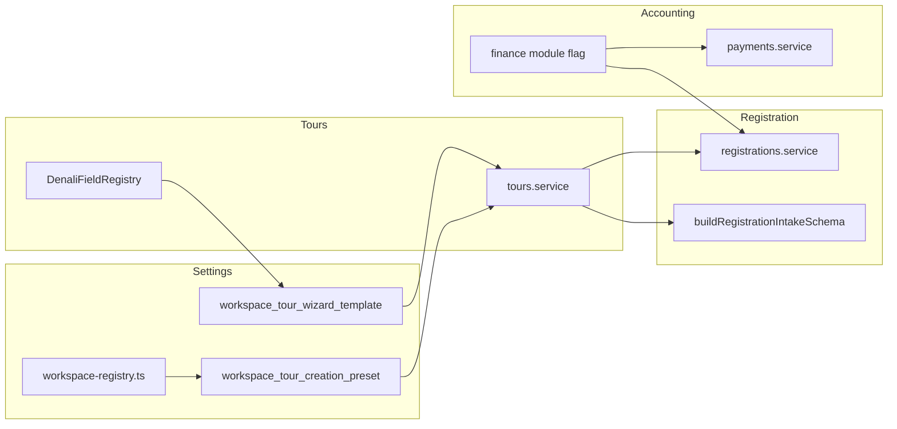
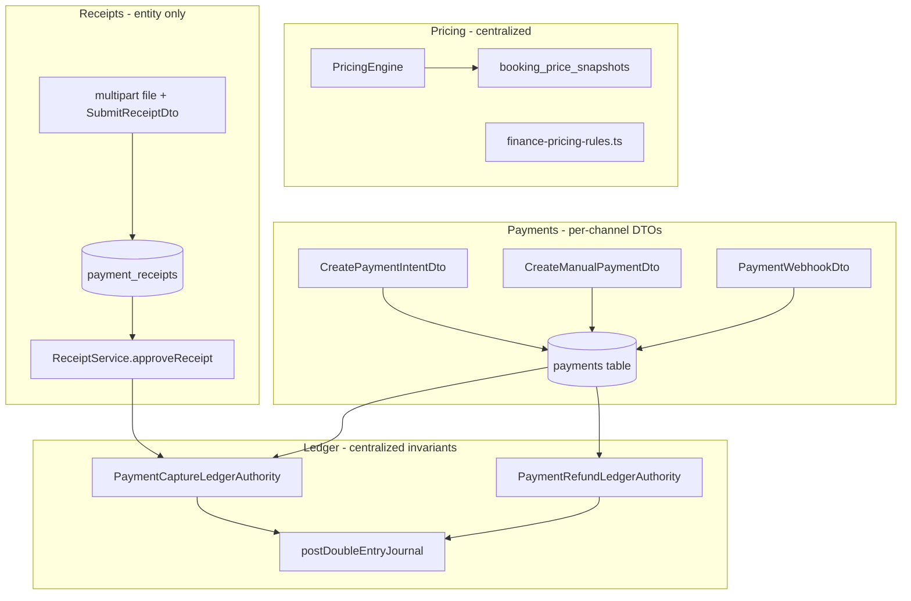
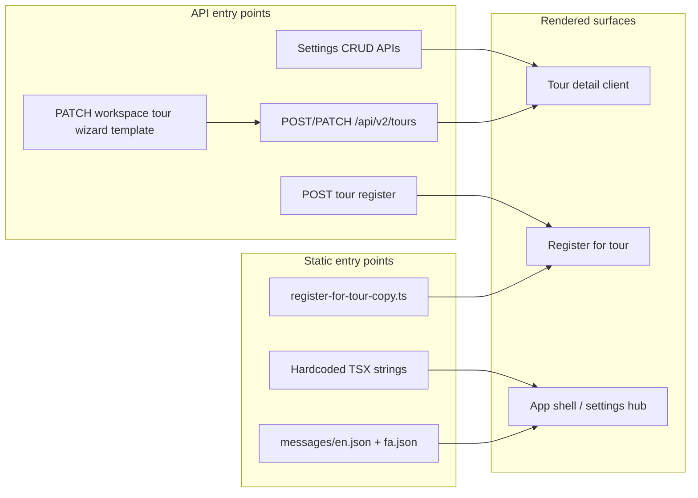

# System Architectural Audit

Audit date: 2026-05-25. Scope: **Settings**, **Accounting** (Finance/Payments), and **Registration** modules — where fields are defined and where workspace/profile branching couples domains.

---

## 1. Settings

### 1.1 Module locations

| Layer | Path |
|-------|------|
| API (Nest) | `apps/api/src/modules/settings-locations/` — module entry `settings-locations.module.ts` |
| Web UI | `apps/web/app/(app)/settings/` — sub-routes: `locations`, `equipment`, `guide-languages`, `tour-themes`, `tour-presets`, `tour-form-defaults`, `tour-wizard-template`, `reconciliation-triage`, `audit-trail` |
| Web clients | `apps/web/lib/settings-*.client.ts` (`settings-equipment`, `settings-guide-languages`, `settings-tour-presets`, `settings-tour-themes`, `settings-tour-wizard-template`) |
| Web hooks | `apps/web/src/hooks/use-settings-*.ts`, `use-tenant-wizard-template.ts` |

### 1.2 Field / data structure definitions

| Concern | Definition style | Primary paths |
|---------|------------------|---------------|
| Workspace catalog rows (destinations, regions, equipment, guide languages, tour themes) | **TypeORM entities** + **class-validator DTOs** | `entities/workspace-*.entity.ts`, `dto/create-*.dto.ts`, `dto/update-*.dto.ts`, `dto/workspace-*-response.dto.ts` |
| Tour creation presets | **Entity** `formProfile` + **JSONB `defaults`** validated per profile | `entities/workspace-tour-creation-preset.entity.ts`, `tour-preset-defaults.schema.ts`, `dto/create-workspace-tour-creation-preset.dto.ts` |
| Tour wizard template (Denali) | **Entity JSONB** + **Zod/registry validation** | `entities/workspace-tour-wizard-template.entity.ts` (`canonicalData`, `fieldRulesOverlay`, `baseProfile`), `denali-canonical-template-data.schema.ts`, `validate-workspace-wizard-template.ts` |
| Preset defaults shape per workspace profile | **Registry-driven Zod** (not hardcoded single schema) | `tour-preset-defaults.schema.ts` → `getTourWorkspaceDefinition()` from `packages/shared-contracts/src/tours/workspace-registry.ts` |
| Denali canonical template top-level keys | **Shared Zod** (`@repo/types/denali`) | `packages/types/src/denali/` (e.g. `validateDenaliCanonicalTemplateData`) |
| Denali wizard field paths (settings template builder UI) | **Generated rule registry** (codegen), not DB | `apps/web/src/features/tours/wizard/denali/registry/DenaliFieldRegistry.ts`, `denaliFieldRegistryData.ts`, `rules/generated/denaliRuleSet.generated.ts`; builder uses `listDenaliRuleFieldPaths()` in `apps/web/app/(app)/settings/tour-wizard-template/tour-wizard-template-builder-form.tsx` |
| Tour form profile enum / descriptors | **Shared types + descriptor table** | `packages/types/src/tour-form-profile.ts`, `packages/types/src/tour-form-profile-descriptors.ts` |
| Workspace → tour profile resolution | **Service function** (DB lookup chain) | `apps/api/src/modules/settings-locations/resolve-workspace-tour-form-profile.ts` |
| Settings UI form profiles | **Hardcoded Zod enums** in panels | `apps/web/app/(app)/settings/tour-themes/tour-theme-form.tsx`, `tour-presets/tour-preset-form.tsx`, `tour-form-defaults/tour-preset-simple-form.tsx` — `z.enum(TOUR_FORM_PROFILE_VALUES)` |
| i18n labels for profiles | **Message keys per profile** | `apps/web/messages/en.json`, `fa.json` — `tourThemesFormProfileOption_*` |

**Registry summary (Settings):** Catalog entities are **interfaces/DTOs + DB**. Denali template overlay paths come from the **Denali field registry (generated)**. Preset `defaults` roots are **registry-backed** via `TOUR_WORKSPACE_DEFINITIONS`. Classic/general presets use a **hardcoded** `classicPresetDefaultsSchema` fallback in `tour-preset-defaults.schema.ts`.

### 1.3 Workspace branching & coupling

| Pattern | Path | Notes |
|---------|------|-------|
| `getTourWorkspaceDefinition(profile)` → different preset root keys | `apps/api/src/modules/settings-locations/tour-preset-defaults.schema.ts` (`parsePresetDefaultsOrThrow`) | Branches workspace vs classic schema |
| `isDenaliFormProfile(formProfile)` ternary / early return | `apps/api/src/modules/settings-locations/tour-creation-presets-settings.service.ts` | Denali presets skip classic defaults validation path |
| Preset vs theme `formProfile` drift checks | `tour-preset-defaults-drift.ts`, `tour-creation-presets-settings.service.ts` | Couples preset row to theme catalog profiles |
| `resolveWorkspaceTourFormProfile` — template `baseProfile` vs preset `formProfile` | `resolve-workspace-tour-form-profile.ts` | Drives tour create/edit across app |
| Web: Denali-only preset UI | `apps/web/app/(app)/settings/tour-presets/tour-preset-list.tsx` — `item.formProfile === "denali_pilot"` | UI branch for active Denali preset |
| Web: template builder tied to Denali rule paths only | `tour-wizard-template-builder-form.ts` + `universal-validator.ts` | Overlay keys must exist in `listDenaliRuleFieldPaths()` |
| API: overlay validation hardcoded enums | `validate-workspace-wizard-template.ts` — `VISIBILITY` / `REQUIREDNESS` sets | Not workspace-specific; coupled to Denali overlay contract |
| Capability gate `module.form_builder` | `settings-regions.controller.ts` (and sibling settings controllers) | Tenant module coupling for settings CRUD |
| Map to tours module | Tours read template via `resolveWorkspaceTourFormProfile` in `tours.service.ts` | Settings data defines tour wizard behavior |

**Coupling risk:** Settings, tour wizard, and publish validation share **`TourFormProfile`** and **Denali registry**; changing a profile requires coordinated edits across `workspace-registry.ts`, preset schema, API services, and web settings panels.

---

## 2. Accounting (Finance & Payments)

There is no top-level `accounting` module; capability is split across **`apps/api/src/modules/finance/`** (ledger, pricing, receipts, reports, reconciliation) and **`apps/api/src/modules/payments/`** (PSP intents, webhooks, manual payments). Web surface: **`apps/web/app/(app)/finance/`** and **`apps/web/lib/finance/`**.

### 2.1 Field / data structure definitions

| Concern | Definition style | Primary paths |
|---------|------------------|---------------|
| Payment row | **TypeORM entity** + enums | `apps/api/src/modules/payments/entities/payment.entity.ts`, `payment-receipt.entity.ts` |
| Payment DTOs / wire | **class-validator DTOs** | `apps/api/src/modules/payments/dto/*.dto.ts` |
| Payment lifecycle / transitions | **Domain TS** (switch on status) | `payments/domain/payment-intent-lifecycle.ts`, `payment-status-transition.ts`; mirror under `finance/payments/domain/` |
| Ledger accounts (synthetic GL ids) | **Hardcoded constants** | `apps/api/src/modules/finance/ledger/ledger-accounts.ts` |
| Ledger journal lines / batches | **Entities + mappers** | `finance/ledger/entities/`, `ledger-journal-line.ts`, `post-double-entry-journal.ts` |
| Pricing engine rules | **Hardcoded rule classes** | `apps/api/src/modules/finance/pricing/finance-pricing-rules.ts`, `pricing-engine.ts`, `pricing-rule.ts` |
| Catalog pricing snapshot | **DTO contract** | `finance/pricing/contracts/catalog-pricing-snapshot.dto.ts` |
| Registration locked pricing | **JSON on registration** + shared type | `packages/types/src/registration.ts` (`LockedBookingPricingDto`); API `registration.entity.ts` pricing columns |
| Finance wire contracts (placeholder) | **Empty export stub** | `packages/shared-contracts/src/finance/index.ts` |
| Web finance access | **Capability helper** (tenant modules) | `apps/web/lib/finance/finance-module-access.ts` |
| Web error mapping | **switch on error.code** | `apps/web/lib/finance/map-finance-to-user-message.ts` |
| Tour cost / requires payment | **DTO** on tour create/patch | `apps/api/src/modules/tours/dto/cost-context.dto.ts` |

**Registry summary (Accounting):** Mostly **hardcoded** domain enums, ledger account strings, and pricing rule classes — not driven by workspace field registry. Tenant enablement uses **`tenantModules` / `module.finance`** capability flags.

### 2.2 Workspace branching & coupling

| Pattern | Path | Notes |
|---------|------|-------|
| `@RequireCapability("module.finance")` on controllers | `finance/reports/finance-reports.controller.ts`, `payments/payments.controller.ts`, `payments/finance-payments.controller.ts`, `registrations/registrations.controller.ts` (finance endpoints) | Entire finance API gated by tenant module |
| Finance module check before online payment intent | `payments/application/payment-intent-registration-resolver.application.service.ts` — `capabilitiesForTenantModules(tenantModules)` | Registration payment path coupled to tenant modules |
| `userHasFinanceModuleCapability` / `tenantModulesIncludeFinance` | `apps/web/lib/finance/finance-module-access.ts` | Web UI hides finance when module off |
| Pricing role/discount switches | `finance/pricing/finance-pricing-rules.ts` — `switch (role)`, `switch (code)` | Workspace staff adjustments (`workspace_role_adjustment`) |
| Tours service finance module probe | `apps/api/src/modules/tours/tours.service.ts` (~line 409) | Create/patch tour payment behavior vs `finance` module |
| Ledger tenant scope | `finance/ledger/ledger-tenant-scope.ts` | Enforces workspace_id on journal lines |
| Settings UI: reconciliation under `/settings` | `apps/web/app/(app)/settings/reconciliation-triage/page.tsx` | UX couples finance ops into Settings nav |
| Registration ↔ payments bridge | `registrations/ports/registration-payment.port.ts`, payment capture ledger services | Booking financial mutations locked via `lock-registration-for-financial-mutation.ts` |

**Coupling risk:** Finance is **module-flag gated**, not **form-profile gated**. Registration and tour `cost_context` assume finance module presence for paid flows; no Denali-style registry for monetary fields.

---

## 3. Registration

### 3.1 Module locations

| Layer | Path |
|-------|------|
| API | `apps/api/src/modules/registrations/` — `registrations.service.ts`, `registrations.controller.ts`, `registrations.module.ts` |
| API domain | `registrations/domain/` — booking transitions, finalization pipeline, booking-status |
| API application | `registrations/application/` — placement orchestrator, quote service |
| Web features | `apps/web/src/features/registrations/` — hooks, booking-target intake |
| Web API routes (BFF) | `apps/web/app/api/registrations/`, `apps/web/app/api/tours/[tourId]/registrations/` |
| Shared types | `packages/types/src/registration.ts` (mirrors OpenAPI) |
| Shared booking status (domain) | `packages/shared-contracts/src/booking/booking-status.schema.ts` (Zod; parallel to API registration status enums) |

### 3.2 Field / data structure definitions

| Concern | Definition style | Primary paths |
|---------|------------------|---------------|
| Persisted registration columns | **TypeORM entity** | `registration.entity.ts`, `waitlist-item.entity.ts` |
| API request/response shapes | **class-validator DTOs** | `dto/create-registration.dto.ts`, `dto/get-registration.dto.ts`, `dto/public-registration-response.dto.ts`, `dto/participant-metadata.dto.ts` |
| Status / payment enums (API) | **Hardcoded enums** in entity + DTO | `RegistrationStatus`, `RegistrationPaymentStatus` in `registration.entity.ts`; DTO enums in `create-registration.dto.ts` |
| Client/shared mirror types | **TypeScript interfaces** | `packages/types/src/registration.ts` |
| Intake form (web) | **Zod schema built from policy object** | `apps/web/src/features/registrations/booking-target/buildRegistrationIntakeSchema.ts` |
| Intake policy shape | **Interface** (tour-derived flags) | `apps/web/src/features/registrations/booking-target/types.ts` — `RegistrationFieldPolicy` |
| Tour registration policy on read model | **Mapper + resolver** | `apps/web/lib/tours/registration-policy.ts`, `apps/web/lib/mappers/tour.mapper.ts` (`registrationPolicy.allowPrivateCar`) |
| Booking domain transitions | **Rules + switch** | `domain/booking-transition-rules.ts`, `domain/assert-valid-booking-transition.ts`, `domain/registration-booking-bridge.ts` |
| Peak Experience placement | **Pure function** on tour/trip metadata | `utils/peak-experience-placement.ts` |
| Transport intake normalization | **Util** | `utils/registration-transport-intake.ts` |
| Policies | **Policy modules** | `policies/registration-integrity.policy.ts`, `policies/waitlist-integrity.policy.ts` |

**Registry summary (Registration):** **No field registry**. Core fields are **entity + DTO + Zod intake**. Dynamic requiredness comes from **`RegistrationFieldPolicy`** populated from **tour `tripDetails.participation`** and **tour transport modes** (BFF), not from `TourFormProfile` directly in the registrations module.

### 3.3 Workspace branching & coupling

| Pattern | Path | Notes |
|---------|------|-------|
| `RegistrationFieldPolicy` driven by tour participation flags | Web: `types.ts`, `buildRegistrationIntakeSchema.ts`; tour detail supplies `nationalIdRequired`, `personalInsuranceRequired`, `requirePeakHistory`, `allowPrivateCar` | Indirect coupling to workspace tour content (tripDetails), not settings CRUD |
| `allowPrivateCar` from transport modes | `apps/web/lib/tours/registration-policy.ts`, `tour.mapper.ts` | Derived from tour payload, not registration module |
| Peak Experience auto-approval | `registrations.service.ts` → `qualifiesForPeakExperienceAutoApproval()` in `peak-experience-placement.ts` | Coupled to tour mountain / peak rules |
| `switch (status)` in booking bridge / outbox | `domain/registration-booking-bridge.ts`, `domain/registration-outbox-event-type.ts` | Lifecycle coupling internal to registration domain |
| Finance module on payment endpoints | `registrations.controller.ts` `@RequireCapability("module.finance")` | Payment PATCH coupled to tenant finance module |
| Workspace query invalidation | `invalidate-workspace-queries.ts` | Tenant-scoped cache keys |
| UI status badges | `registration-status-badges-fa.tsx` — `switch (status)`, `switch (payment)` | Presentation-only branching |
| CRM transport labels | `lib/registrations/format-registration-crm.ts` — `switch (mode)` | Display coupling |

**Coupling risk:** Registration validation is **tour-content coupled** (tripDetails, transport, peak rules) and **finance-module coupled** for payments, but **not** coupled to `TourFormProfile` / Denali registry in the registrations module itself. Tour shape changes (Denali vs classic) affect registration only through normalized tour detail / BFF policy fields.

---

## 4. Cross-module coupling (summary)

| From | To | Mechanism |
|------|-----|-----------|
| Settings template/preset | Tours create/edit | `resolveWorkspaceTourFormProfile`, wizard template JSONB |
| Settings Denali registry | Settings template UI | `listDenaliRuleFieldPaths()` |
| Tours tripDetails | Registration intake | BFF `RegistrationFieldPolicy` |
| Tours cost_context | Accounting | Payment intents / ledger on registration |
| Tenant `module.finance` | Payments + registration payment APIs | CASL / capability checks |
| Tenant `module.form_builder` | Settings CRUD | Capability on settings controllers |

---

## 5. Recommended follow-ups (audit only)

1. **Settings ↔ Tours:** Document single owner for `TourFormProfile` descriptor rows vs `workspace-registry.ts` mappings (known alias: `urban_event` → `DENALI_WORKSPACE` in `packages/shared-contracts/src/tours/workspace-registry.ts`).
2. **Registration:** Consider centralizing `RegistrationFieldPolicy` resolution in API (today split between BFF mapper and tour participation JSON).
3. **Accounting:** `packages/shared-contracts/src/finance/index.ts` is empty — finance DTOs remain duplicated between API entities and `packages/types`.
4. **Publish gates:** Tour PATCH publish policy is lifecycle-transition scoped in `tours.service.ts`; registration/finance unaffected (confirmed separate concern).

---

# Step 2: Workspace Variance

Scan method: repository search for `TourFormProfile` literals, `TOUR_WORKSPACE_DEFINITIONS`, `wizardMode`, `getTourFormProfileDescriptor`, `getTourWorkspaceDefinition`, and profile equality / `switch (profile)` patterns (production `.ts`/`.tsx` only, excluding `*.spec.*` and `dist/`).

## 2.1 Workspace identifiers found in the codebase

### Canonical tour form profiles (`TourFormProfile`)

Authoritative closed set in `packages/types/src/tour-form-profile.ts` → `TOUR_FORM_PROFILE_VALUES`:

| Identifier | In `TOUR_WORKSPACE_DEFINITIONS`? | Notes |
|------------|-----------------------------------|--------|
| `general` | No (classic preset roots only) | Default profile; descriptor row in `tour-form-profile-descriptors.ts` |
| `mountain_outdoor` | No | Classic 9-step wizard; mountain-only tripDetails keys |
| `nature_trip` | Yes → `ARCTIC_WORKSPACE` | `wizardMode: "classic"` in `packages/shared-contracts/src/tours/workspaces/arctic.ts` |
| `urban_event` | Yes → `DENALI_WORKSPACE` (alias) | Shares Denali rail/invariants with `denali_pilot` |
| `cinema_event` | No | Urban-style logistics whitelist in descriptors |
| `cultural_tour` | No | Added to profile enum; descriptor row present |
| `denali_pilot` | Yes → `DENALI_WORKSPACE` | Primary Denali workspace profile |

`TourDomainProfile` in `packages/types/src/tour-domain-profile.ts` is a **type alias** of `TourFormProfile` (same identifiers).

### Workspace definition registry (strategy objects)

`packages/shared-contracts/src/tours/workspace-registry.ts` → `TOUR_WORKSPACE_DEFINITIONS` keys:

- `denali_pilot` → `DENALI_WORKSPACE` (`packages/shared-contracts/src/tours/workspaces/denali.ts`)
- `nature_trip` → `ARCTIC_WORKSPACE` (`packages/shared-contracts/src/tours/workspaces/arctic.ts`)
- `urban_event` → `DENALI_WORKSPACE` (intentional alias — same roots/validation as Denali)

Profiles **not** in the registry use **classic** preset schema fallback (`tour-preset-defaults.schema.ts` → `classicPresetDefaultsSchema`).

### UI rail modes (`TourWizardMode`)

`apps/web/src/features/tours/wizard/isDenaliWizardContext.ts`:

- `classic` — 9-step wizard (`TourCreateWizard`, `TourForm` edit path)
- `denali` — 6-tab Denali wizard (`DenaliCreateTourWizard`, canonical model)

Resolved via `getTourWorkspaceDefinition(profile)?.ui.wizardMode` or explicit `wizardMode` on tenant UI contract.

### Legacy / collateral identifiers (not `TourFormProfile`)

| Identifier | Where | Meaning |
|------------|--------|---------|
| `"classic"` | DB default on `workspace_tour_creation_presets.form_profile` column comment/default in `workspace-tour-creation-preset.entity.ts` | Legacy string; normalized to `general` at runtime via `normalizeTourFormProfileInput` |
| `"denali"` | Tenant provision scripts (`apps/api/src/scripts/provision-denali-tenant.ts`), subdomain docs | **Tenant slug / product name**, not a form profile slug |
| `DENALI_ROOTS` | `packages/shared-contracts` denali wizard contract | Canonical JSON root keys for Denali payloads |
| `WORKSPACE_RULE_*` | `denali-invariants.ts`, `arctic.ts` | API error codes for workspace validation strategies |
| `EventKind` | `tour-domain-profile-bridge.ts` (`mountain`, `city_tour`, `workshop`, `generic`, …) | Legacy edit UI axis; projected from profile |

### Tenant capability modules (orthogonal to tour profile)

Enabled per tenant (not per `TourFormProfile`): `module.finance`, `module.form_builder` — see `packages/shared/rbac/capabilities.ts`, `finance-module-access.ts`, settings controllers.

### Demo / provision tenant slugs (environment fixtures)

Referenced in tests and scripts (not profile enums): `denali`, `ws1-rbac`, `urban-demo`, `mix-demo` — `apps/api/src/scripts/mix-demo-tenant.fixture.ts`, integration helpers under `apps/web/tests/integration/`.

---

## 2.2 Core modules vs workspace-specific modules

### Core (shared by all workspaces / tenants)

Behavior does **not** branch on `TourFormProfile` or `wizardMode` for its primary contract:

| Area | Paths | Shared concern |
|------|--------|----------------|
| **Registration** | `apps/api/src/modules/registrations/`, `apps/web/src/features/registrations/` | Booking status, capacity, transport intake; policy from tour `tripDetails`, not profile registry |
| **Accounting / Finance** | `apps/api/src/modules/finance/`, `apps/api/src/modules/payments/` | Ledger, pricing engine, receipts; gated by `module.finance` tenant module |
| **Identity & RBAC** | `apps/api/src/common/casl/`, `packages/shared/rbac/` | Roles, capabilities (`ability.factory.ts` branches on **workspace role**, not tour profile) |
| **Settings catalog CRUD** | `apps/api/src/modules/settings-locations/` (destinations, regions, equipment, guide languages, themes) | Tenant-scoped rows; `formProfile` is metadata on themes/presets, not a separate codepath per catalog entity |
| **Tours — lifecycle & inventory** | `apps/api/src/modules/tours/tours.service.ts` (capacity, lifecycle transitions, locking) | Same PATCH/CREATE envelope; profile affects strip/validate hooks (see hybrid below) |
| **Registrations ↔ Payments bridge** | `registrations/ports/registration-payment.port.ts`, payment capture ledger | Same for all tours with finance module |
| **Shared registration types** | `packages/types/src/registration.ts` | API-agnostic DTO mirror |

### Workspace-specific (profile- or rail-dependent)

| Area | Paths | Variance driver |
|------|--------|-----------------|
| **Denali wizard (web)** | `apps/web/src/features/tours/wizard/denali/**` | Entire tree: registry, rules codegen, canonical adapter, steps, validation |
| **Denali workspace contract (shared)** | `packages/shared-contracts/src/tours/workspaces/denali.ts`, `denali-invariants.ts`, `denali-wizard.contract` | Capacity/tripDetails/publish geo rules |
| **Arctic workspace contract** | `packages/shared-contracts/src/tours/workspaces/arctic.ts` | `nature_trip` min-capacity rule |
| **Workspace registry** | `packages/shared-contracts/src/tours/workspace-registry.ts` | Maps profile → strategy |
| **Profile descriptor table** | `packages/types/src/tour-form-profile-descriptors.ts` | Per-profile strip/inactive groups/invariant hints |
| **Classic wizard + profile rules** | `apps/web/src/features/tours/wizard/profileRules/`, `TourCreateWizard.tsx`, `TourForm.tsx` | `BASE_FIELD_RULES` + descriptor-driven visibility |
| **API profile strip & invariants** | `apps/api/src/modules/tours/utils/create-tour-form-profile-strip.ts`, `assert-create-tour-invariants.ts`, `assert-profile-required-fields-for-submit.ts` | Strip roots/keys per `getTourFormProfileDescriptor` |
| **Preset defaults validation** | `apps/api/src/modules/settings-locations/tour-preset-defaults.schema.ts` | `getTourWorkspaceDefinition` vs classic schema |
| **Tour wizard template (settings)** | `apps/web/app/(app)/settings/tour-wizard-template/`, `validate-workspace-wizard-template.ts` | Denali overlay + canonical JSON only |
| **Publish transition (Denali geo)** | `apps/api/src/modules/tours/policies/assert-tour-publish-transition.ts` | `profile === "denali_pilot"` → geolocation zone check |
| **Create-tour rail selection** | `apps/web/app/(app)/tours/new/tour-create-wizard-wrapper.tsx`, `isDenaliWizardContext.ts` | Chooses `DenaliCreateTourWizard` vs classic |

### Hybrid (core module with workspace hooks)

| Module | Core surface | Workspace hook |
|--------|--------------|----------------|
| **Tours** | CRUD, departures, drafts | `resolveWorkspaceTourFormProfile`, strip, publish gates, `assertTripDetailsForFormProfile` |
| **Settings — presets** | CRUD | `isDenaliFormProfile()` branch in `tour-creation-presets-settings.service.ts` |
| **Settings — themes** | CRUD | `formProfile` column per theme row |
| **Web trip details matrix** | `tripDetailsFieldConfig.ts` | `getTourFormProfileDescriptor` + `eventKindForDomainProfile` |

---

## 2.3 Top 5 files most coupled to workspace / profile logic

Ranked by density of profile/workspace branch patterns in **production** source (approximate match count from audit scan). Spec/test files excluded.

| Rank | File | ~Matches | Why it is coupled |
|------|------|----------|-------------------|
| 1 | `packages/types/src/tour-form-profile-descriptors.ts` | 35 | **Single declarative table** — one object per profile (`general`, `mountain_outdoor`, `urban_event`, `denali_pilot`, …) defining inactive wizard groups, strip deltas, invariant hints, edit overrides |
| 2 | `apps/web/src/features/tours/wizard/denali/denaliThemeFilter.ts` | 22 | Filters workspace theme catalog by **profile category** (`mountain_outdoor`, `denali_pilot`, `general`, etc.) |
| 3 | `apps/api/src/modules/tours/utils/assert-create-tour-invariants.ts` | 14 | Repeated `getTourFormProfileDescriptor(profile)` strip paths; workspace `assertTripDetailsForFormProfile` / `getTourWorkspaceDefinition` validation |
| 4 | `apps/web/src/features/tours/wizard/isDenaliWizardContext.ts` | 12 | **Rail resolver** — `wizardMode`, `getTourWorkspaceDefinition`, `isDenaliPilotFormProfile`, `resolveTourWizardMode` |
| 5 | `apps/web/src/components/tours/TourForm.tsx` | 12 | Classic **edit** shell branches on resolved profile / `eventKindForDomainProfile` for trip-details field matrix |

**Runners-up (also high coupling):** `apps/api/src/modules/tours/utils/create-tour-form-profile-strip.ts` (9), `apps/web/src/features/tours/wizard/fieldGroups.ts` (10), `packages/types/src/tour-domain-profile-bridge.ts` (10, explicit `switch (profile)` for `EventKind`), `apps/web/src/features/tours/config/tripDetailsFieldConfig.ts` (8).

### Interpretation

- **Centralization progress:** Many former `switch (profile)` chains were consolidated into `TOUR_FORM_PROFILE_DESCRIPTORS` (see file header comment in `tour-form-profile-descriptors.ts`). Remaining hot spots are **Denali-specific** (`denali/**`, `denali-invariants.ts`) and **rail selection** (`isDenaliWizardContext.ts`).
- **Alias risk:** `urban_event` and `denali_pilot` share `DENALI_WORKSPACE` — changes to Denali invariants affect both identifiers.
- **Non-profile variance:** Finance and registration primarily use **tenant module flags**, not `TourFormProfile`; do not conflate with workspace tour profiles in refactors.

---

# Step 3: Financial/Accounting Contracts

Scope: `apps/api/src/modules/finance/`, `apps/api/src/modules/payments/`, `apps/api/src/modules/pricing/` (booking quotes), `apps/web/lib/finance/`, `apps/web/lib/services/payments.service.ts`, `packages/shared-contracts/src/finance/`.

## 3.1 Unified schemas vs per-surface definitions

### Is there a unified `Transaction` model?

**No.** The codebase does not define a shared `Transaction` interface or Zod schema. Money movement is split across aggregates:

| Concept | Definition style | Primary paths |
|---------|------------------|---------------|
| **Payment (persisted)** | TypeORM entity + Nest DTOs + OpenAPI | `apps/api/src/modules/payments/entities/payment.entity.ts`, `dto/payment-response.dto.ts`, `dto/create-payment-intent.dto.ts`, `dto/create-manual-payment.dto.ts` |
| **Ledger journal line** | TypeScript type (in-memory / persistence mapper) | `apps/api/src/modules/finance/ledger/ledger-journal-line.ts`, `ledger/entities/ledger-journal-line.entity.ts` |
| **Pricing line item** | TS types (quote engine) | `apps/api/src/modules/pricing/pricing.types.ts`, `finance/pricing/pricing-quote.ts` |
| **Booking price snapshot** | Entity (immutable at booking) | `apps/api/src/modules/pricing/entities/booking-price-snapshot.entity.ts` |
| **Reconciliation finding** | Entity + report types | `finance/reconciliation/entities/`, `payment-reconciliation-report.ts` |
| **Idempotency “transaction”** | HTTP/idempotency scope only | `apps/api/src/modules/idempotency/idempotent-transaction.context.ts` (not a financial transaction) |

`packages/shared-contracts/src/finance/index.ts` is an **empty stub** (`export {}`) with a TODO to centralize currency/minor-unit wire contracts — **not implemented**.

### Is there a unified `Receipt` model?

**Partially, entity-only on API; no shared Zod; no OpenAPI response schema.**

| Layer | Receipt contract | Path |
|-------|------------------|------|
| Persistence | `PaymentReceiptEntity`, `ReceiptStatus` enum (`Pending` / `Approved` / `Rejected`) | `apps/api/src/modules/payments/entities/payment-receipt.entity.ts` |
| Upload body | `SubmitReceiptDto` — optional `note` only; **file is multipart**, not in DTO | `apps/api/src/modules/payments/dto/submit-receipt.dto.ts` |
| HTTP responses | Controllers return **`PaymentReceiptEntity` directly** (serialized by Nest), not a dedicated `ReceiptResponseDto` | `finance/receipts/receipt.service.ts`, `payments/finance-payments.controller.ts` |
| OpenAPI | `SubmitReceiptDto` documented; **no `PaymentReceiptResponseDto`** in `apps/api/openapi.json` component schemas | Paths under `/api/v2/finance/payments/{id}/receipt`, `/api/v2/admin/finance/receipts/*` |
| Web client | Loose TS `PaymentReceiptRow` (hand-maintained fields) | `apps/web/lib/services/payments.service.ts` |
| Web validation | **No Zod** under `apps/web/lib/finance/` or finance routes | — |

### Per-method / per-channel formats (not one wire shape)

Financial payloads are **defined per flow**, not normalized through a single schema:

| Flow | Input contract | Output / side effects |
|------|----------------|----------------------|
| **Online PSP intent** | `CreatePaymentIntentDto` + gateway `CreatePaymentIntentGatewayInput` | `PaymentResponseDto`; provider fields (`clientSecret`, `checkoutUrl`) optional |
| **PSP webhook** | `PaymentWebhookDto` | Processed in `payments.service.ts` / webhook controller |
| **Manual debt** | `CreateManualPaymentDto` (`registrationId`, `amount`, `currency`) | `PaymentEntity` with `method: Manual`, `status: Pending` |
| **Cash/offline receipt upload** | Multipart file + `SubmitReceiptDto` | `PaymentReceiptEntity` → on approve: `Payment` → `Paid`, ledger capture, registration `Paid` |
| **Admin refund** | `RefundPaymentDto` (optional `reason`) + idempotency header | `PaymentResponseDto`; ledger reversal via `PaymentRefundLedgerAuthorityService` |
| **Leader PATCH paid amount** | `UpdateRegistrationPaymentDto` | Ledger via `BookingLedgerAuthorityService` / leader contracts |
| **Finance reports** | Query params only | `FinanceLedgerEventRow`, summary DTOs in `finance/reports/` |

**Gateway-specific rules** are embedded in adapters, not shared schemas:

- `apps/api/src/modules/payments/gateway/zibal-payment-gateway.ts` — **IRR-only** currency check
- `stripe-payment-gateway.ts`, `mock-payment-gateway.ts` — separate status mapping `switch`es
- Parallel **finance** gateway port: `finance/payments/gateways/payment-gateway.interface.ts` with `PaymentResult`, `RefundRequest`, `RefundResult` (PSP-agnostic **types**, separate from persisted `payments` enums)

### Zod usage in Finance/Accounting

| Area | Zod? |
|------|------|
| API finance/payments modules | **No** — validation via `class-validator` on DTOs only |
| Web finance UI | **No** |
| Shared packages | **No** finance Zod; booking status only in `packages/shared-contracts/src/booking/booking-status.schema.ts` |
| Registration money mirror | TS interfaces in `packages/types/src/registration.ts` (`LockedBookingPricingDto`, `paymentStatus`) — mirrors OpenAPI, not Zod |

### Duplicate payment domain models (contract drift risk)

Two **incompatible** `PaymentStatus` enums coexist:

| Module | Enum values | Used by |
|--------|-------------|---------|
| `payments/entities/payment.entity.ts` | `Pending`, `Paid`, `Failed`, `Refunded`, `Cancelled` | **Production** controllers, receipts, refunds, web `PaymentIntentResponse` |
| `finance/payments/domain/payment-status.ts` | `initiated`, `pending`, `authorized`, `captured`, `failed`, `refunded` | **Finance** `payment-transition-rules.ts`, fake gateway tests — aspirational domain layer |

Persisted DB payments follow the **uppercase Nest enum**; the finance folder’s lowercase lifecycle is **not** the source of truth for API responses today.

---

## 3.2 Where “Financial Policy” lives

Policy is **mixed**: pricing and ledger invariants are relatively centralized; payment/receipt/refund rules are **scattered** across small `*.policy.ts` files and services.

### Relatively centralized

| Policy domain | Location | What it governs |
|---------------|----------|-----------------|
| **Quote / list price / discounts** | `finance/pricing/pricing-engine.ts`, `finance/pricing/finance-pricing-rules.ts`, `pricing/discounts/evaluate-discount-eligibility.ts` | Staged rules: tenant → catalog → role (`switch` on `WorkspaceRole`) → promo (`switch` on code e.g. `PCT10`, `SAVE5000`); `assertSingleCurrency` |
| **Immutable booking snapshot** | `finance/ledger/discount-adjustment-ledger.policy.ts`, `pricing` snapshot entity | No post-booking snapshot mutation; offsets via `DISCOUNT_ADJUSTMENTS_ACCOUNT` |
| **Double-entry integrity** | `finance/ledger/post-double-entry-journal.ts`, `clearing-account-zero-sum.ts` | Balanced journals; per-currency clearing net zero |
| **Minor units / amount shape** | `finance/ledger/payment-amount-to-ledger-minor.ts`, `payments/domain/assert-payment-intent-matches-booking-snapshot.ts` | Positive integer minor strings; currency must match snapshot |
| **Synthetic GL accounts** | `finance/ledger/ledger-accounts.ts` | Hardcoded account ids (clearing, discount adjustments, booking wallets) |

### Scattered (per concern / per channel)

| Policy | Location | Notes |
|--------|----------|-------|
| **Manual debt allowed** | `payments/domain/manual-payment-debt.policy.ts` | Blocks second debt if `Paid` or `Pending` exists |
| **Receipt one pending per payment** | `finance/receipts/receipt-pending.policy.ts` | `assertNoPendingReceiptForPayment` |
| **Who may upload receipt** | `finance/receipts/receipt-upload-authorization.ts` | Admin/owner or phone match |
| **Payment status transitions (persisted)** | `payments/domain/payment-status-transition.ts`, `payment-intent-lifecycle.ts` | Maps entity status ↔ intent lifecycle; `switch` for outbox event type |
| **Payment transitions (finance domain)** | `finance/payments/domain/payment-transition-rules.ts`, `assert-valid-payment-transition.ts` | Separate graph on lowercase statuses — not wired to main `PaymentEntity` path |
| **Registration payment status** | `registrations/registrations-policy.ts` → `validatePaymentTransition` | Couples registration status + payment_status to booking machine |
| **Refund orchestration** | `payments/payments.service.ts` (`refundPayment`), `finance/ledger/payment-refund-ledger-authority.service.ts` | PSP refund + ledger reversal + registration reconcile |
| **Capture on paid** | `finance/ledger/payment-capture-ledger-authority.service.ts` | Sources: `manual_receipt_approve` \| `online_webhook_paid` |
| **PSP currency** | `payments/gateway/zibal-payment-gateway.ts` | IRR-only enforcement |
| **Finance module gate** | `payments/application/payment-intent-registration-resolver.application.service.ts`, `@RequireCapability("module.finance")` on controllers | Tenant module, not tour profile |
| **Reconciliation mismatch** | `finance/reconciliation/detect-payment-mismatch.ts`, `reconciliation-mismatch.ts` | PSP vs ledger vs snapshot deltas (per-currency minor) |
| **Web display / errors** | `apps/web/lib/finance/format-finance-display.ts` (default `IRR`), `map-finance-to-user-message.ts` (`switch` on error.code) | Presentation only |

### Tax calculation

**No dedicated tax/VAT policy module** was found under `finance/` or `payments/`. Commercial “tax-like” behavior is limited to:

- **Discount / promo** rules in `finance-pricing-rules.ts` (percentage/fixed minor off base)
- Tour copy field `refundPolicy` in Denali canonical model (`packages/types/src/denali/`) — **marketing text**, not computed tax

### Currency handling

| Mechanism | Path |
|-----------|------|
| Single currency per quote | `assertSingleCurrency` in `finance-pricing-rules.ts` |
| Payment ↔ snapshot parity | `assert-payment-intent-matches-booking-snapshot.ts` |
| Ledger lines carry `currency` | `LedgerJournalLine`, `account_balances` per currency |
| PSP adapter constraints | Zibal → IRR; others vary by gateway |
| UI default | `format-finance-display.ts` falls back to `IRR` |

### Refund rules (summary)

Refunds are **procedure + state machine**, not a standalone policy file:

1. Admin `POST .../admin/payments/:id/refund` with idempotency key (`payments.controller.ts`)
2. `assertAllowedPaymentStatusTransition` toward `Refunded` (`payment-status-transition.ts`)
3. Optional PSP `RefundRequest` / `RefundResult` (`finance/payments/gateways/payment-result.ts`)
4. Ledger reversal journal (`payment-refund-ledger-authority.service.ts`, `post-double-entry-reversal-journal.ts`)
5. Registration payment status updates via existing registration payment port

Partial refunds are modeled at the **gateway adapter** layer (`amountMinor?` on `RefundRequest`); product rules for partial vs full are adapter-defined comments, not a central policy table.

---

## 3.3 Architecture diagram (money paths)

---

## 3.4 Step 3 conclusions

1. **No unified Transaction or Receipt Zod/contract package** — `packages/shared-contracts/src/finance` is empty; receipts lack a first-class response DTO in OpenAPI.
2. **Formats are per-method** (intent vs manual vs webhook vs multipart receipt vs refund) with **class-validator DTOs** on API and **loose TS** on web.
3. **Financial policy is split**: pricing/ledger rules are **centralized** in `finance/pricing` and `finance/ledger`; payment/receipt/refund authorization and transitions are **scattered** across `payments/domain`, `finance/receipts`, and `payments.service.ts`.
4. **Dual `PaymentStatus` models** in `payments` vs `finance/payments/domain` are a maintainability hazard — production path uses the Nest/TypeORM enum only.
5. **No tax engine**; currency rules are snapshot + ledger + adapter-specific (IRR for Zibal).

---

# Step 4: Landing/Content Dynamics

Scope: public/marketing surfaces, “home” routes, traveler-facing copy, and how content varies by workspace (tenant subdomain). Searched `apps/web/app/`, `apps/web/messages/`, `apps/api/src/modules/` for `landing`, `about`, `cms`, `page_content`, and related patterns.

## 4.1 Finding: no dedicated “Landing Page” or “About Us” product routes

The repository **does not implement** standalone marketing routes such as `/landing`, `/about`, or `/about-us`. There is **no CMS module**, **no page-content API**, and **no content registry** for site-wide marketing pages on the API (`grep` across `apps/api/src` for `page_content`, `cms`, `landing`, `about` → no matches).

What exists instead falls into three buckets: **dev shell home**, **in-app “landing” helpers**, and **per-tour public copy from the Tours API**.

| User-facing concept | Implemented? | Actual route / artifact |
|---------------------|--------------|-------------------------|
| Marketing **landing page** (workspace home for visitors) | **No** | Root `/` is a developer link hub, not marketing |
| **About Us** page | **No** | No route; only incidental “About:” label on tour description in `TourCard.tsx` |
| **New booking landing** (internal) | **Yes** | `/bookings/new` → `NewBookingLanding` |
| **Tour detail / “public tour page”** (product language) | **Partial** | `/tours/[id]` — authenticated app chrome; content from `GET` tour API |
| **Register for tour** (traveler funnel) | **Yes** | `/tours/[id]/register` — form UI + API registration |
| **Apex marketing site** (docs only) | **Planned / external** | `docs/multi-tenant-subdomain.md` mentions apex `app.example.com` for marketing or redirects — **not implemented in `apps/web`** |

---

## 4.2 Implementation style: hardcoded vs registry/API-driven

### Hardcoded (static in source)

| Surface | Mechanism | Paths |
|---------|-----------|--------|
| Root **home** | Inline English strings + link list in TSX; only **metadata** from i18n | `apps/web/app/page.tsx`, `messages/*/metadata.home` |
| **New booking landing** | English copy in component (`<ol>`, buttons); breadcrumbs hardcoded | `apps/web/app/(app)/bookings/new-booking-landing.tsx` |
| **Register-for-tour** wizard | Large **hardcoded Persian** const object (not `next-intl`) | `apps/web/app/(app)/tours/[id]/register/register-for-tour-copy.ts` |
| **Auth** (login/register) | `next-intl` keys under `auth.*` + Zod forms | `apps/web/app/auth/login/login-form.tsx`, `messages/en.json` / `fa.json` |
| **Workspace not found** | i18n + minimal inline layout | `apps/web/app/workspace-not-found/page.tsx`, `auth.workspaceNotFound` |
| **App chrome brand** | Global string `auth.common.shellBrand` → “Tour Ops” | `messages/en.json` (same for all tenants) |
| **Settings hub blurbs** | i18n only; same strings for every workspace | `apps/web/app/(app)/settings/settings-page-client.tsx`, `settings.hub*Blurb` / `*PanelIntro` |

### API-driven (dynamic content)

| Surface | Data source | Notes |
|---------|-------------|--------|
| **Tour detail page** | `GET /api/v2/tours/:id` (via BFF) | `title`, `description`, `tripDetails`, themes, equipment refs, pricing context — **tenant-scoped tour row** |
| **Tours list / cards** | Tours list API | Marketing teaser often `tripDetails.overview.shortIntro` (tour payload, not a separate CMS) |
| **Registration policy** | Tour DTO + BFF merge | `registrationPolicy`, participation flags from `tripDetails` |
| **Workspace catalogs** (indirect) | Settings APIs | Destinations, themes, equipment, guide languages — referenced on tour pages, not on a global landing |

### Registry-driven?

**Not for landing/about content.** The only “registry” adjacent to content is the **Denali field registry** (`DenaliFieldRegistry`) for **tour wizard forms**, not public marketing pages. Workspace **tour wizard template** (`workspace_tour_wizard_templates`) drives create/edit forms, not public site layout.

---

## 4.3 Content per workspace (variance model)

### What varies by workspace today

| Dimension | How variance works | Registry/API? |
|-----------|-------------------|---------------|
| **Tenant isolation** | Subdomain → `TenantContext` (`tenantSlug`, optional `tenantId`) | `apps/web/lib/tenant/runtime-tenant-context.ts`, `assert-workspace-request.ts` |
| **Tour marketing copy** | Each tour’s `description` + `tripDetails` JSONB | Tours API per `tenantId` |
| **Catalog labels** | Per-tenant settings rows (themes, destinations, …) | `settings-locations` CRUD APIs |
| **Wizard behavior** | `workspace_tour_wizard_templates.base_profile` + overlays | Settings template API (see Step 1) |
| **UI module gates** | `tenantModules` (e.g. `finance`, `form_builder`) | Auth/session context — not page copy |

### What does **not** vary per workspace today

| Dimension | Current behavior |
|-----------|------------------|
| **Global i18n messages** | Single locale bundle (`fa` default); **not** per-tenant message overrides |
| **Layout / template** | Same `AppLayout`, `RegisteredWorkspacePage`, `@tour/ui` shell for all workspaces |
| **Landing / About copy** | N/A — pages do not exist |
| **Brand name in shell** | Static “Tour Ops” via translations, not loaded from tenant record |
| **Home page body** | Same hardcoded dev hub on every subdomain’s `/` |

There is **no** branching such as `if (tenantSlug === 'denali') render DenaliLandingTemplate` for public marketing pages. Workspace-specific behavior is **data-driven through tours and settings**, not **alternate page components or layout registries**.

---

## 4.4 Data entry points for content

| Content type | How operators/authors enter it | Storage |
|--------------|------------------------------|---------|
| Tour long description | Tour create/edit wizard or PATCH | `tours.description` |
| Short intro / overview | Wizard `tripDetails.overview` | Tour `details` JSONB |
| Policies (refund, participation, …) | Wizard / presets / template defaults | `tripDetails` + preset JSON |
| Theme / destination names | Settings UI | `workspace_*` catalog tables |
| Equipment checklist labels | Settings → equipment | `workspace_equipment_items` |
| Denali wizard field visibility | Settings → tour wizard template builder | `workspace_tour_wizard_templates` JSONB |
| App UI labels (buttons, errors) | Edit `apps/web/messages/*.json` | Git — deploy-time |
| Registration form labels (FA) | Edit `register-for-tour-copy.ts` | Git — deploy-time |
| Login/marketing metadata titles | Edit `messages` `metadata.*` | Git — deploy-time |

**No** admin UI or API exists for: workspace-specific About text, hero landing sections, footer links, or legal pages.

---

## 4.5 Route inventory (web) relevant to “landing / content”

| Path | Role | Content source |
|------|------|----------------|
| `/` | Dev-oriented home | Hardcoded TSX + `metadata.home` |
| `/workspace-not-found` | Invalid host | i18n `auth.workspaceNotFound` |
| `/login`, `/auth/login`, `/auth/register` | Auth funnel | i18n + forms |
| `/dashboard` | Post-login hub | i18n metadata; dashboard client loads **API** summaries |
| `/tours`, `/tours/[id]` | Catalog + detail | **API** tours |
| `/tours/[id]/register` | Traveler registration | **API** tour + hardcoded `REGISTER_FOR_TOUR_COPY` + i18n elsewhere |
| `/bookings/new` | “New registration” explainer | **Hardcoded** `NewBookingLanding` |
| `/settings/*` | Workspace configuration | i18n hub copy + **API** settings entities |

Public anonymous marketing read of tours is flagged as **TODO** in product docs (`docs/10-product/frontend_readiness_tasks.md` — confirm public `GET` tour for marketing); current `TourDetailClient` expects authenticated session when live API is enabled.

---

## 4.6 Step 4 conclusions

1. **Landing Page** and **About Us** as product pages are **not present**; do not assume registry- or API-backed implementations without adding new routes/modules.
2. Most “dynamic” customer-facing copy is **tour-record marketing fields** (`description`, `tripDetails`), entered via the tour wizard, not a site CMS.
3. **Workspace variance** for content = **tenant data isolation** (tours + catalogs), **not** per-tenant page templates or message packs.
4. **Static entry points dominate** shell UX: `messages/*.json`, hardcoded TSX (`page.tsx`, `new-booking-landing.tsx`), and `register-for-tour-copy.ts`.
5. **Future gap:** apex marketing site and anonymous tour marketing endpoints are documented as infrastructure/product TODOs, not implemented in the current web app tree.
