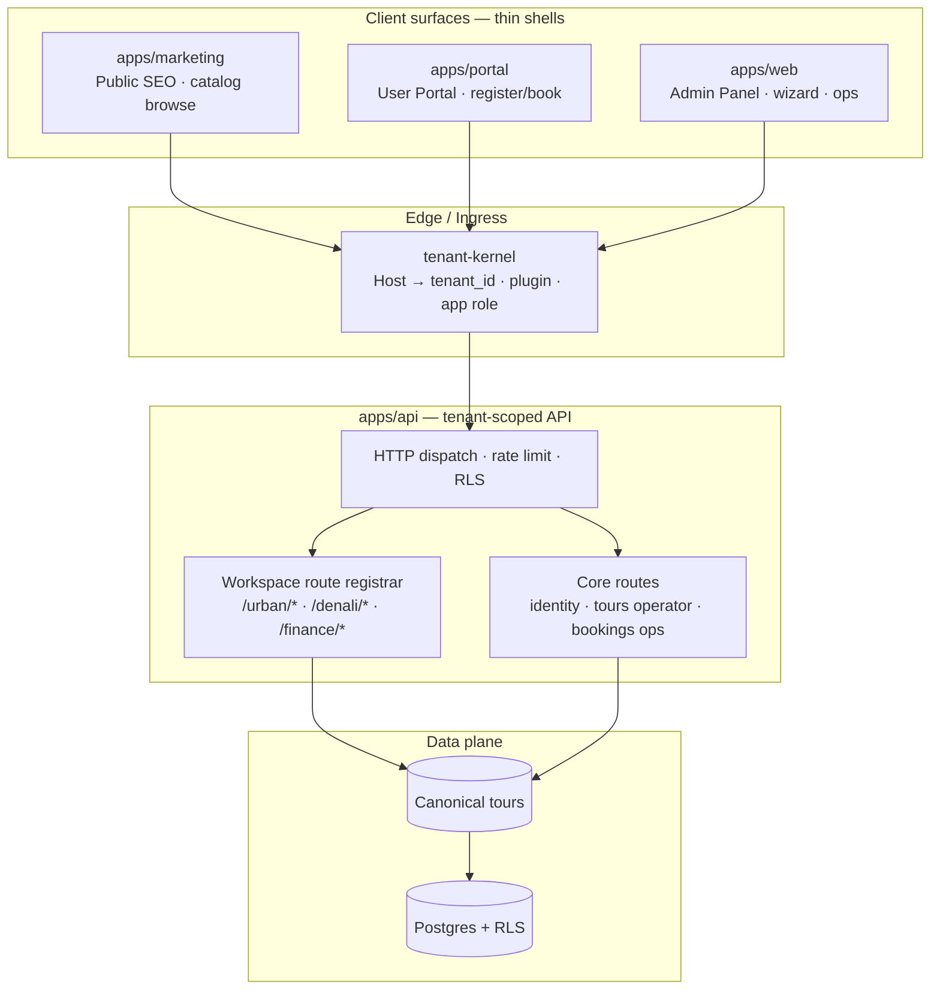
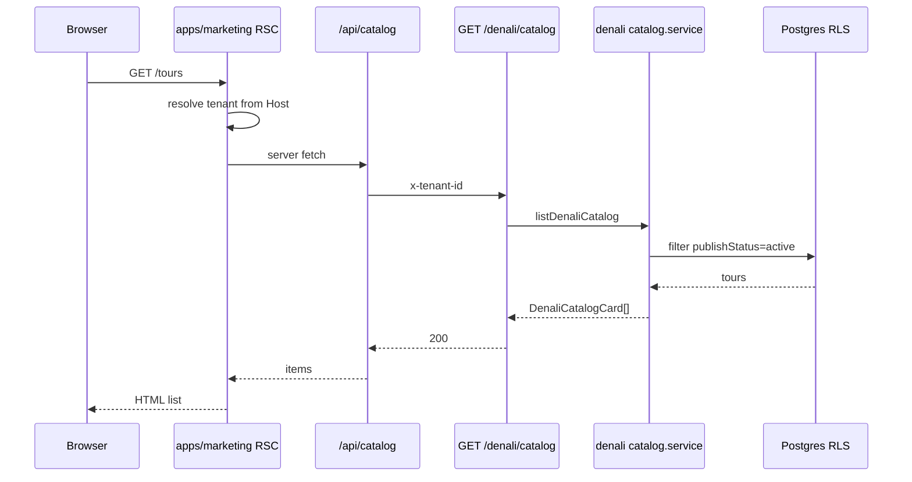

# Denali Public Marketing App — Architecture & Phased Roadmap

```yaml
status: DRAFT
version: "2026-06-11-v1"
scope: apps/marketing (new) · Denali public catalog (list-only MVP)
authority: docs/MIGRATION-MAP.md §1 · §3.5–3.6 · packages/workspaces/denali
parallel_work:
  - Admin wizard (Phase 11) — publishStatus on review step
  - apps/web (app)/ — operator admin panel (Phase 9)
industry_refs:
  - Vercel Multi-Tenant Platforms (tenant @ edge, single deploy / multi-domain)
  - Headless commerce BFF (Next.js RSC + shaped catalog DTO, ISR)
  - Tour-operator SaaS (booking engine API decoupled from office/admin UI)
  - MAP app-tour three-app model (Marketing · User-Portal · Admin-Panel)
```

> **هدف این سند:** درک درست وضعیت trunk، طراحی enterprise-grade برای اپ **Public/Marketing** جدا از User Portal و Admin، و فازبندی اجرایی تا **فاز اول فقط لیست تورهای منتشرشده Denali** را نشان دهد.

---

## ۱. درک محصول Denali (workspace)

Denali اولین **WorkspacePlugin محصول** روی پلتفرم است — تور کوهنوردی / outdoor ops با ۵۹ فیلد canonical، ویزارد چندمرحله‌ای، finance، bookings ops، و settings. منطق محصول **فقط** در `packages/workspaces/denali` زندگی می‌کند؛ shell و API generic آن را bootstrap می‌کنند.

| بعد | Urban (مرجع Phase 8) | Denali (محصول فعلی) |
| --- | --- | --- |
| مدل کسب‌وکار | رویداد شهری، کاتالوگ ساده | تور کوهنوردی، لجستیک، مالی |
| فیلدها | ۱۲ مسیر `tour.*` | ۵۹ مسیر canonical (مثلاً `program.*`, `pricing.*`) |
| انتشار عمومی | `publishStatus: published` | `publishStatus: active` (review step) |
| Public API | `GET /urban/catalog` ✅ | **ندارد** ❌ |
| Public web | `(public)/catalog` در `apps/web` (Urban) | **ندارد** ❌ |
| Manifest HTTP | `prefix: /urban` | `prefix: /finance` فقط (بدون catalog) |
| لیست اپراتور | — | `GET /tours?view=operator` + `extractDenaliTourListProjection` |

**نتیجه:** Denali برای **ادمین** آماده است (ویزارد، لیست اپراتور، bookings command center). سطح **عمومی/بازاریابی** هنوز طراحی و پیاده نشده — عمداً در Phase 9 به Phase 10/Marketing موکول شده است.

### تفاوت مفهومی «لیست تور» در Denali vs Urban

Urban کارت کاتالوگ = `city`, `venueName`, `catalogSummary` — مناسب event شهری.

Denali کارت عمومی باید از canonical بیرون بیاید و سیگنال‌های outdoor بدهد، مثلاً:

- `title`, `program.shortDescription`
- `startDateTime` / `endDateTime`
- `pricing.basePricePerPerson` (+ currency)
- `category` (نوع تور)
- `program.difficultyLevel`, `participants.fitnessLevel`
- `coverImageUrl` از `photos`
- `capacityMax` (و بعداً `spotsRemaining` از booking index)

این **Operator TourListProjection** نیست — آن شامل draftها، وضعیت داخلی، و فیلدهای ops است. برای public باید **DTO جدا** (`DenaliCatalogCard`) با فیلتر `publishStatus === "active"` تعریف شود.

---

## ۲. وضعیت trunk امروز

```text
┌─────────────────────────────────────────────────────────────────────────┐
│ apps/web (یک shell)                                                      │
│   (app)/*     → Admin Panel · owner-only middleware · Denali ops      │
│   tours/new   → Denali wizard (موازی با چت ویزارد)                       │
│   (public)/catalog → Urban فقط · fetch → GET /urban/catalog             │
├─────────────────────────────────────────────────────────────────────────┤
│ apps/api                                                                 │
│   Identity · Bookings (ops-only) · Tours (operator session)             │
│   /urban/catalog · /urban/registrations (public guest auth)             │
│   /finance/* (Denali manifest)                                          │
│   ❌ /denali/catalog                                                    │
├─────────────────────────────────────────────────────────────────────────┤
│ packages/workspaces/denali                                               │
│   plugin · field registry · tourList projection · finance               │
│   ❌ catalog service · ❌ public card extractor · ❌ http /denali routes  │
└─────────────────────────────────────────────────────────────────────────┘
```

### Host routing (dev)

| Host | Tenant | Plugin |
| --- | --- | --- |
| `denali.localhost` | `…000003` | denali |
| `operator.localhost` | `…000014` | denali (smoke) |
| `urban.localhost` | `…000004` | urban |

Middleware `apps/web`: `/catalog` public است؛ بقیه admin protected و **owner-only**.

---

## ۳. استانداردهای صنعتی (خلاصه تحقیق)

### ۳.۱ Multi-tenant SaaS — سه سطح اپ (هم‌راستا با MAP)

| الگو | منبع | تصمیم برای app-tour |
| --- | --- | --- |
| **Marketing / App / Admin جدا** | MAP §3.5، Next.js route groups، Vercel Platforms | `apps/marketing` · `apps/portal` · `apps/web` (admin) |
| **Tenant @ edge** | Vercel Concepts، Next.js middleware | Host → `tenant-kernel` → `x-tenant-id` قبل از هر handler |
| **Row-level isolation** | Industry default | `tenant_id` + RLS (موجود) |
| **Shared codebase، deploy جدا** | Zenpage، Prateeksha | monorepo یکی؛ bundle و domain جدا per app role |

### ۳.۲ Headless catalog + BFF

| الگو | کاربرد |
| --- | --- |
| **API-first catalog** | Backend فقط DTO عمومی برمی‌گرداند؛ نه canonical کامل (DEC-129 egress) |
| **BFF per channel** | Marketing app از Route Handler / RSC به API می‌زند؛ browser مستقیم به API core نزند |
| **ISR / SSG برای لیست** | `revalidate` روی لیست تور؛ webhook بعد از publish در admin |
| **Workspace-owned card shape** | هر plugin `extractCatalogCard` خودش — Urban و Denali متفاوت |

### ۳.۳ Tour-operator industry

| الگو | کاربرد |
| --- | --- |
| **Booking engine جدا از Office UI** | Public catalog read-only؛ ثبت‌نام در User Portal؛ approve در Admin |
| **Catalog service bounded context** | `listPublishedTours` جدا از `listToursOperator` |
| **Publish gate** | فقط تور `active` در egress عمومی |

---

## ۴. معماری هدف (enterprise)

### ۴.۱ نمای کلی — چهار لایه



### ۴.۲ جداسازی مسئولیت (سه اپ + API)

```text
Request (Host / Subdomain / Custom domain)
        │
        ▼
  tenant-kernel
        ├── tenant_id (RLS)
        ├── workspace plugin id (denali | urban | …)
        └── app_role (marketing | user-portal | admin-panel)
        │
        ├──────────────────┬──────────────────┬──────────────────
        ▼                  ▼                  ▼
  apps/marketing      apps/portal         apps/web
  (این سند)           (فاز بعد)           (موجود)
        │                  │                  │
        │  BFF/RSC         │  BFF + session   │  BFF + owner session
        ▼                  ▼                  ▼
              apps/api  (یک gateway منطقی)
                        │
        ┌───────────────┼───────────────┐
        ▼               ▼               ▼
  GET /denali/catalog   POST …/book    GET /tours?view=operator
  (public read)         (portal)       (admin)
```

### ۴.۳ قرارداد Denali Public Catalog (فاز ۱ — list only)

**Endpoint پیشنهادی** (mirror Urban، workspace manifest):

| Method | Path | Auth | نقش |
| --- | --- | --- | --- |
| `GET` | `/denali/catalog` | `x-tenant-id` + guest actor (`role: none`) | لیست کارت‌ها |
| `GET` | `/denali/catalog/:tourId` | همان | جزئیات عمومی (فاز ۲) |

**فیلتر visibility:** `canonical.data.publishStatus === "active"` (نه draft).

**DenaliCatalogCard (MVP list):**

```typescript
// قرارداد پیشنهادی — در workspace-denali، نه operator projection
type DenaliCatalogCard = {
  id: string;
  title: string;
  shortDescription: string | null;
  category: string | null;
  departureAt: string | null;      // startDateTime
  endAt: string | null;            // endDateTime — detail فاز ۲
  priceAmount: number | null;
  priceCurrency: string;             // default IRR
  difficultyLevel: number | null;
  fitnessLevel: string | null;
  coverImageUrl: string | null;
  totalCapacity: number | null;
  // spotsRemaining: deferred — needs booking aggregation
};
```

**خروجی API:**

```json
{
  "success": true,
  "data": { "items": [] },
  "metadata": { "nextCursor": null }
}
```

### ۴.۴ تصمیم‌های معماری (ADR خلاصه)

| ID | تصمیم | دلیل |
| --- | --- | --- |
| **ADR-MKT-001** | اپ public = `apps/marketing` جدا، نه `(public)/` داخل `apps/web` | MAP §3.5 · bundle جدا · SEO · امنیت admin جدا |
| **ADR-MKT-002** | Catalog logic در `packages/workspaces/denali` | Zero-debt · Urban precedent · plugin owns product |
| **ADR-MKT-003** | `DenaliCatalogCard` ≠ `TourListProjection` | egress کم · بدون draft/ops fields |
| **ADR-MKT-004** | Public auth = guest actor مثل Urban | بدون session اجباری برای browse |
| **ADR-MKT-005** | Marketing BFF در Next RSC | BFF pattern · مخفی کردن API base |
| **ADR-MKT-006** | Urban catalog در `apps/web` frozen؛ Denali greenfield در `apps/marketing` | جلوگیری از coupling بیشتر |
| **ADR-MKT-007** | ثبت‌نام/رزرو در `apps/portal` — **خارج از scope فاز ۱** | Marketing فقط browse |

---

## ۵. شکاف‌ها (gap) نسبت به هدف

| # | شکاف | مالک فاز |
| --- | --- | --- |
| G1 | `apps/marketing` وجود ندارد | M2 |
| G2 | `GET /denali/catalog` API | M1 |
| G3 | `catalog.service.ts` در workspace-denali | M1 |
| G4 | `workspace.manifest.json` → http catalog routes | M1 |
| G5 | تور published در smoke seed | M0/M1 |
| G6 | tenant branding public — reuse | M2 |
| G7 | ISR / cache invalidation on publish | M4 |
| G8 | `apps/portal` برای register | بعد از M3 |
| G9 | doc رسمی در `docs/` قبل از merge core | هر فاز API |

---

## ۶. فازبندی — اپ Public (فقط لیست تور)

### نمای کلی فازها

```text
M0 ──► M1 ──► M2 ──► M3 ──► M4 ──► M5 ──► M6
Spec   API    App    Detail Cache  Deploy Portal
       read   list   page   ISR    split  (later)
```

---

### فاز M0 — Spec lock & contracts (۱–۲ روز)

**خروجی:**

- [ ] `DenaliCatalogCard` type در `packages/workspaces/denali`
- [ ] `isDenaliTourPublished(publishStatus)` — gate: `active` only
- [ ] `toDenaliCatalogCard(tour)` mapper
- [ ] OpenAPI stub در dispatch-routes
- [ ] هماهنگی با ویزارد: تور فقط بعد از `publishStatus: active` در catalog
- [ ] Seed fixture: یک تور `active` روی operator smoke tenant

**معیار پذیرش:** unit test در `workspace-denali` برای mapper + publish gate.

---

### فاز M1 — Public catalog API (۲–۳ روز)

**کار:**

- [ ] `packages/workspaces/denali/src/http/catalog.service.ts`
- [ ] `packages/workspaces/denali/src/http/product.routes.ts` + `routes-manifest.ts`
- [ ] گسترش `workspace.manifest.json` برای catalog HTTP
- [ ] `apps/api`: registrar + `resolveDenaliPublicAuth` (الگوی Urban)
- [ ] `GET /denali/catalog` — cursor pagination، max 50
- [ ] Integration test: published only · draft excluded

**معیار پذیرش:** `curl` با `x-tenant-id` → 200 · فقط `publishStatus: active`.

---

### فاز M2 — `apps/marketing` shell + لیست تور (۳–۴ روز)

**کار:**

- [ ] Scaffold `apps/marketing` — Next.js App Router
- [ ] **بدون** static import از `workspace-denali` — plugin id از tenant-kernel
- [ ] صفحه `/` یا `/tours` — RSC → BFF → `GET /denali/catalog`
- [ ] کارت تور: title · shortDescription · departure · price · difficulty · cover
- [ ] Empty state
- [ ] Dev host: `shop.operator.localhost:3001` (یا subdomain marketing)
- [ ] `noindex` در staging

**معیار پذیرش:** تور `active` در marketing app دیده شود؛ admin در `apps/web` جدا بماند.

---

### فاز M3 — صفحه جزئیات (۲ روز) — اختیاری برای strict «لیست فقط»

- [ ] `GET /denali/catalog/:tourId`
- [ ] `apps/marketing/tours/[id]` — CTA «ثبت‌نام به‌زودی»

---

### فاز M4 — Performance & cache (۱–۲ روز)

- [ ] ISR `revalidate: 60` روی لیست
- [ ] Invalidation وقتی admin publish می‌کند

---

### فاز M5 — Deploy split (۲–۳ روز)

- [ ] CI جدا · ingress جدا · env جدا

---

### فاز M6 — User Portal (بعداً)

- [ ] `apps/portal` — OTP · booking · `view=mine`

---

## ۷. زمان‌بندی MVP (لیست فقط)

| فاز | مدت | خروجی demo |
| --- | --- | --- |
| M0 | ۱–۲ روز | contracts + tests |
| M1 | ۲–۳ روز | API |
| M2 | ۳–۴ روز | `apps/marketing` |
| **جمع** | **~۱ هفته** | لیست تور live |

---

## ۸. هم‌زیستی با کار موازی

| جریان | تعامل |
| --- | --- |
| ویزارد admin | `publishStatus: active` → ورودی catalog |
| Admin panel | بدون تغییر در M2 |
| Urban | frozen؛ migrate اختیاری بعداً |
| Doc-first | قبل از merge core → `docs/workspaces/denali/public-catalog.md` |

---

## ۹. sequence — فاز M2



---

## ۱۰. فایل‌های مرجع

| موضوع | مسیر |
| --- | --- |
| Denali plugin | `packages/workspaces/denali/src/denali.plugin.ts` |
| Operator projection | `packages/workspaces/denali/src/list/tour-list-projection.ts` |
| Urban catalog (الگو) | `packages/workspaces/urban/src/http/catalog.service.ts` |
| MAP multi-app | `docs/MIGRATION-MAP.md` §3.5 |

---

**Architect, documentation status: Not Needed.** سند TEMP؛ قبل از پیاده‌سازی core، Markdoc در `docs/` الزام است.

---

## ۱۲. بازبینی enterprise (v2 — workspace-agnostic)

```yaml
review_date: "2026-06-11"
verdict: CONDITIONAL_PASS
condition: marketing shell باید generic باشد؛ Denali فقط اولین پیاده‌سازی plugin
```

### ۱۲.۱ چه چیزهایی با استاندارد جهانی هم‌راستاست ✅

| اصل صنعتی | منبع | وضعیت در نقشه |
| --- | --- | --- |
| سه اپ جدا (Marketing / Portal / Admin) | MAP §3.5 · Vercel Platforms · retail BFF specs | ✅ درست |
| Tenant @ edge قبل از business logic | Vercel Concepts · zero-trust SaaS | ✅ tenant-kernel |
| Row-level isolation (RLS) | Industry default multi-tenant | ✅ موجود |
| Headless catalog API + DTO عمومی | Headless commerce 2026 · DEC-129 | ✅ DenaliCatalogCard |
| BFF per channel (RSC، نه browser→API) | Next.js BFF pattern | ✅ |
| Bounded context: catalog read ≠ operator list | Tour-operator SaaS · DDD | ✅ جدا از TourListProjection |
| منطق محصول داخل workspace package | MAP §4 · microkernel plugin | ✅ catalog.service در denali |
| HTTP manifest per workspace | Urban `/urban/*` · Denali `/finance/*` | ✅ الگوی Phase 10 registrar |
| Publish gate روی egress عمومی | Commerce + travel ops | ✅ `publishStatus` |

### ۱۲.۲ چه چیزهایی enterprise را تضعیف می‌کند ⚠️ (اصلاح لازم)

| ریسک | مشکل در v1 سند | اصلاح enterprise |
| --- | --- | --- |
| **R1 — Denali-centric shell** | عنوان/scope سند فقط Denali | `apps/marketing` = **یک shell برای همه workspaceها**؛ Denali = اولین consumer |
| **R2 — Urban دوگانه** | ADR-MKT-006 «Urban frozen در apps/web» | برنامه migrate Urban → `apps/marketing` با همان dispatch؛ دو public path دائمی anti-pattern |
| **R3 — SDK contract gap** | فقط `DenaliCatalogCard` بدون hook روی `WorkspacePlugin` | اضافه کردن `publicCatalog?: PublicCatalogSurface` در workspace-sdk (مثل `tourList` برای ops) |
| **R4 — BFF hardcode** | fetch مستقیم `/denali/catalog` | BFF generic: `resolveCatalogApiPath(pluginId)` از manifest یا registry |
| **R5 — UI یکسان فرض شده** | کارت Denali در shell ثابت | Urban کارت شهر/venue · Denali difficulty/peak — **presentation plugin-owned** یا generic renderer + schema |

### ۱۲.۳ مدل صحیح — یک Marketing Shell، چند Public Surface

MAP §3.5 و §4 صریح می‌گویند: Marketing همان **WorkspacePlugin contract** را bootstrap می‌کند — نه UI ثابت Denali.

```text
                    apps/marketing  (ONE deploy · workspace-agnostic)
                              │
                    tenant-kernel
                    pluginId = denali | urban | starter | …
                              │
         ┌────────────────────┼────────────────────┐
         ▼                    ▼                    ▼
  workspace-denali     workspace-urban      workspace-future
  PublicCatalogSurface  (already)          (e.g. cruise)
  · DenaliCatalogCard   · UrbanCatalogCard
  · GET /denali/catalog · GET /urban/catalog
  · card fields:        · card fields:
    difficulty, peak      city, venue
```

**نکته:** API path می‌تواند workspace-prefixed بماند (`/urban/catalog`, `/denali/catalog`) — این در enterprise قابل قبول است (Stripe product lines, Shopify apps). مهم این است که **shell و BFF neutral** باشند و path را از `pluginId` / manifest resolve کنند — نه hardcode Denali.

### ۱۲.۴ قرارداد پیشنهادی SDK (M0 اصلاح‌شده)

```typescript
// packages/workspace-sdk — PublicCatalogSurface (جدید)
interface PublicCatalogSurface {
  /** workspace-specific publish gate */
  isPublished(canonical: CanonicalDocument): boolean;
  /** map storage row → public list card (egress-safe) */
  toCatalogCard(tour: TourRecord): PublicCatalogCard;
  /** optional: which fields marketing list UI should emphasize */
  readonly listFieldOrder: readonly string[];
}

// WorkspacePlugin + publicCatalog?: PublicCatalogSurface
```

HTTP manifest (موجود) per workspace — Urban دارد؛ Denali باید اضافه کند:

```json
{ "method": "GET", "path": "/denali/catalog" }
```

Marketing BFF:

```text
GET /api/catalog  →  resolve pluginId from host
                   →  GET {manifestBase}/catalog
```

### ۱۲.۵ آیا workspace دیگر public متفاوت دارد؟ — بله، و این درست است

| Workspace | Public «محصول» | کارت متفاوت؟ |
| --- | --- | --- |
| **Urban** | رویداد شهری · ثبت‌نام ساده | city, venue, catalogSummary |
| **Denali** | تور outdoor · رزرو با ظرفیت/سختی | difficulty, fitness, price, departure |
| **آینده** | ممکن است اصلاً «تور» نباشد (مثلاً membership، کلاس) | plugin خودش `PublicCatalogSurface` تعریف می‌کند |

**Enterprise rule:** shell فقط لیست generic رندر می‌کند؛ **شکل داده و فیلتر publish** در plugin. اگر UX خیلی متفاوت شد → **marketing widget slot** (Phase M7+ · Module Federation) — نه fork کردن `apps/marketing` per workspace.

### ۱۲.۶ مقایسه با الگوهای مرجع صنعت

| الگو | Shopify / composable | app-tour معادل |
| --- | --- | --- |
| Storefront host یکی | Online Store 2.0 | `apps/marketing` |
| Theme / tokens per tenant | theme.liquid + settings | tenant branding + workspace theme |
| Product shape per catalog | collections + product types | `PublicCatalogSurface` per plugin |
| Admin جدا | Shopify Admin | `apps/web` |
| Checkout جدا | checkout extensibility | `apps/portal` |
| API per integration | Storefront API | workspace HTTP manifest |

### ۱۲.۷ فازبندی اصلاح‌شده (MVP بدون فروپاشی enterprise)

| فاز | تغییر نسبت به v1 |
| --- | --- |
| **M0** | + `PublicCatalogSurface` در SDK · dispatch helper · Urban parity test |
| **M1** | Denali catalog API **و** ثبت manifest در registrar (الگوی Urban) |
| **M2** | `apps/marketing` با **generic** catalog page · plugin-aware BFF |
| **M2b** | Urban migrate از `apps/web/(public)` → `apps/marketing` (یک public path) |
| **M3+** | بدون تغییر |

**مجاز برای سرعت:** اول Denali را end-to-end ببندید — **به شرط** M2 از روز اول `pluginId` dispatch داشته باشد (حتی اگر فقط denali tenant تست شود).

### ۱۲.۸ حکم نهایی

| سؤال | جواب |
| --- | --- |
| آیا مسیر جهانی/enterprise است؟ | **بله، با اصلاح R1–R5** — سه‌لایه + headless + plugin ownership درست است |
| آیا enterprise را خراب می‌کند؟ | **خیر، اگر** marketing Denali-only نماند و SDK contract اضافه شود |
| workspace دیگر public متفاوت؟ | **بله — طراحی باید plugin-dispatch باشد، نه Denali hardcode** |
| `/denali/catalog` vs `/catalog` neutral? | هر دو enterprise-valid؛ trunk precedent = workspace prefix — BFF باید abstract کند |

---

```yaml
version: "2026-06-11-v2"
title_note: "سند همچنان Denali-first برای اجرا است؛ معماری هدف platform marketing shell است"
```
