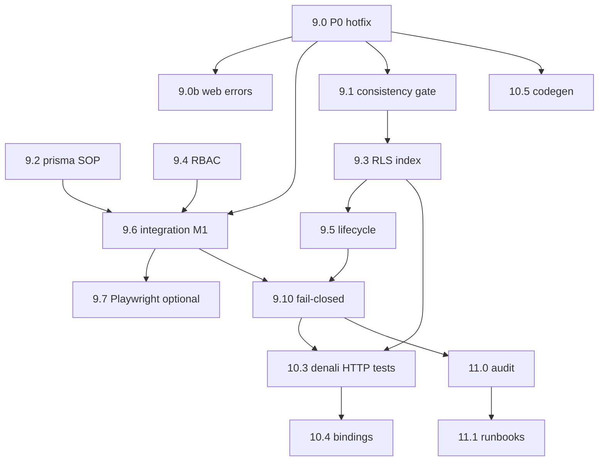

# Field Exposure + Workspace — Enterprise Hardening Roadmap (v3)

> **نسخه:** 3.1 (2026-06-29)
> **نوع سند:** نقشه راه اجرایی — پس از **نقد سختگیرانه v2** در برابر کد واقعی
> **حکم v2:** جهت کلی درست بود؛ چند فرض غلط، ترتیب فاز اشتباه، و تعریف «complete» متناقض داشت
> **حکم v3:** این نسخه اصلاح‌شده است — قابل اجرا برای «بهبود کامل» enterprise

---

## A. نقد v2 — چه چیزهایی **غلط یا ناقص** بود

| # | ادعای v2 | واقعیت کد | اصلاح v3 |
|---|----------|-----------|----------|
| 1 | `enabled: false` → `mode: disabled` | `mapLegacyDeliveryIntentFields` وقتی `enabled:false` می‌گیرد → **`inherit_profile`** (درست برای UX). فیلد API `enabled` در PATCH در واقع **`customizeFields`** است (`resolveExposureSelectionSaveInput`). خاموش/روشن رویداد = **`patchIntegrationEventPolicy`** جداگانه | حذف تغییر semantics اشتباه؛ فاز **9.5b API naming** + تست |
| 2 | FK `connection_id` ON DELETE CASCADE | `ExposureIntent` فقط `scope` JSONB دارد — **ستون FK نیست** | `deleteMany` در `deleteIntegration` transaction |
| 3 | duplicate فقط `scope_hash` | unique روی `(tenantId, profileId, surface, audience, trigger, scopeHash)` + fallback `{connectionId}` vs `{connectionId,eventType}` **از قبل در کد** (`connection-exposure-intent-scope.ts`) | migration merge legacy scope، نه فقط hash |
| 4 | حذف silent catch در read | `loadConnectionPoliciesAndIntents` عمداً swallow می‌کند تا صفحه تنظیمات در migration drift **زنده بماند** (`system-consistency-guard.mdoc`) | **log + metadata** نه fail read |
| 5 | Phase 9 complete شامل DoD enterprise | Tier 1 همزمان **10.0 fail-closed** می‌خواست ولی 9.9 زودتر «complete» اعلام می‌کرد | **Milestones M1–M4** جدا |
| 6 | `apps/api/test/exposure/` | الگوی repo = `apps/api/test/4-integration/*.spec.ts` با `skip: !DATABASE_URL` | مسیر هم‌راستا با repo |
| 7 | `apps/web/e2e/` | E2E موجود در `apps/web/tests/e2e/` و `apps/web/test/e2e/` | مسیر درست |
| 8 | fail-closed فقط فاز 10 | `resolveActiveDeliveryFieldIds` وقتی engine fail → **`fieldIds: []`** و dispatch **ادامه می‌دهد** (`resolve-active-delivery-field-ids.ts:17-18`) | **M2 blocker** — هم‌سطح امنیت tenant |
| 9 | RBAC فقط admin/owner | `operator.settings.exposure` در manifest هست؛ API **ability چک نمی‌کند** (برخلاف الگوی branding) | module gate + role |
| 10 | `pre-commit:fast` integration tests را می‌گیرد | `test-changed` → `@apps/api test` با `STORAGE_DRIVER=memory` — **4-integration بدون DATABASE_URL skip** | script جدا `test:exposure:integration` |

### چیزهایی که v2 **درست** داشت (حفظ شود)

- P0 web: لینک `/${locale}/settings` شکسته
- P0 simulation arg order
- RLS reminder + index `listForConnectionScope`
- RBAC mutate با الگوی branding
- `patchConnectionExposureIntent` وقتی `legacyProfile === null` → **silent return** (باید 422)
- audit / runbooks / SDK در فازهای پایانی

---

## B. تعریف «بهبود کامل» — ۴ Milestone (نه یک «Phase 9 complete»)

```text
M1 Operator Safe     — اپراتور می‌تواند exposure را save/ navigate بدون باگ
M2 Runtime Safe      — dispatch هرگز پیام خالی ناخواسته نفرستد؛ tenant leak نباشد
M3 Denali Product    — همه ۵ surface + HTTP redaction اثبات‌شده
M4 Enterprise Ops    — audit, runbooks, observability, doc closure
M5 Platform Scale    — workspace SDK + workspace دوم (ongoing)
```

**«بهبود کامل» برای Denali production = M1 + M2 + M3 (+ M4 برای SLA سخت)**

---

## C. Baseline کد (خلاصه audit)

### موجود

- `apps/api/src/exposure/**` (~75 فایل)، Prisma `exposure_intents` / `exposure_profiles` + RLS FORCE
- PATCH: `integrations.service.ts` → `patchConnectionExposureIntent` (با `assertIntegrationSystemReady`)
- Denali: ۵ surface، ۴ HTTP route با `exposurePort`
- Web: `/settings/exposure` + panel مشترک `integration-event-delivery-policy-panel.tsx`
- `ExposureIntentMode` شامل `disabled` — resolver پشتیبانی می‌کند (`exposure-intent-delivery-selection.ts`) ولی **write path استفاده نمی‌کند**

### شکاف‌های Critical

| ID | مسئله | فایل |
|----|--------|------|
| C1 | engine fail → `[]` fields → send | `dispatch-integration-domain-event.ts`, `resolve-active-delivery-field-ids.ts` |
| C2 | reminder بدون RLS | `20260702100000` migration |
| C3 | لینک locale + simulation args | web exposure clients |
| C4 | zero HTTP+Postgres exposure tests | `test/4-integration/` |
| C5 | delete connection → orphan intents | `deleteIntegration` خط 1079 |
| C6 | `legacyProfile null` → silent no-op | `patch-connection-exposure-intent.ts:97-98` |

---

## D. نقشه فازها (v3)

### Track 1 — M1 Operator Safe

#### **9.0 — P0 Hotfix (۲ روز)** — BLOCKER

| ID | Task | File | Acceptance |
|----|------|------|------------|
| 9.0-W1 | حذف `/${locale}/` از settings links | `exposure-settings-client.tsx:175,194`, `integrations-settings-client.tsx:858`, `control-plane-client:73`, `simulation-page:97` | GET 200 |
| 9.0-W2 | fix simulation arg order | `ExposureSimulationConsole.tsx:281-328` | vitest |
| 9.0-W3 | `buildEventTypeList` + telegram fallback | simulation console | parity با panel |
| 9.0-W4 | testid exposure cards | `exposure-settings-client.tsx:184,257` | `SETTINGS_HUB_TEST_IDS.exposurePage` |
| 9.0-A1 | `legacyProfile null` → `IntegrationInvalidBodyError('EXPOSURE_PROFILE_NOT_RESOLVED')` در service | `integrations.service.ts` | 400 invalid_body |
| 9.0-A2 | اولین integration spec PATCH persist | `test/4-integration/field-exposure-intent-patch.spec.ts` | DATABASE_URL |

**Gate M1-start:** 9.0 سبز

#### **9.0b — Web error surfacing (۱ روز)** — بخشی از M1

| ID | Task |
|----|------|
| 9.0b-1 | catch `fetchIntegrationDetail` → error UI | `exposure-settings-client.tsx` |
| 9.0b-2 | SSR catalog `null` → banner (نه checklist خالی خاموش) |
| 9.0b-3 | extract `buildEventTypeList` + `readSessionProxyContext` shared | کاهش drift |

#### **9.2 — Prisma generate SOP (۰.۵ روز)**

- `postmigrate` / dev checklist: migrate deploy → prisma generate → API restart
- doc: `system-consistency-guard.mdoc`

#### **9.4 — RBAC (۲ روز)**

```text
apps/api/src/settings/settings-exposure-module-access.ts (جدید)
  pattern = settings-branding-module-access.ts
  - resolveSettingsModuleForTenant(..., "exposure")
  - mutate → admin|owner → SettingsMutationForbiddenError
  - read → session + workspace scope
```

| Wire | Path |
|------|------|
| PATCH exposure-intents | `patchConnectionExposureIntentForIntegration` |
| PATCH workspace surfaces | `patchWorkspaceSurfaceExposureIntent` |
| **نه** simulate/diff | read-only compute — فقط session + workspace (یا admin برای engineering) |

Spec: `test/4-integration/field-exposure-rbac.spec.ts`

#### **9.6 — Integration pack M1 (۳ روز)**

```text
apps/api/test/4-integration/
  field-exposure-intent-patch.spec.ts      # 9.0
  field-exposure-rbac.spec.ts              # 9.4
  field-exposure-intent-validation.spec.ts # unknown fieldId → 400
```

```json
// apps/api/package.json
"test:exposure:integration": "DATABASE_URL required — vitest run test/4-integration/field-exposure-*.spec.ts"
```

**نکته CI:** در `pre-commit:fast` اجرا نمی‌شود مگر DATABASE_URL — در PR template ذکر شود.

#### **9.7 — Playwright M1 (۲ روز)** — اختیاری ولی توصیه‌شده

```text
apps/web/tests/e2e/denali-exposure-settings.spec.ts
  save field + icon → reload → persist
  navigation exposure ↔ integrations
```

**پیش‌نیاز:** global setup موجود (`operator-smoke-global-setup.ts`)

**Gate M1 complete:**
```text
□ 9.0 + 9.0b + 9.2 + 9.4
□ ≥3 فایل field-exposure-*.spec.ts در 4-integration سبز (با DATABASE_URL)
□ pre-commit:fast سبز
□ doc: field-exposure-system.md — Milestone M1
```

---

### Track 2 — M2 Runtime Safe

#### **9.1 — Consistency gate (۲ روز)** — warn-first

| Stage | رفتار |
|-------|--------|
| 9.1a | log `CONSISTENCY_MISSING_EXPOSURE_TABLES` — non-fatal |
| 9.1b | اضافه به `REQUIRED_INTEGRATION_TABLES`: `exposure_intents`, `exposure_profiles`, `denali_exposure_reminder_activations` — **fatal** (یک release بعد از 9.1a) |

**توجه:** gate فقط **`assertIntegrationSystemReady` mutations** را block می‌کند؛ reads عمداً باز می‌مانند.

#### **9.3 — RLS + query (۳–۴ روز)**

**ترتیب industry (table-by-table):**

1. Index `exposure_intents (tenant_id, (scope->>'connectionId'))`
2. Index reminder `(tenant_id, tour_id)` — اگر نیست
3. RLS ENABLE + FORCE + policy روی `denali_exposure_reminder_activations`
4. `denali-reminder-activation.repository.ts` → `withTenantRls`
5. `listForConnectionScope` → WHERE در DB

Specs:
- `field-exposure-reminder-rls.spec.ts`
- `field-exposure-intent-scope-query.spec.ts`

Rollout: index → RLS → negative test → release (۱ هفته staging)

#### **9.5 — Data lifecycle (۳ روز)**

| Task | جزئیات |
|------|--------|
| 9.5a Orphan cleanup | در `deleteIntegration` داخل همان `withTenantRls` tx: `exposureIntent.deleteMany` where `scope->>'connectionId' = id` — **نه FK** |
| 9.5b Legacy scope merge | data migration: rows با `scope={connectionId}` → merge به `{connectionId,eventType}`؛ کد fallback (`findConnectionExposureIntentWithLegacyScopeFallback`) بعد از migration حذف تدریجی |
| 9.5c API naming debt | doc: body field `enabled` = `customizeFields`؛ برنامه rename v2 (`customizeFields` در JSON) — **بدون تغییر semantics فعلی** |
| 9.5d `disabled` mode | فقط اگر محصول بخواهد «رویداد روشن ولی صفر فیلد» — **optional**؛ جدا از customize off |

Spec: `field-exposure-connection-delete.spec.ts`, `field-exposure-legacy-scope.spec.ts`

#### **9.10 — Fail-closed dispatch (۲–۳ روز)** — M2 BLOCKER

**مکانیزم واقعی باگ:**

```text
engine throw → engineDecisions undefined
→ resolveExposureDecision: engineSelectedFieldIds undefined
→ resolveActiveDeliveryFieldIds: { fieldIds: [], engineSelectorMissing: true }
→ enrichDeliveryPayload با eligibleFieldIds: []
→ پیام تلگرام با فیلدهای خالی ارسال می‌شود
```

**تفکیک مهم:** shadow engine fail (`runShadow`) → log فقط — enqueue ادامه. fail-closed فقط برای **selector** (`resolveForwardEngineDecisionMap`).

**تغییر استاندارد:**

```text
if activeDeliveryFieldIds.engineSelectorMissing && FIELD_EXPOSURE_ENGINE_FAIL_CLOSED:
  recordFieldExposureEngineFailure(...)
  continue   // بدون enqueueIntegrationDeliveryJob
else if engineSelectorMissing:
  metric only (observe — default تا staging)
```

فایل: `dispatch-integration-domain-event.ts` — به‌روز `dispatch-integration-domain-event.spec.ts`

Rollout:
1. metric-only (flag false)
2. staging flag true
3. production true + runbook

Spec: `field-exposure-dispatch-fail-closed.spec.ts`

#### **10.1 — Observability (۱–۲ روز)**

- همه exposure metrics → `TENANT_SCOPED_METRIC_NAMES`
- scheduler shutdown در `main.ts`
- doc scheduler boot path (`warmPostListen` only)

#### **10.2 — Degraded read (۱ روز)** — اصلاح v2

```typescript
// integrations.service.ts — loadConnectionPoliciesAndIntents
// KEEP try/catch — add:
logger.warn({ event: 'integration.policies_load_degraded', ... })
return { policies, exposureIntents, loadWarnings: ['POLICIES_UNAVAILABLE'] }
```

Web: banner — **نه** 503 روی GET detail

**Gate M2 complete:**
```text
□ 9.1b + 9.3 + 9.5 + 9.10 (flag on staging)
□ ≥6 field-exposure integration specs
□ fail-closed spec سبز
□ doc: M2 runtime contract
```

---

### Track 3 — M3 Denali Product

#### **10.3 — HTTP redaction integration (۳ روز)**

```text
test/4-integration/field-exposure-denali-catalog-redaction.spec.ts
test/4-integration/field-exposure-denali-reminder-feed.spec.ts
```

گسترش contract موجود: `field-exposure-denali-multi-surface.contract.spec.ts`

#### **10.4 — Catalog bindings audit (۲ روز)**

`denali-catalog-exposure-bindings.ts` — تصمیم explicit per field:
- `capacityMin`, `pricing-payment` — dashboard-only → doc intentional
- `location-zones` — delivery enrich only (`enrich-canonical-delivery-payload.ts`)
- `approximate-return-time` no-op — fix یا حذف binding

#### **10.5 — Settings manifest codegen (۱ روز)**

`generate:denali-settings-modules` → `denali-required-settings-modules.generated.ts`

#### **10.6 — OpenAPI (۰.۵ روز)**

dashboard + reminder routes در `openapi/dispatch-routes.ts`

**Gate M3 complete:**
```text
□ catalog + reminder integration redaction tests
□ location-zones delivery spec موجود + regression
□ settings codegen در CI
```

---

### Track 4 — M4 Enterprise Ops

#### **11.0 — Audit events (۳–۵ روز)**

`emitSettingsResourceAudit(auth, 'patch', 'exposure', ...)` → `operator_settings_audit_events` (موجود)

#### **11.1 — Runbooks (Markdoc)**

- `exposure-empty-delivery.mdoc` — engine fail، fail-closed flag
- `integration-gate-blocked.mdoc`
- `exposure-flags.mdoc` — همه env vars

#### **11.2 — Doc + guard closure**

- `field-exposure-system.md`: M1–M4 criteria؛ اصلاح ادعای Phase 8 vs `FIELD_EXPOSURE_RUNTIME_MODE`
- `scripts/guards/field-exposure-phase-9-guard.mjs` — **فقط پس از M2** (نه M1)
- optional `guard:field-exposure-phase-10` برای M3

**Gate M4 complete:** audit + runbooks + doc aligned

---

### Track 5 — M5 Platform (ongoing)

- `docs/dev/workspace-exposure-plugin-contract.mdoc`
- `workspace-sdk` exposure ports
- `workspaces/starter` minimal surfaces

---

## E. DAG وابستگی (اصلاح‌شده)



**قانون:** 9.10 (fail-closed) **قبل از** اعلام M2 — نه بعد از «Phase 9 party»

---

## F. موازی‌سازی تیم

| موازی مجاز | ممنوع |
|------------|--------|
| 9.0 web ∥ 9.3 RLS migration draft | 9.10 fail-closed قبل از 9.0 PATCH spec |
| 9.4 RBAC ∥ 9.0b UX | حذف silent catch read بدون جایگزین banner |
| 10.5 codegen ∥ 9.3 | 9.1b fatal gate قبل از migrate staging |
| 11.1 runbooks ∥ 10.3 tests | تغییر `enabled` semantics بدون product sign-off |

---

## G. Definition of Done — اصلاح‌شده

### M1 — Operator Safe (حداقل demo مشتری)

- [ ] لینک‌ها و simulation درست
- [ ] PATCH persist با integration spec
- [ ] RBAC viewer → 403 mutate
- [ ] `legacyProfile null` → 422
- [ ] prisma generate SOP documented

### M2 — Runtime Safe (حداقل production Denali)

- [ ] همه M1
- [ ] RLS reminder + intent query indexed
- [ ] delete connection → intents cleaned
- [ ] fail-closed فعال staging (+ prod برای SLA)
- [ ] degraded read با log + UI banner
- [ ] consistency gate exposure tables

### M3 — Denali Product Complete

- [ ] همه M2
- [ ] HTTP catalog/reminder redaction integration tests
- [ ] catalog bindings documented
- [ ] settings module codegen automated

### M4 — Enterprise Ops

- [ ] همه M3
- [ ] audit trail
- [ ] runbooks published
- [ ] doc ↔ code aligned (runtime mode, API naming)
- [ ] phase-9 guard (M2 criteria)

### M5 — Platform

- [ ] workspace SDK contract
- [ ] starter workspace

---

## H. ریسک‌ها (به‌روز)

| ریسک | v2 mitigation | v3 اصلاح |
|------|---------------|----------|
| تغییر `enabled` semantics | map to disabled | **لغو** — product breaking |
| FK CASCADE | migration | **deleteMany** |
| gate fatal زودهنگام | warn-first | 9.1a → 9.1b دو مرحله explicit |
| fail-closed stops telegram | flag rollout | metric-only stage اجباری قبل از enforce |
| integration tests در pre-commit | test:changed | **صریح:** manual/PR با DATABASE_URL |
| legacy scope merge | scope_hash only | merge rows + deprecate fallback |

---

## I. PR checklist (v3)

```text
[ ] docs/ if apps/api core (guard-docs)
[ ] withTenantRls on new DB paths
[ ] settings-exposure-module-access on new mutations
[ ] /settings/... links (no locale prefix)
[ ] read paths: log degradation, don't break availability
[ ] field-exposure integration spec if behavior changed
[ ] test:changed green (memory tier)
[ ] Architect documentation line
```

---

## J. Verification commands

```bash
# روزانه
pnpm run pre-commit:fast
pnpm run guard:import-boundary

# M1
pnpm --filter @apps/api exec vitest run apps/api/test/4-integration/field-exposure-intent-patch.spec.ts  # needs DATABASE_URL

# M2
pnpm run test:exposure:integration   # to be added — all field-exposure-*.spec.ts

# contracts (static)
pnpm run guard:field-exposure-phase-8
pnpm --filter @apps/api exec vitest run apps/api/test/field-exposure-denali-multi-surface.contract.spec.ts

# E2E (M1 optional)
pnpm --filter @apps/web exec playwright test tests/e2e/denali-exposure-settings.spec.ts
```

---

## K. پیوست — semantics واقعی API (مرجع)

### دو محور جدا در UI

| UI control | API call | معنی |
|------------|----------|------|
| Event enabled toggle | `PATCH .../event-policies/:event` | آیا رویداد اصلاً deliver شود |
| Customize fields | `PATCH .../exposure-intents/:event` body `enabled` | **`customizeFields`** — نه event enabled |
| customize off | exposure `enabled:false` → `inherit_profile` | استفاده از profile defaults — **درست** |
| `disabled` mode | exists in type, unused in write | فقط برای «صفر فیلد با رویداد روشن» — future |

### مسیر dispatch

```text
TourCreated → IntegrationPolicyEngine → exposure intent load
→ resolveExposureDecision → engine
→ resolveActiveDeliveryFieldIds → enrich → telegram send
```

---

## L. تاریخچه

| نسخه | تاریخ | تغییر |
|------|-------|--------|
| 1.0 | 2026-06-29 | نقشه اولیه ۷ فاز |
| 2.0 | 2026-06-29 | فازبندی 9.0–12.0 |
| 3.0 | 2026-06-29 | نقد v2 + milestones M1–M5 |
| 3.1 | 2026-06-29 | **بازبینی روش اجرا** — هر تغییر با الگوی repo + اصلاح رویکردهای غلط |

---

## M. بازبینی روش اجرا — آیا استاندارد و درست است؟ (v3.1)

این بخش هر تغییر را با **الگوی موجود در repo** مقایسه می‌کند: ✅ استاندارد | ⚠️ نیاز اصلاح روش | ❌ روش v3 غلط

### M1 — Operator Safe

#### 9.0-W1…W4 — لینک settings بدون locale

| | |
|---|---|
| **روش استاندارد repo** | `href="/settings/..."` مثل `branding-settings-client.tsx`, `tour-presets-client.tsx` |
| **روش v3** | همان — حذف `` `/${locale}/settings/...` `` |
| **حکم** | ✅ درست — از `Link` با prefix لوکال استفاده **نکنید** (`localePrefix: "never"`) |
| **تست** | contract grep: no `/${locale}/settings` در exposure/integrations |

#### 9.0-W2/W3 — simulation arg order + buildEventTypeList

| | |
|---|---|
| **روش استاندارد** | import از `exposure-field-selection.ts`؛ یک `buildEventTypeList` مشترک در `apps/web/src/exposure/build-exposure-event-type-list.ts` |
| **تست** | unit در `apps/web/test/exposure-field-selection.spec.ts` یا spec جدید برای console handlers |
| **حکم** | ✅ درست — DRY قبل از تکرار سوم در فایل چهارم |

#### 9.0-A1 — legacyProfile null → خطا

| | |
|---|---|
| **روش غلط** | throw از داخل `patch-connection-exposure-intent.ts` با نوع نامشخص |
| **روش استاندارد repo** | `patchConnectionExposureIntentForIntegration` چک کند؛ `throw new IntegrationInvalidBodyError("EXPOSURE_PROFILE_NOT_RESOLVED")` — همان الگوی validation سایر integration fields |
| **route mapper** | `mapIntegrationRouteError` از قبل `IntegrationInvalidBodyError` → 400 دارد |
| **حکم** | ⚠️ v3 گفت 422 — در repo integration validation عمدتاً **400 invalid_body** است؛ **400 با code** استانداردتر از 422 |

#### 9.0-A2 — integration spec PATCH

| | |
|---|---|
| **روش استاندارد repo** | `apps/api/test/4-integration/field-exposure-intent-patch.spec.ts` |
| **الگو** | `feature-flag-degradation.spec.ts`: `createRequestListener`, `http.createServer`, `authHeaders`, `skip: !DATABASE_URL` |
| **gate bypass** | `forceIntegrationSubsystemReadyForTests()` در `before` — **الزامی** |
| **storage** | `STORAGE_DRIVER=prisma` + seed connection/policy در tx |
| **حکم** | ✅ مسیر `4-integration/` درست — نه پوشه جدا `test/exposure/` |

#### 9.0b — error UI

| | |
|---|---|
| **روش استاندارد** | کپی الگوی `integrations-settings-client.tsx`: `detailError` + `resolveCodedErrorMessage(tErrors, code)` |
| **SSR catalog** | discriminated union در server fetcher یا prop `catalogLoadFailed: boolean` — نه throw در RSC |
| **حکم** | ✅ |

#### 9.2 — prisma generate

| | |
|---|---|
| **روش استاندارد** | append به `apps/api/scripts/db-migrate-deploy.mjs` بعد از `migrate deploy`: `spawnSync(prisma, ["generate"])` |
| **جایگزین** | `"postmigrate": "prisma generate"` در `apps/api/package.json` |
| **حکم** | ✅ — doc در `system-consistency-guard.mdoc` قبل از کد (doc-first) |

#### 9.4 — RBAC

| | |
|---|---|
| **روش استاندارد** | کپی `settings-branding-module-access.ts` → `settings-exposure-module-access.ts` با `EXPOSURE_MODULE_ID = "exposure"` |
| **فراموش نشود** | `mapIntegrationRouteError` + `mapExposureRouteError` باید `SettingsMutationForbiddenError` → 403 اضافه شود — **امروز ندارند** |
| **simulate/diff** | read-only — فقط `requireOperatorSession` + workspace scope؛ **نه** mutate gate |
| **حکم** | ⚠️ v3 درست ولی ناقص — wire route mapper اجباری |

#### 9.6 — integration pack

| | |
|---|---|
| **script** | `"test:exposure:integration": "node --import tsx --test test/4-integration/field-exposure-*.spec.ts"` در apps/api |
| **pre-commit** | `test-changed` با memory driver این‌ها را **skip نمی‌کند** ولی بدون DB fail می‌شوند — در PR checklist: DATABASE_URL manual |
| **حکم** | ✅ با یادداشت CI |

#### 9.7 — Playwright

| | |
|---|---|
| **مسیر درست** | `apps/web/tests/e2e/denali-exposure-settings.spec.ts` (نه `apps/web/e2e/`) |
| **الگو** | `loginOperatorOwner(page)` از `test/fixtures/operator-owner-session` + `SETTINGS_HUB_TEST_IDS` |
| **حکم** | ⚠️ v3 مسیر E2E را اصلاح کند |

---

### M2 — Runtime Safe

#### 9.1 — consistency gate warn-first

| | |
|---|---|
| **واقعیت کد** | `applyMigrationConsistencyGate` binary است (`report.ok`) |
| **روش استاندارد** | گسترش `ConsistencySignal`: `CONSISTENCY_WARN_EXPOSURE_TABLES` → `ok: true` ولی log warn؛ فاز بعد `CONSISTENCY_MISSING_EXPOSURE_TABLES` → `ok: false` |
| **روش غلط** | فقط console.log بدون تغییر report type |
| **حکم** | ⚠️ v3 ایده درست — پیاده‌سازی باید report schema را گسترش دهد |

#### 9.3 — RLS reminder + index

| | |
|---|---|
| **روش استاندارد RLS** | کپی verbatim از `20260629100000_field_exposure_intents/migration.sql`: ENABLE + FORCE + policy `app.current_tenant_id` |
| **repository** | `withTenantRls` — همان `denali-reminder-activation.repository.ts` refactor |
| **index intent query** | `CREATE INDEX ... ON exposure_intents (tenant_id, ((scope->>'connectionId')))` — expression index |
| **Prisma query** | `where: { tenantId, scope: { path: ["connectionId"], equals: id } }` — یا raw `$queryRaw` اگر Prisma محدود شد |
| **روش غلط** | FK `connection_id` — ستون وجود ندارد |
| **حکم** | ✅ RLS/index درست — denormalized column فقط اگر perf مشکل داشت |

#### 9.5a — orphan intents

| | |
|---|---|
| **روش استاندارد** | داخل `deleteIntegration` موجود `withTenantRls` tx، قبل از `integrationConnection.delete`: |
| | `tx.exposureIntent.deleteMany({ where: { tenantId, scope: { path: ["connectionId"], equals: id } } })` |
| **حکم** | ✅ deleteMany در tx — نه FK |

#### 9.5b — legacy scope merge

| | |
|---|---|
| **روش استاندارد** | SQL data migration + سپس deprecate `findConnectionExposureIntentWithLegacyScopeFallback` در release بعد |
| **توجه** | unique `(tenant_id, profile_id, surface, audience, trigger, scope_hash)` — merge باید duplicate واقعی را حذف کند نه فقط hash |
| **حکم** | ✅ با dry-run staging |

#### 9.10 — fail-closed dispatch

| | |
|---|---|
| **واقعیت کد** | دو failure mode جدا: |
| | 1) `resolveForwardEngineDecisionMap` throw → `engineSelectorMissing` → **empty send** ← هدف fail-closed |
| | 2) `runShadow` throw → log only → **enqueue ادامه** — تست unit صریح: `still enqueues when forward shadow engine throws` |
| **روش استاندارد** | در loop `for (decision of decisions)`: اگر `activeDeliveryFieldIds.engineSelectorMissing && FAIL_CLOSED` → `recordFieldExposureEngineFailure` + **`continue`** (enqueue نکن) |
| **روش غلط v3** | `SKIPPED_POLICY_ENGINE` job status — **وجود ندارد** در schema (`status` string آزاد ولی worker نمی‌شناسد) |
| **تست** | به‌روز `dispatch-integration-domain-event.spec.ts` — رفتار جدید با flag on |
| **حکم** | ❌→✅ اصلاح شد: skip enqueue نه job status |

#### 10.2 — degraded read

| | |
|---|---|
| **روش استاندارد** | نگه `try/catch` در `loadConnectionPoliciesAndIntents` + `logger.warn({ event: "integration.exposure_intents_load_degraded" })` + `loadWarnings: string[]` در DTO |
| **روش غلط** | حذف catch یا 503 روی GET — **خلاف** `system-consistency-guard.mdoc` |
| **حکم** | ✅ v3 درست |

---

### M3 — Denali Product

#### 10.3 — HTTP redaction tests

| | |
|---|---|
| **روش استاندارد** | `4-integration` با Postgres + seed tour + PATCH surface intent + GET catalog assert field absent |
| **الگوی unit موجود** | `packages/workspaces/denali/test/denali-catalog-exposure.spec.ts` — برای integration گسترش دهید |
| **حکم** | ✅ |

#### 10.5 — settings module codegen

| | |
|---|---|
| **روش غلط** | دستی sync `denali-required-settings-modules.generated.ts` |
| **روش A (ترجیحی)** | اضافه `operatorSettingsModuleIds` به `workspace.manifest.json` + emit در `generate-workspace-registry.mjs` (هم‌تراز سایر generated) |
| **روش B** | `scripts/generate-denali-settings-modules.mjs` با `tsx` import از `denali-settings.manifest.ts` |
| **حکم** | ⚠️ v3 گفت script جدا — **روش A** با registry یکپارچه‌تر است |

---

### M4 — Enterprise Ops

#### 11.0 — audit

| | |
|---|---|
| **روش غلط v3** | جدول جدید `exposure_audit_events` |
| **روش استاندارد repo** | `emitSettingsResourceAudit(auth, "patch", "exposure", resourceId, summary)` از `settings-audit-emitter.ts` → `operator_settings_audit_events` (Phase 9.6 از قبل RLS دارد) |
| **محدودیت** | فقط `summary` string — نه `before_json`/`after_json`؛ summary باید concise باشد |
| **حکم** | ❌→✅ استفاده از audit موجود |

---

### M.2 چک‌لیست doc-first (اجباری قبل از کد)

| تغییر | doc |
|-------|-----|
| RBAC exposure | `field-exposure-system.md` + `SETTINGS-MODULE-REGISTRY` اگر لازم |
| fail-closed | `field-exposure-system.md` dispatch section |
| RLS reminder | `field-exposure-system.md` + migration note |
| consistency gate | `system-consistency-guard.mdoc` |
| audit | `settings` audit explorer doc اگر action جدید |

---

### M.3 خلاصه حکم — روش‌هایی که باید عوض شوند

| موضوع | v3 | v3.1 استاندارد |
|-------|-----|----------------|
| fail-closed | job status SKIPPED | `continue` بدون enqueue + flag |
| audit M4 | جدول جدید | `emitSettingsResourceAudit` |
| profile null | 422 | `IntegrationInvalidBodyError` → 400 |
| RBAC | helper only | + route error mappers |
| settings codegen | script جدا | ترجیح: `workspace.manifest.json` + registry |
| E2E path | apps/web/e2e | `apps/web/tests/e2e/` |
| shadow engine fail | (مبهم) | enqueue ادامه — فقط selector fail-closed |

