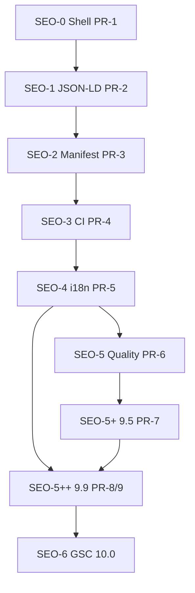

# Marketing Guest SEO — Execution Roadmap v5.1

> **نسخه:** 5.1 (2026-07-02) — تراز با کد واقعی (audit codebase)  
> **وضعیت:** آماده اجرا · بدون کار تکراری  
> **هدف:** ≥ **۹.۹/۱۰** pre-launch · **۱۰.۰** post-launch (GSC)  
> **Baseline:** **۴.۰/۱۰**  
> **Task registry:** [`marketing-guest-seo-tasks.yaml`](./marketing-guest-seo-tasks.yaml)  
> **Promote:** `docs/dev/guest-seo-conformance.md`

---

## §0.5 — Code Alignment (audit تراز با کد واقعی)

**قانون طلایی:** هر task قبل از اجرا علیه ستون «واقعیت کد» چک شود. **چیزی که هست دوباره ساخته نمی‌شود.**

### الگوی معماری کشف‌شده (اجباری)

| الگو | واقعیت کد | اثر روی roadmap |
|------|-----------|-----------------|
| Codegen مرکزی | `scripts/generate-workspace-registry.mjs` (۲۲۹۶ خط) همه generatedها را می‌سازد | ❌ generator جدا نساز · ✅ همان را extend کن |
| Presentation→SDK | `catalogPresentation` schema → `resolveCatalogListFeatures/DetailSections()` (خط 1708/1748) | ✅ `guestSeo` → `resolveGuestSeoForPlugin()` همین مسیر |
| Conformance levels | `WORKSPACE_GUEST_CONFORMANCE_LEVELS` (denali/urban/guest-club=L3) | ✅ SEO row همینجا، نه فایل جدید |
| Schema versioning | `guestExtensionsVersion: const 1` + `dependentRequired` + root `additionalProperties: true` | ✅ `guestSeo` optional بدون bump · required فقط در guard |
| Guard bundle | `guard-guest-plugin-conformance.mjs` = **۱۴ step** | ✅ `guest_seo` → step 15 |

### تعارض‌های اصلاح‌شده (v5 → v5.1)

| # | v5 گفته بود | واقعیت کد | اصلاح |
|---|-------------|-----------|-------|
| C-1 | MKT-17..26 جدید | **MKT-28 آخرین** (17/18 fetch · 19-21 locale · 22-26 image · 27-28 cancel) | ID جدید از **MKT-29** |
| C-2 | «structuredData به contract اضافه کن» | از قبل هست | فقط render/rich |
| C-3 | «spotsRemaining اضافه کن» | از قبل هست (optional) | Offer availability از فیلد موجود |
| C-4 | codegen جدید generate-workspace-guest-seo | central generator | extend `generate-workspace-registry.mjs` |
| C-5 | resolveGuestSeoForPlugin فایل مستقل | pattern در SDK generated | تولید در همان generator · SDK re-export |
| C-6 | schema نیازمند const 1→2 | root additionalProperties true | v1 optional · required فقط L2+ در guard |
| C-7 | catalogUpdatedAt/updatedAt مبهم | هیچ‌کدام روی card نیست | فیلد جدید **catalogUpdatedAt** روی PublicCatalogCard |
| C-8 | Twitter «شاید هست» | قطعاً نیست | task واقعی |
| C-9 | i18n «شاید hreflang» | localePrefix never · cookie · بدون languages · web هم همین | breaking + web parity |
| C-10 | redirect 307/308؟ | 307 قطعی · permanentRedirect صفر | task 308 معتبر |

### موجود — دست نزن مگر extend

| موجود | مسیر | اقدام |
|-------|------|-------|
| OG + canonical | `build-marketing-metadata.ts` | فقط Twitter/hreflang extend |
| noindex missing-tour | `buildMarketingNotFoundMetadata` | الگو برای global 404 |
| JSON-LD render slot | `catalog-tour-detail.tsx:76` | فقط @graph bundle |
| Denali TouristTrip partial | `build-denali-tourist-trip-jsonld.ts` | فقط offers/image/url/dateModified |
| structuredData + spotsRemaining | `public-catalog.contract.ts` | استفاده کن |
| cache tag + revalidate + scheduler | `catalog-fetch-options.ts` · `api/revalidate/route.ts` · `schedule-marketing-catalog-revalidate.ts` | فقط SEO tag |
| conformance L3 | `workspace-guest-conformance.generated.ts` | SEO row اینجا |
| image remotePatterns | `next.config.ts` · `resolve-marketing-image-hosts.ts` | فقط priority/sizes/preconnect |

---

## نحوه استفاده از این سند

| نقش | بخش |
|-----|-----|
| **Architect** | §2 Rubric · §3 Non-negotiables · §12 Sign-off |
| **Dev (PR)** | §8 PR Manifest · §6 Task tables · Gate per phase |
| **QA** | §10 Smoke registry · §11 Gates |
| **Tracking** | `marketing-guest-seo-tasks.yaml` — هر task `T-###` |

**قانون اجرا:** doc-first برای ADR/schema · یک PR = یک concern · gate فاز قبل از شروع فاز بعد.

---

## §1 — بازبینی شفافیت (v4 → v5)

### مشکلات v4 که اصلاح شد

| # | مشکل v4 | اصلاح v5 |
|---|---------|----------|
| 1 | فازهای SEO-0..5+ «مراجعه به v3.bak» — **خودکفا نبود** | همه taskها inline در §6 |
| 2 | بدون Task ID قابل track | `T-001`..`T-115` + YAML |
| 3 | بدون entry/exit criteria | هر فاز: ورودی · خروجی · gate |
| 4 | PR-1..7 بدون لیست task | §8 PR Manifest کامل |
| 5 | Non-negotiables «۱–۱۲ از v3» بدون متن | §3 لیست کامل ۲۳ قانون |
| 6 | بدون تخمین زمان | §5 Phase overview (۲۹ روز dev) |
| 7 | بدون package.json scripts | §9 Scripts to add |
| 8 | وابستگی‌ها implicit | §7 Mermaid + ستون Depends |

---

## §2 — Rubric نمره

| نمره | معیار خلاصه |
|------|-------------|
| **۴.۰** | metadata + OG · JSON-LD Denali ناقص · بدون sitemap/guard |
| **۶.۰** | + sitemap/robots/Twitter · per-host |
| **۷.۰** | + JSON-LD همه workspace · `catalogUpdatedAt` · BreadcrumbList |
| **۷.۵** | + `guestSeo` manifest · guard 15/15 |
| **۸.۰** | + SMK-MKT-06..08 · promote conformance doc |
| **۸.۵** | + `localePrefix: as-needed` · hreflang · layout schema |
| **۹.۰** | + Lighthouse SEO≥90 · semantic guard · validator |
| **۹.۵** | + pagination noindex · ItemList · image sitemap · CWV≥85 |
| **۹.۹** | + 308 redirect · surface noindex · crawl CI · Lighthouse strict · SMK matrix |
| **۱۰.۰** | + GSC index≥95% · CrUX green · 30d crawl |

---

## §3 — NON-NEGOTIABLES (۲۳ قانون)

1. L2+ بدون `guestSeo` + JSON-LD builder merge نمی‌شود.
2. manifest key جدید → `workspace-guest-extensions.schema.json` + ADR-GP-004.
3. no hand-edit روی `workspace-guest-seo.generated.ts`.
4. marketing بدون `if (pluginId)` برای SEO.
5. JSON-LD فقط Server Component JSX · validate قبل از render.
6. sitemap/robots host-aware · canonical absolute per tenant.
7. `?cursor` / `?city` → noindex · خارج از sitemap.
8. `catalogUpdatedAt` اجباری L2+ روی egress card.
9. یک PR = یک concern (P14).
10. doc-first قبل از تغییر SDK/API/manifest.
11. `permanentRedirect` (308) web `/catalog` → marketing.
12. mother · maintenance · global 404 → noindex.
13. sitemap tenant isolation — cross-tenant URL ممنوع.
14. revalidate catalog + SEO tag on publish.
15. JSON-LD `@graph` — یک script per page.
16. SMK-MKT-06..15 + SMK-WEB-SEO-01 سبز قبل از ۹.۹.
17. Lighthouse ۹.۹: SEO≥98 · Perf≥92 · A11y≥95 · BP≥95.
18. crawl CI — هر sitemap URL → 200 + title + canonical.
19. title/description length + uniqueness guards.
20. waivers فقط `guest-seo-WNNN.yaml` · expiry ≤30d.
21. promote `guest-seo-conformance.md` قبل از guard step 15 در CI.
22. zero SEO waivers برای sign-off ۹.۹.
23. بدون SEO-6 ادعای ۱۰.۰ ممنوع.

---

## §4 — Doc-first artifacts (ترتیب اجباری)

| # | Artifact | قبل از task | فاز |
|---|----------|-------------|-----|
| D-1 | `ADR-GP-004-guest-seo-manifest.md` | T-020 | SEO-2 |
| D-2 | `workspace-guest-extensions.schema.json` (`guestSeo`) | T-021 | SEO-2 |
| D-3 | `public-catalog.md` — `catalogUpdatedAt` | T-010 | SEO-1 |
| D-4 | `public-catalog.md` — M9 `localePrefix: as-needed` | T-040 | SEO-4 |
| D-5 | `public-catalog.md` — M2b 308 redirect | T-080 | SEO-5++ |
| D-6 | `docs/dev/guest-seo-conformance.md` | T-035 | SEO-3 |
| D-7 | `docs/dev/guest-seo-e2e-hooks.yaml` | T-032 | SEO-3 |
| D-8 | `docs/phase-19/.../marketing-gsc-sitemap.md` runbook | T-110 | SEO-6 |

---

## §5 — Phase overview

| فاز | نام | نمره | PR | Tasks | روز | Gate |
|-----|-----|------|-----|-------|-----|------|
| SEO-0 | Shell | 6.0 | PR-1 | 5 | 2 | `marketing test` sitemap/metadata |
| SEO-1 | JSON-LD | 7.0 | PR-2 | 9 | 4 | SMK-MKT-06 + SDK build |
| SEO-2 | Manifest | 7.5 | PR-3 | 8 | 4 | `guard:guest-plugin-conformance` 15/15 |
| SEO-3 | CI/E2E | 8.0 | PR-4 | 6 | 3 | SMK-MKT-06..08 |
| SEO-4 | i18n | 8.5 | PR-5 | 7 | 4 | all marketing smokes |
| SEO-5 | Quality | 9.0 | PR-6 | 5 | 3 | semantic guard + LH SEO≥90 |
| SEO-5+ | 9.5 | 9.5 | PR-7 | 10 | 4 | SMK-MKT-10/11 + seo-prod guard |
| SEO-5++ | 9.9 | 9.9 | PR-8,9 | 28 | 5 | full gate §11 |
| SEO-6 | 10.0 | 10.0 | ops | 6 | 30d | GSC + CrUX |
| | | | | **72** | **~29** | |

---

## §6 — Task tables (فازبه‌فاز)

### SEO-0 — Shell baseline → ۶.۰ · PR-1

**هدف:** sitemap · robots · Twitter · unit tests  
**ورود:** baseline ۴.۰  
**خروج:** `pnpm --filter @apps/marketing test`

| Task | کار | فایل‌های اصلی | GAP | Depends | Verify |
|------|-----|---------------|-----|---------|--------|
| T-001 | sitemap host-aware | `app/sitemap.ts`, `src/seo/build-marketing-sitemap.ts` | 01 | — | unit sitemap |
| T-002 | robots.txt | `app/robots.ts` | 01 | T-001 | curl robots |
| T-003 | Twitter Card | `build-marketing-metadata.ts` | 02 | — | MKT-17 |
| T-004 | metadata tests | `test/build-marketing-metadata.spec.ts` | 02 | T-003 | MKT-29,30 |
| T-005 | sitemap XML tests | `test/build-marketing-sitemap.spec.ts` | 01 | T-001 | unit |

---

### SEO-1 — JSON-LD + contract → ۷.۰ · PR-2

**هدف:** rich schema · `catalogUpdatedAt` · همه workspace  
**ورود:** SEO-0 gate green  
**خروج:** SMK-MKT-06 + SDK build

| Task | کار | فایل‌های اصلی | GAP | Depends | Verify |
|------|-----|---------------|-----|---------|--------|
| T-010 | doc catalogUpdatedAt | `docs/.../public-catalog.md` | 10 | — | doc-gate |
| T-011 | SDK: **add catalogUpdatedAt only** (structuredData/spotsRemaining exist) | `public-catalog.contract.ts` | 10 | T-010 | SDK build |
| T-012 | Denali rich TouristTrip | `build-denali-tourist-trip-jsonld.ts` | 18 | T-011 | unit |
| T-013 | Urban Event JSON-LD | `urban/.../build-urban-event-jsonld.ts` | 05 | T-011 | unit |
| T-014 | guest-club Event stub | `guest-club/.../build-*-jsonld.ts` | 05 | T-011 | unit |
| T-015 | validateStructuredData SDK | `workspace-sdk/src/seo/` | 14 | — | spec |
| T-016 | exposure deny structuredData | denali/urban exposure bindings | 09 | T-015 | exposure spec |
| T-017 | BreadcrumbList JSON-LD | `build-breadcrumb-jsonld.ts`, detail | 12 | T-012 | unit |
| T-018 | SMK-MKT-06 | `tests/e2e/marketing-seo-jsonld.spec.ts` | 07 | T-012 | e2e |

---

### SEO-2 — Manifest + guard → ۷.۵ · PR-3 (doc-first)

**هدف:** `guestSeo` v2 · codegen · guard step 15  
**ورود:** SEO-1 gate  
**خروج:** `pnpm run guard:guest-plugin-conformance` → **15/15 PASS**

| Task | کار | فایل‌های اصلی | GAP | Depends | Verify |
|------|-----|---------------|-----|---------|--------|
| T-020 | ADR-GP-004 | `docs/dev/adr-guest-plugin/ADR-GP-004-*.md` | 04 | T-010 | doc |
| T-021 | schema guestSeo | `workspace-guest-extensions.schema.json` | 04 | T-020 | guard schema |
| T-022 | codegen (extend central) | `generate-workspace-registry.mjs` → `workspace-guest-seo.generated.ts` | 04 | T-021 | `generate:workspace-registry` |
| T-023 | resolveGuestSeoForPlugin (re-export generated) | `workspace-sdk/src/catalog/` | 04 | T-022 | spec |
| T-024 | guard-guest-seo (STEPS[14]=guest_seo) | `guard-guest-plugin-conformance.mjs` + `guard-guest-seo.mjs` | 06 | T-023 | 15/15 |
| T-025 | workspace:create scaffold | `scripts/workspace-create.mjs` | 08 | T-021 | create smoke |
| T-026 | golden fixtures | `test/fixtures/`, `workspace-guest-seo.spec.mjs` | 14 | T-024 | node --test |
| T-027 | trunk manifest v2 backfill | denali/urban/guest-club manifests | 04 | T-021 | guard |

---

### SEO-3 — CI + E2E → ۸.۰ · PR-4

**هدف:** smokes · hooks yaml · SEO revalidate tag · promote doc  
**ورود:** SEO-2 gate 15/15  
**خروج:** SMK-MKT-06..08 green

| Task | کار | فایل‌های اصلی | GAP | Depends | Verify |
|------|-----|---------------|-----|---------|--------|
| T-030 | SMK-MKT-07 head meta | `marketing-seo-head.spec.ts` | 07 | T-003 | e2e |
| T-031 | SMK-MKT-08 sitemap | `marketing-seo-sitemap.spec.ts` | 01 | T-001 | e2e |
| T-032 | guest-seo-e2e-hooks.yaml | `docs/dev/guest-seo-e2e-hooks.yaml` | 07 | T-018 | guard hooks |
| T-033 | SEO cache tag + API | revalidate route + API publish | 10,29 | T-011 | API spec |
| T-034 | m17 +5 SEO checks | `guard-public-catalog-m17.mjs` | 06 | T-024 | guard |
| T-035 | promote conformance doc | `docs/dev/guest-seo-conformance.md` | — | T-020,24 | phase-6:guard |

---

### SEO-4 — i18n SEO → ۸.۵ · PR-5 (**breaking**)

**هدف:** `localePrefix: as-needed` · hreflang · layout schema · sitemap alternates  
**ورود:** SEO-3 gate  
**خروج:** `pnpm --filter @apps/marketing run test:smoke` (همه سبز)

| Task | کار | فایل‌های اصلی | GAP | Depends | Verify |
|------|-----|---------------|-----|---------|--------|
| T-040 | doc M9 update | `public-catalog.md` | 03 | T-035 | doc |
| T-041 | localePrefix as-needed | `src/i18n/routing.ts` | 03 | T-040 | unit |
| T-042 | alternates languages + x-default | `build-marketing-metadata.ts` | 03,21 | T-041 | MKT-31 |
| T-043 | Org + WebSite JSON-LD | `build-layout-jsonld.ts`, layout | 11,22 | T-041 | unit |
| T-044 | sitemap xhtml:link | `build-marketing-sitemap.ts` | 03 | T-001,041 | unit |
| T-045 | SMK-MKT-09 hreflang | `marketing-seo-hreflang.spec.ts` | 03 | T-042 | e2e |
| T-046 | fix SMK-MKT-01..05 paths | existing smoke specs | — | T-041 | smokes |

---

### SEO-5 — Quality gates → ۹.۰ · PR-6

**هدف:** validator CI · semantic guard · Lighthouse SEO≥90  
**ورود:** SEO-4 gate  
**خروج:** semantic guard + lighthouse

| Task | کار | فایل‌های اصلی | GAP | Depends | Verify |
|------|-----|---------------|-----|---------|--------|
| T-050 | validate-json-ld.mjs | `scripts/validate-json-ld.mjs` | 14 | T-015,026 | script |
| T-051 | wire guard-guest-seo | `guard-guest-seo.mjs` | 14 | T-050 | guard |
| T-052 | guard-marketing-semantic-seo | `guard-marketing-semantic-seo.mjs` | 15 | — | guard |
| T-053 | OG width/height | `build-marketing-metadata.ts` | 25 | T-003 | MKT-32 |
| T-054 | lighthouserc SEO≥90 | `lighthouserc.json`, package.json | 13 | — | test:lighthouse |

---

### SEO-5+ — 9.5 tier → ۹.۵ · PR-7

**هدف:** pagination · ItemList · image sitemap · CWV≥85 · prod guard  
**ورود:** SEO-5 gate  
**خروج:** SMK-MKT-10/11 + seo-prod guard

| Task | کار | GAP | Verify |
|------|-----|-----|--------|
| T-060 | pagination noindex metadata | 16 | MKT-33 |
| T-061 | sitemap exclude query URLs | 16 | unit |
| T-062 | ItemList JSON-LD list page | 17 | MKT-34 |
| T-063 | image sitemap | 20 | XML test |
| T-064 | visible breadcrumb nav | 23 | semantic guard |
| T-065 | Lighthouse perf≥85 CWV | 19 | lighthouse |
| T-066 | guard-marketing-seo-prod | 25 | guard |
| T-067 | SMK-MKT-10 | 16 | e2e |
| T-068 | SMK-MKT-11 | 18 | e2e |
| T-069 | IndexNow ping (optional) | 24 | API spec |

---

### SEO-5++ — 9.9 tier → ۹.۹ · PR-8 + PR-9

**هدف:** 308 redirect · surfaces · crawl CI · strict lighthouse · full SMK matrix  
**ورود:** SEO-5+ gate + SEO-4 (hreflang)  
**خروج:** §11 Gate 9.9

#### PR-8 — Redirect · surfaces · schema v2

| Task | کار | GAP | Verify |
|------|-----|-----|--------|
| T-080 | doc M2b 308 | 26 | doc |
| T-081 | web permanentRedirect | 26 | SMK-WEB-SEO-01 |
| T-082 | mother/maintenance noindex (reuse notFound pattern) | 28 | MKT-35,36 |
| T-083 | global not-found generateMetadata noindex | 27 | MKT-37 |
| T-084 | club home canonical | 28 | MKT-38 |
| T-085 | @graph JSON-LD bundler | 34 | unit |
| T-086 | Urban Event v2 | 35 | unit |
| T-087 | Offer availability (از spotsRemaining موجود) | 36 | validator |
| T-088 | JSON-LD XSS guard | 45 | guard |
| T-089 | sitemap ping on publish | 39 | API spec |

#### PR-9 — Crawl CI · perf · matrix smokes

| Task | کار | GAP | Verify |
|------|-----|-----|--------|
| T-090 | og:locale alternates | 33 | MKT-39 |
| T-091 | guard-meta-quality | 31,32 | guard |
| T-092 | favicon metadata | 42 | head test |
| T-093 | LCP priority/sizes/preconnect | 37,47 | lighthouse |
| T-094 | prod image hosts guard | 37 | guard |
| T-095 | crawl-marketing-sitemap.mjs | 30 | crawl script |
| T-096 | sitemap host anti-spoof | 46 | guard |
| T-097 | hreflang reciprocal guard | 43 | guard |
| T-098 | feed.xml Atom | 38 | unit |
| T-099 | Lighthouse strict 98/92/95 | 13,19 | lighthouse --strict |
| T-100 | SMK-MKT-12 urban | 35 | e2e |
| T-101 | SMK-MKT-13 guest-club | 05 | e2e |
| T-102 | SMK-MKT-14 unpublish | 44 | e2e |
| T-103 | SMK-MKT-15 matrix | 48 | e2e |
| T-104 | tenant sitemap isolation | 40 | e2e |
| T-105 | SMK-WEB-SEO-01 | 26 | e2e |
| T-106 | HTTP 404 missing tour | 41 | e2e |
| T-107 | package.json scripts | — | all guards |

---

### SEO-6 — Production 10.0 (post-launch)

| Task | کار | Verify |
|------|-----|--------|
| T-110 | GSC runbook | doc review |
| T-111 | Index coverage ≥95% | GSC 30d |
| T-112 | Rich Results live | manual |
| T-113 | Zero crawl 5xx 30d | GSC |
| T-114 | CrUX CWV green | CrUX |
| T-115 | Architect sign-off 10.0 | doc checkbox |

---

## §7 — Dependency graph



---

## §8 — PR Manifest

| PR | فاز | Tasks | محدوده فایل | برآورد |
|----|-----|-------|-------------|--------|
| **PR-1** | SEO-0 | T-001..005 | `apps/marketing` only | 2d |
| **PR-2** | SEO-1 | T-010..018 | SDK + workspaces + marketing breadcrumb | 4d |
| **PR-3** | SEO-2 | T-020..027 | docs + schema + codegen + guards | 4d |
| **PR-4** | SEO-3 | T-030..035 | smokes + API revalidate + m17 | 3d |
| **PR-5** | SEO-4 | T-040..046 | i18n breaking + layout schema | 4d |
| **PR-6** | SEO-5 | T-050..054 | validators + lighthouse + semantic | 3d |
| **PR-7** | SEO-5+ | T-060..069 | pagination + ItemList + CWV85 | 4d |
| **PR-8** | SEO-5++ | T-080..089 | web 308 + surfaces + @graph | 2.5d |
| **PR-9** | SEO-5++ | T-090..107 | crawl CI + strict LH + SMK matrix | 2.5d |

---

## §9 — Scripts to add (`package.json` root)

```json
{
  "generate:workspace-guest-seo": "node scripts/generate-workspace-guest-seo.mjs",
  "guard:marketing-semantic-seo": "node scripts/guards/guard-marketing-semantic-seo.mjs",
  "guard:marketing-seo-prod": "node scripts/guards/guard-marketing-seo-prod.mjs",
  "guard:marketing-meta-quality": "node scripts/guards/guard-marketing-meta-quality.mjs",
  "guard:marketing-sitemap-host": "node scripts/guards/guard-marketing-sitemap-host.mjs",
  "guard:marketing-hreflang": "node scripts/guards/guard-marketing-hreflang.mjs",
  "guard:jsonld-xss": "node scripts/guards/guard-jsonld-xss.mjs",
  "crawl:marketing-sitemap": "node scripts/crawl-marketing-sitemap.mjs"
}
```

`apps/marketing/package.json`:

```json
{
  "test:lighthouse": "lhci autorun",
  "test:lighthouse:strict": "lhci autorun --config=lighthouserc.strict.json"
}
```

---

## §9.5 — ID allocation (تراز با کد موجود)

**MKT unit IDs — رزروشده تا 28 (دست نزن):** 01-06 display · 07-08 meta/itinerary/register · 09-11 register-url · 12-13 bootstrap · 14-16 metadata · 17-18 fetch-options · 19-21 locale · 22-26 image-hosts · 27-28 cancellation.

**MKT جدید این roadmap → از 29:**

| ID | Task | موضوع |
|----|------|-------|
| MKT-29,30 | T-004 | Twitter + sitemap metadata |
| MKT-31 | T-042 | hreflang alternates + x-default |
| MKT-32 | T-053 | OG width/height |
| MKT-33 | T-060 | pagination noindex |
| MKT-34 | T-062 | ItemList JSON-LD |
| MKT-35,36 | T-082 | mother/maintenance noindex |
| MKT-37 | T-083 | global not-found noindex |
| MKT-38 | T-084 | club home canonical |
| MKT-39 | T-090 | og:locale |

**SMK-MKT — موجود 01-05 (denali browse/detail/register/itinerary + urban).** جدید → از **06** (بدون تداخل).

---

## §10 — Smoke registry

| ID | Task | توضیح |
|----|------|--------|
| SMK-MKT-06 | T-018 | JSON-LD present Denali detail |
| SMK-MKT-07 | T-030 | title · og · twitter |
| SMK-MKT-08 | T-031 | /sitemap.xml 200 + tour URL |
| SMK-MKT-09 | T-045 | /en/tours hreflang |
| SMK-MKT-10 | T-067 | ?cursor noindex |
| SMK-MKT-11 | T-068 | JSON-LD offers+image |
| SMK-MKT-12 | T-100 | Urban Event fields |
| SMK-MKT-13 | T-101 | guest-club schema |
| SMK-MKT-14 | T-102 | unpublish 404 + sitemap omit |
| SMK-MKT-15 | T-103 | fa/en × denali/urban matrix |
| SMK-WEB-SEO-01 | T-105 | web /catalog → 308 marketing |

---

## §11 — Gates

### Gate 9.9 (قبل از sign-off)

```bash
pnpm run guard:guest-plugin-conformance          # 15/15
pnpm run guard:marketing-semantic-seo
pnpm run guard:marketing-seo-prod
pnpm run guard:marketing-meta-quality
pnpm run guard:marketing-sitemap-host
pnpm run guard:marketing-hreflang
pnpm run guard:jsonld-xss
pnpm run crawl:marketing-sitemap -- --smoke-host denali.localhost:3002
pnpm --filter @apps/marketing test
pnpm --filter @apps/marketing run test:smoke
pnpm --filter @apps/marketing run test:smoke:urban
pnpm --filter @apps/marketing run test:lighthouse:strict
node --test scripts/test/workspace-guest-seo.spec.mjs
node scripts/validate-json-ld.mjs --all-fixtures
```

### Lighthouse strict (۹.۹)

| Metric | Threshold |
|--------|-----------|
| SEO | ≥ **98** |
| Performance | ≥ **92** |
| Accessibility | ≥ **95** |
| Best Practices | ≥ **95** |
| LCP | ≤ **2.0s** |
| CLS | ≤ **0.05** |
| INP | ≤ **150ms** |

---

## §12 — GAP registry (۴۸ مورد)

| GAP | شرح | فاز |
|-----|-----|-----|
| 01 | sitemap/robots host-aware | SEO-0 |
| 02 | Twitter Card | SEO-0 |
| 03 | localePrefix + hreflang | SEO-4 |
| 04 | guestSeo manifest | SEO-2 |
| 05 | Urban/guest-club JSON-LD | SEO-1 |
| 06 | guard step 15 | SEO-2 |
| 07 | E2E metadata | SEO-3 |
| 08 | workspace:create scaffold | SEO-2 |
| 09 | exposure structuredData | SEO-1 |
| 10 | catalogUpdatedAt + SEO tag | SEO-1,3 |
| 11 | Organization/WebSite | SEO-4 |
| 12 | BreadcrumbList | SEO-1 |
| 13 | Lighthouse | SEO-5,5++ |
| 14 | JSON-LD validator | SEO-2,5 |
| 15 | semantic guard | SEO-5 |
| 16 | pagination noindex | SEO-5+ |
| 17 | ItemList list page | SEO-5+ |
| 18 | rich TouristTrip | SEO-1 |
| 19 | CWV CI | SEO-5+,5++ |
| 20 | image sitemap | SEO-5+ |
| 21 | x-default hreflang | SEO-4,5+ |
| 22 | SearchAction | SEO-4 |
| 23 | visible breadcrumb | SEO-5+ |
| 24 | IndexNow | SEO-5+ |
| 25 | OG dimensions + prod HTTPS | SEO-5,5+ |
| 26 | 308 redirect | SEO-5++ |
| 27 | not-found metadata | SEO-5++ |
| 28 | surface indexation | SEO-5++ |
| 29 | SEO revalidate tag | SEO-3,5++ |
| 30 | crawl CI | SEO-5++ |
| 31 | meta length | SEO-5++ |
| 32 | meta uniqueness | SEO-5++ |
| 33 | og:locale | SEO-5++ |
| 34 | @graph JSON-LD | SEO-5++ |
| 35 | Urban Event v2 | SEO-5++ |
| 36 | Offer availability | SEO-5++ |
| 37 | LCP images | SEO-5++ |
| 38 | RSS/Atom feed | SEO-5++ |
| 39 | sitemap ping | SEO-5++ |
| 40 | tenant isolation | SEO-5++ |
| 41 | HTTP 404 E2E | SEO-5++ |
| 42 | favicon metadata | SEO-5++ |
| 43 | hreflang reciprocal | SEO-5++ |
| 44 | unpublish sitemap | SEO-5++ |
| 45 | JSON-LD XSS | SEO-5++ |
| 46 | sitemap host spoof | SEO-5++ |
| 47 | preconnect CDN | SEO-5++ |
| 48 | SMK matrix | SEO-5++ |

---

## §13 — Surface indexation matrix

| URL | index | sitemap | notes |
|-----|-------|---------|-------|
| mother `/` | no | no | platform ops |
| maintenance | no | no | surface disabled |
| club `/` | yes | yes | home CTA → tours |
| `/tours` | yes | yes | ItemList JSON-LD |
| `/tours/{id}` | yes | yes | rich JSON-LD |
| `/tours?cursor` | no | no | thin duplicate |
| `/tours?city` | no | no | filter UX only |
| `/en/...` | yes | yes | hreflang pair |
| global 404 | no | no | |
| `/feed.xml` | no | no | discovery only |

---

## §14 — Master checklist (۷۲ task)

```
SEO-0:  [ ] T-001 [ ] T-002 [ ] T-003 [ ] T-004 [ ] T-005
SEO-1:  [ ] T-010 [ ] T-011 [ ] T-012 [ ] T-013 [ ] T-014 [ ] T-015 [ ] T-016 [ ] T-017 [ ] T-018
SEO-2:  [ ] T-020 [ ] T-021 [ ] T-022 [ ] T-023 [ ] T-024 [ ] T-025 [ ] T-026 [ ] T-027
SEO-3:  [ ] T-030 [ ] T-031 [ ] T-032 [ ] T-033 [ ] T-034 [ ] T-035
SEO-4:  [ ] T-040 [ ] T-041 [ ] T-042 [ ] T-043 [ ] T-044 [ ] T-045 [ ] T-046
SEO-5:  [ ] T-050 [ ] T-051 [ ] T-052 [ ] T-053 [ ] T-054
SEO-5+: [ ] T-060..069 (10 tasks)
SEO-5++:[ ] T-080..089 PR-8 (10) · [ ] T-090..107 PR-9 (18)
SEO-6:  [ ] T-110..115
```

---

## §15 — Sign-off

| Milestone | شرط | خط امضا |
|-----------|------|---------|
| **۷.۵** | guard 15/15 | `[ ] APPROVED guest SEO L2 manifest — DATE` |
| **۸.۰** | conformance doc promoted | `[ ] APPROVED guest-seo-conformance draft — DATE` |
| **۹.۹** | Gate §11 + zero waivers | `[ ] APPROVED guest SEO ≥9.9 — DATE` |
| **۱۰.۰** | GSC + CrUX 30d | `[ ] APPROVED guest SEO 10.0 — DATE` |

---

## §16 — لینک‌ها

| فایل | نقش |
|------|-----|
| [`marketing-guest-seo-tasks.yaml`](./marketing-guest-seo-tasks.yaml) | machine-readable index |
| [`marketing-guest-seo-roadmap.v4.bak.md`](./marketing-guest-seo-roadmap.v4.bak.md) | نسخه قبلی |
| [`docs/dev/guest-plugin-conformance.md`](../docs/dev/guest-plugin-conformance.md) | الگوی guard |
| [`apps/marketing/src/seo/build-marketing-metadata.ts`](../apps/marketing/src/seo/build-marketing-metadata.ts) | baseline M8 |

---

**آماده اجرا:** شروع از **PR-1 / T-001** · fast-track پس از هر PR: `pnpm run pre-commit:fast`
