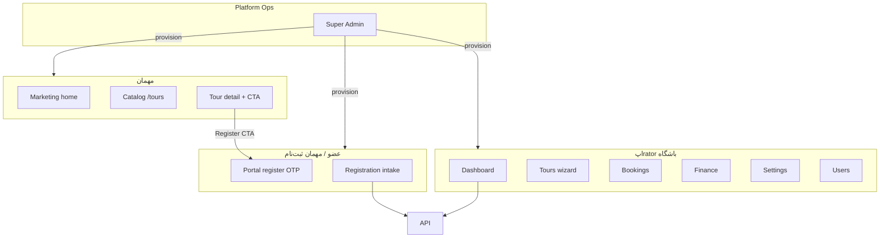
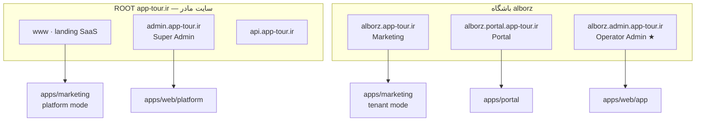

# P1 — Platform Control Center · نقشه کامل سایت + Super Admin

```yaml
doc_id: P1-PLATFORM-MAP
version: 4.1
status: master-roadmap
date: 2026-06-20
prerequisite: P0 complete
product: app-tour — SaaS باشگاه‌های کوهنوردی (workspace اول: Denali)
audience: Architect · implementer · Super Admin UX
related:
  - TEMP/ROADMAP-INDEX.md
  - TEMP/p1-platform-control-center.md
  - docs/MIGRATION-MAP.md §3.5 · §3.6 · §7.4
  - packages/workspaces/denali/workspace.manifest.json
  - TEMP/wizard-denali-enterprise-assessment.md
phase_files:
  P0: TEMP/p0-platform-foundation.md
  P1: TEMP/p1-platform-control-center.md
  P2: TEMP/p2/README.md
  P3: TEMP/p3-metadata-platform.md
```


---

## فهرست فازها

| فاز | فایل | زیرفاز | گام |
|-----|------|--------|-----|
| P0 ✅ | [p0-platform-foundation.md](./p0-platform-foundation.md) | 5 | 20 |
| **P1** | [p1-platform-control-center.md](./p1-platform-control-center.md) | 8 EPIC · v4.0-ai | 264 nano-tasks |
| P2 | [p2/README.md](./p2/README.md) | 5 EPIC | 24 |
| P3 | [p3-metadata-platform.md](./p3-metadata-platform.md) | 4 | 22 |

→ [ROADMAP-INDEX.md](./ROADMAP-INDEX.md)

---

## بخش A — چه سایتی می‌سازیم؟ (North Star)

### A.1 یک جمله

> **هر باشگاه (tenant) یک «سایت محصول» مستقل دارد:** landing عمومی · ثبت‌نام مهمان · پنل مدیریت اپrator — همه روی workspace **Denali** (تور کوهنوردی، مالی، رزرو).

### A.2 سه لایه هویت

```text
┌─────────────────────────────────────────────────────────────┐
│ PLATFORM (app-tour)                                         │
│  Super Admin — onboard باشگاه · domain · workspace assign   │
└────────────────────────────┬────────────────────────────────┘
                             │
┌────────────────────────────▼────────────────────────────────┐
│ TENANT = باشگاه (مثلاً «کوهنوردی البرز»)                    │
│  subdomain + custom domain · RLS · branding · users         │
└────────────────────────────┬────────────────────────────────┘
                             │
┌────────────────────────────▼────────────────────────────────┐
│ WORKSPACE = نوع محصول (denali)                              │
│  wizard · finance · catalog · settings modules · theme CSS  │
└─────────────────────────────────────────────────────────────┘
```

### A.3 سه اپ per باشگاه (MAP §3.5)

| App | Package | Port dev | نقش | Auth |
|-----|---------|----------|-----|------|
| **Marketing** | `apps/marketing` | 3002 | Landing · SEO · catalog عمومی | Guest |
| **Portal** | `apps/portal` | 3003 | ثبت‌نام تور · OTP member | Public auth |
| **Admin** | `apps/web (app)` | 3000 | پنل operator باشگاه | OTP operator |


### A.4 چهار zone دامنه — سایت مادر + باشگاه

```text
app-tour.ir (ROOT — سایت مادر SaaS)
├── www.app-tour.ir              → Landing پلتفرم · pricing · درباره ما
├── admin.app-tour.ir            → Super Admin (PlatformOps) — بدون tenant
├── api.app-tour.ir              → API
│
└── باشگاه {club} (tenant)
    ├── {club}.app-tour.ir       → Marketing / Landing باشگاه (SEO)
    ├── {club}.portal.app-tour.ir → Portal · ثبت‌نام OTP
    └── {club}.admin.app-tour.ir  → پنل Operator باشگاه ★
```

**DEC-P1-020:** پنل operator **همیشه** `{club}.admin.{root}` — نه روی apex باشگاه.  
**دلیل:** apex باشگاه (`{club}.app-tour.ir`) برای landing/catalog است؛ root (`app-tour.ir`) برای سایت مادر app-tour.

| Zone | Host | App | Tenant context |
|------|------|-----|----------------|
| **Platform mother** | `app-tour.ir` · `www.*` | `apps/marketing` یا `apps/public` (v2) | none — platform brand |
| **Platform Super Admin** | `admin.app-tour.ir` | `apps/web/(platform)` | PlatformOps |
| **Club marketing** | `{club}.app-tour.ir` | `apps/marketing` | tenant |
| **Club portal** | `{club}.portal.app-tour.ir` | `apps/portal` | tenant |
| **Club operator admin** | `{club}.admin.app-tour.ir` | `apps/web/(app)` | tenant |

**Reserved tenant subdomains (cannot name a club):** `admin` · `www` · `api` · `platform` · `portal` · `marketing` · …  
(`packages/tenant-kernel` — `admin` already reserved as first label; `{club}.admin.*` is two-level parse.)




**Trunk today:** `apps/web` هنوز برخی routeهای public/auth دارد (گذار M2b) — target: registration عمدتاً `apps/portal` · catalog در `apps/marketing`.

---

## بخش B — Site Map کامل (Denali · باشگاه)

### B.1 Marketing — `apps/marketing` (عمومی)

| Route | Page | Data/API |
|-------|------|----------|
| `/` | Landing home | tenant branding · CTA → `/tours` |
| `/tours` | Catalog list | `GET /denali/catalog` (via BFF) |
| `/tours/[tourId]` | Tour detail · SEO metadata | catalog card · itinerary · photos |
| `/tours/[tourId]` | **Register CTA** | link → Portal registration URL |

**ویژگی‌ها:** `fetchPublicTenantBranding` · `resolveMarketingBootstrapForHost` · revalidate cache · fa/en.

**Super Admin control:** enable/disable surface · branding seed · domain · publish gate (operator must set tour active).

### B.2 Portal — `apps/portal` (عضو)

| Route | Page | Flow |
|-------|------|------|
| `/` | redirect → Marketing | |
| `/catalog/[tourId]/register` | Registration wizard | OTP phone → verify → register-complete |

**API (BFF):** `/api/public-auth/*` · `/api/catalog/registrations`

**Super Admin control:** enable portal surface · owner not required for guest flow.

### B.3 Admin — `apps/web/app/(app)` (operator باشگاه)

#### Navigation (operator shell)

| Nav | Route | Denali module |
|-----|-------|---------------|
| Dashboard | `/dashboard` | KPI widgets |
| Tours | `/tours` · `/tours/new` · `/tours/[id]/edit` | wizardSurfaces · wizardMedia · tourWrite |
| Bookings | `/bookings` · `/bookings/new` | registrationOps manifest |
| Users | `/users` | identity · invites · RBAC |
| Finance | `/finance` | finance-ops manifest · 15+ API routes |
| Settings | `/settings/*` | operatorSettings (10 modules) |
| Leader | `/leader/review` | registration ops alias |

#### Settings subtree (Denali)

| Module | Route | kind |
|--------|-------|------|
| Branding | `/settings/branding` | logo · displayName |
| Equipment | `/settings/equipment` | reference_data |
| Guide languages | `/settings/guide-languages` | reference_data |
| Tour themes | `/settings/tour-themes` | reference_data |
| Locations | `/settings/locations` | regions · destinations |
| Tour presets | `/settings/tour-presets` | reference_data |
| Wizard template | `/settings/tour-wizard-template` | tenant_config overlay |
| Wizard drafts | `/settings/wizard-drafts` | explorer |
| Presets advanced | `/settings/tour-presets/advanced` | tenant_config |
| Audit trail | `/settings/audit-trail` | explorer |
| Reconciliation | `/settings/reconciliation-triage` | finance ops |

#### Tour workspace (per tour)

| Route | Feature |
|-------|---------|
| `/tours/[id]/workspace` | registrations overview |
| `.../waitlist` | waitlist |
| `.../transport` | transport ops |

**Super Admin control:** seed wizard template · default settings · invite owner — **not** day-to-day tour ops.

### B.4 API backend — `apps/api` (shared)

| Domain | Denali endpoints (manifest) |
|--------|---------------------------|
| Catalog | `GET /denali/catalog` · `GET /denali/catalog/:id` |
| Registration | `POST /denali/registrations` |
| Finance | `/finance/*` (reports · payments · receipts · schedules · …) |
| Tours | canonical write · wizard photos · clone remint |
| Settings | modules · resources · tenant_config |
| Identity | OTP · users · invites |
| Tenant | branding public · tenant-config |

### B.5 Denali plugin — inventory (packages/workspaces/denali)

| Surface | Contract | Files |
|---------|----------|-------|
| Field registry + rules | WorkspacePlugin | ~60 wizard fields |
| Composite UI | wizardSurfaces | map · photos · itinerary · … |
| Finance hooks | events + httpRoutes | ledger · outbox |
| Public catalog | publicCatalog | DenaliCatalogCard |
| Bookings ops | registrationOps | inbox · board · timeline |
| Finance ops | financeOps manifest | panels config |
| Settings | operatorSettings | 10 modules |
| Theme | themeStylesheets | tokens · admin CSS |
| i18n | wizardI18n | fa/en messages |
| Media | wizardMedia · cloneRemint | MinIO |

---

## بخش C — User Journeys

### C.1 مهمان → ثبت‌نام تور

```text
alborz.marketing.app-tour.ir/tours
  → tour detail
  → [ثبت‌نام] → alborz.portal.app-tour.ir/catalog/{id}/register
  → OTP
  → POST registration
  → (optional) operator approve in admin
```

### C.2 Owner باشگاه → راه‌اندازی

```text
Super Admin creates club
  → owner OTP invite
  → alborz.admin.app-tour.ir/auth/login
  → settings: branding · wizard template publish
  → /tours/new (Denali wizard)
  → publish tour (publishStatus=active)
  → appears on Marketing catalog
```

### C.3 Platform Ops → باشگاه جدید

```text
admin.app-tour.ir
  → Create club wizard (4 step)
  → tenant row + seed + invite
  → monitor sites health
```

---

## بخش D — Domain architecture (v4.1)

### D.1 نمای کلی — 4 لایه Host



### D.2 جدول URL — production

| Zone | Host pattern | App | v1 |
|------|--------------|-----|-----|
| **Platform landing** | `app-tour.ir` · `www.app-tour.ir` | mother marketing site | P1 stub · P2 full |
| **Super Admin** | `admin.app-tour.ir` | `(platform)` shell | P1 |
| **API** | `api.app-tour.ir` | `apps/api` | ✅ |
| **Club marketing** | `{club}.app-tour.ir` | `apps/marketing` | P1 |
| **Club portal** | `{club}.portal.app-tour.ir` | `apps/portal` | P1 |
| **Club operator admin** | `{club}.admin.app-tour.ir` | `apps/web (app)` | P1 ★ |

### D.3 Dev hosts

| Zone | Host |
|------|------|
| Platform mother | `localhost:3002` + `Host: app-tour.localhost` (یا env `PLATFORM_ROOT_HOST`) |
| Super Admin | `admin.localhost:3000/platform` |
| Club marketing | `alborz.localhost:3002` |
| Club portal | `alborz.portal.localhost:3003` |
| Club admin | `alborz.admin.localhost:3000` |

### D.4 Ingress parse algorithm (DEC-P1-021)

```text
normalize Host
  │
  ├─ host == root OR host == www.root
  │     → platform_mother (no tenant)
  │
  ├─ host == admin.root
  │     → platform_super_admin (no tenant)
  │
  ├─ host == api.root
  │     → api ingress
  │
  ├─ match {club}.admin.root
  │     → tenant=club · surface=admin · app=web/(app)
  │
  ├─ match {club}.portal.root
  │     → tenant=club · surface=portal · app=portal
  │
  ├─ match {club}.root  (single label)
  │     → tenant=club · surface=marketing · app=marketing
  │
  ├─ match custom domain (tenant_domains) — v1.5
  │     → tenant + surface from DB row
  │
  └─ else → 404 platform not-found
```

**Implementation note:** `parseWorkspaceTenantLabelFromHost` today = single label `{club}.root`.  
Phase P1 ingress: extend tenant-kernel or edge router for `{club}.{surface}.root`.

### D.5 Custom domain per باشگاه (v1.5)

| Surface | CNAME target | Example custom |
|---------|--------------|----------------|
| Marketing | `gateway-marketing.app-tour.ir` | `www.alborzclub.ir` |
| Portal | `gateway-portal.app-tour.ir` | `join.alborzclub.ir` |
| Admin | `gateway-admin.app-tour.ir` | `panel.alborzclub.ir` |

Platform mother custom: `app-tour.ir` owned by platform — not tenant_domains.

### D.6 Platform mother site — scope (P1 stub → P2)

| Page | Host | Content |
|------|------|---------|
| Home | `app-tour.ir` | «پلتفرم مدیریت باشگاه کوهنوردی» |
| Pricing | `/pricing` | plans (v2) |
| Contact | `/contact` | |
| Login PlatformOps | link → `admin.app-tour.ir` | |

**P1:** redirect `app-tour.ir` → docs یا minimal landing static.  
**P2:** `apps/public` یا marketing `platformMode=true`.

### D.7 Super Admin URL change

| Before (v4.0) | After (v4.1) |
|---------------|--------------|
| `platform.app-tour.ir` | **`admin.app-tour.ir`** (platform-level admin) |
| — | `{club}.admin.*` = operator admin باشگاه |

**تفکیت:** `admin.app-tour.ir` = PlatformOps · `alborz.admin.app-tour.ir` = operator باشگاه.

### D.8 Create club — preview URLs (wizard step 4)

```text
Marketing:  https://alborz.app-tour.ir
Portal:     https://alborz.portal.app-tour.ir
Admin:      https://alborz.admin.app-tour.ir/auth/login   ★
```

## بخش E — Super Admin: Platform Control Center

### E.1 سه پنل — تفکیک نقش

| Panel | کاربر | Scope |
|-------|-------|-------|
| **Platform Control Center** | PlatformOps staff | همه باشگاه‌ها |
| **Operator Admin** | owner/admin/member باشگاه | یک tenant |
| **Portal** | guest/member | registration |

**هرگز merge نکن.**

### E.2 Information Architecture (کامل)

```text
Platform Control Center
│
├── 1. Overview (Dashboard)
│     • clubs total / active / suspended
│     • new clubs (7d)
│     • workspace breakdown (denali count)
│     • site health aggregate (marketing up %)
│     • platform audit tail (10 events)
│     • alerts: failed domain verify · suspended · seed missing
│
├── 2. Clubs (باشگاه‌ها)                    ← core entity
│     ├── List (search · filter · pagination)
│     ├── Create (4-step wizard)
│     └── Detail [clubId]
│           ├── Profile
│           │     displayName · subdomain · workspace · status · created
│           ├── Sites & URLs                  ← maps to 3 apps
│           │     Marketing URL · health · last check
│           │     Portal URL · health
│           │     Admin URL · health
│           │     [Open site] [Copy URL]
│           ├── Domains (v1.5)
│           │     custom hostname · CNAME · verify · SSL status
│           ├── Branding (platform seed)
│           │     displayName · primaryColor · logo (optional upload)
│           ├── Provisioning
│           │     wizard template seeded? · settings seeded?
│           │     [Re-seed template] [Re-seed defaults]
│           ├── Owner & access
│           │     owner phone/email · invite status · resend
│           │     (v2: impersonate read-only support)
│           ├── Surfaces toggle
│           │     marketing on/off · portal on/off · admin on/off
│           ├── Activity (audit per club)
│           └── Danger zone
│                 Suspend · Reactivate · (v2: offboard/delete)
│
├── 3. Workspaces (catalog — read-only)
│     denali — «کوهنوردی · finance · catalog»
│       surfaces: M+P+A · settings modules: 10 · finance panels: 6
│     urban — minimal (future clubs)
│     starter — dev template
│
├── 4. Platform Team (v1.5)
│     PlatformOps users · roles: owner · admin · support
│
├── 5. Platform Audit
│     cross-tenant log · filter actor/action/tenant/date
│
└── 6. Platform Settings (v2)
      root domain · default workspace · feature flags · email templates
```

### E.3 Create Club — 4-step wizard (maps to site stack)

| Step | Fields | Provisions |
|------|--------|------------|
| **1 Identity** | displayName · subdomain (live check) | tenant row |
| **2 Product** | workspace=denali (v1 locked) | workspace_type |
| **3 Sites** | ☑ Marketing ☑ Portal ☑ Admin | site_surfaces config |
| **4 Launch** | owner phone · seed options · review URLs | invite · wizard seed · branding |

**Post-create checklist (UI):**

```text
[ ] Owner logged in
[ ] Wizard template published (operator)
[ ] First tour created
[ ] Tour published (active) → visible on Marketing
[ ] Test registration on Portal
```

### E.4 Super Admin ↔ Site feature matrix

| Site feature | Provision (Super Admin) | Operate (Operator Admin) |
|--------------|-------------------------|--------------------------|
| Marketing landing | enable surface · domain · branding | tour publish → catalog |
| Catalog SEO | enable · domain | tour content · photos |
| Portal registration | enable surface · domain | approve bookings |
| Admin panel | enable · invite owner | everything |
| Wizard template | seed initial | customize in settings |
| Finance module | auto (denali) | daily ops |
| Custom domain | add · verify (v1.5) | — |
| Suspend club | suspend button | blocked login |

### E.5 PlatformOps RBAC

| Role | Clubs | Domains | Team | Audit |
|------|-------|---------|------|-------|
| platform_owner | CRUD | CRUD | manage | read |
| platform_admin | CRUD | CRUD | — | read |
| platform_support | read | read | — | read |

---

## بخش F — Data model

### F.1 Existing

- `tenants` — subdomain · workspaceType · theme · status
- `tenant_config` — wizard_template · site_surfaces (new key)
- `user_tenants` — operator membership

### F.2 New (P1)

```typescript
// tenant_config key: site_surfaces
{
  marketing: { enabled: boolean; healthLastCheck?: string };
  portal: { enabled: boolean };
  admin: { enabled: boolean };
  localeDefault: "fa" | "en";
}

// v1.5: tenant_domains
{ hostname, kind: "marketing"|"portal"|"admin"|"primary", verified, sslStatus }
```

---

## بخش G — API `/platform/v1`

| Method | Path | Purpose |
|--------|------|---------|
| GET | `/overview` | dashboard KPIs |
| GET | `/workspaces` | denali catalog metadata |
| GET | `/tenants` | club list |
| POST | `/tenants` | create club (full provision) |
| GET | `/tenants/:id` | club detail |
| PATCH | `/tenants/:id` | theme · status |
| GET | `/tenants/:id/sites` | 3 URLs + health |
| POST | `/tenants/:id/sites/check` | ping health |
| POST | `/tenants/:id/seed/wizard-template` | idempotent |
| POST | `/tenants/:id/seed/branding` | defaults |
| POST | `/tenants/:id/suspend` | block all surfaces |
| POST | `/tenants/:id/activate` | |
| POST | `/tenants/:id/owner/invite` | resend |
| GET | `/audit` | platform audit |
| GET/POST | `/tenants/:id/domains` | v1.5 |

---

## بخش H — UI implementation

### H.1 Host

```text
apps/web/app/(platform)/
  layout.tsx              # PlatformOps auth gate
  page.tsx                # Overview
  clubs/page.tsx          # list
  clubs/new/page.tsx      # 4-step wizard
  clubs/[id]/page.tsx     # detail tabs
  workspaces/page.tsx     # catalog
  audit/page.tsx
  team/page.tsx           # v1.5
```

**URL:** `admin.localhost:3000/platform/*` · prod `admin.app-tour.ir`

### H.2 Design principles (enterprise)

- Stripe-like dense tables · clear status badges
- Shopify-like org onboarding wizard
- FA primary · RTL · accessible
- No operator nav in platform shell
- Audit every mutating action

---

## بخش I — Delivery phases

| Phase | Scope | Weeks |
|-------|-------|-------|
| **P1-A** | API auth + tenant CRUD + seed | 1–2 |
| **P1-B** | Overview + Clubs list + Create wizard | 1–2 |
| **P1-C** | Club detail (Sites · Profile · Owner) | 1 |
| **P1-D** | Suspend · audit · health check | 0.5 |
| **P1-E** | tenant_domains schema + Domains tab | 1 |
| **P1-F** | Platform team RBAC | 1 |
| **P2** | impersonation · billing · offboard | defer |

---

## بخش J — Exit criteria (P1 complete)

- [x] باشگاه Denali از Super Admin ساخته می‌شود — E2E create-club + handoff
- [x] 3 site URL نمایش + health check — `platform-ops-ui` Sites tab
- [x] Owner invite → login admin → wizard works — `platform-owner-handoff`
- [ ] Tour publish → Marketing catalog visible — **P2**
- [ ] Portal registration end-to-end — **P2**
- [x] Suspend blocks operator — `platform-suspend-blocks-login` + ops UI
- [x] Platform audit complete — `platform-ops-ui` TENANT_CREATED
- [x] Session platform ≠ operator isolated — EPIC E specs + E2E cookies

---

## بخش K — Current vs Target ( honesty )

| Item | Today | Target |
|------|-------|--------|
| 3 apps | ✅ marketing · portal · web | same |
| Registration | portal + web (public) duplicate | portal primary |
| Custom domain | deferred Phase 7 docs | P1.5 implement |
| Admin on `{club}.admin.*` | partial (single-label dev) | P1 ingress extend |
| Platform mother landing | ❌ | P1 stub · P2 full |
| Super Admin UI | ❌ none | Platform Control Center |
| Provision prod | dev-only internal route | `/platform/v1` |

---

## بخش L — مراجع کد

| Path | Role |
|------|------|
| `apps/marketing/app/` | public site |
| `apps/portal/app/catalog/` | registration |
| `apps/web/app/(app)/` | operator admin |
| `apps/web/middleware.ts` | auth boundaries |
| `packages/workspaces/denali/` | product plugin |
| `docs/MIGRATION-MAP.md` §3.5–3.6 | 3-app architecture |
| `docs/workspaces/denali/public-catalog.md` | marketing catalog |

---

*Master roadmap v4.0 — full site map + Platform Control Center*
