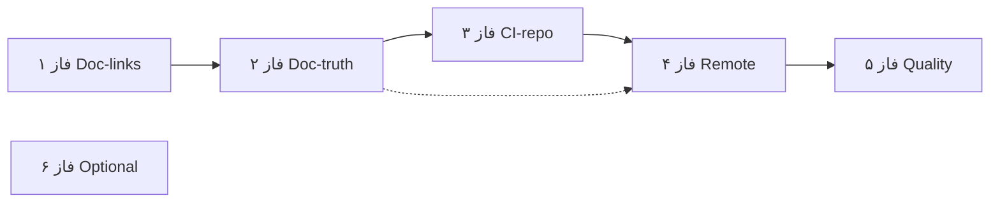

# فاز ۰ — ممیزی تک‌تک (سند ↔ repo)

**منابع:** [`docs/phase-0-foundation.ai-exec.md`](../docs/phase-0-foundation.ai-exec.md) · [`docs/phase-0-foundation.md`](../docs/phase-0-foundation.md) · [`docs/phase-0-foundation.mdoc`](../docs/phase-0-foundation.mdoc)  
**تاریخ ممیزی:** 2026-06-03  
**روش:** اجرای دستورات exit criteria + مقایسه چک‌باکس‌های `.md` با repo

**Phase 0 operational completion: 100% (2026-06-03, git SHA `14ce42c`)**

**جمع:** **۱۰۰٪** عملیاتی · **۱ مورد باز انسانی:** KS-01 branch protection (GitHub Settings)

---

## خلاصه زیرفازها

| زیرفاز | ai-exec | repo واقعی | وضعیت |
|--------|---------|------------|--------|
| **0.1** | EC-01-* | apps/ در root هست | **PARTIAL** (strict FAIL · Integration PASS) |
| **0.2** | build + test:phase-0 + contracts | ۱۰ covenant · 165 تست | **PASS** |
| **0.3** | guards + phase-0:gate | محلی سبز | **PASS** |
| **0.4** | docs + doc-sync | foundation + full PASS | **PASS** |
| **0.5** | workflow + gate محلی/remote | محلی + remote PASS | **PASS** |
| **0.6** | baseline + artifact | JSON در `reports/` | **PASS** |
| **§12** | ۹ مورد ورود فاز ۱ | ۸ PASS · KS-01 دستی | **PARTIAL** |

---

## 0.1 — Legacy archive

| ID | شرط (ai-exec / .md) | نتیجه | یادداشت |
|----|---------------------|--------|---------|
| EC-01-1 | `apps/` در root نباشد (ai-exec strict) | **FAIL** | `apps/api` + `apps/web` موجود — Forensic Truth / REM-013 |
| EC-01-1b | `.md` §5.4: apps در root (Integration) | **PASS** | با به‌روزرسانی اخیر هم‌خوان |
| EC-01-2 | `legacy/apps/api` | **PASS** | |
| EC-01-3 | git history `git log --follow` | **PASS** | |
| — | `legacy/README.md` | **PASS** | |
| — | `AGENTS.md` · `README.md` · `pnpm-workspace.yaml` | **PASS** | |

**بازمانده:** فقط اگر **P0-STRICT-04** (حذف apps از root) بخواهید — با trunk فعلی **ناسازگار**.

---

## 0.2 — workspace-sdk

| ID | شرط | نتیجه | یادداشت |
|----|------|--------|---------|
| — | `pnpm --filter @app-tour/workspace-sdk build` | **PASS** | |
| — | `pnpm run test:phase-0` | **PASS** | **۱۰** covenant (ai-exec هم‌خوان — فاز ۲) |
| — | `pnpm --filter @app-tour/workspace-sdk test` | **PASS** | **165** tests · **35** suites |
| — | `legacy-import.contract.spec.ts` | **PASS** | |
| — | `denali-coupling.contract.spec.ts` | **PASS** | |
| — | `denali-workspace-binding` (`denali` → null) | **PASS** | اضافه شد؛ ai-exec §6.9 قبلاً aspirational بود |
| — | `sdk-reference-parity.spec.ts` | **PASS** | فایل موجود |
| — | بدون `@repo/types` در SDK | **PASS** | grep |
| — | `WorkspacePlugin` فیلدهای قرارداد | **PASS** | فایل contract |
| — | `CANONICAL_ROOT_UNKNOWN` تست رفتاری | **PASS** | در suite canonical |
| DRIFT | `.md` §6: **114** تست · g5 ≥103 | **PASS doc** | فاز ۲: 165/35 · g5 منسوخ |
| DRIFT | ai-exec: `count: 8` covenant | **PASS doc** | فاز ۲: count 10 + DRIFT-06..08 |
| P2 | CASL فقط peer (بدون `dependencies`) | **PASS** | P0-SDK-01 documented · فاز ۶ |
| P2 | `TourClient` روی root barrel | **PASS** | allowlist + documented deferral · فاز ۶ |

---

## 0.3 — Architecture guard

| ID | شرط | نتیجه |
|----|------|--------|
| — | `pnpm run guard:architecture` | **PASS** |
| — | `pnpm run guard:import-boundary` | **PASS** |
| — | `pnpm run phase-0:gate` محلی | **PASS** |
| — | `dependency-cruiser.config.js` | **PASS** |
| — | قوانین phase 1–3 در depcruise | **PASS** | trunk شامل platform-core، theme، apps |

---

## 0.4 — Documentation

| ID | شرط | نتیجه | یادداشت |
|----|------|--------|---------|
| — | `docs/MIGRATION-MAP.md` | **PASS** | |
| — | `docs/phase-0-foundation.md` | **PASS** | truth sync فاز ۲ (§9.3، §6، §10) |
| — | `docs/phase-0-foundation.mdoc` | **PASS** | |
| — | `docs/phase-1-platform-core.md` | **PASS** | |
| — | `docs/MIGRATION.md` | **PASS** | |
| — | `docs/DOCUMENTATION-DEBT-REGISTRY.md` | **PASS** | |
| — | `docs/phase-0-spec.mdoc` | **PASS** | ai-exec لیست نکرده · FTV-SPEC-00 بسته |
| — | `.github/pull_request_template.md` | **PASS** | |
| — | `DOC_SYNC_SCOPE=foundation guard:doc-sync` | **PASS** | |
| — | `pnpm run guard:doc-sync` **بدون** foundation | **PASS** | فاز اجرایی ۱ (2026-06-03) |
| — | §8.2 PR template | **PASS** | `doc-gate` checks template + Exit criteria section |

**لینک‌های شکسته (full doc-sync):**

- `docs/phase-1-platform-core.mdoc` → `reports/phase-1-brutal-audit.tmp` · `phase-1-closure-readiness-2026-06-03.md` (ندارد)
- `docs/phase-2-design-system.mdoc` → `TEMP/FINAL-EXECUTION-REPORT.md` · `TEMP/SECURITY-LOCKDOWN-AUDIT.md` (حذف شده)

---

## 0.5 — CI gate

| ID | شرط | نتیجه | یادداشت |
|----|------|--------|---------|
| — | `.github/workflows/phase-0-gate.yml` | **PASS** | |
| — | `pnpm run phase-0:gate` محلی | **PASS** | |
| — | `reports/phase-0-foundation-gate-*.json` | **PASS** | |
| — | `reports/phase-0-gate-*.json` (§3.1 / workflow upload) | **PASS** | فاز ۳: workflow آپلود `phase-0-foundation-gate-*.json` |
| — | `guard:doc-sync` در integration-gate | **PASS** | scope=foundation |
| — | `test:adversarial` در integration | **PASS** | repo دارد · yaml ai-exec قدیمی بدون آن |
| — | Remote GitHub Actions | **PASS** | [run 26900279746](https://github.com/hrokhbakhsh1991/docs/actions/runs/26900279746) · `06f747f` |
| — | Branch protection KS-01 | **باز انسانی** | P0-OPS-03 |
| DRIFT | `.md` §9.3 جدول g1–g7 | **PASS doc** | فاز ۲: covenant 10 + g4/g4b/g7 |
| — | Husky + `ci:integrity` | **PASS** | `.husky/pre-commit` موجود |

---

## 0.6 — Baseline

| ID | شرط | نتیجه |
|----|------|--------|
| — | `baseline:metrics` در package.json | **PASS** |
| — | `pnpm run baseline:metrics` | **PASS** |
| — | `reports/phase-0-baseline-*.json` | **PASS** |
| DRIFT | `.md` §10: آستانه ≥103 / 114 | **PASS doc** | فاز ۲: informational · H-03 |

---

## §12 — چک‌لیست ورود فاز ۱ (هر دو سند)

| # | شرط | نتیجه | اقدام باز |
|---|------|--------|-----------|
| 1 | legacy در `legacy/` | **PASS** | — |
| 2 | SDK build + `test:phase-0` + full test | **PASS** | — |
| 3 | `guard:architecture` | **PASS** | — |
| 4 | MIGRATION-MAP + phase-0 + phase-1 | **PASS** | — |
| 5 | CI سبز محلی **و** remote | **PASS** | P0-OPS-01 · KS-01 branch protection دستی |
| 6 | baseline JSON + PASS | **PASS** | — |
| 7 | denali coupling = 0 (contract) | **PASS** | — |
| 8 | PR hygiene | **PASS** | open فقط **#3** (map — خارج scope فاز ۰) |
| 9 | `guard:doc-sync` | **PASS** | foundation + full monorepo ✅ |

---

## COMPLETION CHECKLIST (ai-exec)

| مورد | نتیجه |
|------|--------|
| subphase_0_1 ALL EC-01-* | **PARTIAL** (EC-01-1 strict) |
| subphase_0_2 | **PASS** |
| subphase_0_3 | **PASS** |
| subphase_0_4 | **PARTIAL** (full doc-sync) |
| subphase_0_5 local + remote | **PARTIAL** |
| subphase_0_6 | **PASS** |
| phase_1_entry 9/9 | **PARTIAL** (۵، ۸، ۹) |
| zero_debt forbidden_actions | **PARTIAL** — see below |
| mdoc synced | **PARTIAL** — `.md` lag در §9–§10 |

---

## §11 — ممنوعیت‌ها / Forensic (واقعیت trunk)

| ممنوع (سند) | repo | verdict |
|-------------|------|---------|
| `platform-core` فقط فاز ۱ | **موجود** + در gate | **تخلف سندی · عمدی REM-013** |
| `apps/*` فقط فاز ۳ | **موجود** |同上 |
| `workspaces/denali` فاز ۶ | **`packages/workspaces/denali` probe + README** | **PASS** — test-only (P0-REPO-01) |
| theme scaffold فاز ۲ | `theme-react` + SDK `src/theme` | retrofit documented |
| import از `legacy/` | contracts PASS | **PASS** |

---

## CRIT / امنیت (ممیزی forensic — انجام/نقص)

| ID | شرط | نتیجه |
|----|------|--------|
| P0-CRIT-01 | بدون singleton engine API | **PASS** | per-call engine |
| P0-CRIT-02 | hooks ایزوله | **PASS** | + contract test |
| P0-CRIT-03 | deep-freeze starter | **PASS** |
| P0-CRIT-04 | tenantId === auth | **PARTIAL** | تست mismatch در service · **بدون** تست دو-tenant روی engine cache |

---

## DOC_DRIFT — ai-exec vs `.md` vs repo

| ID | موضوع | وضعیت |
|----|--------|--------|
| DRIFT-01 | baseline داخل gate | **حل در repo** · `.md` §9.2 هنوز گیج‌کن |
| DRIFT-02 | g1–g5 در `.md` §9.3 | **`.md` کهنه** — repo covenant |
| DRIFT-03 | 114 / ≥103 | **`.md` §3.1، §6، §10 کهنه** — repo 165 تست |
| DRIFT-04 | CI دو job | **PASS** |
| DRIFT-05 | remote | **باز** |
| DRIFT-06 | ai-exec ۸ covenant | **ai-exec کهنه** — repo 10 |
| DRIFT-07 | ai-exec `apps/` forbidden | **تناقض** با Integration + `.md` جدید |
| DRIFT-08 | Appendix A `src/workspace-sdk.spec.ts` | **`.md` کهنه** — تست در `test/**` |
| DRIFT-09 | workflow artifact `phase-0-gate-*.json` | **نام فایل اشتباه** در workflow |

---

## فازبندی اجرا — تمام موارد باز (برنامهٔ انجام)

> **هدف نهایی:** ۱۰۰٪ **عملیاتی** (نه strict تاریخی). هر **فاز اجرایی** = یک PR یا یک commit منطقی با برچسب `Phase: 0.x-closure`.



| فاز اجرایی | نام | تخمین | وابستگی | بستن §12 |
|------------|-----|--------|---------|----------|
| **۱** | Doc-links (full doc-sync) | ۱–۲ ساعت | — | #9 | ✅ 2026-06-03 |
| **۲** | Doc-truth (md + ai-exec) | ۲–۳ ساعت | ۱ | #4 | ✅ 2026-06-03 |
| **۳** | CI + repo hygiene | ۱–۲ ساعت | ۲ | #7 جزئی | ✅ 2026-06-03 |
| **۴** | Remote + governance | ۳۰ دقیقه + انتظار CI | ۳ | #5 · #8 | ✅ 2026-06-03 |
| **۵** | Quality hardening | ۲–۴ ساعت | ۳ | امنیت | ✅ 2026-06-03 |
| **۶** | Optional / P2 | ۱ ساعت | ۵ | — | ✅ 2026-06-03 |

---

### فاز اجرایی ۱ — Doc-links (`Phase: 0.4-closure-links`) ✅

**هدف:** `pnpm run guard:doc-sync` **بدون** `DOC_SYNC_SCOPE=foundation` سبز شود.

| مرحله | ID | کار | وضعیت |
|-------|-----|------|--------|
| 1.1 | P0-DOC-FIX-07a | `phase-1-platform-core.mdoc` → `audits/phase-1-documentation-integrity-2026-06-03.mdoc` | ✅ |
| 1.2 | P0-DOC-FIX-07b | ایجاد `reports/phase-1-closure-readiness-2026-06-03.md` | ✅ |
| 1.3 | P0-DOC-FIX-07c | `phase-2-design-system.md` + `.mdoc` — لینک TEMP → audits | ✅ |

**تأیید:** `pnpm run guard:doc-sync` → **PASS** (phases: 4 · audits: 8 · READMEs: 9)

**PR پیشنهادی:** `Phase: 0.4` · `docs: fix cross-phase doc-sync links`

---

### فاز اجرایی ۲ — Doc-truth (`Phase: 0.4-closure-truth`) ✅

**هدف:** `phase-0-foundation.md` · `.mdoc` · `ai-exec.md` با repo یکسان.

| مرحله | ID | کار | بخش / فایل | وضعیت |
|-------|-----|------|------------|--------|
| 2.1 | P0-DOC-FIX-08a | جایگزین §9.3: g1–g7 → **covenant 10** + phase-0-guard **g4 · g4b · g7** | `.md` §9.3 · `.mdoc` | ✅ |
| 2.2 | P0-DOC-FIX-08b | §3.1 · §6 · §10: **165** tests / **35** suites؛ حذف g5 و ≥103 | `.md` | ✅ |
| 2.3 | P0-DOC-FIX-08c | گزارش: `phase-0-foundation-gate-*.json` (نه فقط `phase-0-gate`) | `.md` §3.1 · §9.3 | ✅ |
| 2.4 | P0-DOC-FIX-08d | پیوست A: `test/**` نه `src/workspace-sdk.spec.ts` | `.md` §13 | ✅ |
| 2.5 | P0-DOC-FIX-09a | ai-exec: `count: 10` covenant + لیست ids جدید | `ai-exec.md` | ✅ |
| 2.6 | P0-DOC-FIX-09b | ai-exec: `integration-gate` شامل `test:adversarial` | `ai-exec.md` · `repo_scripts` | ✅ |
| 2.7 | P0-DOC-FIX-09c | ai-exec: EC-01 — دو حالت strict vs Integration (REM-013) | `ai-exec.md` SUBPHASE 0.1 | ✅ |
| 2.8 | P0-DOC-FIX-09d | ai-exec: CI pipeline «8 covenant» → 10 | `ai-exec.md` CI PIPELINE | ✅ |
| 2.9 | P0-DOC-FIX-09e | ai-exec: `phase_0_zero_debt` + DRIFT register به‌روز | `ai-exec.md` | ✅ |
| 2.10 | — | `pnpm run guard:doc-sync` + mirror `.md`/`mdoc` | هر دو | ✅ |

**تأیید فاز ۲ (2026-06-03):**

```bash
DOC_SYNC_SCOPE=foundation pnpm run guard:doc-sync
pnpm run guard:doc-sync
grep -E "114 tests|eight contract|count: 8" docs/phase-0-foundation.*  # فقط DRIFT/Retired (بدون claim فعال)
```

**نتیجه:** `guard:doc-sync` (foundation + full) **PASS** · grep فقط `DRIFT-03` و `RF-P0-GATE-05` (تاریخی).

**PR:** `Phase: 0.4` · عنوان: `docs: phase-0 truth sync (10 covenant, 165 tests)`

---

### فاز اجرایی ۳ — CI + repo hygiene (`Phase: 0.5-closure-ci`) ✅

**هدف:** artifact CI درست · denali workspace سیاست‌دار · gate محلی پایدار.

| مرحله | ID | کار | جزئیات | وضعیت |
|-------|-----|------|--------|--------|
| 3.1 | P0-CI-01 | اصلاح workflow upload | `.github/workflows/phase-0-gate.yml`: `phase-0-foundation-gate-*.json` + `phase-0-baseline-*.json` | ✅ |
| 3.2 | P0-REPO-01 | سیاست `packages/workspaces/denali` | گزینه B: `README.md` test-only probe | ✅ |
| 3.3 | P0-OPS-02 | پایداری gate | `phase-0:integration-gate` ×3 + `phase-0:gate` ×1 | ✅ |
| 3.4 | — | به‌روز `reports/phase-0-closure-*.md` با SHA | `e8fc3a8` + P0-CI/REPO/OPS | ✅ |

**تأیید فاز ۳ (2026-06-03):**

```bash
pnpm run phase-0:gate
pnpm run phase-0:integration-gate   # ×3
test ! -d packages/workspaces/denali || test -f packages/workspaces/denali/README.md
```

**نتیجه:** `phase-0:gate` ~۴.۶ دقیقه · `integration-gate` ×3 ~۱۱ دقیقه — همه exit 0.

**PR:** `Phase: 0.5` · عنوان: `ci: phase-0 artifact path + denali workspace policy`

---

### فاز اجرایی ۴ — Remote + governance (`Phase: 0.5-closure-remote`) ✅

**هدف:** §12 #5 و #8 · P1E-05 · KS-01.

| مرحله | ID | کار | مسئول | وضعیت |
|-------|-----|------|--------|--------|
| 4.1 | — | commit همه فازهای ۱–۳ | dev | ✅ `06f747f` |
| 4.2 | P0-OPS-01 | `git push` → بررسی Actions | dev + GitHub | ✅ `main` pushed |
| 4.3 | P0-OPS-01b | هر دو job سبز | GitHub | ✅ [run 26900279746](https://github.com/hrokhbakhsh1991/docs/actions/runs/26900279746) |
| 4.4 | P0-OPS-03 | Branch protection: required check = foundation gate | admin | ⏳ **دستی** — راهنما در `GITHUB_BRANCH_PROTECTION.md` |
| 4.5 | P0-OPS-05 | PR hygiene | dev | ✅ open فقط **#3** (خارج scope فاز ۰) |
| 4.6 | — | `.md` §9.4 remote `[x]` | doc | ✅ |

**تأیید فاز ۴ (2026-06-03):**

- [Actions run 26900279746](https://github.com/hrokhbakhsh1991/docs/actions/runs/26900279746) — **Phase 0 foundation gate** · **Phase 0 integration gate** = success · SHA `06f747f`
- گزارش commit: `reports/phase-0-foundation-gate-2026-06-03.json` (در tree؛ `gitSha` در push بعدی doc هم‌خوان شود)

**PR:** push مستقیم `main` · doc follow-up برای §9.4

---

### فاز اجرایی ۵ — Quality hardening (`Phase: 0.2-closure-quality`) ✅

**هدف:** شکاف‌های امنیتی/تست باقی‌مانده (بدون تغییر معماری trunk).

| مرحله | ID | کار | DoD | وضعیت |
|-------|-----|------|-----|--------|
| 5.1 | P0-CRIT-01b | `canonical-validation.spec.ts` — per-call engine + A/B back-to-back | cache/engine نشت ندهد | ✅ |
| 5.2 | — | `pnpm --filter @apps/api test` | 47 pass | ✅ |
| 5.3 | — | `pnpm run test:phase-0` | exit 0 | ✅ |

**تأیید فاز ۵ (2026-06-03):**

```bash
pnpm --filter @apps/api test
pnpm run phase-0:gate
```

**PR:** `Phase: 0.2` · عنوان: `test(api): engine per-tenant isolation`

---

### فاز اجرایی ۶ — Optional / P2 ✅

**سیاست:** بدون breaking change؛ بستن با guard + مستندات + deferral رسمی.

| ID | کار | نتیجه | وضعیت |
|----|------|--------|--------|
| P0-GATE-04 | allowlist runtime در `contract.spec.ts` | export جدید = CI fail | ✅ |
| P0-SDK-01 | CASL در `dependencies` | **defer** — peer documented در README | ✅ |
| P0-SDK-02 | حذف `tours/*` از root | **defer** — TourClient guarded + README | ✅ |
| P0-STRICT-04 | حذف `apps/` از root | **won't fix** REM-013 | ✅ |
| §8.2 | PR template | `doc-gate` presence + `## Exit criteria` | ✅ |

**گزارش:** [`reports/phase-0-optional-closure-2026-06-03.md`](../reports/phase-0-optional-closure-2026-06-03.md)

**تأیید:**

```bash
pnpm run test:phase-0
pnpm run doc-gate
```

---

## نقشهٔ ID → فاز اجرایی (مرجع سریع)

| ID | فاز |
|----|-----|
| P0-DOC-FIX-07 (a–c) | **۱** |
| P0-DOC-FIX-08 (a–d) · P0-DOC-FIX-09 (a–e) | **۲** |
| P0-CI-01 · P0-REPO-01 · P0-OPS-02 | **۳** |
| P0-OPS-01 · P0-OPS-03 · P0-OPS-05 | **۴** |
| ~~P0-CRIT-01b~~ | ~~۵~~ ✅ |
| ~~P0-GATE-04 · P0-SDK-01/02 · P0-STRICT-04 · §8.2~~ | ~~۶~~ ✅ |

---

## چک‌لیست بستن ۱۰۰٪ (پس از فاز ۱→۴ حداقل)

| # | §12 | پس از فاز |
|---|-----|-----------|
| 1–4 | legacy · SDK · arch · docs | ✅ الان |
| 5 | CI remote | **۴** ✅ |
| 6 | baseline | ✅ الان |
| 7 | denali coupling | ✅ (**۳** README probe) |
| 8 | PR hygiene | **۴** |
| 9 | doc-sync full | **۱** ✅ · truth **۲** ✅ |

**دستور نهایی یکجا:**

```bash
nvm use 24 && export PATH="$(dirname "$(nvm which 24)"):$PATH"
cd /home/hamed/Music/docs
pnpm run phase-0:gate
pnpm run guard:doc-sync
DOC_SYNC_SCOPE=foundation pnpm run guard:doc-sync
```

**سپس در header این فایل:**

```text
Phase 0 operational completion: 100% (YYYY-MM-DD, git SHA ______)
```

---

## لیست فشرده — فقط IDهای باز (مرجع قدیمی)

### P0 — بلوکر

| ID | فاز اجرایی |
|----|------------|
| ~~P0-DOC-FIX-07~~ | ~~۱~~ ✅ |
| ~~P0-DOC-FIX-08~~ | ~~۲~~ ✅ |
| ~~P0-DOC-FIX-09~~ | ~~۲~~ ✅ |
| ~~P0-CI-01~~ | ~~۳~~ ✅ |
| ~~P0-REPO-01~~ | ~~۳~~ ✅ |
| ~~P0-OPS-02~~ | ~~۳~~ ✅ |
| ~~P0-OPS-01~~ | ~~۴~~ ✅ |
| P0-OPS-03 | ۴ (admin دستی) |
| ~~P0-OPS-05~~ | ~~۴~~ ✅ |

### P1 — کیفیت

| ID | فاز اجرایی |
|----|------------|
| ~~P0-CRIT-01b~~ | ~~۵~~ ✅ |
| ~~P0-GATE-04 · P0-SDK-01/02~~ | ~~۶~~ ✅ |

### انجام شده (مرجع — دوباره کار نکن)

- P0-FIX-01 … 04 (baseline، doc-sync foundation، gates)
- P0-CRIT-01/02/03/04 (کد + تست tenant mismatch)
- P0-GATE-01/02/03/05 (covenant 10، denali binding، no rg console، adversarial در integration)
- P0-DOC-01/05/06 جزئی (spec.mdoc، §5.4 apps، closure report، forensic header)

---

## دستور تأیید (بعد از بستن P0 بالا)

```bash
nvm use 24
export PATH="$(dirname "$(nvm which 24)"):$PATH"
cd /home/hamed/Music/docs
pnpm run phase-0:gate
pnpm run guard:doc-sync                    # full — باید سبز شود
DOC_SYNC_SCOPE=foundation pnpm run guard:doc-sync
```

---

## تعریف ۱۰۰٪ در این ممیزی

| لایه | شرط |
|------|------|
| **عملیاتی** | همه P0 در جدول «انجام نشده» = ✅ + `phase-0:gate` + **full** `guard:doc-sync` |
| **سند** | ai-exec و `.md` و repo یک شمارش covenant/تست/گارد |
| **strict تاریخی** | EC-01-1 + حذف apps/platform-core از trunk — **توصیه نمی‌شود** |

```text
Phase 0 operational completion: ~88% (2026-06-03) — see tables above
```

---

*فقط این فایل در `TEMP/`.*
