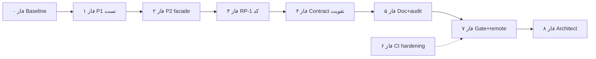

ددغغ# فاز ۱ — ممیزی تک‌تک (سند ↔ repo ↔ forensic audit)

**منابع:** [`audits/phase-1-forensic-audit.md`](../audits/phase-1-forensic-audit.md) · [`docs/phase-1-platform-core.ai-exec.md`](../docs/phase-1-platform-core.ai-exec.md) · [`docs/phase-1-platform-core.mdoc`](../docs/phase-1-platform-core.mdoc) · [`reports/phase-1-closure-readiness-2026-06-03.md`](../reports/phase-1-closure-readiness-2026-06-03.md) · [`docs/MIGRATION-MAP.md`](../docs/MIGRATION-MAP.md) §14.1  
**تاریخ ممیزی:** 2026-06-03  
**روش:** خواندن کامل `phase-1-forensic-audit.md` (§1–§13) + `pnpm run phase-1:gate` محلی + تطبیق زیرفازهای 1.1–1.6

**وضعیت فعلی (trunk):**

```text
Phase 1 technical gate: PASS (phase-1:gate محلی 2026-06-03)
Phase 1 operational completion: ~96% — فاز ۰–۵ doc بسته @ working tree · فاز ۶–۸ + G.1 باز
```

**Baseline فاز ۰:** 2026-06-03 · SHA `ac12e3f` · همه §A.1–A.8 سبز · [`reports/phase-1-guard-2026-06-03.json`](../reports/phase-1-guard-2026-06-03.json) (14/14)

**جمع باز:** **MAP §14.1** امضای معمار · **۱۵+** تست رفتاری (§9.3) · **BL-01** · **RP-1** · **۴** blind spot CI (§4.2) · doc drift جزئی · commit گزارش forensic

---

## خلاصه زیرفازهای 1.1–1.6 (ai-exec)

| زیرفاز | هدف | gate / spec | وضعیت trunk |
|--------|------|-------------|-------------|
| **1.1** | Scaffold `platform-core` | build · lint · tree | **PASS** |
| **1.2** | `FieldRegistryEngine` | `field-registry.engine.spec.ts` (7) | **PASS** |
| **1.3** | `RuleEngine` + index | `rule.engine.spec.ts` (25+) · concurrency | **PASS** |
| **1.4** | `render-plan.steps` (نه `StepEngine`) | `step.engine.spec.ts` (6) | **PASS** · **RP-1** ساده‌سازی اختیاری |
| **1.5** | `buildRenderPlan` headless | `render-plan.spec.ts` (7) | **PASS** |
| **1.6** | `PlatformWizardEngine` + guards | `phase-1:gate` · contract · facade | **PASS** · تست‌های §9.3 ناقص |

**ثبت forensic (بدون تخلف North Star):**

| ممیزی | نتیجه |
|--------|--------|
| Security Infiltration (denali / react / workspaces product) | **0** (§3) |
| Critical Isolation Vulnerability | **0** (§12) |
| Facade Integrity Breach | **0** (§13) |
| Behavioral Lies (RuleEngine stub) | **0** · **BL-01** بسته در P1 (gate سیم‌کشی + unit) |
| Architectural Theater | **AT-RPS-01** low (`listStepIds`) |

---

## §A — چک‌لیست فنی «الان سبز است» (تأیید مجدد قبل از ۱۰۰٪)

| # | دستور / شرط | انتظار | وضعیت |
|---|-------------|--------|--------|
| A.1 | `pnpm --filter @app-tour/platform-core build` | exit 0 | ✅ 2026-06-03 · `ac12e3f` |
| A.2 | `pnpm --filter @app-tour/platform-core test` | ≥132 تست | ✅ 2026-06-03 · 132 tests (g2) |
| A.3 | `pnpm --filter @app-tour/platform-core run test:phase-1` | 17+ contract | ✅ 2026-06-03 · 17 pass |
| A.4 | `pnpm run phase-1:gate` | 14/14 guard | ✅ 2026-06-03 · `ac12e3f` |
| A.5 | `pnpm run guard:architecture` | depcruise PASS | ✅ 2026-06-03 |
| A.6 | `rg -i denali packages/platform-core -g '!**/*.spec.ts'` | 0 | ✅ 2026-06-03 · 0 matches |
| A.7 | Consumer `rg 'from "@app-tour/platform-core"' apps packages/workspaces` | فقط facade + types | ✅ 2026-06-03 |
| A.8 | `node -e "import('@app-tour/platform-core/engine/rule.engine')"` | `ERR_PACKAGE_PATH_NOT_EXPORTED` | ✅ 2026-06-03 |

---

## §B — شکاف‌های §9 forensic (تست رفتاری — اولویت‌دار)

> **تعریف:** «تست concrete» = `it()` با assert روی خروجی runtime — نه فقط `fs` / regex / depcruise.

### B.1 — اولویت P1 (بستن BL-01 + قرارداد validation)

| ID | کار ریز | فایل هدف | DoD | وضعیت |
|----|---------|----------|-----|--------|
| P1-01a | تصمیم: **حذف** `passesHiddenFieldKindGate` از export یا **سیم‌کشی** به `isEmptyCanonicalValue` | `canonical-field-validation-contract.ts` · `validate-canonical-field.ts` | `rg passesHiddenFieldKindGate` ≥2 فایل (تعریف + مصرف) یا export حذف | ✅ |
| P1-01b | اگر نگه‌داری: جدول unit per `kind` (text, number, boolean, date, enum, composite) | `test/unit/contracts/hidden-field-kind-gate.spec.ts` (جدید) یا گسترش `canonical-value.spec.ts` | 6+ `it` | ✅ 7 `it` |
| P1-01c | به‌روز `phase-1.contract.spec.ts`: assert فراخوانی واقعی gate (نه فقط `includes` رشته) | `test/phase-1.contract.spec.ts` | contract سبز + معنادار | ✅ `isEmptyCanonicalValue` در contract source |
| P1-02a | fixture: گروه `inactive` + مقدار نامعتبر در `canonical.data` | `test/unit/engine/platform-wizard.engine.spec.ts` | `validateCanonical` → **بدون** violation برای آن field | ✅ |
| P1-02b | fixture متقابل: همان داده با گروه **فعال** → violation | همان spec | رفتار contrast | ✅ |
| P1-02c | یک خط policy در `validate-canonical-document.ts` (چرا `continue`) | `validate-canonical-document.ts` | JSDoc هم‌خوان با render `inactiveFieldGroups` | ✅ |

### B.2 — اولویت P2 (facade + kind gaps)

| ID | کار ریز | فایل | DoD | وضعیت |
|----|---------|------|-----|--------|
| P2-01a | hidden **composite** + object benign → **نه** `HIDDEN_FIELD_POISON` | `platform-wizard.engine.spec.ts` | `result.ok === true` یا فقط kind errors دیگر | ✅ |
| P2-02a | `PlatformWizardEngine.create` بدون `tryInit` → `validateCanonical` | `cold-start.contract.spec.ts` · `platform-wizard.engine.spec.ts` | lazy init + `validationResultFromPlatformError` on init fail | ✅ |
| P2-02b | `tryBuildRenderPlan` وقتی `tryInit` fail → `PlatformResult` not ok | `platform-wizard.engine.spec.ts` | assert `!loaded.ok` بدون throw | ✅ |
| P2-03a | `validateCanonical` + kind **date** invalid | facade spec | `CANONICAL_TYPE_MISMATCH` | ✅ |
| P2-03b | `validateCanonical` + kind **boolean** invalid | facade spec | همان | ✅ |
| P2-03c | `validateCanonical` + **boolean `false`** non-empty (در صورت فیلد boolean در fixture) | facade یا wizard spec | پذیرفته شود | ✅ |

### B.3 — اولویت P3 (کیفیت / dead code)

| ID | کار ریز | فایل | DoD | وضعیت |
|----|---------|------|-----|--------|
| P3-01a | `createViolationCollector`: دو `record` همان `fieldId` → یک violation | `test/unit/engine/validation-status-map.spec.ts` (جدید) | assert dedupe | ✅ |
| P3-02a | حذف یا استفاده `isEmptyRuleDimensions` | `rule-resolution.ts` | `rg` فقط تعریف یا 1+ call site | ✅ حذف export مرده |
| P3-03a | تست مستند: plan row `hidden: false` ≠ visibility authority | `render-plan.spec.ts` | comment + assert fields omitted when hidden | ✅ |
| P3-04a | (اختیاری) `pickBestMatchingCell` pool limit | `rule-resolution` unit | فقط اگر مسیر reachable ساخته شود | ☐ |

---

## §C — قرارداد ۱۴تایی `PHASE_1_CLOSURE_CONTRACTS` (تقویت R1)

| ID قرارداد | شکاف forensic | کار ریز | وضعیت |
|------------|---------------|---------|--------|
| `no-starter-plugin` | فقط depcruise | ☐ اختیاری: integration `it` که import runtime ممنوع را fail کند (subprocess) | ☐ |
| `sdk-subpath-imports` | فقط grep | ☐ اختیاری: AST test روی consumer sample | ☐ |
| `field-validation-contract` | structural فقط | **P1-01** | ✅ |
| `fresh-starter-fixture` | regex فقط | ☐ `it`: دو بار `createFreshStarterPlugin()` → دو reference ≠ | ✅ |
| `facade-integration-gate` | `fs.existsSync` در contract | ✅ محتوا در `facade-integration.spec.ts` — ☐ اضافه assert `it` count ≥5 در contract | ✅ |

---

## §D — کد و سادگی (§11 forensic)

| ID | کار | مراحل ریز | DoD | وضعیت |
|----|-----|-----------|-----|--------|
| **RP-1** | ساده‌سازی `listStepIds` (**AT-RPS-01**) | D.1 جایگزینی body طبق §11.5 audit · D.2 `step.engine.spec.ts` · D.3 `phase-1:gate` | 6 test سبز · رفتار یکسان | ✅ |
| **PW-1** | `PlatformWizardEngineOptions` (**AT-PWE-01**) | گزینه A: JSDoc «Phase 2+» · یا B: حذف param (breaking) | تصمیم معمار · compile apps | ✅ JSDoc |
| **BL-03** | `OK_RESULT` immutability | ☐ `Object.freeze(OK_RESULT.violations)` یا clone در `finalize` + یک `it` | ✅ |

---

## §E — CI / guard hardening (§4.2 — اختیاری ولی برای «100٪ paranoid»)

| ID | کار ریز | فایل | DoD | وضعیت |
|----|---------|------|-----|--------|
| E.1 | g3: `rg -i denali` روی `packages/platform-core/test` (جدا از src) | `phase-1-guard.mjs` | check جدید یا g3b · document در MAP §13 | ✅ g3b |
| E.2 | پس از build: `rg -i denali packages/platform-core/dist` | `phase-1-guard.mjs` یا release script | 0 match · نیاز `pnpm build` | ✅ g3c |
| E.3 | g4: word-boundary برای `react` در description | `phase-1-guard.mjs` | بدون false positive `workspace-agnostic` | ✅ `-w` |
| E.4 | depcruise + rule: ممنوعیت `import from '../../platform-core/src'` در `apps/` | `dependency-cruiser.config.js` | violation = 0 | ✅ |

---

## §F — مستندات و بسته‌بندی بستن

| ID | کار ریز | فایل | DoD | وضعیت |
|----|---------|------|-----|--------|
| F.1 | commit + push `audits/phase-1-forensic-audit.md` | `audits/` | در `main` remote | ☐ (با commit بعدی) |
| F.2 | به‌روز `reports/phase-1-closure-readiness-2026-06-03.md`: لینک §9–§13 · درصد · بازها | `reports/` | یک صفحه truth | ✅ |
| F.3 | اصلاح doc integrity: `StepEngine` / `render-plan.builder` → `render-plan.steps` / `render-plan.ts` | `docs/audits/phase-1-documentation-integrity-2026-06-03.mdoc` | هم‌خوان repo | ✅ |
| F.4 | ai-exec `empty` visibility typo: «zero registry fields» | `phase-1-platform-core.ai-exec.md` §4.4 | هم‌خوان `step.engine.spec.ts` | ✅ |
| F.5 | `guard:doc-sync` + `doc:markdoc:validate` | — | PASS | ✅ |
| F.6 | ایجاد `reports/phase-1-brutal-audit-2026-06-03.md` یا حذف لینک شکسته | `phase-1-platform-core.mdoc` | بدون broken link | ✅ |
| F.7 | header این فایل TEMP → SHA نهایی پس از merge | `TEMP/phase-1-100-percent-task-list.md` | `Phase 1 operational completion: 100%` | ☐ |

---

## §G — بستن برنامه (انسانی — تنها بلوکر اجباری برای «Closed» در MAP)

| ID | کار | مسئول | DoD | وضعیت |
|----|-----|--------|-----|--------|
| **G.1** | **MAP §14.1** — Paranoid Audit + امضای معمار | Architect | چک‌لیست §14: contract spec · adversarial · §9 gaps بسته یا **تأیید معافیت** با rationale | ☐ |
| G.2 | به‌روز `MIGRATION-MAP.md` / phase registry: Phase 1 = Closed | dev | فقط پس از G.1 | ☐ |
| G.3 | (اختیاری) branch protection: `phase-1-gate` required | GitHub admin | مشابه KS-01 فاز ۰ | ☐ |
| G.4 | Remote CI `phase-1-gate` روی SHA نهایی | dev | Actions success | ☐ |

---

## §H — مصرف‌کننده‌ها (تأیید facade — §13)

| # | بسته | import مجاز | کار تأیید | وضعیت |
|---|------|-------------|-----------|--------|
| H.1 | `apps/api` | `PlatformWizardEngine` | `canonical-validation.ts` + spec | ✅ facade import |
| H.2 | `apps/web` | engine + `RenderStepPlan` / `RenderFieldPlan` types | wizard host | ✅ |
| H.3 | `workspaces/starter` test | `PlatformWizardEngine` | `starter.plugin.spec.ts` | ✅ |
| H.4 | عدم `tenantId` در API tour | P0-CRIT-04 | ☐ بررسی `ToursService` wrapper (خارج از diff فعلی) | ☐ |

---

## فازبندی اجرایی — رسیدن به ۱۰۰٪



| فاز اجرایی | نام | تخمین | وابستگی | بستن بخش |
|------------|-----|--------|---------|----------|
| **۰** | Baseline تأیید | ۱۵ دقیقه | — | §A |
| **۱** | P1 تست + BL-01 | ۳–۵ ساعت | ۰ | §B.1 · P1-* |
| **۲** | P2 facade gaps | ۲–۳ ساعت | ۱ | §B.2 |
| **۳** | RP-1 + BL-03 | ۱–۲ ساعت | ۱ | §D |
| **۴** | Contract تقویت (R1) | ۲–۴ ساعت | ۱–۲ | §C |
| **۵** | Doc + forensic commit | ۱–۲ ساعت | ۳–۴ | §F |
| **۶** | CI hardening (اختیاری paranoid) | ۲–۳ ساعت | ۵ | §E |
| **۷** | Gate محلی ×3 + push + remote | ۳۰ دقیقه + CI | ۵ | §A · G.4 |
| **۸** | Architect sign-off | انسانی | ۷ | §G · **100٪ برنامه** |

**فاز ۳ (P3)** و **PW-1** می‌توانند موازی با ۴–۶ یا در PR جدا «P2-quality» باشند.

---

### فاز اجرایی ۰ — Baseline (`Phase: 1.x-baseline`) ✅

| مرحله | ID | کار | وضعیت |
|-------|-----|------|--------|
| 0.1 | — | اجرای §A.1–A.8 | ✅ 2026-06-03 |
| 0.2 | — | ثبت SHA + خروجی در `reports/phase-1-guard-YYYY-MM-DD.json` | ✅ `phase-1-guard-2026-06-03.json` · `ac12e3f` |

**PR:** `Phase: 1.x` · `chore: phase-1 baseline verification`

---

### فاز اجرایی ۱ — P1 tests (`Phase: 1.x-validation-p1`) ✅

| مرحله | ID | کار | وضعیت |
|-------|-----|------|--------|
| 1.1 | P1-01a–c | `passesHiddenFieldKindGate` | ✅ 2026-06-03 |
| 1.2 | P1-02a–c | `inactiveFieldGroups` validation skip | ✅ 2026-06-03 |
| 1.3 | — | `pnpm --filter @app-tour/platform-core test` · `phase-1:gate` | ✅ 141 tests (52+89) · 14/14 gate |

**تأیید:**

```bash
pnpm --filter @app-tour/platform-core test test/unit/engine/platform-wizard.engine.spec.ts
pnpm run test:phase-1
```

---

### فاز اجرایی ۲ — P2 facade (`Phase: 1.x-validation-p2`) ✅

| مرحله | ID | کار | وضعیت |
|-------|-----|------|--------|
| 2.1 | P2-01a | hidden composite poison | ✅ 2026-06-03 |
| 2.2 | P2-02a–b | lazy init + init-failure mapping / tryBuildRenderPlan | ✅ 2026-06-03 |
| 2.3 | P2-03a–c | date / boolean kinds (facade) | ✅ 2026-06-03 · 8 facade `it`s |

---

### فاز اجرایی ۳ — Refactor (`Phase: 1.x-refactor-rp1`)

| مرحله | ID | کار | وضعیت |
|-------|-----|------|--------|
| 3.1 | RP-1 | `listStepIds` simplify | ✅ 2026-06-03 |
| 3.2 | BL-03 | OK_RESULT freeze (اختیاری) | ✅ 2026-06-03 |
| 3.3 | PW-1 | Options JSDoc (اختیاری) | ✅ |

---

### فاز اجرایی ۴ — Contract hardening (`Phase: 1.x-contract-r1`) ✅

| مرحله | ID | کار | وضعیت |
|-------|-----|------|--------|
| 4.1 | §C | fresh-starter · field-validation behavioral asserts | ✅ 2026-06-03 |
| 4.2 | P3-01a | violation dedupe test | ✅ |
| 4.3 | P3-02a | `isEmptyRuleDimensions` cleanup | ✅ 2026-06-03 |
| 4.4 | P3-03a | render-plan hidden row authority | ✅ 2026-06-03 |

---

### فاز اجرایی ۵ — Documentation (`Phase: 1.x-doc-closure`) ✅

| مرحله | ID | کار | وضعیت |
|-------|-----|------|--------|
| 5.1 | F.1 | commit forensic audit | ☐ با push نهایی |
| 5.2 | F.2–F.6 | readiness · integrity · ai-exec typo · links | ✅ 2026-06-03 |
| 5.3 | F.5 | doc-sync + markdoc | ✅ |

---

### فاز اجرایی ۶ — CI paranoid (`Phase: 1.x-guard-hardening`) ✅

| مرحله | ID | کار | وضعیت |
|-------|-----|------|--------|
| 6.1 | E.1–E.4 | guard extensions | ✅ 2026-06-03 |

---

### فاز اجرایی ۷ — Remote gate (`Phase: 1.x-remote`)

| مرحله | ID | کار | وضعیت |
|-------|-----|------|--------|
| 7.1 | — | `pnpm run phase-1:gate` ×1 محلی نهایی | ✅ (نمونه 2026-06-03) |
| 7.2 | G.4 | push · Actions `phase-1-gate` سبز | ☐ |
| 7.3 | — | `reports/phase-1-guard-*.json` با gitSha | ☐ |

---

### فاز اجرایی ۸ — Architect (`Phase: 1.x-architect-signoff`)

| مرحله | ID | کار | وضعیت |
|-------|-----|------|--------|
| 8.1 | G.1 | امضا / tick MAP §14.1 checklist | ☐ |
| 8.2 | G.2 | Phase 1 → Closed در registry | ☐ |
| 8.3 | F.7 | به‌روز header این فایل → **100%** | ☐ |

---

## نقشهٔ ID → فاز اجرایی

| ID | فاز |
|----|-----|
| P1-01* · P1-02* | **۱** |
| P2-* | **۲** |
| RP-1 · BL-03 · PW-1 | **۳** |
| §C · P3-* | **۴** |
| F.* | **۵** |
| E.* | **۶** |
| G.4 | **۷** |
| G.1 · G.2 | **۸** |

---

## چک‌لیست ۱۰۰٪ (تعریف لایه‌ها)

| لایه | شرط | وضعیت |
|------|------|--------|
| **فنی** | `phase-1:gate` + tests + depcruise + §A | ✅ فاز ۰ Baseline @ `ac12e3f` |
| **Paranoid (کد)** | §9 P1+P2 tests · BL-01 بسته · RP-1 یا معافیت ثبت‌شده | ☐ |
| **Facade** | §13 (بدون FIB) — **انجام شده در audit** | ✅ |
| **Isolation** | §12 (بدون CIV) — **انجام شده در audit** | ✅ |
| **North Star** | §3 (بدون infiltration) — **انجام شده در audit** | ✅ |
| **سند** | doc-sync · integrity · readiness · forensic در repo | ☐ |
| **برنامه** | MAP §14.1 architect | ☐ |

---

## دستور تأیید نهایی (پس از فاز ۱→۷)

```bash
nvm use 24
export PATH="$(dirname "$(nvm which 24)"):$PATH"
cd /home/hamed/Music/docs

pnpm --filter @app-tour/platform-core build
pnpm --filter @app-tour/platform-core test
pnpm --filter @app-tour/platform-core run test:phase-1
pnpm run phase-1:gate
pnpm run guard:doc-sync
pnpm run doc:markdoc:validate
```

**سپس در header این فایل:**

```text
Phase 1 operational completion: 100% (YYYY-MM-DD, git SHA ______)
```

---

## لیست فشرده — فقط کارهای باز (مرجع سریع)

### P0 — بلوکر برنامه‌ای

| ID | توضیح |
|----|--------|
| **G.1** | MAP §14.1 architect sign-off |

### P1 — کیفیت قرارداد (forensic §9.5)

| ID |
|----|
| P1-01* · P1-02* |

### P2 — facade tests

| ID |
|----|
| P2-01a · P2-02* · P2-03* |

### P3 / refactor / doc

| ID |
|----|
| P3-* · RP-1 · F.* · E.* (اختیاری) |

### انجام شده — دوباره کار نکن

- `phase-1:gate` محلی PASS (14 guard)
- forensic §1–§8 security · §12 isolation · §13 facade
- زیرفازهای 1.1–1.6 پیاده‌سازی + آستانه تست gate
- apps فقط barrel import (§13.5)

---

## پیوست — جدول ارجاع audit → task ID

| بخش audit | task IDs |
|-----------|----------|
| §9.3 gaps | P1-* · P2-* · P3-* |
| §9.4 BL-01 | P1-01* |
| §9.4 BL-02 | P3-02a |
| §9.4 BL-03 | BL-03 / §D |
| §11 AT-RPS-01 | RP-1 |
| §11 AT-PWE-01 | PW-1 |
| §4.2 blind spots | E.1–E.4 |
| §8 sign-off | G.1 |
| §13 facade | §H (تأیید مصرف‌کننده) |

---

*فقط این فایل در `TEMP/` — مبنای اجرا: [`audits/phase-1-forensic-audit.md`](../audits/phase-1-forensic-audit.md).*
