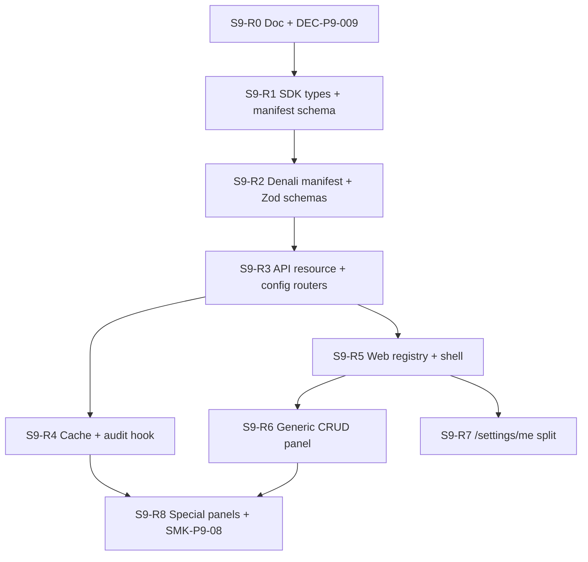

# Phase 9.6 — Settings Module Registry · نقشه فازبندی پیاده‌سازی

```yaml
plan_version: "2026-06-08-v1"
authority: DEC-P9-008 · DEC-P9-005 · INV-P9-001 · INV-P8-007
parent_subphase: docs/phase-9/subphases/9.6-settings-templates.md
proposed_decision: DEC-P9-009  # Settings Module Registry — promote to docs/ after Architect review
prerequisites:
  - "9.1 VERIFIED_BEHAVIORAL (session + CASL)"
  - "9.2 VERIFIED_BEHAVIORAL (app shell)"
scope: "Operator settings — NOT marketing · NOT platform-core creep"
pattern_sources:
  - name: Manifest Pattern
    url: https://andrewhathaway.net/blog/manifest-pattern
    use: "discriminated union + registry for dynamic UI"
  - name: Capell Settings Schema Registry
    url: https://docs.capell.app/packages/admin/settings-schema-registry/
    use: "composable schemas · group by surface · extension modal"
  - name: Mozaiks module contracts
    url: https://docs.mozaiks.ai/architecture/modules-systems/module-system/
    use: "contracts/settings.yaml + contracts/admin.yaml per module"
  - name: EmDash plugin admin
    url: https://github.com/emdash-cms/emdash/blob/main/docs/src/content/docs/plugins/creating-plugins.mdx
    use: "descriptor (build) vs definition (runtime) split"
  - name: Lime CRM runtime config
    url: https://platform.docs.lime-crm.com/en/2.677.x/development/runtime-configuration/
    use: "schema + migration version on config blob"
  - name: Flightcontrol tenant settings layers
    url: https://www.flightcontrol.dev/blog/ultimate-guide-to-multi-tenant-saas-data-modeling
    use: "app → tenant → user preference merge"
truth_ledger: docs/phase-9/audits/IMPLEMENTATION-TRUTH.md
forbidden:
  - "Lift-and-shift 64 legacy settings files verbatim"
  - "Hardcoded hub/subnav links per module"
  - "settings-locations god module in trunk"
  - "platform-core diff for admin settings"
```

> **نحوه استفاده:** بلوک‌ها **S9-R0 → S9-R8** به ترتیب DAG. هر بلوک = doc stub (در صورت نیاز) → types → API → web → spec.  
> **Fast-track verify:** `pnpm run pre-commit:fast` + targeted specs — **نه** `phase-9:gate` بدون YES.

---

## «الان کجاییم؟»

| لایه | وضعیت | blocker |
| ---- | ------- | ------- |
| Legacy settings | ✅ feature-rich · ❌ brittle | flat copy-paste · mixed concerns |
| Phase 9.6 doc (DEC-P9-008) | ✅ full inventory in scope | behavioral ABSENT |
| Settings registry (trunk) | ❌ ABSENT | این roadmap |
| `WorkspacePlugin` extension | ❌ no `operatorSettings` slot | S9-R1 + doc-first SDK |
| Generic CRUD shell | ❌ ABSENT | S9-R5 |
| `/settings/me` split | ❌ ABSENT | S9-R7 |

---

## اصول معماری (سبک + درون‌معماری)

### 1. سه نوع داده — سه مسیر API

| Kind | مثال | Storage | UI shell |
| ---- | ---- | ------- | -------- |
| `reference_data` | equipment · locations · themes · languages | Prisma table + `tenant_id` + RLS | **Generic CRUD** |
| `tenant_config` | wizard template · preset defaults · advanced JSON | `tenant_config` row / JSONB keyed | **Schema form** یا **builder** |
| `account_preference` | profile · email · phone | User / Membership | **`/settings/me`** — خارج hub workspace |

**Observability** (audit-trail · reconciliation) = **read-only explorers** — nav group «Finance/Ops» نه «Settings hub».

### 2. Manifest Pattern (TypeScript-first · بدون YAML اجباری)

```typescript
/** Discriminated union — manifest-pattern style */
type SettingsModuleKind = "reference_data" | "tenant_config" | "readonly_explorer";

interface SettingsModuleManifestBase {
  readonly id: string;
  readonly kind: SettingsModuleKind;
  readonly route: `settings/${string}`;
  readonly ability: string; // operator.settings.*
  readonly nav: { labelKey: string; group: "workspace" | "account" | "finance" };
}

interface ReferenceDataManifest extends SettingsModuleManifestBase {
  readonly kind: "reference_data";
  readonly schema: ZodObject; // item shape
  readonly features?: { reorder?: boolean; slug?: boolean };
}

interface TenantConfigManifest extends SettingsModuleManifestBase {
  readonly kind: "tenant_config";
  readonly configKey: string;
  readonly schema: ZodObject;
  readonly configVersion: number; // Lime-style migrations
}
```

Registry = `Map<string, SettingsModuleManifest>` — populate از workspace plugin at lazy-load (همان `lazy-denali-plugin.ts`).

### 3. لایه‌های trunk (Import boundary)

```text
packages/workspace-sdk/
  src/operator/settings/
    settings-module.types.ts      # shared manifest types (doc-first)
    settings-registry.types.ts

packages/workspaces/denali/
  src/settings/
    denali-settings.manifest.ts   # all Denali modules declared here
    schemas/                      # Zod per module
    handlers/                     # validation hooks · reorder rules

apps/api/src/settings/
  registry.ts                     # resolve manifest by workspace plugin id
  resource-router.ts              # GET/POST/PATCH/DELETE /settings/resources/:moduleId
  config-router.ts                # GET/PUT /settings/config/:key
  cache-invalidate.ts             # DEC-P9-005

apps/web/src/features/settings/   # NOT under app/ — feature slice
  registry/use-settings-modules.ts
  shell/settings-layout.tsx
  shell/settings-nav.tsx          # dynamic from manifest
  generic/resource-list-panel.tsx
  generic/resource-form-sheet.tsx
  config/schema-form-panel.tsx
  special/wizard-template-builder/

apps/web/app/(app)/settings/
  layout.tsx                      # thin — imports shell only
  page.tsx                        # hub — maps manifest groups
  [module]/page.tsx               # optional catch-all OR dynamic segment
  me/page.tsx                     # account prefs
```

**Import rule (TQ-P9-002 carryover):**

```text
(app)/settings/*  →  features/settings/*  →  workspace-sdk types only
apps/api/settings →  denali handlers via dynamic import / adapter — NOT Nest port
```

### 4. Effective config resolver (سبک · بدون over-engineering)

```text
resolveEffectiveConfig(key, ctx):
  1. tenant override (DB)
  2. workspace plugin default (denali manifest default)
  3. platform fallback (workspace-sdk)
→ { value, source: "tenant" | "workspace" | "platform" }
```

UI یک badge کوچک «منبع: tenant» — optional در v1، required در SMK-P9-05.

---

## DAG فازبندی



---

## S9-R0 — Doc covenant (½ روز)

| # | کار | خروجی | وضعیت |
| - | --- | ----- | ----- |
| R0.1 | پیش‌نویس **DEC-P9-009** Settings Module Registry | `docs/phase-9/appendices/IMPLEMENTATION-DECISIONS.md` | `[ ]` |
| R0.2 | appendix **`SETTINGS-MODULE-REGISTRY.md`** | manifest shape · API · nav groups | `[ ]` |
| R0.3 | به‌روز **9.6 subphase** — ارجاع registry نه flat legacy | `subphases/9.6-settings-templates.md` | `[ ]` |
| R0.4 | **`ADMIN-ROUTE-MATRIX`** — `/settings/resources/:id` | append rows | `[ ]` |

**Pass:** `pnpm run phase-9:guard` · DEC-P9-009 در decisions.

---

## S9-R1 — SDK contract extension (1 روز)

| # | کار | مسیر | وضعیت |
| - | --- | ---- | ----- |
| R1.1 | `SettingsModuleManifest` discriminated union | `packages/workspace-sdk/src/operator/settings/` | `[ ]` |
| R1.2 | `OperatorSettingsSurface` optional on plugin | extend `WorkspacePlugin` **optional field** — non-breaking | `[ ]` |
| R1.3 | `validateSettingsManifest()` Zod | SDK test | `[ ]` |
| R1.4 | CASL ability constants `operator.settings.*` | `CASL-OPERATOR-SPEC.md` + sdk | `[ ]` |

**نکته MAP §8:** `contractVersion` فعلاً 1 — فقط **optional** اضافه کنید؛ breaking bump فقط اگر required شود.

**Pass:**

```bash
pnpm --filter @app-tour/workspace-sdk test
pnpm run guard:import-boundary
```

---

## S9-R2 — Denali manifest (1–2 روز)

| Module ID | kind | legacy path | اولویت |
| --------- | ---- | ----------- | ------ |
| `equipment` | reference_data | `/settings/equipment` | P0 — ساده‌ترین CRUD |
| `guide_languages` | reference_data | `/settings/guide-languages` | P0 |
| `tour_themes` | reference_data | `/settings/tour-themes` | P0 |
| `locations` | reference_data | `/settings/locations` | P1 — nested regions/destinations |
| `tour_presets` | reference_data | `/settings/tour-presets` | P1 |
| `tour_wizard_template` | tenant_config | `/settings/tour-wizard-template` | P1 — SMK-P9-05 |
| `tour_presets_advanced` | tenant_config | `/settings/tour-presets/advanced` | P2 — JSON editor |
| `audit_trail` | readonly_explorer | `/settings/audit-trail` | P2 — read API |
| `profile` | account_preference | `/settings/me` | P1 — S9-R7 |

**فایل canonical:**

```text
packages/workspaces/denali/src/settings/denali-settings.manifest.ts
packages/workspaces/denali/src/settings/schemas/equipment.schema.ts
…
```

**Pass:**

```bash
pnpm --filter @app-tour/workspace-denali test test/settings-manifest.spec.ts
```

---

## S9-R3 — API routers (2–3 روز)

### Resource router (reference_data)

| Method | Path | Handler |
| ------ | ---- | ------- |
| GET | `/settings/resources/:moduleId` | list paginated |
| POST | `/settings/resources/:moduleId` | create |
| PATCH | `/settings/resources/:moduleId/:itemId` | update |
| DELETE | `/settings/resources/:moduleId/:itemId` | soft-delete |
| POST | `/settings/resources/:moduleId/reorder` | optional |

**Flow:**

```text
request → tenant-kernel → session → CASL(ability from manifest)
       → registry.get(moduleId) → denali handler adapter → Prisma (RLS)
```

### Config router (tenant_config)

| Method | Path | Handler |
| ------ | ---- | ------- |
| GET | `/settings/config/:key` | resolveEffectiveConfig |
| PUT | `/settings/config/:key` | validate Zod → persist → cache bust |

**Prisma (proposal — single migration 007):**

```sql
-- tenant_reference_items: generic table OR per-entity tables — see decision below
-- tenant_config: (tenant_id, config_key, config_version, payload jsonb, updated_at)
```

| گزینه | pros | cons | پیشنهاد |
| ----- | ---- | ---- | -------- |
| **A) جدول generic `tenant_reference_items`** | یک router · سریع | JSON query سخت‌تر | MVP فاز 9.6 |
| **B) جدول per-entity (equipment, …)** | index · FK تمیز | بیشتر migration | بعد از MVP |

**Pass:**

```bash
pnpm --filter @apps/api exec node --import tsx --test test/settings-modules.spec.ts
pnpm --filter @apps/api exec node --import tsx --test test/settings-resources.spec.ts
```

---

## S9-R4 — Cache · audit · outbox (1 روز)

| # | کار | DEC |
| - | --- | --- |
| R4.1 | `invalidateTenantConfig(tenantId, key)` | DEC-P9-005 |
| R4.2 | Redis/in-memory tag `tenant:{id}:settings` | optional dev |
| R4.3 | Audit row on PUT config + resource mutations | ties audit-trail explorer |
| R4.4 | Wizard read path uses effective config post-invalidate | SMK-P9-05 |

---

## S9-R5 — Web registry + shell (2 روز)

| # | کار | مسیر |
| - | --- | ---- |
| R5.1 | `useOperatorSettingsModules()` — lazy plugin manifest | `features/settings/registry/` |
| R5.2 | `SettingsShell` — layout + breadcrumb | `features/settings/shell/` |
| R5.3 | `SettingsNav` — **dynamic** from manifest `nav.group` | replaces legacy subnav hardcode |
| R5.4 | Hub page — cards filtered by CASL + workspace | `(app)/settings/page.tsx` thin |
| R5.5 | Dynamic route `[moduleId]/page.tsx` — dispatches by `kind` | |

**Nav groups (UX):**

```text
Account     → /settings/me
Workspace   → equipment · locations · themes · …
Templates   → wizard-template · presets
Finance/Ops → reconciliation (9.7) · audit (read)
```

---

## S9-R6 — Generic CRUD panel (2–3 روز)

**یک component — N modules:**

```text
GenericResourcePanel
  props: { manifest: ReferenceDataManifest }
  ├── useResourceList(moduleId)
  ├── columns from schema metadata (labelKey, sortable)
  ├── empty / error / loading states
  ├── sheet or modal form (react-hook-form + Zod resolver)
  └── reorder drag handle when manifest.features.reorder
```

**Pilot order:**

1. `equipment` — SMK-P9-08 target
2. `guide_languages`
3. `tour_themes`
4. `locations` — tabs: regions · destinations (manifest `uiVariant: "tabbed"`)
5. `tour_presets`

**Pass:** `apps/web/test/settings-template.spec.ts` + equipment round-trip.

---

## S9-R7 — Account split `/settings/me` (1 روز)

| Legacy (hub mixed) | Trunk |
| ------------------ | ----- |
| profile · email · phone on `/settings` | `/settings/me` |
| workspace links on hub | hub only workspace modules |

**API:** reuse `9.1` identity routes — نه settings resource router.

---

## S9-R8 — Special panels + closure (3–4 روز)

| Surface | Shell | subphase |
| ------- | ----- | -------- |
| Wizard template builder | `special/wizard-template-builder/` | 9.6 · SMK-P9-05 |
| Advanced presets JSON | `config/json-editor-panel.tsx` | 9.6 |
| Audit trail explorer | `special/audit-explorer/` | 9.6 |
| Reconciliation triage | `special/reconciliation/` | **9.7** |

**Contract inventory:**

```bash
pnpm --filter @apps/web exec node --import tsx --test test/phase-9.contract.spec.ts
# asserts every full_app_parity_inventory row has route or DEC alias
```

---

## جدول زمان‌بندی (تخمینی)

| Block | Effort | Depends | Cumulative |
| ----- | ------ | ------- | ---------- |
| S9-R0 Doc | 0.5d | 9.2 | 0.5d |
| S9-R1 SDK | 1d | R0 | 1.5d |
| S9-R2 Denali manifest | 1.5d | R1 | 3d |
| S9-R3 API | 2.5d | R2 | 5.5d |
| S9-R4 Cache/audit | 1d | R3 | 6.5d |
| S9-R5 Web shell | 2d | R3 | 8.5d |
| S9-R6 Generic CRUD | 2.5d | R5 | 11d |
| S9-R7 /settings/me | 1d | R5 | 12d |
| S9-R8 Special | 3.5d | R6,R4 | **~15.5 dev-days** |

*موازی‌سازی:* R5 می‌تواند همزمان با R4 بعد از R3 schema freeze شروع شود.

---

## Anti-patterns (از legacy — **نکنید**)

| Legacy smell | Trunk fix |
| ------------ | --------- |
| Hardcoded hub + subnav | Manifest-driven nav |
| 5× copy-paste panel | GenericResourcePanel |
| `settings-locations` god module | Per-module handler در denali |
| RBAC `isLeaderRole` per file | CASL `operator.settings.*` |
| transport در localStorage | Server resource (9.3) |
| Monolithic `fetchTenantConfig()` | Keyed config + effective resolver |
| tour-presets vs tour-form-defaults naming | یک module id · redirect legacy URL |

---

## Spec scaffold checklist (trunk)

| Spec | Block | Status |
| ---- | ----- | ------ |
| `packages/workspace-sdk/test/settings-manifest.spec.ts` | R1 | SCAFFOLD |
| `packages/workspaces/denali/test/settings-manifest.spec.ts` | R2 | SCAFFOLD |
| `apps/api/test/settings-resources.spec.ts` | R3 | SCAFFOLD |
| `apps/api/test/settings-modules.spec.ts` | R3–R4 | SCAFFOLD (exists) |
| `apps/api/test/settings-audit-trail.spec.ts` | R8 | SCAFFOLD |
| `apps/web/test/settings-generic-crud.spec.ts` | R6 | NEW |
| `apps/web/test/settings-template.spec.ts` | R8 | SCAFFOLD (exists) |

---

## Verify bundle (fast-track)

```bash
# Daily loop
pnpm run pre-commit:fast
pnpm run guard:import-boundary

# After R1
pnpm --filter @app-tour/workspace-sdk test

# After R2–R3
pnpm --filter @app-tour/workspace-denali test
pnpm --filter @apps/api exec node --import tsx --test test/settings-resources.spec.ts

# After R6–R8
pnpm --filter @apps/web exec node --import tsx --test test/settings-generic-crud.spec.ts
pnpm --filter @apps/web run test:e2e:operator  # SMK-P9-05 · SMK-P9-08

# Doc pack
pnpm run phase-9:guard
```

---

## گام بعدی پیشنهادی برای ایجنت

1. **S9-R0** — promote `DEC-P9-009` + `SETTINGS-MODULE-REGISTRY.md` به `docs/phase-9/appendices/`
2. **S9-R1** — SDK types (optional plugin field — doc-first covenant)
3. **S9-R2 + R3** — manifest + API با pilot `equipment` only (vertical slice)

---

## مراجع سبک ساختار

| Pattern | Why lightweight for us |
| ------- | --------------------- |
| [Manifest Pattern](https://github.com/andrewhathaway/manifest-pattern) | TS discriminated union — no runtime plugin loader |
| [Forge registry](https://github.com/fractary/forge) | Zod validate manifest at register time |
| [Kinbot plugin.json](https://github.com/MarlBurroW/kinbot/blob/main/PLUGIN-SPEC.md) | Low barrier: folder + manifest + one entry |
| [EmDash admin descriptor](https://github.com/emdash-cms/emdash/blob/main/docs/src/content/docs/plugins/creating-plugins.mdx) | Build-time nav vs runtime hooks split |
| Denali `field-registry` (existing) | Same mental model for settings modules |

---

```yaml
handoff:
  temp_file: TEMP/phase9-settings-registry-roadmap.md
  canonical_docs:
    - docs/phase-9/appendices/SETTINGS-MODULE-REGISTRY.md
    - docs/phase-9/appendices/SETTINGS-RISK-REGISTER-P9.md
    - docs/phase-9/appendices/IMPLEMENTATION-DECISIONS.md  # DEC-P9-009 · DEC-P9-010
  next_code_action: "S9-R1 SDK types after Architect ACK"
  status: PROMOTED_TO_PEK_2026-06-08
```
