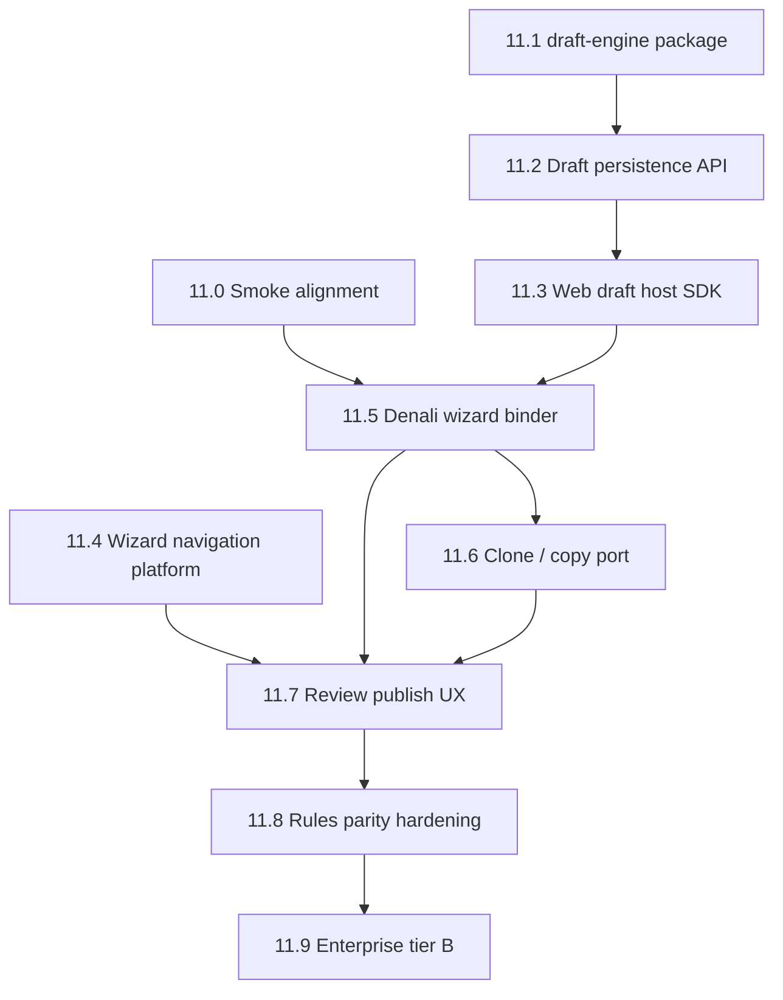
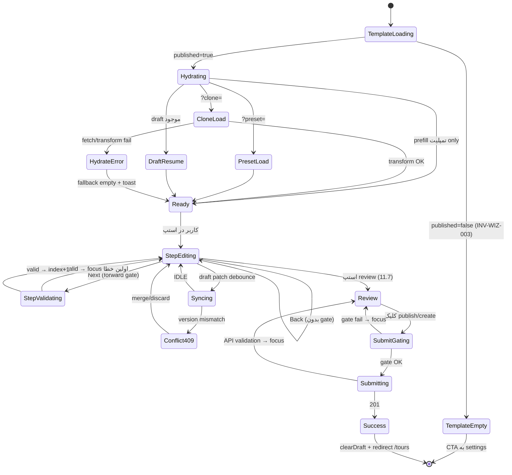

# برنامه پیاده‌سازی — زیرساخت ویزارد و اپراتور (Phase 11 / WEP)

> **تاریخ:** 2026-06-11  
> **ورودی:** [`TEMP/wizard-template-settings-gaps.md`](wizard-template-settings-gaps.md) (۶۰۷ خط — شکاف‌های Trunk/Legacy/Enterprise)  
> **هدف:** پیاده‌سازی **زیرساخت قابل‌استفاده‌مجدد** (draft، validation navigation، clone port) با **ایزولاسیون tenant/workspace** — اتصال Denali فقط لایه نازک در `packages/workspaces/denali` و `apps/web`.

---

## ۰. اصول غیرقابل مذاکره

| اصل | معنی عملی |
|-----|-----------|
| **Doc-first** | هر تغییر در `packages/platform-core`، `workspace-sdk`، `apps/api` → ابتدا `docs/phase-11/…` (Markdoc) · Husky `guard-docs` |
| **Core بدون Denali** | قوانین شرطی تأییدشده مشتری Denali **فقط** در `packages/workspaces/denali` — engine عمومی فقط `WorkspacePlugin` + callback می‌بیند |
| **Adapter not Fork** | `@app-tour/draft-engine` نوع `<T>` + `onFetch/onPush` — ویزارد، settings form، finance wizard بعداً همان engine |
| **Tenant boundary** | کلید draft: `(tenantId, workspaceId, draftNamespace, draftKey)` — هرگز cross-tenant |
| **Partial save ≠ Full validate** | الگوی enterprise (FlowCore، Webeyez): sync پیش‌نویس **بدون** Zod کامل؛ validate فقط submit/step-gate |
| **تحقیق قبل از هر فاز** | زیربخش «🔍 Research gate» اجباری — بدون تیک research، کد merge نشود |

**قوانین شرطی Denali:** parity با Legacy/domain موجود (`evaluateFormFieldRule`, contextual rules, matrix) — **تغییر semantics ممنوع** مگر تأیید صاحب workspace؛ فازهای ما فقط **wire + UI + infrastructure** هستند.

---

## ۱. معماری هدف (لایه‌ها)

```text
┌──────────────────────────────────────────────────────────────────┐
│ apps/web                                                         │
│  · useWorkspaceDraft()          — React hook (generic)           │
│  · WorkspaceWizardHost          — consumes draft + plugin        │
│  · denali/* composites          — workspace UI only                │
├──────────────────────────────────────────────────────────────────┤
│ packages/workspaces/<id>                                         │
│  · denali: prepareDraftForSync, clone transform, rule predicates │
│  · urban/starter: own draft namespaces (later)                   │
├──────────────────────────────────────────────────────────────────┤
│ packages/wizard-navigation (NEW, Phase 11.4)                     │
│  · FieldFocusRegistry, StepValidationResult, scroll+focus API   │
├──────────────────────────────────────────────────────────────────┤
│ packages/draft-engine (NEW, port Legacy)                          │
│  · DraftEngine<T>, useDraftEngine, DraftConflictError            │
├──────────────────────────────────────────────────────────────────┤
│ packages/platform-core + workspace-sdk (EXISTING)                │
│  · validateCanonical, render plan, WorkspacePlugin contract      │
├──────────────────────────────────────────────────────────────────┤
│ apps/api                                                         │
│  · workspace-draft.repository (generic JSONB + OCC)              │
│  · GET/PATCH/DELETE …/drafts/:namespace/:key                     │
│  · RLS tenant_id                                                 │
└──────────────────────────────────────────────────────────────────┘
```

**الگوی صنعت:** همان تفکیک Strata Sync / SyncKit / Legacy `@repo/draft-engine` — **engine headless** + **transport adapter** + **domain sanitize** در لایه بالاتر.

---

## ۲. DAG وابستگی فازها



---

## ۳. نقشه شکاف → فاز

| شکاف (gaps doc) | فاز |
|-----------------|-----|
| §۱ smoke split-brain | **11.0** |
| §۱۳ draft آنلاین | **11.1–11.3, 11.5** |
| §۱۳ clone | **11.6** |
| §۱۳ review + error focus | **11.4, 11.7** |
| §۱۲ شرط‌ها / dong / nationalId | **11.8** |
| §۱۴ completion % | **11.7** |
| §۱۴ scheduled publish, audit | **11.9** |

---

# فازها (جزئیات)

---

## فاز 11.0 — پیش‌نیاز: هم‌ترازی smoke / settings (بدون ویزارد جدید)

**هدف:** ویزارد Denali و Settings hub روی همان `workspaceType` — حذف §۱ قبل از iterate روی draft.

### 🔍 Research gate (قبل از کد)
- [ ] خواندن `resolve-workspace-type.ts` vs `tenant-kernel.ts` و تست `API-9.6-02`
- [ ] جستجو: *«multi-tenant dev seed workspace type consistency»* — الگوی single source of truth در `tenant-registry`

### Doc
- [ ] `docs/phase-11/subphases/11.0-smoke-workspace-alignment.md` — DEC: یکی از (الف) web→starter هنگام smoke (ب) API→denali هنگام smoke (ج) seed equipment روی starter

### تسک‌ها
| ID | تسک | پکیج | پذیرش |
|----|-----|------|--------|
| 11.0-T1 | تصمیم DEC + اعمال در `resolve-workspace-type` **یا** `tenant-kernel` | `apps/api` / `apps/web` | `API-9.6-02` green؛ equipment در hub دیده شود |
| 11.0-T2 | seed حداقلی equipment/locations/themes برای smoke tenant | `apps/api/scripts/db-seed.ts` | ویزارد gear/themes non-empty در smoke |
| 11.0-T3 | به‌روزرسانی `wizard-template-settings-gaps.md` §۱ → «بسته شد» | TEMP | — |

### Guard / تست
- `pnpm --filter @apps/api run test -- settings-modules.spec.ts`
- `pnpm run phase-9:guard` (در صورت لمس docs phase-9)

**ریسک:** تغییر tenant-kernel ممکن است SMK-P6 را بشکند — ابتدا spec را بخوان.

---

## فاز 11.1 — پکیج `@app-tour/draft-engine` (generic, zero domain)

**هدف:** port تمیز `legacy/packages/draft-engine` به monorepo trunk — **بدون** import از denali/legacy.

### 🔍 Research gate
- [ ] مطالعه README legacy draft-engine (adapter pattern, `source: user|remote`)
- [ ] مقایسه با [SyncKit architecture](https://github.com/Dancode-188/synckit/blob/main/docs/architecture/ARCHITECTURE.md) — فقط الگو (debounce queue، OCC)، نه پیاده‌سازی کامل offline-first
- [ ] بررسی: آیا `packages/platform-core` نیاز به touch دارد؟ → **خیر** (DEC)

### Doc
- [ ] `docs/phase-11/draft-engine.md` — API surface، state machine، conflict strategies، مثال adapter خنثی

### تسک‌ها
| ID | تسک | خروجی |
|----|-----|--------|
| 11.1-T1 | ایجاد `packages/draft-engine` — `engine.ts`, `types.ts`, `react.ts` (`useDraftEngine`) | build + test port از `engine.spec.ts` |
| 11.1-T2 | export از root؛ **بدون** وابستگی به React در `engine.ts` (headless testable) | depcruise: draft-engine → فقط tslib |
| 11.1-T3 | `DraftConflictError`, status enum, debounce پیش‌فرض 500ms | parity با Legacy types |
| 11.1-T4 | اضافه به `pnpm-workspace.yaml` + `package.json` scripts `test` | CI path فیلتر |

### پذیرش
- Unit tests: initialize، dirty→sync، 409 conflict، `setDraftData({source:'remote'})` بدون push
- **هیچ** فایل در `apps/*` در این فاز

---

## فاز 11.2 — Persistence API: `workspace_draft_snapshots`

**هدف:** HTTP generic برای هر `draftNamespace` — ویزارد فقط یک consumer.

### 🔍 Research gate
- [ ] [Webeyez multi-step draft table](https://webeyez.com/insights/guides/laravel-multi-step-form-guide) — JSONB + `current_step` + TTL
- [ ] بررسی Legacy `draft_snapshots` entity (ستون‌ها) در `legacy/` برای parity
- [ ] Prisma RLS patterns موجود در `apps/api` برای tours

### Doc
- [ ] `docs/phase-11/workspace-draft-persistence.md` — schema، OCC (version integer)، idempotency PATCH، retention TTL

### Schema (پیشنهاد)
```prisma
model WorkspaceDraftSnapshot {
  id            String   @id @default(cuid())
  tenantId      String
  workspaceId   String
  draftNamespace String  // e.g. "operator.wizard"
  draftKey      String   // e.g. "denali-create"
  schemaVersion Int
  version       Int      // OCC
  data          Json
  lastModified  DateTime
  updatedByUserId String?
  @@unique([tenantId, workspaceId, draftNamespace, draftKey])
  @@index([tenantId, workspaceId])
}
```

### تسک‌ها
| ID | تسک | پکیج |
|----|-----|------|
| 11.2-T1 | migration + RLS policy | `apps/api/prisma` |
| 11.2-T2 | `WorkspaceDraftRepository` — get/patch/delete، 409 on version mismatch | `apps/api/src/workspace-drafts/` |
| 11.2-T3 | routes: `GET/PATCH/DELETE /workspaces/:workspaceId/drafts/:namespace/:key` | `apps/api/src/http/` |
| 11.2-T4 | auth: همان operator session headers + workspace scope | reuse tenant kernel |
| 11.2-T5 | اختیاری: `draft_events` append-only برای audit (Tier B) — یا defer 11.9 | — |

### پذیرش
- Integration spec: create draft → patch v1 → patch v2 → conflict 409 → refetch
- **بدون** Denali types در repository — `data` opaque `Json`

---

## فاز 11.3 — Web: `useWorkspaceDraft` + BFF

**هدف:** لایه web قابل reuse — settings wizard بعداً همان hook.

### 🔍 Research gate
- [ ] Legacy `draft-engine.client.ts` + `createDenaliDraftAdapter` — فقط **الگوی** URL
- [ ] Next.js: Server Action vs Route Handler برای draft — **Route Handler BFF** (هم‌راستا با tours API)

### Doc
- [ ] `docs/phase-11/web-draft-host.md` — envelope type، hook contract، sync indicator UI

### Envelope generic (پیشنهاد)
```typescript
type WorkspaceDraftEnvelope<TForm, TMeta = unknown> = {
  form: TForm;
  meta: TMeta; // e.g. { currentStepIndex: number; registryLayoutVersion?: number }
};
```

### تسک‌ها
| ID | تسک | مسیر |
|----|-----|------|
| 11.3-T1 | `packages/draft-host` یا `apps/web/src/draft/` — `createWorkspaceDraftAdapter(config)` | wraps draft-engine |
| 11.3-T2 | BFF `app/api/workspaces/[workspaceId]/drafts/[namespace]/[key]/route.ts` | proxy to API |
| 11.3-T3 | `useWorkspaceDraft<T>()` — subscribe status، retry، clear | React |
| 11.3-T4 | `DraftSyncIndicator` — IDLE/SYNCING/ERROR (ui-primitives) | reusable component |
| 11.3-T5 | block navigation هنگام SYNCING (optional flag) | — |

### پذیرش
- Web unit test با mock fetch — بدون Denali
- E2E سبک: تایپ → debounce → PATCH (می‌تواند در 11.5)

---

## فاز 11.4 — `wizard-navigation` platform (validation + focus)

**هدف:** قابلیت «برو به فیلد خطا» **بدون** دانستن Denali در platform.

### 🔍 Research gate
- [ ] Legacy `denaliWizardFieldFocus.ts` + `scrollTourFormToFirstError` — استخراج **interface** generic
- [ ] [Exsited field validation](https://www.exsited.com/forms-logic) — per-step vs final validation
- [ ] WCAG: focus management در multi-step forms

### Doc
- [ ] `docs/phase-11/wizard-navigation.md` — `FieldFocusRegistry`, `ValidationIssue`, `focusField(path)`

### API پیشنهادی (`packages/wizard-navigation`)
```typescript
type ValidationIssue = { path: string; message: string; stepId?: string };

interface FieldFocusRegistry {
  resolveSelectors(canonicalOrFormPath: string): readonly string[];
}

function focusWizardField(path: string, registry: FieldFocusRegistry): boolean;
function scrollToFirstIssue(issues: ValidationIssue[], registry, goToStep): void;
```

### تسک‌ها
| ID | تسک |
|----|-----|
| 11.4-T1 | پکیج `packages/wizard-navigation` — zero React در core |
| 11.4-T2 | `apps/web` thin React bridge `useWizardStepValidation` |
| 11.4-T3 | اتصال به `platform-core` `ValidationResult` → `ValidationIssue[]` mapper |
| 11.4-T4 | `data-field-path` convention doc + helper برای composites |

### پذیرش
- تست: mock DOM + registry → focus روی node درست
- **هنوز** بدون استپ review — فقط API آماده

---

## فاز 11.5 — Denali wizard binder (نازک)

**هدف:** وصل کردن draft + step index + host موجود — **بدون** بازنویسی composites.

### 🔍 Research gate
- [ ] Legacy `denali-adapter.ts` + `sanitizeDenaliWizardDraftSnapshot`
- [ ] `WorkspaceWizardHost` state امروز (`useState` draft) — نقاط inject

### Doc
- [ ] `docs/phase-11/denali-wizard-draft-binding.md` — namespace `operator.wizard` / key `denali-create`

### تسک‌ها
| ID | تسک | مسیر |
|----|-----|------|
| 11.5-T1 | `denaliPrepareDraftEnvelope(draft, stepIndex)` در `packages/workspaces/denali` | sanitize قبل از push |
| 11.5-T2 | `denaliHydrateDraftEnvelope → TourWizardDraft` | merge با template prefill |
| 11.5-T3 | `new-tour-wizard-client.tsx` — `useWorkspaceDraft` به‌جای bare `useState` | |
| 11.5-T4 | `WorkspaceWizardHost` — `activeStepIndex` از draft meta + persist on change | |
| 11.5-T5 | `clearDraft` بعد از create موفق | |
| 11.5-T6 | `DenaliWizardContentQualityHeader` — port از Legacy (completion %) | اختیاری همین فاز |

### پذیرش
- refresh صفحه → همان استپ + فیلدها برگردد (با API memory/postgres)
- `pnpm --filter @apps/web run test` — spec جدید draft resume
- **شرط‌ها:** `applyDenaliConditionalFieldRules` دست نخورده — فقط draft payload

---

## فاز 11.6 — Clone / copy port (generic + Denali transform)

**هدف:** `?clone=tourId` کار کند — transform در workspace، نه web.

### 🔍 Research gate
- [ ] Legacy `transformTourToDenaliWizardValues.ts` — scope port
- [ ] الگوی enterprise: **read model → form patch** (نه deep clone API در فاز ۱)

### Doc
- [ ] `docs/phase-11/tour-clone-hydration.md` — DEC: client-side hydrate vs `POST /tours/clone` (فاز ۱: client-side)

### تسک‌ها
| ID | تسک |
|----|-----|
| 11.6-T1 | `packages/workspaces/denali/src/clone/` — port transform (canonical → wizard draft paths) |
| 11.6-T2 | `workspace-sdk`: type `TourCloneHydrator` optional on plugin (برای آینده urban) |
| 11.6-T3 | `new-tour-wizard-client` — `useSearchParams().get('clone')` → fetch tour → hydrate |
| 11.6-T4 | loading state «در حال بارگذاری تور برای کپی» |
| 11.6-T5 | gear stale filter + title `(Copy)` suffix |
| 11.6-T6 | تست: `WEB-9.3-04` گسترش به hydrate assertion |

### پذیرش
- کلیک duplicate → عنوان pre-filled
- **Server-side clone API** → defer 11.9 (idempotency)

---

## فاز 11.7 — Review step + validation UX

**هدف:** استپ آخر حرفه‌ای — لیست خطا، کلیک → استپ + فوکوس.

### 🔍 Research gate
- [ ] Legacy `DenaliReviewStep`, `DenaliReviewValidationSummary`, `evaluateDenaliWizardSubmitGate`
- [ ] [Capell publish readiness](https://docs.capell.app/packages/publishing-studio/) — dry-run قبل از publish

### Doc
- [ ] `docs/phase-11/denali-review-step.md` — submit gate draft vs active

### تسک‌ها
| ID | تسک |
|----|-----|
| 11.7-T1 | تمپلیت seed + builder: استپ `review` را برای denali full template فعال کن |
| 11.7-T2 | `DenaliReviewStep` composite — read-back خلاصه |
| 11.7-T3 | `ReviewValidationSummary` — group by step، لینک → `wizard-navigation` |
| 11.7-T4 | `handleNext` per-step validation (port `applyDenaliWizardStepValidation` logic به draft model) |
| 11.7-T5 | `createTourAction` — map API violations → issues → focus |
| 11.7-T6 | `publishStatus` draft/active selector (اگر در scope مشتری) |

### پذیرش
- submit با خطا → یک کلیک → استپ و فیلد درست
- مشتری Denali: قوانین publish readiness **همان domain** — بدون تغییر predicate

---

## فاز 11.8 — Rules parity hardening (شرط‌های تأییدشده)

**هدف:** بستن شکاف‌های §۱۲ بدون تغییر semantics.

### 🔍 Research gate
- [ ] diff `denali-transport-logic.ts` vs `denali-transport-rules.ts` (dong)
- [ ] `denaliInvariantEngine` — port یا معادل minimal `clearWhenNotVisible` در sanitize

### تسک‌ها (موازی‌پذیر پس از 11.5)
| ID | تسک | شکاف |
|----|-----|------|
| 11.8-T1 | fix dong: `isDenaliDongAmountVisible(mode, allowPersonalCar)` | §۱۲.۳ الف |
| 11.8-T2 | `nationalIdRequired` UI جدا از composite mountain-only | §۱۲.۳ ه |
| 11.8-T3 | `DenaliUIContextOptions` از workspace profile به rule eval | §۱۲.۴ |
| 11.8-T4 | `destinationId` → `peakHeight` prefill از locations API | §۱۲.۳ و |
| 11.8-T5 | invariant sanitize on draft push (`clearWhenNotVisible`) | §۱۲.۵ |
| 11.8-T6 | `resolveDenaliRuleSetFromTemplate` — implement overlay (نه noop) | §۸، §۱۲.۶ |
| 11.8-T7 | settings catalog filters (gear category, theme formProfile) | §۲ |

### پذیرش
- `denali-wizard-conditional.spec.ts` + transport unit tests
- **چک‌لیست تأیید مشتری:** matrix mountain + approval + bus/personal-car scenarios

---

## فاز 11.9 — Enterprise Tier B (اختیاری پس از 11.7 green)

**هدف:** تمایز enterprise — هر زیرماژول **جدا** با adapter.

### زیرفازها (هر کدام research gate مستقل)

| ID | قابلیت | زیرساخت generic | Denali bind |
|----|--------|-----------------|-------------|
| 11.9-A | Idempotent `POST /tours` (`Idempotency-Key`) | `apps/api` middleware | — |
| 11.9-B | `draft_events` audit append-only | repository | emit on draft patch |
| 11.9-C | Scheduled publish | `scheduled_releases` table + worker | denali `publishStatus` |
| 11.9-D | Tour version compare/rollback UI | canonical snapshot versions | workspace |
| 11.9-E | Wizard analytics (drop-off) | events table / OTel spans | stepId dimension |
| 11.9-F | `POST /tours/clone` server-side | clone service + lock | denali orchestrator |

---

## ۴. چک‌لیست تحقیق (الگوی استاندارد هر فاز)

قبل از اولین PR فاز، در doc فاز پر شود:

1. **۳ مرجع صنعت** (لینک + یک جمله چرا relevant)
2. **گزینه‌های طراحی** (حداقل ۲) + انتخاب + دلیل
3. **مرز import** (depcruise انتظار)
4. **Rollback plan** (feature flag یا namespace جدا)
5. **تأثیر بر قوانین Denali** — «بدون تغییر» / «نیاز به تأیید مشتری»

---

## ۵. Guard و CI (تجمعی)

| Gate | فاز | محتوا |
|------|-----|--------|
| `draft-engine` unit | 11.1 | OCC + debounce |
| `workspace-draft` integration | 11.2 | 409 conflict |
| `guard:import-boundary` | همه | draft-engine ↛ workspaces |
| `phase-11:guard` (جدید) | 11.7+ | doc pack + contract specs |
| `pre-commit:fast` | همه | test:changed |

پیشنهاد: `scripts/guards/phase-11-guard.mjs` — مشابه phase-10؛ **بدون** full gate chain.

---

## ۶. چیزهایی که عمداً خارج scope هستند

- CRM / channel manager / multi-departure (gaps §۱۴.۵) — فاز 12+ محصول
- Collaborative comments (Velt-style) — نیاز product DEC
- Offline-first IndexedDB (Strata/SyncKit full) — over-engineering مگر explicit YES
- تغییر `packages/platform-core` rule semantics
- ویزارد دوم در `(app)/tours/new` (DEC-P9-007 ممنوع)

---

## ۷. ترتیب پیشنهادی اجرا (برای تیم)

```text
اسپرینت 1:  11.0 → 11.1 → 11.2
اسپرینت 2:  11.3 → 11.5 (MVP draft resume)
اسپرینت 3:  11.4 → 11.6 (clone)
اسپرینت 4:  11.7 (review)
اسپرینت 5:  11.8 (parity)
اسپرینت 6+: 11.9 (enterprise اختیاری)
```

**اولین demo قابل‌لمس:** پایان اسپرینت 2 — refresh وسط ویزارد + ادامه استپ.

---

## ۸. فایل‌های مرجع

| موضوع | مسیر |
|-------|------|
| شکاف‌ها | `TEMP/wizard-template-settings-gaps.md` |
| Legacy draft engine | `legacy/packages/draft-engine/` |
| Legacy adapter | `legacy/apps/web/src/features/tours/drafts/denali-adapter.ts` |
| Wizard host | `apps/web/src/wizard/workspace-wizard-host.tsx` |
| Phase 10 host contract | `docs/phase-10/workspace-host-contract-v2.md` |
| MAP North Star | `docs/MIGRATION-MAP.md` §۱–۲ |
| Denali rules (frozen) | `packages/workspaces/denali/src/rules/` |

---

## ۹. گام بعدی فوری (Architect)

1. تأیید نام فاز: **Phase 11** در `docs/phase-11/README.md` scaffold  
2. شروع **11.0** (smoke) — بدون آن seed equipment در ویزارد گمراه‌کننده است  
3. سپس **11.1** port draft-engine — کم‌ریسک‌ترین زیرساخت reusable  


---

## ۱۰. ممیزی پوشش (بررسی دوم — 2026-06-11)

> مقایسه `wizard-template-settings-gaps.md` (§۱–۱۴) با فازهای ۱۱.۰–۱۱.۹.  
> **راهنما:** ✅ پوشش داده شده · ⚠️ جزئی/پراکنده · ❌ جا افتاده (قبل از این بخش) · ➕ اضافه‌شده در §۱۱ زیر

### ۱۰.۱ جدول کامل شکاف → فاز

| منبع gaps | موضوع | وضعیت قبل | فاز / تسک |
|-----------|--------|-----------|-----------|
| §۱ | smoke split-brain | ✅ | 11.0 |
| §۲ | equipment / themes / locations فیلتر و stale | ⚠️ فقط T7 | **11.8-T7** + **11.8-T12–T14** ➕ |
| §۲ | `guide_languages` در ویزارد | ❌ | **11.8-T13** ➕ |
| §۲ | `tour_presets` → `/tours/new` | ❌ | **11.8-T14** ➕ |
| §۲ | event → destination خالی | ❌ | **11.8-T15** ➕ |
| §۳ | leaders (`tab`/`status`, labels, fallback, badges) | ❌ | **11.8-T16** ➕ |
| §۴ | استپ `review` | ✅ | 11.7 |
| §۴ | دکمه submit روی آخرین استپ نه review | ✅ | 11.7-T1 |
| §۵ | `publishStatus` UI | ⚠️ | 11.7-T6 |
| §۵ | publish readiness guard | ⚠️ | 11.7 + domain موجود |
| §۵ | scheduled publish | defer | 11.9-C |
| §۶ | `minRequiredPeaks` Select ۰–۴ | ❌ | **11.7-T8** ➕ |
| §۶ | `autoAcceptRegistrations` / placement API | ❌ | **11.9-G** ➕ (bookings) |
| §۷ | submit canonical کامل (`create-tour.server`) | ❌ | **11.7-T7** ➕ |
| §۷ | sanitize refs کاتالوگ در submit | ❌ | **11.8-T12** ➕ |
| §۸ | builder section-groups | ❌ | **11.11** ➕ |
| §۸ | `stepOverrides` | ❌ | **11.11-T2** ➕ |
| §۸ | `fieldRulesOverlay` | ✅ | 11.8-T6 |
| §۹ | staging tour / عکس قبل از create | ❌ | **11.5-T9** ➕ |
| §۹ | debounce draft vs session عکس | ⚠️ | 11.5 + 11.1 |
| §۱۰ | Layer C (`paymentMode`, …) | defer | با 11.7-T7/T6 |
| §۱۲.۱ | دو موتور شرط (composite vs plan) | ❌ | **11.8-T17** ➕ |
| §۱۲.۳ | dong / nationalId / destination→peak | ✅ | 11.8-T1–T4 |
| §۱۲.۴ | `DenaliUIContextOptions` | ✅ | 11.8-T3 |
| §۱۲.۵ | invariant / ghost values | ✅ | 11.8-T5 |
| §۱۲.۶ | template overlay noop | ✅ | 11.8-T6 |
| §۱۳.۱ | draft آنلاین | ✅ | 11.1–11.3, 11.5 |
| §۱۳.۲ | progress / step persist | ✅ | 11.5-T4 |
| §۱۳.۳ | clone `?clone=` | ✅ | 11.6 |
| §۱۳.۴ | **edit wizard کامل** (نه فقط title) | ❌ | **فاز 11.10** ➕ |
| §۱۳.۵ | review + per-step validate + API errors | ⚠️ | 11.7-T4–T5 |
| §۱۳.۶ | focus map / `data-field-path` | ✅ | 11.4 |
| §۱۳.۷ | clear all، factory instantiate، prepareSubmit | ⚠️ | **11.5-T7**, **11.7-T7**, defer instantiate |
| §۱۴ | completion % | ⚠️ optional | **11.7-T9** (اجباری) ➕ |
| §۱۴ | conflict UI 409 | ❌ | **11.3-T6** ➕ |
| §۱۴ | encrypted draft / TTL prune | defer | 11.9-H, 11.9-I ➕ |
| §۱۴ | keyboard shortcuts | defer | 11.12 یا backlog |
| §۱۴ | wizard analytics | ✅ | 11.9-E |
| §۱۴ | customer preview | defer | 11.9-J ➕ |
| §۱۴ | field-level RBAC | defer | 11.12 |
| §۱۴ | rule debugger | defer | 11.11-T3 |

---

## ۱۱. تکمیل فازها — تسک‌های اضافه‌شده (پس از ممیزی)

### تکمیل 11.3
| ID | تسک |
|----|-----|
| 11.3-T6 | UI تعارض 409: banner + «بارگذاری نسخه سرور» / discard local (REFETCH_REAPPLY) |

### تکمیل 11.5
| ID | تسک |
|----|-----|
| 11.5-T7 | «پاک کردن پیش‌نویس» + reset فرم (معادل Legacy `handleClearAll`) |
| 11.5-T8 | تست: تعویض `workspaceId` → draft namespace جدا، بدون leak |
| 11.5-T9 | parity عکس: `wizardSessionId` + سیاست حذف staging objects بعد از create/clear |

### تکمیل 11.7
| ID | تسک |
|----|-----|
| 11.7-T7 | **Submit canonical:** port `prepareDenaliSubmitArtifact` / projection کامل → `createTourAction` (بستن §۷) |
| 11.7-T8 | `minRequiredPeaks`: Select ۰–۴ (نه input آزاد) — §۶ |
| 11.7-T9 | `DenaliWizardContentQualityHeader` — **اجباری** در این فاز (نه optional 11.5) |

### تکمیل 11.8
| ID | تسک | شکاف |
|----|-----|------|
| 11.8-T12 | sanitize `destinationId` / `themeIds` / gear stale در submit | §۲، §۷ |
| 11.8-T13 | `guide_languages` → فیلتر/پیشنهاد در `localGuideName` یا select | §۲ |
| 11.8-T14 | `tour_presets` → query `?preset=` یا picker در `/tours/new` | §۲، §۱۴.۲۹ |
| 11.8-T15 | event tour kind → لیست مقصد/قوانین matrix | §۲ |
| 11.8-T16 | leaders: `status=active`، `labels[]`، حذف fallback همه‌کاربران، badge rewards | §۳ |
| 11.8-T17 | **Composite rule parity:** transport dong از domain؛ pricing-participants زیرفیلدها از `evaluateFormFieldRule` یا split composite | §۱۲.۱ |

### تکمیل 11.9
| ID | تسک |
|----|-----|
| 11.9-G | `autoAcceptRegistrations` + placement (bookings API) — خارج ویزارد ولی §۶ |
| 11.9-H | encrypt `WorkspaceDraftSnapshot.data` at rest (PII) |
| 11.9-I | TTL prune پیش‌نویس‌های کهنه |
| 11.9-J | customer-facing preview URL قبل از publish |

---

## فاز 11.10 — Edit wizard (بازگشت Legacy `DenaliTourEditForm`)

**هدف:** `/tours/[id]/edit` ویزارد کامل — نه فقط patch عنوان (§۱۳.۴). **وابسته:** 11.5 (draft اختیاری)، 11.7-T7 (projection)، 11.4 (focus).

### 🔍 Research gate
- [ ] Legacy `DenaliTourEditForm.tsx` + `updateTourDtoFromDenaliWizardForm`
- [ ] OCC: `rowVersion` موجود در API

### Doc
- [ ] `docs/phase-11/denali-tour-edit-wizard.md`

### تسک‌ها
| ID | تسک |
|----|-----|
| 11.10-T1 | hydrate: `GET /api/tours/:id` → `transformTourToDenaliWizardValues` (mode edit) |
| 11.10-T2 | reuse `WorkspaceWizardHost` + تمپلیت؛ استپ‌ها بدون `review` یا با review اختیاری |
| 11.10-T3 | `PATCH` canonical با `expectedRowVersion` + conflict 409 UI |
| 11.10-T4 | `useDenaliEditCatalogSanitize` port (stale theme/destination) |
| 11.10-T5 | تست integration: edit title + یک فیلد logistics |

### پذیرش
- edit چند فیلد؛ refresh حفظ شود؛ 409 قابل فهم

**جایگاه اسپرینت:** بعد از 11.7 (اسپرینت ۵ یا ۶).

---

## فاز 11.11 — Template builder UX (Settings)

**هدف:** §۸ — builder حرفه‌ای‌تر بدون تغییر rule semantics.

### تسک‌ها
| ID | تسک |
|----|-----|
| 11.11-T1 | section-groups در `tour-wizard-template` builder UI |
| 11.11-T2 | `stepOverrides` (ترتیب/insert/skip) در config + codegen به plan |
| 11.11-T3 | (اختیاری) rule debugger read-only: انتخاب category×duration → لیست visible fields |

**وابسته:** 11.8-T6 (overlay engine). **اسپرینت:** موازی 11.8 یا بعد از آن.

---

## ۱۲. DAG به‌روز (پس از ممیزی)

```text
11.0 ─┬─► 11.5 ─┬─► 11.6
      │         ├─► 11.10 (edit)
      │         └─► 11.8
11.1►11.2►11.3─┘
11.4 ─────────────► 11.7 ─► 11.10
                      │
11.8 ◄────────────────┘
11.11 (موازی 11.8)
11.9 (پس از 11.7+)
```

---

## ۱۳. ترتیب اجرای به‌روز

```text
اسپرینت 1:  11.0 → 11.1 → 11.2
اسپرینت 2:  11.3 → 11.5 (+ T6–T9)
اسپرینت 3:  11.4 → 11.6
اسپرینت 4:  11.7 (+ T7–T9) — review + submit واقعی
اسپرینت 5:  11.8 (+ T12–T17) — parity + settings/leaders
اسپرینت 6:  11.10 (edit wizard)
اسپرینت 7:  11.11 (builder) — می‌تواند موازی 5
اسپرینت 8+: 11.9
```

**MVPهای قابل اندازه‌گیری:**
1. اسپرینت ۲ — draft resume  
2. اسپرینت ۴ — submit واقعی + review (نه فقط title)  
3. اسپرینت ۶ — edit چندفیلدی  


---

## ۱۴. بازبینی سوم — محصول کامل (نه MVP)

> هدف: **همه** شکاف‌های gaps §۱–۱۴ + **رفتار فلو سالم** (state machine، gateها، recovery) در فاز/تسک صریح.  
> برچسب‌های «MVP» در §۷/۱۳ فقط **نقطه دمو** هستند — scope محصول قطع نمی‌شود.

### ۱۴.۱ ماشین حالت فلو ویزارد (رفتار سالم — باید در doc + تست باشد)



**اولویت hydrate (تصمیم DEC — در doc فاز 11.12):**  
`server draft` > `?clone=` > `?preset=` > `template seedLabel/defaultValue` (اگر draft خالی).

**Forward navigation policy:** عقب آزاد؛ جلو فقط پس از `applyDenaliWizardStepValidation` (Legacy parity).  
**Trunk امروز:** `WizardStepShell` Next بدون validation — **شکاف بحرانی فلو** → 11.12-T1.

---

### ۱۴.۲ شکاف‌های فلو که هنوز تسک نداشتند

| رفتار Legacy | Trunk امروز | تسک جدید |
|--------------|-------------|----------|
| `handleNext` + step validation | Next = `index+1` خام | **11.12-T1** |
| `evaluateDenaliWizardSubmitGate` | **وجود ندارد روی trunk** | **11.14-T1** |
| `prepareDenaliSubmitArtifact` | فقط title در create | **11.7-T7** (تأکید) |
| EC-ZOD-04: پاک کردن خطای فیلدهای مخفی‌شده | ندارد | **11.12-T2** |
| `profileUnavailable` guard | ندارد | **11.12-T3** |
| `isWizardFormCanonicalEmpty` | ندارد | **11.12-T4** |
| `handleDenaliWizardValidationApiError` | alert کلی | **11.12-T5** |
| double-submit (`isSubmittingRef`) | `useTransition` فقط | **11.12-T6** |
| success: `router.push('/tours')` + refresh | فقط نمایش id | **11.12-T7** |
| `navLocked` هنگام SYNCING | جزئی 11.3-T5 | **11.12-T8** |
| `beforeunload` / leave با draft dirty | ندارد | **11.12-T9** |
| hydration loading (clone+draft موازی) | ندارد | **11.12-T10** |
| `?clone` + draft موجود → DEC precedence | ندارد | **11.12-T11** |
| factory `instantiate` baseline | defer | **11.12-T12** (اختیاری محصول) |
| `reportDenaliDraftError` (Sentry) | ندارد | **11.12-T13** |
| empty catalog → لینک Settings در composite | پیام generic | **11.13-T6** |
| stale gear/theme hint بعد از حذف کاتالوگ | ندارد | **11.13-T7** |
| client/server validation parity | ندارد | **11.15-T3** |
| dry-run publish بدون POST | ندارد | **11.14-T2** |
| server block publish تا approval | ندارد | **11.14-T3** |
| completion % gate نرم publish | domain هست | **11.14-T4** |
| cross-device resume (draft per user) | session فقط | **11.2-T6** |
| explicit «ذخیره و بعداً» UX | autosave خاموش | **11.3-T7** |
| layout shift شرطی | تأیید نشده | **11.12-T14** |
| optimistic submit + rollback | ندارد | **11.9-K** |
| keyboard shortcuts | ندارد | **11.16-T1** |

---

## فاز 11.12 — Flow orchestration و UX سالم ویزارد

**هدف:** فلو create/edit مثل Legacy **قابل پیش‌بینی** — نه فقط داده draft.

### Doc
- [ ] `docs/phase-11/wizard-flow-state-machine.md` — diagram §۱۴.۱ + DEC hydrate precedence + forward/back policy

### تسک‌ها
| ID | تسک | پذیرش |
|----|-----|--------|
| 11.12-T1 | `WorkspaceWizardHost` + `WizardStepShell`: `onBeforeStepForward` async؛ Denali = `applyDenaliWizardStepValidation` | Next با خطا → همان استپ + focus |
| 11.12-T2 | قبل از step validate: evict errors روی paths که `evaluateFormFieldRule` → hidden (EC-ZOD-04) | تست: toggle شرط → خطای قدیمی پاک |
| 11.12-T3 | block submit اگر `workspaceFormProfile` null — پیام i18n `wizard.profileUnavailable` | §۱۲.۴ وابسته |
| 11.12-T4 | guard `isWizardFormCanonicalEmpty` قبل از submit | Legacy parity |
| 11.12-T5 | port `handleDenaliWizardValidationApiError` + map به `ValidationIssue[]` → 11.4 focus | نه فقط `role=alert` |
| 11.12-T6 | `isSubmittingRef` / disable footer تا پایان mutation | دوبار کلیک = یک POST |
| 11.12-T7 | success flow: clear draft + staging photos + redirect `/tours` + toast | §۱۳.۷ abandon staging |
| 11.12-T8 | `navLocked` وقتی draft `SYNCING` یا submit pending | دکمه‌ها disabled |
| 11.12-T9 | `beforeunload` + optional in-app modal وقتی dirty && !SYNCING complete | خروج بدون از دست دادن silent |
| 11.12-T10 | state `hydrating` واحد: template + draft + clone/preset parallel با skeleton | نه flash خالی |
| 11.12-T11 | DEC + impl: برخورد draft ذخیره‌شده با `?clone`/`?preset` (prompt یا auto-clear) | spec |
| 11.12-T12 | (اختیاری) `POST tour-wizard-template/instantiate` برای factory baseline | Legacy factory loading |
| 11.12-T13 | `reportDenaliDraftError` — telemetry روی hydrate/sync fail | ops |
| 11.12-T14 | audit layout shift در composite transport/pricing؛ `min-height` یا collapse نرم | §۱۴.۴ #23 |

**وابسته:** 11.4 (focus)، 11.5 (draft)، 11.7 (review submit).  
**اسپرینت:** موازی 11.7 — حداقل T1 قبل از demo داخلی.

---

## فاز 11.13 — Catalog resource model parity (Settings API)

**هدف:** §۲ کامل — نه فقط فیلتر UI؛ **مدل داده** مثل Legacy.

### Doc
- [ ] `docs/phase-11/settings-catalog-resource-parity.md`

### تسک‌ها
| ID | تسک | شکاف §۲ |
|----|-----|---------|
| 11.13-T1 | `EquipmentResource`: `isActive`, `compatibleCategories[]` در Prisma + API + types | تجهیزات |
| 11.13-T2 | `TourThemeResource`: `formProfile` (enum/string) در API | تم‌ها |
| 11.13-T3 | ویزارد: فیلتر gear با `compatibleCategories` × `category` تور | تجهیزات |
| 11.13-T4 | ویزارد: فیلتر theme با `formProfile` | تم‌ها |
| 11.13-T5 | soft-delete equipment: `isActive=false` نگه‌داشتن row + stale hint در ویزارد | stale |
| 11.13-T6 | composite empty state: CTA «مدیریت در Settings» با deep link ماژول | §۲ آخر |
| 11.13-T7 | stale selection hint (gear/theme/destination حذف‌شده) | Legacy parity |
| 11.13-T8 | seed smoke: نمونه equipment با categories + theme با formProfile | 11.0-T2 گسترش |

**وابسته:** 11.0 (smoke). **موازی:** 11.8-T7/T12.

---

## فاز 11.14 — Publishing و submit governance

**هدف:** §۵، §۶، §۷، §۱۴.۲ — publish واقعی نه فقط checkbox.

### Doc
- [ ] `docs/phase-11/denali-publish-submit-gate.md`

### تسک‌ها
| ID | تسک |
|----|-----|
| 11.14-T1 | port `evaluateDenaliWizardSubmitGate` + `mergeDenaliActiveSubmitIssues` به `packages/workspaces/denali` (از Legacy `denaliSubmitValidation.ts`) |
| 11.14-T2 | dry-run: دکمه/حالت «بررسی آمادگی انتشار» در review بدون POST |
| 11.14-T3 | API: اگر `publishStatus=active` و readiness fail → **400** با violations (server SoT) |
| 11.14-T4 | completion % زیر آستانه → warning نرم در review (اختیاری block با DEC) |
| 11.14-T5 | `requiresManualAdminApproval` + `minRequiredPeaks` در read-back review |
| 11.14-T6 | `publishStatus` draft/active: selector + توضیح تأثیر روی gate |

**وابسته:** 11.7-T7 (artifact)، 11.7-T9 (completion %).  
**اسپرینت:** همراه 11.7 (اسپرینت ۴).

---

## فاز 11.15 — Behavioral tests و invariant pack

**هدف:** اثبات فلو سالم end-to-end — نه فقط unit rules.

### Doc
- [ ] `docs/phase-11/wizard-behavioral-test-matrix.md` — سناریو × spec id

### تسک‌ها
| ID | تسک |
|----|-----|
| 11.15-T1 | spec pack INV-WIZ-001..008 regression (published، order، overlay، Layer C) |
| 11.15-T2 | flow spec: template load → step forward blocked → fix → review → submit |
| 11.15-T3 | **client/server parity:** همان draft → web gate === API `validateCanonical` violations |
| 11.15-T4 | flow spec: refresh mid-wizard → resume same step |
| 11.15-T5 | flow spec: clone hydrate + submit full projection |
| 11.15-T6 | flow spec: edit OCC 409 |
| 11.15-T7 | flow spec: 409 draft conflict UI |
| 11.15-T8 | flow spec: category change → ghost fields cleared (11.8-T5) |
| 11.15-T9 | matrix §۱۲.۲: یک تست per registry link (requiresLocalGuide، payment، transport، …) |
| 11.15-T10 | `phase-11:guard` — اجرای doc pack + لیست spec اجباری |

**وابسته:** فازهای 11.5–11.14. **اسپرینت:** تدریجی از 11.5؛ gate کامل در 11.15.

---

## فاز 11.16 — Product backlog (Tier B/C — محصول کامل، پس از 11.14)

> خارج از «حداقل حرفه‌ای» ولی در نقشه محصول — هر مورد تسک مستقل.

| ID | قابلیت | gaps §۱۴ |
|----|--------|----------|
| 11.16-T1 | keyboard shortcuts (next/back/save/focus error) | #22 |
| 11.16-T2 | abandonment email / notification پیش‌نویس ناتمام | #25 |
| 11.16-T3 | margin / pricing guard قبل از publish | #31 |
| 11.16-T4 | operational checklist پس از publish | #34 |
| 11.16-T5 | proposal PDF / share link | #32 |
| 11.16-T6 | duplicate detection هنگام create | #44 |
| 11.16-T7 | import/export canonical JSON | #42 |
| 11.16-T8 | simulation mode (dry-run بدون persist) | #41 |
| 11.16-T9 | template version migrate + draft upgrade | #40 |
| 11.16-T10 | field-level RBAC runtime | #39 |
| 11.16-T11 | multi-departure از یک تعریف | #30 |
| 11.16-T12 | translation محتوای چند locale در تور | #35 |
| 11.16-T13 | channel publish / OTA | #36 |
| 11.16-T14 | collaborative review + comments | #5، #6 |
| 11.16-T15 | release workspace + compare live | #1، #3 |

---

## ۱۵. تکمیل 11.2 و 11.3 (cross-device + UX صریح)

| ID | تسک |
|----|-----|
| 11.2-T6 | کلید draft: `(tenantId, workspaceId, userId, namespace, key)` — resume بین دستگاه |
| 11.2-T7 | index `(workspaceId, userId, namespace)` برای لیست پیش‌نویس‌های باز اپراتور |
| 11.3-T7 | دکمه «ذخیره پیش‌نویس» + «ادامه بعداً» (flush فوری debounce) + copy توضیح autosave |
| 11.3-T8 | صفحه `/tours/drafts` یا hub «پیش‌نویس‌های من» (اختیاری 11.16 اگر product DEC نخواهد) |

---

## ۱۶. تکمیل 11.7 و 11.8 (لینک‌های registry §۱۲.۲ — پوشش صریح)

هر ردیف §۱۲.۲ باید **تست 11.15-T9** + تسک اجرایی داشته باشد:

| لینک registry | تسک اجرایی |
|---------------|------------|
| `requiresLocalGuide` → `localGuideName` | verify در 11.8 + تست 11.15-T9 |
| approval × mountain → `minRequiredPeaks` | 11.7-T8 |
| `requiresPayment` → `basePricePerPerson` | verify composite 11.8-T17 |
| `transport.mode` → هزینه/خودرو/dong | 11.8-T1، T17 |
| matrix → peak/itinerary/… | verify plan filter + 11.8-T17 |
| profile → `customServiceLabels` | 11.8-T3 |
| `destinationId` → `peakHeight` | 11.8-T4 |
| `nationalIdRequired` (non-mountain) | 11.8-T2 |

**11.8-T18 (جدید):** `nonAttendanceDetails` — اگر در تمپلیت full اضافه شد، rule `whenTruthy` wire شود (§۱۲.۲).

**11.8-T19 (جدید):** §۱۰ Layer C DEC: `paymentMode` / deprecated meeting fields — expose در review یا permanent exclude + doc.

---

## ۱۷. DAG نهایی (محصول کامل)

```text
11.0 → 11.13-T8
11.1 → 11.2 (+T6,T7) → 11.3 (+T6–T8)
11.4 ─┐
11.5 ─┼→ 11.12 ─→ 11.6
      ├→ 11.7 ─→ 11.14
      └→ 11.10
11.8 + 11.11 (موازی)
11.15 (تدریجی، gate در انتها)
11.9 + 11.16 (پس از 11.14)
```

---

## ۱۸. ترتیب اجرا — محصول کامل (بدون برش scope)

```text
اسپرینت 1:  11.0 + 11.13-T8 (seed/catalog model پایه)
اسپرینت 2:  11.1 → 11.2 → 11.3
اسپرینت 3:  11.5 + 11.12-T1,T8,T10 + 11.15-T4
اسپرینت 4:  11.4 + 11.6 + 11.12-T11
اسپرینت 5:  11.7 + 11.14 + 11.12-T2–T7,T9 + 11.15-T2,T3,T5
اسپرینت 6:  11.8 + 11.13 + 11.15-T8,T9
اسپرینت 7:  11.10 + 11.15-T6
اسپرینت 8:  11.11
اسپرینت 9:  11.9
اسپرینت 10+: 11.16 (محصول scale)
```

**معیار «محصول سالم» (Definition of Done Phase 11):**
- همه ردیف‌های §۱۰.۱ ماتریس = ✅ یا DEC defer با شماره 11.16
- `phase-11:guard` green
- behavioral matrix 11.15-T1..T9 green
- چک‌لیست تأیید مشتری Denali rules (§۱۲.۳) امضا شده


---

## ۱۹. بازبینی چهارم — محصول نهایی Enterprise + Workspace (تحقیق اینترنت 2026-06)

> منابع: [WorkOS Enterprise Readiness 2026](https://workos.com/blog/enterprise-readiness-checklist-2026)، [WorkOS Multi-tenant Guide](https://workos.com/blog/developers-guide-saas-multi-tenant-architecture)، [Capell Publishing Studio](https://docs.capell.app/packages/publishing-studio/)، [SAP Fiori Draft Handling](https://www.sap.com/design-system/fiori-design-web/v1-108/foundations/best-practices/global-patterns/object-handling/draft-handling)، [Form.io Autosave](https://form.io/features/auto-form-saving/)، [PostgreSQL RLS multi-tenant](https://oneuptime.com/blog/post/2026-01-25-row-level-security-postgresql/view)، tour-operator ERP patterns (Technoheaven، ISO Pacific، Altexsoft)، plugin architecture (microkernel / VS Code extension host).

### ۱۹.۱ آنچه **الان دارید** (پایه enterprise — نگه دارید)

| لایه | دارایی Trunk | استاندارد صنعت |
|------|--------------|----------------|
| Multi-tenant | `tenant_id` + RLS + tenant kernel | ✅ shared-runtime + RLS (WorkOS/OneUptime) |
| Workspace plugin | manifest codegen، Phase 10 host contract | ✅ microkernel + registry |
| Authorization | CASL + operator session + workspace scope | ✅ RBAC پایه |
| Events | outbox relay + idempotent side-effects | ✅ event-driven |
| Settings governance | settings audit trail | ✅ BPM جزئی |
| Rate limit | per-tenant HTTP + Redis prod gate | ✅ runtime isolation |
| Identity | OTP + JWT session (Phase 9) | ⚠️ consumer-grade؛ enterprise IdP ندارد |

**نتیجه:** معماری **workspace-host** برای استاندارد platform در مسیر درست است (Phase 10). شکاف اصلی در **لایه editorial/product** و **enterprise identity/compliance** است — نه لزوماً بازنویسی core.

---

### ۱۹.۲ ماتریس «محصول نهایی» — آنچه Phase 11 **هنوز پوشش نمی‌دهد**

#### A) Editorial / Publishing (الگوی Capell Publishing Studio)

| # | قابلیت استاندارد CMS enterprise | Phase 11 | پیشنهاد |
|---|--------------------------------|----------|---------|
| P1 | Release workspace — publish اتمی چند منبع | ❌ (11.16-T15 defer) | **12.1** |
| P2 | Compare با live (diff فیلدبه‌فیلد) | 11.9-D جزئی | **12.1-T2** |
| P3 | Reviewer assignment + approve/reject/request-changes | ❌ | **12.2** |
| P4 | Field-level comments روی draft | ❌ | **12.2-T3** |
| P5 | Signed customer preview URL + banner | 11.9-J | **12.1-T4** |
| P6 | Scheduled publish + embargo + unpublish | 11.9-C | **12.1-T5** |
| P7 | Stale draft dashboard + TTL + یادآوری | 11.9-I جزئی | **12.3** |
| P8 | Rollback / entity restore با history UI | 11.9-D | **12.1-T6** |
| P9 | Dry-run readiness (accessibility، لینک، collision) | 11.14-T2 جزئی | **12.1-T7** |

#### B) Draft object handling (الگوی SAP Fiori + Form.io)

| # | قابلیت | Phase 11 | پیشنهاد |
|---|--------|----------|---------|
| D1 | Draft به‌عنوان edit lock (exclusive editing) | ❌ فقط OCC | **12.3-T1** |
| D2 | Idle lock expiry (مثلاً ۳۰ دقیقه) + takeover | ❌ | **12.3-T2** |
| D3 | Draft management UI (لیست، حذف، ادامه) | 11.3-T8 اختیاری | **12.3-T3** اجباری |
| D4 | Cross-tab `BroadcastChannel` / storage sync | 11.3-T6 جزئی | **12.3-T4** |
| D5 | `flush()` صریح + flushOnUnload | 11.3-T7، 11.12-T9 | یکپارچه در 12.3 |
| D6 | Draft cleanup policy + اعلان رهاسازی | 11.9-I | **12.3-T5** |
| D7 | Multi-device: «کدام draft جدیدتر است» UI | 11.2-T6 | **12.3-T6** |

#### C) Workspace platform — استانداردترین حالت (WorkOS + plugin architecture)

| # | قابلیت platform enterprise | وضعیت Trunk | پیشنهاد |
|---|---------------------------|-------------|---------|
| W1 | Routing by **tenant/workspace** نه فقط user | جزئی | **12.4-T1** audit + harden |
| W2 | Workspace plugin **semver** + breaking migration | manifest هست؛ migrate نه | **12.4-T2** |
| W3 | Template/draft **upgrade** وقتی plugin نسخه عوض شد | ❌ | **12.4-T3** |
| W4 | Feature flags / capability per workspace tier | profile جزئی | **12.4-T4** |
| W5 | Per-tenant **resource quotas** (draft count، API burst) | rate limit HTTP فقط | **12.4-T5** |
| W6 | **Escape hatch**: dedicated schema/DB per enterprise tier | ❌ | **12.4-T6** (معماری) |
| W7 | Data residency / regional workspace placement | ❌ | **12.4-T7** |
| W8 | Plugin lifecycle: enable/disable بدون redeploy API | codegen static | **12.4-T8** |
| W9 | Extension contract versioning + deprecation window | ❌ | **12.4-T9** |
| W10 | Cross-workspace user membership + switch context | احتمالاً هست | **12.4-T10** verify UX |
| W11 | Custom roles per workspace (نه فقط owner/admin/member) | DEC-P9-018 محدود | **12.5** |
| W12 | Delegated admin (مشتری خودش user/role) | users module جزئی | **12.5-T2** |
| W13 | Webhook/outbox **به مشتری** (tour.published، …) | internal outbox | **12.6** |
| W14 | Public **plugin SDK** doc + conformance test pack | ❌ | **12.4-T11** |

#### D) Enterprise identity & compliance (WorkOS 2026 checklist)

| # | Table stakes B2B | Trunk | پیشنهاد |
|---|------------------|-------|---------|
| E1 | SSO SAML 2.0 + OIDC per org | ❌ (OTP) | **12.7** |
| E2 | SCIM user/group lifecycle | ❌ | **12.7-T2** |
| E3 | MFA / WebAuthn + org enforcement | ❌ | **12.7-T3** |
| E4 | Step-up auth (export، billing، publish) | ❌ | **12.7-T4** |
| E5 | Audit log **یکپارچه** (auth + tour + wizard + settings) | settings فقط | **12.8** |
| E6 | SIEM export (webhook + cursor API) | ❌ | **12.8-T2** |
| E7 | Tamper-evident append-only + retention ۱۲+ ماه | ❌ | **12.8-T3** |
| E8 | Field-level before/after در audit | ❌ | **12.8-T4** |
| E9 | Customer admin portal (SSO test، audit viewer) | ❌ | **12.7-T5** |
| E10 | SOC2 evidence pack (mapping controls) | ❌ | **12.8-T5** doc |

#### E) Tour-operator industry (محصول نهایی افقی — فراتر از Denali wizard)

| # | قابلیت صنعت | Phase 11/16 | پیشنهاد |
|---|-------------|-------------|---------|
| T1 | Quote → booking → voucher | bookings شروع شده | **13.1** |
| T2 | B2B agent / extranet portal | ❌ | **13.2** |
| T3 | Channel manager / OTA sync | 11.16-T13 | **13.3** |
| T4 | Multi-departure / series | 11.16-T11 | **13.4** |
| T5 | Margin & pricing guard | 11.16-T3 | **13.5** |
| T6 | Operational checklist post-publish | 11.16-T4 | **13.6** |
| T7 | Proposal PDF / share link | 11.16-T5 | **13.7** |
| T8 | Customer traveler portal | ❌ | **13.8** |
| T9 | Supplier/component inventory | خارج scope | **13.9** backlog |
| T10 | Multi-currency settlement + finance | denali-finance جزئی | **13.10** |

#### F) Observability & reliability (enterprise operability)

| # | قابلیت | Trunk | پیشنهاد |
|---|--------|-------|---------|
| O1 | OTel traces: wizard step + draft sync span | جزئی | **12.9-T1** |
| O2 | SLO draft sync (p99 latency، error budget) | ❌ | **12.9-T2** |
| O3 | Runbook: draft 409، stale lock، publish fail | ❌ | **12.9-T3** |
| O4 | Per-tenant backup/restore playbook | ❌ | **12.9-T4** |
| O5 | GDPR delete: draft + photos + audit anonymize | ❌ | **12.8-T6** |

---

## فاز 12 — Enterprise Workspace & Editorial Platform

**هدف:** تبدیل Trunk از «اپ ویزارد خوب» به **پلتفرم workspace استاندارد enterprise** — بدون شکستن Phase 10 contract.

### 12.1 — Publishing Studio معادل (تور به‌عنوان محتوا)

| ID | تسک |
|----|-----|
| 12.1-T1 | `TourReleaseWorkspace` — copy-on-write draft روی canonical + settings مرتبط |
| 12.1-T2 | Compare UI: workspace draft vs live tour |
| 12.1-T3 | Atomic publish workspace → یک transaction + outbox |
| 12.1-T4 | Signed preview URL (مشتری/B2B) + expiry |
| 12.1-T5 | Scheduler: publish_at، embargo، unpublish_at |
| 12.1-T6 | Version history + rollback UI (`rowVersion` chain) |
| 12.1-T7 | Dry-run panel: readiness + لینک‌های شکسته + collision URL |

### 12.2 — Approval workflow

| ID | تسک |
|----|-----|
| 12.2-T1 | State machine: `DRAFT → IN_REVIEW → APPROVED → PUBLISHED` |
| 12.2-T2 | Assign reviewer(s) + notify |
| 12.2-T3 | Field/thread comments (Velt-style یا minimal native) |
| 12.2-T4 | Approver partial edit + amend log |
| 12.2-T5 | Server gate: publish بدون `APPROVED` → 403 |

### 12.3 — Draft platform (فراتر از 11.x)

| ID | تسک |
|----|-----|
| 12.3-T1 | Exclusive draft lock اختیاری per tour/edit session |
| 12.3-T2 | Lock TTL + takeover با audit event |
| 12.3-T3 | `/settings/drafts` یا hub اپراتور — لیست پیش‌نویس‌های باز |
| 12.3-T4 | Cross-tab sync (BroadcastChannel) + conflict banner |
| 12.3-T5 | Abandoned draft notification + auto-prune policy |
| 12.3-T6 | Multi-device resolution UI (جدیدترین / نگه‌داشتن محلی) |

### 12.4 — Workspace platform hardening

| ID | تسک |
|----|-----|
| 12.4-T1 | Audit: هر request به `workspaceId` bind — grep + integration |
| 12.4-T2 | Plugin semver در manifest + compatibility matrix |
| 12.4-T3 | Draft/template migrate on plugin bump |
| 12.4-T4 | `workspaceCapabilities` tier flags در tenant-registry |
| 12.4-T5 | Quotas: max drafts، max concurrent edits، storage |
| 12.4-T6 | DEC + spike: schema-per-tenant escape hatch |
| 12.4-T7 | DEC: regional tenant placement (routing) |
| 12.4-T8 | Runtime plugin enable flag per tenant (بدون rebuild) |
| 12.4-T9 | Deprecation policy ۲ نسخه برای workspace-sdk contracts |
| 12.4-T10 | Workspace switcher UX + context reset rules (draft، cache) |
| 12.4-T11 | External integrator doc + `workspace-plugin conformance` test kit |

### 12.5 — Advanced RBAC

| ID | تسک |
|----|-----|
| 12.5-T1 | Custom roles per workspace (CRUD + CASL compile) |
| 12.5-T2 | Delegated admin — مشتری بدون ticket شما |
| 12.5-T3 | Field-level RBAC runtime (بسط 11.16-T10) |
| 12.5-T4 | ReBAC سبک: «فقط leader تور خودش» |

### 12.6 — Customer webhooks

| ID | تسک |
|----|-----|
| 12.6-T1 | `workspace_webhook_endpoints` + HMAC signing |
| 12.6-T2 | Events: `tour.created`, `tour.published`, `draft.saved`, … |
| 12.6-T3 | Retry + dead-letter + delivery log |

### 12.7 — Enterprise identity

| ID | تسک |
|----|-----|
| 12.7-T1 | SSO SAML + OIDC per tenant (WorkOS یا native) |
| 12.7-T2 | SCIM 2.0 provision/deprovision + group sync |
| 12.7-T3 | MFA WebAuthn + org policy |
| 12.7-T4 | Step-up برای publish/export/role change |
| 12.7-T5 | Admin portal: IdP test، domain verify |

### 12.8 — Unified compliance audit

| ID | تسک |
|----|-----|
| 12.8-T1 | `platform_audit_events` append-only (همه ماژول‌ها) |
| 12.8-T2 | Export API + webhook به SIEM |
| 12.8-T3 | Hash chain یا WORM storage |
| 12.8-T4 | Field diff در `tour.*` و `wizard.*` events |
| 12.8-T5 | SOC2 control mapping doc |
| 12.8-T6 | GDPR erasure pipeline |

### 12.9 — Operability

| ID | تسک |
|----|-----|
| 12.9-T1 | OTel: wizard.step_view، draft.sync، publish.gate |
| 12.9-T2 | SLO dashboards + alerts |
| 12.9-T3 | Runbooks در `docs/ops/` |
| 12.9-T4 | Tenant backup/restore procedure |

---

## فاز 13 — Tour-Ops Product Completeness (vertical)

**هدف:** رقیب قابل قبول در بازار tour-operator enterprise — بعد از Phase 11+12.

| زیرفاز | محتوا |
|--------|--------|
| 13.1 | Quote → booking → finance → voucher یکپارچه |
| 13.2 | B2B agent extranet (محدود inventory + markup) |
| 13.3 | Channel distribution / OTA adapters |
| 13.4 | Multi-departure / series از یک canonical |
| 13.5 | Margin guard + pricing simulation |
| 13.6 | Post-publish ops checklist (equipment، manifest، leader) |
| 13.7 | Proposal PDF + share link |
| 13.8 | Traveler customer portal |
| 13.10 | Multi-currency + settlement (تکمیل denali-finance) |

---

## ۲۰. نقشه راه کل محصول نهایی (فازها)

```text
Phase 9  — Identity + Settings + Operator shell     [در جریان/نزدیک]
Phase 10 — Workspace host contract                  [DONE]
Phase 11 — Wizard + draft + Denali parity           [این سند]
Phase 12 — Enterprise workspace + editorial + IdP   [جدید — پلتفرم]
Phase 13 — Tour-ops vertical completeness           [جدید — محصول]
```

**ترتیب پیشنهادی:** 11 را تمام کن (محصول قابل فروش Denali) → موازی 12.4+12.8+12.3 (platform) → 12.1+12.2 (editorial) → 12.7 (deals بزرگ) → 13 (scale بازار).

---

## ۲۱. جمع‌بندی برای تصمیم معماری

| سؤال | پاسخ تحقیق |
|------|------------|
| آیا Phase 11 برای «محصول نهایی» کافی است؟ | **خیر** — فقط **لایه tour authoring** را می‌بندد |
| استانداردترین workspace چه شکل است؟ | microkernel + manifest semver + tenant-scoped everything + RLS + **release workspace** editorial |
| بزرگ‌ترین فاصله با enterprise فروش؟ | **SSO/SCIM/MFA** + **audit یکپارچه SIEM** + **approval workflow** |
| بزرگ‌ترین فاصله با رقبای tour-ops؟ | **quote→booking→channel** + **multi-departure** + **B2B portal** |
| چه چیزی را نباید over-engineer کرد؟ | CRDT/collab real-time، dedicated DB per tenant از روز اول، AI assist |

