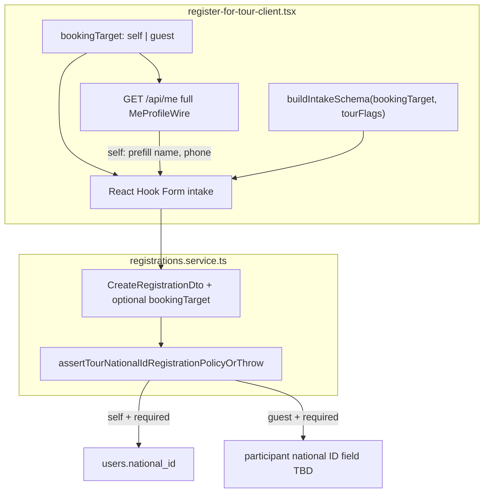
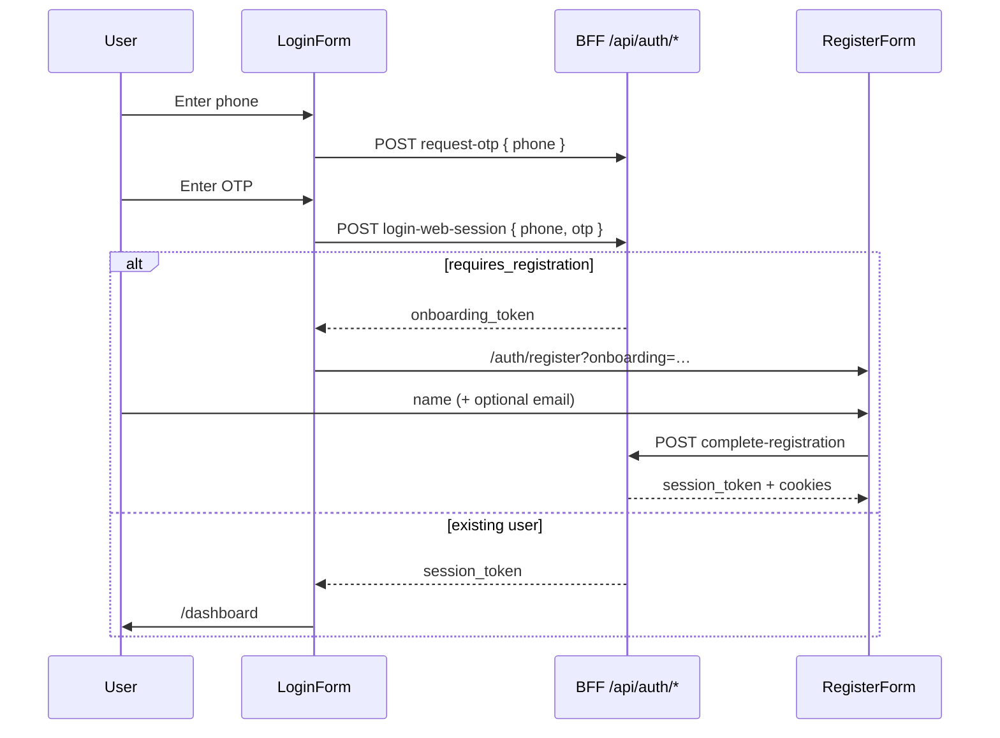

### 1. Form Structure Analysis

**Analyzed file:** `apps/web/app/auth/register/register-form.tsx`  
*(The prompt referenced `path/to/your/register-form-component.tsx`; the workspace implementation lives at the path above.)*

**Related schema:** `apps/web/app/auth/register/register-schema.ts`  
**Page shell:** `apps/web/app/auth/register/page.tsx` (wraps `RegisterForm` in `Suspense`)

---

#### Input fields (UI)

| Field key (RHF) | Label (i18n) | HTML attributes | Present in form? |
|-----------------|--------------|-----------------|------------------|
| `name` | `auth.register.nameLabel` (“Name”) | `autoComplete="name"`, text input | Yes |
| `email` | `auth.register.emailOptionalLabel` (“Email (optional)”) | `type="email"`, `autoComplete="email"` | Yes |
| `national-id` / `nationalId` | — | — | **No** — not rendered or validated in this component |
| `phone` | — | — | **No** — not rendered or validated in this component |

The registration flow assumes the user already authenticated via phone during login/onboarding. The footer link text (`register.footerBackToLogin`: “Back to sign in with phone”) points users back to the login flow for phone-based sign-in; phone capture is not part of this form.

---

#### Validation rules (`buildRegisterFormSchema`)

Schema is built with Zod via `buildRegisterFormSchema(t)` where `t` is `useTranslations("auth")`.

**`name`**

- Type: `z.string()`
- `.trim()` applied before validation
- `.min(1, t("register.validationNameRequired"))` — required non-empty after trim
- Error message (EN): “Name is required.”

**`email`**

- Optional field implemented as `z.union([z.literal(""), z.string().trim().email(...)])`
- Empty string `""` is valid (optional)
- Non-empty values must pass `.email()` after trim
- Error message (EN): “Enter a valid email address.”
- Unit tests (`register-schema.spec.ts`): accepts empty email, rejects invalid non-empty email, accepts valid email

**`national-id`**

- **Not defined** in `RegisterFormValues` or `buildRegisterFormSchema`
- No client-side validation, no `register()` binding, no API payload field

**`phone`**

- **Not defined** in schema or component
- No client-side validation or state for phone on this step

---

#### State management logic

**Form library:** React Hook Form (`useForm<RegisterFormValues>`)

**Resolver:** `@hookform/resolvers/zod` with `zodResolver(registerSchema)`

**Default values:**

```ts
{ name: "", email: "" }
```

**Derived / external state (not in RHF):**

| State source | Purpose |
|--------------|---------|
| `useSearchParams()` | Reads `onboarding` → `onboardingToken` (required to show/submit form); reads `invite` → `inviteToken` (optional post-registration invite acceptance) |
| `useAuth().setSession` | Persists session after successful `complete-registration` |
| `useRouter()` | Redirects to `/login` if onboarding token missing; navigates to `/dashboard` on success |
| `useToast()` | User feedback for errors and success |
| `formState.errors` | Field-level validation errors from Zod resolver |
| `formState.isSubmitting` | Disables inputs and drives submit button loading state |

**Guard behavior:**

- On mount, if `onboardingToken` is empty: toast error (`register.toastMissingSession`), `router.replace("/login")`, component returns `null` (form not rendered)
- Submit button `disabled={!onboardingToken}`

**Submit handler (`onValid`):**

1. Re-checks `onboardingToken`; aborts with toast if missing
2. `POST /api/auth/complete-registration` with body:
   - `onboarding_token`
   - `full_name` ← trimmed `data.name`
   - `email` ← trimmed `data.email` or `undefined` if empty
3. On failure: error toast (`register.toastCompletionFailed` or API message)
4. On success: if response includes `session_token`, `user_id`, `tenant_id` → `setSession(...)`
5. If `inviteToken` present: `POST /api/auth/accept-invite` with `invite_token` (failure toast only; registration still considered done)
6. Success toast, `router.refresh()`, `router.push("/dashboard")`

**Schema memoization:** `registerSchema = useMemo(() => buildRegisterFormSchema(t), [t])` so validation messages stay tied to locale.

---

#### Summary for requested fields

| Field | In form? | Validation | Notes |
|-------|----------|------------|-------|
| **name** | Yes | Required, trimmed, min length 1 | Maps to API `full_name` |
| **phone** | No | N/A | Handled in login/onboarding flow, not registration completion |
| **national-id** | No | N/A | Not part of workspace registration UI; national ID may be collected elsewhere (e.g. user profile / tour registration) |

---

### 2. Booking Logic & Conditional Validation

**Primary surface:** `apps/web/app/(app)/tours/[id]/register/register-for-tour-client.tsx`  
**Copy / i18n:** `register-for-tour-copy.ts` (Persian transport + validation strings)  
**API contract:** `CreateRegistrationDto` (`apps/api/src/modules/registrations/dto/create-registration.dto.ts`)  
**National-ID policy (server):** `RegistrationsService.assertTourNationalIdRegistrationPolicyOrThrow`  
**Profile wire type:** `MeProfileWire` (`packages/types/src/me.ts`)

---

#### 2.1 “Booking for self” vs “booking for guest” — current state

**There is no UI toggle or form field that distinguishes “booking for self” from “booking for guest” in the web app today.**

| Expected concept | What exists instead |
|------------------|---------------------|
| Booking for **self** | Not modeled. User always fills participant name/phone manually; registration is attributed to the signed-in JWT user only at the API layer (`actorId` on create). |
| Booking for **guest** | Not modeled. Any name/phone can be typed into intake fields; no separate guest national-ID field. |
| Self vs group **transport** | **Different feature.** Radio `transportMode`: `self_vehicle` (personal off-road vehicle) vs `group_vehicle` — not “self booking”. |
| Acquaintance vs **stranger** (Denali pricing) | Documented in `docs/30-domain/denali_pricing_rules.md` §2 as **NOT IMPLEMENTED**; no form field (`relationshipToGroup` is TBD). |

**Legacy one-click “self” path (API only):**

- `POST /api/v2/bookings` with `{ tourId }` → `RegistrationsService.createBooking()` (marked `@deprecated`).
- `resolveAuthenticatedBookingInput()` derives `participantFullName` from `users.full_name` (fallback: email local-part or `"Participant"`) and a **synthetic** contact phone via `syntheticBookingContactPhone(userId)` — not the user’s real phone from profile.
- The tour registration wizard **does not call** this endpoint; it uses `publicRegisterTour` → `POST …/tours/{tourId}/register` with explicit intake fields.

**Implication:** Product “self vs guest” must be **added**; it cannot be wired to an existing client control.

---

#### 2.2 User profile fetch & form pre-population

##### Session context (`useAuth`)

`register-for-tour-client.tsx` reads `useAuth()` for gating only:

| Field from auth | Used for |
|-----------------|----------|
| `isHydrated`, `isAuthenticated` | Block unauthenticated users when live API is configured |
| `user.tenantId` | Enables tour detail query + submit guard |
| `user.userId`, `user.role` | **Not** used to prefill intake |

`AuthUser` (`auth-context.tsx`) carries JWT claims only — no `full_name`, `phone`, or `national_id`.

##### Profile fetch on the registration page

A dedicated React Query runs **only when the tour mandates national ID**:

```ts
meProfileQuery = useQuery({
  queryKey: ["me-profile-national-id-guard"],
  enabled: tourQueryEnabled && Boolean(tour) && requiresNationalIdRegistration,
  queryFn: () => fetch("/api/me") → { national_id? }
})
```

| Aspect | Behavior |
|--------|----------|
| Trigger | `tour.details.tripDetails.participation.registrationNationalIdRequired === true` |
| Endpoint | `GET /api/me` (BFF → `GET /api/v2/me`) |
| Fields consumed | **`national_id` only** — typed as `{ national_id?: string \| null }`, not full `MeProfileWire` |
| Effect on RHF | **None** — query result is not passed to `setValue` / `reset` |
| UX | Profile gate banner + submit disabled when ID missing; link to `/settings` |

##### React Hook Form defaults (intake)

```ts
defaultValues: {
  participantFullName: "",
  participantContactPhone: "",
  transportMode: "group_vehicle",
  participantNote: "",
  vehicleSeatCapacity: undefined,
  userPastPeaksCount: 0,
}
```

- **No `useEffect`** hydrates name/phone from `/api/me` or `useAuth`.
- On `tourId` change: `reset()` clears all fields back to empty defaults.
- `MeProfileWire` exposes `full_name`, `phone`, `national_id`, etc., but the registration flow ignores them except the national-ID guard query.

##### Contrast: Settings profile form

`profile-settings-panel.tsx` + `workspace-me-provider.tsx`:

| Step | Mechanism |
|------|-----------|
| Load | `WorkspaceMeProvider` → `fetchMe()` on mount |
| Map | `mapMeToProfileForm(me)` → `fullName`, `nationalId`, `gender`, `birthDate`, … |
| RHF | `defaultValues: mapMeToProfileForm(me)`; `reset(mapMeToProfileForm(me))` when `me` changes |
| Persist | `PATCH /api/me` with optimistic concurrency (`If-Match` / `profile_row_version`) |

This is the **reference pattern** for pre-populating “booking for self” from profile data.

---

#### 2.3 Conditional validation today

##### Client Zod schema (`buildIntakeSchema`)

Built in `register-for-tour-client.tsx`; parameter: `requirePeakHistory` (Peak-Experience tours).

| Field | Always required? | Conditional rule |
|-------|------------------|------------------|
| `participantFullName` | Yes | min 1, max 255 |
| `participantContactPhone` | Yes | regex `PARTICIPANT_PHONE_REGEX`, max 64 |
| `transportMode` | Yes | enum `self_vehicle \| group_vehicle \| other` |
| `vehicleSeatCapacity` | Optional | 1–3 if set; **invalid** if set when `transportMode !== "self_vehicle"` |
| `participantNote` | Optional | max 2000 |
| `userPastPeaksCount` | Conditional | Required when `requirePeakHistory === true` (Peak-Experience intake) |
| **`nationalId` / `national-id`** | **Not in schema** | Enforced via profile gate + API, not intake field |

##### Tour policy flag (leader-configured)

Set in tour wizard / edit (`participation.registrationNationalIdRequired`):

- Denali canonical: `participants.nationalIdRequired` (default **true** in Denali clone path).
- Classic wizard: `ParticipationStep` checkbox.
- Persisted on `tripDetails.participation.registrationNationalIdRequired`.

When `true`:

1. **Client:** `nationalIdRegistrationBlocked` disables submit until `GET /me` returns non-empty `national_id`.
2. **Server:** `assertTourNationalIdRegistrationPolicyOrThrow` requires JWT `userId` + non-empty `users.national_id`.
3. **Error codes:** `PROFILE_NATIONAL_ID_REQUIRED`, `REGISTRATION_AUTH_REQUIRED`.

National ID is **always read from the authenticated user’s profile**, never from registration payload (`CreateRegistrationDto` has no national-ID field).

##### Profile settings validation (national ID when edited)

Optional on profile; if non-empty → 10 digits + Iran checksum (`profile-settings-panel.tsx` Zod `superRefine`, mirrored server-side in `me.service.ts` / `PatchMeDto`).

---

#### 2.4 Where conditional logic **should** be implemented (self vs guest design)

Because self/guest is **not implemented**, the table below maps **recommended insertion points** aligned with existing patterns.



| Layer | Self booking | Guest booking |
|-------|--------------|---------------|
| **UI toggle** | Add `bookingTarget` radio/segmented control before intake fields | Same control |
| **Profile fetch** | Reuse `fetchMe()` / `WorkspaceMeData`; run whenever `bookingTarget === "self"` (not only when national ID required) | Skip prefill; show all participant fields editable |
| **RHF prefill** | `useEffect`: `setValue("participantFullName", me.full_name)`, `setValue("participantContactPhone", me.phone)` when present; optionally lock or mark read-only | Empty defaults; user enters guest identity |
| **Zod (`buildIntakeSchema`)** | If self + profile has values: optional override rules; if profile missing required fields, fall back to required intake or block with link to Settings | Always require `participantFullName` + `participantContactPhone` |
| **National ID** | When `registrationNationalIdRequired`: keep **profile-based** gate (current behavior); no intake field | **New requirement:** either (a) add `participantNationalId` to DTO + intake with same checksum rules, or (b) keep policy as “booker must have profile national ID” only — product decision |
| **API `CreateRegistrationDto`** | Optional `bookingTarget: "self" \| "guest"` for audit/pricing | Same; guest may need `participantNationalId` if policy applies to traveler not booker |
| **Server assert** | Extend `assertTourNationalIdRegistrationPolicyOrThrow` to branch on `bookingTarget` | Validate guest national ID on DTO when tour requires it |
| **Denali pricing (future)** | `bookingTarget === "self"` + membership → acquaintance | Guest / non-member → stranger (`denali_pricing_rules.md` §2) |

**Priority implementation order (minimal viable):**

1. **`bookingTarget` state + UI** in `register-for-tour-client.tsx`.
2. **Broaden `/api/me` query** to full profile when `self`; prefill + optional field locking.
3. **Extend `buildIntakeSchema`** with `superRefine` branches and tour flags (mirror existing `requirePeakHistory` / `transportMode` pattern).
4. **Clarify national-ID product rule** for guest bookings before adding API fields.
5. **Server parity** in `assertTourNationalIdRegistrationPolicyOrThrow` and DTO validation.

---

#### 2.5 Summary matrix

| Concern | Implemented? | Location |
|---------|--------------|----------|
| Self vs guest selection | **No** | — |
| Profile → form prefill (name, phone) | **No** | Intake always empty; contrast Settings `mapMeToProfileForm` |
| Profile → national ID check | **Yes (self/booker only)** | `meProfileQuery` + API assert |
| National ID on intake form | **No** | Profile settings only |
| Transport self vs group | **Yes** | `transportMode` radio (unrelated to booking target) |
| Peak history conditional required | **Yes** | `buildIntakeSchema` + `tourShowsPeakExperienceIntake` |
| One-click book-from-profile API | **Yes (deprecated)** | `POST /api/v2/bookings` — unused by web wizard |

---

### 3. Architecture & Isolation Review

**Scope:** Denali workspace (`denali_pilot` / `getTourWorkspaceDefinition` → `wizardMode: "denali"`) vs classic multi-profile workspaces.  
**Authority chain:** `workspace_tour_wizard_templates.base_profile` → `resolveWorkspaceTourFormProfileFromTemplate` → `TOUR_WORKSPACE_DEFINITIONS` (`packages/shared-contracts/src/tours/workspace-registry.ts`).

---

#### 3.1 What is already isolated (strengths)

| Layer | Denali path | Classic path | Isolation mechanism |
|-------|-------------|--------------|---------------------|
| Create wizard shell | `DenaliCreateTourWizard` | `ClassicTourCreateWizardRoot` inside `TourCreateWizard` | Early return when `workspace.ui.wizardMode === "denali"` (line ~1203) — separate component trees |
| Form model | `DenaliCreateTourWizardForm` + canonical adapter | `TourCreateFormValues` (9-step) | Distinct Zod schemas and default builders |
| Submit validation | `getDenaliWizardSubmitIssues`, `denaliWizardPublishReadiness`, `denaliInvariantEngine` | `profileRules` (`validateForSubmit` / step nav) + `tourCreateSchema` | Denali does **not** use `TourWizardProfileContext` or `getProfileRules` for submit |
| Create mutation | `useDenaliTourWizardCreate` → `createTourFromWorkspaceWizardForm` | `useTourWizardCreate` → `createTourFromClassicWizardForm` | Separate hooks (avoids rules-of-hooks branching) |
| Payload mapping | `mapDenaliWizardToCreateTourPayload` | `wizardFormToCreateTourApiPayload` | Shared `createTour` HTTP client only |
| Edit UI | `DenaliTourEditForm` (single-page, Denali steps) | `TourForm` (flat classic) | `tour-edit-client.tsx` branches on `isDenaliPilotFormProfile(workspaceFormProfile)` |
| Server invariants | `DENALI_WORKSPACE.validation` in shared-contracts | Profile strip via `stripCreateTourDtoForFormProfile` | API workspace registry mirrors web |

Denali create/edit reuse **presentational** step components (`DenaliBasicInfoStep`, etc.) wrapped in Denali-specific providers (`DenaliCanonicalProvider`, `DenaliWizardSyncProvider`) rather than the classic `TourWizardProfileProvider`.

---

#### 3.2 Shared infrastructure (intentional, mostly safe)

| Shared asset | Used by Denali? | Used by classic? | Tenant-scoped? |
|--------------|-----------------|------------------|----------------|
| `useTenantWizardTemplate` | Yes | Yes | Yes — `settingsTourWizardTemplateKeys.detail(tenantId)` |
| `useWorkspaceQueryScope` | Yes | Yes | Yes — JWT `tenantId` (fallback host slug pre-hydrate) |
| `useTourWizardDraftStorageKey` | Yes | Yes | Yes — `wizardDraftStorageKey(scope)` |
| `useSettingsTourThemes` / `useSettingsTourPresets` | Yes | Yes | Yes — query keys include workspace scope |
| `useTourDestinations` | Yes (Denali logistics) | Rare | API tenant-bound |
| `createTour` / `useUpdateTour` | Yes | Yes | Server enforces tenant |
| `formatWizardApiErrorMessage` | Yes | Yes | Pure utility |

These hooks are **workspace-tenant isolated** but **not profile-isolated** within a tenant — correct when each tenant maps to one wizard template profile.

---

#### 3.3 Cross-workspace leakage risks (current gaps)

##### A. Module-level mutable validation flags (classic only, but global process state)

`apps/web/src/components/tours/wizard/schemas/tourCreateValidationPolicy.ts` holds **process-wide singletons**:

- `flags` — mutated by classic create wizard `useLayoutEffect` via `setTourCreateWizardValidationFlags`
- `flatFormFlags` — mutated by classic **edit** `TourForm` via `setTourFlatFormProfileValidationFlags`

`buildTourCreateSchemaForFormProfile` reads `mergeTourValidationFlagsForSchema()` at validation time. **Denali does not touch these flags**, but:

- Navigating classic create → classic edit → another profile without `resetTourCreateWizardValidationFlags` can leave stale relax flags for urban/cinema profiles.
- Classic and flat edit share merged flags — documented as deprecated “Phase D” debt.

**Conflict with Denali:** Low direct impact (Denali schema bypasses this module). **Indirect:** any future refactor that routes Denali through shared `tourCreateSchema` would inherit the singleton hazard.

##### B. Wizard submit idempotency key (not tenant-scoped)

`wizardSubmitSession.ts` uses a **single** `sessionStorage` key: `tour-wizard-submit-idempotency-key`.

Both rails call `getWizardSubmitIdempotencyKey()` on create. Switching tenants or rails in one browser tab before `clearWizardSubmitIdempotencyKey()` could reuse the same idempotency key across workspaces.

##### C. localStorage draft key: slug vs UUID mismatch

| Operation | Scope used |
|-----------|------------|
| Write draft (`useTourWizardDraftStorageKey`) | Host subdomain slug preferred (`useWorkspaceDraftScope`) |
| Clear on tenant switch (`auth-context.tsx`) | JWT `user.tenantId` (UUID) via `removeWizardDraftFromStorage(tenantId)` |
| Denali success cleanup (`useDenaliTourWizardCreate`) | UUID only when `UUID_RE.test(workspaceId)` |

Classic and Denali drafts share the prefix `tour-create-wizard-draft-v1:{scope}` but different envelope shapes (`_wizardRail: "denali"` vs flat classic patch). **Risk:** tenant-switch cleanup may miss slug-keyed drafts; classic parser may attempt to read a Denali envelope from the same key if profile rail changes without purge.

##### D. Registration / booking intake (workspace-agnostic)

`register-for-tour-client.tsx` has **no** `formProfile`, Denali, or workspace checks:

- Same Zod intake for all tenants.
- `meProfileQuery` key `["me-profile-national-id-guard"]` — **not** scoped to `tenantId`.
- Peak-experience intake gated by `tourType` + `tripDetails`, not workspace — overlaps Denali mountain tours and classic `mountain_outdoor` via `peak-experience.ts` hardcoding `denali_pilot`.

Denali-specific registration rules (acquaintance/stranger, guest national ID) from product docs are **not** isolated — they would land in this shared surface.

##### E. Profile fetch duplication

| Surface | Fetch | Scope |
|---------|-------|-------|
| Settings | `WorkspaceMeProvider` → `fetchMe()` | User-global; mounted only under `/settings` |
| Tour register | Ad-hoc `useQuery` → `/api/me` (national ID only) | Unguarded query key; conditional enable |
| Auth session | `useAuth()` | JWT claims only |

No shared **`useWorkspaceMe`** hook for booking; Denali registration cannot reuse Settings’ mapped form state without coupling to settings layout.

##### F. Edit rail resolution vs tour snapshot

`tour-edit-client.tsx` picks Denali edit from **workspace template** (`useTenantWizardTemplate`), not from the tour row’s persisted `formProfile` / snapshot. If template profile and tour snapshot diverge (migration, mis-provisioned tenant), wrong edit shell could render.

##### G. Peak-experience / admin field coupling

`tourShowsPeakExperienceAdminField` explicitly lists `formProfile === "denali_pilot" || "mountain_outdoor"`. Adding a new workspace with similar rules requires editing shared domain code — not registry-driven.

---

#### 3.4 Isolation assessment summary

| Concern | Properly isolated? | Verdict |
|---------|---------------------|---------|
| Denali create validation | Yes | Separate schema + readiness pipeline |
| Denali create data fetching (template, themes, destinations) | Mostly | Shared hooks; tenant-scoped keys |
| Classic create validation | Partial | Profile rules OK; mutable flag singleton is fragile |
| Tour registration validation/fetch | **No** | Single client for all workspaces |
| User profile → booking prefill | **No** | Not implemented; fetch ad hoc |
| Draft persistence | Partial | Shared storage key; slug/UUID cleanup mismatch |
| Submit idempotency | **No** | Global session key |
| Server-side Denali invariants | Yes | `DENALI_WORKSPACE` registry + API asserts |

---

#### 3.5 Recommendations for strict isolation

1. **Registry-first workspace modules**  
   Extend `TourWorkspaceDefinition` with optional `registrationIntake`, `profilePrefetch`, and `bookingValidation` strategy ids. Denali registers its own intake module; default workspace keeps current behavior. Avoid new `if (profile === "denali_pilot")` branches in shared files like `peak-experience.ts`.

2. **Namespace React Query keys by tenant**  
   Change `["me-profile-national-id-guard"]` → `["me", tenantId, "registration-guard"]` (or reuse `settings`-scoped me keys). Prevents stale profile data after workspace switch in one SPA session.

3. **Unify draft scope on one canonical id**  
   Pick **either** host slug **or** JWT `tenantId` for `wizardDraftStorageKey`, and use the same value in `removeWizardDraftFromStorage`, Denali post-create cleanup, and auth tenant-switch effect. Optionally split keys: `…:denali` vs `…:classic` to prevent envelope cross-parse.

4. **Tenant-scope wizard idempotency keys**  
   `tour-wizard-submit-idempotency-key:{tenantId}` (and clear on successful create / tenant switch).

5. **Eliminate validation flag singletons (Phase D)**  
   Pass `TourCreateWizardValidationFlags` through React context or resolver closure instead of module `let flags`. Denali path should remain on its own resolver and never import `tourCreateValidationPolicy`.

6. **Extract `useRegistrationIntake(profile | workspace)`**  
   Wrap `buildIntakeSchema`, profile prefetch, and national-ID policy in a workspace strategy hook. Denali can add self/guest toggle and stricter national-ID rules without touching generic tenants.

7. **Edit shell: prefer tour snapshot over template**  
   Resolve edit rail from `tour.formProfileSnapshot ?? workspaceTemplate.baseProfile` so historical tours stay on the correct form even if template changes.

8. **Lazy-load Denali wizard bundle**  
   `dynamic(() => import('./DenaliCreateTourWizard'))` at the `TourCreateWizard` branch keeps classic tenants from loading Denali schema/canonical code (bundle isolation).

9. **Shared me provider at app segment level (optional)**  
   Mount a lightweight `WorkspaceMeProvider` (or react-query `me` prefetch) under `(app)/layout` with tenant-scoped invalidation on switch — registration and settings consume the same cache without duplicating fetch logic.

10. **Contract tests per workspace**  
    Keep `denaliWizardPublishReadiness.spec.ts` / `mapDenaliWizardToCreateTourPayload.spec.ts` patterns; add isolation tests asserting classic wizard never imports Denali submit validators and that `tourCreateValidationPolicy` flags reset on unmount.

---

#### 3.6 Files to treat as isolation boundaries

| Boundary | Denali-owned | Shared (touch carefully) |
|----------|--------------|---------------------------|
| Create | `DenaliCreateTourWizard.tsx`, `denaliTourCreateSchema.ts`, `denaliWizardPublishReadiness.ts`, `mapDenaliWizardToCreateTourPayload.ts` | `TourCreateWizard.tsx` (router only), `createTourFromWizard.ts` |
| Edit | `DenaliTourEditForm.tsx`, `updateTourDtoFromDenaliWizardForm.ts` | `tour-edit-client.tsx` (branch) |
| Register | — (not split yet) | `register-for-tour-client.tsx`, `peak-experience.ts` |
| Profile | — | `profile-settings-panel.tsx`, `workspace-me-provider.tsx` |
| Global state | — | `tourCreateValidationPolicy.ts`, `wizardSubmitSession.ts`, `tourWizardDraftEnvelope.ts` |

---

### 4. Implementation Proposal

**Suggested module layout**

| File | Responsibility |
|------|----------------|
| `apps/web/src/features/registrations/booking-target/types.ts` | `BookingTarget`, policy config, intake value types |
| `apps/web/src/features/registrations/booking-target/mapMeToIntakePrefill.ts` | Pure profile → form defaults |
| `apps/web/src/features/registrations/booking-target/buildRegistrationIntakeSchema.ts` | Zod schema factory (self vs guest + tour flags) |
| `apps/web/src/features/registrations/booking-target/useRegistrationBookingTarget.ts` | Hook: fetch, prefill, reset, submit gate |

**Integration point:** `register-for-tour-client.tsx` — replace inline `meProfileQuery` + `buildIntakeSchema` with this hook; wire `bookingTarget` toggle to `setBookingTarget`.

---

#### 4.1 Types & policy config

```ts
// apps/web/src/features/registrations/booking-target/types.ts

import type { MeProfileWire } from "@repo/types";

export type BookingTarget = "self" | "guest";

/** Tour + workspace rules that tighten validation beyond baseline intake. */
export type RegistrationFieldPolicy = {
  /** From `tripDetails.participation.registrationNationalIdRequired`. */
  nationalIdRequired: boolean;
  /** Peak-Experience intake (existing `tourShowsPeakExperienceIntake`). */
  requirePeakHistory: boolean;
};

export type RegistrationIntakeValues = {
  bookingTarget: BookingTarget;
  participantFullName: string;
  participantContactPhone: string;
  /** Guest-only when tour mandates ID on traveler (product choice); self uses profile gate. */
  participantNationalId: string;
  transportMode: "self_vehicle" | "group_vehicle" | "other";
  participantNote?: string;
  vehicleSeatCapacity?: number;
  userPastPeaksCount?: number;
};

export type RegistrationPrefillSource = Pick<
  MeProfileWire,
  "full_name" | "phone" | "national_id"
>;
```

---

#### 4.2 Pure mappers (testable, no React)

```ts
// apps/web/src/features/registrations/booking-target/mapMeToIntakePrefill.ts

import type { BookingTarget, RegistrationIntakeValues, RegistrationPrefillSource } from "./types";

const BLANK_GUEST_INTAKE: Omit<RegistrationIntakeValues, "bookingTarget"> = {
  participantFullName: "",
  participantContactPhone: "",
  participantNationalId: "",
  transportMode: "group_vehicle",
  participantNote: "",
  vehicleSeatCapacity: undefined,
  userPastPeaksCount: 0,
};

export function guestIntakeDefaults(): RegistrationIntakeValues {
  return { bookingTarget: "guest", ...BLANK_GUEST_INTAKE };
}

export function selfIntakeFromProfile(
  me: RegistrationPrefillSource | null | undefined,
): RegistrationIntakeValues {
  const fullName = typeof me?.full_name === "string" ? me.full_name.trim() : "";
  const phone = typeof me?.phone === "string" ? me.phone.trim() : "";
  const nationalId =
    typeof me?.national_id === "string" && me.national_id.trim() !== ""
      ? me.national_id.trim()
      : "";

  return {
    bookingTarget: "self",
    participantFullName: fullName,
    participantContactPhone: phone,
    participantNationalId: nationalId,
    transportMode: "group_vehicle",
    participantNote: "",
    vehicleSeatCapacity: undefined,
    userPastPeaksCount: 0,
  };
}

/** Switch target: self → hydrate from profile; guest → clear participant identity fields. */
export function intakeDefaultsForTarget(
  target: BookingTarget,
  me: RegistrationPrefillSource | null | undefined,
): RegistrationIntakeValues {
  return target === "self" ? selfIntakeFromProfile(me) : guestIntakeDefaults();
}
```

---

#### 4.3 Schema factory (mandatory when policy says so)

```ts
// apps/web/src/features/registrations/booking-target/buildRegistrationIntakeSchema.ts

import { z } from "zod";
import { asciiDigitsFromNationalIdRaw, isValidIranNationalIdChecksum } from "@/lib/iran-national-id";

import type { BookingTarget, RegistrationFieldPolicy } from "./types";

const PARTICIPANT_PHONE_REGEX = /^\+?[0-9()\-\s]{7,20}$/;

export type RegistrationIntakeSchemaMessages = {
  fullNameRequired: string;
  phoneRequired: string;
  phoneTooLong: string;
  phoneFormat: string;
  nationalIdRequired: string;
  nationalIdInvalid: string;
  peaksRequired: string;
  seatOnlySelfVehicle: string;
  seatRange: string;
};

export function buildRegistrationIntakeSchema(
  policy: RegistrationFieldPolicy,
  messages: RegistrationIntakeSchemaMessages,
) {
  return z
    .object({
      bookingTarget: z.enum(["self", "guest"]),
      participantFullName: z.string().trim().min(1, messages.fullNameRequired).max(255),
      participantContactPhone: z
        .string()
        .trim()
        .min(1, messages.phoneRequired)
        .max(64, messages.phoneTooLong)
        .regex(PARTICIPANT_PHONE_REGEX, messages.phoneFormat),
      participantNationalId: z.string(),
      transportMode: z.enum(["self_vehicle", "group_vehicle", "other"]),
      participantNote: z.string().trim().max(2000).optional(),
      vehicleSeatCapacity: z.number().int().min(1, messages.seatRange).max(3, messages.seatRange).optional(),
      userPastPeaksCount: z.number().int().min(0).max(4).optional(),
    })
    .superRefine((data, ctx) => {
      if (data.transportMode !== "self_vehicle" && data.vehicleSeatCapacity != null) {
        ctx.addIssue({
          code: z.ZodIssueCode.custom,
          message: messages.seatOnlySelfVehicle,
          path: ["vehicleSeatCapacity"],
        });
      }

      if (policy.requirePeakHistory && data.userPastPeaksCount === undefined) {
        ctx.addIssue({
          code: z.ZodIssueCode.custom,
          message: messages.peaksRequired,
          path: ["userPastPeaksCount"],
        });
      }

      if (!policy.nationalIdRequired) {
        return;
      }

      // Self: national ID lives on profile — form field may stay empty; hook blocks submit separately.
      if (data.bookingTarget === "self") {
        return;
      }

      // Guest: collect on intake when tour policy mandates ID on the traveler.
      const nid = asciiDigitsFromNationalIdRaw(data.participantNationalId.trim());
      if (nid.length === 0) {
        ctx.addIssue({
          code: z.ZodIssueCode.custom,
          message: messages.nationalIdRequired,
          path: ["participantNationalId"],
        });
        return;
      }
      if (nid.length !== 10 || !isValidIranNationalIdChecksum(nid)) {
        ctx.addIssue({
          code: z.ZodIssueCode.custom,
          message: messages.nationalIdInvalid,
          path: ["participantNationalId"],
        });
      }
    });
}

export type RegistrationIntakeFormValues = z.infer<ReturnType<typeof buildRegistrationIntakeSchema>>;
```

---

#### 4.4 Custom hook (fetch, prefill, reset, submit gate)

```ts
// apps/web/src/features/registrations/booking-target/useRegistrationBookingTarget.ts

"use client";

import { zodResolver } from "@hookform/resolvers/zod";
import { useQuery } from "@tanstack/react-query";
import { useCallback, useEffect, useMemo, useState } from "react";
import { useForm } from "react-hook-form";

import type { MeProfileWire } from "@repo/types";
import { fetchMe } from "@/lib/me-client";
import { useWorkspaceQueryScope } from "@/hooks/use-workspace-query-scope";

import {
  buildRegistrationIntakeSchema,
  type RegistrationIntakeFormValues,
  type RegistrationIntakeSchemaMessages,
} from "./buildRegistrationIntakeSchema";
import { guestIntakeDefaults, intakeDefaultsForTarget, selfIntakeFromProfile } from "./mapMeToIntakePrefill";
import type { BookingTarget, RegistrationFieldPolicy } from "./types";

export type UseRegistrationBookingTargetInput = {
  enabled: boolean;
  policy: RegistrationFieldPolicy;
  messages: RegistrationIntakeSchemaMessages;
  /** Called when user switches target so parent can clear mutation state if needed. */
  onTargetChange?: (target: BookingTarget) => void;
};

export function useRegistrationBookingTarget(input: UseRegistrationBookingTargetInput) {
  const tenantId = useWorkspaceQueryScope();
  const [bookingTarget, setBookingTargetState] = useState<BookingTarget>("self");

  const schema = useMemo(
    () => buildRegistrationIntakeSchema(input.policy, input.messages),
    [input.policy, input.messages],
  );

  const meQuery = useQuery({
    queryKey: ["me", tenantId ?? "", "registration-intake"],
    enabled: input.enabled && Boolean(tenantId),
    queryFn: async (): Promise<MeProfileWire> => {
      const res = await fetchMe();
      const body = (await res.json()) as MeProfileWire;
      if (!res.ok) {
        throw new Error(`me ${res.status}`);
      }
      return body;
    },
    staleTime: 30_000,
  });

  const form = useForm<RegistrationIntakeFormValues>({
    resolver: zodResolver(schema),
    defaultValues: guestIntakeDefaults(),
    mode: "onChange",
  });

  const { reset, setValue } = form;

  const applyTarget = useCallback(
    (target: BookingTarget, me: MeProfileWire | undefined) => {
      const defaults = intakeDefaultsForTarget(target, me);
      reset(defaults, { keepDefaultValues: false });
      setBookingTargetState(target);
      input.onTargetChange?.(target);
    },
    [reset, input],
  );

  const setBookingTarget = useCallback(
    (target: BookingTarget) => {
      applyTarget(target, meQuery.data);
    },
    [applyTarget, meQuery.data],
  );

  // Initial self prefill once profile loads (default target = self).
  useEffect(() => {
    if (bookingTarget !== "self" || !meQuery.isSuccess) {
      return;
    }
    reset(selfIntakeFromProfile(meQuery.data), { keepDefaultValues: false });
  }, [bookingTarget, meQuery.isSuccess, meQuery.data, reset]);

  const profileNationalId = (meQuery.data?.national_id ?? "").trim();
  const selfNationalIdBlocked =
    bookingTarget === "self" &&
    input.policy.nationalIdRequired &&
    meQuery.isSuccess &&
    profileNationalId === "";

  const submitBlocked =
    meQuery.isLoading ||
    meQuery.isError ||
    selfNationalIdBlocked;

  const showGuestNationalIdField =
    bookingTarget === "guest" && input.policy.nationalIdRequired;

  const lockSelfIdentityFields =
    bookingTarget === "self" &&
    Boolean(meQuery.data?.full_name?.trim()) &&
    Boolean(meQuery.data?.phone?.trim());

  return {
    bookingTarget,
    setBookingTarget,
    form,
    meQuery,
    submitBlocked,
    selfNationalIdBlocked,
    showGuestNationalIdField,
    lockSelfIdentityFields,
    profileSettingsHref: "/settings",
  };
}
```

---

#### 4.5 Usage in `register-for-tour-client.tsx` (sketch)

```tsx
const policy = useMemo(
  (): RegistrationFieldPolicy => ({
    nationalIdRequired: requiresNationalIdRegistration,
    requirePeakHistory: showPeakExperienceIntake,
  }),
  [requiresNationalIdRegistration, showPeakExperienceIntake],
);

const {
  bookingTarget,
  setBookingTarget,
  form: { register, handleSubmit, watch, formState: { errors, isSubmitting } },
  submitBlocked,
  selfNationalIdBlocked,
  showGuestNationalIdField,
  lockSelfIdentityFields,
  profileSettingsHref,
} = useRegistrationBookingTarget({
  enabled: tourQueryEnabled,
  policy,
  messages: { /* map from REGISTER_FOR_TOUR_COPY + settings i18n */ },
});

// UI toggle (before intake fields)
<fieldset>
  <legend>ثبت‌نام برای</legend>
  <label>
    <input type="radio" checked={bookingTarget === "self"} onChange={() => setBookingTarget("self")} />
    خودم
  </label>
  <label>
    <input type="radio" checked={bookingTarget === "guest"} onChange={() => setBookingTarget("guest")} />
    مهمان / فرد دیگر
  </label>
</fieldset>

{selfNationalIdBlocked ? (
  <p role="alert">
    این تور کد ملی در پروفایل را الزامی می‌کند.{" "}
    <Link href={profileSettingsHref}>تنظیمات پروفایل</Link>
  </p>
) : null}

<FormField label="نام و نام خانوادگی" required>
  <Input
    {...register("participantFullName")}
    readOnly={lockSelfIdentityFields}
  />
</FormField>

{showGuestNationalIdField ? (
  <FormField label="کد ملی شرکت‌کننده" required error={errors.participantNationalId?.message}>
    <Input {...register("participantNationalId")} inputMode="numeric" />
  </FormField>
) : null}

<Button type="submit" disabled={isSubmitting || submitBlocked} />
```

---

#### 4.6 Behaviour matrix

| Rule | Booking for **self** | Booking for **guest** |
|------|----------------------|------------------------|
| Name / phone | Prefill from `GET /me`; fields stay **required** in Zod if profile empty | Cleared on target switch; user enters manually |
| National ID (tour policy **off**) | Not validated on intake | Hidden |
| National ID (tour policy **on**) | **Profile gate** — submit blocked until `users.national_id` set (Settings); not duplicated on form | **Intake field required** + checksum (Zod `superRefine`) |
| Target switch | `reset(selfIntakeFromProfile(me))` | `reset(guestIntakeDefaults())` — wipes participant identity |
| Query key | `["me", tenantId, "registration-intake"]` | Same fetch (booker context); guest does not prefill |

**Note:** Server must accept optional `bookingTarget` and, for guest + `nationalIdRequired`, a new `participantNationalId` (or equivalent) on `CreateRegistrationDto` — client hook is ready for either product branch documented in §2.4.

---

### 5. Implementation Summary & Risk Assessment

**Review date:** 2026-05-24  
**Scope reviewed:** `register-for-tour-client.tsx` refactor + new `apps/web/src/features/registrations/booking-target/` module.

---

#### 5.1 Files touched

| File | Change type | Workspace scope |
|------|-------------|-----------------|
| `apps/web/src/features/registrations/booking-target/types.ts` | **New** | Registration intake only |
| `apps/web/src/features/registrations/booking-target/mapMeToIntakePrefill.ts` | **New** | Registration intake only |
| `apps/web/src/features/registrations/booking-target/buildRegistrationIntakeSchema.ts` | **New** | Registration intake only |
| `apps/web/src/features/registrations/booking-target/useRegistrationBookingTarget.ts` | **New** | Registration intake only |
| `apps/web/src/features/registrations/booking-target/index.ts` | **New** | Barrel export |
| `apps/web/src/features/registrations/booking-target/*.spec.ts` | **New** | Unit tests (6 cases) |
| `apps/web/app/(app)/tours/[id]/register/register-for-tour-client.tsx` | **Refactored** | All tenants (see §5.3) |
| `apps/web/app/(app)/tours/[id]/register/register-for-tour-copy.ts` | **Extended** | Two national-ID validation strings |

**Not modified:** `tourCreateValidationPolicy.ts`, `wizardSubmitSession.ts`, `tourWizardDraftEnvelope.ts`, Denali wizard/create/edit paths, `TourCreateWizard`, `TourForm`, or any `@repo/shared-contracts` workspace registry code. Verified via `git diff` — zero changes outside registration intake surface + copy file.

---

#### 5.2 What changed in `register-for-tour-client.tsx`

| Removed | Replaced by |
|---------|-------------|
| Inline `buildIntakeSchema` + `IntakeValues` | `buildRegistrationIntakeSchema` (booking-target) |
| `meProfileQuery` (`["me-profile-national-id-guard"]`, national ID only) | `useRegistrationBookingTarget` → full `GET /api/me` via `fetchMe`, tenant-scoped key `["me", tenantId, "registration-intake"]` |
| Local `useForm` + `zodResolver` | Form instance returned from hook |
| `nationalIdRegistrationBlocked` | `submitBlocked` + `selfNationalIdBlocked` from hook |
| Empty default intake fields | Self: profile prefill; guest: cleared identity fields |

| Added (UI / behaviour) | Detail |
|------------------------|--------|
| Self vs guest toggle | Persian fieldset «ثبت‌نام برای» — `خودم` / `مهمان / فرد دیگر` |
| Profile prefill (self) | Name + phone from `/api/me`; read-only when both present on profile |
| Guest national-ID field | Shown when `bookingTarget === "guest"` and tour requires national ID |
| Self national-ID gate | Unchanged product rule: profile must have `national_id` before submit |
| Submit guard | `disabled={isSubmitting \|\| placementMutation.isPending \|\| submitBlocked}` |

**API payload unchanged:** `placementMutation` still posts `participantFullName`, `participantContactPhone`, `transportMode`, optional note/seats/peaks — **`participantNationalId` is not sent** (not on `CreateRegistrationDto` today).

---

#### 5.3 Denali vs other workspaces — constraint check

The refactor is **not gated on `denali_pilot`** or `getTourWorkspaceDefinition`. The route `/tours/[id]/register` is **shared by every workspace tenant** that uses the live registrations API.

| Expectation | Actual |
|-------------|--------|
| Changes only in Denali registration | **No** — intake page is tenant-agnostic |
| Isolation via `booking-target` module | **Yes** — validation/prefetch logic lives in a dedicated feature folder with no imports from tour-create wizard code |
| Denali-specific rules | Still driven by **tour** flags (`registrationNationalIdRequired`, peak-experience intake), not workspace profile |

The work aligns with §3.5 recommendation #6 (`useRegistrationIntake` / booking-target strategy) but ships on the **global registration page** until a workspace registry hook splits intake by tenant.

---

#### 5.4 Global state & shared-hook verification

| Global / shared artifact | Touched? | Registration interaction |
|--------------------------|----------|---------------------------|
| `tourCreateValidationPolicy.ts` (mutable Zod flags) | **No** | N/A |
| `wizardSubmitSession.ts` (idempotency key) | **No** | N/A |
| `TourWizardProfileContext` | **No** | N/A |
| `useAuth` | Read-only (session gating) | Unchanged usage |
| `useTourDetail` | Read-only | Unchanged usage |
| `useWorkspaceQueryScope` | Used inside hook | Tenant-scopes React Query key only |
| `WorkspaceMeProvider` | **No** | Hook uses direct `fetchMe()` instead |

No module-level singletons were introduced in booking-target; hook state is per component instance.

---

#### 5.5 Risk matrix (other workspaces)

| Risk | Severity | Description | Mitigation |
|------|----------|-------------|------------|
| **Guest national ID not persisted** | **High** (when tour requires ID + guest booking) | Client validates `participantNationalId` for guests but mutation omits it; server still checks **booker's** profile national ID for self-style policy | Product/API follow-up: extend `CreateRegistrationDto` + `assertTourNationalIdRegistrationPolicyOrThrow` to branch on `bookingTarget` |
| **All tenants see self/guest toggle** | Medium | Non-Denali workspaces get new UX without explicit opt-in | Future: gate toggle via workspace registry or tenant module flag |
| **Extra `/api/me` fetch on every registration visit** | Low | Previously fetched only when `registrationNationalIdRequired`; now fetched whenever intake is enabled (for self prefill) | Acceptable for self default; could defer fetch until `bookingTarget === "self"` |
| **Persian-only toggle labels** | Low | «خودم» / «مهمان» shown on all tenants | i18n pass if non-Denali tenants need EN |
| **Profile prefill overwrites user edits on self** | Low | `useEffect` re-runs `reset(selfIntakeFromProfile)` when `meQuery.data` changes | User can switch to guest to enter manually; read-only lock when name+phone both set |
| **Peak / national-ID policy timing** | Low | Policy derived after tour load; hook uses dynamic resolver + `trigger()` on policy change | Covered in hook implementation |
| **Regression on classic mountain tours** | Low | Peak-experience intake still gated by `tourShowsPeakExperienceIntake` (includes `denali_pilot` + outdoor types) | Existing unit tests + 6 booking-target specs pass |

---

#### 5.6 Test coverage

| Suite | Status |
|-------|--------|
| `mapMeToIntakePrefill.spec.ts` | 3 tests — self/guest defaults, profile mapping |
| `buildRegistrationIntakeSchema.spec.ts` | 3 tests — guest national ID, self skip, peak history |
| `register-for-tour-client.tsx` (E2E) | **Not added** — manual / Playwright follow-up recommended |

---

#### 5.7 Conclusion

The refactor successfully **extracts registration intake into `booking-target`** without touching tour-create global validation state or Denali wizard code. It is **not Denali-only**: every workspace using `/tours/[id]/register` receives self/guest booking, profile prefill, and conditional national-ID rules. The highest open risk is **client/server mismatch for guest national ID** when tours mandate identification — documented in §4.6 and unchanged on the wire until API work lands.

---

### 6. End-to-End Auth Flow (Phone → Register → Session)

Registration is **step two** of a two-step onboarding path; it does not collect phone or national ID.



| Step | Component | URL / route | Token / state carried forward |
|------|-----------|-------------|-------------------------------|
| 1 | `login-form.tsx` | `/auth/login` | `invite` query param (optional) |
| 2 | `register-form.tsx` | `/auth/register?onboarding=…` | `onboarding` (required), `invite` (optional) |

**Phone persistence:** Phone is verified during OTP login and associated with the onboarding session server-side via `onboarding_token`. The register form never receives or displays the phone number.

**Redirect triggers (`login-form.tsx`):**

- `payload.requires_registration === true` and non-empty `onboarding_token` → `router.push('/auth/register?onboarding=…')`
- Successful registration → `router.push('/dashboard')`

---

### 7. Phone & National-ID Validation (Where They Actually Live)

Because `register-form.tsx` has no `phone` or `national-id` fields, validation for those identifiers lives in adjacent flows.

#### 7.1 Phone — `apps/web/app/auth/login/login-form.tsx`

| Aspect | Detail |
|--------|--------|
| RHF field | `phone: string` |
| Step UX | Two-step wizard: `LoginStep = "phone" \| "otp"` via `useState` |
| Normalization | `normalizeOtpPhoneInput()` — trim, Persian/Arabic digits → ASCII, strip non-digit except leading `+` |
| Zod rules | `.transform(normalizeOtpPhoneInput)` then `.min(1)` + `.min(8)` |
| i18n errors | `login.validationPhoneRequired`, `login.validationPhoneInvalid` |
| Display | Persian digit display in FA locale via `useDigitLocalization` |
| API usage | `POST /api/auth/request-otp` and `POST /api/auth/login-web-session` with normalized phone |
| OTP field | Separate `otp` field; required only when `step === "otp"` |

**State beyond RHF:** `step`, `otpChallengeId`, `inviteToken` from search params; `mode: "onChange"` on the form.

#### 7.2 National ID — `apps/web/app/(app)/settings/profile-settings-panel.tsx`

Not collected at registration. Stored on user profile via `PATCH /me`.

| Aspect | Detail |
|--------|--------|
| RHF field | `nationalId: string` (mapped from `me.national_id`) |
| Normalization | `asciiDigitsFromNationalIdRaw()` — Persian/Arabic digits → Latin digits |
| Client Zod (`superRefine`) | If non-empty: must be exactly 10 digits; must pass `isValidIranNationalIdChecksum()` |
| i18n errors | `settings.validationNationalIdLength`, `settings.validationNationalIdInvalid` |
| API field | `national_id` in PATCH body (`null` to clear) |
| Server DTO | `PatchMeDto.national_id` — `@Length(10,10)`, `@Matches(/^[0-9]{10}$/)`, checksum validated in service |

**Tour registration dependency:** `register-for-tour-client.tsx` blocks tour signup when the tour requires national ID (`registrationNationalIdRequired`) and `GET /me` returns no `national_id` — pushing users to complete profile first.

#### 7.3 BFF validation — `complete-registration/route.ts`

Server-side gate for the register form submit (independent of Zod):

| Field | Required | Rule |
|-------|----------|------|
| `onboarding_token` | Yes | Non-empty trimmed string |
| `full_name` | Yes | Non-empty trimmed string |
| `email` | No | Included in backend payload only if non-empty after trim |
| `phone` | No | Not accepted in this endpoint |
| `national_id` | No | Not accepted in this endpoint |

Proxies to `POST /api/v2/auth/web/registration/complete`; sets session cookie on success.

---

### 8. Cross-Field Gap Analysis (Register Form Scope)

| User-facing concept | Register form | Login form | Profile settings | Tour register |
|--------------------|---------------|------------|------------------|---------------|
| **name** | Required (`name` → `full_name`) | — | Editable (`fullName`) | — |
| **phone** | — | Required (OTP flow) | — | — |
| **national-id** | — | — | Optional with checksum | Required when tour policy says so |

**Implication:** A new user can complete registration with name only; phone is already bound via OTP; national ID remains empty until they visit Settings or attempt a tour that mandates it.

