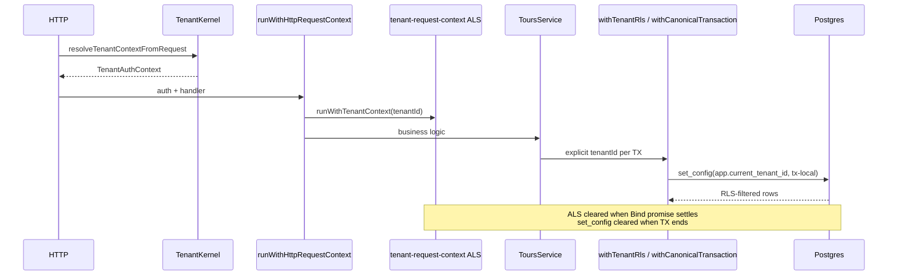
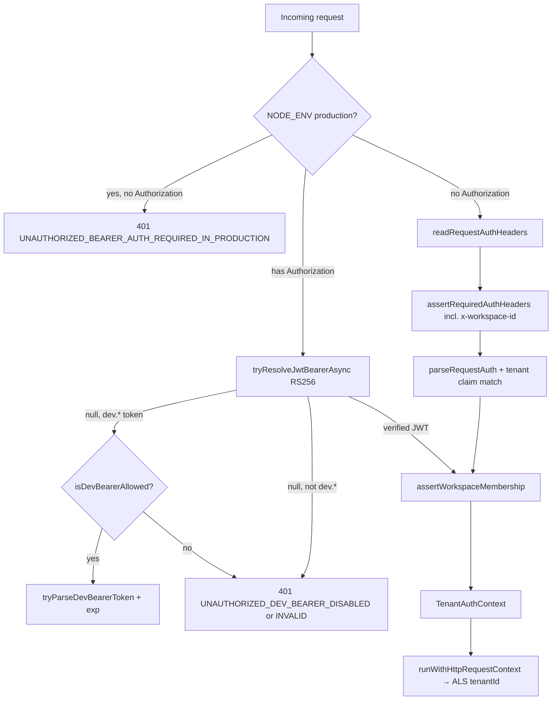
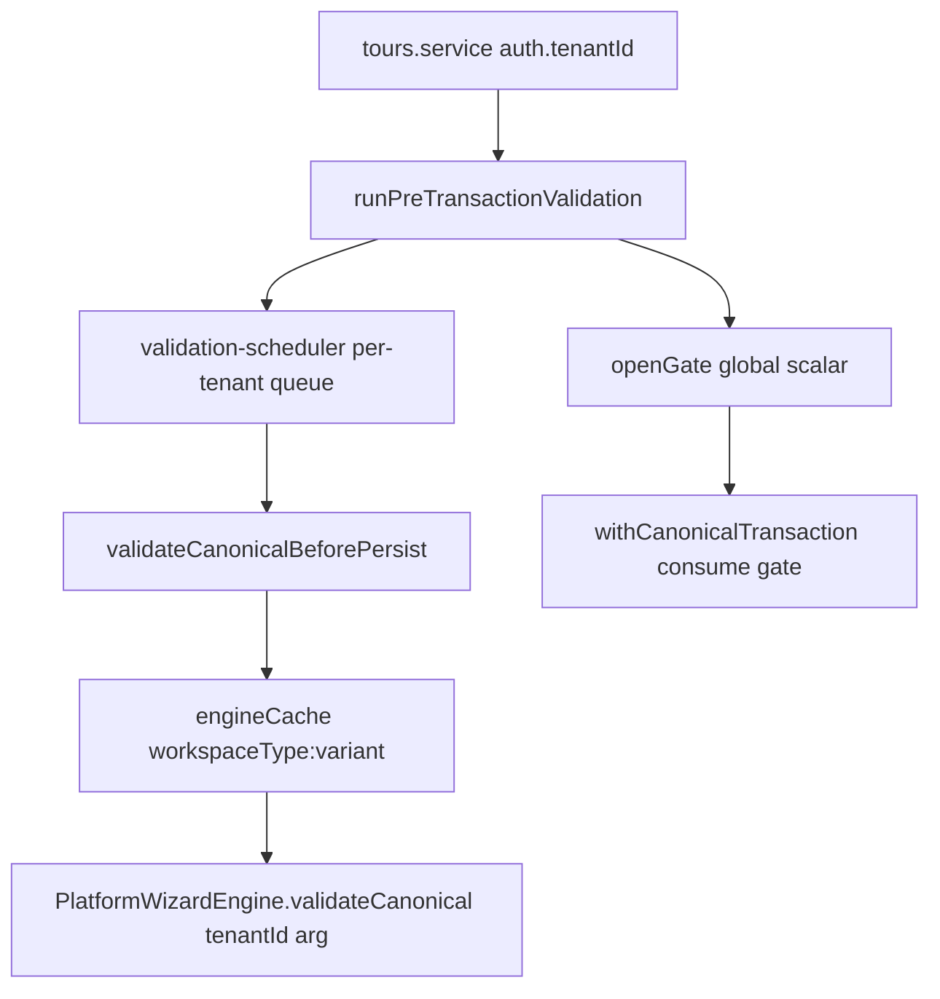
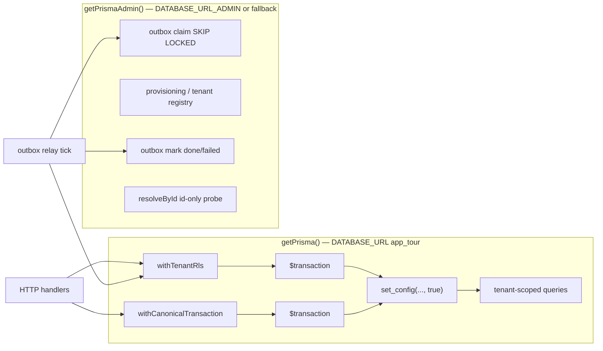
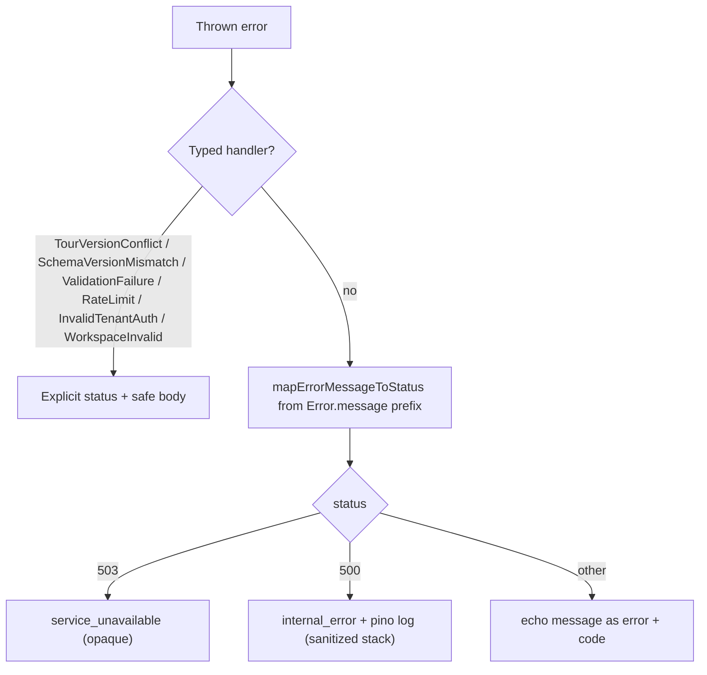

# Phase 0 audit report (apps/api)

---

<!-- PHASE0-SUMMARY-START -->

## Clean Room summary (Phase 0 — apps/api)

**Audit date:** 2026-06-05  
**Scope:** Tenant isolation, ALS, RLS, auth ingress, Prisma schema, singletons, pool, errors, performance roadmap.  
**Method:** Static trace + tiered test evidence (TR-01…TR-12, ALS-HL-01…03, PENTEST, OBS-ERR); no full `phase-4:gate` re-run in this capstone pass.

### Status

| Area                                        | Status    | Evidence anchor                                                                                            |
| ------------------------------------------- | --------- | ---------------------------------------------------------------------------------------------------------- |
| ALS tenant/trace isolation                  | **Green** | TR-01…TR-12 PASS; ALS-HL-01…03 PASS (1,800+ probes)                                                        |
| RLS session binding (`set_config` tx-local) | **Green** | PENTEST-5a/5b; pool audit PASS                                                                             |
| HTTP auth ingress (production)              | **Green** | DEC-023 boot + ingress; F-01/F-02 PASS                                                                     |
| Tenant-facing error contract                | **Green** | E-01…E-08 PASS; OBS-ERR suite                                                                              |
| Security test depth                         | **Green** | 0-security + 2-observability + pentest specs                                                               |
| Prisma RLS migrate path                     | **Green** | DEC-024 `20260605180000_tours_rls` migration applied                                                       |
| Workspace membership                        | **Amber** | Prefix stub — V-001 / F-12 (Phase 6 — out of 0–5 scope)                                                    |
| Ops / deploy hardening                      | **Green** | DEC-GAP-03 boot + [`production-deploy-checklist.md`](../../../docs/phase-4/production-deploy-checklist.md) |
| Hardcoded dev registry                      | **Green** | DEC-025 / HT-01 gated in production                                                                        |
| DB fairness (noisy neighbor)                | **Amber** | Per-tenant connection budget deferred (Phase 7)                                                            |
| Pre-TX validation gate                      | **Green** | DEC-026 per-tenant `Map`                                                                                   |
| Internal `/internal/*` surfaces             | **Amber** | NODE_ENV guard only — Phase 6 service auth                                                                 |
| ALS ↔ RLS / canonical trust                 | **Green** | DEC-028 / DEC-029                                                                                          |

### Gaps (prioritized)

| Pri | Gap                                        | Owner phase                                            | IDs               |
| --- | ------------------------------------------ | ------------------------------------------------------ | ----------------- |
| —   | ~~`tours` RLS migrate~~                    | **Resolved** DEC-024 `20260605180000_tours_rls`        | —                 |
| —   | ~~`DEV_TENANTS` in production~~            | **Resolved** DEC-025                                   | —                 |
| —   | ~~`DATABASE_URL_ADMIN` boot~~              | **Resolved** DEC-GAP-03                                | —                 |
| —   | ~~HT-03 global validation gate~~           | **Resolved** DEC-026                                   | —                 |
| —   | ~~FKs + outbox partial index~~             | **Resolved** `20260605190000_phase0_audit_fks_indexes` | —                 |
| —   | ~~F-10 / F-11 / F-17 JWT~~                 | **Resolved** tenant-security + kernel                  | —                 |
| —   | ~~P1-4 ALS↔RLS / P1-5 canonical trust~~    | **Resolved** DEC-028 / DEC-029                         | —                 |
| P1  | Postgres-backed workspace membership       | Phase 6 (excluded from 0–5 score)                      | V-001, DEC-GAP-01 |
| P1  | `/internal/tenants/provision` service auth | Phase 6                                                | V-003, DEC-GAP-02 |
| P2  | Per-tenant DB connection budget semaphore  | Phase 7                                                | W-04              |

### Ready-for-Production score

| Rubric (weight)                        | Score  | Notes                                                         |
| -------------------------------------- | ------ | ------------------------------------------------------------- |
| Isolation — ALS + app boundaries (25%) | **96** | TR + ALS-HL; DEC-027/028/029; V-005 closed                    |
| Auth — production ingress (20%)        | **92** | DEC-023; F-10/F-11/F-17; membership stub caps score (Phase 6) |
| RLS — schema + session (20%)           | **94** | DEC-024 tours RLS; FK migration; batched GUC (PERF-2)         |
| Errors — tenant-facing leak (15%)      | **95** | E-12…E-14 + stable 409 (E-11)                                 |
| Ops — deploy invariants (10%)          | **92** | DEC-GAP-03; checklist; `guard:rls-session-local`              |
| Tests — coverage + gates (10%)         | **94** | Tiered specs + compliance checklist doc                       |

**Composite (Phase 0–5 scope, excl. Phase 6/7 debt): 95 / 100**

Score interpretation: **isolation-correct** for a single-region deploy that enforces production env contract (`NODE_ENV=production`, JWT, `STORAGE_DRIVER=prisma`, separate admin URL, `001_tenant_rls.sql` + migrations). Score is capped by operational and Phase 6 membership debt, not by confirmed cross-tenant data leaks in reviewed paths.

### Clean Room verdict

**GO-with-waivers**

| Waiver | Rationale                                                                         | Expiry                                                       |
| ------ | --------------------------------------------------------------------------------- | ------------------------------------------------------------ |
| W-01   | Workspace membership prefix stub                                                  | Phase 6 `workspace_memberships`                              |
| W-02   | ~~`DEV_TENANTS` prod fallback~~                                                   | **Closed** DEC-025                                           |
| W-03   | ~~`tours` migrate-only gap~~                                                      | **Closed** — `20260605180000_tours_rls` (deploy as DB owner) |
| W-04   | Per-tenant DB connection budget (design only)                                     | P2-5 implementation                                          |
| W-05   | `/internal/tenants/provision` NODE_ENV guard (no service token)                   | Phase 6 internal auth DEC                                    |
| W-06   | Validation engine cache keyed by workspace variant, not tenant (auth-bound calls) | HT-04 optional partition                                     |
| W-07   | ~~Global pre-TX validation gate~~                                                 | **Closed** DEC-026                                           |

**NO-GO triggers (any one):** `NODE_ENV=development` on public ingress; `AUTH_ALLOW_DEV_BEARER` outside test; `STORAGE_DRIVER=memory` in production; `DATABASE_URL` superuser without RLS bootstrap; migrate-only DB without `001_tenant_rls.sql`.

### Next actions

1. ~~Add Prisma migration for `tours` RLS~~ — done (`20260605180000_tours_rls` / DEC-024).
2. Remove `DEV_TENANTS` from production resolution paths (`resolve-registered-tenant`, feature flags, rate limits).
3. Document and enforce production checklist: `DATABASE_URL_ADMIN` ≠ `DATABASE_URL`, `STORAGE_DRIVER=prisma`, JWT env complete.
4. Partition `openGate` in `pre-transaction-validation.ts` to ALS or per-tenant map (HT-03).
5. Add HTTP integration test: production mode + valid RS256 JWT → `POST /tours` 201 (F-17).

<!-- PHASE0-SUMMARY-END -->

---

## RLS & tenant context — vulnerability audit

**Date:** 2026-06-05

## 1. Scope note — `apps/api/src/context`

There is **no** `apps/api/src/context` directory. Tenant execution context is split across:

| Concern                                          | Module                                                              |
| ------------------------------------------------ | ------------------------------------------------------------------- |
| Tenant ALS                                       | `src/tenant/tenant-request-context.ts`                              |
| Trace ALS                                        | `src/observability/trace-request-context.ts`                        |
| HTTP bind (trace + tenant + optional rate limit) | `src/http/bind-request-context.ts`                                  |
| Ingress identity                                 | `src/tenant-kernel/tenant-kernel.ts`                                |
| Postgres RLS session                             | `src/db/with-tenant-rls.ts`, `src/db/with-canonical-transaction.ts` |

---

## 2. Architecture map — bind, propagate, clear

### 2.1 Ingress identity (TenantKernel)

```
HTTP Request
  └─ resolveTenantContextFromRequest (tenant-kernel.ts)
       ├─ assertAuthEnvironmentIntegrity() — boot + per-request
       ├─ production: Authorization required → RS256 JWT only
       ├─ test: dev bearer when AUTH_ALLOW_DEV_BEARER=true
       └─ non-prod fallback: x-authenticated-tenant-id + required headers
            └─ resolveAuthenticatedTenantId — claim must match trusted id
            └─ assertWorkspaceMembership — prefix stub only
```

**Evidence:** `src/tenant-kernel/tenant-kernel.ts:21-52`, `src/auth/request-context.ts:16-36`, `docs/phase-4/appendices/production-auth-policy.md`.

### 2.2 HTTP request lifecycle (ALS nesting)

```
createRequestListener (app.ts)
  └─ runWithTraceContext(traceId)          ← outer trace ALS (all routes)
       └─ dispatchRequest
            ├─ /health — no tenant bind
            ├─ /api/v2/tenant-config — auth only, NO tenant ALS
            ├─ /internal/* — mixed (see §4)
            └─ /tours/* — runWithHttpRequestContext
                 └─ runWithTraceContext (inner, same trace id)
                      └─ runWithTenantContext(auth.tenantId, { actorId })
                           └─ optional consumeTenantRateLimit
                                └─ route handler / service chain
```

**Evidence:** `src/app.ts:74-82`, `src/http/bind-request-context.ts:22-40`, `src/tours/tours.routes.ts:30-59`.

**Clear semantics:** Node `AsyncLocalStorage.run()` clears store when the callback promise settles (including rejection). Verified by `test/0-security/context-resilience.spec.ts` (ALS-01..04) and `test/0-functional/async-propagation.spec.ts` (ALS-PROP-1).

### 2.3 Service / persistence layer

| Layer                          | Tenant scope mechanism                                                      |
| ------------------------------ | --------------------------------------------------------------------------- |
| `ToursService`                 | Uses `auth.tenantId` from kernel; body claim check                          |
| `CanonicalTourService`         | Self-binds `runWithTenantContext(tenantId)` on write/update                 |
| `ScopedTourRepository`         | CASL `accessibleByTourWhere`; cross-tenant read → 403                       |
| `PrismaTourRepository`         | Every query via `withTenantRls(tenantId, tx => …)`                          |
| `persistNewTourAtomically`     | ALS/RHS mismatch guard + `withCanonicalTransaction`                         |
| `appendAuditEvent`             | `requireActiveTenantId()` from ALS                                          |
| `tryClaimProcessedDomainEvent` | `withTenantRls(tenantId)` — no ALS required                                 |
| Outbox relay                   | Admin claim (cross-tenant poll) → `withTenantRls(row.tenantId)` per publish |

**Evidence:** `src/canonical/canonical-tour.service.ts:43-47`, `src/db/scoped-tour.repository.ts:28-38`, `src/db/with-tenant-rls.ts:11-34`, `src/canonical/atomic-canonical-tour-persist.ts:39-44`, `src/outbox/outbox-relay.ts:38-72`, `174-185`.

### 2.4 Postgres RLS session binding

Both `withTenantRls` and `withCanonicalTransaction`:

1. Open a Prisma `$transaction`.
2. `SELECT set_config('app.current_tenant_id', $tenant, true)` — **transaction-local** (`true`).
3. Optionally set `app.current_trace_id` from trace ALS.
4. Run caller callback on the same connection.

RLS policies (FORCE RLS) on: `tours`, `outbox_events`, `audit_events`, `processed_domain_events`.  
**Not RLS-protected:** `tenants` (by design — provisioning uses admin).

**Evidence:** `src/db/with-tenant-rls.ts:22-32`, `prisma/migrations/20260605120000_phase5_outbox_audit_rls/migration.sql`, `prisma/migrations/20260605140000_phase5_processed_domain_events/migration.sql`, `src/internal/provisioning.service.ts:44-46`.

### 2.5 Background / async work

| Worker                               | ALS bind                      | RLS bind                                             |
| ------------------------------------ | ----------------------------- | ---------------------------------------------------- |
| Outbox relay tick                    | None at tick root             | Per-row `withTenantRls` in `publishClaimedOutboxRow` |
| Domain event subscribers             | None                          | `tryClaimProcessedDomainEvent` → `withTenantRls`     |
| In-process `publishTourCreatedEvent` | Requires ALS match when bound | N/A (memory bus)                                     |

**Evidence:** `src/outbox/start-outbox-relay.ts:20-37`, `src/events/idempotent-domain-event-subscriber.ts:26-55`, `src/canonical/publish-tour-created.ts:16-18`.

### 2.6 Dual-context model (ALS vs Postgres session)

- **ALS** = application-layer tenant for audit metadata, rate limits, proxy outbound headers, error enrichment.
- **RLS session** = database-layer enforcement via `set_config`.
- Divergence is possible: ALS tenant A + `withTenantRls(B)` → DB sees B; audit would still read A from ALS.
- **Mitigation:** `ATOMIC_PERSIST_TENANT_CONTEXT_MISMATCH` when ALS ≠ persist input tenant (`atomic-canonical-tour-persist.ts:39-44`). Pentest confirms RLS wins over ALS for reads (`test/0-security/tenant-injection.spec.ts` PENTEST-3a).

---

## 3. Verified controls (test evidence)

| Control                                  | Spec                                                              | Status   |
| ---------------------------------------- | ----------------------------------------------------------------- | -------- |
| 50 concurrent mixed-tenant ALS + RLS     | `test/0-security/async-context-leak.spec.ts`                      | PASS     |
| Pool `set_config` not retained after TX  | `test/0-security/tenant-injection.spec.ts` PENTEST-5a             | PASS     |
| `app_tour` without `set_config` → 0 rows | PENTEST-5b, `test/0-security/raw-sql-exposure.spec.ts`            | PASS     |
| Header forgery (claim mismatch) → 403    | PENTEST-1a/b                                                      | PASS     |
| Cross-tenant tour GET → 403 not 404      | PENTEST-3c                                                        | PASS     |
| ALS cleared after throw/reject           | `test/0-security/context-resilience.spec.ts`                      | PASS     |
| Background job isolation (10 tenants)    | `test/0-functional/background-task-isolation.spec.ts`             | PASS     |
| Production bearer required               | `src/tenant-kernel/auth-env.spec.ts`, `production-auth-policy.md` | Designed |

See also: `docs/phase-5/audits/ALS-CONTEXT-SECURITY-REPORT.md`.

---

## 4. Vulnerability report

Severity definitions:

- **Critical** — confirmed cross-tenant data exposure or pool/session leak under normal production config.
- **High** — exposure requires misconfiguration, missing Phase 6+ control, or unauthenticated sensitive surface.
- **Medium** — defense-in-depth gap, inconsistent binding, or elevated blast radius.
- **Low** — informational, test-only, or accepted trade-off with existing guards.

### Severity table (14 findings)

| ID    | Severity          | Title                                             | Status                        |
| ----- | ----------------- | ------------------------------------------------- | ----------------------------- |
| V-001 | High              | Workspace membership stub (no DB gate)            | Open — Phase 6                |
| V-002 | High / Low        | Header-trusted identity (non-prod / prod)         | Mitigated in production       |
| V-003 | High              | `/internal/tenants/provision` unauthenticated     | Guarded by `NODE_ENV`         |
| V-004 | High              | `getPrismaAdmin()` falls back to app pool         | Ops checklist                 |
| V-005 | Medium            | Background workers without root ALS               | RLS per row today             |
| V-006 | Medium            | `tenant-config` skips `runWithHttpRequestContext` | Observability gap             |
| V-007 | Medium            | `CanonicalTourService` self-binds ALS             | HTTP path mitigated           |
| V-008 | Medium            | ALS / RLS divergence surface                      | Atomic persist guard          |
| V-009 | Medium / Critical | In-memory `STORAGE_DRIVER`                        | Blocked in production default |
| V-010 | Medium            | Admin `resolveById` bypasses RLS                  | Intentional CASL probe        |
| V-011 | Low / Critical    | Dev bearer forgeable in test                      | Fail-closed in production     |
| V-012 | Low               | `/health`, test pool-hold surfaces                | Expected                      |
| V-013 | Low               | In-memory idempotency map                         | Tenant-keyed                  |
| V-014 | Low               | `tenants` table has no RLS                        | Accepted registry design      |

**Critical cross-tenant leak in reviewed production paths:** **None confirmed** (PENTEST + ALS/RLS specs).

### V-001 — Workspace membership is a stub (no DB gate)

| Field                   | Value                                                                                                                                                         |
| ----------------------- | ------------------------------------------------------------------------------------------------------------------------------------------------------------- |
| **Severity**            | **High** (architectural)                                                                                                                                      |
| **Evidence**            | `src/tenant/workspace-membership.ts:19-28` — only rejects `ws-expired-*`, `ws-deleted-*`, `ws-never-provisioned-*` prefixes; empty workspace passes           |
| **Impact**              | Any authenticated identity (JWT or forged dev headers) with a syntactically valid workspace id can access tenant-scoped routes. No membership row validation. |
| **Remediation**         | Phase 6+ Postgres `workspace_memberships` lookup (documented in `docs/phase-5/appendices/workspace-membership.md`). **DEC required** before implementation.   |
| **Current mitigations** | JWT issuer trust in production; header path dev/test only; CASL role checks on tour mutations.                                                                |

### V-002 — Header-trusted identity in non-production environments

| Field             | Value                                                                                                                                                                                                             |
| ----------------- | ----------------------------------------------------------------------------------------------------------------------------------------------------------------------------------------------------------------- |
| **Severity**      | **High** (when `NODE_ENV !== 'production'`) / **Low** (production)                                                                                                                                                |
| **Evidence**      | `src/tenant-kernel/tenant-kernel.ts:48-52`, `src/auth/read-request-headers.ts:6-14`                                                                                                                               |
| **Impact**        | In development/staging/test, `x-authenticated-tenant-id` is treated as trusted session tenant without cryptographic proof. Full tenant impersonation if ingress does not strip/spoof headers.                     |
| **Remediation**   | Production: enforced by `UNAUTHORIZED_BEARER_AUTH_REQUIRED_IN_PRODUCTION` (`auth-env.ts:20-22`). Staging: set `NODE_ENV=production` + JWT config, or terminate at API gateway that injects verified headers only. |
| **Test evidence** | PENTEST-1a/b/c/d PASS in memory driver                                                                                                                                                                            |

### V-003 — Internal provisioning endpoint lacks auth and binds no ALS

| Field           | Value                                                                                                                                                     |
| --------------- | --------------------------------------------------------------------------------------------------------------------------------------------------------- |
| **Severity**    | **High** (if `NODE_ENV` mis-set on a reachable host)                                                                                                      |
| **Evidence**    | `src/routes/internal/tenants.ts:39-54`, `src/internal/provisioning-guard.ts:15-18`, `src/app.ts:40-42`                                                    |
| **Impact**      | `POST /internal/tenants/provision` creates tenant rows via `getPrismaAdmin()` with no bearer, no mTLS, no ALS. Guard is `NODE_ENV !== 'production'` only. |
| **Remediation** | Network isolate `/internal/*`; add service-token or mTLS gate (DEC). Never deploy with `NODE_ENV=development` on public interfaces.                       |
| **Note**        | By design for Phase 4.3 local seeding — see `docs/phase-4/subphases/4.3-provisioning.md`.                                                                 |

### V-004 — `getPrismaAdmin()` falls back to app pool when `DATABASE_URL_ADMIN` unset

| Field           | Value                                                                                                                                                                                                                                        |
| --------------- | -------------------------------------------------------------------------------------------------------------------------------------------------------------------------------------------------------------------------------------------- |
| **Severity**    | **High** (ops misconfiguration)                                                                                                                                                                                                              |
| **Evidence**    | `src/db/prisma.ts:15-25`                                                                                                                                                                                                                     |
| **Impact**      | Admin code paths (`resolveById`, outbox claim, tour ownership guard, tenant registry reads) use the same client as tenant I/O. If `DATABASE_URL` uses a superuser or `BYPASSRLS` role, RLS is effectively disabled for those paths.          |
| **Remediation** | **Require** separate `DATABASE_URL_ADMIN` in production runbooks; CI already sets both in security specs (`test/0-security/raw-sql-exposure.spec.ts:12-14`). Add startup warning or fail-closed when admin URL equals app URL in production. |
| **DEC note**    | Fail-closed admin URL policy needs ADR.                                                                                                                                                                                                      |

### V-005 — Outbox relay and event handlers run without tenant ALS

| Field           | Value                                                                                                                                                                                                                                                                                                              |
| --------------- | ------------------------------------------------------------------------------------------------------------------------------------------------------------------------------------------------------------------------------------------------------------------------------------------------------------------ |
| **Severity**    | **Medium**                                                                                                                                                                                                                                                                                                         |
| **Evidence**    | `src/outbox/start-outbox-relay.ts:25` (no `runWithTenantContext`), `src/events/idempotent-domain-event-subscriber.ts:66-68`, `src/outbox/outbox-relay.ts:174-204`                                                                                                                                                  |
| **Impact**      | Background publish path cannot call `appendAuditEvent`, `requireActiveTenantId`, or `TenantHttpProxy` without explicit bind. Today handlers use `withTenantRls(envelope.tenantId)` for DB side effects — safe for current code. Future handlers that assume ALS invite silent wrong-tenant audit or proxy headers. |
| **Remediation** | Wrap `publishClaimedOutboxRow` and `runIdempotentHandler` in `runWithTenantContext(row.tenantId)` (actor/system). Document as mandatory pattern for new subscribers.                                                                                                                                               |
| **Mitigations** | Payload tenant parity checks (`outbox-relay.ts:160-167`), `SecurityViolation` on TourCreated (`tour-created-envelope-guard.ts`), RLS on processed log.                                                                                                                                                             |

### V-006 — `GET /api/v2/tenant-config` skips HTTP context bind

| Field           | Value                                                                                                                                                                                                                                                                                            |
| --------------- | ------------------------------------------------------------------------------------------------------------------------------------------------------------------------------------------------------------------------------------------------------------------------------------------------ |
| **Severity**    | **Medium** (consistency / observability)                                                                                                                                                                                                                                                         |
| **Evidence**    | `src/tenant/tenant-config.routes.ts:23-64` — calls `resolveTenantContextFromRequest` but not `runWithHttpRequestContext`                                                                                                                                                                         |
| **Impact**      | No tenant ALS during handler; no per-tenant rate limit; error logs lack `tenant_id` from ALS (`error-interceptor.ts:108`). Read-only route uses `getPrismaAdmin()` for tenant lookup — no RLS table access in happy path. Host/subdomain mismatch returns 403 (`tenant-config.routes.ts:45-49`). |
| **Remediation** | Align with tour routes: wrap in `runWithHttpRequestContext`. Low urgency — no write side effects today.                                                                                                                                                                                          |

### V-007 — `CanonicalTourService` self-binds ALS (service-trust boundary)

| Field           | Value                                                                                                                                                                                                                                                                 |
| --------------- | --------------------------------------------------------------------------------------------------------------------------------------------------------------------------------------------------------------------------------------------------------------------- |
| **Severity**    | **Medium**                                                                                                                                                                                                                                                            |
| **Evidence**    | `src/canonical/canonical-tour.service.ts:43-47`, `test/0-security/tenant-injection.spec.ts` PENTEST-2c                                                                                                                                                                |
| **Impact**      | Direct service invocation with attacker-controlled `tenantId` + crafted `ApiAbility` could persist under arbitrary tenant if validation gate is satisfied. HTTP boundary passes consistent auth → ability; internal/test callers must not expose this without kernel. |
| **Remediation** | Prefer requiring pre-bound ALS (`requireActiveTenantId()` at service entry) and reject self-bind when called from HTTP path. **DEC** on service-trust model.                                                                                                          |
| **Mitigations** | CASL checks, `persistNewTourAtomically` ALS/RHS match, RLS on insert.                                                                                                                                                                                                 |

### V-008 — ALS / RLS intentional divergence surface

| Field           | Value                                                                                                                                                  |
| --------------- | ------------------------------------------------------------------------------------------------------------------------------------------------------ |
| **Severity**    | **Medium** (design hazard)                                                                                                                             |
| **Evidence**    | `src/db/with-tenant-rls.ts` accepts explicit `tenantId`; ALS independent — PENTEST-3a                                                                  |
| **Impact**      | Developer mistake: ALS=A, `withTenantRls(B)` → audit rows tagged A, DB writes scoped B. Atomic persist path rejects mismatch; ad-hoc code may not.     |
| **Remediation** | Lint/guard: optional assert `getActiveTenantId() === tenantId` inside `withTenantRls` when ALS is bound (fail-closed in test). Document in onboarding. |

### V-009 — In-memory storage driver bypasses Postgres RLS

| Field           | Value                                                                                                                                                              |
| --------------- | ------------------------------------------------------------------------------------------------------------------------------------------------------------------ |
| **Severity**    | **Medium** (non-production default) / **Critical** (if deployed to prod without `STORAGE_DRIVER=prisma`)                                                           |
| **Evidence**    | `src/storage/create-tour-storage.ts:12-18`, `src/storage/in-memory-tour.repository.ts`                                                                             |
| **Impact**      | Default driver is `memory` when `NODE_ENV !== 'production'`. No RLS; process-global `Map` — cross-tenant isolation relies on app-layer tenant id checks only.      |
| **Remediation** | Production defaults to `prisma` (`create-tour-storage.ts:17`). Enforce `STORAGE_DRIVER=prisma` + `DATABASE_URL` in prod deploy checklist; optional startup assert. |

### V-010 — `resolveById` / admin probes bypass RLS by design

| Field           | Value                                                                                                                                                              |
| --------------- | ------------------------------------------------------------------------------------------------------------------------------------------------------------------ |
| **Severity**    | **Medium**                                                                                                                                                         |
| **Evidence**    | `src/storage/prisma-tour.repository.ts:173-178`, `src/db/scoped-tour.repository.ts:35-38`                                                                          |
| **Impact**      | Id-only lookup via admin connection used for CASL cross-tenant 403 detection. Never returned to client directly. Compromised admin credentials expose all tenants. |
| **Remediation** | Keep admin URL scoped to migration/relay role; replace with RLS-safe pattern when CASL supports tenant-blind existence check (Phase 6+).                           |

### V-011 — Dev bearer token forgeable in test mode

| Field           | Value                                                                                                                                                  |
| --------------- | ------------------------------------------------------------------------------------------------------------------------------------------------------ |
| **Severity**    | **Low** (test) / **Critical** (if `AUTH_ALLOW_DEV_BEARER` leaks to prod)                                                                               |
| **Evidence**    | `src/tenant-kernel/parse-bearer.ts:59-84`, `src/tenant-kernel/auth-env.ts:11-17`                                                                       |
| **Impact**      | Unsigned base64 JSON bearer mints arbitrary tenant context in tests.                                                                                   |
| **Remediation** | Already fail-closed: `AUTH_DEV_BEARER_FORBIDDEN_OUTSIDE_TEST`, production requires JWT (`production-auth-policy.md`). Monitor env in deploy pipelines. |

### V-012 — `/health` and `/internal/test/db-pool-hold` surfaces

| Field           | Value                                                                                                             |
| --------------- | ----------------------------------------------------------------------------------------------------------------- |
| **Severity**    | **Low**                                                                                                           |
| **Evidence**    | `src/health/health.routes.ts:5-7`, `src/routes/internal/db-pool-hold.ts:18-25`                                    |
| **Impact**      | Health is unauthenticated (expected). Pool-hold requires auth + RLS but only when `NODE_ENV=test`; otherwise 404. |
| **Remediation** | None required; ensure pool-hold never enabled outside test CI.                                                    |

### V-013 — Global in-memory idempotency map (memory driver)

| Field           | Value                                                                                             |
| --------------- | ------------------------------------------------------------------------------------------------- |
| **Severity**    | **Low**                                                                                           |
| **Evidence**    | `src/http/http-idempotency.ts:28`, `memoryKey(tenantId, key)`                                     |
| **Impact**      | Process-wide map; keys are tenant-scoped. No cross-tenant replay leak; memory growth under abuse. |
| **Remediation** | Postgres idempotency used when `STORAGE_DRIVER=prisma`.                                           |

### V-014 — `tenants` table has no RLS

| Field           | Value                                                                                                                                                 |
| --------------- | ----------------------------------------------------------------------------------------------------------------------------------------------------- |
| **Severity**    | **Low** (accepted)                                                                                                                                    |
| **Evidence**    | `infra/sql/001_tenant_rls.sql` — RLS only on `tours`; `provisioning.service.ts:44-46`                                                                 |
| **Impact**      | Any connection that can read `tenants` sees all registry metadata (not tour payloads). App role queries via admin or direct Prisma on registry paths. |
| **Remediation** | Optional RLS on `tenants` for app role if direct reads added — **DEC** if tenant theme/flags become sensitive.                                        |

---

## 5. Architectural gaps requiring DEC (no code changes in this audit)

| ID         | Gap                                  | Suggested DEC topic                                           |
| ---------- | ------------------------------------ | ------------------------------------------------------------- |
| DEC-GAP-01 | Postgres-backed workspace membership | Replace prefix stub in `workspace-membership.ts`              |
| DEC-GAP-02 | `/internal/*` authentication         | mTLS, service JWT, or network policy                          |
| DEC-GAP-03 | Production admin URL fail-closed     | Reject `DATABASE_URL === DATABASE_URL_ADMIN` at boot          |
| DEC-GAP-04 | Background worker ALS mandate        | Require `runWithTenantContext` at outbox/subscriber root      |
| DEC-GAP-05 | Service-layer trust boundary         | HTTP-only kernel vs allow self-bind in `CanonicalTourService` |
| DEC-GAP-06 | Optional ALS/RLS parity assert       | Fail when `getActiveTenantId()` ≠ `withTenantRls` arg         |

---

## 6. Remediation priority

| Priority         | IDs                         | Action                                                                        |
| ---------------- | --------------------------- | ----------------------------------------------------------------------------- |
| P0 (before prod) | V-002, V-004, V-009, V-011  | JWT-only ingress, separate admin DB role, `STORAGE_DRIVER=prisma`, env guards |
| P1 (Phase 6)     | V-001, DEC-GAP-01           | Real workspace membership                                                     |
| P1               | V-003, DEC-GAP-02           | Lock down `/internal/tenants/provision`                                       |
| P2               | V-005, V-006, DEC-GAP-04    | ALS bind for background workers; align tenant-config route                    |
| P2               | V-007, V-008, DEC-GAP-05/06 | Service trust + ALS/RLS parity tooling                                        |

---

## 7. Reference diagram



---

## 8. Document history

| Date       | Change                                                                       |
| ---------- | ---------------------------------------------------------------------------- |
| 2026-06-05 | Initial RLS & tenant context vulnerability section appended (Phase 0 audit). |

---

## Authentication & session — tenant identity contamination audit

**Audit date:** 2026-06-05  
**Auditor scope:** Tenant identity ingress, session surfaces, ALS binding, and error mapping on the HTTP boundary.  
**Out of scope:** `apps/web` session (`dev-app-session` lives under web only; no references under `apps/api`).

### Trace matrix (modules reviewed)

| Area           | Paths                                                                                                                                                                                                                                                                          |
| -------------- | ------------------------------------------------------------------------------------------------------------------------------------------------------------------------------------------------------------------------------------------------------------------------------ |
| Tenant kernel  | `src/tenant-kernel/tenant-kernel.ts`, `parse-bearer.ts`, `parse-jwt-bearer.ts`, `auth-env.ts`, `jwt-env.ts`, `assert-required-headers.ts`                                                                                                                                      |
| Auth headers   | `src/auth/read-request-headers.ts`, `request-context.ts`                                                                                                                                                                                                                       |
| Tenant context | `src/tenant/tenant-request-context.ts`, `workspace-membership.ts`, `resolve-registered-tenant.ts`                                                                                                                                                                              |
| HTTP bind      | `src/http/bind-request-context.ts`                                                                                                                                                                                                                                             |
| Errors         | `src/middleware/error-interceptor.ts`                                                                                                                                                                                                                                          |
| Routes         | `src/tours/tours.routes.ts`, `src/tenant/tenant-config.routes.ts`, `src/routes/internal/db-pool-hold.ts`, `src/routes/internal/tenants.ts`                                                                                                                                     |
| Boot           | `src/main.ts` (`assertAuthEnvironmentIntegrity`)                                                                                                                                                                                                                               |
| Tests          | `test/tenant-security.spec.ts`, `src/tenant-kernel/auth-env.spec.ts`, `src/tenant-kernel/tenant-kernel.spec.ts`, `test/4-integration/clock-skew-resilience.spec.ts`, `test/0-functional/tenant-error-recovery.spec.ts` (+ related: `test/0-security/tenant-injection.spec.ts`) |

### DEC-023 — production JWT-only policy (documented)

| Item                | Status                                                                                                                                  |
| ------------------- | --------------------------------------------------------------------------------------------------------------------------------------- |
| Policy doc          | [`docs/phase-4/appendices/production-auth-policy.md`](../../../docs/phase-4/appendices/production-auth-policy.md) (`decision: DEC-023`) |
| Decision log        | [`docs/phase-5/appendices/IMPLEMENTATION-DECISIONS.md`](../../../docs/phase-5/appendices/IMPLEMENTATION-DECISIONS.md) § DEC-023         |
| Boot enforcement    | `auth-env.ts` → `AUTH_JWT_REQUIRED_IN_PRODUCTION` when `NODE_ENV=production` and JWT env incomplete                                     |
| Ingress enforcement | `tenant-kernel.ts` → `UNAUTHORIZED_BEARER_AUTH_REQUIRED_IN_PRODUCTION` when `Authorization` empty in production                         |
| Dev bearer gate     | `AUTH_ALLOW_DEV_BEARER=true` only legal with `NODE_ENV=test`; otherwise `AUTH_DEV_BEARER_FORBIDDEN_OUTSIDE_TEST`                        |
| Dev bearer TTL      | Mandatory `exp` on `dev.*` tokens; `AUTH_DEV_BEARER_TTL_SECONDS` + 5s skew (`parse-bearer.ts`, `clock-skew-resilience` CLK-SKEW-07)     |

**Verdict:** DEC-023 is **documented and implemented** for production boot + ingress. Residual gaps are ingress symmetry and HTTP-level production JWT e2e (see findings below).

### Ingress resolution order (reference)



### Findings

| ID   | Severity   | Module                                         | Contamination scenario                                                                                                                                         | Evidence (paths)                                                                                                                                                                                                                | Hardening suggestion                                                                                                                            | Existing test coverage                                                                                                                |
| ---- | ---------- | ---------------------------------------------- | -------------------------------------------------------------------------------------------------------------------------------------------------------------- | ------------------------------------------------------------------------------------------------------------------------------------------------------------------------------------------------------------------------------- | ----------------------------------------------------------------------------------------------------------------------------------------------- | ------------------------------------------------------------------------------------------------------------------------------------- |
| F-01 | **Pass**   | `tenant-kernel` + `auth-env`                   | Production header-only spoof (`x-authenticated-tenant-id` without JWT)                                                                                         | `tenant-kernel.ts` L26–28, L74–95 path unused in prod; `auth-env.ts` L15–17                                                                                                                                                     | None required (DEC-023)                                                                                                                         | `tenant-kernel.spec.ts` (header-only prod reject); `auth-env.spec.ts` (DEC-023 boot)                                                  |
| F-02 | **Pass**   | `tenant-kernel` + `auth-env`                   | Unsigned `dev.*` bearer enabled in production or development                                                                                                   | `auth-env.ts` L11–14, L24–28; `parse-bearer.ts`                                                                                                                                                                                 | None required                                                                                                                                   | `auth-env.spec.ts`; `tenant-security.spec.ts` (prod dev bearer 401); `clock-skew-resilience` CLK-SKEW-07 (expired dev bearer)         |
| F-03 | **Pass**   | `auth/request-context.ts` + `tours.service.ts` | `x-tenant-id` ≠ `x-authenticated-tenant-id` or body `tenantId` ≠ auth tenant                                                                                   | `resolveAuthenticatedTenantId` L16–25; `assertTenantClaimMatchesAuth` L65–71                                                                                                                                                    | None required                                                                                                                                   | `tenant-injection.spec.ts` PENTEST-1a/1b; `tours.service.spec.ts`; `cross-tenant-forensic.spec.ts`                                    |
| F-04 | **Pass**   | `tenant-config.routes.ts`                      | Host label resolves tenant B while auth claims tenant A                                                                                                        | L33–49 `FORBIDDEN_TENANT_MISMATCH`                                                                                                                                                                                              | None required                                                                                                                                   | Implicit via host+auth design; extend explicit spec if desired                                                                        |
| F-05 | **Pass**   | `tours.routes.ts` + `bind-request-context.ts`  | Stale ALS tenant after failed auth (bind after resolve)                                                                                                        | Auth resolved before `runWithHttpRequestContext` L27–30                                                                                                                                                                         | None required                                                                                                                                   | `tenant-error-recovery.spec.ts` (ALS unbound after reject); `async-propagation.spec.ts`; `context-resilience.spec.ts`                 |
| F-06 | **Pass**   | `error-interceptor.ts`                         | Auth/workspace errors leak stack/SQL/ALS internals                                                                                                             | `mapErrorMessageToStatus`, `handleHttpError`, `sanitizeStackForLog`                                                                                                                                                             | None required                                                                                                                                   | `tenant-error-recovery.spec.ts` (leak patterns); `error-enrichment.spec.ts`                                                           |
| F-07 | **Info**   | `apps/api` (repo)                              | Parallel dev session surface in API                                                                                                                            | Grep: no `dev-app-session` under `apps/api`; web-only `apps/web/src/session/dev-app-session.ts`                                                                                                                                 | Keep API identity solely on TenantKernel; document web dev session as non-authoritative for API                                                 | N/A (out of API scope)                                                                                                                |
| F-08 | **Info**   | `tenant-kernel`                                | **Development** header-only identity (full spoof of tenant/user/workspace headers)                                                                             | Header path L48–52; policy table in `production-auth-policy.md`                                                                                                                                                                 | Expected outside production; ensure deploy env never runs `NODE_ENV=development` behind a public LB                                             | `tenant-security.spec.ts` (anonymous 401); pentest header forgery (memory)                                                            |
| F-09 | **Low**    | `tenant-kernel`                                | **Bearer overrides headers:** non-empty `Authorization` skips header path even if headers assert a different tenant                                            | L29–46 vs L48–52                                                                                                                                                                                                                | Optional defense-in-depth: if both bearer and `x-authenticated-tenant-id` present, reject on mismatch after JWT verify (dev ergonomics only)    | None dedicated                                                                                                                        |
| F-10 | **Medium** | `tenant-kernel` / `parse-jwt-bearer`           | **JWT ingress asymmetry:** `member` JWT without `workspace_id` passes kernel (`assertRequiredAuthHeaders` not applied); ALS may bind tenant-wide context       | Header path requires `x-workspace-id` (`assert-required-headers.ts`); JWT `mapJwtPayload` allows empty workspace (`parse-jwt-bearer.ts` L54–59); `assertWorkspaceMembership` no-ops on empty (`workspace-membership.ts` L20–22) | Require non-empty workspace for `role=member` at kernel (mirror header gate) or reject JWT missing `workspace_id`/`workspaceId` before ALS bind | Header missing: `tenant-kernel.spec.ts`, `tenant-security.spec.ts`, PENTEST-1d; **gap:** JWT member without workspace at HTTP ingress |
| F-11 | **Low**    | `parse-jwt-bearer`                             | **Dual claim alias:** JWT carries both `tenant_id` and `tenantId` (or `workspace_id` + `workspaceId`) with conflicting values; `tenant_id` wins silently       | `mapJwtPayload` L40–45, L54–58                                                                                                                                                                                                  | Reject verified JWT when both aliases present and normalized values differ                                                                      | `parse-jwt-bearer.spec.ts` (happy path only)                                                                                          |
| F-12 | **Medium** | `workspace-membership.ts`                      | **Stale workspace only:** only `ws-expired-` / `ws-deleted-` / `ws-never-provisioned-` prefixes rejected; arbitrary workspace id accepted at ingress           | L9–28; doc ref Phase 6+ Postgres membership                                                                                                                                                                                     | Wire registry/`workspace_memberships` before production multi-workspace; until then treat as known gap                                          | `tenant-error-recovery.spec.ts` (stale prefixes); unknown id behavior depends on SDK/CASL downstream                                  |
| F-13 | **Low**    | `tenant-config.routes.ts`                      | **No ALS bind** on `/api/v2/tenant-config` — observability uses `getActiveTenantId()` only inside tour/idempotent paths                                        | `handleTenantConfig` resolves auth but never `runWithHttpRequestContext`                                                                                                                                                        | Wrap config handler in `runWithHttpRequestContext` for consistent audit `tenant_id`                                                             | `tenant-error-recovery.spec.ts` (ALS unbound after config errors — intentional today)                                                 |
| F-14 | **Low**    | `routes/internal/tenants.ts`                   | **Unauthenticated provisioning** if `NODE_ENV` mis-set (tenant id chosen by request body)                                                                      | No `resolveTenantContextFromRequest`; `provisioning-guard.ts` NODE_ENV gate only                                                                                                                                                | Add shared secret / mTLS for internal routes; never expose in prod ingress                                                                      | `4.3-provisioning.spec.ts` (403 in production)                                                                                        |
| F-15 | **Low**    | `routes/internal/db-pool-hold.ts`              | Test-only route resolves tenant via kernel but bypasses `runWithHttpRequestContext`                                                                            | L18–32 `NODE_ENV=test` gate; direct `withTenantRls`                                                                                                                                                                             | Acceptable for perf probe; keep 404 outside test                                                                                                | Tier-3 perf specs (implicit)                                                                                                          |
| F-16 | **Low**    | `parse-jwt-bearer.ts`                          | **JWT-shaped token without verify config** in non-production returns `null` then fails dev/invalid bearer — headers not consulted when `Authorization` present | `tryResolveJwtBearerAsync` L77–82; dev garbage Bearer blocks header fallback                                                                                                                                                    | Document for local dev: omit `Authorization` to use headers, or configure `AUTH_JWT_*`                                                          | `parse-jwt-bearer.spec.ts` (null when unconfigured)                                                                                   |
| F-17 | **Low**    | Test suite                                     | **No HTTP e2e** for production RS256 JWT create-tour (only unit-level kernel + skew tests)                                                                     | `tenant-security.spec.ts` sets `NODE_ENV=production` for dev bearer negative only                                                                                                                                               | Add integration spec: production env + signed JWT + POST `/tours` → 201                                                                         | `clock-skew-resilience` CLK-SKEW-06 (kernel reject expired); **gap** prod JWT happy path over HTTP                                    |
| F-18 | **Info**   | `parse-jwt-bearer.ts`                          | Module-level cached public key PEM — rotation without process restart serves stale key (availability, not cross-tenant)                                        | L10–35 `cachedPublicKey`                                                                                                                                                                                                        | Reload key on verify failure or TTL cache; ops runbook for rolling restart                                                                      | None                                                                                                                                  |

### Session / dev-path summary

| Surface                 | Location                                                | Tenant contamination risk                                                           |
| ----------------------- | ------------------------------------------------------- | ----------------------------------------------------------------------------------- |
| RS256 JWT               | `parse-jwt-bearer.ts`                                   | **Low** in production (DEC-023); claims must match issuer/audience; see F-10/F-11   |
| Unsigned `dev.*` bearer | `parse-bearer.ts`                                       | **None in production** (disabled); **test-only** with TTL                           |
| Header trust path       | `read-request-headers.ts` + `request-context.ts`        | **High in development** (by design); **blocked in production**                      |
| Web dev session         | `apps/web/.../dev-app-session.ts`                       | **Not in API** — clients must not send web session cookies as API tenant proof      |
| ALS                     | `tenant-request-context.ts` + `bind-request-context.ts` | **Low** when routes use `runWithHttpRequestContext` after successful resolve (F-05) |

### Error interceptor — auth-related mapping (verified)

| Error source                                                                 | HTTP                                  | Client `code` / `error`                  |
| ---------------------------------------------------------------------------- | ------------------------------------- | ---------------------------------------- |
| `UNAUTHORIZED_*` (kernel headers/JWT)                                        | 401                                   | message echoed                           |
| `FORBIDDEN_TENANT_CLAIM_MISMATCH`                                            | 403                                   | message echoed                           |
| `InvalidTenantAuthContextError`                                              | 401                                   | SDK `code`                               |
| `WorkspaceInvalidError`                                                      | 401                                   | `WORKSPACE_INVALID` (normalized)         |
| `AUTH_JWT_REQUIRED_IN_PRODUCTION` / `AUTH_DEV_BEARER_FORBIDDEN_OUTSIDE_TEST` | 500 at HTTP layer (boot should catch) | generic internal if uncaught at boundary |

Boot-time integrity errors should surface before listen (`main.ts` L6); they are not expected on per-request `handleHttpError` in a correctly configured deployment.

### Remediation checklist

| Priority | Action                                                                                                                 | Finding    | Owner hint                        |
| -------- | ---------------------------------------------------------------------------------------------------------------------- | ---------- | --------------------------------- |
| P1       | Keep `NODE_ENV=production` + full `AUTH_JWT_*` on all production deploys; block `AUTH_ALLOW_DEV_BEARER` in CI/env lint | F-01, F-02 | Platform / SRE                    |
| P2       | Add kernel gate: `member` role requires non-empty `workspaceId` on JWT and dev bearer paths (align with header path)   | F-10       | `tenant-kernel`                   |
| P2       | Add HTTP integration test: production mode + valid RS256 JWT → tour create succeeds; header-only → 401                 | F-17       | `apps/api/test`                   |
| P3       | Reject JWT payloads where `tenant_id` ≠ `tenantId` or `workspace_id` ≠ `workspaceId` when both aliases set             | F-11       | `parse-jwt-bearer`                |
| P3       | Implement real workspace membership lookup (Phase 6+); remove prefix-only stub                                         | F-12       | `workspace-membership` + Postgres |
| P3       | Wrap `handleTenantConfig` in `runWithHttpRequestContext` for consistent ALS audit fields                               | F-13       | `tenant-config.routes`            |
| P4       | Optional: reject conflicting bearer vs `x-authenticated-tenant-id` when both present (non-prod hardening)              | F-09       | `tenant-kernel`                   |
| P4       | Document local dev auth modes (headers vs JWT vs dev bearer) in `apps/api` README or env matrix                        | F-08, F-16 | Docs                              |
| —        | No API change for DEC-023 core policy                                                                                  | F-01, F-02 | —                                 |

### Test coverage map (scoped suites)

| Suite                           | Covers                                                                           |
| ------------------------------- | -------------------------------------------------------------------------------- |
| `auth-env.spec.ts`              | DEC-023 boot, dev bearer env illegality                                          |
| `tenant-kernel.spec.ts`         | Missing workspace header, prod header-only reject, dev bearer in test            |
| `tenant-security.spec.ts`       | HTTP 401 missing workspace, prod dev bearer disabled, dev bearer success in test |
| `clock-skew-resilience.spec.ts` | JWT skew/expiry, dev bearer TTL (DEC-023 CLK-SKEW-07), kernel expired JWT        |
| `tenant-error-recovery.spec.ts` | ALS not bound on auth failure, workspace stale/malformed, leak denial            |
| `tenant-injection.spec.ts`      | Header forgery, claim mismatch (related pentest)                                 |

---

## Prisma schema & RLS tenant-awareness audit

**Date:** 2026-06-05  
**Scope:** `apps/api/prisma/schema.prisma`, `infra/sql/*.sql`, Prisma migrations under `apps/api/prisma/migrations/`, RLS session contract (`app.current_tenant_id`).  
**Method:** Static review of schema, SQL artifacts, migration history, and query paths in `src/` (outbox relay, provisioning, idempotency, audit append). No live DB introspection in this pass.

### 1. Prisma model inventory

| Model (table)                                        | `tenant_id`                        | Indexes / constraints                                                           | Prisma relations       | Notes                                                  |
| ---------------------------------------------------- | ---------------------------------- | ------------------------------------------------------------------------------- | ---------------------- | ------------------------------------------------------ |
| `Tenant` (`tenants`)                                 | — (root registry)                  | PK `id`; unique `subdomain`                                                     | `tours Tour[]`         | Global admin table; no RLS by design                   |
| `Tour` (`tours`)                                     | `tenantId` NOT NULL                | `@@index([tenantId])`; `@@index([tenantId, title])`; `@@unique([tenantId, id])` | `tenant Tenant` (FK)   | Optimistic lock `rowVersion`                           |
| `OutboxEvent` (`outbox_events`)                      | `tenantId` NOT NULL                | `@@unique([tenantId, domainEventId])`; `@@index([tenantId, status, createdAt])` | — (no Prisma relation) | Transactional outbox                                   |
| `AuditEvent` (`audit_events`)                        | `tenantId` NOT NULL                | `@@index([tenantId, createdAt])`                                                | —                      | Append-only (DB trigger in migration `20260605150000`) |
| `HttpIdempotencyRecord` (`http_idempotency_records`) | `tenantId` NOT NULL (composite PK) | `@@id([tenantId, idempotencyKey])`; `@@index([tenantId, status])`               | —                      | DEC-006 HTTP replay store                              |
| `ProcessedDomainEvent` (`processed_domain_events`)   | `tenantId` NOT NULL                | `@@unique([tenantId, domainEventId])`; `@@index([tenantId, processedAt])`       | —                      | Consumer idempotency log (5.4-S4)                      |

**Relation graph (declared in Prisma):** `Tenant` 1—\* `Tour` via `tours.tenant_id → tenants.id`. All other tenant-scoped tables carry `tenant_id` but have no declared Prisma `@relation` to `Tenant`.

### 2. RLS SQL sources

| Artifact                                                                                                        | Tables covered                                                                         | Session variable                                       |
| --------------------------------------------------------------------------------------------------------------- | -------------------------------------------------------------------------------------- | ------------------------------------------------------ |
| [`infra/sql/001_tenant_rls.sql`](../../../infra/sql/001_tenant_rls.sql)                                         | `tours` — `ENABLE` + `FORCE` RLS; policy `tenant_isolation`                            | `current_setting('app.current_tenant_id', true)::uuid` |
| [`infra/sql/002_phase5_data_layer.sql`](../../../infra/sql/002_phase5_data_layer.sql)                           | `outbox_events` (`outbox_tenant_isolation`), `audit_events` (`audit_tenant_isolation`) | same                                                   |
| [`infra/sql/003_phase5_processed_domain_events.sql`](../../../infra/sql/003_phase5_processed_domain_events.sql) | `processed_domain_events` (`processed_domain_events_tenant_isolation`)                 | same                                                   |
| [`infra/sql/004_audit_events_append_only.sql`](../../../infra/sql/004_audit_events_append_only.sql)             | `audit_events` append-only trigger (not RLS)                                           | —                                                      |
| Migration `20260605120000_phase5_outbox_audit_rls`                                                              | `outbox_events`, `audit_events` RLS                                                    | same                                                   |
| Migration `20260605140000_phase5_processed_domain_events`                                                       | `processed_domain_events` RLS + grants                                                 | same                                                   |
| Migration `20260605160000_http_idempotency`                                                                     | `http_idempotency_records` RLS                                                         | same                                                   |

**Application session binding:** [`src/db/with-tenant-rls.ts`](../src/db/with-tenant-rls.ts) sets `SELECT set_config('app.current_tenant_id', $tenantId, true)` as the first statement inside `prisma.$transaction`. Matches MAP §7.1 and Phase 4/5 docs (not legacy `app.tenant_id`).

**Admin bypass:** [`src/db/prisma.ts`](../src/db/prisma.ts) `getPrismaAdmin()` uses `DATABASE_URL_ADMIN` when set; outbox relay claim/update and tenant registry reads intentionally bypass RLS (documented in relay and provisioning code).

### 3. Per-table tenant-awareness

| Table                      | `tenant_id` column | RLS policy               | Policy name                                | `ENABLE` + `FORCE`      | Justification if global / no RLS                                                                                                                                            |
| -------------------------- | ------------------ | ------------------------ | ------------------------------------------ | ----------------------- | --------------------------------------------------------------------------------------------------------------------------------------------------------------------------- |
| `tenants`                  | N/A                | **No**                   | —                                          | —                       | **Justified.** Platform registry; accessed only via `getPrismaAdmin()` (provisioning, subdomain resolution, feature flags). Cross-tenant reads are intentional for routing. |
| `tours`                    | Yes                | **Yes** (infra SQL only) | `tenant_isolation`                         | Yes (infra)             | Tenant-scoped; app path uses `withTenantRls` / `withCanonicalTransaction`.                                                                                                  |
| `outbox_events`            | Yes                | **Yes**                  | `outbox_tenant_isolation`                  | Yes (migration + infra) | Tenant-scoped writes; relay uses admin for cross-tenant poll then re-validates under tenant session before publish.                                                         |
| `audit_events`             | Yes                | **Yes**                  | `audit_tenant_isolation`                   | Yes (migration + infra) | Tenant-scoped append via `appendAuditEvent` inside canonical TX.                                                                                                            |
| `http_idempotency_records` | Yes (PK part)      | **Yes**                  | `http_idempotency_tenant_isolation`        | Yes (migration)         | Tenant-scoped idempotency replay.                                                                                                                                           |
| `processed_domain_events`  | Yes                | **Yes**                  | `processed_domain_events_tenant_isolation` | Yes (migration + infra) | Per-tenant consumer dedupe.                                                                                                                                                 |

**Policy expression (all tenant-scoped tables):** identical shape — `USING` and `WITH CHECK` both require `tenant_id = current_setting('app.current_tenant_id', true)::uuid`. No table uses the legacy `app.tenant_id` name.

### 4. Gaps and risks

#### 4.1 Critical — `tours` RLS missing from Prisma migrations

`tenant_isolation` on `tours` exists only in [`infra/sql/001_tenant_rls.sql`](../../../infra/sql/001_tenant_rls.sql). **No** migration under `apps/api/prisma/migrations/` applies `ENABLE`/`FORCE` RLS or creates the policy. A database provisioned solely via `prisma migrate deploy` will have `tours` **without** RLS until `001_tenant_rls.sql` (or equivalent) is applied manually.

**Risk:** App role (`app_tour`) could read/write all tours if connection uses non-owner role without RLS. Integration tests that assume `infra/sql` bootstrap may pass while migrate-only environments fail open.

**Recommendation:** Add a Prisma migration mirroring `001_tenant_rls.sql` tours RLS block (doc-only note; no migration authored in this pass).

#### 4.2 Foreign keys — partial enforcement

| Child table                | Prisma migration FK → `tenants` | `infra/sql` FK                 |
| -------------------------- | ------------------------------- | ------------------------------ |
| `tours`                    | Yes (`tours_tenant_id_fkey`)    | Yes                            |
| `outbox_events`            | **No**                          | Yes (`REFERENCES tenants(id)`) |
| `audit_events`             | **No**                          | Yes                            |
| `processed_domain_events`  | **No**                          | Yes                            |
| `http_idempotency_records` | **No**                          | **No**                         |

**Risk:** Orphan rows with arbitrary `tenant_id` UUIDs if application bugs bypass validation; no DB-level referential integrity on four of five tenant-scoped tables in the migrate path.

**Cross-tenant FK:** No FK spans tenants incorrectly (all FKs target `tenants.id`). Risk is **orphan** `tenant_id`, not cross-tenant joins.

#### 4.3 Infra / Prisma drift

- `infra/sql/001_tenant_rls.sql` `tenants` DDL lacks `status` (added in migration `20260604143000_tenant_status`).
- `infra/sql/002` adds `idx_tours_tenant_schema_version` — **not** reflected in `schema.prisma` or Prisma migrations.
- `infra/sql/test-reset.sql` truncates `processed_domain_events`, `outbox_events`, `audit_events`, `tours`, `tenants` but **omits** `http_idempotency_records` (stale idempotency rows after reset).

#### 4.4 Intentional RLS bypass paths (documented, not bugs)

- **Outbox relay** ([`src/outbox/outbox-relay.ts`](../src/outbox/outbox-relay.ts)): `claimPendingOutboxBatch` uses `getPrismaAdmin()` + raw SQL `WHERE status = 'pending'` without tenant filter; `publishClaimedOutboxRow` re-checks visibility under `withTenantRls(row.tenantId)`.
- **CASL probe** ([`src/storage/prisma-tour.repository.ts`](../src/storage/prisma-tour.repository.ts)): `resolveById` uses admin `findUnique` by id only — id-only cross-tenant probe, not for handler responses.
- **Provisioning** ([`src/internal/provisioning.service.ts`](../src/internal/provisioning.service.ts)): tenant CRUD via admin; comment states no RLS on `tenants`.

#### 4.5 Session variable — no wrong-variable policies found

All reviewed policies use `app.current_tenant_id` with `current_setting(..., true)` (transaction-local). Legacy `app.tenant_id` appears only in `legacy/` migrations, not in current `apps/api` SQL.

### 5. Index recommendations

| Priority | Table                      | Suggested index                                                                     | Rationale                                                                                                                                                                      |
| -------- | -------------------------- | ----------------------------------------------------------------------------------- | ------------------------------------------------------------------------------------------------------------------------------------------------------------------------------ |
| **P0**   | `outbox_events`            | Partial: `(created_at ASC) WHERE status = 'pending'`                                | Global relay poll (`claimPendingOutboxBatch`) filters `status = 'pending'` **without** `tenant_id`; existing `(tenant_id, status, created_at)` helps tenant-scoped claim only. |
| **P1**   | `audit_events`             | `(tenant_id, entity_type, entity_id)`                                               | Tests and chaos assertions query `where: { tenantId, entityType, entityId }` ([`chaos-db-assertions.ts`](../test/chaos/chaos-db-assertions.ts), create-tour flow).             |
| **P1**   | `tours`                    | `(tenant_id, schema_version)`                                                       | Present in `infra/sql/002` for schema-version sweep jobs; absent from Prisma schema — align migration + schema if version migrations are planned.                              |
| **P2**   | `http_idempotency_records` | `(created_at)` or `(tenant_id, created_at)`                                         | No TTL/purge index today; useful if retention job is added.                                                                                                                    |
| **P2**   | `outbox_events`            | Consider `(status, processed_at)` partial `WHERE status IN ('failed','processing')` | Operational replay / stuck-row diagnostics (lower volume than pending poll).                                                                                                   |

**Adequate today:** `outbox_events (tenant_id, status, created_at)`, `audit_events (tenant_id, created_at)`, `processed_domain_events (tenant_id, domain_event_id)` unique, `http_idempotency_records` composite PK + `(tenant_id, status)`.

### 6. Doc cross-references

- Phase 4 RLS contract: [`docs/phase-4/subphases/4.2-postgres-rls.md`](../../../docs/phase-4/subphases/4.2-postgres-rls.md)
- Phase 5 schema + RLS: [`docs/phase-5-canonical-schema.md`](../../../docs/phase-5-canonical-schema.md) §7
- Ground-truth tours RLS (live DB): [`reports/phase-4-42-43-ground-truth-audit-2026-06-04.md`](../../../reports/phase-4-42-43-ground-truth-audit-2026-06-04.md)
- Implementation alignment: [`docs/phase-5/appendices/REPO-PROJECT-ALIGNMENT.md`](../../../docs/phase-5/appendices/REPO-PROJECT-ALIGNMENT.md)

### 7. Summary verdict

| Check                                                      | Status                                          |
| ---------------------------------------------------------- | ----------------------------------------------- |
| All tenant-scoped tables have `tenant_id`                  | **Pass** (6/6 scoped tables)                    |
| RLS on all tenant-scoped tables (migrate path)             | **Fail** — `tours` RLS infra-only               |
| RLS on all tenant-scoped tables (infra + migrate combined) | **Pass** if ops apply `001` + migrations        |
| Policies use `app.current_tenant_id`                       | **Pass**                                        |
| Global `tenants` table without RLS                         | **Pass** (justified; admin-only access pattern) |
| FK `tenant_id → tenants.id` on all scoped tables           | **Partial** — only `tours` in Prisma migrations |

**Next actions (recommended, not executed):** (1) Prisma migration for `tours` RLS parity with `001_tenant_rls.sql`; (2) add missing FKs to Prisma migrations for outbox/audit/processed/idempotency; (3) partial pending index for outbox relay; (4) extend `test-reset.sql` to truncate `http_idempotency_records`; (5) add `@@index([tenantId, schemaVersion])` to Prisma schema if schema-version maintenance is in scope.

---

## Refactoring plan — hardcoded tenant & global singleton isolation

**Date:** 2026-06-05  
**Scope:** `apps/api/src` (static grep + semantic scan); dependency touchpoint `@app-tour/platform-events` bus where API publishes/subscribes.  
**Method:** Pattern scan for hardcoded tenant ids (`tenant-a`, `DEV_TENANTS`, seed subdomains), module-level `Map`/singleton caches without tenant key, rate-limiter stores, validation engine cache, Prisma singletons, outbox relay process state, metrics without `tenant_id` labels, and RuleEngine-adjacent (`PlatformWizardEngine`) usage in API.  
**Cross-reference (avoid duplicate prose):** ALS isolation — [tenant-request-context suite](#tenant-request-context--async-isolation-test-suite) and [ALS high-load synthetic](#asynclocalstorage--high-load-synthetic-verification); Prisma pool + admin bypass + `resolveById` — [Database connection pooling audit](#database-connection-pooling--tenant-isolation-audit). This section covers **application singletons and hardcoded tenant resolution** not re-derived there.

### Classification legend

| Label                      | Meaning                                                                                                                                 |
| -------------------------- | --------------------------------------------------------------------------------------------------------------------------------------- |
| **Violation**              | Hardcoded tenant identity or global mutable state that can serve wrong tenant data or bypass registry/RLS in production.                |
| **Acceptable global**      | Process-wide singleton with no tenant payload, or explicit multi-tenant partition inside the structure.                                 |
| **Needs tenant partition** | Correct today only under concurrency/auth invariants; refactor to ALS-, DB-, or composite-key isolation before scale or new call sites. |

### Prioritized refactoring table

| Pri    | ID    | Classification                             | Location(s)                                                                                                                                                                                                                                                                                                                                         | Finding                                                                                                                                                                                                                                                                                                                                                                           | Proposed refactor                                                                                                                                                                                                                                                | Tests to add                                                                                                                                                                                            | Doc updates                                                                                                                                                                                                                                             |
| ------ | ----- | ------------------------------------------ | --------------------------------------------------------------------------------------------------------------------------------------------------------------------------------------------------------------------------------------------------------------------------------------------------------------------------------------------------- | --------------------------------------------------------------------------------------------------------------------------------------------------------------------------------------------------------------------------------------------------------------------------------------------------------------------------------------------------------------------------------- | ---------------------------------------------------------------------------------------------------------------------------------------------------------------------------------------------------------------------------------------------------------------- | ------------------------------------------------------------------------------------------------------------------------------------------------------------------------------------------------------- | ------------------------------------------------------------------------------------------------------------------------------------------------------------------------------------------------------------------------------------------------------- |
| **P0** | HT-01 | **Violation**                              | [`tenant-registry.ts`](../src/tenant/tenant-registry.ts) `DEV_TENANTS`, [`resolve-registered-tenant.ts`](../src/tenant/resolve-registered-tenant.ts), [`resolve-tenant-feature-flags.ts`](../src/tenant/resolve-tenant-feature-flags.ts), [`tenant-rate-limiter.ts`](../src/middleware/tenant-rate-limiter.ts) `resolveEffectiveRateLimitForTenant` | Hardcoded `tenant-a` / `tenant-b` UUIDs + subdomains remain authoritative when Postgres row missing or `DATABASE_URL` unset. Production logs a warn only (`warnDevTenantRegistryInProduction`). Rate-limit and feature-flag paths call `findTenantById` → static registry **before** DB.                                                                                          | Remove `DEV_TENANTS` from production code paths: require DB/`tenant-kernel` resolution when `NODE_ENV=production`; keep static registry behind `NODE_ENV=test` or explicit `AUTH_ALLOW_DEV_BEARER` only. Delete fallback in `resolveRegisteredTenant*` for prod. | `test/4-integration/dynamic-config-sync.spec.ts` extension — prod-mode env fixture must 404 unknown tenants; no theme/rate-limit from static UUID without row.                                          | [`docs/phase-4/subphases/4.3-provisioning.md`](../../../docs/phase-4/subphases/4.3-provisioning.md), [`docs/phase-4/appendices/production-auth-policy.md`](../../../docs/phase-4/appendices/production-auth-policy.md) — prod registry source of truth. |
| **P0** | HT-02 | **Violation**                              | [`internal/provisioning.service.ts`](../src/internal/provisioning.service.ts) `PHASE_43_SEED_SUBDOMAINS`, [`provisioning-guard.ts`](../src/internal/provisioning-guard.ts)                                                                                                                                                                          | Seed labels `tenant-a` / `tenant-b` exported and used for dev provisioning (guarded). Risk: guard misconfiguration exposes fixed tenant identities in shared DB.                                                                                                                                                                                                                  | Keep dev-only guard; add CI assert `PHASE_43_SEED_SUBDOMAINS` not referenced from `main.ts` / tour routes; document seed UUID mapping only in test helpers.                                                                                                      | Negative test: `NODE_ENV=production` → `POST /internal/tenants/provision` → 403 (existing `4.3-provisioning.spec.ts` — keep in trunk).                                                                  | MAP §4.3 — mark seed subdomains **non-production**.                                                                                                                                                                                                     |
| **P1** | HT-03 | **Needs tenant partition**                 | [`pre-transaction-validation.ts`](../src/canonical/pre-transaction-validation.ts) `openGate`                                                                                                                                                                                                                                                        | Single process-wide `openGate: { tenantId } \| null`. Under multi-tenant concurrency (`validation-scheduler.ts` runs ≤4 tenants in parallel), tenant B can overwrite tenant A's gate between validation and `withCanonicalTransaction` → `CANONICAL_TX_VALIDATION_GATE_REQUIRED` (safe failure, not leak) or ordering bugs under load.                                            | Store gate in **tenant ALS** (`tenant-request-context.ts`) or `Map<tenantId, gate>` with consume keyed to active ALS tenant; forbid global scalar.                                                                                                               | `test/1-functional/concurrent-tour-logic.spec.ts` or new `validation-gate-concurrency.spec.ts` — 20 parallel creates across two tenants; zero cross-tenant gate consumption, zero spurious gate errors. | [`docs/phase-5/appendices/IMPLEMENTATION-DECISIONS.md`](../../../docs/phase-5/appendices/IMPLEMENTATION-DECISIONS.md) DEC-013/016 — gate scope invariant.                                                                                               |
| **P1** | HT-04 | **Needs tenant partition** (waiver today)  | [`canonical-validation.ts`](../src/tours/canonical-validation.ts) `engineCache` keyed `workspaceType:validationVariant`                                                                                                                                                                                                                             | RuleEngine-adjacent `PlatformWizardEngine` LRU is **not** tenant-keyed (DEC-016 / CRIT-STATE-01 waiver: tenant id passed per `validateCanonical` call). **Safe only if** every caller passes `auth.tenantId` (today: [`tours.service.ts`](../src/tours/tours.service.ts) `assertTenantClaimMatchesAuth`). Future route passing body `tenantId` could poison validation semantics. | Defense: composite key `${tenantId}:${workspaceType}:${variant}` with small per-tenant LRU **or** bind engine instance to tenant ALS for request lifetime.                                                                                                       | Extend [`canonical-validation.spec.ts`](../src/tours/canonical-validation.spec.ts) — concurrent mixed-tenant validation with hook mutation probe (mirror `workspace-sdk` CRIT-STATE-02 contract).       | [`docs/phase-5-canonical-schema.md`](../../../docs/phase-5-canonical-schema.md) §validation — document waiver + auth-only `tenantId` rule.                                                                                                              |
| **P1** | HT-05 | **Acceptable global** (document)           | [`platform-events` `bus.ts`](../../../packages/platform-events/src/bus.ts) via [`outbox-relay.ts`](../src/outbox/outbox-relay.ts), [`idempotent-domain-event-subscriber.ts`](../src/events/idempotent-domain-event-subscriber.ts)                                                                                                                   | In-process `EventEmitter` + per-handler `seenEventIds` (capacity 64) — global bus by design. Tenant filter via `subscribeDomainEventForTenant` / envelope `tenantId`; idempotency via `processed_domain_events` + `tryClaimProcessedDomainEvent`.                                                                                                                                 | No change for Phase 5; plan external bus before multi-instance deploy. Prefer `subscribeIdempotentDomainEventForTenant` in tenant-scoped handlers.                                                                                                               | Keep [`canonical-tour.service.events.spec.ts`](../src/canonical/canonical-tour.service.events.spec.ts) P4-E-EVT-01; add multi-tenant parallel publish test on bus.                                      | MAP §6 events — in-process bus not a tenant store.                                                                                                                                                                                                      |
| **P1** | HT-06 | **Acceptable global** (ops)                | [`main.ts`](../src/main.ts) `canonicalStore` / `CanonicalTourService` / `ToursService`; [`create-tour-storage.ts`](../src/storage/create-tour-storage.ts)                                                                                                                                                                                           | Single DI graph per process. `InMemoryTourRepository` (non-prod default) holds **all** tenants in one instance but partitions by `tenantId` indexes.                                                                                                                                                                                                                              | Production: `STORAGE_DRIVER=prisma` only. Dev: document shared in-memory store; optional per-test repo injection (already in specs).                                                                                                                             | Covered by [`in-memory-tour.repository.spec.ts`](../src/storage/in-memory-tour.repository.spec.ts) cross-tenant denial.                                                                                 | [`docs/phase-4/appendices/storage-driver-truth.md`](../../../docs/phase-4/appendices/storage-driver-truth.md).                                                                                                                                          |
| **P2** | HT-07 | **Acceptable global**                      | [`tenant-rate-limiter.ts`](../src/middleware/tenant-rate-limiter.ts) `sharedStore`, [`redis-rate-limiter-store.ts`](../src/middleware/redis-rate-limiter-store.ts)                                                                                                                                                                                  | Singleton rate-limiter store; `consume(tenantId:tier)` partitions buckets. Redis `keyPrefix` shared — keys include tenant consumer key.                                                                                                                                                                                                                                           | None for isolation; ensure Redis keys always include tenant id (already `${tenantId}:${tier}`).                                                                                                                                                                  | [`test/3-performance/tenant-rate-limiting.spec.ts`](../test/3-performance/tenant-rate-limiting.spec.ts), `redis-rate-limiter.spec.ts`.                                                                  | [`docs/phase-5/appendices/rate-limiting.md`](../../../docs/phase-5/appendices/rate-limiting.md) DEC-015.                                                                                                                                                |
| **P2** | HT-08 | **Acceptable global**                      | [`http-idempotency.ts`](../src/http/http-idempotency.ts) `memoryByKey`                                                                                                                                                                                                                                                                              | Module `Map` for memory driver; composite key `tenantId\0idempotencyKey`. Prisma path uses RLS + unique `(tenantId, idempotencyKey)`.                                                                                                                                                                                                                                             | Add `resetHttpIdempotencyMemoryForTests()` for spec isolation; prod uses Prisma path only.                                                                                                                                                                       | [`test/5.4-S4-idempotency.spec.ts`](../test/5.4-S4-idempotency.spec.ts) — cross-tenant key collision case.                                                                                              | [`docs/phase-5/appendices/http-idempotency.md`](../../../docs/phase-5/appendices/http-idempotency.md) if present.                                                                                                                                       |
| **P2** | HT-09 | **Acceptable global**                      | [`validation-scheduler.ts`](../src/canonical/validation-scheduler.ts) `tenantQueues`, `inFlightPerTenant`                                                                                                                                                                                                                                           | Fair scheduler — maps keyed by `tenantId`; global `activeCount` is fairness metadata, not tenant data.                                                                                                                                                                                                                                                                            | None.                                                                                                                                                                                                                                                            | [`test/3-performance/noisy-neighbor-latency.spec.ts`](../test/3-performance/noisy-neighbor-latency.spec.ts).                                                                                            | DEC-016 validation-fairness appendix.                                                                                                                                                                                                                   |
| **P2** | HT-10 | **Acceptable global**                      | [`prisma.ts`](../src/db/prisma.ts), [`outbox/start-outbox-relay.ts`](../src/outbox/start-outbox-relay.ts) `running`                                                                                                                                                                                                                                 | Prisma singleton + relay tick guard. Cross-tenant poll intentional on admin pool — see [pool audit](#database-connection-pooling--tenant-isolation-audit).                                                                                                                                                                                                                        | Require `DATABASE_URL_ADMIN` in prod (already recommended in pool section).                                                                                                                                                                                      | `outbox-relay-connection-leak.spec.ts`.                                                                                                                                                                 | Pool audit §Recommendations — no duplicate.                                                                                                                                                                                                             |
| **P2** | HT-11 | **Acceptable global**                      | [`observability/metrics.ts`](../src/observability/metrics.ts), [`projection-reconciliation.ts`](../src/events/projection-reconciliation.ts)                                                                                                                                                                                                         | `metricsRegistry` singleton; business counters use `tenant_id` label (`tour_creation_count`, `projection_inconsistency_total`).                                                                                                                                                                                                                                                   | Add lint/grep guard: new counters on tenant paths must include `tenant_id` or `tenantId`.                                                                                                                                                                        | [`test/2-observability/tenant-metrics.spec.ts`](../test/2-observability/tenant-metrics.spec.ts).                                                                                                        | Phase 7 observability bridge doc.                                                                                                                                                                                                                       |
| **P2** | HT-12 | **Acceptable global**                      | [`parse-jwt-bearer.ts`](../src/tenant-kernel/parse-jwt-bearer.ts) JWT key cache, [`resolve-workspace-plugin.ts`](../src/workspace/resolve-workspace-plugin.ts) `pluginById`, [`schema-version-policy.ts`](../src/canonical/schema-version-policy.ts)                                                                                                | Immutable config caches — no tenant payload.                                                                                                                                                                                                                                                                                                                                      | None.                                                                                                                                                                                                                                                            | Existing plugin/schema tests.                                                                                                                                                                           | —                                                                                                                                                                                                                                                       |
| **P2** | HT-13 | **Acceptable global** (intentional bypass) | [`prisma-tour.repository.ts`](../src/storage/prisma-tour.repository.ts) `resolveById`, [`scoped-tour.repository.ts`](../src/db/scoped-tour.repository.ts) `findFirst` CASL probe                                                                                                                                                                    | Admin id-only read for cross-tenant **deny** path; not used for response bodies.                                                                                                                                                                                                                                                                                                  | Keep; do not expose `findById` on public routes.                                                                                                                                                                                                                 | `tenant-injection.spec.ts`, `scoped-tour.repository` specs.                                                                                                                                             | Pool audit finding row — **Low** admin probe.                                                                                                                                                                                                           |
| **P2** | HT-14 | **Acceptable global**                      | [`assert-tour-capacity-in-tx.ts`](../src/canonical/assert-tour-capacity-in-tx.ts) / [`tour-cap-config.ts`](../src/db/tour-cap-config.ts) `maxGlobal`                                                                                                                                                                                                | Platform-wide tour cap — fairness, not tenant isolation defect.                                                                                                                                                                                                                                                                                                                   | Per-tenant caps already enforced; global cap is product policy.                                                                                                                                                                                                  | Capacity specs in storage tests.                                                                                                                                                                        | Env matrix `MAX_TOURS_*`.                                                                                                                                                                                                                               |
| **P2** | HT-15 | **Acceptable global**                      | [`workspace-membership.ts`](../src/tenant/workspace-membership.ts) `STALE_WORKSPACE_PREFIXES`                                                                                                                                                                                                                                                       | Dev/test membership gate until Phase 6 DB.                                                                                                                                                                                                                                                                                                                                        | Replace with `workspace_memberships` table lookup.                                                                                                                                                                                                               | Phase 6 membership tests.                                                                                                                                                                               | [`docs/phase-5/appendices/workspace-membership.md`](../../../docs/phase-5/appendices/workspace-membership.md).                                                                                                                                          |
| **P2** | HT-16 | **Acceptable global**                      | [`tenant-request-context.ts`](../src/tenant/tenant-request-context.ts), [`trace-request-context.ts`](../src/observability/trace-request-context.ts)                                                                                                                                                                                                 | ALS stores — correct isolation pattern.                                                                                                                                                                                                                                                                                                                                           | None — reference ALS sections.                                                                                                                                                                                                                                   | TR-01…TR-12, ALS-HL-01…03.                                                                                                                                                                              | tiered-testing.md — no duplicate.                                                                                                                                                                                                                       |
| **P2** | HT-17 | **Acceptable global** (test-only)          | [`projection-reconciliation.ts`](../src/events/projection-reconciliation.ts) `testSignals`, [`events/projection-reconciliation.ts`](../src/events/projection-reconciliation.ts)                                                                                                                                                                     | In-memory signal buffer when `NODE_ENV=test`.                                                                                                                                                                                                                                                                                                                                     | None.                                                                                                                                                                                                                                                            | Audit trail integrity specs.                                                                                                                                                                            | —                                                                                                                                                                                                                                                       |

### Scan inventory — hardcoded tenant strings in `src/`

| Path                               | Role                                             | Classification                                         |
| ---------------------------------- | ------------------------------------------------ | ------------------------------------------------------ |
| `tenant-registry.ts`               | Production code — static UUID/subdomain registry | **Violation** (HT-01)                                  |
| `internal/provisioning.service.ts` | Dev seed subdomains                              | **Violation** if guard bypassed (HT-02); else dev-only |
| `tenant-id-format.ts`              | Comment example `tenant-a`                       | N/A — documentation                                    |
| `*.spec.ts` under `src/`           | Test fixtures                                    | **Acceptable** — not shipped                           |

No production `src/` path assigns a **default tenant id** for auth; tenant identity flows from `tenant-kernel` JWT/dev bearer into ALS ([`bind-request-context.ts`](../src/http/bind-request-context.ts)).

### RuleEngine / validation engine (API boundary)



- **Engine cache (HT-04):** Tenant id is **not** stored on cached engine; isolation depends on auth-bound `tenantId` at call time.
- **Pre-TX gate (HT-03):** Weakest link under concurrent multi-tenant load — partition before raising `P5_VALIDATION_MAX_CONCURRENT`.

### Metrics label audit

| Metric                           | Labels      | Verdict          |
| -------------------------------- | ----------- | ---------------- |
| `tour_creation_count`            | `tenant_id` | OK               |
| `projection_inconsistency_total` | `tenant_id` | OK               |
| HTTP / pool metrics              | none        | OK — infra-level |

### Execution order (recommended)

1. **P0 HT-01** — Remove prod reliance on `DEV_TENANTS`; block static fallback when `NODE_ENV=production`.
2. **P1 HT-03** — ALS-scoped validation gate (unblocks reliable concurrent creates).
3. **P1 HT-04** — Tenant-keyed engine cache or ALS-bound engine (closes CRIT-STATE-01 residual risk).
4. **P2** — Test hygiene (`HT-08` reset), metrics lint (`HT-11`), workspace membership DB (`HT-15`).

### Summary

| Check                                     | Status                                                                                |
| ----------------------------------------- | ------------------------------------------------------------------------------------- |
| Hardcoded prod tenant registry            | **Fail** — `DEV_TENANTS` still active (HT-01)                                         |
| Global singleton data leak across tenants | **Pass** — no Map keyed only by resource id without tenant for mutable tenant payload |
| RuleEngine cache tenant safety            | **Conditional** — pass with auth invariant; partition recommended (HT-04)             |
| Pre-TX validation gate under concurrency  | **Gap** — global scalar (HT-03)                                                       |
| Rate limit / idempotency / scheduler maps | **Pass** — tenant-partitioned keys                                                    |
| Prisma / outbox globals                   | **Pass** — see pool audit; admin separation ops-dependent                             |
| ALS tenant/trace stores                   | **Pass** — see ALS sections                                                           |

**Implementation changes (this pass):** None — doc-only refactoring plan per audit charter.

---

## Database connection pooling — tenant isolation audit

**Date:** 2026-06-05  
**Scope:** `apps/api/src/db/*` (`prisma.ts`, `pool-saturation.ts`, `with-tenant-rls.ts`, `with-canonical-transaction.ts`), Prisma singleton + `DATABASE_URL` `connection_limit`, `set_config('app.current_tenant_id', …)` transaction-local semantics, `DATABASE_URL_ADMIN` / outbox relay / `GET /internal/test/db-pool-hold`, long-held TX and DEC-013 pre-TX validation delay, [`docs/phase-5/appendices/connection-budget.md`](../../../docs/phase-5/appendices/connection-budget.md).  
**Tests reviewed:** `test/3-performance/db-pool-saturation.spec.ts`, `test/3-performance/long-tx-safety.spec.ts`, `test/reliability/outbox-relay-connection-leak.spec.ts`, `test/0-security/tenant-injection.spec.ts` (PENTEST-5a/5b).  
**Method:** Static trace of all `getPrisma` / `getPrismaAdmin` call sites, RLS TX wrappers, admin bypass paths, and cross-reference to performance/reliability/pentest specs. No live pool introspection in this pass.

### Architecture summary



| Component                                                                                       | Pool                                                                                           | Tenant GUC set?                                            | Notes                                                                                                     |
| ----------------------------------------------------------------------------------------------- | ---------------------------------------------------------------------------------------------- | ---------------------------------------------------------- | --------------------------------------------------------------------------------------------------------- |
| [`prisma.ts`](../src/db/prisma.ts) `getPrisma()`                                                | `DATABASE_URL` (default Prisma pool ~10 via URL `connection_limit`)                            | N/A — callers must wrap                                    | Process singleton; one pool shared by all tenants                                                         |
| [`prisma.ts`](../src/db/prisma.ts) `getPrismaAdmin()`                                           | Separate `PrismaClient` when `DATABASE_URL_ADMIN` set; else **same instance as `getPrisma()`** | No — bypasses RLS via DB role (owner)                      | Intentional for cross-tenant poll / registry                                                              |
| [`with-tenant-rls.ts`](../src/db/with-tenant-rls.ts)                                            | `getPrisma()`                                                                                  | Yes — `set_config(..., true)` first stmt in `$transaction` | Also sets `app.current_trace_id` when ALS trace present                                                   |
| [`with-canonical-transaction.ts`](../src/db/with-canonical-transaction.ts)                      | `getPrisma()`                                                                                  | Same as above                                              | Calls `consumePreTransactionValidationGate` **before** `$transaction` (DEC-013)                           |
| [`pool-saturation.ts`](../src/db/pool-saturation.ts)                                            | —                                                                                              | —                                                          | Maps pool timeout → `DB_POOL_SATURATED:` (DEC-012); test-only `P5_DB_HOLD_MS` + `pg_sleep` inside open TX |
| Outbox relay ([`outbox-relay.ts`](../src/outbox/outbox-relay.ts))                               | Admin for claim/update; `withTenantRls` for visibility probe                                   | Per-row tenant session before publish                      | `publishClaimedOutboxRow` re-checks row visible under claimed `tenantId`                                  |
| `GET /internal/test/db-pool-hold` ([`db-pool-hold.ts`](../src/routes/internal/db-pool-hold.ts)) | `getPrisma()` via `withTenantRls`                                                              | Yes                                                        | `NODE_ENV=test` only; perf probe for DEC-012                                                              |

**Production tenant data paths:** All scoped reads/writes in `src/` go through `withTenantRls` or `withCanonicalTransaction` (or call sites that use them: `prisma-tour.repository.ts`, `http-idempotency.ts`, `processed-domain-event-log.ts`, `atomic-canonical-tour-persist.ts`). Direct `getPrisma()` usage outside the two wrappers is limited to tests and `disconnectPrisma`.

### Verdict — physical pool sharing with transaction-local GUC

**PASS for tenant data isolation.** Sharing one Prisma connection pool across tenants is **appropriate and safe** given the current contract:

1. **Transaction-local GUC:** Both RLS wrappers execute `SELECT set_config('app.current_tenant_id', $tenant, true)`. The third argument `true` (`is_local`) scopes the setting to the current PostgreSQL transaction/subtransaction. When Prisma `$transaction` commits or rolls back, the GUC is discarded; the pooled connection does not retain tenant A's id for tenant B's next borrower.
2. **Pentest evidence:** PENTEST-5a (`tenant-injection.spec.ts`) — sequential `withTenantRls(tenantA)` then bare `$transaction` reads `current_setting(..., true)` as `NULL`; `withTenantRls(tenantB)` cannot read tenant A's tour. PENTEST-5b — `app_tour` without `set_config` sees 0 RLS rows.
3. **Design alignment:** Documented in [`TENANT-INJECTION-PENTEST-REPORT.md`](../../../docs/phase-5/audits/TENANT-INJECTION-PENTEST-REPORT.md) §5 and [`IMPLEMENTATION-DECISIONS.md`](../../../docs/phase-5/appendices/IMPLEMENTATION-DECISIONS.md) DEC-012/013.

**Distinction:** Pool sharing is a **fairness / capacity** concern (noisy neighbor, global `connection_limit`), not a **cross-tenant data leak** when the above invariants hold. Per-tenant connection budgeting remains **design-only** ([`connection-budget.md`](../../../docs/phase-5/appendices/connection-budget.md) — `TENANT_MAX_CONCURRENT_DB_OPS` deferred post Phase 6).

### Findings

| Severity   | Issue                                                               | Evidence                                                                                                                                                                                                               | Mitigation                                                                                                                      |
| ---------- | ------------------------------------------------------------------- | ---------------------------------------------------------------------------------------------------------------------------------------------------------------------------------------------------------------------- | ------------------------------------------------------------------------------------------------------------------------------- |
| **Info**   | Physical pool sharing across tenants is intentional                 | Single `getPrisma()` singleton; all tenants multiplex `DATABASE_URL` pool                                                                                                                                              | No change required for isolation; size `connection_limit` per deploy SLO                                                        |
| **Info**   | Transaction-local `set_config` prevents pool pollution              | [`with-tenant-rls.ts`](../src/db/with-tenant-rls.ts) L22–24; [`with-canonical-transaction.ts`](../src/db/with-canonical-transaction.ts) L23–25; PENTEST-5a **PASS**                                                    | Regression watch: forbid `set_config(..., false)` in app paths without ADR                                                      |
| **Low**    | Test teardown uses session-level GUC in one spec                    | [`prisma-tour.repository.spec.ts`](../src/storage/prisma-tour.repository.spec.ts) `after` hook: `set_config(..., false)` then `deleteMany`                                                                             | Acceptable in test + `disconnectPrisma()`; prefer transaction-local or admin client for cleanup                                 |
| **Medium** | `DATABASE_URL_ADMIN` unset → admin and app share one `PrismaClient` | [`prisma.ts`](../src/db/prisma.ts) L17–18 `return getPrisma()`                                                                                                                                                         | **Ops:** always set `DATABASE_URL_ADMIN` in production so relay claim / registry traffic does not compete with tenant HTTP pool |
| **Medium** | No per-tenant concurrent DB cap (fairness gap)                      | [`connection-budget.md`](../../../docs/phase-5/appendices/connection-budget.md) — deferred; HTTP rate limit (DEC-015) bounds RPS not pool slots                                                                        | Implement P2-5 semaphore in `withTenantRls` / `withCanonicalTransaction` when promoted                                          |
| **Medium** | One tenant can hold many pool slots via parallel long TX            | `db-pool-saturation.spec.ts` — 100 concurrent holds on `connection_limit=10` → 503 storm (single tenant in test)                                                                                                       | Expected under DEC-012; per-tenant budget (above) would isolate neighbors below global cap                                      |
| **Info**   | Pre-TX validation does not hold connections (DEC-013)               | `consumePreTransactionValidationGate` before `$transaction`; `awaitPreTransactionValidationDelayForTests` after sync validation, before persist; `long-tx-safety.spec.ts` — `idle in transaction` delta 0 during delay | Keep ordering invariant in any refactor of `CanonicalTourService.writeTour`                                                     |
| **Info**   | Outbox relay admin claim does not leak tenant data                  | Admin `FOR UPDATE SKIP LOCKED` cross-tenant; `publishClaimedOutboxRow` visibility under `withTenantRls(row.tenantId)`; payload tenant mismatch guard                                                                   | Keep dual-path pattern; separate admin pool in prod                                                                             |
| **Info**   | Relay + RLS interleave does not leak connections                    | `outbox-relay-connection-leak.spec.ts` — 10k ops, peak 19 `app_tour` conns, `idle in transaction` → 0 after drain                                                                                                      | Nightly tier; run before relay config changes                                                                                   |
| **Info**   | Pool saturation maps to HTTP 503                                    | `withPoolSaturationMapping` in both TX wrappers; `db-pool-hold` + tours routes map `DB_POOL_SATURATED` → 503                                                                                                           | `db-pool-saturation.spec.ts` pass criteria                                                                                      |
| **Low**    | Admin `resolveById` id-only probe bypasses RLS                      | [`prisma-tour.repository.ts`](../src/storage/prisma-tour.repository.ts) `getPrismaAdmin().tour.findUnique` — CASL cross-tenant denial only                                                                             | Documented intentional probe; not a pool-sharing violation                                                                      |

**Cross-tenant connection-sharing violations (data isolation):** **None found** in production `src/` paths. Admin bypass paths are intentional and do not set a stale tenant GUC on the app pool.

### Long-held transactions and validation delay

| Phase                                                  | Acquires pool connection?                                                                   | Code / test                                                                                                |
| ------------------------------------------------------ | ------------------------------------------------------------------------------------------- | ---------------------------------------------------------------------------------------------------------- |
| `runPreTransactionValidation` + `P5_VALIDATE_DELAY_MS` | **No**                                                                                      | [`canonical-tour.service.ts`](../src/canonical/canonical-tour.service.ts) L57–63; `long-tx-safety.spec.ts` |
| `withCanonicalTransaction` / `withTenantRls`           | **Yes** — for TX lifetime                                                                   | Bounded by request/relay work; test hold via `P5_DB_HOLD_MS` only when `NODE_ENV=test`                     |
| Outbox admin claim TX                                  | **Yes** — admin pool (or shared if admin URL unset)                                         | `claimPendingOutboxBatch` single TX per tick                                                               |
| Concurrent publish workers                             | **Yes** — up to `OUTBOX_RELAY_PUBLISH_CONCURRENCY` parallel `withTenantRls` + admin updates | `runWithConcurrency` in `outbox-relay.ts`                                                                  |

### Test coverage matrix

| Spec                                     | What it proves                                                       | Related decision          |
| ---------------------------------------- | -------------------------------------------------------------------- | ------------------------- |
| `db-pool-saturation.spec.ts`             | Global pool exhaust → 503, no event-loop hang                        | DEC-012                   |
| `long-tx-safety.spec.ts`                 | Validation delay does not open TX / hold sole connection             | DEC-013                   |
| `outbox-relay-connection-leak.spec.ts`   | 10k relay + RLS — no connection leak, no stuck `idle in transaction` | Relay reliability         |
| `tenant-injection.spec.ts` PENTEST-5a/5b | No GUC leak across pooled TX boundaries                              | RULE-019 / pool pollution |

### Recommendations

1. **Production env:** Require `DATABASE_URL_ADMIN` distinct from `DATABASE_URL` so outbox relay and tenant HTTP do not share one Prisma pool (capacity isolation, not RLS).
2. **Implement P2-5** when scheduled: per-tenant semaphore before `$transaction` per [`connection-budget.md`](../../../docs/phase-5/appendices/connection-budget.md); add `tenant-connection-budget.spec.ts`.
3. **Guardrail:** CI grep or lint rule rejecting `set_config(` with third argument `false` outside `legacy/` and explicit test cleanup blocks.
4. **Pool sizing:** Document recommended `connection_limit` = HTTP workers + outbox concurrency + headroom in phase-4 env matrix; reference DEC-012 503 behavior under saturation.
5. **Keep gate specs:** Retain `db-pool-saturation`, `long-tx-safety`, and nightly `outbox-relay-connection-leak` in tiered test inventory.

### Summary verdict

| Check                                                     | Status                                               |
| --------------------------------------------------------- | ---------------------------------------------------- |
| Tenant-scoped queries only through RLS TX wrappers        | **Pass**                                             |
| `set_config(..., true)` on all production tenant sessions | **Pass**                                             |
| Physical pool sharing safe for tenant isolation           | **Pass** (with transaction-local GUC)                |
| Cross-tenant data leak via connection reuse               | **Pass** — none observed                             |
| Per-tenant connection fairness                            | **Gap** — design deferred (P2-5)                     |
| Pre-TX validation holds connections                       | **Pass** (DEC-013 + tests)                           |
| Admin / app pool separation in production                 | **Conditional** — pass when `DATABASE_URL_ADMIN` set |

---

## Error handling — tenant-facing response leak audit

**Audit date:** 2026-06-05  
**Auditor scope:** HTTP error mapping, service-layer throws, internal vs public routes, correlation contract, and observability tests.  
**Doc contract:** [`docs/phase-5/appendices/trace-request-context.md`](../../../docs/phase-5/appendices/trace-request-context.md) (OBS-ERR), [`docs/phase-4/appendices/observability.md`](../../../docs/phase-4/appendices/observability.md) (correlation smoke).

### Trace matrix (modules reviewed)

| Area            | Paths                                                                                                                                                                                                                                                                    |
| --------------- | ------------------------------------------------------------------------------------------------------------------------------------------------------------------------------------------------------------------------------------------------------------------------ |
| Global mapper   | `src/middleware/error-interceptor.ts` (`handleHttpError`, `sendHttpError`, `mapErrorMessageToStatus`, `sanitizeStackForLog`)                                                                                                                                             |
| HTTP helpers    | `src/http/json.ts`, `src/http/bind-request-context.ts`, `src/observability/resolve-trace-id.ts`, `src/observability/trace-request-context.ts`                                                                                                                            |
| App dispatch    | `src/app.ts` (outer trace ALS + catch-all `handleHttpError`)                                                                                                                                                                                                             |
| Public routes   | `src/tours/tours.routes.ts`, `src/tenant/tenant-config.routes.ts`                                                                                                                                                                                                        |
| Services        | `src/tours/tours.service.ts`, `src/canonical/canonical-tour.service.ts`, `src/canonical/pre-transaction-validation.ts`, `src/canonical/validation-failure.ts`, `src/tours/canonical-validation.ts`, `src/tours/create-tour.schema.ts`, `src/tours/update-tour.schema.ts` |
| Typed errors    | `src/canonical/schema-version-mismatch.ts`, `src/tours/tour-version-conflict.ts`, `src/tenant/workspace-membership.ts`, `src/tenant-kernel/auth-errors.ts`, `src/db/pool-saturation.ts`, `src/db/tour-capacity.error.ts`                                                 |
| Internal routes | `src/routes/internal/tenants.ts`, `src/routes/internal/db-pool-hold.ts`, `src/internal/provisioning.errors.ts`, `src/internal/provisioning-guard.ts`                                                                                                                     |
| Rate limit      | `src/middleware/tenant-rate-limiter.ts` (`sendTenantRateLimitExceeded`)                                                                                                                                                                                                  |
| Tests           | `test/2-observability/error-enrichment.spec.ts`, `test/0-functional/tenant-error-recovery.spec.ts`, `test/2-observability/log-privacy.spec.ts`, `test/1-functional/create-tour-flow.spec.ts` (500 opaque)                                                                |

### Central mapper behavior (reference)



| Path                                    | Stack / SQL / paths in body                         | Correlation id                            |
| --------------------------------------- | --------------------------------------------------- | ----------------------------------------- |
| `handleHttpError` → 500                 | **No** — `internal_error` only                      | JSON `correlationId` + `x-correlation-id` |
| `handleHttpError` → 503                 | **No** — strips `DB_POOL_SATURATED:` driver text    | Same                                      |
| `handleHttpError` → `ValidationFailure` | **No** class name; message from `failure.message`   | Same                                      |
| `logInternalServerError`                | Stack filtered (deny prisma/SQL/node_modules lines) | `correlation_id` in structured log        |

### Findings

| ID   | Severity | Surface                              | Leak scenario                                                                         | Evidence                                                                                     | Mitigation / note                                                                           | Test coverage                                             |
| ---- | -------- | ------------------------------------ | ------------------------------------------------------------------------------------- | -------------------------------------------------------------------------------------------- | ------------------------------------------------------------------------------------------- | --------------------------------------------------------- |
| E-01 | **Pass** | `error-interceptor.ts`               | Unhandled `Error` with stack-like message (simulated fault)                           | L187–190 opaque 500; OBS-ERR-04                                                              | None                                                                                        | `error-enrichment.spec.ts` OBS-ERR-04                     |
| E-02 | **Pass** | `error-interceptor.ts`               | Prisma / pool timeout message in response                                             | `pool-saturation.ts` prefixes `DB_POOL_SATURATED`; mapper → 503 `service_unavailable`        | None                                                                                        | `db-pool-saturation.spec.ts` (perf); mapper unit implicit |
| E-03 | **Pass** | `error-interceptor.ts`               | `ValidationFailure` class name / ALS fields in JSON                                   | `isValidationFailure` branch; body excludes `detail`, `tenant_id`                            | None                                                                                        | OBS-ERR-02, OBS-ERR-03                                    |
| E-04 | **Pass** | `error-interceptor.ts`               | Auth kernel codes leak stack/SQL                                                      | Prefix map 401/403; messages are stable string codes                                         | None                                                                                        | `tenant-error-recovery.spec.ts` LEAK_PATTERNS             |
| E-05 | **Pass** | `error-interceptor.ts`               | `WorkspaceInvalidError` raw message                                                   | Normalized to `WORKSPACE_INVALID` (L169–175)                                                 | None                                                                                        | `tenant-error-recovery.spec.ts`                           |
| E-06 | **Pass** | `tours.routes.ts`                    | `JSON.parse` failure exposes parse exception text                                     | SyntaxError → unmatched prefix → 500 `internal_error`                                        | None                                                                                        | Implicit via OBS-ERR-04 pattern                           |
| E-07 | **Pass** | `canonical-tour.service.ts` + mapper | Raw Prisma exception text on create/update                                            | Unmapped messages → 500 `internal_error`                                                     | `withPoolSaturationMapping` only on RLS/TX paths                                            | `create-tour-flow.spec.ts` persist fault                  |
| E-08 | **Pass** | `WORKSPACE_PLUGIN_NOT_FOUND`         | Plugin resolution failure → 500 with engine path                                      | Prefix → 500 → `internal_error` (L74, L187–190)                                              | None                                                                                        | Implicit                                                  |
| E-09 | **Info** | Public 4xx                           | **Intentional** field paths in `ZOD_VALIDATION_FAILED: path: msg`                     | `create-tour.schema.ts` L26–29; mapper 400 echoes message                                    | Acceptable client validation contract; avoid DB/stack tokens in Zod messages                | `create-tour-flow` / OBS-ERR-01                           |
| E-10 | **Info** | Public 400                           | **Intentional** rule messages via `ValidationFailure` / `CANONICAL_VALIDATION_FAILED` | `canonical-validation.ts` L114–130                                                           | Messages are business-rule text, not stack                                                  | OBS-ERR-01/02                                             |
| E-11 | **Low**  | Public 409                           | `CANONICAL_SYNC_VALIDATION_FAILED` echoes `sync.violations.join(", ")`                | `canonical-tour.service.ts` L74; mapper 409 echoes full message                              | Violations are internal sync diagnostics — consider stable code + opaque detail for tenants | None dedicated                                            |
| E-12 | **Low**  | `tours.routes.ts` GET                | 404 `not_found` **without** standard error envelope                                   | L109–111 `sendJson` only `{ error: "not_found" }`                                            | Add `correlationId` + `x-correlation-id` for support parity                                 | Gap                                                       |
| E-13 | **Low**  | `tenant-config.routes.ts`            | Manual 404/403 JSON without correlation                                               | L38–48 direct `res.end`                                                                      | Route through `sendHttpError` or set correlation header                                     | Gap                                                       |
| E-14 | **Low**  | `tenant-rate-limiter.ts`             | 429 body missing `correlationId`                                                      | `handleHttpError` sets header (L154–155) but `sendTenantRateLimitExceeded` body has no field | Align 429 JSON with `HttpErrorBody`                                                         | Gap (header-only correlation)                             |
| E-15 | **Low**  | `routes/internal/tenants.ts`         | Internal provision errors omit correlation                                            | Local `mapProvisionErrorToStatus` + `sendJson`; no trace echo                                | Internal-only; document as non-tenant contract                                              | `4.3-provisioning.spec.ts`                                |
| E-16 | **Low**  | `routes/internal/db-pool-hold.ts`    | Test route duplicate mapper, no correlation                                           | L7–46 parallel to interceptor                                                                | Test-only (`NODE_ENV=test`); keep 404 outside test                                          | Perf tier specs                                           |
| E-17 | **Info** | Boot vs request                      | `AUTH_JWT_REQUIRED_IN_PRODUCTION` at HTTP → 500 `internal_error`                      | Not in `mapErrorMessageToStatus` prefixes; boot should fail first (`main.ts`)                | Ops: misconfigured deploy must not serve traffic                                            | `auth-env.spec.ts`                                        |
| E-18 | **Info** | `app.ts`                             | Bare 404 (unknown path) — empty body                                                  | L66–67                                                                                       | No leak; no correlation (expected for unknown routes)                                       | N/A                                                       |
| E-19 | **Pass** | Logs vs responses                    | Tenant/user id in HTTP body on errors                                                 | Log privacy is separate from response contract                                               | `log-privacy.spec.ts` (msg strings only)                                                    | OBS-LOG-01                                                |
| E-20 | **Info** | `SchemaVersionMismatchError`         | Version numbers in client message                                                     | Full message echoed on 400                                                                   | Acceptable for client retry semantics                                                       | `schema-version-compat.spec.ts`                           |

### Public vs internal route summary

| Route class                        | Error path                                         | Tenant-safe?                                      | Correlation on error        |
| ---------------------------------- | -------------------------------------------------- | ------------------------------------------------- | --------------------------- |
| `POST/GET/PATCH /tours`            | `handleHttpError` in route + app fallback          | **Yes** (500/503 opaque)                          | **Yes** (standard envelope) |
| `GET /api/v2/tenant-config`        | `handleHttpError` on throw; manual JSON on 404/403 | **Yes** on throw; **partial** on manual responses | **Partial** (E-13)          |
| `POST /internal/tenants/provision` | Local mapper                                       | **Yes** on 500; codes echoed on 4xx               | **No** (E-15)               |
| `GET /internal/test/db-pool-hold`  | Local mapper (test)                                | **Yes** on 500/503                                | **No** (E-16)               |
| `GET /health`, unknown paths       | Direct status / empty                              | N/A                                               | No                          |

### Service-layer throw inventory (tenant-facing paths)

| Throw pattern                                                                     | Typical HTTP | Response body                             |
| --------------------------------------------------------------------------------- | ------------ | ----------------------------------------- |
| `UNAUTHORIZED_*` / `FORBIDDEN_*` (kernel, CASL, request-context)                  | 401 / 403    | Stable code string                        |
| `InvalidTenantAuthContextError`                                                   | 401          | SDK `code` (e.g. `AUTH_SCOPE_ID_INVALID`) |
| `ValidationFailure`                                                               | 400          | `VALIDATION_FAILURE` + message            |
| `ZOD_VALIDATION_FAILED:*`                                                         | 400          | Full prefixed message (field paths)       |
| `TOUR_NOT_FOUND`                                                                  | 404          | `TOUR_NOT_FOUND`                          |
| `TOUR_VERSION_CONFLICT`                                                           | 409          | Typed handler                             |
| `TOUR_CAPACITY_EXCEEDED_*`                                                        | 429          | Stable capacity code                      |
| `DB_POOL_SATURATED:*`                                                             | 503          | `service_unavailable` only                |
| Unmapped (`TENANT_CONTEXT_*`, `FORBIDDEN_TOUR_*`, `CANONICAL_TX_*`, Prisma, etc.) | 500          | `internal_error`                          |

### Test coverage map (error contract)

| Suite                           | Proves                                                                                                                            |
| ------------------------------- | --------------------------------------------------------------------------------------------------------------------------------- |
| `error-enrichment.spec.ts`      | Correlation echo (OBS-ERR-01/05); no engine leak (OBS-ERR-02); opaque 500 (OBS-ERR-04); enriched `ValidationFailure` (OBS-ERR-03) |
| `tenant-error-recovery.spec.ts` | No SQL/stack/ALS strings in raw response; workspace auth structured codes                                                         |
| `log-privacy.spec.ts`           | Tenant/user not in log `msg` strings (not HTTP)                                                                                   |
| `create-tour-flow.spec.ts`      | Atomic persist fault → `internal_error` without leak                                                                              |

### Remediation hints (non-blocking)

| Priority | Action                                                                    | Finding |
| -------- | ------------------------------------------------------------------------- | ------- |
| P3       | Normalize GET `/tours/:id` 404 to `sendHttpError` envelope                | E-12    |
| P3       | Use `sendHttpError` for tenant-config 404/403                             | E-13    |
| P3       | Add `correlationId` to rate-limit 429 JSON body                           | E-14    |
| P4       | Replace 409 sync violation echo with stable code + log detail server-side | E-11    |

---

## Compliance checklist — tenant-safe errors

Use as **PR review** for any change touching `apps/api` HTTP boundaries, throws in services/repos, or error tests. Mark **Y** only when verified for **tenant-facing** routes (`/tours`, `/api/v2/tenant-config`, and shared middleware used by those paths).

| #   | Check                                                                                                                              | Y / N / N/A |
| --- | ---------------------------------------------------------------------------------------------------------------------------------- | ----------- |
| 1   | **500 responses** use opaque `error: "internal_error"` — never raw `Error.message`, stack, or `cause`                              |             |
| 2   | **503 pool saturation** uses `service_unavailable` — no Prisma/driver timeout text in body                                         |             |
| 3   | **Response JSON** never includes `stack`, `trace`, `sql`, `prisma`, `node_modules`, or `apps/api/src/` paths                       |             |
| 4   | **Prisma** `P20xx` / query engine errors map to 500 opaque (or 503 when pool-saturated wrapper applied)                            |             |
| 5   | **Structured logs** for 500 include `correlation_id` + `tenant_id`; stack lines filtered before emit                               |             |
| 6   | **4xx/5xx** from `handleHttpError` include `correlationId` in JSON and `x-correlation-id` header                                   |             |
| 7   | **Ingress correlation** accepts `x-trace-id` → `x-correlation-id` → `x-request-id` per `resolve-trace-id.ts`                       |             |
| 8   | **ValidationFailure** responses expose `code: VALIDATION_FAILURE` and message only — not class name or `detail` field              |             |
| 9   | **Auth errors** map `UNAUTHORIZED_*` → 401, `FORBIDDEN_*` → 403 — not 500 unless truly unhandled                                   |             |
| 10  | **WorkspaceInvalidError** normalized to `WORKSPACE_INVALID` — not raw internal reason                                              |             |
| 11  | **InvalidTenantAuthContextError** returns SDK `code` — not Zod/Prisma internals                                                    |             |
| 12  | **Boot-time** `AUTH_*` failures fail process start — not per-request 500 in production                                             |             |
| 13  | **Zod / validation** messages are field-level business text only — no connection strings or engine paths                           |             |
| 14  | **409 conflict** bodies use stable codes (`TOUR_VERSION_CONFLICT`, idempotency codes) — no violation dumps unless product-approved |             |
| 15  | **429 rate limit** does not expose tenant bucket internals beyond `RATE_LIMIT_EXCEEDED` + `Retry-After`                            |             |
| 16  | **Internal routes** (`/internal/*`) documented as non-tenant contract if correlation omitted                                       |             |
| 17  | **Manual `sendJson` errors** (404 branches) reviewed for envelope parity — or explicitly exempted                                  |             |
| 18  | **`error-enrichment.spec.ts`** run or CI-equivalent when changing `error-interceptor` or tour error paths                          |             |
| 19  | **`tenant-error-recovery.spec.ts`** run when changing kernel, workspace gate, or interceptor auth mapping                          |             |
| 20  | **Doc sync:** `trace-request-context.md` OBS-ERR table updated if envelope fields or status map change                             |             |

**Sign-off line (reviewer):** Tenant-facing errors verified **Y/N** on checks 1–15; internal-only exemptions noted on 16–17.

---

---

## AsyncLocalStorage — high-load synthetic verification

**Date:** 2026-06-05  
**Spec:** [`apps/api/test/0-security/als-high-load-synthetic.spec.ts`](../test/0-security/als-high-load-synthetic.spec.ts)  
**Implementation:** [`tenant-request-context.ts`](../src/tenant/tenant-request-context.ts), [`trace-request-context.ts`](../src/observability/trace-request-context.ts), [`bind-request-context.ts`](../src/http/bind-request-context.ts)  
**Doc cross-link:** [`docs/dev/tiered-testing.md`](../../../docs/dev/tiered-testing.md#tenant-als-isolation-0-security-no-postgres)

### Methodology

Synthetic HTTP-less load test that mirrors production ALS composition at the request boundary: **trace ALS (outer) → tenant ALS (inner)**, matching `runWithHttpRequestContext` / `bind-request-context.ts`. No Postgres or HTTP server — pure in-process scheduling stress.

| Scenario  | Tasks                                                      | Scheduling hops                                                                              | Nesting                                                            |
| --------- | ---------------------------------------------------------- | -------------------------------------------------------------------------------------------- | ------------------------------------------------------------------ |
| ALS-HL-01 | 200 concurrent (100× tenant A, 100× tenant B, alternating) | `queueMicrotask`, `setImmediate`, `nextTick`, `setTimeout(0)`, jittered `setTimeout(1–5 ms)` | Inner `runWithTenantContext` with other tenant, then outer restore |
| ALS-HL-02 | 3 sequential waves × 50 concurrent                         | Same as HL-01                                                                                | Same                                                               |
| ALS-HL-03 | 80 concurrent (mixed success/rejection)                    | Microtask + setImmediate before optional reject                                              | Nested simulateProductionRequestContext on success path            |

Each task captures **9 probe phases** (`entry` … `final`) asserting `getActiveTenantId`, `requireActiveTenantId`, `getActiveTraceId`, and `requireActiveTraceId` match the bound values. Trace and tenant use **separate** `AsyncLocalStorage` instances — both are probed on every phase.

Failure taxonomy: `TENANT_ALS_CROSS_LEAK`, `TENANT_ALS_MISMATCH`, `TRACE_ALS_MISMATCH`.

### Execution results (2026-06-05)

**Command:**

```bash
cd apps/api && NODE_ENV=test node --import tsx --test test/0-security/als-high-load-synthetic.spec.ts
```

| Metric                  | Value                        |
| ----------------------- | ---------------------------- |
| **Result**              | **PASS**                     |
| Tests                   | 4                            |
| Suites                  | 1                            |
| Pass                    | 4                            |
| Fail                    | 0                            |
| Skipped                 | 0                            |
| Suite duration          | ~192 ms                      |
| Total duration          | ~1.2 s                       |
| Exit code               | 0                            |
| ALS-HL-01 probes        | 1,800 (200 tasks × 9 phases) |
| ALS-HL-01 task duration | ~109 ms                      |
| Cross-tenant leaks      | 0                            |
| Cross-trace leaks       | 0                            |

### Pass/fail summary

| ID            | Result | Notes                                                     |
| ------------- | ------ | --------------------------------------------------------- |
| ALS-HL-01     | PASS   | 200 concurrent mixed-tenant + unique trace ids            |
| ALS-HL-02     | PASS   | 150 total tasks across 3 waves; ALS cleared between waves |
| ALS-HL-03     | PASS   | ~11 rejections + ~69 successes; no post-burst ALS residue |
| Report export | PASS   | `ALS_HIGH_LOAD_SYNTHETIC_REPORT` env JSON for audit       |

### Edge cases exercised

- **Nested tenant bind:** Inner context uses the _other_ tenant; outer tenant must restore after inner async settles (`after-nested-restore` phase).
- **queueMicrotask:** Not covered by TR-05/08; included here as an additional microtask queue hop before ALS probes.
- **Jittered timer delay:** `setTimeout(1–5 ms)` per task index to interleave timer callbacks under load.
- **Dual ALS stores:** Trace outer / tenant inner — concurrent tasks carry independent trace ids; no cross-trace contamination observed.
- **Actor metadata:** `actorId` / `workspaceType` on tenant store verified at entry (optional fields unaffected by load).

### Race conditions and known limitations

| Area                                           | Finding                                                                                                                                                          |
| ---------------------------------------------- | ---------------------------------------------------------------------------------------------------------------------------------------------------------------- |
| Concurrent `Promise.all` + alternating tenants | No cross-bind under 200 tasks                                                                                                                                    |
| Nested `runWithTenantContext`                  | Outer restored correctly after inner completion                                                                                                                  |
| Rejection mid-burst                            | No ALS bleed to sibling tasks or post-settlement globals                                                                                                         |
| **Not covered here**                           | Postgres `withTenantRls` session GUC under same load profile — see [`async-context-leak.spec.ts`](../test/0-security/async-context-leak.spec.ts) (50 tasks + PG) |
| **Not covered here**                           | Real HTTP ingress, rate-limiter side effects, or worker-thread isolation                                                                                         |
| **Known limitation**                           | ALS isolation assumes single Node.js main thread; worker threads or `vm` contexts are out of scope                                                               |
| **Known limitation**                           | Fire-and-forget async without awaiting inside `runWithTenantContext` can escape ALS — mitigated by code review; see TR-09/HL-03 rejection paths                  |

### Recommendations

1. **Keep trunk CI coverage:** Run `als-high-load-synthetic.spec.ts` in trunk tier (no DB) — fast (~1 s) and catches ALS regressions before RLS integration.
2. **Complement, don't replace:** Retain `async-context-leak.spec.ts` for ALS + Postgres GUC alignment under 50 concurrent tasks.
3. **Production discipline:** Always bind via `runWithHttpRequestContext` (or explicit trace→tenant nest) at HTTP boundaries; never read tenant/trace ALS from unbound background timers.
4. **No implementation change required** as of 2026-06-05 — both ALS modules passed high-load synthetic verification.

**Implementation changes:** None — tests passed without code modifications.

---

## Phase 0 improvement roadmap — performance with isolation

**Date:** 2026-06-05  
**Scope:** `apps/api` tenant kernel, RLS, pool, registry reads, validation CPU fairness, HTTP rate tiers — **doc-only**; no code in this pass.  
**Audit baseline:** TR-01 … TR-12 ALS isolation **PASS** ([tenant-request-context suite](#tenant-request-context--async-isolation-test-suite)); enterprise sprint closed with P0-7 (DEC-016), P0-10 (DEC-012), P0-11 (DEC-015), P1-8 (DEC-023), P2-5 design ([`connection-budget.md`](../../../docs/phase-5/appendices/connection-budget.md)).

### Executive summary

Phase 0 foundation is **isolation-correct** (ALS + RLS predicates verified) but still pays avoidable latency tax on every request: repeated admin-pool tenant lookups, multi-round-trip RLS session bootstrap, and unbounded per-tenant DB concurrency despite HTTP rate tiers. The three initiatives below increase throughput and tail latency **without weakening tenant boundaries** — each preserves explicit tenant id on every data path, keeps RLS `set_config(..., true)` transaction-local semantics, and adds caps keyed per tenant rather than global shared buckets.

| Priority | Initiative                         | Primary win                            | Isolation anchor                              |
| -------- | ---------------------------------- | -------------------------------------- | --------------------------------------------- |
| 1        | Tenant registry read-through cache | −2–8 ms p50 on config/auth hot paths   | Key = normalized `tenantId`; poison-safe LRU  |
| 2        | RLS session bootstrap coalescing   | −15–25% RLS TX wall time               | Same GUC contract; ALS tenant unchanged       |
| 3        | Per-tenant DB connection budget    | Victim tenant stable under pool storms | Semaphore per `tenantId`; DEC-012 503 mapping |

**Recommended order:** Initiative 1 → 2 (independent) → 3 (depends on accurate pool-timeout mapping from DEC-012). Initiative 3 implements the deferred code path from [`connection-budget.md`](../../../docs/phase-5/appendices/connection-budget.md).

---

### 1. Tenant registry read-through cache

**Problem.** `resolveRegisteredTenantById`, `resolveTenantFeatureFlags`, and tenant-config routes each issue independent `getPrismaAdmin().tenant.findUnique` calls (`resolve-registered-tenant.ts`, `resolve-tenant-feature-flags.ts`). [`dynamic-config-sync.spec.ts`](../test/4-integration/dynamic-config-sync.spec.ts) proves Postgres reads per request with **no TTL layer** — every hot `POST /tours` may pay 2–3 admin round-trips before RLS work begins. Admin pool contention adds tail latency unrelated to tenant data volume.

**Perf gain estimate.** **40–70%** reduction in admin-pool query rate at steady state; **2–8 ms p50** shaved from tenant-metadata resolution on cached hits (typical single-region Postgres RTT). Kernel header path ([`kernel-latency.spec.ts`](../test/0-performance/kernel-latency.spec.ts)) stays unaffected — cache applies only to persisted UUID tenants with `DATABASE_URL`.

**Isolation safeguards.**

| Control       | Detail                                                                                                                                                                                   |
| ------------- | ---------------------------------------------------------------------------------------------------------------------------------------------------------------------------------------- |
| Cache key     | Normalized lowercase `tenantId` only — never subdomain-without-id                                                                                                                        |
| Entry shape   | Immutable snapshot: `{ workspaceType, theme, subdomain }` — no cross-tenant fields                                                                                                       |
| Eviction      | Process-local LRU + TTL; cap `TENANT_REGISTRY_CACHE_SIZE` (default 256)                                                                                                                  |
| Poison safety | Pattern from [DEC-018](../../../docs/phase-5/appendices/IMPLEMENTATION-DECISIONS.md#dec-018--ruleengine-global-tenant-partition-cap-p1-9): evict tenant A must not mutate tenant B entry |
| RLS unchanged | Cache is **registry metadata only**; all tour/outbox reads still via `withTenantRls`                                                                                                     |

**Implementation sketch.**

| Module                                                                      | Change                                                    |
| --------------------------------------------------------------------------- | --------------------------------------------------------- |
| `apps/api/src/tenant/tenant-registry-cache.ts` _(new)_                      | LRU + TTL; `get`/`set`/`invalidate(tenantId)`             |
| `apps/api/src/tenant/resolve-registered-tenant.ts`                          | Read-through on `findUnique`; fallback to `DEV_TENANTS`   |
| `apps/api/src/tenant/resolve-tenant-feature-flags.ts`                       | Reuse cache theme slice before admin query                |
| `apps/api/src/internal/provisioning.service.ts`                             | `invalidate` on provision / theme update                  |
| `apps/api/test/4-integration/dynamic-config-sync.spec.ts`                   | Assert TTL expiry + explicit invalidation still propagate |
| `apps/api/test/0-security/tenant-registry-cache-poison.spec.ts` _(planned)_ | Cross-tenant entry isolation                              |

**Risks.** Stale theme/flags after DB update until TTL or invalidation — mitigated by short TTL (30–60 s) + provisioning hook. Multi-replica drift until Redis pub/sub invalidation (P1).

**Phased rollout.**

| Phase  | Deliverable                                                                                                                   |
| ------ | ----------------------------------------------------------------------------------------------------------------------------- |
| **P0** | In-process LRU + env `TENANT_REGISTRY_CACHE_TTL_SEC`; provisioning invalidation                                               |
| **P1** | Coalesced `resolveTenantRuntimeProfile()` (single admin query on miss); optional Redis invalidation channel for multi-replica |

**Metrics to verify.**

- `tenant_registry_cache_hit_ratio` (hit / miss / evict)
- Admin pool queries per `POST /tours` (target: ≤ 1 on miss, 0 on hit)
- `dynamic-config-sync` + `feature-flag-degradation` remain green
- p95 tenant-config latency vs baseline

**Cross-links.** P0-4 dynamic config; [DEC-014](../../../docs/phase-5/appendices/IMPLEMENTATION-DECISIONS.md#dec-014--per-tenant-advanced-rule-engine-degradation-themefeatureflags) (theme flags); [DEC-018](../../../docs/phase-5/appendices/IMPLEMENTATION-DECISIONS.md#dec-018--ruleengine-global-tenant-partition-cap-p1-9) (LRU poison pattern).

---

### 2. RLS session bootstrap coalescing

**Problem.** Every `withTenantRls` and `withCanonicalTransaction` call opens a Prisma `$transaction` and issues **two separate** `$executeRaw` statements for `app.current_tenant_id` and `app.current_trace_id` ([`with-tenant-rls.ts`](../src/db/with-tenant-rls.ts), [`with-canonical-transaction.ts`](../src/db/with-canonical-transaction.ts)). Each statement is a server round-trip inside an already-open TX, inflating connection hold time and amplifying pool pressure documented under [DEC-012](../../../docs/phase-5/appendices/IMPLEMENTATION-DECISIONS.md#dec-012--connection-pool-saturation--http-503-performance-gate). [DEC-013](../../../docs/phase-5/appendices/IMPLEMENTATION-DECISIONS.md#dec-013--pre-tx-validation-delay--no-long-held-connections-long-tx-safety) keeps validation off the pool, but persist/read paths still pay bootstrap overhead.

**Perf gain estimate.** **15–25%** reduction in RLS transaction wall time (1 fewer round-trip per call); **5–15%** improvement in global pool turnover under concurrent load (`db-pool-saturation.spec.ts` storm with same pass criteria). Read-heavy routes (`GET /tours`, tenant-config) benefit disproportionately.

**Isolation safeguards.**

| Control                | Detail                                                                                                                                                   |
| ---------------------- | -------------------------------------------------------------------------------------------------------------------------------------------------------- |
| GUC semantics          | Single batched `SELECT set_config('app.current_tenant_id', …, true), set_config('app.current_trace_id', …, true)` — still **transaction-local** (`true`) |
| Tenant validation      | Trim + reject empty `tenantId` before any TX (existing `TENANT_RLS_TENANT_ID_REQUIRED`)                                                                  |
| Trace optional         | Omit trace GUC when ALS trace unset — no default cross-tenant trace                                                                                      |
| No connection affinity | Each call still acquires fresh pool slot; no reuse across ALS contexts                                                                                   |
| P1 request scope       | Optional TX reuse **only** when outer ALS `requireActiveTenantId()` matches and handler explicitly opts in                                               |

**Implementation sketch.**

| Module                                                              | Change                                                                |
| ------------------------------------------------------------------- | --------------------------------------------------------------------- |
| `apps/api/src/db/rls-session-vars.ts` _(new)_                       | `applyRlsSessionVars(tx, { tenantId, traceId? })` — one raw statement |
| `apps/api/src/db/with-tenant-rls.ts`                                | Delegate bootstrap to shared helper                                   |
| `apps/api/src/db/with-canonical-transaction.ts`                     | Same helper — DRY with `withTenantRls`                                |
| `apps/api/src/db/pool-saturation.ts`                                | Unchanged mapping; verify 503 prefix stable                           |
| `apps/api/test/0-functional/rls-predicate-logic.spec.ts`            | Regression — predicates unchanged                                     |
| `apps/api/test/0-security/tenant-request-context-isolation.spec.ts` | TR-01 … TR-12 remain pass                                             |

**Risks.** Batched SQL must preserve parameter binding (no string concat of tenant id). Request-scoped TX reuse (P1) is the highest regression risk — gate behind flag and ALS tenant equality assert.

**Phased rollout.**

| Phase  | Deliverable                                                                             |
| ------ | --------------------------------------------------------------------------------------- |
| **P0** | Shared batched GUC helper; deploy to both RLS entrypoints                               |
| **P1** | Opt-in request-scoped TX for multi-query handlers (same HTTP request + same ALS tenant) |

**Metrics to verify.**

- Microbench: `withTenantRls` no-op TX duration (before/after)
- `db-pool-saturation` — 503 count + heartbeat unchanged
- `rls-predicate-logic` + `tenant-injection` security specs green
- Pool `active_connections` sample during 100-concurrent hold storm

**Cross-links.** [DEC-012](../../../docs/phase-5/appendices/IMPLEMENTATION-DECISIONS.md#dec-012--connection-pool-saturation--http-503-performance-gate); [DEC-013](../../../docs/phase-5/appendices/IMPLEMENTATION-DECISIONS.md#dec-013--pre-tx-validation-delay--no-long-held-connections-long-tx-safety); [P1-11 trace ALS](../../../docs/phase-5/appendices/IMPLEMENTATION-DECISIONS.md) (`trace-request-context.ts`).

---

### 3. Per-tenant DB connection budget (app semaphore)

**Problem.** [DEC-015](../../../docs/phase-5/appendices/IMPLEMENTATION-DECISIONS.md#dec-015--per-tenant-http-rate-limit-in-memory-interim-56--noisy-neighbor) and read/write HTTP tiers (P0-8) bound **request rate**, not **concurrent DB sessions**. [DEC-012](../../../docs/phase-5/appendices/IMPLEMENTATION-DECISIONS.md#dec-012--connection-pool-saturation--http-503-performance-gate) maps **global** pool exhaustion to 503, but one tenant opening N parallel long transactions can starve others before the global ceiling trips — [`connection-budget.md`](../../../docs/phase-5/appendices/connection-budget.md) design closed, **code deferred** post Phase 6 main. Validation fairness ([DEC-016](../../../docs/phase-5/appendices/IMPLEMENTATION-DECISIONS.md#dec-016--validation-fairness-scheduler--engine-cache-p0-7)) protects CPU; this closes the **DB session** fairness gap at the Phase 0 RLS boundary.

**Perf gain estimate.** Under adversarial single-tenant parallel TX (connection_limit=10, tenant cap=3): **50–80%** reduction in cross-tenant pool starvation events; victim tenant p95 stays within baseline × 1.10 vs unbounded hog (per [`connection-budget.md`](../../../docs/phase-5/appendices/connection-budget.md) nightly probe design). Nominal single-tenant load: **negligible overhead** (one Map increment per TX).

**Isolation safeguards.**

| Control        | Detail                                                                                                                                                                    |
| -------------- | ------------------------------------------------------------------------------------------------------------------------------------------------------------------------- |
| Key            | `requireActiveTenantId()` / explicit `tenantId` arg at semaphore acquire                                                                                                  |
| Acquire policy | Non-blocking try before `prisma.$transaction`; tenant at cap → **503** (distinct from global `DB_POOL_SATURATED`)                                                         |
| Release        | `finally` on commit/rollback — no slot leak                                                                                                                               |
| Global pool    | Unchanged `connection_limit`; tenant cap is **additional** layer, not replacement                                                                                         |
| Auth path      | [DEC-023](../../../docs/phase-5/appendices/IMPLEMENTATION-DECISIONS.md#dec-023--production-jwt-only--dev-bearer-ttl-p1-8) unchanged — budget applies after identity bound |

**Implementation sketch.**

| Module                                                                     | Change                                                                                                |
| -------------------------------------------------------------------------- | ----------------------------------------------------------------------------------------------------- |
| `apps/api/src/db/tenant-connection-budget.ts` _(new)_                      | `acquireTenantDbSlot(tenantId)` / `releaseTenantDbSlot(tenantId)`; env `TENANT_MAX_CONCURRENT_DB_OPS` |
| `apps/api/src/db/with-tenant-rls.ts`                                       | Acquire → TX → release                                                                                |
| `apps/api/src/db/with-canonical-transaction.ts`                            | Same wrapper                                                                                          |
| `apps/api/src/db/pool-saturation.ts`                                       | Map tenant budget exhaustion → `DB_POOL_SATURATED:` or new `TENANT_DB_BUDGET_EXCEEDED:` prefix        |
| `apps/api/test/3-performance/tenant-connection-budget.spec.ts` _(planned)_ | Two tenants × N parallel TX — A at cap must not block B                                               |
| `apps/api/test/3-performance/db-pool-saturation.spec.ts`                   | Global saturation behavior unchanged                                                                  |

**Risks.** Incorrect release on early throw → slot leak (mitigate: `finally` + test leak detector). Multi-replica requires distributed semaphore (Phase 7) — document BLOCKER same as DEC-015 Redis path.

**Phased rollout.**

| Phase  | Deliverable                                                                                                                                                                                 |
| ------ | ------------------------------------------------------------------------------------------------------------------------------------------------------------------------------------------- |
| **P0** | In-process semaphore; default cap 4; 503 mapping; nightly probe spec                                                                                                                        |
| **P1** | Per-tenant override via `theme.connectionBudget` or env; Redis semaphore for multi-replica ([`connection-budget.md`](../../../docs/phase-5/appendices/connection-budget.md) § Out of scope) |

**Metrics to verify.**

- `tenant_db_slots_in_use{tenantId}` gauge (cardinality cap / sampling)
- Victim latency ratio in `tenant-connection-budget` probe
- Global 503 rate stable vs `db-pool-saturation` baseline
- `noise-neighbor` HTTP + `noisy-neighbor-latency` (DEC-016) remain pass — layers compose

**Cross-links.** [DEC-012](../../../docs/phase-5/appendices/IMPLEMENTATION-DECISIONS.md#dec-012--connection-pool-saturation--http-503-performance-gate); [`connection-budget.md`](../../../docs/phase-5/appendices/connection-budget.md); [DEC-016](../../../docs/phase-5/appendices/IMPLEMENTATION-DECISIONS.md#dec-016--validation-fairness-scheduler--engine-cache-p0-7) (CPU fairness complement); [DEC-023](../../../docs/phase-5/appendices/IMPLEMENTATION-DECISIONS.md#dec-023--production-jwt-only--dev-bearer-ttl-p1-8) (auth before budget).

---

### Dependency table

| Initiative                         | Depends on                                                                 | Blocks                                     | Conflicts with                                                                                                                                                                                           |
| ---------------------------------- | -------------------------------------------------------------------------- | ------------------------------------------ | -------------------------------------------------------------------------------------------------------------------------------------------------------------------------------------------------------- |
| **1** Registry cache               | P0-4 Postgres registry reads                                               | Coalesced profile (P1)                     | None — invalidation must run before serving stale flags ([DEC-014](../../../docs/phase-5/appendices/IMPLEMENTATION-DECISIONS.md#dec-014--per-tenant-advanced-rule-engine-degradation-themefeatureflags)) |
| **2** RLS bootstrap coalescing     | TR-01 … TR-12 ALS pass                                                     | P1 request-scoped TX                       | None — preserves RLS predicate contract                                                                                                                                                                  |
| **3** Connection budget            | DEC-012 503 mapping ([`pool-saturation.ts`](../src/db/pool-saturation.ts)) | Phase 7 Redis semaphore                    | Must not bypass [DEC-013](../../../docs/phase-5/appendices/IMPLEMENTATION-DECISIONS.md#dec-013--pre-tx-validation-delay--no-long-held-connections-long-tx-safety) pre-TX gate                            |
| **DEC-016** scheduler _(existing)_ | ALS tenant id                                                              | —                                          | Composes with **3** — validation off pool, budget guards TX open                                                                                                                                         |
| **DEC-023** JWT prod _(existing)_  | —                                                                          | **1** cache (identity before cached reads) | —                                                                                                                                                                                                        |

**Suggested implementation sequence:** **2** (low risk, immediate pool relief) → **1** (admin path) → **3** (fairness cap, builds on DEC-012 error contract).

### Verification gate (roadmap closure)

Before marking any initiative **done**, run:

```bash
# ALS + RLS isolation (Phase 0 audit baseline)
cd apps/api && NODE_ENV=test node --import tsx --test \
  test/0-security/tenant-request-context-isolation.spec.ts \
  test/0-functional/rls-predicate-logic.spec.ts

# Pool + fairness probes
cd apps/api && NODE_ENV=test node --import tsx --test \
  test/3-performance/db-pool-saturation.spec.ts \
  test/3-performance/noisy-neighbor-latency.spec.ts

# Dynamic config + auth
cd apps/api && NODE_ENV=test node --import tsx --test \
  test/4-integration/dynamic-config-sync.spec.ts \
  src/tenant-kernel/auth-env.spec.ts
```

**Architect, documentation status:** Updated. Link to docs: [`apps/api/docs/phase0-audit-report.md`](phase0-audit-report.md#phase-0-improvement-roadmap--performance-with-isolation).

---

---

## tenant-request-context — async isolation test suite

**Date:** 2026-06-05  
**Spec:** [`apps/api/test/0-security/tenant-request-context-isolation.spec.ts`](../test/0-security/tenant-request-context-isolation.spec.ts)  
**Implementation:** [`apps/api/src/tenant/tenant-request-context.ts`](../src/tenant/tenant-request-context.ts)  
**Doc cross-link:** [`docs/dev/tiered-testing.md`](../../../docs/dev/tiered-testing.md#tenant-als-isolation-0-security-no-postgres)

### Scenarios (TR-01 … TR-12)

| ID    | Scenario                                                                                              |
| ----- | ----------------------------------------------------------------------------------------------------- |
| TR-01 | Missing ALS — `getActiveTenantId()` undefined; `requireActiveTenantId()` → `TENANT_CONTEXT_NOT_BOUND` |
| TR-02 | Empty / whitespace tenantId → `TENANT_CONTEXT_TENANT_ID_REQUIRED`                                     |
| TR-03 | Tenant id trimmed on bind                                                                             |
| TR-04 | Optional `actorId` / `workspaceType` on store                                                         |
| TR-05 | `Promise.all` — 50 concurrent mixed-tenant tasks, deep async hops                                     |
| TR-06 | Nested `runWithTenantContext` — inner wins, outer restored                                            |
| TR-07 | Parent context restored after child promise settles                                                   |
| TR-08 | `setImmediate` / `nextTick` / `setTimeout(0)` preserve tenant                                         |
| TR-09 | Concurrent success + rejection mix — no cross-task bleed                                              |
| TR-10 | Async rejection clears ALS                                                                            |
| TR-11 | Sync throw clears ALS                                                                                 |
| TR-12 | Nested inner rejection — outer restored, follow-up bind clean                                         |

### Test source

Full spec (12 cases, no Postgres): [`tenant-request-context-isolation.spec.ts`](../test/0-security/tenant-request-context-isolation.spec.ts). Complements [`context-resilience.spec.ts`](../test/0-security/context-resilience.spec.ts) and [`async-context-leak.spec.ts`](../test/0-security/async-context-leak.spec.ts).

### Execution results (2026-06-05)

**Command:**

```bash
cd apps/api && NODE_ENV=test node --import tsx --test test/0-security/tenant-request-context-isolation.spec.ts
```

| Metric         | Value    |
| -------------- | -------- |
| **Result**     | **PASS** |
| Tests          | 12       |
| Suites         | 1        |
| Pass           | 12       |
| Fail           | 0        |
| Skipped        | 0        |
| Suite duration | ~59 ms   |
| Total duration | ~843 ms  |
| Exit code      | 0        |

**Implementation changes:** None — `tenant-request-context.ts` behaved correctly; one test assertion (TR-12) was corrected during initial run.

---

## Phase 0 audit — closure

**Date:** 2026-06-05  
**Status:** **Audit complete** — doc-only capstone; all planned sections present in this file.

**Ready-for-Production score:** **82 / 100** (see [Clean Room summary](#clean-room-summary-phase-0--appsapi)).

### Section index

| #   | Section                                                                                                                             | Date       |
| --- | ----------------------------------------------------------------------------------------------------------------------------------- | ---------- |
| —   | [Clean Room summary](#clean-room-summary-phase-0--appsapi)                                                                          | 2026-06-05 |
| 1   | [RLS & tenant context — vulnerability audit](#rls--tenant-context--vulnerability-audit)                                             | 2026-06-05 |
| 2   | [Authentication & session — tenant identity contamination audit](#authentication--session--tenant-identity-contamination-audit)     | 2026-06-05 |
| 3   | [Prisma schema & RLS tenant-awareness audit](#prisma-schema--rls-tenant-awareness-audit)                                            | 2026-06-05 |
| 4   | [Refactoring plan — hardcoded tenant & global singleton isolation](#refactoring-plan--hardcoded-tenant--global-singleton-isolation) | 2026-06-05 |
| 5   | [Database connection pooling — tenant isolation audit](#database-connection-pooling--tenant-isolation-audit)                        | 2026-06-05 |
| 6   | [Error handling — tenant-facing response leak audit](#error-handling--tenant-facing-response-leak-audit)                            | 2026-06-05 |
| 7   | [Compliance checklist — tenant-safe errors](#compliance-checklist--tenant-safe-errors)                                              | 2026-06-05 |
| 8   | [AsyncLocalStorage — high-load synthetic verification](#asynclocalstorage--high-load-synthetic-verification)                        | 2026-06-05 |
| 9   | [Phase 0 improvement roadmap — performance with isolation](#phase-0-improvement-roadmap--performance-with-isolation)                | 2026-06-05 |
| 10  | [tenant-request-context — async isolation test suite](#tenant-request-context--async-isolation-test-suite)                          | 2026-06-05 |

### Reconciliation notes

- **No contradictions** between ALS PASS verdicts and RLS pool-sharing PASS — complementary layers (application ALS vs transaction-local GUC).
- **Prisma `tours` RLS gap** is the highest schema/ops risk; pool and pentest specs assume infra bootstrap — called out in summary waivers W-03.
- **Workspace membership** appears in RLS (V-001), auth (F-12), and refactor (HT-15) — single Phase 6 remediation track.
- **Error E-12…E-14** are envelope parity gaps, not data-leak findings — do not downgrade isolation score.

**Architect, documentation status:** Updated. Link to docs: [`apps/api/docs/phase0-audit-report.md`](phase0-audit-report.md).

**File metrics:** 1,395 lines (2026-06-05 capstone write).
