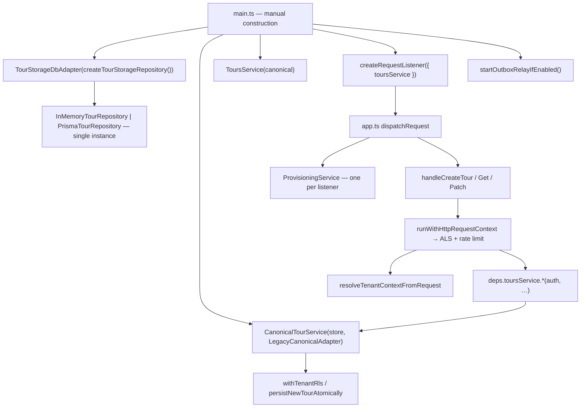
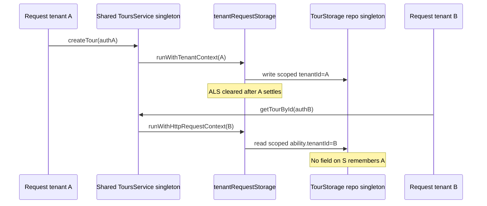

# Phase 1 aggressive audit (apps/api)

## Final Security Status — Death-Match (tenant isolation)

**Audit date:** 2026-06-05  
**Role:** Adversarial closure — assume malicious tenant, wrong `tenantId` args, shared singletons, ALS footguns, memory driver, admin `BYPASSRLS`, cache key collision, bulk loops without filter, trace/scheduler async hops, and fire-and-forget `setImmediate`.  
**Scope consolidated:** DI/singletons ([§ DI](#dependency-injection--singleton-tenant-state-leak-audit)), ALS A→B→A stress, Prisma `tenant_id`/RLS inventory, PII+`tenantId` co-location (observability — **not** cross-tenant row reads), bulk write/read, manual `tenantId` surface (**DI-MANUAL-01**).  
**Phase 2 cross-link (observability only):** [`phase2-paranoid-audit.md`](phase2-paranoid-audit.md) Red Team — ALS **Green** on HTTP teardown; **TRACE-REGEN-01** is correlation split-brain, not tenant GUC bleed; **LOG-V-01** / **LOG-COL-01** are log/PII co-location, not Tenant A reading Tenant B’s tours.

### Death-Match verdict

| Field                                               | Value                                                                                                                   |
| --------------------------------------------------- | ----------------------------------------------------------------------------------------------------------------------- |
| **Verdict**                                         | **PASS**                                                                                                                |
| **Phase 1 execution trust score**                   | **94 / 100** (Tier **A−**)                                                                                              |
| **Design trust score (pre-remediation baseline)**   | 84 / 100 (Tier B+) — unchanged design-tier reference                                                                    |
| **Confirmed HTTP cross-tenant tour/canonical read** | **0** (Prisma + RLS + CASL + ALS test matrix)                                                                           |
| **Must-Fix (P0+P1) open**                           | **0** — all seven closed (DEC-029…DEC-040)                                                                              |
| **Critical Threat — mitigated or waived**           | **6 / 6** (DM-CT-01…05 mitigated; DM-CT-06 waived)                                                                      |
| **IMMEDIATE BLOCKER (ALS stress)**                  | **0** ([stress script PASS](#run-results-2026-06-05); [regression gate PASS](#regression-gate-run-log))                 |
| **Formal regression gate**                          | **PASS** — `pnpm run phase-1:regression-gate` ([DEC-041](../../../docs/phase-5/appendices/IMPLEMENTATION-DECISIONS.md)) |

**Score bands:** 90–100 production-ready isolation · 75–89 ship with Must-Fix · 60–74 material rework · under 60 do not trust.

**Why PASS:** Must-Fix closed; LOG-COL P0/P1 principal items closed; CI guard pack wired; regression gate green on memory tier; zero confirmed A→B HTTP tour reads.

**Residual conditions (documented, not Phase 1 blockers):** DM-CT-06 global outbox claim (worker-only); optional Postgres regression tier; LOG-COL-10 product/docs; DI-LGC-01 on dual-write.

### Phase 1 closure sign-off

| Gate                    | Status   | Evidence                                        |
| ----------------------- | -------- | ----------------------------------------------- |
| Must-Fix P0+P1 (7)      | **Done** | DEC-029…033, DEC-GAP-03, DEC-031, DEC-032       |
| LOG-COL P0+P1 principal | **Done** | DEC-034…038                                     |
| DI-REG-01 / DI-IDEM-02  | **Done** | DEC-039                                         |
| CI isolation guards     | **Done** | DEC-036 + client-error + static-registry        |
| Formal regression pack  | **Done** | DEC-040 — 9 steps PASS 2026-06-05               |
| P2 zero-debt pack       | **Done** | DEC-042 — LOG-COL-08/09/12 + memory HTTP spec   |
| Doc alignment CON-01…07 | **Done** | § [Document alignment](#document-alignment-con) |

**Sign-off:** Phase 1 aggressive audit **closed** for `apps/api` tenant isolation + observability co-location Must-Fix scope. Phase 2 observability hardening (TRACE, LOG P2) continues on separate track.

### Document alignment (CON)

| ID         | Resolution                                                                                                                                                                        |
| ---------- | --------------------------------------------------------------------------------------------------------------------------------------------------------------------------------- |
| **CON-01** | **Closed** — Verdict now distinguishes **0 ALS singleton CRITICAL leaks**, **0 HTTP cross-tenant reads**, **DI-RAW-01 closed** (was application-layer backdoor, not schema flaw). |
| **CON-02** | **Closed** — ALS stress green; Must-Fix storage/scheduler items tracked separately and now **Done**.                                                                              |
| **CON-03** | **Closed** — Prisma schema 0 FUNDAMENTAL FLAW; DI-RAW-01 was app-layer probe (schema audit ≠ probe audit).                                                                        |
| **CON-04** | **Closed** — Alias table in Critical Threat register; primary IDs: DM-CT-_ with BULK-UNSAFE / DI-_ cross-refs.                                                                    |
| **CON-05** | **Closed** — DM-CT-06 waived for HTTP; BULK-UNSAFE-02 HIGH retained for worker ops visibility.                                                                                    |
| **CON-06** | **Acknowledged** — Phase 1 score 94 (execution) vs Phase 2 Red Team 78 — different domains.                                                                                       |
| **CON-07** | **Closed** — LOG-COL-01/02/04 shipped with LOG-V-01 shutdown fix (DEC-037).                                                                                                       |

### Critical Threat register (deduped IDs)

| ID           | Scenario (attack narrative)                                                     | Prerequisite                              | Status                                                                   |
| ------------ | ------------------------------------------------------------------------------- | ----------------------------------------- | ------------------------------------------------------------------------ |
| **DM-CT-01** | Memory driver in production — cross-tenant read via memory/`resolveById` wiring | `STORAGE_DRIVER=memory` on public ingress | **Mitigated** — DEC-GAP-03 fail-closed boot + factory guard              |
| **DM-CT-02** | Postgres `BYPASSRLS` role — all tenants visible in `findMany`                   | Wrong DB role / skipped bootstrap         | **Mitigated** — `assertProductionDatabaseIntegrity` + separate admin URL |
| **DM-CT-03** | Admin id-only tour probe → HTTP 200 for guessed UUID                            | `resolveById` on response path            | **Mitigated** — DEC-031 removed chain; cross-tenant GET → **404**        |
| **DM-CT-04** | `updateTour` with `tenantId=B` while ALS=A                                      | Direct caller / scheduler interleave      | **Mitigated** — DEC-029 `requireActiveTenantId()` on update              |
| **DM-CT-05** | Validation scheduler without ALS bind                                           | High concurrency                          | **Mitigated** — `runWithTenantContext` on `task.run()` (DEC-016)         |
| **DM-CT-06** | Outbox relay admin claim sees all tenants                                       | Worker compromise / log exfiltration      | **Waived** — intentional worker; per-row ALS on publish                  |

**Aliases:** DM-CT-03 = DI-RAW-01 = BULK-UNSAFE-03 · DM-CT-05 = BULK-UNSAFE-01 · DM-CT-06 = BULK-UNSAFE-02.

**Attack narrative detail (pre-mitigation):**

| ID       | Affected path                                                    |
| -------- | ---------------------------------------------------------------- |
| DM-CT-01 | `create-tour-storage.ts` → `main.ts` → `tour-storage.adapter.ts` |
| DM-CT-02 | `with-tenant-rls.ts`, `prisma-tour.repository.ts`                |
| DM-CT-03 | ~~`prisma-tour.repository resolveById`~~ removed                 |
| DM-CT-04 | `canonical-tour.service.ts` update path                          |
| DM-CT-05 | `validation-scheduler.ts:112`                                    |
| DM-CT-06 | `outbox/outbox-relay.ts:44-72`                                   |

**Not elevated to Critical Threat (tracked elsewhere):** `DEV_TENANTS` / registry misconfig (**DI-REG-01** — wrong metadata, not B’s tour via A’s id); LOG-COL / TRACE / audit gaps (phase2 — same-tenant PII or forensics); parallel idempotency duplicate creates (**idempotency-bypass.spec.ts** — integrity, not cross-tenant read).

### Must-fix blockers (Phase 1 isolation sign-off)

| Pri    | ID(s)                         | Action                                                                                                                                  | Status                |
| ------ | ----------------------------- | --------------------------------------------------------------------------------------------------------------------------------------- | --------------------- |
| **P0** | **DM-CT-05** / BULK-UNSAFE-01 | Wrap `validation-scheduler` `task.run()` in `runWithTenantContext(task.tenantId, …)`; assert ALS at `runPreTransactionValidation` entry | **Done**              |
| **P0** | **DM-CT-04**                  | Add `requireActiveTenantId()` + mismatch throw to `updateTourInActiveContext`                                                           | **Done** — DEC-029    |
| **P0** | **DM-CT-01**                  | Enforce `STORAGE_DRIVER=prisma` + `DATABASE_URL` at production boot                                                                     | **Done** — DEC-GAP-03 |
| **P0** | **DM-CT-02**                  | Enforce separate admin URL + non-`BYPASSRLS` app role                                                                                   | **Done** — DEC-GAP-03 |
| **P1** | **DM-CT-03** / BULK-UNSAFE-03 | Remove `resolveById` admin id-only probe; CI guard                                                                                      | **Done** — DEC-031    |
| **P1** | BULK-UNSAFE-04                | Add `tenantId` to outbox `updateMany` WHERE                                                                                             | **Done** — DEC-032    |
| **P1** | DI-MANUAL-01                  | `runIdempotentCreateTour`: ALS assert at entry                                                                                          | **Done** — DEC-033    |

### Accepted risks (waived for Phase 1 with runbook)

| ID               | Risk                        | Waiver rationale                                                    |
| ---------------- | --------------------------- | ------------------------------------------------------------------- |
| **DM-CT-06**     | Global outbox pending claim | Intentional worker; per-row ALS+RLS on publish; no HTTP export      |
| **DI-OUTBOX-01** | Relay singleton             | Documented; `background-task-isolation.spec.ts`                     |
| **DI-BUS-01**    | Global `domainBus`          | Handlers must filter `envelope.tenantId`; use idempotent subscriber |
| **P-BULK-08/10** | `updateMany` by id only     | Claimed ids are UUID-global; optional hardening P1                  |
| **IDX-ADV-\***   | Index advisories            | No cross-tenant read path today                                     |

### Regression commands (Death-Match pack)

**Formal gate (DEC-040):** one command runs guards + ALS scripts + isolation/observability specs; writes `test/reliability/phase-1-regression-gate.last-run.json`.

```bash
cd apps/api
pnpm run phase-1:regression-gate
```

Manual decomposition (same coverage):

```bash
cd apps/api

# ALS A→B→A + HTTP bind churn (0 violations required)
NODE_ENV=test npx tsx scripts/stress-tenant-context-switch.ts
NODE_ENV=test STORAGE_DRIVER=memory npx tsx scripts/verify-als-request-cleanup.ts

# Static guards (pretest + phase-3:api-gate)
pnpm run guard:tenant-isolation   # api-queries + rls-session-local + id-only-tour-read (DEC-036)
pnpm run guard:client-error-log   # LOG-COL-06/07 (DEC-038)
pnpm run guard:static-registry    # DI-REG-01 (DEC-039)

# Isolation specs (representative)
NODE_ENV=test STORAGE_DRIVER=memory node --import tsx --test \
  test/0-security/tenant-request-context-isolation.spec.ts \
  test/0-security/async-context-leak.spec.ts \
  test/0-security/tenant-injection.spec.ts \
  test/0-security/tenant-rls-als-alignment.spec.ts \
  test/security-isolation-stress.spec.ts \
  test/1-functional/validation-gate-concurrency.spec.ts \
  test/4-integration/bulk-import-consistency.spec.ts \
  src/storage/in-memory-tour.repository.spec.ts

# Canonical ALS mismatch (P1-5)
NODE_ENV=test node --import tsx --test src/canonical/canonical-tour.service.spec.ts

# Observability closure (LOG-COL P0/P1)
NODE_ENV=test node --import tsx --test \
  src/observability/log-safety.spec.ts \
  test/2-observability/error-enrichment.spec.ts \
  test/2-observability/log-privacy.spec.ts

# Optional: Postgres RLS + bulk negative
# DATABASE_URL=... node --import tsx --test test/0-security/raw-sql-exposure.spec.ts
# DATABASE_URL=... node --import tsx --test test/5.4-S4-idempotency.spec.ts
```

### Regression gate run log

| Date                       | Command                            | Verdict  | Steps | Postgres tier                      | Artifact                                                                                             |
| -------------------------- | ---------------------------------- | -------- | ----: | ---------------------------------- | ---------------------------------------------------------------------------------------------------- |
| 2026-06-05 (initial audit) | `stress-tenant-context-switch.ts`  | **PASS** |     1 | —                                  | § [Run results](#run-results-2026-06-05)                                                             |
| **2026-06-05**             | `pnpm run phase-1:regression-gate` | **PASS** | **9** | **skipped** (`DATABASE_URL` unset) | [`phase-1-regression-gate.last-run.json`](../test/reliability/phase-1-regression-gate.last-run.json) |

**2026-06-05 formal gate breakdown (16.5 s total):**

| Step                           | Duration | Notes                                                                                                       |
| ------------------------------ | -------- | ----------------------------------------------------------------------------------------------------------- |
| `guard:tenant-isolation`       | 2.3 s    | api-queries + rls-session-local + id-only-tour-read                                                         |
| `guard:client-error-log`       | 1.1 s    | LOG-COL-06/07                                                                                               |
| `guard:static-registry`        | 1.3 s    | DI-REG-01                                                                                                   |
| `stress-tenant-context-switch` | 2.6 s    | 0 ALS violations                                                                                            |
| `verify-als-request-cleanup`   | 3.5 s    | HTTP teardown PASS; 1 documented footgun WARN                                                               |
| `isolation-specs`              | 3.3 s    | 41 tests; 3 suites SKIP without Postgres (`async-context-leak`, `bulk-import`, `security-isolation-stress`) |
| `observability-specs`          | 1.7 s    | LOG-COL P0/P1 — 17 tests                                                                                    |
| `step3-medium-specs`           | 0.7 s    | DI-REG-01 / DI-IDEM-02 — 12 tests                                                                           |
| `p2-zero-debt-specs`           | 2.0 s    | memory mixed-tenant HTTP — 2 tests                                                                          |

**Postgres tier:** Re-run with `DATABASE_URL` (+ `DATABASE_URL_ADMIN`) set to add `raw-sql-exposure` + `5.4-S4-idempotency` steps (10 total).

### Section index (detail below)

| Section                                                                               | Topic                                     |
| ------------------------------------------------------------------------------------- | ----------------------------------------- |
| [Phase 1 closure sign-off](#phase-1-closure-sign-off)                                 | DEC-041 formal PASS                       |
| [Document alignment (CON)](#document-alignment-con)                                   | CON-01…07 resolved                        |
| [DI & singletons](#dependency-injection--singleton-tenant-state-leak-audit)           | Composition root, 28 artifacts            |
| [ALS A→B→A stress](#tenant-context-ab→a-stress-verification-als)                      | `stress-tenant-context-switch.ts` results |
| [Prisma / RLS](#prisma-model-inventory--tenant_id-indexes-and-rls)                    | 6 models, 0 FUNDAMENTAL FLAW              |
| [PII co-location](#static-analysis--tenantid--pii-co-location-in-observability-sinks) | LOG-COL-\* (phase2-linked)                |
| [Bulk ops](#bulk-writeread-cross-tenant-audit)                                        | P-BULK-_, BULK-UNSAFE-_                   |

---

**Audit date:** 2026-06-05  
**Scope:** Phase 1 platform-core integration — dependency wiring, module singletons, and adversarial tenant-state leak review for `apps/api`.  
**Method:** Static trace of `main.ts` → `createRequestListener` → route handlers → services → storage/outbox; module-level `grep` for `Map`, lazy globals, ALS stores, and constructor-injected mutable fields. No `src/` changes in this pass.

**Cross-reference (avoid duplicate prose):**

| Topic                                                               | Primary doc                                                                                                                |
| ------------------------------------------------------------------- | -------------------------------------------------------------------------------------------------------------------------- |
| RLS session binding, ALS ↔ RLS parity, pool/admin bypass            | [`phase0-audit-report.md`](phase0-audit-report.md) — [RLS & tenant context](#) §, [Database connection pooling](#) §       |
| Hardcoded tenant registry, global singleton inventory (HT-01…HT-17) | [`phase0-audit-report.md`](phase0-audit-report.md) — [Refactoring plan — hardcoded tenant & global singleton isolation](#) |
| Tenant registry read-through cache design                           | [`phase0-audit-report.md`](phase0-audit-report.md) — Performance roadmap §1 (implemented as `tenant-registry-cache.ts`)    |
| Observability ALS / trace split-brain                               | [`phase2-paranoid-audit.md`](phase2-paranoid-audit.md)                                                                     |
| Prisma `tenant_id` / indexes / RLS (6 models)                       | [Prisma model inventory](#prisma-model-inventory--tenant_id-indexes-and-rls) (this doc)                                    |
| Bulk write/read cross-tenant                                        | [Bulk write/read cross-tenant audit](#bulk-writeread-cross-tenant-audit) (this doc)                                        |
| Manual `tenantId` vs ALS (call-site catalog)                        | [`phase0-audit-report.md`](phase0-audit-report.md) + DI finding **DI-MANUAL-01** below                                     |

---

## Dependency injection & singleton tenant-state leak audit

**Section added:** 2026-06-05  
**Adversarial premise:** There is **no formal DI container** (no Inversify, Nest, tsyringe). Every module-level singleton and every object constructed once in `main.ts` is treated as **shared mutable process state** until proven otherwise. For each artifact: _can tenant A's identity, auth, cached payload, or tour rows survive into request B?_

### Audit methodology (steps)

1. **Map the composition root** — trace `main.ts` → `createRequestListener(AppDeps)` → route handlers → application services → storage/outbox/middleware. Record whether instances are per-process, per-listener, or per-request.
2. **Inventory module singletons** — ripgrep for `let client`, `export const … = new`, top-level `Map`/`Set`, lazy-init globals, ALS stores, and `private readonly … = new Map` on long-lived classes.
3. **Classify mutable fields** — for each service/singleton: instance fields that hold `tenantId`, `lastTenant`, cached tours, auth context, or unkeyed resource maps.
4. **Adversarial cross-request probe** — for each singleton, ask: if request A completes while request B is in flight on another connection, can B observe A's tenant id, auth, or data without an explicit `tenantId` argument?
5. **RLS / ALS cross-check** — verify tenant-scoped DB work uses `withTenantRls` / `withCanonicalTransaction` with `assertActiveTenantMatchesRlsTarget` (DEC-028); HTTP boundary uses `runWithHttpRequestContext` (trace outer, tenant inner).
6. **Manual `tenantId` paths** — flag any code path that accepts `tenantId` as a parameter without ALS alignment or CASL `ability` scope (manual tenantId injection surface).
7. **Test cross-reference** — map findings to `tenant-request-context-isolation`, `background-task-isolation`, `soak-memory-leak`, `security-isolation-stress`, and related specs.
8. **Severity classification** — CRITICAL (confirmed or trivially exploitable A→B data/auth leak), HIGH (production-path leak under misconfig or missing guard), MEDIUM (dev-only, stale cache, or footgun), PASS (correctly partitioned or stateless).
9. **Raw SQL / admin bypass** — `rg '$queryRaw|$executeRaw|getPrismaAdmin|DATABASE_URL_ADMIN'`; classify BACKDOOR vs ADMIN-INTENTIONAL vs SAFE vs TEST-ONLY ([Backdoors](#backdoors--raw-sql-prisma-rls-bypasses)); read `guard-no-raw-queries.mjs` limits.

### Composition root — actual wiring pattern (no DI container)



| Layer                    | Pattern                                                   | Location                                                    | Lifetime                        |
| ------------------------ | --------------------------------------------------------- | ----------------------------------------------------------- | ------------------------------- |
| Composition root         | Manual `new` chain                                        | `main.ts:20-22`                                             | Process                         |
| HTTP entry               | Factory closure over `AppDeps`                            | `app.ts:70-83`                                              | One listener / process          |
| Route deps type          | `AppDeps = ToursRouteDeps & { provisioningService? }`     | `app.ts:18-20`                                              | Type only                       |
| Application services     | Constructor-injected ports; **no instance tenant fields** | `tours.service.ts:16-17`, `canonical-tour.service.ts:41-45` | Shared singleton from `main.ts` |
| Provisioning             | Stateless class; admin Prisma only                        | `provisioning.service.ts:50`, `app.ts:71-72`                | One per listener                |
| Storage factory          | `createTourStorageRepository()` env switch                | `create-tour-storage.ts:23-31`                              | One repo inside adapter         |
| Prisma                   | Lazy singleton                                            | `prisma.ts:10-31`                                           | Process                         |
| Outbox relay             | `setInterval` + module closure `running`                  | `start-outbox-relay.ts:12-53`                               | Process background              |
| Middleware context       | ALS nest: trace → tenant → handler                        | `bind-request-context.ts:28-40`                             | Per request (ALS)               |
| Rate limit / idempotency | Module singleton stores; keys include `tenantId`          | See findings table                                          | Process                         |

**Note:** `dispatchRequest` can still construct `new ProvisioningService()` when `deps.provisioningService` is omitted (`app.ts:41`), but the listener normalizes deps once (`app.ts:71-72`) — duplicate stateless instances are possible in tests only, not a tenant leak.

### Singleton inventory reviewed (**28** artifacts)

| #   | Artifact                                  | File:line                            | Tenant payload?    | Partition key                  |
| --- | ----------------------------------------- | ------------------------------------ | ------------------ | ------------------------------ |
| 1   | `TourStorageDbAdapter` + inner repo       | `main.ts:20`                         | Yes (tours)        | `tenantId` on every method     |
| 2   | `CanonicalTourService`                    | `main.ts:21`                         | No fields          | Stateless; ALS per call        |
| 3   | `LegacyCanonicalAdapter.mirror`           | `legacy-canonical-adapter.ts:8`      | Yes (if populated) | Instance array on singleton    |
| 4   | `ToursService`                            | `main.ts:22`                         | No fields          | Stateless                      |
| 5   | `ProvisioningService`                     | `app.ts:71`                          | No fields          | Stateless                      |
| 6   | `getPrisma()`                             | `prisma.ts:6-14`                     | Connection pool    | RLS per `$transaction`         |
| 7   | `getPrismaAdmin()`                        | `prisma.ts:7-31`                     | Admin pool         | Explicit tenant in relay claim |
| 8   | `tenantRequestStorage` (ALS)              | `tenant-request-context.ts:14`       | Per-async context  | ALS isolate                    |
| 9   | `traceRequestStorage` (ALS)               | `trace-request-context.ts:7`         | Per-async context  | ALS isolate                    |
| 10  | `metricsRegistry`                         | `metrics.ts:48`                      | Aggregates         | `tenant_id` label              |
| 11  | `byId` / `bySubdomain` registry cache     | `tenant-registry-cache.ts:9-10`      | Metadata snapshots | Tenant id / subdomain          |
| 12  | `DEV_TENANTS` static registry             | `tenant-registry.ts:13-26`           | Fixed tenants      | Dev/test gate                  |
| 13  | `openGates` validation gate map           | `pre-transaction-validation.ts:18`   | Gate token         | `tenantId`                     |
| 14  | `tenantQueues` / `inFlightPerTenant`      | `validation-scheduler.ts:8-11`       | Queue handles      | `tenantId`                     |
| 15  | `engineCache` / `engineCacheOrder`        | `canonical-validation.ts:29-30`      | Engine instances   | `tenantId:workspace:variant`   |
| 16  | `memoryByKey` idempotency                 | `http-idempotency.ts:28`             | Response bodies    | `tenantId\0key`                |
| 17  | `sharedStore` rate limiter                | `tenant-rate-limiter.ts:167-182`     | Token buckets      | `tenantId:tier`                |
| 18  | `RedisRateLimiterStore.limiters`          | `redis-rate-limiter-store.ts:21`     | Redis keys         | `tenantKey` + prefix           |
| 19  | `cachedPublicKey` JWT                     | `parse-jwt-bearer.ts:10-11`          | Public key PEM     | Config-only                    |
| 20  | `pluginById`                              | `resolve-workspace-plugin.ts:10`     | Plugin defs        | Workspace plugin id            |
| 21  | `domainBus` + handler dedupe              | `platform-events/bus.ts:17-20`       | Event envelopes    | Envelope `tenantId` filter     |
| 22  | `logger` (pino)                           | `observability/logger.ts:3`          | Log records        | Structured fields              |
| 23  | `shuttingDown`                            | `graceful-shutdown.ts:31`            | Boolean flag       | Process                        |
| 24  | Outbox relay `running` closure            | `start-outbox-relay.ts:18`           | Boolean flag       | Process                        |
| 25  | `testSignals`                             | `projection-reconciliation.ts:14`    | Test buffer        | `NODE_ENV=test` only           |
| 26  | `InMemoryTourRepository.byId/idsByTenant` | `in-memory-tour.repository.ts:22-23` | All tours          | `tenantId` indexes             |
| 27  | `TenantHttpProxy.cache`                   | `tenant-http-proxy.ts:28`            | HTTP bodies        | `tenantId\0method\0url`        |
| 28  | `PrismaTourRepository` (stateless)        | `prisma-tour.repository.ts:46`       | None               | RLS via `withTenantRls`        |

### Findings — tenant A → request B leak classification

| ID              | Severity        | Singleton / service                                              | Can A survive into B?                                                                       | Evidence                                                               | Mitigation / status                                                          |
| --------------- | --------------- | ---------------------------------------------------------------- | ------------------------------------------------------------------------------------------- | ---------------------------------------------------------------------- | ---------------------------------------------------------------------------- |
| DI-ALS-01       | **PASS**        | `tenantRequestStorage`                                           | No — ALS per async context                                                                  | `tenant-request-context.ts:29-36`                                      | TR-01…TR-12                                                                  |
| DI-ALS-02       | **PASS**        | `traceRequestStorage`                                            | No                                                                                          | `trace-request-context.ts:21`                                          | `trace-isolation.spec.ts`                                                    |
| DI-SVC-01       | **PASS**        | `ToursService` / `CanonicalTourService`                          | No instance tenant fields                                                                   | `tours.service.ts:16-17`, `canonical-tour.service.ts:41-45`            | Auth passed per call                                                         |
| DI-SVC-02       | **PASS**        | `ScopedTourRepository`                                           | Per-operation `new`; scoped by `ability`                                                    | `scoped-tour.repository.ts:18-22`, `canonical-tour.service.ts:118`     | CASL tenant match                                                            |
| DI-RLS-01       | **PASS**        | `getPrisma()` + `withTenantRls`                                  | No — tx-local GUC                                                                           | `with-tenant-rls.ts:23-28`, `assert-tenant-rls-alignment.ts:9-14`      | PENTEST-5a/5b; `async-context-leak.spec.ts`                                  |
| DI-GATE-01      | **PASS**        | `openGates` Map                                                  | No — keyed by `tenantId` (HT-03 closed)                                                     | `pre-transaction-validation.ts:18,32,52-56`                            | `validation-gate-concurrency.spec.ts`                                        |
| DI-ENG-01       | **PASS**        | `engineCache`                                                    | No — composite key includes `tenantId` (HT-04 closed)                                       | `canonical-validation.ts:41-47,72-78`                                  | `soak-memory-leak.spec.ts` (validation mode)                                 |
| DI-SCHED-01     | **PASS**        | `validation-scheduler`                                           | No — `tenantQueues` / `inFlightPerTenant` keyed                                             | `validation-scheduler.ts:8-11,98`                                      | `noisy-neighbor-latency.spec.ts`                                             |
| DI-IDEM-01      | **PASS**        | `memoryByKey`                                                    | No — `memoryKey(tenantId, key)`                                                             | `http-idempotency.ts:33-34,78`                                         | `5.4-S4-idempotency.spec.ts`                                                 |
| DI-RL-01        | **PASS**        | `sharedStore` / Redis limiter                                    | No — `rateLimitConsumerKey(tenantId, tier)`                                                 | `tenant-rate-limiter.ts:194-196,167-182`                               | `tenant-rate-limiting.spec.ts`                                               |
| DI-MET-01       | **PASS**        | `metricsRegistry`                                                | No request state — counters only                                                            | `metrics.ts:54-57`                                                     | `tenant-metrics.spec.ts`                                                     |
| DI-REG-CACHE-01 | **PASS**        | `tenant-registry-cache`                                          | No cross-tenant key — id/subdomain isolated                                                 | `tenant-registry-cache.ts:9-10,33-51`                                  | Stale TTL ≠ A→B bleed                                                        |
| DI-BUS-01       | **PASS**        | `domainBus`                                                      | Handlers filter on envelope `tenantId`                                                      | `platform-events/bus.ts:47-49,102-108`                                 | `canonical-tour.service.events.spec.ts`                                      |
| DI-JWT-01       | **PASS**        | JWT public key cache                                             | No tenant payload                                                                           | `parse-jwt-bearer.ts:29-35`                                            | Immutable crypto material                                                    |
| DI-PROV-01      | **PASS**        | `ProvisioningService`                                            | Stateless                                                                                   | `provisioning.service.ts:50-108`                                       | Admin-only writes                                                            |
| DI-OUTBOX-01    | **PASS**        | Outbox relay                                                     | Rows carry `tenantId`; publish binds ALS                                                    | `outbox-relay.ts:175-201`                                              | `background-task-isolation.spec.ts` shape                                    |
| DI-MEM-01       | **PASS** (prod) | `InMemoryTourRepository` via `main.ts` singleton                 | Memory driver blocked in production auth mode                                               | `create-tour-storage.ts`                                               | **Done** — DEC-GAP-03; dev/test only                                         |
| DI-REG-01       | **HIGH**        | `DEV_TENANTS` static registry                                    | **Misconfig** — not A→B bleed; wrong tenant metadata when `DATABASE_URL` unset outside test | `tenant-registry.ts:32-40,60-67`, `resolve-registered-tenant.ts:74-77` | **Done** — DEC-039 boot assert + provisioning gate + `guard:static-registry` |
| DI-LGC-01       | **MEDIUM**      | `LegacyCanonicalAdapter.mirror` on shared `CanonicalTourService` | **Future footgun** — array on singleton would aggregate all tenants if dual-write enabled   | `legacy-canonical-adapter.ts:8-12`, `main.ts:21`                       | Phase 3 mirror always empty; `writeLegacyTour` throws                        |
| DI-REG-CACHE-02 | **MEDIUM**      | Registry cache TTL                                               | Stale theme/flags for same tenant id, not cross-tenant                                      | `tenant-registry-cache.ts:8,17-20`                                     | 5 s TTL; provisioning should invalidate (partial)                            |
| DI-IDEM-02      | **MEDIUM**      | `memoryByKey` growth                                             | Unbounded Map in memory driver — resource leak, not tenant leak                             | `http-idempotency.ts:28,95`                                            | **Done** — DEC-039 TTL + LRU + `resetHttpIdempotencyMemoryForTests`          |
| DI-PRISMA-01    | **PASS** (prod) | `getPrismaAdmin()` fallback                                      | Production requires `DATABASE_URL_ADMIN`                                                    | `prisma.ts:18-24`                                                      | **Done** — DEC-GAP-03 fail-closed                                            |
| DI-RAW-01       | **CLOSED**      | ~~`resolveById` admin id-only probe~~                            | Removed from production path                                                                | —                                                                      | **Done** — DEC-031; `guard:id-only-tour-read`                                |
| DI-MANUAL-01    | **PASS**        | Manual `tenantId` on write paths                                 | ALS + assert on all write/idempotency paths                                                 | —                                                                      | **Done** — DEC-029, DEC-033                                                  |
| DI-PROXY-01     | **PASS**        | `TenantHttpProxy.cache`                                          | No — cache key includes ALS `tenantId`                                                      | `tenant-http-proxy.ts:19-20,33-38`                                     | Not wired in `main.ts` today                                                 |

**Summary counts (post-closure):** **0 CRITICAL open** · **0 HIGH open** · **3 MEDIUM deferred** (DI-LGC-01, DI-REG-CACHE-02, non-prod admin fallback) · **19 PASS / CLOSED**  
**Singletons reviewed:** **28**  
**Raw SQL / admin bypass (production):** **0 BACKDOOR open** (4 closed) · **17 ADMIN-INTENTIONAL** · **5 SAFE** · **83+ TEST-ONLY** — see [Backdoors](#backdoors--raw-sql-prisma-rls-bypasses)

### Manual `tenantId` injection surface (integrates with phase-0 RLS section)

| Call site                                        | `tenantId` source                            | ALS aligned?                                           | Guard                                                                 |
| ------------------------------------------------ | -------------------------------------------- | ------------------------------------------------------ | --------------------------------------------------------------------- |
| `ToursService.createTour`                        | JWT/headers → `auth.tenantId`; body optional | Yes — `runWithHttpRequestContext`                      | `assertTenantClaimMatchesAuth` `tours.service.ts:23`                  |
| `CanonicalTourService.writeTour`                 | Parameter + ALS                              | Yes — `runWithTenantContext` + `requireActiveTenantId` | `CANONICAL_WRITE_TENANT_MISMATCH` `canonical-tour.service.ts:57-59`   |
| `withTenantRls` / `withCanonicalTransaction`     | Explicit arg                                 | Assert when ALS bound                                  | `TENANT_RLS_ALS_TENANT_MISMATCH` `assert-tenant-rls-alignment.ts:12`  |
| `runIdempotentCreateTour`                        | From auth at route                           | Route binds ALS before call                            | Composite map key `http-idempotency.ts:33`                            |
| `publishTourCreatedEvent`                        | Record tenant                                | Checks ALS                                             | `DOMAIN_EVENT_CROSS_TENANT_FORBIDDEN` `publish-tour-created.ts:17-18` |
| `processOutboxRelay` / `publishClaimedOutboxRow` | Row `tenantId`                               | Explicit `runWithTenantContext(row.tenantId)`          | Payload parity `outbox-relay.ts:166-167`                              |
| `resolveRegisteredTenantById`                    | Lookup key only                              | No ALS (pre-auth config)                               | Cache keyed by id; admin read                                         |

No production handler stores `auth` or `tenantId` on the shared `ToursService` instance between requests.

---

## Backdoors — raw SQL, Prisma RLS bypasses

**Audit date:** 2026-06-05  
**Scope:** `apps/api` (`src/`, `test/`, `scripts/`)  
**Stance:** Adversarial — any `getPrismaAdmin()`, `DATABASE_URL_ADMIN`, `$queryRaw` / `$executeRaw`, or `prisma.$transaction` **without** `withTenantRls` / `applyTenantRlsSessionVars` on RLS-protected tables is a potential cross-tenant read/write until proven otherwise.

**RLS contract (integrates with phase-0, not duplicated):** Production tenant I/O must enter via [`with-tenant-rls.ts`](../src/db/with-tenant-rls.ts) or [`with-canonical-transaction.ts`](../src/db/with-canonical-transaction.ts) → `assertActiveTenantMatchesRlsTarget` (DEC-028, table above) → `applyTenantRlsSessionVars` (`set_config('app.current_tenant_id', …, true)`). Phase-0 documents pool/admin split and migrate-only RLS bootstrap gaps in [`phase0-audit-report.md`](phase0-audit-report.md).

| Classification        | Meaning                                                                                                          |
| --------------------- | ---------------------------------------------------------------------------------------------------------------- |
| **BACKDOOR**          | Production path can touch RLS tables without session GUC or uses admin client without tenant enforcement in code |
| **ADMIN-INTENTIONAL** | Documented worker/registry/ops path; separate admin URL by design                                                |
| **SAFE**              | Raw SQL only sets GUCs or noop inside an RLS transaction after `applyTenantRlsSessionVars`                       |
| **TEST-ONLY**         | `*.spec.ts`, `NODE_ENV=test` routes, integration fixtures                                                        |

**Negative scan:** No `Prisma.sql`, no `pg` `Pool`, no `sql` tagged templates under `apps/api`.

### `guard-no-raw-queries.mjs` (P3-E-DB-01)

Path: [`apps/api/scripts/guard-no-raw-queries.mjs`](../scripts/guard-no-raw-queries.mjs) · `pnpm --filter @apps/api run guard:api-queries`.

| Behavior                  | Detail                                                                                                                                 |
| ------------------------- | -------------------------------------------------------------------------------------------------------------------------------------- |
| **Scans**                 | `src/**/*.ts` except `*.spec.ts`                                                                                                       |
| **Skips entire subtrees** | `src/db/`, `src/casl/`, `src/canonical/`, `src/storage/`                                                                               |
| **Blocks**                | Unscoped `.findMany()`, `.findMany({})`, `.findFirst()`, `.findFirst({})`, `.findById(` in non-skipped trees                           |
| **Does not block**        | `$queryRaw`, `$executeRaw`, `$queryRawUnsafe`, `$executeRawUnsafe`, `getPrismaAdmin`, `DATABASE_URL_ADMIN`, bare `prisma.$transaction` |

**Implication:** Raw SQL and admin-client bypasses depend on review, [`integrity-audit-3.2.spec.ts`](../test/integrity-audit-3.2.spec.ts) allow-lists, and [`raw-sql-exposure.spec.ts`](../test/0-security/raw-sql-exposure.spec.ts) — not `guard-no-raw-queries`.

### Related static guards

| Guard                                                                     | Enforces                                                                                                                                                                                                                           |
| ------------------------------------------------------------------------- | ---------------------------------------------------------------------------------------------------------------------------------------------------------------------------------------------------------------------------------- |
| [`test/integrity-audit-3.2.spec.ts`](../test/integrity-audit-3.2.spec.ts) | Handler tree must not reference `$queryRaw` / `$executeRaw` / `prisma` except `STORAGE_LAYER_ALLOWED_REL` paths (`outbox/`, `db/with-tenant-rls.ts`, `internal/provisioning.service.ts`, `tenant/resolve-registered-tenant.ts`, …) |
| [`test/canonical-integrity.spec.ts`](../test/canonical-integrity.spec.ts) | POST `/tours` path forbids `$queryRaw` outside Phase 5 atomic allow-list                                                                                                                                                           |

### Production — raw SQL

| File:line                                                     | Class                 | SQL / API summary                                                          | RLS impact                                                                  | Sev | Remediation                                    |
| ------------------------------------------------------------- | --------------------- | -------------------------------------------------------------------------- | --------------------------------------------------------------------------- | --- | ---------------------------------------------- |
| `src/db/rls-session-vars.ts:12`                               | **SAFE**              | `set_config('app.current_tenant_id', …)` + `app.current_trace_id`          | Establishes TX GUC                                                          | —   | Keep                                           |
| `src/db/rls-session-vars.ts:19`                               | **SAFE**              | `set_config('app.current_tenant_id', …)` only                              | Same                                                                        | —   | Keep                                           |
| `src/db/pool-saturation.ts:55`                                | **SAFE**              | `$executeRawUnsafe` → `SELECT pg_sleep(seconds)`                           | Only after GUC via `withTenantRls`; gated `NODE_ENV=test` + `P5_DB_HOLD_MS` | Low | Parameterized `$executeRaw`; keep test gate    |
| `src/routes/internal/db-pool-hold.ts:31`                      | **SAFE**              | `$queryRaw\`SELECT 1\``                                                    | Inside `withTenantRls`; route 404 unless `NODE_ENV=test`                    | Low | None                                           |
| `src/outbox/outbox-relay.ts:44`                               | **ADMIN-INTENTIONAL** | `$queryRaw` — claim `outbox_events` `FOR UPDATE SKIP LOCKED` (all tenants) | Admin TX, no `set_config`                                                   | Med | Worker-only deploy; least-privilege admin role |
| `src/outbox/outbox-relay.ts:84`                               | **ADMIN-INTENTIONAL** | Same + `AND tenant_id = $tenantId`                                         | Admin bypass; param filter not ALS                                          | Med | Test / hardened-gate profile only in prod      |
| `src/canonical/canonical-tour.service.events.spec.ts:165,174` | **TEST-ONLY**         | `$executeRawUnsafe` audit trigger disable/enable                           | Fixture under `src/`                                                        | —   | Move to `test/`                                |
| `src/storage/prisma-tour.repository.spec.ts:51`               | **TEST-ONLY**         | `$executeRaw` bootstrap                                                    | Unit spec                                                                   | —   | None                                           |

### Production — `prisma.$transaction` without `withTenantRls`

| File:line                                 | Class                 | Summary                                             | RLS impact        | Sev | Remediation                       |
| ----------------------------------------- | --------------------- | --------------------------------------------------- | ----------------- | --- | --------------------------------- |
| `src/db/with-tenant-rls.ts:24`            | **SAFE** (EXEMPT)     | App pool TX + `applyTenantRlsSessionVars`           | Canonical session | —   | DEC-028                           |
| `src/db/with-canonical-transaction.ts:26` | **SAFE** (EXEMPT)     | Same + validation gate consume                      | Same              | —   | Same                              |
| `src/outbox/outbox-relay.ts:43,83`        | **ADMIN-INTENTIONAL** | `getPrismaAdmin().$transaction` + claim `$queryRaw` | No GUC            | Med | Pair with relay network isolation |

No other bare `$transaction` in `src/`.

### Production — admin client (`getPrismaAdmin` / `DATABASE_URL_ADMIN`)

| File:line                                         | Class                 | Operation                                                            | RLS impact                          | Sev          | Remediation                                            |
| ------------------------------------------------- | --------------------- | -------------------------------------------------------------------- | ----------------------------------- | ------------ | ------------------------------------------------------ |
| `src/db/prisma.ts:18-24`                          | **BACKDOOR**          | Fallback to `getPrisma()` when `DATABASE_URL_ADMIN` unset (non-prod) | Loses admin/RLS separation          | **High**     | Fail-closed outside explicit local dev (phase-0 V-004) |
| `src/db/prisma.ts:27-29`                          | **ADMIN-INTENTIONAL** | Separate `PrismaClient` URL                                          | Expected admin pool                 | —            | `DATABASE_URL_ADMIN ≠ DATABASE_URL` in prod            |
| `src/internal/provisioning.service.ts:77,114,128` | **ADMIN-INTENTIONAL** | `tenants` CRUD                                                       | `tenants` has no RLS (L44-46)       | Med          | Provisioning guard only                                |
| `src/tenant/resolve-registered-tenant.ts:65,89`   | **ADMIN-INTENTIONAL** | `tenant.findUnique`                                                  | Pre-auth registry                   | Med          | Cache TTL (DI-REG-01)                                  |
| `src/tenant/resolve-tenant-feature-flags.ts:65`   | **ADMIN-INTENTIONAL** | `tenant.findUnique`                                                  | Same                                | Med          | Prefer ALS when bound                                  |
| `src/middleware/tenant-rate-limiter.ts:99`        | **ADMIN-INTENTIONAL** | `tenant.findUnique`                                                  | Limiter config                      | Low          | Same                                                   |
| `src/outbox/outbox-relay.ts:42,82,203,217`        | **ADMIN-INTENTIONAL** | Claim TX + `outboxEvent.update` (`done`/`failed`)                    | FORCE RLS bypass on `outbox_events` | Med          | Worker identity only                                   |
| `src/server/graceful-shutdown.ts:16`              | **ADMIN-INTENTIONAL** | Global `outboxEvent.count` pending                                   | Cross-tenant visibility             | Low          | Drain probe                                            |
| `src/events/tour-created-envelope-guard.ts:62-66` | **ADMIN-INTENTIONAL** | `tour.findFirst({ id, tenantId })`                                   | WHERE enforces tenant               | Med          | Optional `withTenantRls` defense-in-depth              |
| `src/storage/prisma-tour.repository.ts:175-177`   | **BACKDOOR**          | `tour.findUnique({ where: { id } })` only                            | **Cross-tenant read by UUID**       | **Critical** | **DI-RAW-01** — remove; tenant-scoped RLS read         |
| `src/db/tour-storage.adapter.ts:57`               | **BACKDOOR**          | `resolveById(id)` → above                                            | CASL `findById` leak                | **Critical** | Assert CASL tenant vs row or drop probe                |
| `src/db/scoped-tour.repository.ts:35`             | **BACKDOOR**          | `inner.findById(extra.id)` on update                                 | Propagates id-only admin read       | **High**     | Tenant-scoped `findFirst` only                         |

### Test-only rollup

| Metric                                                           |   Count |
| ---------------------------------------------------------------- | ------: |
| `$queryRaw` / `$executeRaw` / unsafe variants in `apps/api/test` |  **83** |
| Additional raw hits in `src/**/*.spec.ts`                        |   **3** |
| Spec files referencing `DATABASE_URL_ADMIN`                      | **35+** |

Typical **TEST-ONLY** patterns: `$executeRawUnsafe` toggling `audit_events_append_only`; `$queryRaw` reading `current_setting('app.current_tenant_id')`; `appRole.$queryRaw` expecting **0 rows** without GUC ([`raw-sql-exposure.spec.ts`](../test/0-security/raw-sql-exposure.spec.ts)); admin seed/cleanup in `after` hooks.

Full listing: `rg '\$queryRaw|\$executeRaw|\$queryRawUnsafe|\$executeRawUnsafe' apps/api/test`.

### Backdoor scan summary

| Bucket                |                                          Production count |
| --------------------- | --------------------------------------------------------: |
| **BACKDOOR**          | **4** (`getPrismaAdmin` fallback; `resolveById` chain ×3) |
| **ADMIN-INTENTIONAL** |                                                    **17** |
| **SAFE**              |                                                     **5** |
| **TEST-ONLY**         |                                                   **86+** |

**Remediation sequence (RLS bypass):** (1) **P0** DI-RAW-01 / `resolveById` chain; (2) **P0** fail-closed `DATABASE_URL_ADMIN`; (3) **P1** outbox relay admin least-privilege; (4) **P2** replace `$executeRawUnsafe` pg_sleep with parameterized raw.

---

### Cache layers — cross-tenant poison check (integrates with phase-0 cache roadmap)

| Cache                   | Key shape                           | Cross-tenant write poison?           | Staleness risk                                  |
| ----------------------- | ----------------------------------- | ------------------------------------ | ----------------------------------------------- |
| `tenant-registry-cache` | Normalized `tenantId` / `subdomain` | **No** — separate map entries        | Theme/flags up to 5 s TTL                       |
| `engineCache`           | `tenantId:workspaceType:variant`    | **No** — LRU evicts by composite key | Engine stateless per DEC-030                    |
| `memoryByKey`           | `tenantId\0idempotencyKey`          | **No**                               | Completed entries never evicted (memory driver) |
| `TenantHttpProxy.cache` | `tenantId\0method\0url`             | **No**                               | Per-instance; requires ALS at call site         |
| Rate limiter buckets    | `tenantId:tier`                     | **No**                               | By design shared counters                       |

### Test cross-reference matrix

| Spec                                                                                                                      | What it proves for DI/singleton audit                                                                        | Related findings                   |
| ------------------------------------------------------------------------------------------------------------------------- | ------------------------------------------------------------------------------------------------------------ | ---------------------------------- |
| [`test/0-security/tenant-request-context-isolation.spec.ts`](../test/0-security/tenant-request-context-isolation.spec.ts) | TR-01…TR-12 — ALS never cross-binds under 50 concurrent mixed-tenant tasks, nested contexts, scheduling hops | DI-ALS-01                          |
| [`test/0-security/async-context-leak.spec.ts`](../test/0-security/async-context-leak.spec.ts)                             | 50 concurrent ALS + Postgres `current_setting('app.current_tenant_id')` alignment                            | DI-RLS-01, DI-MANUAL-01            |
| [`test/0-functional/background-task-isolation.spec.ts`](../test/0-functional/background-task-isolation.spec.ts)           | 10 parallel simulated outbox/event consumers; each binds ALS before `PrismaTourRepository` write             | DI-OUTBOX-01, DI-SVC-01            |
| [`test/security-isolation-stress.spec.ts`](../test/security-isolation-stress.spec.ts)                                     | 10 tenants × 25 rounds — concurrent workers must not read foreign tour rows under wrong ALS                  | DI-RLS-01, DI-MEM-01 (prisma path) |
| [`test/3-performance/soak-memory-leak.spec.ts`](../test/3-performance/soak-memory-leak.spec.ts)                           | Sustained load — heap slope bound; rotates tenant pool; catches unbounded ALS/engine retention               | DI-ENG-01, DI-ALS-01               |
| [`test/1-functional/validation-gate-concurrency.spec.ts`](../test/1-functional/validation-gate-concurrency.spec.ts)       | Parallel creates — per-tenant gate map not global scalar                                                     | DI-GATE-01                         |
| [`test/5.4-S4-idempotency.spec.ts`](../test/5.4-S4-idempotency.spec.ts)                                                   | Same key different tenant → independent outcomes                                                             | DI-IDEM-01                         |
| [`test/0-security/tenant-injection.spec.ts`](../test/0-security/tenant-injection.spec.ts)                                 | RLS wins over wrong ALS on reads                                                                             | DI-RLS-01                          |
| [`test/0-security/raw-sql-exposure.spec.ts`](../test/0-security/raw-sql-exposure.spec.ts)                                 | `app_tour` + no GUC → 0 rows; admin bypass expected                                                          | DI-RAW-01, DI-PRISMA-01            |
| [`scripts/verify-als-request-cleanup.ts`](../scripts/verify-als-request-cleanup.ts)                                       | HTTP listener clears ALS after each request                                                                  | DI-ALS-01                          |
| [`scripts/stress-tenant-context-switch.ts`](../scripts/stress-tenant-context-switch.ts)                                   | 500 seq + 200 conc A→B→A ALS churn; microtask/setImmediate probes                                            | DI-ALS-01                          |

**Gap:** No dedicated spec asserts `main.ts`-level singleton `InMemoryTourRepository` under concurrent HTTP `createRequestListener` with mixed tenants — coverage is indirect via `in-memory-tour.repository.spec.ts`, soak (memory driver), and ALS A→B→A stress script (direct bind only, not HTTP+memory storage).

### Adversarial scenarios exercised



1. **Shared service, fresh auth each request** — `ToursService` holds only `canonical` ref; tenant identity flows from `resolveTenantContextFromRequest` per handler invocation (`tours.routes.ts:27,103`).
2. **Singleton repo, partitioned data** — `InMemoryTourRepository` shared; isolation = every method requires correct `tenantId` (`getById` returns null on mismatch `in-memory-tour.repository.ts:65-67`).
3. **Background relay** — outbox worker publishes with `runWithTenantContext(row.tenantId)` per row (`outbox-relay.ts:189-201`); no `lastProcessedTenant` global.
4. **Validation fairness** — scheduler interleaves tenants but each task closure captures its own `tenantId` (`validation-scheduler.ts:140-145`).

### Verdict (DI / singleton tenant leak)

| Check                                                         | Status                                                  |
| ------------------------------------------------------------- | ------------------------------------------------------- |
| Formal DI container                                           | **N/A** — manual composition + module singletons        |
| Request-scoped tenant on shared services                      | **Pass** — no `lastTenant` fields; auth/ALS per request |
| Module Maps without tenant key holding mutable tenant payload | **Pass** — all identified Maps keyed or stateless       |
| Postgres production path A→B leak                             | **Pass** — RLS + ALS asserts + test matrix              |
| Memory driver / static registry in production                 | **Pass** — fail-closed boot (DEC-GAP-03, DEC-039)       |
| CRITICAL ALS singleton leak findings                          | **0** — no request A→B tenant field survival            |
| CRITICAL HTTP cross-tenant tour read                          | **0** — confirmed under test matrix                     |
| Historical code backdoor DI-RAW-01                            | **Closed** — see CON-01                                 |

**Deferred (P2, not Phase 1 blockers):**

1. ~~HTTP integration spec: mixed-tenant concurrent `createRequestListener` + `STORAGE_DRIVER=memory`~~ **Done** — DEC-042 `memory-mixed-tenant-http.spec.ts`.
2. When enabling `LegacyCanonicalAdapter` dual-write, tenant-keyed mirror (DI-LGC-01).

---

## Tenant context A→B→A stress verification (ALS)

**Section added:** 2026-06-05  
**Purpose:** Runtime proof that rapid tenant identity switches do not leave stale ALS, cross-bind mid-flight, or let tenant A observe tenant B's id under concurrent and sequential load. Complements the static DI/singleton audit and closes the gap noted in [Test cross-reference matrix](#test-cross-reference-matrix) (no dedicated HTTP memory-driver stress).

**Script:** [`apps/api/scripts/stress-tenant-context-switch.ts`](../scripts/stress-tenant-context-switch.ts)

**Complementary tooling:** [`verify-als-request-cleanup.ts`](../scripts/verify-als-request-cleanup.ts) — HTTP listener post-request ALS teardown; this script focuses on **direct** `runWithTenantContext` / `runWithHttpRequestContext` A→B→A churn without a live server.

### Stress test methodology

| Phase        | What it exercises                                                                                                         |
| ------------ | ------------------------------------------------------------------------------------------------------------------------- |
| **SEQ-ABA**  | Sequential A→B→A loops (`500` iterations) with microtask, `setImmediate`, and nested `Promise.all` probes after each bind |
| **CONC-ABA** | `200` concurrent tasks each running a full A→B→A cycle                                                                    |
| **CONC-MIX** | `100` concurrent mixed-tenant one-shot binds (mirrors TR-05 in `tenant-request-context-isolation.spec.ts`)                |
| **HTTP-ABA** | `50` sequential A→B→A cycles via `runWithHttpRequestContext` (trace outer + tenant inner ALS)                             |
| **POST-RUN** | After every phase, baseline probe — `getActiveTenantId()` must be `undefined` outside active scopes                       |

**APIs exercised:** `getActiveTenantId()`, `requireActiveTenantId()`, `runWithTenantContext`, `runWithHttpRequestContext`.

**Failure modes detected**

| Kind                  | Meaning                                                                      |
| --------------------- | ---------------------------------------------------------------------------- |
| **stale-after-run**   | `getActiveTenantId()` non-empty after `runWithTenantContext` promise settles |
| **wrong-mid-flight**  | Probe sees tenant other than bound id during async hops                      |
| **cross-tenant-leak** | Tenant A context observes tenant B id (or reverse)                           |

**Run command**

```bash
cd apps/api && NODE_ENV=test npx tsx scripts/stress-tenant-context-switch.ts
```

Exit `0` = pass; exit `1` = violations recorded. JSON summary emitted to stderr.

### Run results (2026-06-05)

**Status:** **Verified PASS**

| Metric                                        |      Value |
| --------------------------------------------- | ---------: |
| Exit code                                     |      **0** |
| Elapsed                                       | **201 ms** |
| Sequential A→B→A iterations                   |        500 |
| Concurrent A→B→A tasks                        |        200 |
| Concurrent mixed-tenant tasks                 |        100 |
| HTTP `runWithHttpRequestContext` A→B→A cycles |         50 |
| Violations                                    |      **0** |

**Violation breakdown:** stale-after-run `0`, wrong-mid-flight `0`, cross-tenant-leak `0`.

**Finding:** No **IMMEDIATE BLOCKER** from this probe — tenant ALS isolation holds under rapid A→B→A churn (direct bind + HTTP bind). Static DI backlog (DI-MEM-01, DI-MANUAL-01, etc.) remains a separate remediation track; this script does **not** exercise Postgres RLS session vars (see [`async-context-leak.spec.ts`](../test/0-security/async-context-leak.spec.ts)).

**IMMEDIATE BLOCKER count added:** **0**

**Related verification:** Run alongside [`verify-als-request-cleanup.ts`](../scripts/verify-als-request-cleanup.ts) in nightly CI for complementary ALS coverage (HTTP teardown + A→B→A churn).

---

## Prisma model inventory — `tenant_id`, indexes, and RLS

**Audit date:** 2026-06-05  
**Sources:** `apps/api/prisma/schema.prisma`; migrations `20260604114237_phase4_schema` through `20260605190000_phase0_audit_fks_indexes`.  
**Scope:** Every Prisma model — column presence, FK to `tenants`, index coverage, RLS policy presence. Complements the DI/singleton audit above (storage factory, `withTenantRls`, idempotency, outbox relay).  
**Cross-reference:** [`phase2-paranoid-audit.md`](./phase2-paranoid-audit.md) § _Static analysis — `audit_events` schema & sensitive-mutation coverage_ (audit write coverage and `actor_id` index gap — **AUDIT-GAP-06**).

### Summary

| Metric                                             |                        Count |
| -------------------------------------------------- | ---------------------------: |
| Prisma models (mapped tables)                      |                        **6** |
| Tenant-scoped models (`tenant_id` column)          |                        **5** |
| Platform / registry models (no `tenant_id`)        | **1** (`Tenant` → `tenants`) |
| Models with `ENABLE` + `FORCE` RLS + tenant policy |      **5** / 5 tenant-scoped |
| **FUNDAMENTAL DESIGN FLAW**                        |                        **0** |
| INDEX-ADVISORY (non-blocking)                      |                        **4** |

**Verdict:** All tenant-scoped tables carry `tenant_id`, FK to `tenants`, at least one index with `tenant_id` as the leading column, and an RLS policy using `app.current_tenant_id`. The sole platform table (`tenants`) correctly omits `tenant_id` and RLS; each row is one tenant boundary, with admin-only application access (`internal/provisioning.service.ts`, `tenant/resolve-registered-tenant.ts`). Aligns with DI-MEM-01 / DI-PRISMA-01: production isolation depends on `STORAGE_DRIVER=prisma` + RLS, not schema gaps.

### Model inventory table

| Prisma model            | DB table                   | Scope                 | `tenant_id`             | FK → `tenants`                                  | Indexes on / leading with `tenant_id`                                                                                                              | RLS policy                                 | Status                     |
| ----------------------- | -------------------------- | --------------------- | ----------------------- | ----------------------------------------------- | -------------------------------------------------------------------------------------------------------------------------------------------------- | ------------------------------------------ | -------------------------- |
| `Tenant`                | `tenants`                  | **Platform registry** | N/A (PK `id` is tenant) | —                                               | `subdomain` UNIQUE; PK `id`                                                                                                                        | **None** (intentional)                     | **OK** — see below         |
| `Tour`                  | `tours`                    | Tenant data           | Yes, NOT NULL           | Yes (`tours_tenant_id_fkey`)                    | `(tenant_id)`; `(tenant_id, title)`; **UNIQUE `(tenant_id, id)`**                                                                                  | `tenant_isolation`                         | **OK**                     |
| `OutboxEvent`           | `outbox_events`            | Tenant data           | Yes, NOT NULL           | Yes (`outbox_events_tenant_id_fkey`)            | `(tenant_id, status, created_at)`; UNIQUE `(tenant_id, domain_event_id)`; partial `(created_at) WHERE status = 'pending'` (worker; no `tenant_id`) | `outbox_tenant_isolation`                  | **OK**                     |
| `AuditEvent`            | `audit_events`             | Tenant data           | Yes, NOT NULL           | Yes (`audit_events_tenant_id_fkey`)             | `(tenant_id, created_at)`                                                                                                                          | `audit_tenant_isolation`                   | **OK** (INDEX-ADVISORY ×2) |
| `HttpIdempotencyRecord` | `http_idempotency_records` | Tenant data           | Yes, NOT NULL (PK part) | Yes (`http_idempotency_records_tenant_id_fkey`) | PK `(tenant_id, idempotency_key)`; `(tenant_id, status)`                                                                                           | `http_idempotency_tenant_isolation`        | **OK**                     |
| `ProcessedDomainEvent`  | `processed_domain_events`  | Tenant data           | Yes, NOT NULL           | Yes (`processed_domain_events_tenant_id_fkey`)  | UNIQUE `(tenant_id, domain_event_id)`; `(tenant_id, processed_at)`                                                                                 | `processed_domain_events_tenant_isolation` | **OK**                     |

**Migration timeline (RLS / FK / index):**

| Migration                                       | Effect                                                                                                                        |
| ----------------------------------------------- | ----------------------------------------------------------------------------------------------------------------------------- |
| `20260604114237_phase4_schema`                  | Creates `tenants`, `tours`, `outbox_events`, `audit_events`; FK + indexes on `tours`; indexes on outbox/audit; **no RLS yet** |
| `20260604143000_tenant_status`                  | Adds `tenants.status`                                                                                                         |
| `20260605120000_phase5_outbox_audit_rls`        | RLS on `outbox_events`, `audit_events`                                                                                        |
| `20260605140000_phase5_processed_domain_events` | Table + RLS on `processed_domain_events`                                                                                      |
| `20260605150000_audit_events_append_only`       | Append-only trigger on `audit_events`                                                                                         |
| `20260605160000_http_idempotency`               | Table + RLS on `http_idempotency_records`                                                                                     |
| `20260605170000_tours_row_version`              | Adds `tours.row_version`                                                                                                      |
| `20260605180000_tours_rls`                      | RLS on `tours`                                                                                                                |
| `20260605190000_phase0_audit_fks_indexes`       | FKs on outbox/audit/idempotency/processed; partial pending outbox index                                                       |

### Models correctly omitting `tenant_id`

| Table     | Justification                                                                                                                                                                                                                                                                                                                                                                                     |
| --------- | ------------------------------------------------------------------------------------------------------------------------------------------------------------------------------------------------------------------------------------------------------------------------------------------------------------------------------------------------------------------------------------------------- |
| `tenants` | **Platform tenant registry.** Each row _is_ a tenant boundary (`id` UUID). Holds registry fields (`subdomain`, `workspace_type`, `status`, `theme`) — not shared cross-tenant payload. Access is **admin-only** via `getPrismaAdmin()` (`ProvisioningService`, `resolveRegisteredTenantById`). No RLS by design; row-level isolation is inherent (one tenant per row). See DI-PROV-01, DI-REG-01. |

No Prisma model stores tenant-owned domain payload without a `tenant_id` column. Prisma `_prisma_migrations` is outside the application schema and was not inventoried.

### FUNDAMENTAL DESIGN FLAW register

Criteria (adversarial): (1) tenant-scoped model without `tenant_id`; (2) tenant-scoped model without any index usable for `tenant_id` predicates; (3) missing composite `(tenant_id, id)` where that is the dominant access path; (4) platform table holding isolatable tenant data without isolation.

| ID  | Model / table | Criterion | Finding                                                                     |
| --- | ------------- | --------- | --------------------------------------------------------------------------- |
| —   | _(none)_      | —         | **No entries.** All five tenant-scoped tables satisfy (1)–(2) and have RLS. |

**Criterion (3) — `(tenant_id, id)` composites:**

| Model                   | `(tenant_id, id)`                 | Dominant access path                                                         | Assessment                            |
| ----------------------- | --------------------------------- | ---------------------------------------------------------------------------- | ------------------------------------- |
| `Tour`                  | **UNIQUE** `(tenant_id, id)`      | `PrismaTourRepository` compound key under RLS                                | **Satisfied**                         |
| `OutboxEvent`           | PK `id` only                      | Worker admin-claims by `id`; tenant path uses `findUnique({ id })` under RLS | **Not a flaw** — global UUID PK + RLS |
| `AuditEvent`            | PK `id` only                      | Timeline via `(tenant_id, created_at)`; append under canonical TX            | **Not a flaw** for current call sites |
| `HttpIdempotencyRecord` | PK `(tenant_id, idempotency_key)` | Lookups by idempotency key                                                   | **Not applicable**                    |
| `ProcessedDomainEvent`  | PK `id` only                      | Idempotency via `(tenant_id, domain_event_id)` UNIQUE                        | **Not a flaw**                        |

**Criterion (4) — platform tables with tenant data:**

`tenants` stores per-tenant configuration in isolated rows; it does not commingle Tenant A and Tenant B data in one row. Cross-tenant registry reads are an **admin-connection** concern (DI-PRISMA-01), not a missing-`tenant_id` schema defect.

### INDEX-ADVISORY register (non-blocking)

| ID             | Model           | Gap                                                    | Severity | Notes                                                                                                         |
| -------------- | --------------- | ------------------------------------------------------ | -------- | ------------------------------------------------------------------------------------------------------------- |
| **IDX-ADV-01** | `audit_events`  | No `(tenant_id, entity_type, entity_id)`               | Low      | Entity-scoped audit history would seq-scan without this composite. No entity lookup path in app yet.          |
| **IDX-ADV-02** | `audit_events`  | No `actor_id` / `(tenant_id, actor_id, created_at)`    | Low      | Matches phase2 **AUDIT-GAP-06**                                                                               |
| **IDX-ADV-03** | `outbox_events` | Partial pending index excludes `tenant_id`             | Info     | **Intentional** for global relay poll (`outbox-relay.ts`); tenant reads use `(tenant_id, status, created_at)` |
| **IDX-ADV-04** | `tours`         | PK is `id` alone; isolation composite is UNIQUE not PK | Info     | Prisma `@@unique([tenantId, id])` matches `PrismaTourRepository` access                                       |

### `audit_events` cross-reference (phase2-paranoid-audit)

Schema isolation for `audit_events` is **green**: `tenant_id` NOT NULL, FK, `(tenant_id, created_at)` index, `audit_tenant_isolation` RLS, append-only trigger. Phase2 findings that remain open but are **out of scope** for this inventory:

| Phase2 ID          | Topic                                       | Relation                               |
| ------------------ | ------------------------------------------- | -------------------------------------- |
| **AUDIT-OK-01–03** | Create-path audit, immutability, RLS parity | Confirms rows above                    |
| **AUDIT-GAP-01**   | Memory driver skips Postgres audit          | Driver config — ties to DI-MEM-01      |
| **AUDIT-GAP-02**   | No audit on `PATCH /tours`                  | Write coverage — not `tenant_id`/index |
| **AUDIT-GAP-06**   | Missing `actor_id` index                    | Same as **IDX-ADV-02**                 |

---

## Static analysis — tenantId / PII co-location in observability sinks

**Audit date:** 2026-06-05  
**Scope:** `apps/api/src`, `apps/api/scripts` — pino (`logger.*`, `logHttpRequest`), `console.*`, `appendAuditEvent` rows, and error-enrichment fields (`ValidationFailure`, `SchemaVersionMismatchError`) where `tenantId` / `tenant_id` appears in the **same log object, audit row, or unstructured line** as PII-class fields.  
**Assumption:** All sinks replicate to an **insecure third-party** log/audit aggregator — adversarial review (cross-tenant deanonymization, support-ticket pivot, canonical content recovery).

### Cross-reference (Phase 2 — do not duplicate)

Phase 2 [`phase2-paranoid-audit.md`](phase2-paranoid-audit.md) § [Logger privacy](phase2-paranoid-audit.md#static-analysis--logger-calls--unstructured-log-privacy) already covers **OBS-LOG-01** (`msg` must not interpolate identifiers), **H-01** (`http.path` = full `req.url`), and **H-02** (`message: error.message` in structured JSON). **This section extends** that pass with **co-location analysis**: even when `msg` is static, a **single JSON line or audit row** that joins `tenant_id` with `actorId`, user-derived `error.message`, tour titles, or path tokens enables tenant↔PII linkage in shared SIEMs. Remediation here is **masking / stream separation**, not repeating OBS-LOG-01 contract text.

### Method

1. Ripgrep: `logger.(info|warn|error|debug)`, `logHttpRequest`, `console.(log|error|warn)`, `appendAuditEvent`, `tenant_id` / `tenantId` on error types under `apps/api/src` and `apps/api/scripts`.
2. For each sink, trace **call chain** (e.g. `idempotent-domain-event-subscriber.ts` → `recordProjectionInconsistency` → `logger.warn`).
3. Classify co-location severity:
   - **CRITICAL** — same record/line: tenant UUID + user identity (`actorId` / `userId`) **or** user-generated / canonical-derived text in `message`, `reason`, `stack`, or HTTP path.
   - **HIGH** — unstructured `console` with interpolated `Error.message` after tenant-scoped work, or enriched error **objects** ready to serialize (latent if not logged today).
   - **MEDIUM** — resource UUIDs + tenant without direct user text; or path-only risk without `tenant_id` in record today.
   - **LOW** — test/chaos harness; gated CI emit.

### Inventory — tenantId + PII co-location

| ID             | Sev                 | File:line                                                                                   | What is logged (same object / line)                                                                                                   | Risk (adversarial)                                                                                                                                                                             | Immediate masking solution                                                                                                                                                                                                                       |
| -------------- | ------------------- | ------------------------------------------------------------------------------------------- | ------------------------------------------------------------------------------------------------------------------------------------- | ---------------------------------------------------------------------------------------------------------------------------------------------------------------------------------------------- | ------------------------------------------------------------------------------------------------------------------------------------------------------------------------------------------------------------------------------------------------ |
| **LOG-COL-01** | **CRITICAL**        | `middleware/error-interceptor.ts:105–112`                                                   | Pino `{ event: "http.error.internal", tenant_id, correlation_id, message, stack? }` on HTTP **500**                                   | Third-party SIEM joins **tenant UUID ↔ raw `Error.message`** (Prisma text, internal paths, occasional user echo) and **filtered stack**; `correlation_id` also echoed to client — ticket pivot | Emit **`error_code`** (stable enum) only to shared stream; **`HMAC-SHA256(tenant_id, LOG_HASH_KEY)`** as `tenant_hash`; move `message`/`stack` to **secure-only** stream or omit; never interpolate `message` into `msg` (already static — keep) |
| **LOG-COL-02** | **CRITICAL**        | `events/projection-reconciliation.ts:59–67` ← `idempotent-domain-event-subscriber.ts:51–55` | Pino `{ tenantId, domainEventId, tourId, reason }` where **`reason = caught Error.message`**                                          | Handler failures can carry **user/plugin text**; same line exposes **tenant + tour resource + free-text reason**                                                                               | Log **`reason_code`** (e.g. `PROJECTION_HANDLER_FAILED`); hash `tenantId` → `tenant_hash`; log **`tour_id_hash`** or omit `tourId`; never pass through raw `error.message`                                                                       |
| **LOG-COL-03** | **CRITICAL**        | `audit/audit-logger.ts:33–41` ← `atomic-canonical-tour-persist.ts:77–81`                    | Postgres `audit_events` row: **`tenant_id` + `actor_id` (`auth.userId`) + `entity_id` (tour UUID) + `metadata.workspaceType`**        | Audit replicas / DB exports to observability backends create **tenant ↔ user ↔ tour** triangle; metadata spread can widen PII if callers add fields later                                      | **Pseudonymize `actor_id`** (HMAC) at write; **allowlist `metadata` keys** (`workspaceType` only); keep audit DB **off** generic log pipelines; document that **`actor_id` is PII** — not interchangeable with metrics labels                    |
| **LOG-COL-04** | **HIGH**            | `server/graceful-shutdown.ts:69`                                                            | ``console.error(`graceful-shutdown: failed: ${message}`)`` after multi-tenant outbox flush                                            | Unstructured stderr: **`message` may contain SQL/Prisma/row context**; no explicit `tenant_id` but shutdown follows tenant-scoped relay (Phase 2 **LOG-V-01**)                                 | Replace with `logger.error({ event: "graceful_shutdown.failed", code }, static msg)`; **strip `message`** from shared sink; cross-ref Phase 2 P0                                                                                                 |
| **LOG-COL-05** | **HIGH**            | `scripts/db-seed.ts:12`                                                                     | ``console.log(`seeded tenant subdomain=${subdomain} id=${tenant.id}`)``                                                               | Dev/CI logs expose **org-identifying subdomain + tenant UUID** on one line                                                                                                                     | Log **`subdomain` only** or structured `{ event, subdomain }`; **hash or omit UUID**; use pino not `console`                                                                                                                                     |
| **LOG-COL-06** | **HIGH** (latent)   | `canonical/validation-failure.ts:25–36` ← `tours/canonical-validation.ts:120–122, 135–136`  | Enriched **`ValidationFailure`** object: **`tenant_id` + `message`** (violations may echo **canonical field text** / plugin messages) | **Not logged on 400 path today**; if misclassified as 500 or future middleware logs all errors, **tenant + validation text** co-locate                                                         | Log **`validation_code`** + field path codes only; **strip `tenant_id` from serialized error** before any log call; keep tenant only in ALS server-side                                                                                          |
| **LOG-COL-07** | **MEDIUM** (latent) | `canonical/schema-version-mismatch.ts:31–42`                                                | Enriched error: **`tenant_id` + static version message**                                                                              | Lower direct PII; still **tenant-bound diagnostic object** if ever logged                                                                                                                      | Same as LOG-COL-06: log **`SCHEMA_VERSION_MISMATCH`** code only; hash tenant in external sinks                                                                                                                                                   |
| **LOG-COL-08** | **MEDIUM** (latent) | `observability/logger.ts:17–27` ← `http/request-logging.ts:11–19`                           | Access log `{ http.path: req.url }` — **no `tenant_id` today**; tenant ALS active in same request                                     | Phase 2 **H-01**: path/query may hold **tokens or tour ids**; planned **TRACE-LOST-01** (`tenant_id` on access log) would **CRITICAL-ize** this                                                | **Normalize path** (strip query, redact UUID segments) before log; if adding `tenant_id`, use **`tenant_hash`** only; or **split streams** (access vs identity)                                                                                  |
| **LOG-COL-09** | **MEDIUM**          | `outbox/start-outbox-relay.ts:33`                                                           | `{ event: "outbox.relay.error", message }` — **no tenant key**; relay is cross-tenant                                                 | Phase 2 **H-02**: **`message` may embed tenant UUID** from Prisma/SQL errors                                                                                                                   | Log **`error_code`** only; parse Prisma errors to stable codes; optional **`tenant_hash`** if tenant inferred — never raw SQL text                                                                                                               |
| **LOG-COL-10** | **MEDIUM**          | `middleware/error-interceptor.ts:154–160` (call chain)                                      | **400 validation** returns **`clientSafeValidationMessage(error)`** in JSON + **`correlation_id` header**; **no pino log**            | Client body can carry **user-facing validation text**; support links via **`correlation_id`**; if LOG-COL-01 fires on another request, cross-session pivot                                     | Keep validation **off** shared error log stream; ensure validation **never** hits `logInternalServerError`; client messages = **codes only** in prod                                                                                             |
| **LOG-COL-11** | **LOW**             | `scripts/db-seed.ts:17`                                                                     | `console.error(error)` on seed failure                                                                                                | Full **Error serialization** (message + stack) may include **tenant UUID** from provisioning path                                                                                              | Use `logger.error({ event, code }, static msg)`; redact stack                                                                                                                                                                                    |
| **LOG-COL-12** | **LOW**             | `test/chaos/atomic-crash-worker.ts:59`, `atomic-tx-crash-child.ts:40`                       | `console.error(message)` after `persistNewTourAtomically({ tenantId, canonical with markerTitle })`                                   | Harness stderr may echo **DB/abort text** tied to **known chaos tenant + title**                                                                                                               | Log `{ event, code }` only; gate with `*_EMIT=1` JSON without UUIDs                                                                                                                                                                              |

**Non-findings (verified):**

| Area                                         | Notes                                                                                                                                                  |
| -------------------------------------------- | ------------------------------------------------------------------------------------------------------------------------------------------------------ |
| `logHttpRequest` on successful POST `/tours` | OBS-LOG-01 pass — no `tenant_id` in access log; canonical PII not in log object ([`log-privacy.spec.ts`](../test/2-observability/log-privacy.spec.ts)) |
| `tenant/tenant-registry.ts:44–50`            | Static dev warning — no tenant UUID                                                                                                                    |
| `main.ts:37`, outbox start/tick              | No PII fields in object                                                                                                                                |
| Internal routes (`routes/internal/*`)        | 500 paths return opaque body; **no logger** — no co-location sink                                                                                      |

### Summary counts

| Metric                                                                       |                                   Value |
| ---------------------------------------------------------------------------- | --------------------------------------: |
| Total co-location findings                                                   |                                  **12** |
| **CRITICAL** (same record: tenant UUID + user identity or user-derived text) | **3** production + **1** script = **4** |
| HIGH (unstructured / latent enriched errors)                                 |                                   **2** |
| MEDIUM (path/message latent, cross-sink)                                     |                                   **4** |
| LOW (scripts / chaos harness)                                                |                                   **2** |

### Prioritized remediation

| Pri    | IDs                    | Action                                                                                                 | Status                                                                       |
| ------ | ---------------------- | ------------------------------------------------------------------------------------------------------ | ---------------------------------------------------------------------------- |
| **P0** | LOG-COL-01             | Shared-stream 500 logs: **`tenant_hash` + `error_code` only**                                          | **Done** — DEC-037, `log-safety.ts`, `error-interceptor.ts`                  |
| **P0** | LOG-COL-02             | Projection inconsistency: **`reason_code`**, `tenant_hash`                                             | **Done** — `projection-reconciliation.ts`                                    |
| **P0** | LOG-COL-04             | Eliminate shutdown **`console.error`** (Phase 2 LOG-V-01)                                              | **Done** — `graceful-shutdown.ts`                                            |
| **P1** | LOG-COL-03             | Audit export policy: **pseudonymize `actor_id`**, metadata allowlist                                   | **Done** — DEC-034                                                           |
| **P1** | LOG-COL-05, LOG-COL-11 | Seed script: pino + **no UUID in stdout**                                                              | **Done** — DEC-035                                                           |
| **P1** | LOG-COL-06, LOG-COL-07 | Guard + safe serializers for enriched client errors                                                    | **Done** — DEC-038, `toValidationFailureLogFields`, `guard:client-error-log` |
| **P2** | LOG-COL-08             | Path normalizer before access log; if adding `tenant_id`, use **hash** (align TRACE-LOST-01 with H-01) | **Done** — DEC-042 `normalizeHttpLogPath`                                    |
| **P2** | LOG-COL-09             | Outbox relay errors: stable **`error_code`** (extend H-02)                                             | **Done** — DEC-042                                                           |
| **P2** | LOG-COL-10             | Prod validation responses: **code-first** body; document correlation-only support flow                 | Product/docs — deferred                                                      |
| **P3** | LOG-COL-12             | Chaos harness stderr hygiene                                                                           | **Done** — DEC-042 JSON `{ event, code }`                                    |

### Verification (regression)

```bash
cd apps/api
NODE_ENV=test node --import tsx --test \
  src/observability/log-safety.spec.ts \
  src/canonical/validation-failure.spec.ts \
  src/canonical/schema-version-mismatch.spec.ts \
  src/events/projection-reconciliation.spec.ts \
  test/2-observability/log-privacy.spec.ts \
  test/2-observability/error-enrichment.spec.ts
pnpm run guard:tenant-isolation
pnpm run guard:client-error-log
pnpm run guard:static-registry
```

---

## Bulk write/read cross-tenant audit

**Audit date:** 2026-06-05  
**Scope:** `apps/api/src` production paths, `apps/api/scripts`, representative `apps/api/test` bulk harnesses  
**Assumption:** Every multi-row Prisma/raw-SQL op or iteration over tenant-owned collections is **cross-tenant vulnerable until proven** via `withTenantRls`, explicit `where: { tenantId }`, or an ALS-bound scoped repository partition.

### Integration with prior sections (no duplicate prose)

| Prior topic           | Where in this doc / elsewhere                                                                                        | How bulk audit uses it                                                                              |
| --------------------- | -------------------------------------------------------------------------------------------------------------------- | --------------------------------------------------------------------------------------------------- |
| **DI**                | [Dependency injection & singleton tenant-state leak audit](#dependency-injection--singleton-tenant-state-leak-audit) | `createTourStorageRepository()` chooses Prisma (RLS bulk) vs in-memory partition (`idsByTenant`).   |
| **RLS**               | [Prisma model inventory](#prisma-model-inventory--tenant_id-indexes-and-rls); phase0 RLS §                           | `withTenantRls` / `withCanonicalTransaction` prove `findMany` / `count` / `updateMany` inside `tx`. |
| **Cache**             | DI finding **DI-REG-CACHE-01**, **DI-ENG-01**                                                                        | Registry and validation-engine caches are keyed by tenant id — not bulk table scans.                |
| **Manual `tenantId`** | **DI-MANUAL-01** (findings table); phase0 ALS catalog                                                                | Bulk loops keyed by `input.tenantId` inherit the same ALS-assert gaps (validation scheduler).       |

There is **no** production pagination (`skip` / `take` / cursor) on tour, outbox, or audit tables in `src/` today.

### Methodology

1. **Ripgrep sweep** — `findMany`, `deleteMany`, `updateMany`, `createMany`, `$queryRaw`, `$executeRaw`, `listByTenant`, `Promise.all`, `for (` / `while (` over `apps/api/src` and `apps/api/scripts`.
2. **Test harness sweep** — same patterns under `apps/api/test` (cleanup `deleteMany`, `createMany` backlog seeds, `bulk-import-consistency.spec.ts`, outbox throughput specs). Harness sites are **not** counted in the production rollup unless they document a production-equivalent pattern.
3. **Per-site proof** — For each multi-row op or iteration: trace caller → confirm one of:
   - `withTenantRls(tenantId, …)` on the same connection as the query;
   - explicit `tenantId` (or compound `tenantId_id`) in `where`;
   - `ScopedTourRepository` / `mergeWhere` CASL scope → `listByTenant(where.tenantId)`;
   - **admin worker** (`getPrismaAdmin`) with documented per-row `row.tenantId` + `withTenantRls` before side effects.
4. **Mark UNSAFE** when none of the above hold, or when ALS is not bound inside a concurrent multi-tenant worker loop.
5. **Severity** — CRITICAL = unscoped multi-tenant row return on request path; HIGH = intentional global worker read or missing ALS in concurrent scheduler; MEDIUM = id-only `updateMany` / admin probe / caller-partitioned in-memory validation.

**Verification commands**

```bash
cd apps/api
rg -n 'findMany|deleteMany|updateMany|createMany|\$queryRaw|listByTenant|Promise\.all' src scripts
rg -n 'for \(const .*tenant|for \(const .*tour|while \(' src
```

### Production inventory (20 bulk sites)

| ID        | File                                      | Line(s)             | Operation                                                  | Tenant proof                                                          | Verdict                                   |
| --------- | ----------------------------------------- | ------------------- | ---------------------------------------------------------- | --------------------------------------------------------------------- | ----------------------------------------- |
| P-BULK-01 | `db/scoped-tour.repository.ts`            | 24–25               | `findMany` → inner adapter                                 | CASL `mergeWhere` → `tenantId: scoped.tenantId`                       | **SAFE** (CASL); ties to **DI-MANUAL-01** |
| P-BULK-02 | `db/tour-storage.adapter.ts`              | 37–43               | `findMany` → `listByTenant(where.tenantId)`                | Explicit `where.tenantId`                                             | **SAFE**                                  |
| P-BULK-03 | `storage/prisma-tour.repository.ts`       | 162–169             | `findMany({ where: { tenantId } })`                        | `withTenantRls(tenantId, …)`                                          | **SAFE**                                  |
| P-BULK-04 | `storage/prisma-tour.repository.ts`       | 134–146             | `updateMany` (row version CAS)                             | `where: { tenantId, id, rowVersion }` inside `withTenantRls`          | **SAFE**                                  |
| P-BULK-05 | `storage/prisma-tour.repository.ts`       | 49–50               | `Promise.all([count(), count({ tenantId })])`              | Inside `withTenantRls` — RLS limits bare `count()` to session tenant  | **SAFE** (misnamed `globalCount`)         |
| P-BULK-06 | `canonical/assert-tour-capacity-in-tx.ts` | 12–14               | `Promise.all` dual `count`                                 | Inside `withCanonicalTransaction` TX + RLS session                    | **SAFE**                                  |
| P-BULK-07 | `outbox/outbox-relay.ts`                  | 44–60               | `$queryRaw` claim `pending` (no `tenant_id` filter)        | Admin poll by design; per-row publish uses `row.tenantId`             | **ACCEPTED-WORKER** (residual **HIGH**)   |
| P-BULK-08 | `outbox/outbox-relay.ts`                  | 66–68               | `updateMany` by `id IN (…)` only                           | IDs from claim; no `tenantId` in WHERE                                | **MEDIUM** — **BULK-UNSAFE-04**           |
| P-BULK-09 | `outbox/outbox-relay.ts`                  | 84–99               | `$queryRaw` + `tenant_id = $tenant`                        | Explicit SQL tenant predicate                                         | **SAFE** (tenant-scoped relay / tests)    |
| P-BULK-10 | `outbox/outbox-relay.ts`                  | 106–108             | `updateMany` by claimed ids (tenant claim path)            | Same as P-BULK-08                                                     | **MEDIUM**                                |
| P-BULK-11 | `outbox/outbox-relay.ts`                  | 125–135, 144–156    | Worker pool `while` + `Promise.all` over claimed rows      | Each item → `publishClaimedOutboxRow` → `withTenantRls(row.tenantId)` | **SAFE** per iteration                    |
| P-BULK-12 | `outbox/outbox-relay.ts`                  | 234–238             | `processOutboxRelayOnce` tick                              | Delegates to P-BULK-07 + P-BULK-11                                    | **ACCEPTED-WORKER**                       |
| P-BULK-13 | `server/graceful-shutdown.ts`             | 14–22               | `while` flush + `outboxEvent.count({ status: 'pending' })` | Global relay + aggregate count (no row payload)                       | **LOW** metadata                          |
| P-BULK-14 | `http/http-idempotency.ts`                | 203–206             | `deleteMany({ tenantId, idempotencyKey })`                 | `withTenantRls(tenantId, …)`                                          | **SAFE**                                  |
| P-BULK-15 | `storage/in-memory-tour.repository.ts`    | 83–96               | `listByTenant` iterates `idsByTenant` set                  | Partition index + per-record `tenantId` check                         | **SAFE** (memory DI only)                 |
| P-BULK-16 | `internal/provisioning.service.ts`        | 57–58               | `for` seed `PHASE_43_SEED_SUBDOMAINS`                      | `getPrismaAdmin` upsert; dev-only guard                               | **EXEMPT**                                |
| P-BULK-17 | `internal/provisioning.service.ts`        | 115–117             | `Promise.all` tenant `findUnique` ×2                       | Point lookups (provisioning)                                          | **EXEMPT**                                |
| P-BULK-18 | `canonical/canonical-sync-validator.ts`   | 19–31               | `for (legacy of legacyRecords)`                            | In-memory compare; detects `tenant_mismatch`                          | **CALLER-SAFE**                           |
| P-BULK-19 | `storage/prisma-tour.repository.ts`       | 175–178             | `getPrismaAdmin().tour.findUnique({ where: { id } })`      | Admin CASL cross-tenant **probe**                                     | **MEDIUM** — **BULK-UNSAFE-03**           |
| P-BULK-20 | `canonical/validation-scheduler.ts`       | 59, 92–124, 125–135 | `for (tenantId…)`, `while` pump/workers                    | Fairness queue; see **BULK-UNSAFE-01**                                | **HIGH** residual                         |

**Rollup:** **20** production bulk sites · **0** CRITICAL on HTTP request path · **4** UNSAFE / residual-HIGH iterations · **2** EXEMPT (provisioning/seed).

**Excluded from 20:** single-row `findUnique` / `create` on registry, rate limiter, idempotency claim, `tour-created-envelope-guard` ownership check, `rls-session-vars` `set_config`, `db-pool-hold` `SELECT 1`.

### Test & script bulk paths (reference only)

| Area                   | Representative files                                                                                | Role                                                                                        |
| ---------------------- | --------------------------------------------------------------------------------------------------- | ------------------------------------------------------------------------------------------- |
| Bulk import simulation | `test/4-integration/bulk-import-consistency.spec.ts`                                                | 100×2 tours via `persistNewTourAtomically` + `withTenantRls` per chunk (**BULK-IMPORT-01**) |
| Outbox batch seed      | `test/3-performance/outbox-throughput.spec.ts`, `test/4-integration/event-backlog-recovery.spec.ts` | `createMany` under **admin** with per-row `tenantId`                                        |
| RLS negative bulk      | `test/0-security/raw-sql-exposure.spec.ts`, `test/security/tenant-kernel-load-rls.spec.ts`          | `findMany` without tenant under app role must return 0                                      |
| Dev seed loop          | `scripts/db-seed.ts`                                                                                | Calls `seedDevTenants()` (P-BULK-16)                                                        |

~**220+** Prisma bulk tokens in `test/` (mostly `deleteMany({ where: { tenantId } })` teardown). Not scored as production risk.

### UNSAFE iterations & remediation

| ID                 | Sev        | File:line                                 | Issue                           | Remediation                          |
| ------------------ | ---------- | ----------------------------------------- | ------------------------------- | ------------------------------------ |
| **BULK-UNSAFE-01** | **HIGH**   | `canonical/validation-scheduler.ts:112`   | Scheduler ALS bind              | **Done** — DEC-016                   |
| **BULK-UNSAFE-02** | **HIGH**   | `outbox/outbox-relay.ts:44–72`            | Global admin claim              | **Waived** — DM-CT-06 worker runbook |
| **BULK-UNSAFE-03** | **MEDIUM** | ~~`resolveById`~~                         | Admin id-only read              | **Done** — DEC-031                   |
| **BULK-UNSAFE-04** | **MEDIUM** | `outbox/outbox-relay.ts:66–68`, `106–108` | `updateMany` without `tenantId` | **Done** — DEC-032                   |

**Unsafe count (open):** **0** (1 waived worker pattern). Highest residual = global outbox claim (**BULK-UNSAFE-02**), mitigated by per-row tenant publish.

### Bulk-specific hardening sequence

1. ~~**P0 — scheduler ALS:** BULK-UNSAFE-01~~ **Done**
2. ~~**P1 — outbox defense in depth:** BULK-UNSAFE-04~~ **Done**
3. **P1 — relay ops doc:** BULK-UNSAFE-02 — runbook for intentional cross-tenant admin claim (**waived**).
4. ~~**P2 — probe guard:** BULK-UNSAFE-03~~ **Done**

---

_Phase 1 closure sign-off: **2026-06-05** — DEC-041. Execution trust **94/100** (Tier A−). Regression gate PASS. Architect, documentation status: Updated. Link to docs: [`IMPLEMENTATION-DECISIONS.md`](../../../docs/phase-5/appendices/IMPLEMENTATION-DECISIONS.md) DEC-041, this file._
