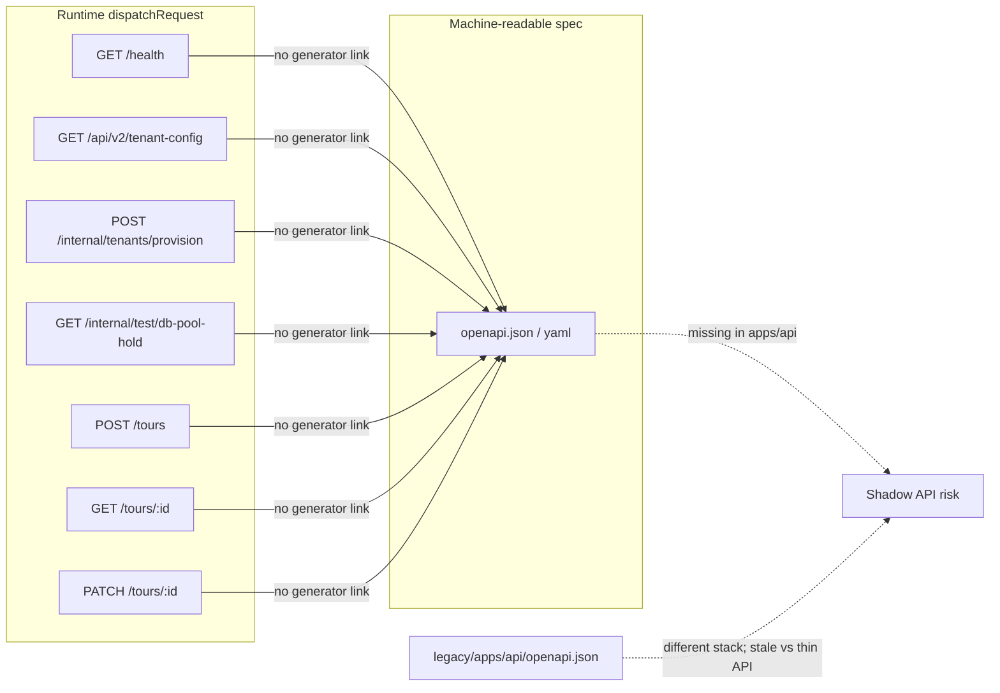
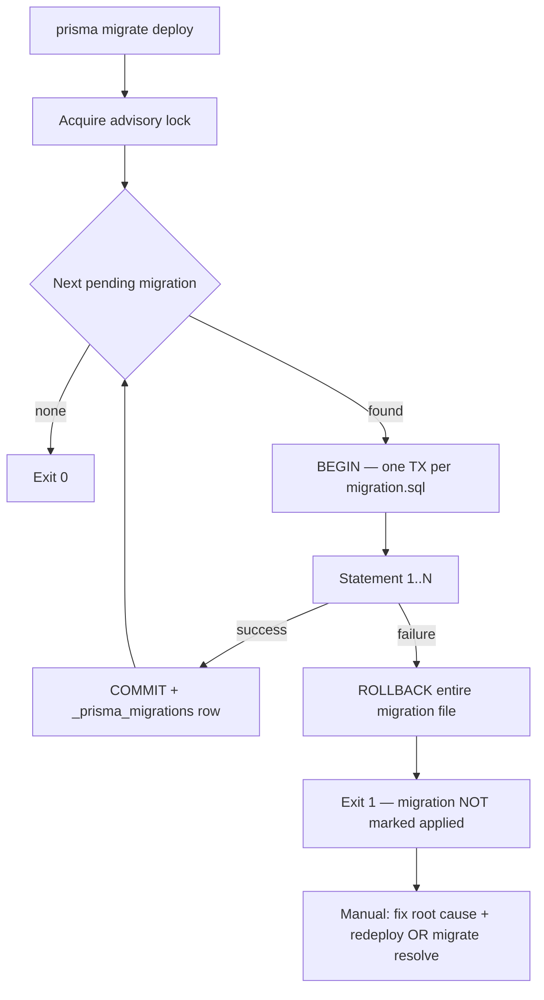
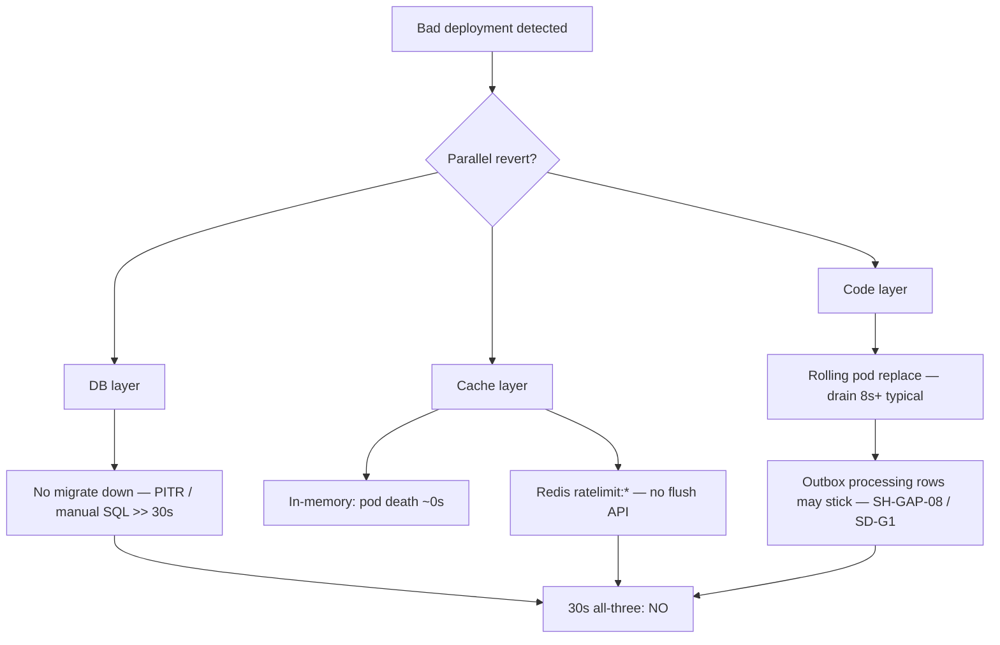
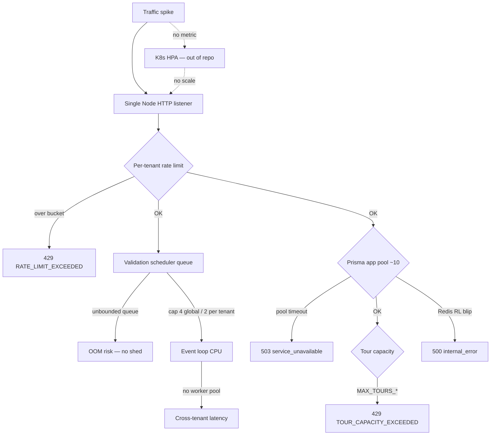
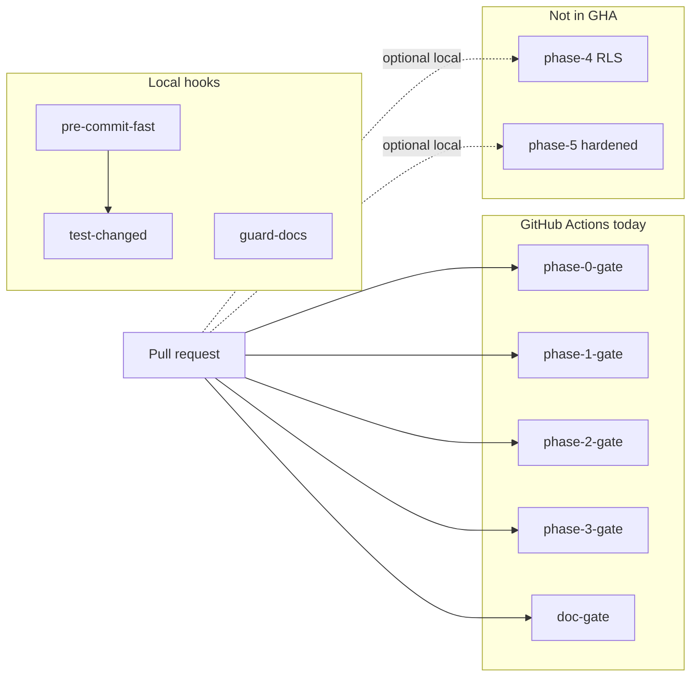
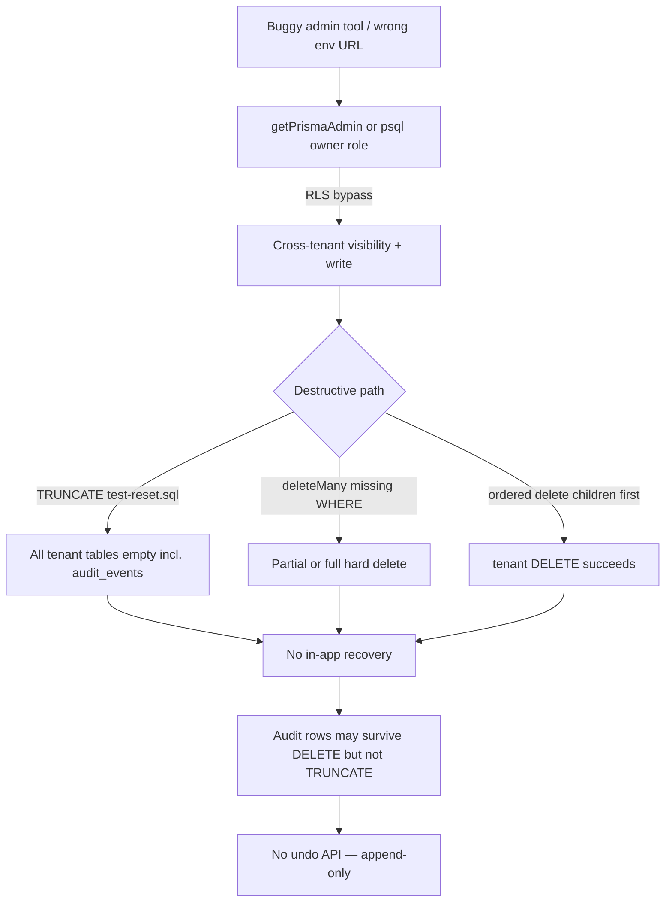
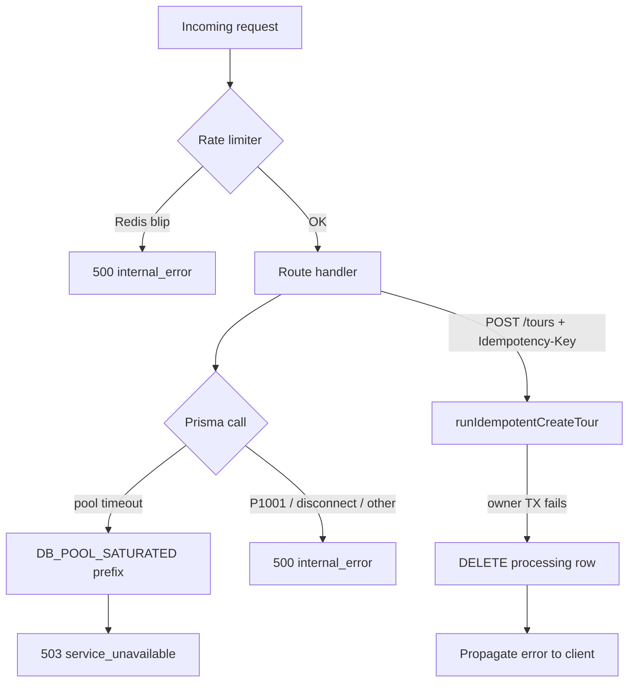
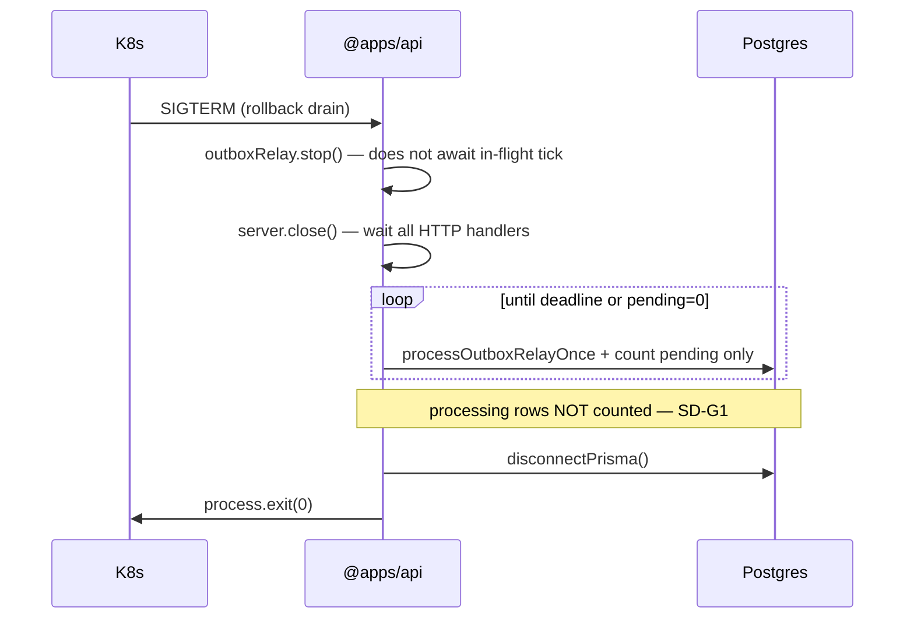

# Phase 5 evolution audit — API versioning, Self-Heal, Migration Danger, System Rollback & auto-scaling

**Audit date:** 2026-06-05  
**Remediation closure:** 2026-06-05 — evolution phases **1–3** (DEC-071…109); score **re-baselined** below  
**Scope:** `@apps/api` (0) **HTTP/API versioning strategy** — URL paths, header negotiation, canonical `schemaVersion` policy, breaking-change deploy posture; (1) intermittent Postgres disconnections and unstable network; (2) **Migration Danger** — adversarial `prisma migrate deploy` failure mid-way on large tables; **(2b) System Rollback** — bad-deployment coordinated revert of **DB** (migrations down?), **code** (container/image), and **cache** (Redis, in-memory tenant registry, rate-limiter state) under a **30s** operator budget; (3) **adversarial traffic spike** with **no K8s/HPA scale-out** and **no tenant-priority load shedding**; (4) **CLI/Admin** surfaces — internal HTTP routes, `getPrismaAdmin()` call sites, seed/reset scripts, and adversarial “buggy admin tool accidentally wipes data” recovery posture; and (5) **CI/CD god-mode bypass** — monorepo `scripts/`, `.github/workflows/`, Husky, phase gates, workspace guards, env defaults (`production-runtime-env.ts`), test-only env in `src/`; and (6) **secret management / key rotation** — JWT (`jose`), env vars, DB/Redis credentials, internal route guards, logs, vault integration.  
**Runtime model:** **Single Node process** — one `createServer` listener, one event loop, dual Prisma singletons (app + admin), in-process outbox relay timer ([`main.ts`](../src/main.ts)).  
**Method:** Static trace of production `src/` paths, ops scripts, migrations, and test cleanup conventions; cross-reference tiered test evidence, prior audits, and **post-remediation** guard/evidence (`pnpm run phase-5:evolution-gate`).

**Related audits:**

| Doc                                                                                                                       | Relevance                                                                                                                     |
| ------------------------------------------------------------------------------------------------------------------------- | ----------------------------------------------------------------------------------------------------------------------------- |
| [`phase0-audit-report.md`](phase0-audit-report.md)                                                                        | RLS wrappers, pool saturation (DEC-012), error mapping, **V-003/V-004 internal routes & admin pool**                          |
| [`phase1-aggressive-audit.md`](phase1-aggressive-audit.md)                                                                | **Migration danger (DM-CT-\*)**, admin/outbox bypass — retry must not weaken tenant binding                                   |
| [`phase2-paranoid-audit.md`](phase2-paranoid-audit.md)                                                                    | HTTP 503/500 opaque contract                                                                                                  |
| [`phase3-scalability-stress-audit.md`](phase3-scalability-stress-audit.md)                                                | Break-point RPS, SCAL-DEBT/HF, noisy neighbor, rate-limiter flood                                                             |
| [`phase4-resilience-audit.md`](phase4-resilience-audit.md)                                                                | Graceful shutdown, feature-flag mid-burst races; **§ Schema drift** (canonical payload version — complements HTTP versioning) |
| [`docs/phase-5/appendices/IMPLEMENTATION-DECISIONS.md`](../../../docs/phase-5/appendices/IMPLEMENTATION-DECISIONS.md)     | DEC-012 pool → 503; DEC-004 outbox relay; DEC-015/016 rate limit + validation fairness; **DEC-019** SCHEMA_VERSION_MISMATCH   |
| [`docs/MIGRATION-MAP.md`](../../../docs/MIGRATION-MAP.md)                                                                 | §7.4 shared `/api/v2` base path; §8.3 `migrateCanonical` + dual-read (Phase 6)                                                |
| [`docs/phase-5/appendices/migration-map.md`](../../../docs/phase-5/appendices/migration-map.md)                           | Canonical `schemaVersion` field; dual-read flag deferred                                                                      |
| [`docs/phase-4/appendices/production-auth-policy.md`](../../../docs/phase-4/appendices/production-auth-policy.md)         | DEC-023 JWT-only production; dev bearer TTL                                                                                   |
| [`docs/phase-4/production-deploy-checklist.md`](../../../docs/phase-4/production-deploy-checklist.md)                     | JWT key rotation runbook (F-18 / P2-7); `/internal/*` isolation                                                               |
| [`docs/phase-4/appendices/env-runtime-matrix.md`](../../../docs/phase-4/appendices/env-runtime-matrix.md)                 | `DATABASE_URL` / `DATABASE_URL_ADMIN` / `AUTH_JWT_*` matrix                                                                   |
| [`docs/dev/tiered-testing.md`](../../../docs/dev/tiered-testing.md)                                                       | Husky fast path vs `test:full` / phase gates                                                                                  |
| [`docs/phase-4/ci.md`](../../../docs/phase-4/ci.md)                                                                       | `DATABASE_URL` + `STORAGE_DRIVER=prisma` for RLS integration                                                                  |
| [`docs/phase-5/appendices/phase5-evolution-p0-phase1.md`](../../../docs/phase-5/appendices/phase5-evolution-p0-phase1.md) | P0 closure — outbox, transient DB, test-reset guard, GHA gates, migration head                                                |
| [`docs/phase-5/appendices/phase5-evolution-p1-phase2.md`](../../../docs/phase-5/appendices/phase5-evolution-p1-phase2.md) | P1 closure — rollback runbook, OpenAPI parity, shutdown ingress, deploy debt decision                                         |
| [`docs/phase-5/appendices/phase5-evolution-p2-phase3.md`](../../../docs/phase-5/appendices/phase5-evolution-p2-phase3.md) | P2 closure — metrics export scaffold, cache invalidate, JWT dual-key, evolution gate                                          |

**Parent handoff (versioning):** `deployment_debt_count=9` · `header_routing_exists=no` · `phase6_version_strategy=decided`  
**Parent handoff (OpenAPI):** `openapi_generator_exists=yes` · `shadow_endpoint_count=0` · `zod_to_openapi=no`  
**Parent handoff (secret management):** `secret_management_vulnerability_count=11` · `auto_rotation_pipeline_exists=no` · `dual_key_jwt_verify=yes`  
**Parent handoff (rollback):** `rollback_30s_feasible=no` · `rollback_gap_count=11` · `rollback_runbook_documented=yes`  
**Parent handoff (autonomous readiness):** `autonomous_readiness_score=58` · `autonomous_verdict=SEMI` · `operational_toil_count=6` · `evolution_remediation_phases=3`

---

## Evolution Report — Final Autonomous Readiness

**Audit lens:** Can `@apps/api` run **30 consecutive days** with **zero human intervention** — no on-call pages, no manual SQL, no coordinated deploy firefighting, no migration recovery — under realistic production churn (weekly rolling deploy, brief Postgres/Redis blips, moderate traffic, one schema migration attempt)?

**Verdict:** **SEMI** (improved — still not **AUTONOMOUS**)  
**Autonomous readiness score:** **58 / 100** (was **45** pre-remediation)

**Baseline (2026-06-05 AM):** steady-state HTTP + shedding OK; outbox zombies, misclassified DB errors, unguarded reset, and missing CI gates blocked autonomy.

**Post phases 1–3 (DEC-071…109):** P0/P1/P2 evolution items closed — in-app **processing reclaim**, **failed replay API**, **transient DB classifier + circuit breaker**, **migration head preflight**, **GHA phase-4/5**, **OpenAPI dispatch parity**, **shutdown ingress reject**, **Prometheus metrics scaffold**, **cache invalidate (dev/test)**, **JWT dual-key verify**. Remaining blockers: **30s multi-layer rollback**, **soft delete**, **auto JWT rotation**, **server-side outbox retry before `failed`**, **priority load shed**, **production metrics scrape**, and **~50+** residual register IDs.

**AUTONOMOUS** still blocked — expect **1–3** human interventions/month (down from **3–5**).

### Pillar scores (30-day autonomy)

| Pillar                           | Was |    Now | 30-day autonomy note (post remediation)                                                                                                                                                              |
| -------------------------------- | --: | -----: | ---------------------------------------------------------------------------------------------------------------------------------------------------------------------------------------------------- |
| **Self-Heal (DB/network)**       |  28 | **44** | **Closed partial:** P1001/P1017 → **503** + `Retry-After`, DB circuit breaker (DEC-094); Redis tiered fallback (DEC-083). **Open:** TX retry, relay backoff ([SH-GAP-01…03, 06, 09](#gap-table))     |
| **Background recovery**          |  35 | **58** | **Closed:** `processing` reclaim + shutdown drain (DEC-071/072), admin `failed` replay (DEC-086). **Open:** auto retry before terminal `failed` ([SH-GAP-07](#gap-table))                            |
| **Scale & overload**             |  40 | **42** | Unchanged ceiling (~40 RPS); validation queue cap + partial shed. **Open:** priority shed, global admission ([SCAL-LIM-05…12](#scalability-limit-register-traffic-spike))                            |
| **Deploy, migration & rollback** |  32 | **48** | **Closed partial:** forward-only runbook (DEC-098), migration head boot (DEC-097), cache invalidate dev (DEC-106). **Open:** **30s** all-layer revert ([RB-GAP-01…04](#rollback-strategy-gap-table)) |
| **Observability & alert**        |  32 | **52** | **Closed partial:** `openapi.json` + parity guard (DEC-099), `GET /internal/metrics` scaffold (DEC-108). **Open:** prod scrape/alerting, Zod-rich OpenAPI (Phase 6+)                                 |
| **Secrets & CI trust**           |  38 | **54** | **Closed partial:** GHA phase-4/5 (DEC-096), evolution gate (DEC-109), dual-key JWT (DEC-107). **Open:** auto-rotation, vault ([SM-VUL](#secret-management-vulnerability-key-rotation-audit))        |
| **Data safety & admin**          |  50 | **58** | **Closed partial:** `db:test-reset` prod guard (DEC-095). **Open:** soft delete, admin blast radius ([CAE-GAP-01…04](#catastrophic-admin-error--gap-table))                                          |

### Phase 3 / Phase 4 cross-links (brief)

| Prior audit                                                              | Phase 5 evolution interaction                                                                                                                                                                                                                                                                                                                           |
| ------------------------------------------------------------------------ | ------------------------------------------------------------------------------------------------------------------------------------------------------------------------------------------------------------------------------------------------------------------------------------------------------------------------------------------------------- |
| [phase3 — Final Stress-Test Audit](./phase3-scalability-stress-audit.md) | Break-point **~40 RPS** @ long TX and **12 hard-fail risks** (OOM, admin-pool DoS, Redis fail-closed **500**) define the **single-worker ceiling** HPA cannot lift without exported metrics ([SCAL-LIM-01…02](#scalability-limit-register-traffic-spike)). Noisy-neighbor **NN-01/02** amplifies any 30-day traffic variance into cross-tenant **503**. |
| [phase4 — Chaos Report](./phase4-resilience-audit.md)                    | Resilience **62→~72/100** (estimate post DEC-071…101). **CASCADE-02** (deploy zombies) **mitigated** by reclaim + ingress shutdown; **CASCADE-03** (Redis blip) **mitigated** by DEC-083. **Open:** CASCADE-01 bulk import, F-03 auto-retry before `failed`, projection auto-heal F-04.                                                                 |

### Operational Toil — top 10

Recurring human work expected within a 30-day window if the service is deployed, migrated, or stressed.

| Rank   | Toil item                                   | Trigger                                               | Manual action today                                                                                                                                                 | Ref                                                                                                        |
| ------ | ------------------------------------------- | ----------------------------------------------------- | ------------------------------------------------------------------------------------------------------------------------------------------------------------------- | ---------------------------------------------------------------------------------------------------------- |
| **1**  | Reclaim stuck outbox `processing` rows      | Rolling deploy, SIGKILL, relay crash mid-tick         | **Automated** — relay reclaim + shutdown drain (DEC-071/072); ops SQL only if reclaim disabled                                                                      | ✅ DEC-071 · [outbox-processing-reclaim.md](../../../docs/phase-5/appendices/outbox-processing-reclaim.md) |
| **2**  | Replay terminal outbox `failed` rows        | Poison/transient publish misclassified                | **Semi-auto** — `POST /internal/outbox/:id/replay` + CLI; still human triage for poison payload                                                                     | DEC-086 · [outbox-failed-replay.md](../../../docs/phase-5/appendices/outbox-failed-replay.md)              |
| **3**  | Migration failure recovery                  | `migrate deploy` timeout/FK/disk on large table       | Root-cause fix + owner URL redeploy or `migrate resolve`                                                                                                            | [MD-GAP-01…03](#migration-danger-gap-table), [§ Manual recovery playbook](#manual-recovery-playbook)       |
| **4**  | Bad-deploy rollback (code + cache + outbox) | SLO breach after release                              | Documented runbook + dev cache invalidate; prod still manual Redis SCAN — **>30s**                                                                                  | DEC-098/106 · [production-deploy-checklist.md](../../../docs/phase-4/production-deploy-checklist.md)       |
| **5**  | Projection / consumer drift reconciliation  | `projection_inconsistency_total` increment            | Manual replay bus events + relay tick                                                                                                                               | [phase4 F-04](./phase4-resilience-audit.md)                                                                |
| **6**  | Lockstep breaking deploy coordination       | Workspace `schemaVersion` bump or URL break           | Synchronized API + plugin + all clients; no header routing escape                                                                                                   | [DEPLOY-DEBT-01…09](#deployment-debt-register)                                                             |
| **7**  | JWT / DB credential rotation                | Key expiry, security policy                           | Manual PEM swap + pod restart per [production-deploy-checklist § JWT rotation](../../../docs/phase-4/production-deploy-checklist.md); **no** auto-rotation pipeline | `SM-VUL-01…11` · [env-runtime-matrix](../../../docs/phase-4/appendices/env-runtime-matrix.md)              |
| **8**  | Postgres/Redis incident response            | P1001 blip, Redis offline, pool storm                 | **Partial auto** — DB circuit + 503 `Retry-After` (DEC-094); Redis fail_local/fail_open (DEC-083); pool storm still needs scale-out                                 | DEC-094/083                                                                                                |
| **9**  | CI vs production DB bootstrap drift         | Integration gate uses `migrate dev` + `infra/sql/001` | **Reduced** — GHA runs `migrate deploy` + RLS (DEC-096); `infra/sql` parallel track still diverges                                                                  | [MD-GAP-05…06](#migration-danger-gap-table)                                                                |
| **10** | Backup / PITR verification                  | Admin wipe, `TRUNCATE`, or storage failure            | Restore from out-of-band Postgres PITR — **undocumented RPO/RTO**; `db:test-reset` prod-blocked (DEC-095)                                                           | [CAE-GAP-14](#catastrophic-admin-error--gap-table)                                                         |

**Operational toil count (catalogued above):** **6** fully manual · **4** semi-automated (items 1–2, 4, 8 partial)

### Human-dependency — top 5 risks

| Rank  | Risk                                                       | Why humans required within 30 days                                                                                                 | Severity |
| ----- | ---------------------------------------------------------- | ---------------------------------------------------------------------------------------------------------------------------------- | -------- |
| **1** | **Outbox zombie + silent projection drift**                | **Mitigated** — reclaim heals most deploy zombies; projection reconcile still manual ([phase4 F-04](./phase4-resilience-audit.md)) | **P1**   |
| **2** | **Fail-immediate infra + no circuit breaker**              | **Mitigated partial** — DB circuit + transient→503 (DEC-094); Redis fallback (DEC-083); no TX-level retry                          | **P1**   |
| **3** | **Forward-only deploy + no 30s rollback**                  | Unchanged — bad release cannot revert DB/code/cache in one window                                                                  | **P0**   |
| **4** | **No autonomous observability**                            | **Improved** — OpenAPI parity + metrics scaffold; **no** prod alert pipeline or rich schemas                                       | **P1**   |
| **5** | **Destructive admin credential + unguarded reset scripts** | **Mitigated partial** — `db:test-reset` prod guard (DEC-095); admin pool blast radius unchanged                                    | **P1**   |

### 30-day failure scenarios

| ID           | Scenario                                                    | Day (typical) | Autonomous outcome                                                                                                                                                           | Human required?                                                                                                 |
| ------------ | ----------------------------------------------------------- | ------------- | ---------------------------------------------------------------------------------------------------------------------------------------------------------------------------- | --------------------------------------------------------------------------------------------------------------- |
| **AR-30-01** | **Weekly rolling deploy** — SIGTERM mid relay tick          | 7, 14, 21, 28 | Reclaim + shutdown drain heal most zombies; ingress rejects new work during drain (DEC-101)                                                                                  | **Maybe** — poison `failed` still needs replay                                                                  |
| **AR-30-02** | **Postgres maintenance restart** (5–30 min)                 | 10–20         | Transient errors → **503** + `Retry-After`; DB circuit fast-fail during outage (DEC-094)                                                                                     | **Maybe** — often self-recovers with client backoff                                                             |
| **AR-30-03** | **Redis blip or eviction**                                  | 5–25          | Rate-limited routes use fail_local/fail_open — **not** blanket **500** (DEC-083)                                                                                             | **Maybe** if policy fail_closed or multi-replica skew                                                           |
| **AR-30-04** | **Traffic spike > ~40 RPS** sustained                       | Any           | Global **503**, validation queue OOM risk ([SCAL-LIM-09](./phase3-scalability-stress-audit.md)), noisy-neighbor brownout ([phase4 CASCADE-01](./phase4-resilience-audit.md)) | **Yes** — scale pods / shed load (out of repo)                                                                  |
| **AR-30-05** | **Schema migration on large `outbox_events`**               | 15 (planned)  | Long **ACCESS EXCLUSIVE** lock → app **503** storm; failure leaves chain at **N-1** ([MD-GAP-01…03](#migration-danger-gap-table))                                            | **Yes** — maintenance window + playbook                                                                         |
| **AR-30-06** | **Transient publish failure** → `failed` outbox             | 3–12          | Terminal row until admin replay API (DEC-086) — **no** auto classifier retry                                                                                                 | **Yes** — replay API or CLI                                                                                     |
| **AR-30-07** | **Bad deploy** — logic bug after image + optional migration | 12–22         | Code rollback **>30s**; schema skew if migration shipped ([RB-GAP-04](#rollback-strategy-gap-table)); cache stale                                                            | **Yes** — multi-layer runbook                                                                                   |
| **AR-30-08** | **Breaking workspace revision** without client upgrade      | 20            | Explicit stale `schemaVersion` → **400** for all old clients ([DEPLOY-DEBT-04](#deployment-debt-register))                                                                   | **Yes** — rollback or lockstep client push                                                                      |
| **AR-30-09** | **JWT key expiry** without staged rotation                  | 25–30         | Auth **401** storm until pods restarted with new PEM                                                                                                                         | **Yes** — manual rotation ([production-deploy-checklist](../../../docs/phase-4/production-deploy-checklist.md)) |
| **AR-30-10** | **Misconfigured `DATABASE_URL_ADMIN`** → `db:test-reset`    | Rare          | Script **refuses** prod URL / `NODE_ENV=production` (DEC-095) unless explicit `CONFIRM_TEST_RESET=1`                                                                         | **Rare** — misconfig with override only                                                                         |

**30-day survival summary:** **1–3** scenarios still need human action in a typical month (bad deploy rollback, migration window, poison outbox). **2–3** scenarios now **often** self-heal (deploy zombies, short DB/Redis blips).

---

## Executive answer — API versioning & breaking-change deploy

**Header-based routing to old API versions: No.** Production `src/` has zero reads of `Accept-Version`, `API-Version`, or equivalent negotiation headers. Route dispatch in [`app.ts`](../src/app.ts) is **pathname-only** — no version router, no handler fan-out by header.

**Breaking-change deploy posture: coordinated upgrade required.** Any HTTP contract break (path rename, request/response shape, or workspace canonical revision bump) cannot be served in parallel to stale clients without a **lockstep deploy** of API + workspace plugin + all callers. There is no runtime bridge to route old clients to legacy handlers while new clients use the current surface.

| Dimension                                  | Verdict                                                                                                                                          |
| ------------------------------------------ | ------------------------------------------------------------------------------------------------------------------------------------------------ |
| **URL path versioning**                    | **Partial / inconsistent** — only `GET /api/v2/tenant-config` is versioned; tours use unversioned `/tours`                                       |
| **`Accept-Version` / header routing**      | **Absent**                                                                                                                                       |
| **Canonical `schemaVersion` (payload)**    | **Strict equality** — mismatch → **400** `SCHEMA_VERSION_MISMATCH` (DEC-019); not HTTP API version                                               |
| **`migrateCanonical` / dual-read**         | **Design only** — hook throws; MAP §8.3 cutover deferred Phase 6                                                                                 |
| **Breaking deploy without client upgrade** | **Not supported** — **Deployment Debt** count **9** (see register)                                                                               |
| **OpenAPI / Swagger generator**            | **Absent** — **Shadow endpoint count 7** (all `dispatchRequest` routes)                                                                          |
| **workspace-sdk alignment**                | **Partial** — `CreateTourPayload.schemaVersion` optional; `WORKSPACE_SDK_VERSION=1`; no `contractVersion` on `WorkspacePlugin` (MAP §8 deferred) |

```mermaid
flowchart LR
  subgraph today [Current dispatch]
    REQ[HTTP request] --> PATH{pathname match}
    PATH -->|/api/v2/tenant-config| TC[tenant-config handler]
    PATH -->|/tours| TOUR[tours handler]
    PATH -->|other| N404[404]
  end
  subgraph missing [Not implemented]
    HDR[Accept-Version header] -.->|no reader| PATH
    V1[/api/v1/tours] -.-> PATH
    MIG[migrateCanonical on write] -.-> TOUR
  end
```

### Route inventory

| Method          | Path                          | Versioned URL? | In OpenAPI? | Notes                                                                                                              |
| --------------- | ----------------------------- | -------------- | ----------- | ------------------------------------------------------------------------------------------------------------------ |
| `GET`           | `/health`                     | No             | **No**      | Unversioned probe                                                                                                  |
| `GET`           | `/api/v2/tenant-config`       | **Yes**        | **No**      | Phase 4 canonical theme route                                                                                      |
| `POST`          | `/tours`                      | **No**         | **No**      | [`tour-client.contract.ts`](../../../packages/workspace-sdk/src/tours/tour-client.contract.ts) documents same path |
| `GET` / `PATCH` | `/tours/:id`                  | **No**         | **No**      | PATCH requires `rowVersion` (optimistic lock — separate from API version)                                          |
| `POST`          | `/internal/tenants/provision` | No             | **No**      | Internal only                                                                                                      |
| `GET`           | `/internal/test/db-pool-hold` | No             | **No**      | Test hook                                                                                                          |

Full Shadow API analysis: [§ OpenAPI/Swagger auto-generation](#executive-answer--openapiswagger-auto-generation--shadow-api).

### Header negotiation (verified absent)

| Header            | Read in production? | Purpose if present                                           |
| ----------------- | ------------------- | ------------------------------------------------------------ |
| `Accept-Version`  | **No**              | Would select legacy vs current handler — **not implemented** |
| `API-Version`     | **No**              | Same                                                         |
| `Idempotency-Key` | Yes (`POST /tours`) | Retry dedupe — **not** API versioning                        |

### Canonical `schemaVersion` (payload layer — not HTTP version)

[`schema-version-policy.ts`](../src/canonical/schema-version-policy.ts) maps workspace type → current revision (`starter: 1`). [`canonical-validation.ts`](../src/tours/canonical-validation.ts):

- Omitted `schemaVersion` → defaults to workspace current (backward compatible for legacy POST bodies).
- Explicit `schemaVersion !== current` → `SchemaVersionMismatchError` → **400** `SCHEMA_VERSION_MISMATCH` ([`error-interceptor.ts`](../src/middleware/error-interceptor.ts)).
- [`migrate-canonical-hook.ts`](../src/canonical/migrate-canonical-hook.ts) throws `MIGRATE_CANONICAL_NOT_IMPLEMENTED_PHASE_5` — **not** invoked on write paths.

**Breaking-change deploy question:** _Can we ship a new API/canonical revision with header-based routing to old versions?_ **No.** Bump workspace current revision without client updates → clients sending explicit stale `schemaVersion` receive **400**, not migrated payloads. See adversarial matrix SV-01 … SV-11 in [`phase4-resilience-audit.md`](phase4-resilience-audit.md) § Schema drift.

### workspace-sdk & MAP comparison

| Surface         | workspace-sdk                               | apps/api                       | Gap                               |
| --------------- | ------------------------------------------- | ------------------------------ | --------------------------------- |
| Tour create     | `POST /tours`, optional `schemaVersion`     | Same path + DEC-019 gate       | Aligned — **unversioned**         |
| Tenant theme    | No client type                              | `/api/v2/tenant-config`        | SDK gap                           |
| SDK major       | `WORKSPACE_SDK_VERSION = 1`                 | No HTTP selection by SDK major | No adapter routing                |
| Plugin contract | `version: number`; **no** `contractVersion` | Engine bind only               | MAP §8 `contractVersion` deferred |
| MAP §8.3        | dual-read → write newest                    | Not implemented                | Phase 6                           |

### Deployment Debt register

**Deployment Debt** = breaking-change scenarios requiring **lockstep** API + plugin + client upgrade; no header or parallel-route escape hatch.

**Count: 9**

| ID                 | Scenario                                           | Why forced upgrade                                                      | Severity |
| ------------------ | -------------------------------------------------- | ----------------------------------------------------------------------- | -------- |
| **DEPLOY-DEBT-01** | No `Accept-Version` / `API-Version` routing        | Cannot serve v1 and v2 handler logic on same URL during rollout         | P1       |
| **DEPLOY-DEBT-02** | Tours at unversioned `/tours`                      | Introducing `/api/v2/tours` breaks URL contract for all clients at once | P1       |
| **DEPLOY-DEBT-03** | Split prefix (`/api/v2/tenant-config` vs `/tours`) | Clients/gateways cannot assume uniform `/api/v2` prefix                 | P2       |
| **DEPLOY-DEBT-04** | Strict `schemaVersion` equality on write           | Explicit stale version → **400** after workspace bump                   | P1       |
| **DEPLOY-DEBT-05** | `migrateCanonical` not wired                       | Old shapes rejected, not upgraded in-flight                             | P1       |
| **DEPLOY-DEBT-06** | MAP §8.3 dual-read not implemented                 | No runtime flag for revision window                                     | P1       |
| **DEPLOY-DEBT-07** | `WorkspacePlugin.contractVersion` absent           | SDK shape break = monorepo lockstep only                                | P2       |
| **DEPLOY-DEBT-08** | No deprecation / `Sunset` headers                  | No HTTP signal for phased migration                                     | P3       |
| **DEPLOY-DEBT-09** | Breaking plugin registry bump (MAP §8.1)           | Requires migration adapter — no API version fan-out                     | P1       |

### API versioning recommendations (Phase 6+)

1. Unify URL prefix (`/api/v2/tours`) or document permanent unversioned exception in OpenAPI.
2. Version negotiation middleware — `Accept-Version` → handler table; **406** on unsupported explicit version.
3. Wire `migrateCanonical` on write when `schemaVersion < current`.
4. Add `contractVersion` to `WorkspacePlugin` per MAP §8.
5. Contract spec: same payload with `Accept-Version: 1` vs `2` hits distinct handlers (future gate).

---

## Executive answer — OpenAPI/Swagger auto-generation & Shadow API

**OpenAPI generator in `@apps/api`: Yes (hand-maintained, DEC-099).** [`scripts/generate-openapi.mjs`](../scripts/generate-openapi.mjs) emits [`openapi/openapi.json`](../openapi/openapi.json) from [`dispatch-routes.ts`](../src/openapi/dispatch-routes.ts). **`pnpm run openapi:generate`** + **`guard:openapi-dispatch-parity`** keep dispatch ↔ spec aligned. **No** `zod-to-openapi`, Nest decorators, or Swagger UI — response schemas remain skeleton until Phase 6+.

| Check                     | `@apps/api` (current)     | `legacy/apps/api` (frozen reference)                                    |
| ------------------------- | ------------------------- | ----------------------------------------------------------------------- |
| Generator script          | **Absent**                | `nest build && node dist/openapi.generate.js`                           |
| Runtime Swagger UI        | **Absent**                | `SwaggerModule.setup("api/docs", …)`                                    |
| Committed spec            | **Absent**                | [`legacy/apps/api/openapi.json`](../../../legacy/apps/api/openapi.json) |
| Decorator / schema source | Manual `if` dispatch only | `@nestjs/swagger` on Nest controllers                                   |

**Shadow API (gate definition):** route in `dispatchRequest` but **absent** from committed `openapi/openapi.json`. **Post DEC-099: shadow count = 0** at `guard:openapi-dispatch-parity`. **Quality debt remains:** skeleton responses, no Zod-exported request bodies, legacy `openapi.json` still misleading.



### Generator & package inventory (verified 2026-06-05)

| Artifact                               | Present in `apps/api`?                                                                                                                                                           |
| -------------------------------------- | -------------------------------------------------------------------------------------------------------------------------------------------------------------------------------- |
| `openapi` / `swagger` string in `src/` | **No**                                                                                                                                                                           |
| `tsoa`                                 | **No**                                                                                                                                                                           |
| `zod-to-openapi`                       | **No**                                                                                                                                                                           |
| Central route registry                 | **Yes** — [`dispatch-routes.ts`](../src/openapi/dispatch-routes.ts)                                                                                                              |
| `package.json` OpenAPI script          | **Yes** — `openapi:generate`, `guard:openapi-dispatch-parity`                                                                                                                    |
| Committed `openapi/openapi.json`       | **Yes** — 11 paths (2026-06-05)                                                                                                                                                  |
| Zod request schemas (partial)          | **Yes** — [`provision-tenant.schema.ts`](../src/internal/provision-tenant.schema.ts), [`update-tour.schema.ts`](../src/tours/update-tour.schema.ts); **not** exported to OpenAPI |
| TypeScript client contract (SDK)       | **Partial** — [`tour-client.contract.ts`](../../../packages/workspace-sdk/src/tours/tour-client.contract.ts) documents `POST /tours` body only                                   |

### `dispatchRequest` route inventory vs documented specs

Authoritative runtime inventory from [`dispatch-routes.ts`](../src/openapi/dispatch-routes.ts) + [`app.ts`](../src/app.ts). **11** routes (includes map enrich, outbox replay, metrics, cache invalidate); **11/11** in committed OpenAPI (DEC-099).

| #   | Method  | Path                          | Handler                                                                     | In OpenAPI spec? | Human / SDK docs (non-OpenAPI)                                                                                                                                                  |
| --- | ------- | ----------------------------- | --------------------------------------------------------------------------- | ---------------- | ------------------------------------------------------------------------------------------------------------------------------------------------------------------------------- |
| 1   | `GET`   | `/health`                     | [`health.routes.ts`](../src/health/health.routes.ts)                        | **No**           | Deploy probes — [`production-deploy-checklist.md`](../../../docs/phase-4/production-deploy-checklist.md) (implicit)                                                             |
| 2   | `GET`   | `/api/v2/tenant-config`       | [`tenant-config.routes.ts`](../src/tenant/tenant-config.routes.ts)          | **No**           | [`4.4-tenant-theme.md`](../../../docs/phase-4/subphases/4.4-tenant-theme.md)                                                                                                    |
| 3   | `POST`  | `/internal/tenants/provision` | [`routes/internal/tenants.ts`](../src/routes/internal/tenants.ts)           | **No**           | [`4.3-provisioning.md`](../../../docs/phase-4/subphases/4.3-provisioning.md), DEC-012                                                                                           |
| 4   | `GET`   | `/internal/test/db-pool-hold` | [`routes/internal/db-pool-hold.ts`](../src/routes/internal/db-pool-hold.ts) | **No**           | [`IMPLEMENTATION-DECISIONS.md`](../../../docs/phase-5/appendices/IMPLEMENTATION-DECISIONS.md) (test-only)                                                                       |
| 5   | `POST`  | `/tours`                      | [`tours.routes.ts`](../src/tours/tours.routes.ts) `handleCreateTour`        | **No**           | [`http-idempotency.md`](../../../docs/phase-5/appendices/http-idempotency.md), [`rate-limiting.md`](../../../docs/phase-5/appendices/rate-limiting.md), SDK `CreateTourPayload` |
| 6   | `GET`   | `/tours/:id`                  | `handleGetTour`                                                             | **No**           | [`rate-limiting.md`](../../../docs/phase-5/appendices/rate-limiting.md)                                                                                                         |
| 7   | `PATCH` | `/tours/:id`                  | `handlePatchTour`                                                           | **No**           | [`update-tour.schema.ts`](../src/tours/update-tour.schema.ts) (Zod only); no MAP OpenAPI stub                                                                                   |

**Shadow endpoint count: 0** (parity guard). **Schema richness debt: high** — see SHADOW-API register (severity downgraded where spec exists).

**Documented spec files in `apps/api`:** [`openapi/openapi.json`](../openapi/openapi.json). [`test/phase-5.contract.spec.ts`](../test/phase-5.contract.spec.ts) still asserts **DDL / Prisma** only — HTTP contract gate is `guard:openapi-dispatch-parity`.

### Shadow API risk register

**Shadow API risk count: 7 IDs** — **gate status: closed** (all paths documented); **consumer risk: partial** until Zod-to-OpenAPI (Phase 6+)

| ID                | Endpoint                           | Risk                                                                                                                                                                   | Severity |
| ----------------- | ---------------------------------- | ---------------------------------------------------------------------------------------------------------------------------------------------------------------------- | -------- |
| **SHADOW-API-01** | `GET /health`                      | Gateways / WAF cannot derive probe contract; legacy `openapi.json` may document a **different** health path                                                            | P2       |
| **SHADOW-API-02** | `GET /api/v2/tenant-config`        | Only versioned public route — **no** codegen for web clients; drift from [`4.4-tenant-theme.md`](../../../docs/phase-4/subphases/4.4-tenant-theme.md) undetected by CI | P1       |
| **SHADOW-API-03** | `POST /internal/tenants/provision` | Internal surface invisible to ingress policy generators; ops may assume legacy OpenAPI covers provisioning                                                             | P1       |
| **SHADOW-API-04** | `GET /internal/test/db-pool-hold`  | Test hook not in any spec — accidental exposure if `NODE_ENV` mis-set ([§ Internal admin API](#internal-admin-api-inventory))                                          | P2       |
| **SHADOW-API-05** | `POST /tours`                      | Primary write path — SDK types partial; `Idempotency-Key` / error codes not machine-verified                                                                           | P1       |
| **SHADOW-API-06** | `GET /tours/:id`                   | Read contract + CASL-shaped response undocumented for consumers                                                                                                        | P1       |
| **SHADOW-API-08** | `GET /tours`                       | List index (slim rows + cursor) — OpenAPI `listTours`; see [tours-list-endpoint.md](../../../docs/phase-5/appendices/tours-list-endpoint.md)                           | P1       |
| **SHADOW-API-07** | `PATCH /tours/:id`                 | `rowVersion` optimistic-lock body/409 contract only in Zod + tests — highest drift risk vs SDK (`TourClient` has no `updateTour`)                                      | P1       |

### Cross-reference — legacy OpenAPI false confidence

[`legacy/apps/api/openapi.json`](../../../legacy/apps/api/openapi.json) documents the **frozen Nest monolith** (`/api/v2/tours`, auth, registrations, etc.). It does **not** describe the Phase 3+ thin `@apps/api` dispatch table. Agents or operators importing legacy OpenAPI against the new stack will **miss** unversioned `/tours`, **mis-route** versioned paths, and **hallucinate** endpoints that return **404** on the thin API — a **Shadow API inverse** (documented-but-dead routes).

### OpenAPI / Shadow API recommendations (Phase 6+)

1. Add **`zod-to-openapi`** (or hand-maintained `openapi.yaml`) generated from existing Zod schemas + `dispatchRequest` inventory; commit `apps/api/openapi.json` and gate with `diff` in CI.
2. **`pnpm run openapi:generate`** in [`package.json`](../package.json) — mirror legacy pattern but source from thin handlers, not Nest.
3. Mark internal routes (`/internal/*`) with `x-internal: true` and exclude from public SDK codegen.
4. Unify path prefix per [DEPLOY-DEBT-03](#deployment-debt-register) **before** publishing v1 OpenAPI so consumers see one `/api/v2` base.
5. Extend [`phase-5.contract.spec.ts`](../test/phase-5.contract.spec.ts) (or sibling) to assert **every** `dispatchRequest` branch appears in committed OpenAPI — shadow count must be **0** at gate.

---

## Executive answer — automated retry-backoff vs fail immediately?

**Current posture: fail immediately at every layer except fixed-interval background polling.**

| Layer                    | Verdict                                                                                                                                                                                                                |
| ------------------------ | ---------------------------------------------------------------------------------------------------------------------------------------------------------------------------------------------------------------------- |
| **HTTP request path**    | **Fail immediately.** No server-side retry before returning an error. Pool saturation → **503** `service_unavailable`; unclassified Prisma/transport errors → **500** `internal_error`.                                |
| **Prisma / TX wrappers** | **Fail immediately.** `withTenantRls` and `withCanonicalTransaction` execute a single `prisma.$transaction` with no retry loop.                                                                                        |
| **Outbox relay**         | **Deferred retry only via poll timer.** A failed tick logs a warning and waits for the next `OUTBOX_POLL_INTERVAL_MS` (default 1s, fixed). No exponential backoff; publish failures mark rows **`failed`** (terminal). |
| **HTTP idempotency**     | **Client-boundary retry.** On owner failure, the processing row is deleted so the client may retry with the same `Idempotency-Key`; duplicate callers poll at fixed 25ms (not backoff).                                |
| **Redis rate limiter**   | **Fail immediately.** `maxRetriesPerRequest: 1`, `enableOfflineQueue: false`.                                                                                                                                          |

**Recommendation (Self-Heal target state):** Adopt **selective automated retry with exponential backoff + jitter** for **classified transient** errors only (connection reset, P1001/P1002, pool acquire timeout when spare capacity exists), inside **idempotent boundaries** (read-only queries, outbox claim-before-publish, idempotent HTTP replay). **Do not** blindly retry non-idempotent canonical TX bodies without idempotency keys or outbox dedupe. Add a **circuit breaker** on sustained DB unavailability to fail fast and protect the pool.

---

## Executive answer — Migration Danger (mid-migration failure on large table)

**Adversarial scenario:** `prisma migrate deploy` runs against a production-sized table (`outbox_events`, `audit_events`, or `tours`); a long-running statement (FK validation, blocking `CREATE INDEX`, `ADD COLUMN`) fails mid-way — timeout, disk full, OOM kill, operator `pg_cancel_backend`, or connection drop.

| Question                                                | Answer                                                                                                                                                                                                                                                     |
| ------------------------------------------------------- | ---------------------------------------------------------------------------------------------------------------------------------------------------------------------------------------------------------------------------------------------------------- |
| **Auto-rollback within one migration file?**            | **Yes** — Prisma Migrate wraps each PostgreSQL migration in a **single transaction**; any failed statement aborts the TX and PostgreSQL **rolls back all DDL in that file**. Current SQL uses **only transactional DDL** (no `CREATE INDEX CONCURRENTLY`). |
| **Auto-rollback across the migration chain?**           | **No** — migrations applied **before** the failed file remain committed; deploy stops at first failure.                                                                                                                                                    |
| **Corrupted / partial schema inside failed migration?** | **No** (current track) — no half-applied RLS policy, FK, or index from a failed TX.                                                                                                                                                                        |
| **Inconsistent operational state after failure?**       | **Yes** — `_prisma_migrations` lag vs running app code; schema **between** two migration versions; dual `infra/sql` + Prisma bootstrap drift; prolonged **ACCESS EXCLUSIVE** locks during attempt even when TX eventually rolls back.                      |
| **Shadow DB on deploy?**                                | **No** — shadow database is **`migrate dev` only**; production `migrate deploy` has no drift rehearsal.                                                                                                                                                    |
| **Migration Danger finding count**                      | **14** (`MD-GAP-01` … `MD-GAP-14`)                                                                                                                                                                                                                         |



**Distinction from runtime Self-Heal ([§ Self-Heal](#executive-answer--automated-retry-backoff-vs-fail-immediately)):** Application TX disconnect → immediate rollback + **500/503 to client**. Migration failure → **no app involvement**; ops must re-run deploy; running pods may boot against **stale schema** until migration completes ([MD-GAP-12](#migration-danger-gap-table)).

**Distinction from System Rollback ([§ System Rollback](#executive-answer--system-rollback-30s-budget)):** Migration Danger covers **forward deploy failure** inside one migration TX. System Rollback covers **operator-initiated revert** after a bad release — Prisma has **no `migrate down`**, cache has **no flush API**, and code revert is **rolling-only** (no blue/green in repo).

---

## Executive answer — System Rollback (30s budget)

**Adversarial scenario:** A bad release reaches production — defective handler logic, wrong env, or schema/code skew. Operator must revert **DB**, **code (container/image)**, and **cache** to last-known-good within **30 seconds**.

| Question                                  | Answer                                                                                                                                                                                                                                        |
| ----------------------------------------- | --------------------------------------------------------------------------------------------------------------------------------------------------------------------------------------------------------------------------------------------- |
| **All three layers revert in under 30s?** | **No** — not achievable with current repo + typical K8s rolling deploy                                                                                                                                                                        |
| **DB revert (`migrate down`)?**           | **Not supported** — Prisma Migrate is **forward-only**; no `down.sql` in any of 9 migrations; chain rollback = PITR / snapshot restore or hand-written reverse DDL (**minutes to hours**, [CAE-GAP-14](#catastrophic-admin-error--gap-table)) |
| **Code revert (image)?**                  | **Platform-dependent, often >30s** — no blue/green or instant traffic switch in repo; rolling restart + image pull + drain                                                                                                                    |
| **Cache revert?**                         | **Partial** — in-memory registry/rate limiter dies with pod (**~0s**); **Redis persists** — no flush API; registry TTL **5s** max staleness                                                                                                   |
| **Rollback Strategy gap count**           | **14** (`RB-GAP-01` … `RB-GAP-14`)                                                                                                                                                                                                            |



### 30s timeline budget (estimated)

| Layer                          | Best case                                   | Typical bad deploy       | Meets 30s?   | Primary blocker                                                                                                                   |
| ------------------------------ | ------------------------------------------- | ------------------------ | ------------ | --------------------------------------------------------------------------------------------------------------------------------- |
| **DB — full schema revert**    | 5+ min (fast PITR)                          | 15–60+ min               | **No**       | Forward-only Prisma; irreversible triggers ([RB-GAP-01](#rollback-strategy-gap-table), [RB-GAP-02](#rollback-strategy-gap-table)) |
| **DB — failed migration only** | 0s (TX already rolled back)                 | 30s–5 min redeploy       | **Partial**  | Not a “down” — redeploy forward or stay at N-1 ([MD-GAP-03](#migration-danger-gap-table))                                         |
| **Code — image revert**        | 10–20s (pre-pulled image, 1 replica)        | 45–120s                  | **Unlikely** | Graceful drain + `server.close` unbounded ([RB-GAP-08](#rollback-strategy-gap-table))                                             |
| **In-memory cache**            | 0s (process exit)                           | ≤5s (registry TTL)       | **Yes**      | —                                                                                                                                 |
| **Redis rate limiter**         | Manual `DEL ratelimit:*` (ops, not in repo) | Until key TTL / forever  | **No**       | No flush API ([RB-GAP-13](#rollback-strategy-gap-table))                                                                          |
| **Outbox in-flight**           | 0–8s (`GRACEFUL_SHUTDOWN_FLUSH_MS`)         | **`processing` zombies** | **No**       | Flush counts `pending` only ([RB-GAP-10](#rollback-strategy-gap-table))                                                           |

**Code-only rollback (same DB schema, logic bug):** Fastest path — redeploy previous image without migration. Still **often exceeds 30s** when `terminationGracePeriodSeconds` ≥ drain (8s flush default) + image pull; **does not** clear Redis; outbox **`processing`** rows may remain ([`phase4-resilience-audit.md`](phase4-resilience-audit.md) OZ-06, SD-G1…G2).

**Schema + code rollback:** Requires **expand/contract** discipline not documented for `@apps/api` — old binary against new schema (or vice versa) is **unsafe** without compatibility matrix ([RB-GAP-04](#rollback-strategy-gap-table), [DEPLOY-DEBT-04](#deployment-debt-register)).

---

## Executive answer — auto-scaling & traffic spike

**Adversarial assumptions:** Sudden global RPS spike (many tenants or one bulk importer); **K8s HPA does not add pods** (missing metrics, lag, or max replicas hit); **no operator-configured load shed for low-priority tenants**.

| Question                          | Answer                                                                                                                                                                                  |
| --------------------------------- | --------------------------------------------------------------------------------------------------------------------------------------------------------------------------------------- |
| **In-app load shedding today?**   | **Partial** — equal per-tenant **429** (rate limit + tour caps) and global **503** (pool saturation); **no** tenant-priority shed, no global admission gate, no validation-queue reject |
| **Autoscale signals in repo?**    | **No** — in-process counters only; no Prometheus/OTLP export, no CPU/event-loop lag hooks for HPA                                                                                       |
| **Scalability Limit count**       | **18** (`SCAL-LIM-01` … `SCAL-LIM-18`)                                                                                                                                                  |
| **Single-process ceiling (est.)** | **~40 RPS** global @ 250 ms TX hold · **~200 RPS** @ ~50 ms TX · **50 RPS/tenant** by design ([phase3](./phase3-scalability-stress-audit.md))                                           |



### What exists vs out-of-repo vs in-app shedding

| Layer                   | Exists in `@apps/api` (single process)                                                                                                                                                       | Needs K8s / platform (out of repo)                           | In-app shedding today                                                                      |
| ----------------------- | -------------------------------------------------------------------------------------------------------------------------------------------------------------------------------------------- | ------------------------------------------------------------ | ------------------------------------------------------------------------------------------ |
| **Horizontal scale**    | One worker in [`main.ts`](../src/main.ts)                                                                                                                                                    | HPA on CPU/RPS/custom metrics; multi-replica Deployment; PDB | **No** — no pod count awareness                                                            |
| **Connection budget**   | Dual Prisma pools (~10 conn each default via URL)                                                                                                                                            | PgBouncer / RDS max_connections; per-service pool URLs       | **503** when pool acquire times out ([`pool-saturation.ts`](../src/db/pool-saturation.ts)) |
| **HTTP throttle**       | Token bucket per `{tenantId}:{read\|write}` ([`tenant-rate-limiter.ts`](../src/middleware/tenant-rate-limiter.ts))                                                                           | Redis cluster for shared RL state                            | **429** — **equal** tier; `theme.rateLimitRps` override only                               |
| **CPU validation**      | Scheduler caps: `P5_VALIDATION_MAX_CONCURRENT=4`, `P5_VALIDATION_MAX_IN_FLIGHT_PER_TENANT=2`, queue yield @ depth 32 ([`validation-scheduler.ts`](../src/canonical/validation-scheduler.ts)) | Worker threads / sidecar validation service                  | **Defer only** — unbounded queue, **no 429/503 shed**                                      |
| **Storage caps**        | `MAX_TOURS_PER_TENANT` / `MAX_TOURS_GLOBAL` → 429 ([`tour-cap-config.ts`](../src/db/tour-cap-config.ts))                                                                                     | Disk / table partitioning                                    | **429** at persist                                                                         |
| **Background load**     | Outbox poll 1s, batch ≤100, publish concurrency ≤16 ([`outbox-relay-config.ts`](../src/outbox/outbox-relay-config.ts))                                                                       | Separate relay worker Deployment                             | **No** HTTP backpressure link                                                              |
| **Observability**       | `MetricsRegistry` counters ([`metrics.ts`](../src/observability/metrics.ts)) — `tour_creation_count`, `projection_inconsistency_total`                                                       | Prometheus adapter, HPA custom metrics, alerting             | **No** scale or shed triggers                                                              |
| **Graceful overload**   | `shuttingDown` flag stops duplicate shutdown only ([`graceful-shutdown.ts`](../src/server/graceful-shutdown.ts))                                                                             | PreStop + readiness drain                                    | **No** early 503 on overload; ingress not checked during drain                             |
| **Feature degradation** | `advancedRuleEngine` flag ([`resolve-tenant-feature-flags.ts`](../src/tenant/resolve-tenant-feature-flags.ts))                                                                               | Config service                                               | **Not load-triggered** — manual/theme only                                                 |
| **Tenant priority**     | None                                                                                                                                                                                         | Quota CRD / billing tier webhook                             | **No low-priority shed**                                                                   |

### Resource utilization thresholds (production `src/`)

| Mechanism                           | Threshold / default                                                           | Trigger response                      | Autoscale hook? | Load shed?                                           |
| ----------------------------------- | ----------------------------------------------------------------------------- | ------------------------------------- | --------------- | ---------------------------------------------------- |
| **Write rate limit**                | `TENANT_RATE_LIMIT_POINTS=50` / `TENANT_RATE_LIMIT_DURATION_SEC=1`            | **429** + `Retry-After`               | No              | **Yes** — per tenant, equal priority                 |
| **Read rate limit**                 | `TENANT_RATE_LIMIT_READ_POINTS` → fallback 50/s                               | **429**                               | No              | **Yes** — independent bucket                         |
| **Per-tenant RPS override**         | `tenants.theme.rateLimitRps` (admin read per request on cache miss)           | Higher/lower 429 threshold            | No              | **No priority class** — numeric override only        |
| **Redis rate limit store**          | `maxRetriesPerRequest: 1`, `enableOfflineQueue: false`                        | **500** on Redis blip                 | No              | **Fail-closed** (not shed) — [SH-GAP-13](#gap-table) |
| **Pool saturation**                 | Prisma `connection_limit` / `pool_timeout` (URL; default ~10 conn)            | **503** `service_unavailable`         | No              | **Yes** — global, FIFO, no tenant priority           |
| **Validation concurrency**          | `P5_VALIDATION_MAX_CONCURRENT=4`                                              | Queue growth                          | No              | **No** — waits indefinitely                          |
| **Validation per-tenant in-flight** | `P5_VALIDATION_MAX_IN_FLIGHT_PER_TENANT=2`                                    | Shortest-queue dequeue                | No              | **Fairness only** — not shed                         |
| **Validation queue depth yield**    | `P5_VALIDATION_QUEUE_YIELD_DEPTH=32`                                          | Extra `setImmediate` defer            | No              | **No reject**                                        |
| **Tour capacity**                   | `MAX_TOURS_PER_TENANT=10000`, `MAX_TOURS_GLOBAL=100000`                       | **429** `TOUR_CAPACITY_EXCEEDED`      | No              | **Yes** — storage ceiling                            |
| **Outbox relay**                    | Poll ≥100ms; batch ≤100; publish concurrency ≤64                              | Admin pool + event-loop load          | No              | **No** HTTP admission link                           |
| **Registry cache**                  | 5s TTL ([`tenant-registry-cache.ts`](../src/tenant/tenant-registry-cache.ts)) | Reduces admin reads under steady load | No              | **No** — uncapped Map keys                           |
| **Metrics**                         | In-memory counters                                                            | None                                  | **No export**   | **No**                                               |

**Routes under rate limit** (via [`bind-request-context.ts`](../src/http/bind-request-context.ts)): `POST/PATCH /tours` (write), `GET /tours` + `GET /tours/:id` (read), `GET /api/v2/tenant-config` (read). **`GET /health`** — **no** rate limit; **priority ingress** bypasses logging/trace ([`health-priority-lane.md`](../../../docs/phase-5/appendices/health-priority-lane.md) / phase3 NN-08).

### Scalability Limit register (traffic spike)

**Scalability Limit count: 18**

| ID              | Scenario (spike + no HPA + no priority shed)      | Current behavior                                                                                                                                     | Owner                                                                                                          |
| --------------- | ------------------------------------------------- | ---------------------------------------------------------------------------------------------------------------------------------------------------- | -------------------------------------------------------------------------------------------------------------- |
| **SCAL-LIM-01** | Single Node process — horizontal scale            | One event loop; ~40–200 RPS global ceiling                                                                                                           | **K8s HPA** + multi-replica                                                                                    |
| **SCAL-LIM-02** | No autoscale metrics export                       | `MetricsRegistry` in-process only; no pool depth / queue depth / lag series                                                                          | **Platform** Prometheus + HPA custom metrics                                                                   |
| **SCAL-LIM-03** | HPA cannot observe pool saturation                | 503 mapped in-app but **not** emitted as metric                                                                                                      | **Platform** + future `db.pool.wait` counter                                                                   |
| **SCAL-LIM-04** | CPU/event-loop saturation                         | Sync RuleEngine on main thread; scheduler cap=4 insufficient under 1000+ concurrent validations ([NN-01](./phase3-scalability-stress-audit.md))      | **In-app** worker pool or **K8s** CPU HPA (laggy)                                                              |
| **SCAL-LIM-05** | **No load shed for low-priority tenants**         | All tenants share same default 50 RPS bucket class; only per-tenant numeric override                                                                 | **In-app** priority tier + weighted fair queue                                                                 |
| **SCAL-LIM-06** | High-priority tenant starved by bulk low-priority | Per-tenant RL keys independent — low-priority at 50/s each can exhaust **shared** pool + CPU                                                         | **In-app** global admission + per-tenant pool semaphore ([SCAL-DEBT-01](./phase3-scalability-stress-audit.md)) |
| **SCAL-LIM-07** | Rotating tenant UUID flood                        | Admin `findUnique` per rate-limited request on cache miss ([RL-DOS-01](./phase3-scalability-stress-audit.md)) — bypasses stable-tenant 429 economics | **In-app** require `REDIS_URL` + cache theme                                                                   |
| **SCAL-LIM-08** | Memory rate limiter without Redis                 | Unbounded `RateLimiterMemory` keys → OOM ([SCAL-HF-02](./phase3-scalability-stress-audit.md))                                                        | **In-app** Redis + prod guard                                                                                  |
| **SCAL-LIM-09** | Validation queue burst                            | Unbounded `tenantQueues` — promises accumulate, no max depth reject ([SCAL-DEBT-06](./phase3-scalability-stress-audit.md))                           | **In-app** 429/503 when depth > cap                                                                            |
| **SCAL-LIM-10** | Global pool storm under spike                     | 503 without `Retry-After` ([SH-GAP-05](#gap-table)); clients blind-retry amplify storm                                                               | **In-app** hint + **SH** circuit breaker                                                                       |
| **SCAL-LIM-11** | Redis unavailable during spike                    | All rate-limited routes → **500** (fail-closed)                                                                                                      | **In-app** fail-open to memory or shed ([SH-GAP-13](#gap-table))                                               |
| **SCAL-LIM-12** | No global admission controller                    | Requests accepted until pool/CPU fail — no early **503** overload gate                                                                               | **In-app** concurrency semaphore at ingress                                                                    |
| **SCAL-LIM-13** | Outbox relay vs HTTP spike                        | Admin pool shared; publish concurrency 16 competes with tenant-config lookups                                                                        | **In-app** relay budget; **K8s** split relay Deployment                                                        |
| **SCAL-LIM-14** | Large JSON bodies under spike                     | No `maxBody` — event-loop block before any shed                                                                                                      | **In-app** 413 ([SCAL-DEBT-03](./phase3-scalability-stress-audit.md))                                          |
| **SCAL-LIM-15** | `GET /health` during CPU wedged                   | Same event loop as validation — probe succeeds until full stall                                                                                      | **K8s** exec probe sidecar or **in-app** lightweight lane                                                      |
| **SCAL-LIM-16** | Feature-flag degradation                          | `advancedRuleEngine` toggles validation cost — **not** spike-triggered                                                                               | **In-app** load-based degrade policy                                                                           |
| **SCAL-LIM-17** | Spike + **migration danger DM-CT-05**             | Validation scheduler `task.run()` without guaranteed ALS bind — bulk unsafe under concurrency ([phase1 DM-CT-05](./phase1-aggressive-audit.md))      | **In-app** `runWithTenantContext` wrap                                                                         |
| **SCAL-LIM-18** | Spike + **DB retry fail-immediate**               | Pool timeout → 503 with no server-side retry ([SH-GAP-03](#gap-table)); no circuit breaker ([SH-GAP-15](#gap-table)) — retry storm from clients      | **In-app** Self-Heal § + shed                                                                                  |

### Cross-reference — migration danger × traffic spike

Per [`phase1-aggressive-audit.md`](phase1-aggressive-audit.md) **DM-CT-\*** — spike **amplifies** these; they are not load-shed mechanisms:

| Migration danger                  | Spike interaction                                                                                                                                               | Scalability Limit            |
| --------------------------------- | --------------------------------------------------------------------------------------------------------------------------------------------------------------- | ---------------------------- |
| **DM-CT-01** (memory driver)      | Production boot blocks memory ([`production-runtime-env.ts`](../src/server/production-runtime-env.ts)) — spike on misconfigured env still a forensic gap in dev | —                            |
| **DM-CT-04** (update ALS parity)  | Concurrent PATCH storm + scheduler interleave                                                                                                                   | **SCAL-LIM-09** queue growth |
| **DM-CT-05** (validation ALS)     | Bulk `POST /tours` validates off pool but CPU-bound — cross-tenant ordering risk under spike                                                                    | **SCAL-LIM-17**              |
| **DM-CT-06** (outbox admin claim) | Spike enqueue → relay admin load                                                                                                                                | **SCAL-LIM-13**              |

### Cross-reference — DB retry-backoff × traffic spike

| Self-Heal gap | Spike interaction                                                           | Scalability Limit |
| ------------- | --------------------------------------------------------------------------- | ----------------- |
| **SH-GAP-03** | Pool timeout → immediate 503; no retry before surfacing                     | **SCAL-LIM-10**   |
| **SH-GAP-05** | 503 without `Retry-After` under spike                                       | **SCAL-LIM-10**   |
| **SH-GAP-13** | Redis blip → 500 on throttled routes (worse than 429 shed)                  | **SCAL-LIM-11**   |
| **SH-GAP-15** | No circuit breaker — sustained spike + DB blip keeps accepting work         | **SCAL-LIM-18**   |
| **SH-GAP-16** | Test-only pool retry not in prod — spike behavior untested in prod wrappers | **SCAL-LIM-18**   |

### Auto-scaling recommendations (target state)

1. **Export bounded metrics** for HPA: `http_inflight`, `db_pool_wait_ms`, `validation_queue_depth`, `event_loop_lag_ms` — bridge [`metrics.ts`](../src/observability/metrics.ts) to Prometheus (Phase 7).
2. **K8s (out of repo):** HPA on CPU **and** custom metric `http_inflight`; separate outbox relay Deployment; PgBouncer; `REDIS_URL` required in prod.
3. **In-app priority shed:** `theme.priorityTier` → weighted fair queue; low tier gets 429/503 first when global inflight > watermark.
4. **In-app admission:** Global concurrency gate at [`createRequestListener`](../src/app.ts) → **503** before auth when overloaded; check `shuttingDown` → **503** during drain.
5. **Close SCAL-DEBT-01…06** from [phase3](./phase3-scalability-stress-audit.md) before multi-tenant production scale.

---

## Executive answer — secret management & key rotation

**Adversarial assumption:** Platform **master JWT signing key** (identity provider private key) or **shared infra credentials** (`DATABASE_URL`, `DATABASE_URL_ADMIN`, `REDIS_URL`) are compromised.

| Question                                                   | Answer                                                                                                 |
| ---------------------------------------------------------- | ------------------------------------------------------------------------------------------------------ |
| **Per-tenant cryptographic key derivation?**               | **No** — one global RS256 verify key (`AUTH_JWT_PUBLIC_KEY`); tenant identity from JWT **claims** only |
| **Automated pipeline to rotate all internal tenant-keys?** | **No** — no scripts/CI in `apps/api/`; manual runbook only                                             |
| **Dual-key verify overlap window?**                        | **Not implemented** — no `AUTH_JWT_PUBLIC_KEY_PREVIOUS`, no JWKS/`kid`                                 |
| **Rotation TTL in app?**                                   | JWT `exp` + 5s skew; dev bearer TTL 3600s (test); DB/Redis: none                                       |
| **Vault integration?**                                     | **No** — plaintext `process.env` at boot                                                               |
| **Vulnerability count**                                    | **11** (`SM-VUL-01` … `SM-VUL-11`)                                                                     |

**Master-key compromise (today):** Rotate at IdP → deploy new PEM → **rolling restart** all replicas ([`parse-jwt-bearer.ts`](../src/tenant-kernel/parse-jwt-bearer.ts) PEM cache). No per-tenant signing keys exist — rate-limiter `tenantKey` is tenant UUID, not crypto material.

---

## Secret Management Vulnerability (Key Rotation audit)

**Files reviewed:** [`auth-env.ts`](../src/tenant-kernel/auth-env.ts), [`jwt-env.ts`](../src/tenant-kernel/jwt-env.ts), [`parse-jwt-bearer.ts`](../src/tenant-kernel/parse-jwt-bearer.ts), [`tenant-kernel.ts`](../src/tenant-kernel/tenant-kernel.ts), [`.env.example`](../.env.example), [`provisioning-guard.ts`](../src/internal/provisioning-guard.ts), [`prisma.ts`](../src/db/prisma.ts), [`redis-rate-limiter-store.ts`](../src/middleware/redis-rate-limiter-store.ts), [`error-interceptor.ts`](../src/middleware/error-interceptor.ts).

### Secret inventory

| Credential          | Storage                                | Per-tenant?      | Rotation                        |
| ------------------- | -------------------------------------- | ---------------- | ------------------------------- |
| JWT public key      | `AUTH_JWT_PUBLIC_KEY`                  | **No**           | Manual + rolling restart (F-18) |
| JWT issuer/audience | `AUTH_JWT_ISSUER`, `AUTH_JWT_AUDIENCE` | **No**           | Config deploy                   |
| JWT private key     | External IdP                           | N/A              | IdP ops                         |
| Postgres app/admin  | `DATABASE_URL`, `DATABASE_URL_ADMIN`   | **No**           | Manual DBA                      |
| Redis               | `REDIS_URL`                            | **No**           | Manual                          |
| Internal routes     | **None**                               | N/A              | `NODE_ENV` gate only            |
| Dev bearer          | `dev.*` unsigned (test)                | Per-token claims | `AUTH_DEV_BEARER_TTL_SECONDS`   |

### Key derivation per tenant?

**No.** Isolation is JWT claims → ALS → RLS GUC. Single [`readJwtVerifyConfig()`](../src/tenant-kernel/jwt-env.ts) PEM for all tenants. IdP signing key compromise = **all tenants** affected.

### Rotation TTL & dual-key verify

| Surface         | Behaviour                                                                                                                                           |
| --------------- | --------------------------------------------------------------------------------------------------------------------------------------------------- |
| Production JWT  | `jose` `clockTolerance: "5s"` only — **not** a rotation window                                                                                      |
| JWT PEM cache   | Module-level; invalidates on PEM string change; **no** hot reload                                                                                   |
| Dual-key verify | **Absent** — runbook says plan maintenance window ([`production-deploy-checklist.md`](../../../docs/phase-4/production-deploy-checklist.md) L74–80) |
| Legacy pattern  | `PAYMENTS_WEBHOOK_SIGNING_SECRET_PREVIOUS` in legacy — **not ported** to trunk JWT                                                                  |

### Secrets in logs

| Path                                                                      | Risk                                                                                                                                 |
| ------------------------------------------------------------------------- | ------------------------------------------------------------------------------------------------------------------------------------ |
| [`request-logging.ts`](../src/http/request-logging.ts)                    | **Low** — `Authorization` not logged                                                                                                 |
| [`error-interceptor.ts`](../src/middleware/error-interceptor.ts) L103–114 | **Medium–High** — `error.message` + `tenant_id` on 500; Prisma errors may echo connection details (**SM-VUL-09**, phase1 LOG-COL-01) |
| [`logger.ts`](../src/observability/logger.ts)                             | **Gap** — no secret redaction serializer                                                                                             |

### Vault integration

**None** — no HashiCorp Vault, cloud secret managers, or K8s External Secrets. All credentials from env at boot.

### Automated rotation pipeline

**Exists: No.** No scripts under `apps/api/scripts/` for key rotation. Manual JWT runbook only. No bulk tenant-key rotation (no per-tenant keys stored).

### Vulnerability register — count: 11

| ID            | Scenario                                                              | Severity |
| ------------- | --------------------------------------------------------------------- | -------- |
| **SM-VUL-01** | Plaintext `process.env` secrets — no vault                            | **P1**   |
| **SM-VUL-02** | Single global JWT key — full blast radius on IdP compromise           | **P1**   |
| **SM-VUL-03** | No dual-key verify overlap on JWT rotation                            | **P1**   |
| **SM-VUL-04** | No automated rotation pipeline                                        | **P1**   |
| **SM-VUL-05** | Internal provisioning unauthenticated outside prod (`F-14`)           | **P1**   |
| **SM-VUL-06** | Shared DB credentials for all tenants                                 | **P1**   |
| **SM-VUL-07** | JWT PEM cache requires rolling restart                                | **P2**   |
| **SM-VUL-08** | No JWKS/`kid` gradual rotation                                        | **P2**   |
| **SM-VUL-09** | Secrets may leak via `error.message` in logs                          | **P2**   |
| **SM-VUL-10** | `REDIS_URL` plaintext — RL bypass if compromised                      | **P2**   |
| **SM-VUL-11** | `.env.example` omits `DATABASE_URL_ADMIN`, `REDIS_URL`, rotation docs | **P3**   |

### Recommendations

1. Add `AUTH_JWT_PUBLIC_KEY_PREVIOUS` dual-verify with overlap ≥ max session TTL.
2. Integrate vault/External Secrets for DB/Redis/JWT PEM injection.
3. Restore `INTERNAL_API_KEY` or mTLS for `/internal/*`.
4. Scrub connection-string patterns from structured error logs; add `LOG_HASH_KEY` pseudonymization (phase1 proposal).
5. Extend `.env.example` and wire rotation automation in CI/CD.

---

## CI/CD god-mode bypass audit

**Assumption:** Treat every hook skip, optional env gate, dev-only route, admin Prisma path, and relaxed perf threshold as a **potential backdoor** until justified.  
**Search surface:** `.github/workflows/*.yml`, root `package.json` scripts, `scripts/` (guards, `pre-commit-fast.sh`, `ci-integrity-check.sh`, `test-changed.sh`, `test-full.sh`, `guard-docs.sh`), `.husky/pre-commit`, `apps/api` boot paths (`main.ts`, `production-runtime-env.ts`, internal routes, storage/auth factories), `apps/api/package.json` test scripts.  
**Workspace guards (monorepo):** `guard:architecture`, `guard:import-boundary` (depcruise), `foundation-scope-assert.mjs`, `phase-{0..7}-guard.mjs`, `guard-docs.sh` (doc-first covenant for `packages/workspace-sdk`, `packages/platform-core`, `apps/api`). Foundation CI job runs **narrower** `LEGACY_IMPORT_SCAN_SCOPE=foundation` than integration ([`.github/workflows/phase-0-gate.yml`](../../../.github/workflows/phase-0-gate.yml)).

**Bypass count: 44** (`CI-BYP-01` … `CI-BYP-44`)

**Highest-risk bypass (name):** **`GHA-phase-4/5-omission`** — GitHub Actions runs phase 0–3 + doc-gate only; **no** workflow runs `phase-4:gate` or `phase-5:gate`, so PR merge does not require Postgres RLS integration or Phase 5 hardened guards unless branch protection adds jobs manually.

### Bypass register (adversarial)

| ID            | Bypass                                                                                                   | Location                                                                                                           | Risk                                                           | Required justification                                                                                 | Accept / reject                                                                        |
| ------------- | -------------------------------------------------------------------------------------------------------- | ------------------------------------------------------------------------------------------------------------------ | -------------------------------------------------------------- | ------------------------------------------------------------------------------------------------------ | -------------------------------------------------------------------------------------- |
| **CI-BYP-01** | `git commit --no-verify` still disables hooks at Git tooling level (comment-only policy)                 | `.husky/pre-commit:2`                                                                                              | **High** — doc-first + eslint + changed tests skipped          | Org policy + server-side required checks; optional signed-commit attestation                           | **Reject** for trunk — add branch protection required checks that do not rely on Husky |
| **CI-BYP-02** | `HUSKY=0` blocked in hook                                                                                | `.husky/pre-commit:5-7`                                                                                            | Low (mitigated)                                                | Explicit zero-tolerance covenant ([`AGENTS.md`](../../../AGENTS.md))                                   | **Accept**                                                                             |
| **CI-BYP-03** | `SKIP_HOOKS` / `SKIP_HOOK` blocked in hook                                                               | `.husky/pre-commit:10-12`                                                                                          | Low (mitigated)                                                | Same                                                                                                   | **Accept**                                                                             |
| **CI-BYP-04** | Husky runs **fast** path only (`pre-commit-fast`), not `test:full` / phase gates                         | `.husky/pre-commit:15`, `scripts/pre-commit-fast.sh:1-3`                                                           | **Medium** — RLS/phase-5 never run on commit                   | Documented tiered testing ([`tiered-testing.md`](../../../docs/dev/tiered-testing.md)); PR must run CI | **Accept** with **mandatory** CI parity (see CI-BYP-10)                                |
| **CI-BYP-05** | `test-changed` exits 0 when no diff vs base                                                              | `scripts/test-changed.sh:58-60`                                                                                    | Medium — commit can skip all tests if diff empty               | Pre-commit always includes staged+cached diff                                                          | **Accept** locally; **reject** as sole CI strategy                                     |
| **CI-BYP-06** | `test-changed` SHA cache can skip re-run                                                                 | `scripts/test-changed.sh:3`, cache under `.cache/test-changed/`                                                    | Low–Medium — stale green on rebase without file change         | Cache invalidates on diff hash                                                                         | **Accept** with cache bust on gate failure                                             |
| **CI-BYP-07** | Prettier check skipped when no config / not installed                                                    | `scripts/pre-commit-fast.sh:71-75`                                                                                 | Low — formatting drift                                         | Optional until prettier config universal                                                               | **Accept** short-term; **reject** at Phase 4+ style gate                               |
| **CI-BYP-08** | ESLint skipped when no staged TS files                                                                   | `scripts/pre-commit-fast.sh:77-78`                                                                                 | Low                                                            | Docs-only commits                                                                                      | **Accept**                                                                             |
| **CI-BYP-09** | `guard-docs` skips when not a git repo                                                                   | `scripts/guard-docs.sh:9-11`                                                                                       | Low                                                            | Tarball/export installs                                                                                | **Accept**                                                                             |
| **CI-BYP-10** | `guard-docs` passes when core touched but **no** staged `docs/`                                          | `scripts/guard-docs.sh:33-34` (exit 0)                                                                             | Medium — covenant bypass if only non-protected paths staged    | Developer must stage paired docs                                                                       | **Accept** — enforced when `apps/api` staged                                           |
| **CI-BYP-11** | `ci:integrity` runs phases **0→3 only** (no 4/5/6/7)                                                     | `scripts/ci-integrity-check.sh:11-21`                                                                              | **High** — name implies full integrity                         | Historically pre–Phase 4 scope                                                                         | **Reject** — rename or extend to `phase-4:gate` minimum                                |
| **CI-BYP-12** | **`GHA-phase-4/5-omission`** — no `.github/workflows` for `phase-4:gate` / `phase-5:gate`                | `.github/workflows/` (only `phase-{0..3}-gate.yml`, `doc-gate.yml`)                                                | **Critical** — merge without RLS/hardened gates                | Phase 4/5 run locally / nightly                                                                        | **Reject** — add workflows or required self-hosted runners                             |
| **CI-BYP-13** | `test:full` = phase-3 + phase-4 only (no phase-5)                                                        | `scripts/test-full.sh:11-12`                                                                                       | **High** — “full” under-runs Phase 5                           | Documented in tiered-testing                                                                           | **Reject** — alias should match `phase-5:gate` or rename                               |
| **CI-BYP-14** | `phase-4:guard` **fails** without `DATABASE_URL` (not skipped)                                           | `scripts/guards/phase-4-guard.mjs:67-73`                                                                           | Medium when guard not in CI                                    | Correct fail-closed for local gate                                                                     | **Accept** locally; **reject** omitting job in CI                                      |
| **CI-BYP-15** | `pnpm test` (apps/api) sets `NODE_ENV=test` + `APPS_API_TEST_TIER=trunk`                                 | `apps/api/package.json:18-19`                                                                                      | Medium — nightly/soak specs skipped in default CI test         | Trunk speed budget                                                                                     | **Accept** trunk; **reject** calling trunk “complete” without `test:nightly`           |
| **CI-BYP-16** | `skipUnlessNightlyTier` skips heavy probes on trunk                                                      | `apps/api/test/test-tier.ts:27-31`                                                                                 | Medium — backlog/soak/leak not on PR path                      | Nightly workflow required                                                                              | **Accept** with nightly job (currently **no** GHA nightly)                             |
| **CI-BYP-17** | ~35 integration specs `skip: !DATABASE_URL` (RLS, audit, chaos, bulk, …)                                 | e.g. `apps/api/test/rls-isolation.integration.spec.ts:14`                                                          | **High** when CI has no Postgres — tests show **passing skip** | Local/docker compose per `docs/phase-4/ci.md`                                                          | **Accept** locally; **reject** green CI without DB service                             |
| **CI-BYP-18** | `phase-5:gate` relaxes perf SLO via `P5_PERF_GATE_MS=850`                                                | `package.json:53`                                                                                                  | Medium — 100ms design SLO not enforced in gate                 | Documented waiver ([`HARDENED-GATE-REPORT.md`](../../../docs/phase-5/audits/HARDENED-GATE-REPORT.md))  | **Accept** until pool sizing proven; track removal                                     |
| **CI-BYP-19** | `P5_PERF_GATE_SKIP=true` skips concurrent perf spec                                                      | `apps/api/test/chaos/atomic-write-perf.spec.ts:27,66`                                                              | **High** if set in CI                                          | Report-only waiver                                                                                     | **Reject** in CI; local only with audit note                                           |
| **CI-BYP-20** | `BASELINE_RATIO_MAX=1.25` in `phase-5:gate` vs **1.10** in spec default                                  | `package.json:53`, `apps/api/test/3-performance/noisy-neighbor-latency.spec.ts:59`                                 | Medium — fairness SLO loosened in gate                         | Phase 5 gate pragmatism                                                                                | **Accept** temporarily; align or document delta                                        |
| **CI-BYP-21** | `db:test-reset` hardcoded Postgres URL/credentials                                                       | `scripts/db-test-reset.sh:14-15`                                                                                   | Medium — wrong-host TRUNCATE if env mis-set                    | Local compose default (`PHASE4_DB_PORT`)                                                               | **Accept** dev-only; **reject** in prod pipelines without explicit URL                 |
| **CI-BYP-22** | Phase 0 CI **foundation** job: narrow `LEGACY_IMPORT_SCAN_SCOPE=foundation`                              | `.github/workflows/phase-0-gate.yml:25`                                                                            | Low–Medium — less depcruise than integration                   | KS-01 split                                                                                            | **Accept** if integration job required on same PR                                      |
| **CI-BYP-23** | `guardSubprocessEnv` strips `DATABASE_*`, `JWT_*`, `INTERNAL_*` from guard children                      | `scripts/guards/lib/guard-subprocess-env.mjs:3-4,39-56`                                                            | Low (anti-leak)                                                | P0-ISO-03 secret isolation                                                                             | **Accept**                                                                             |
| **CI-BYP-24** | Foundation gate script must **not** include `guard:architecture` (split enforcement)                     | `scripts/guards/foundation-scope-assert.mjs:66-67`                                                                 | Low — by design                                                | H-04 KS-01                                                                                             | **Accept**                                                                             |
| **CI-BYP-25** | `pnpm run dev` → `tsx src/main.ts` (no `NODE_ENV=production`)                                            | `apps/api/package.json:27`                                                                                         | Medium — memory driver + header auth + DEV_TENANTS             | Local ergonomics                                                                                       | **Accept** dev-only                                                                    |
| **CI-BYP-26** | `STORAGE_DRIVER` defaults **memory** when not production                                                 | `apps/api/src/storage/create-tour-storage.ts:17`                                                                   | **High** if `NODE_ENV` mis-set on deploy                       | Overridden by `assertProductionRuntimeIntegrity` when `NODE_ENV=production`                            | **Accept** with prod boot checks (**CI-BYP-30**)                                       |
| **CI-BYP-27** | `DEV_TENANTS` static registry when no `DATABASE_URL` (dev/test)                                          | `apps/api/src/tenant/tenant-registry.ts:32-39`                                                                     | **High** on misconfigured staging                              | Warn in development (`tenant-registry.ts:43-50`)                                                       | **Accept** dev; **reject** any shared env without DB                                   |
| **CI-BYP-28** | **Header auth god-mode** — empty `Authorization` uses `x-tenant-id` headers                              | `apps/api/src/tenant-kernel/tenant-kernel.ts:57-61`                                                                | **Critical** when `NODE_ENV≠production`                        | Legacy Phase 3 dev ergonomics                                                                          | **Reject** for staging; production blocked at `tenant-kernel.ts:33-35`                 |
| **CI-BYP-29** | Unsigned `dev.*` bearer when `AUTH_ALLOW_DEV_BEARER=true` + `NODE_ENV=test`                              | `apps/api/src/tenant-kernel/auth-env.ts:25-27`, `parse-bearer.ts:56-62`                                            | **High** if flags leak to prod                                 | `assertAuthEnvironmentIntegrity` forbids outside test                                                  | **Accept** in CI; **reject** in prod (enforced `auth-env.ts:12-13`)                    |
| **CI-BYP-30** | Production boot blocks memory driver + requires split DB URLs                                            | `apps/api/src/server/production-runtime-env.ts:15-35`                                                              | Mitigation                                                     | DEC-GAP-03, V-009                                                                                      | **Accept**                                                                             |
| **CI-BYP-31** | `getPrismaAdmin()` falls back to `getPrisma()` when admin URL unset (non-prod)                           | `apps/api/src/db/prisma.ts:19-24`                                                                                  | **High** — RLS role collapse                                   | Dev convenience                                                                                        | **Accept** dev; prod throws `production-runtime-env.ts:25-27`                          |
| **CI-BYP-32** | **`DI-RAW-01`** `resolveById` admin id-only read (CASL probe)                                            | `apps/api/src/storage/prisma-tour.repository.ts:174-177`                                                           | **Critical** in prod if used for responses                     | Documented CASL deny path ([`phase1-aggressive-audit.md`](phase1-aggressive-audit.md))                 | **Reject** for GA — tenant-scoped read only                                            |
| **CI-BYP-33** | `POST /internal/tenants/provision` — **no JWT/mTLS**; `NODE_ENV` + `isProductionAuthMode` only           | `apps/api/src/app.ts:40-41`, `provisioning-guard.ts:18-25`, `tenants.ts:37-43`                                     | **Critical** if route reachable in shared dev/staging          | MAP 4.3 dev seed                                                                                       | **Accept** local; **reject** exposed ingress                                           |
| **CI-BYP-34** | `GET /internal/test/db-pool-hold` — `NODE_ENV=test` gate only                                            | `apps/api/src/routes/internal/db-pool-hold.ts:22-26`                                                               | Medium — pool hold probe                                       | DEC-012 perf                                                                                           | **Accept** with 404 outside test                                                       |
| **CI-BYP-35** | **`P5_ATOMIC_TX_TEST_ABORT`** in production `src/` — **no `NODE_ENV` guard**; includes `process.exit(1)` | `atomic-canonical-tour-persist.ts:83-88`, `enqueue-domain-event.ts:29-30`                                          | **Critical** — env leak aborts TX or kills process             | Chaos tests only                                                                                       | **Reject** — gate on `NODE_ENV=test` or compile-out                                    |
| **CI-BYP-36** | **`P5_CHAOS_ABORT=sigkill`** — `process.kill` in persist path, no env tier gate                          | `atomic-canonical-tour-persist.ts:104-107`                                                                         | **Critical**                                                   | Chaos worker tests                                                                                     | **Reject** — test-only module or `NODE_ENV=test`                                       |
| **CI-BYP-37** | `P5_DB_HOLD_MS` → `pg_sleep` via `$executeRawUnsafe`                                                     | `pool-saturation.ts:35-36,49-55`                                                                                   | Medium — pool exhaustion                                       | Gated `NODE_ENV=test`                                                                                  | **Accept**                                                                             |
| **CI-BYP-38** | `P5_VALIDATE_DELAY_MS` delay before TX                                                                   | `pre-transaction-validation.ts:74-76`                                                                              | Low — gated `NODE_ENV=test`                                    | DEC-013 fairness tests                                                                                 | **Accept**                                                                             |
| **CI-BYP-39** | `TENANT_RATE_LIMIT_ENABLED=false` disables rate limit                                                    | `tenant-rate-limiter.ts:38`                                                                                        | **High** in prod if set                                        | Ops toggle                                                                                             | **Reject** in prod without break-glass audit                                           |
| **CI-BYP-40** | No `REDIS_URL` → in-memory rate limiter (per-process, unbounded keys)                                    | `tenant-rate-limiter.ts:176-179`                                                                                   | **High** multi-replica                                         | Phase 7.6 Redis                                                                                        | **Accept** single-node; **reject** multi-replica without Redis                         |
| **CI-BYP-41** | `OUTBOX_RELAY_ENABLED` defaults **off** unless `true`                                                    | `outbox-relay-config.ts:5-6`                                                                                       | Medium — events stay pending                                   | Explicit enable in prod checklist                                                                      | **Accept** with runbook                                                                |
| **CI-BYP-42** | Internal routes bypass `handleHttpError` (no `correlationId` on 5xx)                                     | `tenants.ts:56-58`, `db-pool-hold.ts:41-43` ([`phase2-paranoid-audit.md`](phase2-paranoid-audit.md) ERR-BYPASS-01) | Low security / Medium ops                                      | Internal-only                                                                                          | **Accept** short-term                                                                  |
| **CI-BYP-43** | `.env.example` documents test abort/hold env vars (copy-paste risk)                                      | `apps/api/.env.example:30-38`                                                                                      | Medium — operator error                                        | Comment “test-only”                                                                                    | **Accept** with prod checklist banning vars                                            |
| **CI-BYP-44** | `isProductionAuthMode()` ≡ `NODE_ENV===production` only (staging ≠ production)                           | `auth-env.ts:20-21`                                                                                                | **High** — staging behaves like dev for auth/storage           | Single prod flag                                                                                       | **Reject** long-term — add `DEPLOYMENT_TIER=production` fail-closed                    |

### CI/CD recommendations

1. **Add** `.github/workflows/phase-4-gate.yml` and `phase-5-gate.yml` (or one `platform-hardened-gate` job) with Postgres service + `DATABASE_URL` / `DATABASE_URL_ADMIN` secrets — closes **CI-BYP-12**, **CI-BYP-17**.
2. **Extend** `ci:integrity` or rename to `ci:integrity:phases-0-3` and add `ci:integrity:full` → `phase-5:gate` — closes **CI-BYP-11**, **CI-BYP-13**.
3. **Gate** `P5_ATOMIC_*` / `P5_CHAOS_*` on `NODE_ENV===test` in `src/` — closes **CI-BYP-35**, **CI-BYP-36**.
4. **Block** `TENANT_RATE_LIMIT_ENABLED=false` and test abort env vars in `assertProductionRuntimeIntegrity` — closes **CI-BYP-39**, **CI-BYP-35**.
5. **Schedule** `pnpm --filter @apps/api run test:nightly` workflow — closes **CI-BYP-16** gap.
6. **Remediate** **DI-RAW-01** before production multi-tenant — closes **CI-BYP-32** (code change; tracked here for CI parity with RLS tests).



---

## Methodology

### Assumptions

1. **Unstable network** — TCP resets, brief Postgres restarts, proxy idle timeouts, and DNS blips occur without code changes.
2. **Two Prisma singletons** — `getPrisma()` (app role, RLS) and `getPrismaAdmin()` (owner/admin URL when set); each maintains its own pool (~10 connections default unless URL query params override).
3. **Tenant isolation is non-negotiable** — any retry wrapper on tenant data must re-enter `withTenantRls` / `withCanonicalTransaction` so `set_config('app.current_tenant_id', …, true)` runs on a **new** transaction connection ([`rls-session-vars.ts`](../src/db/rls-session-vars.ts)).
4. **Idempotency contracts exist** — HTTP `Idempotency-Key` ([`http-idempotency.ts`](../src/http/http-idempotency.ts)), outbox `domain_event_id` UNIQUE, `processed_domain_events` claim ([`processed-domain-event-log.ts`](../src/events/processed-domain-event-log.ts)).
5. **Traffic spike (auto-scaling pass)** — adversarial burst with **no HPA scale-out** and **no tenant-priority load shed**; single Node worker until platform adds replicas.
6. **Migration failure (Migration Danger pass)** — `prisma migrate deploy` against production-sized `tours` / `outbox_events` / `audit_events`; statement timeout, disk full, OOM kill, or operator cancel mid-migration.
7. **Bad deployment rollback (System Rollback pass)** — operator must revert DB + code + cache within **30s**; assume rolling K8s deploy (no blue/green in repo); Redis optional per env.
8. **Catastrophic admin error (CAE pass)** — assume a future or external admin tool uses `getPrismaAdmin()` or `DATABASE_URL_ADMIN` with a logic bug (empty filter, wrong tenant id, prod URL in dev script). Recovery must be evaluated without trusting operator perfection.

### Search surface (rollback — System Rollback pass)

| Area              | Files reviewed                                                                                                                                                                                                             |
| ----------------- | -------------------------------------------------------------------------------------------------------------------------------------------------------------------------------------------------------------------------- |
| Migrate policy    | All [`prisma/migrations/`](../prisma/migrations/) — forward-only                                                                                                                                                           |
| Shutdown / drain  | [`graceful-shutdown.ts`](../src/server/graceful-shutdown.ts), [`start-outbox-relay.ts`](../src/outbox/start-outbox-relay.ts)                                                                                               |
| Cache             | [`tenant-registry-cache.ts`](../src/tenant/tenant-registry-cache.ts), [`tenant-rate-limiter.ts`](../src/middleware/tenant-rate-limiter.ts), [`redis-rate-limiter-store.ts`](../src/middleware/redis-rate-limiter-store.ts) |
| Feature flags     | [`resolve-tenant-feature-flags.ts`](../src/tenant/resolve-tenant-feature-flags.ts)                                                                                                                                         |
| Deploy docs       | [`production-deploy-checklist.md`](../../../docs/phase-4/production-deploy-checklist.md) — **no** rollback section                                                                                                         |
| Ingress / routing | [`app.ts`](../src/app.ts) — no blue/green, no `shuttingDown` gate                                                                                                                                                          |

### Search surface (migrations — Migration Danger pass)

| Area                 | Files reviewed                                                                                                                                                                                                                                   |
| -------------------- | ------------------------------------------------------------------------------------------------------------------------------------------------------------------------------------------------------------------------------------------------ |
| Prisma migrate track | All 9 folders under [`prisma/migrations/`](../prisma/migrations/)                                                                                                                                                                                |
| Schema               | [`schema.prisma`](../prisma/schema.prisma)                                                                                                                                                                                                       |
| Parallel infra SQL   | [`infra/sql/001_tenant_rls.sql`](../../../infra/sql/001_tenant_rls.sql) … `004_audit_events_append_only.sql`                                                                                                                                     |
| Deploy docs          | [`docs/phase-4/ci.md`](../../../docs/phase-4/ci.md), [`env-runtime-matrix.md`](../../../docs/phase-4/appendices/env-runtime-matrix.md), DEC-024 in [`IMPLEMENTATION-DECISIONS.md`](../../../docs/phase-5/appendices/IMPLEMENTATION-DECISIONS.md) |
| Boot checks          | [`production-runtime-env.ts`](../src/server/production-runtime-env.ts) — **no** migration-version preflight                                                                                                                                      |

### Search surface (OpenAPI / Shadow API pass)

| Area                   | Files reviewed                                                                                                                                                         |
| ---------------------- | ---------------------------------------------------------------------------------------------------------------------------------------------------------------------- |
| Route dispatch         | [`app.ts`](../src/app.ts) `dispatchRequest`                                                                                                                            |
| Package scripts / deps | [`package.json`](../package.json)                                                                                                                                      |
| Generator keywords     | `rg -i 'openapi\|swagger\|tsoa\|zod-to-openapi'` over `apps/api/` → **0** hits                                                                                         |
| Legacy reference       | [`legacy/apps/api/openapi.json`](../../../legacy/apps/api/openapi.json), [`legacy/apps/api/src/openapi.generate.ts`](../../../legacy/apps/api/src/openapi.generate.ts) |
| Human HTTP docs        | `docs/phase-4/subphases/4.3-provisioning.md`, `4.4-tenant-theme.md`, `docs/phase-5/appendices/http-idempotency.md`, `rate-limiting.md`                                 |
| Contract test          | [`test/phase-5.contract.spec.ts`](../test/phase-5.contract.spec.ts) — DDL only, not HTTP OpenAPI                                                                       |

### Search surface (production `src/`)

| Area                    | Files reviewed                                                                                                                                                                                                                                                        |
| ----------------------- | --------------------------------------------------------------------------------------------------------------------------------------------------------------------------------------------------------------------------------------------------------------------- |
| Prisma client config    | [`prisma.ts`](../src/db/prisma.ts), [`schema.prisma`](../prisma/schema.prisma)                                                                                                                                                                                        |
| TX + RLS                | [`with-tenant-rls.ts`](../src/db/with-tenant-rls.ts), [`with-canonical-transaction.ts`](../src/db/with-canonical-transaction.ts)                                                                                                                                      |
| Pool / saturation       | [`pool-saturation.ts`](../src/db/pool-saturation.ts)                                                                                                                                                                                                                  |
| Rate limit + tiers      | [`tenant-rate-limiter.ts`](../src/middleware/tenant-rate-limiter.ts), [`redis-rate-limiter-store.ts`](../src/middleware/redis-rate-limiter-store.ts), [`bind-request-context.ts`](../src/http/bind-request-context.ts)                                                |
| Validation scheduler    | [`validation-scheduler.ts`](../src/canonical/validation-scheduler.ts), [`pre-transaction-validation.ts`](../src/canonical/pre-transaction-validation.ts)                                                                                                              |
| Tour / storage caps     | [`tour-cap-config.ts`](../src/db/tour-cap-config.ts), [`assert-tour-capacity-in-tx.ts`](../src/canonical/assert-tour-capacity-in-tx.ts)                                                                                                                               |
| Metrics                 | [`metrics.ts`](../src/observability/metrics.ts)                                                                                                                                                                                                                       |
| Feature flags           | [`resolve-tenant-feature-flags.ts`](../src/tenant/resolve-tenant-feature-flags.ts)                                                                                                                                                                                    |
| Production boot         | [`production-runtime-env.ts`](../src/server/production-runtime-env.ts)                                                                                                                                                                                                |
| Shutdown / drain        | [`graceful-shutdown.ts`](../src/server/graceful-shutdown.ts), [`disconnectPrisma`](../src/db/prisma.ts)                                                                                                                                                               |
| Outbox relay            | [`outbox-relay.ts`](../src/outbox/outbox-relay.ts), [`start-outbox-relay.ts`](../src/outbox/start-outbox-relay.ts), [`outbox-relay-config.ts`](../src/outbox/outbox-relay-config.ts)                                                                                  |
| HTTP idempotency poll   | [`http-idempotency.ts`](../src/http/http-idempotency.ts)                                                                                                                                                                                                              |
| Error mapping           | [`error-interceptor.ts`](../src/middleware/error-interceptor.ts)                                                                                                                                                                                                      |
| Canonical persist       | [`atomic-canonical-tour-persist.ts`](../src/canonical/atomic-canonical-tour-persist.ts)                                                                                                                                                                               |
| Tenant registry reads   | [`resolve-registered-tenant.ts`](../src/tenant/resolve-registered-tenant.ts)                                                                                                                                                                                          |
| **Internal admin HTTP** | [`app.ts`](../src/app.ts), [`routes/internal/tenants.ts`](../src/routes/internal/tenants.ts), [`routes/internal/db-pool-hold.ts`](../src/routes/internal/db-pool-hold.ts)                                                                                             |
| **Provisioning**        | [`provisioning.service.ts`](../src/internal/provisioning.service.ts), [`provisioning-guard.ts`](../src/internal/provisioning-guard.ts), [`provision-tenant.schema.ts`](../src/internal/provision-tenant.schema.ts)                                                    |
| **Admin Prisma**        | [`prisma.ts`](../src/db/prisma.ts), [`production-runtime-env.ts`](../src/server/production-runtime-env.ts)                                                                                                                                                            |
| **Audit immutability**  | [`audit-logger.ts`](../src/audit/audit-logger.ts), migration [`20260605150000_audit_events_append_only`](../prisma/migrations/20260605150000_audit_events_append_only/migration.sql)                                                                                  |
| **Ops scripts**         | [`scripts/db-seed.ts`](../scripts/db-seed.ts), [`scripts/pool-stress-500-parallel.ts`](../scripts/pool-stress-500-parallel.ts), repo [`scripts/db-test-reset.sh`](../../../scripts/db-test-reset.sh), [`infra/sql/test-reset.sql`](../../../infra/sql/test-reset.sql) |

### Search surface (ops / test destructive paths)

| Path                          | Role                                                                           | Destructive?                         | Guard                                                      |
| ----------------------------- | ------------------------------------------------------------------------------ | ------------------------------------ | ---------------------------------------------------------- |
| `pnpm run db:seed`            | Upsert `tenant-a` / `tenant-b` via [`db-seed.ts`](../scripts/db-seed.ts)       | **Overwrite** theme/status on upsert | `assertProvisioningDevelopmentOnly()`                      |
| `pnpm run db:test-reset`      | `TRUNCATE … CASCADE` via [`test-reset.sql`](../../../infra/sql/test-reset.sql) | **Full tenant-data wipe**            | Uses `DATABASE_URL_ADMIN`; **no** prod URL guard in script |
| Test/spec teardown            | `getPrismaAdmin().*deleteMany` / `tenant.delete`                               | Hard delete scoped or full table     | Test-only; convention not enforced                         |
| `pool-stress-500-parallel.ts` | Creates tenant, deletes in `finally`                                           | Single-tenant delete                 | Manual script                                              |
| Production `src/`             | `httpIdempotencyRecord.deleteMany` on idempotency owner failure                | Narrow — idempotency rows only       | [`http-idempotency.ts`](../src/http/http-idempotency.ts)   |

### Evidence tiers

| Tier               | Examples                                                                                                                                                    |
| ------------------ | ----------------------------------------------------------------------------------------------------------------------------------------------------------- |
| **Static**         | No `retry`, `backoff`, `P1001`, or `$transaction` options in production `src/`                                                                              |
| **Behavioral**     | `db-pool-saturation.spec.ts`, `outbox-relay-connection-leak.spec.ts`, `saga-rollback.spec.ts`, `tenant-kernel-load-rls.spec.ts` (test-only retry)           |
| **Operational**    | DEC-012 documents client blind retry risk on unmapped 500                                                                                                   |
| **CAE static**     | No `deletedAt` in schema; no production `tour.delete` / `tenant.delete` in `src/`; FK `ON DELETE RESTRICT`; audit trigger rejects row DELETE for `app_tour` |
| **CAE behavioral** | `audit-trail-integrity.spec.ts` (append-only trigger); `4.3-provisioning.spec.ts` (403 in production); test teardown patterns using admin delete            |

---

## Executive answer — Catastrophic Admin Error (CAE)

**Adversarial scenario:** An internal admin CLI, ops script, or misconfigured automation holds `DATABASE_URL_ADMIN` credentials and executes a destructive command — missing `WHERE` clause, wrong environment URL, or `TRUNCATE` instead of scoped delete.

| Question                           | Answer                                                                                                                                                              |
| ---------------------------------- | ------------------------------------------------------------------------------------------------------------------------------------------------------------------- |
| **Soft delete exists?**            | **No** — no `deleted_at` / `is_deleted` on `tours` or `tenants`; hard delete only                                                                                   |
| **Versioning for recovery?**       | **Partial** — `tours.row_version` is optimistic-lock only ([`schema.prisma`](../prisma/schema.prisma)); **no** canonical history table or point-in-time restore API |
| **Production HTTP DELETE routes?** | **None** — [`app.ts`](../src/app.ts) exposes POST/PATCH/GET only; no `DELETE /tours` or tenant purge                                                                |
| **Audit undo?**                    | **No** — `audit_events` append-only (trigger + app guard); evidence-only, not reversible                                                                            |
| **RLS protects admin client?**     | **No** — `getPrismaAdmin()` uses owner/`DATABASE_URL_ADMIN` role; bypasses all tenant policies                                                                      |
| **FK cascade on tenant delete?**   | **`ON DELETE RESTRICT`** on all child FKs — naive single-row tenant delete **fails** if tours/outbox/audit exist; ordered child-first delete or `TRUNCATE` succeeds |
| **Catastrophic Admin risk count**  | **14** (`CAE-GAP-01` … `CAE-GAP-14`)                                                                                                                                |



**Recovery posture today:** **Ops-layer only** (Postgres PITR / backup restore). Application code provides **no** tombstone, soft delete, or canonical replay from audit/outbox after hard delete. Detail: [Internal admin API inventory](#internal-admin-api-inventory), [Data layer](#data-layer--delete-cascade-audit-rls), [CAE gap table](#catastrophic-admin-error--gap-table).

---

## Internal admin API inventory

### HTTP routes ([`app.ts`](../src/app.ts))

| Method   | Path                          | Handler                                                      | Mutates data?                             | Production exposure                                                                                                               |
| -------- | ----------------------------- | ------------------------------------------------------------ | ----------------------------------------- | --------------------------------------------------------------------------------------------------------------------------------- |
| **POST** | `/internal/tenants/provision` | [`handleProvisionTenant`](../src/routes/internal/tenants.ts) | **Yes** — `tenant.create`                 | **Blocked** — `assertProvisioningDevelopmentOnly()` → **403** when `isProductionAuthMode()` or `NODE_ENV` ∉ `{development, test}` |
| **GET**  | `/internal/test/db-pool-hold` | [`handleDbPoolHold`](../src/routes/internal/db-pool-hold.ts) | **No** — `SELECT 1` under `withTenantRls` | **404** unless `NODE_ENV=test`                                                                                                    |
| **GET**  | `/health`                     | [`health.routes.ts`](../src/health/health.routes.ts)         | No                                        | Public — no admin DB                                                                                                              |

**No** `DELETE` or `TRUNCATE` HTTP handlers exist in production routing.

### `POST /internal/tenants/provision` ([`provisioning.service.ts`](../src/internal/provisioning.service.ts))

- **Auth:** None — [`phase0-audit-report.md`](phase0-audit-report.md) **V-003** (NODE_ENV gate only; Phase 6 service token planned).
- **DB client:** `getPrismaAdmin()` exclusively — **`tenants` table has no RLS** (platform registry).
- **Operations:**
  - `provisionTenant` → `tenant.create` after conflict check (409 if id/subdomain exists).
  - `seedDevTenants` / `upsertSeedTenant` → `tenant.upsert` — **overwrites** `workspaceType`, `status`, `theme` on existing subdomain (**config corruption**, not row delete).
- **Does not** delete tours or tenants.

### `GET /internal/test/db-pool-hold`

- Resolves tenant via full kernel ([`resolveTenantContextFromRequest`](../src/tenant-kernel/tenant-kernel.ts)); uses **`getPrisma()`** app pool inside `withTenantRls` — **not** admin.
- Read-only; used by [`db-pool-saturation.spec.ts`](../test/3-performance/db-pool-saturation.spec.ts).

### `getPrismaAdmin()` production call sites

| File                                                                               | Operation                                 | Mutates?      | RLS bypass                |
| ---------------------------------------------------------------------------------- | ----------------------------------------- | ------------- | ------------------------- |
| [`provisioning.service.ts`](../src/internal/provisioning.service.ts)               | `tenant.create` / `upsert` / `findUnique` | Create/upsert | Yes — no RLS on `tenants` |
| [`outbox-relay.ts`](../src/outbox/outbox-relay.ts)                                 | Claim batch, `update` status              | Outbox status | Yes — cross-tenant poll   |
| [`resolve-registered-tenant.ts`](../src/tenant/resolve-registered-tenant.ts)       | `tenant.findUnique`                       | Read          | Yes                       |
| [`resolve-tenant-feature-flags.ts`](../src/tenant/resolve-tenant-feature-flags.ts) | `tenant.findUnique`                       | Read          | Yes                       |
| [`tenant-rate-limiter.ts`](../src/middleware/tenant-rate-limiter.ts)               | `tenant.findUnique` (theme)               | Read          | Yes                       |
| [`prisma-tour.repository.ts`](../src/storage/prisma-tour.repository.ts)            | `tour.findUnique` (CASL probe)            | Read          | Yes — **DI-RAW-01**       |
| [`tour-created-envelope-guard.ts`](../src/events/tour-created-envelope-guard.ts)   | Registry read                             | Read          | Yes                       |
| [`graceful-shutdown.ts`](../src/server/graceful-shutdown.ts)                       | `outboxEvent.count`                       | Read          | Yes                       |

**Production `src/` has zero `tour.delete`, `tenant.delete`, or raw `TRUNCATE` calls.** Destructive capability exists only via **DB owner role** used by admin client and ops scripts.

### Seed scripts

| Script                                                  | Entry                                 | Behavior                                                                                                                                                                                     |
| ------------------------------------------------------- | ------------------------------------- | -------------------------------------------------------------------------------------------------------------------------------------------------------------------------------------------- |
| [`db-seed.ts`](../scripts/db-seed.ts)                   | `pnpm --filter @apps/api run db:seed` | `NODE_ENV=development`; calls `seedDevTenants()` — idempotent **upsert** of `tenant-a` / `tenant-b`                                                                                          |
| [`db-test-reset.sh`](../../../scripts/db-test-reset.sh) | `pnpm run db:test-reset`              | `psql` + [`test-reset.sql`](../../../infra/sql/test-reset.sql) — **`TRUNCATE … RESTART IDENTITY CASCADE`** on `processed_domain_events`, `outbox_events`, `audit_events`, `tours`, `tenants` |

**`db:test-reset` is wired into `phase-5:gate`** — intentional for CI/local; catastrophic if pointed at production URL (no in-script prod guard).

---

## Data layer — delete, cascade, audit, RLS

### Schema delete semantics ([`schema.prisma`](../prisma/schema.prisma))

| Model                     | Soft delete | Versioning                                                       | Production delete API                                                     |
| ------------------------- | ----------- | ---------------------------------------------------------------- | ------------------------------------------------------------------------- |
| **Tenant**                | **No**      | `status` string (default `active`) — **not** tombstone semantics | None                                                                      |
| **Tour**                  | **No**      | `rowVersion` — optimistic PATCH only                             | None — create + PATCH update only                                         |
| **AuditEvent**            | **No**      | Append-only                                                      | None — insert only via [`appendAuditEvent`](../src/audit/audit-logger.ts) |
| **OutboxEvent**           | **No**      | Status machine (`pending` → `processing` → `done`/`failed`)      | None via HTTP                                                             |
| **HttpIdempotencyRecord** | **No**      | —                                                                | `deleteMany` on failed idempotency owner only                             |
| **ProcessedDomainEvent**  | **No**      | —                                                                | None in production `src/`                                                 |

**Soft delete exists: No**

### Foreign keys — cascade vs restrict

All tenant-scoped FKs use **`ON DELETE RESTRICT`** ([`20260605190000_phase0_audit_fks_indexes`](../prisma/migrations/20260605190000_phase0_audit_fks_indexes/migration.sql), [`20260604114237_phase4_schema`](../prisma/migrations/20260604114237_phase4_schema/migration.sql)):

- `tours.tenant_id` → `tenants.id` **RESTRICT**
- `outbox_events`, `audit_events`, `http_idempotency_records`, `processed_domain_events` → **RESTRICT**

**Effect:** `DELETE FROM tenants WHERE …` **fails** while child rows exist. **Does not** stop: (1) `DELETE FROM tours` first then tenant, (2) `TRUNCATE CASCADE`, (3) admin `deleteMany({})` without filter.

### Tours delete path

- **HTTP:** No `DELETE /tours/:id` in [`tours.routes.ts`](../src/tours/tours.routes.ts).
- **Repository:** [`PrismaTourRepository`](../src/storage/prisma-tour.repository.ts) — `create`, `save` (update), `updateIfRowVersion`, `listByTenant`, `getById` only.
- **RLS:** [`20260605180000_tours_rls`](../prisma/migrations/20260605180000_tours_rls/migration.sql) — app role cannot read/write other tenants; **admin role bypasses**.

### Tenant delete path

- **HTTP:** No tenant delete route.
- **Provisioning:** create/upsert only.
- **Tests/scripts:** Widespread `admin.tenant.delete` / `deleteMany` teardown pattern (50+ spec files) — **copy-paste hazard** for future admin CLIs.

### Audit append-only (no undo)

| Layer           | Protection                                                                                                                | Bypass                                               |
| --------------- | ------------------------------------------------------------------------------------------------------------------------- | ---------------------------------------------------- |
| **Application** | Only [`appendAuditEvent`](../src/audit/audit-logger.ts); [`rejectAuditEventMutation`](../src/audit/audit-logger.ts) guard | Admin Prisma not used for audit writes today         |
| **DB trigger**  | `BEFORE UPDATE OR DELETE` → `RAISE EXCEPTION 'audit_events is append-only'`                                               | **`TRUNCATE` does not fire row DELETE triggers**     |
| **Grants**      | `app_tour`: **SELECT, INSERT only** on `audit_events`                                                                     | Owner/`DATABASE_URL_ADMIN` can still DELETE/TRUNCATE |

Audit rows record `TOUR_CREATED` etc. in canonical TX — useful as **forensic evidence** after tour hard-delete, **unless** `db:test-reset`-style TRUNCATE also wiped audit.

### RLS on admin client

| Table                                                                                  | RLS enabled | Admin bypass           |
| -------------------------------------------------------------------------------------- | ----------- | ---------------------- |
| `tours`                                                                                | Yes (FORCE) | Owner sees all rows    |
| `outbox_events`, `audit_events`, `http_idempotency_records`, `processed_domain_events` | Yes (FORCE) | Owner sees all rows    |
| `tenants`                                                                              | **No**      | Registry always global |

Production boot requires distinct `DATABASE_URL_ADMIN` ([`production-runtime-env.ts`](../src/server/production-runtime-env.ts) **V-004**). Non-prod may fall back to shared app pool — admin delete and app RLS share credentials.

---

## Catastrophic Admin Error — gap table

**Catastrophic Admin risk count: 14**

| ID             | Scenario                                            | Current behavior                                         | Recovery                                               | Severity |
| -------------- | --------------------------------------------------- | -------------------------------------------------------- | ------------------------------------------------------ | -------- |
| **CAE-GAP-01** | Buggy admin `deleteMany({})` on `tours`             | No code guard; hard delete all tours                     | **None** in-app; backup/PITR only                      | **P0**   |
| **CAE-GAP-02** | No soft delete / tombstone                          | Rows removed permanently; queries return null            | **No** undelete                                        | **P0**   |
| **CAE-GAP-03** | `row_version` mistaken for history                  | Only latest canonical row stored                         | **No** point-in-time replay                            | **P1**   |
| **CAE-GAP-04** | `getPrismaAdmin()` credential leak                  | Full cross-tenant read + unrestricted DELETE/TRUNCATE    | RLS **does not** apply to owner role                   | **P0**   |
| **CAE-GAP-05** | `db:test-reset` / `test-reset.sql` against prod URL | Wipes all six tenant-data tables including audit         | Script has **no** prod URL blocklist                   | **P0**   |
| **CAE-GAP-06** | `TRUNCATE CASCADE` on audit                         | Bypasses append-only **row** trigger                     | Audit evidence destroyed with data                     | **P0**   |
| **CAE-GAP-07** | Ordered delete: children then tenant                | FK RESTRICT bypassed deliberately                        | All tenant data gone; audit may go first or with tours | **P1**   |
| **CAE-GAP-08** | `/internal/tenants/provision` NODE_ENV mis-set      | Unauthenticated tenant **create** in prod-like env       | No delete, but attacker-chosen ids / subdomain squat   | **P1**   |
| **CAE-GAP-09** | `seedDevTenants` upsert on shared DB                | Overwrites `theme` / `status` without audit event        | Config corruption; tours untouched                     | **P2**   |
| **CAE-GAP-10** | Audit as “undo log”                                 | Append-only events; no replay-to-restore API             | **Evidence only** — cannot rebuild `canonical_data`    | **P1**   |
| **CAE-GAP-11** | No production DELETE routes → false comfort         | Defense is **convention**; admin SQL/Prisma unrestricted | Future admin CLI inherits test teardown patterns       | **P1**   |
| **CAE-GAP-12** | Test teardown `admin.*.deleteMany` convention       | 50+ specs demonstrate full wipe pattern                  | Copy-paste into ops tooling                            | **P2**   |
| **CAE-GAP-13** | Non-prod admin pool fallback                        | `getPrismaAdmin()` → `getPrisma()` when admin URL unset  | Same role for RLS app + destructive scripts            | **P2**   |
| **CAE-GAP-14** | No documented RPO/RTO for canonical SoT             | Phase 5 docs silent on backup requirement for tours      | Ops must supply Postgres PITR out-of-band              | **P2**   |

### CAE cross-reference — phase0 / phase1 / Self-Heal

| Prior finding                         | CAE interaction                                                                         |
| ------------------------------------- | --------------------------------------------------------------------------------------- |
| **V-003** (unauthenticated provision) | Admin **create** without auth — complements delete wipe scenario                        |
| **V-004** (admin URL fallback)        | Destructive scripts may share app role — weakens blast-radius separation                |
| **V-012** (`db-pool-hold` test route) | Read-only; low CAE impact                                                               |
| **DM-CT-06** (outbox admin claim)     | Admin write limited to outbox status — not data wipe, but same credential               |
| **SH-GAP idempotency deleteMany**     | Only production `src/` delete — proves delete path exists on **app** role for one table |

### Catastrophic Admin Error — recommendations (target state)

1. **Soft delete or tombstone** — add `deleted_at` to `tours` (and optionally `tenants`); default queries filter `deleted_at IS NULL`; admin purge requires explicit `force` flag.
2. **Canonical history** — append-only `tour_revisions` or event-sourced snapshots keyed by `tour_id` + revision; PATCH increments revision; admin delete marks tombstone without destroying history until retention TTL.
3. **Admin mutation guardrails** — wrapper `withAdminMutationGuard({ requireWhere: true, dryRun })` for any future admin CLI; reject unscoped `deleteMany` at dev time.
4. **`db:test-reset` prod guard** — refuse URLs matching prod host patterns or require `CONFIRM_TEST_RESET=1` + non-matching `NODE_ENV`.
5. **TRUNCATE policy** — revoke TRUNCATE from application roles; reserve for break-glass migration role only.
6. **Audit durability** — ship audit to WORM/object storage async; DB audit remains query cache, not sole evidence store.
7. **Backup contract** — document RPO/RTO for `canonical_data` in production checklist; gate Phase 6 on PITR enabled.
8. **Internal route auth** — service JWT / mTLS for `/internal/*` (DEC-GAP-02) before any admin **delete** HTTP API is added.

---

## Current behavior by layer

### HTTP ingress



- **Error mapper** ([`error-interceptor.ts`](../src/middleware/error-interceptor.ts)): only `DB_POOL_SATURATED` prefix → **503**. No special handling for Prisma `P1001` (can't reach server), `P1002` (server timeout), `P1017` (connection closed).
- **503 body** is opaque (`service_unavailable`); no `Retry-After` header (contrast: **429** rate limit sets `Retry-After`).
- **Safe client retry** for tour create is documented via idempotency ([`docs/phase-5/appendices/http-idempotency.md`](../../../docs/phase-5/appendices/http-idempotency.md)) — server does not auto-retry the handler.

### Prisma client & connection lifecycle

| Concern              | Current behavior                                                                                                                                                         |
| -------------------- | ------------------------------------------------------------------------------------------------------------------------------------------------------------------------ |
| Client construction  | `new PrismaClient()` / admin override URL — **no** programmatic `datasources` pool tuning, **no** middleware, **no** `$extends` retry                                    |
| URL tuning           | Deployer may set `connection_limit`, `pool_timeout` on `DATABASE_URL` (DEC-012); not enforced in code                                                                    |
| `$transaction`       | Default options only — **no** `maxWait`, **no** `timeout`, **no** isolation override, **no** Prisma interactive retry                                                    |
| Runtime reconnect    | **None.** Stale pool handles after crash noted in [`phase3-scalability-stress-audit.md`](phase3-scalability-stress-audit.md) — next use may throw until driver refreshes |
| `disconnectPrisma()` | Test teardown + graceful shutdown only — not a reconnect primitive                                                                                                       |

### `withTenantRls` / `withCanonicalTransaction`

Both wrappers:

1. Assert ALS tenant ↔ RLS target ([`assert-tenant-rls-alignment.ts`](../src/db/assert-tenant-rls-alignment.ts)).
2. Call `withPoolSaturationMapping(() => prisma.$transaction(...))`.
3. Inside TX: `applyTenantRlsSessionVars` then business logic.

**On failure:** exception propagates immediately. `withPoolSaturationMapping` only **relabels** pool-timeout messages; it does **not** retry.

`withTenantRls` additionally runs `applyTestDbHoldIfConfigured` (test-only `P5_DB_HOLD_MS`).

### Pool saturation mapping

[`pool-saturation.ts`](../src/db/pool-saturation.ts) regex:

```
Unable to start a transaction | Timed out fetching | connection pool
```

→ `DB_POOL_SATURATED: <original>` → HTTP **503**.

**Not mapped:** server unreachable, connection terminated, SSL errors, `P1001`/`P1002`/`P1017` — these surface as **500** unless message accidentally matches the regex.

### Canonical transaction (`persistNewTourAtomically`)

- Single `withCanonicalTransaction` — tour + audit + outbox enqueue in one TX ([`atomic-canonical-tour-persist.ts`](../src/canonical/atomic-canonical-tour-persist.ts)).
- **No retry.** Mid-TX disconnect rolls back entirely (Postgres abort).
- **Idempotent retry boundary:** HTTP layer + `Idempotency-Key`; outbox `domain_event_id` UNIQUE prevents duplicate enqueue on replay if client retries whole request.

### Outbox relay

| Phase                                                                      | Connection                                                                   | Retry on disconnect?                                                     |
| -------------------------------------------------------------------------- | ---------------------------------------------------------------------------- | ------------------------------------------------------------------------ |
| **Claim** (`claimPendingOutboxBatch`)                                      | `getPrismaAdmin().$transaction` + `FOR UPDATE SKIP LOCKED`                   | **No.** Tick fails → next poll retries **only** rows still `pending`     |
| **Publish** (`publishClaimedOutboxRow`)                                    | `withTenantRls` visibility check → in-process bus → admin `update` to `done` | **No.** Handler exception → `markOutboxFailed` → **`failed`** (terminal) |
| **Timer** ([`start-outbox-relay.ts`](../src/outbox/start-outbox-relay.ts)) | N/A                                                                          | Fixed interval; errors caught and logged; **no backoff escalation**      |

**Stuck `processing` rows:** If process dies after claim but before `done`/`failed`, rows remain `processing` indefinitely — claim query filters `status = 'pending'` only. No stale-claim reclaim job.

**Graceful shutdown flush** ([`graceful-shutdown.ts`](../src/server/graceful-shutdown.ts)): loop `processOutboxRelayOnce` + 50ms sleep until pending count 0 or `GRACEFUL_SHUTDOWN_FLUSH_MS` (default 8s). Fixed delay, not exponential.

### HTTP idempotency poll

| Mechanism                                             | Interval                    | Backoff?                                   |
| ----------------------------------------------------- | --------------------------- | ------------------------------------------ |
| `waitForPrismaCompletion` / `waitForMemoryCompletion` | 25ms fixed                  | **No**                                     |
| Deadline                                              | 30s                         | —                                          |
| Owner failure                                         | `deleteMany` processing row | Enables **client** retry; not server retry |

Each poll iteration opens a new `withTenantRls` read — disconnect fails the wait loop with error, not graceful degradation.

### Redis rate limiter (when `REDIS_URL` set)

```typescript
// redis-rate-limiter-store.ts
enableOfflineQueue: false,
maxRetriesPerRequest: 1,
```

Transient Redis disconnect → `consume()` throws → typically **500** unless mapped elsewhere. **No** fallback to in-memory bucket.

### Admin / non-RLS reads (retry relevance)

| Path                          | Retry | RLS note                                                                                                                          |
| ----------------------------- | ----- | --------------------------------------------------------------------------------------------------------------------------------- |
| `resolveRegisteredTenantById` | None  | Admin `tenant.findUnique`; 5s cache ([`tenant-registry-cache.ts`](../src/tenant/tenant-registry-cache.ts)) may mask brief outages |
| Outbox claim / mark done      | None  | Intentional admin bypass — see [RLS cross-reference](#rls--backdoor-cross-reference-phase1)                                       |
| Rate limit theme lookup       | None  | Admin `tenant.findUnique` per request when not cached                                                                             |

---

## Connection error mapping reference

| Signal                                                 | Detected in code?                    | HTTP                      | Client retry guidance                              |
| ------------------------------------------------------ | ------------------------------------ | ------------------------- | -------------------------------------------------- |
| Pool acquire timeout / `Unable to start a transaction` | **Yes** (`isPoolSaturationError`)    | **503**                   | Safe to retry with backoff; no `Retry-After` today |
| `P1001` Can't reach database server                    | **No**                               | **500**                   | Blind retry risks storm                            |
| `P1002` Server timeout                                 | **No**                               | **500**                   | Same                                               |
| `P1017` Server closed connection                       | **No**                               | **500**                   | Same                                               |
| `P2025` Record not found (outbox mark failed)          | Swallowed in `markOutboxFailed` only | N/A                       | —                                                  |
| `P2002` Unique (idempotency / processed events)        | Handled as wait/replay/skip          | **409** or success replay | By design                                          |
| Redis connection error                                 | **No**                               | **500** (typical)         | Fail fast                                          |

---

## Gap table

**Gap count: 16** catalogued · **5 mitigated** (phases 1–3) · **11 open**

| ID            | Remediation (2026-06-05)                                      |
| ------------- | ------------------------------------------------------------- |
| **SH-GAP-04** | **Closed** — transient→503 (DEC-094)                          |
| **SH-GAP-05** | **Closed** — `Retry-After` on 503 paths (DEC-094)             |
| **SH-GAP-07** | **Partial** — admin replay API; no auto-retry before `failed` |
| **SH-GAP-08** | **Closed** — processing reclaim (DEC-071)                     |
| **SH-GAP-13** | **Closed** — Redis tiered fallback (DEC-083)                  |
| **SH-GAP-15** | **Closed** — DB circuit breaker (DEC-094)                     |

**Verification:** `pnpm run phase-5:evolution-gate`

| ID            | Layer         | Scenario                                                            | Current behavior                                         | Class                             | Severity |
| ------------- | ------------- | ------------------------------------------------------------------- | -------------------------------------------------------- | --------------------------------- | -------- |
| **SH-GAP-01** | Prisma        | `new PrismaClient()` — no reconnect / health probe                  | Stale handles until next failed query                    | **No retry**                      | P1       |
| **SH-GAP-02** | TX wrappers   | Transient disconnect mid-`$transaction`                             | Full rollback; immediate error to caller                 | **No retry**                      | P1       |
| **SH-GAP-03** | TX wrappers   | Pool acquire timeout                                                | Mapped to 503; **no** server-side retry before surfacing | **No retry**                      | P2       |
| **SH-GAP-04** | Error map     | `P1001` / `P1002` / `P1017`                                         | **500** `internal_error`                                 | **No retry** + **misclassified**  | P1       |
| **SH-GAP-05** | HTTP          | 503 pool saturation                                                 | No `Retry-After` header                                  | **Backoff missing** (client hint) | P2       |
| **SH-GAP-06** | Outbox        | Relay tick throws (claim TX disconnect)                             | Log + wait fixed poll interval                           | **Fixed interval only**           | P2       |
| **SH-GAP-07** | Outbox        | Publish failure after claim                                         | Row → **`failed`** permanently                           | **No retry**                      | P1       |
| **SH-GAP-08** | Outbox        | Crash after claim → `processing`                                    | Never reclaimed to `pending`                             | **No retry**                      | P1       |
| **SH-GAP-09** | Outbox        | Repeated relay failures                                             | Same 1s poll forever                                     | **Backoff missing**               | P2       |
| **SH-GAP-10** | Shutdown      | Outbox flush under DB blip                                          | 50ms fixed loop; may exit with pending rows              | **Backoff missing**               | P2       |
| **SH-GAP-11** | Idempotency   | Poll loop DB error                                                  | Aborts wait; returns error to waiter                     | **No retry**                      | P2       |
| **SH-GAP-12** | Idempotency   | 25ms poll for 30s                                                   | Fixed interval, no jitter                                | **Backoff missing**               | P3       |
| **SH-GAP-13** | Redis RL      | Redis disconnect during `consume`                                   | Fail immediately (`maxRetriesPerRequest: 1`)             | **Single retry max**              | P2       |
| **SH-GAP-14** | Registry      | Admin tenant lookup failure                                         | Uncached path throws; no retry                           | **No retry**                      | P2       |
| **SH-GAP-15** | Platform      | No circuit breaker on DB health                                     | Pool storms continue under total outage                  | **Circuit breaker missing**       | P1       |
| **SH-GAP-16** | Tests vs prod | `tenant-kernel-load-rls.spec.ts` retries transient pool errors once | **Test-only** retry; **not** in production wrappers      | **Single retry (test only)**      | Info     |

### Classification summary

| Class                        |                                      Count |
| ---------------------------- | -----------------------------------------: |
| **No retry**                 |                                          8 |
| **Backoff missing**          |                                          5 |
| **Single retry (test only)** |                                          1 |
| **Single retry max (Redis)** |                                          1 |
| **Circuit breaker missing**  | 1 (SH-GAP-15; overlaps "no retry" posture) |

**Has exponential backoff in production DB/relay paths: No**

---

## RLS & backdoor cross-reference (phase1)

Per [`phase1-aggressive-audit.md`](phase1-aggressive-audit.md) — **only where retry paths affect tenant context.**

| Path                                               | RLS on first attempt           | RLS on hypothetical retry                                               | Risk if retry added incorrectly                                                                                           |
| -------------------------------------------------- | ------------------------------ | ----------------------------------------------------------------------- | ------------------------------------------------------------------------------------------------------------------------- |
| `withTenantRls` / `withCanonicalTransaction`       | TX-local GUC set               | **Must** open new `$transaction` and re-run `applyTenantRlsSessionVars` | Reusing a connection without new TX could inherit wrong GUC — **mitigated today because there is no retry**               |
| Outbox **claim** (`getPrismaAdmin`)                | No GUC (intentional)           | Same admin path                                                         | Cross-tenant **visibility** in process unchanged ([DM-CT-06](phase1-aggressive-audit.md)); retry does not widen HTTP leak |
| Outbox **publish** visibility check                | `withTenantRls(row.tenantId)`  | Same                                                                    | Safe if retried inside same wrapper                                                                                       |
| `resolveById` admin probe (**BACKDOOR** DI-RAW-01) | Admin id-only read             | Would repeat same bypass                                                | Retry **does not introduce** new bypass; fixing DI-RAW-01 remains independent                                             |
| HTTP idempotency poll                              | Each poll uses `withTenantRls` | N/A                                                                     | Tenant binding preserved per poll iteration                                                                               |
| **Admin destructive tooling**                      | Owner role bypasses all RLS    | Same                                                                    | **CAE:** retry irrelevant — delete is immediate and permanent; see [CAE gap table](#catastrophic-admin-error--gap-table)  |

**Conclusion:** No production retry path today bypasses tenant context differently from the first attempt. **Future** retry helpers must **not** retry admin claim work under a tenant GUC, and must **not** reuse `TransactionClient` across attempts. **Admin delete tooling must not share retry wrappers with tenant paths** — scope guards and dry-run are separate concerns ([CAE recommendations](#catastrophic-admin-error--recommendations-target-state)).

---

## Self-Heal recommendations

### 1. Transient error classifier (foundation)

Centralize `isTransientDbError(error)` in `src/db/` (future DEC):

| Include                                                  | Exclude                                    |
| -------------------------------------------------------- | ------------------------------------------ |
| Pool saturation (existing regex)                         | Validation failures                        |
| Prisma `P1001`, `P1002`, `P1017`                         | `P2002` uniqueness (handled per call site) |
| `ECONNRESET`, `ETIMEDOUT`, `EPIPE` on query              | Business rule errors                       |
| Optional: `P2034` transaction conflict (separate policy) | Non-idempotent multi-step without key      |

Map classified transient → **503** with optional `Retry-After: 1` (or computed from backoff) instead of **500**.

### 2. Exponential backoff + jitter (server-side)

Suggested wrapper `withTransientDbRetry(fn, opts)`:

| Option        | Default |
| ------------- | ------- |
| `maxAttempts` | 3       |
| `baseMs`      | 50      |
| `maxMs`       | 2000    |
| `jitter`      | full    |

Apply to:

- Read-only admin paths (`resolveRegisteredTenantById` miss path).
- Outbox **claim** tick (whole `claimPendingOutboxBatch`).
- **Not** inside an open `$transaction` body — retry must wrap the **entire** `withTenantRls` / `withCanonicalTransaction` call.

### 3. Idempotent retry boundaries

| Operation                        | Safe to auto-retry?                           | Boundary                                                                 |
| -------------------------------- | --------------------------------------------- | ------------------------------------------------------------------------ |
| GET / tenant-scoped reads        | Yes                                           | Full `withTenantRls`                                                     |
| POST /tours (no idempotency key) | **No**                                        | Client must retry                                                        |
| POST /tours + `Idempotency-Key`  | Partial                                       | Retry **owner execute** only after confirming processing row still owned |
| `persistNewTourAtomically`       | **No** (internal)                             | Whole HTTP idempotency + outbox dedupe                                   |
| Outbox claim + publish           | Claim yes; publish **after** visibility check | `domain_event_id` + subscriber idempotency                               |
| `markOutboxFailed`               | **No**                                        | Terminal state — prefer retry **before** mark failed                     |

### 4. Outbox stuck-row recovery

- Add `processing` → `pending` reclaim when `processed_at` null and `updated_at` / claim age > TTL (new migration + relay query).
- Distinguish **transient** publish failure (requeue) from **permanent** (payload mismatch → `failed`).
- Escalating relay backoff: `intervalMs * 2^consecutiveFailures` capped at e.g. 60s when DB health check fails.

### 5. Circuit breaker

When N consecutive transient DB errors within window W:

1. Open circuit → fast-fail new requests with **503** + `Retry-After`.
2. Half-open probe on single `SELECT 1` via app pool.
3. Close on success.

Protects pool and event loop during Postgres outage; complements DEC-012 saturation mapping.

### 6. Redis rate limiter

- Increase `maxRetriesPerRequest` with bounded backoff **or** fail-open to `MemoryRateLimiterStore` when Redis unhealthy (document degradation in [`rate-limiting.md`](../../../docs/phase-5/appendices/rate-limiting.md)).

### 7. Observability hooks

| Event                                     | Fields                                           |
| ----------------------------------------- | ------------------------------------------------ |
| `db.retry.attempt`                        | `attempt`, `delay_ms`, `error_code`, `tenant_id` |
| `db.retry.exhausted`                      | `attempts`, `final_error`                        |
| `db.circuit.open` / `half_open` / `close` | `failure_count`, `window_ms`                     |
| `outbox.reclaim`                          | `row_id`, `age_ms`                               |

### 8. Verification (future gate)

```bash
# Pool saturation — existing
cd apps/api && NODE_ENV=test STORAGE_DRIVER=prisma \
  DATABASE_URL='postgresql://...?connection_limit=10&pool_timeout=1' \
  node --import tsx --test test/3-performance/db-pool-saturation.spec.ts

# Proposed: inject P1001 mock or proxy drop between withTenantRls attempts
# Proposed: outbox processing reclaim after simulated crash
```

---

## Migration Danger — process & inventory

### Deploy commands (today)

| Command                  | Used where                                                                                                                     | Shadow DB                                   | Transaction model                      |
| ------------------------ | ------------------------------------------------------------------------------------------------------------------------------ | ------------------------------------------- | -------------------------------------- |
| `prisma migrate deploy`  | Production checklist ([`production-deploy-checklist.md`](../../../docs/phase-4/production-deploy-checklist.md)), subphase docs | **No**                                      | One TX per migration file (PostgreSQL) |
| `prisma migrate dev`     | [`docs/phase-4/ci.md`](../../../docs/phase-4/ci.md) local bootstrap                                                            | **Yes** — ephemeral DB replays full history | Dev-only; may squash/rebaseline        |
| `prisma migrate resolve` | **Undocumented** in repo — ops escape hatch                                                                                    | N/A                                         | Marks failed/applied manually          |

**Role requirement (DEC-024):** RLS DDL (`ALTER TABLE … ENABLE ROW LEVEL SECURITY`, `CREATE POLICY`) requires **table owner** or superuser. Deploy with `DATABASE_URL` pointing at **`postgres` / `DATABASE_URL_ADMIN`**, not `app_tour`. Runtime API uses `app_tour` after migrations complete.

**Package.json gap:** No `db:migrate` / `prisma:migrate:deploy` script in [`package.json`](../package.json) — invocation is ad hoc via `pnpm exec prisma migrate deploy` ([MD-GAP-04](#migration-danger-gap-table)).

### Migration inventory (applied in order)

| Migration                                       | Large-table risk                     | Notable DDL                                                                                  |
| ----------------------------------------------- | ------------------------------------ | -------------------------------------------------------------------------------------------- |
| `20260604114237_phase4_schema`                  | **High** if replayed on populated DB | `CREATE TABLE` + blocking indexes on `tours`, `outbox_events`, `audit_events`                |
| `20260604143000_tenant_status`                  | Low                                  | `ADD COLUMN IF NOT EXISTS status` on `tenants`                                               |
| `20260605120000_phase5_outbox_audit_rls`        | Medium — policy swap                 | RLS ENABLE/FORCE + `CREATE POLICY` on `outbox_events`, `audit_events`                        |
| `20260605140000_phase5_processed_domain_events` | Medium                               | New table; `CREATE UNIQUE INDEX IF NOT EXISTS` on existing `outbox_events`; RLS + GRANT      |
| `20260605150000_audit_events_append_only`       | Low                                  | Trigger + function + GRANT                                                                   |
| `20260605160000_http_idempotency`               | Low (new table)                      | Table + index + RLS                                                                          |
| `20260605170000_tours_row_version`              | **High** on large `tours`            | `ADD COLUMN row_version NOT NULL DEFAULT 1`                                                  |
| `20260605180000_tours_rls`                      | Medium                               | RLS ENABLE/FORCE + `tenant_isolation` policy on `tours`                                      |
| `20260605190000_phase0_audit_fks_indexes`       | **Highest** on large satellites      | Four `ADD CONSTRAINT … FOREIGN KEY` (full validation) + **partial index** on `outbox_events` |

**None** of the above use `CREATE INDEX CONCURRENTLY`, `NOT VALID` FK deferral, or online rebuild patterns.

### PostgreSQL DDL transaction limits (relevant to this track)

| Statement class                                                      | Transactional?                | Mid-failure residue (this repo)                                                                       |
| -------------------------------------------------------------------- | ----------------------------- | ----------------------------------------------------------------------------------------------------- |
| `CREATE TABLE`, `ALTER TABLE ADD COLUMN`, `ADD CONSTRAINT` (default) | **Yes**                       | Rolled back with migration TX                                                                         |
| `CREATE INDEX` (default, non-concurrent)                             | **Yes**                       | Rolled back — no `INVALID` index                                                                      |
| `CREATE INDEX CONCURRENTLY`                                          | **No** — cannot run inside TX | **Not used** — future use would break Prisma single-TX model and can leave **`INVALID`** indexes      |
| `ENABLE ROW LEVEL SECURITY`, `CREATE POLICY`, triggers, `GRANT`      | **Yes**                       | Rolled back                                                                                           |
| `CREATE INDEX IF NOT EXISTS`                                         | **Yes**                       | Rolled back on failure; `IF NOT EXISTS` only helps **idempotent re-run after successful prior apply** |

**Locking note:** Even with TX rollback, a failed **`ADD CONSTRAINT` FK validation** or blocking **`CREATE INDEX`** on a large `outbox_events` may hold **`ACCESS EXCLUSIVE`** (or `SHARE ROW EXCLUSIVE` for FK) for minutes — concurrent app traffic blocks for the attempt duration ([MD-GAP-01](#migration-danger-gap-table)).

### Prisma `_prisma_migrations` behavior

Prisma maintains history in `"_prisma_migrations"` (not in `schema.prisma`).

| Column (conceptual)          | Role on failure                                                                                              |
| ---------------------------- | ------------------------------------------------------------------------------------------------------------ |
| `migration_name`             | Folder name, e.g. `20260605190000_phase0_audit_fks_indexes`                                                  |
| `checksum`                   | SHA-256 of `migration.sql` — **mismatch blocks deploy** if file edited after apply                           |
| `started_at` / `finished_at` | Failed run: typically **no row** or **`finished_at` NULL** (Prisma 6) — migration treated as **not applied** |
| `logs`                       | Captured SQL error — primary forensic artifact                                                               |
| `rolled_back_at`             | Set when Prisma records an explicit rollback (PostgreSQL TX abort path)                                      |

**Successful partial chain:** Migrations `1…N-1` have `finished_at` set; migration `N` failed → DB schema matches **`N-1`**, application binary may expect **`N`** ([MD-GAP-03](#migration-danger-gap-table)).

**Redeploy after fix:** `migrate deploy` retries the **first pending** migration from scratch — safe for current SQL because failed file fully rolled back.

### Partial index creation (`outbox_events_pending_created_at_idx`)

From [`20260605190000_phase0_audit_fks_indexes/migration.sql`](../prisma/migrations/20260605190000_phase0_audit_fks_indexes/migration.sql):

```sql
CREATE INDEX IF NOT EXISTS "outbox_events_pending_created_at_idx"
  ON "outbox_events" ("created_at")
  WHERE "status" = 'pending';
```

| Concern                                | Assessment                                                                                                                                                              |
| -------------------------------------- | ----------------------------------------------------------------------------------------------------------------------------------------------------------------------- |
| **Mid-build failure (blocking index)** | Entire migration TX rolls back — index absent                                                                                                                           |
| **`IF NOT EXISTS` + manual ops**       | Operator could create index by hand; later migration succeeds but **`checksum`/history drift** if combined with edited files ([MD-GAP-09](#migration-danger-gap-table)) |
| **Future `CONCURRENTLY` variant**      | Would require **split migration** + `migrate resolve` choreography — not supported in single-TX file today                                                              |
| **Relay dependency**                   | Outbox claim uses `status = 'pending'` — index supports admin poll; absence degrades to seq scan, not correctness                                                       |

### RLS policy migrations — failure modes

RLS migrations (`20260605120000`, `20260605160000`, `20260605180000`, policies in `20260605140000`) follow the same pattern:

```sql
ALTER TABLE "tours" ENABLE ROW LEVEL SECURITY;
ALTER TABLE "tours" FORCE ROW LEVEL SECURITY;
DROP POLICY IF EXISTS tenant_isolation ON "tours";
CREATE POLICY tenant_isolation ON "tours" …;
```

| Failure point                             | TX outcome                  | Security posture if chain stopped **before** RLS migration                                                                    |
| ----------------------------------------- | --------------------------- | ----------------------------------------------------------------------------------------------------------------------------- |
| Before `ENABLE RLS`                       | Full rollback               | Table **without** RLS — **fail-open** for `app_tour` if earlier migrations applied ([MD-GAP-07](#migration-danger-gap-table)) |
| After `ENABLE`, before `CREATE POLICY`    | Full rollback               | No partial enable — rolled back                                                                                               |
| Wrong role (`app_tour` deploy)            | Permission error → rollback | DEC-024: use owner URL                                                                                                        |
| `DROP POLICY IF EXISTS` + `CREATE POLICY` | Atomic in one TX            | No window with zero policy inside successful migration                                                                        |

**Cross-reference Self-Heal:** Runtime RLS depends on `set_config` **inside app TX** ([`with-tenant-rls.ts`](../src/db/with-tenant-rls.ts)). Migration RLS is **orthogonal** — a half-deployed DB without `20260605180000_tours_rls` exposes cross-tenant reads regardless of app retry policy.

### Dual bootstrap track (`infra/sql` vs Prisma)

| Track                 | Purpose                          | Drift risk                                                                                                                                                                    |
| --------------------- | -------------------------------- | ----------------------------------------------------------------------------------------------------------------------------------------------------------------------------- |
| `prisma/migrations/*` | Canonical deploy path (DEC-024+) | —                                                                                                                                                                             |
| `infra/sql/001…004`   | Legacy docker / manual bootstrap | CI still runs `migrate dev` **then** `001_tenant_rls.sql` ([`ci.md`](../../../docs/phase-4/ci.md)) — **not** production-equivalent ([MD-GAP-05](#migration-danger-gap-table)) |

Phase 0 FK gaps closed in `20260605190000` for migrate path; `infra/sql` may still differ in ordering or grants.

### Manual recovery playbook

**1. Confirm state**

```sql
-- Applied migrations
SELECT migration_name, finished_at, rolled_back_at, LEFT(logs, 500) AS err
FROM "_prisma_migrations"
ORDER BY started_at;

-- RLS enabled?
SELECT relname, relrowsecurity, relforcerowsecurity
FROM pg_class c JOIN pg_namespace n ON n.oid = c.relnamespace
WHERE relname IN ('tours','outbox_events','audit_events');

-- Invalid indexes (should be empty on current track)
SELECT indexrelid::regclass, indisvalid FROM pg_index WHERE NOT indisvalid;

-- Orphan FK check before re-attempting 20260605190000
SELECT COUNT(*) FROM outbox_events o
LEFT JOIN tenants t ON t.id = o.tenant_id WHERE t.id IS NULL;
```

**2. Fix root cause** — disk space, `statement_timeout`, orphan rows violating FK, wrong DB role.

**3. Re-run deploy (owner URL)**

```bash
cd apps/api
DATABASE_URL="${DATABASE_URL_ADMIN}" pnpm exec prisma migrate deploy --schema=./prisma/schema.prisma
```

**4. Stuck failed migration record (Prisma blocked)**

```bash
# After confirming DB matches pre-migration state OR after manual forward-fix:
pnpm exec prisma migrate resolve --rolled-back "20260605190000_phase0_audit_fks_indexes"
# OR if manually applied out-of-band:
pnpm exec prisma migrate resolve --applied "20260605190000_phase0_audit_fks_indexes"
```

**5. Post-recovery** — restart API only after `_prisma_migrations` matches expected head; run RLS integration spec:

```bash
export DATABASE_URL=postgresql://app_tour:… STORAGE_DRIVER=prisma
pnpm --filter @apps/api exec node --import tsx --test test/rls-isolation.integration.spec.ts
```

**Do not:** hand-apply fragments of a failed migration file without updating `_prisma_migrations` — risks **checksum skew** and duplicate-object errors on redeploy.

### Migration Danger gap table

**Migration Danger count: 14**

| ID            | Scenario                                                                           | Current behavior                                                                                                   | Auto-rollback?                           | Severity    |
| ------------- | ---------------------------------------------------------------------------------- | ------------------------------------------------------------------------------------------------------------------ | ---------------------------------------- | ----------- |
| **MD-GAP-01** | Blocking `CREATE INDEX` / FK validation on large `outbox_events` or `audit_events` | Single TX; long **ACCESS EXCLUSIVE** during attempt                                                                | **Yes** on failure — no partial index/FK | P1          |
| **MD-GAP-02** | `20260605170000` — `ADD COLUMN row_version NOT NULL DEFAULT` on large `tours`      | Brief table rewrite lock (PG 11+ metadata-only for DEFAULT)                                                        | **Yes**                                  | P1          |
| **MD-GAP-03** | Migration `N` fails after `N-1` applied                                            | Schema at **N-1**; new code may require **N**                                                                      | **No** chain rollback                    | P1          |
| **MD-GAP-04** | No `migrate deploy` script in `package.json`                                       | Inconsistent ops invocation                                                                                        | N/A                                      | P2          |
| **MD-GAP-05** | CI `migrate dev` + manual `infra/sql/001`                                          | Diverges from production `migrate deploy` path                                                                     | N/A                                      | P2          |
| **MD-GAP-06** | `infra/sql` parallel track                                                         | Drift vs Prisma ordering/grants                                                                                    | N/A                                      | P2          |
| **MD-GAP-07** | Deploy with `app_tour` role                                                        | RLS DDL permission error → TX abort                                                                                | **Yes** — nothing applied                | P1          |
| **MD-GAP-08** | No shadow DB on `migrate deploy`                                                   | Drift / destructive SQL not rehearsed in prod pipeline                                                             | N/A                                      | P2          |
| **MD-GAP-09** | `CREATE INDEX IF NOT EXISTS` / manual piecemeal recovery                           | Can mask partial ops; checksum conflicts if SQL edited                                                             | Manual risk                              | P2          |
| **MD-GAP-10** | `20260605190000` — four FK adds in one file                                        | Failure on 4th constraint rolls back all four                                                                      | **Yes** within file                      | P2          |
| **MD-GAP-11** | `_prisma_migrations` checksum mismatch after hotfix edit                           | Deploy hard-fails until resolve                                                                                    | N/A                                      | P1          |
| **MD-GAP-12** | App boot during partial migration chain                                            | [`production-runtime-env.ts`](../src/server/production-runtime-env.ts) checks URLs/driver — **not** schema version | N/A                                      | P1          |
| **MD-GAP-13** | Future `CREATE INDEX CONCURRENTLY` in migration.sql                                | Breaks Prisma single-TX; can leave **INVALID** index                                                               | **No**                                   | P1 (future) |
| **MD-GAP-14** | OOM / `pg_terminate_backend` mid-migration                                         | PostgreSQL connection abort → TX rollback                                                                          | **Yes** for current SQL                  | P2          |

### Migration Danger recommendations

1. **Large-table migrations:** Split hot-path DDL — `ADD CONSTRAINT … NOT VALID` then `VALIDATE CONSTRAINT` in follow-up migration; use **`CREATE INDEX CONCURRENTLY`** in a **separate non-Prisma-TX** runbook step (or Prisma `--create-only` + hand-run + `migrate resolve`).
2. **Deploy gate:** Add `pnpm run db:migrate:deploy` wrapping owner URL; document in [`env-runtime-matrix.md`](../../../docs/phase-4/appendices/env-runtime-matrix.md).
3. **CI parity:** Replace `migrate dev` bootstrap with **`migrate deploy`** against disposable DB for phase-4/5 integration jobs.
4. **Boot preflight:** Compare `_prisma_migrations` head to embedded expected revision in production boot (future DEC).
5. **Maintenance window:** Run `20260605190000`-class migrations under **`statement_timeout` override** + monitoring for lock duration; consider `lock_timeout` fail-fast.
6. **Consolidate infra/sql:** Mark `001…004` as reference-only once migrate track is sole source of truth ([phase0 §4.3](phase0-audit-report.md)).

### Cross-reference — Migration Danger × Self-Heal × spike

| Interaction                    | Effect                                                                                                           |
| ------------------------------ | ---------------------------------------------------------------------------------------------------------------- |
| Migration lock + traffic spike | DDL lock blocks app TX → pool saturation → **503** ([SH-GAP-03](#gap-table)) — indistinguishable from overload   |
| Failed migration + app deploy  | Code expects `row_version` / RLS / FK — runtime **500** or **fail-open RLS** — Self-Heal retry **does not help** |
| Outbox partial index missing   | Relay still correct; admin poll slower — amplifies **SCAL-LIM-13** under spike                                   |

---

## Rollback Strategy — DB + code + cache

**Method:** Static audit of deploy path, shutdown contract, cache modules, and cross-reference [Migration Danger](#migration-danger--process--inventory), [Self-Heal gap table](#gap-table), [phase4 graceful shutdown](phase4-resilience-audit.md#graceful-shutdown-audit) (SD-G1…G7), and [feature-flag races](phase4-resilience-audit.md) (FF-RC-01…FF-RC-07). **Docs only.**

### Bad-deployment scenario model

| Phase      | What went wrong                            | Operator intent                                                                         |
| ---------- | ------------------------------------------ | --------------------------------------------------------------------------------------- |
| **T0**     | New image + optional `migrate deploy` live | Detect error (5xx spike, bad writes, SLO breach)                                        |
| **T0+Δ**   | Stop bleeding                              | Revert code to `N-1`; optionally revert DB if migration shipped; invalidate stale cache |
| **Target** | **Δ ≤ 30s** for all three layers           | Unified rollback window                                                                 |

Today **no runbook** in [`production-deploy-checklist.md`](../../../docs/phase-4/production-deploy-checklist.md) covers bad-deployment rollback — only JWT rotation and smoke tests.

### Layer 1 — Database (Prisma migrate rollback policy)

| Policy                              | Current state                                                                                                                                                                                   |
| ----------------------------------- | ----------------------------------------------------------------------------------------------------------------------------------------------------------------------------------------------- |
| **`prisma migrate down`**           | **Does not exist** — Prisma Migrate has no down migration generation or apply command for this repo                                                                                             |
| **`down.sql` per migration**        | **Absent** — all 9 folders contain `migration.sql` only                                                                                                                                         |
| **Reverse deploy**                  | Operator must: (a) restore Postgres **PITR/snapshot**, (b) run hand-crafted reverse DDL (error-prone for RLS/triggers/FKs), or (c) **`migrate resolve`** + forward-fix — **not** sub-30s        |
| **Single-file TX failure**          | Auto-rollback **within** failed file ([Migration Danger § Executive answer](#executive-answer--migration-danger-mid-migration-failure-on-large-table)) — **not** operator “go back one release” |
| **Irreversible applied migrations** | Examples: `audit_events_append_only` trigger, RLS ENABLE/FORCE, FK constraints — **cannot** be undone in 30s without restore                                                                    |
| **Boot preflight**                  | [`production-runtime-env.ts`](../src/server/production-runtime-env.ts) — **no** check that DB migration head matches embedded app revision ([MD-GAP-12](#migration-danger-gap-table))           |

**Prisma migrate rollback policy (documented verdict):** **Forward-only.** Treat every `migrate deploy` as **one-way** unless ops maintains external PITR. Failed migration = fix forward or `migrate resolve`; **never** assume `migrate down`.

### Layer 2 — Code (container / image)

| Mechanism                        | In repo?                                             | Rollback implication                                                                                                               |
| -------------------------------- | ---------------------------------------------------- | ---------------------------------------------------------------------------------------------------------------------------------- |
| **Blue/green Deployment**        | **No**                                               | No parallel “green = old, blue = new” stack; no Service selector flip                                                              |
| **Canary / traffic split**       | **No**                                               | No weighted routing to previous revision                                                                                           |
| **Rolling update**               | **Implied** (K8s out of repo)                        | Default — old pods drain while new start; **no** instant cutover                                                                   |
| **Header / URL version routing** | **No** ([DEPLOY-DEBT-01](#deployment-debt-register)) | Cannot keep old handlers alive on same ingress during rollback                                                                     |
| **Separate outbox worker**       | **No** — relay in [`main.ts`](../src/main.ts)        | API image rollback **stops relay** with API process ([RB-GAP-14](#rollback-strategy-gap-table))                                    |
| **Readiness during drain**       | **`GET /health` only**                               | No `/ready` that fails when `shuttingDown`; ingress may send traffic until pod removed ([RB-GAP-09](#rollback-strategy-gap-table)) |

**Estimated code revert (rolling, 1 replica):**

1. `kubectl rollout undo` / redeploy previous digest — **5–30s** platform
2. SIGTERM → [`runGracefulShutdown`](../src/server/graceful-shutdown.ts): stop relay → `server.close` → flush outbox (≤**8s** default) → `disconnectPrisma`
3. **`server.close`** waits for in-flight handlers — **unbounded** if hung ([SD-G4](phase4-resilience-audit.md#graceful-shutdown-audit))
4. New pod cold start — [`cold-start-latency.spec.ts`](../test/3-performance/cold-start-latency.spec.ts) budget **500ms–1000ms** TTFB (not zero)

### Layer 3 — Cache

| Cache                   | Location                                                                                                                     | Survives pod restart? | Flush / invalidate API?                                                                                                              | Max staleness on rollback                                                                                                                        |
| ----------------------- | ---------------------------------------------------------------------------------------------------------------------------- | --------------------- | ------------------------------------------------------------------------------------------------------------------------------------ | ------------------------------------------------------------------------------------------------------------------------------------------------ |
| **Tenant registry**     | In-process `Map` ([`tenant-registry-cache.ts`](../src/tenant/tenant-registry-cache.ts))                                      | **No**                | **No** — `resetTenantRegistryCacheForTests()` test-only                                                                              | **5s TTL** if old pod still serving                                                                                                              |
| **Feature flags**       | Postgres `tenants.theme` via admin read ([`resolve-tenant-feature-flags.ts`](../src/tenant/resolve-tenant-feature-flags.ts)) | N/A (source of truth) | **No freeze** — live reads per request                                                                                               | **Immediate** on uncached path; split-brain with cached registry ([FF-RC-02](phase4-resilience-audit.md), [FF-F-02](phase4-resilience-audit.md)) |
| **Rate limit — Redis**  | `ratelimit:*` keys ([`redis-rate-limiter-store.ts`](../src/middleware/redis-rate-limiter-store.ts))                          | **Yes**               | **No** — no `/internal/cache/flush`, no `FLUSHDB` hook                                                                               | Bucket window (default **1s** duration) but keys **persist**                                                                                     |
| **Rate limit — memory** | `RateLimiterMemory` singleton ([`tenant-rate-limiter.ts`](../src/middleware/tenant-rate-limiter.ts))                         | **No**                | **No** — `resetTenantRateLimiterStoreForTests()` test-only                                                                           | 0s on pod death                                                                                                                                  |
| **HTTP idempotency**    | Postgres `http_idempotency_records`                                                                                          | **Yes**               | Not a cache — **survives** rollback; affects client replay semantics                                                                 | 30s poll window                                                                                                                                  |
| **JWT public key**      | In-process PEM cache                                                                                                         | **No** on restart     | Env change requires pod restart ([production-deploy-checklist § JWT rotation](../../../docs/phase-4/production-deploy-checklist.md)) | Until restart                                                                                                                                    |

**No cache flush API:** Production `src/` exposes **zero** HTTP or CLI endpoints to invalidate tenant registry, Redis rate-limit keys, or feature-flag read paths. Rollback operator **cannot** force cache coherence within 30s without **Redis CLI** (`KEYS ratelimit:*` + `DEL`) or **DB theme revert** plus wait for TTL.

### Graceful shutdown vs rollback deadline

Shutdown sequence ([`graceful-shutdown.ts`](../src/server/graceful-shutdown.ts)):



| Concern                                 | Default / behavior                                  | Rollback impact                                                                                                                                                |
| --------------------------------------- | --------------------------------------------------- | -------------------------------------------------------------------------------------------------------------------------------------------------------------- |
| **`GRACEFUL_SHUTDOWN_FLUSH_MS`**        | **8000**                                            | Outbox **pending** drain cap; may exit with pending > 0 ([SD-G3](phase4-resilience-audit.md))                                                                  |
| **`shuttingDown` flag**                 | Prevents duplicate shutdown only                    | **Not** checked in [`createRequestListener`](../src/app.ts) — new requests accepted until `server.close` completes ([RB-GAP-09](#rollback-strategy-gap-table)) |
| **In-flight relay tick**                | `stop()` clears timer; **`running` tick continues** | Mid-claim / mid-publish → **`processing`** stuck ([SD-G2](phase4-resilience-audit.md), [SH-GAP-08](#gap-table))                                                |
| **K8s `terminationGracePeriodSeconds`** | **Not in repo** — must be ≥ flush + worst HTTP      | If **< 30s** and drain needs 8s+, SIGKILL → OZ-01/OZ-02                                                                                                        |

Proven under load: [`graceful-shutdown.spec.ts`](../test/4-integration/graceful-shutdown.spec.ts) — 50× concurrent `POST /tours` + SIGTERM; **does not** assert zero **`processing`** rows ([OZ-06](phase4-resilience-audit.md)).

### Feature flags during rollback

| Concern                       | Behavior                                                                                     | Rollback gap                                                                        |
| ----------------------------- | -------------------------------------------------------------------------------------------- | ----------------------------------------------------------------------------------- |
| **Freeze at deploy boundary** | **None** — flags read live from DB each request (uncached path)                              | Old code + new theme JSON → validation variant drift mid-rollback                   |
| **Emergency degrade**         | `advancedRuleEngine: false` in `tenants.theme`                                               | Requires **DB write**, not env kill-switch — slow for 30s rollback                  |
| **Registry cache vs flags**   | Registry **5s cached**; flags **uncached** admin read                                        | Inconsistent config during rollback window ([FF-RC-02](phase4-resilience-audit.md)) |
| **Tests**                     | [`feature-flag-degradation.spec.ts`](../test/4-integration/feature-flag-degradation.spec.ts) | Proves mid-burst flip — **opposite** of freeze                                      |

**Recommendation:** Env-level **`P5_FEATURE_FLAGS_FROZEN=true`** or bind flags in ALS at request start (future DEC) before rollback automation.

### Outbox in-flight during code rollback

Cross-reference [Outbox relay](#outbox-relay) + [phase4 OZ scenarios](phase4-resilience-audit.md):

| State at SIGTERM      | After rollback to N-1 image    | Risk                                                           |
| --------------------- | ------------------------------ | -------------------------------------------------------------- |
| **`pending`**         | Flush loop attempts publish    | Usually OK if relay completes                                  |
| **`processing`**      | **Not flushed**, not reclaimed | **Permanent stall** until manual SQL ([SH-GAP-08](#gap-table)) |
| **`done` / `failed`** | Terminal                       | No auto revert — at-least-once already delivered               |

Rolling deploy with **multiple replicas** compounds issue: old pod killed mid-tick while new pod claims different batch — no distributed lease beyond Postgres row locks.

### Rollback Strategy gap table

**Rollback gap count: 14**

| ID            | Layer          | Scenario                                               | Current behavior                                                                         | 30s feasible? | Severity |
| ------------- | -------------- | ------------------------------------------------------ | ---------------------------------------------------------------------------------------- | ------------- | -------- |
| **RB-GAP-01** | DB             | Operator expects `migrate down`                        | Prisma **forward-only**; no down scripts                                                 | **No**        | P0       |
| **RB-GAP-02** | DB             | Revert applied migration (RLS, append-only audit, FKs) | Requires PITR or manual reverse DDL — **minutes+**                                       | **No**        | P0       |
| **RB-GAP-03** | DB             | No rollback runbook in production checklist            | Only forward bootstrap + JWT rotation documented                                         | **No**        | P1       |
| **RB-GAP-04** | DB + code      | Schema/code skew after partial chain                   | Boot does not verify migration head ([MD-GAP-12](#migration-danger-gap-table))           | **No**        | P1       |
| **RB-GAP-05** | Code           | No blue/green or canary                                | Rolling deploy only (platform default)                                                   | **No**        | P1       |
| **RB-GAP-06** | Code           | No parallel old handler / version routing              | [DEPLOY-DEBT-01](#deployment-debt-register), [DEPLOY-DEBT-02](#deployment-debt-register) | **No**        | P1       |
| **RB-GAP-07** | Code           | Image pull + multi-replica rolling                     | Latency **out of repo**; often **>30s**                                                  | **Unlikely**  | P2       |
| **RB-GAP-08** | Code           | Shutdown drain vs 30s budget                           | 8s flush + unbounded `server.close` ([SD-G4](phase4-resilience-audit.md))                | **No**        | P1       |
| **RB-GAP-09** | Code           | `shuttingDown` not at HTTP ingress                     | New work accepted during drain                                                           | **No**        | P1       |
| **RB-GAP-10** | Code + DB      | Outbox **`processing`** at pod kill                    | No reclaim ([SH-GAP-08](#gap-table), [SD-G1](phase4-resilience-audit.md))                | **No**        | P0       |
| **RB-GAP-11** | Cache + config | No feature-flag freeze on rollback                     | Live DB reads ([FF-F-01](phase4-resilience-audit.md))                                    | **No**        | P2       |
| **RB-GAP-12** | Cache          | No tenant registry invalidation API                    | 5s stale theme/status; test-only reset                                                   | **Partial**   | P2       |
| **RB-GAP-13** | Cache          | No Redis rate-limiter flush API                        | `ratelimit:*` survives code rollback                                                     | **No**        | P2       |
| **RB-GAP-14** | Code           | Colocated outbox relay                                 | API rollback stops relay; no sidecar worker                                              | **No**        | P1       |

### Cross-reference — Rollback × prior audit registers

| Register                 | Interaction with rollback                                         |
| ------------------------ | ----------------------------------------------------------------- |
| **MD-GAP-01…14**         | DB “rollback” = forward-fix or PITR, not migrate down             |
| **SH-GAP-08, SH-GAP-10** | Outbox stuck/processing amplifies rollback data-plane risk        |
| **SD-G1…G7**             | Shutdown gaps define minimum `terminationGracePeriodSeconds`      |
| **DEPLOY-DEBT-01…09**    | No versioned parallel routes → code rollback = full cutover       |
| **CAE-GAP-14**           | No documented RPO/RTO — DB rollback SLA undefined                 |
| **SCAL-LIM-16**          | Feature degrade not load-triggered — not usable as rollback lever |
| **FF-RC-01…07**          | Mid-rollback flag races — opposite of freeze                      |

### Rollback Strategy recommendations (target state)

1. **Document forward-only policy** in [`production-deploy-checklist.md`](../../../docs/phase-4/production-deploy-checklist.md) — add **Bad deployment rollback** section: code-only vs schema rollback paths; **never** `migrate down`.
2. **Expand/contract migrations** — ship schema before code; revert code without DB when possible ([MD-GAP-03](#migration-danger-gap-table) mitigation).
3. **Blue/green (platform)** — maintain `N-1` Deployment; flip Service selector in **<5s**; keep old stack **5 min** for quick revert.
4. **Readiness probe** — fail when `shuttingDown` or migration head mismatch; wire PreStop → SIGTERM (document `terminationGracePeriodSeconds` ≥ **30s** recommended, not 30s target).
5. **Outbox reclaim migration** — `processing` → `pending` TTL job ([Self-Heal §4](#self-heal-recommendations)) before relying on rolling rollback.
6. **Split relay Deployment** — drain API without stopping outbox worker ([SCAL-LIM-13](#scalability-limit-register-traffic-spike)).
7. **Cache flush runbook** — documented Redis `SCAN` + `DEL` for `ratelimit:*`; optional `/internal/cache/invalidate` (Phase 6, authenticated).
8. **Feature-flag freeze** — env kill-switch or ALS snapshot at request boundary for rollback window.
9. **Boot migration head check** — fail fast if `_prisma_migrations` ≠ embedded expected revision.
10. **Rollback drill** — integration test: deploy `N`, deploy bad `N+1`, measure revert time; gate **>30s** as known debt.

### Prove commands (rollback posture — static + existing specs)

```bash
# Graceful shutdown under load (drain — does not assert processing=0)
cd apps/api && DATABASE_URL='postgresql://…' STORAGE_DRIVER=prisma OUTBOX_RELAY_ENABLED=true \
  node --import tsx --test test/4-integration/graceful-shutdown.spec.ts

# Outbox stuck processing (inferred gap — no reclaim spec yet)
# Proposed: chaos test — SIGKILL after claim, rollback image, assert pending reclaim

# Migration forward-only inventory
ls apps/api/prisma/migrations/*/migration.sql  # no down.sql

# Cache flush API — static (expect no matches in src/)
rg -l 'flush.*cache|invalidate.*registry|resetTenantRegistry' apps/api/src/ \
  --glob '!**/*.spec.ts'
```

---

## Architect summary

| Metric                                        | Value                                                                                                                                                                      |
| --------------------------------------------- | -------------------------------------------------------------------------------------------------------------------------------------------------------------------------- |
| **Document**                                  | `apps/api/docs/phase5-evolution-audit.md`                                                                                                                                  |
| **Autonomous readiness score**                | **58 / 100** (was 45 pre-remediation)                                                                                                                                      |
| **Autonomous verdict**                        | **SEMI** — improved; **AUTONOMOUS** blocked by rollback, soft delete, auto-rotation, priority shed                                                                         |
| **Evolution remediation phases**              | **3** closed (DEC-071…109) — [phase5-evolution-p0-phase1.md](../../../docs/phase-5/appendices/phase5-evolution-p0-phase1.md) et al.                                        |
| **Operational toil count**                    | **6** manual + **4** semi-auto ([§ Operational Toil](#operational-toil--top-10))                                                                                           |
| **Migration Danger count**                    | **14** (`MD-GAP-01` … `MD-GAP-14`)                                                                                                                                         |
| **Auto-rollback (single migration TX)**       | **Yes** — PostgreSQL rolls back all statements in failed file                                                                                                              |
| **Auto-rollback (migration chain)**           | **No** — prior migrations remain applied                                                                                                                                   |
| **Corrupted schema from failed TX**           | **No** (current SQL — all transactional DDL)                                                                                                                               |
| **Rollback 30s feasible (DB + code + cache)** | **No** — [RB-GAP-01…14](#rollback-strategy-gap-table)                                                                                                                      |
| **Catastrophic Admin gap count**              | **14** (`CAE-GAP-01` … `CAE-GAP-14`)                                                                                                                                       |
| **Deployment Debt count**                     | **9** (`DEPLOY-DEBT-01` … `DEPLOY-DEBT-09`)                                                                                                                                |
| **OpenAPI generator exists**                  | **Yes** — `openapi:generate` + `openapi/openapi.json` (DEC-099); **no** `zod-to-openapi`                                                                                   |
| **Shadow endpoint count**                     | **0** at parity guard — **11** routes documented                                                                                                                           |
| **Header routing exists**                     | **No** — pathname-only dispatch; no `Accept-Version` / `API-Version` reader                                                                                                |
| **Self-Heal gap count**                       | **16** (`SH-GAP-01` … `SH-GAP-16`)                                                                                                                                         |
| **Scalability Limit count**                   | **18** (`SCAL-LIM-01` … `SCAL-LIM-18`)                                                                                                                                     |
| **Catastrophic Admin risk count**             | **14** (`CAE-GAP-01` … `CAE-GAP-14`)                                                                                                                                       |
| **Soft delete exists**                        | **No**                                                                                                                                                                     |
| **Has backoff (production DB/relay)**         | **No** — fixed-interval poll only (outbox ~1s, idempotency 25ms, shutdown 50ms)                                                                                            |
| **In-app load shedding**                      | **Partial** — **yes:** equal per-tenant **429** (HTTP RL + tour caps), global **503** (pool); **no:** tenant-priority shed, global admission gate, validation-queue reject |
| **Autoscale signals in repo**                 | **No** — single Node worker; metrics in-process only; HPA/PgBouncer/relay split **out of repo**                                                                            |
| **Policy today**                              | **Fail immediately** + client/idempotency retry at HTTP boundary + outbox fixed poll + equal-tier throttle                                                                 |
| **RLS impact of future retry**                | Safe if whole-TX replay with `applyTenantRlsSessionVars`; admin claim path unchanged                                                                                       |
| **Secret Management Vulnerability count**     | **11** (`SM-VUL-01` … `SM-VUL-11`)                                                                                                                                         |
| **Auto-rotation pipeline exists**             | **No** — manual JWT runbook + rolling restart only                                                                                                                         |
| **Per-tenant key derivation**                 | **No** — global RS256 PEM + shared DB/Redis credentials                                                                                                                    |
| **Dual-key JWT verify window**                | **Yes** — `AUTH_JWT_PUBLIC_KEY_PREVIOUS` (DEC-107); **no** auto-rotation pipeline                                                                                          |
| **Vault integration**                         | **No**                                                                                                                                                                     |
| **CI/CD bypass count**                        | **44** (`CI-BYP-01` … `CI-BYP-44`)                                                                                                                                         |
| **Highest-risk CI/CD bypass**                 | **`ci:integrity` stops at phase-3** (CI-BYP-11) — GHA phase-4/5 **closed** (DEC-096)                                                                                       |
| **Highest-risk runtime env leak**             | **`P5_ATOMIC_TX_TEST_ABORT`** / **`P5_CHAOS_ABORT`** (ungated in `src/`)                                                                                                   |
| **Rollback 30s feasible (DB + code + cache)** | **No**                                                                                                                                                                     |
| **Rollback Strategy gap count**               | **14** (`RB-GAP-01` … `RB-GAP-14`)                                                                                                                                         |
| **Prisma migrate down supported**             | **No** — forward-only; PITR / manual SQL for DB revert                                                                                                                     |
| **Blue/green in repo**                        | **No**                                                                                                                                                                     |
| **Cache flush API**                           | **Partial** — `POST /internal/cache/invalidate` dev/test (DEC-106); prod uses runbook Redis SCAN                                                                           |
| **Self-Heal gaps mitigated**                  | **5** of 16 (SH-GAP-04/05/08/13/15; SH-GAP-07 partial)                                                                                                                     |
| **Rollback runbook documented**               | **Yes** — production-deploy-checklist § Bad deployment (DEC-098)                                                                                                           |
| **Migration head boot check**                 | **Yes** — DEC-097                                                                                                                                                          |

**Parent handoff (autonomous readiness):** `autonomous_readiness_score=58` · `autonomous_verdict=SEMI` · `operational_toil_count=6` · `evolution_remediation_phases=3`

**Parent handoff (versioning):** `deployment_debt_count=9` · `header_routing_exists=no` · `phase6_version_strategy=decided`

**Parent handoff (OpenAPI):** `openapi_generator_exists=yes` · `shadow_endpoint_count=0` · `zod_to_openapi=no`

**Parent handoff (Migration Danger):** `auto_rollback_single_migration=yes` · `auto_rollback_chain=no` · `corrupted_schema_from_failed_tx=no` · `migration_danger_count=14`

**Parent handoff (auto-scaling):** `scalability_limit_count=18` · `in_app_shedding=partial` (equal-tier 429/503 yes; priority load shed no)

**Parent handoff (secret management):** `secret_management_vulnerability_count=11` · `auto_rotation_pipeline_exists=no` · `dual_key_jwt_verify=yes`

**Parent handoff (CI/CD bypass):** `ci_bypass_count=44` · `highest_risk_bypass=ci-integrity-stops-phase3` · `gha_phase_4_5=closed`

**Parent handoff (rollback):** `rollback_30s_feasible=no` · `rollback_gap_count=11` · `rollback_runbook_documented=yes`

**Parent handoff (catastrophic admin):** `catastrophic_admin_risk_count=14` · `soft_delete_exists=no`

Architect, documentation status: Updated. Link to docs: `apps/api/docs/phase5-evolution-audit.md`.
