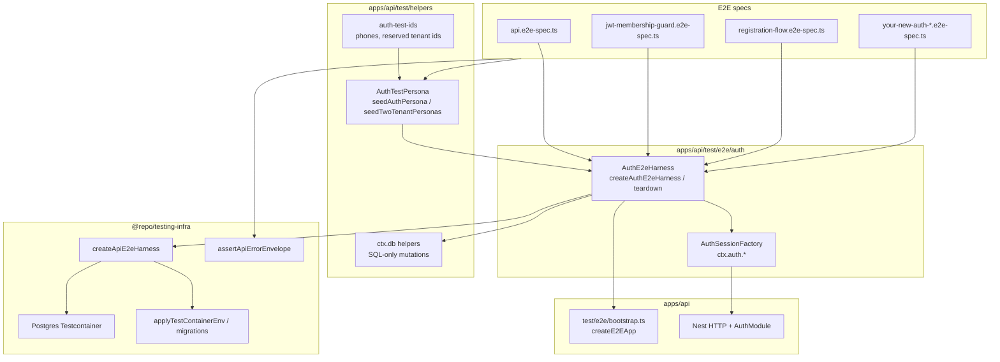

# Auth E2E — Wizard-Standard testing pattern

API auth integration tests follow the **Wizard-Standard** pattern: three composable layers that mirror how the web tour wizard separates **shell**, **steps**, and **fixtures**—here we separate **infrastructure**, **HTTP/session verbs**, and **seeded actors**.

| Layer | Module | Responsibility |
|-------|--------|----------------|
| **Harness** | `auth-e2e-harness.ts` | Testcontainers Postgres, env, migrations, Nest app, teardown |
| **Factory** | `auth-session.factory.ts` | Login, registration, workspace switch, raw OTP/complete helpers |
| **Persona** | `helpers/auth-test-personas.ts` + `auth-test-ids.ts` | Tenants, users, memberships, phones, invites |

Specs stay thin: they describe **behavior**, not **wiring**.

---

## Wizard-Standard in one picture



**Dependency rule:** specs → `AuthE2eHarness` → `@repo/testing-infra`. Specs must **not** import TypeORM entities, Testcontainers, or `createE2EApp` directly.

---

## AuthE2eHarness

`createAuthE2eHarness(options)` returns `AuthE2eHarnessContext`:

| Field | Type | When set |
|-------|------|----------|
| `app` | `INestApplication` | Container + app boot succeeded |
| `auth` | `AuthSessionFactory` | Same |
| `db` | `AuthE2eDbHelpers` | Same |
| `unavailableReason` | `string` | Docker/Testcontainers unavailable — tests should `skip()` |

Lifecycle:

1. `createApiE2eHarness` — start Postgres, expose `applyEnv` / `resetDatabase` / `teardown`
2. `resetDatabase()` — run TypeORM migrations on empty DB
3. `createE2EApp()` — Nest test module
4. `options.seed(ds)` — optional personas (runs **after** migrate, **before** tests)
5. `createAuthSessionFactory(app)` — bind `ctx.auth`

Always pair with `teardownAuthE2eHarness(ctx)` in `after()`.

```typescript
import {
  createAuthE2eHarness,
  teardownAuthE2eHarness,
  type AuthE2eHarnessContext,
} from "./auth/auth-e2e-harness";
import { E2E_JWT_PRIVATE_KEY_PKCS8, E2E_JWT_PUBLIC_KEY_SPKI } from "./jwt-test-keys";

let ctx: AuthE2eHarnessContext;

function skip(): boolean {
  return Boolean(ctx.unavailableReason) || !ctx.app || !ctx.auth || !ctx.db;
}

before(async () => {
  ctx = await createAuthE2eHarness({
    jwtKeys: { privatePem: E2E_JWT_PRIVATE_KEY_PKCS8, publicPem: E2E_JWT_PUBLIC_KEY_SPKI },
    internalApiKey: "test-internal-key-my-spec",
    seed: async (ds) => {
      /* seedAuthPersona / seedTwoTenantPersonas */
    },
  });
});

after(async () => {
  await teardownAuthE2eHarness(ctx);
});
```

---

## AuthSessionFactory (`ctx.auth`)

All auth HTTP goes through the factory so **Host headers**, paths, and dev OTP stay consistent.

| Method | Use when |
|--------|----------|
| `loginOtp({ phone, tenantSubdomain, otp? })` | Known user with membership → JWT string |
| `loginOtpOrRegistration(...)` | Unknown phone or no membership → `kind: "session"` or `kind: "registration"` |
| `completeRegistration({ onboardingToken, fullName, email?, tenantSubdomain? })` | Finish web onboarding → session JWT |
| `switchWorkspace({ bearer, targetTenantId, tenantSubdomain })` | Exchange JWT for another workspace (200) |
| `postWebSessionOtpRaw({ tenantSubdomain?, host?, body? })` | Assert 4xx envelopes (validation, wrong OTP, host errors) |
| `postCompleteRegistrationRaw(...)` | Assert registration complete status/body without throwing |
| `postWorkspaceSessionRaw({ bearer, targetTenantId, hostSubdomain? })` | Workspace session negative paths |
| `getToursRaw({ bearer, tenantSubdomain })` | Authenticated tours list smoke |
| `decodeSessionTenantId(token)` / `decodeJwtPayload(token)` | Assert claims without round-tripping API |

Dev OTP defaults to `E2E_DEV_OTP` (`"1234"`) when `AUTH_ALLOW_DEV_STATIC_OTP=true` (set by harness env).

**Host rule:** Strict auth routes resolve tenant from `Host: {subdomain}.localhost` (`tenantTestHost(subdomain)`). Workspace session and registration complete need the **target** workspace subdomain on the wire.

---

## AuthTestPersona

An **AuthTestPersona** is the return shape of `seedAuthPersona`:

```typescript
{
  userId, tenantId, phone, email, role, subdomain, membershipStatus
}
```

### Seeding helpers (in `seed` callback only)

| Helper | Purpose |
|--------|---------|
| `seedAuthPersona(ds, input)` | One tenant (created if missing) + user + membership |
| `seedTwoTenantPersonas(ds, options)` | Two tenants; optional `userInAOnly`, `userInBOnly`, `dualMember` |

Phone/email utilities (`auth-test-ids.ts`):

- `allocateAuthTestPhone()` — unique E.164 per test run (registration / greenfield users)
- `authTestEmailForPhone(phone)` — deterministic test inbox
- `AUTH_TEST_TENANT_A_ID` / `AUTH_TEST_TENANT_B_ID` — shared reserved UUIDs when specs do not need custom ids

**DB invariant:** Each workspace must keep at least one active **Owner** before registering a new **Member** via `completeRegistration` (see `registration-flow.e2e-spec.ts`).

### `ctx.db` helpers (specs)

Use these instead of TypeORM in test files:

| Helper | Purpose |
|--------|---------|
| `findUserIdByEmail(email)` | Resolve user id for assertions |
| `hasActiveMembership({ userId, tenantId })` | Post-condition after invite/register |
| `insertPendingWorkspaceInvite({ tenantId, email, role, inviteToken, invitedByUserId })` | Invite accept flows |
| `countWorkspaceInvitesByToken(token)` | Invite consumed |
| `updateMembershipRoleByEmail({ email, tenantId, role })` | RBAC / stale-token scenarios |
| `bumpMembershipSessionVersionByEmail({ email, tenantId })` | `AUTH_TOKEN_STALE` scenarios |

Need a new DB mutation? Add it to `auth-test-personas.ts` and wire it through `auth-e2e-harness.ts`—not in the spec.

---

## Quick Start — new auth E2E spec

### 1. Create the file

Place specs under `apps/api/test/e2e/auth/` (auth-focused) or `apps/api/test/e2e/` (broader API) and import the harness from `./auth/auth-e2e-harness` or `./auth/auth-e2e-harness` respectively.

### 2. Declare stable tenant constants (top of file)

Use **named** UUID constants per spec file (not inline in assertions). Reuse `AUTH_TEST_TENANT_*` when two generic workspaces are enough.

```typescript
const TENANT_ID = "a1b2c3d4-a1b2-41b2-81b2-a1b2c3d4e5f6";
const SUBDOMAIN = "my-spec-tenant";
```

### 3. Seed personas in `before`

```typescript
import { UserRole } from "../../src/common/auth/user-role.enum";
import { seedAuthPersona } from "../helpers/auth-test-personas";

await seedAuthPersona(ds, {
  phone: "+15557300999",
  email: "owner@my-spec.test",
  subdomain: SUBDOMAIN,
  tenantId: TENANT_ID,
  role: UserRole.Owner,
  fullName: "Spec Owner",
});
```

### 4. Log in

```typescript
const token = await ctx.auth!.loginOtp({
  phone: "+15557300999",
  tenantSubdomain: SUBDOMAIN,
});

assert.equal(ctx.auth!.decodeSessionTenantId(token), TENANT_ID.toLowerCase());
```

Registration path:

```typescript
const step = await ctx.auth!.loginOtpOrRegistration({
  phone: allocateAuthTestPhone(),
  tenantSubdomain: SUBDOMAIN,
});
assert.equal(step.kind, "registration");

const session = await ctx.auth!.completeRegistration({
  onboardingToken: step.onboardingToken,
  fullName: "New Member",
  tenantSubdomain: SUBDOMAIN,
});
```

### 5. Assert HTTP errors

```typescript
import { assertApiErrorEnvelope } from "@repo/testing-infra";

const res = await ctx.auth!.postWebSessionOtpRaw({
  tenantSubdomain: SUBDOMAIN,
  body: { phone: "+15557300999", otp: "0000" },
});
assert.equal(res.status, 401);
assert.equal((res.body.error as { code?: string })?.code, "AUTH_OTP_INVALID");
assertApiErrorEnvelope(res.body);
```

### 6. Assert database state

```typescript
assert.equal(
  await ctx.db!.hasActiveMembership({ userId: session.userId, tenantId: TENANT_ID }),
  true,
);
```

### 7. Run

```bash
cd apps/api
node --import tsx --test --test-concurrency=1 test/e2e/auth/registration-flow.e2e-spec.ts
```

Use `--test-concurrency=1` for any spec that starts Testcontainers.

---

## Golden Rules

1. **No inline TypeORM in specs** — no `DataSource`, `getRepository`, or entity imports in `*.e2e-spec.ts`. Seed in `options.seed`; mutate via `ctx.db` helpers only.

2. **Use `ctx.auth` for auth HTTP** — no raw `supertest` to `/api/v2/auth/web/session/otp` except for non-auth routes (health, invites) or deliberate one-off probes documented in the spec.

3. **No scattered hardcoded UUIDs** — define `const TENANT_*` / `const SUBDOMAIN_*` at file scope, or use `auth-test-ids` / values returned from `seedTwoTenantPersonas`. Never paste ad-hoc UUIDs inside test bodies.

4. **Always use the harness** — `createAuthE2eHarness` + `teardownAuthE2eHarness`; never duplicate `PostgreSqlContainer`, `applyEnvForContainer`, or `resetTestDatabaseWithMigrations` in auth specs.

5. **Respect Host tenant alignment** — pass `tenantSubdomain` (or `hostSubdomain` on workspace session) matching the workspace under test; expect `TENANT_HOST_MISMATCH` / `TENANT_SCOPE_FORBIDDEN` when testing cross-tenant denial.

6. **Skip gracefully** — if `ctx.unavailableReason` is set (no Docker), return early from tests; do not fail the suite on missing infrastructure.

7. **Prefer factory `*Raw` helpers for negatives** — keep happy paths on asserting helpers (`loginOtp`, `completeRegistration`); use `postWebSessionOtpRaw` / `postCompleteRegistrationRaw` when status !== 200 is the expectation.

8. **Extend the platform, not the spec** — new personas, phones, or SQL helpers belong in `helpers/`, not copy-pasted across files.

---

## Reference specs

| Spec | Demonstrates |
|------|----------------|
| `test/e2e/auth/registration-flow.e2e-spec.ts` | OTP request → registration → complete; `TENANT_HOST_MISMATCH` |
| `test/e2e/jwt-membership-guard.e2e-spec.ts` | Two tenants, workspace switch, host mismatch, stale token |
| `test/api.e2e-spec.ts` | Broad API surface with harness + personas (health, tours, invites) |

---

## File map

```
apps/api/test/
├── e2e/
│   ├── auth/
│   │   ├── README.md                 ← this document
│   │   ├── auth-e2e-harness.ts       ← AuthE2eHarness
│   │   ├── auth-session.factory.ts   ← AuthSessionFactory
│   │   └── registration-flow.e2e-spec.ts
│   ├── bootstrap.ts                  ← createE2EApp (API-owned)
│   ├── jwt-test-keys.ts
│   └── tenant-test-host.ts
└── helpers/
    ├── auth-test-ids.ts
    └── auth-test-personas.ts         ← AuthTestPersona seeders + ctx.db SQL

packages/testing-infra/               ← shared Testcontainers + createApiE2eHarness
```

---

## Related packages

- **`@repo/testing-infra`** — `createApiE2eHarness`, `assertApiErrorEnvelope`, Postgres container, migration reset
- **`apps/web/.../wizard/testing/`** — structural guards only (no DB/containers); API auth e2e infra lives here under `apps/api/test/e2e/auth`
