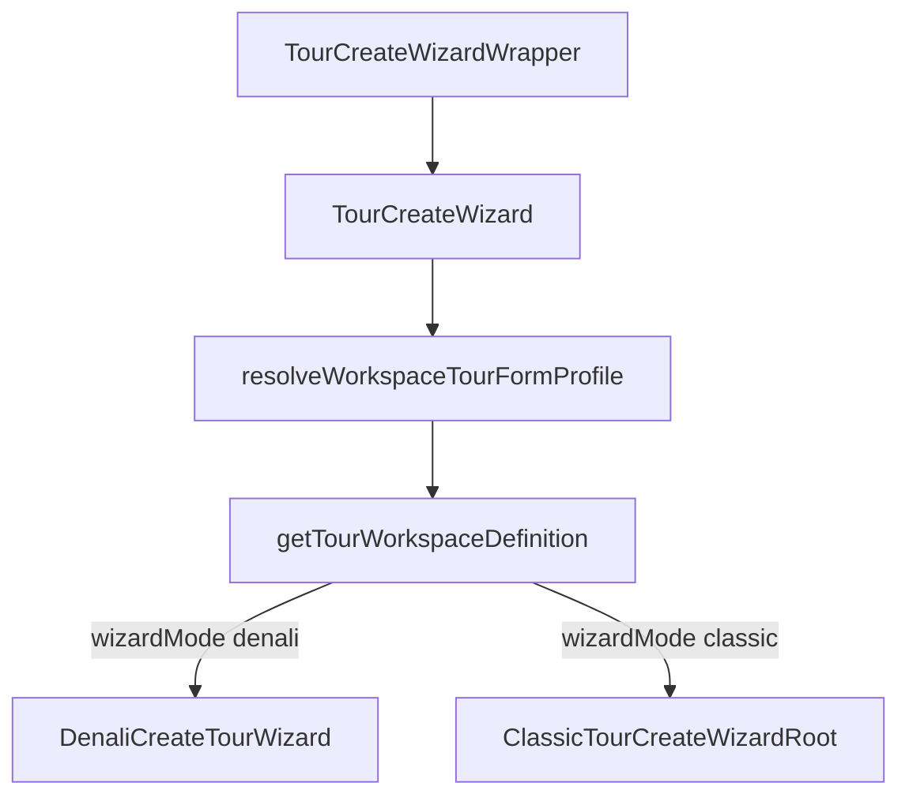

# Core Architecture Map — Tour Create Wizard

Generated: 2026-05-25. Scope: workspace/profile authority, Denali field registry, create-wizard orchestration, and import boundaries.

## Entry points (main wizard flow)

| Layer | File | Role |
|-------|------|------|
| App route | `apps/web/app/(app)/tours/new/tour-create-wizard-wrapper.tsx` | Prefill bootstrap (clone/preset), then mounts orchestrator |
| Orchestrator | `apps/web/src/components/tours/wizard/TourCreateWizard.tsx` | Loads tenant template, validates profile, routes Denali vs classic |
| Denali rail | `apps/web/src/components/tours/wizard/DenaliCreateTourWizard.tsx` | 6-tab Denali create wizard |
| Classic rail | `apps/web/src/components/tours/wizard/legacy/ClassicTourCreateWizard.tsx` | 9-step legacy create wizard (`ClassicTourCreateWizardRoot`) |

**Routing chain:** `template.baseProfile` → `resolveWorkspaceTourFormProfileFromTemplate` → `getTourWorkspaceDefinition` (`@repo/shared-contracts`) → `ui.wizardMode` → `isDenaliPilotFormProfile` → Denali or classic component.



---

## `packages/shared-contracts/` — full tree

```
packages/shared-contracts/
├── README.md
├── package.json
├── tsconfig.json
└── src/
    ├── index.ts
    ├── auth/index.ts
    ├── booking/
    │   ├── booking-status.schema.ts
    │   └── index.ts
    ├── finance/index.ts
    ├── rbac/
    │   ├── capabilities.ts          # capability registry mirror (RBAC, not tour fields)
    │   └── index.ts
    ├── users/
    │   ├── index.ts
    │   └── user-role.schema.ts
    └── tours/
        ├── index.ts                 # re-exports workspace-registry
        ├── create-tour-wire-keys.ts
        ├── denali-wizard.contract.ts
        ├── denali-wizard.contract.spec.ts
        ├── tour-create-contract.ts
        ├── tour-patch-contract.ts
        ├── validation-topology.ts   # documents workspace vs profile validation layers
        ├── workspace-definition.ts  # ★ TourWorkspaceDefinition interface
        ├── workspace-registry.ts    # ★ TOUR_WORKSPACE_DEFINITIONS + getTourWorkspaceDefinition
        └── workspaces/
            ├── arctic.ts            # ★ ARCTIC_WORKSPACE instance
            ├── denali.ts            # ★ DENALI_WORKSPACE instance
            ├── denali-invariants.ts
            ├── workspace-lifecycle.ts
            └── workspace-lifecycle.spec.ts
```

### Files that define `TourWorkspaceDefinition` or the workspace registry

| File | What it defines |
|------|-----------------|
| `src/tours/workspace-definition.ts` | `TourWorkspaceDefinition` interface, `WorkspaceInvariantViolation` |
| `src/tours/workspace-registry.ts` | `TOUR_WORKSPACE_DEFINITIONS`, `getTourWorkspaceDefinition()` |
| `src/tours/workspaces/denali.ts` | `DENALI_WORKSPACE` (`denali_pilot` profile, `wizardMode: "denali"`) |
| `src/tours/workspaces/arctic.ts` | `ARCTIC_WORKSPACE` (`nature_trip` profile, `wizardMode: "classic"`) |
| `src/tours/workspaces/workspace-lifecycle.ts` | Lifecycle helpers typed against `TourWorkspaceDefinition` (consumer, not author) |
| `src/tours/validation-topology.ts` | Comments referencing workspace definitions (no runtime registry) |

**Registry map today:**

| `TourFormProfile` key | Workspace constant | `ui.wizardMode` |
|----------------------|-------------------|-----------------|
| `denali_pilot` | `DENALI_WORKSPACE` | `denali` |
| `urban_event` | `DENALI_WORKSPACE` | `denali` |
| `nature_trip` | `ARCTIC_WORKSPACE` | `classic` |

Exported from package root via `src/tours/index.ts` → `export * from "./workspace-registry"`.

---

## `apps/web/src/features/tours/wizard/` — registry & workspace-definition touchpoints

### Workspace definition consumers (not authors)

| File | Usage |
|------|--------|
| `isDenaliWizardContext.ts` | `getTourWorkspaceDefinition` → Denali routing flag |
| `validation/denali-template-shape.ts` | `getTourWorkspaceDefinition` for strict template checks |
| `validation/strict-profile-validator.ts` | Denali structure vs `baseProfile` guard |
| `sources/loadWizardPrefill.ts` | Workspace roots for prefill mapping |

### Denali field registry (single source of truth)

| File | Role |
|------|------|
| `denali/registry/denaliFieldRegistryData.ts` | **Authoring:** `DENALI_FIELD_DEFINITIONS` rows |
| `denali/registry/denaliRuleMatrixRecipes.ts` | **Authoring:** matrix cell → tag recipes |
| `denali/registry/DenaliFieldRegistry.ts` | **Runtime registry:** `DENALI_FIELD_REGISTRY`, helpers, async-asset paths |
| `denali/registry/DenaliFieldRegistry.types.ts` | Registry row / field kinds |
| `denali/registry/denaliFieldCompletionWeights.ts` | Completion weight map |
| `denali/registry/denaliRegistryCodegen.ts` | **Build-time:** `buildDenaliRuleSetFromRegistry`, integrity checks |
| `denali/registry/DenaliFieldRegistry.spec.ts` | Registry tests |
| `denali/registry/README.md` | Registry workflow docs |

### Generated from registry (`pnpm --filter web generate:denali-wizard`)

| File |
|------|
| `denali/rules/generated/denaliRuleSet.generated.ts` |
| `denali/rules/generated/denaliCanonicalPathMap.generated.ts` |
| `schemas/denaliTourCreateBaseSchema.generated.ts` |

### Registry-adjacent runtime (rules / labels / codegen consumers)

| File | Role |
|------|------|
| `denali/rules/denaliRuleModel.ts` | Rule model + `denaliRuleSet` wiring |
| `denali/rules/denaliRuleRequired.ts` | Required-field paths from registry |
| `denali/rules/denaliUIAdapter.ts` | Visibility / required UI adapters |
| `denali/rules/deriveDenaliTemplateSchema.ts` | `DENALI_TEMPLATE_SCHEMA` for template builder contract |
| `denali/denaliRegistryFieldLabel.ts` | Labels via `DENALI_FIELD_REGISTRY` |
| `denali/denaliWizardCompletion.ts` | Completion scoring via registry |
| `denali/validation/denaliRuleAccess.ts` | Step visibility + rule set resolution |
| `schemas/denaliTourCreateBaseSchema.ts` | Thin wrapper over generated Zod shape |

### Classic profile rules registry (non-Denali)

| Path | Role |
|------|------|
| `profileRules/` | `ALL_PROFILES`, `getProfileRules`, step/field rules |
| `profileRulesReact/` | `FieldGate`, `StepGate`, React hooks |

Used by **classic** create wizard only, not Denali.

### Denali engine public barrel

`denali/index.ts` — re-exports hydration, draft storage, rules, hooks, and step components. Only two app components import this barrel directly:

- `apps/web/src/components/tours/wizard/DenaliCreateTourWizard.tsx` (steps)
- `apps/web/src/components/tours/DenaliTourEditForm.tsx` (steps + edit hooks)

---

## `TourCreateWizard` — imports outside its folder

**Folder:** `apps/web/src/components/tours/wizard/`

### Same-folder (not “spaghetti”)

- `./DenaliCreateTourWizard`
- `./legacy/ClassicTourCreateWizard` (`ClassicTourCreateWizardRoot`)

### External imports (cross-boundary)

| Import | Resolved target |
|--------|-----------------|
| `next-intl` | `useTranslations` |
| `react` | `useMemo` |
| `@tour/ui` | `Card`, `CardBody`, `LoadingState` |
| `@/features/tours/wizard/isDenaliWizardContext` | Denali profile / workspace rail check |
| `@/features/tours/wizard/resolveWorkspaceTourFormProfile` | Template → `TourFormProfile` |
| `@/features/tours/wizard/validation/data-legacy-error` | `DataLegacyError`, mismatch copy |
| `@/features/tours/wizard/validation/strict-profile-validator` | `validateWorkspaceTemplateAtWizardLoad` |
| `@/hooks/use-tenant-wizard-template` | Tenant wizard template query |

The wrapper (`tour-create-wizard-wrapper.tsx`) adds further edges: `sources/*`, `tourWizardDraftEnvelope`, `useTourWizardDraftStorageKey`, auth/tenant/services — all **before** the orchestrator mounts.

### Denali create “spaghetti” hub (for comparison)

`DenaliCreateTourWizard.tsx` pulls **~50+** modules from `@/features/tours/wizard/denali/*`, `@/features/tours/wizard/schemas/*`, `@/hooks/*`, `@/lib/*`, and `@/components/*`. The orchestrator intentionally stays thin; coupling lives in the Denali shell.

---

## Engine exports vs main create flow

**Method:** Static import graph from `TourCreateWizard.tsx` + `DenaliCreateTourWizard.tsx` + `legacy/ClassicTourCreateWizard.tsx` (path-normalized, barrel `export … from` expansion). Symbol reference scan across reachable modules.

### `denali/index.ts` barrel (52 exports)

All 52 exported symbols are **referenced at least once** inside the create-flow module graph (including transitive step/hook modules). None are dead at the symbol level.

However, several are **only exercised on the edit rail or in tooling**, not on the create orchestrator path:

| Export / module | Create flow? | Actually used by |
|-----------------|-------------|------------------|
| `bootstrapDenaliEditFormFromDraft` | No | `DenaliTourEditForm.tsx` |
| `hydrateAsyncAssets`, `readTourGalleryAsyncAssets` | No | `DenaliTourEditForm.tsx` |
| `useDenaliPublishReadiness` | No | `DenaliTourEditForm.tsx` |
| `useDenaliEditCatalogSanitize`, `useDenaliEditRuleSync` | No | `DenaliTourEditForm.tsx` |
| `denaliWizardTourEditDraftStorageKey` | No | Edit draft bootstrap |
| `DENALI_TEMPLATE_SCHEMA`, `deriveDenaliTemplateSchema`, `listDenaliTemplateCanonicalFieldPaths` | No | Barrel/tests only; settings uses `listDenaliRuleFieldPaths` from `denaliRuleModel` instead |

Create flow uses **deep imports** for most Denali behavior; the barrel is mainly used for the six step components.

### Denali modules **not** in the create-flow import graph

These files under `denali/` are not reachable from the three create entry files (orphan runtime modules):

| Module | Notes |
|--------|--------|
| `denali/components/DenaliEditGalleryPhotos.tsx` | Edit-only gallery UI |
| `denali/denaliDefaultGatheringPoints.ts` | Defaults helper; only referenced by its spec |
| `denali/denaliThemeFilter.ts` | Only referenced by its spec |
| `denali/denaliWizardDerived.ts` | Only referenced by its spec |
| `denali/registry/denaliRegistryCodegen.ts` | Codegen + `generate-denali-wizard-config.ts`, `registry-integrity-audit.ts` |
| `denali/rules/evaluateFormRules.ts` | Shared rule engine (`lib/form-rule-engine`); not wired into create wizard |
| `denali/validation/denaliRuleValidation.ts` | No importers located |
| `denali/validation/denaliSubmitTestHelpers.ts` | Test helpers only |

### `denali/rules/index.ts` barrel (34 exports)

All 34 symbols are referenced within the **full** create graph (Denali + classic). None are unused symbols in that graph.

---

## Quick reference — authority layers

| Concern | Source of truth |
|---------|-----------------|
| Which rail (Denali vs classic) | DB `workspace_tour_wizard_templates.base_profile` → `TOUR_WORKSPACE_DEFINITIONS` |
| Field list / matrix / Zod shape | `denali/registry/denaliFieldRegistryData.ts` → codegen |
| Runtime required/visible | `denali/rules/generated/denaliRuleSet.generated.ts` + `denaliRuleAccess.ts` |
| Classic step/field gates | `profileRules/` + `profileRulesReact/` |
| Create orchestration | `TourCreateWizard.tsx` (keep thin; no direct legacy step imports) |

---

## Maintenance commands

```bash
pnpm --filter web generate:denali-wizard
pnpm --filter web audit:denali-registry
```
