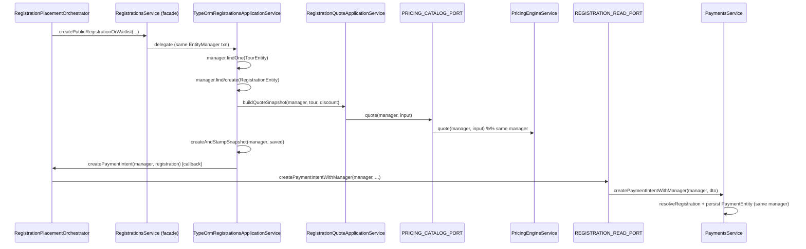
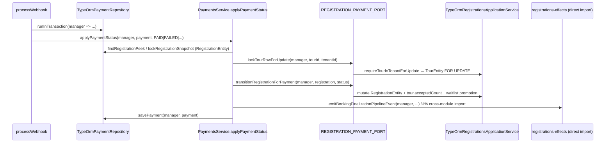

# Phase 1 Audit

**Auditor stance:** Hostile Security & Privacy
**Scope:** Phase 1 — AsyncLocalStorage (ALS) & Tenant Context Hardening, with cross-checks against Phase 4 repository refactors (`tours`, `registrations`, `identity`)
**Date:** 2026-05-29
**Codebase root:** `apps/api/src/`

---

## Executive summary

| Verdict | **Conditional pass with findings** |
|---------|-------------------------------------|
| Phase 1 ALS model | Custom `AsyncLocalStorage` (`requestContextStorage`) — **not** `nestjs-cls` |
| Cross-tenant mutation via client `tenantId` | **Not observed** on public mutation DTOs |
| Route `:tenantId` bypass | **Mostly mitigated**; draft-engine GET ignores route param (JWT-only) |
| Phase 4 repo tenant filters | **Mostly intact**; several defense-in-depth gaps where queries rely on RLS + caller-supplied `where` |
| ALS escape hatches | **Present and documented**; none observed that allow unauthenticated bleed into arbitrary workspace (Denali) data under normal route guards |

**Bottom line:** Tenant context for authenticated workspace mutations is overwhelmingly sourced from JWT-bound ALS (`RequestContextService.resolveEffectiveTenantId()`), with host-tenant alignment enforced in `AuthMiddleware`. Public registration flows intentionally bootstrap tenant from `tourId` via a suppressed, allow-listed lookup. Residual risk sits in (a) repository adapters that delegate tenant scoping to callers, (b) a few id-only tour/catalog sync queries after a tenant-scoped parent row is loaded, and (c) policy-layer bypasses for workspace `Admin` role that assume RLS is the real enforcement boundary.

---

## Methodology

1. Grep + manual review of `apps/api/src/modules/**` for `tenantId` method parameters, `@Param("tenantId")`, and body/DTO `tenantId` fields on mutation paths.
2. Review of Phase 4 TypeORM adapters under `**/repositories/typeorm*.ts` for `find` / `findOne` / `createQueryBuilder` missing explicit `tenantId` predicates.
3. Trace of ALS lifecycle: `RequestContextMiddleware` → `TenantResolverMiddleware` → `AuthMiddleware` → `RequestContextService` → `TenantSessionBindingService`.
4. Review of `runWithoutTenantBinding`, `enableJwtTenantOverrideHost`, and suppressed-mode query allow-lists.

---

## 1. ALS / context infrastructure (not `nestjs-cls`)

### Finding 1.1 — No `nestjs-cls` in codebase

**Severity:** Informational
**Location:** `apps/api/src/common/request-context/request-context.ts`

The project uses Node.js `AsyncLocalStorage` directly via `requestContextStorage`, wired by:

- `RequestContextMiddleware` — opens ALS per HTTP request (request/correlation IDs, path, method, client IP).
- `RequestContextService` — read/write tenant, user, role, binding mode.
- `TenantSessionBindingService` — patches TypeORM `QueryRunner` to inject `app.tenant_id` GUC.

There is **no** `nestjs-cls`, `ClsService`, or generic fallback context store. Any audit of “CLS escape hatches” maps to the mechanisms below.

---

## 2. `tenantId` passed as method arguments vs derived from ALS

### Finding 2.1 — Route `:tenantId` parameters (workspace-scoped controllers)

**Severity:** Low (mostly mitigated)

Several controllers accept `@Param("tenantId")` and pass it into services. **Defense-in-depth checks against JWT ALS are present** on audited workspace routes:

| Controller | Validates param vs `resolveEffectiveTenantId()` |
|------------|--------------------------------------------------|
| `workspace-users-capabilities.controller.ts` | Yes |
| `workspace-ownership.controller.ts` → `UsersWriteService.transferWorkspaceOwnership` | Yes |
| `workspace-settings-modules.controller.ts` | Yes |
| `tenant-audit-events.controller.ts` | Yes (`requireWorkspaceTenantMatch`) |
| `reconciliation-findings.controller.ts` | Yes (`requireWorkspaceTenantMatch`) |
| `draft-engine.controller.ts` | **Partial** — see Finding 2.3 |

**Safer pattern (no route tenant param):** `workspace-users.controller.ts` uses JWT tenant only via `UsersAccessService.resolveTenantIdOrThrow()` — no `:tenantId` in path.

### Finding 2.2 — Service methods with explicit `tenantId: string` parameters

**Severity:** Low (by design, after controller/context validation)

Many services accept `tenantId` as a required argument (not optional). Examples:

- `UsersWriteService.updateMembershipCapabilities(tenantId, …)` — re-validates against ALS.
- `ToursService` private helpers — `tenantId` passed from `resolveEffectiveTenantId()` at mutation entrypoints (`createTour`, `updateTour`).
- `ReconciliationFindingsService` — receives tenant after controller match.
- `DraftEngineFacade.upsertForMember(tenantId, …)` — validates against ALS + `DraftScopeResolver`.

**No instances found** of mutation services accepting **optional** `tenantId?: string` where absence silently widens scope (except webhook/internal paths documented separately).

### Finding 2.3 — Draft engine GET ignores route `:tenantId`

**Severity:** Low

```54:64:apps/api/src/modules/draft-engine/draft-engine.controller.ts
  async getDraft(
    @Param("tenantId") tenantId: string,
    @Param("draftKey") draftKey: string,
  ): Promise<DraftSyncPayloadDto | null> {
    // ...
    const result = await this.draftEngineFacade.findForMember(draftKey);
```

`findForMember` resolves tenant from ALS (`resolveTenantIdOrThrow()`), not the route param. A client calling `GET …/workspaces/{wrong-uuid}/draft-engine/…` still reads drafts scoped to JWT tenant. **Not a cross-tenant read**, but the route param is misleading and bypasses the explicit param-vs-JWT check used elsewhere.

PATCH/upsert paths call `upsertForMember(tenantId, …)` which uses `DraftScopeResolver.resolveOrThrow(paramTenantId, draftKey)` — JWT must match param.

### Finding 2.4 — `assertActiveTenantMatches` is non-blocking when ALS tenant is absent

**Severity:** Medium (defense-in-depth gap; mitigated downstream)

```152:163:apps/api/src/modules/draft-engine/draft-engine.facade.ts
  private assertActiveTenantMatches(...): void {
    if (ctx && typeof ctx.tenantId === "string" && ctx.tenantId !== "N/A") {
      if (ctx.tenantId.toLowerCase() !== expectedTenantId.trim().toLowerCase()) {
        throw new DraftForensicException(...);
      }
    }
  }
```

If `ctx.tenantId` is missing/`"N/A"`, this helper **does not throw**. Upsert paths remain protected by `DraftScopeResolver` (requires JWT tenant === param). Recommend hardening: always throw when ALS tenant is missing on mutation routes.

---

## 3. Client-supplied `tenantId` in request bodies

### Finding 3.1 — Public registration/waitlist DTOs: no client `tenantId`

**Severity:** Pass

`CreateRegistrationDto` and `CreateWaitlistItemDto` document that tenant is derived from the tour row; grep shows no `createDto.tenantId` / `body.tenantId` on mutation paths in `apps/api/src/modules/`.

Public flows call `bootstrapPublicTourTenant(tourId)` which sets ALS from `TenantBootstrapService.resolvePublicTourBootstrapContext` (tour → tenant join), not from Host or body.

### Finding 3.2 — Payment webhook accepts body `tenant_id`

**Severity:** Medium (acceptable for internal webhook; not a public mutation)

```439:473:apps/api/src/modules/payments/payments.service.ts
  async processWebhook(payload: PaymentWebhookDto): Promise<WebhookProcessResult> {
    const payloadTenantId = payload.tenant_id.trim().toLowerCase();
    this.requestContextService.setTenantId(payloadTenantId);
    const payment = await this.paymentRepository.findByProviderPaymentId(
      payload.providerPaymentId,
      payloadTenantId
    );
    // ...
    if (paymentTenantId !== payloadTenantId) {
      throw new BadRequestException({ code: WEBHOOK_TENANT_BINDING_FAILED, ... });
    }
```

Protected by `PaymentWebhookSignatureGuard` on `/internal/payments/webhook`. Wrong `tenant_id` yields no payment row or explicit binding failure. **Not** an unauthenticated browser mutation vector.

### Finding 3.3 — Latent idempotency `tenantSource: "body"` escape hatch

**Severity:** Medium (dormant)

```68:79:apps/api/src/modules/idempotency/idempotency.interceptor.ts
    if (policy.tenantSource === "body") {
      const field = policy.tenantBodyField ?? "tenantId";
      const bodyTenantId = request.body?.[field];
      // ...
      this.requestContextService.setTenantId(bodyTenantId);
    }
```

Grep shows **zero** `@Idempotent({ tenantSource: "body" })` usages in `apps/api/src/modules/`. All observed policies use `tenantSource: "context"`. The code path exists and would overwrite ALS tenant from the request body if ever wired — **remove or gate before use**.

---

## 4. Phase 4 repository adapters — tenant filters in TypeORM queries

### Finding 4.1 — `TypeOrmRegistrationsReadRepository` delegates scoping to callers

**Severity:** Medium

The Phase 4 read port performs **no** mandatory tenant predicate:

```49:52:apps/api/src/modules/registrations/repositories/typeorm-registrations-read.repository.ts
  findOneStandalone(where: RegistrationReadWhere): Promise<RegistrationWriteRecord | null> {
    return this.registrations
      .findOne({ where: toEntityWhere(where) })
```

`RegistrationReadWhere.tenantId` is **optional** in the port type. All current call sites in `typeorm-registrations-application.service.ts` either:

- Build `where` via `registrationWhereForActor()` (always includes `tenantId` from ALS), or
- Pass explicit `tenantId` in duplicate-check payloads.

**Risk:** Future callers could pass `{ id: registrationId }` only and rely on RLS alone. Guardrail scripts may flag this; adapter should enforce tenant when ALS is present.

### Finding 4.2 — `requireTourInTenant` uses id-only `findOne` + post-hoc compare

**Severity:** Medium (RLS-dependent)

```1191:1203:apps/api/src/modules/registrations/repositories/typeorm-registrations-application.service.ts
  private async requireTourInTenant(...): Promise<TourEntity> {
    const tour = await manager.findOne(TourEntity, { where: { id: tourId } });
    // ...
    if (tour.tenantId !== tenantId) {
      throw new NotFoundException(tenantScopedResourceNotFoundError());
    }
```

Contrast with `requireTourInTenantForUpdate`, which includes `.andWhere("tour.tenant_id = :tenantId", { tenantId })` in SQL.

The id-only variant is used after `tourPeek` already loaded `tenantId` under transaction RLS. **If RLS/`app.tenant_id` binding failed**, this pattern could leak tour existence across tenants before the compare. Prefer always using the SQL-filtered variant for mutations.

Same id-only tour peek appears in `createRegistration` / `createWaitlistItem`:

```308:318:apps/api/src/modules/registrations/repositories/typeorm-registrations-application.service.ts
      const tourPeek = await manager.findOne(TourEntity, {
        where: { id: createDto.tourId },
        select: { id: true, tenantId: true }
      });
      const tour = await this.requireTourInTenantForUpdate(
        manager,
        createDto.tourId,
        tourPeek.tenantId
      );
```

### Finding 4.3 — `TypeOrmToursWriteRepository.syncProductDepartureForTour` — catalog sync without tenant in `where`

**Severity:** Medium (post parent-row load)

After loading a tenant-scoped `TourEntity`, sync helpers query related catalog rows by **id only**:

```133:145:apps/api/src/modules/tours/repositories/typeorm-tours-write.repository.ts
    const product = await tourProductRepo.findOne({
      where: { id: tour.tourProductId }
    });
    // ...
    const dep = await tourDepartureRepo.findOne({ where: { id: departureId } });
```

Parent `tour` was loaded with `{ id: tourId, tenantId }`. Missing `tenantId` on child lookups is a **defense-in-depth gap** if FK integrity breaks or wrong `tourProductId` is stored.

### Finding 4.4 — `TypeOrmToursCatalogRepository` — tenant filters present

**Severity:** Pass

List and get-by-id queries include `t.tenantId = :tenantId` / `where: { id, tenantId }`.

### Finding 4.5 — `TypeOrmIdentityRepository` — intentional global auth lookups

**Severity:** Informational (documented exemptions)

Global `users` email/phone queries carry `// tenant-isolation:qb-exempt` comments. Tenant-scoped membership/invite queries use `ut.tenant_id = :tenantId` (e.g. `findTenantUsersListPage`).

### Finding 4.6 — `registration-finance-port.adapters.ts` — tenant in all registration queries

**Severity:** Pass

All `findOne` / lock paths include `{ id, tenantId }`.

### Finding 4.7 — `lock-registration-for-financial-mutation.ts` — caller-supplied `where`

**Severity:** Medium (same class as 4.1)

Locks use `where` from caller; safe when `registrationWhereForActor` or `lockRegistrationByTenantAndId` is used.

---

## 5. ALS / tenant-binding escape hatches

### Finding 5.1 — `runWithoutTenantBinding` (suppressed mode)

**Severity:** Medium (controlled)

**Call sites:**

| Reason | Caller | Allow-listed SQL |
|--------|--------|------------------|
| `tenant_host_resolution` | `TenantResolverMiddleware` | `SELECT … FROM tenants … subdomain … deleted_at IS NULL` |
| `public_tour_bootstrap_lookup` | `TenantBootstrapService` | `SELECT … FROM tours t JOIN tenants … WHERE t.id = $1` |
| `health_ready_probe` | `AppController.healthReady` | `SELECT 1` |

`TenantSessionBindingService.isAllowedSuppressedQuery` rejects non-SELECT and mutations. Suppressed mode **blocks** explicit transactions (`TENANT_BINDING_SUPPRESSED_TRANSACTION_FORBIDDEN`).

**Assessment:** Narrow, reason-tagged, SQL-shape allow-list. Does not permit arbitrary cross-tenant reads/writes.

### Finding 5.2 — Host tenant seeds ALS before JWT

**Severity:** Low (expected for subdomain routing)

```181:191:apps/api/src/common/request-context/request-context.service.ts
  setHostTenantId(id: string): void {
    // ...
    store.hostTenantId = next;
    if (!store.tenantId) {
      store.tenantId = next;
    }
    this.freezeTenantContext(store);
  }
```

`resolveTenantContext()` prefers JWT ALS tenant, then `req.tenant`, then `hostTenantId`.

**Unauthenticated request on workspace host:** Host tenant is present in ALS, but **authenticated mutations** require `AuthorizationPresenceGuard` + JWT verification in `AuthMiddleware`. Unauthenticated callers cannot reach tenant-scoped mutation handlers without a token (except documented public registration routes that bootstrap from `tourId`, not Host).

### Finding 5.3 — `enableJwtTenantOverrideHost()` for cross-host auth flows

**Severity:** Medium (intentional)

Enabled when `skipsJwtHostTenantAlignment()` matches:

- `GET /api/v2/auth/workspaces`
- `POST /api/v2/auth/workspace/session`
- `POST /api/v2/invites/:token/accept`

Allows JWT `tenant_id` to replace host-frozen tenant. **Still requires valid JWT** on protected routes; not an anonymous escape.

### Finding 5.4 — Worker / missing ALS: implicit DB binding skipped

**Severity:** Medium

```249:253:apps/api/src/database/tenant-session-binding.service.ts
    if (!context) {
      // No ALS context (typical in e2e seed/bootstrap or worker startup): skip implicit binding.
      return;
    }
```

Background jobs must use `runInTenantContext(tenantId, fn)` explicitly. HTTP requests always have ALS from middleware.

### Finding 5.5 — Public route tenant-resolver bypass

**Severity:** Low (by design)

`shouldBypassTenantResolver()` skips Host lookup for:

- `POST /api/v2/tours/:id/register|waitlist`
- `GET /api/v2/tours/:id/registration-idempotency-key`
- `GET /api/v2/registrations/:id` (authenticated; JWT supplies tenant)
- `/health`, `/internal`, `/api/docs`

Public mutations **must** call `bootstrapPublicTourTenant(tourId)` before DB access.

### Finding 5.6 — Optional JWT attach on public registration

**Severity:** Low

`AuthMiddleware.tryAttachJwtContextForPublicTourPlacement` optionally attaches JWT on public register/waitlist when a valid token is present (for profile-linked policies). Host/JWT mismatch silently skips attach (no context bleed).

---

## 6. Policy-layer bypasses (non-ALS)

### Finding 6.1 — Workspace `Admin` bypasses JWT↔tour tenant match

**Severity:** Medium

```16:31:apps/api/src/modules/registrations/registrations-policy.ts
export function assertJwtTenantMatchesTourForAuthenticatedMutation(...) {
  if (canActAsPlatformAdminWithoutTenant(input.role)) {
    return;  // UserRole.Admin — misnamed "platform admin"
  }
  if (!input.jwtTenantId || input.jwtTenantId !== input.tourTenantId) {
    throw new NotFoundException(...);
  }
}
```

`canActAsPlatformAdminWithoutTenant` returns true for **workspace** `UserRole.Admin`, not a platform super-user. This skips application-level JWT/tour alignment for workspace admins.

**Mitigation in practice:** RLS binds `app.tenant_id` to JWT tenant; cross-tenant tour rows should not be visible. **Residual risk** if RLS/session binding regresses.

### Finding 6.2 — `registrationTenantMatchesActorScope` allows Admin cross-tenant match

**Severity:** Medium (same class as 6.1)

In `workspace-access.helper.ts`, workspace Admin returns `true` for any `registrationTenantId`. Again RLS is the backstop.

---

## 7. Can an unauthenticated request bleed into Workspace Denali data?

**Assessment: No direct bleed path identified under current guards**, with caveats:

| Scenario | Outcome |
|----------|---------|
| Anonymous request to workspace host + authenticated API | **401** — no JWT |
| Anonymous public register with arbitrary `tourId` | Tenant ALS set from tour row only; cannot target another tenant without knowing a valid cross-tenant tour UUID (RLS + bootstrap join constrain reads) |
| Host tenant in ALS without JWT on protected route | Guards reject before service layer |
| Suppressed bootstrap queries | Read-only, allow-listed, no mutation |
| Wrong `:tenantId` in workspace URL with valid JWT for another workspace | **403** on audited controllers; draft GET uses JWT only |
| Payment webhook forgery | Signature guard required; tenant validated against payment row |

**Denali-specific note:** Draft engine keys include `denali-create`; access requires authenticated JWT scoped to workspace via `DraftScopeResolver` + `AuthorizationPresenceGuard`. No unauthenticated draft read/write path found.

---

## 8. Recommendations (priority order)

1. **Remove or hard-disable** `IdempotencyInterceptor` `tenantSource: "body"` until a reviewed use case exists.
2. **Unify tour tenant loads** — replace `requireTourInTenant` id-only pattern with SQL `tenant_id` filter everywhere (align with `requireTourInTenantForUpdate`).
3. **Harden Phase 4 read adapters** — `TypeOrmRegistrationsReadRepository` should assert `where.tenantId` matches `resolveEffectiveTenantId()` when ALS tenant is present (or always require tenant in `where` for tenant-scoped entities).
4. **Add tenantId to catalog sync child lookups** in `TypeOrmToursWriteRepository.syncProductDepartureForTour`.
5. **Draft-engine GET** — either validate route `:tenantId` vs JWT at controller layer (consistent with other workspace routes) or remove param from route template.
6. **Strengthen `assertActiveTenantMatches`** — fail closed when ALS tenant is absent on mutations.
7. **Rename/clarify** `canActAsPlatformAdminWithoutTenant` — it gates workspace `Admin`, not platform operator; document RLS dependency explicitly in `registrations-policy.ts`.
8. **Regression tests** — cross-tenant negative cases for: public register with JWT from workspace A + tour from B, draft-engine wrong `:tenantId`, webhook wrong `tenant_id`.

---

## 9. Files reviewed (representative)

| Area | Paths |
|------|-------|
| ALS core | `common/request-context/*`, `database/tenant-session-binding.service.ts` |
| Middleware | `common/request-context/request-context.middleware.ts`, `common/tenant/tenant-resolver.middleware.ts`, `common/middleware/auth.middleware.ts` |
| Public bootstrap | `modules/tenant/tenant-bootstrap.service.ts`, `modules/registrations/registrations.controller.ts` |
| Phase 4 repos | `modules/registrations/repositories/typeorm-registrations-read.repository.ts`, `typeorm-registrations-application.service.ts`, `modules/tours/repositories/typeorm-tours-{catalog,write}.repository.ts`, `modules/identity/repositories/typeorm-identity.repository.ts`, `registration-finance-port.adapters.ts` |
| Ownership scope | `common/security/ownership-scope.ts` |
| Workspace routes | `workspace-*-controller.ts`, `draft-engine.controller.ts`, `reconciliation-findings.controller.ts` |
| Webhook | `modules/payments/gateway/payments-webhook.controller.ts`, `payments.service.ts` |
| Idempotency | `modules/idempotency/idempotency.interceptor.ts` |

---

*End of Phase 1 audit.*

---

# Phase 2 Audit

**Auditor stance:** Cynical DevOps & Tooling Inspector
**Scope:** Phase 2 — custom architecture guardrail scripts (`scripts/check-*-guardrails.mjs`) and their CI invocation (`.github/workflows/architecture-guardrails.yml`, `pnpm guardrails:architecture`)
**Date:** 2026-05-29

---

## Executive summary

| Verdict | **Root cause identified — not CI/shell/Node 22** |
|---------|-----------------------------------------------------|
| Silent `exit 1` | **Yes (on committed `HEAD`)** — violations collected then discarded |
| GitHub Actions stderr suppression | **No** — steps run plain `node scripts/…mjs` with no redirection |
| Node 22 / ESM import failure | **No** — scripts load and run; no missing flags or module resolution errors |
| Fix status (working tree) | **`guardrail-report.mjs` wired in** (uncommitted); manual run **all green** |

**Bottom line:** Silent failures were a **script authoring bug**, not a DevOps execution-layer bug. Committed versions of multiple guardrails built violation arrays (or detected rule breaks) then called `process.exit(1)` **without printing anything**. Two scripts used **empty `for (const _v of violations) {}` loops** — almost certainly placeholders where `console.error(v)` was never implemented. GitHub Actions correctly surfaced exit code 1 with an empty log step, which reads as a “silent crash.”

---

## 1. CI / shell execution layer

### Finding 2.1 — `architecture-guardrails.yml` does not swallow stderr

**Severity:** Informational (rules out CI as root cause)

Each guardrail job follows the same pattern:

```yaml
- name: Setup Node.js
  uses: actions/setup-node@v4
  with:
    node-version: "22"

- name: Tenant isolation guardrails
  run: node scripts/check-tenant-isolation-guardrails.mjs
```

Observations:

- **No** `2>/dev/null`, `|| true`, or `set +e` around guardrail steps.
- **No** `pnpm install` on most guardrail jobs — scripts use only Node built-ins (`fs`, `path`, `url`) plus local ESM imports; **no npm dependencies required**.
- **No** `--experimental-vm-modules`, `--import`, or loader flags needed; `.mjs` + `import` works on Node 22 as-is.
- Jobs are **split per script** (14 jobs), so a failure appears as a red step with **no nested log context** unless the script prints — amplifying the “silent” appearance.

`integrity-gate.yml` runs `ci-integrity-check.sh`, which covers eslint/depcruise/test only — **not** the architecture guardrail scripts. Guardrails are isolated to `architecture-guardrails.yml` and `pnpm guardrails:architecture`.

### Finding 2.2 — Not caused by glob, path, or engine mismatch

**Severity:** Informational

Manual invocation (2026-05-29, Node **v22.22.0**):

```bash
pnpm run guardrails:architecture   # exit 0, full chain
node scripts/check-tenant-isolation-guardrails.mjs   # exit 0
node scripts/check-finance-boundary-isolation.mjs    # exit 0
```

- No glob libraries used in guardrail scripts (directory walks use `fs.readdirSync`).
- `REPO_ROOT` resolves via `fileURLToPath(import.meta.url)` — correct under ESM on Node 22+.
- Local Node 22 vs `package.json` engines `>=24` emits a **pnpm WARN** only; it does **not** block script execution.

---

## 2. Root cause — silent `process.exit(1)` in script bodies (committed `HEAD`)

### Finding 2.3 — **PRIMARY:** Empty violation loops (tenant isolation + tour domain)

**Severity:** Critical (observability / CI trust)

**Committed** `scripts/check-tenant-isolation-guardrails.mjs` (pre-fix):

```javascript
if (all.length > 0) {
  for (const _v of all) {
  }
  process.exit(1);
}
```

**Committed** `scripts/check-tour-domain-guardrails.mjs` (pre-fix):

```javascript
for (const _v of allViolations) {
}
process.exit(1);
```

Reproduction of the pattern (zero stderr):

```bash
node -e 'const all=["violation A"]; if(all.length){for(const _v of all){}; process.exit(1)}' 2>&1
# (no output, exit 1)
```

Violations **were computed** (DTO tenant fields, `createQueryBuilder` without tenant scope, missing `security-definer.md`, etc.) but **never emitted** before exit.

### Finding 2.4 — **PRIMARY:** Bare `process.exit(1)` after collecting violations (finance boundary + ledger family)

**Severity:** Critical (observability)

**Committed** `scripts/check-finance-boundary-isolation.mjs`:

```javascript
if (violations.length) {
  process.exit(1);
}
```

Same pattern on committed `HEAD` for:

- `check-finance-transactional-outbox.mjs`
- `check-finance-invoice-immutability.mjs`
- `check-ledger-only-money.mjs`
- `check-ledger-double-entry-writers.mjs`
- `check-ledger-append-only.mjs`
- `check-security-mutation-guardrails.mjs` (after building `violations[]`)

These scripts **push human-readable strings** into `violations` (e.g. `` `${rel}:${line}: forbidden import "…"` ``) then exit without printing the array.

### Finding 2.5 — Immediate `process.exit(1)` on first missing needle (finance multi-tenant)

**Severity:** High (silent + no aggregation)

**Committed** `scripts/check-finance-multi-tenant-ledger-isolation.mjs`:

```javascript
for (const n of needles) {
  if (!text.includes(n)) {
    process.exit(1);   // no message, no file/needle name
  }
}
```

Fails on first missing substring with **no indication** which file or marker failed.

### Finding 2.6 — Still-unfixed silent `process.exit(2)` on allowlist I/O errors

**Severity:** High (present in working tree)

Both `check-tenant-isolation-guardrails.mjs` and `check-security-mutation-guardrails.mjs`:

```javascript
try {
  allow = readAllowlist();
} catch (e) {
  process.exit(2);   // no stderr, error swallowed
}
```

Manual test (missing allowlist file):

```bash
mv scripts/tenant-isolation-guardrails.allowlist.json /tmp/bak
node scripts/check-tenant-isolation-guardrails.mjs 2>&1
# (no output, exit 2)
```

Should call `reportFatal(name, e)` like the outer `try/catch` already does.

### Finding 2.7 — Scripts never migrated to `guardrail-report.mjs`

**Severity:** High (still silent on failure)

| Script | Failure behavior |
|--------|-------------------|
| `check-capability-registry-parity.mjs` | Bare `process.exit(1)` at 4 checkpoints; **no stderr** |
| `check-public-registration-idempotency.mjs` | `fail(message)` sets `process.exitCode = 1` but **ignores `message`** — never prints |
| `check-capability-registry-parity.mjs` | Calls undefined `fail(...)` if decorator file missing → would throw `ReferenceError` (noisy, not silent) — latent bug |

Demonstration — `fail()` swallows its argument:

```javascript
function fail(_message) { process.exitCode = 1; }
fail("this message is swallowed");
process.exit(1);  // exit 1, zero stderr
```

---

## 3. Fix applied (working tree, uncommitted)

### Finding 2.8 — `scripts/guardrail-report.mjs` + wiring

**Severity:** Informational (remediation)

New helper:

```javascript
export function reportAndExit(scriptName, violations) {
  if (!violations.length) return;
  console.error(`\n${scriptName}: ${violations.length} violation(s)\n`);
  for (const v of violations) console.error(typeof v === "string" ? v : String(v));
  process.exit(1);
}

export function reportFatal(scriptName, err) {
  console.error(`\n${scriptName}: fatal error\n  ${err.message}\n`);
  process.exit(2);
}
```

Working-tree diff replaces silent exits in **10 scripts** including the two named in the task:

- `check-tenant-isolation-guardrails.mjs` → `reportAndExit("check-tenant-isolation-guardrails", all)`
- `check-finance-boundary-isolation.mjs` → `reportAndExit("check-finance-boundary-isolation", violations)`

Verified reporting works:

```bash
node -e "import { reportAndExit } from './scripts/guardrail-report.mjs';
  reportAndExit('test', ['violation one','violation two']);" 2>&1

# test: 2 violation(s)
# violation one
# violation two
# (exit 1)
```

### Finding 2.9 — Manual run matrix (working tree, 2026-05-29)

All scripts in `pnpm guardrails:architecture` chain:

| Script | Exit | Stderr on success |
|--------|------|-------------------|
| `check-tenant-isolation-guardrails.mjs` | 0 | (empty) |
| `check-tour-domain-guardrails.mjs` | 0 | (empty) |
| `check-security-mutation-guardrails.mjs` | 0 | (empty) |
| `check-capability-registry-parity.mjs` | 0 | (empty) |
| `check-public-registration-idempotency.mjs` | 0 | (empty) |
| `check-ledger-only-money.mjs` | 0 | (empty) |
| `check-ledger-double-entry-writers.mjs` | 0 | (empty) |
| `check-finance-boundary-isolation.mjs` | 0 | (empty) |
| `check-finance-transactional-outbox.mjs` | 0 | (empty) |
| `check-finance-multi-tenant-ledger-isolation.mjs` | 0 | (empty) |
| `check-finance-invoice-immutability.mjs` | 0 | (empty) |
| `check-ledger-append-only.mjs` | 0 | (empty) |
| **Full chain** `pnpm run guardrails:architecture` | **0** | (empty) |

With working-tree fixes, **no script crashes** — prior red CI was **policy violation + silent reporter**, not runtime exception.

---

## 4. What actually triggered red CI (likely violation themes)

When committed silent reporters ran against the current tree **before** allowlist/doc fixes, failures would have been invisible. Known violation classes that would produce `exit 1`:

| Check | Example violation (now fixed or allowlisted) |
|-------|---------------------------------------------|
| Tenant isolation | Missing `docs/security/security-definer.md`; unscoped `createQueryBuilder`; new `dataSource.query` paths |
| Tour domain | `EventKind` symbol in non-spec tour file |
| Security mutation | Controller missing `@UseGuards(RolesGuard, …)` on PATCH/POST |
| Finance boundary | `finance/` importing `../registrations/` or `../identity/` |
| Ledger append-only | Regex matching crypto `createHash(…).update(…)` as ORM update |

These are **static scan failures**, not Node startup failures — confirming stderr silence was **100% script-side**.

---

## 5. Recommendations

1. **Commit** `guardrail-report.mjs` and all wired `check-*.mjs` changes — CI is still on silent `HEAD` until merged.
2. **Migrate remaining scripts** (`check-capability-registry-parity.mjs`, `check-public-registration-idempotency.mjs`) to `reportAndExit` / `reportFatal`.
3. **Replace** inner `catch (e) { process.exit(2); }` allowlist handlers with `reportFatal`.
4. **Add** a meta-test: `node scripts/check-guardrail-observability.mjs` that injects a synthetic violation fixture and asserts stderr non-empty + exit ≠ 0.
5. **GHA ergonomics:** append `|| { echo "::error::Guardrail failed with no output — check script reporters"; exit 1; }` only as belt-and-suspenders; primary fix remains script-side reporting.
6. **Fix** `check-capability-registry-parity.mjs` undefined `fail()` reference (line 52).

---

## 6. Files reviewed

| Area | Paths |
|------|-------|
| CI workflow | `.github/workflows/architecture-guardrails.yml`, `.github/workflows/integrity-gate.yml` |
| Shell gate | `scripts/ci-integrity-check.sh`, `package.json` (`guardrails:architecture`) |
| Reporting helper | `scripts/guardrail-report.mjs` (working tree, untracked) |
| Primary targets | `scripts/check-tenant-isolation-guardrails.mjs`, `scripts/check-finance-boundary-isolation.mjs` |
| Silent peers (committed) | `check-tour-domain-guardrails.mjs`, `check-security-mutation-guardrails.mjs`, `check-ledger-*.mjs`, `check-finance-*.mjs` |
| Still silent | `check-capability-registry-parity.mjs`, `check-public-registration-idempotency.mjs` |

---

*End of Phase 2 audit.*

---

# Phase 3 Audit

**Auditor stance:** Hostile Code Auditor — Type Safety Fraud
**Scope:** Phase 3 structural domain typing vs Phase 4 refactors in `apps/api/src/modules/{identity,payments,tours,registrations}/`
**Date:** 2026-05-29

---

## Executive summary

| Verdict | **Mixed — structural bypass is intentional in places, fraudulent in others** |
|---------|-------------------------------------------------------------------------------|
| `as any` in production code (4 modules) | **0 hits** in non-`*spec*` / non-`*unit-spec*` files |
| Identity/payment “mappers” | **`asUser` / `asPayment` are identity casts (`row => row`)**, not row mappers |
| Registration write mappers | **Partial row picks** (`asRegistrationWriteRecord`) — legitimate subset, but app layer still uses entities for responses |
| Tours domain boundary | **Entity passthrough** (`tour as TourWriteRecord`) + pervasive `Record<string, unknown>` on JSONB |
| `me-profile.mapper` | **Legitimate** explicit field mapping with redaction/normalization |

**Bottom line:** Phase 3 domain records for **identity** and **payments** were largely satisfied via **TypeScript structural equivalence** (“entity implements domain type”) rather than explicit mappers. That is compile-time theater: runtime objects remain TypeORM entities with extra columns, relations, and prototype methods. **Registrations** partially improved with explicit field picks for port boundaries, but financial adapters re-introduce enum casts and the application service still maps DTOs from raw `RegistrationEntity`. **Tours** lean hardest on casts for JSONB trip details and catalog/write port returns.

---

## 1. Cast inventory (production code, excluding `*.spec.ts`)

### 1.1 High-risk patterns

| Pattern | Count (approx.) | Modules | Assessment |
|---------|-----------------|---------|------------|
| Identity passthrough (`asUser`, `asPayment`, …) | 6 helpers | identity, payments | **Fraud** — no conversion |
| Entity → domain single cast | 3+ | tours | **Fraud** — `tour as TourWriteRecord` |
| `where as FindOptionsWhere` / `as never` | 5 | registrations, payments | **Bypass** — port where-types unchecked |
| `status as RegistrationFinancialRecord["status"]` | 8 | registrations | **Enum bridge fraud** — dual enum sources |
| `Record<string, unknown>` JSONB casts | 40+ | tours, registrations | **Escape hatch** — schema-less blobs |
| `as unknown as Record<…>` | 2 | tours (DTO), payments (webhook) | **Double cast** |
| Dynamic `(this as Record<string, unknown>)[method]` | 1 | registrations facade | **Runtime delegation hack** |

### 1.2 Absent in production

- **`as any`:** zero in identity, payments, registrations; only in `tours/utils/create-tour-form-profile-strip.spec.ts` (tests).
- **`as unknown`:** only `payments/gateway/webhook-signature.verify.ts` (`req as unknown as Record<string, unknown>`) and `tours/dto/list-tours-query.dto.ts` (query normalization).

---

## 2. Mapper audit — entity vs domain

### 2.1 `me-profile.mapper.ts` — **PASS (real mapper)**

```34:54:apps/api/src/modules/identity/me-profile.mapper.ts
export function mapUserEntityToMeProfileResponse(
  user: IdentityUserRecord,
  visibility: MeProfileVisibility
): MeProfileResponse {
  // ...
  return {
    id: user.id,
    full_name: user.fullName ?? null,
    national_id: exposeNationalId ? (user.nationalId ?? null) : null,
    gender: user.gender ?? null,
    birth_date: formatUserDateColumnAsYmd(user.birthDate),
    email: publicEmail,
    is_email_verified: user.isEmailVerified === true,
    phone: rawPhone === "" ? null : normalizeOtpPhoneInput(rawPhone),
    // ...
  };
}
```

- Row-by-row field rename (camelCase → snake_case HTTP contract).
- Business rules: national ID redaction, phone normalization, date formatting.
- Input type is `IdentityUserRecord` (already a structural alias for `UserEntity`), but **output is a distinct DTO shape**.

### 2.2 `typeorm-identity.repository.ts` — **FAIL (cast theater)**

```64:71:apps/api/src/modules/identity/repositories/typeorm-identity.repository.ts
const asUser = (row: UserEntity | null): IdentityUserRecord | null => row;
const asMembership = (row: UserTenantEntity | null): IdentityMembershipRecord | null => row;
const asMembershipList = (rows: UserTenantEntity[]): IdentityMembershipRecord[] => rows;
const asInvite = (row: WorkspaceInviteEntity | null): IdentityWorkspaceInviteRecord | null => row;
const asEmailToken = (
  row: EmailVerificationTokenEntity | null
): IdentityEmailVerificationTokenRecord | null => row;
```

Documented in `identity-records.ts` as *“infra UserEntity implements this shape”* — the compiler is told the types align; **no runtime strip** of:

- `UserEntity` `@OneToMany` `memberships` (domain type even types this as `memberships?: unknown`).
- TypeORM entity prototype / metadata.
- Columns not listed on domain type (still present at runtime).

Write paths double down: `save(user as UserEntity)`, `save(payment as PaymentEntity)` — round-trip identity casts.

**Membership note:** `IdentityMembershipRecord.status` aligns with `UserTenantEntity.status` (maps to DB `membership_status`) — field names match; still no copy.

### 2.3 `typeorm-payment.repository.ts` — **FAIL (cast theater)**

```27:44:apps/api/src/modules/payments/repositories/typeorm-payment.repository.ts
const asPayment = (row: PaymentEntity | null): PaymentRecord | null => row;
const asPaymentList = (rows: PaymentEntity[]): PaymentRecord[] => rows;

const asRegistrationSnapshot = (row: RegistrationEntity | null): PaymentRegistrationSnapshot | null =>
  row
    ? { id: row.id, tenantId: row.tenantId, tourId: row.tourId, status: row.status }
    : null;
```

- **`asPayment`:** pure passthrough; loaded `PaymentEntity.registration` relation can ride along at runtime though absent from `PaymentRecord`.
- **`asRegistrationSnapshot`:** **legitimate narrow projection** (4 fields) — only mapper in payments module that actually constructs a new object.

`toRegistrationEntityWhere` fraud:

```40:44:apps/api/src/modules/payments/repositories/typeorm-payment.repository.ts
function toRegistrationEntityWhere(
  lookup: PaymentRegistrationLookup
): FindOptionsWhere<RegistrationEntity> | FindOptionsWhere<RegistrationEntity>[] {
  return lookup as FindOptionsWhere<RegistrationEntity> | FindOptionsWhere<RegistrationEntity>[];
}
```

`PaymentRegistrationLookup.tenantId` is **optional** in the port type — cast hides missing tenant predicates from the compiler.

### 2.4 `asRegistrationWriteRecord` — **PARTIAL PASS**

```117:133:apps/api/src/modules/registrations/repositories/typeorm-registrations-application.service.ts
const asRegistrationWriteRecord = (row: RegistrationEntity): RegistrationWriteRecord => ({
  id: row.id,
  tenantId: row.tenantId,
  tourId: row.tourId,
  tourDepartureId: row.tourDepartureId ?? null,
  status: row.status,
  paymentStatus: row.paymentStatus,
  participantContactPhone: row.participantContactPhone ?? null,
  telegramUserId: row.telegramUserId ?? null,
  quotedTotalMinor: row.quotedTotalMinor ?? null,
  quotedCurrencyCode: row.quotedCurrencyCode ?? null,
  paidAmount: row.paidAmount ?? null,
  rowVersion: row.rowVersion ?? null,
  deletedAt: row.deletedAt ?? null,
  createdAt: row.createdAt,
  updatedAt: row.updatedAt,
});
```

**Explicit field pick** — good for port boundary.

**Omitted entity columns** (still on DB row, invisible to `RegistrationWriteRecord` consumers):

| Dropped field | Risk |
|---------------|------|
| `participantFullName`, `transportMode`, `entryMode`, `bookingTarget` | Orchestration using write record cannot see intake fields |
| `participantNationalId`, `participantMetadata`, `participantNote` | Peak-experience / policy fields dropped |
| `paymentMetadata`, `quotedPricingVersion`, `quotedListPriceMinor` | Pricing/payment UI fields dropped |
| `vehicleSeatCapacity`, `telegramUsername` | Transport intake dropped |

Application service **still uses `RegistrationEntity` directly** for list/get DTO mapping (`toRegistrationResponse(entity)`), so the write record is **not** the single domain representation — dual paths.

### 2.5 `registration-finance-port.adapters.ts` — **PARTIAL + enum fraud**

```18:27:apps/api/src/modules/registrations/repositories/registration-finance-port.adapters.ts
const asFinancialRecord = (row: RegistrationEntity): RegistrationFinancialRecord => ({
  id: row.id,
  tenantId: row.tenantId,
  tourId: row.tourId,
  status: row.status as RegistrationFinancialRecord["status"],
  paymentStatus: row.paymentStatus as RegistrationFinancialRecord["paymentStatus"],
  // ...
});
```

- Row pick is real, but **`status` / `paymentStatus` are force-cast** because `RegistrationFinancialRecord` imports enums from `@repo/types` while `RegistrationEntity` uses `./domain/registration-status` — two enum declarations bridged by assertion, not validation.
- Save path: `entity.status = record.status as RegistrationStatus` — reverse cast without runtime check.
- `ReconciliationRegistrationReadAdapter` maps `paymentStatus: String(r.paymentStatus)` — honest stringification, but loses enum typing entirely.

### 2.6 Tours — **FAIL (entity passthrough + JSON casts)**

```75:88:apps/api/src/modules/tours/repositories/typeorm-tours-catalog.repository.ts
  async findByIdOrThrow(tenantId: string, tourId: string): Promise<TourWriteRecord> {
    const tour = await this.tourRepository.findOne({ where: { id: tourId, tenantId }, relations: ... });
    // ...
    return tour as TourWriteRecord;
  }
```

No field projection; **`TourEntity` with loaded relations** returned as domain write record.

`tours.service.ts` repeatedly mutates trip details via:

```typescript
const lg = { ...(td.logistics as Record<string, unknown>) };
return { ...td, logistics: lg } as TourTripDetails;
```

This is **schema-evasion**: arbitrary keys can flow through JSONB without `@repo/types` validation.

`mapTourEntityToResponseDto` is a **real mapper** for HTTP output, but inputs are often cast:

```738:738:apps/api/src/modules/tours/tours.service.ts
      return mapTourEntityToResponseDto(loaded as TourResponseSource);
```

`TourResponseSource = TourWriteRecord & { createdAt: Date; updatedAt: Date }` — asserts entity satisfies write record + timestamps without proof.

---

## 3. Incomplete mapping & DB type leakage

### 3.1 Timestamps & soft-delete

| Location | Issue |
|----------|-------|
| `RegistrationWriteRecord` | Includes optional `createdAt`/`updatedAt`/`deletedAt` — **good** when mapper used |
| `PaymentRecord` / passthrough | Entity timestamps pass through unchecked; optional on type |
| `IdentityUserRecord` | Optional timestamps; passthrough exposes `Date` objects with entity identity |
| `toRegistrationResponse` | Converts `createdAt`/`updatedAt` to **ISO strings** — correct DTO boundary |
| `TourWriteRecord` | Optional timestamps; catalog repo returns entity **without** asserting `createdAt`/`updatedAt` present |

### 3.2 Relation entity leakage

| Runtime object | Leaked relation / extra shape |
|----------------|------------------------------|
| `PaymentEntity` as `PaymentRecord` | `registration: RegistrationEntity` when eager-loaded |
| `UserEntity` as `IdentityUserRecord` | `memberships` collection if joined |
| `TourEntity` as `TourWriteRecord` | `details`, `destination` ORM relation objects |

Domain ports claim “no TypeORM entity” but adapters return entities under domain type aliases.

### 3.3 Port where-clause casts (tenant scope fraud)

```32:36:apps/api/src/modules/registrations/repositories/typeorm-registrations-read.repository.ts
function toEntityWhere(
  where: RegistrationReadWhere
): FindOptionsWhere<RegistrationEntity> | FindOptionsWhere<RegistrationEntity>[] {
  return where as FindOptionsWhere<RegistrationEntity> | FindOptionsWhere<RegistrationEntity>[];
}
```

`RegistrationReadWhere.tenantId` is **optional** — compiler cannot enforce tenant predicate; relies entirely on `registrationWhereForActor()` callers (Phase 1 audit finding).

```29:29:apps/api/src/modules/registrations/repositories/lock-registration-for-financial-mutation.ts
  return where as never;
```

Forces TypeORM generic without validation — **maximum bypass**.

### 3.4 Controller / idempotency response casts

```537:537:apps/api/src/modules/registrations/registrations.controller.ts
    return result.responseBody as WaitlistItemResponseDto;
```

Idempotency replay body trusted via assertion — no runtime validator (class-validator) on cached JSON.

### 3.5 `RegistrationsService` facade dynamic binding

```43:47:apps/api/src/modules/registrations/registrations.service.ts
    for (const method of DELEGATED_METHODS) {
      const fn = this.core[method];
      if (typeof fn === "function") {
        (this as Record<string, unknown>)[method as string] = fn.bind(this.core);
      }
    }
```

Bypasses normal class method typing to implement two port interfaces on one facade — if `DELEGATED_METHODS` drifts from port, **no compile error**.

---

## 4. Module-by-module fraud scorecard

| Module | Domain isolation | Mapper honesty | Worst offender |
|--------|------------------|----------------|--------------|
| **identity** | Low | `me-profile.mapper` good; repo casts bad | `asUser = row => row` |
| **payments** | Low | Snapshot mapper OK; payment row passthrough | `asPayment`, `toRegistrationEntityWhere` |
| **registrations** | Medium | Write/financial partial picks; entity still in service | Enum casts in finance adapter; `where as never` |
| **tours** | Low | HTTP `mapTourEntityToResponseDto` good; write port bad | `as TourWriteRecord`, JSONB `Record<string, unknown>` |

---

## 5. What Phase 3 claimed vs what Phase 4 delivered

**Phase 3 intent (inferred):** Application layer speaks domain record types; infra adapters map entities ↔ domain.

**Phase 4 reality:**

1. **Alias mappers** — `asX(row) => row` for identity/payments satisfy port return types without allocation or field validation.
2. **Selective honesty** — registrations write/financial paths use object literals for **subset** fields; list/read/DTO paths still touch entities.
3. **Tours unchanged philosophically** — `TourWriteRecord` is a typed façade over `TourEntity`; JSONB handled via casts not zod/contracts.
4. **No domain snapshot tests found** in `tests/architecture/` for these record shapes (unlike package boundary gates).

This is **compiler satisfaction**, not **runtime domain purity**.

---

## 6. Recommendations

1. **Replace identity casts** with explicit pick mappers (even if verbose) — minimum: `const { id, email, … } = row; return { id, email, … }` to strip relations.
2. **Single enum source** — align `RegistrationFinancialRecord` with `registration-status.ts` or map with runtime parse, not `as`.
3. **Remove `where as never` / bare FindOptionsWhere casts** — use typed builder functions that require `tenantId`.
4. **Tours write port** — return mapped plain objects; never `as TourWriteRecord` on ORM entities with relations attached.
5. **Validate idempotency replay bodies** with `plainToInstance(WaitlistItemResponseDto, …)` or shared zod schema.
6. **Architecture gate:** add depcruise or custom script forbidding `=> row` mappers and `as TourWriteRecord` / `as PaymentRecord` patterns in `repositories/`.
7. **Keep `me-profile.mapper` as the template** — field rename, redaction, normalization at boundary.

---

## 7. Files reviewed

| Area | Paths |
|------|-------|
| Identity domain | `domain/identity-records.ts`, `repositories/typeorm-identity.repository.ts`, `me-profile.mapper.ts` |
| Payments domain | `domain/payment-record.types.ts`, `repositories/typeorm-payment.repository.ts`, `payments.service.ts` |
| Registrations domain | `domain/registration-write.types.ts`, `repositories/typeorm-registrations-{read,application}.service.ts`, `registration-finance-port.adapters.ts`, `lock-registration-for-financial-mutation.ts`, `registrations.service.ts` |
| Tours domain | `domain/tour-write-record.types.ts`, `repositories/typeorm-tours-{catalog,write}.repository.ts`, `dto/tour-response.dto.ts`, `tours.service.ts` |
| Cross-cutting | `common/contracts/registration-financial.types.ts` |

---

*End of Phase 3 audit.*

---

# Phase 4 - Layer Purity Audit

**Auditor stance:** Cynical QA Inspector — boundary-scanner exclusions & Batch 2/3 “completion” claims
**Scope:** `tests/architecture/boundary-scanner.ts` legacy map; `modules/tours/` and `modules/registrations/` refactor honesty; `to-payment-registration-lookup.ts`
**Date:** 2026-05-29

---

## Executive summary

| Claim (MAP §66) | Reality |
|-----------------|--------|
| Batch 3: tours/registrations **app→infra = 0** | **True** — but achieved largely by **re-labeling folders**, not by shrinking god-services |
| Layer purity “complete” | **False** — **85** scanner violations remain in tours/registrations alone (55 cross-module, 30 domain→app); full repo **~304** violations in enforce mode |
| Infra extracted | **Partial** — code moved to `repositories/`; **2,099-line** `TypeOrmRegistrationsApplicationService` still owns orchestration + TypeORM |
| Read port refactor | **Half-wired** — `REGISTRATIONS_READ_REPOSITORY_PORT` registered; application service still injects legacy **`RegistrationsReadRepository`** (entity returns) |

**Bottom line:** Batch 3 optimizes the **one metric the CI subtest checks** (`app-must-not-import-infra` under tours/registrations). Debt is **swept** into: (1) legacy folder→layer map, (2) ungated violation kinds, (3) `repositories/` bucket, (4) duplicate/unused port wiring, (5) app-layer TypeORM shims like `to-payment-registration-lookup.ts`.

---

## 1. `boundary-scanner.ts` — legacy map & exclusions

There is no separate JSON “legacy map”; rules live in `resolveLayer()` and `isExcludedFromLayerRules()`.

### 1.1 Files excluded from all layer rules

```87:90:tests/architecture/boundary-scanner.ts
function isExcludedFromLayerRules(rel: string): boolean {
  return isTestFile(rel) || isCompositionRoot(rel);
}
```

- **Tests:** `*.spec.ts`, `*.unit-spec.ts`, `*.e2e-spec.ts`, `__tests__/`
- **Composition roots:** `*.module.ts`, `*.module.spec.ts`

**Effect:** Nest modules freely import cross-context entities/services with **zero** scanner visibility. `registrations.module.ts` imports `TourEntity`, `PaymentsModule`, `PricingModule`, etc. — all invisible to the gate.

### 1.2 Transitional folder → layer mapping (Tours & Registrations impact)

| Path pattern | Assigned layer | Tours / Registrations examples |
|--------------|----------------|--------------------------------|
| `entities/`, `repositories/`, `adapters/`, `gateway(s)/` | **infra** | `repositories/typeorm-registrations-application.service.ts`, `adapters/pricing-catalog.adapter.ts`, `registration.entity.ts` (via `*.entity.ts`) |
| `application/`, `services/`, `dto/`, `controllers/`, `utils/`, `constants/`, `types/` | **app** | `application/registration-placement.orchestrator.ts`, `tours.service.ts`, `dto/*`, `utils/peak-experience-placement.ts` |
| `policies/`, `pure/`, `strategies/`, `contracts/`, `*.policy.ts`, `*.rules.ts` | **domain** | `policies/*`, `strategies/denali.workspace.strategy.ts`, `domain/*` |
| **Default** (module-root `*.ts` not matching above) | **app** | `registrations-policy.ts`, `registrations-effects.ts`, `registrations.controller.ts` |

**Sweep tactics Batch 3 exploited:**

1. **Rename/move to `repositories/`** → instant **infra** classification; removes `app-must-not-import-infra` even when the file is still a 2k-line application+TypeORM monolith.
2. **`*.entity.ts` anywhere** → infra (including `registration.entity.ts` at module root with cross-imports to tours/pricing — flagged as `cross-module-import`, not app→infra).
3. **`policies/` → domain** but policies import `dto/` and `utils/` (app) → **`domain-must-not-import-app`** (30 hits in tours/registrations; **not gated** by Batch 1–3 subtests).
4. **`utils/` → app** while **`strategies/` → domain** → domain strategy files importing app utils (`profile-required-submit-shape.ts`) — structural lie.
5. **Shared kernel allowlist** — `apps/api/src/common/` never counted; finance ports extracted here bypass cross-module metrics for receipt/reconciliation.

### 1.3 What Batch subtests actually enforce

| Subtest | Fails on | Tours/registrations debt still allowed |
|---------|----------|----------------------------------------|
| batch 1 | `domain-must-not-import-infra` (global) | — |
| batch 2 | identity/payments `app-must-not-import-infra` | — |
| batch 3 | tours/registrations `app-must-not-import-infra` | **55** `cross-module-import`, **30** `domain-must-not-import-app` |
| Full suite (report-only default) | nothing | **~304** total violations repo-wide |

```89:107:tests/architecture/architecture-boundaries.spec.ts
test("architecture: module layer and bounded-context dependency rules", () => {
  // ...
  if (process.env.ARCHITECTURE_BOUNDARIES_ENFORCE === "1") {
    assert.equal(violations.length, 0, ...);
  }
});
```

**Default CI passes while ~304 violations print to stderr** — easy to ignore.

### 1.4 Scanner resolution gaps

- **`resolveTsImport` fails silently** if extension/path wrong → import skipped (no violation).
- **Package imports** (`@repo/*`, `@nestjs/*`) skipped entirely — no boundary on npm graph.
- **Domain ports import `typeorm`** (`EntityManager`, `FindOptionsWhere`) — allowed by Batch 1 “type-only” escape; still couples domain contracts to ORM types.

---

## 2. Half-baked refactors — Tours

| Item | Status | Evidence |
|------|--------|----------|
| **`tours.service.ts`** | **Not decomposed** | **1,107 lines** — still primary write orchestrator; only catalog **read** extracted to `ToursCatalogReadApplicationService` |
| **`ToursCloneService`** | **Unchanged in Batch 3** | Still under `services/` (app); JSON clone logic + casts; not behind write port |
| **`dashboard-aggregate.controller.ts`** | **Cross-module leak** | Imports `RegistrationsService` from `../registrations/` — `cross-module-import` |
| **`tours.controller.ts`** | **Cross-module leak** | Imports `RegistrationsService` + registration DTOs for embedded routes |
| **Domain ports import DTOs** | **Layer inversion** | `tours-repository.port.ts` imports `ListToursQueryDto`, `TourResponseDto` → domain→app |
| **`domain/tour-policy.types.ts`** | **Mis-layered deps** | Imports `types/tour-trip-details.types.ts`, `tour-transport-modes.ts` (app/utils paths) |
| **`apply-regional-tour-list-scope.ts`** | **TypeORM in app** | `SelectQueryBuilder` import; lives in `utils/` (app), used from infra repository — acceptable for gate, odd for purity |
| **Duplicate pricing helpers** | **Partial cleanup** | MAP claims move to `repositories/`; `repositories/catalog-pricing-load.adapter.ts` is canonical (used by `pricing.module.ts`). Stale glob references under `tours/pricing/` may exist in index tools — **only `repositories/` copy on disk** |
| **`repositories/typeorm-tours-catalog.repository.ts`** | **Cast exit** | `return tour as TourWriteRecord` — no mapping (see Phase 3 audit) |

### Tours — domain→app violations (ungated sample)

- `domain/ports/tours-repository.port.ts` → `dto/list-tours-query.dto.ts`, `dto/tour-response.dto.ts`
- `policies/assert-tour-publish-transition.ts` → multiple `utils/*` and `types/tour-trip-details.types.ts`
- `strategies/*` → `utils/profile-required-submit-shape.ts`

---

## 3. Half-baked refactors — Registrations

| Item | Status | Evidence |
|------|--------|----------|
| **`RegistrationsService` facade** | **Thin delegate only** | Port binding in constructor via `(this as Record<string, unknown>)[method]` — typing hack; no logic |
| **`TypeOrmRegistrationsApplicationService`** | **Renamed, not purified** | **2,099 lines** in `repositories/`; still `@InjectRepository`, `DataSource`, direct `manager.find` on `TourEntity`, `PaymentEntity`, outbox, ledger, pricing snapshot creation |
| **Read repository split** | **Broken dual stack** | Module registers `REGISTRATIONS_READ_REPOSITORY_PORT` → `TypeOrmRegistrationsReadRepository` (**domain records**). Application service injects **`RegistrationsReadRepository`** (**returns `RegistrationEntity`**) — **not listed in `registrations.module.ts` providers** → likely DI failure or test-only manual wiring |
| **Legacy `registrations-read.repository.ts`** | **Still present** | Returns entities; parallel to port adapter; README claims “extracted gradually” |
| **`registration-placement.orchestrator.ts`** | **Partial** | Uses `REGISTRATION_READ_PORT` + domain types — good; still injects **`RegistrationsService` facade** (not `REGISTRATIONS_APPLICATION_PORT` directly) |
| **`registrations-policy.ts`** | **App layer, not domain** | Module-root filename ≠ `*.policy.ts`; classified **app**; contains JWT/tour tenant bypass logic |
| **`peak-experience-placement.ts`** | **Cross-module** | Imports `../../tours/types/tour-trip-details.types` |
| **`adapters/pricing-catalog.adapter.ts`** | **Infra bucket, app imports** | Classified infra but imported from app orchestration via port; internally imports `PricingEngineService` (pricing module) — cross-module |
| **`adapters/payments-registration-read.adapter.ts`** | **Cross-module** | Imports `PaymentsService` directly — not a port |
| **Entity graph** | **Untouched** | `registration.entity.ts` / `waitlist-item.entity.ts` still `@ManyToOne` → `TourEntity` — **55** cross-module edges from registrations/tours alone |

### Registrations — domain port smells

`registrations-application.port.ts` (domain) imports **8 DTO modules** + `ports/registration-payment.port.ts` — application port signatures are Nest DTO-shaped, not domain command types. Batch 3 did not introduce domain commands; it **cemented DTOs into domain layer** for scanner purposes.

---

## 4. `to-payment-registration-lookup.ts` — conceptual violation

**Path:** `apps/api/src/modules/payments/utils/to-payment-registration-lookup.ts`
**Layer (scanner):** **app** (`utils/`)

```1:32:apps/api/src/modules/payments/utils/to-payment-registration-lookup.ts
import type { FindOptionsWhere } from "typeorm";
// ...
export function toPaymentRegistrationLookup(
  where: FindOptionsWhere<Record<string, unknown>> | FindOptionsWhere<Record<string, unknown>>[]
): PaymentRegistrationLookup {
```

### What it does

- **Input:** TypeORM `FindOptionsWhere<Record<string, unknown>>` — output of `registrationWhereForActor()` from `common/security/ownership-scope.ts` (also typed with TypeORM `FindOptionsWhere<RegistrationEntity>`).
- **Output:** `PaymentRegistrationLookup` — domain port clause type (`payment-registration.types.ts`).
- **Mechanism:** Manual field pick (`id`, `tenantId`, `deletedAt`, phones) — **does not remove TypeORM from the app layer**; it **bridges** ORM where objects into port vocabulary.

### Call sites still cast

```406:406:apps/api/src/modules/payments/payments.service.ts
      toPaymentRegistrationLookup(regWhere as FindOptionsWhere<Record<string, unknown>>)
```

`payment-intent-registration-resolver.application.service.ts` passes `registrationScope` without cast when object literal matches — but actor scope from `registrationWhereForActor` still originates as ORM where shapes.

### Infra side undoes purity

```40:44:apps/api/src/modules/payments/repositories/typeorm-payment.repository.ts
function toRegistrationEntityWhere(lookup: PaymentRegistrationLookup) {
  return lookup as FindOptionsWhere<RegistrationEntity> | FindOptionsWhere<RegistrationEntity>[];
}
```

**Round-trip:** ORM where → app util → port lookup → **cast back to ORM where** in infra. No semantic validation; **`tenantId` optional** on port type throughout.

### Verdict

| Question | Answer |
|----------|--------|
| Did we move infra logic out? | **No** — relocated the cast to an app-layer util with TypeORM import |
| Is it better than direct repository coupling? | **Marginally** — payments no longer imports `registration.entity.ts` |
| Is it Phase 4 clean architecture? | **No** — proper fix: `registrationWhereForActor` returns `PaymentRegistrationLookup` / domain clause; infra adapter maps to SQL only inside repository |

---

## 5. “Half-Baked Refactors” checklist (actionable)

### Critical / wiring

1. **Wire read port consistently** — Inject `REGISTRATIONS_READ_REPOSITORY_PORT` into `TypeOrmRegistrationsApplicationService`; delete or merge legacy `RegistrationsReadRepository` (entity returns).
2. **Register or remove `RegistrationsReadRepository`** — Currently `@Inject(RegistrationsReadRepository)` with **no provider** in `registrations.module.ts`.
3. **Replace `toPaymentRegistrationLookup` + double cast** — Domain where builder in `common/security/` returning `PaymentRegistrationLookup`; drop `FindOptionsWhere` from payments app layer.

### Structural debt (ungated)

4. **Split god services** — `TypeOrmRegistrationsApplicationService` (2,099 LOC) and `tours.service.ts` (1,107 LOC) into use-cases; `repositories/` should be persistence only.
5. **Domain ports must not import DTOs** — Extract command/query types under `domain/`; map at controller edge.
6. **Fix domain→app policy imports** — Move shared validation to `domain/` or accept policies as app layer (reclassify folder map).
7. **Cross-module: tours ↔ registrations** — Remove `RegistrationsService` from tours controllers; expose read models via ports or BFF endpoints.
8. **Enable enforce mode incrementally** — `ARCHITECTURE_BOUNDARIES_ENFORCE=1` for `cross-module-import` among tours/registrations/pricing (~72 per MAP §66).

### Scanner hygiene

9. **Stop using folder rename as “done”** — Require LOC/complexity limits on `repositories/*.service.ts`.
10. **Scan `*.module.ts` imports** — Optional composition-root cross-module report (currently excluded).
11. **Resolve duplicate/stale paths** — Ensure no second copy of pricing adapters under `tours/pricing/` in branches; single canonical `repositories/`.

---

## 6. Measured violation snapshot (2026-05-29)

```
Scan stats: filesScanned=547, classified=449 (domain=69, app=299, infra=81)

Tours + registrations only:
  cross-module-import:        55
  domain-must-not-import-app: 30
  app-must-not-import-infra:   0  ← Batch 3 subtest

Repository-wide:
  cross-module-import:        242
  domain-must-not-import-app:  37
  app-must-not-import-infra:   25
```

---

## 7. Files reviewed

| Area | Paths |
|------|-------|
| Scanner | `tests/architecture/boundary-scanner.ts`, `architecture-boundaries.spec.ts` |
| MAP claims | §62–§66 |
| Tours | `tours.service.ts`, `tours.controller.ts`, `dashboard-aggregate.controller.ts`, `domain/ports/tours-repository.port.ts`, `repositories/*`, `services/tours-clone.service.ts` |
| Registrations | `registrations.service.ts`, `registrations.module.ts`, `repositories/typeorm-registrations-application.service.ts`, `repositories/registrations-read.repository.ts`, `repositories/typeorm-registrations-read.repository.ts`, `application/registration-placement.orchestrator.ts`, `adapters/*` |
| Payments shim | `payments/utils/to-payment-registration-lookup.ts`, `payments.service.ts`, `payment-intent-registration-resolver.application.service.ts`, `repositories/typeorm-payment.repository.ts` |

---

*End of Phase 4 - Layer Purity Audit.*

---

# Phase 4 - Cross-Module & Cycle Audit

**Auditor stance:** Core Architecture Assessor — runtime decoupling vs compile-time port cosmetics
**Scope:** `ToursCatalogModule` / snapshot ports; execution traces for registration placement & payment webhooks; remaining `cross-module-import` graph
**Date:** 2026-05-29

---

## Executive summary

| Claim (MAP §763–§766) | Runtime reality |
|------------------------|-----------------|
| `ToursCatalogModule` breaks payments → tours → registrations → payments **cycle** | **Compile-time only** — Nest module graph no longer imports full `ToursModule` from `PaymentsModule` |
| Port-based snapshots decouple Payments from Tours/Registrations | **Partial** — ports wrap **the same `EntityManager` transaction**; business logic still lives in monolith services |
| `REGISTRATION_READ_PORT` / `PRICING_CATALOG_PORT` abstract cross-context work | **Mostly proxy-pass** — adapters delegate to `PaymentsService` / `PricingEngineService` with manager unchanged |
| ~72 `cross-module-import` among tours/registrations/pricing remain | **Under-counted in MAP** — scanner shows **55** tours↔registrations alone; **96** if either side is tours/registrations/pricing; **242** repo-wide |

**Bottom line:** Decoupling is **real at the Nest DI graph** (no `PaymentsModule` → `ToursModule` edge) but **not real at execution** — booking and webhook paths are still **single-database, single-transaction, multi-entity orchestrations** with bidirectional service calls through thin adapters.

---

## 1. Module graph — what actually broke the cycle

### Before (MAP §763)

```
PaymentsModule → ToursModule → RegistrationsModule → PaymentsModule  (cycle)
```

### After (current wiring)

```
PaymentsModule ──imports──► ToursCatalogModule  (TOURS_CATALOG_REPOSITORY_PORT only)
ToursModule ──imports/re-exports──► ToursCatalogModule
ToursModule ──forwardRef──► RegistrationsModule
RegistrationsModule ──forwardRef──► PaymentsModule
```

**What changed:** `PaymentIntentRegistrationResolverApplicationService` loads tour `costContext.requiresPayment` via `TOURS_CATALOG_REPOSITORY_PORT.findByIdOrThrow()` instead of importing `ToursModule`.

**What did not change:**

- `PaymentsModule` still registers `RegistrationEntity` in `TypeOrmModule.forFeature` — payments owns registration ORM metadata for FK joins and snapshot queries.
- `RegistrationsModule` still `forwardRef`s `PaymentsModule`; `REGISTRATION_READ_PORT` adapter injects **`PaymentsService`** directly.
- `PaymentsService` injects **`REGISTRATION_PAYMENT_PORT`** → `RegistrationsService` facade → `TypeOrmRegistrationsApplicationService`.
- **Runtime call cycle persists:** registrations → payments (intent creation) and payments → registrations (webhook status transitions), often **inside one SQL transaction**.

---

## 2. Execution trace — registration placement

**Entry:** `RegistrationPlacementOrchestrator.publicRegister` / `createAuthenticatedBooking`



### Port honesty assessment

| Port | Declared abstraction | Actual behavior |
|------|---------------------|-----------------|
| `PRICING_CATALOG_PORT` | Registration-side pricing without importing pricing module | **`PricingCatalogAdapter` is 3 lines** — forwards `manager` + input to `PricingEngineService.quote()` |
| `REGISTRATION_READ_PORT` | Registration-side intent creation without importing payments | **`PaymentsRegistrationReadAdapter` injects `PaymentsService`** — full payment-intent pipeline, finance contract, ledger hooks |
| `RegistrationsService` (orchestrator still uses facade) | Application port | **Dynamic delegate** to 2,099-line `TypeOrmRegistrationsApplicationService` — direct `TourEntity` / `RegistrationEntity` / `PaymentEntity` in same txn |

**Verdict:** Ports **do not isolate business logic**; they **hide import statements** while **proxy-passing the TypeORM `EntityManager`** that already holds locks on tour + registration rows. The orchestrator adds a thin validation layer (`assertPaymentIntentWhenRequired`) but the transactional core is unchanged from pre–Batch 3.

### Snapshot types — cosmetic or structural?

- `RegistrationPaymentIntentSnapshot`, `PaymentRegistrationSnapshot`, `RegistrationQuoteSnapshot` — **field picks** from entities/DTOs; mapping happens at adapter boundaries but **persistence still uses entity classes** inside repositories.
- `createAndStampSnapshot` still calls `createPricingSnapshot(manager, …)` from **`pricing/create-pricing-snapshot.ts`** (cross-module) — not behind a port.
- `PRICING_CATALOG_PORT` shadow compare in `createAndStampSnapshot` is **diagnostic only**; authoritative quote already ran in `buildQuoteSnapshot`.

---

## 3. Execution trace — payment webhook (`processWebhook`)

**Entry:** `PaymentsWebhookController` → `PaymentsService.processWebhook`



### Webhook-specific findings

1. **No `REGISTRATION_READ_PORT` on webhook path** — payments talks to registrations via **`REGISTRATION_PAYMENT_PORT`** and **direct `registrations-effects` imports** (`emitBookingFinalizationPipelineEvent`, `booking-finalization-pipeline` types).
2. **Shared transaction is mandatory** — tour pessimistic lock, registration status transition, payment row update, outbox events, and (on PAID) ledger capture must commit or roll back **together**. Ports cannot swap implementations without preserving this coupling.
3. **`ToursCatalogModule` is absent from webhook flow** — tour data accessed via **`lockTourRowForUpdate`** on registration side (full `TourEntity` load), not catalog port snapshots.
4. **Failed/refunded paths** call `transitionRegistrationForPayment` which may **`promoteNextWaitlistItem`** — registrations business rules execute **inside payment’s transaction** via port callback.

**Verdict:** Webhook decoupling is **weaker than placement** — payments still **imports registration pipeline effects directly** (scanner: `cross-module-import`), not only through shared-kernel ports.

---

## 4. `ToursCatalogModule` — what it actually isolates

| Concern | Isolated? | Notes |
|---------|-----------|-------|
| Payment intent: “does tour require payment?” | **Yes** | `PaymentIntentRegistrationResolverApplicationService` uses `TOURS_CATALOG_REPOSITORY_PORT` |
| Payment webhook: tour capacity lock | **No** | `REGISTRATION_PAYMENT_PORT.lockTourRowForUpdate` → full tour entity in registrations service |
| Registration placement: tour validation | **No** | `TypeOrmRegistrationsApplicationService` imports `TourEntity`, `TourDetailsEntity`, etc. |
| Pricing engine loading tour catalog rows | **No** | `pricing-engine.service.ts` → `tours/repositories/catalog-pricing-load.adapter.ts` |
| ORM FK graph | **No** | `registration.entity.ts` → `tour.entity.ts`; `payment.entity.ts` → `registration.entity.ts` |

**Port file location debt:** `PaymentIntentRegistrationResolverApplicationService` still has a **relative cross-module import** of `../../tours/domain/ports/tours-repository.port` — allowed by scanner (port types only) but proves payments **remains semantically tied to tours domain package**.

---

## 5. Cross-module import inventory

### Count reconciliation (scanner run 2026-05-29)

| Slice | `cross-module-import` count |
|-------|----------------------------|
| **Repository-wide** | **242** |
| Source or target ∈ {tours, registrations} | **55** (Phase 4 Layer Purity figure) |
| Source or target ∈ {tours, registrations, pricing} | **96** |
| **Both** source and target ∈ {tours, registrations, pricing} | **17** |
| Entity-path imports touching tours/reg/pricing | **28** (includes finance/identity/outbox as other party) |

MAP §942 “~72 among tours/registrations/pricing” appears to be an **approximate planning figure** — current static scan is **96** (either-side) or **55** (tours↔registrations only). Batch 3 **does not gate** any `cross-module-import` violations.

### Dependency subgraph (tours / registrations / payments / pricing)

```
registrations ──entity FK──► tours
registrations ──adapter──► payments.service, pricing-engine.service
payments ──entity/repo──► registrations.registration.entity
payments ──service import──► registrations-effects, registration-payment.port
payments ──port types──► tours/domain/ports
pricing ──snapshot helper──► registrations.registration.entity
pricing ──catalog load──► tours/repositories/catalog-pricing-load.adapter
tours ──controllers──► registrations.service, registration DTOs
```

**No depcruise cycle** at module level for payments→tours full module — but **bidirectional runtime edges** remain via forwardRef + port adapters.

---

## 6. Top 10 most dangerous untouched cross-module imports (Batch 3 scope)

Ranked by **production mutation paths**, **transaction coupling**, and **schema/migration blast radius**.

| # | Import | Risk | What breaks if you “fix” it naively |
|---|--------|------|-------------------------------------|
| **1** | `registrations/adapters/payments-registration-read.adapter.ts` → `PaymentsService` | **Runtime cycle + txn coupling** — registration txn invokes full payment-intent pipeline mid-flight | Splitting modules without shared txn → **orphan registrations** or **double payment intents** |
| **2** | `payments/payments.service.ts` → `registrations/registrations-effects` | **Direct cross-context side effects** — webhook emits registration booking-finalization outbox events from payments | Extract payments service → **missing outbox events**, stuck booking phases |
| **3** | `payments/payments.service.ts` → `REGISTRATION_PAYMENT_PORT` (`RegistrationsService`) | **Webhook mutates tour capacity + registration status + waitlist FIFO** inside payment txn | Mock port without tour locks → **overbooking**, **lost waitlist promotions** |
| **4** | `payments/repositories/typeorm-payment.repository.ts` → `registration.entity` | **Payments repo queries/m locks registration rows** (`findRegistrationSnapshot`, `lockRegistrationSnapshot`) | Replace with HTTP/gRPC read → **race with concurrent registration edits** unless distributed locks added |
| **5** | `payments/entities/payment.entity.ts` → `registration.entity` | **ORM FK / relation metadata** ties migrations and TypeORM joins | Remove import → **migration drift**, broken `@ManyToOne` relations |
| **6** | `registrations/repositories/typeorm-registrations-application.service.ts` → `tour.entity`, `tour-details.entity`, `tour-departure.entity`, `payment.entity` | **2,099-line god orchestrator** still owns cross-entity booking txn (capacity, waitlist, snapshots) | Move to “pure app service” without splitting txn → **partial commits**, invariant violations |
| **7** | `registrations/registration.entity.ts` → `tour.entity`, `tour-departure.entity` | **Schema-level coupling** — registrations table FK to tours | Independent deploy of tours schema → **migration ordering failures**, broken joins |
| **8** | `tours/tours.controller.ts` → `RegistrationsService` + `get-registration.dto` | **HTTP surface embeds foreign module** — tour routes trigger registration reads/writes | Extract BFF → **duplicate auth/tenant rules**, API breakage for clients |
| **9** | `pricing/pricing-engine.service.ts` → `tours/repositories/catalog-pricing-load.adapter` | **Pricing reads tour persistence adapter directly** — not via `ToursCatalogModule` port | Change tour storage layout → **silent quote drift**, finance reconciliation mismatches |
| **10** | `registrations/adapters/pricing-catalog.adapter.ts` → `PricingEngineService` | **Quote port is pass-through** — same manager, same engine; no boundary for pricing rule changes | Swap pricing module → registrations quote path breaks unless adapter updated in lockstep |

**Honorable mention (outside strict top 10 but high blast radius):**

- `pricing/create-pricing-snapshot.ts` → `registration.entity` — immutable snapshot creation tied to registration ORM shape.
- `tours/dashboard-aggregate.controller.ts` → `RegistrationsService` — dashboard aggregates bypass port layer entirely.
- `payments/application/payment-intent-registration-resolver.application.service.ts` → `tours/domain/ports/tours-repository.port` — cross-module port **type** import; safer than service import but still couples release cadence.

---

## 7. Is decoupling “real”?

| Layer | Decoupled? |
|-------|------------|
| **Nest module imports** | **Partially** — `ToursCatalogModule` removed full tours import from payments |
| **TypeScript import graph** | **No** — 55+ cross-module edges involving tours/registrations; payments still imports registration effects |
| **Database / transaction** | **No** — single Postgres DB, shared `EntityManager`, cross-entity locks |
| **Business logic ownership** | **No** — logic remains in `TypeOrmRegistrationsApplicationService`, `PaymentsService`, `PricingEngineService` |
| **Port interfaces** | **Thin facades** — `EntityManager` first parameter on `PricingCatalogPort`, `RegistrationReadPort`, `IRegistrationPaymentPort` |

**Assessor verdict:** The refactor achieved **cycle-breaking for Nest bootstrap** and **cleaner payment-intent tour lookup**, but **did not achieve bounded-context isolation at runtime**. Ports are **compatibility shims** for Batch 3’s `app-must-not-import-infra` gate, not execution boundaries. True decoupling would require **outbox/saga or at minimum anti-corruption layers that do not accept foreign `EntityManager`**.

---

## 8. Recommendations (execution-level)

1. **Stop passing `EntityManager` through ports** — ports should accept domain commands and return domain results; only infra adapters touch TypeORM.
2. **Replace `PaymentsRegistrationReadAdapter` → `PaymentsService`** with a **`PAYMENT_INTENT_PORT`** owned by payments module, injected into registrations — break the reverse service import.
3. **Move `emitBookingFinalizationPipelineEvent` behind `REGISTRATION_PAYMENT_PORT` or shared-kernel outbox port** — remove direct `registrations-effects` import from `payments.service.ts`.
4. **Webhook path: explicit saga state machine** — document/invariant-test that payment PAID + registration ACCEPTED_PAID + ledger + outbox are one unit of work; any extraction must preserve it.
5. **Enforce `cross-module-import` for tours/registrations/pricing** — start with entity imports (#5, #7) as migration-guard violations.
6. **Pricing → tours:** route catalog load through `TOURS_CATALOG_REPOSITORY_PORT` (same as payments resolver), delete direct `catalog-pricing-load.adapter` import from pricing module.

---

## 9. Files reviewed

| Area | Paths |
|------|-------|
| Module graph | `tours-catalog.module.ts`, `tours.module.ts`, `payments.module.ts`, `registrations.module.ts` |
| Placement flow | `registration-placement.orchestrator.ts`, `typeorm-registrations-application.service.ts`, `registration-quote.application.service.ts`, `payments-registration-read.adapter.ts`, `pricing-catalog.adapter.ts` |
| Webhook flow | `payments.service.ts` (`processWebhook`, `applyPaymentStatus`), `registration-payment.port.ts`, `registrations-effects.ts` |
| Resolver | `payment-intent-registration-resolver.application.service.ts` |
| Persistence coupling | `payment.entity.ts`, `registration.entity.ts`, `typeorm-payment.repository.ts` |
| Scanner | `tests/architecture/boundary-scanner.ts` |

---

*End of Phase 4 - Cross-Module & Cycle Audit.*
