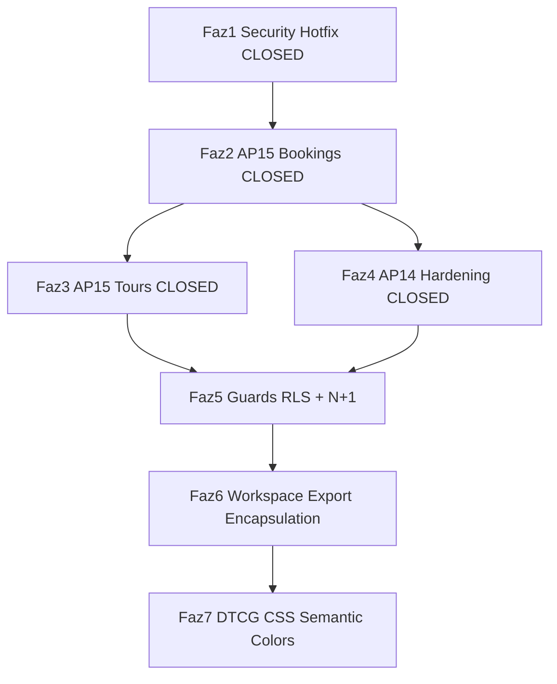

# مسیر اصلاح — Remediation Roadmap (موقت)

**تاریخ:** 2026-07-07 (بسته‌شدن: PR-1..PR-4)  
**منبع:** `audit/MASTER_AUDIT_LOG.md` · گزارش Critical Path · `.cursorrules` Doc-First  
**وضعیت کلی:** **فاز ۱–۷ CLOSED** (encapsulation + hardening + DTCG apps/web) · SMK-PTL-04 staging manual

> **Closure report:** [`audit/CRITICAL-PATH-CLOSURE.md`](CRITICAL-PATH-CLOSURE.md)  
> این فایل موقت برای فازهای ۵–۷ نگه‌داری می‌شود؛ فازهای ۱–۴ بسته شدند.

---

## خلاصه اجرایی

| محور | AP / موضوع | وضعیت |
|------|------------|--------|
| امنیت RLS | AP 5 | **Done** (PR-1) |
| نشت خطا | AP 14 | **Done** hotfix + hardening (PR-4) |
| پرفورمنس list | AP 15 | **Done** bookings + tours (PR-2/PR-3) |
| ایزولاسیون workspace | Export encapsulation | **Done** (فاز ۶ P2) |
| DTCG / CSS | AP 7, 8, 16 | **Done** (Phase 7 — semantic vars + docs) |
| Guards دفاعی | CI automation | **Done** (فاز ۵ + P0–P3 guards) |

---

## اصول ثابت (Methodology)

1. **Doc-First** — قبل از `apps/api` / `packages/platform-core` / `workspace-sdk` → `docs/` (Markdoc).
2. **Admin فقط probe** — `getPrismaAdmin()` + `select: { tenantId: true }`؛ fetch کامل زیر `withTenantRls`.
3. **findMany ممنوع بدون `take` یا `select`** — در repositoryهای tenant-scoped.
4. **خطای client opaque** — `handleHttpError` / `internal_error`؛ Prisma → `AppError` در interceptor.
5. **Host از WorkspacePlugin** — نه import مستقیم از internals ورک‌اسپیس.
6. **Verify سریع** — `pre-commit:fast` + guards هدفمند؛ full gate فقط با YES Architect.

---

## نمای کلی فازها



| فاز | عنوان | هدف | وضعیت | تخمین |
|-----|--------|-----|--------|-------|
| **۱** | Security Hotfix | AP5 + AP14 hotfix | **Done** | — |
| **۲** | AP15 Bookings | duplicate-finders + users.service | **Done** (PR-2) | — |
| **۳** | AP15 Tours | DB pagination + projection | **Done** (PR-3) | — |
| **۴** | AP14 Hardening | interceptor + guard error leak | **Done** (PR-4) | — |
| **۵** | Defensive Guards | RLS repo + N+1 service | **Done** | — |
| **۶** | Workspace Exports | Denali barrel leak + manifest surfaces | **Done** (P0–P3) | — |
| **۷** | DTCG / CSS | hex ban + semantic colors apps/web | **Done** | — |

---

## فاز ۱ — Security Hotfix (AP 5 + AP 14) — **DONE**

### AP 5 — RLS two-step `getById`

**مشکل:** admin full-row bypass روی `operatorRegistration`.

**راه‌حل پیاده‌شده** (`apps/api/src/bookings/prisma-bookings.repository.ts`):

1. `getPrismaAdmin().findUnique({ where: { id }, select: { tenantId: true } })`
2. `withTenantRls(tenantId, tx => tx.operatorRegistration.findFirst({ where: { id, tenantId } }))`

**همچنین:** `listOutboxByAggregate` → admin probe (نه `getPrisma()`).

**Docs به‌روز:** `docs/dev/list-projection-guards.mdoc` · P7 `IMPLEMENTATION-TRUTH-P7.md` · `p7-staging-e2e.md`

**Spec:** `test/bookings-safety.spec.ts` BK-SAFE-03

**معیار Done:** admin فقط `tenantId` · detail شامل `registrationIntake` · SMK-PTL-04

---

### AP 14 — Error leak `tenants-create`

**مشکل:** `(err as Error).message` روی HTTP 500.

**راه‌حل پیاده‌شده** (`apps/api/src/routes/platform/tenants-create.ts`):

- catch نهایی → `handleHttpError(res, err)`
- `deps.runProvisionTenantSaga` برای تست injectable

**Spec:** `test/platform-provision.spec.ts` — «does not leak engine error message»

**معیار Done:** 500 → `{ error: "internal_error" }` بدون Prisma/SQL text

---

### Verification فاز ۱

- [x] `guard:unbounded-list` PASS
- [x] `guard-docs` PASS
- [x] `bookings-safety.spec.ts` · `platform-provision.spec.ts` · `denali-registration.spec.ts` PASS
- [ ] Staging: SMK-PTL-04 (دستی)

---

## فاز ۲ — AP15 Bookings (Unbounded Legacy) — **DONE**

### هدف

حذف O(tenant) scan در production؛ `listByTenant` از مسیر duplicate-finder و users directory.

### Doc-First

- [x] به‌روز `docs/dev/list-projection-guards.mdoc` — حذف allowlist `listByTenant` پس از migration
- [x] بخش duplicate-finder contracts در doc bookings

### Repository — متدهای جدید (`BookingsRepository`)

```typescript
findActiveDuplicateByUser(input: { tenantId; tourId; submittedByUserId }): Promise<BookingRecord | null>;
findActiveDuplicateByGuestLabel(input: { tenantId; tourId; guestLabel }): Promise<BookingRecord | null>;
findActiveDuplicateByEmail(input: { tenantId; tourId; email }): Promise<BookingRecord | null>;
findActiveDuplicateByNationalId(input: { tenantId; tourId; nationalId }): Promise<BookingRecord | null>;
listBySubmittedUser(tenantId: string, submittedByUserId: string): Promise<BookingRecord[]>;
```

**ثابت مشترک:** `booking-active-duplicate.ts` — `status NOT IN ('cancelled', 'rejected')`

### Refactor (پیاده‌شده)

| فایل | اقدام |
|------|--------|
| `bookings/bookings.service.ts` | delegate → `findActiveDuplicateBy*` |
| `identity/users.service.ts:642` | → `listBySubmittedUser` |
| `bookings/prisma-bookings.repository.ts` | `withTenantRls` + `findFirst` |
| `bookings/in-memory-bookings.repository.ts` | mirror interface |

### Guard

- [x] حذف entry `listByTenant` از `guard-unbounded-list.mjs` LEGACY_ALLOWLIST
- [x] `@deprecated` روی `listByTenant`

### Verify

- [x] `guard:unbounded-list` PASS
- [x] `bookings-safety.spec.ts` BK-SAFE-05 PASS
- [x] `platform-provision.spec.ts` · `tours-list.spec.ts` (regression) PASS

---

## فاز ۳ — AP15 Tours (Unbounded + In-Memory Pagination) — **DONE**

### هدف

`listToursOperator` دیگر کل tenant را با unbounded `findMany` load نکند؛ reads via bounded `listByTenantPage` chunks.

### Doc-First

- [x] `docs/dev/list-projection-guards.mdoc` — operator DB pagination + member booking summary

### Code (پیاده‌شده)

| فایل | اقدام |
|------|--------|
| `storage/prisma-tour.repository.ts` | `listOperatorToursPage` + `OPERATOR_TOUR_LIST_SELECT` |
| `tours/operator-tour-list-db-query.ts` | DB filter/sort on `title`, `publishStatus`, `startDate`, `createdAt` |
| `tours/list-tours-operator.ts` | `listOperatorToursPage` — one bounded page per HTTP request |
| `db/load-all-tour-records-via-list-page.ts` | bounded chunk helper (adapter `findMany` only; operator list no longer uses) |
| `db/tour-storage.adapter.ts` | `findMany` → bounded `listByTenantPage` loop |
| `prisma/schema.prisma` | `@@index([tenantId, createdAt, id])` — migration `20260707100000_*` |

**یادداشت:** `canonical` در DB select باقی می‌ماند (workspace `extractTourListProjection`); OpenAPI list همچنان بدون `canonical`.

### Verify

- [x] `guard:unbounded-list` PASS
- [x] `test/tour-safety.spec.ts` TR-SAFE-01..04 PASS
- [x] `test/load-all-tour-records-via-list-page.spec.ts` PASS
- [x] `test/tours-operator.spec.ts` CP-9.3-L* PASS
- [x] `test/1-functional/tours-list.spec.ts` LIST-01..04 PASS

---

## فاز ۴ — AP14 Hardening (Error Handling کامل) — **DONE**

### هدف

تمام catch pathها امن؛ Prisma semantics حفظ شود بدون leak.

### Doc-First

- [x] `docs/dev/error-handling-standard.mdoc`

### Code (پیاده‌شده)

| فایل | اقدام |
|------|--------|
| `middleware/error-interceptor.ts` | `mapPrismaErrorToAppError()` — P2002→409, P2003→422, P2025→404 |
| `middleware/error-interceptor.ts` | `isClientSafeErrorToken` + opaque fallback for engine text |
| `scripts/guards/guard-catch-error-leak.mjs` | ban `err.message` در platform routes |
| `routes/platform/tenants-get.ts` | حذف `console.error` — pino only |
| `package.json` | `guard:catch-error-leak` در `phase-6:fast-track` |

### Verify

- [x] `guard:catch-error-leak` PASS
- [x] `error-interceptor-prisma.spec.ts` AP14-PRISMA-01..06 PASS
- [x] `platform-provision.spec.ts` leak test PASS

---

## فاز ۵ — Defensive Guards (CI)

### هدف

کم‌کردن اتکا به دقت انسان؛ ۹۰٪ N+1 و RLS drift در CI گیر کند.

### Guards جدید

| Guard | Rule | Scope |
|-------|------|--------|
| `guard-repository-rls` | `getPrisma()` روی `*.repository.ts` بدون `withTenantRls` / `tenantId` در where → FAIL | `apps/api/src/**/*.repository.ts` |
| `guard-service-n-plus-one` | `await` داخل `for`/`map` callback در `*.service.ts` → WARN/FAIL | `apps/api/src/**/*.service.ts` |
| `guard-workspace-export-surface` | گسترش `guard-denali-plugin-surface` به `package.json` exports allowlist | `packages/workspaces/*/package.json` |

### Guards موجود (نگه‌داری)

- `guard-unbounded-list` — AP15
- `guard-denali-plugin-surface` — plugin entry فقط
- `guard-tenant-isolation` + `guard-rls-session-local`
- `guard-dtcg-hex-ban` · `guard-dtcg-literals-ban`

### Doc-First

- `docs/dev/ci-defensive-guards.mdoc`

### Verify

```bash
pnpm run phase-6:fast-track
```

---

## فاز ۶ — Workspace Export Encapsulation

### هدف

ایزولاسیون واقعی Denali/Urban/Guest — host فقط از `WorkspacePlugin` + contract symbols.

### مشکل فعلی

- `packages/workspaces/denali/package.json` — ده‌ها subpath export
- root `index.ts` barrel leak (۱۰۰+ symbol)
- wildcard / deep imports از host

### Doc-First

- `docs/dev/workspace-export-encapsulation.mdoc`
- به‌روز `docs/dev/denali-plugin-encapsulation.mdoc`

### اقدامات

1. **ک-shrink root export** — فقط `WorkspacePlugin` + smoke constants + contract types
2. **حذف wildcard** از `exports` — explicit allowlist per subpath
3. **Manifest surfaces** — host از `httpRoutes` / plugin hooks نه `@app-tour/workspace-denali/composites`
4. **guard-workspace-export-surface** — CI enforce allowlist
5. migration imports در `apps/api` · `apps/web` · `apps/portal`

### Verify

```bash
pnpm run guard:denali-plugin-surface
pnpm run guard:workspace-export-surface   # پس از اضافه
pnpm run guard:import-boundary
pnpm run test:changed
```

---

## فاز ۷ — DTCG / CSS Semantic Colors (AP 7, 8, 16)

### هدف

یکپارچگی enterprise UI — بدون hex hardcode و Tailwind palette برای status.

### مشکل audit

- `apps/web`: ~18 hex fallback در CSS modules · ~24 Tailwind palette usage
- `apps/portal`: pass (مرجع)

### Doc-First

- `docs/dev/semantic-color-contract.mdoc`

### اقدامات

1. جایگزینی `#2563eb` و مشابه → `var(--color-primary)` / DTCG tokens
2. Success/Warning/Error → `Badge` semantic یا `--color-status-*`
3. تقویت `guard-dtcg-hex-ban` + `guard-admin-feature-appearance-ast` برای `apps/web`
4. `guard-shell-appearance-ast` گسترش به portal/web parity

### Verify

```bash
pnpm run guard:dtcg-hex-ban
pnpm run guard:admin-feature-appearance-ast
pnpm --filter @apps/web run test
```

---

## نگاشت «۴ گام پیشنهادی کاربر» → فازها

| گام کاربر | فاز | وضعیت |
|-----------|-----|--------|
| ۱ — catch `tenants-create` | فاز ۱ | **Done** |
| ۲ — two-step `getById` RLS | فاز ۱ | **Done** |
| ۳ — guard N+1 | فاز ۵ | **Done** |
| ۴ — حذف export Denali | فاز ۶ | **Done** |

AP15 (bookings/tours) = **فاز ۲ + ۳** (بین گام ۲ و ۳ guard).

---

## ترتیب اجرا (Roadmap)

```
[CLOSED] Faz 1  PR-1  AP5 + AP14 hotfix
[CLOSED] Faz 2  PR-2  AP15 bookings duplicate-finders
[CLOSED] Faz 3  PR-3  AP15 tours list projection
[CLOSED] Faz 4  PR-4  AP14 interceptor + guard-catch-error-leak
[CLOSED] Faz 5  PR-5  guard-repository-rls + N+1
[CLOSED] Faz 6  PR-6  Denali export encapsulation + root import codemod
[CLOSED] Faz 7  PR-7  DTCG/CSS apps/web semantic colors
```

**Closure:** [`audit/CRITICAL-PATH-CLOSURE.md`](CRITICAL-PATH-CLOSURE.md)

---

## ریسک‌های cross-phase

| ریسک | فاز | Mitigation |
|------|-----|------------|
| SMK-PTL-04 regression | ۱ | staging smoke بعد از deploy |
| duplicate nationalId JSON slow | ۲ | `findFirst` + index بعداً |
| tour list behavior change | ۳ | operator list spec + OpenAPI guard |
| platform 4xx leak via interceptor | ۴ | opaque fallback + spec |
| false positive N+1 guard | ۵ | allowlist برای batch patterns |
| breaking deep imports | ۶ | codemod + depcruise + test:changed |
| visual regression web | ۷ | appearance AST guards |

---

## چک‌لیست master

### فاز ۱ — CLOSED
- [x] AP5 two-step getById
- [x] AP14 tenants-create handleHttpError
- [x] Docs P7 + list-projection-guards
- [ ] SMK-PTL-04 staging (دستی — post-deploy)

### فاز ۲ — CLOSED
- [x] repo duplicate finders
- [x] users.service user-scoped
- [x] guard allowlist listByTenant حذف
- [x] listByTenant projected (BOOKING_LIST_SELECT) — deprecated baseline

### فاز ۳ — CLOSED
- [x] TOUR_LIST_PAGE_SELECT + `listOperatorToursPage`
- [x] listToursOperator → `listOperatorToursPage` (not materialize-all)
- [x] schema index migration `20260707100000_*`

### فاز ۴ — CLOSED
- [x] mapPrismaErrorToAppError
- [x] guard-catch-error-leak
- [x] guard:no-console-src (auth + provisioning + tenants-get)

### فاز ۵ — CLOSED (RLS invites + guard-repository-rls)
- [x] migration `20260707110000_operator_pending_invites_rls`
- [x] identity invite methods → `withTenantRls` + tenant-scoped signatures
- [x] `docs/dev/ci-defensive-guards.mdoc`
- [x] `guard:repository-rls` + wired to `phase-6:fast-track`
- [x] `identity-pending-invite-rls.spec.ts`
- [x] `guard:service-n-plus-one` + wired to `phase-6:fast-track`
- [x] `updateUserMobile` → `getPrismaAdmin` cross-tenant session bump
- [x] identity list projection (`select` + `take` memberships/invites)
- [x] exposure control plane batch reads (N+1 allowlist خالی)
- [x] guard-workspace-export-surface (فاز ۶ P2)

---

## چک‌لیست backlog — اولویت بالا → پایین (2026-07-07)

ثبت از Security/RLS audit + MASTER_AUDIT_LOG supplement. موارد بسته‌شده (فاز ۱–۵b) حذف شده‌اند.

### P0 — امنیت / جداسازی tenant

- [x] **`getById(id)` بوکینگ** — `getById(id, tenantId)` + `withTenantRls` (بدون admin probe)
- [x] **Audit call siteهای `getById`** — `finance.service.ts` + specs به‌روز شد
- [x] **Guard admin probe** — `guard:bookings-getbyid-tenant-scope` (admin probe فقط `select: { tenantId }`)

### P1 — unbounded `findMany` (AP15 تکمیل)

- [x] **تسری `guard-unbounded-list`** — همه tenant delegates در `*.repository.ts` (P3 allowlist)
- [x] **Settings audit trail** — `listByTenantPage` keyset + `take` + `SETTINGS_AUDIT_LIST_SELECT`
- [x] **Integration connections** — `select` بدون `credentials` + `take` (connection + policy repos)
- [x] **Workspace draft events** — `take`/`orderBy` در SQL (`listByDraft`)
- [x] **`listOutboxByAggregate`** — `take: MAX_OUTBOX_EVENTS_PER_AGGREGATE` (100)

### P2 — encapsulation / export surface (فاز ۶)

- [x] **Denali `package.json`** — contract (`./`, `./plugin`, `./theme/*`) + `./host/*` for all other exports
- [x] **Codegen `./host/*`** — `importSpecifier` + retarget در `registration.mjs`, `wizard-admin.mjs`, `http-routes.mjs`, …
- [x] **Urban `./plugin`** — slim plugin + `internal.ts` + `guard:urban-plugin-surface`
- [x] **Guest-club** — `./guest-club.plugin` → `./plugin` (manifest + package.json)
- [x] **Starter** — `./exposure` → `./host/exposure`
- [x] **`guard:workspace-export-surface`** — wired to `phase-6:fast-track`

### P3 — perf / hardening

- [x] **Settings catalogs (۷ list)** — `select` + `MAX_SETTINGS_CATALOG` cap
- [x] **Exposure intent lists** — `select` + cap روی `listForConnectionScope(s)`
- [x] **Platform `listExpiredPastDue`** — batch + cursor
- [x] **Identity directory** — pagination در DB (نه load 500 + filter/slice در memory)
- [x] **Identity/auth routes** — حذف leak احتمالی `error.message` (خارج از scope platform AP14)
- [x] **ZOD ingress validation** — `ZOD_VALIDATION_FAILED` / `CANONICAL_VALIDATION_FAILED` → 400 قبل از opaque-token gate (ASM-8.1-015)

### انجام‌شده (مرجع — نیاز فوری ندارد)

- [x] AP5 two-step `getById` + admin probe (فاز ۱)
- [x] AP14 platform routes → `handlePlatformRouteError` (فاز ۴)
- [x] AP15 bookings duplicate-finders + tours list projection (فاز ۲–۳)
- [x] RLS `operator_pending_invites` + `guard:repository-rls` (فاز ۵)
- [x] Identity membership/invite `select` + `take` (AP15 identity)
- [x] Exposure control plane batch prefetch (Phase 5f)

---

### فاز ۶
- [x] Denali `package.json` exports shrink — contract + `./host/*` (P2)
- [x] root `index.ts` contract-only — plugin symbols only (P2)

### فاز ۷
- [x] apps/web hex → DTCG vars (CSS module fallbacks removed)
- [x] semantic Badge/status colors (Tailwind palette → `--color-success/warning`)

### P2 follow-up — root barrel elimination
- [x] Denali/Urban root imports → `/host/*` or `/plugin` (66 files, codemod)
- [x] Missing host exports (`host/finance`, smoke, settings templates)
- [x] `docs/dev/workspace-export-encapsulation.mdoc`

---

## خارج از scope (فاز بعدتر)

- AP 10 — guest `pluginId` cache 300s
- Full gate (`phase-5:gate`, `ci:integrity`) — فقط YES Architect

---

## Performance backlog (2026-07-07) — CLOSED

- [x] Bookings member summary — count + top-10 (`bookings-member-summary-projection.ts`)
- [x] Finance invoice facts — SQL aggregate + bounded payments
- [x] Repository N+1 — `bulkApproveWithOutbox` batch tx, exposure `createMany`, drafts cap
- [x] Guard tightening — `guard-unbounded-list`, `guard-repository-n-plus-one`, `audit:findmany-scan`
- [x] Operator tour list — `listOperatorToursPage` (one DB page per request)

Log: [`audit/REMEDIATION_LOG.md`](REMEDIATION_LOG.md) · Docs: [`docs/dev/list-projection-guards.mdoc`](../docs/dev/list-projection-guards.mdoc)

---

## مراجع کد (الگوهای مرجع)

| Concern | Path |
|---------|------|
| RLS detail two-step | `apps/api/src/bookings/prisma-bookings.repository.ts` `getById` |
| RLS mutation pattern | همان فایل `approveWithOutbox` |
| Error handling platform | `apps/api/src/routes/platform/tenants-create.ts` · `tenants-get.ts` |
| Error handling standard | `docs/dev/error-handling-standard.mdoc` |
| List projection guards | `docs/dev/list-projection-guards.mdoc` |
| Plugin surface guard | `scripts/guards/guard-denali-plugin-surface.mjs` |
| Unbounded list guard | `scripts/guards/guard-unbounded-list.mjs` |
| Catch error leak guard | `scripts/guards/guard-catch-error-leak.mjs` |

---

*فازهای ۱–۴ بسته — [`CRITICAL-PATH-CLOSURE.md`](CRITICAL-PATH-CLOSURE.md). فاز ۵+ doc-first per `.cursorrules`.*
