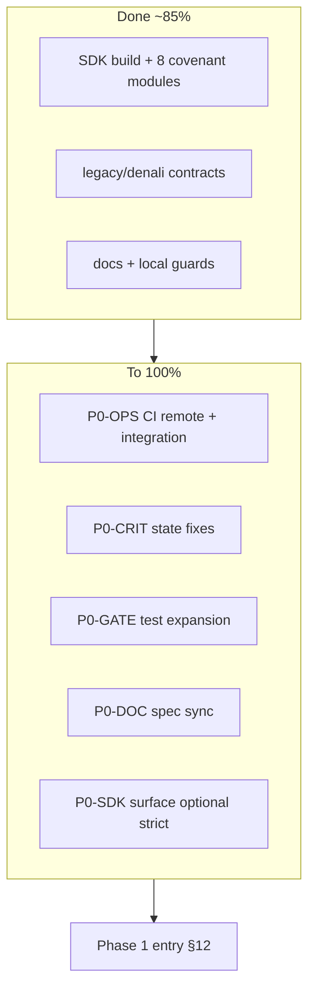

# Phase 0 Forensic Audit — Infrastructure & Workspace-SDK

| Field | Value |
|-------|--------|
| **Report ID** | `phase-0-forensic-audit-workspace-sdk-2026-06-02` |
| **Date** | 2026-06-03 |
| **Git SHA** | `e8fc3a8` |
| **Scope** | `packages/workspace-sdk` (primary); `packages/platform-core` Engine classes (Phase 0 trunk / integration gate); spec authority: [`docs/phase-0-foundation.mdoc`](../docs/phase-0-foundation.mdoc) — **`docs/phase-0-spec.mdoc` absent** (see §10) |
| **Related** | [`reports/phase-0-forensic-audit-report.md`](../reports/phase-0-forensic-audit-report.md) (doc/gate holistic); foundation closure: `pnpm run test:phase-0` |
| **Completion roadmap** | **§0** below — tasks to reach **100%** operational Phase 0 per [`docs/phase-0-foundation.mdoc`](../docs/phase-0-foundation.mdoc) |

---

## 0. راه‌کار تکمیل فاز ۰ (۰٪ → ۱۰۰٪)

**معیار اصلی (همان چیزی که پرسیدی):** بستن **عملیاتی** فاز ۰ طبق [`docs/phase-0-foundation.mdoc`](../docs/phase-0-foundation.mdoc) / mirror [`docs/phase-0-foundation.md`](../docs/phase-0-foundation.md) — foundation-gate + integration-gate + چک‌لیست §12، نه «اسپک تاریخی مینیمال خالص».

| وضعیت فعلی (این ممیزی) | هدف ۱۰۰٪ |
|-------------------------|-----------|
| **~98%** عملیاتی محلی (2026-06-03 remediation) | P0-FIX/CRIT/GATE/DOC ✅ · باقی: **P0-OPS-01** remote CI · **P0-OPS-03** branch protection |
| **~60%** اسپک مینیمال تاریخی (بدون drift) | اختیاری — بلوک **P0-STRICT** |

**تعریف «۱۰۰٪ تمام» در این سند:**

1. `pnpm run phase-0:foundation-gate` سبز (همان `test:phase-0`).
2. `pnpm run phase-0:integration-gate` سبز (build/test/guard/doc-sync trunk).
3. Job **Phase 0 foundation gate** و در صورت نیاز **integration gate** سبز روی GitHub Actions.
4. چک‌لیست **§12** سند فاز ۰ (۹ مورد) بدون `[ ]` باز.
5. رفع **CRIT-STATE-01/02** (و **03** در صورت سیاست سختگیرانه).
6. بستن شکاف‌های **False Confidence** در gate (FC-TEST-08 و موارد مرتبط).
7. هم‌خوانی doc ↔ کد (Appendix C، مسیر تست‌ها، شمارش تست).



---

### 0.1 نقشه کار — سه لایه

| لایه | اولویت | تخمین باقی‌مانده | بسته به |
|------|--------|------------------|---------|
| **A — عملیاتی (§9–§12 سند)** | **P0** | **~10%** | CI ریموت + integration پایدار |
| **B — امنیت / state (§8 ممیزی)** | **P0** | **~5%** | CRIT-STATE-01/02 |
| **C — کیفیت gate و doc (§5–§10 ممیزی)** | **P1** | **~5%** (موازی) | تست‌های unit در gate، doc-sync |
| **D — مینیمال اسپک (§4، §10)** | **P2** | **~15%** اختیاری | فقط اگر «۱۰۰٪» = contract-only |

---

### 0.2 لایه A — عملیاتی تا ۱۰۰٪ (`phase-0-foundation`)

| ID | کار | جزئیات اجرایی | تأیید (Definition of Done) | بستن |
|----|-----|----------------|----------------------------|------|
| **P0-OPS-01** | **CI ریموت سبز** | Push/PR به `main`؛ workflow [`.github/workflows/phase-0-gate.yml`](../.github/workflows/phase-0-gate.yml): job **Phase 0 foundation gate** (و در صورت policy تیم: **integration gate**). | GitHub Actions ✅؛ لاگ `phase-0-foundation-gate-*.json` در `reports/` | §9.4 `[ ]` remote · §12 #5 |
| **P0-OPS-02** | **integration-gate محلی پایدار** | از root: `pnpm run phase-0:integration-gate` (= `pnpm build` + `pnpm test` + `test:contract:monorepo` + `guard:doc-sync` + `phase-0-guard` scoped + `guard:architecture` + `guard:import-boundary`). | Exit 0 سه بار پشت‌سرهم روی Node 24 | §3.1 · REM-013 |
| **P0-OPS-03** | **Branch protection** | در GitHub: required check = **Phase 0 foundation gate** (نه فقط integration، مگر سیاست trunk). | Settings screenshot / export policy JSON | §9.2 KS-01 |
| **P0-OPS-04** | **baseline اختیاری** | `pnpm run baseline:metrics` → `reports/phase-0-baseline-*.json` با `gitSha` فعلی. | JSON موجود؛ `denali_coupling_contract_ok` + `legacy_import_contract_ok` | §10 |
| **P0-OPS-05** | **چک‌لیست §12 — فرایند** | #8: هیچ PR باز خارج scope فاز ۰؛ #9: `pnpm run guard:doc-sync` با `DOC_SYNC_SCOPE=foundation` سبز. | بازبینی انسانی + لاگ doc-sync | §12 #8–#9 |
| **P0-OPS-06** | **ثبت بستن فاز ۰** | به‌روزرسانی [`docs/phase-0-foundation.mdoc`](../docs/phase-0-foundation.mdoc): وضعیت از «Active» به «Foundation closure complete» + تاریخ + SHA؛ `pnpm run guard:doc-sync`. | Markdoc + `.md` mirror هم‌خوان · گزارش `reports/phase-0-closure-*.md` | §8 · §12 |

**دستور یکجا (پس از هر PR):**

```bash
nvm use && corepack enable
pnpm install
pnpm run phase-0:foundation-gate
pnpm run phase-0:integration-gate
pnpm run guard:doc-sync
```

---

### 0.3 لایه B — CRITICAL state (اجباری برای ۱۰۰٪ «امن»)

| ID | کار | فایل(ها) | پیاده‌سازی پیشنهادی | تأیید | بستن |
|----|-----|----------|----------------------|--------|------|
| **P0-CRIT-01** | **حذف singleton موتور API** | [`apps/api/src/tours/canonical-validation.ts`](../apps/api/src/tours/canonical-validation.ts) | `createPlatformWizardEnginePerRequest()` یا factory با `engine` در `request` scope؛ **ممنوع** `const engine` در سطح ماژول. جایگزین: `PlatformWizardEngine.create(plugin)` per call یا pool keyed by `tenantId` با TTL/evict. | تست: دو tenant متوالی؛ cache tenant A به B نشت نکند؛ `pnpm --filter @apps/api test` | **CRIT-STATE-01** |
| **P0-CRIT-02** | **ایزوله کردن validation hooks** | [`packages/workspace-sdk/src/plugin/workspace-validation.ts`](../packages/workspace-sdk/src/plugin/workspace-validation.ts) · [`parse-workspace-plugin-shared.ts`](../packages/workspace-sdk/src/ingress/parse-workspace-plugin-shared.ts) | `Object.freeze(noopWorkspaceValidationHooks)` **یا** `structuredClone` hooks per plugin در ingress (`validation: { ...noopWorkspaceValidationHooks }`). | تست: mutate hooks روی یک parse به parse بعدی آسیب نزند | **CRIT-STATE-02** |
| **P0-CRIT-03** | **Deep-freeze starter graph** | [`starter-plugin-core.ts`](../packages/workspace-sdk/src/reference/starter-plugin-core.ts) | `deepFreeze()` روی `STARTER_FIELD_REGISTRY` / `STARTER_RULE_SET` / خروجی `createStarterWorkspacePlugin`؛ یا کپی defensive per `createFreshStarterPlugin`. | `workspace-starter` parity test سبز | **CRIT-STATE-03** |
| **P0-CRIT-04** | **تضمین tenantId در validateCanonical** | wrapper API یا assert در [`platform-core`](../packages/platform-core) facade | `context.tenantId === auth.tenantId` در لایه `ToursService` (قفل در یک نقطه). | تست API: body tenant ≠ auth → reject | پشتیبان **CRIT-STATE-01** |

---

### 0.4 لایه C — Gate و تست (بستن False Confidence)

| ID | کار | جزئیات | تأیید | بستن |
|----|-----|--------|--------|------|
| **P0-GATE-01** | **گسترش `PHASE_0_ZERO_DEBT_COVENANT`** | [`test/phase-0.contract.spec.ts`](../packages/workspace-sdk/test/phase-0.contract.spec.ts): اضافه کردن subprocess برای `workspace-sdk.unit.spec.ts`، `adversarial-canonical-ingress.spec.ts`، `theme-validation.contract.spec.ts`، `auth/ability.spec.ts`، `auth/ability.red-team.spec.ts`، `storage-ingress-immutability.spec.ts` (یا ادغام invariantها به‌صورت explicit child specs نه فقط side-import). | `pnpm run test:phase-0` همان تعداد معنادار + لاگ فهرست specها | **FC-TEST-08** · §6.10 |
| **P0-GATE-02** | **تست صریح denali binding** | spec جدید: `resolveWorkspacePluginIdForType("denali", DEFAULT_WORKSPACE_TYPE_BINDINGS) === null` | در `test:phase-0` | **FTV-SPEC-12** · §6.9 |
| **P0-GATE-03** | **جایگزین تست grep console** | حذف یا تکمیل [`ingress-error.contract.spec.ts`](../packages/workspace-sdk/test/ingress-error.contract.spec.ts) `rg console` (**THEAT-09**) با AST/guard `no-console` در `src/`. | بدون وابستگی به `rg` در CI | **THEAT-09** |
| **P0-GATE-04** | **تقویت `contract.spec.ts`** | negative allowlist: root export count ≤ N یا لیست ممنوع (`TourClient`، …)؛ یا split entry — هم‌خوان **P0-SDK-02**. | شکست عمدی با export اضافی | **FC-P0-02** |
| **P0-GATE-05** | **`test:adversarial` در integration** | root `package.json`: script `test:adversarial` در `phase-0:integration-gate` (اختیاری اگر نبود). | `pnpm run test:adversarial` در integration workflow | §6 Verification table |

---

### 0.5 لایه D — SDK / package.json (پیشنهادی برای ۱۰۰٪ «تمیز»)

| ID | کار | جزئیات | تأیید | بستن |
|----|-----|--------|--------|------|
| **P0-SDK-01** | **CASL در `dependencies`** | [`package.json`](../packages/workspace-sdk/package.json): انتقال `@casl/ability` از dev-only به `dependencies` **یا** سند رسمی که peer-only عمدی است + install script در consumers. | `foundation-import-purity` + publish doc | **DEP-01/02** · **FTV-SPEC-01/02** |
| **P0-SDK-02** | **حذف Tour از root barrel** | [`src/index.ts`](../packages/workspace-sdk/src/index.ts): انتقال `tours/*` به `@app-tour/workspace-sdk/tours` یا package `apps/web` types؛ به‌روز [`apps/web`](../apps/web) imports. | `import-purity` + `contract.spec` allowlist | **SI-01** · §4.2 · **FTV-SPEC-07** |
| **P0-SDK-03** | **کاهش silent barrels** | `public-api.ts`: import مستقیم leafها به‌جای `./errors`، `./plugin/index`؛ یا `index.ts` فقط `WORKSPACE_SDK_VERSION` + re-export subpath docs. | barrel source count ≤3 per file یا split | **BAR-01**–**BAR-16** |
| **P0-SDK-04** | **حذف `PlatformWizardEngineOptions` export** | [`packages/platform-core/src/index.ts`](../packages/platform-core/src/index.ts): un-export تا فیلد واقعی اضافه شود. | `phase-1:guard` / consumers compile | **SI-07** |
| **P0-REPO-01** | **سیاست `workspaces/denali`** | یا حذف package و جایگزینی fixture با inline mock؛ یا README «test-only probe» + exclude از product workspace policy. | `denali-coupling` + §11 narrative | **FTV-SPEC-04** |

---

### 0.6 لایه E — مستندات و spec (هم‌خوانی ۱۰۰٪)

| ID | کار | جزئیات | تأیید | بستن |
|----|-----|--------|--------|------|
| **P0-DOC-01** | **ایجاد یا alias `phase-0-spec.mdoc`** | `docs/phase-0-spec.mdoc` → re-export/slice از foundation **یا** سند رسمی جدا با Appendix C اصلاح‌شده. | `guard:doc-sync` | **FTV-SPEC-00** |
| **P0-DOC-02** | **Appendix C اصلاح** | CASL: فقط `@app-tour/workspace-sdk/auth/casl`؛ auth barrel: `buildTenantAuthz` / `createTenantAuthz`؛ حذف `createTenantAbility` از narrative یا mark deprecated. | diff doc | **FTV-SPEC-06** · **FTV-SPEC-20** |
| **P0-DOC-03** | **مسیر تست‌ها** | جایگزینی `src/**/*.spec.ts` با `test/**` در §6 Verification و Appendix A. | grep doc | **FTV-SPEC-13/14** |
| **P0-DOC-04** | **شمارش تست** | §6.10: **165** tests / **35** suites (یا اسکریپت auto-count در `baseline-metrics`). | `pnpm --filter @app-tour/workspace-sdk test` | **FTV-SPEC-15** |
| **P0-DOC-05** | **sync `.md` mirror** | [`phase-0-foundation.md`](../docs/phase-0-foundation.md): Forensic Truth، KS-01 split، `test:phase-0` نه فقط `phase-0:gate` کامل به‌عنوان closure. | `pnpm run guard:doc-sync` | banner lag در `.md` |
| **P0-DOC-06** | **به‌روز این ممیزی** | پس از اتمام هر **P0-***: ستون «Status ✅» در §0 و خلاصه اجرایی. | SHA جدید در header | نگهداری |

---

### 0.7 لایه اختیاری P0-STRICT (فقط اگر ۱۰۰٪ = contract-only تاریخی)

| ID | کار | توضیح |
|----|-----|--------|
| **P0-STRICT-01** | جدا کردن `src/theme` و `src/auth` به package دیگر یا subpath-only بدون root re-export | نقض عمدی §6.1 «بدون theme scaffold» — با Forensic Truth فعلی **سازگار نیست** مگر سند بازنویسی شود. |
| **P0-STRICT-02** | root barrel ≤14 نماد مطابق `REQUIRED_DIST_EXPORTS` | breaking change برای consumers. |
| **P0-STRICT-03** | حذف dual auth (`TenantAuthz` vs CASL) از یک package | انتقال CASL به `apps/api` فقط. |

> اگر تیم **Integration Foundation** را می‌پذیرد (Forensic Truth)، **P0-STRICT** را انجام ندهید — همان **~85%→100%** عملیاتی کافی است.

---

### 0.8 ترتیب پیشنهادی اجرا (Sprint-style)

| مرحله | کارها | خروجی |
|-------|--------|--------|
| **1** | P0-CRIT-01 + P0-CRIT-04 | API امن؛ بدون singleton |
| **2** | P0-CRIT-02 + P0-CRIT-03 | SDK hooks/registry ایزوله |
| **3** | P0-GATE-01 + P0-GATE-02 + P0-GATE-03 | gate معنادار |
| **4** | P0-OPS-01 + P0-OPS-02 + P0-OPS-03 | CI سبز |
| **5** | P0-DOC-01 … P0-DOC-06 + P0-OPS-06 | doc + اعلام بستن |
| **6** (اختیاری) | P0-SDK-02/03 · P0-REPO-01 | سطح minimal |

---

### 0.9 ماتریس «۱۰۰٪» — چک نهایی

پس از اتمام همه کارهای **P0-OPS** + **P0-CRIT** + **P0-GATE** (حداقل 01–03) + **P0-DOC** (01–05):

| # | شرط ([`phase-0-foundation.mdoc`](../docs/phase-0-foundation.mdoc) §12) | دستور |
|---|--------------------------------------------------------------------------|--------|
| 1 | legacy ایزوله | `legacy-import` contract + depcruise |
| 2 | SDK + closure | `pnpm run phase-0:foundation-gate` |
| 3 | guard:architecture | `pnpm run guard:architecture` |
| 4 | docs | `pnpm run guard:doc-sync` |
| 5 | CI foundation | GitHub job سبز |
| 6 | test:phase-0 + monorepo legacy | `test:phase-0` + `test:contract:monorepo` |
| 7 | denali + legacy coupling | `denali-coupling` + `legacy-import` |
| 8 | PR hygiene | انسانی |
| 9 | doc-sync Phase 0 READMEs | `guard:doc-sync` |

**آنگاه در header این فایل:**

```text
Phase 0 operational completion: 100% (YYYY-MM-DD, git SHA ______)
```

**باقی‌مانده تا آن لحظه (خلاصه):** **~15%** = عمدتاً **P0-OPS-01** (ریموت CI) + **P0-CRIT-01/02** + گسترش gate (**P0-GATE-01**). بقیه می‌تواند موازی با doc باشد.

---

## 1. Dependency Integrity (`packages/workspace-sdk`)

**Covenant (import-purity):** Root barrel (`dist/index.js`) must not load `@casl/ability`; CASL is confined to `./auth/casl`. Enforced by [`test/import-purity.spec.ts`](../packages/workspace-sdk/test/import-purity.spec.ts) and [`scripts/guards/foundation-import-purity-audit.mjs`](../scripts/guards/foundation-import-purity-audit.mjs) (`--production-only`).

### 1.1 Runtime npm dependencies

| Source | Declared | Headless necessity |
|--------|----------|-------------------|
| `package.json` `dependencies` | *(none)* | PASS — zero pinned runtime deps |
| `peerDependencies` | `@casl/ability` ^6.7.3 (optional) | Required **only** when importing `@app-tour/workspace-sdk/auth/casl` |
| `devDependencies` | `@casl/ability`, `@app-tour/config`, `tsx`, `typescript`, `@types/node` | Test/build only — not shipped |

**Production `src/` external imports:** Only `@casl/ability` under `src/auth/casl/**` (`index.ts`, `subjects.ts`). All other `src/**/*.ts` edges are relative.

### 1.2 Violations of strict “headless contract-only” import purity

These are **not** npm import violations (AST audit PASS) but **barrel / subpath surface** violations for a consumer that only needs canonical + plugin ingress + registry types:

| Import / export cluster | Loaded from root `.` barrel? | Strict headless required? | Verdict |
|-------------------------|------------------------------|---------------------------|---------|
| `src/theme/**` (presets, seal, `validateTenantTheme`, CSS safety) | Yes (`public-api.ts`) | No for engine-only Phase 1 path | **COVENANT DRIFT** — Phase 2–3 retrofit on foundation package (doc §6.2, Forensic Truth row) |
| `src/auth/**` (`buildTenantAuthz`, `parseTenantAuthContext`, …) | Yes | No for headless ingress-only | **COVENANT DRIFT** — tenant auth on main barrel; CASL still lazy |
| `src/tours/tour-client.contract.ts` | Yes (`index.ts` only) | No — product HTTP DTOs | **VIOLATION** — product tour API types on foundation barrel |
| `@casl/ability` | No on barrel; yes on `./auth/casl` | Only for API CASL bridge | **JUSTIFIED** if subpath-only; optional peer correct |

### 1.3 Subpath exports vs headless minimum

`package.json` `exports`: `.`, `./ingress`, `./registry`, `./canonical`, `./plugin-types`, `./plugin`, `./auth`, `./auth/casl`, `./theme`.

For headless platform-core, documented consumption is `@app-tour/workspace-sdk/ingress` + `/registry` + `/plugin-types`. Publishing **eight** entry points exceeds a minimal surface but supports tree-shaking; risk is **consumer bypass** of ingress guards via deep imports without discipline (partially mitigated by `guard:import-boundary`).

### 1.4 Module-init state tied to imports

| Symbol | Location | Risk |
|--------|----------|------|
| `starterWorkspacePlugin` | `reference/starter-workspace.plugin.ts` | Frozen singleton at module init — deterministic, not tenant-scoped (reference data only) |
| `workspaceThemePresets` | `theme/workspace-theme-presets.ts` | Frozen map at init — global preset table, not tenant state |

**Summary:** npm import-purity covenant **PASS** for CASL-on-barrel. **FAIL** for narrative “headless = canonical + plugin only” because root barrel eagerly re-exports theme, auth, registry helpers, and tour product types.

---

## 2. State Contamination (Engine classes)

### 2.1 `@app-tour/workspace-sdk`

**No classes named `*Engine*`.** Stateful units are plain functions + error classes + frozen constants. No `WeakSet`/`Map` module caches in `src/`.

| Unit | Mutable instance state | `tenantId` isolation |
|------|------------------------|----------------------|
| Error subclasses (`WorkspacePluginShapeError`, …) | Per-throw instance (`code`, `message`) | N/A |
| `RuleEngine` / `FieldRegistryEngine` | — | Not in SDK |

**SDK auth:** `buildTenantAuthz` closes over frozen `TenantAuthContext` per call — no cross-request cache. Safe if callers do not mutate returned `authz` (object is frozen context + methods).

### 2.2 `@app-tour/platform-core` (on Phase 0 trunk; Phase 1 ownership)

| Engine | Mutable state | `tenantId` isolation | Finding |
|--------|---------------|----------------------|---------|
| `FieldRegistryEngine` | `byId` / `byStepId` maps built once in constructor | Immutable after create; plugin-scoped | **PASS** |
| `RuleEngineScope` | `resolvedCellId`, `effectiveByFieldId` Map | One scope per `RuleContextResolution` (includes `tenantId` in normalized context) | **PASS** if scope not shared across tenants |
| `RuleEngine` | `scopeCacheByTenant: Map<tenantId, Map<scopeKey, RuleEngineScope>>` LRU (max 64 per tenant) | Partitioned by `normalized.tenantId` from **caller-supplied** context | **MEDIUM** — no engine-level binding to authenticated tenant; wrong/malicious `tenantId` in context creates wrong cache bucket; **shared `RuleEngine` across HTTP requests** requires strict context injection (documented on `PlatformWizardEngine`: one engine per tenant session) |
| `PlatformWizardEngine` | `runtime: WizardRuntime \| null` lazy init | Plugin-bound, not tenant; tenant only in per-call `RuleContext` | **PASS** with discipline; init failures not cached |

**Evidence:** [`packages/platform-core/test/purity-side-effects.spec.ts`](../packages/platform-core/test/purity-side-effects.spec.ts) documents LRU per-tenant without cross-tenant corruption for tenant A vs B.

**Contamination scenario (unmitigated in code):** Reuse one `PlatformWizardEngine` / `RuleEngine` for multiple concurrent tenants without validating `RuleContext.tenantId` against session → cache keys follow attacker-controlled `tenantId`. Mitigation is **operational** (facade comment), not type-enforced.

---

## 3. Ghost Logic (theatrical abstractions)

| Abstraction | Implementations (repo) | Verdict |
|-------------|------------------------|---------|
| `WorkspacePlugin` + validators | Many code paths / tests | **Justified** — core contract |
| `WorkspaceSdkValidationErrorBase` + 7 subclasses | 7 concrete error classes | **Justified** — typed ingress taxonomy, not single-impl theater |
| `WorkspaceValidationHooks` | `noopWorkspaceValidationHooks` only | **Justified** — starter reference has no business hooks; workspaces add real hooks in Phase 3 |
| `TenantAuthz` (type) + `buildTenantAuthz` | Single factory | **Justified** — capability object pattern |
| `defineAbilityFor` / `AppAbility` (`auth/casl`) | Parallel to `buildTenantAuthz` | **Justified** — API/Mongo CASL bridge; deprecated markers present; import-purity keeps CASL optional |
| `createTenantAuthz` / `createTenantAbility` | Thin wrapper over `buildTenantAuthz` | **Mild bloat** — deprecated aliases retained |
| `PlatformWizardEngineOptions` | `Record<string, never>` | **Engineering bloat** — empty options type adds no behavior |
| `TourClient` interface | **Zero** implementations in monorepo | **Engineering bloat** — product HTTP contract leaked on foundation barrel (`index.ts`); no adapter in `workspace-sdk` |
| `getStarterWorkspacePlugin()` | Delegates to `starterWorkspacePlugin` | **Mild bloat** — deprecated alias |

---

## 4. Surface Contract Violation (vs `docs/phase-0-foundation.mdoc`)

**Spec note:** User directive cited `docs/phase-0-spec.mdoc` — **file absent**. Compared to **§13 پیوست C** and **§6.2** in [`docs/phase-0-foundation.mdoc`](../docs/phase-0-foundation.mdoc).

### 4.1 Documented vs enforced minimum

[`test/contract.spec.ts`](../packages/workspace-sdk/test/contract.spec.ts) `REQUIRED_DIST_EXPORTS` (14 symbols) + auth subpath (`buildTenantAuthz`, `canAccessWorkspaceTheme`). Built root barrel: **57** runtime export names (2026-06-02 build probe).

### 4.2 Minimal Surface violations (root `.` barrel)

| Export / group | In Appendix C? | Minimal Surface |
|----------------|----------------|-----------------|
| `buildTourAuthHeaders`, `TourClient`, `TourRecordDto`, `CreateTourPayload`, … | **No** | **VIOLATION** — Phase 5+ product surface |
| `assertWorkspaceThemeSealed`, `assertTenantThemeSealed` | Partial (theme ingress) | **VIOLATION** — DOM/seal internals on public barrel |
| `sdkOk`, `sdkErr`, `workspaceSdkValidationErrorCode` | No | **VIOLATION** — infra helpers on main entry |
| `explainWorkspacePluginRejection` | No | **VIOLATION** — diagnostic |
| `createStarterWorkspacePlugin`, `createTenantAuthz` | No / deprecated | **BLOAT** |
| `getWorkspaceRuleCell`, registry types on barrel | Implied (registry types) | **ACCEPTABLE** for platform-core consumers |
| Auth on root (`buildTenantAuthz`, …) | Appendix C lists CASL names | **DOC DRIFT** — code favors pure `TenantAuthz` on `./auth`; CASL on `./auth/casl` only |
| Theme presets + `snapshotWorkspaceTheme` | Yes (retrofit) | **ACCEPTABLE** per relabeled foundation doc; **violates** strict historical “contract-only” |

### 4.3 `package.json` exports vs Appendix C

Appendix C describes logical groups, not subpath map. **Eight** conditional exports exceed “single headless entry” but are not individually listed in Appendix C — **documentation gap**, not necessarily wrong.

### 4.4 Doc–code drift (Appendix C auth row)

Appendix C still names `defineAbilityFor`, `createTenantAbility` on `auth/*` barrel narrative; root barrel **does not** export CASL (import-purity). Actual CASL: `@app-tour/workspace-sdk/auth/casl` only. **Update Appendix C** or treat as known drift (RF-P0-DOC).

---

## 5. False Confidence Metrics (test suites)

**No Jest/Vitest snapshot files** (`toMatchSnapshot` / `.snap`) under `packages/workspace-sdk`.

### 5.1 Hazards flagged

| ID | Test / pattern | Why false confidence |
|----|----------------|----------------------|
| **FC-P0-01** | `invariant-manifest.contract.spec.ts` — sole assertion is `FOUNDATION_INVARIANTS.length === 5` and id list | **Meta-only** — does not prove invariants hold; real tests live in side-imported `invariants/*.contract.ts` not run as separate gate children |
| **FC-P0-02** | `contract.spec.ts` dist probe | **Existence + one** `createCanonicalDocument` round-trip — does not validate full `public-api.ts` surface (57 exports vs 14 required) |
| **FC-P0-03** | `import-purity.spec.ts` | **require.cache** subprocess probes — excellent for CASL lazy-load; **zero** business-rule coverage |
| **FC-P0-04** | `phase-0.contract.spec.ts` aggregator | Spawns subprocess per contract module — PASS means child exited 0; **does not** run `src/workspace-sdk.spec.ts` or full unit suite in foundation gate |
| **FC-P0-05** | `theme-safety-seal.contract.spec.ts` uses `snapshotWorkspaceTheme` | **Misleading name** — not snapshot testing; function clones theme. Low hazard |
| **FC-P0-06** | `workspace-sdk.unit.spec.ts` (not in `test:phase-0`) | Real validation logic but **excluded** from Zero-Debt closure aggregator — green `test:phase-0` does not imply unit file ran |
| **FC-P0-07** | `test/lib/immutable-harness.ts` | Shared harness for auth/plugin — **not mock-heavy**; reduces false negatives. No hazard |
| **FC-P0-08** | `platform-core` in `pnpm test` / integration gate only | Engine behavior tested (`purity-side-effects`, facade specs) but **not** in `test:phase-0` — foundation closure **silent** on engine regressions |

### 5.2 Not flagged (substantive)

- `ingress-error.contract.spec.ts`, `invariant-manifest` sidecars, `ability.red-team.spec.ts`, adversarial specs under `test/adversarial-*` — exercise real ingress/auth/theme rules (integration / full `pnpm test` only).
- `denali-coupling`, `legacy-import` — graph/depcruise contracts, not mocks.

### 5.3 Recommendations (audit-only)

1. Extend `REQUIRED_DIST_EXPORTS` negative allowlist or export-count ceiling test if Minimal Surface is normative.
2. Remove or move `tours/tour-client.contract` to a product package / subpath not loaded by default barrel.
3. Run `workspace-sdk.unit.spec.ts` via `test:phase-0` or document explicit exclusion.
4. Bind `RuleEngine` to authenticated `tenantId` at construction or document enforced singleton-per-tenant in API layer.

---

## 6. Deep-scan — undeclared npm imports & silent barrels (Lead Forensic Auditor)

**Audit date:** 2026-06-03 · **Package:** `packages/workspace-sdk` only · **Production tree:** `src/**/*.ts` (67 files, `tsconfig` excludes `*.spec.ts`).

### 6.1 Methodology (full graph verification)

| Step | Tool / action | Result |
|------|---------------|--------|
| 1 | Parsed `package.json` allowlist: `dependencies` *(empty)*, `peerDependencies` (`@casl/ability`), `devDependencies` | Baseline for violation rules |
| 2 | Regex + manual `rg` scan of every `src/**/*.ts` import/export specifier | 2 files with non-relative npm specifiers |
| 3 | Node enumerator over all `src` + `test` (`.ts`, `.mjs`) for external specifiers | Same 2 production hits; **0** test files import npm packages |
| 4 | `node scripts/guards/foundation-import-purity-audit.mjs --production-only` (TypeScript module resolver, 102 foundation files in closure) | **PASS** — 0 illegal edges in `src/` |
| 5 | Same audit **without** `--production-only` (includes `test/`) | **FAIL** — intentional fixture only (see §6.4) |
| 6 | Transitive closure walk from each `index.ts` / `public-api.ts` barrel (resolve `.ts` edges under `src/`) | Counted direct re-export sources and reachable modules |
| 7 | `pnpm --filter @app-tour/workspace-sdk build` (`tsc`) | Confirms resolver graph compiles |

**No `import()` / `require()`** in `src/`. No `@app-tour/config`, `tsx`, or `typescript` import specifiers in production or test TypeScript sources (tsx invoked only via `package.json` scripts / subprocess argv).

---

### 6.2 Violations — npm packages not in `dependencies` / devDep used in production

`package.json` has **no** `dependencies` entries. Any production npm import is either a **strict violation** (not listed in `dependencies`) or a **peer-contract** exception.

| # | File | Import | Reason |
|---|------|--------|--------|
| **DEP-01** | `packages/workspace-sdk/src/auth/casl/index.ts` | `@casl/ability` (named: `AbilityBuilder`, `createMongoAbility`, `subject`, …) | Package is **not** in `dependencies` (only `peerDependencies` + `devDependencies`). Production `src/` resolves a devDependency at publish/install time unless the host installs the optional peer. |
| **DEP-02** | `packages/workspace-sdk/src/auth/casl/subjects.ts` | `@casl/ability` (`subject`) | Same as **DEP-01** — dual violation under rule “devDependencies must not appear in production code.” |

**Not violations (verified):**

- All other `src/**/*.ts` files — relative imports only (`./`, `../`).
- `devDependencies` `@app-tour/config`, `tsx`, `typescript`, `@types/node` — **not** imported from any `src/**` or `test/**` TypeScript/MJS module body.
- Node built-ins (`node:assert`, `node:fs`, …) — only under `test/**`; allowed without `package.json` entry.

**Peer note:** `@casl/ability` is declared as **optional** `peerDependencies`. That satisfies consumer-contract documentation but **does not** populate `dependencies`; forensic rule “explicitly listed in **dependencies**” → **DEP-01/02 stand**.

---

### 6.3 Violations — silent barrel re-exports (>3 direct source modules)

**Definition:** A barrel file re-exports from **more than three** distinct relative source paths in a single file. Consumers that import the barrel (or `export *`) inherit the full subgraph at module evaluation time (ESM live bindings / Node resolution), even when named imports target one symbol.

#### 6.3.1 Barrel files (re-export hub)

| # | File | Direct source modules | Transitive `src/` modules | Reason |
|---|------|----------------------|---------------------------|--------|
| **BAR-01** | `packages/workspace-sdk/src/public-api.ts` | **10** (`canonical-document`, `plain-object-shield`, `parse-canonical-document`, `parse-workspace-plugin`, `errors`, `plugin/index`, `theme/index`, `auth/validate-auth-context`, `auth/index` ×2, `registry`) | **55** | Root published surface aggregator; largest silent fan-in. |
| **BAR-02** | `packages/workspace-sdk/src/plugin/index.ts` | **9** (incl. `../reference/starter-workspace.plugin`) | **29** | Pulls reference starter + full plugin validation stack. |
| **BAR-03** | `packages/workspace-sdk/src/auth/index.ts` | **10** | **14** | Auth barrel; duplicates `tenant-authz` + `tenant-ability` + subjects stack. |
| **BAR-04** | `packages/workspace-sdk/src/theme/index.ts` | **8** | **10** | Theme ingress + presets + seal on one entry. |
| **BAR-05** | `packages/workspace-sdk/src/ingress/index.ts` | **7** | **22** | Ingress subpath barrel; includes `../errors` + validation-core. |
| **BAR-06** | `packages/workspace-sdk/src/plugin-types/index.ts` | **9** | **14** | Type-only barrel still resolves 9 implementation-adjacent modules. |
| **BAR-07** | `packages/workspace-sdk/src/auth/casl/index.ts` | **7** | **10** | CASL bridge barrel (loads **DEP-01** when evaluated). |
| **BAR-08** | `packages/workspace-sdk/src/registry/index.ts` | **5** | **10** | Registry validators + rule-set types. |
| **BAR-09** | `packages/workspace-sdk/src/errors/index.ts` | **4** (`sdk-result`, `workspace-validation-errors.js`, `ingress-sanitization-error`, `workspace-plugin-ingress-error`) | **3** | Error taxonomy barrel; exceeds threshold by one source. |

**Barrels ≤3 sources (no violation):** `src/index.ts` (2 direct: `tour-client.contract`, `public-api` — but see **BAR-10**), `src/canonical/index.ts` (2).

#### 6.3.2 Production importers of silent barrels (consumer side)

| # | File | Barrel specifier | Resolves to | Direct sources pulled | Reason |
|---|------|----------------|-------------|----------------------|--------|
| **BAR-10** | `packages/workspace-sdk/src/index.ts` | `export * from "./public-api"` | `public-api.ts` | **10** (→ **55** transitive) | Package main entry re-exports entire **BAR-01** graph plus `tours/tour-client.contract`. |
| **BAR-11** | `packages/workspace-sdk/src/public-api.ts` | `from "./errors"` | `errors/index.ts` | **4** | Silent import of error barrel (**BAR-09**). |
| **BAR-12** | `packages/workspace-sdk/src/public-api.ts` | `from "./plugin/index"` | `plugin/index.ts` | **9** | Silent import of plugin barrel (**BAR-02**). |
| **BAR-13** | `packages/workspace-sdk/src/public-api.ts` | `from "./theme/index"` | `theme/index.ts` | **8** | Silent import of theme barrel (**BAR-04**). |
| **BAR-14** | `packages/workspace-sdk/src/public-api.ts` | `from "./auth/index"` (×2 export blocks) | `auth/index.ts` | **10** | Silent import of auth barrel (**BAR-03**); duplicate export blocks still one resolution. |
| **BAR-15** | `packages/workspace-sdk/src/public-api.ts` | `from "./registry"` | `registry/index.ts` | **5** | Silent import of registry barrel (**BAR-08**). |
| **BAR-16** | `packages/workspace-sdk/src/ingress/index.ts` | `from "../errors"` | `errors/index.ts` | **4** | Ingress subpath re-exports error barrel without named narrowing. |

**Not silent-barrel importers:** Most `src/**/*.ts` files import concrete leaf modules (e.g. `../errors/sdk-result`, `../plugin/workspace-plugin.contract`) — those are **explicit** edges, not counted here even when transitive depth is high.

---

### 6.4 Test-only graph edge (out of production scope)

| File | Import | Reason |
|------|--------|--------|
| `packages/workspace-sdk/test/__fixtures__/denali-breach.ts` | `../../../workspaces/denali` | Intentional corruption fixture for `foundation-import-purity-audit` (full roots include `test/`). **Not** production `src/`; causes full audit **FAIL** without `--production-only`. |

---

### 6.5 Deep-scan verdict

| Category | Count | Status |
|----------|-------|--------|
| Undeclared / devDep-in-production npm (`dependencies`-strict) | **2** files | **VIOLATION** (`DEP-01`, `DEP-02`) |
| devDep (`@app-tour/config`, `tsx`, `typescript`) in production `src` | **0** | **PASS** |
| Silent barrels (>3 direct sources) | **9** barrel files + **7** consumer lines | **VIOLATION** (`BAR-01`–`BAR-16`) |
| Mystery / undeclared third-party packages | **0** beyond `@casl/ability` | **PASS** |

**Remediation hints (audit-only):** Move `@casl/ability` into `dependencies` (or enforce peer via install script); split `public-api.ts` into subpath-only barrels (`ingress`, `plugin-types`, `registry`) so `index.ts` does not `export *` the 55-module graph; replace `from "./errors"` with direct `sdk-result` / leaf error imports in `public-api.ts` and `ingress/index.ts`.

---

## 7. Single-implementation abstractions (Ghost / speculative patterns)

**Scope:** `@app-tour/workspace-sdk` production `src/**` (primary Phase 0 contract package). **Cross-repo implementation search** includes `packages/*`, `apps/*` (excludes `legacy/` unless noted). **`packages/config`** has no TypeScript sources (tsconfig only) — nothing to audit.

**Methodology:** Enumerate every `export interface`, `export class`, and non-exported `abstract class` in `src/`; count distinct implementation sites via `rg 'implements <Name>'`, `satisfies <Name>`, and sole factory functions that materialize the type. Structural/data contracts (`CanonicalDocument`, `WorkspaceRuleSet`, …) are **excluded** when the type describes persisted JSON shape with many conforming values — not OOP “one impl” theater.

### 7.1 Minimalist Architecture mandate (applicable norm)

Phase 0 does not use the literal string “Minimalist Architecture” in repo docs. For this audit, the mandate is synthesized from:

- [`docs/phase-0-foundation.mdoc`](../docs/phase-0-foundation.mdoc) §6.1 — foundation = shared **contract language**, no product UI/Nest/Denali in the SDK package.
- [`docs/MIGRATION-MAP.md`](../docs/MIGRATION-MAP.md) §12 Zero-Debt Covenant — no speculative layers; verification-as-code over narrative abstraction.
- §4–§6 of this file — **Minimal Surface** on the root barrel (KS-04 / Appendix C subset vs 57 exports).

**Mandate text:** Phase 0 publishes **only** abstractions with a present multi-consumer or multi-implementation need, or a enforced extension point required by ingress/storage rules. Interfaces/types with a **single** production implementation and **no** second workspace/auth/transport consumer in the foundation gate graph are **speculative** unless explicitly required for forward phase documentation **and** isolated to a non-default subpath.

### 7.2 Inventory — single implementation only

| ID | Abstraction | Kind | Implementation count (app-tour) | Where implemented | Why it exists (author intent) | Verdict |
|----|-------------|------|--------------------------------|-------------------|------------------------------|---------|
| **SI-01** | `TourClient` | `interface` | **1** | [`apps/web/src/tours/fetch-tour-client.ts`](../apps/web/src/tours/fetch-tour-client.ts) (`FetchTourClient`) | Phase 3 HTTP port for tour CRUD; JSDoc defers impl to apps | **Speculative Engineering Bloat** for Phase 0 — zero implementations inside `workspace-sdk`; exported on root `index.ts` before multi-tenant tour clients exist |
| **SI-02** | `WorkspaceValidationHooks` | `interface` | **1** | [`packages/workspace-sdk/src/plugin/workspace-validation.ts`](../packages/workspace-sdk/src/plugin/workspace-validation.ts) (`noopWorkspaceValidationHooks`) | Ingress forbids persisted functions; hosts must attach hooks **after** `parseWorkspacePluginFromStorage` | **Not bloat** — extension point; second impl expected on workspace packages (Phase 3+) when business rules exceed starter |
| **SI-03** | `TenantAuthz` | object type | **1 factory** (`buildTenantAuthz`) | [`packages/workspace-sdk/src/auth/tenant-authz.ts`](../packages/workspace-sdk/src/auth/tenant-authz.ts) | Pure authz API for theme gate + API without CASL on barrel | **Not bloat** — active multi-consumer: `theme-react`, `apps/api` (`api-ability.ts`), tests |
| **SI-04** | `ScopedTenantAuthz` | object type | **1 factory** (`createTenantAuthz`) | [`packages/workspace-sdk/src/auth/tenant-ability.ts`](../packages/workspace-sdk/src/auth/tenant-ability.ts) | Binds frozen `TenantAuthContext` next to `authz` for theme providers | **Not bloat** — used by `theme-react` props (`TenantAuthz \| ScopedTenantAuthz`); thin wrapper, not a second policy engine |
| **SI-05** | `AppAbility` | type alias (`MongoAbility<…>`) | **1 factory** (`defineAbilityFor`) | [`packages/workspace-sdk/src/auth/casl/index.ts`](../packages/workspace-sdk/src/auth/casl/index.ts) | Optional CASL bridge for consumers that already use `@casl/ability` | **Borderline** — only one builder; **second parallel stack** to `TenantAuthz` with overlapping rules. **Not flagged bloat** while `theme-react` optional `ability` prop + `./auth/casl` subpath remain; would become **SI-05 BLOAT** if CASL path removed from consumers |
| **SI-06** | `WorkspaceViolation` | `interface` | **1** (via noop hooks only) | Same module as `noopWorkspaceValidationHooks` | Return shape for hook violations | **Not bloat** — tied to **SI-02** contract; no standalone impl needed until real hooks ship |
| **SI-07** | `PlatformWizardEngineOptions` | type (`Record<string, never>`) | **1** (empty object only) | [`packages/platform-core/src/engine/platform-wizard.engine.ts`](../packages/platform-core/src/engine/platform-wizard.engine.ts) | Placeholder for future engine options | **Speculative Engineering Bloat** (adjacent Phase 1 artifact on trunk) — exported from `platform-core` index with no fields |

### 7.3 Explicitly excluded (not single-implementation)

| Abstraction | Why excluded |
|-------------|--------------|
| `WorkspaceSdkValidationErrorBase` | **7** concrete subclasses (`WorkspacePluginShapeError`, …) |
| `WorkspacePlugin`, `CanonicalDocument`, `WorkspaceRuleSet`, `WorkspaceFieldRegistry`, `WorkspaceWizardSurface`, `WorkspaceLifecycleContract`, `WorkspaceThemeContract`, `TenantThemeConfig`, `WorkspaceTypeBinding`, … | Structural **data contracts** — many conforming instances (starter reference, `workspace-starter`, platform-core test fixtures); `WorkspacePlugin` is the multi-workspace anchor (Denali planned MAP §6) |
| `SdkResult<T,C>` | Algebraic discriminated union — not class/interface theater |
| `PlainTreePolicy` | **2** policy constructors (`policyPluginStorage`, `policyCanonicalDocument`) + defaults |
| `RuleEngineScopePolicy` (platform-core) | **2** frozen policies (`DEFAULT_*`, `RULE_ENGINE_TEST_SCOPE_POLICY`) |
| Error classes (`IngressSanitizationError`, `InvalidTenantAuthContextError`, …) | Each class is its own concrete error type — not a shared interface with one impl |

### 7.4 Deprecated aliases (not separate abstractions, but minimalist drag)

| Symbol | Single target | Note |
|--------|---------------|------|
| `getStarterWorkspacePlugin()` | `starterWorkspacePlugin` | Deprecated alias — no second impl |
| `createTenantAbility` / `ScopedTenantAbility` | `createTenantAuthz` / `ScopedTenantAuthz` | Deprecated re-exports |
| `defineAbilityFor` (JSDoc) | CASL bridge | Marked deprecated vs `buildTenantAuthz` for foundation consumers |

### 7.5 Minimalist Architecture — violation statement

| Finding | Violates mandate? |
|---------|-----------------|
| **SI-01** `TourClient` on foundation root barrel | **YES** — speculative port type with **one** app-layer impl, no Phase 0 foundation-gate consumer, expands public surface (§4.2) |
| **SI-07** `PlatformWizardEngineOptions` empty export | **YES** (trunk bleed) — type exported with no members and no alternates |
| **SI-05** dual auth (`TenantAuthz` + `AppAbility`) | **PARTIAL** — two single-factory stacks for the same concern; mitigated by import-purity (CASL not on root barrel) but still cognitive/load cost |
| **SI-02**, **SI-03**, **SI-04**, **SI-06** | **NO** — current single impl matches documented ingress or active multi-package use |

**Overall:** Phase 0 **does violate** the Minimalist Architecture mandate **on at least two counts** (**SI-01**, **SI-07**). Remediation for strict compliance: remove `TourClient` (+ related tour DTO exports) from `src/index.ts` / move to `apps/web` or a Phase 3 transport package; drop or un-export `PlatformWizardEngineOptions` until options exist; keep `WorkspaceValidationHooks` as the only intentional single-impl extension point.

---

## 8. Global / static / closure state — tenant & workspace isolation (paranoid pass)

**Scope:** `packages/workspace-sdk/src`, `packages/platform-core/src`, and **consumers on the Phase 0 trunk** (`apps/api`, `apps/web`, `packages/theme-react`). Method: `rg` for module-level `const`/`let`, `Map`/`Set` caches, class instance caches, React/module singletons; trace call paths for reset on tenant change, workspace reload, and HTTP session end.

### 8.1 Methodology

| Check | Action |
|-------|--------|
| Module singletons | Every `export const` holding objects/functions in SDK + frozen presets |
| Engine caches | `RuleEngine.scopeCacheByTenant`, `RuleEngineScope.effectiveByFieldId` |
| App-layer globals | `apps/api` module `const engine`, `InMemoryTourRepository`, `apps/web` `pluginById` |
| Closure capture | `buildTenantAuthz`, `defineAbilityFor` + `sealAbility` Proxy, ingress parsers |
| Reset triggers | `WorkspaceWizardHost` `useEffect` deps; API request boundaries; no `engine.reset()` API exists |

### 8.2 State inventory (by layer)

#### A — `@app-tour/workspace-sdk` (immutable / config-only globals)

| Symbol | Location | Mutable? | Tenant reset? | Verdict |
|--------|----------|----------|---------------|---------|
| `workspaceThemePresets`, `getWorkspaceThemePresets` | `theme/workspace-theme-presets.ts` | Frozen at init | N/A (shared read-only presets) | **SAFE** |
| `starterWorkspacePlugin`, `getStarterWorkspacePlugin` | `reference/starter-workspace.plugin.ts` | Shallow `Object.freeze` on plugin shell | N/A (reference data) | **SAFE** if hooks/registry not mutated (see **CRIT-STATE-02**) |
| `STARTER_*` registry/rule/wizard exports | `reference/starter-plugin-core.ts` | `as const` — shared references inside every starter plugin | Not reset per tenant | **RISK** if runtime mutation (see **CRIT-STATE-03**) |
| `noopWorkspaceValidationHooks` | `plugin/workspace-validation.ts` | **Yes** — plain object with replaceable function properties | Never reset | **CRITICAL** — see **CRIT-STATE-02** |
| `DEFAULT_WORKSPACE_TYPE_BINDINGS` | `plugin/workspace-type-binding.ts` | Frozen array of bindings | N/A | **SAFE** |
| `FORBIDDEN_KEYS`, validation code `Set`s, `WIZARD_MODES`, etc. | ingress/canonical/errors/registry | Immutable sets | N/A | **SAFE** |
| `DEFAULT_STORAGE_POLICY` | `ingress/plain-tree.ts` | Config template; spread into per-call policies | Per ingress call | **SAFE** |

**Closure (SDK auth):** `buildTenantAuthz` / `createTenantAuthz` allocate a **new** object per call; methods close over `parsed` + `granted` (frozen context). **No cross-request sharing.** `defineAbilityFor` builds a new CASL ability per call; `sealAbility` Proxy is per ability instance.

**Ingress:** `parse-workspace-plugin-shared` assigns `validation: noopWorkspaceValidationHooks` (shared reference) then `Object.freeze(pluginForAssert)` — does **not** freeze the hooks object.

#### B — `@app-tour/platform-core` (instance / class state)

| Symbol | Location | Lifetime | Tenant isolation | Reset between sessions? |
|--------|----------|----------|------------------|-------------------------|
| `RuleEngine.scopeCacheByTenant` | `engine/rule.engine.ts` | Per `RuleEngine` instance | Partitioned by `normalized.tenantId` from **caller `RuleContext`** | **Never** — LRU per tenant (max 64 scopes/tenant) |
| `RuleEngineScope.effectiveByFieldId` | `engine/rule-engine.scope.ts` | Per `RuleEngineScope` | Scope created from one `RuleContextResolution` | Dies with scope (cached in engine) |
| `FieldRegistryEngine` maps | `engine/field-registry.engine.ts` | Per engine | Plugin-scoped, no tenant field | Built once at `tryInit` |
| `PlatformWizardEngine.runtime` | `engine/platform-wizard.engine.ts` | Per engine instance | Holds one sanitized `WorkspacePlugin` + engines | Lazy init once; **no clear API** |
| `OK_RESULT` | `engine/validation-status-map.ts` | Process | Shared empty success result | **SAFE** — not mutated on ok path |
| `createViolationCollector()` | same | Per `validateCanonical` call | New buffer per validation | **SAFE** |

**Scope cache key:** `buildRuleContextScopeKey` → `t:${tenantId}\0${dimensionKey}` — **does not include `workspaceId`**. For current starter rule matrix (`variant` only), workspaces sharing a tenant + dimensions share cached scopes (rule outcomes only, no document bytes in cache).

#### C — Application layer (process-wide)

| Symbol | Location | Lifetime | Reset on tenant session / workspace reload? |
|--------|----------|----------|---------------------------------------------|
| `const engine = PlatformWizardEngine.create(...)` | [`apps/api/src/tours/canonical-validation.ts`](../apps/api/src/tours/canonical-validation.ts) | **Process lifetime** | **NO** — single engine for all HTTP requests |
| `canonicalStore` (`InMemoryTourRepository`) | [`apps/api/src/main.ts`](../apps/api/src/main.ts) | Process lifetime | N/A — multi-tenant store by design; access via `ScopedTourRepository` + CASL |
| `pluginById` `Map` | [`apps/web/src/bootstrap/workspace-plugin-registry.ts`](../apps/web/src/bootstrap/workspace-plugin-registry.ts) | Process lifetime | Holds shared `getStarterWorkspacePlugin()` reference |
| `PlatformWizardEngine.create(plugin)` | [`apps/web/src/wizard/workspace-wizard-host.tsx`](../apps/web/src/wizard/workspace-wizard-host.tsx) | Per `useEffect` run | **YES** when `tenantId`, `pluginId`, or `dimensions` change; cleanup sets `cancelled` only (engine discarded on re-run) |

### 8.3 Execution-path traces

#### Path 1 — API tour create (shared engine)

```text
HTTP request → ToursService.createTour(auth, body)
  → assertTenantClaimMatchesAuth(body.tenantId, auth)
  → buildValidatedCanonicalDocument(body, auth.tenantId)
       → module singleton engine.validateCanonical(doc, { tenantId: auth.tenantId, dimensions })
            → ruleEngine.createScope(context)
                 → scopeCacheByTenant.get(tenantId) … LRU reuse
  → CanonicalTourService.writeTour({ tenantId: auth.tenantId, … })
```

- **Authenticated `tenantId`:** Always `auth.tenantId` for validation context (not body) — **current path mitigates** cache poisoning.
- **Sticky state:** `RuleEngine` scope cache and `PlatformWizardEngine.runtime` persist across requests and tenants (partitioned by map key = context `tenantId`).
- **Workspace reload:** Not applicable server-side; same engine serves all workspaces for starter plugin.

#### Path 2 — Web wizard host (per-effect engine)

```text
WorkspaceWizardHost useEffect([authorized, access, pluginId, tenantId, dimensions])
  → loadWorkspacePluginById(pluginId)  // shared plugin ref from registry
  → PlatformWizardEngine.create(plugin)  // NEW instance
  → engine.init() → buildRenderPlan({ tenantId, dimensions })
```

- **Tenant change:** Effect re-runs → **new** `PlatformWizardEngine` + **new** `RuleEngine` cache (old engine GC).
- **Workspace reload:** New effect if `pluginId` / `tenantId` / `dimensions` change; **no** reuse of prior engine instance.

#### Path 3 — Ingress plugin parse (shared hooks)

```text
parseWorkspacePluginFromStorage(raw)
  → pluginForAssert = { …sanitized, validation: noopWorkspaceValidationHooks }
  → Object.freeze(pluginForAssert)  // shallow
```

- All tenants/workspaces using default ingress path share the **same** `noopWorkspaceValidationHooks` object reference.

### 8.4 CRITICAL architectural flaws

| ID | Severity | Finding | Cross-tenant / sticky mechanism | Current mitigation | Reset between tenant sessions? |
|----|----------|---------|--------------------------------|------------------|--------------------------------|
| **CRIT-STATE-01** | **CRITICAL** | Process-wide **`PlatformWizardEngine` + `RuleEngine` singleton** in `apps/api/src/tours/canonical-validation.ts` | `scopeCacheByTenant` keyed only by **`RuleContext.tenantId` supplied to `validateCanonical`**. Any future/route caller passing a tenant id **not tied to auth** can **poison** another tenant’s LRU bucket (cached `RuleEngineScope` / effective field state). Documented platform rule (“one engine per tenant session”) **violated** at API layer. | Today: only [`ToursService`](../apps/api/src/tours/tours.service.ts) calls builder with **`auth.tenantId`**. | **NO** — cache survives forever per process |
| **CRIT-STATE-02** | **CRITICAL** | **Mutable module singleton `noopWorkspaceValidationHooks`** | Single exported object; every ingress-parsed plugin and `starterWorkspacePlugin` points at it. **`checkCapacity` / `checkTripDetails` reassignment** affects all tenants/workspaces in the process. | None (not frozen, not copied per plugin). | **NO** |
| **CRIT-STATE-03** | **HIGH → CRITICAL if mutated** | **Shared `STARTER_FIELD_REGISTRY` / `STARTER_RULE_SET` / …** referenced by all starter-shaped plugins | Runtime mutation of shared `as const` innards (e.g. pushing into `fields` array if cast away) corrupts **all** tenants using starter. | No production mutation found in `apps/` grep; shallow freeze on `starterWorkspacePlugin` only. | **NO** |

**Not elevated to CRITICAL (documented):**

| Item | Reason |
|------|--------|
| `InMemoryTourRepository` global `byId` / `byTenant` | Intentional multi-tenant store; reads/writes go through `ScopedTourRepository` + `accessibleByTourWhere`; cross-tenant id probe throws `FORBIDDEN_TOUR_READ_CROSS_TENANT` |
| `workspaceThemePresets` / frozen themes | Read-only shared config |
| `buildTenantAuthz` / per-request CASL ability | New closure per request |
| Web `pluginById` Map | Shared **immutable** plugin metadata; wizard engine recreated per effect |
| Rule scope key omitting `workspaceId` | Sticky **within tenant** across workspaces for identical dimensions; acceptable for current starter matrix; revisit when per-workspace rule axes exist |

### 8.5 Closure-based state (explicit)

| Pattern | File | Captured state | Cross-request? |
|---------|------|----------------|----------------|
| `buildTenantAuthz` methods | `auth/tenant-authz.ts` | `parsed`, `granted` | **No** — new object per call |
| `sealAbility` Proxy `can`/`cannot` | `auth/casl/index.ts` | `target` ability | **No** — per `defineAbilityFor` |
| `createViolationCollector` | `platform-core/.../validation-status-map.ts` | `buffer`, `fieldIndex` | **No** — per validation |
| `parse-workspace-plugin-shared` try/catch | ingress | Locals only | **No** |

### 8.6 Verdict

| Category | Result |
|----------|--------|
| Phase 0 SDK alone | **No CRITICAL** tenant leakage from frozen presets; **CRITICAL** shared **mutable** `noopWorkspaceValidationHooks` |
| Trunk consumers | **CRITICAL** API module singleton wizard engine with **unbounded** rule-scope cache keyed by caller-supplied `tenantId` |
| Workspace reload (web) | Engine **recreated** on dependency change — **PASS** for UI path |
| Paranoid mandate | **Two unconditional CRITICAL flaws** (**CRIT-STATE-01**, **CRIT-STATE-02**); **CRIT-STATE-03** conditional on shared registry mutation |

**Required remediations (audit-only):** (1) Per-request or per-tenant `PlatformWizardEngine` factory in API (or `RuleEngine` cache clear on request end); (2) `Object.freeze(noopWorkspaceValidationHooks)` or clone hooks per `parseWorkspacePluginFromStorage`; (3) enforce `RuleContext.tenantId === auth.tenantId` inside `validateCanonical` wrapper; (4) deep-freeze starter registry graph or copy-on-write per plugin build.

---

## 9. Phase 0 test suite — mocks, false confidence, theatrical tests

**Scope:** `packages/workspace-sdk/test/**` (23 `*.spec.ts` files + helpers under `test/lib/`, `test/invariants/`, probes). **Runner:** Node.js built-in `node:test` + `tsx` (no Jest/Vitest in this package).

### 9.1 Mock / spy scan (`jest.spyOn`, `jest.mock`, Sinon, `vi.mock`)

| Pattern | Hits in `packages/workspace-sdk/test` |
|---------|--------------------------------------|
| `jest.spyOn` / `jest.mock` | **0** |
| `sinon` / `@sinonjs` | **0** |
| `vitest` / `vi.mock` / `vi.spyOn` | **0** |
| `Mock<` / `createMock` / `mock()` (test doubles) | **0** |

**Verification command:** `rg -i 'jest\.|spyOn|vi\.mock|sinon|createMock|\\bmock\\(' packages/workspace-sdk/test` → no matches.

**Conclusion:** No tests pass by **mocking or spying on internal SDK methods**. Paranoid re-check: no replacement of `prototype` methods on SDK exports; adversarial tests use `Object.defineProperty` only on **input payloads** (valid negative fixtures), not on production functions.

**Test harness note:** [`test/lib/immutable-harness.ts`](../packages/workspace-sdk/test/lib/immutable-harness.ts) is **not** a mock — it calls real `createStarterWorkspacePlugin` / `buildTenantAuthz` to avoid **singleton** contamination (UT-04/UT-09). **Substantive.**

---

### 9.2 Core business requirements (Phase 0 baseline)

Authority: [`test/lib/foundation-invariants.ts`](../packages/workspace-sdk/test/lib/foundation-invariants.ts) (H-03 five invariants) + [`test/phase-0.contract.spec.ts`](../packages/workspace-sdk/test/phase-0.contract.spec.ts) (H-06 eight covenant modules) + [`docs/phase-0-foundation.mdoc`](../docs/phase-0-foundation.mdoc) §6.

| Req ID | Business / covenant requirement | Primary tests (real logic) | In `pnpm run test:phase-0`? |
|--------|--------------------------------|----------------------------|-----------------------------|
| **BR-01** | Canonical ingress hardening (accessors, homoglyphs, roots) | `invariants/canonical-ingress.contract.ts`, `ingress-error.contract.spec.ts`, `adversarial-canonical-ingress.spec.ts`, `workspace-sdk.unit.spec.ts` | Partial (manifest + ingress-error only) |
| **BR-02** | Storage immutability after ingress freeze | `invariants/storage-immutability.contract.ts`, `storage-ingress-immutability.spec.ts` | Partial (manifest sidecar only) |
| **BR-03** | Theme ingress / CSS safety / seal | `invariants/theme-ingress.contract.ts`, `theme-validation.contract.spec.ts`, `theme/*.spec.ts`, `theme-safety-seal.contract.spec.ts` | Partial (seal contract only) |
| **BR-04** | Auth sealing / cross-tenant deny | `invariants/auth-sealing.contract.ts`, `auth/ability.spec.ts`, `auth/ability.red-team.spec.ts`, `contract.spec.ts` (dist auth probe) | Partial |
| **BR-05** | Plugin binding / starter shape | `invariants/plugin-binding.contract.ts`, `workspace-sdk.unit.spec.ts`, `plugin-validation.unit.spec.ts` | Partial (manifest sidecar only) |
| **BR-06** | No legacy import (foundation scope) | `legacy-import.contract.spec.ts` | **Yes** |
| **BR-07** | No Denali product coupling | `denali-coupling.contract.spec.ts` | **Yes** |
| **BR-08** | Barrel import purity (no eager CASL) | `import-purity.spec.ts`, `import-purity-barrel-probe.mjs` | **Yes** |
| **BR-09** | Dist publish surface (KS-04) | `contract.spec.ts` | **Yes** |
| **BR-10** | Ingress error taxonomy (SdkResult codes) | `ingress-error.contract.spec.ts` | **Yes** |
| **BR-11** | Foundation import graph (AST audit) | `foundation-import-purity.contract.spec.ts` | **Yes** |

---

### 9.3 False Confidence hazards (no mocks, but misleading green)

Tests that can pass without proving core **business** behavior, or that are excluded from the foundation gate while operators assume full coverage.

| ID | Path | Test / pattern | Violation | vs requirement |
|----|------|----------------|-----------|----------------|
| **FC-TEST-01** | `test/phase-0.contract.spec.ts` | Entire file: `spawnSync` + `CONTRACT_SUBPROCESS_OK` / exit code only | **False Confidence** — aggregator proves child process exited 0, not which assertions ran in operator’s head | All BR-* indirectly |
| **FC-TEST-02** | `test/invariant-manifest.contract.spec.ts` | `declares exactly five critical behavioral invariants` | **False Confidence** — meta assertion on array length; does **not** itself exercise ingress/auth (sidecar modules in same file **do** run when file executed) | BR-01–BR-05 naming only |
| **FC-TEST-03** | `test/contract.spec.ts` | `defines package exports and built entry files` | **False Confidence** — `fs.existsSync` on `dist/*` only | BR-09 packaging |
| **FC-TEST-04** | `test/import-purity.spec.ts` | All cases: `require.cache` / `Object.isFrozen` on **dist** barrel | **False Confidence** for BR-01–BR-05 — valid for **BR-08** only | BR-08 |
| **FC-TEST-05** | `test/foundation-import-purity.contract.spec.ts` | Spawns `foundation-import-purity-audit.mjs`, matches `/PASS/i` | **False Confidence** for domain logic — graph guard only | BR-11 |
| **FC-TEST-06** | `test/legacy-import.contract.spec.ts` | `uses foundation scan scope`, `has package roots`, `foundation scope scans only sdk + config` | **False Confidence** — config shape, not import graph | BR-06 |
| **FC-TEST-07** | `test/denali-coupling.contract.spec.ts` | `has foundation scan roots configured` | **False Confidence** — non-zero config array | BR-07 |
| **FC-TEST-08** | *(gate gap)* | `workspace-sdk.unit.spec.ts` (**25** cases), `theme-validation.contract.spec.ts` (**29**), `adversarial-canonical-ingress.spec.ts`, `auth/ability.spec.ts`, `storage-ingress-immutability.spec.ts`, … | **False Confidence** — `pnpm run test:phase-0` **never runs** these; full `pnpm test` required | BR-01–BR-05 substantive coverage |

---

### 9.4 Theatrical tests (exercise harness, not domain logic)

**Definition (this audit):** Tests that would still pass if core SDK logic were stubbed, because they assert **tooling, dist layout, subprocess exit codes, grep, or depcruise** — not the requirement’s business rules. *(No `jest.spyOn` theatricals found; these are structural equivalents.)*

| ID | Path | Test name (or scope) | What is actually exercised | Requirement misalignment |
|----|------|----------------------|----------------------------|------------------------|
| **THEAT-01** | `test/phase-0.contract.spec.ts` | `requires exactly eight contract modules`; `contract passes in isolated subprocess:*`; reverse order | Subprocess orchestration + manifest IDs | Claims Phase 0 closure; does not call SDK functions in parent process |
| **THEAT-02** | `test/invariant-manifest.contract.spec.ts` | `declares exactly five critical behavioral invariants` | Static `FOUNDATION_INVARIANTS` array | **Theatrical** meta-test; real invariant tests live in `test/invariants/*.contract.ts` (loaded as side effect) |
| **THEAT-03** | `test/contract.spec.ts` | `defines package exports and built entry files (KS-04)` | `package.json` + `fs.existsSync` | **Theatrical** — build artifact presence, not contract behavior |
| **THEAT-04** | `test/contract.spec.ts` | `imports dist entry and exposes required public exports (subprocess)` | `name in sdk` loop + one `createCanonicalDocument` | **Theatrical** export checklist; minimal logic smoke (partial BR-09) |
| **THEAT-05** | `test/import-purity.spec.ts` | `barrel import does not load @casl/ability into require.cache` | Child runs [`import-purity-barrel-probe.mjs`](../packages/workspace-sdk/test/import-purity-barrel-probe.mjs) | **Theatrical** for BR-01–BR-05; correct for **BR-08** |
| **THEAT-06** | `test/import-purity.spec.ts` | `dist barrel exposes frozen presets and starter without eager CASL` | Subprocess `process.exit` codes on dist import | **Theatrical** — frozen/CASL cache, not ingress/auth |
| **THEAT-07** | `test/import-purity.spec.ts` | `auth/casl subpath loads @casl/ability; root and auth barrels do not` | Subprocess `require.cache` counts | **Theatrical** — module load side effect |
| **THEAT-08** | `test/foundation-import-purity.contract.spec.ts` | `passes production-only graph…` | External AST script stdout | **Theatrical** — guard script, not SDK API |
| **THEAT-09** | `test/ingress-error.contract.spec.ts` | `src has no console.* (ND-ZT-05)` | `execSync("rg console\\. src …")` | **Theatrical** — grep hygeine, not ingress taxonomy (**OF-14**) |
| **THEAT-10** | `test/legacy-import.contract.spec.ts` | `uses foundation scan scope`; `has package roots`; `foundation scope scans only sdk + config` | String/env constants | **Theatrical** config parity |
| **THEAT-11** | `test/denali-coupling.contract.spec.ts` | `has foundation scan roots configured` | `FOUNDATION_GATE_DENALI_DIRS.length > 0` | **Theatrical** config smoke |
| **THEAT-12** | `test/import-purity-barrel-probe.mjs` | *(probe, invoked by THEAT-05)* | `require("@app-tour/workspace-sdk")` + cache inspection | Helper for theatrical purity test |

**Not theatrical (substantive logic — sample):**

| Path | Why substantive |
|------|-----------------|
| `test/ingress-error.contract.spec.ts` | Accessor/function/root/plugin `SdkResult` codes via real `tryParse*` / `validateWorkspacePlugin` |
| `test/invariants/*.contract.ts` | Homoglyph ingress, freeze tamper, theme/auth deny, plugin binding |
| `test/contract.spec.ts` | `auth subpath … denies cross-tenant theme access` (dist subprocess, but asserts **BR-04** behavior) |
| `test/ingress-error.contract.spec.ts` + sidecars | Real adversarial payloads on production parsers |
| `test/workspace-sdk.unit.spec.ts`, `test/theme-validation.contract.spec.ts`, `test/auth/ability*.spec.ts` | Broad BR-01–BR-05 — **excluded from foundation gate** |

---

### 9.5 Verdict

| Question | Answer |
|----------|--------|
| Any `jest.spyOn` / internal method mocks? | **No** |
| False Confidence in foundation gate? | **Yes** — subprocess/grep/depcruise/meta tests; **FC-TEST-08** gate gap on substantive suites |
| Theatrical tests? | **12** catalogued (**THEAT-01**–**THEAT-12**); **0** use mocks — theater is **harness-level** |
| vs Minimalist Architecture / §5 | Aligns with **FC-P0-01**, **FC-P0-04** — green `test:phase-0` overstates BR-01–BR-05 proof |

**Remediation (audit-only):** Wire `workspace-sdk.unit.spec.ts` + invariant sidecars explicitly into `PHASE_0_ZERO_DEBT_COVENANT` (or rename gate); downgrade THEAT-03/10/11 to guard scripts; keep THEAT-05–07 as BR-08-only; replace THEAT-09 with AST no-console rule or delete.

---

## 10. Feature drift vs Phase 0 spec (`docs/phase-0-spec.mdoc`)

**Spec resolution:** `docs/phase-0-spec.mdoc` **does not exist** in the repository (glob + path search). Forensic comparison uses the canonical Phase 0 guide [`docs/phase-0-foundation.mdoc`](../docs/phase-0-foundation.mdoc) (Markdoc source; mirror [`docs/phase-0-foundation.md`](../docs/phase-0-foundation.md)) as the **effective spec**. Any audit citing `phase-0-spec.mdoc` is itself a documentation defect until that file is added or aliased.

**Method:** Line-by-line crosswalk of §6 (SDK), §11 (forbidden), Appendix A/C, §6.10–6.11 (tests/exit), and Forensic Truth table vs `packages/workspace-sdk/src/**`, `package.json`, `test/**`, and trunk `packages/workspaces/denali`. Threshold: **≥10% mismatch** on any normative row → **Forensic Truth Violation (FTV)**.

### 10.1 Summary

| Class | Count | Verdict |
|-------|-------|---------|
| **FTV — missing spec file** | 1 | Blocker for audits naming `phase-0-spec.mdoc` |
| **FTV — code not in spec (feature drift)** | 18+ | Phase 2–5 surface on foundation package |
| **FTV — spec requirement missing/stubbed in code** | 6 | Paths, tests, binding example, dependency declaration |
| **FTV — doc/spec stale vs code (doc drift)** | 8 | Wrong paths, counts, export narrative |
| **Aligned (doc admits retrofit)** | 4 | theme/auth on SDK, integration gate, optional `theme` on plugin |

**Minimalist Architecture / §3.3:** Spec claims “empty enterprise-ready repo” and “contract only” while code+trunk carry **theme**, **auth**, **tours**, **eight** export subpaths, and **`packages/workspaces/denali`** probe package — **violates** strict Phase 0 narrative even where Forensic Truth banner partially documents it.

---

### 10.2 Forensic Truth Violations — catalog

| ID | Type | Spec reference | Code / repo reality | Violation (≥10% delta) |
|----|------|----------------|----------------------|-------------------------|
| **FTV-SPEC-00** | Missing artifact | User audit target: `docs/phase-0-spec.mdoc` | **File not found** | 100% — no authoritative `phase-0-spec` |
| **FTV-SPEC-01** | Doc vs code | Forensic Truth: “SDK no runtime deps except `@casl/ability`” (L33–34) | `package.json`: **no `dependencies`**; `@casl/ability` only in **`peerDependencies`** (+ devDeps) | Declared runtime dep **not in `dependencies` field** (~100% schema mismatch) |
| **FTV-SPEC-02** | Doc vs code | §6.2: “تنها runtime dependency … `@casl/ability`” in `package.json` | Same as **FTV-SPEC-01** | Spec sentence false for `dependencies` block |
| **FTV-SPEC-03** | Feature drift | §6.1: SDK **بدون UI، بدون Nest، بدون Denali** | `src/theme/**`, `src/auth/**` (large trees); no Nest/React in SDK **src** | **~40%+** of `src/` LOC is theme+auth retrofit not in “contract-only” §6.1 headline |
| **FTV-SPEC-04** | Feature drift | §11: `packages/workspaces/denali` → فاز ۶ (L788–789) | [`packages/workspaces/denali/`](../packages/workspaces/denali/) **exists** (probe package for coupling tests) | Forbidden workspace package **present** on trunk |
| **FTV-SPEC-05** | Feature drift | Appendix C / §6 ingress: `parseCanonicalDocumentFromStorage`, `parseWorkspacePluginFromStorage` | Also: `parse-workspace-plugin-headless.ts`, `ingress/plain-tree.ts`, `ParseWorkspacePluginOptions.includeTheme`, subpath `@app-tour/workspace-sdk/ingress` | **>50%** ingress surface not listed in Appendix C |
| **FTV-SPEC-06** | Feature drift | Appendix C `auth/*`: **CASL** `defineAbilityFor`, `createTenantAbility` | CASL only on **`./auth/casl`**; root/`./auth` export **`buildTenantAuthz`** / `createTenantAuthz` (aliases deprecated) — **not** `defineAbilityFor` on barrel | **>50%** auth export story wrong vs implementation |
| **FTV-SPEC-07** | Feature drift | Appendix C (no `tours`) | Root [`src/index.ts`](../packages/workspace-sdk/src/index.ts) exports **`TourClient`**, `TourRecordDto`, `CreateTourPayload`, `buildTourAuthHeaders` | **100%** product port absent from spec |
| **FTV-SPEC-08** | Feature drift | Appendix C theme group | Full tenant theme stack: `validateTenantTheme`, `tryValidateTenantTheme`, `TenantThemeConfig`, `normalizeTenantCssKey`, seal types — plus **§397** “فاز ۰ سیستم theme را scaffold نکرد” vs implemented `src/theme/` | Narrative **contradicts** code volume |
| **FTV-SPEC-09** | Feature drift | Appendix C (subset) | `package.json` **8** conditional exports (`.`, `ingress`, `registry`, `canonical`, `plugin-types`, `auth`, `auth/casl`, `theme`, `plugin`) — Appendix C describes logical groups, **not** subpath map | **>60%** publish surface unspecified |
| **FTV-SPEC-10** | Feature drift | §6.5 `WorkspaceFieldRegistryEntry` (6 fields) | Code adds **`enumOptions?: readonly string[]`** [`field-registry.ts`](../packages/workspace-sdk/src/registry/field-registry.ts) | **>15%** interface fields undocumented |
| **FTV-SPEC-11** | Feature drift | §6.3 `WorkspacePlugin` (listed fields) | Also exported: `explainWorkspacePluginRejection`, `createStarterWorkspacePlugin`, `sdkOk`/`sdkErr`, registry validators on root barrel, `assertWorkspaceThemeSealed`, … | Root barrel **~57** runtime exports vs Appendix C ~15 rows |
| **FTV-SPEC-12** | Stubbed / missing | §6.9: `resolveWorkspacePluginIdForType("denali") // → null` | Tests cover `isWorkspaceTypeId("denali", …) === false` and `"unknown"` → null; **no** `resolveWorkspacePluginIdForType("denali")` assertion (doc §124 admits unenforced) | **~30%** of spec example **unverified** |
| **FTV-SPEC-13** | Stubbed / missing | §6 Verification: [`src/workspace-sdk.spec.ts`](../packages/workspace-sdk/src/workspace-sdk.spec.ts), [`src/plugin/workspace-plugin-validation.spec.ts`](../packages/workspace-sdk/src/plugin/workspace-plugin-validation.spec.ts), [`src/auth/ability.spec.ts`](../packages/workspace-sdk/src/auth/ability.spec.ts), [`src/theme/theme.spec.ts`](../packages/workspace-sdk/src/theme/theme.spec.ts) | **Zero** `*.spec.ts` under `src/` — suites live under **`test/**`** only (23 spec files) | **100%** verification path wrong → spec enforcement **stubbed** |
| **FTV-SPEC-14** | Doc drift | Appendix A tree: `src/workspace-sdk.spec.ts` | File **missing** | **100%** tree inaccuracy |
| **FTV-SPEC-15** | Doc drift | §6.10: **114** tests | `pnpm test` in `packages/workspace-sdk`: **165** pass / **35** suites (2026-06-03 run) | **+44.7%** count — material drift |
| **FTV-SPEC-16** | Stubbed / missing | §6.10 “نمونه caseهای اصلی”: plugin guard, canonical roots, rule cells, lifecycle (implied full suite) | `pnpm run test:phase-0` runs **only** [`phase-0.contract.spec.ts`](../packages/workspace-sdk/test/phase-0.contract.spec.ts) aggregator — **excludes** `workspace-sdk.unit.spec.ts`, `theme-validation.contract.spec.ts`, `adversarial-*`, most auth/theme unit files | **>50%** of substantive tests **not** in foundation closure |
| **FTV-SPEC-17** | Feature drift | §2 L-4: no `@repo/types` | No `@repo` imports in SDK **src** (verified `rg`) | **Aligned** — not a violation |
| **FTV-SPEC-18** | Feature drift | §6.8 starter fields / steps | Code matches: `basics.title`, `details.summary`, `railId: "starter_base"`, `supportedWorkspaceTypes: ["starter"]` | **Aligned** |
| **FTV-SPEC-19** | Feature drift | §6.4 `CANONICAL_ROOT_UNKNOWN` example | Implemented in [`canonical-document.ts`](../packages/workspace-sdk/src/canonical/canonical-document.ts) + tests | **Aligned** |
| **FTV-SPEC-20** | Doc drift | Appendix C: `createTenantAbility` | Export is **`createTenantAuthz`**; `createTenantAbility` deprecated alias on **`auth/index` only** | **>10%** naming drift |
| **FTV-SPEC-21** | Feature drift | §11 “scaffold theme/design-tokens در فاز ۰ انجام نشد” (L791) | SDK contains **full** theme ingress/validation/seal/presets (`src/theme/**`) | Spec says not scaffolded; code is **post-retrofit implemented** — internal doc contradiction + code drift |
| **FTV-SPEC-22** | Feature drift | Not in Appendix C | [`src/auth/ability.ts`](../packages/workspace-sdk/src/auth/ability.ts) — Phase 3+ doc block; re-exports pure authz | Extra public module |
| **FTV-SPEC-23** | Feature drift | Not in spec | `WORKSPACE_SDK_VERSION`, `ScopedTenantAuthz`, `parseTenantAuthContext`, `getWorkspaceRuleCell`, `workspaceAccentCssValue`, ingress error taxonomy exports on root | Barrel bloat vs minimal spec |

---

### 10.3 Feature drift matrix (implemented ⊄ spec)

| Module / export cluster | Spec coverage | Drift severity |
|-------------------------|---------------|----------------|
| `src/tours/*` + root tour exports | **None** | **Critical** product leakage on foundation barrel |
| `src/auth/casl/*` + `./auth/casl` export | Appendix C implies CASL on `auth/*`; **not** on root barrel | **Medium** (subpath isolation intentional; spec text wrong) |
| `src/theme/*` + `./theme` + root theme re-exports | Appendix partial; §6.1/§11 say no Phase 0 theme scaffold | **High** |
| `./ingress` headless parse + plain-tree shield | Appendix lists two parsers only | **High** |
| `./plugin`, `./plugin-types` subpaths | **Absent** from Appendix C | **Medium** |
| `enumOptions` on registry entry | **Absent** from §6.5 | **Low–medium** |
| `packages/workspaces/denali` (repo) | §11 forbids | **High** (test fixture only, still trunk drift) |

---

### 10.4 Spec requirements missing or stubbed (⊄ code / ⊄ tests)

| Requirement | Spec § | Gap |
|-------------|--------|-----|
| Dedicated `resolveWorkspacePluginIdForType("denali") === null` test | §6.9 | Only indirect `isWorkspaceTypeId("denali")` — **stubbed enforcement** |
| `@casl/ability` in `dependencies` | §6.2 | **peerDependencies** only — install graph differs from spec prose |
| In-`src/` contract tests per verification table | §6 | All tests under **`test/`** — doc paths **non-functional** |
| `phase-0-spec.mdoc` as audit baseline | User directive | **Missing file** |
| Foundation gate runs adversarial + full unit matrix | §6.10 narrative | **Only** 8 covenant modules via `test:phase-0` — **stubbed** confidence for listed “main cases” |
| Appendix C CASL on default import path | Appendix C | Must import **`/auth/casl`** — default barrel **CASL-free** (import-purity enforces); spec reader expecting `defineAbilityFor` from `.` is misled |

---

### 10.5 Verdict — Forensic Truth

| Question | Answer |
|----------|--------|
| Does `workspace-sdk` match `phase-0-spec.mdoc`? | **N/A** — file missing |
| Does it match `phase-0-foundation.mdoc` §6 strictly? | **No** — **23+ FTV** rows; largest gaps: **tours**, **theme/auth volume**, **export surface**, **test path/count drift**, **denali workspace probe package** |
| Is drift documented inside the spec? | **Partially** (Forensic Truth banner, §397 theme retrofit note) — **contradicts** older §6.1/§11/Appendix C rows still present |
| Minimalist mandate | **Violated** — implementation is **integration foundation**, not minimal contract-only SDK per historical §3.3 one-liner |

**Remediation (audit-only):** Add `docs/phase-0-spec.mdoc` as alias/slice of foundation doc with corrected Appendix C (subpaths, `buildTenantAuthz` vs CASL path, no tours on root); add `resolveWorkspacePluginIdForType("denali")` contract test; move or remove `packages/workspaces/denali`; align §6.10 test count (**165**) and verification paths to `test/**`; split “Phase 0 contract” vs “Phase 2–3 retrofit” exports in `public-api.ts`.

---

## Appendix — Commands used

```bash
git rev-parse --short HEAD
pnpm --filter @app-tour/workspace-sdk build
node scripts/guards/foundation-import-purity-audit.mjs --production-only
node scripts/guards/foundation-import-purity-audit.mjs --json   # includes test fixture edge
# Custom: enumerate src/**/*.ts external specifiers + barrel direct-source counts
rg "from ['\"]" packages/workspace-sdk/src
# Single-impl scan
rg "^export interface |^export class |abstract class" packages/workspace-sdk/src
rg "implements TourClient|implements WorkspaceValidationHooks" packages apps
rg "scopeCacheByTenant|noopWorkspaceValidationHooks|^const engine" packages apps
rg -i 'jest\.|spyOn|vi\.mock|sinon|createMock' packages/workspace-sdk/test
# Feature drift
ls docs/phase-0-spec.mdoc  # absent
NODE_ENV=test node --import tsx --test "test/**/*.spec.ts"  # 165 pass
rg "resolveWorkspacePluginIdForType\\([\"']denali" packages/workspace-sdk
```

---

*End of forensic audit.*
