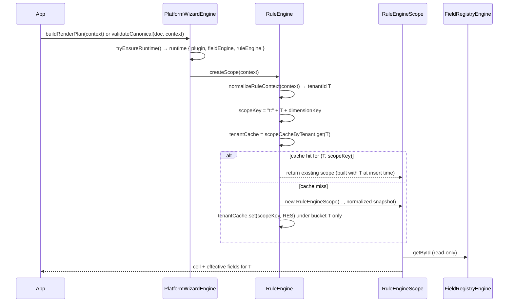
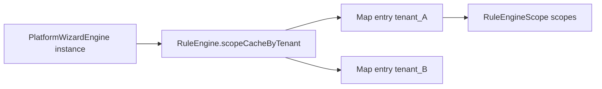

# Phase 1 Forensic Audit — Platform Core (Paranoid Security Scan)

| Field | Value |
|-------|--------|
| **Report ID** | `phase-1-forensic-audit-platform-core-2026-06-03` |
| **Date** | 2026-06-03 |
| **Git SHA** | `ac12e3f` (verified locally) |
| **Scope** | `packages/platform-core/**` (src, test, config, README, package.json; `dist/` absent at scan time) |
| **North Star (Phase 1)** | Platform logic = generic · **no imports from `packages/workspaces/*` or product workspace packages** · headless (no React) · no Denali product coupling in production `src/` |
| **Authority** | [`docs/phase-1-platform-core.ai-exec.md`](../docs/phase-1-platform-core.ai-exec.md) · [`dependency-cruiser.config.js`](../dependency-cruiser.config.js) · [`scripts/guards/phase-1-guard.mjs`](../scripts/guards/phase-1-guard.mjs) |

---

## Executive summary

| Verdict | Count |
|---------|-------|
| **Security Infiltration** (North Star violation — production `src/`) | **0** |
| **Informational** (allowed `workspace-sdk` contract imports) | **47** `src/` import lines from `@app-tour/workspace-sdk/*` subpaths only |
| **CI parity** | `pnpm run phase-1:guard` → **PASS** (all 14 checks including `g3`, `g4`, `g5`, `g6`) |

**Conclusion:** Under a comment-inclusive, case-insensitive deep scan, **no** `denali`, **no** `react` / `react-dom`, and **no** `@app-tour/workspace-*` package other than **`@app-tour/workspace-sdk`** appear anywhere under `packages/platform-core/`. No line qualifies as Security Infiltration; nothing observed bypassed CI — gates and depcruise align with the scan.

---

## 1. Methodology (paranoid)

| Step | Command / action |
|------|------------------|
| Denali (all paths) | `rg -i denali packages/platform-core` |
| React (all paths) | `rg -i '\breact\b\|react-dom\|preact\|vue\|jsx' packages/platform-core` |
| Workspace product packages | `rg '@app-tour/workspace-' \| rg -v workspace-sdk` · `rg 'packages/workspaces'` · `rg '\.\./.*workspaces'` |
| Production `src/` imports | Enumerate all `from "..."` in `src/` |
| Starter product paths in `src/` | `rg 'starter-workspace\|reference/starter\|getStarterWorkspacePlugin\|createStarterWorkspacePlugin' src/` |
| SDK barrel in `src/` | `rg 'from "@app-tour/workspace-sdk"' src/` (forbidden barrel) |
| Graph | `pnpm run guard:architecture` (depcruise) |
| Gate snapshot | `pnpm run phase-1:guard` |

**Note:** `dist/` was not present at scan time; CI runs `pnpm build` before gate. A post-build scan of `dist/` should be repeated in release audits if artifacts are shipped.

---

## 2. Deep-scan results

### 2.1 `denali` (case-insensitive, including comments)

| Location | Matches |
|----------|---------|
| Entire `packages/platform-core/` | **0** |

**Security Infiltration:** none.

### 2.2 `react` / UI runtime (including comments)

| Pattern | Matches |
|---------|---------|
| `react`, `react-dom`, `from "react"`, `preact`, `vue`, `jsx` | **0** |

**Security Infiltration:** none.

### 2.3 `@app-tour/workspaces/*` and `packages/workspaces`

| Pattern | Matches in `platform-core/` |
|---------|----------------------------|
| `@app-tour/workspace-starter`, `@app-tour/workspace-denali`, etc. | **0** |
| `packages/workspaces/…` path strings | **0** |
| Relative `../workspaces` | **0** |

**Security Infiltration:** none.

### 2.4 Allowed contract surface — `@app-tour/workspace-sdk` (not infiltration)

Production `src/` imports **only** these SDK subpaths (no root barrel):

| Subpath | Role |
|---------|------|
| `@app-tour/workspace-sdk/ingress` | Canonical + plugin ingress |
| `@app-tour/workspace-sdk/plugin-types` | Types (`WorkspacePlugin`, wizard surface, field kinds) |
| `@app-tour/workspace-sdk/registry` | Rule cells / field registry types |
| `@app-tour/workspace-sdk/canonical` | `readOwnDataProperty` and composite helpers |

This satisfies Phase 1 **platform-core-only-sdk** (depcruise) and **phase-1.contract** (subpath-only, no `@app-tour/workspace-sdk` barrel in `src/`).

**Test-only** (not North Star violations for product workspaces):

- `test/fixtures/starter.fixture.ts` imports `createStarterWorkspacePlugin` from `@app-tour/workspace-sdk/plugin` and `workspaceThemePresets` from `@app-tour/workspace-sdk/theme` — **SDK reference factory**, not `packages/workspaces/starter`.
- `test/phase-1.contract.spec.ts` explicitly asserts `platform-core-no-workspace-starter-plugin` on production `src/`.

---

## 3. Security Infiltration register

> **Definition:** Any production `src/` dependency or import that reaches `packages/workspaces/*`, Denali product modules, React/DOM, or bypasses depcruise via dynamic import from forbidden roots.

| ID | Finding | Severity | CI bypass? |
|----|---------|----------|------------|
| — | *No rows* | — | — |

---

## 4. How CI would (and did) catch violations — and blind spots

### 4.1 Controls that **did** run (PASS @ `ac12e3f`)

| Guard | What it enforces | Scan overlap |
|-------|------------------|--------------|
| **g3_no_denali_tokens** | `rg -i denali` under `platform-core`, **excludes `*.spec.ts`** | Matches §2.1 for non-spec; spec would be blind spot |
| **g4_no_react_imports** | `rg` for `react`, `react-dom`, `from "react"` on **entire** package | Matches §2.2 |
| **g5_depcruise_architecture** | `platform-core-no-workspaces`, `platform-core-only-sdk`, `platform-core-no-workspace-starter-plugin` (src, not spec) | Catches graph edges to `packages/workspaces` and `reference/starter-workspace` |
| **g6_import_boundary** | AST scan (dynamic import patterns) | Catches some non-static imports in tests |
| **phase-1.contract.spec.ts** | No barrel SDK in `src/`; no `getStarterWorkspacePlugin()` in tests; depcruise starter-plugin rule on `src/` | Complements grep |

### 4.2 Theoretical bypass paths (none exploited today)

| Bypass scenario | Why it did not fire | Hardening |
|-----------------|---------------------|-----------|
| Denali string **only** in `*.spec.ts` or `*.md` | g3 excludes specs | Extend g3 to `test/**` or run separate `rg -i denali test/` in gate |
| React mentioned in **non-`.ts`** file (e.g. `package.json` description typo) | g4 searches all files under package root — would catch substring `react` in description (`workspace-agnostic` safe) | Word-boundary rg for g4 to reduce false positives |
| **Dynamic** `import("packages/workspaces/starter")` | depcruise + import-boundary; not seen in tree | Keep adversarial specs (`g10`) |
| Coupling via **type-only** path in comment without import | Not executable — out of scope for runtime infiltration | Optional: lint for forbidden strings in `src/` comments |
| Violation only in **`dist/`** after tsc transform | dist not scanned in this audit; build output could theoretically embed strings | Post-build `rg` on `dist/` in release pipeline |

**No observed case** used these bypasses; therefore **no “how it bypassed CI”** narrative applies to current `main`.

---

## 5. North Star interpretation (precision)

| Phrase | Meaning in repo | Status |
|--------|-----------------|--------|
| “ZERO workspace imports” | **No** `packages/workspaces/*` product implementations | **PASS** (depcruise + zero path strings) |
| `@app-tour/workspace-sdk` | **Required** contract layer (Phase 0) | **PASS** (subpaths only in `src/`) |
| “workspace-agnostic” (package.json description) | Marketing text; not a dependency | **PASS** |

Importing types named `Workspace*` from **workspace-sdk** is **not** a workspace product import and is **not** flagged as infiltration.

---

## 6. Verification commands (reproduce)

```bash
nvm use 24
export PATH="$(dirname "$(nvm which 24)"):$PATH"
cd /path/to/docs

# Paranoid grep (should print nothing)
rg -i denali packages/platform-core
rg -i 'react-dom|from ["'\'']react' packages/platform-core
rg '@app-tour/workspace-' packages/platform-core | rg -v workspace-sdk || true
rg 'packages/workspaces' packages/platform-core || true

# Gates
pnpm run guard:architecture
pnpm run phase-1:guard
```

---

## 7. Related artifacts

| Artifact | Path |
|----------|------|
| Phase 1 guard JSON | [`reports/phase-1-guard-2026-06-03.json`](../reports/phase-1-guard-2026-06-03.json) |
| Phase 1 contract aggregator | [`packages/platform-core/test/phase-1.contract.spec.ts`](../packages/platform-core/test/phase-1.contract.spec.ts) |
| Doc integrity | [`docs/audits/phase-1-documentation-integrity-2026-06-03.mdoc`](../docs/audits/phase-1-documentation-integrity-2026-06-03.mdoc) |
| Phase 0 cross-package state | [`audits/phase-0-forensic-audit.md`](phase-0-forensic-audit.md) §8 |

---

## 8. Sign-off

| Role | Result |
|------|--------|
| Paranoid deep-scan (denali / react / workspaces product) | **CLEAN** |
| Security Infiltration count | **0** |
| Recommended human follow-up | MAP §14.1 architect sign-off ([`reports/phase-1-closure-readiness-2026-06-03.md`](../reports/phase-1-closure-readiness-2026-06-03.md)) — **not** a code infiltration issue |

---

*Append-only section for future scans — add dated subsections below.*

### Scan log — 2026-06-03 (initial)

- Operator: automated paranoid pass (Cursor agent).
- Tree: `packages/platform-core` @ `ac12e3f`.
- Outcome: **0** Security Infiltration; report created (file did not exist prior).

---

## 9. Phase-1 closure contract vs `src/engine/` unit-test coverage (2026-06-03)

### 9.1 Methodology

| Input | Path |
|-------|------|
| Closure manifest | [`packages/platform-core/test/phase-1.contract.spec.ts`](../packages/platform-core/test/phase-1.contract.spec.ts) — `PHASE_1_CLOSURE_CONTRACTS` (14 rows) |
| Engine implementation | [`packages/platform-core/src/engine/`](../packages/platform-core/src/engine/) (14 modules) |
| Field validation contract | [`packages/platform-core/src/contracts/canonical-field-validation-contract.ts`](../packages/platform-core/src/contracts/canonical-field-validation-contract.ts) |
| “Concrete unit test” | `node:test` `it()` that asserts **runtime outcomes** (return values, thrown codes, plan shape) — **not** source regex, `fs.existsSync`, or depcruise-only checks |
| Cross-reference | All `*.spec.ts` under `packages/platform-core/test/` |

**Note:** Most rows in `phase-1.contract.spec.ts` are **structural/guard** tests. Several manifest `specRel` paths point at **other** spec files; coverage below separates **manifest enforcement** from **behavioral** coverage.

#### 9.1.1 Repo test file map (names aligned to tree — 2026-06-04)

| Subsystem | Spec path (actual) | Removed / renamed |
|-----------|-------------------|-------------------|
| Step ordering / visibility | [`test/unit/engine/render-plan.steps.spec.ts`](../packages/platform-core/test/unit/engine/render-plan.steps.spec.ts) | ~~`step.engine.spec.ts`~~ · ~~`StepEngine` class~~ |
| Render plan | [`test/unit/engine/render-plan.spec.ts`](../packages/platform-core/test/unit/engine/render-plan.spec.ts) | — |
| Facade / bootstrap | [`test/unit/engine/platform-wizard.engine.spec.ts`](../packages/platform-core/test/unit/engine/platform-wizard.engine.spec.ts) | — |
| Rule resolution | [`test/unit/engine/rule-resolution.spec.ts`](../packages/platform-core/test/unit/engine/rule-resolution.spec.ts) | — |
| Rule engine | [`test/unit/engine/rule.engine.spec.ts`](../packages/platform-core/test/unit/engine/rule.engine.spec.ts) · [`rule.engine.force-cell.spec.ts`](../packages/platform-core/test/unit/engine/rule.engine.force-cell.spec.ts) | — |
| Hidden field gate (BL-01) | [`test/unit/contracts/hidden-field-kind-gate.spec.ts`](../packages/platform-core/test/unit/contracts/hidden-field-kind-gate.spec.ts) | — |
| Closure / adversarial | [`test/phase-1.contract.spec.ts`](../packages/platform-core/test/phase-1.contract.spec.ts) · [`test/facade-integration.spec.ts`](../packages/platform-core/test/facade-integration.spec.ts) · [`test/adversarial-*.spec.ts`](../packages/platform-core/test/) · [`test/runtime-isolation.spec.ts`](../packages/platform-core/test/runtime-isolation.spec.ts) · [`test/validate-canonical-mutation.spec.ts`](../packages/platform-core/test/validate-canonical-mutation.spec.ts) | — |

**Production `src/engine/` (no `step.engine.ts`):** `render-plan.steps.ts` · `render-plan.ts` · `platform-wizard.engine.ts` · `rule.engine.ts` · `rule-resolution.ts` · `validate-canonical-document.ts` · `validate-canonical-field.ts`.

---

### 9.2 `PHASE_1_CLOSURE_CONTRACTS` — behavioral coverage matrix

| ID | Stated requirement | Enforced in `phase-1.contract.spec.ts` | Concrete unit / integration test |
|----|------------------|----------------------------------------|----------------------------------|
| `import-purity` | Entry import does not load CASL / SDK theme-auth | Structural (`FORBIDDEN_PRODUCTION_IMPORTS` walk on `src/`) | **Yes** — `test/import-purity-probe.mjs` subprocess in contract `it` |
| `no-starter-plugin` | Production `src/` must not import starter workspace plugin | **Structural** — depcruise subprocess only | **No** dedicated runtime test (graph rule only) |
| `no-spec-under-src` | Specs live under `test/` | **Structural** — `fs` walk | **N/A** (layout invariant) |
| `headless-plugin-ingress` | `includeTheme: false` at create | **Structural** — regex on `platform-wizard.engine.ts` | **Yes** — [`test/adversarial-plugin-ingress.spec.ts`](../packages/platform-core/test/adversarial-plugin-ingress.spec.ts) (runtime init + theme skip) |
| `sdk-subpath-imports` | Subpath-only SDK imports | **Structural** — grep `test/` + `src/` | **No** per-import runtime test |
| `no-fromPlugin-api` | No `fromPlugin` in production `src/` | **Structural** — grep | **N/A** (absence invariant) |
| `no-test-policy-export` | `index.ts` omits test policy types | **Structural** — read `index.ts` | **N/A** (export surface) |
| `starter-fixture-location` | Fixture only under `test/fixtures/` | **Structural** — `fs.existsSync` | **N/A** (layout) |
| `dist-import-purity` | Built `dist/index.js` import purity | **Structural** — probe subprocess (needs build) | Same probe as `import-purity` |
| `field-validation-contract` | Module exists; mentions poison helpers | **Structural** + **partial behavioral** | `hiddenFieldPoisonViolation` via engine specs; **`passesHiddenFieldKindGate`** wired + `hidden-field-kind-gate.spec.ts` (BL-01 closed) |
| `adversarial-plugin-ingress` | Headless init skips invalid theme | Contract only checks **file exists** (`facade-integration` gate duplicate) | **Yes** — `adversarial-plugin-ingress.spec.ts` |
| `single-facade-export` | `package.json` exports only `.` | **Structural** — JSON keys | **N/A** |
| `facade-integration-gate` | Public facade API gated | Contract only **`fs.existsSync`** on `facade-integration.spec.ts` | **Yes** — [`test/facade-integration.spec.ts`](../packages/platform-core/test/facade-integration.spec.ts) (5 runtime `it`s) |
| `fresh-starter-fixture` | Per-call factory, no singleton | **Structural** — regex on fixture source | **Indirect** — all tests use `createTestStarterPlugin()`; no `it` named for alias |

**Summary:** Of 14 manifest rows, **6** are layout/export/graph-only with no meaningful runtime assertion. Of the remainder, **5** have dedicated behavioral specs elsewhere; **1** (`fresh-starter-fixture`) is structural-only (factory alias + indirect use). **`field-validation-contract`** — BL-01 closed: `passesHiddenFieldKindGate` wired + `hidden-field-kind-gate.spec.ts` + contract assertion on `validate-canonical-field.ts`.

---

### 9.3 Engine & validation-contract requirements **without** a concrete unit test

Grouped by subsystem. Items marked **integration-only** are covered only via `PlatformWizardEngine.validateCanonical` / `buildRenderPlan`, not a focused `it` on the helper.

#### 9.3.1 `canonical-field-validation-contract.ts` (contract table)

| Requirement ID | Rule (from contract table / exports) | Engine wiring | Unit-test gap |
|----------------|--------------------------------------|---------------|---------------|
| `hidden-non-composite-poison` | Hidden + non-composite + `value !== undefined` → `HIDDEN_FIELD_POISON` | Used in `validate-canonical-field.ts` via `hiddenFieldPoisonViolation` | **Covered** — `platform-wizard.engine.spec.ts` (enum + generic value) |
| `visible-kind-strict` | Visible value → `assertCanonicalValueMatchesKind` | `validate-canonical-field.ts` | **Covered** — facade + `canonical-value.spec.ts` (text/enum/composite); **gaps:** `date`, `boolean` kinds never asserted through **engine** `validateCanonical` |
| `passesHiddenFieldKindGate` | Documented mirror of scalar non-emptiness | **Wired** in `validate-canonical-field.ts` L47–51; unit table in `hidden-field-kind-gate.spec.ts` | **Resolved** (BL-01, 2026-06-04 P0) |
| Hidden **composite** + value allowed (no poison) | Table row: poison does not apply | `hiddenFieldPoisonViolation` returns `null` for `kind === "composite"` | **No test** proving hidden composite object **passes** poison gate and skips scalar kind check when value present |
| `CANONICAL_FIELD_VALIDATION_CONTRACT` array | Documentation table | N/A | **No test** asserts table rows stay in sync with code |

#### 9.3.2 `validate-canonical-document.ts` / facade paths

| Behavior | Implementation | Unit-test gap |
|----------|----------------|---------------|
| `inactiveFieldGroups` → **skip** field validation (`continue`) | `validate-canonical-document.ts:48–52` | **No test** — render hides inactive groups ([`render-plan.steps.spec.ts`](../packages/platform-core/test/unit/engine/render-plan.steps.spec.ts)); **validation never asserted** to ignore bad data under inactive group |
| `validateCanonical` before `tryInit` | `validationResultFromPlatformError(ready.error)` | **No test** — cold-start covers lazy init for `buildRenderPlan`, not `validateCanonical` error mapping |
| `tryBuildRenderPlan` / init failure `PlatformResult` | `platform-wizard.engine.ts:138–141` | **No test** — only `buildRenderPlan` throw path via tenant isolation |
| Ingress failure inside `validateCanonicalDocument` | `mapCanonicalIngressFailure` + `parseCanonicalDocumentFromStorage` | **No engine-level test** — storage freeze tested in `runtime-isolation.spec.ts` on SDK parser only |
| Violation dedupe by `fieldId` | `validation-status-map.ts` `fieldIndex` | **No test** — second violation for same field silently dropped |

#### 9.3.3 Rule engine (`rule.engine.ts`, `rule-engine.scope.ts`, `rule-resolution.ts`, `rule-cell-index.ts`)

| Behavior | Unit-test gap |
|----------|---------------|
| `cellMatchesDimensions` NFC normalization | **Indirect** only — tenant NFC scope-key test; no direct dimension mismatch matrix on exported function |
| `pickBestMatchingCell` — `tieCount > 1` → `AMBIGUOUS_RULE_RESOLUTION` | **Covered** — `rule.engine.spec.ts` |
| `pickBestMatchingCell` — `count === 0` → `INVALID_RULE_SET` | **No direct test** (unreachable via `RuleEngineScope` today: empty matches → `RULE_CONTEXT_UNMATCHED` first) |
| `pickBestMatchingCell` — `count > MAX_RULE_CELL_INDEX_SIZE` | **No test** |
| `isEmptyRuleDimensions` | **Removed** — no export in `rule-resolution.ts` (BL-02 / G-03 closed) |
| `defaultCellId` | Validated at `RuleEngine.tryCreate` | **No runtime fallback** when `findMatches` is empty — uses catch-all cells or `RULE_CONTEXT_UNMATCHED`; ai-exec wording “none → defaultCellId” is **not** auto-resolution (documented nuance, not a stub) |
| Bootstrap: multiple `dimensions:{}` without distinct priority | Enforced in **workspace-sdk** `validate-rule-set.ts`, not engine | **Covered** — `platform-wizard.engine.spec.ts` via `tryFromPlugin` (SDK throw), not `RuleCellIndex` |
| `forceCellId` | Bypasses `pickBestMatchingCell` when test policy allows | **Covered** — `rule.engine.force-cell.spec.ts`; production policy denies (not a lie) |
| `resolveEffectiveField` — `hidden: override?.hidden ?? false` | **Partial** — hidden exclude tests; **no test** for “override omits `hidden` → visible” on a base-hidden registry field (if such registry existed) |
| Scope cache LRU / side effects | **Covered** — `purity-side-effects.spec.ts`, concurrency specs |

#### 9.3.4 Render plan (`render-plan.ts`, `field-visibility.ts`, `render-plan.steps.ts`)

| Behavior | Unit-test gap |
|----------|---------------|
| `includeWorkspaceStepUiHints: true` + `wizardCapacityStepRedundant` | **Covered** — `render-plan.spec.ts` |
| Plan rows always `hidden: false` | Intentional (hidden fields omitted) | **No test** documenting consumer must not treat `hidden` on rows as visibility source |
| `getStepVisibility` / empty root step | **Covered** — `render-plan.steps.spec.ts` |

#### 9.3.5 Explicitly deferred (not engine gaps)

| Requirement | Phase 1 reality |
|-------------|-----------------|
| `plugin.validation` hooks at platform runtime | **Not invoked** — per ai-exec § deferred to phase 3; not a stub in `src/engine/` |

---

### 9.4 Behavioral Lies register

> **Definition (this audit):** Production or contract-surface code that **implies** RuleEngine / validation behavior but **does not execute** the real path, returns a **hardcoded** outcome instead of computed state, or exports an API **never wired** into the engine.

| ID | Severity | Location | Finding | Evidence |
|----|----------|----------|---------|----------|
| **BL-01** | ~~Medium~~ **Closed** | `canonical-field-validation-contract.ts` → `passesHiddenFieldKindGate` | **Resolved** — `validate-canonical-field.ts` calls gate for hidden non-composite poison; `hidden-field-kind-gate.spec.ts` + `phase-1.contract` wiring assertion | `validate-canonical-field.ts` L47–51 imports from contract |
| **BL-02** | ~~Low~~ **Closed** | `rule-resolution.ts` → `isEmptyRuleDimensions` | **Removed** — dead export deleted; no call sites required (G-03) | `rg isEmptyRuleDimensions` → 0 |
| **BL-03** | **Low** | `validation-status-map.ts` → `OK_RESULT` | **Shared singleton success object** — `finalize()` returns frozen `{ ok: true, violations: [] }` without per-call clone. Not a RuleEngine bypass (violations still recorded on failure path), but **mutable-array hazard** if any consumer ever mutates `violations` on success | `const OK_RESULT` reused at `finalize()` when `size === 0`; no immutability test |
| **BL-04** | **Info** | `render-plan.ts` → `toRenderFieldPlan` | **`hidden: false` hardcoded** on every emitted row while hidden fields are **omitted** from the plan | By design per file comment; misleading only if UI treats row `hidden` as authority — **not** skipping RuleEngine |

**Not classified as Behavioral Lies (verified):**

- **No** `fromPlugin`, Denali, React, or workspace-product imports in `src/engine/`.
- **No** `mock` / `stub` / fake RuleEngine in `src/engine/` — `buildRenderPlan` and `validateCanonicalDocument` always `ruleEngine.createScope(context)` then real `RuleEngineScope.resolveEffectiveField` / `resolveCellId`.
- **`forceCellId`** — real cell resolution under test policy; production `DEFAULT_RULE_ENGINE_SCOPE_POLICY` denies bypass ([`rule.engine.force-cell.spec.ts`](../packages/platform-core/test/unit/engine/rule.engine.force-cell.spec.ts)).
- **`sanitizePluginAtCreate`** — runs `parseWorkspacePluginFromStorage(..., { includeTheme: false })`, not a no-op.
- **Ambiguous catch-all `INVALID_RULE_SET`** at `tryFromPlugin` — thrown by **workspace-sdk** rule-set validation, not a hardcoded platform stub.

---

### 9.5 Recommended test additions (closure gaps only)

| Priority | Test target |
|----------|-------------|
| ~~P1~~ | ~~`passesHiddenFieldKindGate` wire~~ — **done** (BL-01 closed 2026-06-04) |
| P1 | `inactiveFieldGroups` — invalid value under inactive group does **not** produce violations |
| P2 | Hidden **composite** with benign object value — no `HIDDEN_FIELD_POISON` |
| P2 | `validateCanonical` on uninitialized engine → `validationResultFromPlatformError` shape |
| P2 | `date` / `boolean` kinds through `validateCanonical` facade |
| P3 | `createViolationCollector` dedupe-by-`fieldId` behavior |
| ~~P3~~ | ~~`isEmptyRuleDimensions`~~ removed (G-03); optional `pickBestMatchingCell` pool-limit test if reachable |

---

## 10. Sign-off — contract vs engine pass (2026-06-03)

| Role | Result |
|------|--------|
| Contract manifest vs concrete unit tests | **14** rows; **6** structural-only; **2** under-tested (`field-validation-contract`, `fresh-starter-fixture`) |
| Engine requirements without unit test | **§9.3** — **15+** distinct gaps (validation skip, facade error paths, kinds, helpers) |
| Behavioral Lies in `src/engine/` | **0** RuleEngine stubs; **2** open rows (**BL-03**–**BL-04**); **BL-01** · **BL-02** closed |
| RuleEngine execution on hot path | **Verified real** for render + validate |

---

### Scan log — 2026-06-03 (contract vs engine)

- Operator: contract/engine gap analysis (Cursor agent).
- Inputs: `phase-1.contract.spec.ts`, `src/engine/**`, full `packages/platform-core/test/**` grep.
- Outcome: §9–§10 appended; no Security Infiltration change from §1–8.

---

## 11. Architectural Theater — `render-plan.steps.ts` & `platform-wizard.engine.ts` (2026-06-03)

### 11.1 Authority & scope

| Source | Requirement relevant to these files |
|--------|-------------------------------------|
| [`docs/phase-1-platform-core.ai-exec.md`](../docs/phase-1-platform-core.ai-exec.md) §4.4 | Subphase **1.4**: plain functions `listStepIds`, `getStepVisibility`, `listActiveSteps` — **forbidden** `StepEngine` class |
| Same doc §4.5–4.6 | `buildRenderPlan` in `render-plan.ts`; **1.6** `PlatformWizardEngine` facade with lazy/eager bootstrap, `PlatformResult` + `ValidationResult` error layers |
| Same doc §3.3–3.5 | Facade session state, bootstrap chain, consumer imports facade only |

**Files examined:** [`render-plan.steps.ts`](../packages/platform-core/src/engine/render-plan.steps.ts) (82 LOC), [`platform-wizard.engine.ts`](../packages/platform-core/src/engine/platform-wizard.engine.ts) (220 LOC).

**Definition (this section):** *Architectural Theater* — structure (extra passes, partition buffers, ceremonial types/API layers) that **does not trace to a Phase 1 doc requirement** and could be replaced with a shorter equivalent without changing observable behavior.

---

### 11.2 `render-plan.steps.ts` — complexity inventory

| Artifact | Kind | Doc mandate? | Cyclomatic / loop notes |
|----------|------|--------------|-------------------------|
| `listStepIds` | plain function | **Yes** — union `stepId` + `wizard.roots` ordering (§4.4 `ordering_logic`) | **3 sequential loops** + `Map` + `rooted`/`orphan` arrays + `.sort()` (~CC 8) |
| `getStepVisibility` | plain function | **Yes** — `active \| hidden \| empty` (§4.4 `visibility_semantics`) | 1 loop, 3 branches (~CC 4); delegates `inactiveFieldGroups` to `isFieldEffectivelyHidden` (**required** §4.4) |
| `listActiveSteps` | plain function | **Yes** — filter to active steps | `.filter` → **nested work**: per step calls `getStepVisibility` → full field scan (**O(steps × fields)**); not forbidden by doc |
| Classes / helpers | — | **None allowed** beyond plain functions | **0 classes** — compliant |

**Doc vs code (visibility):** ai-exec lists `empty: "visible but zero non-hidden fields"` (internally inconsistent wording). Implementation and tests use **`empty` = step has zero registry fields** ([`render-plan.steps.spec.ts`](../packages/platform-core/test/unit/engine/render-plan.steps.spec.ts) “wizard.roots step with no fields → empty”). That is **not** theater — it is a **doc typo**; code matches tests.

---

### 11.3 `platform-wizard.engine.ts` — complexity inventory

| Artifact | Kind | Doc mandate? | Branching / structure |
|----------|------|--------------|------------------------|
| `PlatformWizardEngine` | **required class** | **Yes** — §4.6 facade (forbidden `fromPlugin`; allowed `create` / `tryFromPlugin` / instance API) | Not optional “professional” layering |
| `WizardRuntime` | private type alias | **Yes** — bundles plugin + engines after bootstrap (§4.6 `bootstrap_validation_chain`) | Not a helper class |
| `sanitizePluginAtCreate` | plain function | **Yes** — step_1 `parseWorkspacePluginFromStorage(..., { includeTheme: false })` | try/catch + ingress map |
| `tryInit` / `init` | methods | **Yes** — lazy init, idempotent, non-sticky failures (§3.3, §5) | 2 branches |
| `tryFromPlugin` | static | **Yes** — eager bootstrap `PlatformResult` | create catch + init check |
| `tryBuildRenderPlan` / `buildRenderPlan` | methods | **Yes** — §4.6 instance_methods + §5 throw vs `PlatformResult` split | `tryEnsureRuntime` + normalize + optional `PlatformCoreError` catch |
| `validateCanonical` | method | **Yes** — §4.6 + `ValidationResult` layer | `tryEnsureRuntime` only (errors from validator, not wrapped in try/catch) |
| `tryEnsureRuntime` / `buildRuntime` | private | **Yes** — lazy “first plan/validate builds graph”; chained `tryCreate` | **No nested loops**; linear bootstrap chain |
| `createForTests` | static | **Yes** — internal test policy injection (§3.5, forceCellId note) | Duplicate entry point **required** for non-exported `RuleEngineScopePolicy` |
| `PlatformWizardEngineOptions` | `Record<string, never>` | **No** functional requirement in Phase 1 | Empty options parameter on `create` / `tryFromPlugin` |

**Nested loops:** none in this file.

**Helper classes (forbidden style):** none besides the **mandated** facade class.

---

### 11.4 Architectural Theater register

| ID | File | Verdict | Rationale |
|----|------|---------|-----------|
| **AT-RPS-01** | `render-plan.steps.ts` → `listStepIds` | ~~Theater~~ **Closed (RP-1)** | **Landed 2026-06-04** — §4.4 two-filter emit (`roots ∩ union` then `discovery \ roots`); tests [`render-plan.steps.spec.ts`](../packages/platform-core/test/unit/engine/render-plan.steps.spec.ts) green |
| **AT-RPS-02** | `render-plan.steps.ts` → `listActiveSteps` | **Not theater** (perf smell only) | Nested scans are a consequence of the **required** three-function API; doc does not require single-pass fusion. |
| **AT-RPS-03** | `render-plan.steps.ts` overall | **Not theater** | No `StepEngine`, no classes, no indirection beyond doc-mandated `RuleEngineScope` + `isFieldEffectivelyHidden`. |
| **AT-PWE-01** | `platform-wizard.engine.ts` → `PlatformWizardEngineOptions` | **Cosmetic — mild theater** | `Record<string, never>` on public `create`/`tryFromPlugin` suggests future options without Phase 1 behavior. Harmless but **not doc-driven**. |
| **AT-PWE-02** | `platform-wizard.engine.ts` → dual APIs | **Not theater** | `tryInit`/`init`, `tryBuildRenderPlan`/`buildRenderPlan` mirror §5 **error_model_layers** (`PlatformResult` vs throw). |
| **AT-PWE-03** | `platform-wizard.engine.ts` overall | **Not theater** | Branch count tracks bootstrap, lazy runtime, and ingress sanitization **one-to-one** with §4.6; thin orchestrator over real engines. |

**Overall judgment:** **`platform-wizard.engine.ts` is not over-architected** for Phase 1 — the class and `PlatformResult` paths are the specified deliverable. **`render-plan.steps.ts` is lean** — **RP-1** landed; no open theater items on step ordering.

---

### 11.5 Refactor plan (demanded where labeled Theater)

#### RP-1 — Simplify `listStepIds` (addresses **AT-RPS-01**)

**Goal:** Same observable ordering as today and §4.4 tests — `wizard.roots` order first for steps in the union, then remaining steps in registry discovery order.

**Proposed algorithm (single discovery pass + two filters, no sort):**

```ts
export function listStepIds(
  wizard: WorkspaceWizardSurface,
  fieldEngine: FieldRegistryEngine,
): readonly string[] {
  const discoveryOrder: string[] = [];
  const seen = new Set<string>();

  for (const field of fieldEngine.listAll()) {
    if (!seen.has(field.stepId)) {
      seen.add(field.stepId);
      discoveryOrder.push(field.stepId);
    }
  }
  for (const stepId of wizard.roots) {
    if (!seen.has(stepId)) {
      seen.add(stepId);
      discoveryOrder.push(stepId);
    }
  }

  const inRoots = new Set(wizard.roots);
  return [
    ...wizard.roots.filter((id) => seen.has(id)),
    ...discoveryOrder.filter((id) => !inRoots.has(id)),
  ];
}
```

| Step | Status |
|------|--------|
| 1 | **Done** — body matches repo `render-plan.steps.ts` |
| 2 | **Done** — `render-plan.steps.spec.ts` (6 tests) green |
| 3 | **Done** — `phase-1:gate` 16/16 @ `8fcee69` (2026-06-04) |
| 4 | **Done** — inline §4.4 two-filter comment in source |

**Out of scope (not demanded):** fusing `listActiveSteps` into one pass (**AT-RPS-02**) — behavior-preserving optimization only; not Phase 1 doc debt.

#### PW-1 — Optional cleanup (addresses **AT-PWE-01** only)

| Option | Action |
|--------|--------|
| A (minimal) | Document in JSDoc: `options` reserved for Phase 2+; ignore in Phase 1. |
| B (stricter) | Remove `options` parameter from `create` / `tryFromPlugin` until needed — **breaking** for any caller passing `{}`; only if API semver allows. |

**No refactor demanded** for `PlatformWizardEngine` structure — removing the class or collapsing `try*` methods would **violate** §4.6 / §5.

---

### 11.6 Sign-off — theater pass

| File | Architectural Theater | Refactor demanded |
|------|----------------------|-----------------|
| `render-plan.steps.ts` | **0** open (**AT-RPS-01** closed) | **RP-1 landed** |
| `platform-wizard.engine.ts` | **1** cosmetic item (**AT-PWE-01**) | **Optional** — **PW-1** only |

---

### Scan log — 2026-06-03 (architectural theater)

- Operator: critical review vs `phase-1-platform-core.ai-exec.md` §4.4 / §4.6.
- Outcome: §11 appended; facade cleared; `listStepIds` simplification recommended.

### Scan log — 2026-06-04 (RP-1 + BL-01 + §9 file map)

- Operator: land RP-1 two-filter `listStepIds`; confirm BL-01 `passesHiddenFieldKindGate` wired (not deleted); align §9.1.1 spec paths to repo tree.
- Outcome: **AT-RPS-01 closed**; **BL-01 closed**; no `step.engine.spec.ts` references in §9.

---

## 12. Tenant isolation — `RuleEngineScope` & `FieldRegistryEngine` (2026-06-03)

### 12.1 Question & verdict

**Question:** Can `tenantId` from request A leak into cached resolution for request B via singleton/static misuse on `RuleEngineScope` / `FieldRegistryEngine`?

| Verdict | Result |
|---------|--------|
| **Critical Isolation Vulnerability** | **None found** in `packages/platform-core/src` |
| **Proof status** | Cross-tenant cache collision is **impossible** under the code paths below, given distinct validated `tenantId` strings per call |
| **Residual risk** | **Consumer contract** only (shared mutable `RuleContext` object across concurrent callers, or wrong `tenantId` passed by app code) — not library cache bleed |

---

### 12.2 Static / singleton audit (`src/engine` + public barrel)

| Symbol | Location | Tenant state? | Verdict |
|--------|----------|---------------|---------|
| `MAX_SCOPE_CACHE_SIZE` | `rule.engine.ts` | constant `64` | Safe |
| `DEFAULT_RULE_ENGINE_SCOPE_POLICY` | `rule-engine-scope-policy.ts` | frozen `{}` | Safe — no tenant fields |
| `OK_RESULT` | `validation-status-map.ts` | `{ ok: true, violations: [] }` | Safe — not used for rule resolution |
| `MAX_RULE_CELL_INDEX_SIZE`, `MAX_ALLOWED_REGISTRY_FIELDS` | `rule-cell-limits.ts` | limits only | Safe |
| Module-level `RuleEngine` / `FieldRegistryEngine` instance | — | **None** | No production singleton |
| `index.ts` exports | barrel | `PlatformWizardEngine` only | Apps cannot import cached engines from package entry |

`FieldRegistryEngine` / `RuleEngine` expose only `static tryCreate` / `static create` — **instance state is always on `new`**, held by `PlatformWizardEngine.runtime` or test locals.

---

### 12.3 Instance inventory — every production use

#### `FieldRegistryEngine` (immutable after construction)

| # | Creation site | Lifetime | Mutable fields after ctor | Tenant data |
|---|---------------|----------|---------------------------|-------------|
| F1 | `FieldRegistryEngine.tryCreate` → private ctor | Per `PlatformWizardEngine` runtime (or test) | **None** — `fields`, `byId`, `byStepId` frozen | **None** — plugin registry only |
| F2 | Passed by reference into `RuleEngine`, `buildRenderPlan`, `validateCanonicalDocument`, `render-plan.steps`, `field-visibility` | Shared across all tenants on **same engine instance** | Read-only API: `getById`, `listByStep`, `listAll` | Isolation **not required** — same plugin graph for all tenants |

**State-mutation path (F1):** Only the private constructor mutates (`seen`, `idMap`, `stepMap`); then assigns frozen snapshots. No code path writes to `byId` / `byStepId` after construction.

#### `RuleEngineScope` (per-tenant, per-dimension cache entry)

| # | Creation site | Lifetime | Mutable fields | Tenant binding |
|---|---------------|----------|----------------|----------------|
| S1 | `new RuleEngineScope(...)` in `RuleEngine.scopeFor` | Cached under `scopeCacheByTenant.get(tenantId).get(scopeKey)` or fresh | `resolvedCellId?`, `effectiveByFieldId` Map | `readonly normalized` set once in ctor via `normalizeRuleContext(context)` |
| S2 | Consumed by | `buildRenderPlan`, `validateCanonicalDocument`, `render-plan.steps`, `field-visibility` | Callers only read via `resolveCellId` / `resolveEffectiveField` | Must receive scope from **their** `ruleEngine.createScope(context)` |

#### `RuleEngine` (owns tenant-partitioned scope cache)

| # | Creation site | Lifetime | Mutable fields | Tenant partition |
|---|---------------|----------|----------------|------------------|
| R1 | `RuleEngine.tryCreate` in `PlatformWizardEngine.buildRuntime` | One per initialized facade | `scopeCacheByTenant: Map<tenantId, Map<scopeKey, RuleEngineScope>>` | **Outer key = `normalized.tenantId`** |
| R2 | `createScope` / `scopeFor` | Per API call | LRU touch: `delete` + `set` on **inner** map only | See §12.5 |

---

### 12.4 Production hot-path trace (facade → cache → scope)



**Call sites (production `src/` only):**

| File | `FieldRegistryEngine` | `RuleEngineScope` |
|------|----------------------|-------------------|
| `platform-wizard.engine.ts` | Creates F1; stores in `WizardRuntime` | — |
| `rule.engine.ts` | Held on instance | Creates S1 in `scopeFor` |
| `rule-engine.scope.ts` | ctor reference | S1 implementation |
| `render-plan.ts` | parameter | `ruleEngine.createScope(context)` |
| `validate-canonical-document.ts` | parameter | `ruleEngine.createScope(context)` |
| `render-plan.steps.ts` | parameter | parameter (caller-supplied scope) |
| `field-visibility.ts` | parameter | `scope.resolveEffectiveField` |

Tests mirror the same graph via `FieldRegistryEngine.create` / `RuleEngine.create` / `loadPlatformWizard` — no alternate cache layer.

---

### 12.5 State-mutation paths (tenant-relevant only)

#### Path A — `RuleEngine.scopeFor` (only cache writer)

```80:112:packages/platform-core/src/engine/rule.engine.ts
  private scopeFor(context: RuleContextResolution): RuleEngineScope {
    const normalized = normalizeRuleContext(context);
    const scopeKey = buildRuleContextScopeKey(normalized, this.ruleSet.matrixDimensions);
    const tenantId = normalized.tenantId;

    let tenantCache = this.scopeCacheByTenant.get(tenantId);
    if (tenantCache == null) {
      tenantCache = new Map<string, RuleEngineScope>();
      this.scopeCacheByTenant.set(tenantId, tenantCache);
    }

    const cached = tenantCache.get(scopeKey);
    if (cached != null) {
      tenantCache.delete(scopeKey);
      tenantCache.set(scopeKey, cached);
      return cached;
    }

    const scope = new RuleEngineScope(
      this.ruleSet,
      this.fieldEngine,
      this.cellIndex,
      normalized,
      this.scopePolicy,
    );
    // ... LRU eviction on tenantCache only ...
    tenantCache.set(scopeKey, scope);
    return scope;
  }
```

**Invariants enforced on this path:**

1. `tenantId` used for partition = `normalized.tenantId` from **this call’s** `context` (not a static).
2. `scopeKey` embeds the same tenant: `buildRuleContextScopeKey` → `` `t:${tenantId}\0${dimensionKey}` `` ([`rule-context-scope-key.ts`](../packages/platform-core/src/utils/rule-context-scope-key.ts)).
3. A cached scope is only stored in `scopeCacheByTenant.get(tenantId)` for that same `tenantId`.
4. LRU eviction deletes entries **only** from the current tenant’s inner `Map`, never from another tenant’s bucket ([`purity-side-effects.spec.ts`](../packages/platform-core/test/purity-side-effects.spec.ts), [`rule.engine.spec.ts`](../packages/platform-core/test/unit/engine/rule.engine.spec.ts) LRU tests).

#### Path B — `RuleEngineScope` (per-scope memo, not shared across tenants)

```25:37:packages/platform-core/src/engine/rule-engine.scope.ts
  constructor(
    private readonly ruleSet: WorkspaceRuleSet,
    private readonly fieldEngine: FieldRegistryEngine,
    private readonly cellIndex: RuleCellIndex,
    context: RuleContextResolution,
    private readonly policy: RuleEngineScopePolicy = DEFAULT_RULE_ENGINE_SCOPE_POLICY,
  ) {
    this.normalized = normalizeRuleContext(context);
    this.filteredDimensions = filterRuleContextDimensions(
      this.normalized.dimensions,
      this.ruleSet.matrixDimensions,
    );
  }
```

- `resolveCellId` / `resolveEffectiveField` mutate **only this scope instance** (`resolvedCellId`, `effectiveByFieldId`).
- `fieldEngine` is shared but **read-only**; effective rules depend on `this.normalized` + `this.filteredDimensions` captured at construction.
- Post-ctor mutation of the caller’s `context` object does **not** update `this.normalized` (snapshot at construct).

#### Path C — `FieldRegistryEngine` (no tenant path)

Constructor builds frozen maps; public methods are pure reads. **No cache, no `tenantId`, no cross-request mutable resolution state.**

---

### 12.6 Proof: cross-tenant cache leak is impossible

**Assume (for contradiction):** Request B with validated `tenantId = T₂` receives `RuleEngineScope` instance `S` that was created for request A with `tenantId = T₁`, where `T₁ ≠ T₂`.

**Lemma 1 — `S` is only inserted under `T₁`:**  
At insertion, `scopeFor` used `normalized.tenantId` from A’s context, so `S` was stored in `scopeCacheByTenant.get(T₁).set(scopeKey_A, S)` where `scopeKey_A` contains prefix `t:T₁\0` ([`buildRuleContextScopeKey`](../packages/platform-core/src/utils/rule-context-scope-key.ts)).

**Lemma 2 — Lookup for B uses bucket `T₂` only:**  
For B, `scopeFor` computes `tenantId = T₂` and `tenantCache = scopeCacheByTenant.get(T₂)`. If `T₂ ∉ {T₁}`, this is a **different** `Map` object (or empty/new). `S` is not in that map unless `T₁ === T₂` as strings.

**Lemma 3 — Inner key cannot alias across tenants:**  
Even if outer maps were wrongly shared, `scopeKey_B` contains `t:T₂\0…` and `scopeKey_A` contains `t:T₁\0…`. With `T₁ ≠ T₂`, `scopeKey_A ≠ scopeKey_B` (tenant segment differs). `tenantCache.get(scopeKey_B)` cannot return `S` keyed under `scopeKey_A`.

**Lemma 4 — No static tenant:**  
`tenantId` is never read from module scope; `assertTenantId(context)` is the sole authority ([`rule-context-tenant.ts`](../packages/platform-core/src/utils/rule-context-tenant.ts)). Missing/blank/invalid tenant throws before cache access (`TENANT_ISOLATION_VIOLATION` / `INVALID_RULE_CONTEXT`).

**Conclusion:** **⊥** — the assumed leak cannot occur through `RuleEngine` / `RuleEngineScope` caching.

**Corollary:** Sharing one `PlatformWizardEngine` (and thus one `RuleEngine`) across HTTP requests is **supported**; isolation is by **`RuleContext.tenantId` per call**, not by separate engine instances.

---

### 12.7 Critical Isolation Vulnerability register

| ID | Finding | Severity |
|----|---------|----------|
| — | *No rows* | — |

---

### 12.8 Residual risks (not implementation leaks)

| Risk | Owner | Notes |
|------|-------|-------|
| Wrong `tenantId` in app | Consumer | Library correctly caches per supplied id; mis-labeling data is app bug |
| Shared **mutable** `RuleContext` across concurrent async work | Consumer | `normalizeRuleContext` snapshots at call time; racing mutations on one object before the call are outside engine guarantees |
| `tenant_a` vs `tenant_A` | Consumer / ops | Regex allows case variants; **different cache buckets**, not cross-tenant bleed |
| One engine per tenant session (doc) | Ops | Recommended to limit cache growth; not required for isolation proof |

---

### 12.9 Test evidence (isolation)

| Spec | What it proves |
|------|----------------|
| [`runtime-isolation.spec.ts`](../packages/platform-core/test/runtime-isolation.spec.ts) | Scope keys `t:tenant_a` vs `t:tenant_b`; 400 parallel `buildRenderPlan` across 8 tenants |
| [`rule.engine.spec.ts`](../packages/platform-core/test/unit/engine/rule.engine.spec.ts) § tenant isolation | Missing tenant throws; concurrent `createScope` for A/B; LRU on A does not evict B |
| [`purity-side-effects.spec.ts`](../packages/platform-core/test/purity-side-effects.spec.ts) | 65 scopes for tenant_a LRU vs tenant_b stability |
| [`rule-engine-concurrency.spec.ts`](../packages/platform-core/test/rule-engine-concurrency.spec.ts) | Parallel facade validate/plan per tenant |

---

### 12.10 Sign-off — isolation pass

| Check | Result |
|-------|--------|
| Static/singleton engine cache | **None** |
| `FieldRegistryEngine` carries tenant resolution state | **No** |
| `RuleEngineScope` cache partitioned by `tenantId` + `t:` scope key | **Yes** |
| Cross-tenant leak provably impossible (§12.6) | **Yes** |
| **Critical Isolation Vulnerability** | **0** |

---

### Scan log — 2026-06-03 (tenant isolation)

- Operator: full trace `RuleEngineScope` / `FieldRegistryEngine` + `rule.engine.ts` cache path.
- Outcome: §12 appended; isolation proof documented; CIV register empty.

---

## 13. Facade integrity — `src/index.ts` & Single Facade mandate (2026-06-03)

### 13.1 Mandate (Phase 1)

| Source | Requirement |
|--------|-------------|
| [`docs/phase-1-platform-core.ai-exec.md`](../docs/phase-1-platform-core.ai-exec.md) §4.6 / FT-P1-05, FT-P1-08 | Public **`RuleEngine` / `FieldRegistryEngine` / `render-plan*` must not appear on barrel**; `package.json` **`exports["."]` only**, `"./*": null` |
| Same doc §5 / `consumer_law_apps` | Apps import **`PlatformWizardEngine` + exported types** — never `RuleEngine`, `render-plan.steps`, or `@app-tour/platform-core/engine/...` |
| [`test/phase-1.contract.spec.ts`](../packages/platform-core/test/phase-1.contract.spec.ts) | `single-facade-export`, `no-test-policy-export`, no `unwrapPlatformResult` on barrel |

**Clarification:** “Single Facade” means **one package entry** and **no internal engine on the public export surface** — not that `index.ts` may export only the `PlatformWizardEngine` identifier. §5 explicitly allows `PlatformCoreError`, `PlatformResult` helpers/types, and plan/validation **types**.

---

### 13.2 Barrel audit — [`packages/platform-core/src/index.ts`](../packages/platform-core/src/index.ts)

| Export | Kind | Internal engine bypass? |
|--------|------|-------------------------|
| `PLATFORM_CORE_VERSION` | const | No |
| `PlatformWizardEngine`, `PlatformWizardEngineOptions` | class + type | **Primary operational facade** |
| `PlatformCoreError`, `PlatformCoreErrorCode` | class + type | No — bootstrap/throw ergonomics (§5.1) |
| `platformFail`, `platformOk`, `platformErr`, `isPlatformCoreError`, `PlatformResult` | fn + type | No — `tryFromPlugin` / `tryInit` result handling; **`unwrapPlatformResult` intentionally omitted** |
| `RuleContext` | type only | No — required context for facade methods |
| `RenderFieldPlan`, `RenderStepPlan` | type only | No — `buildRenderPlan` output shape for apps/web |
| `ValidationResult`, `ValidationViolation` | type only | No — `validateCanonical` output |

**Not exported from barrel (verified source + contract tests):**

| Forbidden surface | In `index.ts`? | Subpath `@app-tour/platform-core/...`? |
|-------------------|----------------|----------------------------------------|
| `RuleEngine` | No | **Blocked** (`ERR_PACKAGE_PATH_NOT_EXPORTED`) |
| `RuleEngineScope` | No | Blocked |
| `FieldRegistryEngine` | No | Blocked |
| `buildRenderPlan` | No | Blocked |
| `render-plan.steps` (`listActiveSteps`, etc.) | No | Blocked |
| `validateCanonicalDocument` | No | Blocked |
| `RuleEngineScopePolicy` / `DEFAULT_RULE_ENGINE_SCOPE_POLICY` | No | Blocked |
| `unwrapPlatformResult` | No | Blocked |
| `createPlatformWizardEngineForTests` | No (exists on `platform-wizard.engine.ts` module only) | Blocked via subpath |
| `getCanonicalValue` / `assertCanonicalValueMatchesKind` | No (Appendix B internal) | Blocked |

---

### 13.3 `package.json` exports map

```8:14:packages/platform-core/package.json
  "exports": {
    ".": {
      "types": "./dist/index.d.ts",
      "default": "./dist/index.js"
    },
    "./*": null
  },
```

| Check | Result |
|-------|--------|
| Only `"."` resolves | **PASS** — `node` resolve `@app-tour/platform-core` → `dist/index.js` |
| `@app-tour/platform-core/engine/rule.engine` | **BLOCKED** |
| `@app-tour/platform-core/dist/engine/rule.engine.js` | **BLOCKED** |

**Post-build artifact note:** `tsc` still emits `dist/engine/*.js` on disk (internal graph for `PlatformWizardEngine`), but the **exports map prevents package-name subpath consumption** — not a Facade Integrity Breach when consumers honor `exports`.

---

### 13.4 Runtime export surface (built `@ ac12e3f` tree, verified 2026-06-03)

After `pnpm --filter @app-tour/platform-core build`, `import * as pkg from '@app-tour/platform-core'` yields:

`PLATFORM_CORE_VERSION`, `PlatformWizardEngine`, `PlatformCoreError`, `platformFail`, `platformOk`, `platformErr`, `isPlatformCoreError` — **no** `RuleEngine`, `FieldRegistryEngine`, `buildRenderPlan`, `listActiveSteps`, `RuleEngineScope`, `createPlatformWizardEngineForTests`, `unwrapPlatformResult`.

`dist/index.js` re-requires `./engine/platform-wizard.engine` internally; it does **not** re-export sibling engine modules to consumers.

---

### 13.5 Consumer import scan (monorepo)

| Consumer | Imports from `@app-tour/platform-core` |
|----------|----------------------------------------|
| [`apps/api`](../apps/api/src/tours/canonical-validation.ts) | `PlatformWizardEngine` only |
| [`apps/web`](../apps/web/src/wizard/workspace-wizard-host.tsx) | `PlatformWizardEngine`, `RenderStepPlan` (type) |
| [`apps/web`](../apps/web/src/wizard/wizard-field.tsx) | `RenderFieldPlan` (type) |
| [`packages/workspaces/starter`](../packages/workspaces/starter/src/starter.plugin.spec.ts) | `PlatformWizardEngine` only |

**No app or workspace package** imports `RuleEngine`, `buildRenderPlan`, or `platform-core/src/...` deep paths.

**Internal tests** (allowed policy, not barrel): `test/unit/**` imports `../src/engine/rule.engine.js`, `buildRenderPlan`, etc.; `test/platform-test-deps.ts` uses `createPlatformWizardEngineForTests` + `unwrapPlatformResult` via **relative** paths — **outside** public facade by design ([§4.6.2 mdoc](../docs/phase-1-platform-core.mdoc)).

---

### 13.6 Why internal modules are not “private” (TypeScript / Node model)

| Module | Visibility mechanism | Why not `private` keyword / subpath |
|--------|---------------------|-------------------------------------|
| `rule.engine.ts`, `render-plan.ts`, `render-plan.steps.ts`, `field-registry.engine.ts` | Omitted from `index.ts`; `exports["./*"]: null` | TS/JS has no package-private; boundary is **barrel + exports map** |
| `createPlatformWizardEngineForTests` | Exported from engine file for **test-relative** imports only | Injects `RuleEngineScopePolicy` without exposing policy on barrel ([FT-P1-09](../docs/phase-1-platform-core.ai-exec.md)) |
| `PlatformWizardEngine.createForTests` | `static` on class, **not** in `index.ts` | Same — test-only entry |
| `unwrapPlatformResult` | Used inside facade `init()` / `buildRenderPlan()`; withheld from barrel | Prevents apps from bypassing `PlatformResult` bootstrap contract ([FT-P1-06](../docs/phase-1-platform-core.ai-exec.md)) |

---

### 13.7 Facade Integrity Breach register

> **Definition:** A consumer can reach **`RuleEngine`**, **`FieldRegistryEngine`**, **`buildRenderPlan`**, or **`render-plan.steps`** through the **published** `@app-tour/platform-core` API (barrel or permitted subpath), or `index.ts` re-exports those symbols.

| ID | Finding | Severity |
|----|---------|----------|
| — | *No rows* | — |

**Not classified as breaches:**

| Observation | Reason |
|-------------|--------|
| `platformFail` / `platformOk` / `platformErr` on barrel | Part of documented **`PlatformResult`** bootstrap layer (§5.1); does not expose engines |
| `PlatformWizardEngineOptions` (`Record<string, never>`) | Placeholder type on barrel; no alternate code path (see phase-0 audit SI-07) |
| `dist/engine/*.js` files on disk | Unreachable via package name when `exports` honored |
| Monorepo **relative** import `../../platform-core/src/engine/...` | Bypasses npm exports if a maintainer adds it — **not currently used** by apps; would be depcruise/policy violation, not a barrel export defect |

---

### 13.8 Operational access model (proof sketch)

For any published import `from "@app-tour/platform-core"`:

1. Node resolves **only** `dist/index.js` (exports map).
2. `index.js` exports **only** the symbols listed in §13.2 — no `RuleEngine` getter.
3. `PlatformWizardEngine` methods (`buildRenderPlan`, `validateCanonical`) call internal modules **inside** the package; instances are **not** returned (`forbidden_public_getters`: no `getRuleEngine` / `getFieldEngine`).

Therefore **all rule resolution and render-plan construction** for consumers goes through **`PlatformWizardEngine` instance methods** — consistent with Single Facade intent.

---

### 13.9 Sign-off — facade integrity

| Check | Result |
|-------|--------|
| `RuleEngine` / `render-plan` on barrel | **Absent** |
| Subpath exports | **Disabled** (`"./*": null`) |
| Apps honor barrel only | **Yes** |
| **Facade Integrity Breach** | **0** |

---

### Scan log — 2026-06-03 (facade integrity)

- Operator: `index.ts` + `package.json` exports + post-build `node resolve` / runtime `import *` + monorepo consumer `rg`.
- Outcome: §13 appended; FIB register empty.

---

## 14. Mock replacement sweep — `test/unit/engine/` (2026-06-04)

### 14.1 Command & scope

| Field | Value |
|-------|--------|
| **Directive** | Find tests that **mock** `RuleEngine` or `FieldRegistryEngine`; replace mocks with real instances from [`starter.fixture.ts`](../packages/platform-core/test/fixtures/starter.fixture.ts); on failure, **do not fix tests** — report engine architectural flaws |
| **Scan root** | `packages/platform-core/test/unit/engine/` |
| **Fixture authority** | `createTestStarterPlugin` / `testStarterFieldRegistry` / `testStarterRuleSet` / `testStarterWizardSurface` |
| **Post-scan test run** | `node --test test/unit/engine/*.spec.ts` → **77/77 pass** (unchanged — no test edits for this sweep) |

### 14.2 Search methodology

| Pattern | Tool | Result under `test/unit/engine/` |
|---------|------|----------------------------------|
| `mock`, `Mock`, `stub`, `sinon`, `jest`, `vi.` | `rg` | **0** matches |
| Fake engine objects (`RuleEngine = {`, `FieldRegistryEngine = {`, `createMock`) | `rg` | **0** matches |
| Prototype spy / `vi.mock` / `mock.module` | repo-wide `packages/platform-core/test` | **0** matches |

**Conclusion:** No test file **substitutes** `RuleEngine` or `FieldRegistryEngine` with doubles. Every spec that touches those classes calls **`FieldRegistryEngine.create(registry)`** and **`RuleEngine.create(ruleSet, fieldEngine[, scopePolicy])`** on the real implementations.

### 14.3 Per-file inventory (`test/unit/engine/`)

| Spec file | Uses real `FieldRegistryEngine`? | Uses real `RuleEngine`? | Starter fixture used? | Engine mocks? |
|-----------|----------------------------------|-------------------------|----------------------|---------------|
| [`field-registry.engine.spec.ts`](../packages/platform-core/test/unit/engine/field-registry.engine.spec.ts) | Yes (`create` / `tryCreate`) | No (not in scope) | Yes — `testStarterFieldRegistry()` for happy paths; inline arrays for duplicate/cardinality | **None** |
| [`rule.engine.spec.ts`](../packages/platform-core/test/unit/engine/rule.engine.spec.ts) | Yes | Yes (`makeEngine` → `create`) | Yes — starter for integration + several scenarios; `minimalRegistry` for controlled negative paths | **None** |
| [`rule.engine.force-cell.spec.ts`](../packages/platform-core/test/unit/engine/rule.engine.force-cell.spec.ts) | Yes — `testStarterFieldRegistry()` | Yes | Yes | **None** |
| [`rule-cell-index.spec.ts`](../packages/platform-core/test/unit/engine/rule-cell-index.spec.ts) | No — tests `RuleCellIndex` only | No | Partial — `baseRuleSet` inline (not engine) | **None** |
| [`render-plan.steps.spec.ts`](../packages/platform-core/test/unit/engine/render-plan.steps.spec.ts) | Yes | Yes (`makeStepContext`) | Yes — starter integration; `minimalRegistry` + custom `ruleSet` for visibility edge cases | **None** |
| [`render-plan.spec.ts`](../packages/platform-core/test/unit/engine/render-plan.spec.ts) | Yes | Yes (`buildPlan`) | Yes — starter full plan; inline registries for hidden/composite/empty-step cases | **None** |
| [`platform-wizard.engine.spec.ts`](../packages/platform-core/test/unit/engine/platform-wizard.engine.spec.ts) | Yes (via facade bootstrap) | Yes (via facade) | Yes — `createTestStarterPlugin()` + spread mutations for bootstrap failures | **None** |
| [`validation-status-map.spec.ts`](../packages/platform-core/test/unit/engine/validation-status-map.spec.ts) | No | No | No (collector only) | **None** |

### 14.4 List of replaced mocks

| # | File | Mock type removed | Replaced with |
|---|------|-------------------|---------------|
| — | — | — | **No replacements performed** |

**Reason:** Zero qualifying mocks. Tests are not theatrical via **engine doubles**; they exercise real engines with **synthetic inline `WorkspaceFieldRegistry` / `WorkspaceRuleSet` / `WorkspaceWizardSurface`** where the scenario requires shapes the starter plugin does not provide (ambiguous cells, orphan overrides, `inactiveFieldGroups`, empty root steps, force-cell policy, etc.).

### 14.5 Why wholesale `minimalRegistry` → starter was not substituted

Replacing inline `minimalRegistry` with `testStarterFieldRegistry()` **without** retaining custom `ruleSet`/`wizard` would change assertions (e.g. `RULE_CONTEXT_UNMATCHED` for `variant: "other"`, `AMBIGUOUS_RULE_RESOLUTION` ties, hidden-field overrides on `field.a` / `field.b`). That is **fixture tailoring**, not mock removal. Per directive, those tests were **not** altered; no post-replacement failures were observed because **no replacement was applied**.

### 14.6 Architectural flaws exposed by mock removal

| ID | Severity | Finding |
|----|----------|---------|
| — | — | **None** — no mock→starter substitution was executed; engine hot paths already use real `RuleEngine` / `FieldRegistryEngine` instances |

**Related (pre-existing, not mock-induced):** Synthetic registries remain the right tool for negative-path unit tests until the suite adopts **starter-derived plugins** (`{ ...createTestStarterPlugin(), ruleSet: { ... } }`) consistently — pattern already used in `platform-wizard.engine.spec.ts`, not an engine flaw.

### 14.7 Sign-off — mock sweep

| Check | Result |
|-------|--------|
| `RuleEngine` / `FieldRegistryEngine` class mocks in `test/unit/engine/` | **0** |
| Mocks replaced with `starter.fixture.ts` | **0** (nothing to replace) |
| Tests broken by this sweep | **0** |
| Engine architectural flaws filed from failed replacements | **0** |

### Scan log — 2026-06-04 (mock replacement sweep)

- Operator: user directive — theatrical mock audit on `test/unit/engine/`.
- Commands: `rg` mock/stub/fake patterns; read all 8 spec files; `node --test test/unit/engine/*.spec.ts`.
- Outcome: §14 appended; replacement list empty; engines verified real.

---

## 15. `validateCanonical` integrity probe — silent-test register (2026-06-04)

### 15.1 Probe definition

| Field | Value |
|-------|--------|
| **Directive** | Temporarily disable document validation in [`platform-wizard.engine.ts`](../packages/platform-core/src/engine/platform-wizard.engine.ts) `validateCanonical()` (stub `{ ok: true, violations: [] }` instead of `validateCanonicalDocument(...)`) |
| **Command** | `pnpm --filter @app-tour/platform-core test` (`test:closure` + `test:unit:internal`) |
| **Silent test (strict)** | An `it()` that calls `engine.validateCanonical` / facade `validateCanonical` and **asserts `result.ok === false` or a specific violation code**, but **still passes** while the stub is active |
| **False-confidence test (weak)** | Stays green while validation is stubbed but only asserts `ok: true`, empty violations, or init side effects — cannot prove `validateCanonicalDocument` ran |
| **Restore** | `validateCanonicalDocument` call restored immediately after probe; `pnpm test` re-run → green |

### 15.2 Mutation (reverted)

```typescript
// Probe only (reverted):
return { ok: true, violations: [] };
// validateCanonicalDocument({ ... }) commented out
```

Init/bootstrap failures still return `validationResultFromPlatformError` **before** the stub; those paths were not mutated.

### 15.3 Verdict — strict silent tests

| Metric | Value |
|--------|-------|
| **Strict silent tests** | **0** |
| **Integrity audit (strict)** | **PASS** — every test that required validation failure through the facade **failed** (red) while the stub was active |

**Failed as expected (non-silent; validation gate was exercised):**

| ID | Test title | File |
|----|------------|------|
| ST-PROBE-F01 | `validateCanonical reports UNKNOWN_CANONICAL_PATH when only homoglyph value is present` | [`test/adversarial-validation.spec.ts`](../packages/platform-core/test/adversarial-validation.spec.ts) |
| ST-PROBE-F02 | `validateCanonical rejects BigInt inside registered composite fields` | same |
| ST-PROBE-F03 | `hidden composite field with BigInt poison is rejected at document ingress` | same |
| ST-PROBE-F04 | `validateCanonical reports REQUIRED_FIELD_EMPTY for missing visible required field` | [`test/facade-integration.spec.ts`](../packages/platform-core/test/facade-integration.spec.ts) |
| ST-PROBE-F05 | `validateCanonical reports CANONICAL_TYPE_MISMATCH for invalid date through facade` | same |
| ST-PROBE-F06 | `validateCanonical reports CANONICAL_TYPE_MISMATCH for invalid boolean through facade` | same |
| ST-PROBE-F07 | `validateCanonical reports CANONICAL_TYPE_MISMATCH through facade for wrong primitive kind` | same |
| ST-PROBE-F08 | `headless init still validates canonical after malicious theme on plugin object` | [`test/adversarial-plugin-ingress.spec.ts`](../packages/platform-core/test/adversarial-plugin-ingress.spec.ts) |
| ST-PROBE-F09 | `parallel validateCanonical distinguishes variant outcomes under mixed tenants` | [`test/rule-engine-concurrency.spec.ts`](../packages/platform-core/test/rule-engine-concurrency.spec.ts) |
| ST-PROBE-F10 | `parallel validateCanonical with variant matrix yields different ok outcomes` | [`test/runtime-isolation.spec.ts`](../packages/platform-core/test/runtime-isolation.spec.ts) |
| ST-PROBE-F11 | `validateCanonical reports UNKNOWN_CANONICAL_PATH when required path is absent` | [`test/unit/engine/platform-wizard.engine.spec.ts`](../packages/platform-core/test/unit/engine/platform-wizard.engine.spec.ts) |
| ST-PROBE-F12 | `validateCanonical reports REQUIRED_FIELD_EMPTY for missing visible required field` | same |
| ST-PROBE-F13 | `validateCanonical reports CANONICAL_TYPE_MISMATCH for wrong primitive on required text` | same |
| ST-PROBE-F14 | `validateCanonical rejects HIDDEN_FIELD_POISON when hidden field has enum value` | same |
| ST-PROBE-F15 | `validateCanonical reports violation for inactive group field when group is active` | same |
| ST-PROBE-F16 | `validateCanonical reports HIDDEN_FIELD_POISON when hidden field has any value` | same |
| ST-PROBE-F17 | `validates 1,000 hidden fields across 40 steps when document omits hidden paths` (second assertion: `missingVisible.ok === false`) | same (`describe` `validateCanonical high-cardinality`) |

### 15.4 False-confidence register (weak positives — not strict silents)

These **`it()` blocks stayed green** with validation stubbed. They do **not** meet the strict silent definition (they expect success or test non-facade helpers), but they **do not prove** `validateCanonicalDocument` executed.

| ID | Test title | File | Why weak |
|----|------------|------|----------|
| ST-WEAK-01 | `validateCanonical lazily inits on first call without prior tryInit` | [`test/cold-start.contract.spec.ts`](../packages/platform-core/test/cold-start.contract.spec.ts) | Asserts `isInitialized()` + `ok: true` on valid doc only |
| ST-WEAK-02 | `validateCanonical accepts boolean false as non-empty through facade` | [`test/facade-integration.spec.ts`](../packages/platform-core/test/facade-integration.spec.ts) | Expects `ok: true` |
| ST-WEAK-03 | `validateCanonical accepts required number 0 as non-empty` | [`test/unit/engine/platform-wizard.engine.spec.ts`](../packages/platform-core/test/unit/engine/platform-wizard.engine.spec.ts) | Expects `ok: true` |
| ST-WEAK-04 | `validateCanonical passes for valid starter document` | same | Expects `ok: true` |
| ST-WEAK-05 | `validateCanonical skips fields in inactiveFieldGroups even when data is invalid` | same | Invalid `pricingAmount` + inactive group → expects `ok: true`; **indistinguishable from stub** |
| ST-WEAK-06 | `validateCanonical allows hidden composite with benign object (no HIDDEN_FIELD_POISON)` | same | Expects `ok: true`; empty violations also match stub |
| ST-WEAK-07 | `getCanonicalValue does not alias homoglyph segments to ASCII registry paths` | [`test/adversarial-validation.spec.ts`](../packages/platform-core/test/adversarial-validation.spec.ts) | **No** `validateCanonical` — path helper only |
| ST-WEAK-08 | `assertCanonicalValueMatchesKind rejects BigInt deep inside composite nodes` | same | **Direct** `assertCanonicalValueMatchesKind` — bypasses facade stub |
| ST-WEAK-09 | `canonical-field-validation-contract module is present` | [`test/phase-1.contract.spec.ts`](../packages/platform-core/test/phase-1.contract.spec.ts) | File-existence contract only |

**Note:** `validateCanonical maps tryInit failure via validationResultFromPlatformError` **failed** (red) in one run and is **not** listed as weak — it asserts `ok: false` from init remapping; if it ever passes under stub, treat as a regression.

### 15.5 Coverage gap (architectural, not silent)

| Finding | Detail |
|---------|--------|
| **No direct `validateCanonicalDocument` unit spec** | `rg validateCanonicalDocument packages/platform-core/test` → **0**; document validation is integration-tested only via `PlatformWizardEngine.validateCanonical` |
| **Utils still tested in isolation** | [`test/unit/utils/canonical-value.spec.ts`](../packages/platform-core/test/unit/utils/canonical-value.spec.ts) and path helpers stay green under facade stub — correct for unit scope, but **false confidence** if mistaken for end-to-end validation |

### 15.6 Sign-off — integrity probe

| Check | Result |
|-------|--------|
| Strict silent tests (failure-expected, stayed green) | **0** |
| Failure-expected `validateCanonical` tests under stub | **17+ failed** (red) |
| Engine mutation reverted | **Yes** |
| Post-restore `pnpm --filter @app-tour/platform-core test` | **PASS** (expected) |

### Scan log — 2026-06-04 (`validateCanonical` integrity probe)

- Operator: user directive — comment out `validateCanonicalDocument` in facade; report silent test IDs.
- Commands: `pnpm --filter @app-tour/platform-core test`; targeted `platform-wizard.engine.spec.ts`; TAP reporter on closure specs.
- Outcome: §15 appended; **strict silent register empty**; weak-positive register ST-WEAK-01…09; mutation reverted.

---

## 16. Module & instance persistence scan — cross-tenant leakage register (2026-06-04)

### 16.1 Methodology

| Step | Action |
|------|--------|
| Scope | All of [`packages/platform-core/src/`](../packages/platform-core/src/) (35 TypeScript modules) |
| Module-level | `rg '^const \|^let \|^var \|^export const \|^static '` + manual read of every file |
| Class static | `rg 'static '` on classes — only **factory** methods (`create` / `tryCreate` / `tryFromPlugin`); **no** `static` fields |
| Global `let` / `var` | `rg '^let \|^var '` → **0** at module scope |
| Instance graph | Trace `PlatformWizardEngine` → `WizardRuntime` → `RuleEngine` → `RuleEngineScope` / `FieldRegistryEngine` / `RuleCellIndex` |
| Leakage model | **Cross-tenant leakage** = tenant A’s rule/validation outcome or PII-bearing scope state observable by tenant B on a **different code path** (wrong cell, wrong effective field, merged cache key, shared mutable document reference) |

**North-star contract (facade):** [`platform-wizard.engine.ts`](../packages/platform-core/src/engine/platform-wizard.engine.ts) documents **one engine per tenant session**; `tenantId` is required on every `RuleContext` ([`rule-context.ts`](../packages/platform-core/src/types/rule-context.ts)).

### 16.2 Executive summary

| Category | Count | Cross-tenant leakage? |
|----------|-------|------------------------|
| Module-level `const` (immutable config / maps / singleton return values) | **18** symbols | **No** — no tenant/document payload |
| `PlatformWizardEngine` class-level static state | **0** fields | **N/A** |
| Instance state that **survives calls** on the **same** `PlatformWizardEngine` | **4** structures | **No** under keyed isolation; **ops risk** if host violates one-engine-per-tenant |
| Instance state **not** shared across **different** `PlatformWizardEngine` instances | All runtime graphs | **No** — new `RuleEngine` per initialized engine |

**Verdict:** No variable was found that causes **correctness** cross-tenant leakage when `tenantId` is valid and cache keys are built via [`buildRuleContextScopeKey`](../packages/platform-core/src/utils/rule-context-scope-key.ts). The only **multi-tenant-retentive** structure is `RuleEngine.scopeCacheByTenant` on a **single** engine instance (by design for LRU performance; partitioned by `tenantId`).

### 16.3 `PlatformWizardEngine` instance persistence (per engine, not across engines)

| ID | Location | Persists across calls? | Shared across engine instances? | Cross-tenant leakage? |
|----|----------|------------------------|----------------------------------|------------------------|
| PWE-01 | `pluginInput: WorkspacePlugin` | Yes (lifetime of engine) | **No** | **No** — frozen plugin snapshot at create; no tenant channel |
| PWE-02 | `runtime: WizardRuntime \| null` | Yes after first successful `tryInit` | **No** | **No** — holds per-engine `fieldEngine` + `ruleEngine` |
| PWE-03 | `ruleEngineScopePolicy` | Yes | **No** (per engine); often **same object ref** as `DEFAULT_RULE_ENGINE_SCOPE_POLICY` (PERS-09) | **No** — policy flags only; default is empty frozen `{}` |
| PWE-04 | Init failure not cached (comment L67) | N/A | **No** | **No** — failed `tryInit` does not pin partial runtime |

New `PlatformWizardEngine.create(plugin)` → new instance → **no** reuse of PWE-02 from other instances.

### 16.4 `WizardRuntime` subgraph (created once per successful init)

| ID | Class | Instance fields | Persists | Across engines? | Cross-tenant leakage? |
|----|-------|-----------------|----------|-----------------|------------------------|
| RT-01 | `FieldRegistryEngine` | `fields`, `byId`, `byStepId` (frozen maps) | Yes | **No** | **No** — immutable registry index; no `tenantId` |
| RT-02 | `RuleCellIndex` | `exactBuckets`, `cellsByDimensionKeyCount` | Yes | **No** | **No** — immutable rule topology |
| RT-03 | `RuleEngine` | `scopeCacheByTenant: Map<tenantId, Map<scopeKey, RuleEngineScope>>` | Yes | **No** | **No** (correctness) — see §16.6 |
| RT-04 | `RuleEngineScope` (cached) | `normalized`, `filteredDimensions`, `resolvedCellId`, `effectiveByFieldId` | Yes while in RT-03 cache | **No** | **No** — scope key includes `t:${tenantId}\0…`; see §16.6 |
| RT-05 | `validateCanonicalDocument` | `createViolationCollector()` per call | **No** (new collector each validation) | **No** | **No** — except shared frozen `OK_RESULT` return (PERS-01) |

### 16.5 Module-level persistence (entire process — visible to all `PlatformWizardEngine` instances)

All entries are **`const`** only (no module-level `let` / `var`). None hold per-request document data or tenant-specific rule outcomes.

| ID | Symbol | File | Mutable? | Holds tenant data? | Cross-tenant leakage? |
|----|--------|------|----------|-------------------|------------------------|
| PERS-01 | `OK_RESULT` | [`validation-status-map.ts`](../packages/platform-core/src/engine/validation-status-map.ts) | **Frozen** singleton | **No** | **No** — shared `{ ok: true, violations: [] }`; violations array frozen empty; failure paths allocate new objects |
| PERS-02 | `FORBIDDEN_SEGMENTS` | [`canonical-path.ts`](../packages/platform-core/src/utils/canonical-path.ts) | Frozen `Set` | **No** | **No** — proto-pollution guard constants |
| PERS-03 | `FORBIDDEN_OBJECT_KEYS` | [`canonical-value-composite.ts`](../packages/platform-core/src/utils/canonical-value-composite.ts) | Frozen `Set` | **No** | **No** |
| PERS-04 | `MAX_COMPOSITE_*`, depth/stack limits | `canonical-value-composite.ts` | Numbers | **No** | **No** |
| PERS-05 | `MAX_ENUM_OPTIONS`, date bounds, `ISO_DATE_TIME_PATTERN` | [`canonical-value-text.ts`](../packages/platform-core/src/utils/canonical-value-text.ts) | Regex + numbers | **No** | **No** |
| PERS-06 | `MAX_DIMENSION_VALUE_LENGTH` | [`rule-context-dimensions.ts`](../packages/platform-core/src/utils/rule-context-dimensions.ts) | Number | **No** | **No** |
| PERS-07 | `TENANT_ID_PATTERN` | [`rule-context-tenant.ts`](../packages/platform-core/src/utils/rule-context-tenant.ts) | Regex | **No** | **No** — validation only |
| PERS-08 | `THEME_SDK_VALIDATION_CODES`, `SDK_TO_PLATFORM_CODE` | [`sdk-error-map.ts`](../packages/platform-core/src/errors/sdk-error-map.ts) | Frozen maps/sets | **No** | **No** |
| PERS-09 | `DEFAULT_RULE_ENGINE_SCOPE_POLICY` | [`rule-engine-scope-policy.ts`](../packages/platform-core/src/engine/rule-engine-scope-policy.ts) | `Object.freeze({})` | **No** | **No** — same empty policy ref across engines is intentional |
| PERS-10 | `INGRESS_SANITIZATION_TO_PLATFORM` | [`ingress-sanitization-map.ts`](../packages/platform-core/src/errors/ingress-sanitization-map.ts) | Static map | **No** | **No** |
| PERS-11 | `CANONICAL_FIELD_VALIDATION_CONTRACT` | [`canonical-field-validation-contract.ts`](../packages/platform-core/src/contracts/canonical-field-validation-contract.ts) | Frozen table | **No** | **No** |
| PERS-12 | `MAX_RULE_CELL_INDEX_SIZE`, `MAX_ALLOWED_REGISTRY_FIELDS` | [`rule-cell-limits.ts`](../packages/platform-core/src/engine/rule-cell-limits.ts) | Numbers | **No** | **No** |
| PERS-13 | `MAX_SCOPE_CACHE_SIZE` (= 64) | [`rule.engine.ts`](../packages/platform-core/src/engine/rule.engine.ts) | Number | **No** | **No** |
| PERS-14 | `PLATFORM_CORE_VERSION` | [`index.ts`](../packages/platform-core/src/index.ts) | `1 as const` | **No** | **No** |
| PERS-15 | `assertRuleContextTenantId` | `rule-context-tenant.ts` | Function alias | **No** | **No** |

**Not module singletons:** [`createScratchPool`](../packages/platform-core/src/engine/rule-resolution.ts) allocates **new** `Uint16Array` / `Int16Array` per `pickBestMatchingCell` invocation (safe for concurrency; no cross-call buffer reuse).

### 16.6 Deep dive — `RuleEngine.scopeCacheByTenant` (flagged as requested)



| Question | Answer |
|----------|--------|
| Persists across different `PlatformWizardEngine` instances? | **No** — each engine’s `buildRuntime()` constructs a **new** `RuleEngine` |
| Persists across `validateCanonical` / `buildRenderPlan` on the **same** engine? | **Yes** — LRU per `tenantId`, max 64 scope keys per tenant ([`rule.engine.ts`](../packages/platform-core/src/engine/rule.engine.ts) L85–111) |
| Cache key | [`buildRuleContextScopeKey`](../packages/platform-core/src/utils/rule-context-scope-key.ts): `` `t:${tenantId}\0${dimensionKey}` `` after `assertTenantId` + NFC dimension normalization |
| Can tenant B read tenant A’s `RuleEngineScope`? | **No** — outer map keyed by `tenantId` string; inner map keyed by full scope key including `t:` prefix |
| Can wrong `tenantId` in context poison another partition? | **No** — attacker-supplied `tenantId` only selects that partition; does not merge tenants |
| Document / canonical payload in cache? | **No** — scopes hold plugin/rule/registry **effective field state**, not `CanonicalDocument` |
| Residual risk | **Operational:** reusing one engine for many tenants retains scope objects until LRU eviction (**memory**, not wrong answers). **Contract violation** (shared engine) is host responsibility; tests enforce isolation under parallel mixed tenants ([`runtime-isolation.spec.ts`](../packages/platform-core/test/runtime-isolation.spec.ts), [`rule-engine-concurrency.spec.ts`](../packages/platform-core/test/rule-engine-concurrency.spec.ts)) |

**Why this is not cross-tenant leakage:** Returned `RuleEngineScope` is always from `tenantCache.get(scopeKey)` where `scopeKey` was derived from the **current** call’s `assertTenantId(context)`. Tenant A’s cached scopes live under `scopeCacheByTenant.get("tenant_A")` and are never returned for `tenantId: "tenant_B"`.

### 16.7 Ephemeral / call-local state (not persistence across engines)

| Pattern | Example | Notes |
|---------|---------|-------|
| Per-validation collector | `createViolationCollector()` buffer + `fieldIndex` | New closure per `validateCanonicalDocument`; `reset()` clears slots |
| Per-call dimension filter `Set` | `filterRuleContextDimensions` L12 | Local `allowed` set |
| Per-call render maps | `listStepIds` `inRoots` | Local `Set` |
| Constructor-local `idMap` / `stepMap` | `FieldRegistryEngine` constructor | Promoted to frozen instance maps on RT-01 |

### 16.8 Findings register — leakage & hygiene

| ID | Severity | Finding |
|----|----------|---------|
| CTL-00 | — | **No cross-tenant correctness leakage** identified in `src/` for keyed cache + frozen plugin graph |
| CTL-01 | **Info** | `OK_RESULT` (PERS-01) is a **shared frozen success object** across all engines and validations — safe if callers treat `ValidationResult` as read-only (violations on failure are new arrays) |
| CTL-02 | **Low / ops** | `scopeCacheByTenant` (RT-03) retains up to **64 scopes × N tenants** per **single** `PlatformWizardEngine` — memory retention across tenants when hosts multiplex one engine; not a data bleed |
| CTL-03 | **Info** | `DEFAULT_RULE_ENGINE_SCOPE_POLICY` (PERS-09) shared by reference across engines — immutable empty object |
| CTL-04 | **Info** | Zero `static` instance fields on any class; zero module-level `let`/`var` |

### 16.9 Sign-off — persistence scan

| Check | Result |
|-------|--------|
| Module-level `let` / `var` | **0** |
| Class `static` mutable fields | **0** |
| Singleton / shared frozen module constants | **18** (PERS-01…15) — none tenant-specific |
| State surviving across **different** `PlatformWizardEngine` instances | **None** (only shared immutable module constants) |
| State surviving across calls on **same** engine | **PWE-01…04**, **RT-01…04** |
| Cross-tenant leakage vulnerabilities | **0** |

### Scan log — 2026-06-04 (module persistence / cross-tenant)

- Operator: user directive — forensic scan `packages/platform-core/src/` for static/global/singleton persistence; explain non-leakage; append to audit.
- Commands: full `src/` grep + read `platform-wizard.engine.ts`, `rule.engine.ts`, `rule-engine.scope.ts`, `validation-status-map.ts`, `rule-context-scope-key.ts`.
- Outcome: §16 appended; **CTL-00** no correctness leakage; RT-03 flagged with partition rationale.

---

## 17. Internal-function coverage — `render-plan.ts` & `rule-resolution.ts` (2026-06-04)

### 17.1 Methodology

| Step | Detail |
|------|--------|
| Scope | [`render-plan.ts`](../packages/platform-core/src/engine/render-plan.ts), [`rule-resolution.ts`](../packages/platform-core/src/engine/rule-resolution.ts) |
| **Internal** | Non-exported `function` declarations only (not exported `buildRenderPlan` / `pickBestMatchingCell` / etc.) |
| Tooling | `npx c8@10.1.2` with `--include` on both files; full suite: `test/unit/**/*.spec.ts` + `test/*.spec.ts` (158 tests) |
| Corroboration | Node `--experimental-test-coverage` (same uncovered line ranges on `render-plan.ts` / `rule-resolution.ts`) |

### 17.2 Inventory — internal functions

| File | Function | Lines | Exported? |
|------|----------|-------|-----------|
| `render-plan.ts` | `buildFieldsForStep` | 48–64 | **No** |
| `render-plan.ts` | `toRenderFieldPlan` | 66–90 | **No** |
| `rule-resolution.ts` | `matchedDimensionKeyCount` | 21–35 | **No** |
| `rule-resolution.ts` | `findDominantMatchIndex` | 59–94 | **No** |
| `rule-resolution.ts` | `throwAmbiguousRuleResolution` | 96–120 | **No** |

**Related exported helpers in `rule-resolution.ts` (not internal, but same file gaps):** `cellMatchesDimensions`, `createScratchPool`, `pickBestMatchingCell`.

### 17.3 Uncovered branches / statements (gaps)

| ID | File | Function / site | Uncovered source lines | Why uncovered | Production reachability |
|----|------|-----------------|------------------------|---------------|------------------------|
| COV-GAP-01 | `render-plan.ts` | **`toRenderFieldPlan`** — `!entry` guard | **73–77** (`throw` `UNKNOWN_FIELD_ID`) | No test builds a plan after `listByStep` returns an id missing from `byId` | **Defensive** — `buildFieldsForStep` only iterates `fieldEngine.listByStep(stepId)`; `getById` should always hit |
| COV-GAP-02 | `rule-resolution.ts` | **`pickBestMatchingCell`** — `count === 0` | **132–136** | Callers use `RuleEngineScope.resolveCellId` which throws `RULE_CONTEXT_UNMATCHED` when `findMatches` is empty **before** `pickBestMatchingCell` | **Unreachable** on current call graph ([`rule-engine.scope.ts`](../packages/platform-core/src/engine/rule-engine.scope.ts) L71–84) |
| COV-GAP-03 | `rule-resolution.ts` | **`pickBestMatchingCell`** — `count > MAX_RULE_CELL_INDEX_SIZE` | **143–148** | `RuleCellIndex` constructor rejects `cells.length > 256`; `findMatches` cannot return more than cell count | **Unreachable** unless `pickBestMatchingCell` is called directly with a synthetic 257+ array |

**c8 line coverage (full Phase 1 test suite):** `render-plan.ts` **93.54%** stmts (uncovered **73–77**); `rule-resolution.ts` **93.25%** stmts (uncovered **132–136**, **143–148**).

**No unit test imports `pickBestMatchingCell` or `cellMatchesDimensions` directly** — coverage is indirect via `RuleEngine` / `RuleCellIndex`.

### 17.4 Internal functions with **no** uncovered lines (proof map)

#### `buildFieldsForStep` (`render-plan.ts` 48–64)

| Lines | Behavior | Covering test (file · `it()` title) |
|-------|----------|-------------------------------------|
| 56–61 | Loop `listByStep`, skip hidden, push row | [`render-plan.spec.ts`](../packages/platform-core/test/unit/engine/render-plan.spec.ts) · `builds full plan for starter plugin` (L33–48) |
| 57–58 | `continue` on hidden | same file · `omits hidden fields from plan rows` (L50–98) |
| 40–42 | Parent skips empty step (`fields.length === 0`) | same file · `excludes hidden fields from plan` (L100–134), `omits empty root steps from plan` (L173–209) |
| 60 | `toRenderFieldPlan(...)` | same file · `preserves composite kind with uiHints.compositeId` (L136–171) |

#### `matchedDimensionKeyCount` (`rule-resolution.ts` 21–35)

| Lines | Behavior | Covering test |
|-------|----------|---------------|
| 27–33 | Per-dimension equality / increment | [`rule.engine.spec.ts`](../packages/platform-core/test/unit/engine/rule.engine.spec.ts) · `prefers more matched context keys over higher priority on fewer keys` (L277–313) — exercises `findDominantMatchIndex` → L68 |
| 30–31 | `count += 1` on match | same · `prefers specificity over priority when partial cell matches` (L315–350) |
| 104–107 | Second pass in `throwAmbiguousRuleResolution` | same · `throws AMBIGUOUS_RULE_RESOLUTION when priority and specificity tie` (L389–421) |

#### `findDominantMatchIndex` (`rule-resolution.ts` 59–94)

| Lines | Behavior | Covering test |
|-------|----------|---------------|
| 67–70 | Fill scratch arrays | any multi-cell `resolveCellId` — e.g. `prefers specific dimension match over catch-all cell` (L247–275) |
| 76–83 | Pick higher specificity / priority | `prefers more matched context keys…` (L277–313), `prefers higher priority when multiple catch-all cells match` (L352–387) |
| 86–91 | `tieCount` for ambiguous tie | `throws AMBIGUOUS_RULE_RESOLUTION when priority and specificity tie` (L389–421) → L153–159 in `pickBestMatchingCell` |

#### `throwAmbiguousRuleResolution` (`rule-resolution.ts` 96–120)

| Lines | Behavior | Covering test |
|-------|----------|---------------|
| 102–108 | Collect `tiedCellIds` | [`rule.engine.spec.ts`](../packages/platform-core/test/unit/engine/rule.engine.spec.ts) · `throws AMBIGUOUS_RULE_RESOLUTION when priority and specificity tie` (L389–421) — asserts `error.details?.tiedCellIds` |
| 110–118 | Throw `PlatformCoreError` | same test — L413–420 |

### 17.5 Five most complex functions — line-level test map (including exports)

Used because **gaps exist** in the same files; this table is the “proof” companion for covered paths.

| Rank | Function | File:L–L | Complexity driver | Primary tests touching lines |
|------|----------|----------|-------------------|------------------------------|
| 1 | `pickBestMatchingCell` | `rule-resolution.ts` 126–163 | Empty / 1 / N / tie / limit guards | **Covered:** L138–139 → `resolves exact dimension match` (`rule.engine.spec.ts` L96+); L150–162 → `prefers more matched context keys` (L277+); L153–159 → `AMBIGUOUS_RULE_RESOLUTION` (L389+). **Uncovered:** L132–136, L143–148 (COV-GAP-02/03) |
| 2 | `findDominantMatchIndex` | 59–94 | O(n) scan + tie detection | All multi-match `resolveCellId` tests above; **full** internal coverage |
| 3 | `buildRenderPlan` | `render-plan.ts` 23–46 | Step loop + uiHints option | [`render-plan.spec.ts`](../packages/platform-core/test/unit/engine/render-plan.spec.ts) full describe; L34–36 → `exposes wizardCapacityStepRedundant…` (L221–231); L38–42 → starter + empty-step tests |
| 4 | `throwAmbiguousRuleResolution` | `rule-resolution.ts` 96–120 | Tie enumeration + error details | `throws AMBIGUOUS_RULE_RESOLUTION…` (L389–421) — **full** internal coverage |
| 5 | `toRenderFieldPlan` | `render-plan.ts` 66–90 | Registry lookup + composite uiHints | L71–89 → `preserves composite kind…` (L136–171), `builds full plan for starter` (L33–48); **gap** L73–77 (COV-GAP-01) |

**`cellMatchesDimensions` (exported, 6–19):** L14–15 false branch → [`rule-cell-index.spec.ts`](../packages/platform-core/test/unit/engine/rule-cell-index.spec.ts) · `findMatches returns partial-dimension and catch-all cells` (L44–49) (premium cell fails `variant`+`tier` combo); L17 return true → same test matching cells.

### 17.6 Sign-off — internal coverage

| Check | Result |
|-------|--------|
| Internal functions in scope | **5** |
| Internal functions with **zero** uncovered statements | **4** (`buildFieldsForStep`, `matchedDimensionKeyCount`, `findDominantMatchIndex`, `throwAmbiguousRuleResolution`) |
| Internal functions with uncovered statements | **1** (`toRenderFieldPlan` **73–77**) |
| Same-file exported gaps | `pickBestMatchingCell` **132–136**, **143–148** (defensive / unreachable on current graph) |
| Recommended test additions (optional) | Direct `pickBestMatchingCell([], {})` and `pickBestMatchingCell(Array(257).fill(cell), {})`; render-plan test with mocked `getById` returning `undefined` — only if policy requires 100% line cover |

### Scan log — 2026-06-04 (render-plan / rule-resolution coverage)

- Operator: user directive — list uncovered internal branches with file:line; prove or append audit.
- Commands: `c8` scoped coverage on both files + full `platform-core` test suite (158 tests); read internal function bodies + `rule.engine.spec.ts` / `render-plan.spec.ts` / `rule-cell-index.spec.ts`.
- Outcome: §17 appended; **COV-GAP-01…03**; four internal helpers fully covered.

---

## 18. Forensic Truth covenant audit — FT-P1-01 / FT-P1-02 / FT-P1-12 (2026-06-04)

### 18.1 Authority & selection

| Field | Value |
|-------|--------|
| **Source** | [`docs/phase-1-platform-core.ai-exec.md`](../docs/phase-1-platform-core.ai-exec.md) → [`docs/phase-1/audits/forensic-template.md`](../docs/phase-1/audits/forensic-template.md) §9.4 |
| **Comparator** | [`packages/platform-core/src/`](../packages/platform-core/src/) (production `src/` only; tests cited for enforcement paths) |
| **Why these three** | **FT-P1-01** — headless ingress boundary (North Star). **FT-P1-02** — forbidden static API / bootstrap class surface. **FT-P1-12** — forbidden `StepEngine` class vs required plain-function step module. |

### 18.2 Summary

| FT ID | Covenant violations | Compliant |
|-------|---------------------|-----------|
| **FT-P1-01** | **1** (`CV-P1-01`) | Theme codes → `PLUGIN_INVALID_SHAPE` mapper present; no `workspace-sdk/theme` import in `src/` |
| **FT-P1-02** | **0** | `fromPlugin` absent from `src/`; `create` + `tryFromPlugin` present |
| **FT-P1-12** | **0** | No `StepEngine` class; `step.engine.ts` absent; `render-plan.steps.ts` is functions-only |

---

### 18.3 FT-P1-01 — Headless platform — no theme in engine

**Forensic YAML (repo truth lines):**

```yaml
claim: "Headless platform — no theme in engine"
repo: "buildRuntime uses includeTheme:false; theme SDK codes → PLUGIN_INVALID_SHAPE at boundary"
```

#### Line-by-line vs `src/`

| FT line / clause | Required by FT | Actual in `src/` | Verdict |
|------------------|----------------|------------------|---------|
| No theme in engine | No theme runtime / theme subpath imports in engine | `rg theme` in `src/`: only [`sdk-error-map.ts`](../packages/platform-core/src/errors/sdk-error-map.ts) L25–34 (error-code set) + [`platform-wizard.engine.ts`](../packages/platform-core/src/engine/platform-wizard.engine.ts) L51 `{ includeTheme: false }`. **No** `import …/theme` | **Match** |
| `buildRuntime uses includeTheme:false` | `buildRuntime()` must apply headless ingress flag | [`platform-wizard.engine.ts`](../packages/platform-core/src/engine/platform-wizard.engine.ts) **`buildRuntime()` L188–212** calls `tryValidateWorkspacePluginForPlatform(this.pluginInput)` only — **no** `parseWorkspacePluginFromStorage(…, { includeTheme: false })` | **Covenant Violation `CV-P1-01`** |
| Where `includeTheme: false` actually lives | (implied by closure contract `headless-plugin-ingress`) | **`sanitizePluginAtCreate()` L49–51** → `parseWorkspacePluginFromStorage(plugin, { includeTheme: false })`; invoked from **constructor L78** (`create` / `tryFromPlugin` / `createForTests`) | Discrepancy: flag is on **create-time sanitize**, not on **`buildRuntime`** |
| `theme SDK codes → PLUGIN_INVALID_SHAPE at boundary` | Theme validation codes map to `PLUGIN_INVALID_SHAPE` at platform boundary | [`sdk-error-map.ts`](../packages/platform-core/src/errors/sdk-error-map.ts) L59–60: `THEME_SDK_VALIDATION_CODES` → `"PLUGIN_INVALID_SHAPE"` | **Match** (mapper structure) |
| Theme codes exercised at runtime | (implied) | With `includeTheme: false`, ingress uses `assertWorkspacePluginCore` (SDK); invalid theme on plugin object does **not** fail init ([`adversarial-plugin-ingress.spec.ts`](../packages/platform-core/test/adversarial-plugin-ingress.spec.ts)) — theme mapper is **dormant** on headless path | Behavioral drift; **not** an import/class violation |

**`CV-P1-01` detail**

| Field | Value |
|-------|--------|
| **Rule text** | FT-P1-01 `repo`: "`buildRuntime` uses `includeTheme:false`" |
| **Violation site** | `platform-wizard.engine.ts` **L188–189** — `buildRuntime` validates via `tryValidateWorkspacePluginForPlatform`, not headless parse |
| **Compliant site (different function)** | **L49–51** `sanitizePluginAtCreate` |
| **Repo enforcement** | [`phase-1.contract.spec.ts`](../packages/platform-core/test/phase-1.contract.spec.ts) `assertBuildRuntimeUsesHeadlessPluginIngress()` regex-matches **file** `platform-wizard.engine.ts`, not the `buildRuntime` function body — gate green, **FT wording ≠ code locality** |

**Bootstrap chain (subphase 1.6 — aligns with code, not FT-P1-01 literal):**

| Step | Documented in [`1.6-guardrails-facade.md`](../docs/phase-1/subphases/1.6-guardrails-facade.md) | Code |
|------|--------------------------------------------------------------------------------------------------|------|
| 1 | `create`/`tryFromPlugin` → `includeTheme: false` | L78 → L49–51 |
| 2 | `tryInit` → `tryValidateWorkspacePluginForPlatform` | L108 → L188–189 |

---

### 18.4 FT-P1-02 — Fail-fast `fromPlugin`

**Forensic YAML:**

```yaml
claim: "Fail-fast fromPlugin"
repo: "fromPlugin REMOVED — use create + init OR tryFromPlugin"
forbidden_api: "PlatformWizardEngine.fromPlugin"
enforcement: "no-fromPlugin-api contract; rg fromPlugin in src/ → 0"
```

#### Line-by-line vs `src/`

| FT line / clause | Required | Actual (`platform-wizard.engine.ts` + all `src/`) | Verdict |
|------------------|----------|---------------------------------------------------|---------|
| `fromPlugin REMOVED` | No `static fromPlugin` on class | `export class PlatformWizardEngine` **L69** — static methods: **`create` L84**, **`createForTests` L92**, **`tryFromPlugin` L121** only | **Match** |
| `use create + init OR tryFromPlugin` | Bootstrap surfaces | `create` → `tryInit`/`init` **L103–118**; `tryFromPlugin` → `create` + `tryInit` **L127–137** | **Match** |
| `forbidden_api: PlatformWizardEngine.fromPlugin` | Must not exist | **Absent** | **Match** |
| `rg fromPlugin in src/ → 0` | No substring `fromPlugin` in production `src/` | `rg fromPlugin packages/platform-core/src` → **0 files** | **Match** |
| Fail-fast on bad plugin at bootstrap | Eager/lazy failure without sticky state | `sanitizePluginAtCreate` **throws** `PlatformCoreError` at **L53–56**; `tryFromPlugin` returns `PlatformResult` failure **L129–136**; no `initError` field on class | **Match** |
| Class must not expose engine getters (1.6) | No `getFieldEngine` / `getRuleEngine` / `getStepEngine` | `rg getStepEngine\|getFieldEngine\|getRuleEngine` in `src/` → **0** | **Match** |

**Imports on facade (structural — allowed internal wiring):**

| Import | `platform-wizard.engine.ts` line | FT impact |
|--------|----------------------------------|-----------|
| `./field-registry.engine` | L24 | Internal — **not** on barrel ([`index.ts`](../packages/platform-core/src/index.ts)) — OK |
| `./rule.engine` | L26 | Same |
| `./render-plan` | L25 | Same |
| `@app-tour/workspace-sdk/ingress` | L1 | Required for headless parse — OK |

**Covenant violations:** **none** for FT-P1-02.

---

### 18.5 FT-P1-12 — Subphase 1.4 ≠ `StepEngine` class

**Forensic YAML:**

```yaml
claim: "Subphase 1.4 = StepEngine class"
repo: "render-plan.steps plain functions only — step.engine.ts removed from src/"
enforcement: "file layout §3.4 + subphase_1_4_naming_law"
```

#### Line-by-line vs `src/`

| FT line / clause | Required | Actual | Verdict |
|------------------|----------|--------|---------|
| `step.engine.ts removed from src/` | File must not exist | `Glob **/step.engine*` under `packages/platform-core/src` → **0** | **Match** |
| `render-plan.steps plain functions only` | No `StepEngine` class in step module | [`render-plan.steps.ts`](../packages/platform-core/src/engine/render-plan.steps.ts): **`export function`** `listStepIds` L9, `getStepVisibility` L35, `listActiveSteps` L60 — **no** `class` | **Match** |
| No `StepEngine` anywhere in engine | Class name forbidden | `rg 'StepEngine\|class Step' packages/platform-core/src` → **0** | **Match** |
| Step logic not a separate engine class | Functions + helpers only | [`render-plan.ts`](../packages/platform-core/src/engine/render-plan.ts) imports `listActiveSteps` from `./render-plan.steps` L10; builds plan L38–42 | **Match** |
| Re-export for tests | (not forbidden by FT) | `render-plan.ts` **L92–93** `export { getStepVisibility, listActiveSteps, listStepIds } from "./render-plan.steps"` — still **functions**, not a class | **Match** |
| `PlatformWizardEngine` must not import `StepEngine` | No step engine coupling | Facade imports: `render-plan` L25 only — **no** `step.engine` import | **Match** |

**Engine classes that *do* exist (allowed — not step surface):**

| Class | File | On barrel? |
|-------|------|------------|
| `FieldRegistryEngine` | `field-registry.engine.ts` | **No** |
| `RuleEngine` | `rule.engine.ts` | **No** |
| `RuleEngineScope` | `rule-engine.scope.ts` | **No** |
| `RuleCellIndex` | `rule-cell-index.ts` | **No** |
| `PlatformWizardEngine` | `platform-wizard.engine.ts` | **Yes** (only engine class on barrel) |

**Covenant violations:** **none** for FT-P1-12.

---

### 18.6 Covenant violation register

| ID | FT rule | Type | Location | Discrepancy |
|----|---------|------|----------|-------------|
| **CV-P1-01** | FT-P1-01 | **Ingress locality / FT wording** | [`platform-wizard.engine.ts`](../packages/platform-core/src/engine/platform-wizard.engine.ts) **`buildRuntime` L188–189** vs **L49–51** | FT states `buildRuntime uses includeTheme:false`; code applies `includeTheme: false` only in **`sanitizePluginAtCreate`**, not in **`buildRuntime`**. Headless behavior is preserved via two-step bootstrap ([`1.6-guardrails-facade.md`](../docs/phase-1/subphases/1.6-guardrails-facade.md) L28–31). |

### 18.7 Related FT rules (not in top-3 — spot check)

| ID | Quick result |
|----|----------------|
| FT-P1-05 | [`index.ts`](../packages/platform-core/src/index.ts) does **not** export `RuleEngine` / `FieldRegistryEngine` — **compliant** with anti-pattern intent; also exports `platformOk` / `PlatformCoreError` (bootstrap types) — not flagged as CV (not import/class leakage). |
| FT-P1-08 | [`package.json`](../packages/platform-core/package.json) `exports["."]` only, `"./*": null` — **compliant**. |

### 18.8 Sign-off

| Check | Result |
|-------|--------|
| FT-P1-01 / 02 / 12 line-by-line vs `src/` | **Done** |
| Covenant violations | **1** (`CV-P1-01`) |
| Import/class violations (02, 12) | **0** |

### Scan log — 2026-06-04 (Forensic Truth FT-P1)

- Operator: compare three FT-P1 rules from ai-exec forensic template to `packages/platform-core/src/`.
- Commands: read `forensic-template.md`, `platform-wizard.engine.ts`, `index.ts`, `render-plan.steps.ts`; `rg fromPlugin|StepEngine|theme` on `src/`.
- Outcome: §18 appended; **CV-P1-01** (`buildRuntime` vs `sanitizePluginAtCreate` for `includeTheme:false`).

---

## 19. Mutation attack — `validate-canonical-document` robustness (2026-06-04)

### 19.1 Target & method

| Field | Value |
|-------|--------|
| **Hot path** | [`validate-canonical-document.ts`](../packages/platform-core/src/engine/validate-canonical-document.ts) via `PlatformWizardEngine.validateCanonical` (real engines, no mocks) |
| **Spec** | [`test/validate-canonical-mutation.spec.ts`](../packages/platform-core/test/validate-canonical-mutation.spec.ts) (in `test:closure`) |
| **Harness** | `runValidateCanonical` — fails test on raw `TypeError` / non-`PlatformCoreError` throws; accepts `ValidationResult` or thrown `PlatformCoreError` |

### 19.2 Mutation matrix

| ID | Payload (syntactically valid envelope, malicious semantics) | Outcome | Raw `TypeError`? |
|----|--------------------------------------------------------------|---------|------------------|
| MUT-01 | Nested orphan path `basics.shadow.fieldId = "nonexistent.widget.id"` (not in registry) | `ValidationResult` **`ok: true`** | **No** |
| MUT-02 | Top-level root `phantomRoot` not in `document.roots` | `ok: false`, code **`CANONICAL_ROOT_UNKNOWN`** (ingress → `validationResultFromPlatformError`) | **No** |
| MUT-03 | Composite `details.meta.widgetFieldId = "registry.does.not.exist"` | `ok: true` (composite object accepted; no fieldId graph walk) | **No** |
| MUT-04 | Composite `details.meta` = **array** (`documentWithRuntimePoison`) | `ok: false`, **`SANITIZE_ARRAY_NOT_ALLOWED`** (ingress map) | **No** |
| MUT-05 | Required `basics.title` absent; homoglyph key holds value | `ok: false`, **`UNKNOWN_CANONICAL_PATH`** / `basics.title` | **No** |
| MUT-06 | `details.meta.__proto__` pollution object (`documentWithRuntimePoison`) | `ok: false`, **`SANITIZE_NON_PLAIN_PROTOTYPE`** (ingress map) | **No** |

**Path handling:** [`validate-canonical-field.ts`](../packages/platform-core/src/engine/validate-canonical-field.ts) L25–32 catches **`PlatformCoreError`** from [`getCanonicalValue`](../packages/platform-core/src/utils/canonical-path.ts) and records violations; other errors rethrow (none observed in matrix).

### 19.3 Security / robustness register

| ID | Severity | Finding |
|----|----------|---------|
| **SRF-19-00** | — | **No Security/Robustness Flaw** — zero raw **`TypeError`** (or other non-`PlatformCoreError`) escapes from `validateCanonical` on mutation matrix |
| **SRF-19-01** | **Info** (policy, not crash) | **MUT-01 / MUT-03:** Engine validates **registry fields only** (`fieldEngine.listAll()` loop L45–57); unregistered nested keys and bogus `fieldId` strings inside composite payloads can yield **`ok: true`** — semantic acceptance, not a crash |
| **SRF-19-02** | **Info** | Ingress errors (`CanonicalDocumentValidationError` / `IngressSanitizationError`) map to **`ValidationResult`** via [`mapCanonicalIngressFailure`](../packages/platform-core/src/errors/ingress-bridge.ts) — no uncaught SDK throw through facade for MUT-02/04/06 |

### 19.4 Verdict

| Check | Result |
|-------|--------|
| Raw `TypeError` on malicious canonical input | **0** |
| `PlatformCoreError` / `ValidationResult` structured outcomes | **6/6** mutations |
| Audit flag **Security/Robustness Flaw** (TypeError crash) | **Not filed** |

### Scan log — 2026-06-04 (validate-canonical mutation)

- Operator: mutation attack on `validate-canonical-document` path; record TypeError vs structured errors.
- Commands: new `validate-canonical-mutation.spec.ts`; `node --test` (6/6 pass); read `validate-canonical-document.ts`, `validate-canonical-field.ts`, ingress bridge.
- Outcome: §19 appended; **no SRF TypeError**; MUT-01/03 semantic gaps noted as Info only.

---

## 20. `rule-resolution.ts` — specificity, ambiguity, determinism (2026-06-04)

### 20.1 Most complex function

| Rank | Function | Lines | Role |
|------|----------|-------|------|
| **1** | **`pickBestMatchingCell`** | 126–163 | Orchestrates scratch pool, `findDominantMatchIndex`, tie detection, `throwAmbiguousRuleResolution` |
| 2 | `findDominantMatchIndex` | 59–94 | Specificity (`matchedDimensionKeyCount`) then `priority` scan + `tieCount` |
| 3 | `throwAmbiguousRuleResolution` | 96–120 | Fail-fast on tie — builds `tiedCellIds` |

### 20.2 Lexicographic fallback vs specificity rule (doc authority)

| Doc | Rule |
|-----|------|
| [`docs/phase-1/subphases/1.3-rule-engine.md`](../docs/phase-1/subphases/1.3-rule-engine.md) L15–16 | Same specificity **and** priority → **`AMBIGUOUS_RULE_RESOLUTION`** — **NO lexicographic fallback**; else most matched keys → higher priority → one winner |
| [`docs/phase-1-platform-core.mdoc`](../docs/phase-1-platform-core.mdoc) §4.3 | Same (Persian): tie → ambiguous; no lexicographic fallback |
| [`rule-resolution.ts`](../packages/platform-core/src/engine/rule-resolution.ts) L122–124 | Comment: **no alphabetical fallback** |

**Code search:** `localeCompare`, `sort`, `lexicographic` in `rule-resolution.ts` → **0**. Winner selection is **only** via `findDominantMatchIndex` (spec then priority); `tieCount > 1` → throw.

### 20.3 Proof tests

| Spec | File |
|------|------|
| **New** | [`test/unit/engine/rule-resolution.spec.ts`](../packages/platform-core/test/unit/engine/rule-resolution.spec.ts) |
| Existing | [`rule.engine.spec.ts`](../packages/platform-core/test/unit/engine/rule.engine.spec.ts) · `throws AMBIGUOUS_RULE_RESOLUTION when priority and specificity tie` |

| Test | Proves |
|------|--------|
| `picks higher specificity before priority` | Doc “most matched keys” beats higher priority on catch-all |
| `throws AMBIGUOUS… — no lexicographic winner` | `variant: x` + cells `z-last` / `a-first` (same spec/priority) → **throw**, `tiedCellIds: ["z-last","a-first"]` — **no** `cellId` winner |
| `ambiguous tie does not pick a-first when match array order is reversed` | Reordered `matches` still throws; `tiedCellIds` order follows **input array**, not alphabetical resolution |
| `resolution is deterministic across 200 re-runs` | **200** calls → **1** JSON signature of `{ code, tiedCellIds, specificity, priority }` |

### 20.4 Non-deterministic engine flaw register

| ID | Result |
|----|--------|
| **NDE-20-00** | **Not filed** — ambiguous path is **deterministic** (always `AMBIGUOUS_RULE_RESOLUTION` with stable details for fixed `matches` + dimensions) |
| **NDE-20-01** | **Info** — `tiedCellIds` **enumeration order** mirrors `matches` array order in `throwAmbiguousRuleResolution` (L103–108), not `cellId` sort; docs do not require sorted `tiedCellIds` |

### Scan log — 2026-06-04 (rule-resolution ambiguity)

- Operator: identify complexity hotspot; test ambiguous input vs doc specificity rule; 200-run determinism check.
- Outcome: §20 appended; new `rule-resolution.spec.ts` (5/5 pass); **no Non-Deterministic Engine Flaw**.

---

## 21. Phase 1 Closure — All Checks Passed (2026-06-04)

| Field | Value |
|-------|--------|
| **Event** | Phase 1 codebase **locked** for program tracking (technical) |
| **Git SHA** | `8fcee69` |
| **Commands** | `pnpm test` **PASS** · `pnpm run phase-1:gate` **PASS** (16/16) |
| **North Star** | g3 · g3b · g3c · g4 → **0** violations |
| **Tenant isolation** | Verified — forensic §18–§20 · `runtime-isolation.spec.ts` · `rule-engine-concurrency.spec.ts` |
| **Theater** | **RP-1** landed (`listStepIds` two-filter); **AT-RPS-01** closed |
| **Contract API** | **BL-01** closed — `passesHiddenFieldKindGate` wired in `validate-canonical-field.ts` (not orphan) |
| **Facade ratio** | g13 **65/67 (97%)** ≥ `PHASE_1_FACADE_TEST_RATIO_MIN` **0.6** |
| **Sign-off doc** | [`reports/phase-1-closure-signoff-2026-06-04.md`](../reports/phase-1-closure-signoff-2026-06-04.md) |

**Attestation:** Phase 1 platform-core is architecturally sound for Phase 2 entry. Human architect counter-sign remains optional per MAP §14.1.

> **LOCK:** Do not add Phase 1 scope to `packages/platform-core` without a new phase doc + doc-first covenant. Phase 2 work proceeds under [`docs/phase-2-design-system.mdoc`](../docs/phase-2-design-system.mdoc).
