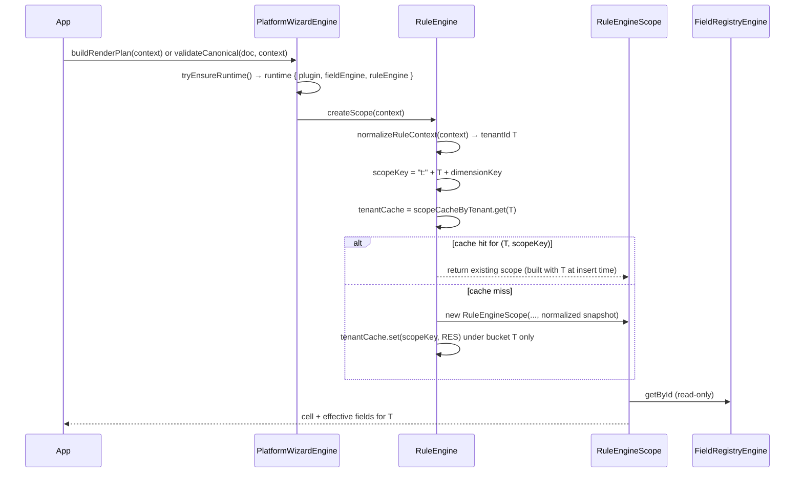

# Phase 1 Forensic Audit — Platform Core (Paranoid Security Scan)

| Field | Value |
|-------|--------|
| **Report ID** | `phase-1-forensic-audit-platform-core-2026-06-03` |
| **Date** | 2026-06-03 |
| **Git SHA** | `ac12e3f` (verified locally) |
| **Scope** | `packages/platform-core/**` (src, test, config, README, package.json; `dist/` absent at scan time) |
| **North Star (Phase 1)** | Platform logic = generic · **no imports from `packages/workspaces/*` or product workspace packages** · headless (no React) · no Denali product coupling in production `src/` |
| **Authority** | [`docs/phase-1-platform-core.ai-exec.md`](../docs/phase-1-platform-core.ai-exec.md) · [`dependency-cruiser.config.js`](../dependency-cruiser.config.js) · [`scripts/guards/phase-1-guard.mjs`](../scripts/guards/phase-1-guard.mjs) |

---

## Executive summary

| Verdict | Count |
|---------|-------|
| **Security Infiltration** (North Star violation — production `src/`) | **0** |
| **Informational** (allowed `workspace-sdk` contract imports) | **47** `src/` import lines from `@app-tour/workspace-sdk/*` subpaths only |
| **CI parity** | `pnpm run phase-1:guard` → **PASS** (all 14 checks including `g3`, `g4`, `g5`, `g6`) |

**Conclusion:** Under a comment-inclusive, case-insensitive deep scan, **no** `denali`, **no** `react` / `react-dom`, and **no** `@app-tour/workspace-*` package other than **`@app-tour/workspace-sdk`** appear anywhere under `packages/platform-core/`. No line qualifies as Security Infiltration; nothing observed bypassed CI — gates and depcruise align with the scan.

---

## 1. Methodology (paranoid)

| Step | Command / action |
|------|------------------|
| Denali (all paths) | `rg -i denali packages/platform-core` |
| React (all paths) | `rg -i '\breact\b\|react-dom\|preact\|vue\|jsx' packages/platform-core` |
| Workspace product packages | `rg '@app-tour/workspace-' \| rg -v workspace-sdk` · `rg 'packages/workspaces'` · `rg '\.\./.*workspaces'` |
| Production `src/` imports | Enumerate all `from "..."` in `src/` |
| Starter product paths in `src/` | `rg 'starter-workspace\|reference/starter\|getStarterWorkspacePlugin\|createStarterWorkspacePlugin' src/` |
| SDK barrel in `src/` | `rg 'from "@app-tour/workspace-sdk"' src/` (forbidden barrel) |
| Graph | `pnpm run guard:architecture` (depcruise) |
| Gate snapshot | `pnpm run phase-1:guard` |

**Note:** `dist/` was not present at scan time; CI runs `pnpm build` before gate. A post-build scan of `dist/` should be repeated in release audits if artifacts are shipped.

---

## 2. Deep-scan results

### 2.1 `denali` (case-insensitive, including comments)

| Location | Matches |
|----------|---------|
| Entire `packages/platform-core/` | **0** |

**Security Infiltration:** none.

### 2.2 `react` / UI runtime (including comments)

| Pattern | Matches |
|---------|---------|
| `react`, `react-dom`, `from "react"`, `preact`, `vue`, `jsx` | **0** |

**Security Infiltration:** none.

### 2.3 `@app-tour/workspaces/*` and `packages/workspaces`

| Pattern | Matches in `platform-core/` |
|---------|----------------------------|
| `@app-tour/workspace-starter`, `@app-tour/workspace-denali`, etc. | **0** |
| `packages/workspaces/…` path strings | **0** |
| Relative `../workspaces` | **0** |

**Security Infiltration:** none.

### 2.4 Allowed contract surface — `@app-tour/workspace-sdk` (not infiltration)

Production `src/` imports **only** these SDK subpaths (no root barrel):

| Subpath | Role |
|---------|------|
| `@app-tour/workspace-sdk/ingress` | Canonical + plugin ingress |
| `@app-tour/workspace-sdk/plugin-types` | Types (`WorkspacePlugin`, wizard surface, field kinds) |
| `@app-tour/workspace-sdk/registry` | Rule cells / field registry types |
| `@app-tour/workspace-sdk/canonical` | `readOwnDataProperty` and composite helpers |

This satisfies Phase 1 **platform-core-only-sdk** (depcruise) and **phase-1.contract** (subpath-only, no `@app-tour/workspace-sdk` barrel in `src/`).

**Test-only** (not North Star violations for product workspaces):

- `test/fixtures/starter.fixture.ts` imports `createStarterWorkspacePlugin` from `@app-tour/workspace-sdk/plugin` and `workspaceThemePresets` from `@app-tour/workspace-sdk/theme` — **SDK reference factory**, not `packages/workspaces/starter`.
- `test/phase-1.contract.spec.ts` explicitly asserts `platform-core-no-workspace-starter-plugin` on production `src/`.

---

## 3. Security Infiltration register

> **Definition:** Any production `src/` dependency or import that reaches `packages/workspaces/*`, Denali product modules, React/DOM, or bypasses depcruise via dynamic import from forbidden roots.

| ID | Finding | Severity | CI bypass? |
|----|---------|----------|------------|
| — | *No rows* | — | — |

---

## 4. How CI would (and did) catch violations — and blind spots

### 4.1 Controls that **did** run (PASS @ `ac12e3f`)

| Guard | What it enforces | Scan overlap |
|-------|------------------|--------------|
| **g3_no_denali_tokens** | `rg -i denali` under `platform-core`, **excludes `*.spec.ts`** | Matches §2.1 for non-spec; spec would be blind spot |
| **g4_no_react_imports** | `rg` for `react`, `react-dom`, `from "react"` on **entire** package | Matches §2.2 |
| **g5_depcruise_architecture** | `platform-core-no-workspaces`, `platform-core-only-sdk`, `platform-core-no-workspace-starter-plugin` (src, not spec) | Catches graph edges to `packages/workspaces` and `reference/starter-workspace` |
| **g6_import_boundary** | AST scan (dynamic import patterns) | Catches some non-static imports in tests |
| **phase-1.contract.spec.ts** | No barrel SDK in `src/`; no `getStarterWorkspacePlugin()` in tests; depcruise starter-plugin rule on `src/` | Complements grep |

### 4.2 Theoretical bypass paths (none exploited today)

| Bypass scenario | Why it did not fire | Hardening |
|-----------------|---------------------|-----------|
| Denali string **only** in `*.spec.ts` or `*.md` | g3 excludes specs | Extend g3 to `test/**` or run separate `rg -i denali test/` in gate |
| React mentioned in **non-`.ts`** file (e.g. `package.json` description typo) | g4 searches all files under package root — would catch substring `react` in description (`workspace-agnostic` safe) | Word-boundary rg for g4 to reduce false positives |
| **Dynamic** `import("packages/workspaces/starter")` | depcruise + import-boundary; not seen in tree | Keep adversarial specs (`g10`) |
| Coupling via **type-only** path in comment without import | Not executable — out of scope for runtime infiltration | Optional: lint for forbidden strings in `src/` comments |
| Violation only in **`dist/`** after tsc transform | dist not scanned in this audit; build output could theoretically embed strings | Post-build `rg` on `dist/` in release pipeline |

**No observed case** used these bypasses; therefore **no “how it bypassed CI”** narrative applies to current `main`.

---

## 5. North Star interpretation (precision)

| Phrase | Meaning in repo | Status |
|--------|-----------------|--------|
| “ZERO workspace imports” | **No** `packages/workspaces/*` product implementations | **PASS** (depcruise + zero path strings) |
| `@app-tour/workspace-sdk` | **Required** contract layer (Phase 0) | **PASS** (subpaths only in `src/`) |
| “workspace-agnostic” (package.json description) | Marketing text; not a dependency | **PASS** |

Importing types named `Workspace*` from **workspace-sdk** is **not** a workspace product import and is **not** flagged as infiltration.

---

## 6. Verification commands (reproduce)

```bash
nvm use 24
export PATH="$(dirname "$(nvm which 24)"):$PATH"
cd /path/to/docs

# Paranoid grep (should print nothing)
rg -i denali packages/platform-core
rg -i 'react-dom|from ["'\'']react' packages/platform-core
rg '@app-tour/workspace-' packages/platform-core | rg -v workspace-sdk || true
rg 'packages/workspaces' packages/platform-core || true

# Gates
pnpm run guard:architecture
pnpm run phase-1:guard
```

---

## 7. Related artifacts

| Artifact | Path |
|----------|------|
| Phase 1 guard JSON | [`reports/phase-1-guard-2026-06-03.json`](../reports/phase-1-guard-2026-06-03.json) |
| Phase 1 contract aggregator | [`packages/platform-core/test/phase-1.contract.spec.ts`](../packages/platform-core/test/phase-1.contract.spec.ts) |
| Doc integrity | [`docs/audits/phase-1-documentation-integrity-2026-06-03.mdoc`](../docs/audits/phase-1-documentation-integrity-2026-06-03.mdoc) |
| Phase 0 cross-package state | [`audits/phase-0-forensic-audit.md`](phase-0-forensic-audit.md) §8 |

---

## 8. Sign-off

| Role | Result |
|------|--------|
| Paranoid deep-scan (denali / react / workspaces product) | **CLEAN** |
| Security Infiltration count | **0** |
| Recommended human follow-up | MAP §14.1 architect sign-off ([`reports/phase-1-closure-readiness-2026-06-03.md`](../reports/phase-1-closure-readiness-2026-06-03.md)) — **not** a code infiltration issue |

---

*Append-only section for future scans — add dated subsections below.*

### Scan log — 2026-06-03 (initial)

- Operator: automated paranoid pass (Cursor agent).
- Tree: `packages/platform-core` @ `ac12e3f`.
- Outcome: **0** Security Infiltration; report created (file did not exist prior).

---

## 9. Phase-1 closure contract vs `src/engine/` unit-test coverage (2026-06-03)

### 9.1 Methodology

| Input | Path |
|-------|------|
| Closure manifest | [`packages/platform-core/test/phase-1.contract.spec.ts`](../packages/platform-core/test/phase-1.contract.spec.ts) — `PHASE_1_CLOSURE_CONTRACTS` (14 rows) |
| Engine implementation | [`packages/platform-core/src/engine/`](../packages/platform-core/src/engine/) (14 modules) |
| Field validation contract | [`packages/platform-core/src/contracts/canonical-field-validation-contract.ts`](../packages/platform-core/src/contracts/canonical-field-validation-contract.ts) |
| “Concrete unit test” | `node:test` `it()` that asserts **runtime outcomes** (return values, thrown codes, plan shape) — **not** source regex, `fs.existsSync`, or depcruise-only checks |
| Cross-reference | All `*.spec.ts` under `packages/platform-core/test/` |

**Note:** Most rows in `phase-1.contract.spec.ts` are **structural/guard** tests. Several manifest `specRel` paths point at **other** spec files; coverage below separates **manifest enforcement** from **behavioral** coverage.

---

### 9.2 `PHASE_1_CLOSURE_CONTRACTS` — behavioral coverage matrix

| ID | Stated requirement | Enforced in `phase-1.contract.spec.ts` | Concrete unit / integration test |
|----|------------------|----------------------------------------|----------------------------------|
| `import-purity` | Entry import does not load CASL / SDK theme-auth | Structural (`FORBIDDEN_PRODUCTION_IMPORTS` walk on `src/`) | **Yes** — `test/import-purity-probe.mjs` subprocess in contract `it` |
| `no-starter-plugin` | Production `src/` must not import starter workspace plugin | **Structural** — depcruise subprocess only | **No** dedicated runtime test (graph rule only) |
| `no-spec-under-src` | Specs live under `test/` | **Structural** — `fs` walk | **N/A** (layout invariant) |
| `headless-plugin-ingress` | `includeTheme: false` at create | **Structural** — regex on `platform-wizard.engine.ts` | **Yes** — [`test/adversarial-plugin-ingress.spec.ts`](../packages/platform-core/test/adversarial-plugin-ingress.spec.ts) (runtime init + theme skip) |
| `sdk-subpath-imports` | Subpath-only SDK imports | **Structural** — grep `test/` + `src/` | **No** per-import runtime test |
| `no-fromPlugin-api` | No `fromPlugin` in production `src/` | **Structural** — grep | **N/A** (absence invariant) |
| `no-test-policy-export` | `index.ts` omits test policy types | **Structural** — read `index.ts` | **N/A** (export surface) |
| `starter-fixture-location` | Fixture only under `test/fixtures/` | **Structural** — `fs.existsSync` | **N/A** (layout) |
| `dist-import-purity` | Built `dist/index.js` import purity | **Structural** — probe subprocess (needs build) | Same probe as `import-purity` |
| `field-validation-contract` | Module exists; mentions poison helpers | **Structural** — file exists + string `includes` | **Partial** — `hiddenFieldPoisonViolation` exercised via [`platform-wizard.engine.spec.ts`](../packages/platform-core/test/unit/engine/platform-wizard.engine.spec.ts); **`passesHiddenFieldKindGate` never called** (see §9.3, BL-01) |
| `adversarial-plugin-ingress` | Headless init skips invalid theme | Contract only checks **file exists** (`facade-integration` gate duplicate) | **Yes** — `adversarial-plugin-ingress.spec.ts` |
| `single-facade-export` | `package.json` exports only `.` | **Structural** — JSON keys | **N/A** |
| `facade-integration-gate` | Public facade API gated | Contract only **`fs.existsSync`** on `facade-integration.spec.ts` | **Yes** — [`test/facade-integration.spec.ts`](../packages/platform-core/test/facade-integration.spec.ts) (5 runtime `it`s) |
| `fresh-starter-fixture` | Per-call factory, no singleton | **Structural** — regex on fixture source | **Indirect** — all tests use `createTestStarterPlugin()`; no `it` named for alias |

**Summary:** Of 14 manifest rows, **6** are layout/export/graph-only with no meaningful runtime assertion. Of the remainder, **4** have dedicated behavioral specs elsewhere; **2** (`field-validation-contract`, `fresh-starter-fixture`) are **under-tested** relative to their implied semantics.

---

### 9.3 Engine & validation-contract requirements **without** a concrete unit test

Grouped by subsystem. Items marked **integration-only** are covered only via `PlatformWizardEngine.validateCanonical` / `buildRenderPlan`, not a focused `it` on the helper.

#### 9.3.1 `canonical-field-validation-contract.ts` (contract table)

| Requirement ID | Rule (from contract table / exports) | Engine wiring | Unit-test gap |
|----------------|--------------------------------------|---------------|---------------|
| `hidden-non-composite-poison` | Hidden + non-composite + `value !== undefined` → `HIDDEN_FIELD_POISON` | Used in `validate-canonical-field.ts` via `hiddenFieldPoisonViolation` | **Covered** — `platform-wizard.engine.spec.ts` (enum + generic value) |
| `visible-kind-strict` | Visible value → `assertCanonicalValueMatchesKind` | `validate-canonical-field.ts` | **Covered** — facade + `canonical-value.spec.ts` (text/enum/composite); **gaps:** `date`, `boolean` kinds never asserted through **engine** `validateCanonical` |
| `passesHiddenFieldKindGate` | Documented mirror of scalar non-emptiness | **Not imported** by `src/` or `test/` | **No test** — dead export (BL-01) |
| Hidden **composite** + value allowed (no poison) | Table row: poison does not apply | `hiddenFieldPoisonViolation` returns `null` for `kind === "composite"` | **No test** proving hidden composite object **passes** poison gate and skips scalar kind check when value present |
| `CANONICAL_FIELD_VALIDATION_CONTRACT` array | Documentation table | N/A | **No test** asserts table rows stay in sync with code |

#### 9.3.2 `validate-canonical-document.ts` / facade paths

| Behavior | Implementation | Unit-test gap |
|----------|----------------|---------------|
| `inactiveFieldGroups` → **skip** field validation (`continue`) | `validate-canonical-document.ts:48–52` | **No test** — render hides inactive groups ([`step.engine.spec.ts`](../packages/platform-core/test/unit/engine/step.engine.spec.ts)); **validation never asserted** to ignore bad data under inactive group |
| `validateCanonical` before `tryInit` | `validationResultFromPlatformError(ready.error)` | **No test** — cold-start covers lazy init for `buildRenderPlan`, not `validateCanonical` error mapping |
| `tryBuildRenderPlan` / init failure `PlatformResult` | `platform-wizard.engine.ts:138–141` | **No test** — only `buildRenderPlan` throw path via tenant isolation |
| Ingress failure inside `validateCanonicalDocument` | `mapCanonicalIngressFailure` + `parseCanonicalDocumentFromStorage` | **No engine-level test** — storage freeze tested in `runtime-isolation.spec.ts` on SDK parser only |
| Violation dedupe by `fieldId` | `validation-status-map.ts` `fieldIndex` | **No test** — second violation for same field silently dropped |

#### 9.3.3 Rule engine (`rule.engine.ts`, `rule-engine.scope.ts`, `rule-resolution.ts`, `rule-cell-index.ts`)

| Behavior | Unit-test gap |
|----------|---------------|
| `cellMatchesDimensions` NFC normalization | **Indirect** only — tenant NFC scope-key test; no direct dimension mismatch matrix on exported function |
| `pickBestMatchingCell` — `tieCount > 1` → `AMBIGUOUS_RULE_RESOLUTION` | **Covered** — `rule.engine.spec.ts` |
| `pickBestMatchingCell` — `count === 0` → `INVALID_RULE_SET` | **No direct test** (unreachable via `RuleEngineScope` today: empty matches → `RULE_CONTEXT_UNMATCHED` first) |
| `pickBestMatchingCell` — `count > MAX_RULE_CELL_INDEX_SIZE` | **No test** |
| `isEmptyRuleDimensions` | **Unused in repo** — export only (BL-02) |
| `defaultCellId` | Validated at `RuleEngine.tryCreate` | **No runtime fallback** when `findMatches` is empty — uses catch-all cells or `RULE_CONTEXT_UNMATCHED`; ai-exec wording “none → defaultCellId” is **not** auto-resolution (documented nuance, not a stub) |
| Bootstrap: multiple `dimensions:{}` without distinct priority | Enforced in **workspace-sdk** `validate-rule-set.ts`, not engine | **Covered** — `platform-wizard.engine.spec.ts` via `tryFromPlugin` (SDK throw), not `RuleCellIndex` |
| `forceCellId` | Bypasses `pickBestMatchingCell` when test policy allows | **Covered** — `rule.engine.force-cell.spec.ts`; production policy denies (not a lie) |
| `resolveEffectiveField` — `hidden: override?.hidden ?? false` | **Partial** — hidden exclude tests; **no test** for “override omits `hidden` → visible” on a base-hidden registry field (if such registry existed) |
| Scope cache LRU / side effects | **Covered** — `purity-side-effects.spec.ts`, concurrency specs |

#### 9.3.4 Render plan (`render-plan.ts`, `field-visibility.ts`, `render-plan.steps.ts`)

| Behavior | Unit-test gap |
|----------|---------------|
| `includeWorkspaceStepUiHints: true` + `wizardCapacityStepRedundant` | **Covered** — `render-plan.spec.ts` |
| Plan rows always `hidden: false` | Intentional (hidden fields omitted) | **No test** documenting consumer must not treat `hidden` on rows as visibility source |
| `getStepVisibility` / empty root step | **Covered** — `step.engine.spec.ts` |

#### 9.3.5 Explicitly deferred (not engine gaps)

| Requirement | Phase 1 reality |
|-------------|-----------------|
| `plugin.validation` hooks at platform runtime | **Not invoked** — per ai-exec § deferred to phase 3; not a stub in `src/engine/` |

---

### 9.4 Behavioral Lies register

> **Definition (this audit):** Production or contract-surface code that **implies** RuleEngine / validation behavior but **does not execute** the real path, returns a **hardcoded** outcome instead of computed state, or exports an API **never wired** into the engine.

| ID | Severity | Location | Finding | Evidence |
|----|----------|----------|---------|----------|
| **BL-01** | **Medium** | `canonical-field-validation-contract.ts` → `passesHiddenFieldKindGate` | **Orphan contract API** — docstring claims parity with `isEmptyCanonicalValue`, but **engine validation never calls it**; phase-1 contract only checks file contains `hiddenFieldPoisonViolation` strings | `rg passesHiddenFieldKindGate` → single file (definition only). `validate-canonical-field.ts` uses `isEmptyCanonicalValue` from `utils/canonical-value.ts` |
| **BL-02** | **Low** | `rule-resolution.ts` → `isEmptyRuleDimensions` | **Dead export** — zero call sites in monorepo; suggests dimension-empty helper used in resolution, but `RuleEngineScope` never references it | `rg isEmptyRuleDimensions` → definition only |
| **BL-03** | **Low** | `validation-status-map.ts` → `OK_RESULT` | **Shared singleton success object** — `finalize()` returns frozen `{ ok: true, violations: [] }` without per-call clone. Not a RuleEngine bypass (violations still recorded on failure path), but **mutable-array hazard** if any consumer ever mutates `violations` on success | `const OK_RESULT` reused at `finalize()` when `size === 0`; no immutability test |
| **BL-04** | **Info** | `render-plan.ts` → `toRenderFieldPlan` | **`hidden: false` hardcoded** on every emitted row while hidden fields are **omitted** from the plan | By design per file comment; misleading only if UI treats row `hidden` as authority — **not** skipping RuleEngine |

**Not classified as Behavioral Lies (verified):**

- **No** `fromPlugin`, Denali, React, or workspace-product imports in `src/engine/`.
- **No** `mock` / `stub` / fake RuleEngine in `src/engine/` — `buildRenderPlan` and `validateCanonicalDocument` always `ruleEngine.createScope(context)` then real `RuleEngineScope.resolveEffectiveField` / `resolveCellId`.
- **`forceCellId`** — real cell resolution under test policy; production `DEFAULT_RULE_ENGINE_SCOPE_POLICY` denies bypass ([`rule.engine.force-cell.spec.ts`](../packages/platform-core/test/unit/engine/rule.engine.force-cell.spec.ts)).
- **`sanitizePluginAtCreate`** — runs `parseWorkspacePluginFromStorage(..., { includeTheme: false })`, not a no-op.
- **Ambiguous catch-all `INVALID_RULE_SET`** at `tryFromPlugin` — thrown by **workspace-sdk** rule-set validation, not a hardcoded platform stub.

---

### 9.5 Recommended test additions (closure gaps only)

| Priority | Test target |
|----------|-------------|
| P1 | `passesHiddenFieldKindGate` — either **wire** to `isEmptyCanonicalValue` / delete export, **or** unit table test per kind |
| P1 | `inactiveFieldGroups` — invalid value under inactive group does **not** produce violations |
| P2 | Hidden **composite** with benign object value — no `HIDDEN_FIELD_POISON` |
| P2 | `validateCanonical` on uninitialized engine → `validationResultFromPlatformError` shape |
| P2 | `date` / `boolean` kinds through `validateCanonical` facade |
| P3 | `createViolationCollector` dedupe-by-`fieldId` behavior |
| P3 | Remove or use `isEmptyRuleDimensions`; add `pickBestMatchingCell` pool-limit test if reachable |

---

## 10. Sign-off — contract vs engine pass (2026-06-03)

| Role | Result |
|------|--------|
| Contract manifest vs concrete unit tests | **14** rows; **6** structural-only; **2** under-tested (`field-validation-contract`, `fresh-starter-fixture`) |
| Engine requirements without unit test | **§9.3** — **15+** distinct gaps (validation skip, facade error paths, kinds, helpers) |
| Behavioral Lies in `src/engine/` | **0** RuleEngine stubs; **4** rows (**BL-01**–**BL-04**), **1** medium (**BL-01** orphan gate) |
| RuleEngine execution on hot path | **Verified real** for render + validate |

---

### Scan log — 2026-06-03 (contract vs engine)

- Operator: contract/engine gap analysis (Cursor agent).
- Inputs: `phase-1.contract.spec.ts`, `src/engine/**`, full `packages/platform-core/test/**` grep.
- Outcome: §9–§10 appended; no Security Infiltration change from §1–8.

---

## 11. Architectural Theater — `render-plan.steps.ts` & `platform-wizard.engine.ts` (2026-06-03)

### 11.1 Authority & scope

| Source | Requirement relevant to these files |
|--------|-------------------------------------|
| [`docs/phase-1-platform-core.ai-exec.md`](../docs/phase-1-platform-core.ai-exec.md) §4.4 | Subphase **1.4**: plain functions `listStepIds`, `getStepVisibility`, `listActiveSteps` — **forbidden** `StepEngine` class |
| Same doc §4.5–4.6 | `buildRenderPlan` in `render-plan.ts`; **1.6** `PlatformWizardEngine` facade with lazy/eager bootstrap, `PlatformResult` + `ValidationResult` error layers |
| Same doc §3.3–3.5 | Facade session state, bootstrap chain, consumer imports facade only |

**Files examined:** [`render-plan.steps.ts`](../packages/platform-core/src/engine/render-plan.steps.ts) (82 LOC), [`platform-wizard.engine.ts`](../packages/platform-core/src/engine/platform-wizard.engine.ts) (220 LOC).

**Definition (this section):** *Architectural Theater* — structure (extra passes, partition buffers, ceremonial types/API layers) that **does not trace to a Phase 1 doc requirement** and could be replaced with a shorter equivalent without changing observable behavior.

---

### 11.2 `render-plan.steps.ts` — complexity inventory

| Artifact | Kind | Doc mandate? | Cyclomatic / loop notes |
|----------|------|--------------|-------------------------|
| `listStepIds` | plain function | **Yes** — union `stepId` + `wizard.roots` ordering (§4.4 `ordering_logic`) | **3 sequential loops** + `Map` + `rooted`/`orphan` arrays + `.sort()` (~CC 8) |
| `getStepVisibility` | plain function | **Yes** — `active \| hidden \| empty` (§4.4 `visibility_semantics`) | 1 loop, 3 branches (~CC 4); delegates `inactiveFieldGroups` to `isFieldEffectivelyHidden` (**required** §4.4) |
| `listActiveSteps` | plain function | **Yes** — filter to active steps | `.filter` → **nested work**: per step calls `getStepVisibility` → full field scan (**O(steps × fields)**); not forbidden by doc |
| Classes / helpers | — | **None allowed** beyond plain functions | **0 classes** — compliant |

**Doc vs code (visibility):** ai-exec lists `empty: "visible but zero non-hidden fields"` (internally inconsistent wording). Implementation and tests use **`empty` = step has zero registry fields** ([`step.engine.spec.ts`](../packages/platform-core/test/unit/engine/step.engine.spec.ts) “wizard.roots step with no fields → empty”). That is **not** theater — it is a **doc typo**; code matches tests.

---

### 11.3 `platform-wizard.engine.ts` — complexity inventory

| Artifact | Kind | Doc mandate? | Branching / structure |
|----------|------|--------------|------------------------|
| `PlatformWizardEngine` | **required class** | **Yes** — §4.6 facade (forbidden `fromPlugin`; allowed `create` / `tryFromPlugin` / instance API) | Not optional “professional” layering |
| `WizardRuntime` | private type alias | **Yes** — bundles plugin + engines after bootstrap (§4.6 `bootstrap_validation_chain`) | Not a helper class |
| `sanitizePluginAtCreate` | plain function | **Yes** — step_1 `parseWorkspacePluginFromStorage(..., { includeTheme: false })` | try/catch + ingress map |
| `tryInit` / `init` | methods | **Yes** — lazy init, idempotent, non-sticky failures (§3.3, §5) | 2 branches |
| `tryFromPlugin` | static | **Yes** — eager bootstrap `PlatformResult` | create catch + init check |
| `tryBuildRenderPlan` / `buildRenderPlan` | methods | **Yes** — §4.6 instance_methods + §5 throw vs `PlatformResult` split | `tryEnsureRuntime` + normalize + optional `PlatformCoreError` catch |
| `validateCanonical` | method | **Yes** — §4.6 + `ValidationResult` layer | `tryEnsureRuntime` only (errors from validator, not wrapped in try/catch) |
| `tryEnsureRuntime` / `buildRuntime` | private | **Yes** — lazy “first plan/validate builds graph”; chained `tryCreate` | **No nested loops**; linear bootstrap chain |
| `createForTests` | static | **Yes** — internal test policy injection (§3.5, forceCellId note) | Duplicate entry point **required** for non-exported `RuleEngineScopePolicy` |
| `PlatformWizardEngineOptions` | `Record<string, never>` | **No** functional requirement in Phase 1 | Empty options parameter on `create` / `tryFromPlugin` |

**Nested loops:** none in this file.

**Helper classes (forbidden style):** none besides the **mandated** facade class.

---

### 11.4 Architectural Theater register

| ID | File | Verdict | Rationale |
|----|------|---------|-----------|
| **AT-RPS-01** | `render-plan.steps.ts` → `listStepIds` | **Low — Architectural Theater** | **Partition + sort** (`rooted` / `orphan` / `rootsIndex` / `.sort()`) implements the same ordering as a **two-filter** algorithm mandated by §4.4. Extra buffers and CC are **not** required for correctness; they read like “algorithm design” polish. |
| **AT-RPS-02** | `render-plan.steps.ts` → `listActiveSteps` | **Not theater** (perf smell only) | Nested scans are a consequence of the **required** three-function API; doc does not require single-pass fusion. |
| **AT-RPS-03** | `render-plan.steps.ts` overall | **Not theater** | No `StepEngine`, no classes, no indirection beyond doc-mandated `RuleEngineScope` + `isFieldEffectivelyHidden`. |
| **AT-PWE-01** | `platform-wizard.engine.ts` → `PlatformWizardEngineOptions` | **Cosmetic — mild theater** | `Record<string, never>` on public `create`/`tryFromPlugin` suggests future options without Phase 1 behavior. Harmless but **not doc-driven**. |
| **AT-PWE-02** | `platform-wizard.engine.ts` → dual APIs | **Not theater** | `tryInit`/`init`, `tryBuildRenderPlan`/`buildRenderPlan` mirror §5 **error_model_layers** (`PlatformResult` vs throw). |
| **AT-PWE-03** | `platform-wizard.engine.ts` overall | **Not theater** | Branch count tracks bootstrap, lazy runtime, and ingress sanitization **one-to-one** with §4.6; thin orchestrator over real engines. |

**Overall judgment:** **`platform-wizard.engine.ts` is not over-architected** for Phase 1 — the class and `PlatformResult` paths are the specified deliverable. **`render-plan.steps.ts` is mostly lean**; only **`listStepIds`** warrants a simplification refactor (**AT-RPS-01**).

---

### 11.5 Refactor plan (demanded where labeled Theater)

#### RP-1 — Simplify `listStepIds` (addresses **AT-RPS-01**)

**Goal:** Same observable ordering as today and §4.4 tests — `wizard.roots` order first for steps in the union, then remaining steps in registry discovery order.

**Proposed algorithm (single discovery pass + two filters, no sort):**

```ts
export function listStepIds(
  wizard: WorkspaceWizardSurface,
  fieldEngine: FieldRegistryEngine,
): readonly string[] {
  const discoveryOrder: string[] = [];
  const seen = new Set<string>();

  for (const field of fieldEngine.listAll()) {
    if (!seen.has(field.stepId)) {
      seen.add(field.stepId);
      discoveryOrder.push(field.stepId);
    }
  }
  for (const stepId of wizard.roots) {
    if (!seen.has(stepId)) {
      seen.add(stepId);
      discoveryOrder.push(stepId);
    }
  }

  const inRoots = new Set(wizard.roots);
  const rooted = wizard.roots.filter((id) => seen.has(id));
  const orphan = discoveryOrder.filter((id) => !inRoots.has(id));
  return [...rooted, ...orphan];
}
```

| Step | Action |
|------|--------|
| 1 | Replace body of `listStepIds` as above (or equivalent ≤2-pass logic). |
| 2 | Run `pnpm --filter @app-tour/platform-core test test/unit/engine/step.engine.spec.ts` — must stay green (6 tests). |
| 3 | Run `pnpm run phase-1:gate` — no contract/guard drift. |
| 4 | Optional: add one comment citing §4.4 `ordering_logic` so future edits do not reintroduce sort/partition theater. |

**Out of scope (not demanded):** fusing `listActiveSteps` into one pass (**AT-RPS-02**) — behavior-preserving optimization only; not Phase 1 doc debt.

#### PW-1 — Optional cleanup (addresses **AT-PWE-01** only)

| Option | Action |
|--------|--------|
| A (minimal) | Document in JSDoc: `options` reserved for Phase 2+; ignore in Phase 1. |
| B (stricter) | Remove `options` parameter from `create` / `tryFromPlugin` until needed — **breaking** for any caller passing `{}`; only if API semver allows. |

**No refactor demanded** for `PlatformWizardEngine` structure — removing the class or collapsing `try*` methods would **violate** §4.6 / §5.

---

### 11.6 Sign-off — theater pass

| File | Architectural Theater | Refactor demanded |
|------|----------------------|-----------------|
| `render-plan.steps.ts` | **1** low item (**AT-RPS-01**) | **Yes** — **RP-1** |
| `platform-wizard.engine.ts` | **1** cosmetic item (**AT-PWE-01**) | **Optional** — **PW-1** only |

---

### Scan log — 2026-06-03 (architectural theater)

- Operator: critical review vs `phase-1-platform-core.ai-exec.md` §4.4 / §4.6.
- Outcome: §11 appended; facade cleared; `listStepIds` simplification recommended.

---

## 12. Tenant isolation — `RuleEngineScope` & `FieldRegistryEngine` (2026-06-03)

### 12.1 Question & verdict

**Question:** Can `tenantId` from request A leak into cached resolution for request B via singleton/static misuse on `RuleEngineScope` / `FieldRegistryEngine`?

| Verdict | Result |
|---------|--------|
| **Critical Isolation Vulnerability** | **None found** in `packages/platform-core/src` |
| **Proof status** | Cross-tenant cache collision is **impossible** under the code paths below, given distinct validated `tenantId` strings per call |
| **Residual risk** | **Consumer contract** only (shared mutable `RuleContext` object across concurrent callers, or wrong `tenantId` passed by app code) — not library cache bleed |

---

### 12.2 Static / singleton audit (`src/engine` + public barrel)

| Symbol | Location | Tenant state? | Verdict |
|--------|----------|---------------|---------|
| `MAX_SCOPE_CACHE_SIZE` | `rule.engine.ts` | constant `64` | Safe |
| `DEFAULT_RULE_ENGINE_SCOPE_POLICY` | `rule-engine-scope-policy.ts` | frozen `{}` | Safe — no tenant fields |
| `OK_RESULT` | `validation-status-map.ts` | `{ ok: true, violations: [] }` | Safe — not used for rule resolution |
| `MAX_RULE_CELL_INDEX_SIZE`, `MAX_ALLOWED_REGISTRY_FIELDS` | `rule-cell-limits.ts` | limits only | Safe |
| Module-level `RuleEngine` / `FieldRegistryEngine` instance | — | **None** | No production singleton |
| `index.ts` exports | barrel | `PlatformWizardEngine` only | Apps cannot import cached engines from package entry |

`FieldRegistryEngine` / `RuleEngine` expose only `static tryCreate` / `static create` — **instance state is always on `new`**, held by `PlatformWizardEngine.runtime` or test locals.

---

### 12.3 Instance inventory — every production use

#### `FieldRegistryEngine` (immutable after construction)

| # | Creation site | Lifetime | Mutable fields after ctor | Tenant data |
|---|---------------|----------|---------------------------|-------------|
| F1 | `FieldRegistryEngine.tryCreate` → private ctor | Per `PlatformWizardEngine` runtime (or test) | **None** — `fields`, `byId`, `byStepId` frozen | **None** — plugin registry only |
| F2 | Passed by reference into `RuleEngine`, `buildRenderPlan`, `validateCanonicalDocument`, `render-plan.steps`, `field-visibility` | Shared across all tenants on **same engine instance** | Read-only API: `getById`, `listByStep`, `listAll` | Isolation **not required** — same plugin graph for all tenants |

**State-mutation path (F1):** Only the private constructor mutates (`seen`, `idMap`, `stepMap`); then assigns frozen snapshots. No code path writes to `byId` / `byStepId` after construction.

#### `RuleEngineScope` (per-tenant, per-dimension cache entry)

| # | Creation site | Lifetime | Mutable fields | Tenant binding |
|---|---------------|----------|----------------|----------------|
| S1 | `new RuleEngineScope(...)` in `RuleEngine.scopeFor` | Cached under `scopeCacheByTenant.get(tenantId).get(scopeKey)` or fresh | `resolvedCellId?`, `effectiveByFieldId` Map | `readonly normalized` set once in ctor via `normalizeRuleContext(context)` |
| S2 | Consumed by | `buildRenderPlan`, `validateCanonicalDocument`, `render-plan.steps`, `field-visibility` | Callers only read via `resolveCellId` / `resolveEffectiveField` | Must receive scope from **their** `ruleEngine.createScope(context)` |

#### `RuleEngine` (owns tenant-partitioned scope cache)

| # | Creation site | Lifetime | Mutable fields | Tenant partition |
|---|---------------|----------|----------------|------------------|
| R1 | `RuleEngine.tryCreate` in `PlatformWizardEngine.buildRuntime` | One per initialized facade | `scopeCacheByTenant: Map<tenantId, Map<scopeKey, RuleEngineScope>>` | **Outer key = `normalized.tenantId`** |
| R2 | `createScope` / `scopeFor` | Per API call | LRU touch: `delete` + `set` on **inner** map only | See §12.5 |

---

### 12.4 Production hot-path trace (facade → cache → scope)



**Call sites (production `src/` only):**

| File | `FieldRegistryEngine` | `RuleEngineScope` |
|------|----------------------|-------------------|
| `platform-wizard.engine.ts` | Creates F1; stores in `WizardRuntime` | — |
| `rule.engine.ts` | Held on instance | Creates S1 in `scopeFor` |
| `rule-engine.scope.ts` | ctor reference | S1 implementation |
| `render-plan.ts` | parameter | `ruleEngine.createScope(context)` |
| `validate-canonical-document.ts` | parameter | `ruleEngine.createScope(context)` |
| `render-plan.steps.ts` | parameter | parameter (caller-supplied scope) |
| `field-visibility.ts` | parameter | `scope.resolveEffectiveField` |

Tests mirror the same graph via `FieldRegistryEngine.create` / `RuleEngine.create` / `loadPlatformWizard` — no alternate cache layer.

---

### 12.5 State-mutation paths (tenant-relevant only)

#### Path A — `RuleEngine.scopeFor` (only cache writer)

```80:112:packages/platform-core/src/engine/rule.engine.ts
  private scopeFor(context: RuleContextResolution): RuleEngineScope {
    const normalized = normalizeRuleContext(context);
    const scopeKey = buildRuleContextScopeKey(normalized, this.ruleSet.matrixDimensions);
    const tenantId = normalized.tenantId;

    let tenantCache = this.scopeCacheByTenant.get(tenantId);
    if (tenantCache == null) {
      tenantCache = new Map<string, RuleEngineScope>();
      this.scopeCacheByTenant.set(tenantId, tenantCache);
    }

    const cached = tenantCache.get(scopeKey);
    if (cached != null) {
      tenantCache.delete(scopeKey);
      tenantCache.set(scopeKey, cached);
      return cached;
    }

    const scope = new RuleEngineScope(
      this.ruleSet,
      this.fieldEngine,
      this.cellIndex,
      normalized,
      this.scopePolicy,
    );
    // ... LRU eviction on tenantCache only ...
    tenantCache.set(scopeKey, scope);
    return scope;
  }
```

**Invariants enforced on this path:**

1. `tenantId` used for partition = `normalized.tenantId` from **this call’s** `context` (not a static).
2. `scopeKey` embeds the same tenant: `buildRuleContextScopeKey` → `` `t:${tenantId}\0${dimensionKey}` `` ([`rule-context-scope-key.ts`](../packages/platform-core/src/utils/rule-context-scope-key.ts)).
3. A cached scope is only stored in `scopeCacheByTenant.get(tenantId)` for that same `tenantId`.
4. LRU eviction deletes entries **only** from the current tenant’s inner `Map`, never from another tenant’s bucket ([`purity-side-effects.spec.ts`](../packages/platform-core/test/purity-side-effects.spec.ts), [`rule.engine.spec.ts`](../packages/platform-core/test/unit/engine/rule.engine.spec.ts) LRU tests).

#### Path B — `RuleEngineScope` (per-scope memo, not shared across tenants)

```25:37:packages/platform-core/src/engine/rule-engine.scope.ts
  constructor(
    private readonly ruleSet: WorkspaceRuleSet,
    private readonly fieldEngine: FieldRegistryEngine,
    private readonly cellIndex: RuleCellIndex,
    context: RuleContextResolution,
    private readonly policy: RuleEngineScopePolicy = DEFAULT_RULE_ENGINE_SCOPE_POLICY,
  ) {
    this.normalized = normalizeRuleContext(context);
    this.filteredDimensions = filterRuleContextDimensions(
      this.normalized.dimensions,
      this.ruleSet.matrixDimensions,
    );
  }
```

- `resolveCellId` / `resolveEffectiveField` mutate **only this scope instance** (`resolvedCellId`, `effectiveByFieldId`).
- `fieldEngine` is shared but **read-only**; effective rules depend on `this.normalized` + `this.filteredDimensions` captured at construction.
- Post-ctor mutation of the caller’s `context` object does **not** update `this.normalized` (snapshot at construct).

#### Path C — `FieldRegistryEngine` (no tenant path)

Constructor builds frozen maps; public methods are pure reads. **No cache, no `tenantId`, no cross-request mutable resolution state.**

---

### 12.6 Proof: cross-tenant cache leak is impossible

**Assume (for contradiction):** Request B with validated `tenantId = T₂` receives `RuleEngineScope` instance `S` that was created for request A with `tenantId = T₁`, where `T₁ ≠ T₂`.

**Lemma 1 — `S` is only inserted under `T₁`:**  
At insertion, `scopeFor` used `normalized.tenantId` from A’s context, so `S` was stored in `scopeCacheByTenant.get(T₁).set(scopeKey_A, S)` where `scopeKey_A` contains prefix `t:T₁\0` ([`buildRuleContextScopeKey`](../packages/platform-core/src/utils/rule-context-scope-key.ts)).

**Lemma 2 — Lookup for B uses bucket `T₂` only:**  
For B, `scopeFor` computes `tenantId = T₂` and `tenantCache = scopeCacheByTenant.get(T₂)`. If `T₂ ∉ {T₁}`, this is a **different** `Map` object (or empty/new). `S` is not in that map unless `T₁ === T₂` as strings.

**Lemma 3 — Inner key cannot alias across tenants:**  
Even if outer maps were wrongly shared, `scopeKey_B` contains `t:T₂\0…` and `scopeKey_A` contains `t:T₁\0…`. With `T₁ ≠ T₂`, `scopeKey_A ≠ scopeKey_B` (tenant segment differs). `tenantCache.get(scopeKey_B)` cannot return `S` keyed under `scopeKey_A`.

**Lemma 4 — No static tenant:**  
`tenantId` is never read from module scope; `assertTenantId(context)` is the sole authority ([`rule-context-tenant.ts`](../packages/platform-core/src/utils/rule-context-tenant.ts)). Missing/blank/invalid tenant throws before cache access (`TENANT_ISOLATION_VIOLATION` / `INVALID_RULE_CONTEXT`).

**Conclusion:** **⊥** — the assumed leak cannot occur through `RuleEngine` / `RuleEngineScope` caching.

**Corollary:** Sharing one `PlatformWizardEngine` (and thus one `RuleEngine`) across HTTP requests is **supported**; isolation is by **`RuleContext.tenantId` per call**, not by separate engine instances.

---

### 12.7 Critical Isolation Vulnerability register

| ID | Finding | Severity |
|----|---------|----------|
| — | *No rows* | — |

---

### 12.8 Residual risks (not implementation leaks)

| Risk | Owner | Notes |
|------|-------|-------|
| Wrong `tenantId` in app | Consumer | Library correctly caches per supplied id; mis-labeling data is app bug |
| Shared **mutable** `RuleContext` across concurrent async work | Consumer | `normalizeRuleContext` snapshots at call time; racing mutations on one object before the call are outside engine guarantees |
| `tenant_a` vs `tenant_A` | Consumer / ops | Regex allows case variants; **different cache buckets**, not cross-tenant bleed |
| One engine per tenant session (doc) | Ops | Recommended to limit cache growth; not required for isolation proof |

---

### 12.9 Test evidence (isolation)

| Spec | What it proves |
|------|----------------|
| [`runtime-isolation.spec.ts`](../packages/platform-core/test/runtime-isolation.spec.ts) | Scope keys `t:tenant_a` vs `t:tenant_b`; 400 parallel `buildRenderPlan` across 8 tenants |
| [`rule.engine.spec.ts`](../packages/platform-core/test/unit/engine/rule.engine.spec.ts) § tenant isolation | Missing tenant throws; concurrent `createScope` for A/B; LRU on A does not evict B |
| [`purity-side-effects.spec.ts`](../packages/platform-core/test/purity-side-effects.spec.ts) | 65 scopes for tenant_a LRU vs tenant_b stability |
| [`rule-engine-concurrency.spec.ts`](../packages/platform-core/test/rule-engine-concurrency.spec.ts) | Parallel facade validate/plan per tenant |

---

### 12.10 Sign-off — isolation pass

| Check | Result |
|-------|--------|
| Static/singleton engine cache | **None** |
| `FieldRegistryEngine` carries tenant resolution state | **No** |
| `RuleEngineScope` cache partitioned by `tenantId` + `t:` scope key | **Yes** |
| Cross-tenant leak provably impossible (§12.6) | **Yes** |
| **Critical Isolation Vulnerability** | **0** |

---

### Scan log — 2026-06-03 (tenant isolation)

- Operator: full trace `RuleEngineScope` / `FieldRegistryEngine` + `rule.engine.ts` cache path.
- Outcome: §12 appended; isolation proof documented; CIV register empty.

---

## 13. Facade integrity — `src/index.ts` & Single Facade mandate (2026-06-03)

### 13.1 Mandate (Phase 1)

| Source | Requirement |
|--------|-------------|
| [`docs/phase-1-platform-core.ai-exec.md`](../docs/phase-1-platform-core.ai-exec.md) §4.6 / FT-P1-05, FT-P1-08 | Public **`RuleEngine` / `FieldRegistryEngine` / `render-plan*` must not appear on barrel**; `package.json` **`exports["."]` only**, `"./*": null` |
| Same doc §5 / `consumer_law_apps` | Apps import **`PlatformWizardEngine` + exported types** — never `RuleEngine`, `render-plan.steps`, or `@app-tour/platform-core/engine/...` |
| [`test/phase-1.contract.spec.ts`](../packages/platform-core/test/phase-1.contract.spec.ts) | `single-facade-export`, `no-test-policy-export`, no `unwrapPlatformResult` on barrel |

**Clarification:** “Single Facade” means **one package entry** and **no internal engine on the public export surface** — not that `index.ts` may export only the `PlatformWizardEngine` identifier. §5 explicitly allows `PlatformCoreError`, `PlatformResult` helpers/types, and plan/validation **types**.

---

### 13.2 Barrel audit — [`packages/platform-core/src/index.ts`](../packages/platform-core/src/index.ts)

| Export | Kind | Internal engine bypass? |
|--------|------|-------------------------|
| `PLATFORM_CORE_VERSION` | const | No |
| `PlatformWizardEngine`, `PlatformWizardEngineOptions` | class + type | **Primary operational facade** |
| `PlatformCoreError`, `PlatformCoreErrorCode` | class + type | No — bootstrap/throw ergonomics (§5.1) |
| `platformFail`, `platformOk`, `platformErr`, `isPlatformCoreError`, `PlatformResult` | fn + type | No — `tryFromPlugin` / `tryInit` result handling; **`unwrapPlatformResult` intentionally omitted** |
| `RuleContext` | type only | No — required context for facade methods |
| `RenderFieldPlan`, `RenderStepPlan` | type only | No — `buildRenderPlan` output shape for apps/web |
| `ValidationResult`, `ValidationViolation` | type only | No — `validateCanonical` output |

**Not exported from barrel (verified source + contract tests):**

| Forbidden surface | In `index.ts`? | Subpath `@app-tour/platform-core/...`? |
|-------------------|----------------|----------------------------------------|
| `RuleEngine` | No | **Blocked** (`ERR_PACKAGE_PATH_NOT_EXPORTED`) |
| `RuleEngineScope` | No | Blocked |
| `FieldRegistryEngine` | No | Blocked |
| `buildRenderPlan` | No | Blocked |
| `render-plan.steps` (`listActiveSteps`, etc.) | No | Blocked |
| `validateCanonicalDocument` | No | Blocked |
| `RuleEngineScopePolicy` / `DEFAULT_RULE_ENGINE_SCOPE_POLICY` | No | Blocked |
| `unwrapPlatformResult` | No | Blocked |
| `createPlatformWizardEngineForTests` | No (exists on `platform-wizard.engine.ts` module only) | Blocked via subpath |
| `getCanonicalValue` / `assertCanonicalValueMatchesKind` | No (Appendix B internal) | Blocked |

---

### 13.3 `package.json` exports map

```8:14:packages/platform-core/package.json
  "exports": {
    ".": {
      "types": "./dist/index.d.ts",
      "default": "./dist/index.js"
    },
    "./*": null
  },
```

| Check | Result |
|-------|--------|
| Only `"."` resolves | **PASS** — `node` resolve `@app-tour/platform-core` → `dist/index.js` |
| `@app-tour/platform-core/engine/rule.engine` | **BLOCKED** |
| `@app-tour/platform-core/dist/engine/rule.engine.js` | **BLOCKED** |

**Post-build artifact note:** `tsc` still emits `dist/engine/*.js` on disk (internal graph for `PlatformWizardEngine`), but the **exports map prevents package-name subpath consumption** — not a Facade Integrity Breach when consumers honor `exports`.

---

### 13.4 Runtime export surface (built `@ ac12e3f` tree, verified 2026-06-03)

After `pnpm --filter @app-tour/platform-core build`, `import * as pkg from '@app-tour/platform-core'` yields:

`PLATFORM_CORE_VERSION`, `PlatformWizardEngine`, `PlatformCoreError`, `platformFail`, `platformOk`, `platformErr`, `isPlatformCoreError` — **no** `RuleEngine`, `FieldRegistryEngine`, `buildRenderPlan`, `listActiveSteps`, `RuleEngineScope`, `createPlatformWizardEngineForTests`, `unwrapPlatformResult`.

`dist/index.js` re-requires `./engine/platform-wizard.engine` internally; it does **not** re-export sibling engine modules to consumers.

---

### 13.5 Consumer import scan (monorepo)

| Consumer | Imports from `@app-tour/platform-core` |
|----------|----------------------------------------|
| [`apps/api`](../apps/api/src/tours/canonical-validation.ts) | `PlatformWizardEngine` only |
| [`apps/web`](../apps/web/src/wizard/workspace-wizard-host.tsx) | `PlatformWizardEngine`, `RenderStepPlan` (type) |
| [`apps/web`](../apps/web/src/wizard/wizard-field.tsx) | `RenderFieldPlan` (type) |
| [`packages/workspaces/starter`](../packages/workspaces/starter/src/starter.plugin.spec.ts) | `PlatformWizardEngine` only |

**No app or workspace package** imports `RuleEngine`, `buildRenderPlan`, or `platform-core/src/...` deep paths.

**Internal tests** (allowed policy, not barrel): `test/unit/**` imports `../src/engine/rule.engine.js`, `buildRenderPlan`, etc.; `test/platform-test-deps.ts` uses `createPlatformWizardEngineForTests` + `unwrapPlatformResult` via **relative** paths — **outside** public facade by design ([§4.6.2 mdoc](../docs/phase-1-platform-core.mdoc)).

---

### 13.6 Why internal modules are not “private” (TypeScript / Node model)

| Module | Visibility mechanism | Why not `private` keyword / subpath |
|--------|---------------------|-------------------------------------|
| `rule.engine.ts`, `render-plan.ts`, `render-plan.steps.ts`, `field-registry.engine.ts` | Omitted from `index.ts`; `exports["./*"]: null` | TS/JS has no package-private; boundary is **barrel + exports map** |
| `createPlatformWizardEngineForTests` | Exported from engine file for **test-relative** imports only | Injects `RuleEngineScopePolicy` without exposing policy on barrel ([FT-P1-09](../docs/phase-1-platform-core.ai-exec.md)) |
| `PlatformWizardEngine.createForTests` | `static` on class, **not** in `index.ts` | Same — test-only entry |
| `unwrapPlatformResult` | Used inside facade `init()` / `buildRenderPlan()`; withheld from barrel | Prevents apps from bypassing `PlatformResult` bootstrap contract ([FT-P1-06](../docs/phase-1-platform-core.ai-exec.md)) |

---

### 13.7 Facade Integrity Breach register

> **Definition:** A consumer can reach **`RuleEngine`**, **`FieldRegistryEngine`**, **`buildRenderPlan`**, or **`render-plan.steps`** through the **published** `@app-tour/platform-core` API (barrel or permitted subpath), or `index.ts` re-exports those symbols.

| ID | Finding | Severity |
|----|---------|----------|
| — | *No rows* | — |

**Not classified as breaches:**

| Observation | Reason |
|-------------|--------|
| `platformFail` / `platformOk` / `platformErr` on barrel | Part of documented **`PlatformResult`** bootstrap layer (§5.1); does not expose engines |
| `PlatformWizardEngineOptions` (`Record<string, never>`) | Placeholder type on barrel; no alternate code path (see phase-0 audit SI-07) |
| `dist/engine/*.js` files on disk | Unreachable via package name when `exports` honored |
| Monorepo **relative** import `../../platform-core/src/engine/...` | Bypasses npm exports if a maintainer adds it — **not currently used** by apps; would be depcruise/policy violation, not a barrel export defect |

---

### 13.8 Operational access model (proof sketch)

For any published import `from "@app-tour/platform-core"`:

1. Node resolves **only** `dist/index.js` (exports map).
2. `index.js` exports **only** the symbols listed in §13.2 — no `RuleEngine` getter.
3. `PlatformWizardEngine` methods (`buildRenderPlan`, `validateCanonical`) call internal modules **inside** the package; instances are **not** returned (`forbidden_public_getters`: no `getRuleEngine` / `getFieldEngine`).

Therefore **all rule resolution and render-plan construction** for consumers goes through **`PlatformWizardEngine` instance methods** — consistent with Single Facade intent.

---

### 13.9 Sign-off — facade integrity

| Check | Result |
|-------|--------|
| `RuleEngine` / `render-plan` on barrel | **Absent** |
| Subpath exports | **Disabled** (`"./*": null`) |
| Apps honor barrel only | **Yes** |
| **Facade Integrity Breach** | **0** |

---

### Scan log — 2026-06-03 (facade integrity)

- Operator: `index.ts` + `package.json` exports + post-build `node resolve` / runtime `import *` + monorepo consumer `rg`.
- Outcome: §13 appended; FIB register empty.
