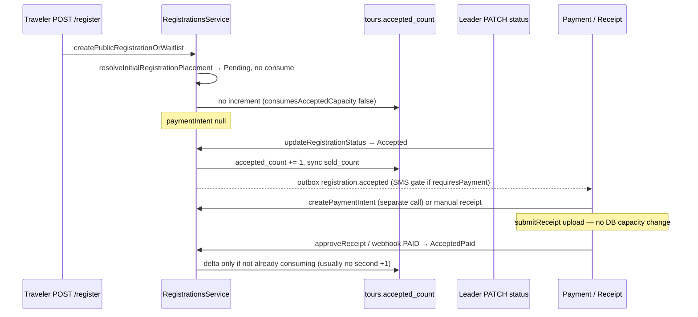

# Denali Full Security Audit Report

**Audit type:** Read-only architecture and security inspection  
**Date:** 2026-05-22  
**Scope:** Backend modules `tours`, `registrations`, `finance/receipts`, `auth`, plus ledger durability (`persistLedgerJournal`) and related database migrations  
**Auditor role:** Senior Security Auditor (static code review; no runtime penetration testing)

---

## Executive Summary

| Area | Overall posture | Highest concern |
|------|-----------------|-----------------|
| **Tenant isolation (tours)** | Strong on HTTP read/write paths | Catalog sync helper queries product/departure/price **without** `tenantId` (defense-in-depth gap) |
| **Tenant isolation (registrations)** | Strong | Public signup resolves tenant from tour row; actor-scoped reads via `ownership-scope.ts` |
| **Tenant isolation (receipts)** | Strong on mutations | List/signed-URL reads skip `runInTenantScope` but filter `tenantId` explicitly |
| **Tenant isolation (auth)** | Mixed | Pre-auth global phone/invite queries; onboarding completion trusts JWT `tenant_id` without host reconciliation |
| **Concurrent last seat** | Serialized on **`tours` row** (`FOR UPDATE`) | `tour_departures` mirrored **without** optimistic version; not the primary capacity authority |
| **Registration optimistic lock** | Enforced on leader PATCH | Status transition validated on **pre-lock peek** (stale-rule edge) |
| **Ledger balance isolation** | Row-level partition by `(tenant_id, account, currency)` | `persistLedgerJournal` does not call `assertLedgerLinesFinanceTenantScope`; ledger tables lack RLS |

**Bottom line:** Cross-tenant **balance row merging** is prevented by composite primary keys and FKs. Cross-tenant **data reads** are largely prevented by explicit `tenantId` filters tied to JWT/host context. Residual risk is **mis-attribution** (wrong `tenantId` passed from application code), **pre-auth enumeration**, and **partial double-entry** under constraint failures—not silent blending of two tenants into one balance bucket.

---

## Methodology

1. Static review of NestJS services, entities, controllers, policies, and migrations under `apps/api/src/modules/{tours,registrations,finance,receipts,auth}`.
2. Grep for `manager.query`, raw SQL, `jsonb` SQL operators (`@>`, `->>`), `VersionColumn` / `row_version`, `pessimistic_write`, and `tenantId` predicates.
3. Trace JWT → `RequestContextService.resolveEffectiveTenantId()` → repository `where` clauses.
4. No live DB queries, no traffic capture, no map.md / map.log edits.

---

## 1. Tenant Leak Check

### 1.1 Tenant context resolution (shared foundation)

| Mechanism | Location | Behavior |
|-----------|----------|----------|
| Host tenant | `apps/api/src/common/tenant/tenant-resolver.middleware.ts` | Resolves workspace from host; strict on auth login routes (`auth-route-policy.ts`). |
| JWT membership | `apps/api/src/common/middleware/auth.middleware.ts` | Requires `tenant_id`, `sub`, `role`, `sess_ver`; verifies `user_tenants` for effective tenant. |
| Effective tenant | `apps/api/src/common/request-context/request-context.service.ts` | `resolveEffectiveTenantId()` prefers ALS `tenantId` (JWT), then `req.tenant`, then `hostTenantId`; normalizes to lowercase. |
| Actor-scoped registration access | `apps/api/src/common/security/ownership-scope.ts` | `registrationWhereForActor` always includes `tenantId` from context (admin/leader/member rules). |

**Raw SQL in scoped modules:**

| Module | Raw SQL |
|--------|---------|
| `tours` | **None** |
| `registrations` | **None** |
| `finance/receipts` | **None** |
| `auth` | OTP challenges via `otp.service.ts` (global table, no tenant column—by design) |
| `finance/ledger` | **Only** `persist-ledger-journal.ts` (parameterized; tenant per line) |

**JSONB in SQL:** No `jsonb @>` / `->>` operators in these modules. JSONB columns (`cost_context`, `trip_details`, `payment_metadata`, ledger `metadata`) are read/written through TypeORM or in-memory validation (`collect-workspace-catalog-ids.ts` → `assert-workspace-catalog-ids.ts` with `workspaceId: tenantId`).

---

### 1.2 Module: `tours`

**Primary files:** `tours.service.ts`, `application/tours-catalog-read.application.service.ts`, `tours.drafts.controller.ts`, `tours.controller.ts`

#### Strengths

- Tour mutations load with **tenant + pessimistic lock**:

```380:394:apps/api/src/modules/tours/tours.service.ts
  private async loadTourForUpdateLocking(
    tourRepo: Repository<TourEntity>,
    tourId: string,
    tenantId: string
  ): Promise<TourEntity | null> {
    return tourRepo
      .createQueryBuilder("t")
      ...
      .where("t.id = :tourId", { tourId })
      .andWhere("t.tenantId = :tenantId", { tenantId })
      .setLock("pessimistic_write", undefined, ["t"])
      .getOne();
  }
```

- `listTours` / `getTourById` / catalog read paths filter `t.tenantId = :tenantId`.
- Workspace catalog ID validation: `assert-workspace-catalog-ids.ts` uses `{ id: In(...), workspaceId: tenantId }`.
- Leader ID validation: `assert-leader-user-ids-belong-to-tenant.ts` uses `{ tenantId, userId: In(...) }`.
- Drafts: `{ workspaceId: tenantId, userId }` after URL/workspace match.

#### Findings

| ID | Severity | Location | Issue |
|----|----------|----------|-------|
| TOUR-01 | **Medium** (defense-in-depth) | `tours.service.ts` ~260–290 `syncProductDepartureForTourWithRepos` | `tourProduct.findOne({ id })`, `tourDeparture.findOne({ id })`, `tourPrice.findOne({ tourDepartureId })` **without** `tenantId`. Caller already holds tenant-scoped tour; FK integrity usually holds; corrupted `tourProductId` could touch another tenant’s catalog row. |
| TOUR-02 | **Medium** | `TourPriceEntity` / `catalog-pricing-load.adapter.ts` | Prices keyed by `tourDepartureId` only; isolation depends on departure load including `tenantId`. |
| TOUR-03 | **Low** | `getTourById`, `listTours`, `loadTourForUpdateLocking` | No `deletedAt: IsNull()` on most paths (soft-deleted tours still visible within tenant). |
| TOUR-04 | **Low** | `ToursCatalogReadApplicationService` vs `ToursService` | Public list/get use simpler stack (no regional scope / FTS); authorization nuance, not missing `tenantId`. |
| TOUR-05 | **Info** | Module-wide | No global TypeORM tenant filter extension; every query must add `tenantId` explicitly. |

**Verdict:** No evidence of **unchecked raw SQL** or JSONB SQL traversal leaks. Residual cross-tenant risk is **narrow** (catalog sync secondary loads).

---

### 1.3 Module: `registrations`

**Primary files:** `registrations.service.ts`, `repositories/registrations-read.repository.ts`, `registrations-policy.ts`, `ownership-scope.ts` (common)

#### Strengths

- All reads for PATCH/list go through `registrationWhereForActor` → includes `tenantId`.
- Tour capacity mutations:

```1023:1040:apps/api/src/modules/registrations/registrations.service.ts
  private async requireTourInTenantForUpdate(
    manager: EntityManager,
    tourId: string,
    tenantId: string
  ): Promise<TourEntity> {
    const tour = await manager
      .getRepository(TourEntity)
      .createQueryBuilder("tour")
      .setLock("pessimistic_write")
      .where("tour.id = :tourId", { tourId })
      .andWhere("tour.tenant_id = :tenantId", { tenantId })
      .getOne();
```

- Public registration: `tenantId` taken from **tour row** (`createPublicRegistrationOrWaitlist` ~1711–1728), then `requireTourInTenantForUpdate`.
- Authenticated create: `assertJwtTenantMatchesTourForAuthenticatedMutation` in `registrations-policy.ts`.
- Duplicate checks, waitlist queries, snapshot restore: include `tenantId`.
- GET registration: extra check registration `tenantId` vs effective context (~568–578).
- Payments port: `lockRegistrationByTenantAndId(manager, payment.tenantId, ...)`.

#### Findings

| ID | Severity | Location | Issue |
|----|----------|----------|-------|
| REG-TEN-01 | **Low** | `createPublicRegistrationOrWaitlist` ~1711 | Initial `findOne(TourEntity, { id })` without `tenantId` before deriving tenant—acceptable for public tour UUID lookup; returns 404 if missing. |
| REG-TEN-02 | **Info** | `syncTourDepartureFromTour` ~1048–1056 | Updates `tour_departures` by `{ id: tour.id }` only—no `tenantId` in WHERE (departure id aligned with tour id in foundation model). |
| REG-TEN-03 | **Info** | DTOs | Clients cannot supply `tenantId` on create (by design). |

**Verdict:** **Strong** tenant enforcement on registration and waitlist persistence. No raw SQL bypass.

---

### 1.4 Module: `finance/receipts`

**Primary file:** `receipt.service.ts`  
**Controller:** `finance-payments.controller.ts` passes `resolveEffectiveTenantId()` only.

#### Strengths

- `submitReceipt`, `approveReceipt`, `rejectReceipt` use `TenantDbContextService.runInTenantScope(tenantId, ...)` **and** `where: { ..., tenantId: params.tenantId }` on payments, registrations, receipts.
- Approve path re-locks registration with `tenantId` via `lockRegistrationForFinancialMutation`.

#### Findings

| ID | Severity | Location | Issue |
|----|----------|----------|-------|
| RCPT-01 | **Low** | `getReceiptSignedUrl`, `listPendingReceipts` | `@InjectRepository` reads **outside** `runInTenantScope`; mitigated by explicit `where: { tenantId }`. No session `app.tenant_id` GUC on these reads. |
| RCPT-02 | **Info** | `submitReceipt` | `UserEntity` loaded by `id` only (global identity table—expected). |
| RCPT-03 | **Low** (policy) | `receipt-upload-authorization.ts` | Any tenant `Leader` may upload for any manual payment in tenant (in-tenant over-permission, not cross-tenant). |

**Verdict:** No cross-tenant receipt read/write path identified when controller supplies correct JWT tenant.

---

### 1.5 Module: `auth`

**Primary files:** `auth.service.ts`, `auth.controller.ts`, `workspace.service.ts`, middleware chain

#### Strengths

- Post-auth paths: `user_tenants` filtered by `userId` + `tenantId`.
- Web OTP login: requires `resolveEffectiveTenantId()` + membership.
- Workspace session switch: membership check on `dto.tenant_id`.
- JWT embeds `tenant_id`; middleware enforces host alignment except whitelisted routes (`skipsJwtHostTenantAlignment` for workspace session).

#### Findings

| ID | Severity | Location | Issue |
|----|----------|----------|-------|
| AUTH-01 | **Medium** (documented exemption) | `findUserByPhone`, `hasPendingInviteForPhone` | Global queries on `users` / `workspace_invites` without `tenant_id`—phone preflight can reveal existence and **cross-tenant** pending invites. |
| AUTH-02 | **Low** | `otp.service.ts` | `mobile_otp_challenges` has no tenant column; global raw queries. |
| AUTH-03 | **Medium** | `completeRegistration` ~643–706 | Onboarding JWT `tenant_id` used to create/activate membership **without** asserting equality to current host / `resolveEffectiveTenantId()`. Token minted on host A could complete on host B if token leaked. |
| AUTH-04 | **Low–Medium** | `createWorkspaceSession` | `TENANT_HOST_MISMATCH` only when host resolves; without host, user may switch to any tenant they belong to (intentional switcher). |
| AUTH-05 | **Info** | `users` table | Identity lookups are global; isolation via membership on mutating paths. |

**Verdict:** Auth is **not** a data-access layer for tours/registrations/ledger; tenant leaks here are **session/bootstrap** and **enumeration**, not direct registration row exposure.

---

### 1.6 Ledger tables and RLS (tenant leak adjacent)

Ledger tables (`ledger_journal_lines`, `ledger_journal_batches`, `account_balances`) are **not** listed in `1777576500000-TenantScopedTablesRlsCoverage.ts` or `1777581100000-StandardizeTenantScopedRlsPolicy.ts`.  
`payment_receipts` **has** RLS (`1777595600000-ManualPaymentsAndReceipts.ts`).

**Implication:** Compromised DB role or service account bypassing app filters could read/write any `tenant_id` on ledger tables. Application-layer isolation relies on **explicit parameters**, not `app.tenant_id` RLS.

---

## 2. Optimistic Locking & Concurrency

### 2.1 Last-seat race (two users, same millisecond)

**Authority for capacity:** `tours.accepted_count` vs `tours.total_capacity`, not `tour_departures` alone.

**Serialization model:**

1. `createPublicRegistrationOrWaitlist` / `createRegistration` call `requireTourInTenantForUpdate` → **`SELECT … FOR UPDATE`** on the tour row.
2. Capacity check: `tour.acceptedCount >= tour.totalCapacity` → waitlist or 409.
3. Increment `acceptedCount` inside same transaction when placement consumes capacity.
4. `assertTourCapacityInvariant` throws if invariant violated.

**Waitlist FIFO:** `pessimistic_write` + `skip_locked` on oldest waiting row (`getOldestWaitingWaitlistItemForUpdate`).

**Deadlock ordering (payments):** Tour lock before registration lock (`registration-payment.port.ts`; implemented in `payments.service.ts`).

**Concurrent outcome:** Second transaction blocks on tour row until first commits; then sees updated `acceptedCount` and routes to waitlist or rejects—**no optimistic “hope” on capacity**.

#### `tour_departures` role

```16:67:apps/api/src/modules/tours/entities/tour-departure.entity.ts
@Entity("tour_departures")
export class TourDepartureEntity {
  ...
  @Column({ type: "int", name: "sold_count", default: 0 })
  soldCount!: number;
  ...
  @UpdateDateColumn({ type: "timestamptz", name: "updated_at" })
  updatedAt!: Date;
}
```

- **No** `@VersionColumn` / `row_version` on `TourDepartureEntity`.
- `syncTourDepartureFromTour` performs `manager.update(TourDepartureEntity, { id: tour.id }, { soldCount, capacityTotal, ... })` **without** version check—mirror of tour counters.
- Bookable departure id: `tour.tourDepartureId ?? tour.id` (`bookable-departure-id.ts`).

**Assessment:** Last-seat correctness depends on **`tours` pessimistic lock**, not departure row versioning. Departure table is a **dual-write mirror**; drift possible if mirror update fails while tour save succeeds (operational integrity, not double-booking of last seat on tour row).

---

### 2.2 `registrations.row_version`

**Schema:** `registrations.row_version` (`1777594100000-RegistrationRowVersion.ts`)

**Entity:**

```35:36:apps/api/src/modules/registrations/registration.entity.ts
  @VersionColumn({ type: "int", name: "row_version", default: 1 })
  rowVersion!: number;
```

| Operation | Client `expected_row_version` | Explicit assert | TypeORM version on save |
|-----------|------------------------------|-----------------|-------------------------|
| `updateRegistrationStatus` | **Required** (DTO) | Yes, on **peek before lock** | Yes (`saveRegistrationOrVersionConflict`) |
| `updateRegistrationPayment` | **Required** | Yes, **after** `lockRegistrationForFinancialMutation` | Yes |
| `createPublicRegistrationOrWaitlist` | N/A | No | Insert only |
| Internal payment transitions | No | No | Yes on UPDATE when row exists |
| Waitlist promote / convert | No | No | Insert/update without client token |

**Status PATCH sequence (concurrency nuance):**

```583:632:apps/api/src/modules/registrations/registrations.service.ts
      const peek = await this.registrationsReadRepository.findOneInManager(manager, where);
      ...
      this.assertExpectedRegistrationRowVersion(peek, payload.expected_row_version);
      validateStatusTransition(peek.status, payload.targetStatus, peek.paymentStatus);
      ...
      const registration = await lockRegistrationForFinancialMutation(manager, where);
```

- Transition rules run on **peek**; version checked on peek, not re-checked on locked row.
- Concurrent writer can bump `row_version` between peek and lock; **save** still fails via TypeORM if stale entity—but transition validation may have used stale status. Payment PATCH is stricter (assert after lock).

**Public signup:** No client version token; concurrency handled by **tour row lock**, not registration version.

**Verdict:** Optimistic locking is **strict** for leader-facing PATCH APIs. It does **not** gate public booking; capacity uses **pessimistic** tour locking. `tour_departures` is **not** optimistically locked.

---

### 2.3 `account_balances.row_version` (finance)

`AccountBalanceEntity` has `@VersionColumn`, but `persistLedgerJournal` updates balances via **atomic SQL**:

```71:79:apps/api/src/modules/finance/ledger/persist-ledger-journal.ts
      INSERT INTO account_balances (tenant_id, account, balance_minor, currency, row_version, updated_at)
      VALUES ($1, $2, $3::bigint, $4, 1, now())
      ON CONFLICT (tenant_id, account, currency) DO UPDATE SET
        balance_minor = account_balances.balance_minor + EXCLUDED.balance_minor,
        row_version = account_balances.row_version + 1,
```

Concurrent posts to the same `(tenant_id, account, currency)` serialize on row upsert—**no read-modify-write race** on balance in application code. Version is incremented but not used for conflict detection in persist path.

---

## 3. Double-Entry Ledger Balance Isolation (`persistLedgerJournal`)

### 3.1 Schema guarantees

| Artifact | Tenant isolation mechanism |
|----------|---------------------------|
| `account_balances` PK | `(tenant_id, account, currency)` — **per-tenant partition** |
| `ledger_journal_lines` | `tenant_id` NOT NULL, FK → `tenants`; `UNIQUE (tenant_id, idempotency_key)` |
| `ledger_journal_batches` PK | `(tenant_id, journal_id)` |
| `FK_ledger_journal_lines_batch` | Line `(tenant_id, journal_id)` must match batch |
| Payments/receipts FK | `(tenant_id, ledger_journal_id)` → batch |

Migration `1777600200000-AccountBalancesCurrencyPrimaryKey.ts` rebuilds balances from lines grouped by `(tenant_id, account, currency)`—fixes mixed-currency clobbering.

### 3.2 `persistLedgerJournal` behavior

**File:** `apps/api/src/modules/finance/ledger/persist-ledger-journal.ts` (sole finance raw SQL writer)

1. Batch header uses **`lines[0].tenantId` only** (line 25).
2. Each line insert uses **`line.tenantId`** for line row and balance upsert (lines 50, 80).
3. Idempotency: `ON CONFLICT (tenant_id, idempotency_key) DO NOTHING`; balance delta only if insert returns row.
4. Balance: `ON CONFLICT (tenant_id, account, currency) DO UPDATE` adds signed delta to **that tenant’s** row.

**Does invalid `tenantId` pollute another tenant’s balances?**

| Scenario | Cross-tenant balance merge? | Effect |
|----------|------------------------------|--------|
| Wrong `tenantId` on both lines (bug upstream) | **No** — writes to wrong tenant’s partition | **Mis-attribution** (tenant B credited for tenant A’s payment) |
| Mixed `tenantId` on lines, same `journalId` | **Unlikely** — second line FK to batch fails | Possible **partial journal** (first line posted, second fails)—**single-tenant** corruption |
| Duplicate `id` globally | PK on line `id` blocks | No cross-update |
| Same account string in two tenants | **Intentional** | Isolated by `tenant_id` in PK |

**Gap:** `assertLedgerLinesFinanceTenantScope` (`ledger-tenant-scope.ts`) is used for **outbox emit** and reconciliation assembly, **not** inside `persistLedgerJournal`. Production callers (`postAndPersistDoubleEntryJournal`, booking/payment authority services) pass single `tenantId` on both lines from `payment.tenantId` / `registration.tenantId`.

**RLS:** Ledger tables lack RLS; isolation is app + PK/FK.

**Outbox-only path:** `reconciliation-operator-ledger-adjustment.ts` may post in-memory without `postAndPersist*`—does not touch `account_balances` until persisted elsewhere.

### 3.3 Read paths (balance exposure)

| Reader | Tenant filter |
|--------|---------------|
| `wallet-projection.ts` | `{ tenantId, account, currency }` |
| `payment-finance-reconciliation.loader.ts` | `tid` on lines, balances, payments |
| `payment-refund-ledger-authority.service.ts` | `{ tenantId, journalId }` |
| `users-member-wallet-balances.service.ts` | Explicit `tenantId` (no `runInTenantScope`) |

`sumWalletBalanceFromLedgerLines` throws if any line tenant ≠ projection tenant.

### 3.4 Verdict (ledger)

- **Cannot** merge two tenants into one `account_balances` row.
- **Can** mis-post to wrong tenant if upstream passes wrong `tenantId` (application bug, not SQL join leak).
- **Should** add `assertLedgerLinesFinanceTenantScope` at persist entry for defense in depth.
- **Should** consider RLS on ledger tables consistent with `payment_receipts`.

---

## 4. Risk Register (Prioritized)

| Priority | ID | Domain | Risk | Likelihood | Impact |
|----------|-----|--------|------|------------|--------|
| P1 | AUTH-03 | Auth | Onboarding completion without host/token tenant match | Medium | Medium |
| P1 | LEDGER-01 | Finance | `persistLedgerJournal` lacks in-function tenant batch assert | Low | High (mis-post) |
| P2 | TOUR-01 | Tours | Catalog sync without `tenantId` on secondary loads | Low | Medium |
| P2 | AUTH-01 | Auth | Cross-tenant invite visibility on phone preflight | Medium | Low–Medium |
| P2 | REG-LOCK-01 | Registrations | Status PATCH validates transition on pre-lock peek | Medium | Low–Medium |
| P3 | RCPT-01 | Receipts | Reads outside `runInTenantScope` | Low | Low |
| P3 | LEDGER-02 | Finance | Ledger tables without RLS | Low | High (if DB creds leak) |
| P3 | TOUR-03 | Tours | Soft-deleted tours still accessible | Medium | Low |
| P4 | AUTH-04 | Auth | Workspace session without host binding | Medium | Low |

---

## 5. Recommendations (Informational)

### Tenant isolation

1. Add `tenantId` to all `syncProductDepartureForTourWithRepos` repository `findOne` calls.
2. **AUTH-03:** In `completeRegistration`, assert `onboarding.tenantId === resolveEffectiveTenantId()` (and host slug if resolved).
3. **AUTH-01:** Scope `hasPendingInviteForPhone` to host tenant when available.
4. **RCPT-01:** Wrap `listPendingReceipts` / `getReceiptSignedUrl` in `runInTenantScope`.
5. Enable **RLS** on `ledger_journal_lines`, `ledger_journal_batches`, `account_balances` using the same baseline policy as other tenant-scoped tables.

### Concurrency

6. **REG-LOCK-01:** Re-run `assertExpectedRegistrationRowVersion` and `validateStatusTransition` on the **locked** registration row in `updateRegistrationStatus`.
7. Add `tenantId` to `syncTourDepartureFromTour` update WHERE clause.
8. Consider `@VersionColumn` on `tours` if leader PATCH on tour metadata must not clobber capacity (separate from registration version).

### Ledger

9. Call `assertLedgerLinesFinanceTenantScope(lines[0].tenantId, lines)` at start of `persistLedgerJournal`.
10. Add integration test: mixed `tenantId` on two lines, same `journalId` → FK failure, no net change to other tenant’s balances.
11. Align `payment.tenantId.trim()` with `normalizeFinanceTenantId` everywhere.

---

## 6. File Index (Key Evidence)

| Topic | Path |
|-------|------|
| Tour lock + tenant | `apps/api/src/modules/tours/tours.service.ts` |
| Catalog sync (no tenant) | `apps/api/src/modules/tours/tours.service.ts` (~260–290) |
| Registration version | `apps/api/src/modules/registrations/registration.entity.ts` |
| Status/payment PATCH | `apps/api/src/modules/registrations/registrations.service.ts` |
| Tour capacity lock | `apps/api/src/modules/registrations/registrations.service.ts` (~1023–1056) |
| Public register | `apps/api/src/modules/registrations/registrations.service.ts` (~1685–1812) |
| Actor tenant where | `apps/api/src/common/security/ownership-scope.ts` |
| Registration lock helper | `apps/api/src/modules/registrations/utils/lock-registration-for-financial-mutation.ts` |
| Persist ledger SQL | `apps/api/src/modules/finance/ledger/persist-ledger-journal.ts` |
| Ledger tenant assert | `apps/api/src/modules/finance/ledger/ledger-tenant-scope.ts` |
| Account balance entity | `apps/api/src/modules/finance/ledger/entities/account-balance.entity.ts` |
| Receipt service | `apps/api/src/modules/finance/receipts/receipt.service.ts` |
| Auth complete registration | `apps/api/src/modules/auth/auth.service.ts` (~643–706) |
| JWT / effective tenant | `apps/api/src/common/request-context/request-context.service.ts` |
| Ledger migrations | `apps/api/src/database/migrations/1777600000000-*.ts`, `1777600200000-*.ts`, `1777600300000-*.ts` |

---

## 7. Audit Limitations

- Static analysis only; race conditions under specific PostgreSQL isolation levels not simulated.
- Frontend/BFF (`apps/web`) out of scope except where noted for `expected_row_version` handoff.
- Infrastructure (network, secrets, WAF) not reviewed.
- Test coverage gaps (e.g. no mixed-tenant `persistLedgerJournal` test) noted but not exhaustively mapped.

---

*End of report.*

---

# Phase 16.3 / Pre-Payment Host Gate — Dynamic Architecture Audit (Appendix)

**Audit type:** Read-only execution trace (static)  
**Date:** 2026-05-22  
**Focus:** Pre-pay placement stream, payment-intent bypass at signup, capacity counter correlation (`tours.accepted_count` → `tour_departures.sold_count`)

---

## Appendix Executive Summary

| Item | Verdict | Notes |
|------|---------|-------|
| **1. Pre-pay placement** | **Confirmed** for default paid-tour config (`autoAcceptRegistrations !== true`) | `resolveInitialRegistrationPlacement` does **not** read `requiresPayment`; placement is **`Pending` + `consumesAcceptedCapacity: false`** unless `autoAcceptRegistrations === true`. |
| **2. Payment intent bypass at signup** | **Confirmed** in `RegistrationsService` | `createPublicRegistrationOrWaitlist` always returns `paymentIntent: null`; optional `createPaymentIntent` callback is **never invoked**. Orchestrator still **passes** a hook (dead wiring). Post-approval SMS gate fires only on **`Pending → Accepted`**. |
| **3. Capacity correlation** | **Partially matches** stated intent | Initial signup and **receipt upload** do **not** increment. **Host PATCH** `Pending → Accepted` increments. **Receipt approve** and **online PAID webhook** increment via `Pending → AcceptedPaid` (also capacity-consuming). Additional paths: waitlist promotion / manual convert. |

---

## 1. Pre-Pay Placement Stream

### 1.1 Canonical function (single source of truth)

**File:** `apps/api/src/modules/registrations/registrations.service.ts`  
**Method:** `resolveInitialRegistrationPlacement` (private, lines **953–961**)

```953:961:apps/api/src/modules/registrations/registrations.service.ts
  private resolveInitialRegistrationPlacement(tour: TourEntity): {
    status: RegistrationStatus;
    consumesAcceptedCapacity: boolean;
  } {
    if (tour.autoAcceptRegistrations === true) {
      return { status: RegistrationStatus.ACCEPTED, consumesAcceptedCapacity: true };
    }
    return { status: RegistrationStatus.PENDING, consumesAcceptedCapacity: false };
  }
```

**Decision logic (exact):**

| Condition | `status` | `consumesAcceptedCapacity` |
|-----------|----------|---------------------------|
| `tour.autoAcceptRegistrations === true` | `Accepted` | `true` |
| **Else** (including all paid tours with default/autoAccept off) | `Pending` | `false` |

**Critical nuance:** The function does **not** inspect `tour.costContext.requiresPayment`. A **paid** tour with **`autoAcceptRegistrations === true`** would still place as **`Accepted`** and consume capacity immediately—bypassing the host gate. Phase 16.3 host-gate behavior for “paid tours” assumes **`autoAcceptRegistrations` is false** in production configuration.

---

### 1.2 Call sites (execution line trace)

#### Path A — Authenticated `createRegistration`

| Step | Lines | Action |
|------|-------|--------|
| Tour locked | 271–275 | `requireTourInTenantForUpdate` |
| Placement resolved | **316** | `const placement = this.resolveInitialRegistrationPlacement(tour);` |
| Entity created | 318–334 | `status: placement.status`, `paymentStatus: NOT_PAID` |
| Capacity increment | **336–341** | **Only if** `placement.consumesAcceptedCapacity` → `tour.acceptedCount += 1`, `save`, `syncTourDepartureFromTour` |
| Outbox | 348–354 | `emitRegistrationCreatedEvent` with `paymentRequired` from `requiresPayment` (informational only) |

`paymentRequired` (lines 312–315) is computed separately and **does not** change placement.

#### Path B — Public `createPublicRegistrationOrWaitlist` (primary traveler signup)

| Step | Lines | Action |
|------|-------|--------|
| Tour peek + lock | 1711–1729 | Tenant from tour; `requireTourInTenantForUpdate` |
| Capacity full branch | 1741–1781 | Waitlist (no registration placement) |
| Placement resolved | **1784** | `const placement = this.resolveInitialRegistrationPlacement(tour);` |
| `requiresPayment` flag | 1785–1788 | Used for outbox/SMS metadata only |
| Registration insert | 1790–1806 | `status: placement.status` |
| Capacity increment | **1807–1812** | **Only if** `placement.consumesAcceptedCapacity` |
| Events | 1818–1832 | `emitPublicRegistrationAcceptedEvent` if `Accepted`; else `emitRegistrationCreatedEvent` with `paymentRequired` |
| Response | **1834–1838** | `paymentIntent: null` (hard-coded) |

**HTTP entry:**

- `POST /api/v2/tours/:tourId/register` → `RegistrationsController.publicRegister` (152–190) → `RegistrationPlacementOrchestrator.publicRegister` → `createPublicRegistrationOrWaitlist` **with** optional `createPaymentIntent` in spread payload (orchestrator lines 96–101)—**service ignores callback**.
- `POST /api/v2/tours/:tourId/waitlist` → controller (228–231) calls service **without** orchestrator or payment hook.

#### Path C — Not used for initial placement

- `updateRegistrationStatus` — leader-driven transitions **after** insert.
- `transitionRegistrationForPayment` — payment/receipt finalization.
- Waitlist `convertWaitlistItem` — creates **`Accepted`** directly (separate flow, §3).

---

### 1.3 Confirmation vs audit question

**Question:** For paid tours, does placement unconditionally lock to `Pending` and `consumesAcceptedCapacity: false`?

**Answer:**

- **Yes** when `autoAcceptRegistrations !== true` (expected Denali paid-tour default)—**regardless of** `requiresPayment`.
- **No** when `autoAcceptRegistrations === true`—immediate `Accepted` + capacity consumption even for paid tours.

**Recommendation:** If product intent is “paid ⇒ always host gate,” add an explicit guard, e.g. `requiresPayment && !autoAccept` → `Pending`, or forbid `autoAcceptRegistrations` when `requiresPayment` is true at tour publish time.

---

## 2. Payment Intent Bypass Immunity

### 2.1 Service-layer hard stop at signup

`createPublicRegistrationOrWaitlist` declares an optional hook:

```1696:1699:apps/api/src/modules/registrations/registrations.service.ts
    createPaymentIntent?: (
      manager: EntityManager,
      registration: RegistrationEntity
    ) => Promise<PaymentResponseDto>;
```

**Static search result:** `createPaymentIntent` appears **only** in this signature within `registrations.service.ts`. The method body **never** calls `input.createPaymentIntent(...)`.

**Return contract (always):**

```1834:1838:apps/api/src/modules/registrations/registrations.service.ts
      return {
        type: "registration" as const,
        registration: this.toRegistrationResponse(saved),
        requiresPayment,
        paymentIntent: null
      };
```

**Immunity verdict:** No PSP row, no `PaymentsService.createPaymentIntentWithManager`, no checkout payload is created **inside** the registration placement transaction at signup.

---

### 2.2 Orchestrator layer (dead hook wiring)

**File:** `apps/api/src/modules/registrations/application/registration-placement.orchestrator.ts`

| Method | Lines | Behavior |
|--------|-------|----------|
| `createPaymentIntentForRegistration` | 19–56 | Would call `paymentsService.createPaymentIntentWithManager` if ever invoked |
| `createAuthenticatedBooking` | 63–67 | Passes `createPaymentIntent` callback into service |
| `publicRegister` | 96–100 | Same callback passed |

Because the service never invokes the callback, orchestrator wiring is **benign at runtime** but **misleading for reviewers**—looks like signup-time intents are still supported.

**Controllers:**

- `POST /api/v2/bookings` (member shortcut) → orchestrator → same null intent result.
- `POST /api/v2/tours/:tourId/register` → orchestrator → null intent.

---

### 2.3 When payment intents *do* become available

| Trigger | Mechanism | Gated by host accept? |
|---------|-----------|------------------------|
| Traveler opens booking detail | Frontend `registrationNeedsPaymentUi` requires `status === "Accepted"` (`apps/web/lib/payment-flow.ts` ~81) | **Yes** (UI) |
| `POST /api/v2/payments/intent` | Separate API after registration exists | Server should reject if not accepted (payment flow / registration port) |
| Manual payment + receipt | Leader creates manual payment; traveler uploads receipt | Approve transitions to `AcceptedPaid` (§3) |
| Online webhook `PAID` | `PaymentsService.applyPaymentStatus` → `transitionRegistrationForPayment(..., ACCEPTED_PAID)` | Typically after accept + intent |

**Post-approval SMS / payment nudge (outbox):**

**File:** `apps/api/src/modules/outbox/registration-accepted-sms-outbox.handler.ts`

- Dispatches only when outbox metadata shows **`previousStatus === Pending`** and **`newStatus === Accepted`** (lines 40–44).
- Requires `paymentStatus === NOT_PAID` and `tourRequiresPayment(costContext)` (lines 58–67).
- Aligns with “notify to pay **after** host accept,” not at initial reservation.

**Initial reservation outbox:** `emitRegistrationCreatedEvent` / public variant—no payment intent, no SMS gate.

---

### 2.4 Frontend checkout redirection (out of band)

**File:** `apps/web/app/(app)/tours/[id]/register/register-for-tour-client.tsx`

- Success handler may link to `/bookings/{id}?checkout=1` when `owesPaymentAfterRegister` is true (lines 433–447).
- `owesPaymentAfterRegister` uses `registrationNeedsPaymentUi`, which returns **false** for `Pending` status—so **post–Phase 16.5 UI** should not append `?checkout=1` until **Accepted**.
- Legacy success copy referencing `placement.paymentIntent` is effectively dead (API always returns `null`).

**Immunity verdict:** **Backend immune** at signup; **frontend** must keep gating on `Accepted` (currently aligned via `payment-flow.ts`).

---

## 3. Capacity Correlation (`accepted_count` / `sold_count`)

### 3.1 Authority and mirror

| Store | Column | Role |
|-------|--------|------|
| `tours` | `accepted_count` | **Primary** capacity authority; incremented under tour `FOR UPDATE` |
| `tour_departures` | `sold_count`, `capacity_total` | **Mirror** via `syncTourDepartureFromTour` |

```1043:1056:apps/api/src/modules/registrations/registrations.service.ts
  private async syncTourDepartureFromTour(
    manager: EntityManager,
    tour: TourEntity
  ): Promise<void> {
    await manager.update(
      TourDepartureEntity,
      { id: tour.id },
      {
        soldCount: tour.acceptedCount,
        capacityTotal: tour.totalCapacity,
        lifecycleStatus: tour.lifecycleStatus
      }
    );
  }
```

Every increment path below that saves the tour and calls `syncTourDepartureFromTour` updates **`sold_count`** in the same transaction.

**Capacity-consuming registration statuses** (`registration-outbox-event-type.ts` lines 4–7):

- `Accepted`
- `AcceptedPaid`  
- **`Pending` is not consuming.**

---

### 3.2 Increment matrix (all code paths)

| # | Trigger | File / method | Lines | Registration transition | Increments `accepted_count`? |
|---|---------|---------------|-------|-------------------------|------------------------------|
| 1 | Initial authenticated create | `createRegistration` | 336–340 | New row: `Accepted` only if `autoAccept` | **Only if** `consumesAcceptedCapacity` |
| 2 | Initial public signup | `createPublicRegistrationOrWaitlist` | 1807–1812 | New row: `Pending` (default) | **No** (default paid path) |
| 3 | Leader host accept | `updateRegistrationStatus` | 627–630 | `applyAcceptedCounterDelta` when `Pending → Accepted` | **Yes** |
| 4 | Leader reject/cancel from accepted | `updateRegistrationStatus` | 627–630 | `Accepted*` → non-consuming | **Decrement** (release seat) |
| 5 | Payment webhook / apply PAID | `transitionRegistrationForPayment` | 1645–1648 | Often `Pending → AcceptedPaid` | **Yes** (`AcceptedPaid` consuming) |
| 6 | Receipt **approve** (cash) | `receipt.service` → `transitionRegistrationForPayment` | 198–203 | `Pending → AcceptedPaid` (typical) | **Yes** |
| 7 | Receipt **submit** (upload only) | `submitReceipt` | 46–124 | None | **No** |
| 8 | Waitlist FIFO promotion | `promoteNextWaitlistItem` | 1596–1599 | New/promoted registration → consuming status | **Yes** (direct `+= 1`) |
| 9 | Manual waitlist convert | `convertWaitlistItem` | 887–902 | Creates **`Accepted`** immediately | **Yes** (direct `+= 1`) |

**Core delta helper (host PATCH and payment transitions):**

```1470:1488:apps/api/src/modules/registrations/registrations.service.ts
  private applyAcceptedCounterDelta(
    tour: TourEntity,
    previousStatus: RegistrationStatus,
    targetStatus: RegistrationStatus
  ): void {
    const wasAccepted = isCapacityConsumingRegistrationStatus(previousStatus);
    const willBeAccepted = isCapacityConsumingRegistrationStatus(targetStatus);
    if (wasAccepted === willBeAccepted) {
      return;
    }
    if (willBeAccepted) {
      tour.acceptedCount += 1;
      ...
    }
    tour.acceptedCount = Math.max(0, tour.acceptedCount - 1);
    ...
  }
```

`ensureCapacityForAcceptance` (1439–1467) blocks `Pending → Accepted` (or → `AcceptedPaid`) when tour is full.

---

### 3.3 Validation against audit questions

#### Q1: Initial reservation does **not** increment?

**Confirmed** for default placement (`Pending`, `consumesAcceptedCapacity: false`). Lines **1807–1812** guarded by `if (placement.consumesAcceptedCapacity)`.

#### Q2: Initial cash receipt **upload** does **not** increment?

**Confirmed.** `submitReceipt` only creates `PaymentReceiptEntity` with `PENDING` status; no tour lock, no `transitionRegistrationForPayment`, no counter mutation.

#### Q3: Increments **strictly only** on `Pending → Accepted`?

**Not strictly.** The codebase also increments on:

- **`Pending → AcceptedPaid`** via `transitionRegistrationForPayment` when:
  - Leader **approves** uploaded receipt (`receipt.service.ts` 198–203), or
  - Online payment reaches **`PAID`** (`payments.service.ts` 722–727).
- **Waitlist promotion / manual convert** (rows 8–9) without a prior `Pending` host-review step on that row.

**Host gate path (intended Phase 16.3 seat consumption at accept):**

```
PATCH /api/v2/registrations/:id/status  { targetStatus: "Accepted", expected_row_version }
  → updateRegistrationStatus (583+)
  → applyAcceptedCounterDelta(Pending, Accepted)  // +1
  → syncTourDepartureFromTour  // sold_count mirror
  → outbox registration.accepted → SMS gate if requiresPayment
```

**Cash path after host has accepted (manual payment record may exist while still `Pending` or `Accepted`):**

If registration is still **`Pending`** when receipt is approved, approve path jumps to **`AcceptedPaid`** and **still +1** via the same delta helper—**one** increment, not double, because `Pending` was not consuming.

If registration was already **`Accepted`** (host approved first) and receipt approve sets **`AcceptedPaid`**, `wasAccepted` and `willBeAccepted` are both true → **no second increment** (correct).

---

### 3.4 Sequence diagram (default paid tour, host gate)



---

## 4. Findings and Recommendations (Appendix)

| ID | Severity | Finding |
|----|----------|---------|
| PLACE-01 | **Info** | Placement ignores `requiresPayment`; relies on `autoAcceptRegistrations` flag alone. |
| PLACE-02 | **Medium** (config) | `autoAcceptRegistrations === true` on a paid tour bypasses `Pending` host gate entirely. |
| PAY-01 | **Info** | `createPaymentIntent` orchestrator hook is dead code relative to service implementation. |
| PAY-02 | **Low** | Remove or guard orchestrator callback to prevent future reintroduction of signup intents. |
| CAP-01 | **Confirmed** | Initial signup + receipt upload do not touch capacity counters (default path). |
| CAP-02 | **Medium** (semantic) | Capacity also increments on `Pending → AcceptedPaid`, not only `Pending → Accepted`. |
| CAP-03 | **Info** | Waitlist promotion/convert increment without host-review `Pending` phase. |

**Recommendations:**

1. Enforce at tour validation: `requiresPayment === true` ⇒ `autoAcceptRegistrations` must be `false`.
2. Delete or no-op `createPaymentIntent` in `RegistrationPlacementOrchestrator` to match service contract.
3. Document product rule: seat consumption at **host accept**; payment finalize may move to `AcceptedPaid` without second seat charge if already `Accepted`.
4. Add integration test: paid tour signup → `accepted_count` unchanged; leader accept → +1; `submitReceipt` → unchanged; `approveReceipt` → +1 only when prior status was `Pending`.

---

## Appendix File Index

| Topic | Path |
|-------|------|
| Placement resolver | `apps/api/src/modules/registrations/registrations.service.ts` (953–961, 316, 1784) |
| Public signup return | Same file (1834–1838) |
| Orchestrator (dead hook) | `apps/api/src/modules/registrations/application/registration-placement.orchestrator.ts` |
| Capacity helper | `apps/api/src/modules/registrations/domain/registration-outbox-event-type.ts` |
| Counter delta | `registrations.service.ts` (1470–1488, 1043–1056) |
| Receipt upload / approve | `apps/api/src/modules/finance/receipts/receipt.service.ts` |
| Online paid transition | `apps/api/src/modules/payments/payments.service.ts` (~722–727) |
| SMS gate | `apps/api/src/modules/outbox/registration-accepted-sms-outbox.handler.ts` |
| UI payment gate | `apps/web/lib/payment-flow.ts` |

---

*End of appendix.*

---

# Frontend Component Integrity Audit (Phase 16.4 / 16.5)

**Audit type:** Read-only UI/data-binding inspection  
**Date:** 2026-05-22  
**Scope:** Traveler registration wizard, booking detail suspense gate, leader/workspace registration tables (`rowVersion` → `expected_row_version`)

---

## Frontend Appendix Executive Summary

| Item | Verdict | Headline |
|------|---------|----------|
| **1. Registration form binding** | **Pass** (with documented optional-field omission rules) | `transportMode`, optional `vehicleSeatCapacity`, optional `participantNote` flow from RHF → `placementMutation` → `publicRegisterTour` → BFF proxy unchanged. |
| **2. Amber Pending gate** | **Pass** (not a visual overlay) | Payment CTAs are **not rendered** when `status === "Pending"`; dual-gated by `isPendingHostReview` and `registrationNeedsPaymentUi`. Minor edge: `?checkout=1` scroll + legacy success copy. |
| **3. Leader `rowVersion` binding** | **Pass** (409 on conflict, not typical 400) | Approve/Reject and Apply paths send `expected_row_version: reg.rowVersion` from live row objects; BFF PATCH proxies body as-is. Stale-row risk → `REGISTRATION_ROW_VERSION_CONFLICT`, not validation 400. |

---

## 1. Traveler Registration Form Inventory

**Primary file:** `apps/web/app/(app)/tours/[id]/register/register-for-tour-client.tsx`  
**Service:** `apps/web/lib/services/registrations.service.ts` (`publicRegisterTour`, `CreateRegistrationPayload`)  
**BFF:** `apps/web/app/api/tours/[tourId]/register/route.ts` → `proxyBffPost` (body forwarded unchanged)

### 1.1 Form state and controls

| Field | UI binding | Default | In Zod `IntakeSchema` | Sent on POST |
|-------|------------|---------|----------------------|--------------|
| `transportMode` | Radio `register("transportMode")` — `self_vehicle` / `group_vehicle` only (lines 510–532) | `group_vehicle` (line 157) | `z.enum([..., "other"])` — **no UI for `other`** | **Always** `values.transportMode` (line 179) |
| `vehicleSeatCapacity` | Number `Input` when `transportMode === "self_vehicle"` (534–555); cleared when mode changes (165–169) | `undefined` | Optional int 1–3 | **Only if** `self_vehicle` and valid integer 1–3 (183–193) |
| `participantNote` | `Textarea` + `register("participantNote")`; **placeholder** is display-only (558–561) | `""` | Optional, max 2000 | **Only if** trimmed non-empty (174–181) |

**Placeholder vs payload:** The Persian `notePlaceholder` string is **not** submitted as `participantNote`; empty note omits the key entirely. This is **intentional optional semantics**, not a stub field.

### 1.2 Mutation payload construction (authoritative)

```171:194:apps/web/app/(app)/tours/[id]/register/register-for-tour-client.tsx
  const placementMutation = useMutation({
    mutationFn: async (values: IntakeValues) => {
      ...
      const trimmedNote = values.participantNote?.trim();
      const base = {
        tourId,
        participantFullName: values.participantFullName.trim(),
        participantContactPhone: values.participantContactPhone.trim(),
        transportMode: values.transportMode,
        entryMode: "web" as const,
        ...(trimmedNote ? { participantNote: trimmedNote } : {}),
      };
      const seat = /* self_vehicle + valid 1..3 */ ? values.vehicleSeatCapacity : undefined;
      return publicRegisterTour(
        tourId,
        seat !== undefined ? { ...base, vehicleSeatCapacity: seat } : base,
      );
    },
```

**Alignment with `CreateRegistrationPayload` (lines 94–104 in `registrations.service.ts`):** All CRM fields are first-class typed properties; BFF posts `{ ...payload, tourId }` with idempotency key.

### 1.3 Gaps and non-issues

| Topic | Assessment |
|-------|------------|
| **`other` transport mode** | Schema allows `other`; UI exposes only two radios. Users cannot select `other` without devtools tampering. |
| **Empty seat on `self_vehicle`** | Valid submit without `vehicleSeatCapacity` in JSON (optional CRM field). |
| **Success UI still mentions payment intent** | Lines 426–436 handle `placement.paymentIntent` — API currently always returns `null`; copy is **legacy/dead** for Phase 16.3+, not a binding bug. |
| **Post-register redirect** | `owesPaymentAfterRegister` uses `registrationNeedsPaymentUi` (requires `Accepted`). **Pending** bookings get **“Track status”** without `?checkout=1` (lines 224–232, 446–449). |

**Verdict:** **Fully bound** for production paths; omissions are **explicit optional-field rules**, not placeholder substitution or forgotten keys.

---

## 2. Amber Alert Suspense Gate (`booking-detail-client.tsx`)

**Primary file:** `apps/web/app/(app)/bookings/booking-detail-client.tsx`  
**Copy:** `apps/web/app/(app)/bookings/booking-detail-copy.ts`  
**Payment eligibility:** `apps/web/lib/payment-flow.ts` — `registrationNeedsPaymentUi` returns **false** unless `status === "Accepted"`.

### 2.1 Pending detection

```241:242:apps/web/app/(app)/bookings/booking-detail-client.tsx
  const isPendingHostReview = reg.status === "Pending";
  const pendingCopy = BOOKING_DETAIL_COPY.pendingHostReview;
```

### 2.2 Banner presentation

- **Warning `Alert`** (`variant="warning"`, `dir="rtl"` on root) at top of content (lines 274–282).
- **Not a CSS overlay:** The banner does **not** `position: fixed` over the payment card; it **precedes** cards in document order. Functionally it **replaces** the payment UX block below via conditional rendering.

### 2.3 Checkout / payment control suppression

When `isPendingHostReview`:

| UI element | Rendered? | Mechanism |
|------------|-----------|-----------|
| `payment-intent-submit` button | **No** | Entire payment branch skipped (443–505 else branch) |
| “Payment required” info `Alert` | **No** | Inside `!isPendingHostReview` fragment |
| Pending PSP projection warning | **No** | `paymentEligible` is false for `Pending` |
| Payment status badge | **No** | Line 296: `{!isPendingHostReview ? <PaymentStatusBadgeFa … /> : null}` |
| Payment card body | **Yes** — locked copy only | `pendingCopy.paymentLocked` (443–444) |
| `paymentSnapshot` JSON `<pre>` | **No** | Inside non-pending branch |

**Dual gate on intent CTA (defense in depth):**

```231:240:apps/web/app/(app)/bookings/booking-detail-client.tsx
  const paymentEligible = registrationNeedsPaymentUi({ status: reg.status, ... });
  const showStartIntentCta =
    paymentEligible && !hasPendingPaymentProjection && Boolean(intentParams);
```

Even if `isPendingHostReview` were mis-typed, `showStartIntentCta` stays **false** for `Pending`.

### 2.4 Edge cases (stale or misleading triggers)

| Edge | Risk | Detail |
|------|------|--------|
| **`?checkout=1` deep link** | **Low** | `page.tsx` passes `highlightPaymentCheckout`; `useEffect` (144–148) scrolls to payment section. For **Pending**, user sees **locked Persian note only** — **no button** exposed. Slight UX confusion (scroll to “payment” with no action), not a payment bypass. |
| **Polling refetch after host accept** | **Low** (correct behavior) | `registrationPollIntervalMs` returns 15s while `Pending` (formatters.ts). On transition to `Accepted`, UI re-renders and may **legitimately** show payment CTA. |
| **Stale client cache** | **Low** | TanStack Query refetch on interval/focus; if server is `Accepted` but client briefly shows `Pending`, window is bounded by poll. |
| **Register success CTA “Open registration & pay”** | **None** for host-gate path | Gated by `owesPaymentAfterRegister` → false when status is `Pending`. |
| **Manual payment / receipt elsewhere** | **Out of scope** | Traveler receipt upload is a separate finance flow; not rendered on this page. |
| **Leader-only communication link card** | **None** | External URL card still visible; not a checkout trigger. |

**Verdict:** **No active checkout button** is rendered under `Pending`. The amber banner **does not visually overlay** buttons; it **structurally excludes** them. Residual risk is **UX** (`?checkout=1` scroll), not **payment intent instantiation** on this screen.

---

## 3. Leader Operations `rowVersion` Binding

**Files:**

- `apps/web/app/(app)/leader/review/components/ReviewTable.tsx`
- `apps/web/app/(app)/leader/review/hooks/useLeaderReviewState.ts`
- `apps/web/app/(app)/tours/[id]/workspace/RegistrationsTable.tsx`
- `apps/web/src/features/registrations/hooks/useUpdateRegistrationStatus.ts`
- `apps/web/lib/services/registrations.service.ts` (`updateRegistrationStatus`)
- `apps/web/app/api/registrations/[registrationId]/status/route.ts`

### 3.1 Data source for `rowVersion`

- API `toRegistrationResponse` includes `rowVersion: entity.rowVersion` (`registrations.service.ts` ~1379).
- Web normalizer: `rowVersion: pickNum(o, "rowVersion") ?? pickNum(o, "row_version") ?? 1` (`registrations.service.ts` ~80).
- Leader index rows extend `BookingDto` (`LeaderRegistrationRow`); list endpoint maps full registration DTOs.

**Fallback `?? 1`:** If API omitted version, client would send `expected_row_version: 1`. That could cause **409 conflict** or incorrect accept—not typically **400 validation** (unless value is non-integer). **Assumption:** API always returns `rowVersion` for list/detail.

### 3.2 Review queue — Approve / Reject (quick actions)

**Table** (`ReviewTable.tsx` 223–234): Quick buttons call `onApplyStatus(r.id, target)` where `target` is `Accepted` or `Rejected`.

**Hook** (`useLeaderReviewState.ts` 261–270):

```261:270:apps/web/app/(app)/leader/review/hooks/useLeaderReviewState.ts
    onApplyStatus: (id: string, targetStatus: RegistrationStatus) => {
      const row = rows.find((r) => r.id === id) ?? visibleRows.find((r) => r.id === id);
      if (!row) return;
      ...
      statusMutation.mutate({
        id,
        targetStatus,
        expected_row_version: row.rowVersion,
      });
    },
```

- Resolves row from **`rows` (full tenant list) first**, then **`visibleRows`** (filtered)—correct for filtered queue.
- Uses **`row.rowVersion` at click time** from in-memory row (not status draft state).

**Dropdown Apply** (ReviewTable 165): Same `onApplyStatus(r.id, statusFor(r))` — version still from **`row` object**, not from draft select value. **Good:** draft only changes target status; version from persisted row.

### 3.3 Tour workspace — Apply status

**RegistrationsTable.tsx** (377–381):

```typescript
statusMutation.mutate({
  id: reg.id,
  targetStatus: statusFor(reg),
  expected_row_version: reg.rowVersion,
});
```

- `reg` comes from `registrations` prop (tour-scoped query).
- Payment save path (439–446) also passes `expected_row_version: reg.rowVersion`.

### 3.4 HTTP / BFF / API chain

| Layer | Behavior |
|-------|----------|
| Hook | `updateRegistrationStatus(id, { targetStatus, expected_row_version })` |
| Service | `bffBrowserClient.patch(BFF.registrationStatus(id), body, { idempotencyKey: true })` |
| BFF | `proxyBffPatch` — **no body transformation** |
| API DTO | `UpdateRegistrationStatusDto`: `@IsInt() @Min(1) expected_row_version` |

**400 vs 409:**

- **400 validation:** Missing/non-integer/`expected_row_version < 1` in PATCH body.
- **409 `REGISTRATION_ROW_VERSION_CONFLICT`:** Version mismatch (handled in `assertExpectedRegistrationRowVersion` + TypeORM save). Web registry maps this code (`error-registry.ts`).

Frontend **does** send a number on every mutate path reviewed; **should not** trigger 400 for missing `expected_row_version` under normal operation.

### 3.5 Stale-version and refresh behavior

| Scenario | Outcome |
|----------|---------|
| Leader A and B both view same `Pending` row | Both have same `rowVersion` until one mutates. |
| A approves; B clicks with old version | API **409**; `useLeaderReviewState` surfaces `mapToUserMessage` on mutation error. |
| After success | `useLeaderReviewState` `invalidateAll` / workspace `invalidateWorkspaceQueries` refetches rows with new `rowVersion`. |
| User changes status dropdown without Apply | **Does not** update `rowVersion` used until Apply/Quick click — correct. |

**Gap (low):** No client-side pre-check that `rowVersion` is still current before mutate; relies on server 409. Acceptable for optimistic locking.

### 3.6 Verdict

**Approve/Reject and Apply** paths **accurately transmit** `reg.rowVersion` as `expected_row_version`. Binding is **complete** relative to the optimistic locking contract. Validation **400** should not occur when `rowVersion` is a positive integer from API; **409** is the expected stale-row signal.

---

## 4. Frontend Findings Register

| ID | Severity | Finding |
|----|----------|---------|
| FE-REG-01 | **Info** | `participantNote` / empty `vehicleSeatCapacity` intentionally omitted from JSON when unset. |
| FE-REG-02 | **Low** | Zod allows `transportMode: "other"` but UI does not. |
| FE-REG-03 | **Low** | Register success block still references `paymentIntent` (dead for current API). |
| FE-BKG-01 | **Info** | Pending gate uses conditional render, not visual “overlay.” |
| FE-BKG-02 | **Low** | `?checkout=1` scrolls to payment card while Pending shows only locked text. |
| FE-LDR-01 | **Info** | `normalizeRegistrationPayload` defaults missing `rowVersion` to `1`. |
| FE-LDR-02 | **Info** | Stale approve → **409**, not **400**; UI should show Persian conflict via error mapper (verify copy in `error-registry`). |

---

## 5. Recommendations (Frontend)

1. Remove or gate register-success `paymentIntent` / “checkout intent” copy when API returns `null` and status is `Pending`.
2. Skip `highlightPaymentCheckout` scroll when `reg.status === "Pending"` (or strip query param on redirect from register).
3. Add client guard: do not default `rowVersion` to `1` if missing—fail loud in dev if API omits field.
4. Optional E2E: register with `self_vehicle` + note → assert BFF POST body includes fields; Pending booking detail → `payment-intent-submit` not in DOM; leader Approve → PATCH body contains `expected_row_version` matching prior GET.

---

## Frontend File Index

| Topic | Path |
|-------|------|
| Register wizard | `apps/web/app/(app)/tours/[id]/register/register-for-tour-client.tsx` |
| Register copy | `apps/web/app/(app)/tours/[id]/register/register-for-tour-copy.ts` |
| Booking detail | `apps/web/app/(app)/bookings/booking-detail-client.tsx` |
| Booking suspense copy | `apps/web/app/(app)/bookings/booking-detail-copy.ts` |
| Payment UI gate | `apps/web/lib/payment-flow.ts` |
| Review table | `apps/web/app/(app)/leader/review/components/ReviewTable.tsx` |
| Review mutations | `apps/web/app/(app)/leader/review/hooks/useLeaderReviewState.ts` |
| Workspace table | `apps/web/app/(app)/tours/[id]/workspace/RegistrationsTable.tsx` |
| Status service | `apps/web/lib/services/registrations.service.ts` |
| Status BFF | `apps/web/app/api/registrations/[registrationId]/status/route.ts` |

---

*End of frontend appendix.*

---

# Finance Core Module — Final Security Audit (Phase 16.1 / 16.4)

**Audit type:** Read-only finance routing, receipt composite integrity, FA-IR exposure  
**Date:** 2026-05-22  
**Scope:** `apps/web/app/(app)/finance/*`, `ReceiptService`, payment/receipt entities & migrations, BFF finance routes, error/amount presentation

---

## Finance Final Executive Summary

| Item | Verdict | Headline |
|------|---------|----------|
| **1. Finance panel decoupling** | **Pass** | `/finance` route owns both panels; imports resolve under `finance/components/`; no stale layout imports found; page chrome is Persian via `finance-copy.ts`. |
| **2. Receipt ↔ registration composite** | **Pass (application-enforced)** | No DB composite `(tenant_id, registration_id)` on `payments`; approve path joins receipt → payment → registration under **one** `params.tenantId`. Cross-tenant pairing fails closed with 404. |
| **3. FA-IR compliance** | **Partial** | Finance UI strings are Persian; **amounts**, **enum statuses**, and **`mapToUserMessage`** paths still leak raw English or unformatted numerics. |

---

## 1. Finance Panel Decoupling & Routing

### 1.1 Route and mount tree

| Layer | Path | Role |
|-------|------|------|
| Page (RSC) | `apps/web/app/(app)/finance/page.tsx` | Metadata from `FINANCE_ROUTE_COPY`; dynamic `FinancePageClient` |
| Shell | `apps/web/app/(app)/finance/finance-page-client.tsx` | RTL grid (`finance-page.module.css`), module gate, panel mount |
| Review panel | `apps/web/app/(app)/finance/components/admin-receipt-review-panel.tsx` | `AdminReceiptReviewPanel` |
| Upload panel | `apps/web/app/(app)/finance/components/payment-receipt-upload-panel.tsx` | `PaymentReceiptUploadPanel` |
| Copy | `apps/web/app/(app)/finance/finance-copy.ts` | `FINANCE_ROUTE_COPY` (Persian) |

**Mount logic** (`finance-page-client.tsx`):

- `canReviewReceipts` → full-width card with `<AdminReceiptReviewPanel />` (lines 61–69).
- Always renders upload card with `<PaymentReceiptUploadPanel />` (lines 71–78); panel returns `null` when `!canUploadReceipt` / `!canListManualPayments`.
- `dir="rtl"` on `styles.rtlRoot` (line 59).

### 1.2 Navigation and decoupling from old layout

- Sidebar leader nav includes `/finance` with `nav.finance` → **امور مالی** in `apps/web/messages/fa.json` (`AppLayout.tsx` `LEADER_KEYS`).
- **No** receipt panel imports under `apps/web/src/layouts/` or legacy `features/finance/components` paths (glob: all receipt UI lives under `app/(app)/finance/` + BFF `app/api/**/finance/**`).
- Dashboard summary (`finance-workspace-summary-card.tsx`) links to `/finance` with Persian copy — does not embed panels inline.

**Verdict:** Panels are **correctly mounted** on the dedicated finance route; **zero dangling imports** from a prior embedded layout were found in the workspace.

### 1.3 Access control wiring

| Capability | Source | Panel behavior |
|------------|--------|----------------|
| `module.finance` | Page-level `useFinanceModuleAccess().hasFinanceModule` | Empty state if module disabled |
| `FinanceReceiptReview` | `canReviewReceipts` | Review panel hidden if false |
| Manual payment list + upload | `canListManualPayments` && `canUploadReceipt` | Upload panel hidden if false |

Backend mirrors: `FinanceAdminReceiptsController` `@RequireCapability("module.finance")` + CASL `FinanceReceiptReview`.

### 1.4 Persian localization parity (finance route)

| Surface | Localization |
|---------|----------------|
| Page title, breadcrumbs, section titles | `FINANCE_ROUTE_COPY.page` / `metadata` — Persian |
| Review actions, toasts, empty/loading | `FINANCE_ROUTE_COPY.review` — Persian |
| Upload form labels, validation client errors | `FINANCE_ROUTE_COPY.upload` — Persian |
| Dynamic import loading | `page.tsx` — **در حال بارگذاری…** |

**Gaps (parity, not broken imports):**

| ID | Severity | Issue |
|----|----------|-------|
| FIN-UI-01 | **Low** | `copy.receiptRow(..., props.row.status)` displays API enum **Pending** / **Approved** in English (admin-receipt-review-panel.tsx ~131). |
| FIN-UI-02 | **Low** | Payment line uses raw `payment.amount` + `payment.currency` without FA amount formatter (lines 134, upload list ~96). |
| FIN-UI-03 | **Info** | `mapToUserMessage` for API errors uses English `error-registry` (see §3). |

---

## 2. Receipt → Registration Composite Integrity (`approveReceipt`)

### 2.1 Approve execution trace

**Controller:** `FinanceAdminReceiptsController.approveReceipt` — `tenantId` and `actorId` from `RequestContextService` only (no client-supplied tenant).

**Service:** `ReceiptService.approveReceipt` (`receipt.service.ts` 127–219)

| Step | Lines | Guard |
|------|-------|-------|
| Tenant DB scope | 133 | `runInTenantScope(params.tenantId, …)` sets `app.tenant_id` (RLS on `payment_receipts`) |
| Load receipt | 134–137 | `where: { id: receiptId, tenantId: params.tenantId }` + `relations: ["payment"]` |
| Registration peek | 152–158 | `RegistrationEntity` where `{ id: payment.registrationId, tenantId: params.tenantId }` |
| Tour lock | 159–163 | `lockTourRowForUpdate(manager, regPeek.tourId, regPeek.tenantId)` |
| Registration lock | 164–168 | `lockRegistrationByTenantAndId(manager, params.tenantId, payment.registrationId)` |
| Ledger | 187–191 | `emitPaymentCaptureAtPaid(manager, payment, …)` uses `payment.tenantId` |
| Status transition | 198–203 | `transitionRegistrationForPayment` → `AcceptedPaid` |

**Malicious scenario (Tenant A operator, registration UUID from Tenant B):**

1. Attacker can only load receipts where `payment_receipts.tenant_id = A`.
2. Linked `payments` row is reached via `payment_id` FK (global `payments.id`).
3. Registration must satisfy `registrations.id = payment.registration_id AND registrations.tenant_id = A`.
4. If `payment.registration_id` points to a registration owned by Tenant B, step 3 returns **404** (`Registration not found for receipt payment`) — **no approve, no ledger post**.

Therefore: **cannot** complete approve for Tenant B’s registration while authenticated in Tenant A, assuming honest `params.tenantId` from JWT.

### 2.2 Database structural guarantees

| Constraint | Definition | Cross-tenant protection |
|------------|------------|------------------------|
| `FK_payment_receipts_payment` | `payment_receipts.payment_id` → `payments.id` | Does **not** include `tenant_id` |
| `fk_payment_receipts_tenant` | `payment_receipts.tenant_id` → `tenants.id` | Receipt row tenant |
| `FK_dcf8450959aadff1b025a2434d7` | `payments.registration_id` → `registrations.id` | Does **not** include `tenant_id` |
| RLS `payment_receipts` | `tenant_id = current_setting('app.tenant_id')` | Session tenant for writes |
| `uq_payment_receipts_payment_pending` | One pending receipt per `payment_id` | Not tenant-scoped |

**There is no composite FK** such as:

- `FOREIGN KEY (tenant_id, payment_id) REFERENCES payments(tenant_id, id)`, or  
- `FOREIGN KEY (tenant_id, registration_id) REFERENCES registrations(tenant_id, id)`.

**Implication:** A **corrupt or superuser** insert could theoretically attach `payments.tenant_id = A` to `registrations.tenant_id = B` via lone `registration_id`. **Runtime approve** still blocks B’s registration because of the explicit `tenantId` filter on registration load.

### 2.3 Defense-in-depth gaps

| ID | Severity | Gap |
|----|----------|-----|
| FIN-RCPT-01 | **Medium** (data integrity) | No DB constraint enforcing `payments.tenant_id = registrations.tenant_id` for `registration_id`. |
| FIN-RCPT-02 | **Low** | `approveReceipt` does not assert `payment.tenantId === receipt.tenantId` after loading relation (should be equal in consistent data). |
| FIN-RCPT-03 | **Low** | `listPendingReceipts` / `getReceiptSignedUrl` use repository **outside** `runInTenantScope` (tenant in `where` only — see prior audit RCPT-01). |

**Verdict:** **No exploitable cross-tenant approve** under normal app + JWT tenant binding; integrity is **application-orchestrated**, not **composite-FK guaranteed**.

### 2.4 `submitReceipt` (upload path) — same tenant binding

- Payment: `where: { id: paymentId, tenantId: params.tenantId }` (56–58).
- Registration: `where: { id: payment.registrationId, tenantId: params.tenantId }` (74–76).
- Upload auth: participant phone match or leader role (`receipt-upload-authorization.ts`).

---

## 3. FA-IR Compliance (Amounts, Timestamps, Errors)

### 3.1 Finance route — what is localized

| Element | FA-IR? | Implementation |
|---------|--------|----------------|
| Page chrome, buttons, labels, toasts | **Yes** | `finance-copy.ts` |
| Dashboard finance card metrics | **Yes** | `finance-workspace-summary-card.tsx` (Persian labels) |
| Loading strings | **Yes** | Persian in finance page + panels |

### 3.2 Raw / English leak surfaces

| Surface | File | Issue |
|---------|------|-------|
| **Money amounts** | `admin-receipt-review-panel.tsx`, `payment-receipt-upload-panel.tsx` | `amount` + `currency` shown as stored (e.g. `1500000 IRR`) — no `Intl.NumberFormat("fa-IR")`, no minor-unit conversion |
| **Receipt/payment status** | `copy.receiptRow(id, status)` | Enum string from API (`Pending`, `Paid`, …) |
| **API error toasts** | `mapToUserMessage(err)` | Resolves `error-registry.ts` — **English** titles/messages for canonical codes |
| **Network fallbacks** | `mapToUserMessage.ts` | `"Connection lost…"`, `"Request timed out…"` — English |
| **Upload client validation** | `payment-receipt-upload-panel.tsx` | Throws `copy.errors.*` — **Persian** (good) |
| **Timestamps on finance panels** | — | Receipt rows **do not display** `createdAt`/`updatedAt`; N/A on this screen |
| **Ledger/reconciliation UIs** | Other routes | Out of `/finance` panels scope; may still use English formatters elsewhere |

**Comparison:** Leader/workspace registration flows use `formatRegistrationInstantFa` / `formatPaymentStatusFa` (`lib/registrations/*`). **Finance panels do not reuse** those helpers for payment/receipt rows.

### 3.3 Error envelope path

```
API Nest exception → BFF proxy → ApiError (code + message)
  → mapToUserMessage → getUIError(code) [English] or raw message
  → toast.error in finance panels
```

- If API returns Persian `message` with generic `REQUEST_FAILED`, user may see Persian.
- If API returns `REGISTRATION_ROW_VERSION_CONFLICT` etc., user sees **English** registry text unless message overrides.

**Verdict:** Finance **chrome** is FA-IR; **financial facts and error envelopes** are **not fully FA-IR** — partial compliance with known raw leaks.

---

## 4. Finance Findings Register

| ID | Severity | Finding |
|----|----------|---------|
| FIN-ROUTE-01 | **Info** | `/finance` decoupling complete; BFF admin/finance routes aligned. |
| FIN-UI-01 | **Low** | Receipt status enum shown in English in review list. |
| FIN-UI-02 | **Low** | Amount/currency without fa-IR formatting. |
| FIN-UI-03 | **Medium** (UX/i18n) | `mapToUserMessage` / `error-registry` English for leaders/accountants. |
| FIN-RCPT-01 | **Medium** (DB design) | Missing composite tenant FK payment ↔ registration. |
| FIN-RCPT-02 | **Low** | No explicit `payment.tenantId === receipt.tenantId` assert in approve. |
| FIN-RCPT-03 | **Info** | Approve path correctly fails closed on cross-tenant registration ID. |

---

## 5. Recommendations (Finance)

1. Add migration: `CHECK` or composite FK ensuring `payments.tenant_id` matches `registrations.tenant_id` for `registration_id`.
2. In `approveReceipt`, after loading `receipt.payment`, assert `payment.tenantId === params.tenantId` and `payment.tenantId === regPeek.tenantId`.
3. Introduce `formatPaymentAmountFa(amount, currency)` and `formatReceiptStatusFa` in finance panels; reuse in dashboard card if amounts are shown later.
4. Add Persian slice to `error-registry` or locale-aware `mapToUserMessage` for finance routes.
5. Map `ReceiptStatus` / `PaymentStatus` enums to Persian in `finance-copy.ts` (mirror `formatPaymentStatusFa`).

---

## Finance File Index

| Topic | Path |
|-------|------|
| Finance page | `apps/web/app/(app)/finance/page.tsx`, `finance-page-client.tsx`, `finance-copy.ts` |
| Review panel | `apps/web/app/(app)/finance/components/admin-receipt-review-panel.tsx` |
| Upload panel | `apps/web/app/(app)/finance/components/payment-receipt-upload-panel.tsx` |
| Client payments API | `apps/web/lib/services/payments.service.ts` |
| Receipt service | `apps/api/src/modules/finance/receipts/receipt.service.ts` |
| Admin API | `apps/api/src/modules/payments/finance-payments.controller.ts` |
| Entities | `payment.entity.ts`, `payment-receipt.entity.ts` |
| Migrations | `1777595600000-ManualPaymentsAndReceipts.ts`, `1777595700000-PaymentReceiptOnePendingPerPayment.ts` |
| Errors UI | `apps/web/lib/errors/mapToUserMessage.ts`, `error-registry.ts` |
| Module access | `apps/web/lib/finance/finance-module-access.ts`, `use-finance-module-access.ts` |

---

*End of finance final audit.*
