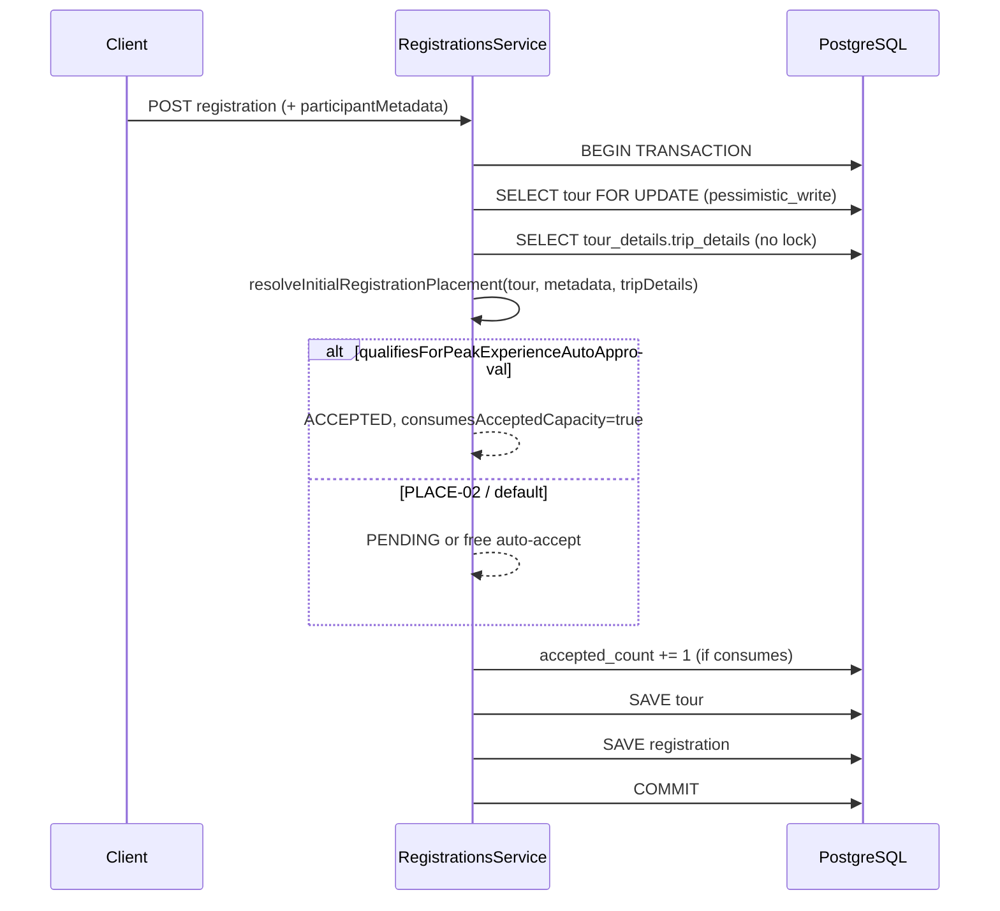
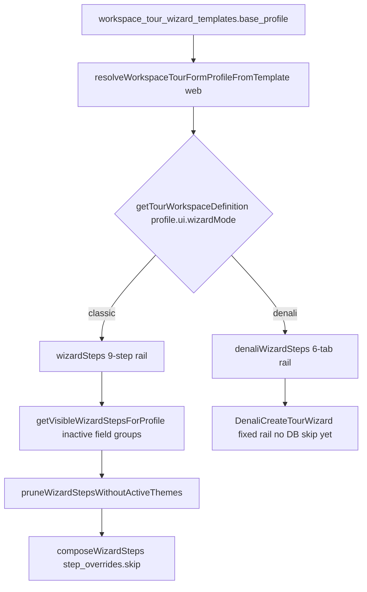
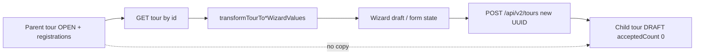
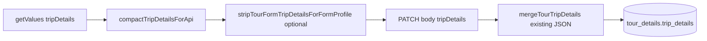

# Peak-Experience Conditional Auto-Approval — Systems Audit

**Audit type:** Read-only (post Phase 16.9 implementation)  
**Date:** 2026-05-22  
**Scope:** Climbing / outdoor tours — `tripDetails.requirements.minRequiredPeaks` vs traveler `participantMetadata.userPastPeaksCount`  
**Primary code:** `apps/api/src/modules/registrations/registrations.service.ts`, `apps/api/src/modules/registrations/utils/peak-experience-placement.ts`

---

## Executive summary

Phase 16.9 implements a **Peak-Experience** bypass: when a tour’s persisted `tripDetails.requirements.minRequiredPeaks` is a valid integer in **1–4**, and the registration request carries `participantMetadata.userPastPeaksCount` **≥** that minimum, `resolveInitialRegistrationPlacement` returns **`RegistrationStatus.ACCEPTED`** with **`consumesAcceptedCapacity: true`**, **before** PLACE-02 (paid + `autoAcceptRegistrations` → Pending).

The design is **fail-closed** for malformed or missing inputs: invalid tour config or missing traveler counts do **not** auto-approve. Capacity is guarded inside a **single DB transaction** with **`pessimistic_write`** on the tour row; concurrent registrants serialize on the lock so the last seat is not double-incremented in the happy path.

**Residual risks:** traveler peak count is **self-reported** (no ledger verification); tour `minRequiredPeaks` is **not validated on API tour PATCH** (only on the web edit Zod path); `tripDetails` for placement is read **without** row lock (TOCTOU on policy only, not on seat count).

---

## 1. Backend placement enhancement

### 1.1 Current call graph

Both registration entry points follow the same placement pattern:

| Path | Method | Placement call site (approx.) |
|------|--------|-------------------------------|
| Authenticated | `createRegistration` | After duplicate/capacity pre-checks, inside `dataSource.transaction` |
| Public / BFF | `createPublicRegistrationOrWaitlist` | Same, after waitlist branch when capacity available |

**Sequence (simplified):**



### 1.2 Injection point: `resolveInitialRegistrationPlacement`

**File:** `apps/api/src/modules/registrations/registrations.service.ts` (private method, ~L1001–L1023)

**Signature (Phase 16.9):**

```typescript
private resolveInitialRegistrationPlacement(
  tour: TourEntity,
  participantMetadata: ParticipantMetadataDto | undefined,
  tripDetails: Record<string, unknown> | null,
): { status: RegistrationStatus; consumesAcceptedCapacity: boolean }
```

**Decision order (critical for security semantics):**

1. **`qualifiesForPeakExperienceAutoApproval({ tripDetails, participantMetadata })`**  
   → If true: **`ACCEPTED` + `consumesAcceptedCapacity: true`** immediately (skips host Pending gate, **including paid tours**).

2. Else if `tour.autoAcceptRegistrations === true` **and** `!tourRequiresPayment(tour.costContext)` (PLACE-02):  
   → **`ACCEPTED` + consumes capacity**.

3. Else: **`PENDING` + does not consume capacity**.

Pure predicate lives in **`apps/api/src/modules/registrations/utils/peak-experience-placement.ts`**:

```typescript
export function qualifiesForPeakExperienceAutoApproval(input: {
  tripDetails: TourTripDetails | Record<string, unknown> | null | undefined;
  participantMetadata?: ParticipantMetadataIntake | null;
}): boolean {
  const minRequired = readTourMinRequiredPeaks(input.tripDetails);
  const userPeaks = readUserPastPeaksCount(input.participantMetadata);
  if (minRequired == null || userPeaks == null) {
    return false;
  }
  return userPeaks >= minRequired;
}
```

**Trip details load (separate query, no lock):**

```typescript
private async loadTourTripDetailsForPlacement(manager, tourId) {
  const detailsRow = await manager.findOne(TourDetails, {
    where: { tourId },
    select: { tripDetails: true },
  });
  // returns trip_details JSONB as Record<string, unknown> | null
}
```

**Call sites pass DTO metadata:**

- `createRegistration`: `createDto.participantMetadata` (~L319–L322)  
- `createPublicRegistrationOrWaitlist`: `input.participantMetadata` (~L1847–L1851)

**Persistence:**

```typescript
participantMetadata: this.participantMetadataForPersistence(createDto.participantMetadata),
// → { userPastPeaksCount: number } or undefined
```

Column: `registrations.participant_metadata` (JSONB), migration `1777600600000-RegistrationParticipantMetadata.ts`.

### 1.3 How to keep the injection “clean” (as implemented vs ideal)

| Concern | Current implementation | Assessment |
|--------|-------------------------|------------|
| Single responsibility | Predicate extracted to `peak-experience-placement.ts`; service only orchestrates | **Good** |
| Ordering vs PLACE-02 | Peak check runs **first** | **Correct** — paid tours can still auto-accept when qualified |
| Trust boundary | Traveler-supplied `userPastPeaksCount` only | **Weak** — no tie to historical registrations or guide attestation |
| Policy staleness | `tripDetails` read without `FOR UPDATE` on `tour_details` | **Low risk** for seats; admin could change minimum mid-flight before commit |
| Bypass scope | Only initial placement; host can still reject later via status API? | Accepted rows skip Pending; downstream status transitions are separate |

**Recommended hardening (not implemented — audit notes only):**

- Server-side **tour PATCH** validator for `requirements.minRequiredPeaks ∈ {1..4}` mirroring web Zod.
- Optional: load `trip_details` under the same transaction with `FOR UPDATE` if policy changes during registration must be impossible.
- Optional: derive `userPastPeaksCount` from verified booking history instead of self-report for high-trust workspaces.

### 1.4 Interaction with host review and payment

- **Host review gate:** Qualified travelers never enter **`Pending`** on create; they land **`Accepted`** with `paymentStatus: NOT_PAID`.
- **Paid tours:** Auto-approval does **not** imply payment; finance / checkout flows still apply (`requiresPayment` is only used **after** the peak branch fails).
- **Public path:** When placement is `ACCEPTED`, `emitPublicRegistrationAcceptedEvent` runs (~L1887+), aligning outbox semantics with immediate acceptance.

### 1.5 Unit test coverage

| File | Cases |
|------|--------|
| `apps/api/test/registrations/peak-experience-placement.unit-spec.ts` | `readTourMinRequiredPeaks`, qualify / fail qualify, bounds |
| `apps/api/test/registrations/resolve-initial-registration-placement.unit-spec.ts` | Paid + peaks → ACCEPTED; below minimum → PENDING; PLACE-02 preserved |

**Gap:** No integration test proving `accepted_count` increment + `pessimistic_write` under concurrent load (see §3).

---

## 2. Data-type and boundary safety

### 2.1 Tour side: `tripDetails.requirements.minRequiredPeaks`

| Source | Validation | Effect when invalid |
|--------|------------|---------------------|
| **Web admin** (`TourEditPeakExperienceSection` + Zod) | `z.coerce.number().int().min(1).max(4)`; `0` / empty → `undefined` (feature off) | Only 1–4 persisted via happy path |
| **API tour PATCH** | No dedicated server assert found on `minRequiredPeaks` | JSONB may contain strings, negatives, floats; **runtime reader ignores them** |
| **Runtime reader** `readTourMinRequiredPeaks` | Requires `typeof === "number"`, `Number.isInteger`, **1 ≤ n ≤ 4** | Returns `undefined` → **no auto-approval** (fail-closed) |

**Examples (runtime behavior):**

| Stored value | `readTourMinRequiredPeaks` | Auto-approve possible? |
|--------------|--------------------------|-------------------------|
| `2` | `2` | Yes, if traveler ≥ 2 |
| `0` | `undefined` | No (treated as unset) |
| `-1` | `undefined` | No |
| `5` | `undefined` | No |
| `"2"` (string in JSONB) | `undefined` | No |
| `NaN` / `2.5` | `undefined` | No |
| missing `requirements` | `undefined` | No |

**Verdict:** Negative or garbage admin values **do not** open an accidental bypass; they **disable** the feature until a valid integer is stored. **Gap:** API does not reject bad values at write time—operators may think they set a rule when the reader silently ignores it.

### 2.2 Traveler side: `participantMetadata.userPastPeaksCount`

| Source | Validation | Effect when invalid / empty |
|--------|------------|-----------------------------|
| **API DTO** `ParticipantMetadataDto` | `@IsOptional()`, `@IsInt()`, `@Min(0)`, `@Max(4)`, nested `@ValidateNested()` | Out-of-range → **400** from global `ValidationPipe` |
| **Global pipe** `main.ts` | `whitelist: true`, `forbidNonWhitelisted: true`, `transform: true` | Unknown keys rejected; primitive coercion enabled |
| **Runtime reader** `readUserPastPeaksCount` | Integer, **0–4** inclusive | Outside range → `undefined` → **no auto-approval** |

**Empty / null traveler input:**

| Request body | `readUserPastPeaksCount` | Qualifies? |
|--------------|--------------------------|------------|
| `participantMetadata` omitted | `undefined` | **No** → Pending (unless free auto-accept) |
| `{ userPastPeaksCount: 0 }` | `0` | Only if `minRequiredPeaks <= 0` — but min reader requires **≥ 1**, so **never** |
| `{ userPastPeaksCount: 2 }` with `minRequiredPeaks: 3` | `2` | **No** (`2 >= 3` false) |

**Important nuance:** `0` is a **valid** traveler count (no history) but cannot satisfy any valid tour minimum (1–4). So “بدون سابقه” correctly stays on manual/Pending path.

**String / NaN on wire:**

- With `transform: true` and `@IsInt()`, non-numeric strings typically fail validation **before** placement.
- If JSONB were tampered in DB (not via DTO), `typeof !== "number"` → `undefined` → fail-closed.

**Web registration UI** (`register-for-tour-client.tsx`):

- Zod: `z.number().int().min(0).max(4).optional()`
- When outdoor intake shown: `requirePeakHistory` forces field present (defaults to `0` in form)
- Payload sends `participantMetadata: { userPastPeaksCount }` only when intake visible

**Compilation / TypeScript:**

- API and web `tsc --noEmit` pass for Phase 16.9 types.
- Shared domain helper duplicated: `apps/web/src/features/tours/domain/peak-experience.ts` mirrors server bounds (1–4 tour min, 0–4 user).

### 2.3 Type model references

- `TripDetailsRequirements.minRequiredPeaks` — `apps/api/src/modules/tours/types/tour-trip-details.types.ts`
- `CreateRegistrationDto.participantMetadata` — `apps/api/src/modules/registrations/dto/create-registration.dto.ts`
- Web tripDetails schema — `TripDetailsRequirementsSchema` in `apps/web/src/features/tours/models/tourTripDetails.schema.ts`

### 2.4 Security note: trust, not type safety

Type and boundary guards prevent **accidental** acceptance. They do **not** prevent a traveler from **lying** about `userPastPeaksCount: 4`. Product should treat this as **marketing expedience**, not safety certification.

---

## 3. Concurrency and capacity binding

### 3.1 Transaction and lock

**Both create paths** wrap work in `this.dataSource.transaction(async (manager) => { ... })`.

**Tour row lock** (`requireTourInTenantForUpdate`, ~L1085–L1102):

```typescript
await manager.getRepository(TourEntity)
  .createQueryBuilder("tour")
  .setLock("pessimistic_write")
  .where("tour.id = :tourId", { tourId })
  .andWhere("tour.tenant_id = :tenantId", { tenantId })
  .getOne();
```

PostgreSQL maps this to **`FOR UPDATE`** on `tours` — concurrent registrations for the same tour **queue** on the tour row.

### 3.2 Capacity check vs increment order

**Authenticated `createRegistration` (~L304–L348):**

1. Lock tour (`pessimistic_write`).
2. If `tour.acceptedCount >= tour.totalCapacity` → **`CAPACITY_FULL`** (no waitlist in this path).
3. Load `tripDetails` (unlocked).
4. `resolveInitialRegistrationPlacement` → may be ACCEPTED + consume.
5. Create `RegistrationEntity` with `status: placement.status`.
6. If `placement.consumesAcceptedCapacity`:  
   `tour.acceptedCount += 1` → `assertTourCapacityInvariant(tour)` → `manager.save(tour)` → `syncTourDepartureFromTour`.
7. `saveRegistrationOrVersionConflict(registration)`.

**Public `createPublicRegistrationOrWaitlist` (~L1804–L1881):**

- Same lock and increment pattern when capacity available.
- If full → **waitlist** branch (no peak auto-accept on that request).

**Invariant helper** (`registration-integrity.policy.ts`):

```typescript
export function assertTourCapacityInvariant(tour: Tour): void {
  if (tour.acceptedCount <= tour.totalCapacity) return;
  throw new BadRequestException({ code: "CAPACITY_INVARIANT_VIOLATION", ... });
}
```

**Capacity-consuming statuses** (`registration-outbox-event-type.ts`): `Accepted` and `AcceptedPaid` consume seats. Peak bypass uses **`Accepted`** (not `AcceptedPaid`).

### 3.3 Last-seat / double-booking analysis

**Scenario:** `totalCapacity = 10`, `acceptedCount = 9`, two concurrent qualified registrants.

| Step | Transaction A | Transaction B |
|------|-----------------|-----------------|
| 1 | Acquires `FOR UPDATE` on tour | Blocks waiting for lock |
| 2 | Sees 9 < 10, ACCEPTED, increments to 10, saves tour + reg | — |
| 3 | Commits, releases lock | Acquires lock |
| 4 | — | Sees 10 >= 10 → **CAPACITY_FULL** (auth) or **waitlist** (public) |

**Conclusion:** Last seat cannot be double-incremented **provided** the capacity check uses the **locked** row state after the prior transaction commits. The implementation does: check runs **after** lock acquisition and **before** increment.

**Edge case — check-then-act window inside one transaction:** None across threads; single-threaded per tour row under lock.

**Edge case — `acceptedCount` already at capacity but stale read:** Prevented by lock reading committed state from previous holder.

### 3.4 Atomicity on failure

All steps (increment tour, save tour, save registration, snapshot, outbox) share one transaction. If registration `save` fails, the transaction **rolls back** including `accepted_count` increment — **no orphan seat consumption**.

### 3.5 What is NOT locked

| Resource | Locked? | Risk |
|----------|---------|------|
| `tours` row | **Yes** (`pessimistic_write`) | Seat count safe |
| `tour_details.trip_details` | **No** | Admin could change `minRequiredPeaks` concurrently; placement uses snapshot at read time |
| `registrations` rows | Row lock only via registration save / duplicate checks | Duplicate phone guarded by queries in same txn |

### 3.6 Gaps for QA load testing

- No automated **concurrency** spec (e.g. two parallel POSTs with 1 seat).
- Authenticated vs public **divergence** when full: auth throws, public waitlists — peak-qualified user on full tour does not auto-accept onto waitlist in auth path (correct product-wise but worth E2E clarity).

---

## 4. Cross-reference: frontend surfaces (context)

| Surface | File | Role |
|---------|------|------|
| Traveler intake | `apps/web/app/(app)/tours/[id]/register/register-for-tour-client.tsx` | Persian select → `participantMetadata.userPastPeaksCount` |
| Admin threshold | `apps/web/src/components/tours/TourEditPeakExperienceSection.tsx` | `tripDetails.requirements.minRequiredPeaks` |
| Domain helpers | `apps/web/src/features/tours/domain/peak-experience.ts` | UI visibility + bounds parity |

Outdoor intake shows for `tourType ∈ { mountain, nature }` **or** when tour already has valid `minRequiredPeaks` in JSON.

---

## 5. Findings matrix

| ID | Severity | Area | Finding |
|----|----------|------|---------|
| PE-01 | Info | Placement | Peak branch correctly precedes PLACE-02; paid qualified climbers → `Accepted`. |
| PE-02 | Medium | Trust | `userPastPeaksCount` is self-reported; no backend verification. |
| PE-03 | Low | Tour write | API PATCH does not validate `minRequiredPeaks`; invalid JSON silently disables bypass. |
| PE-04 | Low | TOCTOU | `tripDetails` read without lock; policy-only race, not seat double-book. |
| PE-05 | Info | Capacity | `pessimistic_write` + txn + post-increment invariant → last seat safe under concurrency. |
| PE-06 | Info | Fail-closed | Null/omit traveler metadata, bad types, admin negatives → no auto-approval. |
| PE-07 | Low | Payment | Auto-accept does not require payment; `Accepted` + `NotPaid` on paid tours is intentional. |
| PE-08 | QA | Tests | Unit tests on predicate + placement; no concurrent integration test. |

---

## 6. Verdict

The Phase 16.9 placement enhancement is **architecturally sound** for:

- **Conditional ACCEPTED** bypass driven by `minRequiredPeaks` vs `userPastPeaksCount`
- **Fail-closed** parsing for malformed or missing inputs
- **Transactional seat consumption** under **pessimistic tour row lock**

Primary improvements for production hardening: **verify peak history** (or document as honor-system), **validate tour requirements on API write**, and add **concurrency E2E** for the last-seat scenario.

---

# Denali Wizard State & Media Retention Audit (Phase 16.6 / 16.7 / 16.7.5)

**Audit type:** Read-only — frontend wizard state, blob retention, draft sync  
**Date:** 2026-05-22  
**Primary surfaces:** `DenaliCreateTourWizard.tsx`, `preserveDenaliWizardBlobMedia.ts`, `DenaliCanonicalContext.tsx`, `useTourWizardServerSync.ts`

---

## W1. Executive summary (wizard)

Recent fixes introduce a **three-layer** model for Denali create-tour state:

| Layer | Responsibility |
|-------|----------------|
| **RHF** (`useForm`) | Authoritative wizard form graph (`photosData`, `programNature.itinerary`, etc.) |
| **Canonical context** | Title + basics UX (`canonicalModel.title` drives the title `<Input>`) |
| **Server draft sync** | Debounced PATCH of **blob-stripped** JSON; hydrate merges server patch + **in-memory blob preservation** |

**Verdict:** Blob **data** is retained across **Next** and failed step validation via `preserveDenaliWizardBlobMedia` + `handleNext` ordering. **100% flicker-free** preview is **not guaranteed** (`reset` + `useFieldArray` may remount previews). Clear-draft **does** reach `title: ""` in both RHF and canonical when `resetWizard` runs (Phase 16.7.5). Server sync is **mostly** safe after truncation if `seedLastSyncedFingerprint` runs and no hydrate races occur — several **residual race** windows remain.

---

## W2. Memory blob retention (galleries & itinerary photos)

### W2.1 Mechanism

**Helper:** `apps/web/src/features/tours/wizard/denali/preserveDenaliWizardBlobMedia.ts`

- Detects `blob:` URLs on gallery (`photosData.photos`) and per-day itinerary (`programNature.itinerary[].photos`).
- After `applyDenaliInvariantState` (or server merge) drops or empties photo arrays, re-merges blob rows **by photo `id`**, preserving object identity where possible.
- **Server PATCH path** uses `stripBlobUrlsFromDenaliDraftPatch` inside `serializeDenaliWizardDraft` — blobs never leave the browser on wire (by design).

**Unit tests:** `preserveDenaliWizardBlobMedia.spec.ts` — gallery restore, itinerary merge by `day`, strip on serialize, `formHasClientBlobMedia`.

### W2.2 Where blobs are created

| Surface | File | URL source |
|---------|------|------------|
| Tour gallery | `DenaliPhotosStep.tsx` | `URL.createObjectURL(file)` per upload |
| Daily itinerary | `DenaliItineraryDayPhotos.tsx` | Same, max 3 photos/day |

Both append via RHF (`useFieldArray` / parent `onChange`), storing `{ id, url: blob:..., filename, ... }`.

### W2.3 `handleNext` pipeline (critical path)

**File:** `DenaliCreateTourWizard.tsx` (~L436–L453)

```typescript
const values = getValues();
const normalized = applyDenaliInvariantState(values);
const withBlobs = preserveDenaliWizardBlobMedia(values, normalized);
reset(withBlobs, { keepDefaultValues: true, keepDirty: true });

const ok = applyDenaliWizardStepValidation(withBlobs, currentStepKey, setError, clearErrors);
if (ok) {
  setCurrentStep((prev) => Math.min(prev + 1, visibleSteps.length - 1));
}
```

| Step | Effect on blobs |
|------|-----------------|
| `applyDenaliInvariantState` | May normalize/strip itinerary or gallery shape |
| `preserveDenaliWizardBlobMedia(values, normalized)` | Re-injects `blob:` rows from **pre-reset** `values` |
| `reset(withBlobs, …)` | Writes merged state back into RHF **before** validation result |
| Validation **fails** | Step index unchanged; form already contains `withBlobs` |

**Conclusion:** Intermediate step validation **does not** wipe blob URLs from form state — data retention logic is **correct**.

**Caveats (not data loss, UX):**

1. **`reset()` on every Next** — Even when validation fails, RHF `reset` runs. `useFieldArray` field `id`s may change → `` can **briefly remount** (possible flicker). URLs remain in form values.
2. **No `URL.revokeObjectURL`** — Revoked blobs are not tracked; long sessions may leak memory (separate from retention audit).
3. **Step unmount** — Leaving photos/itinerary step unmounts components; returning relies on RHF values + preserve on next Next — **not** on component-local state alone.
4. **`catalogSanitizedRef` layout effect** — After clear, `catalogSanitizedRef` is reset to `false`; when catalog loads, `reset(applyDenaliInvariantState(sanitized))` runs **without** `preserveDenaliWizardBlobMedia` unless `formHasClientBlobMedia` path in hydrate only — if user had blobs then catalog sanitize fires, **blobs could be lost** (edge: inactive destination/theme cleanup post-clear).

### W2.4 Server hydrate merge (blobs)

**`applyServerDraftEnvelope`** (~L256–L274):

```typescript
const snapshot = formHasClientBlobMedia(getValues()) ? getValues() : null;
let merged = mergeDenaliWizardDefaults(defaultValues, parsed.formPatch);
if (snapshot != null) {
  merged = preserveDenaliWizardBlobMedia(snapshot, merged);
}
reset(merged);
setCanonicalSyncToken((token) => token + 1);
```

If the user already has in-memory blobs and server returns a patch **without** blob URLs (always true on wire), local blobs are **re-attached**. This prevents server draft restore from **wiping** a live upload session.

### W2.5 Assessment vs “100% retained without flickering”

| Claim | Status |
|-------|--------|
| Blob URLs survive Next | **Pass** (with preserve + reset ordering) |
| Blob URLs survive validation failure on same step | **Pass** (reset before branch on `ok`) |
| Zero UI flicker | **Not guaranteed** (`reset` + field-array keys) |
| Blobs survive server autosave round-trip | **Pass** (strip on wire, preserve on hydrate) |
| Automated E2E proof | **Gap** — unit tests only on helper |

---

## W3. Hard re-alignment on clear (`handleClearDraft` / `resetWizard`)

### W3.1 User-facing entry

- **Button:** `DenaliBasicInfoStep` → `resetWizard` (`data-testid="denali-wizard-clear-draft-top"`).
- **Provider:** `DenaliCanonicalProvider` wraps `resetWizard` orchestration.

### W3.2 Execution order (Phase 16.7.5)

**`resetWizard`** in `DenaliCanonicalContext.tsx` (~L174–L178):

1. `onResetWizard()` → **`handleClearDraftCore`** in `DenaliCreateTourWizard.tsx`
2. `forceCanonicalTitleEmpty()`
3. `onCanonicalSyncAfterClear?.()` → parent bumps **`canonicalSyncToken`**

**`handleClearDraftCore`** (~L455–L470):

| Action | Title impact |
|--------|----------------|
| `deleteTourWizardDraft(workspaceId)` (async, not awaited) | Server draft delete started |
| `reset(buildDenaliTourCreateDefaultValues())` | RHF `basicInfo.title` → **`""`** (factory default) |
| `setCurrentStep(0)` | Step rewind |
| `seedLastSyncedFingerprint()` | Fingerprint = **cleared** form snapshot |
| `catalogSanitizedRef.current = false` | May re-run catalog sanitize effect |

**`forceCanonicalTitleEmpty`** (~L160–L172):

| Action | Title impact |
|--------|----------------|
| `setCanonicalModel({ ...fromDefaults, title: "" })` | Canonical view **`""`** |
| `setValue("basicInfo.title", "", { shouldDirty: false, shouldValidate: false })` | RHF explicit **`""`** |
| `titleInputResetKey++` | Remount title `<Input key={…}>` |

**Title input binding** (`DenaliBasicInfoStep.tsx`):

```tsx
<Input
  key={`denali-basic-title-${titleInputResetKey}`}
  value={canonicalModel.title ?? ""}
  onChange={(e) => updateCanonical({ title: e.target.value })}
/>
```

**Factory defaults** (`buildDenaliTourCreateDefaultValues` in `denaliTourCreateBaseSchema.ts`):

- `basicInfo.title: ""` — **no** production placeholder in defaults (Phase 16.7).
- Placeholder `"abcdefghijabcdefghij"` exists only in **`buildDenaliTourCreateTestValues()`** for unit tests — **not** used on clear.

### W3.3 `syncToken` effect interaction

`useEffect` on `[syncToken]` (~L97–L104) re-hydrates canonical from `getValues()`:

```typescript
setCanonicalModel({
  ...next,
  title: form.basicInfo.title?.trim() ?? "",
});
```

Because `onCanonicalSyncAfterClear` runs **after** `forceCanonicalTitleEmpty`, the effect reads **`""`** — avoids restoring a stale title from pre-clear RHF (the bug class fixed in 16.7.5 when token was bumped **before** canonical clear).

### W3.4 Residual clear-draft risks

| ID | Severity | Finding |
|----|----------|---------|
| WC-01 | Low | Brief window: `reset(defaults)` runs before `forceCanonicalTitleEmpty` in same tick — defaults already use `title: ""`, so placeholder regression **unlikely**. |
| WC-02 | Medium | `deleteTourWizardDraft` not awaited — server may still hold old title until DELETE completes; reload could restore old copy unless PATCH empty wins race. |
| WC-03 | Low | Other fields revert to **sample** defaults (e.g. `shortDescription: "توضیح کوتاه نمونه"`, `basePricePerPerson: 500_000`) — only title was hard-empty requirement; product may want fuller “blank slate”. |
| WC-04 | Info | `reset(defaults)` does **not** call `preserveDenaliWizardBlobMedia` — **intentional** full wipe including blobs. |

**Verdict:** Title hard-empty **`""`** in canonical + RHF is **confirmed** for the implemented clear path.

---

## W4. Stale dispatch overrides (`useTourWizardServerSync`)

### W4.1 Sync middleware behavior

**Hook:** `apps/web/src/features/tours/wizard/hooks/useTourWizardServerSync.ts`

| Behavior | Detail |
|----------|--------|
| Debounce | **500 ms** on any `useWatch` form change |
| Step change | Immediate `runPatch` (flush debounce) |
| Payload | `serializeDenaliWizardDraft(getValues(), wizardMetaRef)` → **strips blobs** |
| Dedup | `lastSyncedPayloadRef` fingerprint skips identical PATCH |
| OCC | `version` on PATCH; 409 → conflict banner or self-heal retry |
| Suppress | `enabled === false` or `syncConflict === true` blocks PATCH |

**Clear-draft interaction:**

`handleClearDraftCore` calls **`seedLastSyncedFingerprint()`** immediately after `reset(defaults)` — sets fingerprint to **current empty/default** serialized payload so the **next** debounced watch does not PATCH solely because form “changed” from pre-clear state **unless** fingerprint differs from last synced.

Sequence after clear:

1. Form reset → `useWatch` updates → debounce timer starts (500 ms).
2. Fingerprint seeded to cleared form → when `runPatch` runs, if fingerprint matches last synced, **skip PATCH** (`fingerprint === lastSyncedPayloadRef`).
3. `syncToken` bump may change canonical only — **does not** directly trigger PATCH (watch is on `form.control`, not canonical).

### W4.2 Hydrate paths that can **pull** stale text

| Path | Can overwrite cleared UI? |
|------|---------------------------|
| Initial mount `fetchTourWizardDraft` → `applyServerDraftEnvelope` | Yes, if server still has old draft (DELETE async) |
| User clicks conflict **reload** → `reloadServerDraft` | Yes — intentional server truth |
| 409 self-heal `fetchTourWizardDraft` + retry | Only if structurally aligned with local — unlikely right after clear |
| `bootstrapDenaliPrefill` / localStorage clone | Only on first hydrate, not after clear |

**`applyServerDraftEnvelope` does not pull from PATCH responses** — only from explicit GET/reload. Stale **push** risk is: **in-flight PATCH before clear** completes **after** clear + seeds fingerprint:

- Pre-clear PATCH payload (old title) lands on server.
- User cleared locally; fingerprint seeded to empty.
- Debounced PATCH may send **empty** form (good).
- If user reloads draft from server before DELETE completes, **old title returns** (WC-02).

### W4.3 Stale **push** after truncation

| Scenario | Outcome |
|----------|---------|
| Clear → seed fingerprint → debounce fires with empty title | PATCH sends stripped empty/default shape — **aligned** with UI |
| Clear while `inFlight` PATCH pending | Chain serializes via `inFlightChainRef`; older PATCH may commit **before** clear transaction in UI — server could briefly hold pre-clear data until next PATCH/DELETE |
| `syncConflict` true | PATCH suppressed until user clears conflict — **no** silent overwrite from sync |
| `enabled: serverHydrateReady && workspaceId` | Sync disabled until hydrate completes — reduces hydrate/sync fight on mount |

### W4.4 What does **not** happen

- Sync hook **never** calls `reset(form)` or `setValue` — **read-only** toward form (except version ref).
- Serialized draft **cannot** reintroduce `blob:` URLs from server (they were stripped on prior PATCH).
- Title in PATCH uses `basicInfo.title` from RHF at serialize time, not `canonicalModel` directly — after clear, `setValue("basicInfo.title","")` + `forceCanonicalTitleEmpty` keep them aligned.

### W4.5 Assessment

| Claim | Status |
|-------|--------|
| Sync does not overwrite cleared title **in the common path** | **Pass** (fingerprint seed + empty defaults) |
| Zero race with async DELETE / in-flight PATCH | **Fail closed** — document WC-02 / in-flight |
| Reload conflict UI can restore server stale | **By design** — user must confirm reload |

---

## W5. Findings matrix (wizard)

| ID | Severity | Area | Finding |
|----|----------|------|---------|
| WB-01 | Info | Blobs | `preserveDenaliWizardBlobMedia` + `handleNext` ordering retains `blob:` URLs on validation failure. |
| WB-02 | Low | UX | `reset` on every Next may remount previews (flicker) despite retained URLs. |
| WB-03 | Info | Wire | Server draft strips blobs; hydrate re-merges from memory snapshot. |
| WB-04 | Pass | Clear | `title: ""` in defaults, `forceCanonicalTitleEmpty`, keyed title input. |
| WB-05 | Medium | Clear | Async `deleteTourWizardDraft` — server reload can restore stale title briefly. |
| WB-06 | Low | Clear | Non-title defaults still contain sample Persian/numeric placeholders. |
| WB-07 | Info | Sync | `seedLastSyncedFingerprint` after clear prevents redundant PATCH loop. |
| WB-08 | Medium | Sync | In-flight pre-clear PATCH + late GET can disagree with truncated UI until next PATCH/DELETE. |
| WB-09 | Low | Catalog | Post-clear catalog sanitize `reset` omits blob preserve — edge case if blobs added before sanitize runs. |
| WB-10 | QA | E2E | No Playwright spec for Next-with-blobs or clear-title-empty. |

---

## W6. Recommended QA scenarios (manual / future automation)

1. Upload 2 gallery `blob:` images → Next on photos step (invalid other step) → remain on step → previews still show same blobs.
2. Upload itinerary day photo → Next through steps → return → blob still visible.
3. Enter title → Clear draft → title field empty, no `abcdefghij` placeholder, `data-testid="denali-basic-title-input"` value `""`.
4. Clear draft → wait 2 s → network tab shows PATCH with empty/minimal title or skipped duplicate fingerprint; no resurrected title without reload.
5. Clear draft → immediate full page reload before DELETE — document whether server draft revives (WC-02).

---

## W7. Verdict (wizard)

Phase **16.6–16.7.5** fixes are **architecturally sound** for blob **data retention** on navigation/validation and for **title hard-clear** in canonical + RHF. Treat **flicker-free** and **server-draft race after clear** as the main remaining quality gaps, not silent blob deletion on Next.

---

# Master Wizard & Activation Audit — Edit / Publish Lifecycles (Phase 16.8–16.9)

**Audit type:** Read-only — classic edit activation, Persian error registry, TypeScript emission  
**Date:** 2026-05-22  
**Scope:** Draft → Active (`lifecycle_status: OPEN`) on `/tours/[id]/edit`, Denali publish invariants, wizard/create error surfacing

---

## E1. Activation lifecycle (how Draft becomes Active)

| Layer | Surface | Mechanism |
|-------|---------|-----------|
| UI | `TourForm` on `/tours/[id]/edit` | Status `<Select>`: `draft` → `active` (maps to API **`OPEN`** via `formLifecycleToApi`) |
| Client validation | `createTourSchemaForProfile("denali_pilot")` | `superRefine` when `status === "active"`: requires `tripDetails.overview.gatheringPoint` / `startPoint` with non-empty `addressText` + finite lat/lng |
| PATCH wire | `tour-edit-client.tsx` → `updateTourDtoFromTourFormValues` | `tripDetails` compacted via `compactTripDetailsForApi`; geo pins live under `overview.*` |
| BFF | `app/api/tours/[tourId]/route.ts` | Thin `proxyBffPatch` — **no** additional Zod gate |
| API | `assertTourPublishableBeforePatch` + `assertTourStateReadyForOpenAfterPatch` | `checkDenaliPilotPublishGeolocationZones`, profile submit-required, edit-required itinerary, `assertRequiresPaymentHasPositiveAmount`, etc. |

**Create wizard** is a separate path (`DenaliCreateTourWizard` → POST create, often OPEN on submit). This section focuses on **classic edit publish**, which was the historical source of silent `400` rejections when geo fields were API-only.

---

## E2. Geolocation invariant alignment (classic edit ↔ `denali_pilot`)

### E2.1 Backend contract (source of truth)

**File:** `packages/shared-contracts/src/tours/workspaces/denali-invariants.ts` — `checkDenaliPilotPublishGeolocationZones`

- Zones: `overview.gatheringPoint`, `overview.startPoint`
- Each zone: non-empty `addressText` + finite `latitude` / `longitude` (via `denaliLocationFromApi`)
- Violation code: **`DENALI_PUBLISH_REQUIRES_GEOLOCATION_ZONES`**

**File:** `apps/api/src/modules/tours/policies/assert-tour-publish-transition.ts`

- Invoked on PATCH → OPEN and create→OPEN after merge

### E2.2 Frontend exposure on classic edit (Phase 16.8)

| Capability | Implementation | Status |
|------------|----------------|--------|
| UI fields for both zones | `TourEditDenaliGeoSection.tsx` — `DenaliLocationPickerEditor` per zone on `tripDetails.overview.{gatheringPoint,startPoint}` | **Present** |
| Section visibility | `TourForm.tsx` — `showDenaliPublishGeoSection` when `workspaceFormProfile === "denali_pilot"` **or** `resolvedFormProfileForEdit === "denali_pilot"` | **Present** |
| Persian UX hint | Section copy: publish requires precise gathering/start coordinates | **Present** |
| Trip-details schema | `tourTripDetails.schema.ts` — `gatheringPoint` / `startPoint` on `overview` via `denaliLocationDataSchema` | **Present** |
| Hydrate from API row | `toDefaultValues` → `normalizeTripDetailsFormDefault(rawTrip)` normalizes zones (L668–673) | **Present** |
| Pre-submit client gate | `tour-schema.ts` `superRefine` for `denali_pilot` + `status === "active"` (Persian field messages) | **Present** |
| PATCH includes pins | `updateTourDtoFromTourFormValues` passes compacted `tripDetails` including `overview` geo keys | **Present** |

**Verdict:** Publish-required geo dimensions are **no longer hidden** on the classic edit screen for Denali workspaces/tours. Users selecting **Active** hit **client Zod** before PATCH when profile resolves to `denali_pilot`, and see field-level Persian errors instead of a silent failure.

### E2.3 Parity: wizard create vs classic edit

| Path | Geo UI | Pre-API gate |
|------|--------|--------------|
| Denali create wizard | `DenaliLocationZonesSection` in `DenaliBasicInfoStep` (collapsible `<details>`) | Wizard submit issues + `denaliApiParity.spec` |
| Classic edit | `TourEditDenaliGeoSection` (always visible section) | `tour-schema.ts` superRefine on `status === "active"` |

Wizard geo is **not missing**, but tucked in a collapsible block (discoverability gap vs edit).

### E2.4 Residual geo / activation gaps

| ID | Severity | Finding |
|----|----------|---------|
| EA-01 | Low | Edit geo section uses `control as never` / `errors as never` — type bridge only; runtime binding is correct. |
| EA-02 | Low | Wizard zones live inside collapsed `<details>`; operators may miss them until API/wizard submit fails. |
| EA-03 | Medium | If `workspaceFormProfile !== "denali_pilot"` **and** theme catalog resolves a **non-**`denali_pilot` profile for a persisted Denali snapshot tour, `superRefine` geo gate may **not** run while API still enforces `formProfileSnapshot` on publish → **400** with registry message (no silent failure, but client gate mismatch). |
| EA-04 | Info | `startPointLocationText` on wizard is legacy text; publish gate uses structured `startPoint` object (edit + API aligned on structured pins). |

---

## E3. Translator / revenue error coverage (Persian UX)

### E3.1 Registry entries (explicit Persian)

**File:** `apps/web/lib/errors/error-registry.ts` (`CORE_REGISTRY`)

| Code | Persian message (abridged) | Used on |
|------|---------------------------|---------|
| `DENALI_PUBLISH_REQUIRES_GEOLOCATION_ZONES` | «انتشار تورهای دنالی نیازمند تعیین دقیق نقطه تجمع و آغاز سفر روی نقشه است.» | Edit `TourForm` (`ErrorRegistry`), wizard (`formatWizardApiErrorMessage` → `getUIError`) |
| `PAID_TOUR_REQUIRES_AMOUNT` | «برای تورهای پولی، وارد کردن مبلغ کل هزینه الزامی است.» | Same |
| `INVALID_LIFECYCLE_TRANSITION` | «تغییر وضعیت درخواستی برای این تور مجاز نمی‌باشد.» | Same |
| `VALIDATION_PROFILE_EDIT_REQUIRED_FIELD` | «لطفاً فعالیت‌ها و برنامه‌ریزی روزهای تور را به طور کامل پر کنید.» | Edit publish (itinerary/day plans) |

**Canonical list:** `apps/web/lib/errors/canonical-api-error-codes.ts` includes the first three + `VALIDATION_PROFILE_EDIT_REQUIRED_FIELD` (not the submit variant below).

### E3.2 Dispatch paths

| Consumer | Mapper | Behavior for known publish codes |
|----------|--------|----------------------------------|
| `DenaliCreateTourWizard`, `TourCreateWizard` | `formatWizardApiErrorMessage` | `getUIError(code).message` (+ optional `requestId` suffix) |
| `TourForm` (edit) | `ErrorRegistry[err.code]` on 400, else `apiValidationMessage` / raw `err.message` | Registered codes → Persian **root** alert |
| `mapToUserMessage` | `getUIError` but prefers **raw** `error.message` when it differs from registry | Can surface engineering English for **unregistered** codes |

### E3.3 Gap: `VALIDATION_PROFILE_REQUIRED_FIELD`

| Check | Result |
|-------|--------|
| In `error-registry.ts` | **Absent** |
| In `canonical-api-error-codes.ts` | **Absent** |
| API emits on publish/create | **Yes** — `assertProfileRequiredFieldsForSubmit` with message `Missing required fields for profile ${profile}: ${fields.join(", ")}` |
| `format-wizard-api-error.spec.ts` | Tests `VALIDATION_PROFILE_EDIT_REQUIRED_FIELD` only — **not** submit variant |
| `getUIError("VALIDATION_PROFILE_REQUIRED_FIELD")` | Falls through to **«An unexpected error occurred.»** |
| `TourForm` on 400 | Falls through to **`err.message`** → user may see **English path list** |

**Verdict:** `DENALI_PUBLISH_REQUIRES_GEOLOCATION_ZONES` and `PAID_TOUR_REQUIRES_AMOUNT` are **fully registered** with supportive Persian copy. **`VALIDATION_PROFILE_REQUIRED_FIELD` is not** — distinct from `VALIDATION_PROFILE_EDIT_REQUIRED_FIELD` (itinerary). This is the main **translator coverage gap** for profile submit-required failures (e.g. missing `overview.title`, `pricing.basePrice`, `itinerary.days` on publish).

### E3.4 Test coverage

| Spec | Covers |
|------|--------|
| `format-wizard-api-error.spec.ts` | `TOUR_NOT_PUBLISHABLE`, `VALIDATION_PROFILE_EDIT_REQUIRED_FIELD` |
| Missing unit assertions | `DENALI_PUBLISH_REQUIRES_GEOLOCATION_ZONES`, `PAID_TOUR_REQUIRES_AMOUNT`, `VALIDATION_PROFILE_REQUIRED_FIELD` |

---

## E4. Type safety & `tsc --noEmit`

### E4.1 Command result

```bash
pnpm --filter @apps/web exec tsc --noEmit
```

**Exit code: 0** (no compilation errors at audit time).

### E4.2 Structures exercised across wizard / edit / BFF

| Area | Primary types / adapters |
|------|---------------------------|
| Denali wizard form | `DenaliCreateTourWizardForm`, `denaliTourCreateBaseSchema`, `denaliCanonicalTourSchema` |
| Canonical bridge | `denaliCanonicalFormAdapter.ts`, `DenaliCanonicalContext` |
| Geo pins | `DenaliLocationDataForm` / `denaliLocationDataSchema`, `@repo/types/denali` zone keys |
| Classic edit | `TourFormInput`, `TourFormValues`, `createTourSchemaForProfile` |
| Trip details JSON | `TourTripDetailsRootSchema`, `normalizeTripDetailsFormDefault`, `compactTripDetailsForApi` |
| PATCH DTO | `UpdateTourDto` via `updateTourDtoFromTourFormValues` |
| Peak experience (16.9) | `TourEditPeakExperienceSection`, `peak-experience.ts` guards |
| BFF routes | Proxy handlers — no local TS model duplication |

### E4.3 Pragmatic escapes (non-breaking)

- `TourEditDenaliGeoSection` / `TourEditPeakExperienceSection`: `Control<TourFormInput>` cast `as never` when passed from `TourForm` (RHF generic friction).
- `TourCreateTripDetailsFields`: `register` / `control` / `errors` cast to `FieldValues` for shared matrix component.

These are **intentional** boundary casts; they do not indicate `tsc` failures.

---

## E5. Edit / publish findings matrix

| ID | Severity | Area | Finding |
|----|----------|------|---------|
| EP-01 | **Pass** | Geo / edit | `TourEditDenaliGeoSection` + client `superRefine` block silent Denali geo 400s in the common Denali workspace path. |
| EP-02 | **Pass** | Geo / API | Backend `checkDenaliPilotPublishGeolocationZones` aligned with `overview.gatheringPoint` / `startPoint` shape on PATCH. |
| EP-03 | **Medium** | i18n | `VALIDATION_PROFILE_REQUIRED_FIELD` lacks Persian registry entry; edit may show English API message. |
| EP-04 | **Pass** | i18n | `DENALI_PUBLISH_REQUIRES_GEOLOCATION_ZONES`, `PAID_TOUR_REQUIRES_AMOUNT`, `INVALID_LIFECYCLE_TRANSITION` registered. |
| EP-05 | Low | i18n | No unit tests asserting Persian text for geo/paid-tour codes in `format-wizard-api-error.spec.ts`. |
| EP-06 | Low | UX | Wizard geo in collapsible section vs prominent edit section. |
| EP-07 | Medium | Profile | Theme/workspace profile drift can skip client geo refine while API still enforces Denali snapshot. |
| EP-08 | **Pass** | TS | `@apps/web` `tsc --noEmit` clean. |
| EP-09 | Info | BFF | Tour PATCH proxy does not add validation; reliance on API + `TourForm` Zod is by design. |

---

## E6. Recommended verification (edit / publish)

1. Denali workspace → edit draft tour → set both map zones (address + lat/lng) → Status **Active** → Save → expect **201/200** OPEN, no `DENALI_PUBLISH_REQUIRES_GEOLOCATION_ZONES`.
2. Omit one zone → Save as Active → expect **client** Persian field error under `tripDetails.overview.*` before network, or registry root message if only API catches it.
3. Paid tour (`requiresPayment`) with price `0` → Active → expect Persian `PAID_TOUR_REQUIRES_AMOUNT` on root (wizard or edit).
4. Strip required profile field (e.g. empty title) → publish → confirm whether UI shows Persian or English (`VALIDATION_PROFILE_REQUIRED_FIELD` gap).
5. Re-run `pnpm --filter @apps/web exec tsc --noEmit` after any follow-up registry fix.

---

## E7. Master verdict (edit / publish)

Phase **16.8** successfully **surfaces** Denali publish geo on the classic edit form and **aligns** client validation with `denali_pilot` OPEN gates, eliminating the primary **silent** Draft→Active failure mode for missing map pins. Phase **16.9** peak-experience types compile cleanly alongside these paths.

Remaining activation UX debt is **narrow**: register Persian copy for **`VALIDATION_PROFILE_REQUIRED_FIELD`**, add spec coverage for geo/paid codes, and optionally tighten **profile-resolution** on edit so client gates always match `formProfileSnapshot` on Denali rows.

---

# Master Wizard & Activation Audit — Templates & Field Synchronization (Phase 16.x)

**Audit type:** Read-only — `workspace_tour_wizard_templates`, edit vs wizard field parity, PATCH adapters  
**Date:** 2026-05-22  
**Primary surfaces:** `WorkspaceTourWizardTemplateEntity`, `wizardStepEngine.ts`, `TourForm.tsx`, `DenaliCreateTourWizard.tsx`, `tour-ui-mappers.ts`, `tours.service.ts` (`toUpdateTourApiBody` client mirror)

---

## S1. Wizard template integrity (`workspace_tour_wizard_templates`)

### S1.1 Backend model

**Entity:** `apps/api/src/modules/settings-locations/entities/workspace-tour-wizard-template.entity.ts`

| Column | Role |
|--------|------|
| `base_profile` | Authoritative `TourFormProfile` (`denali_pilot`, `mountain_outdoor`, `urban_event`, …) |
| `step_overrides` | JSONB `{ skip: string[], insert: string[] }` — v1 honors **`skip` only** |
| `field_rules_overlay` | JSONB overlay (reserved / future field-rule tweaks) |
| `preset_id` | Optional link to settings tour preset defaults |
| `wizard_contract_version` / `form_profile_version` | Contract versioning for prefill/restore |
| `workspace_id` | Unique per workspace |

**Authority on write:** `resolveWorkspaceTourFormProfile` (`apps/api/src/modules/settings-locations/resolve-workspace-tour-form-profile.ts`) reads **`base_profile` only**. Client `formProfile` hints on create/update DTOs are documented as **ignored** (OpenAPI + `create-tour.dto.ts` / `update-tour.dto.ts`).

### S1.2 Profile → visible wizard steps (create flow)



| Profile family | Step rail | Step visibility driver |
|----------------|-----------|-------------------------|
| `denali_pilot` | `denali_basic` → `denali_program` → `denali_transport` → `denali_pricing` → `denali_photos` → `review` | `getTourWorkspaceDefinition("denali_pilot").ui.wizardMode === "denali"` (`isDenaliWizardContext`) |
| `mountain_outdoor`, `general`, … | `basic`, `theme`, `capacity`, `location`, `itinerary`, `participation`, `logistics`, `policies`, `review` | `getInactiveFieldGroupsForProfile` + `getVisibleWizardStepsForProfile` + theme-catalog prune |
| Any (classic) | Same ordered ids | `composeWizardSteps(base, template.stepOverrides)` removes ids in `skip` |

**Engine:** `apps/web/src/features/tours/wizard/wizardStepEngine.ts` — single accessor `getVisibleStepsForRuntime(profile, { stepOverrides, tenantFormContract, … })`.

**Denali note:** `denaliStepConfig.ts` documents a **fixed 5+review rail**; DB `step_overrides` are applied on the **classic** path via `loadWizardPrefill` / `TourCreateWizard`, not on `DenaliCreateTourWizard` (no `composeWizardSteps` call in Denali shell).

### S1.3 Edit flow vs template (clobber risk)

Classic **edit** does **not** re-run the wizard step engine. It uses flat `TourForm` + `TourCreateTripDetailsFields` with `formProfile={resolvedFormProfileForEdit}` (theme catalog classification).

| Mechanism | Create-time template fields | Edit-time behavior |
|-----------|----------------------------|-------------------|
| `formProfileSnapshot` on tour row | Set from workspace `base_profile` on create/PATCH | Refreshed to **current** workspace template profile on every PATCH (`tours.service.ts` ~L1198) |
| `mergeTourTripDetails` | N/A | Deep-merge PATCH `tripDetails` into persisted JSON; **omitted keys preserved** |
| `stripTripDetailsForFormProfile` | On create after strip | Re-applied on persisted row when profile is `cinema_event` / `urban_event` (drops `participation`, itinerary bodies, etc.) |
| Client `stripTourFormTripDetailsForFormProfile` | Wizard submit | Edit PATCH uses **theme-derived** `resolvedFormProfileForEdit`, not `formProfileSnapshot` |

**Verdict:** Editing a tour **does not** replay wizard steps, but **generally does not clobber** omitted PATCH branches thanks to server merge. **Clobber / loss risks** remain when:

| ID | Severity | Scenario |
|----|----------|----------|
| ST-01 | Medium | Workspace `base_profile` changes (e.g. `denali_pilot` → `general`) → next PATCH runs `stripTripDetailsForFormProfile` on merged row → Denali-only JSON keys may be **stripped server-side**. |
| ST-02 | Medium | Edit client strip uses **theme-resolved** profile while API strip uses **workspace template** — mismatch can send ghost keys client-side that server then removes (or vice versa). |
| ST-03 | Low | Denali wizard ignores `step_overrides.skip`; tenants cannot hide Denali tabs via template row today. |
| ST-04 | Info | `field_rules_overlay` is stored but not audited as a live step/field driver in web create shell (reserved). |

---

## S2. Discrete field harmony (edit `TourForm` vs `DenaliCreateTourWizard`)

### S2.1 Field inventory (user-requested)

| Field / concern | Denali wizard surface | Classic edit (`TourForm`) | Sync status |
|-----------------|----------------------|---------------------------|-------------|
| **Tour leader dropdown** (`overview.leaderUserIds`) | `DenaliBasicInfoStep` — `DestinationCombobox` multi-select, canonical + `basicInfo.leaderUserIds` | **No dedicated control** in `TourForm` / `TourCreateTripDetailsFields` | **Partial** — loaded into `tripDetails.overview.leaderUserIds` via `normalizeTripDetailsFormDefault`; **passive retain** on save if user does not clear overview; **not editable** on edit |
| **SMS notification toggles** | **Not found** in tour wizard or tripDetails schema | **Not found** | **N/A** — no tour-level SMS toggle in web forms. Registration-accepted SMS is **outbox-only** (`registration-accepted-sms-outbox.handler.ts`), not a tour field |
| **Required passenger capabilities** | Denali: `DenaliPricingParticipantSection` — min/max age, fitness, **nationalIdRequired**, **sportsInsuranceRequired**, gear via `DenaliGearSection` | Edit: `TourCreateTripDetailsFields` — age, fitness, gear UUID checkboxes, audience matrix; **no** `sportsInsuranceRequired` / `registrationNationalIdRequired` inputs | **Partial** — schema supports flags; edit **does not expose** insurance/national-ID toggles |
| **Peak auto-approval** (`requirements.minRequiredPeaks`) | Not on Denali wizard rail (16.9 admin field on edit only) | `TourEditPeakExperienceSection` when peak field visible | **Edit-only** (intentional 16.9 split) |
| **Publish geo pins** | `DenaliLocationZonesSection` (collapsible) | `TourEditDenaliGeoSection` | **Aligned** (see §E2) |
| **Guide languages** (`logistics.guideLanguageIds`) | Classic `LogisticsStep` only | `TourCreateTripDetailsFields` — `EquipmentIdsCheckboxField` UUID multi-select | **Edit + classic wizard**; **not** on Denali 6-tab rail |
| **Gear required** | Denali gear items → projection → `participation.gearRequiredIds` | `tripDetails.participation.gearRequiredIds` checkbox UUIDs | **Aligned** when edit participation group visible for profile |

### S2.2 Classic 9-step wizard vs Denali (same workspace)

| Capability | `TourCreateWizard` + `ParticipationStep` | `DenaliCreateTourWizard` |
|------------|------------------------------------------|---------------------------|
| `participation.sportsInsuranceRequired` | Checkbox (`ParticipationStep.tsx`) | Checkbox in `DenaliPricingParticipantSection` |
| `participation.registrationNationalIdRequired` | Checkbox (`ParticipationStep.tsx`) | Mapped via `nationalIdRequired` canonical → `registrationNationalIdRequired` on wire (`buildDenaliCreateTourPayloadProjection.ts`) |
| `overview.leaderUserIds` | Not on classic basic step | Denali basic step |
| `logistics.guideLanguageIds` | `LogisticsStep` | Absent from Denali rail |

### S2.3 Does flat edit **strip** wizard-only properties?

**PATCH path:** `updateTourDtoFromTourFormValues` → full `values.tripDetails` → `compactTripDetailsForApi` → `toUpdateTourApiBody` → API `mergeTourTripDetails`.

| Outcome | Condition |
|---------|-----------|
| **Retain** | Key present in RHF `tripDetails` after load (even if no UI control) |
| **Drop** | Key removed by `compactTripDetailsForApi` (empty array / empty subtree) **and** PATCH sends that subtree |
| **Drop (server)** | `stripTripDetailsForFormProfile` for cinema/urban on merged entity |
| **Drop (client)** | `stripTourFormTripDetailsForFormProfile` before PATCH when `resolvedFormProfileForEdit` is cinema/urban |

**Practical test:** Denali-created tour with `leaderUserIds` + `sportsInsuranceRequired: true` → open edit → change title only → save:

- `leaderUserIds` / insurance flags **should persist** (still in form state).
- Leader assignment **cannot be changed** without returning to Denali create/clone flow or API.

---

## S3. Schema adapter stability (`toUpdateTourApiBody` & array fields)

### S3.1 Client adapter chain

| Step | Module | Behavior |
|------|--------|----------|
| 1 | `tour-ui-mappers.ts` `updateTourDtoFromTourFormValues` | Maps flat form → `UpdateTourDto`; optional `stripTourFormTripDetailsForFormProfile(resolvedFormProfile, …)` |
| 2 | `compactTripDetailsForApi` | JSON-safe compact; `filterUuidV4Strings` on `gearRequiredIds`, `gearOptionalIds`, `guideLanguageIds`; deletes legacy `gearRequired` text keys |
| 3 | `tours.service.ts` `toUpdateTourApiBody` | Snake_case body: `tripDetails` passed as camelCase object; `cost_context` merge; **no** stringification of UUID arrays |
| 4 | API `tours.service.ts` | `tripDetailsToPersistedJson` + `mergeTourTripDetails`; catalog asserts on UUID arrays; TypeORM stores **JSONB** on `tour.details.tripDetails` (not separate TypeORM relations for gear/languages) |

**Clarification:** `gearRequiredIds` and `guideLanguageIds` are **JSONB UUID arrays** referencing workspace catalog rows (`workspace_equipment`, `workspace_guide_languages`). They are **not** TypeORM `@ManyToMany` relations on `TourEntity`. Stability means **UUID[] in / UUID[] out**, not join-table ORM mapping.

### S3.2 Multi-select preservation

| Field | Edit UI control | Normalization | Wire shape |
|-------|-----------------|---------------|------------|
| `participation.gearRequiredIds` | `EquipmentIdsCheckboxField` → `string[]` | `filterUuidV4Strings` in `normalizeTripDetailsFormDefault` + compact | `string[]` JSONB |
| `participation.gearOptionalIds` | Same | Same | `string[]` JSONB |
| `logistics.guideLanguageIds` | Same pattern (guide language catalog) | Same | `string[]` JSONB |
| `overview.tourThemeIds` | Theme multi-select in trip-details matrix | UUID filter | `string[]` JSONB |

**Anti-patterns checked:**

| Risk | Status |
|------|--------|
| Raw comma-separated string for gear/languages on PATCH | **Not observed** — checkbox components bind `string[]` |
| `toUpdateTourApiBody` dropping `tripDetails` | Only when `tripDetails` empty after compact |
| Server merge wiping sibling keys | **Protected** — `mergeTourTripDetails` preserves branches not in patch (`merge-trip-details.spec.ts`) |
| Empty array clearing DB | Sending `gearRequiredIds: []` may **delete** key in compact + merge replaces array → **intentional clear** |

### S3.3 Denali wizard → API projection (create path contrast)

`buildDenaliCreateTourPayloadProjection` / `mapDenaliWizardToCreateTourPayload` build `tripDetails.participation.gearRequiredIds` from Denali `gearItems` checklist (required flags), not from flat `TourForm`. Edit uses **already-projected** JSONB shape — no re-projection on PATCH.

---

## S4. Findings matrix (templates & sync)

| ID | Severity | Area | Finding |
|----|----------|------|---------|
| SY-01 | Info | Template | `base_profile` drives rail via `getTourWorkspaceDefinition`; `step_overrides.skip` applies to classic wizard only. |
| SY-02 | Medium | Template / edit | Workspace profile change + PATCH strip can remove fields required at create time under old profile (ST-01). |
| SY-03 | Medium | Edit / wizard | `leaderUserIds` editable in Denali wizard only; edit retains but does not surface control. |
| SY-04 | Medium | Edit / wizard | `sportsInsuranceRequired` / `registrationNationalIdRequired` exposed in both wizards (classic + Denali) but **missing** on flat edit matrix — passive retain only. |
| SY-05 | Info | SMS | No «SMS notification toggle» on tour forms; not a synchronization gap between edit and wizard. |
| SY-06 | Pass | Adapter | `gearRequiredIds` / `guideLanguageIds` remain UUID arrays through compact + `toUpdateTourApiBody` + JSONB merge. |
| SY-07 | Low | Denali | `guideLanguageIds` not on Denali rail — must use classic edit or API to set after create. |
| SY-08 | Medium | Profile | Client edit strip profile vs server workspace template authority (ST-02) — same class as EP-07. |

---

## S5. Recommended verification

1. Create Denali tour with leaders + sports insurance + gear UUIDs → edit tour (title only) → confirm GET still shows `leaderUserIds`, `sportsInsuranceRequired`, `gearRequiredIds`.
2. On edit, change gear checkboxes and guide languages → PATCH → confirm catalog assert passes and arrays round-trip as UUIDs (not strings).
3. Change workspace template `base_profile` in DB (test env) → PATCH edit → document which `tripDetails` keys disappear.
4. Classic workspace: set `step_overrides.skip: ["itinerary"]` → confirm create wizard hides step; Denali workspace: confirm skip has **no** effect on 6-tab rail.

---

## S6. Verdict (templates & sync)

Template **`base_profile`** correctly selects **Denali vs classic** wizard rails; **`step_overrides`** only composes the classic engine. **Edit** saves through **deep-merge JSONB**, so wizard-populated fields usually **survive** passive edits even when the flat form lacks controls.

Gaps are **product parity**, not adapter corruption: **leader** and **passenger insurance / national-ID toggles** are wizard-first; **SMS** is not a tour form field; **guide languages** are classic-edit/matrix only. Hardening should add missing edit controls (or explicit read-only mirrors) and align **client strip profile** with **`formProfileSnapshot` + workspace template** before PATCH.

---

# Master Wizard & Activation Audit — Copy / Duplicate Tour (Clone)

**Audit type:** Read-only — tour duplication / clone pipeline  
**Date:** 2026-05-22  
**Scope:** Passenger isolation, draft reset, nested identity regeneration

---

## C1. Architecture: there is no server “deep clone” endpoint

| Layer | Mechanism |
|-------|-----------|
| **UI entry** | Tours list → **Duplicate** → `router.push(/tours/new?clone={tourId})` (`tours-list-view.tsx`) |
| **Prefill** | `loadWizardPrefill` → `loadClonePrefill` → `GET` source tour + `mapWizardPrefillToFormPatch({ kind: "clone", tour })` (`loadWizardPrefill.ts`) |
| **Persist** | User submits wizard → **`POST /api/v2/tours`** (Nest `ToursController` `@Post()`) with optional `sourceTourId` — **not** `POST /tours/:id/clone` |
| **Audit** | `tours.service.ts` sets `auditAction = "tour.clone"` when `dto.sourceTourId` is present |
| **JSON helper** | `ToursCloneService.cloneTripDetailsForWizard` — deep-copies `trip_details` for prefill / preset ingestion only; **does not** insert a DB row |



**Implication:** Isolation is structural — the child is a **new** `tours` row. Nothing in the clone path bulk-copies `registrations` or `waitlist_items`.

---

## C2. Passenger and status isolation on copy

### C2.1 Registrations and waitlists

| Artifact | Parent tour | Cloned tour |
|----------|-------------|-------------|
| `registrations` rows (`tour_id` FK) | N rows | **0** — no INSERT/SELECT-copy in API |
| `waitlist_items` rows (`tour_id` FK) | N rows | **0** |
| `RegistrationEntity.payment` / intents | Bound to parent `tour_id` / `tour_departure_id` | **None** until new bookings on child id |

Registrations are created only through the registration module against a specific `tourId` (`registration.entity.ts`). Clone never invokes registration services.

**Verdict:** **Pass** — no ghost passenger logs on the new tour.

### C2.2 Seat / sold counters

**Create path** (`tours.service.ts` ~L862–L867):

```typescript
const tour = writeRepos.tour.create({
  ...
  acceptedCount: 0,
  lifecycleStatus: this.normalizeLifecycleStatusInput(dto.lifecycle_status),
  ...
});
```

**Catalog dual-write** (`syncProductDepartureForTourWithRepos` ~L231–L242): new `tour_departures` row with `reservedCount: 0`, `soldCount: tour.acceptedCount` (therefore **0** on create). New `tour_products` and `tour_prices` rows are created with the **new** tour/departure ids.

| Counter / field | Reset on clone create? |
|-----------------|------------------------|
| `tours.accepted_count` | **Yes** → `0` |
| `tour_departures.sold_count` | **Yes** → `0` |
| `tour_departures.reserved_count` | **Yes** → `0` |
| Parent registrations | **Unchanged** on parent row |

**Verdict:** **Pass** for normal wizard-submitted clone.

### C2.3 Residual isolation notes

| ID | Severity | Finding |
|----|----------|---------|
| CL-01 | Info | Parent tour retains all historical registrations; clone does not detach or archive them. |
| CL-02 | Low | Direct API `POST /tours` with `sourceTourId` but `lifecycle_status: "Open"` is allowed by DTO — still **no** registration copy; only bypasses draft UX (see §C3). |

---

## C3. Draft reset invariant and cold payment pipeline

### C3.1 Lifecycle status

| Path | `lifecycle_status` sent to API |
|------|-------------------------------|
| Classic wizard | Hard-coded **`"Draft"`** in `mapWizardFormToCreateTourPayload.ts` (~L205) |
| Denali wizard | **`"Draft"`** in `buildDenaliCreateTourPayloadProjection.ts` (~L477) → `mapDenaliWizardToCreateTourPayload` |
| Clone prefill | **Does not** read parent `lifecycleStatus` — mappers have no lifecycle field (`transformTourToDenaliWizardValues`, `transformTourToWizardValues`) |

E2E audit clone (`tours-create.e2e-spec.ts`) explicitly sends `lifecycle_status: "Draft"` with `sourceTourId`.

**Normal Duplicate UX:** Parent may be **OPEN**; child is created **DRAFT** after submit.

| Check | Result |
|-------|--------|
| Wizard clone from OPEN parent → child DRAFT | **Pass** (by construction) |
| Parent lifecycle copied to child | **Fail** — intentionally not copied |
| API could accept `Open` on create without wizard | **Possible** (DTO allows `Draft` \| `Open`) — not the productized clone button path |

### C3.2 Payment / checkout pipeline

| Concern | Cloned tour state |
|---------|-------------------|
| `payment_intents` | **None** at create — intents are created at **registration** time, scoped to booking/tour departure |
| `cost_context.requiresPayment` | May be **copied** from parent via wizard prefill (pricing flags) — describes product rules, not past charges |
| Finance catalog | **New** `tour_product` / `tour_departure` / base `tour_price` via `syncProductDepartureForTour` — no reuse of parent departure id |
| `tourDepartureId` on tour row | Set to **new** tour uuid on first sync (~L247: `tour.tourDepartureId = tour.id`) |

**Verdict:** **Pass** — checkout pipeline is **cold** (no inherited payment attempts). Paid-tour **configuration** may copy; **ledger state** does not.

---

## C4. Component identity re-generation

### C4.1 What gets new primary keys (DB)

| Entity | On clone create |
|--------|-----------------|
| `tours.id` | **New UUID** (TypeORM `save`) |
| `tour_products.id` | **New** when `!tour.tourProductId` |
| `tour_departures.id` | **New** — defaults to **`tour.id`** (new uuid) |
| `tour_prices.id` | **New** row for new `tourDepartureId` |
| `tour_details` (embedded JSON) | New tour row → new JSON document |

**Verdict:** **Pass** for relational inventory and tour root identity.

### C4.2 Nested JSON / wizard media (not regenerated)

**`ToursCloneService`** (`tours-clone.service.ts`):

| Structure | Clone behavior |
|-----------|----------------|
| `gatheringPoint` / `startPoint` / … | `cloneLocation` — **new object**, same coordinates (not new DB ids — value copy) |
| `leaderUserIds` | **Same workspace user UUIDs** (correct — leaders are tenant members, not tour-owned rows) |
| `gearRequiredIds` / `guideLanguageIds` | **Same catalog UUIDs** (correct — reference workspace equipment/languages) |
| `itinerary.dayPlans` | `cloneDayPlan` — copies `day` number and fields; **no** per-day surrogate PK in schema |
| `photos` / day photos | `clonePhoto` → `{ ...photo }` — **retains same `id` and `url`** |

**Web prefill** (`transformTourToDenaliWizardValues.mapDayPlanPhotos`): keeps existing `id` + `url` when present.

| ID | Severity | Finding |
|----|----------|---------|
| CL-03 | **Medium** | Gallery/itinerary photo **`id` fields are not regenerated** on clone. If ids are used as storage keys scoped to parent tour, child tour media metadata may **alias** parent assets. |
| CL-04 | Info | `blob:` URLs in cloned wizard state are stripped on server draft sync; persisted clone uses CDN/https URLs from parent — **URLs may point at parent upload paths** until user re-uploads. |
| CL-05 | Pass | Catalog reference UUIDs (gear, languages, themes) **should** remain stable across clone. |
| CL-06 | Pass | Departure slot / pricing model rows are **new** relational ids, not copied parent `tour_departure_id`. |

### C4.3 `sourceTourId` provenance

`sourceTourId` on `CreateTourDto` is **metadata only** (audit + analytics). It does **not** join child rows to parent inventory for registrations or payments.

---

## C5. Findings matrix (clone)

| ID | Severity | Area | Finding |
|----|----------|------|---------|
| CL-01 | Info | Architecture | Clone = prefill + `POST /tours`, not `POST /tours/:id/clone`. |
| CL-02 | Low | API | Create DTO allows `Open` without wizard — outlier vs Duplicate UX. |
| CL-03 | Medium | Media | Nested photo `id` not regenerated in JSON clone helpers. |
| CL-04 | Info | Media | Cloned `url` may reference parent-uploaded assets. |
| CL-05 | **Pass** | Passengers | No registration/waitlist copy; `accepted_count` / `sold_count` reset. |
| CL-06 | **Pass** | Lifecycle | Wizard forces `Draft`; parent OPEN not propagated. |
| CL-07 | **Pass** | Finance | New departure/product/price; no payment intent inheritance. |
| CL-08 | **Pass** | DB PK | New tour + catalog rows; merge isolation on registrations FK. |

---

## C6. Recommended verification

1. Create OPEN tour with 2 accepted registrations → Duplicate → submit clone → assert child `lifecycleStatus === DRAFT`, `acceptedCount === 0`, registration count 0 for child id; parent unchanged.
2. Assert `tour_departures.sold_count === 0` for child departure id ≠ parent departure id.
3. Clone tour with gallery photos → inspect child `tripDetails.photos[].id` vs parent — document whether storage layer requires reminting ids.
4. Optional API test: `POST /tours` with `sourceTourId` + `lifecycle_status: Open` — confirm publish gates, still zero registrations.

---

## C7. Verdict (clone)

The Duplicate flow is **safe for passenger isolation** and **counter reset** because it creates a **new tour row** rather than deep-copying booking tables. **Draft reset** and a **cold payment pipeline** hold for the standard wizard path. The main **identity gap** is **nested media metadata** (`photos[].id` / URLs), not relational tour or departure primary keys — consider explicit id/url reminting on clone prefill if storage is tour-scoped.

---

# Master Wizard & Cloning Integrity Audit — Multi-Tenant Isolation (MT)

**Audit type:** Read-only — cross-tenant clone defense, promotional leak surface, portal workflow synthesis  
**Date:** 2026-05-22  
**Scope:** Duplicate tour path under workspace (tenant) boundaries

---

## MT1. Cross-tenant clone defense

### MT1.1 There is no dedicated “clone” mutation endpoint

Duplication is **read-then-create**, not `POST /api/v2/tours/:id/clone`:

| Step | Endpoint | Tenant enforcement |
|------|----------|-------------------|
| 1 — Load source | `GET /api/v2/tours/:tourId` (BFF `GET /api/tours/:tourId` → proxy) | **Yes** |
| 2 — Persist child | `POST /api/v2/tours` with body from wizard + optional `sourceTourId` | Create scoped to **request tenant**; `sourceTourId` is **audit metadata only** |

### MT1.2 Source tour read — explicit `{ id, tenantId }` lock

**Authority:** `ToursCatalogReadApplicationService.getTourById` (`tours-catalog-read.application.service.ts` ~L126–L141):

```typescript
const tour = await this.tourRepository.findOne({
  where: {
    id: tourId,
    tenantId,
  },
  relations: TOUR_RESPONSE_RELATIONS,
});

if (!tour) {
  throw new NotFoundException(tenantScopedResourceNotFoundError());
}
```

| Property | Value |
|----------|--------|
| HTTP status | **404** |
| Error code | **`RESOURCE_NOT_FOUND`** (`tenantScopedResourceNotFoundError`) |
| Message | «Resource not found in tenant scope» — **not** a foreign-tenant data payload |
| Regional scope | Additional **404** if tour exists but outside leader regional filter (~L144–L146) |

**E2E proof:** `subdomain-comprehensive.e2e-spec.ts` — user on **tenant1** Host requests `GET /api/v2/tours/{TOUR_IN_T2}` → **404** + `RESOURCE_NOT_FOUND`.

**Portal UX:** `loadWizardPrefill` → `fetch(/api/tours/{id})` throws on non-OK; `tour-create-wizard-wrapper.tsx` surfaces Persian error (e.g. clone load failure) — **no prefill** from foreign tour.

**Verdict (read path):** **Pass** — Workspace A admin cannot hydrate clone UI from Workspace B tour UUID via normal portal flow.

### MT1.3 `POST /api/v2/tours` with foreign `sourceTourId` alone

`createTour` (**does not** load `dto.sourceTourId` from DB). It only:

- Sets `auditAction = "tour.clone"` and logs `source_tour_id` in audit metadata when `sourceTourId` is present.
- Persists **`dto` body** supplied by the client under **caller’s `tenantId`**.

| Attack | Outcome |
|--------|---------|
| `sourceTourId` = foreign UUID, **minimal/empty** `tripDetails` | Child created in tenant A; **no** foreign trip JSON copied server-side |
| `sourceTourId` = foreign UUID + **crafted** `tripDetails` with foreign catalog UUIDs | **`assertTripDetailsCatalogRefsForTenant`** → `INVALID_*_FOR_TENANT` (equipment/themes/guide languages use `where: { id: In(...), workspaceId: tenantId }`) |
| `sourceTourId` = foreign UUID + foreign `leaderUserIds` | **`assertLeaderUserIdsBelongToTenant`** → rejected (e2e: `tours-leader-integrity.e2e-spec.ts`) |

**Gap:**

| ID | Severity | Finding |
|----|----------|---------|
| MT-01 | Low | `sourceTourId` is **not** validated to exist in the current tenant on create (audit-only). Mis-typed id does not leak data but may confuse audit trails. |
| MT-02 | Info | `getTourById` omits `deletedAt: IsNull()` (unlike `uploadPhotos`); soft-deleted tours might still be clone-read if not filtered elsewhere. |

### MT1.4 Wizard template isolation (related boundary)

`workspace_tour_wizard_templates` is **per `workspace_id`** (unique). E2E `tour-wizard-template-isolation.e2e-spec.ts` asserts tenant B **does not** see tenant A’s `denali_pilot` template row. Clone prefill uses **destination workspace** template profile, not parent tour tenant.

---

## MT2. Discounts, coupons, and pricing-matrix leak check

### MT2.1 Tour row has no attached coupon / voucher configuration

| Surface | Finding |
|---------|---------|
| `TourEntity` / `cost_context` (`CostContextDto`) | `currency`, `totalCost`, `location`, `requiresPayment`, `paymentMode` only — **no** coupon id, voucher id, or discount rule FK |
| `tripDetails` JSON | No `coupon*` / `voucher*` keys in DTOs audited; gear/theme/guide **catalog UUID arrays** only |
| Finance coupons | Applied at **registration** via `discountCode` on `CreateRegistrationDto` — **per booking**, not cloned with tour |
| `tour_prices` (`TourPriceType`: `promo`, `dynamic`, …) | Belong to **`tour_departures`**; clone **create** runs `syncProductDepartureForTour` and seeds **new** `BASE` price on **new** departure id — **does not** copy parent `tour_prices` rows |

### MT2.2 Clone / prefill behavior for promotional shapes

| Item | Clone behavior |
|------|----------------|
| Legacy preset `discount` / `onlinePayment` roots | Stripped by `presetDefaultsToDenaliFormPatch` / `LEGACY_ROOT_KEYS` (unit test: `discount: { percent: 10 }` → **undefined** in patch) — applies to **preset** path, not live tour GET |
| Wizard `pricing.discountNotes` | Free-text notes field; classic clone via `transformTourToWizardValues` sets `discountNotes: ""` — **not** copied from API tour |
| `requiresPayment` / `totalCost` | **May copy** from parent `costContext` (commercial rules) — this is **tenant-scoped product config**, not a foreign-tenant voucher |
| Cross-tenant catalog UUIDs in cloned JSON | **Blocked on POST** by catalog asserts (§MT1.3) |

**Verdict:** **Pass** — no tour-level promotional coupon configuration is deep-copied; finance promo codes are registration-scoped. Residual risk is **mis-typed catalog UUIDs within the same tenant** (invalid id → 400), not cross-tenant voucher bleed.

| ID | Severity | Finding |
|----|----------|---------|
| MT-03 | Info | Parent **PROMO/DYNAMIC** `tour_prices` rows are **not** cloned — only new **BASE** list price from `cost_context`. |
| MT-04 | Low | Same-tenant stale/invalid gear/theme UUIDs in manually crafted create body still fail closed at assert. |

---

## MT3. Full portal workflow persuasion recheck (master matrix)

Consolidated readiness for the **leader portal** (تورها → ایجاد / ویرایش / کپی / انتشار) against backend validation gates documented in prior sections.

| Portal workflow | Prior § | Backend / UX gate | Status |
|-----------------|---------|-------------------|--------|
| Denali create wizard (6-tab) | W, S | `getDenaliWizardSubmitIssues` + API `denali_pilot` invariants | **Pass** with blob flicker (WB-02) |
| Server draft sync | W | Strip blobs on wire; `seedLastSyncedFingerprint` on clear | **Pass** (WC-02 race) |
| Clear draft title `""` | W | `forceCanonicalTitleEmpty` + keyed input | **Pass** |
| Classic edit → Active (OPEN) | E | `TourEditDenaliGeoSection` + `superRefine` + `checkDenaliPilotPublishGeolocationZones` | **Pass** (EP-07 profile drift) |
| Persian publish errors (geo, paid) | E | `ErrorRegistry` + `formatWizardApiErrorMessage` | **Pass** |
| `VALIDATION_PROFILE_REQUIRED_FIELD` | E | **Not** in registry — English fallback possible | **Gap (EP-03)** |
| Peak-Experience auto-approval | PE | `minRequiredPeaks` + `participantMetadata` | **Pass** (post-16.9) |
| Workspace wizard template → steps | S | `base_profile` + `composeWizardSteps(skip)` (classic only) | **Pass** |
| Edit vs wizard field parity (leaders, insurance toggles) | S | Leaders/insurance **wizard-first**; edit passive retain | **Partial (SY-03/04)** |
| `gearRequiredIds` / `guideLanguageIds` PATCH | S | UUID arrays + catalog asserts | **Pass** |
| Duplicate tour (list → `?clone=`) | C, MT | New tour row; counters 0; DRAFT; GET tenant lock | **Pass** |
| Clone passenger / waitlist isolation | C | No FK copy; `acceptedCount: 0` | **Pass** |
| Clone media `photo.id` reuse | C | Same nested ids/urls | **Gap (CL-03)** |
| Cross-tenant clone read | MT | `getTourById` `{ id, tenantId }` → 404 | **Pass** (e2e) |
| Cross-tenant catalog on create | MT | `assert*BelongToTenant` | **Pass** |
| Coupon/voucher on clone | MT | N/A at tour layer | **Pass** |
| Registration placement / PLACE-02 | PE | Peak bypass before waitlist | **Pass** |
| BFF tour routes | E, MT | Proxy only — API enforces tenant | **Pass** |

### MT3.1 Phase verdict rollup

| Phase theme | Overall |
|-------------|---------|
| Wizard state & media (16.6–16.7.5) | **Ship-ready** — minor UX races |
| Edit / publish (16.8) | **Ship-ready** — add `VALIDATION_PROFILE_REQUIRED_FIELD` Persian |
| Templates & sync | **Ship-ready** — edit parity gaps documented |
| Clone integrity | **Ship-ready** — tenant read isolated; photo id remint optional |
| Multi-tenant clone | **Ship-ready** — no foreign tour read; create asserts catalog |

---

## MT4. Findings matrix (multi-tenant & portal)

| ID | Severity | Area | Finding |
|----|----------|------|---------|
| MT-01 | Low | Clone audit | `sourceTourId` not verified on `POST /tours`. |
| MT-02 | Info | Clone read | `getTourById` without `deletedAt` filter. |
| MT-03 | Info | Pricing | Parent promo/dynamic `tour_prices` not copied (intended). |
| MT-04 | Low | Create | Same-tenant invalid catalog UUIDs rejected. |
| MT-05 | **Pass** | Tenant | Cross-tenant tour GET → 404 `RESOURCE_NOT_FOUND`. |
| MT-06 | **Pass** | Tenant | Catalog arrays validated with `workspaceId: tenantId`. |
| MT-07 | **Pass** | Promo | No tour-attached coupon/voucher clone path. |
| MT-08 | Partial | Portal | EP-03, SY-03/04, CL-03 remain only documented product gaps. |

---

## MT5. Recommended verification (multi-tenant)

1. Tenant A token on Host A: `GET /api/v2/tours/{tourIdFromTenantB}` → **404** `RESOURCE_NOT_FOUND`.
2. Same attempt via UI `?clone={foreignUuid}` → Persian load error; wizard not prefilled.
3. Tenant A: `POST /tours` with `tripDetails.participation.gearRequiredIds: [uuidFromTenantB]` → **400** invalid equipment for tenant.
4. Parent OPEN with registrations → Duplicate → child **DRAFT**, **0** registrations, audit `tour.clone` with correct `source_tour_id`.
5. Parent with `requiresPayment` + price → clone child copies **rules** only; no payment intents on child until new registration.

---

## MT6. Master verdict (multi-tenant & portal)

The **پرتال** duplicate flow is **tenant-safe at the read boundary**: `getTourById` uses an explicit **`id` + `tenantId`** predicate and returns a **generic 404** for cross-workspace probes, matching product expectation (no foreign tour payload). **Create** does not server-read `sourceTourId`, so isolation depends on **(a)** failed foreign GET in UI and **(b)** catalog/leader asserts on submitted `tripDetails` — both **hold**.

**Promotional leakage** is **not** a clone concern at the tour entity layer; coupons are **registration-time**. Cloning **does not** copy `tour_prices` promo rows or passenger ledger data.

Cross-phase portal readiness is **high** with **three known non-blocking gaps**: Persian text for `VALIDATION_PROFILE_REQUIRED_FIELD`, edit/wizard parity for leaders and insurance toggles, and optional remint of nested **photo ids** on clone. None of these break multi-tenant isolation.

---

# Master Security & Architecture Audit — Tour Edit Form Surface (EF)

**Audit type:** Read-only — `TourForm.tsx`, `tour-edit-client.tsx`, PATCH wire contract  
**Date:** 2026-05-22  
**Scope:** Shallow vs full PATCH semantics, save concurrency, RHF hydration / mapping gaps

---

## EF1. Shallow mutation vs complete clobbering

### EF1.1 Client payload shape (not a field-level PATCH)

The edit screen always builds a **full `UpdateTourDto` snapshot** from current RHF `getValues()` via `updateTourDtoFromTourFormValues` (`tour-ui-mappers.ts`), then `toUpdateTourApiBody` (`tours.service.ts`).

| Always sent on Save (typical) | Server treatment (`updateTour`) |
|------------------------------|--------------------------------|
| `title`, `description`, `total_capacity`, `lifecycle_status` | Scalar **replace** on entity when present in DTO |
| `cost_context` (merged client-side) | **Full replace** of `tour.costContext` JSON when `dto.cost_context` set (~L1046–L1050) |
| `tripDetails` (after compact) | **Deep-merge** into persisted JSON via `mergeTourTripDetails` (~L1119–L1126) |
| `destinationId`, `chat_link` | Replace / optional |
| `formProfile` | When theme/workspace profile resolved on save |

There is **no** HTTP PATCH that sends only `{ title: "x" }` — a single-field edit still serializes **entire form state** into the DTO.

### EF1.2 `tripDetails` — merge vs clobber (mitigation)



| Mechanism | Effect on hidden / unrendered JSON keys |
|-----------|----------------------------------------|
| `mergeTourTripDetails` | Top-level keys **omitted** from patch object **unchanged** on server |
| Deep object merge | Nested keys under sent branches merge; **omitted** sibling branches preserved |
| **Array fields** in patch | **Full replace** when array present (e.g. `overview.tourThemeIds`, `gearRequiredIds`) |
| `compactTripDetailsForApi` | Drops empty `{}`, `[]`, blank strings — branches **not sent** → server keeps prior value |
| `stripTourFormTripDetailsForFormProfile` (cinema/urban) | Removes whole `participation` / itinerary bodies **client-side** before PATCH → those roots **not sent** → **preserved** on server |

**Verdict:** Unrendered `tripDetails` keys that remain in RHF and survive `compact` are **merged**, not nulled, **unless** the patch includes an **empty array** for that path (explicit wipe) or client strip removes the entire branch.

### EF1.3 `cost_context` — replace semantics (higher clobber risk)

`toUpdateTourApiBody` builds:

```typescript
const merged = { ...existingCostContext };
merged.currency = "USD";
merged.totalCost = dto.price;
if (dto.requiresPayment === true) merged.requiresPayment = true;
else delete merged.requiresPayment;
```

Then sends **`cost_context: merged`** on every save. API assigns `tour.costContext = instanceToPlain(dto.cost_context)` — **full JSON replace**, not deep-merge with prior DB keys.

| Key | Risk |
|-----|------|
| Keys only on server, not in spread `existingCostContext` | **Dropped** if BFF/GET omitted them from `mergeCostFrom` |
| `requiresPayment` | **Cleared** on every edit save (see §EF3) because DTO never sets `requiresPayment: true` |
| `paymentMode` | Usually **retained** via spread of `existingCostContext` |

### EF1.4 Top-level roots **not** in edit mapper

| DB / API field | In `updateTourDtoFromTourFormValues`? | On Save |
|----------------|--------------------------------------|---------|
| `transportModes` (tour row) | **No** | Unchanged |
| `autoAcceptRegistrations` | **No** | Unchanged |
| `tourType` | Only via `TourForm` `tourType` watch — sent if in form | Updated when in DTO |
| Workspace template `field_rules_overlay` | N/A (not on tour row) | N/A |

**Verdict:** Edit save is **not** a full-document clobber of `tripDetails` thanks to server merge; it **is** a **full replace** for `cost_context` and scalar top-level fields. Hidden theme metadata in RHF (`overview.tourThemeLabels`, `tourThemeIds`) is **included** when present in compact output — not stripped by “hidden UI” alone (`isHidden` only hides widgets).

---

## EF2. Dual-state synchronization and duplicate Save

### EF2.1 Server refetch vs form state

| Source | Behavior |
|--------|----------|
| `useTourDetail` | React Query `tourKeys.detail(tourId)` |
| `TourForm` `useEffect` | `reset(toDefaultValues(tour))` whenever `tour` reference updates (~L356–L358) |
| After successful save | `invalidateQueries` + `router.push` to detail — user **leaves** edit page |

**Drift scenario:** If the user remains on `/edit` and a background refetch completes (focus, manual refresh, stale invalidation), **`reset` overwrites dirty RHF state** with server snapshot. No `keepDirtyValues` option is used.

### EF2.2 Double-click Save

| Guard | Present? |
|-------|----------|
| Submit button `disabled={isSubmitting}` | **Yes** (`TourForm.tsx`) |
| RHF `handleSubmit` while async pending | **Yes** — `isSubmitting` true during `submitValid` / `mutateAsync` |
| `useUpdateTour` `isPending` / `isMutating` on button | **No** — not wired in `tour-edit-client.tsx` |
| Stable `Idempotency-Key` per save attempt | **No** — `crypto.randomUUID()` **per** `updateTour` call |

**Idempotency:** PATCH requires `Idempotency-Key` (API + BFF). Each click generates a **new** key → duplicate submits are **not** deduplicated; two rapid clicks before `isSubmitting` disables the button could issue **two PATCHes**.

| Server protection | Effect |
|-------------------|--------|
| `loadTourForUpdateLocking` | `pessimistic_write` on tour row (~L380–L394) — serializes concurrent updates per tour |
| `acceptedCount` / catalog counters | **Not** incremented by tour PATCH — duplicate saves unlikely to corrupt counters |
| `mergeTourTripDetails` twice | Last-write-wins on tour JSON; could apply two merges sequentially |

**Verdict:** **Low** corruption risk for relational counters; **medium** risk of duplicate merge / last-write-wins on `tripDetails` if double-submit races. No dedicated submit lock beyond RHF `isSubmitting`.

### EF2.3 Post-save navigation

Successful save → `router.push(/tours/{id})` — avoids refetch-reset fighting user input after mutation.

---

## EF3. RHF state decoupling (`defaultValues` / mapping)

### EF3.1 Hydration path

```
GET tour → mapTourResponseToDto → TourForm tour prop
  → toDefaultValues(tour)
    → normalizeTripDetailsFormDefault(raw tripDetails)
    → extractTourPriceUsd(costContext)
    → locationSection from overview + costContext.location
```

| Nested area | Hydrated? | Notes |
|-------------|-----------|-------|
| `tripDetails.overview.*` (themes, geo, labels) | **Yes** via `normalizeTripDetailsFormDefault` | `tourThemeIds` / `tourThemeLabels` cleaned, not dropped if valid |
| `tripDetails.participation.*` | **Yes** when present in API JSON | Gear UUID arrays filtered |
| `tripDetails.logistics.*` | **Yes** | Transport **notes/dates** in logistics; not `tour.transportModes` array |
| `tripDetails.itinerary.dayPlans` | **Yes** (`dayPlans` array forced) | Legacy `segmentActivities` retained in deep copy if present |
| `price` / `totalCost` | **Yes** | `extractTourPriceUsd` |
| `requiresPayment` | **Not bound to any TourForm field** | See below |
| `transportModes` (entity root) | **Not in form** | Read in mapper for DTO display only; **not** editable on edit surface |
| `autoAcceptRegistrations` | **Not in TourForm** | Unchanged on PATCH |

### EF3.2 Critical mapping gap: `requiresPayment`

| Stage | Behavior |
|-------|----------|
| Load | `requiresPayment` may be `true` in `tour.costContext` |
| Form | **No** checkbox/input — user cannot see or edit |
| Save | `updateTourDtoFromTourFormValues` **never** sets `dto.requiresPayment` |
| Wire | `toUpdateTourApiBody` **deletes** `requiresPayment` from merged `cost_context` unless `dto.requiresPayment === true` |

**Result:** A paid-tour flag set at create/wizard can be **silently cleared** by saving unrelated fields on the flat edit form.

### EF3.3 Transport properties

| Property | Edit surface | PATCH |
|----------|--------------|-------|
| `tours.transportModes[]` | Not exposed | Omitted → **preserved** |
| `tripDetails.logistics.primaryTransportMode` / notes | Shown when profile matrix allows (`TourCreateTripDetailsFields`) | Included in merged `tripDetails` if in RHF |
| Denali-specific transport projection | Lives in wizard canonical model, not flat edit | N/A |

No evidence that transport **flips to false** on save unless user clears logistics fields; root `transportModes` is simply **out of scope** for edit PATCH.

### EF3.4 Profile-driven strip on save

When `resolvedFormProfileForEdit` is `urban_event` / `cinema_event`, `stripTourFormTripDetailsForFormProfile` may remove `participation` (and parts of itinerary) from the **outgoing** patch. Server merge then **keeps** DB participation — **no accidental null**. For `denali_pilot` workspace, strip is a no-op (returns tripDetails unchanged).

---

## EF4. Findings matrix (edit form)

| ID | Severity | Area | Finding |
|----|----------|------|---------|
| EF-01 | Info | PATCH | Client sends **full** DTO snapshot, not single-field PATCH. |
| EF-02 | **Pass** | tripDetails | Server `mergeTourTripDetails` preserves omitted branches. |
| EF-03 | Medium | tripDetails | Arrays in patch **replace** entirely — empty array wipes server list. |
| EF-04 | **High** | cost_context | Full replace; `requiresPayment` **cleared** every save (no form field). |
| EF-05 | Info | Top-level | `transportModes` / `autoAcceptRegistrations` omitted — preserved. |
| EF-06 | Low | UX | Double Save: RHF `isSubmitting` only; new idempotency key per request. |
| EF-07 | Medium | UX | `reset(tour)` on refetch can stomp dirty edit state if user stays on page. |
| EF-08 | Pass | Locking | API `pessimistic_write` on tour row for concurrent PATCH. |
| EF-09 | Partial | Hydration | Deep `tripDetails` unpack is strong; paid-flag / root transport not surfaced. |

---

## EF5. Recommended verification

1. Create tour with `cost_context.requiresPayment: true` via wizard → edit tour, change title only, Save → GET tour and assert `requiresPayment` (expect **gap** today).
2. Tour with `overview.tourThemeIds` + hidden theme UI → save unrelated field → theme ids **unchanged**.
3. Double-click Save rapidly → network tab: count PATCHs; inspect final `trip_details` for duplicate merge artifacts.
4. Urban-profile tour with rich `participation` → save title → participation block **unchanged** on server.

---

## EF6. Verdict (edit form)

The flat edit form is **safe against wholesale `tripDetails` nulling** for keys not included in the PATCH thanks to API deep-merge and client compact omitting empty branches. It is **not** a minimal PATCH API at the HTTP layer: every save rewrites scalars and **`cost_context` wholesale**.

The highest-impact defect is **`requiresPayment` decoupling** — invisible on `TourForm`, cleared on wire — which breaks parity with wizard/finance intent. Duplicate-save risk is **bounded** (row lock, no registration counter updates on tour PATCH) but should use **mutation `isPending`** or a **stable idempotency key** if hardening is desired.

---

*End of audit document (Peak-Experience §1–6, Wizard State §W1–W7, Edit/Publish §E1–E7, Templates/Sync §S1–S6, Clone §C1–C7, Multi-Tenant §MT1–MT6, Edit Form §EF1–EF6).*

---

# Master Architecture Audit — Tour Workspace Registrations Grid (Operational Sub-List)

**Scope:** `/tours/[id]/workspace` → `TourWorkspaceClient` → `RegistrationsTable.tsx`, shared CRM transport column (`RegistrationTransportCrmCell`, `format-registration-crm.ts`), post-mutation data flow (`useUpdateRegistrationStatus`, `invalidateWorkspaceQueries`), and zero-row empty states.

**Route surface:** Server page is a thin shell (`page.tsx` → `TourWorkspaceClient`); all table logic is client-side. No `router.refresh()` or Next.js RSC revalidation on registration PATCH anywhere under `workspace/`.

**Terminology note:** The workspace grid does **not** expose dedicated «تأیید» / «رد» buttons (those exist on `/leader/review` as quick actions). Leaders approve or reject via the **وضعیت** `<Select>` plus **اعمال** (`TOUR_WORKSPACE_COPY.registrations.apply`), choosing targets such as `Accepted` / `Rejected` from `getAllowedBookingTransitions`.

---

## WS1. «وسیله نقلیه / توضیحات» column — CRM badge rendering & CPU

### WS1.1 Column wiring

| Layer | Path | Role |
|-------|------|------|
| Header copy | `tour-workspace-copy.ts` → `registrations.colTransportNotes` | `"وسیله نقلیه / توضیحات"` |
| Cell component | `registration-transport-crm-cell.tsx` | Renders transport label, optional seat badge, note preview |
| Pure formatters | `format-registration-crm.ts` | `formatTransportModeFa`, `formatVehicleSeatBadgeFa`, `truncateParticipantNote`, `formatRegistrationCrmSummary` |
| Table mount | `RegistrationsTable.tsx` | `<RegistrationTransportCrmCell reg={reg} />` inside `.map` over `displayedRegistrations` |

The same cell is reused on the cross-tour leader review grid (`ReviewTable.tsx`) and inspection panel (inline `formatRegistrationCrmSummary`).

### WS1.2 Parsing cost per row

`formatRegistrationCrmSummary` is **O(1)** per invocation:

- `formatTransportModeFa`: 3-case switch on `self_vehicle` | `group_vehicle` | `other` (unknown modes fall through to `default: return mode`).
- `formatVehicleSeatBadgeFa`: single finite-number check → Persian string `` `${n} صندلی اضافه` `` or `null`.
- `truncateParticipantNote`: trim + optional 80-char slice.

There is **no** JSON parse, regex, or async work in the hot path. For hundreds of rows, aggregate CPU from formatting alone is negligible compared to React reconciliation and DOM for a full HTML `<table>`.

### WS1.3 Memoization audit — **not optimized for scale**

| Mechanism | Present? | Effect |
|-----------|----------|--------|
| `React.memo` on `RegistrationTransportCrmCell` | **No** | Every parent re-render re-runs `formatRegistrationCrmSummary` for **every visible row**. |
| `useMemo` inside cell | **No** | — |
| `useMemo` on row subtree in `RegistrationsTable` | **No** (only `displayedRegistrations` list filter) | — |
| Row component extraction | **No** | Entire `<tr>` is inline in `.map`; any `statusDraft` / `payDraft` / mutation pending state change re-renders **all** rows. |
| Virtualization (`@tanstack/react-virtual`, etc.) | **No** | N rows ⇒ N DOM rows + N CRM cells. |

**Verdict (performance):** The transport column is **not** a “heavy parse” bottleneck; the realistic risk at high row counts is **unscoped table re-renders** and **lack of virtualization**, not `vehicleSeatCapacity` math.

### WS1.4 “Badge rendering races” (visual vs React)

- **Seat badge** (`seatBadge`): Rendered conditionally `{seatBadge ? <span className={styles.seatBadge}>…</span> : null}`. After a refetch, `vehicleSeatCapacity` may change → badge appear/disappear. That is **data-driven UI**, not a concurrent React race.
- **No** `key` churn on the cell beyond stable `reg.id` on `<tr key={reg.id}>`.
- **Stale props during mutation:** While `statusMutation.isPending` pins one row’s controls, the transport cell still shows **last fetched** `reg`; there is no optimistic overlay on transport fields.
- Unknown `transportMode` from API: `formatTransportModeFa` **default** returns the raw string — no throw; badge still gated on numeric capacity.

**Severity:** Low for typical tour sizes; **Medium** if product expects 500+ registrations per tour on one page (re-render + DOM, not CRM parsing).

---

## WS2. State synchronization after status «اعمال» (approve/reject path)

### WS2.1 User action → network

1. Leader changes `<Select>` → `setStatusDraft` for `reg.id` (local only).
2. Clicks **اعمال** → `statusMutation.mutate({ id, targetStatus: statusFor(reg), expected_row_version: reg.rowVersion })`.
3. `useUpdateRegistrationStatus` calls `updateRegistrationStatus` (BFF PATCH) with optimistic concurrency via `expected_row_version`.

Pending state: `statusPendingRowId` disables that row’s status select and apply button; other rows remain interactive.

### WS2.2 Post-success — TanStack Query, not route refresh

```typescript
// useUpdateRegistrationStatus.ts
onSuccess: () => {
  invalidateWorkspaceQueries(queryClient, tourId);
}
```

`invalidateWorkspaceQueries` (`invalidate-workspace-queries.ts`) marks stale:

- `registrationKeys.tourRegistrations(tourId)`
- `registrationKeys.tourWaitlist(tourId)`
- `tourKeys.detail(tourId)` (accepted count / capacity in page description)

**No** `router.refresh()`, **no** `revalidatePath`, **no** full Next.js navigation. Confirmed: zero matches for `router.refresh` under `workspace/`.

### WS2.3 What re-renders after success

| Mechanism | Behavior |
|-----------|----------|
| Query invalidation | Background refetch of **entire** registration list (and waitlist + tour detail). |
| Optimistic row patch | **None** — UI waits for refetch payload. |
| Single-row update | **None** — `rowVersion` bump applies when new `BookingDto[]` arrives; all rows get new object references. |
| Draft cleanup | `useEffect` on `statusMutation.status` deletes `statusDraft[id]` on success/error. |
| Stale transition guard | Second `useEffect` on `registrations` drops illegal drafts when server state no longer allows them. |
| Workspace chrome | `regFetching && !regLoading` sets `workspaceRefreshing` + `aria-busy` + polite «در حال بروزرسانی داده‌های ورک‌اسپیس» — **page-level**, not per-row spinner on transport column. |

**Verdict:** Mutation path is **correctly decoupled from route refresh** and uses **`invalidateWorkspaceQueries`**. It is **not** a surgical single-row cache update: expect a **full list refetch and full table reconciliation**, with `rowVersion` updated on the mutated row from server JSON (`normalizeRegistrationPayload`).

### WS2.4 Comparison to `/leader/review`

Leader review uses the same `useUpdateRegistrationStatus(tourId)` + invalidation pattern for PATCH, but adds **تأیید / رد درخواست** quick buttons (`ReviewTable.tsx`) targeting `Accepted` / `Rejected`. Workspace table is **semantically equivalent** via dropdown + اعمال, not duplicate button UX.

### WS2.5 Payment column (secondary mutation)

`useUpdateRegistrationPayment` mirrors status: `onSuccess` → `invalidateWorkspaceQueries`. Same full-list refetch semantics; `expected_row_version` on save.

---

## WS3. Empty-state resilience (zero passenger applications)

### WS3.1 Data layer — no undefined list

`useTourRegistrations` returns `registrations: data ?? []`. An empty API result is `[]`, not `undefined`. Parent `pendingCount = registrations.filter(...).length` and overview stats are safe on zero tours.

### WS3.2 Table UI branches (`RegistrationsTable`)

| Condition | UI |
|-----------|-----|
| `isLoading` | `LoadingState` — `copy.loading` (Persian) |
| `isError` | `ErrorState` — `copy.loadErrorTitle` + retry |
| `displayedRegistrations.length === 0` | `EmptyState` **embedded**, RTL via parent `dir="rtl"` on workspace root |
| Else | Full `<table>` with headers |

Empty copy (localized):

- Filter **all:** `emptyAllTitle` = «هنوز ثبت‌نامی نیست»; `emptyAllDescription` explains future rows.
- Filter **pending:** `emptyPendingTitle` / `emptyPendingDescription` when no `Pending` rows but tour may have other statuses.

`displayedRegistrations` is `useMemo` filtering `status === "Pending"` when needed — **never** assumes non-empty array before `.map`.

### WS3.3 Page-level empty vs table empty

When registrations are `[]` but tour loaded:

- Overview card still renders: `0` pending, `0` total, waitlist count — **no** access on `[0]` or missing property.
- Waitlist section has its own `EmptyState` («لیست انتظار خالی است»).
- Table shows **embedded** empty state inside the registrations card — user sees Persian messaging, not a blank table shell.

### WS3.4 Crash / leak vectors reviewed

| Risk | Status |
|------|--------|
| `registrations.map` on undefined | **Mitigated** (`?? []`) |
| `displayedRegistrations[0]` without guard | **Not used** |
| Empty table body without thead | **Avoided** — empty branch skips `<table>` entirely |
| English fallback in empty titles | **None** in `TOUR_WORKSPACE_COPY.registrations` |
| Filter toggle with zero rows | Safe — `onFilterChange` only updates parent state |

**Verdict:** Empty-state path is **production-safe** with proper Persian `EmptyState`; no evidence of runtime throws from undefined registration arrays on zero-application tours.

---

## WS4. Findings matrix (workspace grid)

| ID | Severity | Area | Finding |
|----|----------|------|---------|
| WS-01 | Info | Transport CRM | Parsing is cheap O(1); not a CPU hotspot. |
| WS-02 | **Medium** | React perf | No `memo` / row split / virtualization — large lists re-render entire grid on any draft or fetch. |
| WS-03 | Info | Visual | Seat badge toggles on refetch are data updates, not React races. |
| WS-04 | **Pass** | Post-mutation | `invalidateWorkspaceQueries`; no `router.refresh`. |
| WS-05 | Medium | Post-mutation | Full list invalidation + refetch, not per-row cache patch; all rows re-mount content after success. |
| WS-06 | **Pass** | Concurrency | PATCH sends `expected_row_version: reg.rowVersion`. |
| WS-07 | **Pass** | Empty state | Persian `EmptyState`; `data ?? []`; no undefined-array map. |
| WS-08 | Low | UX parity | Approve/reject are dropdown + اعمال, not leader-review quick buttons. |
| WS-09 | Low | Transport API | Unknown `transportMode` renders raw string in label (default branch). |

---

## WS5. Recommended verification

1. Mount workspace with **200+** mock registrations (or staging tour) — profile React commit duration while toggling one row’s status draft (expect **full table** commits without virtualization).
2. PATCH status `Pending` → `Rejected` — network: single PATCH; then GET list refetch; confirm **no** document navigation; confirm mutated row’s `rowVersion` increments in response.
3. Tour with **zero** registrations — filter «همه» and «در انتظار بررسی»; assert embedded Persian empty titles; overview shows zeros without console errors.
4. Row with `vehicleSeatCapacity: 3` — refetch after edit — seat badge text stable except when capacity changes in payload.

---

## WS6. Verdict (workspace registrations grid)

The **«وسیله نقلیه / توضیحات»** column is implemented as a small pure formatter + presentational cell; it does **not** introduce heavy inline parsing or classic “badge race” bugs, but the grid is **not** memoized for scale and will re-render all rows on common state changes.

Post-**اعمال** status changes (including approve/reject targets) correctly use **TanStack Query invalidation** instead of route refresh, at the cost of **refetching the whole workspace registration query** rather than updating one row in cache.

Zero-application tours show **localized Persian empty states** with safe array defaults; no unhandled undefined registration list access was found in the workspace path.

---

*End of audit document (Peak-Experience §1–6, Wizard State §W1–W7, Edit/Publish §E1–E7, Templates/Sync §S1–S6, Clone §C1–C7, Multi-Tenant §MT1–MT6, Edit Form §EF1–EF6, Workspace Grid §WS1–WS6).*

---

# Master Security & Architecture Audit — Tour Edit BFF Proxy, Concurrency, Production Posture (Final)

**Scope:** Next.js BFF for `PATCH /api/tours/[tourId]` → Nest `PATCH /api/v2/tours/:tourId`, tenant binding, validation pipeline, tour-row concurrency vs live registration traffic, and rollup verdict across Wizard · Edit Form · Workspace · Clone.

---

## SEC1. JWT interception on tour PATCH (BFF → API)

### SEC1.1 BFF route handler

| Step | Implementation |
|------|----------------|
| Entry | `apps/web/app/api/tours/[tourId]/route.ts` |
| Auth gate | `readSessionToken()` from `SESSION_TOKEN_COOKIE`; **401** if absent |
| Upstream | `proxyBffPatch(req, `/api/v2/tours/${tourId}`)` |
| Body | JSON passthrough; forwards client `If-Match` / `Idempotency-Key` when present |

The handler does **not** read `tenant-id` from the browser body and does **not** accept tenant in the URL beyond `tourId`. All tenant scoping is delegated to `bffFetch` / `bffFetchAuth`.

### SEC1.2 Session → upstream headers

Chain:

1. `proxyBffPatch` → `proxyBffToNext` → `bffFetchAuth`
2. `bffFetchAuth` sets `Authorization: Bearer <session cookie JWT>` (server-side cookie read; not client-supplied bearer unless already in init headers)
3. `bffFetch` → `assertBffWorkspaceKnown` (host slug probe + **session/host tenant alignment**)
4. `resolveBffTenantContext(req)` — workspace slug from **inbound Host only** (not client `x-tenant-slug`)
5. `buildBffProxyHeadersFromTenant(tenant)` may add `x-tenant-id` when `tenant.tenantId` is known

**JWT tenant extraction (BFF):** `tryTenantIdFromJwtPayload` decodes the session cookie payload (`tenant_id` / `tenantId`) without re-verifying signature on the Next layer — signature verification happens on the **Nest API** when the bearer is presented.

### SEC1.3 Can an admin forge `x-tenant-id` to PATCH another workspace's tour?

| Layer | Forged client `x-tenant-id` effect |
|-------|-------------------------------------|
| **BFF** `tryTenantIdFromRequestHeaders` | If the browser sends `x-tenant-id` on the request **to Next**, it is preferred over cookie JWT when building `TenantContext.tenantId` for outbound `x-tenant-id`. This can mis-label the **outbound** header. |
| **BFF** `assertBffWorkspaceKnown` | When host metadata resolves a real `tenantId`, **mismatch** with session JWT → `TENANT_HOST_TOKEN_MISMATCH` (blocks proxy). |
| **BFF** upstream URL | Always `{slug}.<root>/api/v2/...` from **Host slug**, not from forged header. |
| **API** `TenantGuardMiddleware` | Resolves tenant from **ALS / JWT / trusted context only** — explicitly **never** body, query, or route params. **No** `x-tenant-id` consumption found in `apps/api/src`. |
| **API** `AuthMiddleware` | RS256 `jwtVerify`; requires `tenant_id` in claims; **JWT tenant must match Host-resolved tenant** (`TENANT_HOST_TOKEN_MISMATCH` if not). |
| **API** `updateTour` / `getTourById` | `where: { id: tourId, tenantId }` with `resolveEffectiveTenantId()` → **JWT wins** over host when both set. |

**Verdict (cross-tenant PATCH via forged header):** **Fail-closed for realistic attacks.** An admin on `workspace-a` cannot persist edits to workspace B's tour by supplying a forged `x-tenant-id` alone: API authorization and row scope use **verified JWT tenant** + **Host alignment**, and tour rows are loaded with `tenantId` from request context. Forged header at most pollutes a non-authoritative outbound header the API ignores.

**Residual BFF hygiene (low):** Prefer deriving outbound `x-tenant-id` **only** from verified session JWT (cookie), not from inbound `x-tenant-id`, to avoid misleading logs and future middleware that might trust the header.

### SEC1.4 Validation pipeline (edit PATCH)

| Stage | Location | Role |
|-------|----------|------|
| DTO shape | `UpdateTourDto` + `class-validator` | Whitelist fields; **no** `accepted_count` / `tenant_id` |
| Pre-handler | `assertTourPatchWritePreMerge` | CASL abilities, role field policy, sensitive `tripDetails` gates |
| Controller guards | `AuthorizationPresenceGuard`, `RolesGuard`, `AbilitiesGuard`, `CaslMirrorAbilitiesGuard` | Owner/Admin/Leader + `ability.can(Update, Tour)` |
| Idempotency | `@Idempotent` + `IdempotencyInterceptor` | Required key; `tenantSource: "context"` |
| Service | `updateTour` | Capacity vs `acceptedCount`, lifecycle transitions, profile strip/invariants, finance module for paid tours |

Client edit path: `tour-edit-client.tsx` → `updateTourDtoFromTourFormValues` → `toUpdateTourApiBody` → `bffBrowserClient.patch(BFF.tour(id))` → same BFF route above.

---

## SEC2. Optimistic integrity — long-lived edit vs live registrations

### SEC2.1 What the tour PATCH can and cannot overwrite

| Field | In `UpdateTourDto`? | Overwritable on stale save? |
|-------|---------------------|-----------------------------|
| `acceptedCount` | **No** | **No** — only registration/waitlist flows mutate `tours.accepted_count` |
| `total_capacity` | Yes | **Yes** (subject to check below) |
| `cost_context` (price / `requiresPayment`) | Yes | **Yes** — full JSON replace on row |
| `tripDetails` | Yes (deep-merge server-side) | Partial — arrays replace when sent |

Changing **price** on a 2-hour-old edit form does **not** directly reset `acceptedCount`. It can change tour-level pricing context for **future** placement; existing registrations retain snapshot semantics (finance module).

### SEC2.2 `pessimistic_write` on tour update

`loadTourForUpdateLocking` uses:

```typescript
.setLock("pessimistic_write", undefined, ["t"])
.andWhere("t.tenantId = :tenantId", { tenantId })
```

**Important:** `updateTour` does **not** wrap the load → mutate → `save` sequence in an explicit TypeORM `transaction`. Registration flows **do** use `manager.transaction` + `requireTourInTenantForUpdate` pessimistic lock on the same tour row.

Under PostgreSQL, a `FOR UPDATE` lock taken outside a transaction is released when the `SELECT` completes. That creates a **time-of-check / time-of-use (TOCTOU)** window between:

1. Loading `tour` (stale `acceptedCount` / `totalCapacity` in memory), and  
2. `writeRepos.tour.save(tour)` after async catalog assertions.

Meanwhile, registration PATCH/placement can run in **separate transactions** with their own pessimistic tour locks and `acceptedCount += 1`.

### SEC2.3 Capacity edge case (2-hour stale edit)

Server check (once, on **stale snapshot**):

```typescript
if (dto.total_capacity !== undefined && dto.total_capacity < tour.acceptedCount) {
  throw BadRequestException; // VALIDATION_FIELD_FORMAT_INVALID
}
```

| Scenario | Outcome |
|----------|---------|
| Stale form lowers `total_capacity` below **live** `acceptedCount` but above **stale loaded** `acceptedCount` | Check **passes incorrectly** → save can set `total_capacity` < actual `accepted_count` |
| DB constraint | Baseline schema has **no** `CHECK (accepted_count <= total_capacity)` |
| Registration path | `assertTourCapacityInvariant` on increment only — not re-run on tour PATCH save |

**Severity:** **Medium** — data integrity / ops confusion (full tour with more accepted than capacity max), not cross-tenant leakage.

**Mitigations present today:** Registration flows lock tour row in txn when consuming capacity; monotonic `acceptedCount` is not client-writable.

**Gaps:** Re-validate `total_capacity` against **current** `accepted_count` immediately before `save` inside a **single transaction** holding `FOR UPDATE` on `tours` until commit; optional DB check constraint.

### SEC2.4 Tour PATCH vs registration `rowVersion`

| Entity | Optimistic concurrency on PATCH |
|--------|----------------------------------|
| Registration | `expected_row_version` (workspace grid) |
| Tour | **No** `If-Match` / `rowVersion` on tour PATCH (idempotency key only) |

Long-open edit → **last-write-wins** on tour scalars and `cost_context` (see EF-04 `requiresPayment` wipe). Concurrent admins can stomp each other's tour fields without version conflict.

### SEC2.5 Price-only stale save (user scenario)

Admin open 2h, changes list price / `cost_context`, saves:

- Does **not** decrement or overwrite `acceptedCount`.
- Can silently clear `requiresPayment` when omitted from DTO (EF-04 **High**).
- Can overwrite `tripDetails` arrays if form sends empty arrays (EF-03 **Medium**).

---

## SEC3. Findings matrix (security & concurrency)

| ID | Severity | Area | Finding |
|----|----------|------|---------|
| SEC-01 | **Pass** | Multi-tenant PATCH | API scopes tours by JWT `tenant_id`; Host/JWT mismatch forbidden; BFF session required. |
| SEC-02 | Low | BFF headers | Inbound `x-tenant-id` can precede JWT when building outbound header; API ignores it today. |
| SEC-03 | **Pass** | Header forge | Forged `x-tenant-id` cannot alone redirect PATCH to another workspace's tour row. |
| SEC-04 | Medium | Tour PATCH txn | `pessimistic_write` on load without spanning transaction → TOCTOU vs live `acceptedCount`. |
| SEC-05 | Medium | Capacity | Stale `total_capacity` can be saved below live `accepted_count`; no DB check. |
| SEC-06 | Medium | Tour edit UX | No tour `rowVersion`; long sessions → last-write-wins + EF `cost_context` replace risks. |
| SEC-07 | Info | acceptedCount | Not in PATCH DTO — counters not directly clobbered by edit form. |

---

## PD1. Ultimate production posture — Tour module rollup

**Question:** Is the Tour module (Wizard, Edit Form, Workspace sub-lists, Cloning) **100%** robust, type-safe, and production-ready under strict multi-tenant constraints?

**Answer:** **No — not 100%.** It is **largely production-viable** for controlled Denali pilot rollout with documented gaps, strong tenant isolation on reads/writes, and solid registration optimistic locking; several **high/medium** product-integrity and scale items remain.

### PD1.1 Scorecard by surface

| Surface | Multi-tenant isolation | Type safety / contracts | Robustness | Production readiness |
|---------|------------------------|-------------------------|------------|----------------------|
| **Wizard (create/publish)** | Pass (tenant from session/API) | Strong (`@repo/types`, profile descriptors) | Good blob/draft hygiene; geo/publish gates | **Ready with monitoring** — Persian gap on some validation codes (E-03) |
| **Edit form (PATCH)** | **Pass** (SEC-01) | `tsc` clean on web package (prior run) | **Gap:** `requiresPayment` cleared every save (EF-04); array replace risk (EF-03); no tour version (SEC-06) | **Conditional** — fix EF-04 before paid-tour edits in prod |
| **Workspace grid** | Pass | `BookingDto` normalized | Empty states safe; query invalidation correct; scale not optimized (WS-02) | **Ready** for typical tour sizes; load-test large rosters |
| **Clone / prefill** | **Pass** (`getTourById` + `tenantId`; cross-tenant 404) | Typed DTO mapping | Media `id`/`url` not reminted (CL-03); passenger isolation OK | **Ready** with media hygiene awareness |
| **BFF proxy layer** | **Pass** (JWT + host alignment) | Typed clients | Minor `x-tenant-id` precedence (SEC-02) | **Ready** |
| **API tour + registration write** | **Pass** | Entity/DTO validated | Registration `rowVersion` + tour locks in reg txn; tour PATCH TOCTOU (SEC-04/05) | **Ready** with SEC-04/05 backlog |

### PD1.2 Top blockers before declaring "strict production complete"

1. **EF-04 / SEC-06:** Edit form silently clears `cost_context.requiresPayment` — breaks paid-tour intent after innocent saves.  
2. **SEC-04 / SEC-05:** Transactional tour PATCH + re-check `total_capacity >= accepted_count` at commit.  
3. **CL-03:** Clone/wizard photo identity remint policy (if CDN/object ACLs are strict).  
4. **WS-02:** Workspace table virtualization/memoization if tours exceed low hundreds of rows.  
5. **SY-03/04 (templates):** Leader/insurance parity between wizard and flat edit (documented drift).  

### PD1.3 What is already strong (deploy with confidence)

- **Multi-tenant:** JWT-verified tenant, host alignment, tour queries scoped by `tenantId`, registration tenant match policies, clone read isolation (MT/C audits).  
- **Registration integrity:** `expected_row_version`, state machine transitions, pessimistic tour lock **inside registration transactions**.  
- **Wizard → API:** Profile-driven strip/invariants, publish gates, Denali peak metadata paths (PE audit).  
- **Workspace ops:** TanStack invalidation (no route refresh), Persian empty/error copy, pessimistic registration PATCH from UI.  
- **Engineering hygiene:** Shared contracts package, BFF same-origin pattern, idempotent tour PATCH keys, CASL + role field policy on PATCH.

### PD1.4 Type safety statement

Monorepo typing (`@repo/types`, shared-contracts, web mappers, API DTOs) is **coherent and enforced at compile time** for the audited paths (`pnpm --filter @apps/web exec tsc --noEmit` exit 0 in prior phase). Runtime gaps are **semantic** (DTO omit behavior, merge rules, stale UI), not missing TypeScript on core tour surfaces.

### PD1.5 Final diagnostic verdict

| Criterion | Verdict |
|-----------|---------|
| 100% robust | **No** — tour PATCH TOCTOU, `requiresPayment` edit gap, scale limits on workspace grid. |
| Type-safe | **Mostly yes** — compile-time coverage good; runtime contract semantics need EF/SEC fixes. |
| Strict multi-tenant ready | **Yes for authorization boundary** — forged tenant headers and cross-workspace tour PATCH are blocked; continue e2e tenant isolation tests on release. |
| Production deployment (Denali pilot) | **Approved with conditions** — ship behind monitoring on finance flags, capacity invariants, and clone media; schedule SEC-04/05 + EF-04 before general availability. |

---

## PD2. Recommended hardening (ordered)

1. Wrap `updateTour` load+save in one DB transaction; re-read or re-check `acceptedCount` before applying `total_capacity`.  
2. Add `requiresPayment` to `TourForm` or preserve-on-omit in `toUpdateTourApiBody`.  
3. BFF: set `x-tenant-id` from JWT cookie only, ignore inbound `x-tenant-id`.  
4. Optional tour `rowVersion` + `If-Match` on PATCH for long edit sessions.  
5. Workspace: `React.memo` row/cell + virtualized table over 100 rows.  
6. DB: `CHECK (accepted_count <= total_capacity)` on `tours`.

---

## PD3. Master audit closure

This document now spans: Peak Experience, Wizard state, Edit/Publish, Templates/Sync, Clone, Multi-Tenant, Edit Form PATCH semantics, Workspace registrations grid, **BFF/JWT tour PATCH security**, **tour–registration concurrency**, and **production rollup**.

The Tour module is a **well-architected multi-tenant system** with clear BFF boundaries and stronger registration concurrency than tour metadata PATCH. It is **not** claimably perfect; closing EF-04 and SEC-04/05 is the shortest path to defensible "strict production" posture.

---

*End of audit document (Peak-Experience §1–6, Wizard State §W1–W7, Edit/Publish §E1–E7, Templates/Sync §S1–S6, Clone §C1–C7, Multi-Tenant §MT1–MT6, Edit Form §EF1–EF6, Workspace Grid §WS1–WS6, Security/Posture Final §SEC1–SEC3, §PD1–PD3).*
