# Tour profile — current-state architecture (post Phase P10)

**Status:** active reference, 2026-05-13.  
**Audience:** new engineers in the tour domain; reviewers asking "where does this rule live now?"; auditors after the P1–P10 closure cycle.  
**Companion docs:**

- [`unified-tour-domain-model.md`](./unified-tour-domain-model.md) — full RFC with invariants, decision tree, deprecated helpers.
- [`tour-profile-guardrails.md`](./tour-profile-guardrails.md) — ESLint + CI fitness boundaries.
- [`tour-wizard-field-groups.md`](./tour-wizard-field-groups.md) — wizard step / field-group matrix.
- [`../PROFILE_ARCHITECTURE_PLAYBOOK.md`](../PROFILE_ARCHITECTURE_PLAYBOOK.md) — operational checklist for adding profiles / fields.
- [`ADR-tour-profile-closure.md`](./ADR-tour-profile-closure.md) — closure ADR (P1–P11).

---

## TL;DR

`TourFormProfile` (alias: `TourDomainProfile`) is the **only** classification axis the system relies on for behavior. It flows from the workspace theme (or commercial `tourType` fallback) into one **canonical resolver** on the server, then drives strip, invariants, snapshot, wizard rules, and Edit field config — all of which read from a single declarative **descriptor table** in `@repo/types`. `EventKind` survives only as a one-way projection inside an isolated adapter island for legacy widgets and telemetry; it is **never** consulted for new business rules.

---

## One-page diagram

```mermaid
flowchart TB
    subgraph TYPES["@repo/types — single source of truth"]
        direction TB
        DESC["TOUR_FORM_PROFILE_DESCRIPTORS<br/>tour-form-profile-descriptors.ts<br/><i>slug · displayKeyFa · defaultTourType ·<br/>inactiveFieldGroups · strip · invariants</i>"]
        VALS["TOUR_FORM_PROFILE_VALUES<br/>tour-form-profile.ts"]
        DOMAIN["TOUR_DOMAIN_PROFILE_VALUES<br/>URBAN_LOGISTICS_WHITELIST_KEYS<br/>tour-domain-profile.ts"]
        MOUNT["MOUNTAIN_ONLY_TRIP_DETAILS_OVERVIEW_KEYS<br/>trip-details-inventory-policy.ts"]
        LEGACY["Legacy namespace<br/>(EventKind, eventKindForDomainProfile)<br/>`packages/types/src/legacy/index.ts` — **only** supported import path"]
    end

    subgraph WEB["apps/web — UI consumers (read-only of descriptor)"]
        direction TB
        WIZ_RULES["profileRules/rules.ts<br/>BASE_FIELD_RULES + PROFILE_DISPLAY_KEYS"]
        WIZ_GROUPS["fieldGroups.ts<br/>getInactiveFieldGroupsForProfile"]
        WIZ_STEPS["wizardStepEngine.ts<br/>+ getVisibleWizardStepsForProfile"]
        EDIT_CFG["config/tripDetailsFieldConfig.ts<br/>+ editFieldRbac.ts + editCoreFieldConfig.ts (P15 split)"]
        EDIT_ADP["domain/tourDomainProfileAdapters.ts<br/>+ tripDetailsFieldConfigAdapter.ts"]
        OBS["observability/tourProfileObservability.ts"]
    end

    subgraph API["apps/api — server authority"]
        direction TB
        RES["resolveTourFormProfileForCreateDtoWithSource<br/>create-tour-form-profile-strip.ts<br/><i>precedence: explicit → theme → tourType</i>"]
        STRIP["stripTripDetailsForFormProfile<br/>stripCreateTourDtoForFormProfile<br/><i>reads descriptor.strip</i>"]
        GATE["applyMountainOverviewFieldGatesForFormProfile<br/>tour-type-gates.ts<br/><i>reads descriptor.invariants</i>"]
        INV["assertTripDetailsForFormProfile +<br/>assertIncoming...BeforeFormProfileStrip<br/>assert-create-tour-invariants.ts"]
        SVC["ToursService.createTour / updateTour<br/>+ logTourFormProfileResolvedForCreate"]
        SNAP[("form_profile_snapshot<br/>persisted on tour row")]
    end

    subgraph CLIENTS["Write callers"]
        WIZARD_C["Web wizard<br/>useTourWizardCreate"]
        EDIT_C["Web Edit PATCH<br/>updateTourDtoFromTourFormValues"]
        SEED["seed-denali-tours.ts<br/>(in-repo)"]
        PARTNER["Partner / BFF<br/>(may omit formProfile —<br/>server still resolves)"]
    end

    DESC --> WIZ_RULES
    DESC --> WIZ_GROUPS
    WIZ_GROUPS --> WIZ_STEPS
    DESC --> EDIT_CFG
    EDIT_CFG --> EDIT_ADP
    LEGACY -. "narrow: telemetry +<br/>legacy trip-details widget" .-> EDIT_ADP
    LEGACY -. telemetry only .-> OBS

    DESC --> STRIP
    DESC --> GATE
    DESC --> INV
    DOMAIN --> STRIP
    MOUNT --> GATE
    VALS --> RES

    WIZARD_C -- "POST /tours<br/>{formProfile,...}" --> RES
    EDIT_C   -- "PATCH /tours/:id<br/>{formProfile,...}" --> RES
    SEED     -- direct repo create<br/>(snapshot only) --> SVC
    PARTNER  -- "POST/PATCH /tours" --> RES

    RES --> STRIP --> GATE --> INV --> SVC --> SNAP

    SVC -. "tour.form_profile_resolution<br/>{resolution_source}" .-> OBS

    classDef canonical fill:#dbeafe,stroke:#1e40af,color:#1e3a8a;
    classDef ui fill:#ecfccb,stroke:#4d7c0f,color:#1a2e05;
    classDef server fill:#fef3c7,stroke:#a16207,color:#451a03;
    classDef legacy fill:#f3e8ff,stroke:#7e22ce,color:#3b0764,stroke-dasharray: 5 5;
    classDef snap fill:#fee2e2,stroke:#b91c1c,color:#450a0a;

    class DESC,VALS,DOMAIN,MOUNT canonical;
    class WIZ_RULES,WIZ_GROUPS,WIZ_STEPS,EDIT_CFG,EDIT_ADP,OBS,WIZARD_C,EDIT_C,SEED,PARTNER ui;
    class RES,STRIP,GATE,INV,SVC server;
    class LEGACY legacy;
    class SNAP snap;
```

---

## How to read the diagram

1. **Blue (canonical):** `@repo/types` exports — the only place `TourFormProfile` and its descriptor exist. Adding a new profile is one descriptor row plus one i18n key (Phase P10 closure goal).
2. **Yellow (server authority):** the create / PATCH pipeline. Resolution always runs first, every other step reads the resolved `TourFormProfile`; `form_profile_snapshot` is the persistent record.
3. **Green (UI consumers):** wizard + Edit both read from `@repo/types` descriptor (directly or through `profileRules`). The Edit trip-details matrix was rebased onto `TourFormProfile` in Phase P6. After Phase P12, the wizard `FieldRule.required` exposes a `"recommended"` tier (non-blocking at every validation level) that the Edit adapter reads via `getFieldRule`, so the descriptor's `edit.tripDetailsPresetOverrides` rows tagged `"recommended"` flow into both the wizard rules layer and the Edit row config from the same source. **Phase P13** wires the tier into the wizard UI: `@tour/ui` `FormField` accepts a `recommendedLabel` prop (rendering a soft non-blocking "پیشنهادی" badge), and the React hook `useIsFieldRecommended(path)` reads from the same canonical rule so step components surface the descriptor's mountain-only hint paths (`logistics.transportationNotes`, `logistics.groupSizeMin`, `logistics.groupSizeMax`, `participation.technicalSkillRequired`) without any inline profile branching. **Phase P15** splits the former Edit config monolith: `editFieldRbac.ts` (RBAC resolver), `editCoreFieldConfig.ts` (`core.*` capacity), slimmed `tripDetailsFieldConfig.ts` (trip-details matrix + re-exports), and `editTripDetailsWizardPathDivergence.spec.ts` (explicit Edit id ↔ wizard path catalogue).
4. **Purple, dashed (legacy island):** `EventKind` survives only inside `Legacy.*` (package root does **not** re-export it) for the legacy `tour-create-trip-details-fields.tsx` widget + drift telemetry. ESLint forbids any new import outside the explicit allow-list (`tour-profile-guardrails.md`).
5. **Red (persisted snapshot):** `tour.form_profile_snapshot` column — the historical record of what the server resolved at create / update time. Invariant I-8.

### Precedence on writes (resolver — yellow box at top of server lane)

The resolver is profile-first:

| Order | Source | When |
|------|--------|------|
| 1 | DTO `formProfile` field | Client (wizard, Edit, seed, partner) explicitly sent the slug. |
| 2 | Workspace theme `form_profile` | `tripDetails.overview.tourThemeIds[0]` resolves to a theme row in the same workspace. |
| 3 | `defaultTourFormProfileForTourType(tourType)` | Compatibility fallback for legacy / headless callers. |

The chosen branch is emitted on every successful create via the `tour.form_profile_resolution` structured log (`resolution_source` ∈ `explicit_client | workspace_theme | tour_type_default`) so operators can measure profile-first adoption.

---

## Invariants this diagram pins

| ID | Statement | Pinned by |
|---|---|---|
| **I-1** | `eventKindForDomainProfile` is total over `TOUR_DOMAIN_PROFILE_VALUES`. | `packages/types/src/tour-domain-profile-bridge.spec.ts` |
| **I-2** | `domainProfileFromTourTypeFallback === defaultTourFormProfileForTourType` (runtime identity). | same spec |
| **I-3** | Every wizard field in an inactive group is `visibility: "hidden"` and never reported as required at submit. | `apps/web/.../profileRules/profileRules.spec.ts` |
| **I-4** | Autosave never reports required-field errors on any profile. | same spec |
| **I-5** | `validateForStepNavigation` only reports paths owned by the step. | `apps/web/.../profileRules/validation.spec.ts` |
| **I-6** | `dualClassificationForEditForm.agrees === true ⇒ projectedEventKind === legacyEventKind`. | `apps/web/.../tourDomainProfileAdapters.spec.ts` |
| **I-7** | Server `URBAN_LOGISTICS_WHITELIST` is exactly `URBAN_LOGISTICS_WHITELIST_KEYS` from `@repo/types`. | `apps/api/.../create-tour-form-profile-strip.spec.ts` |
| **I-8** | After PATCH that touches `tripDetails`, `tour.formProfileSnapshot` matches the freshly-resolved profile. | documented in `ToursService.applyTourFormProfileStripToPersistedTripDetails` |
| **I-9** | `TOUR_FORM_PROFILE_DESCRIPTORS` is total over `TOUR_FORM_PROFILE_VALUES` and matches every consumer (wizard inactive groups, urban strip whitelist, mountain strip key list + root transport flag, `wizardCapacityStepRedundant`, Edit `mountain_outdoor` presets). | `packages/types/src/tour-form-profile-descriptors.spec.ts` + `apps/web/.../parity-with-server.spec.ts` + `apps/api/.../create-tour-form-profile-strip.spec.ts` (P10 probes) |

---

## What you do **not** need to think about anymore (closed in P1–P10)

| Topic | Status | Last touched |
|---|---|---|
| `applyTourTypeFieldGates` (legacy `tourType`-keyed server mountain gate) | **Removed.** Inlined into the profile-aware function. | Phase P4 |
| `domainProfileFromEventKindBestEffort` (reverse projection) | **Removed.** ESLint + fitness CI block re-introduction. | Phase P5 |
| `EVENT_KIND_CONFIGS` + `EventKind`-keyed Edit matrix | **Removed.** Matrix is now `TourFormProfile`-keyed. | Phase P6 (first-pass) |
| `useUnifiedTourDomainProfileForEditResolver` feature flag | **Default ON.** Emergency kill switch retained for one cycle. | Phase P7 |
| Direct `EventKind` imports from `@repo/types` (non-`Legacy`) | **TypeScript error** — symbols are not exported at the package root. | Post P8 housekeeping |
| `Legacy.EventKind` imports outside the four-file allow-list | **ESLint-blocked** repo-wide (`tour-profile-guardrails.md`). | Phase P8 |
| Implicit `formProfile` on write paths | **Closed for first-party callers.** Adoption metric via `tour.form_profile_resolution`. Partner-only callers still allowed to omit. | Phase P9 |
| 15–30-file blast radius when adding a profile | **Reduced.** Profile axis driven by `TOUR_FORM_PROFILE_DESCRIPTORS`; new profile ≈ 1 descriptor row + 1 i18n key + smoke row. Remaining tail: fold wizard `"recommended"` requiredness so the Edit matrix module can be deleted (P6 follow-up). | Phase P10 |

---

## When something profile-shaped breaks — quick triage

1. **Wizard hides / shows the wrong fields for a profile** → `apps/web/src/features/tours/wizard/profileRules/rules.ts:BASE_FIELD_RULES` (visibility) + descriptor's `inactiveFieldGroups` (whole-group hide).
2. **Server rejects a payload the wizard built** → run `pnpm --filter @apps/api test --grep assert-create-tour-invariants`; inspect `assertTripDetailsForFormProfile` and the descriptor row's `invariants` / `strip` flags.
3. **Edit form misses or shows a stale field** → `apps/web/src/features/tours/config/tripDetailsFieldConfig.ts` (trip-details matrix) + `editFieldRbac.ts` / `editCoreFieldConfig.ts` (RBAC + capacity); the adapter layer is `tripDetailsFieldConfigAdapter.ts`, which since Phase P16 owns `EDIT_TO_WIZARD_PATH_ALIASES` for rows whose Edit dotted id differs from the wizard's `BASE_FIELD_RULES` path. Path-id mismatches vs the wizard are catalogued in `editTripDetailsWizardPathDivergence.spec.ts` (active aliases ⊆ documented catalog).
4. **A new profile needs to land** → follow the checklist in [`../PROFILE_ARCHITECTURE_PLAYBOOK.md` → "Adding a new profile"](../PROFILE_ARCHITECTURE_PLAYBOOK.md).
5. **A new strip rule is needed** → add fields to `TOUR_FORM_PROFILE_DESCRIPTORS[profile].strip` and let the existing functions read them; do **not** add new `if (profile === ...)` branches in the strip / invariant modules — the parity probes will fail.
6. **A partner is sending `tourType` only** → expected (precedence #3); monitor `resolution_source: tour_type_default` in `tour.form_profile_resolution` logs and migrate that caller off when convenient.

---

## See also

- ADR: [Tour profile closure (P1–P11)](./ADR-tour-profile-closure.md).
- Closure log (rolling): `prompt.md` §8.
- Phased plan (closed): `promptq.md` (P1–P11 status table).
