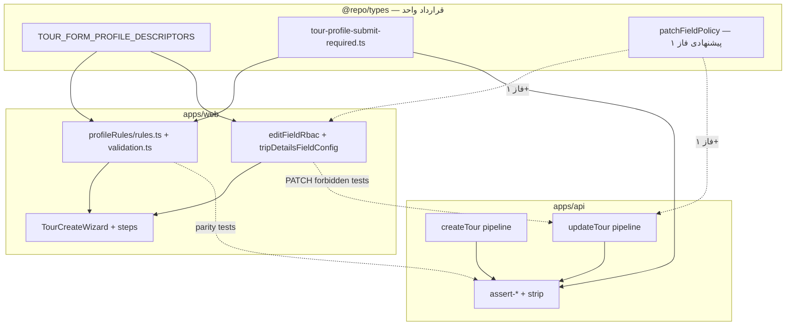

# مسیر اجرای Tour Profile — Validation Parity، PATCH Safety و Capability

**وضعیت:** برنامهٔ اجرایی فعال  
**منبع الزامات:** [`prompt.md`](../../prompt.md) (ریشهٔ ریپو)  
**مخاطب:** مهندسانی که روی Wizard، Edit و API تور کار می‌کنند  
**تاریخ مرجع:** 2026-05-16  

**اسناد همراه (قبل از شروع هر فاز بخوانید):**

| سند | نقش |
|-----|-----|
| [`tour-profile-current-state.md`](./tour-profile-current-state.md) | نقشهٔ معماری فعلی (P1–P15) |
| [`../PROFILE_ARCHITECTURE_PLAYBOOK.md`](../PROFILE_ARCHITECTURE_PLAYBOOK.md) | چک‌لیست افزودن پروفایل/فیلد |
| [`tour-profile-guardrails.md`](./tour-profile-guardrails.md) | ESLint + ممنوعیت‌های Wizard |
| [`unified-tour-domain-model.md`](./unified-tour-domain-model.md) | RFC کامل + invariantها |
| [`../../apps/api/docs/RBAC-SECURITY-COVERAGE.md`](../../apps/api/docs/RBAC-SECURITY-COVERAGE.md) | پوشش CASL/RBAC API |

---

## ۱. هدف نهایی (END GOAL)

از [`prompt.md`](../../prompt.md):

| محور | هدف | معیار پذیرش |
|------|-----|-------------|
| **Validation parity** | بدون drift بین UI و API برای فیلدهای required/forbidden/recommended | یک قرارداد مشترک در `@repo/types`؛ تست parity per profile سبز |
| **Extensibility** | قابلیت جدید = **capability** یا **module**، نه role جدید | feature flag / subject CASL جدید؛ tier-based role فقط برای membership |
| **Safety** | API منبع حقیقت برای persist | PATCH نتواند فیلدی را بنویسد که Edit برای نقش کاربر ممنوع کرده |
| **تست** | پوشش سیستماتیک (نه فقط QA دستی) | چک‌لیست §۶ در CI یا pre-merge |

**خارج از scope این برنامه:** حذف CASL، حذف RBAC، refactor بزرگ `ToursService` به میکروسرویس‌ها (فقط incremental slice).

---

## ۲. قوانین اجرا (اجباری)

این قوانین از `prompt.md` استخراج شده‌اند و روی **هر PR** اعمال می‌شوند:

1. **Incremental:** هر PR یک شکاف مشخص (یک پروفایل، یک فیلد، یک نقش، یا یک transition).
2. **Report قبل از refactor:** اگر بیش از ~۳ فایل غیرمرتبط یا تغییر رفتار گسترده لازم است → ابتدا گزارش gap (فاز ۰) یا ADR کوتاه.
3. **Ambiguity → report → code:** اگر مشخص نیست UI درست است یا API → گزارش بنویس، سپس یک طرف را authoritative کن (همیشه **API برای persist**).
4. **اول safety، بعد extensibility:** فاز ۱–۲ قبل از capability layer.
5. **CASL extend، نه حذف:** `@CheckAbilities` + `packages/shared/rbac/ability.factory.ts`.
6. **RBAC tier-based باقی بماند:** `WorkspaceRole` (owner/admin/leader/member/viewer)؛ رفتار جدید با capability map شود نه role ششم.

---

## ۳. وضعیت فعلی (baseline)

### ۳.۱ آنچه انجام شده است

| لایه | دستاورد | مسیرهای کلیدی |
|------|---------|----------------|
| **Domain** | `TourFormProfile` + descriptor یکپارچه | `packages/types/src/tour-form-profile-descriptors.ts` |
| **Submit-required مشترک** | web ↔ types ↔ API | `packages/types/src/tour-profile-submit-required.ts`, `apps/web/.../profileRules/validation.ts`, `apps/api/.../assert-profile-required-fields-for-submit.ts` |
| **Parity strip/invariants** | wizard ↔ server strip | `apps/web/.../profileRules/parity-with-server.spec.ts` |
| **Create pipeline** | resolve → pre-strip → strip → required → invariants | `ToursService.createTour` (~خط ۶۷۹+) |
| **PATCH pipeline** | merge → resolve → pre-strip log → strip → validate | `ToursService.updateTour` (~خط ۸۳۳+) |
| **Edit RBAC جدا** | نقش × visibility (P15) | `apps/web/.../config/editFieldRbac.ts`, `editCoreFieldConfig.ts` |
| **CASL Tours** | create/update/read روی `Tour` | `apps/api/.../tours/tours.controller.ts` |
| **Smoke wizard** | پروفایل‌های cinema/urban | `apps/web/tests/smoke/0*-tour-wizard-*.spec.ts` |

### ۳.۲ شکاف‌های شناخته‌شده (کار این برنامه)

| شکاف | توضیح |
|------|--------|
| **گزارش diff سه‌لایه** | هنوز به‌صورت سند ثابت تکمیل نشده (فاز ۰) |
| **PATCH forbidden per role** | Edit `resolveFieldAccess` دارد؛ API هنوز field-level reject سیستماتیک ندارد |
| **`forbidden` در wizard rules** | نوع `FieldRequiredness` شامل `"forbidden"` است ولی validation امروز استفاده نمی‌کند (`types.ts`) |
| **Capability model** | CASL روی subjectهای درشت (`Tour`, `Settings`)؛ granularity فیلد/قابلیت جدا نیست |
| **create vs PATCH vs OPEN** | transition lifecycle جداگانه تست ماتریسی ندارد |
| **PATCH required parity** | submit-required parity هست؛ required در میانهٔ PATCH draft ممکن است drift کند |

---

## ۴. معماری هدف (قرارداد واحد)



**اصل:** هیچ جدول strip/required/forbidden را در web و api جداگانه تعریف نکن — یا از descriptor بیاید یا از ماژول جدید در `@repo/types`.

---

## ۵. فازهای اجرا

### فاز ۰ — گزارش diff (بدون تغییر رفتار)

**هدف:** تکمیل اولین قدم `prompt.md` قبل از هر PR رفتاری.

#### ۵.۰.۱ ورودی‌ها (سه منبع)

| # | منبع | فایل‌های محور |
|---|--------|----------------|
| A | **profileRules (web)** | `apps/web/src/features/tours/wizard/profileRules/rules.ts`, `validation.ts`, `fieldGroups.ts` (از `apps/web/.../wizard/fieldGroups.ts`) |
| B | **API createTour** | `apps/api/src/modules/tours/tours.service.ts` (`createTour`), `utils/assert-create-tour-invariants.ts`, `utils/assert-profile-required-fields-for-submit.ts`, `utils/create-tour-form-profile-strip.ts` |
| C | **API PATCH updateTour** | همان سرویس (`updateTour`), `utils/tour-type-gates.ts`, merge helpers |

**لایهٔ چهارم (برای PATCH holes):**

| # | منبع | فایل |
|---|--------|------|
| D | **Edit RBAC** | `apps/web/src/features/tours/config/editFieldRbac.ts`, `editCoreFieldConfig.ts`, `tripDetailsFieldConfig.ts` |

#### ۵.۰.۲ روش کار (گام‌به‌گام)

1. **استخراج خودکار (اسکریپت یا جدول دستی):**
   - از `BASE_FIELD_RULES`: لیست `(path, profile, requiredness, visibility)`.
   - از `getRequiredSubmitFieldPathsForProfile` در `@repo/types`: لیست submit-required per profile.
   - از `assertProfileRequiredFieldsForSubmit`: همان set را برای DTO create تأیید کن.
   - از `tripDetailsFieldConfig` + `editCoreFieldConfig`: `(fieldId, profile, minRoleForEdit, allowedRoles, visibility)`.
2. **مقایسهٔ سه‌تایی** برای هر `TourFormProfile` در `TOUR_FORM_PROFILE_VALUES`.
3. **ثبت در سند gap** (قالب §۷).

#### ۵.۰.۳ خروجی‌های اجباری

| خروجی | محتوا |
|--------|--------|
| **required-field gaps** | فیلد required در wizard ولی نه در API create؛ یا API reject ولی wizard optional |
| **PATCH field holes** | فیلد readonly/hidden در Edit ولی PATCH موفق برای member/leader |
| **capability candidates** | رفتارهای role-based که باید به CASL action/subject تبدیل شوند |
| **transition gaps** | invariant فقط در create یا فقط در OPEN |

#### ۵.۰.۴ معیار اتمام فاز ۰

- [ ] فایل gap پر شده (§۷ یا `tour-profile-parity-gap-report.md` جدا)
- [ ] هر gap اولویت‌بندی شده: `P0` (امنیت/دادهٔ اشتباه) / `P1` (UX) / `P2` (extensibility)
- [ ] مالک هر gap (Wizard / API / types) مشخص شده

**تخمین زمان:** ۴–۸ ساعت (بدون کد).

---

### فاز ۱ — Validation parity (safety)

**هدف:** `❌ no drift` → `✅ single shared contract` برای required / recommended / (آینده) forbidden.

#### ۵.۱.۱ کارهای فنی

| # | کار | جزئیات |
|---|-----|--------|
| 1.1 | **تثبیت قرارداد submit-required** | از قبل: `submit-required-parity.spec.ts` + `assert-profile-required-fields-for-submit.spec.ts` — فقط gapهای فاز ۰ را ببند |
| 1.2 | **گسترش types برای PATCH draft** | در `packages/types` متادیتای «فیلدهای required وقتی lifecycle ≠ OPEN» اگر product بخواهد |
| 1.3 | **هم‌تراز کردن `recommended`** | wizard `FieldRule.required === "recommended"` + Edit `FieldRequiredness.recommended` + badge UI — بدون block در API مگر product بخواهد |
| 1.4 | **فعال‌سازی `forbidden` در rules** | در `profileRules/types.ts` رزرو شده؛ ردیف‌های `forbidden` در `rules.ts` + mirror در API pre-strip |
| 1.5 | **تست per profile** | برای هر slug در `TOUR_FORM_PROFILE_VALUES`: `requiredFieldsForProfile` === `getRequiredSubmitFieldPathsForProfile` (+ PATCH اگر اضافه شد) |

#### ۵.۱.۲ ترتیب pipeline (مرجع — تغییر نده مگر در گزارش)

**Create (`createTour`):**

```
resolveTourFormProfileForCreateDtoWithSource
  → assertIncomingCreateTourDtoBeforeFormProfileStrip
  → stripCreateTourDtoForFormProfile
  → assertProfileRequiredFieldsForSubmit
  → assertCreateTourInvariants
  → persist + formProfileSnapshot
```

**PATCH (`updateTour`) — بخش tripDetails:**

```
merge tripDetails
  → resolveTourFormProfileFromTripDetails
  → assertIncomingTripDetailsPatchFragment (logged)
  → applyTourFormProfileStripToPersistedTripDetails
  → validatePersistedTripDetailsForResolvedProfile
  → (optional) refresh formProfileSnapshot — flag TOURS_REFRESH_FORM_PROFILE_SNAPSHOT_ON_PATCH
```

#### ۵.۱.۳ PRهای پیشنهادی (اندازه کوچک)

| PR | عنوان نمونه | فایل‌ها |
|----|-------------|---------|
| 1a | `fix(parity): close submit-required gap for <profile>` | types + rules + assert spec |
| 1b | `feat(types): add patchDraftRequired paths to descriptor` | descriptors + validation |
| 1c | `test(parity): exhaust forbidden paths urban/cinema` | rules + parity-with-server |

#### ۵.۱.۴ معیار اتمام فاز ۱

- [ ] صفر gap با اولویت P0 در جدول required-field
- [ ] `npm test` / workspace test برای specs ذکر شده سبز
- [ ] playbook §Step F به‌روز نشده مگر یک خط «parity extended»

---

### فاز ۲ — PATCH forbidden-field + نقش (safety)

**هدف:** آنچه UI نشان نمی‌دهد یا editable نیست، API هم با 403/422 رد کند.

#### ۵.۲.۱ وضعیت Edit امروز

- `editFieldRbac.ts`: `resolveFieldAccess`, `minRoleForEdit`, `allowedRoles`, `viewOnlyRoles`
- `editCoreFieldConfig.ts`: `core.totalCapacity`, `core.capacity` با leader-rank
- `fieldAccess.spec.ts`: تست‌های واحد RBAC Edit

**شکاف:** API `UpdateTourDto` هنوز field-level ability ندارد — فقط `@CheckAbilities(Update, Tour)` در سطح endpoint.

#### ۵.۲.۲ طراحی پیشنهادی (incremental)

| لایه | اقدام |
|------|--------|
| **types** | `getPatchForbiddenPathsForRole(profile, role): readonly string[]` یا map در descriptor |
| **API** | بعد از merge PATCH، `assertPatchFieldsAllowedForActor(context, dto, tour)` — قبل از save |
| **Web** | Edit از همان helper types بخواند (حذف duplicate `allowedRoles` تدریجی) |
| **CASL** | اختیاری فاز ۲b: subject `TourField` با conditions — **فقط اگر guard stack موجود کافی نبود** |

#### ۵.۲.۳ ماتریس تست (الزام prompt)

برای هر ترکیب `(WorkspaceRole × field × profile)` که Edit `canEdit === false`:

| تست | انتظار |
|-----|--------|
| `PATCH` با فقط آن فیلد | `403` یا `422` با code پایدار |
| Leader/admin | همان فیلد اگر policy اجازه دهد → `200` |

**فایل تست پیشنهادی:**

- `apps/api/src/modules/tours/utils/assert-patch-field-policy.spec.ts` (جدید)
- گسترش `apps/web/src/features/tours/config/fieldAccess.spec.ts` با import از `@repo/types`

#### ۵.۲.۴ نقشهٔ فیلدهای پرریسک (شروع تست‌ها)

| فیلد / مسیر | نقش معمولاً محدود | منبع config |
|-------------|-------------------|-------------|
| `total_capacity` / `core.totalCapacity` | member | `editCoreFieldConfig.ts` |
| pricing / cost_context | member vs leader | DTO + Edit matrix |
| `lifecycle_status` → OPEN | readiness invariant | `assertTourIsPublishable`, `assertTourOpenReadiness` |
| tripDetails roots برای urban/cinema | strip + hidden groups | descriptor `inactiveFieldGroups` |

#### ۵.۲.۵ معیار اتمام فاز ۲

- [ ] تست **PATCH forbidden-field per role** برای حداقل ۳ نقش × ۲ پروفایل (urban + mountain)
- [ ] e2e یک مسیر: member PATCH capacity → reject
- [ ] سند `RBAC-SECURITY-COVERAGE.md` یک پاراگراف «field-level PATCH policy»

---

### فاز ۳ — Extensibility: Capability / Module

**هدف:** `new feature = capability OR module, not role`

#### ۵.۳.۱ اصل

- **Role** = tier membership (`WorkspaceRole`) — ثابت می‌ماند.
- **Capability** = عمل قابل grant (مثلاً `tour.publish`, `tour.patchPricing`, `settings.themes.write`).
- **Module** = bounded context جدا (مثلاً `finance-ledger`, `reconciliation`) با guard خودش.

#### ۵.۳.۲ نقشهٔ migration (بدون شکستن API)

| مرحله | کار |
|--------|-----|
| 3a | از جدول capability candidates فاز ۰، لیست ثابت در `packages/shared/rbac/capabilities.ts` (جدید) |
| 3b | `defineAbilityFor`: map role → capabilities (internal)؛ public API همان `@CheckAbilities` |
| 3c | تست **capability grant tests in CASL** در `packages/shared/rbac/ability.factory.spec.ts` |
| 3d | یک handler نمونه: `ability.can('publish', 'Tour')` به‌جای فقط `update` |

**ممنوع:** اضافه کردن `WorkspaceRole.Custom` برای یک feature.

#### ۵.۳.۳ capability candidates (نمونه — پس از فاز ۰ تکمیل شود)

| Capability | جایگزین الگوی فعلی |
|------------|---------------------|
| `tour.create` | `Create Tour` برای leader+ |
| `tour.update.core` | PATCH capacity, lifecycle |
| `tour.update.tripDetails` | PATCH tripDetails |
| `tour.publish` | transition به OPEN |
| `settings.themes.manage` | Settings CRUD themes |
| `registration.staff.mutate` | leader/admin registration mutations |

#### ۵.۳.۴ معیار اتمام فاز ۳

- [ ] حداقل ۵ capability در factory با spec
- [ ] `architecture-guardrails` همچنان سبز (mutation guard stack دست نخورده)
- [ ] مستند کوتاه در `RBAC-SECURITY-COVERAGE.md`

---

### فاز ۴ — Transition tests + regression wizard

**هدف:** پوشش `create vs patch vs open transition tests` + smoke پایدار.

#### ۵.۴.۱ ماتریس transition

| از \ به | DRAFT | OPEN | CANCELLED / … |
|---------|-------|------|----------------|
| **POST create** | allowed + invariants | `assertTourOpenReadiness` | — |
| **PATCH** | partial tripDetails | `assertTourIsPublishable` + `assertValidLifecycleTransition` | policy |
| **Wizard submit** | `validateForSubmit` | همان required set | — |

**فایل‌های مرجع transition:**

- `apps/api/src/modules/tours/tours.service.ts` — `assertValidLifecycleTransition`, `assertTourIsPublishable`
- invariantهای OPEN در create (~خط ۷۸۰)

#### ۵.۴.۲ تست‌ها

| نوع | محل پیشنهادی |
|-----|----------------|
| Unit transition | `apps/api/src/modules/tours/tours-lifecycle-transitions.spec.ts` (جدید) |
| Profile × transition | ترکیب با `TOUR_FORM_PROFILE_VALUES` |
| Wizard regression | `apps/web/tests/smoke/01-tour-wizard-new.spec.ts` و urban/cinema specs |
| E2E اختیاری | `apps/api/test/e2e/release-gate-journeys.e2e-spec.ts` |

#### ۵.۴.۳ CI

- اطمینان از اجرای `parity-with-server.spec.ts`, `submit-required-parity.spec.ts` در pipeline web/api
- workflow: `.github/workflows/architecture-guardrails.yml` — بدون تضعیف security mutation guardrails

#### ۵.۴.۴ معیار اتمام فاز ۴

- [ ] ماتریس transition با حداقل یک تست per نقطهٔ بحرانی (OPEN از PATCH، OPEN از create)
- [ ] smoke wizard در CI سبز
- [ ] gap report به‌روز — همه P0/P1 بسته

---

## ۶. چک‌لیست تست (الزام prompt.md)

| تست | وضعیت baseline | فاز هدف | فایل(ها) |
|-----|----------------|---------|----------|
| required-field parity per profile | ✅ جزئی | گسترش PATCH | `submit-required-parity.spec.ts`, `assert-profile-required-fields-for-submit.spec.ts` |
| PATCH forbidden-field per role | ❌ | ۲ | `assert-patch-field-policy.spec.ts` (جدید), `fieldAccess.spec.ts` |
| capability grant in CASL | 🟡 coarse | ۳ | `packages/shared/rbac/ability.factory.spec.ts` |
| create vs patch vs open transition | 🟡 پراکنده | ۴ | `tours-lifecycle-transitions.spec.ts` (جدید) |
| regression tour wizard | ✅ smoke | ۴ | `apps/web/tests/smoke/*tour-wizard*` |

**حداقل bar هر PR:** حداقل یک تست قرمز→سبز برای همان شکاف؛ برای پروفایل جدید sweep روی `TOUR_FORM_PROFILE_VALUES`.

---

## ۷. قالب گزارش Gap (فاز ۰)

**گزارش:** [`tour-profile-parity-gap-report.md`](./tour-profile-parity-gap-report.md). **فاز ۰–۴:** gap report → submit-required → PATCH RBAC/phantom → capabilities → lifecycle transition tests.

### ۷.۱ required-field gaps

| Profile | Path | Web (rules) | API create | API PATCH | اولویت | اقدام پیشنهادی |
|---------|------|-------------|------------|-----------|--------|----------------|
| _مثال urban_event_ | `pricing.basePrice` | optional (capacity redundant) | ? | ? | P1 | … |

### ۷.۲ PATCH field holes

| Profile | Field / path | Role | Edit access | API PATCH نتیجه | اولویت |
|---------|--------------|------|-------------|-----------------|--------|
| _مثال_ | `total_capacity` | member | readonly | 200 (hole) | P0 |

### ۷.۳ capability candidates

| رفتار فعلی | محل کد | capability پیشنهادی | فاز |
|------------|---------|---------------------|-----|
| leader-only capacity | `editCoreFieldConfig.ts` | `tour.update.core` | ۳ |

### ۷.۴ transition gaps

| سناریو | enforce در create | enforce در PATCH | enforce در wizard | gap? |
|---------|-------------------|------------------|-------------------|------|
| OPEN بدون title | ✅ | ✅ | ✅ | — |

---

## ۸. نقشهٔ فایل‌ها (مرجع سریع)

### Web — Wizard

```
apps/web/src/features/tours/wizard/
  profileRules/
    rules.ts              # BASE_FIELD_RULES
    validation.ts         # validateForAutosave | Step | Submit
    getProfileRules.ts
    parity-with-server.spec.ts
    submit-required-parity.spec.ts
  fieldGroups.ts
  hooks/useTourWizardCreate.ts
apps/web/src/components/tours/wizard/
  TourCreateWizard.tsx
  steps/*.tsx
  schemas/tourCreateSchema.ts
```

### Web — Edit

```
apps/web/src/features/tours/config/
  editFieldRbac.ts
  editCoreFieldConfig.ts
  tripDetailsFieldConfig.ts
  fieldAccess.spec.ts
apps/web/src/components/tours/TourForm.tsx
apps/web/app/(app)/tours/[id]/edit/tour-edit-client.tsx
```

### API

```
apps/api/src/modules/tours/
  tours.service.ts          # createTour / updateTour
  tours.controller.ts       # CASL guards
  utils/
    create-tour-form-profile-strip.ts
    assert-create-tour-invariants.ts
    assert-profile-required-fields-for-submit.ts
    tour-type-gates.ts
```

### Types

```
packages/types/src/
  tour-form-profile.ts
  tour-form-profile-descriptors.ts
  tour-profile-submit-required.ts
  tour-domain-profile.ts
packages/shared/rbac/
  ability.factory.ts
  workspace-roles.ts
```

---

## ۹. اندازه PR و ترتیب پیشنهادی

```text
هفته ۱:  فاز ۰ (گزارش gap) — بدون رفتار
هفته ۲:  فاز ۱ PRهای 1a–1c (P0 required gaps)
هفته ۳:  فاز ۲ PRهای PATCH forbidden (member + leader)
هفته ۴:  فاز ۳ capabilities (اسکلت + ۲ handler)
هفته ۵:  فاز ۴ transitions + smoke hardening
```

**هر PR:**

- ≤ ۴۰۰ خط diff ترجیحاً
- توضیح «کدام سطر gap report بسته می‌شود»
- بدون drive-by refactor

---

## ۱۰. ریسک‌ها و mitigations

| ریسک | mitigation |
|------|------------|
| شکستن partner/BFF که `formProfile` نمی‌فرستد | resolver سرور + telemetry `resolution_source`؛ تست backward compat |
| دو منبع حقیقت دوباره | هر جدول جدید فقط در `@repo/types` |
| PATCH سخت‌گیر بیش از حد | feature flag در `tours-feature-flags.ts` برای rollout |
| نقش legacy `operator` | `normalizeFieldUserRole` / `tryParseWorkspaceRole` |

---

## ۱۱. تعریف Done کل برنامه

- [ ] `prompt.md` END GOAL: parity ✅ و extensibility با capability ✅
- [ ] صفر P0 در gap report
- [ ] چک‌لیست §۶ کامل
- [ ] `tour-profile-current-state.md` یک پاراگراف «post parity closure» (اختیاری)

---

## ۱۲. شروع فوری (Action items)

1. ایجاد `tour-profile-parity-gap-report.md` با قالب §۷.
2. اجرای اسکریپت/جدول مقایسه برای همه `TOUR_FORM_PROFILE_VALUES`.
3. اولین PR: کوچک‌ترین **P0 PATCH hole** (معمولاً `total_capacity` برای member).
4. هم‌زمان: اطمینان از سبز بودن `submit-required-parity` و `parity-with-server` در CI.

**مسئول پیشنهادی:** مالک tour domain؛ بازبینی امنیت برای فاز ۲–۳.

---

*این سند با پیشرفت فازها به‌روز شود. تغییرات بزرگ معماری → [`ADR-tour-profile-closure.md`](./ADR-tour-profile-closure.md) یا ADR جدید.*
