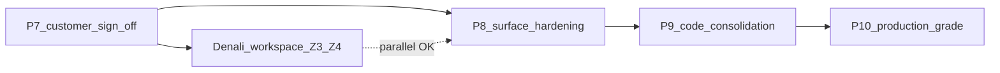

# Post-P7 — Platform roadmap (P8 · P9 · P10)

```yaml
roadmap_id: POST-P7-PLATFORM-ROADMAP
version: "1.3"
alignment: POST-P7-PACK-ALIGNMENT.md
effort_ranking: POST-P7-EFFORT-RANKING.md
hardest_path_to_nine: phase-23/p10-effort-to-nine.md
status: PLANNED
prerequisite: P7-3-N-005 sign-off · IMPLEMENTATION-TRUTH-P7 BEHAVIORAL_COMPLETE
authority: phase-20/p7/appendices/POST-P7-HORIZON.md
product_parallel: Denali workspace Z3/Z4 (after P7 — not blocked by P8)
```

> **Scope:** زیرساخت سه سطح (عمومی · مهمان · اپراتور) + API — **نه** feature جدید Denali workspace.  
> **Trigger:** فقط بعد از تحویل مشتری اول (P7). تا آن لحظه این فازها **PLANNED** می‌مانند.

---

## چرا سه فاز (نه ده تا)

| Pack | Phase folder | هدف یک خط | نمره هدف | effort (سخت) |
| ---- | ------------ | --------- | -------- | ------------- |
| **P8** | [phase-21/](phase-21/) | ingress + session + env parity | ~9/10 | 🥈 2–4 هفته |
| **P9** | [phase-22/](phase-22/) | dedup + legacy + boundary guards | ~8.7/10 (fit) | 🥉 3–5 هفته |
| **P10** | [phase-23/](phase-23/) | TLS · CI smoke · ops · Profile C | ~8.7/10 (fit) | **🥇 5–10 هفته** |

> **کدام بیشتر کار دارد تا ≥۹؟** **P10** — [POST-P7-EFFORT-RANKING.md](POST-P7-EFFORT-RANKING.md) · [phase-23/p10-effort-to-nine.md](phase-23/p10-effort-to-nine.md)

Denali workspace (product) **موازی** با P8+ مجاز است؛ fixهای infra که **P7 staging** را می‌شکنند در **P7-0** می‌مانند، نه P8.

---

## Effort → ۹ (projection سخت — fit-aligned)

| Pack | baseline | بعد exit | هفته |
| ---- | -------: | -------: | ---: |
| P8 | 3.2 | ~8.0 (B session cap) | 2–4 |
| P9 | 3.2 | ~8.7 | 3–5 |
| P10 | 3.4 | ~8.7 | 5–10 |
| **Platform** | 3.2 | **~8.8–9.0** | **10–19** |

**تراز pack‌ها:** [POST-P7-PACK-ALIGNMENT.md](POST-P7-PACK-ALIGNMENT.md)

---

## وضعیت baseline (audit سخت 2026-06-22)

**منبع:** [p8-ingress-session-env-audit.md](phase-21/p8-ingress-session-env-audit.md)

| Pack | baseline | exit (fit) | محور اصلی |
| ---- | -------: | ---------: | --------- |
| P8 | 3.2 | A≥9 · B session≥8 · env≥9 | ingress · session · env |
| P9 | 3.2 | ≥8.7 | dedup · surface boundary |
| P10 | 3.4 | ≥8.7 | TLS · smoke · Profile C |

**P0 blockers Wave A:** P8 G-ING-01/02 · G-SES-01/02/03 · G-ENV-01 — [p8-gap-registry.md](phase-21/p8-gap-registry.md)

---

## ترتیب اجرا



```text
1. P7 بسته شود (T4 · evidence · VS staging)
2. P8 — platform surfaces (اجباری قبل prod دوم)
3. P9 — dedup + legacy removal
4. P10 — custom domain · TLS · CI کامل
```

---

## نقشه هر pack (خلاصه)

### P8 — Surface hardening → [phase-21/](phase-21/)

**Fit:** [p8-app-fit.md](phase-21/p8-app-fit.md) — stack مشترک ۴ پروسه · Profile A+B · **نه** TLS/custom apex

| EPIC | موضوع |
| ---- | ----- |
| P8-0 | IP fallback · no silent fallback · parser surface |
| P8-1 | cookie rename · JWT↔host · portal middleware |
| P8-2 | env 4-file bootstrap/verify |
| P8-3 | `p8:gate` Profile A+B |

**خارج از P8:** guest-surface (P9) · web public-auth (P9) · __Host-/TLS (P10)

**Exit (fit):** Profile A ≥9 · Profile B session **≥8** (IP cap) · env ≥9

---

### P9 — Code consolidation → [phase-22/](phase-22/)

**App fit:** [p9-app-fit.md](phase-22/p9-app-fit.md) · **Audit:** [p9-code-consolidation-audit.md](phase-22/p9-code-consolidation-audit.md)

| EPIC | موضوع |
| ---- | ----- |
| P9-0 | `guest-surface-host` (M+P) + `session-client` (web+portal) |
| P9-1 | حذف web public-auth · orphan flow · catalog bootstrap (**redirect shims نگه**) |
| P9-2 | pluginId فقط از API |
| P9-3 | boundary guard · doc/e2e · `p9:gate` |

**Baseline:** composite **3.2/10**.

**Exit (fit):** composite **≥ 8.7** · web بدون guest BFF · M+P یک bootstrap path.

---

### P10 — Production grade → [phase-23/](phase-23/)

**App fit:** [p10-app-fit.md](phase-23/p10-app-fit.md) · **Audit:** [p10-production-grade-audit.md](phase-23/p10-production-grade-audit.md)

| EPIC | موضوع |
| ---- | ----- |
| P10-1 | Caddy wildcard staging TLS · loopback |
| P10-2 | smoke 4/4 · GHA gate · env alignment |
| P10-3 | incident · cert · rollback · `p10:gate` |
| P10-0 | M+P custom apex · on-demand TLS (Wave C) |

**Baseline:** composite **3.4/10**.

**Exit (fit):** composite **≥ 8.7** · Profile C staging HTTPS · smoke 4/4 · **Profile B IP نگه داشته می‌شود**.

---

## خارج از این roadmap

| موضوع | Doc |
| ----- | --- |
| درگاه پرداخت | phase-18 · POST-P7-HORIZON P5-D |
| Urban workspace | phase-8 |
| Denali dashboard/finance UI polish | Z4 · workspace product |
| P7 delivery blockers | phase-20/p7 |

---

## فایل‌های pack (scaffold v1.1)

| Pack | README | Audit / Charter | Action | Gap registry | Exit |
| ---- | ------ | --------------- | ------ | ------------ | ---- |
| P8 | [phase-21/README.md](phase-21/README.md) | [AGENT-START.md](phase-21/AGENT-START.md) · [p8-app-fit.md](phase-21/p8-app-fit.md) | [p8-action-plan.yaml](phase-21/p8-action-plan.yaml) | [p8-gap-registry.md](phase-21/p8-gap-registry.md) | [p8-exit-checklist.md](phase-21/p8-exit-checklist.md) |
| P9 | [phase-22/README.md](phase-22/README.md) | [AGENT-START.md](phase-22/AGENT-START.md) · [p9-app-fit.md](phase-22/p9-app-fit.md) | [p9-action-plan.yaml](phase-22/p9-action-plan.yaml) | [p9-gap-registry.md](phase-22/p9-gap-registry.md) | [p9-exit-checklist.md](phase-22/p9-exit-checklist.md) |
| P10 | [phase-23/README.md](phase-23/README.md) | [AGENT-START.md](phase-23/AGENT-START.md) · [p10-app-fit.md](phase-23/p10-app-fit.md) | [p10-action-plan.yaml](phase-23/p10-action-plan.yaml) | [p10-gap-registry.md](phase-23/p10-gap-registry.md) | [p10-exit-checklist.md](phase-23/p10-exit-checklist.md) |

---

## References

- [POST-P7-PACK-ALIGNMENT.md](POST-P7-PACK-ALIGNMENT.md)
- [phase-20/p7/appendices/POST-P7-HORIZON.md](phase-20/p7/appendices/POST-P7-HORIZON.md)
- [phase-19/p6-host-addressing-architecture.mdoc](phase-19/p6-host-addressing-architecture.mdoc)
