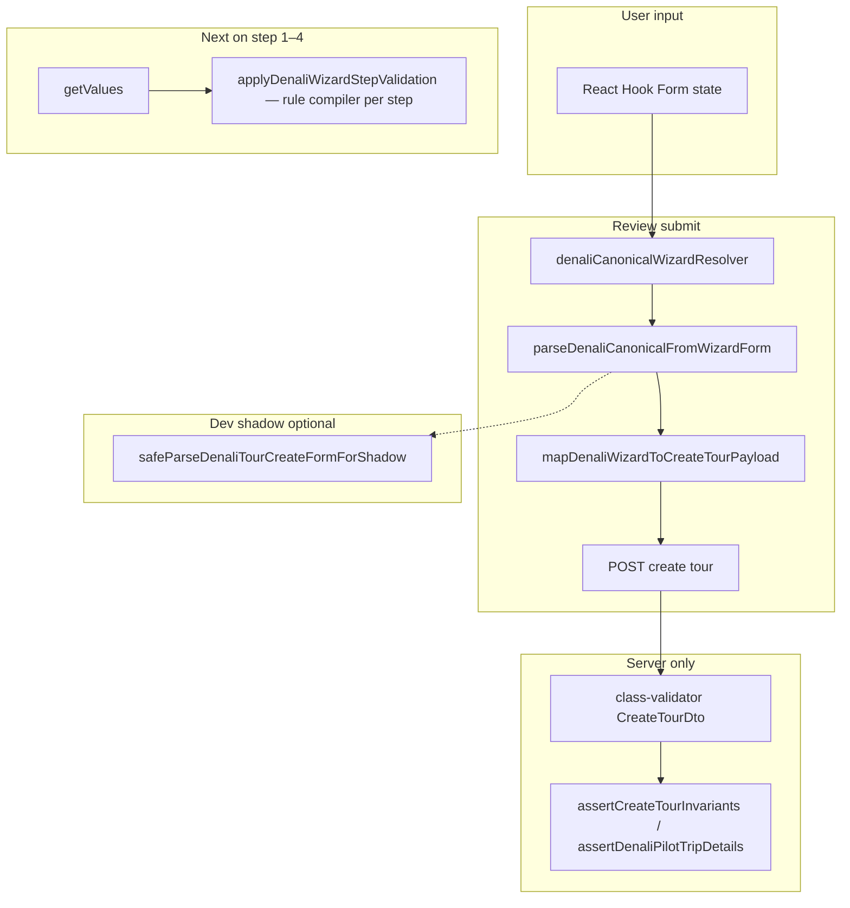

# Denali wizard validation (canonical submit authority)

## Source of truth (submit)

**Submit and RHF resolver** use only:

1. `denaliFormToCanonical` (`denaliCanonicalFormAdapter.ts`)
2. **`denaliCanonicalTourSchema`** (`schemas/denaliCanonicalTourSchema.ts`)

Orchestration: `parseDenaliCanonicalFromWizardForm` in `denali/validation/denaliSubmitValidation.ts`.

```text
form (RHF) → canonical adapter → denaliCanonicalTourSchema → mapDenaliWizardToCreateTourPayload
```

## Deprecated legacy schema

**`denaliTourCreateBaseSchema.ts`** (`denaliTourCreateSchema`, `parseDenaliTourCreateForm`) is **removed from the product runtime pipeline**:

| Path | Schema |
|------|--------|
| Submit (`createTourFromDenaliWizardForm`) | `denaliCanonicalTourSchema` only |
| Wizard resolver (`denaliCanonicalWizardResolver`) | `denaliCanonicalTourSchema` only |
| Mapper | No schema (canonical passthrough) |

Legacy schema remains for:

- Unit tests (`denaliTourCreateSchema.spec.ts`)
- Dev shadow comparison (`safeParseDenaliTourCreateFormForShadow`)
- QA / integration helpers building fixture forms

In **`NODE_ENV=development`**, calling `parseDenaliTourCreateForm` throws — use canonical paths in product code.

## Validation flow



## Step “Next” vs full submit

| Step | Validation | Blocks on |
|------|------------|-----------|
| `denali_basic` … `denali_pricing` | Compiled rule model per step (`denaliRuleValidation`) | Visible fields for that step |
| `review` | `denaliCanonicalWizardResolver` on submit | Full canonical MVP + structural rules |

Step validation does **not** use `denaliTourCreateBaseSchema`.

## Shadow mode

`DENALI_VALIDATION_SHADOW_MODE = true` — on submit, logs canonical vs legacy issue lists when outcomes diverge (development only).

## Files

| File | Purpose |
|------|---------|
| `denaliCanonicalTourSchema.ts` | **Submit authority** |
| `denaliSubmitValidation.ts` | Submit parse + shadow |
| `denaliWizardCanonicalResolver.ts` | RHF resolver |
| `denaliTourCreateBaseSchema.ts` | **@deprecated** — tests/shadow only |
| `denaliTourCreateFormModel.ts` | RHF types, defaults, normalize |
| `denaliTourCreateValidation.ts` | Step issue filter + RHF errors |
| `createTourFromWizard.ts` | `parseDenaliCanonicalFromWizardForm` before map |

## Internal Hidden Fields (Submit-Only)

Certain fields are required for the API or specific workspace invariants but are not directly owned by a wizard step, or are only visible during the review phase.

| Field Path | Step / Owner | Clearing Rule | Purpose |
|------------|--------------|---------------|---------|
| `pricingPayment.paymentMode` | `denali_pricing` | Internal constant | Always `offline_receipt` for Denali Pilot. |
| `participantRequirements.minimumAge` | `submit_only` (Review) | Cleared for non-mountain | Required for mountain invariants. |
| `participantRequirements.fitnessLevel` | `submit_only` (Review) | Cleared for non-mountain | Required for mountain invariants. |
| `participantRequirements.sportsInsuranceRequired` | `submit_only` (Review) | Cleared for non-mountain | Required for mountain invariants. |

These fields are cleared via `normalizeDenaliWizardForm` whenever the rule model marks them as `hidden: true` (e.g., when switching from a mountain to an event category).

## Normalization Triggers

Normalization ensures that the form state remains consistent with the current tour kind and category. It is triggered in the following scenarios:

1. **Kind Switch:** Whenever the `basicInfo.tourType` (category, duration, or event variant) changes.
2. **Step Change:** Whenever the user clicks "Next" to navigate to another step.
3. **Draft Restore:** When a draft or preset is applied to the form.
4. **Context Switch:** When specific toggles (like `shared_cars` or `requiresPayment`) change visibility of other fields.
