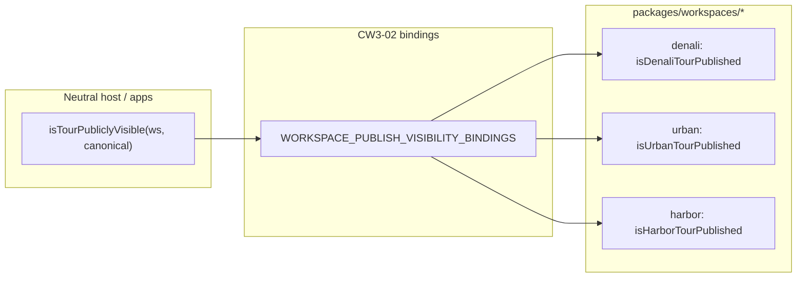

# CW3-01 — `TourPublishVisibilityPort` + manifest declaration

**Ledger task:** CW3-01  
**Wave:** CW Wave 3A (Worker B)  
**Status:** **DESIGN ONLY** — no production code, no codegen, no consumer migrations  
**Evidence:** TRUTH §5, §30; FEAS §2.2, §3 Step 1; DEC-CW-07  
**Downstream:** CW3-02 (codegen dispatch) → CW3-03/04 (consumer migrations) → CW3-05+ (label mapping, heuristics removal)

---

## 1. Problem statement

Public catalog exposure and registration gates today depend on **per-workspace boolean predicates** (`isDenaliTourPublished`, `isUrbanTourPublished`, `isHarborTourPublished`) imported directly at call sites. Host lifecycle code additionally bridges vocabulary with a **hard-coded heuristic**:

```typescript
// apps/api/src/canonical/assert-tour-publish-lifecycle-gate.ts (today)
return label === "published" || label === "active";
```

This violates CW-3 exit criteria: *host consumes ports/mappings; each workspace keeps its own vocabulary; no hard-coded publish-label heuristic without manifest entry* (lifecycle label mapping is CW3-05; **visibility** is CW3-01).

**CW3-01 scope:** design the neutral **visibility** port and manifest declaration only. It answers one question:

> Given a workspace canonical document, should this tour appear on **public** marketing/portal catalog surfaces and pass **published-tour** registration guards?

It does **not** normalize vocabulary, map labels to plugin lifecycle states, or migrate consumers.

---

## 2. Design goals and non-goals

### Goals

| # | Goal |
|---|------|
| G1 | Single dispatch pattern for `boolean` public visibility — no host knowledge of `active` vs `published` |
| G2 | Manifest-declared workspace adapter binding (codegen in CW3-02) |
| G3 | Preserve workspace canonical strings verbatim (Denali `active`, Urban/Harbor `published`) |
| G4 | Align with existing `PublicCatalogSurface.isPublished` and `requireWorkspacePublishedTour` injection seam |
| G5 | DEC-CW-07 dependency direction: SDK owns port type; workspaces own predicates; tour-core re-home deferred to CW5-04 |

### Non-goals (explicit)

| Item | Owner task |
|------|------------|
| Codegen / generated dispatch files | CW3-02 |
| Consumer migration (marketing, portal, registration) | CW3-03, CW3-04 |
| Wire-label → lifecycle contract mapping table | CW3-05 |
| Replace `isPublishedPublishStatusLabel` heuristic | CW3-06 |
| `tour-core` package move of port types | CW5-04 |
| Vocabulary normalization (`active` ↔ `published`) | Forbidden (DEC-CW-01 unrelated; label drift is intentional) |
| Archive semantics product decision | DEC-CW-02 (visibility treats `archived` as not-public by adapter behavior today) |

---

## 3. Port interface design

### 3.1 Core types (proposed — `workspace-sdk`, CW3-02 implementation)

Location (implementation): `packages/workspace-sdk/src/tour/tour-publish-visibility.port.ts`

```typescript
import type { CanonicalDocument } from "../canonical/canonical-document";

/**
 * Workspace-owned predicate: is this tour publicly visible on catalog/registration surfaces?
 *
 * Contract:
 * - Pure function of canonical input (no I/O, no tenant context).
 * - Returns false for missing/malformed canonical shapes (fail-closed).
 * - MUST NOT rename or normalize publish labels — compare workspace vocabulary only.
 * - `archived` and other non-published states MUST return false unless product later decides otherwise (DEC-CW-02).
 */
export type TourPublishVisibilityPredicate = (
  canonical: CanonicalDocument,
) => boolean;

/** Single-method port — mirrors PublicCatalogSurface.isPublished seam. */
export type TourPublishVisibilityPort = {
  readonly isTourPubliclyVisible: TourPublishVisibilityPredicate;
};

/** One row in codegen registry (CW3-02). */
export type TourPublishVisibilityBinding = {
  readonly workspaceType: string;
  readonly isTourPubliclyVisible: TourPublishVisibilityPredicate;
};
```

### 3.2 Dispatch surface (host + neutral consumers, CW3-02)

```typescript
/** Generated bindings + thin dispatch module (apps/api). */
export function isTourPubliclyVisible(
  workspaceType: string | undefined,
  canonical: CanonicalDocument,
): boolean;
```

Behavior:

- Resolve binding by `workspaceType` (same map pattern as `readTourPublishStatusLabel` in `workspace-canonical-tour-dispatch.ts`).
- Unknown / unbound workspace → `false` (fail-closed; matches `loadWorkspaceTourIfPublished` null path).
- **No** fallback to `label === "published" || label === "active"`.

### 3.3 Relationship to existing SDK contracts

| Existing type | Relationship |
|---------------|--------------|
| `PublicCatalogSurface.isPublished` | **Same predicate** — plugin `publicCatalog` block should reference the manifest-exported function (one implementation, two registration paths: plugin object + codegen binding). |
| `WorkspacePublishedTourLoadParams.isPublished` | Registration guards already accept injected predicate; CW3-04 formalizes injection source as dispatch binding instead of direct workspace import. |
| `readTourPublishStatusLabel` / `readPublishStatusFromCanonical` | **Orthogonal** — returns workspace canonical **string label**; visibility may use label read internally but is not defined as `label === X` in host code. |
| `detectWorkspaceTourPublishTransition` | **Downstream** — transition detection continues to compose visibility predicates (Urban/Harbor already do); unchanged in CW3-01. |

### 3.4 Optional tour-core re-home (CW5-04 note)

Per DEC-CW-07, if the port later moves to `@app-tour/tour-core`:

- `tour-core` exports structural types only (no `CanonicalDocument` import from SDK — use structural `{ readonly data: unknown }`).
- `workspace-sdk` one-way re-exports tour-core types.
- Workspaces may import from either SDK or tour-core; **adapters stay in `packages/workspaces/*`**.

CW3-01 places types in SDK to match FEAS Step 1 ("no package move") and existing `PublicCatalogSurface` location.

---

## 4. Manifest declaration shape

### 4.1 Extend `canonicalTour` block

Additive fields on `workspace.manifest.json` → `canonicalTour` (JSON Schema update in CW3-02):

```jsonc
{
  "canonicalTour": {
    // existing (unchanged)
    "publishStatusModule": "./tours",
    "publishStatusReadExport": "readDenaliTourPublishStatusFromCanonical",
    "publishTransitionExport": "detectDenaliTourPublishTransition",

    // CW3-01 additions
    "publishVisibilityModule": "./catalog/denali-publish-status",
    "publishVisibilityExport": "isDenaliTourPublished"
  }
}
```

| Field | Required | Description |
|-------|----------|-------------|
| `publishVisibilityModule` | When `canonicalTour` present and workspace exposes public catalog or published-tour registration | Package-relative module path (same rules as `publishStatusModule`) |
| `publishVisibilityExport` | Pair with module | Named export: `(canonical) => boolean` |

**Validation rules (codegen, CW3-02):**

1. If `publishVisibilityModule` is set, `publishVisibilityExport` is required (and vice versa).
2. Export MUST be a function accepting one argument compatible with `CanonicalDocument` and returning `boolean`.
3. When `canonicalTour` exists and `tourWrite` exists (WAC-001), visibility fields are **required** for workspaces in the publish goldens set: `denali`, `urban`.
4. Harbor: add full `canonicalTour` + `tourWrite` blocks in CW3-02 (manifest gap today — harbor uses `isHarborTourPublished` without registry binding).
5. Starter / guest-club: see §5.4–5.5 — visibility fields **optional** until real canonical tour surfaces ship.

### 4.2 JSON Schema fragment (for `WORKSPACE-MANIFEST.schema.json`)

```json
"publishVisibilityModule": {
  "type": "string",
  "description": "Module exporting public catalog visibility predicate (CW3-01)"
},
"publishVisibilityExport": {
  "type": "string",
  "description": "Export name: (canonical) => boolean; true when tour is publicly visible"
}
```

Both fields are optional at schema level; codegen enforces per-workspace requirements for production catalog workspaces.

### 4.3 Codegen output shape (CW3-02 preview)

Mirror `WORKSPACE_CANONICAL_TOUR_BINDINGS`:

```typescript
// workspace-publish-visibility-bindings.generated.ts (new)
export const WORKSPACE_PUBLISH_VISIBILITY_BINDINGS = [
  {
    workspaceType: DENALI_WORKSPACE_TYPE,
    isTourPubliclyVisible: isDenaliTourPublished,
  },
  {
    workspaceType: URBAN_WORKSPACE_TYPE,
    isTourPubliclyVisible: isUrbanTourPublished,
  },
  // harbor added when canonicalTour block lands
] as const;
```

Domain: extend `scripts/codegen/workspace-registry/domains/tour-api.mjs` or add `publish-visibility.mjs` consumed by orchestrator.

---

## 5. Workspace adapter responsibilities

Each adapter owns **how** to read its canonical shape and which string(s) mean "publicly visible." Host code never branches on vocabulary.

### 5.1 Denali (`denali`)

| Aspect | Value |
|--------|-------|
| **Export** | `isDenaliTourPublished` from `./catalog/denali-publish-status` |
| **Rule** | `canonical.data.publishStatus === "active"` (flat path only for visibility) |
| **Labels preserved** | `draft`, `active` |
| **Note** | `readDenaliTourPublishStatusFromCanonical` also checks nested `basicInfo.publishStatus` for PATCH/audit paths; visibility predicate today uses flat path only — **parity invariant**: CW0-02 goldens and `denali-catalog-exposure-prd.spec.ts` must remain byte-identical; adapter MUST NOT widen/narrow visibility without golden update |

```typescript
// Existing implementation — becomes manifest-bound export (no semantic change)
export function isDenaliTourPublished(canonical: CanonicalDocument): boolean {
  return readPublishStatus(canonical) === "active";
}
```

**Plugin wiring:** `denali.plugin.ts` `publicCatalog.isPublished` already delegates here — keep single function.

### 5.2 Urban (`urban`)

| Aspect | Value |
|--------|-------|
| **Export** | `isUrbanTourPublished` from `./http/publish-status` |
| **Rule** | Nested `data.tour.publishStatus ?? data.tour.status === "published"` |
| **Labels preserved** | `draft`, `published`, `archived` |
| **Archive** | `archived` → `false` (not published); DEC-CW-02 may later refine list-projection mapping, not visibility boolean |

### 5.3 Harbor (`harbor`)

| Aspect | Value |
|--------|-------|
| **Export** | `isHarborTourPublished` from `./catalog/to-harbor-catalog-card` |
| **Rule** | Resolve nested `data.tour` or flat `data`; `(publishStatus ?? status) === "published"` |
| **Manifest gap** | No `canonicalTour` block today — CW3-02 adds block + `tourWrite` alignment |
| **Labels preserved** | `draft`, `published` (smoke fixtures) |

### 5.4 Starter (`starter`)

| Aspect | Value |
|--------|-------|
| **Catalog today** | Reference workspace; no production public catalog with canonical tours |
| **Lifecycle** | Plugin `STARTER_LIFECYCLE`: `DRAFT` → `OPEN` (no canonical publish field in reference) |
| **CW3-01** | **No visibility binding required** until `canonicalTour` + catalog surfaces are added |
| **Future adapter** | When starter gains catalog: either (a) canonical field enum `details.status === "open"` or (b) delegate to `Tour.publishStatus` column + lifecycle — product decision outside CW3-01 |

### 5.5 Guest-club (`guest-club`)

| Aspect | Value |
|--------|-------|
| **Catalog today** | Smoke fixture (`GUEST_CLUB_SMOKE_PUBLISHED_TOUR_ID`); no canonical tour store |
| **CW3-01** | **Out of scope** for visibility port binding — stub workspace |
| **Future** | When promoted from stub: add `canonicalTour` + adapter following harbor/urban pattern |

### 5.6 Adapter responsibility summary



**Adapter MUST:**

- Own canonical path resolution (flat vs nested).
- Preserve workspace vocabulary strings in source code and persisted data.
- Stay pure (no DB, no request context).
- Remain the single source for both plugin `publicCatalog.isPublished` and codegen binding.

**Adapter MUST NOT:**

- Import from `apps/*`, other workspaces, or host dispatch modules.
- Normalize labels to a shared enum (CW3-05 mapping is separate).
- Encode host lifecycle graph rules (that is `assert-tour-publish-lifecycle-gate.ts` + CW3-05/06).

---

## 6. Dependency direction (DEC-CW-07)

```
apps/*  ──►  workspace-sdk (port types + dispatch consumers)
                ▲
                │ one-way (CW5-04 optional re-export)
                │
workspaces/*  ──┘ (adapter implementations)
                │
tour-core  ───────► booking-http-contracts (future port re-home only)
```

| Direction | Allowed? | Notes |
|-----------|----------|-------|
| `workspace-sdk` → `tour-core` | Yes (future) | SDK re-exports port types from tour-core after CW5-04 |
| `tour-core` → `workspace-sdk` | **No** | DEC-CW-07 forbidden |
| `workspaces/*` → `workspace-sdk` | Yes | Adapters implement predicate; import `CanonicalDocument` type |
| `workspaces/*` → `tour-core` | Yes (future) | Direct import of port types if SDK re-export skipped |
| `apps/*` → `workspaces/*` for visibility | **No** (target) | Replace with `isTourPubliclyVisible` dispatch |
| `tour-core` → `workspaces/*` | **No** | Adapters stay in workspaces |

**Compatibility:** Existing `is*TourPublished` exports remain as named workspace package exports through CW-3; codegen bindings import them. Retirement follows strangler census (CW5-09), not CW3-01.

---

## 7. Consumer map (informational — not migrated in CW3-01)

| Consumer | Current import | CW3 target |
|----------|----------------|------------|
| Denali catalog HTTP | `isDenaliTourPublished` | dispatch |
| Urban catalog HTTP | `isUrbanTourPublished` | dispatch |
| Harbor catalog HTTP | `isHarborTourPublished` | dispatch |
| Denali/Urban/Harbor registration | `requireWorkspacePublishedTour({ isPublished })` | inject dispatch-bound predicate |
| `denali.plugin` / urban internal | `publicCatalog.isPublished` | same adapter fn as manifest |
| Marketing/portal catalog gates | per-workspace or indirect | CW3-03 |
| `assert-tour-publish-lifecycle-gate.ts` | label heuristic | **not CW3-01** — CW3-05/06 |

---

## 8. Risk assessment

| Risk | Severity | Mitigation |
|------|----------|------------|
| Wrong workspace bound → unpublished tour on public catalog | **HIGH** (at CW3-03) | CW0-02 goldens; `denali-catalog-exposure-prd`, `urban-public-catalog`, `to-harbor-catalog-card` specs; negative fixtures per workspace |
| Denali flat vs nested path drift between visibility and label-read | **MEDIUM** | Document invariant in §5.1; parity tests before any adapter change |
| Harbor manifest gap blocks registry dispatch | **MEDIUM** | CW3-02 adds `canonicalTour` block; registry `--check` gate |
| Duplicate predicate implementations (plugin vs binding) | **LOW** | Single export referenced from both manifest and plugin |
| Starter/guest-club false sense of completeness | **LOW** | Explicit optional binding; no production catalog claims |
| Archive semantics change under DEC-CW-02 | **LOW** (deferred) | Current adapters already return false for `archived`; mapping table is CW3-05 |
| tour-core move breaks import boundaries | **LOW** (CW5-04) | SDK compatibility re-export; guard:tour-core-boundary |

**Design-phase risk:** **LOW** — documentation only, zero runtime change.

---

## 9. Implementation checklist (for coordinator / CW3-02+)

- [ ] Add `tour-publish-visibility.port.ts` to `workspace-sdk`
- [ ] Extend `WORKSPACE-MANIFEST.schema.json` + `manifest.schema.ts`
- [ ] Codegen: `WORKSPACE_PUBLISH_VISIBILITY_BINDINGS` + `isTourPubliclyVisible` dispatch
- [ ] Manifest entries: denali, urban; add harbor `canonicalTour` block
- [ ] Align `PublicCatalogSurface` plugin wiring to manifest export
- [ ] CW3-03: migrate one catalog consumer (marketing or portal)
- [ ] CW3-04: registration gate injection via dispatch
- [ ] Guard (CW3-09): fail on direct `is*TourPublished` imports in neutral host code

---

## 10. Implementation status

| Artifact | Status |
|----------|--------|
| This design doc | **Complete** |
| `TourPublishVisibilityPort` production types | **Not started** (CW3-02) |
| Manifest schema / workspace manifests | **Not started** (CW3-02) |
| Codegen dispatch | **Not started** (CW3-02) |
| Consumer migrations | **Not started** (CW3-03+) |
| Publish label mapping / heuristic removal | **Not started** (CW3-05+) |

**CW3-01 closure:** design review only. Architect verification required before CW3-02 execution.

---

## Appendix A — Vocabulary reference (preserved, not normalized)

| Workspace | Publicly visible when | Non-public examples |
|-----------|----------------------|---------------------|
| Denali | `publishStatus === "active"` | `draft` |
| Urban | `tour.publishStatus` or legacy `tour.status === "published"` | `draft`, `archived` |
| Harbor | `publishStatus` or `status === "published"` | `draft` |
| Starter | N/A (no binding in CW3-01) | `DRAFT` lifecycle |
| Guest-club | N/A (smoke stub) | — |

---

## Appendix B — Evidence links

- Ledger: `docs/dev/composable-workspace-refactor-plan.md` — CW3-01..CW3-09
- TRUTH §5 (publish vocabulary), §30 (catalog exposure)
- FEAS §3 Step 1 (visibility port)
- WAC-001: `docs/standards/workspace-api-capabilities.mdoc`
- Parity: `test/parity/publish-transition.golden.spec.mjs` (CW0-02)
- Existing predicates: `packages/workspaces/*/src/**/publish-status*.ts`, `denali-publish-status.ts`, `to-harbor-catalog-card.ts`

---

*Architect, documentation status: Updated. Link to docs: `docs/dev/cw3-01-tour-publish-visibility-port.md`.*
