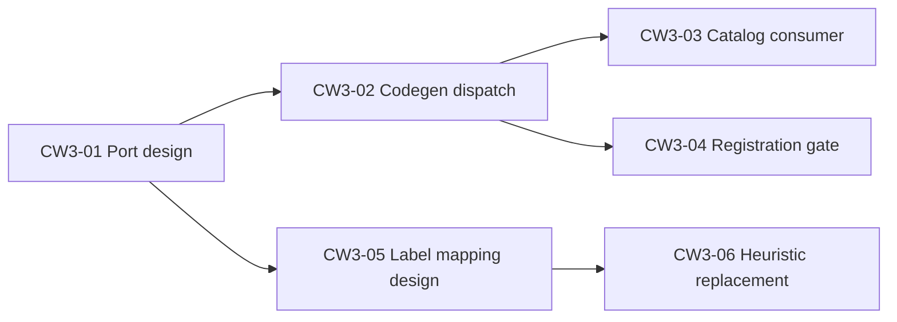

# CW3-01 — `TourPublishVisibilityPort` + manifest declaration (design)

**Task id:** CW3-01  
**Status:** design-complete  
**Wave:** CW-3 (Publish/Lifecycle Ports)  
**Repository ref:** `7d3daac6` (main)  
**Ledger:** [`composable-workspace-refactor-plan.md`](./composable-workspace-refactor-plan.md) § CW-3  
**Evidence inputs:** CW0-02 publish-transition goldens; TRUTH §5–6; DEC-CW-07; DEC-CW-02 evidence packet  
**Implementation tasks:** CW3-02 (codegen) · CW3-03 (marketing/portal catalog gating) · CW3-04 (registration gate)

---

## 1. Problem statement

Public catalog, registration create, and reminder feeds each duplicate workspace-specific publish checks:

| Workspace | Current export | Visibility rule (verbatim vocabulary) |
|-----------|----------------|---------------------------------------|
| Denali | `isDenaliTourPublished` | `publishStatus === "active"` (flat or `basicInfo.publishStatus`) |
| Urban | `isUrbanTourPublished` | nested `tour.publishStatus ?? tour.status === "published"` |
| Harbor | `isHarborTourPublished` | flat or nested `publishStatus ?? status === "published"` |
| Starter | *(none — no public catalog)* | lifecycle `OPEN` ≡ publicly visible when adapter lands |

Host code and workspace HTTP handlers pass these functions ad hoc into `loadWorkspaceTourIfPublished` / `requireWorkspacePublishedTour`. There is no manifest-declared, codegen-dispatched neutral entry point.

**CW3-01 scope:** design the port, manifest binding shape, generated dispatch contract, ownership, failure behavior, compatibility, and tests required for CW3-02/03. **No production migration** in this task.

**Non-goals (explicit):**

- Do not normalize workspace storage vocabulary (`active`, `published`, `DRAFT`/`OPEN`).
- Do not replace `readTourPublishStatusLabel` or `isPublishedPublishStatusLabel` (CW3-05/06).
- Do not migrate marketing, portal, or registration consumers (CW3-03/04).
- Do not declare `archived` a universal lifecycle state (DEC-CW-02).

---

## 2. Port contract

### 2.1 Neutral question

> **Is this tour publicly visible?**

Return type is **`boolean` only**. The port does not read, emit, or translate publish **labels**. Label vocabulary stays workspace-owned and is served by existing `readPublishStatusFromCanonical` bindings (CW0-02 goldens).

### 2.2 Type ownership (DEC-CW-07)

| Artifact | Owner package | Rationale |
|----------|---------------|-----------|
| `TourPublishVisibilityPort` interface | `@app-tour/tour-core` | Port interfaces live in tour-core per ledger ownership boundary |
| `TourPublishVisibilityCanonical` structural input | `@app-tour/tour-core` | tour-core must not import `CanonicalDocument` from workspace-sdk |
| Generated dispatch + manifest schema validation | `workspace-sdk` + `scripts/codegen/workspace-registry` | Plugin/manifest types stay SDK-owned; codegen is registry SoT |
| Workspace adapter implementations | `packages/workspaces/<id>/` | Canonical path logic stays workspace-specific |
| One-way compatibility re-export | `workspace-sdk` → `tour-core` | DEC-CW-07: SDK may reference/re-export tour-core types |

**Forbidden:** `tour-core` importing `workspace-sdk`, `platform-core`, `workspaces/*`, or `apps/*`.

### 2.3 Interface (canonical TypeScript)

```typescript
// packages/tour-core/src/ports/tour-publish-visibility.port.ts

/**
 * Minimal canonical shape for publish-visibility adapters.
 * Intentionally structural — not workspace-sdk CanonicalDocument.
 */
export type TourPublishVisibilityCanonical = {
  readonly data: unknown;
};

/**
 * CW3-01 — answers "is this tour publicly visible?" per workspace adapter.
 * MUST NOT normalize or expose workspace publish label strings.
 */
export type TourPublishVisibilityPort = {
  readonly isTourPubliclyVisible: (
    canonical: TourPublishVisibilityCanonical,
  ) => boolean;
};
```

### 2.4 SDK compatibility surface

```typescript
// packages/workspace-sdk/src/tour/tour-publish-visibility.port.ts

export type {
  TourPublishVisibilityCanonical,
  TourPublishVisibilityPort,
} from "@app-tour/tour-core";

/** Bridge workspace-sdk CanonicalDocument → tour-core structural input at dispatch boundary. */
export function toTourPublishVisibilityCanonical(
  canonical: CanonicalDocument,
): TourPublishVisibilityCanonical {
  return { data: canonical.data };
}
```

`PublicCatalogSurface.isPublished` (`public-catalog.contract.ts`) already matches `TourPublishVisibilityPort["isTourPubliclyVisible"]` when composed with the bridge. CW3-03 may align marketing catalog surfaces to dispatch without changing the contract shape.

---

## 3. Manifest declaration

### 3.1 Binding shape (extends `canonicalTour`)

Add two optional fields to the existing `canonicalTour` manifest block. When `canonicalTour` is present, **both** fields are required (pairwise invariant, same pattern as `exposureHost.surfaceExposureResolverHostModule` + `surfaceExposureResolverBuilderExport` in CW2-06).

```jsonc
{
  "canonicalTour": {
    "publishStatusModule": "./tours",
    "publishStatusReadExport": "readDenaliTourPublishStatusFromCanonical",
    "publishTransitionExport": "detectDenaliTourPublishTransition",

    // CW3-01 — new pair (required when canonicalTour present)
    "publishVisibilityModule": "./catalog/denali-publish-status",
    "publishVisibilityExport": "isDenaliTourPublished"
  }
}
```

| Field | Type | Role |
|-------|------|------|
| `publishVisibilityModule` | string (relative to workspace package) | Module exporting the adapter function |
| `publishVisibilityExport` | string (identifier) | Named export implementing `TourPublishVisibilityPort["isTourPubliclyVisible"]` |

**Codegen validation (CW3-02):** `scripts/codegen/workspace-registry/domains/tour-api.mjs` throws if `canonicalTour` exists without both visibility fields. Export must be a function identifier (same rules as `publishStatusReadExport`).

### 3.2 Proposed manifest rows (implementation reference)

| Workspace | `publishVisibilityModule` | `publishVisibilityExport` | Notes |
|-----------|---------------------------|---------------------------|-------|
| denali | `./catalog/denali-publish-status` | `isDenaliTourPublished` | `active` only |
| urban | `./http/publish-status` | `isUrbanTourPublished` | `published` only; `archived` → false |
| harbor | `./catalog/to-harbor-catalog-card` | `isHarborTourPublished` | **requires new `canonicalTour` block** on harbor manifest (today: no `canonicalTour`; visibility logic exists but is not registry-bound) |
| starter | *(omit until public catalog)* | — | Reference adapter may ship in SDK; manifest row deferred |

Harbor gap is intentional debt surfaced by this design: CW3-02 adds `canonicalTour` to `packages/workspaces/harbor/workspace.manifest.json` with visibility (+ transition) bindings before harbor enters generated dispatch.

---

## 4. Workspace adapter responsibility

Each workspace keeps **identical** boolean semantics to today. Adapters are thin re-exports of existing functions — no logic move in CW3-02.

### 4.1 Denali

- **Rule:** `publishStatus === "active"` at flat `data.publishStatus` or nested `data.basicInfo.publishStatus`.
- **Not visible:** `draft`, missing publish field, any other string (including hypothetical `archived` — would be not visible; Denali has no archive product path per DEC-CW-02 evidence).
- **Evidence:** `denali-publish-status.ts`; CW0-02 `denali-publish-transition.json`.

### 4.2 Urban

- **Rule:** nested `data.tour.publishStatus ?? data.tour.status === "published"`.
- **Not visible:** `draft`, `archived`, missing tour object, legacy `status` not equal to `published`.
- **DEC-CW-02 (documented as-is):** `archived` is **not** publicly visible. `isUrbanTourPublished` returns `false` for `archived`. This is **Urban vertical behavior**, not a platform lifecycle state. List projection may still show `archived` chips (`tour-list-projection.ts`) — visibility port does not drive list status (CW3-07).
- **Evidence:** `urban/http/publish-status.ts`; DEC-CW-02 evidence §3.2; CW0-02 urban cases.

### 4.3 Harbor

- **Rule:** resolve flat `data` or nested `data.tour`; `publishStatus ?? status === "published"`.
- **Not visible:** `draft` and any non-`published` status. No `archived` branch in Harbor code today.
- **Evidence:** `to-harbor-catalog-card.ts`; CW0-02 `harbor-publish-transition.json` (`publishedResults`).

### 4.4 Starter

- **Today:** no public catalog; no `is*TourPublished` helper.
- **Future adapter (design only):** when starter exposes catalog, bind `publishVisibilityExport` to a function that returns `true` when plugin lifecycle status is `OPEN` (or canonical `details.status === "open"` if product adds field) — **without** renaming Denali/Urban strings.
- **CW0-02 evidence:** lifecycle `DRAFT` → `OPEN` allowed; boolean transition `wasPublished: false, isPublished: true` → `"published"` transition kind (shared detector vocabulary, not canonical label).

---

## 5. Generated dispatch shape (CW3-02 — follows CW2-04/05/06)

Pattern reference:

| Precedent | Manifest block | Generated artifact | Resolver |
|-----------|----------------|-------------------|----------|
| CW2-05 | `equipmentIconKeyValidator` | `workspace-equipment-icon-key-validator-bindings.generated.ts` | `resolveEquipmentIconKeyValidator` |
| CW2-06 | `exposureHost.surfaceExposureResolver*` | `workspace-exposure-host-bindings.generated.ts` | direct re-export of `build*ExposureResolverPort` |
| CW0/CW1 | `canonicalTour.publishStatus*` | `workspace-canonical-tour-bindings.generated.ts` | `readTourPublishStatusLabel` |

### 5.1 New codegen outputs

**Domain generator:** extend `scripts/codegen/workspace-registry/domains/tour-api.mjs` with `generateTourPublishVisibilityBindings(manifests)`.

**Primary artifact (cross-surface):**

```
packages/workspace-sdk/src/tour/workspace-tour-publish-visibility-bindings.generated.ts
```

**API host artifact (WAC-001 parity — optional mirror for `apps/api`-only imports):**

```
apps/api/src/canonical/workspace-tour-publish-visibility-bindings.generated.ts
```

Both files are generated from the same manifest rows; SDK copy is canonical for marketing/portal/workspace packages. API copy follows existing split for `workspace-canonical-tour-bindings.generated.ts`.

### 5.2 Generated TypeScript shape

```typescript
/**
 * AUTO-GENERATED by scripts/generate-workspace-registry.mjs — DO NOT EDIT.
 */

import { DENALI_WORKSPACE_TYPE } from "@app-tour/workspace-denali";
import { isDenaliTourPublished } from "@app-tour/workspace-denali/host/catalog/denali-publish-status";
import { URBAN_WORKSPACE_TYPE } from "@app-tour/workspace-urban";
import { isUrbanTourPublished } from "@app-tour/workspace-urban/host/http/publish-status";
// harbor: added when manifest canonicalTour lands

export const WORKSPACE_TOUR_PUBLISH_VISIBILITY_BINDINGS = [
  {
    workspaceType: DENALI_WORKSPACE_TYPE,
    isTourPubliclyVisible: isDenaliTourPublished,
  },
  {
    workspaceType: URBAN_WORKSPACE_TYPE,
    isTourPubliclyVisible: isUrbanTourPublished,
  },
  // harbor row when manifest complete
] as const;
```

### 5.3 Dispatch module

```typescript
// packages/workspace-sdk/src/tour/resolve-tour-publish-visibility.ts

import type { CanonicalDocument } from "../canonical/canonical-document";
import type { TourPublishVisibilityPort } from "./tour-publish-visibility.port";
import { WORKSPACE_TOUR_PUBLISH_VISIBILITY_BINDINGS } from "./workspace-tour-publish-visibility-bindings.generated";

const bindingsByWorkspaceType = new Map(
  WORKSPACE_TOUR_PUBLISH_VISIBILITY_BINDINGS.map((row) => [
    row.workspaceType as string,
    row,
  ]),
);

/**
 * Neutral publish-visibility dispatch — workspace label strings never cross this boundary.
 */
export function isTourPubliclyVisible(
  workspaceType: string | undefined,
  canonical: CanonicalDocument,
): boolean {
  if (workspaceType === undefined) {
    return false;
  }
  const binding = bindingsByWorkspaceType.get(workspaceType);
  if (binding === undefined) {
    return false;
  }
  return binding.isTourPubliclyVisible({ data: canonical.data });
}

export function resolveTourPublishVisibilityPort(
  workspaceType: string,
): TourPublishVisibilityPort["isTourPubliclyVisible"] | undefined {
  return bindingsByWorkspaceType.get(workspaceType)?.isTourPubliclyVisible;
}
```

**Registry orchestrator:** add `tourPublishVisibility` output key; include in `tour-api` domain group and `generate-workspace-registry.mjs --check` determinism (same as CW2-05 equipment validator).

---

## 6. Failure behavior when binding missing

| Call site context | Behavior | Rationale |
|-------------------|----------|-----------|
| `isTourPubliclyVisible(ws, canonical)` — unknown / unbound `workspaceType` | **`false` (fail-closed)** | Unpublished-by-default; matches safe catalog/registration posture |
| `resolveTourPublishVisibilityPort(ws)` — unknown workspace | **`undefined`** | Lets injectable call sites (`requireWorkspacePublishedTour`) keep explicit `isPublished` until migrated |
| Manifest has `canonicalTour` but omits visibility pair | **codegen hard error** | Prevent partial registration at build time |
| Runtime workspace with catalog surface but no binding | **fail-closed `false`** + CI registry check catches before merge | Defense in depth |

**Not fail-closed:** codegen and registry `--check` must fail PR when a workspace adds `canonicalTour` without visibility exports (build-time gate, not runtime throw).

**Contrast with label dispatch:** `readTourPublishStatusLabel` returns `undefined` when unbound; visibility is stricter because false negatives (hide tour) are safer than false positives (expose draft).

---

## 7. Compatibility strategy

1. **Keep existing exports:** `isDenaliTourPublished`, `isUrbanTourPublished`, `isHarborTourPublished` remain workspace package public API; manifest points at them.
2. **Add dispatch alongside:** new consumers import `isTourPubliclyVisible` from workspace-sdk; old direct imports stay until CW3-03 census retires them.
3. **tour-core interface + SDK re-export:** per DEC-CW-07 rollback — delete dispatch, revert consumers to direct workspace imports.
4. **No signature change** to `requireWorkspacePublishedTour` in CW3-02; CW3-04 formalizes `isPublished: resolveTourPublishVisibilityPort(ws)` injection at call sites.
5. **Parity proof:** CW0-02 goldens remain authoritative; CW3-02 adds visibility boolean fixtures derived from same canonical inputs (harbor `publishedResults` already present).

---

## 8. Relationship to adjacent CW-3 tasks



| Concern | CW3-01 port | `readPublishStatusLabel` | CW3-05 label mapping |
|---------|-------------|--------------------------|----------------------|
| Output | `boolean` | `string \| undefined` | manifest table → lifecycle contract |
| Vocabulary | hidden inside adapter | workspace canonical strings | wire-only neutral labels |
| Archive | Urban: not visible (DEC-CW-02 as-is) | Urban: `archived` readable | deferred generic semantics |

---

## 9. Tests required for CW3-02 / CW3-03

### 9.1 CW3-02 (codegen + dispatch)

| Id | Spec / command | Assertion |
|----|----------------|-----------|
| CW3-02-01 | `pnpm run generate:workspace-registry --check` | Deterministic output; manifest pair validation |
| CW3-02-02 | `packages/workspace-sdk/test/tour-publish-visibility-dispatch.spec.ts` (new) | Dispatch returns `true`/`false` matching direct `is*TourPublished` for denali/urban/harbor fixtures |
| CW3-02-03 | `test/parity/publish-transition.golden.spec.mjs` (extend) | Add `CW0-02-visibility` fixture: boolean visibility per canonical row (harbor `publishedResults` parity) |
| CW3-02-04 | `apps/api/test/workspace-equipment-icon-key-validator-bindings.spec.ts` (pattern) | Bindings row count, import paths, no hand switch |
| CW3-02-05 | Urban negative | `archived` canonical → `isTourPubliclyVisible === false` (DEC-CW-02 documented behavior) |
| CW3-02-06 | Unbound workspace | `isTourPubliclyVisible("unknown", doc) === false` |

### 9.2 CW3-03 (catalog consumer migration)

| Id | Spec | Assertion |
|----|------|-----------|
| CW3-03-01 | `denali-catalog-exposure-prd.spec.ts` | Draft hidden; active listed — byte-identical |
| CW3-03-02 | `urban-public-catalog.spec.ts` | Unpublished excluded; published included |
| CW3-03-03 | `to-harbor-catalog-card.spec.ts` | `isHarborTourPublished` parity via dispatch |
| CW3-03-04 | Negative fixtures | Per-workspace draft/archived tours never in public list response |
| CW3-03-05 | Rollback | Consumer can flip `isPublished` back to direct import without behavior change |

### 9.3 CW3-04 (registration — design hook only)

- `requireWorkspacePublishedTour({ isPublished: (c) => isTourPubliclyVisible(ws, c) })` at denali/urban/harbor registration services.
- Reuse CW3-02-05 archived negative for urban registration gate.

---

## 10. CW0-02 golden evidence map

| Fixture | Visibility-relevant cases |
|---------|---------------------------|
| `denali-publish-transition.json` | `active` → visible; `draft` → not visible |
| `urban-publish-transition.json` | `published` → visible |
| `harbor-publish-transition.json` | `publishedResults[]` — explicit `isPublished` booleans |
| `starter-lifecycle-draft-open.json` | lifecycle only; visibility adapter deferred |
| `workspace-publish-transitions.json` | transition kinds unchanged; visibility orthonormal |

**Semantic change for CW3-01:** **NONE** — design only.

---

## 11. Implementation file checklist (CW3-02+)

| Path | Action |
|------|--------|
| `packages/tour-core/src/ports/tour-publish-visibility.port.ts` | Add interface |
| `packages/tour-core/src/index.ts` | Re-export |
| `packages/workspace-sdk/src/tour/tour-publish-visibility.port.ts` | Re-export + bridge |
| `packages/workspace-sdk/src/tour/resolve-tour-publish-visibility.ts` | Dispatch |
| `packages/workspace-sdk/src/tour/workspace-tour-publish-visibility-bindings.generated.ts` | Codegen output |
| `scripts/codegen/workspace-registry/domains/tour-api.mjs` | `generateTourPublishVisibilityBindings` |
| `packages/workspaces/*/workspace.manifest.json` | Add visibility pair |
| `packages/workspaces/harbor/workspace.manifest.json` | Add `canonicalTour` block |

---

## 12. Acceptance

- [x] Port interface defined with DEC-CW-07 ownership
- [x] Manifest `canonicalTour.publishVisibility*` pair defined with validation rules
- [x] Workspace adapter table preserves verbatim vocabulary semantics
- [x] Generated dispatch shape follows CW2-05/06 registry patterns
- [x] Fail-closed behavior documented
- [x] Compatibility + rollback strategy documented
- [x] CW3-02/03 test matrix defined
- [x] DEC-CW-02 Urban `archived` documented as not publicly visible (not universal lifecycle)
- [x] CW0-02 golden evidence linked

**Next task:** CW3-02 — implement codegen + dispatch; no consumer migration.
