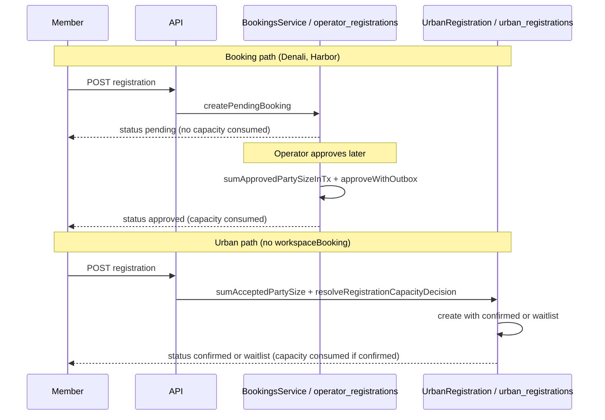

# DEC-CW-03 — Capacity decision timing evidence packet

**Decision id:** DEC-CW-03  
**Status:** PROPOSAL (awaiting Architect + Registration product owner + data owner)  
**Prepared:** 2026-08-23 (CW Wave 3A, Worker C)  
**Repository ref:** `7d3daac6`  
**Canonical ledger:** [`docs/dev/composable-workspace-refactor-plan.md`](../composable-workspace-refactor-plan.md) — DEC-CW-03 section

---

## DEC-CW-03 RECOMMENDATION

**Recommend Option A — formalize both registration admission strategies as first-class manifest-selectable contracts**, with hard non-goals:

| Strategy | Manifest signal | Capacity timing | Consuming status | Persistence |
|----------|-----------------|-----------------|------------------|-------------|
| `operatorApprovalCapacityStrategy` | `workspaceBooking` bound | On operator approve (or auto-approve TX after create) | `approved` | `operator_registrations` |
| `atCreateCapacityStrategy` | Explicit `registrationCapacityStrategy: "atCreate"` (CW5-05) | During public registration POST | Workspace adapter vocabulary (Urban: `confirmed`) | Workspace-owned table (Urban: `urban_registrations`) |

**Scope limits (non-negotiable without separate decisions):**

- No vocabulary unification (`approved` ≠ `confirmed`, `waitlisted` ≠ `waitlist`) — DEC-CW-01.
- No persistence merge (`operator_registrations` vs `urban_registrations`) — DEC-CW-01; FEAS §7.
- Move **pure policy math only** into tour-core (`resolveRegistrationCapacityDecision`, `sumAcceptedRegistrationSeats`); Urban host wiring migrates via compat re-export (CW1-03/05).
- Reject Option C (force Urban onto booking `pending` pipeline) — contradicts TRUTH intentional-variation evidence.

**Reject Option B** unless product confirms zero additional at-create verticals before CW-9; evidence does not prove that constraint (see §6 future scenarios).

---

## 1. Decision question

Should **capacity-decision-at-create** (Urban: `confirmed` / `waitlist` decided during public registration POST) become a **first-class, reusable registration strategy** in shared tour-core/SDK contracts — alongside the existing **operator-approval gate** strategy (Denali/Harbor/booking: `pending` at create, capacity consumed on `approved`)?

This decision is about **timing and strategy contract shape**, not about merging persistence tables or normalizing status vocabulary.

---

## 2. Classification: mixture (not a single root cause)

| Layer | Classification | Evidence |
|-------|----------------|----------|
| **Capacity sum arithmetic** | Reusable platform math | CW0-03: both paths sum `partySize` for a consuming status; only the status string differs |
| **Decision timing** (`approve` vs `create`) | **Intentional product variation** | TRUTH §9, §11: "operator-gated vs open/waitlist-at-intake" |
| **Persistence split** | **Intentional product variation** + schema boundary | TRUTH §9; Prisma comment scopes `OperatorRegistration` "Denali · not urban_registrations"; CW0-05 |
| **Status vocabulary** | **Intentional product variation** + naming drift | TRUTH §14 (`approved` vs `confirmed`); TRUTH §16 (`waitlisted` vs `waitlist` mixes drift + product) |
| **Capability binding** | **Different capability configuration** | Urban has no `workspaceBooking`; uses `catalogRegistrationFlow` + Urban HTTP host (TRUTH §11) |
| **Pure policy function location** | **Historical placement** (API module, not workspace package) | `registration-capacity.service.ts` in `apps/api`; FEAS §2.1 lists as movable |
| **Lifecycle + outbox** | Booking-only capability surface | CW0-04; Urban has no `pending`, no approve/reject/promotion (TRUTH §13, §15, §17) |

**Conclusion:** Differences are a **mixture** — not merely Urban-specific product behavior, not merely drift, and not two already-formalized strategies. The **timing split is intentional**; the **math is reusable**; **persistence and vocabulary stay workspace-scoped** until DEC-CW-01.

---

## 3. Current models (precise comparison)

### 3.1 Booking / Denali / Harbor — capacity at operator approve

| Aspect | Behavior | Evidence |
|--------|----------|----------|
| Create status | `pending` (via `createPendingBooking` / `createPublicGuestBooking`) | TRUTH §11, §13; `booking-lifecycle.spec.ts` |
| Capacity consumption | On **approve**; `sumApprovedPartySizeInTx` counts only `status === "approved"` | TRUTH §9; `booking-approve-capacity.spec.ts`; CW0-03 booking fixture |
| Capacity release | `cancelled` / `rejected` excluded from approved sum | TRUTH §10; CW0-03 |
| Lifecycle | `pending → {approved, waitlisted, rejected, cancelled}`; `waitlisted → {approved, rejected, cancelled}` | CW0-04 `transition-edges.json`; `booking-lifecycle.spec.ts` |
| Outbox | `registration.approved`, `.waitlisted`, `.cancelled`; reject silent | CW0-04 `outbox-semantics.json` |
| Persistence | `operator_registrations` | CW0-05 |
| Capability | `workspaceBooking` manifest binding | AUDIT §6 |
| Denali auto mode | `registrationApproval: auto` → `autoApprovePublicBooking` **after** create; still `pending` → `approved` TX | `registration-auto-approve.spec.ts`; TRUTH §14 |

**Create does not consume capacity.** Pending rows are excluded from occupancy sum (CW0-03: `partySize: 4` pending ignored; only `approved` sums to 5).

### 3.2 Urban — capacity decision at create

| Aspect | Behavior | Evidence |
|--------|----------|----------|
| Create status | `confirmed` or `waitlist` during `createUrbanRegistration` | TRUTH §11, §14; `urban/src/http/registration.service.ts` |
| Decision | `resolveRegistrationCapacityDecision` → host `decideRegistrationStatus` | `registration-capacity.service.ts`; `configure-product-http-hosts.ts` |
| Capacity consumption | At create when `confirmed`; `sumAcceptedPartySize` counts only `confirmed` | TRUTH §9; `registration-capacity.spec.ts` REG-01c; CW0-03 urban fixture |
| Policy | `open` \| `waitlist` \| `closed` | `registration-capacity.spec.ts` REG-02 |
| No `pending` | Urban model has no booking `pending` | TRUTH §13 |
| No ops lifecycle | No `BookingsService` approve/reject/promotion; no booking outbox | TRUTH §15, §17 |
| Persistence | `urban_registrations` (separate table) | CW0-05 |
| Capability | **No** `workspaceBooking`; `catalogRegistrationFlow` | Urban `workspace.manifest.json` |

**Create assigns final intake status.** REG-01d: first registrant `confirmed`, second `waitlist` when tour full under waitlist policy.

### 3.3 Timing diagram



---

## 4. Parity golden and spec evidence

### CW0-03 — Capacity definition, consumption, release

| Golden | Fixture | Invariant |
|--------|---------|-----------|
| `CW0-03-booking-approved-sum` | `fixtures/capacity/booking-approved-sum.json` | Only `approved` sums (tour-a: 5); `pending`/`waitlisted`/`rejected`/`cancelled` ignored |
| `CW0-03-urban-confirmed-sum` | `fixtures/capacity/urban-confirmed-sum.json` | Only `confirmed` sums (`acceptedSeats`: 3); `waitlist`/`cancelled` ignored |

### CW0-04 — Registration lifecycle (booking path)

| Golden | Fixture | Invariant |
|--------|---------|-----------|
| `CW0-04-transition-edges` | `registration-lifecycle/transition-edges.json` | Operator-approval graph with pending fan-out |
| `CW0-04-outbox-semantics` | `registration-lifecycle/outbox-semantics.json` | Approve/waitlist/cancel observable; reject silent |

At-create strategy does **not** replicate this lifecycle contract today.

### CW0-05 — `approved` / `confirmed` divergence

| Golden | Fixture | Invariant |
|--------|---------|-----------|
| `CW0-05-approved-confirmed-divergence` | `registration-lifecycle/approved-confirmed-divergence.json` | Separate tables/vocabularies; portal labels exclude `confirmed`/`waitlist` |

### Executable specs

| Spec | Proves |
|------|--------|
| `booking-lifecycle.spec.ts` | Transition ownership, outbox on approve/waitlist/cancel |
| `booking-approve-capacity.spec.ts` | Capacity gate at approve TX, not create |
| `registration-capacity.spec.ts` | At-create decision REG-01..02; repo sum; end-to-end Urban create REG-01d |
| `registration-auto-approve.spec.ts` | Denali auto still uses booking approve path, not Urban `confirmed` |

---

## 5. Future scenario evaluation

| Scenario | Fit | Strategy | Rationale |
|----------|-----|----------|-----------|
| **1. Outdoor club requiring operator approval** | Booking path | `operatorApprovalCapacityStrategy` | Pending inbox, approve/reject/waitlist ops, outbox, command-center KPIs — Denali/Harbor certified model (TRUTH §13–18). At-create strategy lacks `pending` and ops surface. |
| **2. Simple event workspace with automatic capacity admission** | Either; **at-create preferred** for thin verticals | `atCreateCapacityStrategy` with `policy: "open"` | No ops queue needed. Denali `registrationApproval: auto` works but still creates `pending` + booking TX — heavier than intake `confirmed`. Harbor/Denali auto-approve is not equivalent to Urban at-create (TRUTH §14). |
| **3. Auto-confirm until full, then waitlist** | At-create exact match | `atCreateCapacityStrategy` with `policy: "waitlist"` | `resolveRegistrationCapacityDecision` implements this directly (`registration-capacity.spec.ts` REG-01d). Booking path assigns `waitlisted` via **operator action** after `pending` create — different UX and timing (TRUTH §16, §17). |

**Implication:** Scenario 1 is booking-only. Scenarios 2–3 are the product case for formalizing at-create as a reusable strategy (Option A). Option B forces event verticals to either fork Urban math or misuse booking auto-approve semantics.

---

## 6. Semantic invariants (must hold post-decision)

1. **Occupancy sum:** only the strategy's capacity-consuming status counts — `approved` (booking) vs `confirmed` (Urban adapter) — CW0-03.
2. **No silent vocabulary rename in core:** `confirmed` must not map to `approved` in tour-core — CW0-05; DEC-CW-01.
3. **Booking create non-consuming:** `pending` excluded from approve sum until approve TX — CW0-03 booking fixture; `booking-approve-capacity.spec.ts`.
4. **At-create assigns intake terminal status:** no intermediate `pending` on at-create strategy — `registration-capacity.spec.ts` REG-01d.
5. **Policy `closed` short-circuits** before capacity math — `resolveRegistrationCapacityDecision` first branch.
6. **Unlimited capacity (`tourCapacity: null`)** accepts at create — REG-01b.
7. **Booking lifecycle edges unchanged** when `workspaceBooking` bound — CW0-04.
8. **Denali auto-approve remains booking pipeline** — not reclassified as at-create — `registration-auto-approve.spec.ts`.

---

## 7. Persistence implications

| Concern | Option A (recommended) | Option B | Option C (reject) |
|---------|------------------------|----------|-------------------|
| Tables | **No change** — `operator_registrations` and `urban_registrations` remain separate | Same | Would require Urban migration onto `operator_registrations` |
| Consuming status column | Each table keeps its vocabulary | Same | Forces `approved` vocabulary on Urban |
| Occupancy queries | Strategy adapter selects sum function + status filter | Urban repo stays bespoke | Single booking sum |
| New at-create vertical | New workspace-owned table **or** reuse Urban table pattern via adapter contract | Copy `registration-capacity.service.ts` or import API module | N/A |
| Prisma / RLS | No migration; schema comment boundary preserved | Same | High-risk data migration |
| Public `spotsRemaining` | Stays `approved`-based for booking workspaces (TRUTH §29); at-create verticals need separate enrichment port if exposed | Same split | Would unify on booking semantics |

**Data owner note:** Option A does **not** imply DEC-CW-01 resolution. Persistence stays split; only the **decision function ownership** moves to tour-core.

---

## 8. Future extensibility

| Extension | Option A | Option B |
|-----------|----------|----------|
| New operator-gated club | `workspaceBooking` + existing booking SoT (CW-4) | Same |
| New event / city vertical (at-create) | Manifest `registrationCapacityStrategy: "atCreate"` + workspace persistence adapter | Fork Urban/API module per vertical |
| Hybrid (auto until full, waitlist after) | Policy input to shared math; vocabulary at adapter | Reimplement math |
| Waitlist promotion on seat free | **Out of scope** — booking has `waitlisted → approved`; Urban at-create has no promotion queue today (open question §10) | Same |
| Portal member display | Still gated DEC-CW-04; strategies do not unify labels | Same |
| CW-9 `cert-events` different-vertical | Binds at-create strategy without Urban fork | Blocked or ad-hoc |
| Blast radius (ledger metrics) | Capacity rule change → tour-core contract + adapters | API + denali + urban separately |

**Manifest sketch (CW5-05 work, not decided here):**

```json
{
  "registrationCapacityStrategy": "operatorApproval",
  "workspaceBooking": { "...": "..." }
}
```

```json
{
  "registrationCapacityStrategy": "atCreate",
  "registrationAtCreatePolicy": { "default": "open" }
}
```

---

## 9. Options summary

### Option A — Dual first-class strategies (RECOMMEND)

Introduce manifest-selectable strategies; move pure math to tour-core; preserve vocabulary at adapters.

### Option B — Urban-owned; booking-only shared core

Close CW1-03 as ownership certification only (ledger safe treatment). No tour-core at-create contract.

**Defensible only if** product confirms no scenario 2/3 verticals before CW-9.

### Option C — Unify on operator approval (REJECT)

Migrate Urban to `workspaceBooking` + `pending`. Contradicts TRUTH intentional variation; breaks CW0-03/05; requires DEC-CW-01 persistence migration.

---

## 10. Downstream tasks affected

| Task | Disposition under Option A | Disposition under Option B |
|------|---------------------------|---------------------------|
| **CW1-03** | Move `resolveRegistrationCapacityDecision` + `sumAcceptedRegistrationSeats` to tour-core | Certify Urban/API ownership only |
| **CW1-05** | Migrate `decideRegistrationStatus` host binding to tour-core import | N/A |
| **CW1-06** | Consumer census + compat re-export retirement check | Census documents intentional boundary |
| **CW4-05** | Encode dual-strategy divergence contract (+ DEC-CW-01 vocabulary rows) | Booking-only contract; Urban as documented exception |
| **CW5-03** | Generic capacity ports + at-create strategy portion | Capacity ports booking-only |
| **CW5-05** | Registration orchestration interfaces for both strategies | Booking-only orchestration |
| **CW9-05** | Synthetic different-vertical via `atCreate` strategy | Blocked or Urban-clone |
| **CW9-06..10** (transitive) | Unblocked after CW9-05 + DEC-CW-04 | Partial cert only |

**Does not block:** CW0-*; CW1-01/02/04; CW2-*; CW3-*; CW4-01..04, CW4-06..08; CW5-01/02/04/06..11; CW6-*; CW7-*; CW8-*; CW9-01..04/08.

**Latest safe point:** CW1-02 complete; defer CW1-03/05/06 until DEC-CW-03 recorded.

---

## 11. Open questions for decision owners

1. **Urban roadmap:** Additional at-create verticals planned before CW-9? If no, Option B is defensible.
2. **Booking-capability adoption:** Should similar clubs use `workspaceBooking` exclusively?
3. **Waitlist promotion:** Should at-create `waitlist` auto-promote when seats free, or stay intake-only (current Urban)?
4. **Public capacity display:** Should at-create verticals expose `spotsRemaining` using `confirmed` sum?

---

## 12. Evidence index

| Artifact | Path |
|----------|------|
| TRUTH map | `.architecture-analysis/TOUR-DOMAIN-TRUTH-MAP.md` §8–18, §SAFE, §MUST-NOT |
| FEAS extraction | `.architecture-analysis/SHARED-TOUR-CORE-EXTRACTION-FEASIBILITY.md` §2.1–2.2 |
| CW0-03 | `test/parity/capacity.golden.spec.mjs` |
| CW0-04 | `test/parity/registration-lifecycle.golden.spec.mjs` |
| CW0-05 | `test/parity/approved-confirmed-divergence.spec.mjs` |
| At-create math | `apps/api/src/registrations/registration-capacity.service.ts` |
| Urban create | `packages/workspaces/urban/src/http/registration.service.ts` |
| Host binding | `apps/api/src/http/configure-product-http-hosts.ts` |
| Booking lifecycle | `apps/api/src/bookings/booking-lifecycle.spec.ts` |
| Booking approve capacity | `apps/api/src/bookings/booking-approve-capacity.spec.ts` |
| Urban capacity spec | `apps/api/test/registration-capacity.spec.ts` |

---

*Architect, documentation status: Updated. Link to docs: `docs/dev/decisions/DEC-CW-03-evidence.md`.*
