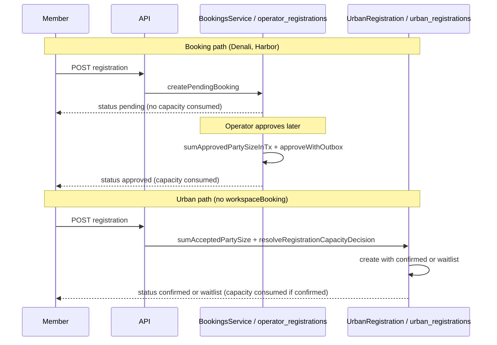

# DEC-CW-03 — Capacity decision timing evidence packet

**Decision id:** DEC-CW-03  
**Status:** PROPOSAL (awaiting Architect + Registration product owner + data owner)  
**Prepared:** 2026-08-23 (CW Wave 3A, Worker C)  
**Repository ref:** `7d3daac6`  
**Canonical ledger:** [`docs/dev/composable-workspace-refactor-plan.md`](../composable-workspace-refactor-plan.md) — DEC-CW-03 section

---

## 1. Decision question

Should **capacity-decision-at-create** (Urban: `confirmed` / `waitlist` decided during public registration POST) become a **first-class, reusable registration strategy** in shared tour-core/SDK contracts — alongside the existing **operator-approval gate** strategy (Denali/Harbor/booking: `pending` at create, capacity consumed on `approved`)?

This decision is about **timing and strategy contract shape**, not about merging persistence tables or normalizing status vocabulary (those remain gated by DEC-CW-01).

---

## 2. Current behavior (evidence-backed)

### 2.1 Booking / Denali / Harbor path — capacity at operator approve

| Aspect | Behavior | Evidence |
|--------|----------|----------|
| Create status | `pending` (always via `createPendingBooking` / `createPublicGuestBooking`) | TRUTH §11, §13; `booking-lifecycle.spec.ts` |
| Capacity consumption timing | On **approve** (or auto-approve after create); `sumApprovedPartySizeInTx` counts only `status === "approved"` | TRUTH §9; `booking-approve-capacity.spec.ts`; `prisma-bookings.repository.ts` |
| Capacity release | `cancelled` / `rejected` excluded from approved sum | TRUTH §10; CW0-03 booking fixture |
| Lifecycle edges | `pending → {approved, waitlisted, rejected, cancelled}`; `waitlisted → {approved, rejected, cancelled}`; `approved → cancelled` | CW0-04 `transition-edges.json`; `booking-lifecycle.spec.ts` |
| Outbox | `registration.approved`, `registration.waitlisted`, `registration.cancelled`; reject silent | CW0-04 `outbox-semantics.json`; `booking-reject-lifecycle.spec.ts` |
| Persistence | `operator_registrations` | CW0-05; Prisma `@@map("operator_registrations")` |
| Capability gate | Requires `workspaceBooking` manifest binding | AUDIT §6; Harbor/Denali manifests |
| Denali nuance | Tour policy `registrationApproval: auto` calls `autoApprovePublicBooking` **after** create — still booking pipeline (`pending` → `approved`), not Urban at-create `confirmed` | `registration-auto-approve.spec.ts`; TRUTH §14 |

**Create does not consume capacity.** A `pending` row with `partySize: 4` on a tour at capacity 10 does not reduce `spotsRemaining` until approved (`booking-approve-capacity.spec.ts` REG: create pending → occupancy change → approve rejects when exceeded).

### 2.2 Urban path — capacity decision at create

| Aspect | Behavior | Evidence |
|--------|----------|----------|
| Create status | `confirmed` or `waitlist` decided **during** `createUrbanRegistration` | TRUTH §11, §14; `urban/src/http/registration.service.ts` |
| Decision function | `resolveRegistrationCapacityDecision` → `assertRegistrationCapacityDecision` via host port `decideRegistrationStatus` | `registration-capacity.service.ts`; `configure-product-http-hosts.ts` |
| Capacity consumption timing | At create when status is `confirmed`; `sumAcceptedPartySize` / `sumAcceptedRegistrationSeats` count only `confirmed` | TRUTH §9; `registration-capacity.spec.ts` REG-01c; CW0-03 urban fixture |
| Policy input | `open` \| `waitlist` \| `closed` tenant/workspace registration policy | `registration-capacity.service.ts`; `registration-capacity.spec.ts` REG-02 |
| No `pending` | Urban model has no booking `pending` state | TRUTH §13 |
| No operator approve/reject/waitlist-promotion | No `BookingsService` path; no booking outbox events | TRUTH §15, §17; CW0-04 applies to booking only |
| Persistence | `urban_registrations` (separate table) | CW0-05; Prisma `@@map("urban_registrations")` |
| Capability gate | **No** `workspaceBooking`; uses `catalogRegistrationFlow` + Urban HTTP host | Urban `workspace.manifest.json`; TRUTH §11 |

**Create immediately assigns terminal intake status** (`confirmed` or `waitlist`). Example: under `waitlist` policy, first registrant with `partySize: 99` on capacity 100 gets `confirmed`; second gets `waitlist` (`registration-capacity.spec.ts` REG-01d).

### 2.3 Side-by-side timing diagram

---

## 3. TRUTH map and spec cross-references

| TRUTH § | Topic | Relevance to DEC-CW-03 |
|---------|-------|------------------------|
| §8 | Capacity definition (`capacityMax` vs `tour.capacity`) | Orthogonal — strategy decision does not unify capacity **paths**; CW5-03 keeps path adapters |
| §9 | Capacity consumption (`approved` vs `confirmed`, timing) | **Core divergence** — booking consumes on approve; Urban on create |
| §10 | Capacity release | Booking: cancel frees approved seats; Urban: `cancelled` excluded from confirmed sum (CW0-03) |
| §11 | Registration creation | Booking → `pending`; Urban → `confirmed`/`waitlist` at create |
| §13 | `pending` | Booking-only; Urban does not use |
| §14 | `approved` vs `confirmed` | Different strings, different timing; not interchangeable (links DEC-CW-01) |
| §16 | `waitlisted` vs `waitlist` | Booking ops action vs Urban at-create policy outcome |
| §17 | Waitlist promotion | Booking-only (`waitlisted → approved`); Urban has no promotion queue |
| §SAFE | Registration capacity decision math listed as shared candidate | `resolveRegistrationCapacityDecision` pure policy |
| §MUST-NOT | Urban `confirmed`/`waitlist` at-create **model** | Semantics stay divergent even if math is shared |

**Executable specs (beyond parity goldens):**

| Spec | Proves |
|------|--------|
| `apps/api/src/bookings/booking-lifecycle.spec.ts` | Booking transition ownership, outbox on approve/waitlist/cancel |
| `apps/api/src/bookings/booking-approve-capacity.spec.ts` | Capacity gate runs at approve TX, not create |
| `apps/api/test/registration-capacity.spec.ts` | Urban at-create decision (REG-01..02), repo sum, end-to-end create |
| `packages/workspaces/denali/test/registration-auto-approve.spec.ts` | Denali auto-approve still uses booking approve path |

---

## 4. Parity golden evidence (CW0-03, CW0-04, CW0-05)

### CW0-03 — Capacity definition, consumption, release

| Golden id | Fixture | Frozen invariant |
|-----------|---------|------------------|
| `CW0-03-booking-approved-sum` | `test/parity/fixtures/capacity/booking-approved-sum.json` | Only `approved` rows sum toward occupancy (`tour-a`: 5 = 3+2; `pending`/`waitlisted`/`rejected`/`cancelled` ignored) |
| `CW0-03-urban-confirmed-sum` | `test/parity/fixtures/capacity/urban-confirmed-sum.json` | Only `confirmed` rows sum (`acceptedSeats`: 3 = 2+1; `waitlist`/`cancelled` ignored) |

**Implication:** arithmetic is symmetric (sum party size for consuming status) but **consuming status string and when it is assigned differ**.

### CW0-04 — Registration lifecycle (booking path only)

| Golden id | Fixture | Frozen invariant |
|-----------|---------|------------------|
| `CW0-04-transition-edges` | `registration-lifecycle/transition-edges.json` | Host/Denali graph: pending fans out; approved terminal except cancel |
| `CW0-04-outbox-semantics` | `registration-lifecycle/outbox-semantics.json` | Approve/waitlist/cancel observable; reject silent |

**Implication:** operator-approval strategy carries a **rich lifecycle + outbox contract** that at-create strategy does not replicate today.

### CW0-05 — `approved` / `confirmed` divergence contract

| Golden id | Fixture | Frozen invariant |
|-----------|---------|------------------|
| `CW0-05-approved-confirmed-divergence` | `registration-lifecycle/approved-confirmed-divergence.json` | Separate tables; separate vocabularies; portal labels exclude `confirmed`/`waitlist` |

**Implication:** even a shared strategy **contract** must preserve vocabulary at adapter boundaries until DEC-CW-01 resolves state-model unification.

---

## 5. Options

### Option A — Dual first-class strategies (recommended PROPOSAL)

**Summary:** Introduce two manifest-selectable registration capacity strategies in tour-core/SDK:

1. **`operatorApprovalCapacityStrategy`** (default when `workspaceBooking` bound) — create `pending`; capacity + outbox on approve/waitlist ops.
2. **`atCreateCapacityStrategy`** — pure `resolveRegistrationCapacityDecision` math in tour-core; workspace adapter maps output to workspace vocabulary (`confirmed`/`waitlist` for Urban).

| Pros | Cons |
|------|------|
| Matches FEAS §2.2 port list ("registration initial status strategy") | Requires new SDK manifest surface + CW5-05 orchestration interfaces |
| Pure math already in TRUTH §SAFE; move is low-risk (CW1-03 path a) | Two strategies must stay vocabulary-neutral at core boundary |
| Enables CW-9 `cert-events` different-vertical without forking math | Urban host wiring migration (CW1-05) only if math moves |
| `spotsRemaining` / public catalog stay booking-centric until separate port work | Does not reduce table count or portal display gap (DEC-CW-04) |

**CW-1 disposition if approved:** CW1-03 moves `resolveRegistrationCapacityDecision` + `sumAcceptedRegistrationSeats` to tour-core; CW1-05 migrates `decideRegistrationStatus` host binding; CW1-06 census closes.

### Option B — Urban-owned; booking-only shared core

**Summary:** Close CW1-03 with **ownership certification only** (ledger "Option B"). Keep `registration-capacity.service.ts` in API/Urban ownership; tour-core holds only booking-adjacent math (`computeSpotsRemaining`, approve-time occupancy ports).

| Pros | Cons |
|------|------|
| Minimal move risk; zero host wiring change | Every new at-create vertical copies or imports API Urban module |
| Aligns with TRUTH §MUST-NOT ("Urban model") at package level | CW5-05 cannot express at-create strategy as first-class |
| CW1-05 becomes N/A | CW-9 cert-events likely re-implements capacity decision ad hoc |
| | Blast radius table: "capacity rule change → API + denali + urban separately" persists |

**CW-1 disposition if approved:** CW1-03 closes as certified Urban ownership; CW1-05 N/A; CW1-06 census documents intentional import boundary.

### Option C — Unify on operator approval (reject at-create strategy)

**Summary:** Treat Urban at-create `confirmed` as technical debt; migrate Urban to `workspaceBooking` + `pending` pipeline.

| Pros | Cons |
|------|------|
| Single lifecycle SoT (CW-4) | **Product reversal** — contradicts TRUTH "intentional product variation" |
| Portal/booking vocabulary alignment | Requires Urban persistence migration (DEC-CW-01) |
| | Violates non-goals: no forced convergence without product decision |
| | Breaks CW0-03/05 parity; not evidence-supported |

**Assessment:** Not supported by current evidence. Listed for completeness only.

---

## 6. Intentional divergences that remain under partial unification (Option A)

Even if at-create math becomes a first-class tour-core strategy, the following **must stay divergent** unless separate decisions (DEC-CW-01, DEC-CW-04) say otherwise:

| Divergence | Why it stays |
|------------|--------------|
| `approved` vs `confirmed` strings | DEC-CW-01; CW0-05 contract |
| `waitlisted` vs `waitlist` strings | DEC-CW-01; different lifecycle meaning (ops queue vs intake outcome) |
| `operator_registrations` vs `urban_registrations` tables | DEC-CW-01; FEAS §7 |
| Capacity consumption **timing** | Strategy selection — not a bug to normalize |
| Booking outbox events (`registration.approved`, etc.) | At-create strategy has no equivalent today |
| Operator reject / waitlist promotion | Booking-only ops surface (CW0-04 edges) |
| Public `spotsRemaining` counts `approved` only | TRUTH §29; Denali catalog enrichment via `sumApprovedPartySizeByTourIds` |
| Denali `registrationApproval: auto` | Still booking approve TX — not at-create `confirmed` |
| Urban `open`/`waitlist`/`closed` policy tenant setting | Workspace-specific policy input to at-create strategy |
| Capacity definition paths (`capacityMax` vs `tour.capacity`) | CW5-03 adapter concern, not DEC-CW-03 |

---

## 7. Capacity timing invariants (must hold regardless of option)

1. **Occupancy sum invariant:** only the workspace's capacity-consuming status counts (`approved` booking vs `confirmed` urban) — CW0-03.
2. **No silent vocabulary rename:** `confirmed` must not map to `approved` in core — CW0-05.
3. **Booking create does not consume capacity:** pending rows excluded from approve sum — CW0-03 booking fixture + `booking-approve-capacity.spec.ts`.
4. **Urban create assigns final intake status:** no intermediate `pending` — `registration-capacity.spec.ts` REG-01d.
5. **Policy `closed` rejects before capacity math** — `resolveRegistrationCapacityDecision` first branch.
6. **Unlimited capacity (`tourCapacity: null`)** confirms at-create — REG-01b.

---

## 8. Downstream tasks blocked by this decision

| Task | Block reason |
|------|--------------|
| **CW1-03** | Cannot move or certify Urban capacity ownership without strategy choice |
| **CW1-05** | Host `decideRegistrationStatus` migration only if Option A |
| **CW1-06** | Consumer census depends on CW1-03/05 disposition |
| **CW4-05** | Registration model divergence contract needs strategy taxonomy |
| **CW5-03** | Urban at-create portion of generic capacity contracts |
| **CW5-05** | Registration orchestration interfaces (both strategies or booking-only) |
| **CW9-05** | Synthetic different-vertical workspace |

**Does not block:** CW0-*; CW1-01/02/04; CW2-*; CW3-*; CW4-01..04; CW5-01/02/04/06..11 (core exit); CW6-*; CW7-*; CW8-*; CW9-01..04/08.

**Latest safe execution point (ledger):** CW1-02 complete; pause CW1-03/05/06 until DEC-CW-03 recorded.

---

## 9. Recommended choice (PROPOSAL for Architect)

**Recommend Option A — dual first-class strategies**, with explicit scope limits:

1. **Move pure policy math only** (`resolveRegistrationCapacityDecision`, `sumAcceptedRegistrationSeats`) into `@app-tour/tour-core` as the `atCreateCapacityStrategy` implementation, preserving Urban output vocabulary at the adapter boundary.
2. **Document `operatorApprovalCapacityStrategy`** as the default when `workspaceBooking` is enabled — capacity gate remains in `BookingsService.approveBooking` / `sumApprovedPartySizeInTx` (no timing change).
3. **Do not** merge tables, rename statuses, or add booking outbox to Urban (DEC-CW-01 remains separate).
4. **Manifest shape (sketch):** `registrationCapacityStrategy: "operatorApproval" | "atCreate"` with `atCreate` requiring explicit policy block (`open`/`waitlist`/`closed`) — final schema is CW5-05 work.
5. **Urban roadmap:** Urban remains the reference at-create vertical; future event-style workspaces select `atCreate` without copying API modules.

**Rationale:**

- FEAS §2.1 classifies the math as movable; FEAS §2.2 lists "registration initial status strategy" as port-first — Option A satisfies both.
- TRUTH §SAFE endorses the math; TRUTH §MUST-NOT blocks treating Urban **semantics** as default, not sharing **pure decision function**.
- CW0-03 proves both paths share sum arithmetic but differ on consuming status + timing — a strategy contract captures this without false unification.
- Option B is acceptable if product confirms no additional at-create verticals before CW-9; evidence does not prove that constraint.

**Reject Option C** — no product evidence for reversing Urban intake model.

---

## 10. Open questions for decision owners

1. **Urban roadmap:** Are additional at-create verticals planned within 2 workspace onboardings (CW-9 horizon)? If no, Option B is defensible.
2. **Booking-capability adoption:** Should a future similar club use `workspaceBooking` (operator approval) exclusively, making at-create strategy Urban-only forever?
3. **Waitlist semantics:** Should at-create `waitlist` ever promote automatically when seats free, or remain intake-only (current Urban behavior)?
4. **Public capacity display:** Should Urban public catalog expose `spotsRemaining` using `confirmed` sum (not in scope today)?

---

## 11. Evidence index

| Artifact | Path |
|----------|------|
| Parity harness | `test/parity/lib/golden-harness.mjs` |
| CW0-03 spec | `test/parity/capacity.golden.spec.mjs` |
| CW0-04 spec | `test/parity/registration-lifecycle.golden.spec.mjs` |
| CW0-05 spec | `test/parity/approved-confirmed-divergence.spec.mjs` |
| At-create decision | `apps/api/src/registrations/registration-capacity.service.ts` |
| Urban create wiring | `packages/workspaces/urban/src/http/registration.service.ts` |
| Host port binding | `apps/api/src/http/configure-product-http-hosts.ts` |
| Booking approve capacity | `apps/api/src/bookings/booking-approve-capacity.spec.ts` |
| TRUTH map | `.architecture-analysis/TOUR-DOMAIN-TRUTH-MAP.md` §8–18, §SAFE, §MUST-NOT |
| FEAS extraction | `.architecture-analysis/SHARED-TOUR-CORE-EXTRACTION-FEASIBILITY.md` §2.1–2.2 |

---

*Architect, documentation status: Updated. Link to docs: `docs/dev/decisions/DEC-CW-03-evidence.md`.*
