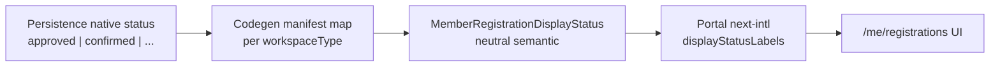

# DEC-CW-04 — Member-portal status display for non-booking workspaces (evidence packet)

**Decision id:** DEC-CW-04  
**Status:** PROPOSAL (awaiting Portal product owner + Registration product owner + Architect)  
**Prepared:** 2026-08-23 (CW Wave 3A, decision-evidence track)  
**Repository ref:** `7d3daac6`  
**Canonical ledger:** [`docs/dev/composable-workspace-refactor-plan.md`](../composable-workspace-refactor-plan.md) — DEC-CW-04 section

**Mandatory inputs (not re-audited):**

- TRUTH §9, §14, §16, §27 — portal label map excludes `confirmed`/`waitlist`; separate persistence tables
- CW0-05 parity golden — vocabularies frozen divergent
- DEC-CW-03 (APPROVED) — dual capacity strategies; **no** vocab/persistence unification
- PCMS-001 — portal owns member session surfaces and member-facing i18n

---

## 1. Executive summary

Member portal `/me/registrations` localizes registration `status` via a **booking-only** allowlist in `format-member-registration-display.server.ts`. Urban-native strings (`confirmed`, `waitlist`) **fall through** as raw English wire values in fa/en locales today.

**Gap:** Urban has `memberPortal.availability: minimal` (trips list is live) but persistence vocabulary is intentionally divergent (CW0-05). Portal display was never wired for at-create strategy outcomes.

**This decision is display-layer only.** It does **not** authorize merging tables, renaming persisted statuses, or forcing booking vocabulary in Urban storage (DEC-CW-01 remains separate).

---

## 2. Current behavior (evidence-backed)

### 2.1 Portal display path (PCMS member surface)

| Step | Behavior | Evidence |
|------|----------|----------|
| SSR list/detail | `localizeMemberRegistrationStatus(status)` | `apps/portal/app/me/registrations/page.tsx`, `[id]/page.tsx` |
| Allowlist | `BOOKING_STATUSES` = pending, approved, waitlisted, rejected, cancelled | `format-member-registration-display.server.ts` |
| Translation | `next-intl` namespace `portalMember.registrations.statusLabels.{key}` | `apps/portal/messages/{fa,en}/portalMember.json` |
| Unknown key | **Raw wire string returned** (`translateKnownKey` fallback) | `format-member-registration-display.server.ts` |
| Urban `confirmed` | Displays literal `"confirmed"` (not fa/en label) | CW0-05 negative test; no `confirmed` in portal JSON |
| Urban `waitlist` | Displays literal `"waitlist"` | CW0-05; distinct from booking `waitlisted` |

### 2.2 Booking vocabulary (operator-approval strategy)

| Wire status | Capacity meaning | Portal label (fa example) |
|-------------|------------------|---------------------------|
| `pending` | Not consuming; awaiting operator | در انتظار |
| `approved` | Consuming seat | تأیید شده |
| `waitlisted` | Ops waitlist queue | لیست انتظار |
| `rejected` | Terminal | رد شده |
| `cancelled` | Terminal | لغو شده |

Source: `packages/booking-http-contracts/src/booking-status.ts`; portal i18n files.

### 2.3 Urban vocabulary (at-create strategy — DEC-CW-03)

| Wire status | Capacity meaning | Portal label today |
|-------------|------------------|-------------------|
| `confirmed` | Consuming seat at create | **raw** `confirmed` |
| `waitlist` | Intake waitlist (no ops promotion queue) | **raw** `waitlist` |
| `cancelled` | Terminal | localized (shared key with booking) |

Source: `packages/workspaces/urban/src/http/registration.repository.ts`; CW0-05 fixture; `at-create-strategy.ts` (tour-core).

### 2.4 CW0-05 parity contract (frozen)

```json
{
  "bookingPath": {
    "persistenceTable": "operator_registrations",
    "capacityConsumingStatus": "approved",
    "vocabulary": ["pending", "approved", "waitlisted", "rejected", "cancelled"]
  },
  "urbanPath": {
    "persistenceTable": "urban_registrations",
    "capacityConsumingStatus": "confirmed",
    "vocabulary": ["confirmed", "waitlist", "cancelled"]
  },
  "portalLabelStatuses": ["pending", "approved", "waitlisted", "rejected", "cancelled"],
  "portalLabelExcludes": ["confirmed", "waitlist"]
}
```

**Implication:** CW0-05 currently **documents** the raw-fallback gap as intentional negative evidence until DEC-CW-04 resolves display contract. CW4-06 implementation must update parity expectations in coordination with CW0-05.

### 2.5 Member API / BFF stability

| Layer | Contract | Notes |
|-------|----------|-------|
| Portal BFF | `GET /api/me/registrations` → API `GET /bookings?view=mine` | `apps/portal/app/api/me/registrations/route.ts` |
| Item shape | `MemberRegistrationItem.status: string` (opaque wire) | `fetch-member-registrations.server.ts` |
| PCMS | Marketing never calls portal BFF; member list is portal-only | PCMS-001 §5.3 |
| Urban create | `POST /urban/registrations` — separate table; **not** in `view=mine` today | Urban manifest `httpRoutes` |

**Urban member list federation** (merging `urban_registrations` into portal trips) is **out of scope** for this decision packet — blocked on member read API design (likely CW4-05 + Urban BFF). DEC-CW-04 still governs **how any native status string is labeled** once rows appear in portal.

### 2.6 Member-app tiers (manifest)

| Workspace | `memberPortal.availability` | Preset | Trips module |
|-----------|----------------------------|--------|--------------|
| Denali | `full` | `guest-full-v1` | `/me/registrations` |
| Urban | `minimal` | `guest-minimal-v1` | `/me/registrations` |
| guest-club / Harbor | `minimal` | `guest-minimal-v1` | `/me/registrations` |

Source: workspace manifests; `MEMBER_PORTAL_PRESETS` in `member-portal.mjs`.

**Supported tiers for display contract:** any workspace with `memberPortal.availability` ∈ `{minimal, full}` that surfaces registration status on portal trips list/detail.

---

## 3. Options compared

### Option A — Portal resolves workspace-native status via workspace presentation adapter

**Summary:** Each workspace plugin (or manifest-bound surface) supplies a `localizeRegistrationStatus(nativeStatus, locale)` adapter; portal delegates all unknown booking keys to workspace.

| Pros | Cons |
|------|------|
| Workspace owns exact member copy (branding nuance) | **Localization split** — Urban/Denali need fa/en message ownership outside portal |
| No neutral semantic layer | Portal runtime imports workspace packages or dynamic renderer registry per label |
| Matches `memberPortalRenderers` pattern for modules | `memberPortalRenderers` today is React module chrome, not string i18n |
| | Every new workspace implements adapter + messages |
| | Harder CW9-06 certification (per-workspace label proofs) |

### Option B — Strategies expose neutral member-facing semantic states; persistence stays native (recommended PROPOSAL)

**Summary:** Introduce a small **member display semantic** enum at the SDK/tour-core registration boundary. Native wire strings remain in DB/API `status`. Portal maps semantic → portal i18n only.

| Pros | Cons |
|------|------|
| **Portal owns localization** (PCMS-001) — single fa/en namespace | Requires manifest/codegen mapping table per workspace type |
| Preserves Urban `confirmed`/`waitlist` persistence (CW0-05, DEC-CW-03) | Collapses distinct ops semantics into member UX buckets (intentional) |
| API `status` field stable for ops/booking clients | Optional API `displayStatus` field is additive work (can defer to portal-only mapping) |
| Aligns with DEC-CW-03 dual strategies — each strategy registers native→semantic map | DEC-CW-01 `approved` vs `confirmed` still distinct at wire layer |
| codegen manifest mapping (DEC-CW-06 precedent) scales to cert-events vertical | CW0-05 golden must be updated when CW4-06 lands |
| Raw fallback remains last resort for unknown wire strings | |

### Option C — Require booking vocabulary for all member-enabled workspaces

**Summary:** Urban (and future at-create verticals) migrate persistence/API to booking statuses (`approved`, `waitlisted`, etc.).

| Pros | Cons |
|------|------|
| Portal allowlist unchanged | **Violates CW0-05** and approved DEC-CW-03 (no vocab unification) |
| Single wire enum | Forces Urban persistence migration (DEC-CW-01) |
| | Conflates ops waitlist queue with at-create waitlist |
| | Product reversal — not evidence-supported |

**Assessment:** Reject.

---

## 4. Localization ownership

| Concern | Owner under Option B (recommended) |
|---------|-------------------------------------|
| fa/en member status strings | **Portal** — `portalMember.registrations.displayStatusLabels.*` |
| Wire/persistence vocabulary | **Workspace strategy** — unchanged native strings |
| Native→semantic mapping | **Manifest + codegen** (`memberPortal.registrationStatusMap` or strategy registry) |
| Workspace branding override | Optional manifest `labelKey` override per semantic (rare; default portal copy) |
| Operator/admin labels | **Workspace ops surfaces** — unchanged (Denali ops manifest, Urban operator UI) |

**Rationale:** PCMS-001 establishes portal as the member-app authority. Marketing catalog uses generated path maps without static workspace imports; member status should follow the same **declarative manifest → codegen → neutral host formatter** seam (DEC-CW-06 Option E pattern).

---

## 5. Future strategies (DEC-CW-03 dual strategies)

| Strategy | Native outcomes (persisted) | Member semantic (proposed) |
|----------|----------------------------|----------------------------|
| `operatorApprovalCapacityStrategy` | `pending`, `approved`, `waitlisted`, `rejected`, `cancelled` | `pending_review`, `accepted`, `waitlisted`, `rejected`, `cancelled` |
| `atCreateCapacityStrategy` | `confirmed`, `waitlist`, `cancelled` | `accepted`, `waitlisted`, `cancelled` |

**Semantic enum (proposed, tour-core or workspace-sdk):**

```ts
export type MemberRegistrationDisplayStatus =
  | "pending_review"   // booking: awaiting operator decision
  | "accepted"         // seat held: approved OR confirmed
  | "waitlisted"       // member waiting: waitlisted OR waitlist
  | "rejected"
  | "cancelled";
```

**Intentional collapse:** `approved` ↔ `confirmed` and `waitlisted` ↔ `waitlist` share member-facing copy because the member UX question is the same (“do I have a spot / am I waiting?”). Operator surfaces retain distinct vocabulary (DEC-CW-01).

A third strategy in CW-9 cert-events adds rows to the manifest mapping + portal i18n only — no portal code fork.

---

## 6. Exact display contract proposal (CW4-06 implementation spec)

### 6.1 Layers



### 6.2 Manifest shape (new, declarative)

```json
"memberPortal": {
  "manifestVersion": 2,
  "availability": "minimal",
  "preset": "guest-minimal-v1",
  "registrationStatusDisplay": {
    "pending": "pending_review",
    "approved": "accepted",
    "waitlisted": "waitlisted",
    "rejected": "rejected",
    "cancelled": "cancelled",
    "confirmed": "accepted",
    "waitlist": "waitlisted"
  }
}
```

Codegen emits `WORKSPACE_MEMBER_REGISTRATION_STATUS_DISPLAY_MAP` (read-only) consumed by portal formatter and CW9-06 cert specs.

**Booking-capable workspaces** may omit the block — codegen defaults booking vocabulary using the table in §5.

**Urban** must declare `confirmed` and `waitlist` explicitly (CW0-05 divergence preserved at wire layer).

### 6.3 Portal formatter contract (post CW4-06)

Replace booking-only allowlist with:

```ts
// Pseudocode — implementation in CW4-06 only after DEC-CW-04 approval
async function localizeMemberRegistrationStatus(
  nativeStatus: string,
  workspaceType: string
): Promise<string> {
  const semantic = resolveMemberRegistrationDisplayStatus(workspaceType, nativeStatus);
  if (semantic !== undefined) {
    return tDisplay(`displayStatusLabels.${semantic}`);
  }
  // Legacy compat during migration
  if (BOOKING_STATUSES.includes(nativeStatus)) {
    return tLegacy(`statusLabels.${nativeStatus}`);
  }
  return nativeStatus; // final fallback
}
```

### 6.4 Proposed member-facing labels (portal i18n)

| Semantic | en (proposed) | fa (proposed) |
|----------|---------------|---------------|
| `pending_review` | Pending review | در انتظار بررسی |
| `accepted` | Confirmed | تأیید شده |
| `waitlisted` | Waitlisted | لیست انتظار |
| `rejected` | Rejected | رد شده |
| `cancelled` | Cancelled | لغو شده |

**Note:** `accepted` uses member-friendly “Confirmed” / «تأیید شده» — same copy as current `approved` label. Product may tune fa copy without touching persistence.

### 6.5 API stability

| Field | Change |
|-------|--------|
| `status` (wire) | **No change** — native string per workspace table |
| `displayStatus` (optional future) | May add on `view=mine` items for non-portal consumers; **not required** for CW4-06 if portal maps locally |
| Operator `GET /bookings` (ops view) | **No change** |
| Urban `POST /urban/registrations` response | **No change** |

### 6.6 Urban persistence preservation

- `urban_registrations.status` remains `confirmed | waitlist | cancelled`.
- `sumAcceptedRegistrationSeats` continues counting only `confirmed`.
- No migration to `operator_registrations` or booking status enum.
- CW0-05 negative tests for **separate tables and wire vocab** remain; only `portalLabelExcludes` expectation flips when display mapping ships.

---

## 7. Fallback behavior (normative)

| Order | Condition | Result |
|-------|-----------|--------|
| 1 | Native status maps to semantic via codegen table | Localized `displayStatusLabels.{semantic}` |
| 2 | Native status ∈ legacy `BOOKING_STATUSES` (compat) | Localized `statusLabels.{native}` |
| 3 | Unknown native status | **Raw wire string** (current behavior) |
| 4 | Semantic key missing in i18n | next-intl typically returns key; CW4-06 should add guard spec → treat as engineering defect, not user-facing fallback |

**Raw-string fallback acceptance:** **Yes** for unknown future wire values (forward-compatible). **No** for known Urban/booking statuses once CW4-06 ships — cert-events (CW9-06) must prove localized labels for all declared workspace vocabulary rows.

**Telemetry (optional, CW4-06):** log/metric `portal.member_status.unmapped` when step 3 fires in production.

---

## 8. Workspace branding

- Default: portal platform copy (consistent member UX across clubs).
- Override path (deferred unless product requests): manifest `registrationStatusDisplayLabels` per semantic with `labelKey` pointing to workspace message bundle — **only if** portal shell loads workspace i18n namespaces (not required for Urban MVP).
- Receipt/currency branding remains DEC-CW-06 scope; do not mix into status decision.

---

## 9. Affected downstream tasks

| Task | Dependency | Impact when DEC-CW-04 approved |
|------|------------|--------------------------------|
| **CW4-06** | Direct | Implement §6 formatter + portal i18n + codegen map |
| **CW9-06** | Direct | cert-events member-status display assertions against semantic labels |
| **CW9-08** | Soft | Club metrics independent; full CW-9 closure needs CW9-06 |
| **CW9-10** | Transitive | Different-vertical certification sign-off |
| **CW0-05** | Coordination | Update golden: portal must localize `confirmed`/`waitlist` via semantic map |
| **CW4-05** | Related | Registration divergence SDK contract should reference `MemberRegistrationDisplayStatus` |

---

## 10. DEC-CW-04 RECOMMENDATION (PROPOSAL)

**Recommend Option B** — neutral **member display semantics** with **native persistence vocabulary preserved**, implemented via **manifest codegen mapping + portal i18n** (hybrid; mirrors DEC-CW-06 Option E pattern).

**Reject Option C** — booking vocabulary mandate contradicts CW0-05, DEC-CW-03, and Urban product model.

**Reject pure Option A** — workspace runtime presentation adapters for string labels fragment localization and duplicate portal authority; keep workspace adapters for module UI (`memberPortalRenderers`) only.

### Implementation guardrails (if approved)

1. Add `MemberRegistrationDisplayStatus` type to tour-core or workspace-sdk (neutral; no workspace imports).
2. Add `memberPortal.registrationStatusDisplay` manifest block + codegen snapshot.
3. CW4-06: portal formatter resolves semantic from `workspaceType` (tenant bootstrap) + native `status`.
4. Do **not** rename Urban persisted statuses or merge registration tables.
5. Update CW0-05 parity fixture/tests when CW4-06 lands.
6. CW9-06: cert-events workspace must pass localized label matrix for all native vocabulary rows.

### Tasks unblocked on approval

- **CW4-06** — Portal member-status mapping implementation
- **CW9-06** — cert-events member-status display certification

---

## 11. Open questions for decision owners

1. **fa copy for `accepted`:** Reuse current «تأیید شده» (approved) or Urban-specific «ثبت‌نام قطعی»?
2. **API `displayStatus` field:** Add to `view=mine` JSON now, or portal-only mapping sufficient for CW-9?
3. **Urban member list API:** When will `urban_registrations` rows appear in portal trips (separate from this decision)?
4. **Unknown status UX:** Show raw string vs generic «وضعیت نامشخص» for step-3 fallback?

---

## 12. Evidence index

| Artifact | Path |
|----------|------|
| Portal formatter | `apps/portal/src/me/format-member-registration-display.server.ts` |
| Portal i18n | `apps/portal/messages/{fa,en}/portalMember.json` |
| Portal list SSR | `apps/portal/app/me/registrations/page.tsx` |
| Portal BFF | `apps/portal/app/api/me/registrations/route.ts` |
| Booking status enum | `packages/booking-http-contracts/src/booking-status.ts` |
| Urban persistence | `packages/workspaces/urban/src/http/registration.repository.ts` |
| At-create strategy | `packages/tour-core/src/capacity/at-create-strategy.ts` |
| CW0-05 fixture | `test/parity/fixtures/registration-lifecycle/approved-confirmed-divergence.json` |
| CW0-05 spec | `test/parity/approved-confirmed-divergence.spec.mjs` |
| Urban manifest | `packages/workspaces/urban/workspace.manifest.json` (`memberPortal`) |
| PCMS standard | `docs/standards/member-session-portal-authority.mdoc` |
| DEC-CW-03 decision | `docs/dev/decisions/DEC-CW-03-evidence.md` |
| Member portal presets | `scripts/codegen/workspace-registry/domains/member-portal.mjs` |

---

*Architect, documentation status: Updated. Link to docs: `docs/dev/decisions/DEC-CW-04-evidence.md`.*
