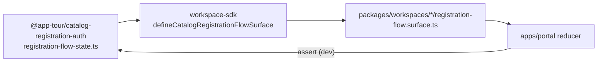

# Guest plugin conformance (PF-0 → PF-4)

> **Status:** PF-0→PF-4 **closed** (G0–G4) · **Gate:** G4.1–G4.2 **CLOSED** 2026-07-02  
> **North star:** New guest workspace = `packages/workspaces/<id>` + `workspace.manifest.json` + `pnpm run generate:workspace-registry` — no hand-edits to SDK resolver maps, portal shell, or plugin-host wiring.

## Conformance levels (manifest-derived)

| Level | Requires |
| ----- | -------- |
| **L0** | Plugin entry only (starter scaffold) |
| **L1** | Catalog `httpRoutes` (`GET /{id}/catalog`) |
| **L2** | L1 + `catalogRegistrationFlow` |
| **L3** | L2 + `memberProfile` + `catalogPresentation` |
| **L4** | L3 + `guestConformance.memberApp: true` + `memberPortal.availability: full` |

Generator: `scripts/generate-workspace-registry.mjs` → `resolveGuestConformanceLevel()` → `packages/workspace-sdk/src/catalog/workspace-guest-conformance.generated.ts`.

**Production certification (Phase H):** separate axis `stub | certified` — see [workspace-certification.mdoc](./workspace-certification.mdoc). Technical L3 ≠ production-ready.

Member portal SSOT: `memberPortal.availability` in manifest → `WORKSPACE_MEMBER_PORTAL_CONTRACTS` (see [member-portal-registry-schema.mdoc](../phase-19/member-portal-shell/member-portal-registry-schema.mdoc)).

Runtime resolver: `resolveGuestConformanceLevelForPlugin(pluginId)` — fail-closed (`GuestConformanceNotConfiguredError`).

## Registry outputs (committed)

| Generated file | Consumer |
| -------------- | -------- |
| `workspace-catalog-paths.generated.ts` | `resolveCatalogListApiPath()` |
| `workspace-catalog-list-features.generated.ts` | `resolveCatalogListFeatures()` |
| `workspace-catalog-detail-sections.generated.ts` | `resolveCatalogDetailSections()` |
| `workspace-member-profile-capabilities.generated.ts` | `resolveMemberProfileCapabilities()` |
| `workspace-guest-conformance.generated.ts` | `resolveGuestConformanceLevelForPlugin()` |
| `workspace-production-certification.generated.ts` | `resolveProductionCertificationForPlugin()` (Phase H) |
| `workspace-guest-seo.generated.ts` | `resolveGuestSeoForPlugin()` (ADR-GP-004) |
| `workspace-dev-plugin-ids.generated.ts` | `resolveDevPluginIdForTenantId()` (dev) |
| `register-{id}.generated.ts` | `registerWorkspacePlugin*FromManifest()` (async, per plugin) |
| *(transport)* | Wired inside per-plugin `registerWorkspacePlugin*FromManifest` |
| `register-{id}.generated.ts` | `registerWorkspaceIntake*FromManifest()` (async, per plugin) |

## Schema Admission (PF-1.8)

Guest-facing manifest extensions are versioned. Every guest-capable workspace must declare:

```json
"guestExtensionsVersion": 1
```

Documented schema: [`workspace-guest-extensions.schema.json`](./workspace-guest-extensions.schema.json).

Generator admission checks run before output generation. Missing `guestExtensionsVersion: 1`, malformed `guestThemeStylesheets`, invalid presentation blocks, invalid flow unions, or invalid member profile blocks fail codegen.

## Manifest blocks (guest-ready / L3)

```json
{
  "guestExtensionsVersion": 1,
  "httpRoutes": { "handlerPackage": "@app-tour/workspace-<id>/http", "groups": [] },
  "catalogPresentation": { "listFeatures": { "cityFilter": false }, "detailSections": {} },
  "catalogRegistrationFlow": {
    "surfaceExport": "<camel>CatalogRegistrationFlowSurface",
    "steps": { "mode": "compose", "reuseAuthStepsFrom": "shared", "components": {} },
    "transportInitializerExport": "register<Workspace>CatalogRegistrationTransportInitializer"
  },
  "memberProfile": { "editableFields": ["displayName"], "readOnlyFields": ["email"], "sections": [] },
  "guestLanding": {
    "variant": "minimal",
    "sections": { "hero": false, "latestTours": false, "latestToursLimit": 0, "trust": false, "finalCta": false },
    "i18nProfile": "minimal"
  },
  "devBootstrap": { "pluginTenantIds": ["…"], "smokeTenant": {} }
}
```

`transportInitializerExport` is **optional** — only workspaces with transport intake (Denali today).

## Scaffold

```bash
pnpm run workspace:create -- <id> --guest
pnpm install
pnpm run generate:workspace-registry
pnpm run guard:workspace-registry-fresh
pnpm run guard:guest-plugin-conformance
```

## Guard bundle (`guard:guest-plugin-conformance`)

Fail-fast sequential checks:

1. `guard:workspace-registry-fresh`
2. `guard-intake-plugin-registry.mjs`
3. `guard-guest-extension-schema.mjs`
4. `guard-no-default-fallback.mjs`
5. `guard-generated-banner.mjs`
6. `guard-feature-flag-boundary.mjs`
7. `guard-guest-e2e-hooks.mjs`
8. `guard-structured-errors.mjs`
9. `guard-no-todo-guest.mjs`
10. `guard-guest-reuse-from.mjs`
11. `guard-guest-frozen-shell.mjs`
12. `guard-guest-api-shell.mjs`
13. `guard-guest-consumer-deps.mjs`
14. `scripts/test/workspace-guest-conformance.spec.mjs`
15. `guard-guest-seo.mjs` — L2+ `guestSeo` manifest + JSON-LD builder export (ADR-GP-004)
16. `guard-guest-seo-e2e-hooks.mjs` — SEO smoke yaml → spec paths exist
17. `guard-registration-flow-state.mjs` — canonical flow state SSOT (no `createEmptyData`, key-set drift test)

Wired to `pnpm run phase-6:fast-track` and [`.github/workflows/phase-10-guard.yml`](../../.github/workflows/phase-10-guard.yml) (`pnpm run guard:guest-plugin-conformance`).

## Canonical registration flow state (SSOT)

Platform-owned shape for `FlowRuntimeState.data` lives in `@app-tour/catalog-registration-auth`:

| Symbol | Role |
| ------ | ---- |
| `CatalogRegistrationFlowState` | Typed bag (auth + intake + transport) |
| `CATALOG_REGISTRATION_FLOW_STATE_KEYS` | Ordered key manifest for drift detection |
| `createCatalogRegistrationFlowInitialData()` | **Sole** producer of empty data |
| `createCatalogRegistrationFlowRuntimeState()` | `{ currentStep, data }` bootstrap |
| `assertCatalogRegistrationFlowState()` | Fail-fast runtime guard (dev + tests) |
| `applyCatalogRegistrationFlowEvent()` | **Sole** merge/transition reducer for `resolveNextStep` |

Workspaces **must not** define local `createEmptyData()` or inline `event.type === "merge"` in surfaces. Surfaces use `defineCatalogRegistrationFlowSurface()` from `@app-tour/workspace-sdk`, which injects `createInitialState` from the canonical helper. `resolveNextStep` must delegate to `applyCatalogRegistrationFlowEvent(state, event)`.



**Guard:** `scripts/guards/guard-registration-flow-state.mjs` (step 17 in `guard:guest-plugin-conformance`) — bans `createEmptyData` in workspace surfaces, requires `defineCatalogRegistrationFlowSurface` + `applyCatalogRegistrationFlowEvent`, runs `registration-flow-state.spec.ts` for key-set drift.

**Migration (existing workspaces):** Replace local `createEmptyData` + manual `createInitialState` with `defineCatalogRegistrationFlowSurface`. Drop alias state keys (`fullName`, `email` in flow bag); intake UI may keep `data-intake-field="fullName"` for schema/E2E selectors while writing `intakeName` / `intakeEmail` only.

## E2E hooks

See [`guest-registration-e2e-hooks.yaml`](./guest-registration-e2e-hooks.yaml) — SMK-PTL-01..06 · SMK-MKT-03 · SMK-P8-02 · DEN-PROF-01..03 · DEN-INTAKE-01..03.

## Decisions

- [ADR-GP-001](./adr-guest-plugin/ADR-GP-001-registration-flow-manifest.md) — registration flow manifest union
- [ADR-GP-002](./adr-guest-plugin/ADR-GP-002-guest-extension-schema.md) — guest extension schema admission
- [ADR-GP-003](./adr-guest-plugin/ADR-GP-003-workspace-create-guest.md) — `workspace:create --guest`
- [ADR-GP-004](./adr-guest-plugin/ADR-GP-004-guest-seo-manifest.md) — `guestSeo` manifest + codegen
- [ADR-GP-005](./adr-guest-plugin/ADR-GP-005-guest-landing-manifest.md) — `guestLanding` manifest + `resolveGuestLandingFeatures` (L3+ guest-capable; required before marketing `/` UI)

Guest-capable workspaces (L2+ with `catalogPresentation`) must declare `guestLanding` before marketing home ships — see [marketing-landing.mdoc](../workspaces/denali/marketing-landing.mdoc) PR-0.

## G4 closure checklist

**G4.1** — E2E hook smokes (`guest-registration-e2e-hooks.yaml`). **G4.2** — PF-4 guard bundle (`guard:guest-plugin-conformance` 16 steps) + phase-10 host invariants.

| Gate | Scope | Status | Evidence |
| ---- | ----- | ------ | -------- |
| **G0** | Codegen + schema admission | **Closed** | `generate-workspace-registry` · `assertHttpRoutesManifest` · `assertGuestExtensionsManifest` |
| **G1** | Fail-closed resolvers (no `?? "denali"`) | **Closed** | `guard-no-default-fallback.mjs` |
| **G2** | Scaffold + trunk reference (`guest-club`) | **Closed** | `packages/workspaces/guest-club` · `workspace:create --guest` |
| **G3** | Consumer deps + API shell plugin-first | **Closed** | `guard-guest-consumer-deps.mjs` · `guard-guest-api-shell.mjs` · `phase-10:guard` (urban shims removed) |
| **G4** | E2E canary re-run + Architect sign-off | **Closed** 2026-07-02 | **Guest hooks (16):** SMK-PTL-01..06 · DEN-PROF-01..03 · DEN-INTAKE-01..03 · DEN-TRANS-01..03 · SMK-MKT-03 · SMK-P8-02 **PASS**. **Portal** `test:smoke` **14/14** · **Marketing** `test:smoke` 4/4 · **Urban marketing** SMK-MKT-05 2/2 · **Urban integrity** SMK-P8-01..04 4/4 · **guest-club** unit 1/1 · **SDK registration** 8/8 · **registry scripts** 29/29 · guards 16/16 + phase-10 11/11 |

Active waivers: **none** ([`waivers/README.md`](./waivers/README.md)).

## Verification (fast-track)

```bash
pnpm run generate:workspace-registry
pnpm run guard:guest-plugin-conformance
node --test scripts/test/test-extract-catalog-paths.mjs
node --test scripts/test/workspace-guest-conformance.spec.mjs
node --test scripts/test/workspace-create-guest.spec.mjs
node --test scripts/test/workspace-registry-drop-in.spec.mjs
```

---

**Architect sign-off:** **APPROVED G4** 2026-07-02 — PF-0→PF-4 guest-plugin conformance closed. Static enforcement G0–G4 green; Playwright evidence bundle complete (table above); zero active waivers.

| Check | Evidence |
| ----- | -------- |
| Guest hook smokes (G4.1) | SMK-PTL-01..06 · DEN-PROF-01..03 · DEN-INTAKE-01..03 · SMK-MKT-03 · SMK-P8-02 |
| Portal registration chain | `@apps/portal test:smoke` **14/14** |
| Marketing catalog chain | `@apps/marketing test:smoke` **4/4** |
| Urban cross-workspace smokes | SMK-MKT-05 **2/2** · SMK-P8-01..04 **4/4** |
| Urban API HTTP | `urban-catalog-registration` + `urban-settings-patch` **17/17** |
| guest-club trunk | `@app-tour/workspace-guest-club test` **1/1** |
| SDK registration dispatch | `resolve-catalog-registration-support` + dispatch **8/8** |
| Zero active waivers | [`waivers/README.md`](./waivers/README.md) |
| Guard bundle | `pnpm run guard:guest-plugin-conformance` **14/14** |
| Phase 10 host invariants | `pnpm run phase-10:guard` **11/11** (incl. I1 theme budget + I2 plugin load cache) |
| Registry drop-in | `node --test scripts/test/workspace-registry-drop-in.spec.mjs` **22/22** (suite total **29/29** with PF scripts) |
| API urban shims removed | `apps/api/src/urban/` absent · `guard-guest-api-shell` PASS |

**Sign-off line (Architect):** `[x] APPROVED G4 guest-plugin conformance — 2026-07-02`
