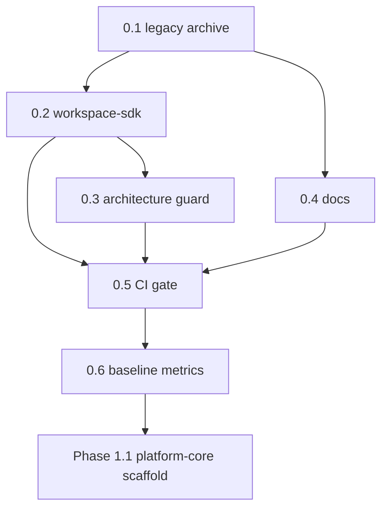

# AI-EXECUTION DOCUMENT — Phase 0 Foundation & Contract

```yaml
document_meta:
  source_file: docs/phase-0-foundation.md
  canonical_markdoc: docs/phase-0-foundation.mdoc
  transformation_version: "2026-06-03"
  execution_priority: REPO_SCRIPTS_OVER_STALE_MD_WHERE_DOC_DRIFT
```

---

## STEP 1 — PHASE DETECTION (COMPLETE)

```yaml
phase_id: "0"
phase_name: "Foundation & Contract (workspace-sdk)"
north_star: "Platform logic = generic · Workspace logic = injectable"
document_status_claim: "Foundation Integration Phase (Active) — integration gate + known structural liabilities"
document_closure_claim: "Phase 0 complete (code + guard + baseline); next = Phase 1.1"
subphases:
  - id: "0.1"
    name: "Legacy archive and empty monorepo root"
    pr_label: "Phase: 0.1"
    depends_on: []
  - id: "0.2"
    name: "@app-tour/workspace-sdk + starter reference plugin"
    pr_label: "Phase: 0.2"
    depends_on: ["0.1"]
  - id: "0.3"
    name: "Architecture guard (dependency-cruiser + import-boundary)"
    pr_label: "Phase: 0.3"
    depends_on: ["0.2"]
  - id: "0.4"
    name: "Documentation and social contract"
    pr_label: "Phase: 0.4"
    depends_on: ["0.1"]
  - id: "0.5"
    name: "CI gate Phase 0"
    pr_label: "Phase: 0.5"
    depends_on: ["0.2", "0.3"]
  - id: "0.6"
    name: "Baseline metrics (lightweight coupling)"
    pr_label: "Phase: 0.6"
    depends_on: ["0.5"]
phase_detection_blocker: null
```

---

## STATE MODEL

```yaml
state_variables:
  current_phase:
    type: enum
    allowed: ["0", "1", "2", "3", "4", "5", "6", "7"]
    initial: "0"
  current_subphase:
    type: enum
    allowed: ["0.1", "0.2", "0.3", "0.4", "0.5", "0.6", "DONE"]
    initial: "0.1"
  phase_0_mode:
    type: enum
    allowed: ["integration_foundation"]
    value: "integration_foundation"
    meaning: "Phase 0 is Integration Foundation, NOT dependency-free contract freeze"

transition_rules:
  - from_subphase: "0.1"
    to_subphase: "0.2"
    condition: ALL exit_criteria_0_1 PASS
  - from_subphase: "0.2"
    to_subphase: "0.3"
    condition: ALL exit_criteria_0_2 PASS
  - from_subphase: "0.1"
    to_subphase: "0.4"
    condition: ALL exit_criteria_0_1 PASS
    note: "0.4 MAY run parallel to 0.2–0.3 (docs only)"
  - from_subphase: "0.3"
    to_subphase: "0.5"
    condition: ALL exit_criteria_0_3 PASS AND exit_criteria_0_2 PASS
  - from_subphase: "0.4"
    to_subphase: "0.5"
    condition: ALL exit_criteria_0_4 PASS
  - from_subphase: "0.5"
    to_subphase: "0.6"
    condition: ALL exit_criteria_0_5 PASS
  - from_subphase: "0.6"
    to_subphase: "DONE"
    condition: ALL exit_criteria_0_6 PASS AND phase_1_entry_checklist ALL PASS
  - forbidden_transition:
      action: "start platform-core scaffold (Phase 1.1)"
      blocked_until: "current_subphase == DONE AND phase_1_entry_checklist ALL PASS"
```

---

## SUBPHASE DAG



```yaml
dag_edges:
  - { from: "0.1", to: "0.2" }
  - { from: "0.2", to: "0.3" }
  - { from: "0.1", to: "0.4" }
  - { from: "0.2", to: "0.5" }
  - { from: "0.3", to: "0.5" }
  - { from: "0.4", to: "0.5" }
  - { from: "0.5", to: "0.6" }
  - { from: "0.6", to: "Phase 1.1" }
allowed_overlap:
  - parallel: ["0.4", "0.2"]
  - parallel: ["0.4", "0.3"]
  - constraint: "0.4 changes MUST NOT touch protected packages without docs-first covenant"
forbidden_overlap:
  - action: "implement platform-core before 0.6 PASS"
  - action: "merge platform-core feature work before baseline:metrics PASS"
pr_rule:
  - rule: "one subphase = one PR"
  - rule: "PR title/body MUST include label matching subphase id e.g. Phase: 0.2"
  - rule: "FORBIDDEN fast-forward multiple subphases in one merge (L-5)"
```

---

## FORENSIC TRUTH — ENFORCEABLE CONSTRAINTS

```yaml
forensic_truth_rules:
  - id: FT-01
    rule: "Phase 0 gate path INCLUDES seven packages under packages/ plus apps/* in root pnpm build and pnpm test"
    enforcement: REM-013 intentional; scripts/package.json build and test filters
    liability: RF-P0-ABS-01
  - id: FT-02
    rule: "phase-0:gate is trunk integration NOT foundation-only isolation"
    enforcement: package.json phase-0:integration-gate
    liability: RF-P0-GATE-01
  - id: FT-03
    rule: "@casl/ability runtime in workspace-sdk is documented NOT removed"
    enforcement: packages/workspace-sdk peerDependencies @casl/ability
    liability: RF-P0-ABS-02
  - id: FT-04
    rule: "platform-core directory MAY exist during Phase 0; Phase 1 boundary drift documented"
    liability: RF-P0-ABS-03
  - id: FT-05
    rule: "theme-react React runtime layer exists; documented not removed"
    liability: RF-P0-ABS-04
  - id: FT-06
    rule: "ui-primitives react MUST be in dependencies not peer-only in src/"
    enforcement: phase-0-guard g6_runtime_deps_honesty when PHASE_0_GUARD_SCOPE != foundation
    liability: RF-P0-ABS-05 FIXED
  - id: FT-07
    rule: "workspace-starter triple @app-tour/* deps documented"
    liability: RF-P0-ABS-06
  - id: FT-08
    rule: "SDK reference comment couples to starter package documented"
    liability: RF-P0-ABS-07
  - id: FT-09
    rule: "ui-primitives MUST be in IMPORT_BOUNDARY_SCAN_ROOTS"
    enforcement: scripts/guards/foundation-gate-config.mjs IMPORT_BOUNDARY_SCAN_ROOTS
    liability: RF-P0-IMP-01 FIXED
  - id: FT-10
    rule: "workspaces/starter MUST be in IMPORT_BOUNDARY_SCAN_ROOTS"
    liability: RF-P0-IMP-02 FIXED
  - id: FT-11
    rule: "g6 enforces src/ deps honesty for ui-primitives"
    liability: RF-P0-IMP-03 PARTIAL
  - id: FT-12
    rule: "dynamic import() evasion documented; no automated block"
    liability: RF-P0-IMP-04
  - id: FT-13
    rule: "guard script hoisted typescript documented"
    liability: RF-P0-IMP-05
  - id: FT-14
    rule: "no circular-deps depcruise rule out of scope"
    liability: RF-P0-IMP-06
  - id: FT-15
    rule: "createRequire in theme-react scripts documented"
    liability: RF-P0-IMP-07
  - id: FT-16
    rule: "denali in tokens.meta.json forbiddenPatterns excluded from denali scan via *.meta.json exclusion in contract tests"
    liability: RF-P0-IMP-08 FIXED g2 scope
  - id: FT-17
    rule: "phase-0-guard expanded beyond six narrow checks"
    liability: RF-P0-GATE-02 FIXED
  - id: FT-18
    rule: "FOUNDATION_DENALI_DIRS includes design-tokens ui theme workspaces"
    enforcement: foundation-gate-config.mjs FOUNDATION_DENALI_DIRS
    liability: RF-P0-GATE-03 FIXED
  - id: FT-19
    rule: "legacy import grep fragile; replaced by contract tests in foundation gate"
    liability: RF-P0-GATE-04
  - id: FT-20
    rule: "test count floor 103 retired from foundation gate; replaced by invariant manifest contracts"
    liability: RF-P0-GATE-05 FIXED
  - id: FT-21
    rule: "guard:doc-sync MUST run in phase-0:integration-gate"
    enforcement: package.json phase-0:integration-gate DOC_SYNC_SCOPE=foundation
    liability: RF-P0-GATE-09 FIXED
```

---

## SECTION 1 — GREENFIELD CONTEXT (CONSTRAINTS ONLY)

```yaml
constraints:
  - id: C1-legacy-meaning
    legacy_project: "Phase 0 = freeze on Denali-locked monolith"
    legacy_actions_forbidden_in_app_tour:
      - "stop structural refactor on Denali-locked code at root"
      - "register denali_token_count baseline per layer as Phase 0 goal"
      - "freeze seven TourFormProfile"
      - "keep legacy wizard smoke green as Phase 0 exit"
  - id: C1-app-tour-meaning
    app_tour_phase_0_MEANS:
      - action: "physically isolate old monorepo under legacy/"
      - action: "establish plugin language @app-tour/workspace-sdk without Denali/old types"
      - action: "enforce import law from day 1 via dependency-cruiser blocking"
      - action: "maintain starter reference plugin minimal production-shaped NOT unrelated mock"
      - action: "publish migration map + this doc BEFORE platform-core implementation"
```

---

## SECTION 2 — NEGATIVE REQUIREMENTS (LEGACY LESSONS L-1..L-10)

```yaml
hard_rules_legacy_lessons:
  - id: L-1
    forbidden: "claim Phase 1 complete while bridge only general and all delegate to legacy"
    required: "Phase 0 is contract only; production behavior belongs Phase 3+"
  - id: L-2
    forbidden: "SdkWorkspaceStrategyAdapter pattern where all methods delegate legacy.getX()"
    required: "plugin implementation OR nothing; NO delegate-to-legacy adapter"
  - id: L-3
    forbidden: "mockWorkspacePlugin with 2 fake fields"
    required: "starterWorkspacePlugin with real registry/rules/wizard shape"
  - id: L-4
    forbidden: "SDK dependency on @repo/types or TourFormProfile"
    required: "WorkspaceTypeId defined inside SDK"
  - id: L-5
    forbidden: "fast-forward 4 sub-phases in one merge"
    required: "exactly one subphase per PR with Phase: 0.x label"
  - id: L-6
    forbidden: "local ci:integrity green while GitHub main red"
    required: "phase-0-gate workflow runs on push to main AND pull_request"
  - id: L-7
    forbidden: "skip platform-core; build wizard directly on Denali"
    required: "Phase 1 app-tour builds platform-core BEFORE apps"
  - id: L-8
    forbidden: "dual state RHF + canonical + sync"
    required: "from Phase 3 UI canonical is sole SoT; record in Phase 0 contract"
  - id: L-9
    forbidden: "DENALI_STRATEGY_PROFILES hardcoded in API core"
    required: "only WorkspaceTypeBinding in SDK; constants live in plugin"
  - id: L-10
    forbidden: "stale baseline JSON after merge"
    required: "gate reports JSON MUST include gitSha on every run"
```

---

## SECTION 3 — PHASE 0 OUTPUT DEFINITION

### 3.1 Hard outputs (code + CI)

```yaml
hard_outputs:
  - id: HO-01
    artifact: legacy/
    requirement: "contains full previous monorepo + legacy/README.md"
    verify: "test -d legacy/apps/api && test -f legacy/README.md"
  - id: HO-02
    artifact: "@app-tour/workspace-sdk"
    requirement: "build PASS; foundation closure via test:phase-0 NOT raw count ≥103 alone"
    verify: "pnpm run test:phase-0 exit 0"
    doc_claim_retired: "≥103 unit tests (90% of 114) — H-03 retired"
    repo_truth: "165 tests / 35 suites informational; phase-0.contract.spec.ts 10 covenant contracts; count floor retired from foundation gate"
  - id: HO-03
    artifact: "@app-tour/config"
    requirement: "shared tsconfig.base.json"
    verify: "test -f packages/config/tsconfig.base.json"
  - id: HO-04
    artifact: dependency-cruiser.config.js
    requirement: "blocking forbidden rules present"
    verify: "pnpm run guard:architecture exit 0"
  - id: HO-05
    command: pnpm run guard:architecture
    requirement: "exit 0"
  - id: HO-06
    command: pnpm run guard:import-boundary
    requirement: "AST barrel / forbidden paths parity with CI"
  - id: HO-07
    artifact: .github/workflows/phase-0-gate.yml
    requirement: "foundation-gate job + integration-gate job on push main and pull_request"
  - id: HO-08
    artifact: scripts/guards/phase-0-guard.mjs
    requirement: "writes JSON report with gitSha"
  - id: HO-09
    artifact: "reports/phase-0-gate-*.json OR reports/phase-0-foundation-gate-*.json"
    requirement: "latest green run exists"
  - id: HO-10
    artifact: reports/phase-0-baseline-*.json
    requirement: "baseline coupling report exists"
  - id: HO-11
    commands: ["pnpm run baseline:metrics", "pnpm run phase-0:gate"]
    requirement: "both defined in package.json"
```

### 3.2 Soft outputs (documentation)

```yaml
soft_outputs:
  - { file: docs/MIGRATION-MAP.md, role: "7-phase map" }
  - { file: docs/phase-0-foundation.md, role: "this doc mirror" }
  - { file: docs/phase-0-foundation.mdoc, role: "Markdoc canonical" }
  - { file: docs/phase-1-platform-core.md, role: "Phase 1 execution" }
  - { file: .github/pull_request_template.md, role: "Phase: N.M field" }
```

### 3.3 Definition of Done (single sentence → checklist)

```yaml
dod_checklist:
  - "legacy isolated under legacy/"
  - "plugin contract registered in workspace-sdk"
  - "import law enforced in CI"
  - "no Denali coupling in foundation packages per contract tests"
  - "Phase 1 MAY start platform-core without coupling risk"
```

---

## SUBPHASE 0.1 — LEGACY ARCHIVE

```yaml
subphase: "0.1"
goal: "Physical separation of old code from new platform; irreversible except controlled port"

completed_actions_record:
  - "git mv apps packages infra scripts etc to legacy/"
  - "create legacy/README.md reference-only guide"
  - "root app-tour package.json + pnpm workspace"
  - "remove orphan root node_modules"

expected_root_structure:
  paths_required:
    - legacy/
    - packages/config/
    - packages/workspace-sdk/
    - packages/platform-core/
    - packages/workspaces/starter/
    - docs/
    - package.json
    - pnpm-workspace.yaml
    - dependency-cruiser.config.js
    - AGENTS.md
    - README.md
  paths_forbidden_at_root:
    - apps/
  paths_forbidden_note: "Historical strict 0.1 — Integration Foundation (REM-013) allows apps/api + apps/web at root; do not fail closure on EC-01-1-strict alone"

exit_criteria_0_1:
  - id: EC-01-1-strict
    check: "ls apps at repo root MUST fail or be empty (historical monorepo-empty 0.1)"
    command: "test ! -d apps || test -z \"$(ls -A apps 2>/dev/null)\""
    status: FAIL_BY_DESIGN_REM-013
  - id: EC-01-1-integration
    check: "apps/api and apps/web exist for trunk integration gate"
    command: "test -d apps/api && test -d apps/web"
  - id: EC-01-2
    check: "legacy/apps/api MUST exist"
    command: "test -d legacy/apps/api"
  - id: EC-01-3
    check: "git history preserved for moved files"
    command: "git log --follow -- legacy/apps/api | head -1 | grep -q ."
```

---

## SUBPHASE 0.2 — WORKSPACE-SDK

```yaml
subphase: "0.2"
goal: "Define shared language between platform and workspace plugins; NO UI Nest Denali"

sdk_purity_rules:
  - "WorkspaceTypeId internal NOT @repo/types TourFormProfile"
  - "reference plugin id starter NOT mock general"
  - "supportedWorkspaceTypes: [starter] NOT 7-value freeze"
  - "workspace-sdk MUST NOT import @repo/types"
  - "workspace-sdk MUST NOT import @app-tour/* workspace packages"
  - "allowed runtime npm in workspace-sdk package.json: @casl/ability ^6.7.3 only declared runtime/peer per package.json"

contract_WorkspacePlugin:
  file: packages/workspace-sdk/src/plugin/workspace-plugin.contract.ts
  required_fields:
    - id: WorkspacePluginId
    - version: number
    - supportedWorkspaceTypes: readonly WorkspaceTypeId[]
    - fieldRegistry: WorkspaceFieldRegistry
    - ruleSet: WorkspaceRuleSet
    - wizard: WorkspaceWizardSurface
    - validation: WorkspaceValidationHooks
    - lifecycle: WorkspaceLifecycleContract
  optional_fields:
    - theme: WorkspaceThemeContract
  theme_rule: "optional on contract; implementation Phase 2+; Phase 0 did NOT scaffold theme system"

contract_CanonicalDocument:
  fields:
    schemaVersion: "monotonic per workspace major"
    roots: "allowed top-level keys in data"
    data: "SoT persist; sole wire shape in API Phase 5"
  behavioral_test:
    input: 'createCanonicalDocument({ schemaVersion: 1, roots: ["basics"], data: { basics: {}, extra: {} } })'
    expected_error: CANONICAL_ROOT_UNKNOWN

contract_WorkspaceFieldRegistryEntry:
  required_shape:
    id: "stable e.g. basics.title"
    canonicalPath: "dot path in canonical JSON"
    stepId: string
    kind: "text|number|date|enum|boolean|composite"
    required: boolean
  optional: [groupSlug, tags]

contract_WorkspaceRuleSet:
  - "matrixDimensions define variant axes"
  - "cells[] each has fieldOverrides hidden required"
  - "defaultCellId fallback when no dimension match"

contract_WorkspaceWizardSurface:
  required_shape:
    wizardMode: "classic|schema"
    railId: string
    roots: readonly string[]
    inactiveFieldGroups: readonly string[]
    wizardCapacityStepRedundant: boolean
  note: "roots mirror canonical roots for rail"

starter_dual_source_REM-004:
  sources:
    - path: packages/workspace-sdk/src/reference/starter-workspace.plugin.ts
      role: "SDK reference; export starterWorkspacePlugin; contract tests"
    - path: packages/workspaces/starter/src/starter.plugin.ts
      role: "production @app-tour/workspace-starter"
  shared_values:
    id: starter
    workspaceType: starter
    steps: [basics, details]
    fields: ["basics.title required", "details.summary"]
    railId: starter_base
  drift_control:
    test: packages/workspaces/starter/test/sdk-reference-parity.spec.ts
  import_rules:
    - "workspace-sdk MUST NOT import packages/workspaces/*"
    - "platform-core MUST NOT import packages/workspaces/*"
    - "apps/web MAY import workspace-starter only among workspaces"

workspace_type_binding:
  default: '[{ workspaceType: "starter", pluginId: "starter" }]'
  resolve_starter: 'resolveWorkspacePluginIdForType("starter") -> "starter"'
  resolve_denali: 'resolveWorkspacePluginIdForType("denali") -> null until Phase 6'

test_requirements:
  command_full_suite: "pnpm --filter @app-tour/workspace-sdk test"
  command_foundation_closure: "pnpm run test:phase-0"
  doc_baseline_count_informational: 165
  doc_gate_floor: retired_H-03
  repo_foundation_enforcement: "10 contracts in PHASE_0_ZERO_DEBT_COVENANT via phase-0.contract.spec.ts"

exit_criteria_0_2:
  - command: "pnpm --filter @app-tour/workspace-sdk build"
    expect: exit 0
  - command: "pnpm run test:phase-0"
    expect: exit 0
  - command: "pnpm --filter @app-tour/workspace-sdk test"
    expect: exit 0
  - check: "no legacy/ imports under workspace-sdk"
    enforcement: legacy-import.contract.spec.ts
  - check: "no denali coupling in foundation dirs"
    enforcement: denali-coupling.contract.spec.ts
```

---

## SUBPHASE 0.3 — ARCHITECTURE GUARD

```yaml
subphase: "0.3"
depcruise_file: dependency-cruiser.config.js
depcruise_command: "pnpm run guard:architecture"
import_boundary_command: "pnpm run guard:import-boundary"
import_boundary_roots: scripts/guards/foundation-gate-config.mjs IMPORT_BOUNDARY_SCAN_ROOTS
  - packages/workspace-sdk
  - packages/platform-core
  - packages/theme-react
  - packages/design-tokens
  - packages/ui-primitives
  - packages/workspaces/starter
  - apps

forbidden_rules_phase_0_core:
  - name: workspace-sdk-no-workspaces
    from: packages/workspace-sdk
    to: packages/workspaces
  - name: no-legacy-imports
    from: packages/*
    to: legacy/

forbidden_rules_phase_1:
  - platform-core-no-workspaces
  - platform-core-only-sdk
  - platform-core-no-apps
  - workspace-sdk-no-apps

forbidden_rules_phase_2:
  - design-tokens-isolated
  - design-tokens-no-workspaces
  - design-tokens-no-apps
  - ui-primitives-only-design-tokens
  - ui-primitives-no-workspaces
  - theme-react-allowed-deps
  - theme-react-no-workspaces

forbidden_rules_phase_3:
  - apps-web-no-workspaces-except-starter
  - workspace-starter-no-apps
  - workspace-starter-allowed-deps
  - apps-web-no-legacy
  - apps-web-allowed-packages
  - apps-api-no-ui-primitives
  - apps-api-no-legacy
  - apps-api-allowed-packages

exit_criteria_0_3:
  - command: pnpm run guard:architecture
    expect: exit 0
  - command: pnpm run phase-0:guard
    expect: exit 0 when run outside foundation scope OR as part of integration gate
  - command: pnpm run phase-0:gate
    expect: exit 0
```

---

## SUBPHASE 0.4 — DOCUMENTATION

```yaml
subphase: "0.4"
  reference_docs:
  - docs/MIGRATION-MAP.md
  - docs/phase-0-foundation.mdoc
  - docs/phase-0-foundation.md
  - docs/phase-0-spec.mdoc
  - docs/DOCUMENTATION-DEBT-REGISTRY.md
  - docs/MIGRATION-MAP.md section 19 Documentation governance
  - docs/phase-1-platform-core.md
  - docs/MIGRATION.md
  - AGENTS.md

pr_template_required_body:
  header: "Phase: 0.x"
  sections:
    - Summary
    - "Exit criteria (from phase-0-foundation.md §X)"
    - Verification command: pnpm run phase-0:gate

exit_criteria_0_4:
  - file_exists: docs/MIGRATION-MAP.md
  - file_exists: docs/phase-0-foundation.md
  - file_exists: docs/phase-1-platform-core.md
  - file_exists: .github/pull_request_template.md
  - command: DOC_SYNC_SCOPE=foundation pnpm run guard:doc-sync
    expect: exit 0
```

---

## SUBPHASE 0.5 — CI GATE

```yaml
subphase: "0.5"
goal: "Prevent L-6 local-only green main unprotected"

workflow_file: .github/workflows/phase-0-gate.yml
node_version: "24 from .nvmrc and package.json engines >=24.0.0 <25"
triggers: [push branches main, pull_request]

ci_jobs:
  foundation_gate:
    name: "Phase 0 foundation gate"
    env:
      LEGACY_IMPORT_SCAN_SCOPE: foundation
    steps_ordered:
      - checkout
      - setup pnpm
      - setup node node-version-file .nvmrc
      - node scripts/guards/check-node-engine.mjs
      - pnpm install --frozen-lockfile
      - node scripts/guards/foundation-scope-assert.mjs
      - pnpm run phase-0:foundation-gate
  integration_gate:
    name: "Phase 0 integration gate"
    env:
      LEGACY_IMPORT_SCAN_SCOPE: monorepo
    steps_ordered:
      - checkout
      - setup pnpm
      - setup node
      - node scripts/guards/check-node-engine.mjs
      - pnpm install --frozen-lockfile
      - pnpm run phase-0:integration-gate
      - upload artifact reports/phase-0-foundation-gate-*.json reports/phase-0-gate-*.json

repo_scripts_canonical:
  phase_0_foundation_gate: "pnpm run test:phase-0"
  phase_0_integration_gate: "pnpm build && pnpm test && pnpm run test:contract:monorepo && pnpm run test:adversarial && DOC_SYNC_SCOPE=foundation pnpm run guard:doc-sync && PHASE_0_GUARD_SCOPE=foundation node scripts/guards/phase-0-guard.mjs && pnpm run guard:architecture && pnpm run guard:import-boundary && pnpm run baseline:metrics"
  phase_0_gate: "pnpm run phase-0:foundation-gate && pnpm run phase-0:integration-gate"

test_phase_0_expansion:
  script: packages/workspace-sdk/package.json test:phase-0
  steps: "build then node --test test/phase-0.contract.spec.ts with LEGACY_IMPORT_SCAN_SCOPE=foundation"

phase_0_zero_debt_covenant_contracts:
  file: packages/workspace-sdk/test/phase-0.contract.spec.ts
  count: 10
  ids:
    - dist-surface -> test/contract.spec.ts
    - denali-coupling -> test/denali-coupling.contract.spec.ts
    - legacy-import -> test/legacy-import.contract.spec.ts
    - invariant-manifest -> test/invariant-manifest.contract.spec.ts
    - import-purity -> test/import-purity.spec.ts
    - ingress-error -> test/ingress-error.contract.spec.ts
    - theme-safety-seal -> test/theme-safety-seal.contract.spec.ts
    - foundation-import-purity -> test/foundation-import-purity.contract.spec.ts
    - denali-workspace-binding -> test/denali-workspace-binding.contract.spec.ts
    - supplemental-behavior -> test/phase-0-supplemental.contract.spec.ts

phase_0_guard_checks:
  when_SCOPE_foundation:
    - g4_depcruise_architecture: "depcruise packages/workspace-sdk packages/config only"
    - g4b_import_boundary: "guard:import-boundary workspace-sdk only"
    - g7_doc_sync: "guard:doc-sync DOC_SYNC_SCOPE=foundation"
    skips: [g6_runtime_deps_honesty]
    report_prefix: phase-0-foundation-gate
  when_SCOPE_not_foundation:
    - g4_depcruise_architecture: "pnpm run guard:architecture full monorepo"
    - g4b_import_boundary: "full IMPORT_BOUNDARY_SCAN_ROOTS"
    - g6_runtime_deps_honesty: "ui-primitives src imports in dependencies"
    - g7_doc_sync: "pnpm run guard:doc-sync"
    report_prefix: phase-0-gate

doc_section_9_3_stale_mapping:
  note: "Source doc lists g1 g2 g3 g5; REPO retired grep/count checks; use covenant contracts instead"
  g1_sdk_dist: "enforced by dist-surface contract NOT g1_sdk_dist_exists"
  g2_denali_rg: "REMOVED; enforced by denali-coupling.contract.spec.ts"
  g3_legacy_rg: "REMOVED; enforced by legacy-import.contract.spec.ts"
  g5_test_count_103: "REMOVED from foundation gate; informational in baseline-metrics only"

pre_commit:
  hook: Husky runs pnpm run ci:integrity
  ci_integrity_sequence:
    - node scripts/guards/check-node-engine.mjs
    - pnpm run phase-0:gate
    - pnpm run guard:symlink
    - node scripts/guards/phase-1-guard.mjs
  bypass_forbidden: "HUSKY=0 and SKIP_HOOKS rejected per AGENTS.md"

exit_criteria_0_5:
  - workflow_exists: .github/workflows/phase-0-gate.yml
  - command: pnpm run phase-0:gate
    expect: exit 0 locally
  - artifact: reports/phase-0-gate-*.json OR phase-0-foundation-gate-*.json with gitSha
  - guard_doc_sync_in_integration: true
  - remote_github_actions:
      status: OPEN per source doc checkbox
      action: "push branch; verify both CI jobs green"
```

---

## SUBPHASE 0.6 — BASELINE METRICS

```yaml
subphase: "0.6"
goal: "coupling score zero in new packages + SDK size registration"
script: scripts/guards/baseline-metrics.mjs
command: pnpm run baseline:metrics
output:
  - reports/phase-0-baseline-YYYY-MM-DD.json
  - reports/phase-0-baseline-YYYY-MM-DD.md

metrics_informational:
  - workspace_sdk_test_it_source
  - workspace_sdk_export_count
  - workspace_sdk_source_files
  - new_packages list

metrics_enforced_thresholds:
  - id: t2_denali_coupling_contract
    expect: denali-coupling.contract.spec.ts PASS
  - id: t3_legacy_import_contract
    expect: legacy-import.contract.spec.ts PASS

doc_stale_metrics:
  - workspace_sdk_test_count >= 103: "retired as gate threshold; informational only"
  - denali_token_new_packages: 0 via contract not rg alone
  - legacy_import_edges: 0 via contract not rg alone

exit_criteria_0_6:
  - script_defined: baseline:metrics in package.json
  - command: pnpm run baseline:metrics
    expect: exit 0
  - artifact: reports/phase-0-baseline-*.json exists
  note: "baseline:metrics runs in phase-0:integration-gate (final step)"
```

---

## FORBIDDEN ACTIONS (SECTION 11 + GLOBAL)

```yaml
forbidden_actions:
  - action: "implement packages/platform-core feature work as Phase 0 scope"
    correct_phase: "1.x"
  - action: "implement apps/api apps/web as Phase 0 scope"
    correct_phase: "3.x"
  - action: "implement packages/workspaces/denali"
    correct_phase: "6.x"
  - action: "import from legacy/ in new packages"
    correct_phase: never
  - action: "scaffold theme/design-tokens system as Phase 0 deliverable"
    correct_phase: "2.x"
    exception: "SDK theme/auth exports allowed after Phase 2-3 retrofit"
  - action: "modify legacy/ for new features"
    correct_phase: never archive only
  - action: "create delegate-to-legacy adapter"
    rule: L-2
  - action: "design dual-write RHF + canonical state"
    rule: L-8
  - action: "start platform-core before subphase 0.6 PASS"
    rule: DAG forbidden_overlap
  - action: "modify packages/platform-core packages/workspace-sdk apps/api without docs/ Markdoc update first"
    rule: Zero-Debt Covenant .cursorrules
  - action: "bypass Husky pre-commit hooks"
    rule: AGENTS.md
  - action: "workspace-sdk or platform-core import packages/workspaces/*"
    enforcement: depcruise
  - action: "apps/web import workspaces except starter"
    enforcement: depcruise apps-web-no-workspaces-except-starter
```

---

## PHASE 1 ENTRY CHECKLIST (SECTION 12)

```yaml
phase_1_entry_checklist:
  all_must_pass: true
  items:
    - id: P1E-01
      condition: legacy isolated in legacy/
      verify: test -d legacy/apps/api
    - id: P1E-02
      condition: workspace-sdk build + test
      verify: pnpm run test:phase-0 && pnpm --filter @app-tour/workspace-sdk test
    - id: P1E-03
      condition: guard:architecture green
      verify: pnpm run guard:architecture
    - id: P1E-04
      condition: docs MIGRATION-MAP phase-0 phase-1 exist
      verify: file existence trio
    - id: P1E-05
      condition: CI phase-0-gate green local AND remote after push
      verify: pnpm run phase-0:gate && GitHub workflow both jobs
    - id: P1E-06
      condition: baseline JSON + baseline:metrics PASS
      verify: pnpm run baseline:metrics
    - id: P1E-07
      condition: denali coupling 0 via guard/baseline contracts not raw rg on specs
      verify: baseline t2 PASS
    - id: P1E-08
      condition: no open PR with scope outside Phase 0
      verify: manual gh pr list review
    - id: P1E-09
      condition: guard:doc-sync Phase 0 READMEs + links
      verify: DOC_SYNC_SCOPE=foundation pnpm run guard:doc-sync

on_all_pass:
  next_document: docs/phase-1-platform-core.md
  next_section: "Phase 1.1 scaffold"
```

---

## APPENDIX EXECUTION BINDINGS

### Appendix A — SDK tree (verification paths must exist)

```yaml
required_paths:
  - packages/workspace-sdk/package.json
  - packages/workspace-sdk/src/index.ts
  - packages/workspace-sdk/src/canonical/canonical-document.ts
  - packages/workspace-sdk/src/plugin/
  - packages/workspace-sdk/src/reference/starter-workspace.plugin.ts
  - packages/workspace-sdk/src/auth/
  - packages/workspace-sdk/src/theme/
  - packages/workspace-sdk/src/ingress/
  - packages/workspace-sdk/test/
```

### Appendix B — daily commands (ordered)

```bash
nvm use && corepack enable
pnpm install
pnpm build
pnpm test
pnpm run guard:architecture
pnpm run guard:import-boundary
pnpm run baseline:metrics
pnpm run phase-0:gate
DOC_SYNC_SCOPE=foundation pnpm run guard:doc-sync
```

### Appendix C — export map requirements

```yaml
exports_from_index_ts:
  - WORKSPACE_SDK_VERSION
  - CanonicalDocument helpers
  - starterWorkspacePlugin
  - WorkspacePlugin isWorkspacePlugin
  - WorkspaceTypeId STARTER_WORKSPACE_TYPE
  - resolveWorkspacePluginIdForType
  - registry rule wizard validation lifecycle types
  - auth/* CASL defineAbilityFor createTenantAbility canAccessWorkspaceTheme
  - theme/* WorkspaceThemeContract presets snapshotWorkspaceTheme ingress helpers
  - ingress/* parseCanonicalDocumentFromStorage parseWorkspacePluginFromStorage
verify: "dist-surface contract in test/contract.spec.ts"
```

### Appendix D — legacy to app-tour mapping (do NOT reintroduce legacy names)

```yaml
mappings:
  TourFormProfile: WorkspaceTypeId
  mockWorkspacePlugin: starterWorkspacePlugin
  WorkspaceProfileBinding: WorkspaceTypeBinding
  phase-0:verify-freeze: REMOVED app-tour
  baseline:platform-metrics: baseline:metrics
forbidden_reintroduction:
  - phase-0:verify-freeze seven profiles
  - @repo/types in SDK
```

### Appendix E — legacy read-only references

```yaml
read_only_paths:
  - legacy/map_2.md
  - legacy/phase-0-platform-baseline.md
  - legacy/phase-1-platform-contract.md
  - legacy/packages/denali-domain/
rule: "NEVER import from these into packages/ or apps/"
```

---

## SECTION 14 — OUT OF SCOPE (DO NOT IMPLEMENT IN PHASE 0)

```yaml
deferred_to_migration_map:
  - { map_section: 5, topic: "Postgres Redis MinIO", implement_phase: "3+" }
  - { map_section: 6, topic: "Event bus transactional outbox", implement_phase: "4-5" }
  - { map_section: 7, topic: "RLS hybrid tenant routing", implement_phase: "4 design 7 enterprise" }
  - { map_section: 8, topic: "contractVersion migrateCanonical", implement_phase: "SDK 2+ cutover 6" }
  - { map_section: 9, topic: "First-party plugins only", implement_phase: "until DoD" }
  - { map_section: 10, topic: "Observability audit", implement_phase: "min 3 full 7" }

known_contradiction_resolved:
  - "Phase 3 wants Postgres; tenant RLS Phase 4; Phase 3 tours single-tenant dev or tenant_id nullable until Phase 4"

sdk_fields_post_retrofit:
  - WorkspaceThemeContract theme on plugin: EXISTS packages/workspace-sdk/src/theme/
  - contractVersion on WorkspacePlugin: NOT in main contract yet Phase 2+ MAP section 8
```

---

## CI PIPELINE (CANONICAL EXECUTION ORDER)

```yaml
local_full_phase_0_gate:
  name: pnpm run phase-0:gate
  steps:
    - step: foundation
      run: pnpm run phase-0:foundation-gate
      expands_to: pnpm run test:phase-0
      validates: 10 covenant contracts subprocess isolated
    - step: integration
      run: pnpm run phase-0:integration-gate
      substeps:
        - pnpm build
        - pnpm test
        - pnpm run test:contract:monorepo
        - pnpm run test:adversarial
        - DOC_SYNC_SCOPE=foundation pnpm run guard:doc-sync
        - PHASE_0_GUARD_SCOPE=foundation node scripts/guards/phase-0-guard.mjs
        - pnpm run guard:architecture
        - pnpm run guard:import-boundary
        - pnpm run baseline:metrics

local_pre_commit:
  name: pnpm run ci:integrity
  steps: [check-node-engine, phase-0:gate, guard:symlink, phase-1-guard]

github_ci:
  workflow: phase-0-gate.yml
  jobs: [foundation-gate, integration-gate]
  parity_rule: "CI MUST run same scripts as local phase-0:gate split across two jobs"
```

---

## AGENT EXECUTION ALGORITHM

```yaml
algorithm:
  1: "SET current_subphase from repo state by running exit criteria checks bottom-up"
  2: "IF modifying protected paths THEN update docs/*.mdoc FIRST per Zero-Debt Covenant"
  3: "EXECUTE only actions for current_subphase"
  4: "AFTER code change RUN pnpm run phase-0:gate"
  5: "IF subphase 0.6 OR completion RUN pnpm run baseline:metrics"
  6: "IF all phase_1_entry_checklist PASS SET current_subphase DONE and OPEN phase-1-platform-core.md Phase 1.1"
  7: "APPEND to response: Architect documentation status Updated or Not Needed with docs link"
```

---

## DOC_DRIFT REGISTER (SOURCE MD vs REPO)

```yaml
doc_drift:
  - id: DRIFT-01
    source: "§9.2 gate step list includes baseline:metrics inside phase-0:gate"
    repo: "baseline:metrics final step of phase-0:integration-gate"
    resolution: "Fixed in package.json — runs via pnpm run phase-0:gate"
  - id: DRIFT-02
    source: "§9.3 g1 g2 g3 g5 guard IDs"
    repo: "phase-0-guard.mjs uses g4 g4b g6 g7 + covenant contracts"
    resolution: "Use covenant list + phase-0-guard checks above"
  - id: DRIFT-03
    source: "§6.10 114 tests ≥103 floor"
    repo: "foundation gate uses behavioral contracts not count floor"
    resolution: "test:phase-0 PASS required; count informational"
  - id: DRIFT-04
    source: "§9.2 single workflow step pnpm run phase-0:gate"
    repo: "CI split foundation-gate + integration-gate jobs"
    resolution: "Both jobs MUST pass for remote parity"
  - id: DRIFT-05
    source: "§9.5 remote GitHub unchecked"
    resolution: "Agent MUST verify remote CI unless explicitly offline-only task"
  - id: DRIFT-06
    source: "ai-exec count 8 covenant"
    repo: "10 modules in phase-0.contract.spec.ts"
    resolution: "Fixed 2026-06-03 — denali-workspace-binding + supplemental-behavior"
  - id: DRIFT-07
    source: "EC-01-1 apps forbidden at root"
    repo: "apps/* exist — Integration Foundation"
    resolution: "EC-01-1-strict FAIL_BY_DESIGN; EC-01-1-integration PASS"
  - id: DRIFT-08
    source: "integration-gate yaml without test:adversarial"
    repo: "package.json phase-0:integration-gate includes test:adversarial"
    resolution: "Fixed in ai-exec repo_scripts_canonical"
```

---

## COMPLETION CHECKLIST (PHASE 0 FULL)

```yaml
phase_0_complete_when_ALL:
  - subphase_0_1: EC-01-2 EC-01-3 PASS; EC-01-1-integration PASS (strict optional / FAIL_BY_DESIGN)
  - subphase_0_2: build test:phase-0 full test PASS
  - subphase_0_3: guard:architecture guard:import-boundary phase-0:gate PASS
  - subphase_0_4: docs + PR template + guard:doc-sync PASS
  - subphase_0_5: workflow exists local gate PASS remote CI PASS
  - subphase_0_6: baseline:metrics PASS artifact exists
  - phase_1_entry_checklist: ALL 9 items PASS
  - zero_debt: no forbidden_actions violated
  - doc_sync: Markdoc canonical phase-0-foundation.mdoc synced if docs touched
```

---

## FAIL CONDITIONS

```yaml
fail_assessment:
  phase_identification: PASS
  actionable_steps: PASS with DOC_DRIFT register
  enforceable_rules: PASS when bound to repo scripts
  open_blockers:
    - "P1E-05 remote GitHub Actions not verified in source doc (unchecked box §9.4)"
  verdict: "CONDITIONAL PASS — executable with repo script bindings; include FAIL only if agent executes stale §9.3 g1-g2-g3-g5 without repo binding"
```

---

**END AI-EXECUTION DOCUMENT**
