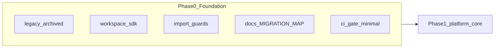

# Phase 0 — Foundation & Contract (`workspace-sdk`)

> **Canonical (Markdoc):** [`phase-0-foundation.mdoc`](phase-0-foundation.mdoc) · Docs-as-Code §20 MAP · `pnpm run guard:doc-sync`  
> **AI execution:** [`phase-0-foundation.ai-exec.md`](phase-0-foundation.ai-exec.md) — deterministic agent runbook (repo scripts authoritative)  
> **R2 Verification-as-Code:** per-section `### Verification` + [Unenforced Aspiration](phase-0-foundation.mdoc#unenforced-aspiration) live in the **`.mdoc`** file only (this `.md` mirror may lag).


**app-tour — راهنمای اجرایی کامل فاز صفر**

> **نقش:** بسط عمیق فاز ۰ در [`MIGRATION-MAP.md`](MIGRATION-MAP.md)  
> **North Star:** Platform logic = generic · Workspace logic = injectable  
> **وضعیت:** **Foundation closure complete (2026-06-03)** — Integration Foundation · `pnpm run phase-0:gate` سبز محلی · spec alias: [`phase-0-spec.mdoc`](phase-0-spec.mdoc)  
> **Docs-as-Code (§20 MAP):** Markdoc canonical — [`phase-0-foundation.mdoc`](phase-0-foundation.mdoc) · `pnpm run guard:doc-sync` (in `phase-0:gate`)  
> **مرجع شکست‌های قبلی:** [`legacy/map_2.md`](../legacy/map_2.md) · [`legacy/phase-0-platform-baseline.md`](../legacy/phase-0-platform-baseline.md)  
> **Forensic audit:** [`audit-red-flags-phase-0.md`](../audit-red-flags-phase-0.md)

---

## Forensic Truth

**Phase 0 is an Integration Foundation, not a dependency-free contract freeze.**

| Claim (old docs) | Reality (repo) |
|------------------|----------------|
| “Foundation only” = `workspace-sdk` + `config` | **Seven** packages under `packages/` plus `apps/*` build in root `pnpm build` / `pnpm test` |
| `phase-0:gate` = foundation-only | **Trunk integration:** `pnpm build` + `pnpm test` for full stack ([`package.json`](../package.json) · REM-013) |
| SDK “no runtime deps” except `@casl/ability` | CASL in contract package; **theme/auth** retrofitted on same package (Phases 2–3) |
| Green gate = architectural honesty | Proves compile + tests + guards on **current monorepo** — not isolation from Phases 1–3 |

### Known Structural Liabilities (RF-P0)

Source: [`audit-red-flags-phase-0.md`](../audit-red-flags-phase-0.md). Status after painful-gate hardening (2026-06).

| ID | Liability (one line) | Remediation in this pass |
|----|----------------------|-------------------------|
| RF-P0-ABS-01 | Seven packages + apps in “Phase 0” gate path | Documented only (REM-013 intentional) |
| RF-P0-ABS-02 | `@casl/ability` runtime in `workspace-sdk` | Documented; not removed |
| RF-P0-ABS-03 | `platform-core` exists while §11 says Phase 1 | Documented boundary drift |
| RF-P0-ABS-04 | `theme-react` React runtime layer | Documented |
| RF-P0-ABS-05 | `ui-primitives` `react` was peer-only in `src/` | **g6** + `react` in `dependencies` |
| RF-P0-ABS-06 | `workspace-starter` triple `@app-tour/*` deps | Documented |
| RF-P0-ABS-07 | SDK reference comment couples to starter package | Documented |
| RF-P0-IMP-01 | `ui-primitives` omitted from import-boundary scan | **Fixed** — `IMPORT_BOUNDARY_SCAN_ROOTS` |
| RF-P0-IMP-02 | `workspaces/starter` omitted from AST scan | **Fixed** |
| RF-P0-IMP-03 | Test/storybook imports vs `package.json` graph | Partially — g6 enforces `src/` deps |
| RF-P0-IMP-04 | Dynamic `import()` evades package rules | Documented |
| RF-P0-IMP-05 | Guard script uses hoisted `typescript` | Documented |
| RF-P0-IMP-06 | No circular-deps rule in depcruise | Out of scope |
| RF-P0-IMP-07 | `createRequire` in theme-react scripts | Documented |
| RF-P0-IMP-08 | `denali` in `tokens.meta.json` forbidden list | g2 excludes `*.meta.json` |
| RF-P0-GATE-01 | `phase-0:gate` = full monorepo | Documented (REM-013) |
| RF-P0-GATE-02 | `phase-0-guard` only six narrow checks | **Expanded** (g6, g7, g2 scope, g5 floor) |
| RF-P0-GATE-03 | Denali scan missed design-tokens / ui / theme | **Fixed** — `FOUNDATION_DENALI_DIRS` |
| RF-P0-GATE-04 | Legacy import grep fragile | Documented |
| RF-P0-GATE-05 | Test count floor in foundation gate | **Retired (H-03)** — `test:phase-0` (10 covenant modules) |
| RF-P0-GATE-09 | `guard:doc-sync` not in `phase-0:gate` | **Fixed** |
| RF-P0-DOC-01…10 | Aspirational “complete” / doc-sync / coupling | Banner + tables in this section |

---

## فهرست

1. [چرا فاز ۰ در greenfield متفاوت است](#1-چرا-فاز-۰-در-greenfield-متفاوت-است)
2. [درس‌های پروژهٔ قبلی — چه کار نکنیم](#2-درس‌های-پروژهٔ-قبلی--چه-کار-نکنیم)
3. [تعریف دقیق خروجی فاز ۰](#3-تعریف-دقیق-خروجی-فاز-۰)
4. [DAG و زیرفازها](#4-dag-و-زیرفازها)
5. [زیرفاز 0.1 — آرشیو legacy و monorepo خالی](#5-زیرفاز-01--آرشیو-legacy-و-monorepo-خالی)
6. [زیرفاز 0.2 — `@app-tour/workspace-sdk`](#6-زیرفاز-02--app-tourworkspace-sdk)
7. [زیرفاز 0.3 — Architecture guard](#7-زیرفاز-03--architecture-guard)
8. [زیرفاز 0.4 — مستندات و قرارداد اجتماعی](#8-زیرفاز-04--مستندات-و-قرارداد-اجتماعی)
9. [زیرفاز 0.5 — CI gate فاز ۰](#9-زیرفاز-05--ci-gate-فاز-۰)
10. [زیرفاز 0.6 — Baseline metrics (سبک)](#10-زیرفاز-06--baseline-metrics-سبک)
11. [آنچه در فاز ۰ ممنوع است](#11-آنچه-در-فاز-۰-ممنوع-است)
12. [چک‌لیست ورود به فاز ۱](#12-چک‌لیست-ورود-به-فاز-۱)
13. [پیوست‌ها](#13-پیوست‌ها)
14. [پل به فازهای بعد (§5–§10 MAP)](#14-پل-به-فازهای-بعد-خارج-از-scope-فاز-۰--ثبت-در-migration-map)

---

## 1. چرا فاز ۰ در greenfield متفاوت است

### 1.1 legacy: فاز ۰ = Freeze روی monolith

در [`legacy/phase-0-platform-baseline.md`](../legacy/phase-0-platform-baseline.md) فاز ۰ یعنی:

- توقف refactor ساختاری روی کد Denali-locked
- ثبت baseline عددی (`denali_token_count` per layer)
- freeze هفت `TourFormProfile`
- smoke ویزارد legacy سبز بماند

**مشکل:** freeze روی coupling — نه ساخت foundation جدید. فاز ۱ legacy فقط SDK روی legacy زنده ساخت.

### 1.2 app-tour: فاز ۰ = Foundation جدید

در greenfield فاز ۰ یعنی:

| هدف | معنی |
|-----|------|
| **جداسازی فیزیکی** | کل monorepo قدیم در [`legacy/`](../legacy/) — ریشه فقط app-tour |
| **زبان مشترک plugin** | `@app-tour/workspace-sdk` بدون وابستگی به Denali/types قدیم |
| **قانون import از روز ۱** | `dependency-cruiser` blocking |
| **starter reference** | plugin مرجع minimal — نه mock بی‌ربط به production |
| **مستندات مرجع** | نقشه مهاجرت + این سند — قبل از platform-core |



---

## 2. درس‌های پروژهٔ قبلی — چه کار نکنیم

این جدول **الزامات منفی** فاز ۰ app-tour است — مستقیماً از ممیزی [`legacy/map_2.md`](../legacy/map_2.md).

| ID | اشتباه legacy | پیامد | قانون app-tour فاز ۰ |
|----|---------------|--------|----------------------|
| **L-1** | ادعای «فاز ۱ تمام» در حالی که bridge فقط `general` و همه delegate به legacy | false confidence | فاز ۰ **فقط contract** — رفتار production در فاز ۳+ |
| **L-2** | `SdkWorkspaceStrategyAdapter` — همه متدها → `legacy.getX()` | SDK تزئینی | **ممنوع** adapter delegate در app-tour؛ plugin یا هیچ |
| **L-3** | `mockWorkspacePlugin` با ۲ فیلد ساختگی | contract بی‌ارزش | `starterWorkspacePlugin` با shape واقعی registry/rules/wizard |
| **L-4** | وابستگی SDK به `@repo/types` / `TourFormProfile` | coupling زودهنگام | `WorkspaceTypeId` مستقل در SDK |
| **L-5** | fast-forward ۴ sub-phase در یک merge | review/rollback سخت | **یک sub-phase = یک PR** با `Phase: 0.x` |
| **L-6** | `ci:integrity` محلی سبز ولی GitHub e2e قرمز | main ناپایدار | gate فاز ۰ روی **push به main** هم اجرا شود |
| **L-7** | `platform-core` هرگز ساخته نشد | ویزارد مستقیم Denali | فاز ۱ app-tour = platform-core **قبل** apps |
| **L-8** | dual state RHF + canonical + sync | هر PR سه مسیر | از فاز ۳: canonical تنها SoT — در contract فاز ۰ ثبت |
| **L-9** | `DENALI_STRATEGY_PROFILES` در API core | workspace hardcode | فقط `WorkspaceTypeBinding` در SDK — constants در plugin |
| **L-10** | baseline JSON stale بعد از merge | regression نامشخص | گزارش JSON با `gitSha` در هر gate |

---

## 3. تعریف دقیق خروجی فاز ۰

پایان فاز ۰ وقتی است که **همه** موارد زیر برقرار باشند:

### 3.1 خروجی‌های hard (کد + CI)

- [x] `legacy/` شامل monorepo کامل قبلی + `legacy/README.md`
- [x] `@app-tour/workspace-sdk` build + `pnpm run test:phase-0` (۱۰ covenant) + full suite (**165** tests)
- [x] `@app-tour/config` — `tsconfig.base.json` مشترک
- [x] `dependency-cruiser.config.js` — قوانین blocking
- [x] `pnpm run guard:architecture` سبز
- [x] `pnpm run guard:import-boundary` — AST barrel / forbidden paths (parity با CI)
- [x] `.github/workflows/phase-0-gate.yml` — build + test + guard روی push/PR
- [x] `scripts/guards/phase-0-guard.mjs` — گزارش JSON با gitSha
- [x] `reports/phase-0-foundation-gate-*.json` (foundation) · `reports/phase-0-baseline-*.json` — آخرین اجرای سبز
- [x] `reports/phase-0-baseline-*.json` — baseline coupling (0.6)
- [x] `pnpm run baseline:metrics` + `pnpm run phase-0:gate` در `package.json`

### 3.2 خروجی‌های soft (مستندات)

- [x] [`MIGRATION-MAP.md`](MIGRATION-MAP.md) — نقشه کل
- [x] این سند (`phase-0-foundation.md`)
- [x] [`phase-1-platform-core.md`](phase-1-platform-core.md)
- [x] `.github/pull_request_template.md` — فیلد `Phase: N.M`

### 3.3 Definition of Done فاز ۰ (یک جمله)

> **Repo خالی enterprise-ready است:** contract plugin ثبت شده، legacy ایزوله، import law در CI، هیچ Denali در packages جدید، و فاز ۱ می‌تواند `platform-core` را بدون ریسک coupling شروع کند.

---

## 4. DAG و زیرفازها

```text
0.1 legacy archive
    ↓
0.2 workspace-sdk + starter reference plugin
    ↓
0.3 dependency-cruiser rules
    ↓
0.4 docs (MIGRATION-MAP, phase-0, phase-1)
    ↓
0.5 CI phase-0-gate (push + PR)
    ↓
0.6 baseline metrics script (coupling score = 0 in new packages)
    ↓
→ Phase 1.1 platform-core scaffold
```

| Sub-phase | PR label | وابستگی |
|-----------|----------|---------|
| 0.1 | `Phase: 0.1` | — |
| 0.2 | `Phase: 0.2` | 0.1 |
| 0.3 | `Phase: 0.3` | 0.2 |
| 0.4 | `Phase: 0.4` | 0.1 |
| 0.5 | `Phase: 0.5` | 0.2, 0.3 |
| 0.6 | `Phase: 0.6` | 0.5 |

**Overlap مجاز:** 0.4 موازی 0.2–0.3 (فقط docs).  
**Overlap ممنوع:** شروع `platform-core` قبل از **0.6** سبز (شامل `baseline:metrics`).

---

## 5. زیرفاز 0.1 — آرشیو legacy و monorepo خالی

### 5.1 هدف

جداسازی فیزیکی «کد قدیم» از «پلتفرم جدید» — یک تصمیم غیرقابل برگشت مگر port کنترل‌شده.

### 5.2 کارهای انجام‌شده

| کار | وضعیت |
|-----|--------|
| `git mv` apps, packages, infra, scripts, … → `legacy/` | ✅ |
| `legacy/README.md` — راهنمای «فقط مرجع» | ✅ |
| ریشه: `app-tour` package.json، pnpm workspace | ✅ |
| حذف `node_modules` orphan در root | ✅ |

### 5.3 ساختار ریشه پس از 0.1

```text
/
├── legacy/                 # monorepo قبلی — NO new features
├── packages/
│   ├── config/
│   ├── workspace-sdk/
│   ├── platform-core/      # فاز ۱+
│   └── workspaces/
│       └── starter/        # فاز ۳.1 — production plugin (جدا از SDK reference)
├── docs/
├── package.json            # name: app-tour
├── pnpm-workspace.yaml
├── dependency-cruiser.config.js
├── AGENTS.md
└── README.md
```

### 5.4 Exit criteria 0.1

- [x] `legacy/` شامل monorepo قبلی + `legacy/apps/api`
- [x] `apps/api` و `apps/web` در root (Integration Foundation — REM-013؛ نه monorepo خالی تاریخی)
- [x] git history برای moved files حفظ شده (`git log --follow`)

---

## 6. زیرفاز 0.2 — `@app-tour/workspace-sdk`

### 6.1 هدف

تعریف **زبان مشترک** بین platform و workspace plugins — بدون UI، بدون Nest، بدون Denali.

### 6.2 تفاوت با legacy SDK

| موضوع | legacy `@repo/workspace-sdk` | app-tour `@app-tour/workspace-sdk` |
|--------|------------------------------|-------------------------------------|
| Profile binding | `TourFormProfile` از `@repo/types` | `WorkspaceTypeId` داخلی |
| Reference plugin | `mock` / `general` | `starter` |
| supportedProfiles | 7-value freeze | `supportedWorkspaceTypes: ["starter"]` |
| وابستگی | `@repo/types` | **بدون** `@repo/types` و **بدون** `@app-tour/*` workspace packages |
| Runtime npm | (implicit در legacy) | **`@casl/ability` ^6.7.3** — Phase 3 CASL در `src/auth/**` |

**هدف خلوص فاز ۰:** جداسازی از legacy types و workspace implementations — **نه** صفر بودن همهٔ runtime npm deps. تنها runtime dependency اعلام‌شده در [`packages/workspace-sdk/package.json`](../packages/workspace-sdk/package.json): `@casl/ability`.

### 6.3 قرارداد `WorkspacePlugin`

```typescript
interface WorkspacePlugin {
  readonly id: WorkspacePluginId;
  readonly version: number;
  readonly supportedWorkspaceTypes: readonly WorkspaceTypeId[];
  readonly fieldRegistry: WorkspaceFieldRegistry;
  readonly ruleSet: WorkspaceRuleSet;
  readonly wizard: WorkspaceWizardSurface;
  readonly validation: WorkspaceValidationHooks;
  readonly lifecycle: WorkspaceLifecycleContract;
  readonly theme?: WorkspaceThemeContract;  // optional — Phase 2+ retrofit
}
```

**`theme` (وضعیت فعلی):** فیلد اختیاری `theme?: WorkspaceThemeContract` روی `WorkspacePlugin` در [`workspace-plugin.contract.ts`](../packages/workspace-sdk/src/plugin/workspace-plugin.contract.ts) — **پیاده‌سازی** در فاز ۲+ (ingress، `--ws-*` keys). فاز ۰ **سیستم theme** را scaffold نکرد؛ پس از retrofit، reference starter و `packages/workspaces/starter` ممکن است `theme` داشته باشند. مرجع: [`phase-2-design-system.md`](phase-2-design-system.md) · `packages/workspace-sdk/src/theme/`.

### 6.4 `CanonicalDocument` — semantics

| فیلد | قانون |
|------|--------|
| `schemaVersion` | monotonic per workspace major |
| `roots` | کلیدهای مجاز top-level در `data` |
| `data` | SoT persist — **تنها** شکل wire در API (فاز ۵) |

```typescript
// رفتار ثبت‌شده در تست
createCanonicalDocument({
  schemaVersion: 1,
  roots: ["basics"],
  data: { basics: {}, extra: {} }, // → CANONICAL_ROOT_UNKNOWN
});
```

**درس L-8:** legacy سه لایه state داشت — app-tour از فاز ۳ UI فقط canonical را mutate می‌کند.

### 6.5 Field registry entry

```typescript
interface WorkspaceFieldRegistryEntry {
  readonly id: string;              // stable id e.g. "basics.title"
  readonly canonicalPath: string;     // dot path in canonical JSON
  readonly stepId: string;
  readonly kind: WorkspaceFieldKind;  // text | number | date | enum | boolean | composite
  readonly required: boolean;
  readonly groupSlug?: string;
  readonly tags?: readonly string[];
}
```

### 6.6 Rule set

- `matrixDimensions` — محور variant (tour kind، duration، …)
- `cells[]` — هر cell = `fieldOverrides` (hidden, required)
- `defaultCellId` — fallback وقتی dimension match نشد

### 6.7 Wizard surface

```typescript
interface WorkspaceWizardSurface {
  readonly wizardMode: "classic" | "schema";
  readonly visualization roots via wizard.roots;  // mirrors canonical roots for rail
  readonly railId: string;
  readonly roots: readonly string[];
  readonly inactiveFieldGroups: readonly string[];
  readonly wizardCapacityStepRedundant: boolean;
}
```

### 6.8 `starterWorkspacePlugin` — dual source (REM-004)

دو منبع shape یکسان — **عمدی** تا فاز ۳؛ همگام‌سازی با تست parity:

| منبع | مسیر | نقش |
|------|------|-----|
| **SDK reference** | [`packages/workspace-sdk/src/reference/starter-workspace.plugin.ts`](../packages/workspace-sdk/src/reference/starter-workspace.plugin.ts) | Contract tests · export `starterWorkspacePlugin` |
| **Production workspace** | [`packages/workspaces/starter/src/starter.plugin.ts`](../packages/workspaces/starter/src/starter.plugin.ts) | `@app-tour/workspace-starter` |

| بخش | مقدار (هر دو) |
|-----|----------------|
| id | `"starter"` |
| workspace type | `"starter"` |
| steps | `basics`, `details` |
| fields | `basics.title` (required), `details.summary` |
| railId | `starter_base` |

**انحراف:** فاز ۰ فقط SDK reference بود؛ فاز ۳ package اضافه شد **بدون** حذف reference (engine/tests بدون import به `workspaces/*`). **کاهش drift:** [`sdk-reference-parity.spec.ts`](../packages/workspaces/starter/test/sdk-reference-parity.spec.ts).

**قانون import:** `workspace-sdk` / `platform-core` ↛ `packages/workspaces/*` (depcruise) — `apps/web` فقط `workspace-starter`.

### 6.9 Workspace type binding

```typescript
const DEFAULT_WORKSPACE_TYPE_BINDINGS = [
  { workspaceType: "starter", pluginId: "starter" },
];

resolveWorkspacePluginIdForType("starter"); // → "starter"
resolveWorkspacePluginIdForType("denali"); // → null (تا فاز ۶)
```

### 6.10 تست‌های الزامی (وضعیت repo — 2026-06-03)

`pnpm --filter @app-tour/workspace-sdk test` → **165** tests · **35** suites (مسیر: `packages/workspace-sdk/test/**`) (شامل canonical، plugin، theme ingress، CASL `auth/` — فاز ۲–۳ روی همان پکیج).

| Baseline | مقدار |
|----------|--------|
| Foundation closure | `pnpm run test:phase-0` — **10** covenant modules ([`phase-0.contract.spec.ts`](../packages/workspace-sdk/test/phase-0.contract.spec.ts)) |
| Full SDK suite (informational) | **165** tests · **35** suites در `packages/workspace-sdk/test/**` |
| `baseline:metrics` | coupling contracts t2/t3 + informational test count (بدون آستانه ≥103) |

نمونه caseهای اصلی فاز ۰: plugin structural guard، type binding، canonical roots، rule cells، lifecycle، `denali` → null binding.

### 6.11 Exit criteria 0.2

- [x] `pnpm --filter @app-tour/workspace-sdk build`
- [x] `pnpm run test:phase-0` — 10 covenant سبز
- [x] `pnpm --filter @app-tour/workspace-sdk test` — **165** pass
- [x] denali coupling — `denali-coupling.contract.spec.ts` (نه raw `rg` به‌تنهایی)
- [x] بدون import از `legacy/` — `legacy-import.contract.spec.ts`

---

## 7. زیرفاز 0.3 — Architecture guard

### 7.1 قوانین فعلی (`dependency-cruiser.config.js`)

فایل: [`dependency-cruiser.config.js`](../dependency-cruiser.config.js) — **۲۱** قانون `forbidden` (گسترش یافته در فازهای ۱–۳؛ فاز ۰ هسته را با `workspace-sdk-no-workspaces` و `no-legacy-imports` شروع کرد).

**مکمل depcruise:** `pnpm run guard:import-boundary` ([`scripts/guards/import-boundary-ast.mjs`](../scripts/guards/import-boundary-ast.mjs)) — roots from [`foundation-gate-config.mjs`](../scripts/guards/foundation-gate-config.mjs) `IMPORT_BOUNDARY_SCAN_ROOTS`: `workspace-sdk`, `platform-core`, `theme-react`, `design-tokens`, **`ui-primitives`**, **`workspaces/starter`**, `apps`. Barrel `@app-tour/ui-primitives`، مسیرهای `legacy/` / `workspaces/`، و اسکن `dist/` برای platform-core و workspace-sdk. CI: workflow + `phase-0-guard` **g4b**.

#### Phase 0 core

| Rule | from | to |
|------|------|-----|
| `workspace-sdk-no-workspaces` | `packages/workspace-sdk` | `packages/workspaces` |
| `no-legacy-imports` | `packages/*` | `legacy/` |

#### Phase 1 — platform-core

| Rule | from | to |
|------|------|-----|
| `platform-core-no-workspaces` | `packages/platform-core` | `packages/workspaces` |
| `platform-core-only-sdk` | `packages/platform-core` | packages غیر از sdk/config/platform-core |
| `platform-core-no-apps` | `packages/platform-core` | `apps/` |
| `workspace-sdk-no-apps` | `packages/workspace-sdk` | `apps/` |

#### Phase 2 — design system

| Rule | from | to |
|------|------|-----|
| `design-tokens-isolated` | `packages/design-tokens` | packages غیر از design-tokens |
| `design-tokens-no-workspaces` | `packages/design-tokens` | `packages/workspaces` |
| `design-tokens-no-apps` | `packages/design-tokens` | `apps/` |
| `ui-primitives-only-design-tokens` | `packages/ui-primitives` | packages خارج از allow-list |
| `ui-primitives-no-workspaces` | `packages/ui-primitives` | `packages/workspaces` |
| `theme-react-allowed-deps` | `packages/theme-react` | packages خارج از theme-react/design-tokens/workspace-sdk/config |
| `theme-react-no-workspaces` | `packages/theme-react` | `packages/workspaces` |

#### Phase 3 — apps & starter

| Rule | from | to |
|------|------|-----|
| `apps-web-no-workspaces-except-starter` | `apps/web` | `packages/workspaces/*` (except starter) |
| `workspace-starter-no-apps` | `packages/workspaces/starter` | `apps/` |
| `workspace-starter-allowed-deps` | `packages/workspaces/starter` | packages خارج از allow-list |
| `apps-web-no-legacy` | `apps/web` | `legacy/` |
| `apps-web-allowed-packages` | `apps/web` | packages خارج از allow-list |
| `apps-api-no-ui-primitives` | `apps/api` | ui-primitives / theme-react / design-tokens |
| `apps-api-no-legacy` | `apps/api` | `legacy/` |
| `apps-api-allowed-packages` | `apps/api` | packages خارج از allow-list |

### 7.2 دستور

```bash
pnpm run guard:architecture
# depcruise packages --config dependency-cruiser.config.js --output-type err
```

### 7.3 Exit criteria 0.3

- [x] guard محلی سبز
- [x] `pnpm run phase-0:guard` در `package.json`
- [x] `pnpm run phase-0:gate` — parity با CI

### 7.4 گسترش در فازهای ۱–۳

قوانین platform-core در [`phase-1-platform-core.md`](phase-1-platform-core.md)؛ design-tokens / ui-primitives / theme-react در [`phase-2-design-system.md`](phase-2-design-system.md)؛ `apps/*` و `workspace-starter` در [`phase-3-design-system.md`](phase-3-design-system.md). این سند **ماتریس کامل** را برای ممیزی فاز ۰ نگه می‌دارد — نه فقط دو قانون اولیه.

---

## 8. زیرفاز 0.4 — مستندات و قرارداد اجتماعی

### 8.1 سندهای مرجع

| سند | نقش |
|-----|------|
| [`MIGRATION-MAP.md`](MIGRATION-MAP.md) | نقشه ۷ فاز + §5 infra · §6 events · §7 tenant · §8 versioning · §9 trust · §10 observability |
| [`phase-0-foundation.mdoc`](phase-0-foundation.mdoc) | این سند (Markdoc canonical) |
| [`phase-0-foundation.md`](phase-0-foundation.md) | legacy mirror + banner |
| [`DOCUMENTATION-DEBT-REGISTRY.md`](DOCUMENTATION-DEBT-REGISTRY.md) | doc retrofit tracker |
| [MIGRATION-MAP §19](MIGRATION-MAP.md#۱۹-documentation-governance--dod) | Docs-as-Code |
| [`phase-1-platform-core.md`](phase-1-platform-core.md) | اجرای فاز ۱ |
| [`MIGRATION.md`](MIGRATION.md) | index کوتاه |
| [`AGENTS.md`](../AGENTS.md) | دستورالعمل agent/توسعه‌دهنده |

### 8.2 قرارداد PR

هر PR ساختاری:

```markdown
Phase: 0.x

## Summary
…

## Exit criteria (from phase-0-foundation.md §X)
- [ ] …

## Verification
pnpm run phase-0:gate
```

### 8.3 Exit criteria 0.4

- [x] MIGRATION-MAP merge
- [x] phase-0-foundation (این سند)
- [x] phase-1-platform-core
- [x] PR template در `.github/`

---

## 9. زیرفاز 0.5 — CI gate فاز ۰

### 9.1 هدف

جلوگیری از **L-6**: gate فقط محلی — main بدون حفاظت.

### 9.2 Workflow (وضعیت فعلی)

> **REM-013:** `pnpm run phase-0:gate` عمداً `pnpm build` + `pnpm test` کل monorepo را اجرا می‌کند (یکپارچگی trunk). `phase-0-guard.mjs` فقط چک‌های foundation (§9.3) است.

فایل: [`.github/workflows/phase-0-gate.yml`](../.github/workflows/phase-0-gate.yml)

| Step | دستور |
|------|--------|
| setup | Node از [`.nvmrc`](../.nvmrc) + `check-node-engine.mjs` |
| install | `pnpm install --frozen-lockfile` |
| foundation job | `pnpm run phase-0:foundation-gate` (= `test:phase-0`) |
| integration job | `pnpm run phase-0:integration-gate` (build → test → contract → **test:adversarial** → doc-sync → phase-0-guard → architecture → import-boundary → baseline) |
| local parity | **`pnpm run phase-0:gate`** = foundation + integration |

Node **24** (`.nvmrc` + `engines`) · `node-version-file: .nvmrc` · trigger: `push` به `main` + `pull_request`.

**Parity محلی:** `pnpm run phase-0:gate` — workflow همان اسکریپت را اجرا می‌کند (REM-006).

**Pre-commit:** `pnpm run ci:integrity` → `phase-0:gate` + `guard:symlink` + `phase-1-guard` ([`ci-integrity-check.sh`](../scripts/ci-integrity-check.sh)).

### 9.3 Foundation closure + `phase-0-guard.mjs`

**Foundation gate (KS-01):** فقط `pnpm run test:phase-0` — [`phase-0.contract.spec.ts`](../packages/workspace-sdk/test/phase-0.contract.spec.ts) اجرای **10** covenant در subprocess:

| Covenant ID | Spec |
|-------------|------|
| dist-surface | `test/contract.spec.ts` |
| denali-coupling | `test/denali-coupling.contract.spec.ts` |
| legacy-import | `test/legacy-import.contract.spec.ts` |
| invariant-manifest | `test/invariant-manifest.contract.spec.ts` |
| import-purity | `test/import-purity.spec.ts` |
| ingress-error | `test/ingress-error.contract.spec.ts` |
| theme-safety-seal | `test/theme-safety-seal.contract.spec.ts` |
| foundation-import-purity | `test/foundation-import-purity.contract.spec.ts` |
| denali-workspace-binding | `test/denali-workspace-binding.contract.spec.ts` |
| supplemental-behavior | `test/phase-0-supplemental.contract.spec.ts` |

**`phase-0-guard.mjs` با `PHASE_0_GUARD_SCOPE=foundation` (در integration-gate):**

| ID | چک |
|----|-----|
| g4 | depcruise `packages/workspace-sdk` + `packages/config` |
| g4b | `guard:import-boundary` (workspace-sdk only) |
| g7 | `guard:doc-sync` (`DOC_SYNC_SCOPE=foundation`) |

**Integration gate (بدون foundation scope):** g4/g4b full monorepo · g6 ui-primitives runtime deps · g7 full doc-sync.

گزارش foundation: `reports/phase-0-foundation-gate-<date>.json` · integration: `reports/phase-0-gate-<date>.json` (در صورت اجرای guard بدون foundation scope).

> g1/g2/g3/g5 (dist file · rg denali · rg legacy · test count ≥103) **منسوخ** — جایگزین: covenantهای بالا.

### 9.4 Exit criteria 0.5

- [x] workflow روی PR و push به main
- [x] گزارش JSON در `reports/`
- [x] `guard:doc-sync` در `phase-0:gate` (§9.2)
- [x] **remote:** GitHub Actions سبز پس از push — [`phase-0-gate` run 26900279746](https://github.com/hrokhbakhsh1991/docs/actions/runs/26900279746) · commit `06f747f` · jobs: **Phase 0 foundation gate** + **Phase 0 integration gate** success

---

## 10. زیرفاز 0.6 — Baseline metrics (سبک)

### 10.1 تفاوت با legacy baseline

legacy: شمارش `denali_token_count` در monolith — برای regression migration.

app-tour: **coupling score در packages جدید باید صفر بماند** + اندازهٔ SDK.

### 10.2 متریک‌های پیشنهادی

| متریک | هدف فاز ۰ |
|--------|-----------|
| `workspace_sdk_test_count` | informational (فعلی: **~165** در full suite) |
| `denali_coupling_contract_ok` | PASS via `denali-coupling.contract.spec.ts` |
| `legacy_import_contract_ok` | PASS via `legacy-import.contract.spec.ts` |
| `workspace_sdk_export_count` | ثبت در JSON |

### 10.3 اسکریپت

[`scripts/guards/baseline-metrics.mjs`](../scripts/guards/baseline-metrics.mjs) — خروجی `reports/phase-0-baseline-<date>.json` + `.md`

| threshold | مقدار |
|-----------|--------|
| `t2_denali_coupling_contract` | PASS |
| `t3_legacy_import_contract` | PASS |
| `workspace_sdk_test_count` | informational only (H-03) |

### 10.4 Exit criteria 0.6

- [x] `baseline:metrics` در `package.json`
- [x] JSON baseline در `reports/phase-0-baseline-*.json`
- [x] بخشی از `phase-0:gate` و CI workflow

---

## 11. آنچه در فاز ۰ ممنوع است

| کار | فاز صحیح | دلیل |
|-----|----------|------|
| `packages/platform-core` | 1.x | بدون guard کامل فاز ۰ |
| `apps/api`, `apps/web` | 3.x | بدون engine |
| `packages/workspaces/denali` | 6.x | بدون starter proof |
| import از `legacy/` در packages جدید | — | coupling |
| scaffold سیستم theme/design-tokens در فاز ۰ | 2.x | **انجام نشد** در فاز ۰؛ exportهای `theme`/`auth` در SDK پس از retrofit فاز ۲–۳ مجازند |
| تغییر فایل‌های `legacy/` برای feature | — | archive only |
| adapter «delegate to legacy» | — | L-2 |
| dual-write state design | — | L-8 |

---

## 12. چک‌لیست ورود به فاز ۱

> **شماره‌گذاری:** این **§12** سند فاز ۰ است (چک‌لیست ورود به فاز ۱). **§12 Zero-Debt Covenant** در [`MIGRATION-MAP.md`](MIGRATION-MAP.md) جداگانه است — هر دو برای gate اجرایی لازم‌اند.

همه باید ✅ باشند:

| # | شرط | § |
|---|------|---|
| 1 | legacy ایزوله در `legacy/` | 5 |
| 2 | workspace-sdk build + test | 6 |
| 3 | guard:architecture سبز | 7 |
| 4 | docs: MIGRATION-MAP + phase-0 + phase-1 | 8 |
| 5 | CI phase-0-gate سبز (محلی ✅؛ remote پس از push) | 9 |
| 6 | baseline JSON + `baseline:metrics` PASS | 10 |
| 7 | coupling: `denali_token_new_packages` = 0 (guard/baseline؛ نه raw `rg` روی spec) | 6, 10 |
| 8 | هیچ PR باز با scope خارج از فاز ۰ | — |
| 9 | `pnpm run guard:doc-sync` — Phase 0 package READMEs + links | §19 |

**پس از ✅:** شروع [`phase-1-platform-core.md`](phase-1-platform-core.md) § Phase 1.1.

---

## 13. پیوست‌ها

### پیوست A — درخت فایل SDK (وضعیت فعلی)

```text
packages/workspace-sdk/
├── package.json
├── tsconfig.json
├── test/                 # همه specها (phase-0 covenant + unit + adversarial)
│   ├── phase-0.contract.spec.ts
│   ├── contract.spec.ts
│   └── …
└── src/
    ├── index.ts
    ├── auth/
    │   ├── ability.ts
    │   ├── subjects.ts
    │   └── …
    ├── canonical/
    │   └── canonical-document.ts
    ├── theme/
    │   ├── workspace-theme.contract.ts
    │   ├── workspace-theme-presets.ts
    │   └── …
    ├── ingress/
    │   ├── parse-canonical-document.ts
    │   └── parse-workspace-plugin.ts
    ├── plugin/
    ├── registry/
    ├── reference/
    │   └── starter-workspace.plugin.ts
    └── …
```

### پیوست B — دستورات روزمره

```bash
nvm use && corepack enable
pnpm install
pnpm build
pnpm test
pnpm run guard:architecture
pnpm run guard:import-boundary
pnpm run baseline:metrics
pnpm run phase-0:gate
pnpm run guard:doc-sync   # Docs-as-Code §19 (phases 0–2)
```

### پیوست C — export map (`index.ts`)

| export | kind |
|--------|------|
| `WORKSPACE_SDK_VERSION` | const |
| `CanonicalDocument`, helpers | type + fn |
| `starterWorkspacePlugin` | reference plugin |
| `WorkspacePlugin`, `isWorkspacePlugin` | contract |
| `WorkspaceTypeId`, `STARTER_WORKSPACE_TYPE` | ids |
| `resolveWorkspacePluginIdForType` | binding |
| registry / rule / wizard / validation / lifecycle types | types |
| `auth/*` | `buildTenantAuthz`, `canAccessWorkspaceTheme` — CASL runtime: `@app-tour/workspace-sdk/auth/casl` (`defineAbilityFor`, …) |
| `theme/*` | `WorkspaceThemeContract`, presets, `snapshotWorkspaceTheme`, ingress helpers |
| `ingress/*` | `parseCanonicalDocumentFromStorage`, `parseWorkspacePluginFromStorage` |

### پیوست D — نگاشت مفهوم legacy → app-tour

| legacy | app-tour فاز ۰ |
|--------|----------------|
| `TourFormProfile` | `WorkspaceTypeId` (فاز ۶: `"denali"`) |
| `mockWorkspacePlugin` | `starterWorkspacePlugin` |
| `WorkspaceProfileBinding` | `WorkspaceTypeBinding` |
| `phase-0:verify-freeze` (7 profiles) | **حذف** — freeze فقط در legacy |
| `baseline:platform-metrics` (denali count) | `baseline:metrics` (zero coupling) |

### پیوست E — مراجع legacy (فقط خواندن)

| موضوع | مسیر |
|--------|------|
| ممیزی شکست فاز ۱ | `legacy/map_2.md` |
| baseline قدیم | `legacy/phase-0-platform-baseline.md` |
| contract قدیم | `legacy/phase-1-platform-contract.md` |
| denali registry (فاز ۶) | `legacy/packages/denali-domain/` |

---

## 14. پل به فازهای بعد (خارج از scope فاز ۰ — ثبت در MIGRATION-MAP)

فاز ۰ **عمداً** این موارد را implement نمی‌کند؛ در [`MIGRATION-MAP.md`](MIGRATION-MAP.md) برنامه‌ریزی شده‌اند:

| § MAP | موضوع | فاز implement |
|-------|--------|----------------|
| §5 | Postgres / Redis / MinIO واقعی | ۳+ ([§5.3 MAP](MIGRATION-MAP.md#۵۳-per-phase--چه-باید-واقعی-باشد)) |
| §6 | Event bus + transactional outbox | ۴–۵ |
| §7 | RLS + hybrid tenant routing | ۴ design · ۷ enterprise |
| §8 | `contractVersion` + `migrateCanonical` | SDK فاز ۲+ · cutover فاز ۶ |
| §9 | First-party plugins only | تا DoD · third-party بعداً |
| §10 | Observability / audit | حداقل فاز ۳ · کامل فاز ۷ |

**تناقض آگاهانهٔ حل‌شده:** فاز ۳ Postgres می‌خواهد ولی tenant/RLS فاز ۴ — تورهای فاز ۳ **single-tenant dev** یا `tenant_id` nullable تا RLS در ۴.

**فیلدهای SDK — وضعیت پس از retrofit:**

- `WorkspaceThemeContract` / `theme?` روی plugin → **موجود** — [`packages/workspace-sdk/src/theme/`](../packages/workspace-sdk/src/theme/) · [`phase-2-design-system.md`](phase-2-design-system.md)
- `contractVersion` در `WorkspacePlugin` → فاز ۲+ ([MAP §8](MIGRATION-MAP.md#۸-plugin-lifecycle--versioning)) — **هنوز در contract اصلی نیست**

---

**فاز ۰:** ✅ Foundation closure complete (2026-06-03) — `phase-0:gate` + ۱۰ covenant · **بعد:** [Phase 1.1](phase-1-platform-core.md#41-زیرفاز-11--scaffold)
