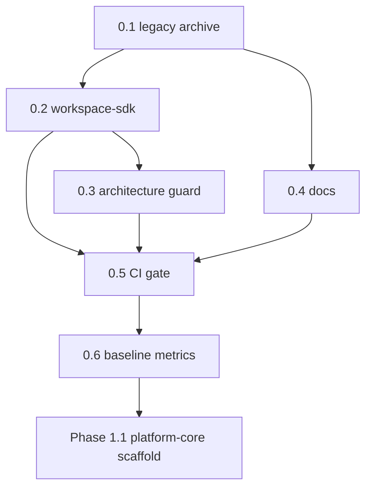

# Phase 0 — State machine & DAG

## STATE MODEL

```yaml
state_variables:
  current_phase:
    type: enum
    allowed: ["0", "1", "2", "3", "4", "5", "6", "7"]
    initial: "0"
  current_subphase:
    type: enum
    allowed: ["0.1", "0.2", "0.3", "0.4", "0.5", "0.6", "DONE"]
    initial: "0.1"
  phase_0_mode:
    type: enum
    allowed: ["integration_foundation"]
    value: "integration_foundation"
    meaning: "Phase 0 is Integration Foundation, NOT dependency-free contract freeze"
  execution_mode:
    type: enum
    allowed: ["subphase_sequential", "gate_verify"]
    initial: subphase_sequential
  completion_state:
    type: enum
    allowed: ["IN_PROGRESS", "DONE"]
    initial: IN_PROGRESS

transition_rules:
  - from_subphase: "0.1"
    to_subphase: "0.2"
    condition: ALL exit_criteria_0_1 PASS
  - from_subphase: "0.2"
    to_subphase: "0.3"
    condition: ALL exit_criteria_0_2 PASS
  - from_subphase: "0.1"
    to_subphase: "0.4"
    condition: ALL exit_criteria_0_1 PASS
    note: "0.4 MAY run parallel to 0.2–0.3 (docs only)"
  - from_subphase: "0.3"
    to_subphase: "0.5"
    condition: ALL exit_criteria_0_3 PASS AND exit_criteria_0_2 PASS
  - from_subphase: "0.4"
    to_subphase: "0.5"
    condition: ALL exit_criteria_0_4 PASS
  - from_subphase: "0.5"
    to_subphase: "0.6"
    condition: ALL exit_criteria_0_5 PASS
  - from_subphase: "0.6"
    to_subphase: "DONE"
    condition: ALL exit_criteria_0_6 PASS AND phase_1_entry_checklist ALL PASS
  - forbidden_transition:
      action: "start platform-core scaffold (Phase 1.1)"
      blocked_until: "current_subphase == DONE AND phase_1_entry_checklist ALL PASS"

forbidden_transitions:
  - action: import from legacy/ into packages/ or apps/
  - action: enforce g1 g2 g3 g5 guard IDs from stale §9.3
  - action: require test count ≥103 without test:phase-0 PASS
  - action: run only phase-0:foundation-gate for full phase-0 closure

blocked_states:
  - state: current_subphase < 0.6 AND action implement platform-core feature
  - state: EC-01-1-strict FAIL AND agent treats as closure blocker without EC-01-1-integration PASS

failure_states:
  - trigger: pnpm run test:phase-0 exit non-zero
  - trigger: pnpm run phase-0:integration-gate exit non-zero
  - trigger: any required g4 g4b g7 check false in phase-0-guard report
  - trigger: g6_runtime_deps_honesty false when integration scope runs
```

---

## SUBPHASE DAG



```yaml
dag_edges:
  - { from: "0.1", to: "0.2" }
  - { from: "0.2", to: "0.3" }
  - { from: "0.1", to: "0.4" }
  - { from: "0.2", to: "0.5" }
  - { from: "0.3", to: "0.5" }
  - { from: "0.4", to: "0.5" }
  - { from: "0.5", to: "0.6" }
  - { from: "0.6", to: "Phase 1.1" }
allowed_overlap:
  - parallel: ["0.4", "0.2"]
  - parallel: ["0.4", "0.3"]
  - constraint: "0.4 changes MUST NOT touch protected packages without docs-first covenant"
forbidden_overlap:
  - action: "implement platform-core before 0.6 PASS"
  - action: "merge platform-core feature work before baseline:metrics PASS"
pr_rule:
  - rule: "one subphase = one PR"
  - rule: "PR title/body MUST include label matching subphase id e.g. Phase: 0.2"
  - rule: "FORBIDDEN fast-forward multiple subphases in one merge (L-5)"
```

---

