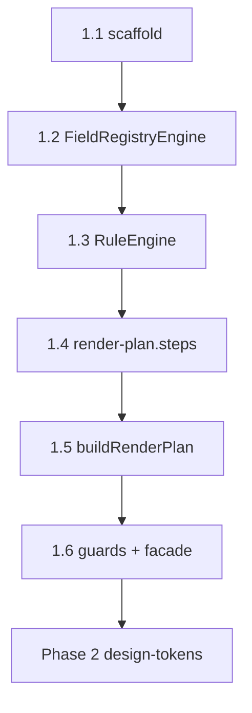

# AI-EXECUTION DOCUMENT — Phase 1 Platform Core

```yaml
document_meta:
  source_file: docs/phase-1-platform-core.md
  canonical_markdoc: docs/phase-1-platform-core.mdoc
  transformation_version: "2026-06-03"
  execution_priority: REPO_SCRIPTS_OVER_STALE_MD_WHERE_DOC_DRIFT
  doc_revision: "2026-06-03-df-066-086"
```

---

## STEP 1 — PHASE DETECTION (COMPLETE)

```yaml
phase_id: "1"
phase_name: "Platform Core (Schema-Driven Engine)"
north_star: "Platform logic = generic · ZERO workspace imports"
document_status_claim: "Engine + tests + gate green; MAP §14.1 architect sign-off may remain human"
document_closure_claim: "Phase 1 technical DoD met; next = Phase 2 design-tokens"
prerequisite_phase: "0"
prerequisite_gate: "pnpm run phase-0:gate — ALL exit criteria PASS"
legacy_truth: "legacy platform-core MISSING — wizard was Denali-direct"
subphases:
  - id: "1.1"
    name: "Scaffold @app-tour/platform-core"
    pr_label: "Phase: 1.1"
    max_lines_approx: 200
    ci_scope: build
    depends_on: ["phase_0_DONE"]
  - id: "1.2"
    name: "FieldRegistryEngine"
    pr_label: "Phase: 1.2"
    max_lines_approx: 400
    ci_scope: build + test
    depends_on: ["1.1"]
  - id: "1.3"
    name: "RuleEngine + RuleEngineScope + RuleCellIndex"
    pr_label: "Phase: 1.3"
    max_lines_approx: 400
    ci_scope: build + test
    depends_on: ["1.2"]
  - id: "1.4"
    name: "Step ordering — render-plan.steps (NOT StepEngine class)"
    pr_label: "Phase: 1.4"
    max_lines_approx: 300
    ci_scope: build + test
    depends_on: ["1.3"]
    note: "Subphase 1.4 implements plain functions in render-plan.steps.ts — forbidden to introduce StepEngine class"
  - id: "1.5"
    name: "Renderer headless — buildRenderPlan"
    pr_label: "Phase: 1.5"
    max_lines_approx: 500
    ci_scope: build + test
    depends_on: ["1.4"]
  - id: "1.6"
    name: "Guardrails + PlatformWizardEngine facade"
    pr_label: "Phase: 1.6"
    max_lines_approx: 300
    ci_scope: build + test + phase-1:guard
    depends_on: ["1.5"]
phase_detection_blocker: null
```

---

## STATE MODEL

```yaml
state_variables:
  current_phase:
    type: enum
    allowed: ["0", "1", "2", "3", "4", "5", "6", "7"]
    initial: "1"
  current_subphase:
    type: enum
    allowed: ["1.1", "1.2", "1.3", "1.4", "1.5", "1.6", "DONE"]
    initial: "1.1"
  phase_1_mode:
    type: enum
    allowed: ["headless_engine"]
    value: "headless_engine"
    meaning: "No React/DOM in platform-core; RenderPlan only"

transition_rules:
  - from_subphase: "1.1"
    to_subphase: "1.2"
    condition: ALL exit_criteria_1_1 PASS
  - from_subphase: "1.2"
    to_subphase: "1.3"
    condition: ALL exit_criteria_1_2 PASS
  - from_subphase: "1.3"
    to_subphase: "1.4"
    condition: ALL exit_criteria_1_3 PASS
  - from_subphase: "1.4"
    to_subphase: "1.5"
    condition: ALL exit_criteria_1_4 PASS
    enforcement_note: "1.4 deliverable MUST be render-plan.steps functions — NOT StepEngine class"
  - from_subphase: "1.5"
    to_subphase: "1.6"
    condition: ALL exit_criteria_1_5 PASS
  - from_subphase: "1.6"
    to_subphase: "DONE"
    condition: ALL exit_criteria_1_6 PASS AND phase_2_entry_checklist ALL PASS
  - forbidden_transition:
      action: "start packages/design-tokens feature work"
      blocked_until: "current_subphase == DONE AND phase_2_entry_checklist ALL PASS"
  - forbidden_transition:
      action: "use PlatformWizardEngine.fromPlugin"
      blocked_always: true
      replacement: "PlatformWizardEngine.tryFromPlugin OR PlatformWizardEngine.create + tryInit/init"
```

---

## SUBPHASE DAG



```yaml
dag_edges:
  - { from: "1.1", to: "1.2" }
  - { from: "1.2", to: "1.3" }
  - { from: "1.3", to: "1.4" }
  - { from: "1.4", to: "1.5" }
  - { from: "1.5", to: "1.6" }
  - { from: "1.6", to: "Phase 2.1" }
allowed_overlap: []
forbidden_overlap:
  - action: "merge subphases 1.2–1.5 in one PR (anti-pattern A9)"
  - action: "implement apps/api or apps/web as Phase 1 scope"
  - action: "import packages/workspaces/* from platform-core"
pr_rule:
  - rule: "one subphase = one PR"
  - rule: "PR title/body MUST include label matching subphase id e.g. Phase: 1.3"
  - rule: "FORBIDDEN fast-forward multiple subphases in one merge"
subphase_1_4_naming_law:
  correct_artifact: "packages/platform-core/src/engine/render-plan.steps.ts"
  correct_tests: "packages/platform-core/test/unit/engine/step.engine.spec.ts"
  forbidden_artifact: "step.engine.ts class StepEngine in src/"
  dag_label_P14: "render-plan.steps — NOT StepEngine class"
```

---

## FORENSIC TRUTH — ENFORCEABLE CONSTRAINTS (§9.4)

```yaml
forensic_truth_rules:
  - id: FT-P1-01
    claim: "Headless platform — no theme in engine"
    repo: "buildRuntime uses includeTheme:false; theme SDK codes → PLUGIN_INVALID_SHAPE at boundary"
    enforcement: "phase-1.contract headless-plugin-ingress + adversarial-plugin-ingress"
    guard_ids: [g11_phase1_contract_behaviors, g10_adversarial_specs_execute]
  - id: FT-P1-02
    claim: "Fail-fast fromPlugin"
    repo: "fromPlugin REMOVED — use create + init OR tryFromPlugin"
    enforcement: "no-fromPlugin-api contract; rg fromPlugin in src/ → 0"
    guard_ids: [g11_phase1_contract_behaviors]
    forbidden_api: "PlatformWizardEngine.fromPlugin"
  - id: FT-P1-03
    claim: "Test count ≥ 132 proves full behavioral closure"
    repo: "g2 count floor only; g11 + g12 prove behaviors"
    enforcement: "g2_platform_core_test_count + g11 + g12"
    guard_ids: [g2_platform_core_test_count, g11_phase1_contract_behaviors, g12_facade_integration_spec]
  - id: FT-P1-04
    claim: "plugin.validation hooks at platform runtime"
    repo: "platform-core does NOT invoke plugin.validation in Phase 1"
    status: DEFERRED Phase 3+ API
  - id: FT-P1-05
    claim: "Public RuleEngine / internal engines on barrel"
    repo: "index.ts exports PlatformWizardEngine facade only"
    enforcement: "single-facade-export + no-test-policy-export contracts"
    guard_ids: [g11_phase1_contract_behaviors]
  - id: FT-P1-06
    claim: "unwrapPlatformResult on barrel"
    repo: "NOT exported — apps use tryFromPlugin + PlatformResult"
    enforcement: phase-1.contract.spec.ts
    guard_ids: [g11_phase1_contract_behaviors]
  - id: FT-P1-07
    claim: "Sticky initError on failed bootstrap"
    repo: "REMOVED — tryInit re-attempts; tryFromPlugin eager"
    enforcement: cold-start.contract.spec.ts
  - id: FT-P1-08
    claim: "Single facade package.json export"
    repo: 'exports["."] only; "./*": null'
    enforcement: single-facade-export contract
    guard_ids: [g11_phase1_contract_behaviors]
  - id: FT-P1-09
    claim: "forceCellId production-safe"
    repo: "Only via createPlatformWizardEngineForTests scope policy — NOT public RuleContext"
    enforcement: phase-1.contract + rule.engine tests
  - id: FT-P1-10
    claim: "IngressSanitizationError → platform codes"
    repo: "ingress-sanitization-map.ts → SANITIZE_* PlatformCoreErrorCode"
    enforcement: adversarial + contract tests
  - id: FT-P1-11
    claim: "Facade test share g13"
    repo: "PHASE_1_FACADE_TEST_RATIO_MIN = 0.6 on closure specs excl test/unit/**"
    enforcement: g13_facade_test_ratio
    guard_ids: [g13_facade_test_ratio]
    stale_doc_warning: "mdoc §4.6 lists conflicting 30% package policy — REPO uses 60% closure ratio"
  - id: FT-P1-12
    claim: "Subphase 1.4 = StepEngine class"
    repo: "render-plan.steps plain functions only — step.engine.ts removed from src/"
    enforcement: file layout §3.4 + subphase_1_4_naming_law
  - id: FT-P1-13
    claim: "MAP §14.1 architect sign-off"
    repo: "Human checkbox may remain open while technical gate green"
    status: OPEN_HUMAN unless reports/phase-1-closure-readiness signed
```

---

## SECTION 1 — WHY PHASE 1 IS CRITICAL (§1)

```yaml
legacy_wrong_order:
  - "SDK contract → API adapter delegates ALL to legacy strategy"
  - "web still DenaliFieldRenderer + denali in features/tours"
  - "platform-core: MISSING"

app_tour_correct_order:
  - "SDK (phase 0) → platform-core engines (phase 1)"
  - "design-tokens (phase 2) → starter plugin + apps (phase 3)"
  - "denali plugin port (phase 6)"

phase_1_output_package: "@app-tour/platform-core"
inputs:
  - WorkspacePlugin from SDK
  - CanonicalDocument
  - context dimensions + tenantId
outputs:
  - resolved fields via FieldRegistryEngine
  - effective rules via RuleEngine + RuleEngineScope
  - active steps via render-plan.steps
  - RenderPlan headless via buildRenderPlan
constraints:
  - no React in phase 1
  - no Denali — tests use starter fixture only
  - no workspace package imports

enterprise_layers:
  schema_contract: WorkspacePlugin in SDK
  registry_rules: FieldRegistryEngine RuleEngine RuleEngineScope RuleCellIndex
  step_ordering: "render-plan.steps — listStepIds getStepVisibility listActiveSteps"
  render_plan: buildRenderPlan in render-plan.ts

fail_fast_bootstrap:
  eager: "PlatformWizardEngine.tryFromPlugin(plugin)"
  lazy: "PlatformWizardEngine.create(plugin) then tryInit/init or first buildRenderPlan"
  forbidden: "PlatformWizardEngine.fromPlugin"
  no_sticky_init_error: true

facade_only_consumption:
  apps_rule: "ONLY PlatformWizardEngine from @app-tour/platform-core barrel"
  test_exception: "direct engine construction in test/**/*.spec.ts — internal policy only"
```

---

## SECTION 2 — NEGATIVE REQUIREMENTS — ANTI-PATTERNS A1–A10 (§2)

```yaml
anti_patterns_pre_pr_check_ALL_must_be_false:
  - id: A1
    pattern: "Denali import in platform-core"
    detect: 'rg -i denali packages/platform-core -g "!**/*.spec.ts"'
    expect: 0 lines
    guard: g3_no_denali_tokens
    action: revert
  - id: A2
    pattern: "Import packages/workspaces/*"
    detect: pnpm run guard:architecture
    rule: platform-core-no-workspaces
    action: revert
  - id: A3
    pattern: "Import legacy/"
    detect: pnpm run guard:architecture
    rule: no-legacy-imports
    action: revert
  - id: A4
    pattern: "React/DOM in platform-core"
    detect: 'rg react packages/platform-core'
    guard: g4_no_react_imports
    action: "move to ui-primitives phase 2+"
  - id: A5
    pattern: "if (workspaceType === 'denali')"
    detect: code review
    enforcement: none in depcruise
    action: "policy in plugin not core"
  - id: A6
    pattern: "copy DenaliFieldRenderer"
    detect: path/name grep + A1
    action: "widget in workspace phase 6"
  - id: A7
    pattern: "dual state form + canonical"
    detect: architecture
    action: "immutable canonical ingress; scope LRU per §3.3"
  - id: A8
    pattern: "engine test with denali-domain fixture"
    detect: import path review
    required_fixture: test/fixtures/starter.fixture.ts
    forbidden: denali.fixture in platform-core
  - id: A9
    pattern: "oversized PR 1.2–1.5 combined"
    detect: "diff > ~800 lines"
    action: split per subphase DAG
  - id: A10
    pattern: "merge without green CI"
    detect: phase-1-gate.yml
    command: pnpm run phase-1:gate
    action: block merge

additional_depcruise_rules:
  - name: platform-core-only-sdk
    meaning: "platform-core may depend only on workspace-sdk and config"
  - name: platform-core-no-apps
    meaning: "platform-core must not import apps/*"
  - name: platform-core-no-workspace-starter-plugin
    meaning: "production src must not import starter plugin paths"
    contract: no-starter-plugin in PHASE_1_CLOSURE_CONTRACTS
```

---

## SECTION 3 — PLATFORM-CORE DEFINITION (§3)

### 3.1 Module responsibilities

```yaml
modules:
  FieldRegistryEngine:
    file: packages/platform-core/src/engine/field-registry.engine.ts
    responsibility: "lookup field by id/path; list by step"
    not: "Denali validation business"
  RuleEngine:
    files:
      - packages/platform-core/src/engine/rule.engine.ts
      - packages/platform-core/src/engine/rule-cell-index.ts
      - packages/platform-core/src/engine/rule-engine.scope.ts
      - packages/platform-core/src/engine/rule-resolution.ts
    responsibility: "resolve cell; merge overrides"
    not: "API persist"
  render_plan_steps:
    file: packages/platform-core/src/engine/render-plan.steps.ts
    type: "plain functions — NOT a StepEngine class"
    apis: [listStepIds, getStepVisibility, listActiveSteps]
    consumes: RuleEngineScope
    not: "Next.js routing"
  buildRenderPlan:
    file: packages/platform-core/src/engine/render-plan.ts
    responsibility: "headless plan kind + path + props hints"
    not: JSX
  PlatformWizardEngine:
    file: packages/platform-core/src/engine/platform-wizard.engine.ts
    responsibility: "facade orchestrating above"
    not: HTTP
  validateCanonical:
    file: packages/platform-core/src/engine/validate-canonical-document.ts
    ingress: parseCanonicalDocumentFromStorage via SDK
```

### 3.2 Allowed dependencies

```yaml
import_law_phase_1:
  allowed:
    - "@app-tour/workspace-sdk"
    - "@app-tour/config dev/tsconfig only"
  forbidden:
    - packages/workspaces/*
    - legacy/*
    - apps/*
    - react react-dom
    - "@app-tour/design-tokens"
    - "@app-tour/ui-primitives"
  phase_2_plus_note: "design-tokens types/CSS names only — never workspace imports"
```

### 3.3 Computational model

```yaml
computational_rules:
  no_document_mutation:
    rule: "CanonicalDocument and WorkspacePlugin ingress clones are deep-frozen"
    meaning: "resolution does not write caller-owned data"
  instance_scope_cache:
    rule: "RuleEngine LRU scopeCacheByTenant + RuleEngineScope memo mutate engine instance"
    safe_when: "every call passes tenantId + dimensions in RuleContext"
    forbidden: "RuleEngine as global singleton across tenants without RuleContext"
  pure_resolution_per_call:
    rule: "Same frozen inputs + RuleContext → deterministic resolveCellId / buildRenderPlan"
  facade_session_state:
    create: "clones plugin immediately via parseWorkspacePluginFromStorage includeTheme:false"
    runtime: "field/rule engines on first tryInit or plan/validate"
    one_engine_per_tenant_session: true
  immutable_outputs: "readonly arrays/objects in API surface"
  no_io: "DB HTTP filesystem forbidden in platform-core"
```

### 3.4 Folder structure (repo truth)

```yaml
required_tree:
  - packages/platform-core/package.json
  - packages/platform-core/tsconfig.json
  - packages/platform-core/src/index.ts
  - packages/platform-core/src/contracts/canonical-field-validation-contract.ts
  - packages/platform-core/src/engine/platform-wizard.engine.ts
  - packages/platform-core/src/engine/field-registry.engine.ts
  - packages/platform-core/src/engine/rule.engine.ts
  - packages/platform-core/src/engine/rule-engine.scope.ts
  - packages/platform-core/src/engine/rule-cell-index.ts
  - packages/platform-core/src/engine/rule-resolution.ts
  - packages/platform-core/src/engine/render-plan.steps.ts
  - packages/platform-core/src/engine/render-plan.ts
  - packages/platform-core/src/engine/validate-canonical-document.ts
  - packages/platform-core/src/types/
  - packages/platform-core/src/errors/
  - packages/platform-core/src/utils/canonical-path.ts
  - packages/platform-core/src/utils/canonical-value*.ts
  - packages/platform-core/test/fixtures/starter.fixture.ts
  - packages/platform-core/test/phase-1.contract.spec.ts
  - packages/platform-core/test/facade-integration.spec.ts
  - packages/platform-core/test/unit/engine/*.spec.ts

forbidden_under_src:
  - __fixtures__/
  - field-resolution.ts
  - step.engine.ts
  - render-plan.builder.ts
  - StepEngine class
```

### 3.5 Engine API bindings

```yaml
FieldRegistryEngine_api:
  static_tryCreate: "tryCreate(registry) → PlatformResult"
  static_create: "create(registry) → throws on duplicate"
  getById: "O(1) Map lookup"
  listByStep: "frozen per-step arrays at bootstrap"
  tryAssertKnownFieldIds: "UNKNOWN_FIELD_ID on orphan override"
  min_tests: 7
  spec: packages/platform-core/test/unit/engine/field-registry.engine.spec.ts

RuleEngine_api:
  RuleContext_public:
    tenantId: string required
    dimensions: Readonly<Record<string, string>>
  forceCellId: "ONLY RuleContextResolution + test factory — NOT public RuleContext"
  createScope: "→ RuleEngineScope cached per tenant+dimensions"
  resolveCellId: "scope.resolveCellId()"
  resolveEffectiveField: "scope.resolveEffectiveField(fieldId)"
  EffectiveFieldState: [fieldId, entry, hidden, required]
  min_tests: 33
  specs:
    - packages/platform-core/test/unit/engine/rule.engine.spec.ts
    - packages/platform-core/test/unit/engine/rule-cell-index.spec.ts
    - packages/platform-core/test/rule-engine-concurrency.spec.ts

render_plan_steps_api:
  listStepIds: "(wizard, fieldEngine) → readonly string[]"
  getStepVisibility: "(wizard, fieldEngine, stepId, scope) → StepVisibility"
  listActiveSteps: "(wizard, fieldEngine, scope) → readonly string[]"
  StepVisibility_enum: [active, hidden, empty]
  min_tests: 6
  spec: packages/platform-core/test/unit/engine/step.engine.spec.ts
  not: "StepEngine class"

buildRenderPlan_api:
  signature: "buildRenderPlan(wizard, fieldEngine, ruleEngine, context, options?) → readonly RenderStepPlan[]"
  RenderFieldPlan: [fieldId, kind, canonicalPath, required, hidden, stepId, uiHints?]
  composite_kind: 'uiHints.compositeId — no widget resolve in phase 1'
  min_tests: 7
  spec: packages/platform-core/test/unit/engine/render-plan.spec.ts
```

---

## SUBPHASE 1.1 — SCAFFOLD (§4.1)

```yaml
subphase: "1.1"
goal: "Create @app-tour/platform-core package with depcruise rules and zero denali"

tasks_ordered:
  - id: T-1.1-01
    action: "packages/platform-core/package.json name @app-tour/platform-core"
  - id: T-1.1-02
    action: "tsconfig.json extends @app-tour/config"
  - id: T-1.1-03
    action: "dependency @app-tour/workspace-sdk workspace:*"
  - id: T-1.1-04
    action: "root package.json build chain includes platform-core"
  - id: T-1.1-05
    action: "src/index.ts export PLATFORM_CORE_VERSION = 1 placeholder then facade"
  - id: T-1.1-06
    action: 'test script NODE_ENV=test node --import tsx --test "test/**/*.spec.ts" — specs ONLY under test/'

depcruise_rules_to_add:
  - name: platform-core-no-workspaces
    from: "^packages/platform-core"
    to: "^packages/workspaces"
    severity: error
  - name: platform-core-only-sdk
    from: "^packages/platform-core"
    to: "^packages/(?!workspace-sdk|config)"
    severity: error

exit_criteria_1_1:
  - id: EC-11-1
    command: pnpm --filter @app-tour/platform-core build
    expect: exit 0
  - id: EC-11-2
    command: pnpm run guard:architecture
    expect: "platform-core-no-workspaces and platform-core-only-sdk present"
  - id: EC-11-3
    command: 'rg -i denali packages/platform-core -g "!**/*.spec.ts"'
    expect: 0 lines
    guard_when_in_phase_1_guard: g3_no_denali_tokens
```

---

## SUBPHASE 1.2 — FIELD REGISTRY ENGINE (§4.2)

```yaml
subphase: "1.2"
goal: "FieldRegistryEngine with Map indexes and starter fixture"

class_api:
  constructor: "private — use tryCreate/create"
  methods:
    - getById
    - listByStep
    - listAll
    - tryAssertKnownFieldIds
    - assertKnownFieldIds

behavior_contracts:
  tryCreate_duplicate_id: DUPLICATE_FIELD_ID
  tryCreate_cardinality: "fields.length > MAX_ALLOWED_REGISTRY_FIELDS → REGISTRY_CARDINALITY_VIOLATION"
  getById: "Map O(1)"
  listByStep: "frozen arrays at bootstrap"
  tryAssertKnownFieldIds: "UNKNOWN_FIELD_ID on unknown override fieldId"

required_tests_minimum_6_actual_7:
  - getById found
  - getById not found
  - listByStep filters correctly
  - tryAssertKnownFieldIds orphan override
  - empty registry edge
  - duplicate id tryCreate fails
  - cardinality REGISTRY_CARDINALITY_VIOLATION

fixture:
  path: packages/platform-core/test/fixtures/starter.fixture.ts
  exports: [createTestStarterPlugin, createFreshStarterPlugin]
  rule: "per-call factory — not SDK singleton"

exit_criteria_1_2:
  - id: EC-12-1
    check: "class + tests ≥ 6"
    actual: 7
  - id: EC-12-2
    check: "starter fixture at test/fixtures/starter.fixture.ts"
```

---

## SUBPHASE 1.3 — RULE ENGINE (§4.3)

```yaml
subphase: "1.3"
goal: "RuleEngine + RuleEngineScope + cell resolution algorithm"

RuleEngine_api:
  static_tryCreate: "ruleSet + fieldEngine + optional scopePolicy"
  createScope: "RuleContext | RuleContextResolution → RuleEngineScope"

resolve_cell_algorithm rule-resolution.ts:
  steps:
    - "if forceCellId test policy only → cell must exist else INVALID_RULE_SET"
    - "else cells where ALL cell.dimensions keys match context.dimensions"
    - "if multiple match same specificity/priority → AMBIGUOUS_RULE_RESOLUTION — NO lexicographic fallback"
    - "else highest matched key count → higher priority → one winner"
    - "bootstrap: >1 cell dimensions:{} without distinct priority → INVALID_RULE_SET"
    - "none → defaultCellId must exist in cells"
  dimension_note: "extra keys in context.dimensions OK; matrix keys missing in context → no match → default"

merge_overrides:
  base: registry entry required
  override: cell.fieldOverrides
  effective_required: "override.required ?? base.required"
  effective_hidden: "override.hidden ?? false"

required_tests_minimum_8_actual_33:
  - default cell no dimension match
  - exact dimension match
  - override required true/false
  - hidden suppresses in listEffectiveFields
  - unknown override fieldId throw
  - multiple cells deterministic pick
  - empty dimensions
  - starter plugin ruleSet integration

fixture_dimension_names:
  forbidden_in_production_tests: "Denali-specific dimension names"
  required: 'variant: "default" in fixtures'

exit_criteria_1_3:
  - id: EC-13-1
    check: "RuleEngine + tests ≥ 8"
    actual: 33
  - id: EC-13-2
    check: "no Denali dimension names in production tests"
```

---

## SUBPHASE 1.4 — STEP ORDERING render-plan.steps (§4.4)

```yaml
subphase: "1.4"
goal: "Plain functions for step ordering — NOT StepEngine class"
critical_naming:
  implement: render-plan.steps.ts functions
  forbidden: "class StepEngine in src/"
  dag_mermaid_label_correction: "P14 = render-plan.steps not step_engine class"

functions:
  listStepIds:
    inputs: [WorkspaceWizardSurface, FieldRegistryEngine]
    output: readonly string[]
  getStepVisibility:
    inputs: [wizard, fieldEngine, stepId, RuleEngineScope]
    output: "active | hidden | empty"
  listActiveSteps:
    inputs: [wizard, fieldEngine, RuleEngineScope]
    output: readonly string[]

visibility_semantics:
  hidden: "all fields hidden"
  empty: "visible but zero non-hidden fields"
  active: "at least one visible field"

ordering_logic:
  steps_source: "union fieldRegistry.entry.stepId + wizard.roots"
  order: "wizard.roots order first, then steps without root in registry discovery order"
  listStepIds_implementation: "single discovery pass; emit wizard.roots ∩ union then discoveryOrder \\ roots (no sort/partition buffers) — landed render-plan.steps.ts RP-1"
  inactiveFieldGroups: "groupSlug in array → all fields with groupSlug hidden before cell overrides"
  wizardCapacityStepRedundant: "phase 1 parse-only; optional uiHints in plan metadata"

required_tests_minimum_5_actual_6:
  - listStepIds order stable
  - step hidden when all fields hidden
  - inactiveFieldGroups hides step
  - wizard.roots step with no fields → empty
  - starter plugin integration

exit_criteria_1_4:
  - id: EC-14-1
    check: "render-plan.steps + tests ≥ 5"
    actual: 6
    spec: packages/platform-core/test/unit/engine/step.engine.spec.ts
  - id: EC-14-2
    check: "NO StepEngine class file under src/engine/"
    verify: "test ! -f packages/platform-core/src/engine/step.engine.ts"
```

---

## SUBPHASE 1.5 — RENDERER HEADLESS (§4.5)

```yaml
subphase: "1.5"
goal: "buildRenderPlan produces RenderPlan not JSX"

philosophy: "Phase 1 RenderPlan — Phase 3 maps to ui-primitives"

types:
  RenderFieldPlan: [fieldId, kind, canonicalPath, required, hidden, stepId, uiHints?]
  RenderStepPlan: [stepId, fields]
  uiHints: "generic strings only for ui-primitives phase 2-3"

buildRenderPlan:
  context_type: RuleContextResolution
  apps_pass: RuleContext
  tests_may_add: forceCellId internally via test factory only

composite_slot:
  kind: composite
  plan_includes: uiHints.compositeId
  widget_resolve: "workspace plugin phase 6 — NOT platform-core"

required_tests_minimum_6_actual_7:
  - build full plan starter
  - hidden fields excluded
  - composite kind preserved
  - empty step policy documented in code
  - canonical path every row
  - snapshot JSON plan stable

exit_criteria_1_5:
  - id: EC-15-1
    check: "buildRenderPlan + tests ≥ 6"
    actual: 7
  - id: EC-15-2
    command: 'rg react packages/platform-core'
    expect: 0
    guard: g4_no_react_imports
```

---

## SUBPHASE 1.6 — GUARDRAILS + FACADE (§4.6)

```yaml
subphase: "1.6"
goal: "PlatformWizardEngine facade + phase-1-guard + phase-1:gate + CI workflow"

PlatformWizardEngine_api:
  forbidden_static: fromPlugin
  allowed_static:
    - "create(plugin, options?) — lazy init"
    - "tryFromPlugin(plugin, options?) — eager init PlatformResult"
  instance_methods:
    - isInitialized
    - tryInit
    - init
    - tryBuildRenderPlan
    - buildRenderPlan
    - validateCanonical
  forbidden_public_getters:
    - getFieldEngine
    - getRuleEngine
    - getStepEngine

ValidationResult:
  ok: boolean
  violations: [{ code, fieldId?, message }]

bootstrap_validation_chain:
  step_1: "create/tryFromPlugin → parseWorkspacePluginFromStorage(plugin, { includeTheme: false })"
  step_2: "tryInit → tryValidateWorkspacePluginForPlatform"
  step_3: "FieldRegistryEngine.tryCreate + RuleEngine.tryCreate"
  errors:
    PLUGIN_INVALID_SHAPE: SDK ingress
    DUPLICATE_FIELD_ID: duplicate fieldRegistry.fields[].id
    INVALID_RULE_SET: defaultCellId not in cells; bad cell.dimensions keys
    UNKNOWN_FIELD_ID: fieldOverrides reference unknown field
    wizard_roots_empty_step: allowed

validateCanonical_phase_1:
  ingress: parseCanonicalDocumentFromStorage
  visible_required_nonempty: REQUIRED_FIELD_EMPTY UNKNOWN_CANONICAL_PATH kind mismatch
  HIDDEN_FIELD_POISON_REM_016: "hidden non-composite with data in canonical.data → violation"
  deferred: "plugin.validation hooks — phase 3 API"
  not_exported_barrel: unwrapPlatformResult

package_exports_policy:
  public_entry: '"." only in package.json exports'
  subpaths: '"./*": null'
  consumer_rule: "apps import ONLY PlatformWizardEngine + exported types from barrel"
  internal_tests: "relative ../src/ or createPlatformWizardEngineForTests"

exit_criteria_1_6:
  - id: EC-16-1
    check: PlatformWizardEngine facade + bootstrap + validateCanonical tests
  - id: EC-16-2
    check: phase-1-guard.mjs exists scripts/guards/phase-1-guard.mjs
  - id: EC-16-3
    check: phase-1:gate in root package.json — REPO chain includes test:phase-1
  - id: EC-16-4
    check: .github/workflows/phase-1-gate.yml runs pnpm run phase-1:gate
  - id: EC-16-5
    check: cumulative platform-core tests ≥ 132
```

---

## API SURFACE — PlatformWizardEngine (§5)

```yaml
error_model_layers:
  bootstrap_ingress: PlatformResult via tryFromPlugin tryInit tryCreate
  field_validation: ValidationResult via validateCanonical
  facade_throw: "init() and buildRenderPlan() throw PlatformCoreError — NOT exported unwrapPlatformResult"

usage_example_phase_3_shape:
  import_plugin: 'createStarterWorkspacePlugin from @app-tour/workspace-sdk/plugin'
  import_engine: 'PlatformWizardEngine from @app-tour/platform-core'
  bootstrap: |
    const loaded = PlatformWizardEngine.tryFromPlugin(createStarterWorkspacePlugin(preset));
    if (!loaded.ok) throw loaded.error;
    const engine = loaded.value;
  context:
    tenantId: required — missing → INVALID_RULE_CONTEXT
    dimensions: { variant: "default" }
  output: engine.buildRenderPlan(context)

lazy_alternative:
  flow: "PlatformWizardEngine.create(plugin) → tryInit() or first buildRenderPlan"
  init_failure: NOT sticky — tryInit may re-attempt

isolation_rules:
  one_engine_per_tenant_session: true
  LRU_keyed_by: tenantId + dimensions
  no_cross_tenant: "missing/blank tenantId → INVALID_RULE_CONTEXT"
  concurrent_api: "safe with distinct tenantId per request — rule-engine-concurrency.spec.ts"
  plugin_alias: "create() deep-clones immediately includeTheme:false"

consumer_law_apps:
  allowed_import: "@app-tour/platform-core → PlatformWizardEngine + exported types only"
  forbidden_import:
    - FieldRegistryEngine direct
    - RuleEngine direct
    - render-plan.steps direct from apps
    - "@app-tour/platform-core/engine/..."
```

---

## TEST MATRIX (§6)

```yaml
exit_criteria_test_floor_doc: "≥ 30 historical PR plan"
exit_criteria_test_floor_gate: 132
source_threshold_file: scripts/guards/gate-thresholds.mjs

test_registry:
  - module: FieldRegistryEngine
    spec: test/unit/engine/field-registry.engine.spec.ts
    cases: 7
  - module: RuleEngine
    spec: test/unit/engine/rule.engine.spec.ts
    cases: 25
  - module: RuleCellIndex
    spec: test/unit/engine/rule-cell-index.spec.ts
    cases: 4
  - module: Rule concurrency
    spec: test/rule-engine-concurrency.spec.ts
    cases: 4
    gate: g10_adversarial_specs_execute
  - module: render-plan.steps
    spec: test/unit/engine/step.engine.spec.ts
    cases: 6
  - module: buildRenderPlan
    spec: test/unit/engine/render-plan.spec.ts
    cases: 7
  - module: Phase 1 contract
    spec: test/phase-1.contract.spec.ts
    command: pnpm --filter @app-tour/platform-core run test:phase-1
    cases: 17
    guard: g11_phase1_contract_behaviors
    min_behavior_rows: 14
  - module: Facade integration
    spec: test/facade-integration.spec.ts
    cases: 5
    guard: g12_facade_integration_spec
  - module: PlatformWizardEngine
    spec: test/unit/engine/platform-wizard.engine.spec.ts
    cases: 15
  - module: canonical-path utils
    spec: test/unit/utils/canonical-path.spec.ts
    cases: 7
  - module: canonical-value utils
    spec: test/unit/utils/canonical-value.spec.ts
    cases: 7
  - module: Adversarial validation
    spec: test/adversarial-validation.spec.ts
    gate: g10
  - module: Runtime isolation
    spec: test/runtime-isolation.spec.ts
    gate: g10
  - module: Cold start
    spec: test/cold-start.contract.spec.ts
    cases: 6
  - module: Total
    command: pnpm --filter @app-tour/platform-core test
    cases: 132

minimum_matrix_historical:
  FieldRegistryEngine: { min: 6, actual: 7 }
  RuleEngine: { min: 8, actual: 33 }
  render-plan.steps: { min: 5, actual: 6 }
  buildRenderPlan: { min: 6, actual: 7 }
  Facade: { min: 5, actual: 15 }

fixture_policy:
  path: test/fixtures/starter.fixture.ts
  factories: [createTestStarterPlugin, createFreshStarterPlugin]
  forbidden_production: import @app-tour/workspace-sdk/src/reference
  phase_6_note: denali.fixture only in workspace package tests

test_runner:
  full: 'NODE_ENV=test node --import tsx --test — pnpm --filter @app-tour/platform-core test'
  closure: pnpm --filter @app-tour/platform-core run test:closure
  unit_internal: pnpm --filter @app-tour/platform-core run test:unit:internal
  contract_only: pnpm --filter @app-tour/platform-core run test:phase-1

closure_suite_files:
  - test/purity-side-effects.spec.ts
  - test/facade-integration.spec.ts
  - test/cold-start.contract.spec.ts
  - test/runtime-isolation.spec.ts
  - test/phase-1.contract.spec.ts
  - test/adversarial-validation.spec.ts
  - test/rule-engine-concurrency.spec.ts
  - test/adversarial-plugin-ingress.spec.ts
```

---

## PHASE_1_CLOSURE_CONTRACTS (14 rows — repo truth)

```yaml
closure_contracts_source: packages/platform-core/test/phase-1.contract.spec.ts
PHASE_1_MIN_BEHAVIOR_CONTRACTS: 14
contracts:
  - id: import-purity
    title: "platform-core entry does not load CASL or SDK theme/auth"
    specRel: test/phase-1.contract.spec.ts
    guardIds: [g11_phase1_contract_behaviors]
  - id: no-starter-plugin
    title: "production src must not import workspace starter plugin (depcruise)"
    specRel: test/phase-1.contract.spec.ts
    guardIds: [g11_phase1_contract_behaviors]
  - id: no-spec-under-src
    title: "unit specs live under test/ not src/"
    specRel: test/phase-1.contract.spec.ts
    guardIds: [g11_phase1_contract_behaviors]
  - id: headless-plugin-ingress
    title: "buildRuntime uses includeTheme:false"
    specRel: test/phase-1.contract.spec.ts
    guardIds: [g11_phase1_contract_behaviors]
  - id: sdk-subpath-imports
    title: "production and tests use SDK subpaths only"
    specRel: test/phase-1.contract.spec.ts
    guardIds: [g11_phase1_contract_behaviors]
  - id: no-fromPlugin-api
    title: "removed deprecated PlatformWizardEngine.fromPlugin"
    specRel: test/phase-1.contract.spec.ts
    guardIds: [g11_phase1_contract_behaviors]
    forbidden: PlatformWizardEngine.fromPlugin
    required: [tryFromPlugin, create]
  - id: no-test-policy-export
    title: "index.ts does not export RuleEngineScopePolicy"
    specRel: test/phase-1.contract.spec.ts
    guardIds: [g11_phase1_contract_behaviors]
  - id: starter-fixture-location
    title: "starter fixture only under test/fixtures"
    specRel: test/phase-1.contract.spec.ts
    guardIds: [g11_phase1_contract_behaviors]
  - id: dist-import-purity
    title: "dist/index.js does not load CASL or SDK theme/auth"
    specRel: test/phase-1.contract.spec.ts
    guardIds: [g11_phase1_contract_behaviors]
  - id: field-validation-contract
    title: "canonical-field-validation-contract module exists"
    specRel: src/contracts/canonical-field-validation-contract.ts
    guardIds: [g11_phase1_contract_behaviors]
    behavioral_2026_06_03: "passesHiddenFieldKindGate delegates to isEmptyCanonicalValue; hidden composite values skip HIDDEN_FIELD_POISON; inactiveFieldGroups skip document validation"
  - id: adversarial-plugin-ingress
    title: "headless ingress skips invalid theme at platform init"
    specRel: test/adversarial-plugin-ingress.spec.ts
    guardIds: [g10_adversarial_specs_execute]
  - id: single-facade-export
    title: "package.json exports only root facade (no subpath wildcards)"
    specRel: test/phase-1.contract.spec.ts
    guardIds: [g11_phase1_contract_behaviors]
  - id: facade-integration-gate
    title: "facade-integration.spec.ts gates public PlatformWizardEngine API"
    specRel: test/facade-integration.spec.ts
    guardIds: [g12_facade_integration_spec]
  - id: fresh-starter-fixture
    title: "createFreshStarterPlugin alias uses per-call factory (no singleton)"
    specRel: test/fixtures/starter.fixture.ts
    guardIds: [g11_phase1_contract_behaviors]
enforcement_assertion: "PHASE_1_CLOSURE_CONTRACTS.length === 14 && every guardIds.length > 0"
```

---

## CI AND GUARD PHASE 1 (§7)

### Gate thresholds (single source of truth)

```yaml
thresholds_file: scripts/guards/gate-thresholds.mjs
PLATFORM_CORE_TEST_MIN_phase1: 132
PLATFORM_CORE_CLOSURE_TEST_MIN_phase1: 50
WORKSPACE_SDK_TEST_MIN_phase1: 39
PHASE_1_FACADE_TEST_RATIO_MIN: 0.6
PHASE_1_MIN_BEHAVIOR_CONTRACTS_g11: 14
```

### phase-1:gate — CANONICAL CHAIN (package.json REPO TRUTH)

```yaml
phase_1_gate:
  name: pnpm run phase-1:gate
  source: package.json line phase-1:gate
  steps_ordered:
    - step: 1
      run: pnpm build
      includes: "@app-tour/platform-core dist via root build chain"
    - step: 2
      run: pnpm test
      includes: "workspace-sdk + platform-core test:closure + test:unit:internal + other packages"
    - step: 3
      run: pnpm --filter @app-tour/platform-core run test:phase-1
      validates: "phase-1.contract.spec.ts behavioral rows ≥ 14"
      note: "REQUIRED in repo — omitted in stale mdoc §4.6 JSON snippet"
    - step: 4
      run: pnpm run guard:architecture
      guard_id: g5_depcruise_architecture
    - step: 5
      run: pnpm run guard:import-boundary
      guard_id: g6_import_boundary
    - step: 6
      run: pnpm run guard:symlink
      guard_id: g8_symlink_guard
    - step: 7
      run: pnpm run phase-1:guard
      expands_to: node scripts/guards/phase-1-guard.mjs

phase_1_guard_script: scripts/guards/phase-1-guard.mjs
phase_1_guard_alias: pnpm run phase-1:guard
report_outputs:
  - reports/phase-1-guard-YYYY-MM-DD.json
  - reports/phase-1-guard-YYYY-MM-DD.md
report_fields: [generatedAt, gitSha, phase, checks, exit16]
```

### phase-1-guard checks (execution order in main())

```yaml
phase_1_guard_checks:
  - id: g1_platform_core_dist
    description: packages/platform-core/dist/index.js exists
    prerequisite: pnpm build
  - id: g2b_workspace_sdk_test_count
    threshold: "≥ 39"
    command: pnpm --filter @app-tour/workspace-sdk run test
  - id: g2_platform_core_test_count
    threshold: "≥ 132"
    command: pnpm --filter @app-tour/platform-core run test
    note: "closure + unit:internal combined"
  - id: g2c_platform_core_closure_test_count
    threshold: "≥ 50"
    command: pnpm --filter @app-tour/platform-core run test:closure
    excludes: test/unit/**
  - id: g2d_unit_internal_tests
    command: pnpm --filter @app-tour/platform-core run test:unit:internal
    note: "required true in guard — non-gating package policy wording in mdoc"
  - id: g11_phase1_contract_behaviors
    threshold: "≥ 14 behavioral rows"
    command: pnpm --filter @app-tour/platform-core run test:phase-1
    spec: packages/platform-core/test/phase-1.contract.spec.ts
  - id: g12_facade_integration_spec
    command: "pnpm --filter @app-tour/platform-core exec node --test test/facade-integration.spec.ts"
    required_output_strings:
      - "tryFromPlugin → buildRenderPlan matches starter golden snapshot"
      - CANONICAL_TYPE_MISMATCH
  - id: g13_facade_test_ratio
    threshold: "≥ 60% (0.6)"
    scope: "closure specs excl test/unit/**"
    implementation: scripts/guards/lib/facade-test-ratio.mjs
    signal: "PlatformWizardEngine|loadPlatformWizard in spec files"
  - id: g10_adversarial_specs_execute
    command: pnpm run test:adversarial
    specs:
      - packages/workspace-sdk/test/adversarial-canonical-ingress.spec.ts
      - packages/workspace-sdk/test/storage-ingress-immutability.spec.ts
      - packages/platform-core/test/adversarial-validation.spec.ts
      - packages/platform-core/test/adversarial-plugin-ingress.spec.ts
      - packages/platform-core/test/rule-engine-concurrency.spec.ts
      - packages/platform-core/test/runtime-isolation.spec.ts
  - id: g3_no_denali_tokens
    command: 'rg -i denali packages/platform-core -g "!**/*.spec.ts"'
    expect: 0
  - id: g4_no_react_imports
    command: rg react react-dom on packages/platform-core
    expect: 0
  - id: g5_depcruise_architecture
    command: pnpm run guard:architecture
  - id: g6_import_boundary
    command: pnpm run guard:import-boundary
  - id: g8_symlink_guard
    command: pnpm run guard:symlink

guard_ids_binding_summary: [g1, g2b, g2, g2c, g2d, g11, g12, g13, g10, g3, g4, g5, g6, g8]
```

### GitHub workflow

```yaml
workflow_file: .github/workflows/phase-1-gate.yml
triggers: [push branches main, pull_request]
node: "24 from .nvmrc"
steps:
  - checkout
  - pnpm/action-setup@v4
  - actions/setup-node@v4 cache pnpm
  - node scripts/guards/check-node-engine.mjs
  - pnpm install --frozen-lockfile
  - pnpm run phase-1:gate
  - upload artifact reports/phase-1-guard-*.json

gate_order_relative:
  - "phase-0:gate always green on main"
  - "Phase 1 PRs 1.1–1.5: build + test per subphase"
  - "From PR 1.6+: phase-1:gate required"

pr_policy:
  title_body_label: "Phase: 1.x"
  one_subphase_per_pr: true
  merge_blocked_when:
    - phase-1-guard red
    - any anti-pattern A1–A10 true
```

### Pre-commit delta

```yaml
ci_integrity:
  script: scripts/ci-integrity-check.sh
  sequence:
    - check-node-engine
    - pnpm run phase-0:gate
    - pnpm run guard:symlink
    - node scripts/guards/phase-1-guard.mjs
  note: "pre-commit runs phase-1-guard but NOT full phase-1:gate — PR 1.6+ MUST run phase-1:gate locally and in CI"
```

---

## FORBIDDEN ACTIONS (§8)

```yaml
forbidden_actions:
  - forbidden: apps/api
    correct_phase: "3"
  - forbidden: apps/web
    correct_phase: "3"
  - forbidden: packages/design-tokens
    correct_phase: "2"
  - forbidden: packages/workspaces/*
    correct_phase: "3+"
  - forbidden: React components in platform-core
    correct_phase: "2–3 ui-primitives"
  - forbidden: Denali port
    correct_phase: "6"
  - forbidden: DB migrations
    correct_phase: "5"
  - forbidden: WorkspaceThemeContract in platform-core
    correct_phase: "2.2 — SDK + theme-react"
  - forbidden: copy legacy DenaliFieldRenderer
    correct_phase: "6"
  - forbidden: HTTP / Nest in platform-core
    correct_phase: "3"
  - forbidden: PlatformWizardEngine.fromPlugin
    correct_api: "tryFromPlugin OR create + tryInit"
    enforcement: no-fromPlugin-api contract + FT-P1-02
  - forbidden: class StepEngine in src/
    correct_artifact: render-plan.steps functions
    subphase: "1.4"
  - forbidden: getFieldEngine getRuleEngine getStepEngine on public facade
  - forbidden: "@app-tour/platform-core/engine/* subpath imports from apps"
  - forbidden: import packages/workspaces/* from platform-core
    enforcement: [A2, g5]
  - forbidden: import legacy/
    enforcement: [A3, g5]
  - forbidden: dual state form + canonical
    rule: A7
  - forbidden: modify platform-core without docs-first Markdoc per .cursorrules
```

---

## DEFINITION OF DONE — PHASE 1 (§9)

```yaml
dod_delivered_verified:
  - "@app-tour/platform-core in root pnpm build chain"
  - "platform-core tests 132 pass — gate-thresholds.mjs"
  - "PlatformWizardEngine.create / tryFromPlugin / tryInit with starter plugin"
  - "rg -i denali packages/platform-core excl specs → 0 — g3"
  - "depcruise platform-core-no-workspaces platform-core-only-sdk no-legacy-imports"
  - "CI phase-1-gate.yml → pnpm run phase-1:gate"
  - "reports/phase-1-guard-*.json on gate run"
  - "engine only in packages/platform-core — apps phase 3"

dod_closure_covenant_MAP_14_1:
  - "phase-1-platform-core.mdoc DF remediated guard:doc-sync green"
  - "brutal audit maturity 95/100 technical — reports/phase-1-brutal-audit"
  - "pnpm run phase-1:guard green g1-g6 g8 g10-g13"
  - open_human: "MAP §14.1 architect sign-off — reports/phase-1-closure-readiness-2026-06-03.md"

phase_1_complete_when_ALL:
  - current_subphase: DONE
  - pnpm run phase-1:gate: exit 0
  - all_phase_1_guard_checks: PASS
  - PHASE_1_CLOSURE_CONTRACTS: 14 rows each with guardIds
  - anti_patterns_A1_A10: all false
  - forbidden_actions: none violated
  - PlatformWizardEngine.fromPlugin: absent in production src
```

---

## PHASE 2 ENTRY CHECKLIST (§10)

```yaml
phase_2_entry_checklist:
  all_must_pass: true
  items:
    - id: P2E-01
      condition: "pnpm run phase-1:gate exit 0"
      verify: pnpm run phase-1:gate
    - id: P2E-02
      condition: "platform-core tests ≥ 132"
      verify: "g2_platform_core_test_count PASS"
    - id: P2E-03
      condition: "g11 ≥ 14 contract behaviors"
      verify: pnpm --filter @app-tour/platform-core run test:phase-1
    - id: P2E-04
      condition: "g13 facade ratio ≥ 60%"
      verify: "reports/phase-1-guard g13_facade_test_ratio PASS"
    - id: P2E-05
      condition: "no denali no react in platform-core"
      verify: [g3_no_denali_tokens, g4_no_react_imports]
    - id: P2E-06
      condition: "RenderPlan headless exists — buildRenderPlan"
      verify: test/unit/engine/render-plan.spec.ts green
    - id: P2E-07
      condition: "WorkspaceThemeContract in SDK shipped for phase 2 consumers"
      verify: packages/workspace-sdk/src/theme/ exists
    - id: P2E-08
      condition: "docs phase-2-design-system.mdoc exists"
      verify: test -f docs/phase-2-design-system.mdoc
    - id: P2E-09
      condition: "did NOT start design-tokens implementation during phase 1 subphases"
      verify: "process review — forbidden §8"

on_all_pass:
  next_document: docs/phase-2-design-system.mdoc
  next_section: "Phase 2.1 packages/design-tokens"
  pipeline_note: |
    Phase 1: RenderPlan headless kind + path
    Phase 2: tokens visual semantics
    Phase 3: ui-primitives consume plan + tokens
    Phase 6: denali widgets as composite resolvers in plugin
```

---

## MIGRATION-MAP BRIDGE §6–§10 (§11) — OUT OF SCOPE FOR PHASE 1

```yaml
deferred_not_implemented_phase_1:
  - map_section: 6
    topic: "Event bus + outbox"
    phase_1_role: "validateCanonical pure — emit in API phase 3-5"
  - map_section: 8
    topic: "contractVersion + migrate"
    phase_1_role: "pass-through fieldRegistry.version ruleSet.version only"
  - map_section: 10
    topic: "Observability PlatformLogger"
    phase_1_role: "no structured logging in platform-core barrel"

versioning_note: "breaking change policy MAP §8 — phase 2+ enforcement"
schema_generator_legacy: "denaliTourCreateBaseSchema.generated.ts — phase 3+ workspace or API NOT platform-core"
```

---

## APPENDIX EXECUTION BINDINGS (§13 A–F)

### Appendix A — Standard platform-core error codes

```yaml
error_codes_excerpt:
  source: packages/platform-core/src/errors/platform-core.error.ts
  codes_include:
    - UNKNOWN_FIELD_ID
    - DUPLICATE_FIELD_ID
    - INVALID_RULE_SET
    - HIDDEN_FIELD_POISON
    - UNKNOWN_CANONICAL_PATH
    - REQUIRED_FIELD_EMPTY
    - REGISTRY_CARDINALITY_VIOLATION
    - AMBIGUOUS_RULE_RESOLUTION
    - INVALID_RULE_CONTEXT
    - PLUGIN_INVALID_SHAPE
    - CANONICAL_TYPE_MISMATCH
  ingress_mapping: packages/platform-core/src/errors/ingress-sanitization-map.ts
```

### Appendix B — canonical-path / canonical-value (internal)

```yaml
internal_utils_not_on_barrel:
  canonical_path:
    file: packages/platform-core/src/utils/canonical-path.ts
    fn: getCanonicalValue(data, path)
  canonical_value:
    file: packages/platform-core/src/utils/canonical-value.ts
    fns: [isEmptyCanonicalValue, assertCanonicalValueMatchesKind]
  consumers: [validateCanonical, test/unit/utils/*.spec.ts]
  rule: "NEVER export from index.ts"
```

### Appendix C — Verification commands

```bash
nvm use && corepack enable
pnpm install
pnpm --filter @app-tour/platform-core build
pnpm --filter @app-tour/platform-core test
pnpm --filter @app-tour/platform-core run test:phase-1
pnpm run phase-1:gate
pnpm run guard:architecture
pnpm run guard:import-boundary
pnpm run guard:symlink
rg -i denali packages/platform-core -g '!**/*.spec.ts'
rg react packages/platform-core
```

### Appendix D — legacy Phase 3 renderer vs app-tour Phase 1

```yaml
legacy_phase_3:
  GenericFieldRenderer: React
app_tour_phase_1:
  buildRenderPlan: headless
  React: phase 3
  denali_migration: phase 6 last
  ESLint_no_input_in_wizard: phase 3 when apps/web exists
```

### Appendix E — PR template snippet

```markdown
Phase: 1.x

## Sub-phase exit (phase-1-platform-core.mdoc §4.x)
- [ ] …

## Anti-pattern check (§2)
- [ ] A1–A10 reviewed

## Tests added: N (cumulative: M/132 gate floor)

## Facade API
- [ ] No fromPlugin — tryFromPlugin/create only

## Step module
- [ ] 1.4 uses render-plan.steps — NOT StepEngine class
```

### Appendix F — Denali phase 6 platform-core unchanged

```yaml
phase_6_denali_rule:
  platform_core_changes: NONE
  denali_plugin_provides:
    - large fieldRegistry
    - kind composite + uiHints.compositeId denali.*
    - compositeRegistry.get from plugin export in web bootstrap
  architectural_dod: "If phase 6 requires platform-core PR, phases 1-5 failed"
```

---

## AGENT EXECUTION ALGORITHM

```yaml
algorithm:
  1: "VERIFY phase_0 DONE — pnpm run phase-0:gate exit 0"
  2: "SET current_subphase from repo by running exit_criteria checks 1.1→1.6"
  3: "IF modifying packages/platform-core OR apps/api THEN update docs/phase-1-platform-core.mdoc FIRST per Zero-Debt Covenant"
  4: "EXECUTE only tasks for current_subphase; 1.4 MUST deliver render-plan.steps NOT StepEngine class"
  5: "FORBIDDEN PlatformWizardEngine.fromPlugin — use tryFromPlugin or create+tryInit"
  6: "AFTER subphase 1.6 OR any platform-core change RUN pnpm run phase-1:gate"
  7: "BIND guards to g1 g2b g2 g2c g2d g11 g12 g13 g10 g3 g4 g5 g6 g8 — never stale g6=report-write from .md"
  8: "IF all phase_2_entry_checklist PASS SET current_subphase DONE"
  9: "APPEND: Architect, documentation status: [Updated/Not Needed]. Link to docs: [URL]"
```

---

## DOC_DRIFT REGISTER (SOURCE MD/Mdoc vs REPO)

```yaml
doc_drift:
  - id: DRIFT-01
    source: "mdoc §4.6 root scripts phase-1:gate JSON omits test:phase-1 step"
    repo: 'package.json phase-1:gate includes pnpm --filter @app-tour/platform-core run test:phase-1 before guards'
    resolution: "Execute package.json chain in CI_PIPELINE section — not mdoc JSON block alone"
  - id: DRIFT-02
    source: "docs/phase-1-platform-core.md §4.6 maps g6 to write reports/phase-1-guard"
    repo: "g6_import_boundary = pnpm run guard:import-boundary in phase-1-guard.mjs"
    resolution: "Use guard ID table in phase_1_guard_checks — g6 is import-boundary AST"
  - id: DRIFT-03
    source: "mdoc §4.6 / §9.4 g13 lists ≥30% package policy AND ≥60% closure in adjacent rows"
    repo: "gate-thresholds.mjs PHASE_1_FACADE_TEST_RATIO_MIN = 0.6 enforced by g13 on closure specs"
    resolution: "Enforce 60% (0.6) closure ratio — ignore 30% row for gate execution"
  - id: DRIFT-04
    source: "DAG mermaid P14 label 1.4_step_engine / historical StepEngine naming"
    repo: "render-plan.steps.ts plain functions; step.engine.ts removed from src/"
    resolution: "Subphase 1.4 deliverable = render-plan.steps NOT StepEngine class"
  - id: DRIFT-05
    source: "mdoc §5 / legacy docs PlatformWizardEngine.fromPlugin fail-fast"
    repo: "fromPlugin removed — tryFromPlugin eager; create lazy"
    resolution: "FORBIDDEN fromPlugin — contract no-fromPlugin-api"
  - id: DRIFT-06
    source: "docs/phase-1-platform-core.md stale gate chain and lower test floors"
    repo: "canonical phase-1-platform-core.mdoc + package.json + gate-thresholds.mjs"
    resolution: "REPO_SCRIPTS_OVER_STALE_MD — prefer .mdoc and this ai-exec"
```

---

## COMPLETION CHECKLIST (PHASE 1 FULL)

```yaml
phase_1_complete_when_ALL:
  - subphase_1_1: ALL EC-11-* PASS
  - subphase_1_2: ALL EC-12-* PASS
  - subphase_1_3: ALL EC-13-* PASS
  - subphase_1_4: ALL EC-14-* PASS AND no StepEngine class in src
  - subphase_1_5: ALL EC-15-* PASS
  - subphase_1_6: ALL EC-16-* PASS
  - phase_1_gate: pnpm run phase-1:gate exit 0
  - phase_1_guard: all g1 g2b g2 g2c g2d g11 g12 g13 g10 g3 g4 g5 g6 g8 PASS
  - thresholds:
      platform_core: "≥ 132"
      closure: "≥ 50"
      workspace_sdk: "≥ 39"
      g11_contracts: "≥ 14"
      g13_ratio: "≥ 0.6"
  - PHASE_1_CLOSURE_CONTRACTS: 14 ids listed
  - anti_patterns_A1_A10: all false
  - forbidden_actions_§8: none violated
  - fromPlugin: absent
  - phase_2_entry_checklist: ALL PASS
  - doc_sync: "if protected code touched — phase-1-platform-core.mdoc updated first"
```

---

## FAIL CONDITIONS

```yaml
fail_assessment:
  phase_identification: PASS
  subphase_detection: PASS
  guard_binding: PASS when using package.json + phase-1-guard.mjs + gate-thresholds.mjs
  actionable_steps: PASS with DOC_DRIFT register DRIFT-01 through DRIFT-06

hard_fail_triggers:
  - condition: "Agent runs mdoc §4.6 phase-1:gate JSON without test:phase-1"
    result: FAIL — misses g11 enforcement path in gate chain
  - condition: "Agent implements StepEngine class for subphase 1.4"
    result: FAIL — violates DRIFT-04 and subphase_1_4_naming_law
  - condition: "Agent adds PlatformWizardEngine.fromPlugin"
    result: FAIL — violates DRIFT-05 and no-fromPlugin-api contract
  - condition: "Agent treats g2 ≥132 as sole proof of behavioral closure without g11/g12"
    result: FAIL — violates FT-P1-03
  - condition: "Agent enforces g13 at 30% instead of 0.6"
    result: FAIL — violates DRIFT-03 and gate-thresholds.mjs
  - condition: "platform-core imports packages/workspaces/* or legacy/"
    result: FAIL — A2 A3 g5
  - condition: "merge without pnpm run phase-1:gate green"
    result: FAIL — A10
  - condition: "Agent uses stale phase-1-platform-core.md gate definition only"
    result: FAIL — DRIFT-06

conditional_pass:
  - "MAP §14.1 architect sign-off human checkbox open while technical gate green"
  - "Remote phase-1-gate.yml not verified after push unless offline-only task"

verdict: "PASS for AI execution when bound to repo scripts; FAIL if any hard_fail_triggers fire"
```

---

**END AI-EXECUTION DOCUMENT**
