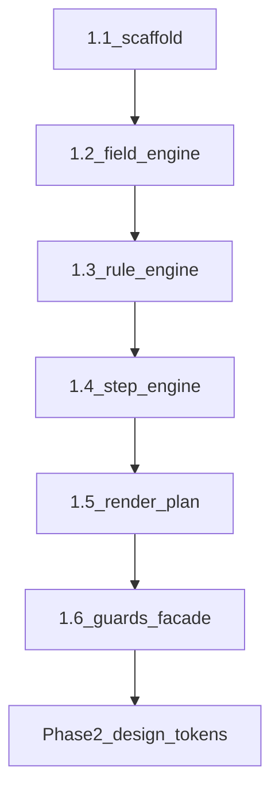

# Phase 1 — Platform Core (Schema-Driven Engine)

> **⚠️ Legacy mirror — do not edit for Phase 1 truth.**  
> **Canonical source:** [`phase-1-platform-core.mdoc`](phase-1-platform-core.mdoc) only · Docs-as-Code §19 · `pnpm run guard:doc-sync`  
> **AI-execution (agents):** [`phase-1-platform-core.ai-exec.md`](phase-1-platform-core.ai-exec.md) · [`phase-1/phase-1.ai-exec.index.md`](phase-1/phase-1.ai-exec.index.md) · hub [`phase-1/README.md`](phase-1/README.md)  
> This `.md` file is retained for link compatibility; counts, gates, and API shapes may be stale.  
> **Integrity report:** [`audits/phase-1-documentation-integrity-2026-06-03.mdoc`](audits/phase-1-documentation-integrity-2026-06-03.mdoc) · **Gate:** `pnpm run phase-1:gate` · guard floors **148** / **56** closure (`gate-thresholds.mjs`) · g11–g13

### Key facts (synced 2026-06-04 — read `.mdoc` for full spec; floors = `scripts/guards/gate-thresholds.mjs`)

| Item | Value |
|------|--------|
| Tests | **≥148** full suite · **≥56** closure (`gate-thresholds.mjs`) · **14** behavior contracts (`test:phase-1`) |
| Public API | `PlatformWizardEngine` only (`exports["."]` only) |
| Ingress | `includeTheme: false` at platform init |
| Open | MAP §14.1 **architect sign-off** → [`phase-1-closure-readiness-2026-06-03.md`](../reports/phase-1-closure-readiness-2026-06-03.md) |

**app-tour — راهنمای اجرایی کامل فاز یک** *(legacy body below may be stale)*

> **نقش:** بسط عمیق فاز ۱ در [`MIGRATION-MAP.md`](MIGRATION-MAP.md)  
> **پیش‌نیاز:** [`phase-0-foundation.md`](phase-0-foundation.md) — همه exit criteria ✅  
> **North Star:** Platform logic = generic · **ZERO** workspace imports  
> **مرجع شکست legacy:** platform-core در legacy **هرگز ساخته نشد** — ویزارد مستقیم Denali بود  
> **آخرین بازبینی body:** 2026-06-02 — **canonical facts:** [`phase-1-platform-core.mdoc`](phase-1-platform-core.mdoc) (2026-06-03)

---

## فهرست

1. [چرا فاز ۱ حیاتی است](#1-چرا-فاز-۱-حیاتی-است)
2. [اشتباهات legacy — checklist منفی](#2-اشتباهات-legacy--checklist-منفی)
3. [تعریف platform-core](#3-تعریف-platform-core)
4. [DAG زیرفازهای 1.1–1.6](#4-dag-زیرفازهای-11۱۶)
5. [زیرفاز 1.1 — Scaffold](#41-زیرفاز-11--scaffold)
6. [زیرفاز 1.2 — FieldRegistryEngine](#42-زیرفاز-12--fieldregistryengine)
7. [زیرفاز 1.3 — RuleEngine](#43-زیرفاز-13--ruleengine)
8. [زیرفاز 1.4 — StepEngine](#44-زیرفاز-14--stepengine)
9. [زیرفاز 1.5 — Renderer (headless)](#45-زیرفاز-15--renderer-headless)
10. [زیرفاز 1.6 — Guardrails + integration facade](#46-زیرفاز-16--guardrails--integration-facade)
11. [API surface — `PlatformWizardEngine`](#5-api-surface--platformwizardengine)
12. [تست‌ها — ماتریس الزام](#6-تست‌ها--ماتریس-الزام)
13. [CI و guard فاز ۱](#7-ci-و-guard-فاز-۱)
14. [آنچه در فاز ۱ ممنوع است](#8-آنچه-در-فاز-۱-ممنوع-است)
15. [Definition of Done فاز ۱](#9-definition-of-done-فاز-۱)
16. [پل به فاز ۲ (design-tokens)](#10-پل-به-فاز-۲-design-tokens)
17. [پل به MIGRATION-MAP §6–§10](#11-پل-به-migration-map-۶۱۰)
18. [پیوست‌ها](#12-پیوست‌ها)

---

## 1. چرا فاز ۱ حیاتی است

### 1.1 شکست legacy در یک جمله

legacy فاز ۱ = **SDK روی monolith** · app-tour فاز ۱ = **engine که UI/API فقط از آن تغذیه می‌شوند**.

```text
legacy (wrong order):
  SDK contract → API adapter delegates ALL to legacy strategy
  → web still DenaliFieldRenderer + 6300 lines denali in features/tours
  → platform-core: MISSING

app-tour (correct order):
  SDK (phase 0) → platform-core engines (phase 1)
  → design-tokens (phase 2) → starter plugin + apps (phase 3)
  → denali plugin port (phase 6)
```

### 1.2 خروجی فاز ۱

پکیج `@app-tour/platform-core` که:

- ورودی: `WorkspacePlugin` (از SDK) + `CanonicalDocument` + context (dimensions)
- خروجی: resolved fields، effective rules، active steps، **render plan** (headless)
- **بدون React** در فاز ۱ — UI در فاز ۲–۳
- **بدون Denali** — تست فقط با fixture registry

### 1.3 الگوی enterprise — سه لایه decoupled

فاز ۱ عمداً از الگوی رایج **schema-driven form engines** (Formitiva، Schepta، schema-form) پیروی می‌کند:

| لایه | app-tour فاز ۱ | لایه بعد |
|------|----------------|----------|
| **Schema / contract** | `WorkspacePlugin` در SDK | workspace packages |
| **Registry + rules engine** | `FieldRegistryEngine` · `RuleEngine` · `StepEngine` | platform-core |
| **Render plan (headless)** | `RenderPlanBuilder` | ui-primitives فاز ۲–۳ |

**اصول enterprise که فاز ۱ رعایت می‌کند:**

- **Framework-agnostic core** — بدون React/DOM؛ همان engine در API (Node) و web قابل reuse
- **Plugin isolation** — core فقط `WorkspacePlugin` می‌بیند؛ widget/validation/theme در plugin
- **Deterministic resolution** — cell/step ordering ثابت؛ تست snapshot-friendly
- **Fail-fast bootstrap** — `fromPlugin()` قبل از runtime، consistency registry/rules را validate می‌کند
- **Facade-only consumption** — apps مستقیم engine داخلی نمی‌سازند ([§5](#5-api-surface--platformwizardengine))

**نگاشت Stripe / JSON Forms (مرجع industry):**

- Data schema = `WorkspaceFieldRegistry` + `WorkspaceRuleSet` (مثل Stripe `custom_input.schema.json`)
- UI layout = `RenderPlan` headless → فاز ۳ renderer registry (مثل JSON Forms UI schema)
- Dynamic visibility = `RuleEngine` + `StepEngine` on `RuleContext` (مثل Stripe `getFormState`)
- Runtime input = `CanonicalDocument` per entity (مثل workflow custom input per run)

---

## 2. اشتباهات legacy — checklist منفی

قبل از هر PR فاز ۱، این موارد باید **false** باشند:

| # | Anti-pattern | تشخیص | اقدام |
|---|--------------|--------|--------|
| A1 | Denali import در platform-core | `rg -i denali packages/platform-core` | revert |
| A2 | Import از `packages/workspaces/*` | depcruise | revert |
| A3 | Import از `legacy/` | depcruise | revert |
| A4 | React/DOM در platform-core | `rg "react" packages/platform-core` | جدا → ui-primitives فاز ۲ |
| A5 | `if (workspaceType === 'denali')` | code review | policy در plugin |
| A6 | کپی `DenaliFieldRenderer` | path/name grep | widget در workspace فاز ۶ |
| A7 | dual state (form + canonical) | — | ممنوع تا فاز ۳ UI |
| A8 | engine test با denali-domain fixture | import path | از `starter` fixture استفاده |
| A9 | PR بزرگ 1.2–1.5 یکجا | diff > ~800 lines | split |
| A10 | merge بدون CI سبز | GitHub red | block |

---

## 3. تعریف platform-core

### 3.1 مسئولیت‌ها

| ماژول | مسئولیت | نیست |
|--------|---------|------|
| **FieldRegistryEngine** | lookup field by id/path؛ list by step | validation business Denali |
| **RuleEngine** | resolve cell؛ merge overrides | API persist |
| **StepEngine** | active steps؛ visibility | routing Next.js |
| **RenderPlanBuilder** | headless plan: kind + path + props hints | JSX |
| **PlatformWizardEngine** | facade orchestrating above | HTTP |

### 3.2 وابستگی مجاز

```text
@app-tour/platform-core (فاز ۱)
  → @app-tour/workspace-sdk ONLY
  → @app-tour/config (dev/tsconfig)

@app-tour/platform-core (فاز ۲+)
  → + @app-tour/design-tokens (types/CSS var names — نه import workspace)
```

> **Import law:** [`MIGRATION-MAP.md` §2](MIGRATION-MAP.md#قانون-import-ci-blocking) — `platform-core` فقط `workspace-sdk`؛ **↓ downstream-only** — هرگز `design-tokens` / `ui-primitives` (visual layer در فاز ۲+).

### 3.3 مدل محاسباتی

| قانون | معنی |
|-------|------|
| **Stateless engines** | هیچ engine state mutable نگه نمی‌دارد؛ `RuleContext` + `CanonicalDocument` ورودی هر call |
| **Pure resolution** | `resolveCellId` / `buildRenderPlan` side-effect ندارند |
| **Immutable outputs** | `readonly` arrays/objects در API surface |
| **No I/O** | DB، HTTP، filesystem ممنوع در platform-core |

### 3.4 ساختار پوشه هدف

```text
packages/platform-core/
├── package.json
├── tsconfig.json
└── src/
    ├── index.ts
    ├── engine/
    │   ├── platform-wizard.engine.ts      # facade
    │   ├── field-registry.engine.ts
    │   ├── rule.engine.ts
    │   ├── render-plan.steps.ts
    │   └── render-plan.builder.ts
    ├── types/
    │   ├── field-resolution.ts
    │   ├── rule-context.ts
    │   ├── step-state.ts
    │   └── render-plan.ts
    ├── utils/
    │   └── canonical-path.ts              # dot-path get/set — generic
    └── __fixtures__/
        └── starter.fixture.ts               # re-export starterWorkspacePlugin shapes
```

---

## 4. DAG زیرفازهای 1.1–1.6



| Sub | PR | حداکثر خط تقریبی | CI |
|-----|-----|------------------|-----|
| 1.1 | `Phase: 1.1` | 200 | build |
| 1.2 | `Phase: 1.2` | 400 | build + test |
| 1.3 | `Phase: 1.3` | 400 | build + test |
| 1.4 | `Phase: 1.4` | 300 | build + test |
| 1.5 | `Phase: 1.5` | 500 | build + test |
| 1.6 | `Phase: 1.6` | 300 | build + test + guard |

---

## 4.1. زیرفاز 1.1 — Scaffold

### کارها

1. `packages/platform-core/package.json` — name `@app-tour/platform-core`
2. `tsconfig.json` extends `../config/tsconfig.base.json` — devDependency `@app-tour/config`
3. dependency: `@app-tour/workspace-sdk: workspace:*`
4. root `package.json` — `build` chain includes platform-core
5. `src/index.ts` — `PLATFORM_CORE_VERSION = 1` (1.1); facade exports through **1.6**
6. test: `test` = `test:closure` + `test:unit:internal` — specs **only** under `test/` (not `src/`)

### dependency-cruiser (هم‌تراز `dependency-cruiser.config.js`)

```javascript
{
  name: "platform-core-no-workspaces",
  severity: "error",
  from: { path: "^packages/platform-core" },
  to: { path: "^packages/workspaces" },
},
{
  name: "platform-core-only-sdk",
  severity: "error",
  from: { path: "^packages/platform-core" },
  to: { path: "^packages/(?!workspace-sdk|config|platform-core)" },
},
```

### Exit criteria 1.1

- [ ] `pnpm --filter @app-tour/platform-core build`
- [ ] depcruise rules added
- [ ] `rg -i denali packages/platform-core` → 0

---

## 4.2. زیرفاز 1.2 — FieldRegistryEngine

هم‌تراز [`phase-1/subphases/1.2-field-registry.md`](phase-1/subphases/1.2-field-registry.md) و [`packages/platform-core/src/engine/field-registry.engine.ts`](../packages/platform-core/src/engine/field-registry.engine.ts).

### API (repo)

```typescript
export class FieldRegistryEngine {
  private constructor(registry: WorkspaceFieldRegistry);

  static tryCreate(registry: WorkspaceFieldRegistry): PlatformResult<FieldRegistryEngine>;
  static create(registry: WorkspaceFieldRegistry): FieldRegistryEngine;

  getById(fieldId: string): WorkspaceFieldRegistryEntry | undefined;
  listByStep(stepId: string): readonly WorkspaceFieldRegistryEntry[];
  listAll(): readonly WorkspaceFieldRegistryEntry[];
  tryAssertKnownFieldIds(fieldIds: readonly string[]): PlatformResult<void>;
  assertKnownFieldIds(fieldIds: readonly string[]): void;
}
```

**حذف‌شده از draft قدیمی:** `getByCanonicalPath`، constructor عمومی، O(n) scan — پیاده‌سازی از bootstrap با `Map` است.

### رفتار

| متد | قرارداد |
|-----|---------|
| `tryCreate` / `create` | duplicate `field.id` → `DUPLICATE_FIELD_ID`؛ `fields.length` > `MAX_ALLOWED_REGISTRY_FIELDS` → `REGISTRY_CARDINALITY_VIOLATION` |
| `getById` | `Map` — O(1) |
| `listByStep` | آرایه‌های frozen per-step در bootstrap |
| `tryAssertKnownFieldIds` / `assertKnownFieldIds` | unknown fieldId → `UNKNOWN_FIELD_ID` |

### تست‌ها

`test/unit/engine/field-registry.engine.spec.ts` — **9** case (شامل cardinality + `tryAssert`).

### Fixture

`test/fixtures/starter.fixture.ts` — `createTestStarterPlugin`, `createFreshStarterPlugin`, `testStarterFieldRegistry()` (factory per call).

### Exit criteria 1.2

- [x] class + tests ≥ 6
- [x] starter fixture at `test/fixtures/starter.fixture.ts`

---

## 4.3. زیرفاز 1.3 — RuleEngine

هم‌تراز [`phase-1/subphases/1.3-rule-engine.md`](phase-1/subphases/1.3-rule-engine.md) و سورس `packages/platform-core/src/engine/`.

### Rule context (public)

```typescript
export interface RuleContext {
  readonly tenantId: string;
  readonly dimensions: Readonly<Record<string, string>>;
}
```

`forceCellId` فقط روی `RuleContextResolution` + `RuleEngineScopePolicy.allowForceCellId` (تست) — **نه** روی `RuleContext` عمومی.

### API (repo)

`RuleEngine` — `tryCreate` / `create` / `createScope` → `RuleEngineScope` با `resolveCellId`, `resolveEffectiveField`, `listEffectiveFields`.

**حذف‌شده از draft قدیمی:** constructor عمومی، `resolveCellId` روی engine، fallback lexicographic، `listEffectiveFields(context)` روی engine.

### الگوریتم resolve cell

1. `forceCellId` (test policy) → cell باید exist؛ وگرنه `INVALID_RULE_SET`
2. match: همه کلیدهای `cell.dimensions` در context
3. tie همان specificity/priority → `AMBIGUOUS_RULE_RESOLUTION` (**بدون** lexicographic)
4. winner: بیشترین matched keys → priority بالاتر
5. bootstrap catch-all: `validateWorkspaceRuleSet` (SDK) → `INVALID_RULE_SET`
6. bootstrap: `defaultCellId` ∈ cells (`tryCreate`)
7. runtime: no match → `RULE_CONTEXT_UNMATCHED` (catch-all `{}` برای «پیش‌فرض»)

### merge overrides

```
base = registry entry (required)
override = cell.fieldOverrides for fieldId
effective.required = override.required ?? base.required
effective.hidden = override.hidden ?? false
```

### تست‌ها (حداقل 8)

1. default cell when no dimension match
2. exact dimension match
3. override required true/false
4. hidden suppresses field in listEffectiveFields
5. unknown override fieldId → throw at construction یا resolve
6. multiple cells — deterministic pick
7. empty dimensions
8. integration with starter plugin ruleSet

### Exit criteria 1.3

- [x] RuleEngine + tests ≥ 8 (**31** — `rule.engine` + `rule-cell-index` + `rule.engine.force-cell` specs)
- [x] `RuleEngineScope.listEffectiveFields` — `rule-engine.scope.ts`
- [x] no Denali dimension names in production tests — `variant: "default"` in fixtures

---

## 4.4. زیرفاز 1.4 — Step ordering (`render-plan.steps`)

هم‌تراز [`phase-1/subphases/1.4-render-plan-steps.md`](phase-1/subphases/1.4-render-plan-steps.md) — **توابع** در `render-plan.steps.ts`؛ **ممنوع:** `class StepEngine` در `src/`.

### API (repo)

`listStepIds`, `getStepVisibility`, `listActiveSteps` — ورودی `RuleEngineScope` (نه `RuleContext` مستقیم).

`StepVisibility`: `active` | `hidden` | `empty` — `empty` = صفر فیلد در registry برای آن step.

### منطق

- ترتیب: `wizard.roots` ∩ union سپس discovery بدون root (RP-1)
- `inactiveFieldGroups` → `field-visibility.ts` قبل از cell overrides
- `wizardCapacityStepRedundant`: parse-only فاز ۱

### تست‌ها

[`render-plan.steps.spec.ts`](../packages/platform-core/test/unit/engine/render-plan.steps.spec.ts) — **6** case.

### Exit criteria 1.4

- [x] `render-plan.steps` + tests ≥ 5
- [x] no `src/engine/step.engine.ts` (EC-14-2)

---

## 4.5. زیرفاز 1.5 — Renderer (headless)

هم‌تراز [`phase-1/subphases/1.5-renderer-headless.md`](phase-1/subphases/1.5-renderer-headless.md) — تابع `buildRenderPlan` در `render-plan.ts` (**نه** کلاس `RenderPlanBuilder`).

### API (repo)

انواع: [`types/render-plan.ts`](../packages/platform-core/src/types/render-plan.ts).  
سازنده: `buildRenderPlan(wizard, fieldEngine, ruleEngine, context, options?)` → `readonly RenderStepPlan[]`.

**سیاست empty step (در کد):** فقط stepهای **active** با `fields.length > 0` — step خالی/پنهان **حذف** می‌شوند (`render-plan.ts` JSDoc).

**`RenderStepPlan.uiHints`:** اختیاری؛ با `includeWorkspaceStepUiHints: true` و `wizardCapacityStepRedundant` روی wizard.

### composite

`kind: "composite"` → `uiHints: { compositeId: fieldId }` — بدون resolve widget (فاز ۶).

### تست‌ها

[`render-plan.spec.ts`](../packages/platform-core/test/unit/engine/render-plan.spec.ts) — **8** case (+ golden `starter-plan-golden.ts`).

### Exit criteria 1.5

- [x] `buildRenderPlan` + tests ≥ 6
- [x] `rg react packages/platform-core` → 0

---

## 4.6. زیرفاز 1.6 — Guardrails + integration facade

هم‌تراز [`phase-1/subphases/1.6-guardrails-facade.md`](phase-1/subphases/1.6-guardrails-facade.md) و [`phase-1/phase-1-guards.md`](phase-1/phase-1-guards.md).

### PlatformWizardEngine (repo)

- `static create` (lazy) · `static tryFromPlugin` (eager `PlatformResult`) — **بدون** `fromPlugin`
- `tryInit` / `init` · `tryBuildRenderPlan` / `buildRenderPlan` · `validateCanonical`
- **ممنوع:** `getFieldEngine` / `getRuleEngine` / `getStepEngine`
- barrel [`index.ts`](../packages/platform-core/src/index.ts): facade + types only (`exports["./*"]: null`)

### Bootstrap + validateCanonical

Ingress: `parseWorkspacePluginFromStorage({ includeTheme: false })` → `tryValidateWorkspacePluginForPlatform` → `FieldRegistryEngine` + `RuleEngine` tryCreate.

`validateCanonical`: SDK ingress + visible required + `HIDDEN_FIELD_POISON` (REM-016) — تست‌ها در [`platform-wizard.engine.spec.ts`](../packages/platform-core/test/unit/engine/platform-wizard.engine.spec.ts) + [`facade-integration.spec.ts`](../packages/platform-core/test/facade-integration.spec.ts).

### Gate

```json
"phase-1:gate": "pnpm build && pnpm test && pnpm --filter @app-tour/platform-core run test:phase-1 && guard:architecture && guard:import-boundary && guard:symlink && phase-1:guard"
```

CI: [`.github/workflows/phase-1-gate.yml`](../.github/workflows/phase-1-gate.yml) → `pnpm run phase-1:gate`.

Thresholds: [`gate-thresholds.mjs`](../scripts/guards/gate-thresholds.mjs) — platform-core **≥ 148**, closure **≥ 56**, contracts **≥ 14**.

### Exit criteria 1.6

- [x] facade + bootstrap + validateCanonical tests
- [x] `phase-1-guard.mjs` + `phase-1:gate`
- [x] `phase-1-gate.yml` workflow
- [x] `g2` floor ≥ 148 (guard green locally)

---

## 5. API surface — `PlatformWizardEngine`

### مثال استفاده (فاز ۳ API — طراحی از الان)

```typescript
import { starterWorkspacePlugin } from "@app-tour/workspace-sdk";
import { PlatformWizardEngine } from "@app-tour/platform-core";

const loaded = PlatformWizardEngine.tryFromPlugin(starterWorkspacePlugin);
if (!loaded.ok) throw loaded.error;
const engine = loaded.value;
const context = { tenantId: "tenant-a", dimensions: { variant: "default" } };
const plan = engine.buildRenderPlan(context);
// → web renderer consumes plan
```

**قانون:** apps **هرگز** مستقیم FieldRegistryEngine نسازند — فقط از facade.

---

## 6. تست‌ها — ماتریس الزام

| ماژول | min tests | فاز PR |
|--------|-----------|--------|
| FieldRegistryEngine | 6 | 1.2 |
| RuleEngine | 8 | 1.3 |
| StepEngine | 5 | 1.4 |
| RenderPlanBuilder | 6 | 1.5 |
| PlatformWizardEngine + validate + bootstrap | 5+ | 1.6 |
| **جمع** | **≥ 30** | 1.6 |

> bootstrap: duplicate field id، orphan override، invalid defaultCellId — حداقل ۳ test در 1.6

### fixture policy

- `__fixtures__/starter.fixture.ts` — re-export shapes from `starterWorkspacePlugin`
- **ممنوع** import `@app-tour/workspace-sdk/src/reference` in production code — only dev/test
- فاز ۶: fixture دوم `denali.fixture.ts` در **workspace package test** — نه در platform-core

### test runner

**نه** همان layoutِ `@app-tour/workspace-sdk` (`src/**/*.spec.ts`). از [`packages/platform-core/package.json`](../packages/platform-core/package.json):

```bash
pnpm --filter @app-tour/platform-core run test
pnpm --filter @app-tour/platform-core run test:closure
pnpm --filter @app-tour/platform-core run test:unit:internal
```

---

## 7. CI و guard فاز ۱

### 7.1 workflow (پس از 1.6)

```yaml
# .github/workflows/phase-1-gate.yml (یا گسترش phase-0-gate)
- uses: pnpm/action-setup@v4
- uses: actions/setup-node@v4
  with: { node-version: 24, cache: pnpm }
- run: pnpm install --frozen-lockfile
- run: pnpm run phase-1:gate
```

### 7.2 ترتیب gate

```text
phase-0:gate  →  (فاز ۱ PRs)  →  phase-1:gate
     ↑                                    ↑
  همیشه سبز                         از PR 1.6+
```

### 7.3 PR policy

- عنوان/body: `Phase: 1.x`
- هر sub-phase یک PR جدا ([§4 DAG](#4-dag-زیرفازهای-11۱۶))
- merge blocked اگر `phase-1:guard` red یا anti-pattern A1–A10

---

## 8. آنچه در فاز ۱ ممنوع است

| ممنوع | فاز صحیح |
|--------|----------|
| `apps/api`, `apps/web` | 3 |
| `packages/design-tokens` | 2 |
| `packages/workspaces/*` | 3+ |
| React components | 2–3 ui-primitives |
| Denali port | 6 |
| DB migrations | 5 |
| `WorkspaceThemeContract` in platform-core | 2.2 — SDK + theme-react |
| copy legacy `DenaliFieldRenderer` | 6 |
| HTTP / Nest | 3 |

---

## 9. Definition of Done فاز ۱

- [ ] `@app-tour/platform-core` build در chain root `pnpm build`
- [ ] tests ≥ 30 pass
- [ ] `PlatformWizardEngine.fromPlugin(starterWorkspacePlugin)` works end-to-end
- [ ] `pnpm run phase-1:guard` سبز
- [ ] `rg -i denali packages/platform-core packages/workspace-sdk` → 0
- [ ] depcruise: platform-core ↛ workspaces, ↛ legacy
- [ ] CI green on main
- [ ] `reports/phase-1-guard-*.json` committed
- [ ] **هیچ فایل در `apps/`** touched

---

## 10. پل به فاز ۲ (design-tokens)

پس از DoD فاز ۱:

1. `WorkspaceThemeContract` به SDK (فاز 2.2)
2. `packages/design-tokens` — semantic CSS vars
3. `RenderFieldPlan.uiHints` map به token names — **نه** raw colors در platform-core

```text
Phase 1: RenderPlan (headless, kind + path)
Phase 2: tokens (visual semantics)
Phase 3: ui-primitives consume plan + tokens → starter wizard UI
Phase 6: denali widgets as composite resolvers in plugin
```

---

## 11. پل به MIGRATION-MAP §6–§10

فاز ۱ **عمداً** implement نمی‌کند؛ platform-core برای آن‌ها **extension point** می‌گذارد:

| § MAP | موضوع | رابطه با فاز ۱ |
|-------|--------|----------------|
| §6 | Event bus + outbox | `validateCanonical` / lifecycle در API فاز ۳–۵ emit می‌کنند — engine pure می‌ماند |
| §8 | `contractVersion` + migrate | `fieldRegistry.version` / `ruleSet.version` در SDK موجود؛ enforcement فاز ۲+ |
| §10 | Observability | engine بدون logging؛ API/web structured log در فاز ۳ |

**نسخه‌گذاری registry/rules:** فاز ۱ فقط `version: number` را pass-through می‌کند؛ breaking change policy در [MAP §8](MIGRATION-MAP.md#۸-plugin-lifecycle--versioning).

**تولید schema از registry (legacy pattern):** `denaliTourCreateBaseSchema.generated.ts` در legacy — **فاز ۳+** workspace package یا API؛ platform-core schema generator ندارد.

---

## 12. پیوست‌ها

### پیوست A — خطاهای استاندارد platform-core

```typescript
export class PlatformCoreError extends Error {
  constructor(
    readonly code:
      | "UNKNOWN_FIELD_ID"
      | "DUPLICATE_FIELD_ID"
      | "INVALID_RULE_SET"
      | "UNKNOWN_CANONICAL_PATH"
      | "REQUIRED_FIELD_EMPTY"
      | "HIDDEN_FIELD_POISON"
      | "CANONICAL_ROOT_UNKNOWN"
      | …,
    message: string,
  ) { … }
}
```

### پیوست B — `canonical-path.ts`

```typescript
/** dot-path only — no arrays in phase 1 */
export function getCanonicalValue(
  data: Readonly<Record<string, unknown>>,
  path: string,
): unknown;

export function isEmptyCanonicalValue(value: unknown): boolean;
// true for: undefined, null, ""
```

### پیوست C — دستورات verification

```bash
pnpm --filter @app-tour/platform-core build
pnpm --filter @app-tour/platform-core test
pnpm run phase-1:gate           # پس از 1.6
pnpm run guard:architecture
rg -i denali packages/platform-core packages/workspace-sdk
```

### پیوست D — مقایسه legacy Phase 3 (renderer) vs app-tour Phase 1

| legacy map Phase 3 | app-tour |
|------------------|----------|
| GenericFieldRenderer (React) | RenderPlanBuilder (headless) — React in phase 3 |
| migrate Denali steps one-by-one | **denali last** phase 6 |
| ESLint no input in wizard | ESLint in phase 3 when apps/web exists |

### پیوست E — PR template snippet

```markdown
Phase: 1.x

## Sub-phase exit (phase-1-platform-core.md §4.x)
- [ ] …

## Anti-pattern check (§2)
- [ ] A1–A10 reviewed

## Tests added: N (cumulative: M/30)
```

### پیوست F — وقتی Denali می‌آید (فاز ۶) platform-core چه می‌کند؟

**هیچ تغییری.** Denali plugin:

- `fieldRegistry` بزرگ → همان engines
- `kind: "composite"` + `uiHints.compositeId: "denali.peak-experience"`
- web bootstrap: `compositeRegistry.get(id)` از **plugin export**

این **DoD معماری** است — اگر فاز ۶ به platform-core PR نیاز داشت، فاز ۱–۵ fail بوده.

---

**شروع:** [§4.1 زیرفاز 1.1 — Scaffold](#41-زیرفاز-11--scaffold) پس از تکمیل [phase-0-foundation.md §12](phase-0-foundation.md#12-چک‌لیست-ورود-به-فاز-۱)
