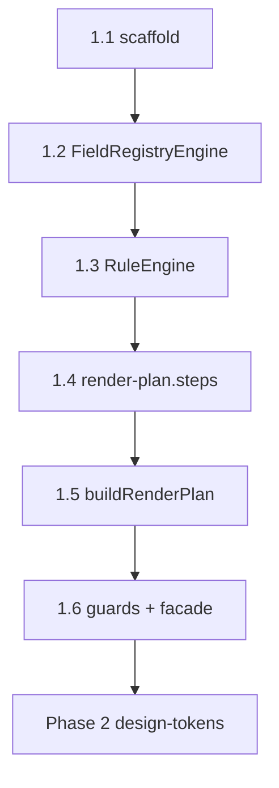

# Phase 1 — State machine & DAG

## STATE MODEL

```yaml
state_variables:
  current_phase:
    type: enum
    allowed: ["0", "1", "2", "3", "4", "5", "6", "7"]
    initial: "1"
  current_subphase:
    type: enum
    allowed: ["1.1", "1.2", "1.3", "1.4", "1.5", "1.6", "DONE"]
    initial: "1.1"
  phase_1_mode:
    type: enum
    allowed: ["headless_engine"]
    value: "headless_engine"
    meaning: "No React/DOM in platform-core; RenderPlan only"
  execution_mode:
    type: enum
    allowed: ["subphase_sequential", "gate_verify"]
    initial: subphase_sequential
  completion_state:
    type: enum
    allowed: ["IN_PROGRESS", "DONE"]
    initial: IN_PROGRESS

transition_rules:
  - from_subphase: "1.1"
    to_subphase: "1.2"
    condition: ALL exit_criteria_1_1 PASS
  - from_subphase: "1.2"
    to_subphase: "1.3"
    condition: ALL exit_criteria_1_2 PASS
  - from_subphase: "1.3"
    to_subphase: "1.4"
    condition: ALL exit_criteria_1_3 PASS
  - from_subphase: "1.4"
    to_subphase: "1.5"
    condition: ALL exit_criteria_1_4 PASS
    enforcement_note: "1.4 deliverable MUST be render-plan.steps functions — NOT StepEngine class"
  - from_subphase: "1.5"
    to_subphase: "1.6"
    condition: ALL exit_criteria_1_5 PASS
  - from_subphase: "1.6"
    to_subphase: "DONE"
    condition: ALL exit_criteria_1_6 PASS AND phase_2_entry_checklist ALL PASS
  - forbidden_transition:
      action: "start packages/design-tokens feature work"
      blocked_until: "current_subphase == DONE AND phase_2_entry_checklist ALL PASS"
  - forbidden_transition:
      action: "use PlatformWizardEngine.fromPlugin"
      blocked_always: true
      replacement: "PlatformWizardEngine.tryFromPlugin OR PlatformWizardEngine.create + tryInit/init"

forbidden_transitions:
  - action: class StepEngine in packages/platform-core/src
  - action: PlatformWizardEngine.fromPlugin
  - action: packages/design-tokens work before phase_2_entry_checklist PASS
  - action: bind g6 to report-write instead of guard:import-boundary

blocked_states:
  - state: current_subphase < 1.6 AND merge without phase-1:gate plan
  - state: g2 pass alone without g11 and g12 pass

failure_states:
  - trigger: pnpm run phase-1:gate exit non-zero
  - trigger: g11 contract rows < 14
  - trigger: g13 ratio < 0.6
  - trigger: platform-core imports workspaces/* or legacy/
```

---

## SUBPHASE DAG



```yaml
dag_edges:
  - { from: "1.1", to: "1.2" }
  - { from: "1.2", to: "1.3" }
  - { from: "1.3", to: "1.4" }
  - { from: "1.4", to: "1.5" }
  - { from: "1.5", to: "1.6" }
  - { from: "1.6", to: "Phase 2.1" }
allowed_overlap: []
forbidden_overlap:
  - action: "merge subphases 1.2–1.5 in one PR (anti-pattern A9)"
  - action: "implement apps/api or apps/web as Phase 1 scope"
  - action: "import packages/workspaces/* from platform-core"
pr_rule:
  - rule: "one subphase = one PR"
  - rule: "PR title/body MUST include label matching subphase id e.g. Phase: 1.3"
  - rule: "FORBIDDEN fast-forward multiple subphases in one merge"
subphase_1_4_naming_law:
  correct_artifact: "packages/platform-core/src/engine/render-plan.steps.ts"
  correct_tests: "packages/platform-core/test/unit/engine/render-plan.steps.spec.ts"
  forbidden_artifact: "step.engine.ts class StepEngine in src/"
  dag_label_P14: "render-plan.steps — NOT StepEngine class"
```

---

