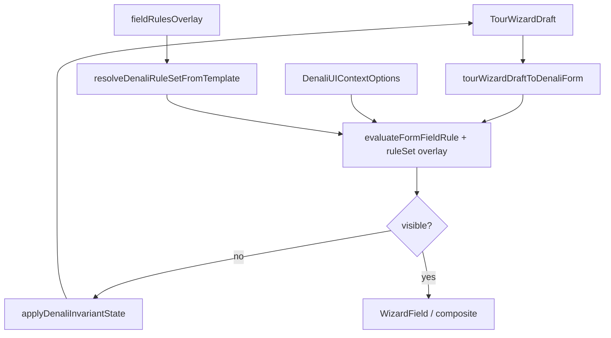

# Denali rules parity hardening (11.8)

> **DEC:** [DEC-P11-009](appendices/IMPLEMENTATION-DECISIONS.md#dec-p11-009--rules-parity-hardening-118)  
> **وضعیت:** ACCEPTED — 2026-06-10

## هدف

بستن شکاف‌های §۱۲ [`TEMP/wizard-template-settings-gaps.md`](../../TEMP/wizard-template-settings-gaps.md) **بدون تغییر semantics** قوانین domain — فقط wire، invariant engine، و parity UI.

## معماری



## تسک‌ها

| ID | موضوع | پیاده‌سازی |
| --- | ----- | ---------- |
| 11.8-T1 | Dong visibility با `allowPersonalCar` | `denali-transport-logic.ts` هم‌تراز با `isDenaliTransportDongAmountVisible` |
| 11.8-T2 | `nationalIdRequired` جدا از composite | حذف از `DENALI_COMPOSITE_DEPENDENT_PATHS` → primitive boolean |
| 11.8-T3 | `DenaliUIContextOptions` | `resolveDenaliUIContextOptions` + پاس به rule eval |
| 11.8-T4 | `destinationId` → `peakHeight` | `altitudeM` روی destinations API + prefill در `denali-destination-field` |
| 11.8-T5 | Ghost values | `applyDenaliInvariantState` روی draft push |
| 11.8-T6 | Template overlay | `resolveDenaliRuleSetFromTemplate` → `applyOverlayToRuleSet` |
| 11.8-T7 | Catalog filters | gear: `category` × tour category؛ theme: `formProfile` × workspace profile |

## Dong parity (§۱۲.۳ الف)

Domain truth (`denali-transport-rules.ts`):

```typescript
isDenaliTransportDongAmountVisible({ mode, allowPersonalCar })
// shared_cars → true
// bus|minibus|train + allowPersonalCar === true → true
```

Web composite باید همان ورودی را به UI logic بدهد — نه فقط `mode === "shared_cars"`.

## Invariant engine (§۱۲.۵)

`structuralInvariant: { kind: "clearWhenNotVisible" }` در registry روی draft push:

1. `tourWizardDraftToDenaliForm`
2. `applyDenaliStructuralInvariants` + `normalizeDenaliWizardForm`
3. `syncDenaliFormToTourWizardDraft` — مقادیر پاک‌شده به canonical draft برمی‌گردند

## Template overlay (§۱۲.۶)

`fieldRulesOverlay` از settings config:

- `parseFieldRulesOverlay` — allow-list مسیرهای settings
- `applyOverlayToRuleSet` — patch `hidden` / `required` روی matrix cells
- Conflict safeguard: `visibility: always` نمی‌تواند cell با `hidden: true` سخت matrix را باز کند

## پذیرش

- `pnpm --filter @app-tour/workspace-denali exec node --import tsx --test test/template-overlay.spec.ts`
- `cd apps/web && node --import tsx --test test/denali-transport-logic.spec.ts test/denali-wizard-conditional.spec.ts`
