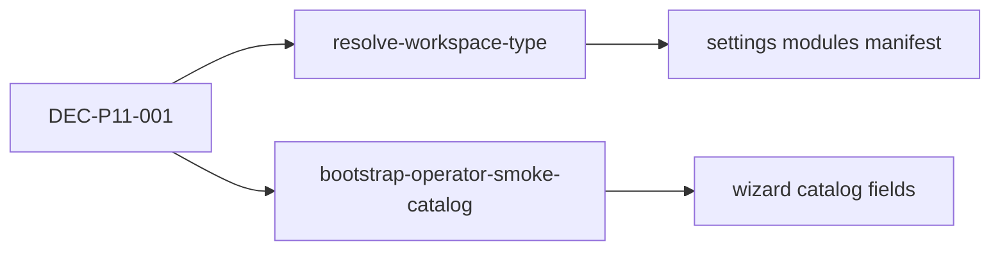

# 11.0 — Smoke workspace alignment

> **وضعیت:** DONE (2026-06-11)  
> **DEC:** [`../appendices/IMPLEMENTATION-DECISIONS.md`](../appendices/IMPLEMENTATION-DECISIONS.md) DEC-P11-001  
> **شکاف:** `TEMP/wizard-template-settings-gaps.md` §۱

## هدف

یک منبع حقیقت برای `workspaceType` tenant operator smoke (`…000014`) — API و web هر دو **denali**.

## DAG

## تسک‌ها

| ID | تسک | مسیر | پذیرش |
| --- | --- | --- | --- |
| 11.0-T1 | حذف override `starter` در smoke memory | `apps/api/src/tenant/resolve-workspace-type.ts` | `resolve-workspace-type.spec.ts` |
| 11.0-T2 | seed equipment + region/destination + tour_theme | `apps/api/src/settings/bootstrap-operator-smoke-catalog.ts` | لیست non-empty در smoke |
| 11.0-T3 | به‌روز `API-9.6-02` + SMOKE-SCENARIO-MAP | tests + docs | green |
| 11.0-T4 | بستن gaps §۱ در TEMP | `TEMP/wizard-template-settings-gaps.md` | وضعیت «بسته — 11.0» |

## رفتار پس از 11.0

| مسیر | قبل | بعد |
| ---- | --- | --- |
| `GET /settings/modules` (smoke) | account + template فقط | manifest کامل denali |
| `GET /settings/resources/equipment` | `SETTINGS_MODULE_UNKNOWN` | 200 + seeded rows |
| `/tours/new` (web) | denali wizard | بدون تغییر |
| `resolveWorkspaceTypeForTenant(…014)` | `starter` (memory) | `denali` |

## خارج از scope 11.0

- Submit canonical کامل (§۷) → 11.7  
- `formProfile` / `compatibleCategories` روی API → 11.13
