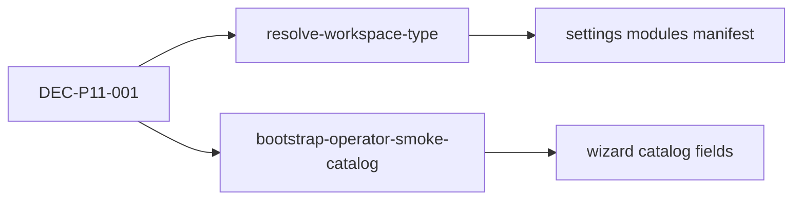

# 11.0 — Smoke workspace alignment

> **وضعیت:** DONE (2026-06-11)  
> **DEC:** [`../appendices/IMPLEMENTATION-DECISIONS.md`](../appendices/IMPLEMENTATION-DECISIONS.md) DEC-P11-001  
> **شکاف:** `TEMP/wizard-template-settings-gaps.md` §۱

## هدف

یک منبع حقیقت برای `workspaceType` tenant operator smoke (`…000014`) — API و web هر دو **denali**.

## DAG

## تسک‌ها

| ID | تسک | مسیر | پذیرش |
| --- | --- | --- | --- |
| 11.0-T1 | حذف override `starter` در smoke memory | `apps/api/src/tenant/resolve-workspace-type.ts` | `resolve-workspace-type.spec.ts` |
| 11.0-T2 | seed equipment + region/destination + tour_theme | `apps/api/src/settings/bootstrap-operator-smoke-catalog.ts` | لیست non-empty در smoke |
| 11.0-T3 | به‌روز `API-9.6-02` + SMOKE-SCENARIO-MAP | tests + docs | green |
| 11.0-T4 | بستن gaps §۱ در TEMP | `TEMP/wizard-template-settings-gaps.md` | وضعیت «بسته — 11.0» |

## رفتار پس از 11.0

| مسیر | قبل | بعد |
| ---- | --- | --- |
| `GET /settings/modules` (smoke) | account + template فقط | manifest کامل denali |
| `GET /settings/resources/equipment` | `SETTINGS_MODULE_UNKNOWN` | 200 + seeded rows |
| `/tours/new` (web) | denali wizard | بدون تغییر |
| `resolveWorkspaceTypeForTenant(…014)` | `starter` (memory) | `denali` |

## Dual-smoke isolation (SEO matrix)

When `OPERATOR_SMOKE_E2E_SEED` and `URBAN_SMOKE_E2E_SEED` run together (marketing SEO matrix), `URBAN_TEST_WORKSPACE_TYPE` must **not** force `urban` on operator tenant `…000014`. `resolveWorkspaceTypeForTenant` applies the env override only when the registered tenant is `urban` (or tenant id is urban smoke `…000004`). Otherwise registry wins — operator stays `denali`, urban stays `urban`.

`createTourStorageRepository()` (memory) seeds **both** operator and urban smoke tours into one in-memory store when both env flags are `1` — otherwise urban-only seed returns an empty denali catalog for operator tenant.

## Denali club — FA catalog display names (ED-LBL-CATALOG-01)

Operator smoke tenant `…000014` keeps English fixture names (`Smoke Trekking Poles`, `Smoke Mountain`) for SMK/e2e string stability.

Denali club / admin tenant `…000003` is an FA operator surface. Seeded catalog rows used in wizard gear + Settings → Equipment must not surface English smoke labels:

| Resource | Operator smoke (`…014`) | Denali club (`…003`) |
| --- | --- | --- |
| Equipment name | `Smoke Trekking Poles` | `عصای کوهنوردی` |
| Theme name | `Smoke Mountain` | `کوهستان` |
| Theme slug | `smoke-mountain` | `smoke-mountain` (stable id/FK) |
| Destinations / region | English smoke | already FA (`توچال` / `تهران`) |

**Idempotency:** `seedOperatorSmokeCatalog` early-returns when equipment exists, but for Denali club it still re-`seedEquipment` / `seedTourTheme` the known smoke ids so renamed FA labels apply without wiping the catalog. Prisma `seed*` paths upsert by id.

- Submit canonical کامل (§۷) → 11.7  
- `formProfile` / `compatibleCategories` روی API → 11.13
