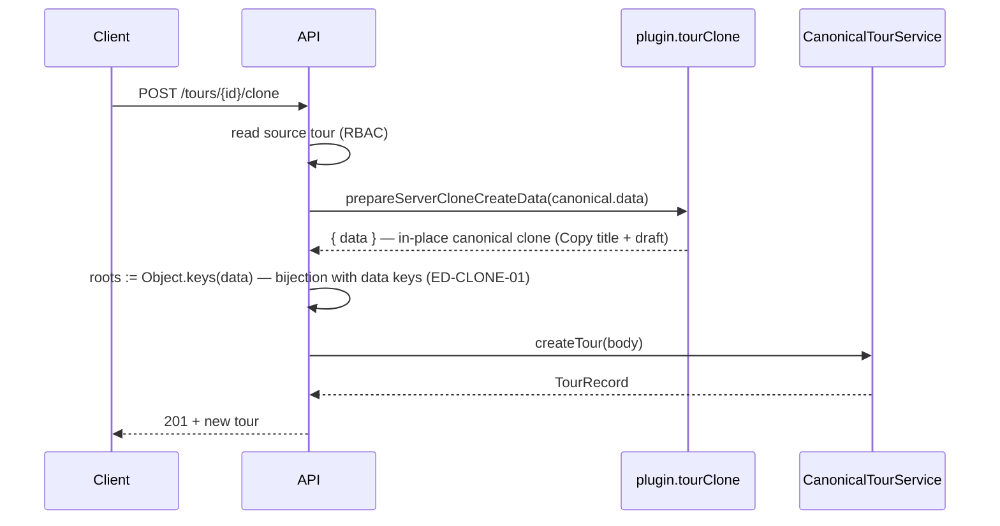

# Subphase 11.12 — Server tour clone API

> **Authority:** [`tour-clone-hydration.md`](../tour-clone-hydration.md) · **DEC-P11-010**

## Goal

Expose `POST /tours/{tourId}/clone` so operators can duplicate a tour in one round-trip without opening the wizard. Reuses the same `plugin.tourClone.hydrateWizardDraft` transform as the `?clone=` client flow (DEC-P11-007), then persists via the existing `ToursService.createTour` / canonical validation path.

## Contract

| Item | Value |
| ---- | ----- |
| Method | `POST` |
| Path | `/tours/{tourId}/clone` |
| Auth | Operator session (`requireOperatorSession`) — same as `GET /tours/{id}` |
| Body | Optional JSON: `{ "activeEquipmentIds"?: string[] }` |
| Success | `201` — `{ id, tenantId, canonical }` (same shape as `POST /tours`) |
| Source missing | `404` `TOUR_NOT_FOUND` |
| Workspace without `tourClone` | `422` `TOUR_CLONE_UNSUPPORTED` |

When `activeEquipmentIds` is omitted, the API loads equipment from the tenant settings resources repository (all catalog rows). An explicit empty array drops all gear rows (parity with client clone when catalog is empty).

## Flow

### Roots contract (ED-CLONE-01 / DEC-P11-010 addendum)

`createTour` runs `assertCanonicalDocument`: every `data` key must appear in `roots` and every root must exist in `data`.

Server clone **must not** copy `plugin.wizard.roots` onto the create body. Wizard roots include step ids (`denali_basic`, …) and omit legacy/list keys that may still appear on stored tours (e.g. `basics`). After `prepareServerCloneCreateData` / `prepareDenaliServerCloneCanonical`:

| Field | Rule |
| ----- | ---- |
| `data` | Output of workspace `prepareServerCloneCreateData` (Copy title, `publishStatus: draft`, catalog filters) |
| `roots` | Exactly `Object.keys(data)` — no extras, no omissions |

Implementation: `apps/api/src/tours/build-clone-tour-body.ts` (`resolveCanonicalRootsFromData`).

## Implementation map

| Layer | Path |
| ----- | ---- |
| Build create body | `apps/api/src/tours/build-clone-tour-body.ts` |
| Equipment ids | `apps/api/src/tours/resolve-clone-equipment-ids.ts` |
| Service | `ToursService.cloneTour` |
| Route | `handleCloneTour` in `tours.routes.ts` |
| Dispatch | `app.ts` + `dispatch-routes.ts` |

## Client parity

The wizard duplicate CTA remains `/tours/new?clone={id}` (no breaking change). Server clone is for automation, future BFF shortcuts, and integration tests — not a replacement for the review/edit step before publish.

## Deferred

- Web BFF proxy `POST /api/tours/{id}/clone`
- Marketing `spotsRemaining`

Photo remint: see [`11.13-clone-photo-remint.md`](11.13-clone-photo-remint.md).

## Acceptance

| ID | Assertion |
| -- | --------- |
| API-P11-12-01 | Denali clone returns new tour with ` (Copy)` title |
| API-P11-12-02 | Cloned tour `publishStatus` is `draft` |
| API-P11-12-03 | Unknown source → 404 |
| API-P11-12-04 | Starter tenant → 422 `TOUR_CLONE_UNSUPPORTED` |

| API-P11-12-05 | Clone body `roots` equals `Object.keys(data)` for Denali list-shaped tours that retain `basics` |

Specs: `apps/api/test/tours-clone.spec.ts` (HTTP 404/422) · `apps/api/test/clone-tour-body.spec.ts` (01–02, 05) · `packages/workspaces/denali/test/denali-tour-clone-hydration.spec.ts`
