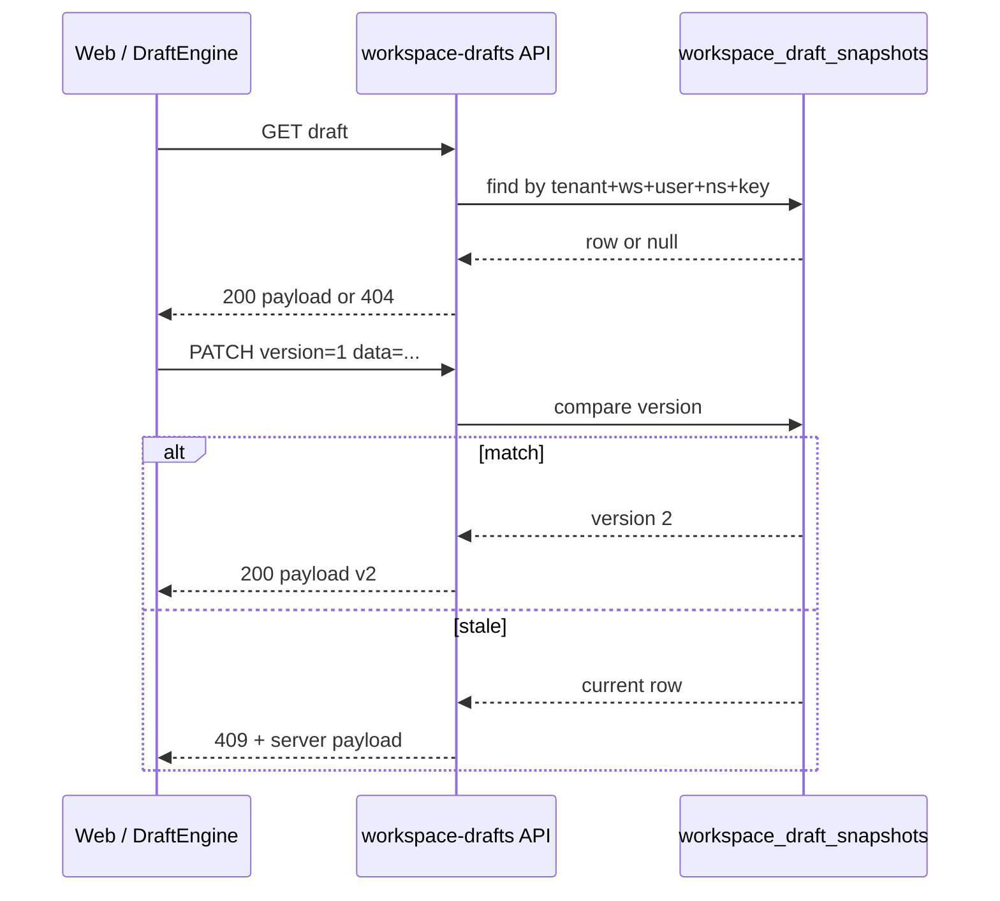

# Workspace draft persistence (Phase 11.2)

> **Authority:** `TEMP/wizard-platform-implementation-roadmap.md` §11.2  
> **Package contract:** `@app-tour/draft-engine` — `DraftSyncPayload` / OCC  
> **Decision:** [DEC-P11-003](appendices/IMPLEMENTATION-DECISIONS.md#dec-p11-003--user-scoped-draft-snapshots-112)

## Purpose

Operator forms (wizard, future settings drafts) need **durable, tenant-isolated, user-scoped** JSON snapshots with optimistic concurrency. The API stores opaque blobs; workspace packages (Denali) own schema and sanitization.

## Data model

Table `workspace_draft_snapshots`:

| Column | Type | Notes |
| ------ | ---- | ----- |
| `tenant_id` | UUID | FK → `tenants`; RLS via `app.current_tenant_id` |
| `workspace_id` | TEXT | Must match authenticated membership scope |
| `user_id` | UUID | **Per-user** draft row (T6 — two operators do not share a key) |
| `draft_namespace` | TEXT | e.g. `operator.wizard` |
| `draft_key` | TEXT | e.g. `denali-create` |
| `schema_version` | INT | Forward-compatible blob generation |
| `version` | INT | OCC counter; starts at **1** on create |
| `data` | JSONB | Opaque payload |
| `last_modified` | BIGINT | Client ms epoch from `DraftSyncPayload` |
| `updated_by_user_id` | UUID | Actor on last write |
| `updated_at` | TIMESTAMPTZ | Server audit |

**Unique key:** `(tenant_id, workspace_id, user_id, draft_namespace, draft_key)`

**Index:** `(tenant_id, workspace_id, user_id)` for future list API (11.2-T7 deferred to 11.9).

## HTTP contract

Base path (operator session required):

```http
GET    /workspaces/{workspaceId}/drafts
GET    /workspaces/{workspaceId}/drafts/{namespace}/{key}
PATCH  /workspaces/{workspaceId}/drafts/{namespace}/{key}
DELETE /workspaces/{workspaceId}/drafts/{namespace}/{key}
```

### List index (11.9)

`GET /workspaces/{workspaceId}/drafts` returns metadata rows for the **authenticated user** in that workspace. Payload blobs are omitted.

| Query | Effect |
| ----- | ------ |
| _(none)_ | All namespaces for user + workspace |
| `namespace=operator.wizard` | Filter to one namespace |

```json
{
  "items": [
    {
      "draftNamespace": "operator.wizard",
      "draftKey": "denali-create",
      "version": 2,
      "schemaVersion": 1,
      "lastModified": 1718000000100,
      "updatedAt": "2026-06-10T12:00:00.000Z"
    }
  ]
}
```

Rows sort by `updatedAt` descending. Missing drafts → `200` with `"items": []`.

### Auth & scope

1. `requireOperatorSession` — JWT cookie or dev/test headers.
2. `runWithHttpRequestContext` — tenant ALS + rate limit.
3. `workspaceScopeMatches(auth, tenantId, workspaceId)` — path `workspaceId` must match `auth.workspaceId` when bound.

### Response shape (GET / PATCH success)

Matches `DraftSyncPayload`:

```json
{
  "data": {},
  "version": 1,
  "schemaVersion": 1,
  "lastModified": 1718000000000
}
```

### PATCH body

Same fields as `DraftSyncPayload`. Client sends **current** `version` before write; server persists `version + 1`.

| Server state | Client `version` | Result |
| ------------ | ---------------- | ------ |
| no row | `0` | create → `version: 1` |
| no row | `> 0` | `409 DRAFT_VERSION_CONFLICT` |
| row `N` | `N` | update → `N + 1` |
| row `N` | `≠ N` | `409` + server payload in body |

### 409 conflict body

```json
{
  "error": "DRAFT_VERSION_CONFLICT",
  "code": "DRAFT_VERSION_CONFLICT",
  "data": {},
  "version": 2,
  "schemaVersion": 1,
  "lastModified": 1718000001000
}
```

Web BFF (11.3) maps this to `DraftConflictError` for `REFETCH_REAPPLY`.

### DELETE

- `204` when row removed.
- `404` when no row (idempotent clear from UI may treat as success in 11.3).

## Repository layer

`apps/api/src/workspace-drafts/`:

- `create-workspace-drafts-repository.ts` — memory vs prisma (`STORAGE_DRIVER`)
- `in-memory-workspace-drafts.repository.ts` — tests / dev memory
- `prisma-workspace-drafts.repository.ts` — `withTenantRls` transactions
- `workspace-drafts.service.ts` — OCC rules, scope guard
- `workspace-drafts.routes.ts` — HTTP handlers

## OCC flow (with draft-engine)



## Draft events audit stream (11.9-T5)

Append-only table `workspace_draft_events` — one row per successful mutation:

| `action` | Trigger |
| -------- | ------- |
| `created` | PATCH `version: 0` → new row |
| `updated` | PATCH matching version → increment |
| `deleted` | DELETE removed row |
| `tombstone_violation` | PATCH rejected by envelope tombstone gate (Phase 6) |

```http
GET /workspaces/{workspaceId}/drafts/{namespace}/{key}/events?limit=50
```

Response:

```json
{
  "items": [
    {
      "id": "uuid",
      "action": "updated",
      "version": 2,
      "schemaVersion": 1,
      "actorUserId": "uuid",
      "occurredAt": "2026-06-11T13:00:00.000Z"
    }
  ]
}
```

Events are scoped to the authenticated user (same composite key as snapshots). Default `limit` 50, max 100.

Web BFF: `GET /api/workspaces/{workspaceId}/drafts/{namespace}/{key}/events` — client `fetchWorkspaceDraftEvents`.

## Envelope tombstone invariants (Phase 6 — G-API-04)

For allowlisted namespaces (`operator.wizard`), PATCH validates **structural** tombstone rules only — no Denali Zod or workspace imports in `@apps/api`.

Module: `apps/api/src/workspace-drafts/invariants/envelope-tombstone-invariants.ts`

| Check | Condition | HTTP |
| ----- | --------- | ---- |
| Pass-through | `data` is not `{ form: { data: object }, meta: object }` | persist opaque blob |
| Pass-through | `meta.deletedRoots` absent | persist |
| `DELETED_ROOTS_NOT_ARRAY` | `deletedRoots` present but not `string[]` | `400` |
| `TOMBSTONE_RESURRECTION` | any `root ∈ deletedRoots` is an own key of `form.data` | `400` + `keys` |

```json
{
  "error": "tombstone_invariant_violation",
  "code": "TOMBSTONE_RESURRECTION",
  "keys": ["timetable"]
}
```

Rejected PATCH emits audit event `tombstone_violation` (no snapshot version increment). Successful PATCH flow unchanged.

Other namespaces remain fully opaque until explicitly allowlisted via `ENVELOPE_TOMBSTONE_PATCH_NAMESPACES`.

## Out of scope (later subphases)

- Web list BFF + draft index summary UI → **11.9-T6** ✅
- Web hook `useWorkspaceDraft` → **11.3** ✅
- Denali sanitize on write → **11.5** (API stays opaque)

## Verification

- `apps/api/test/workspace-drafts.spec.ts` — create → patch → conflict → delete · list index (API-P11-9-01…04) · events audit (API-P11-9-05…08)
- `apps/api/test/workspace-draft-tombstone-invariants.spec.ts` — structural tombstone gate (API-P11-TOMB-01…03, API-P11-GEN-01)
- Memory driver default in unit tests; prisma path covered by repository contract
