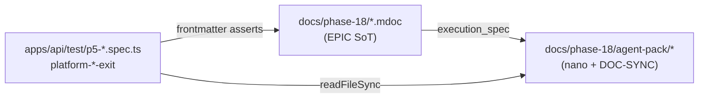

# Phase 18 — Enterprise evolution (P5)

Platform metadata production pilot + Denali operator parity on metadata path.

## Agent-pack authority (PSR-2c promotion)

| Field | Value |
| --- | --- |
| Canonical sync | [`agent-pack/DOC-SYNC-INDEX.md`](./agent-pack/DOC-SYNC-INDEX.md) |
| Integrity specs | `apps/api/test/p5-doc-integrity.spec.ts` · `p5-anti-drift-contract.spec.ts` · `p5-preservation-gate.spec.ts` · `platform-*-exit.spec.ts` |
| Promoted from | git-history `TEMP/p5/**` (local scratch; **not** present on fresh clones) |
| Why | Exit/integrity gates opened `TEMP/p5/*` → `ENOENT` on CI after TEMP was dropped from the branch |
| Rule | Do **not** reintroduce repo-root `TEMP/` for CI green — keep nano specs under `docs/phase-18/agent-pack/` |

Logic: Markdoc under `docs/phase-18/*.mdoc` remains EPIC SoT (`doc_role: architecture_sot`). The agent pack holds frozen nano specs, DOC-SYNC fields, Path A/B exit checklist, anti-drift catalog, and preservation PC-01..10 — the same bytes formerly staged under `TEMP/`, now clone-addressable.

| Doc | EPIC | Required | execution_spec |
|-----|------|----------|----------------|
| [platform-metadata-cutover-pilot.mdoc](./platform-metadata-cutover-pilot.mdoc) | P5-A | ✅ | [agent-pack/p5-a-cutover-pilot.md](./agent-pack/p5-a-cutover-pilot.md) |
| [platform-denali-operator-parity.mdoc](./platform-denali-operator-parity.mdoc) | P5-B | ✅ | [agent-pack/p5-b-denali-operator-parity.md](./agent-pack/p5-b-denali-operator-parity.md) |
| [platform-workspace-commerce.mdoc](./platform-workspace-commerce.mdoc) | P5-C | optional | [agent-pack/p5-c-workspace-commerce-config.md](./agent-pack/p5-c-workspace-commerce-config.md) |
| [platform-integrations-plane.mdoc](./platform-integrations-plane.mdoc) | P5-D | optional | [agent-pack/p5-d-integrations-plane.md](./agent-pack/p5-d-integrations-plane.md) |
| [platform-registrations-finance-tranche.mdoc](./platform-registrations-finance-tranche.mdoc) | P5-E | optional | [agent-pack/p5-e-registrations-finance.md](./agent-pack/p5-e-registrations-finance.md) |

**Execution entry:** [`agent-pack/AGENT-START.md`](./agent-pack/AGENT-START.md) · **Preservation:** [`agent-pack/PRESERVATION-CHECKLIST.md`](./agent-pack/PRESERVATION-CHECKLIST.md) · **Exit Path A/B:** [`agent-pack/p5-exit-checklist.md`](./agent-pack/p5-exit-checklist.md)
